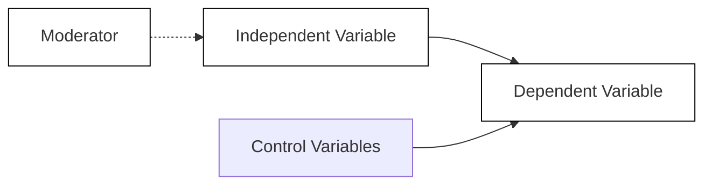

# Academic Conceptual Model Diagram

Generate publication-ready conceptual framework diagrams that meet Scopus/WOS journal standards. Produces clean box-and-arrow diagrams showing variable relationships with proper academic formatting.

## Core Design Principles

Academic conceptual models follow strict visual conventions:

- **Monochrome only** -- Black boxes/text on white background, no colors (journals print in grayscale)
- **Box-based structure** -- Each variable in a rectangular box with clear labels
- **Directional arrows** -- Show causal or predictive relationships between variables
- **Clear hierarchy** -- Independent variables → Moderators → Dependent variables → Outcomes
- **Minimal decoration** -- No shadows, gradients, or ornamental elements
- **Figure caption + source** -- Always include "Figure X: [Title]" and "Source: Author's own elaboration" below

## Variable Types and Visual Representation

### Independent Variables (IV)
Left side of diagram. Boxes containing predictor variables. Arrows flow rightward toward dependent variables.

### Dependent Variables (DV)
Right side of diagram. Outcome variables. Receive arrows from IVs.

### Moderating Variables
Positioned above or below the main IV→DV relationship arrow. Arrow from moderator points to the relationship line itself (not directly to DV). This shows the moderator affects the strength/direction of the IV-DV relationship.

**Critical distinction:** Moderator arrow targets the *relationship arrow*, not the dependent variable box.

### Mediating Variables (if applicable)
Positioned between IV and DV in a chain: IV → Mediator → DV. The mediator explains *how* or *why* the effect occurs.

### Control Variables
Typically shown in a separate box or list, often at the bottom. Arrows point to the DV. These are held constant but not the focus of the study.

Common controls: age, gender, firm size, industry, education level, experience, socioeconomic status.

## Standard Layouts

### Simple Direct Relationship
```
[Independent Variable] ----→ [Dependent Variable]
```

### Moderation Model (Most Common)
```
                    [Moderator]
                         |
                         ↓
[Independent Variable] --⊗-→ [Dependent Variable]

(The ⊗ or intersection symbol shows moderation effect)
```

### Multiple IVs with Moderation
```
[IV 1] ────┐
           │      [Moderator]
[IV 2] ────┼──────────⊗────→ [Dependent Variable]
           │          
[IV 3] ────┘

Control Variables: Age, Gender, Firm Size
```

### Complex Model (IV → Mediator → DV with Moderation)
```
                         [Moderator]
                              |
                              ↓
[Independent Var] ----→ [Mediator] --⊗-→ [Dependent Var]
```

## Implementation in Claude Artifacts

When generating with code (Python, JavaScript, HTML/SVG, Mermaid), follow these technical guidelines:

**Python (matplotlib/networkx):**
- Use `plt.figure(figsize=(12, 8), facecolor='white')`
- Boxes: `patches.FancyBboxPatch` with white fill, black edge
- Arrows: `patches.FancyArrowPatch` with `arrowstyle='->'`
- Font: Arial or Times, 11-12pt
- No grid, no axis ticks

**HTML/SVG:**
- `<rect>` for boxes with `stroke="black" fill="white" stroke-width="2"`
- `<path>` or `<line>` with `marker-end="url(#arrowhead)"` for arrows
- `<text>` with `font-family="Arial" font-size="14"`

**Mermaid (simplest for quick diagrams):**


## Figure Caption Format

Always include below the diagram:

```
Figure 1: Conceptual Framework of [Research Topic]
Source: Author's own elaboration based on [Theory/Literature]
```

Or if adapting existing work:
```
Figure 1: Research Model of Internationalization and Firm Performance
Source: Adapted from Smith & Jones (2023)
```

## Example: Internationalization and Firm Performance

For the user's specific case (Internationalization → Firm Performance with moderator and controls):

**Structure:**
- IV: Internationalization (degree, scope, or strategy)
- DV: Firm Performance (financial, operational, or market performance)
- Moderator: [User should specify -- e.g., Firm Size, Innovation Capacity, Market Dynamism]
- Controls: Industry, Firm Age, Geographic Region

**Layout:**
```
                    [Moderating Variable]
                            |
                            ↓
[Internationalization] -----⊗----→ [Firm Performance]


Control Variables: Industry Type, Firm Age, Geographic Region

Figure 1: Conceptual Model of Internationalization Effects on Firm Performance
Source: Author's own elaboration
```

## Quality Checklist

Before finalizing:

- [ ] All boxes clearly labeled with variable names
- [ ] Arrows show correct directionality (cause → effect)
- [ ] Moderator arrow points to *relationship*, not directly to DV
- [ ] Control variables listed separately or shown with distinct styling
- [ ] Monochrome only (no colors)
- [ ] Clean, professional appearance (no decorative elements)
- [ ] Figure number and caption below diagram
- [ ] Source attribution included
- [ ] Font size readable (11-14pt)
- [ ] Sufficient spacing between elements (not cramped)

## When to Use Each Tool

- **Python (matplotlib):** Complex multi-level models, publication-quality output, need precise control
- **HTML/SVG:** Interactive diagrams, web-based presentations, need to embed in websites
- **Mermaid:** Quick drafts, simple models, rapid iteration
- **Draw.io/Lucidchart export:** When user prefers to edit manually afterward

## Common Mistakes to Avoid

1. **Moderator arrow points to DV box** -- Should point to the IV→DV relationship line
2. **Using colors** -- Journals print in grayscale; colors become indistinguishable
3. **Missing control variables** -- Always acknowledge what you're controlling for
4. **Unclear arrow direction** -- Use clear arrowheads, not ambiguous lines
5. **Inconsistent box sizes** -- Keep boxes uniform unless emphasizing hierarchy
6. **Forgetting figure caption** -- Required for all academic figures
7. **Overcomplicated** -- If the diagram needs explanation, simplify it

## Adaptation for Vietnamese Research Context

The user writes in Vietnamese. When they request diagrams:
- Variable labels can be in Vietnamese or English (ask preference)
- Figure caption typically in Vietnamese: "Hình 1: Mô hình khái niệm..."
- Source line: "Nguồn: Tác giả tự xây dựng" or "Nguồn: Điều chỉnh từ..."
- All other principles remain the same

## Output Workflow

1. **Clarify variables** -- Ask user to specify all IVs, DVs, moderators, and controls if not explicit
2. **Choose tool** -- Default to Python for publication-ready quality
3. **Generate diagram** -- Clean, monochrome, proper spacing
4. **Add caption** -- Figure number, title, source
5. **Offer refinements** -- "Would you like to adjust variable positions, add more relationships, or change labels?"

The goal is a diagram ready to paste into a dissertation, journal submission, or conference presentation without further editing.