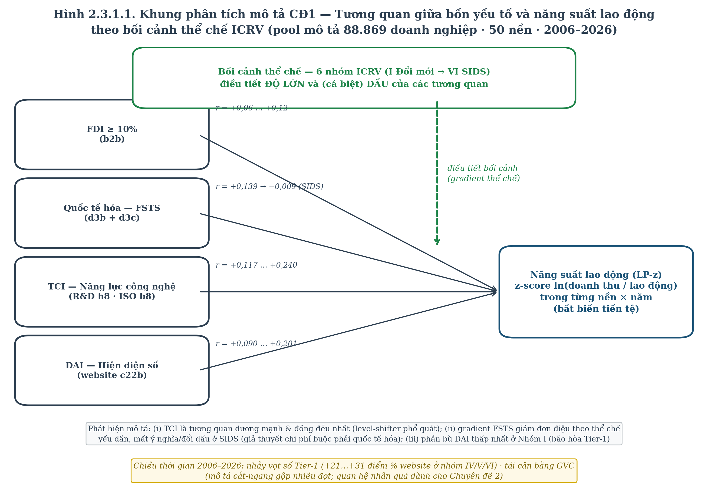
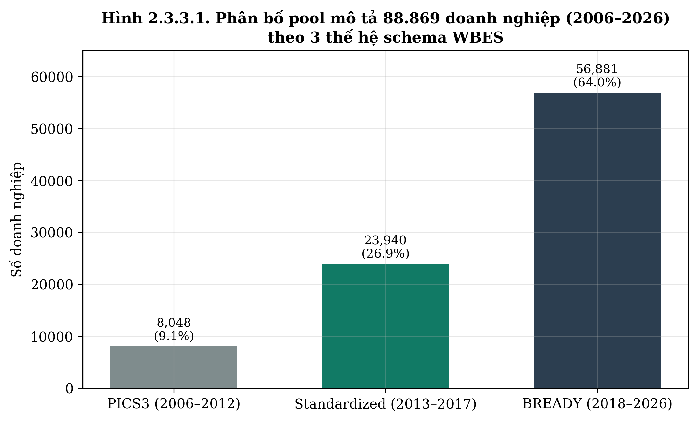
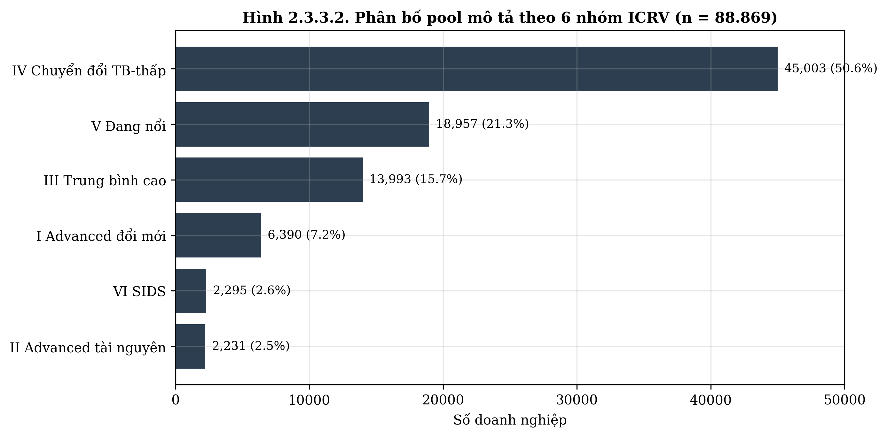
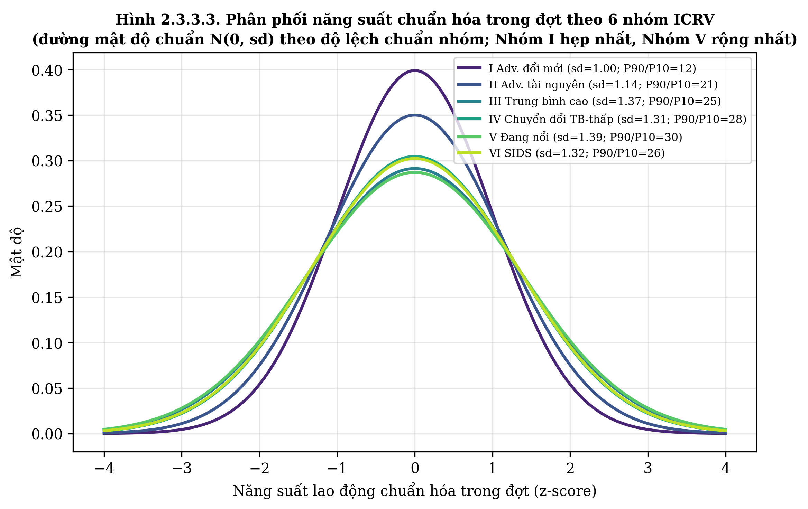
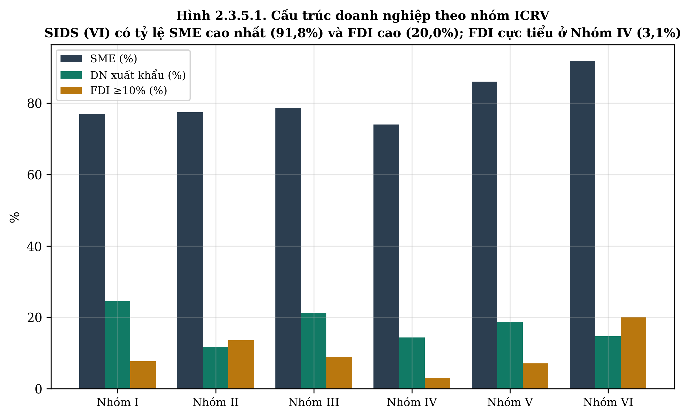
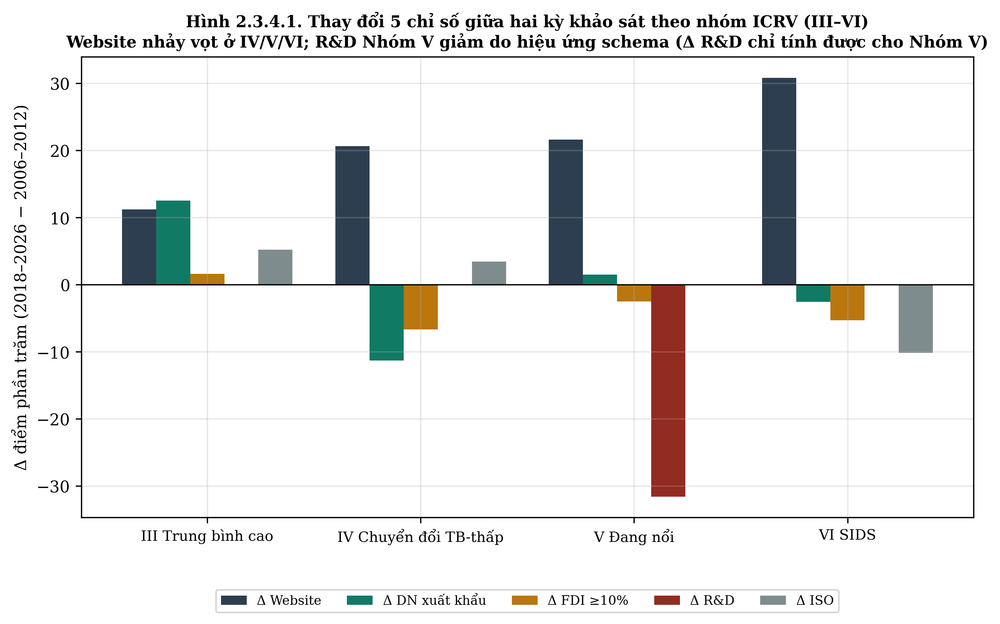
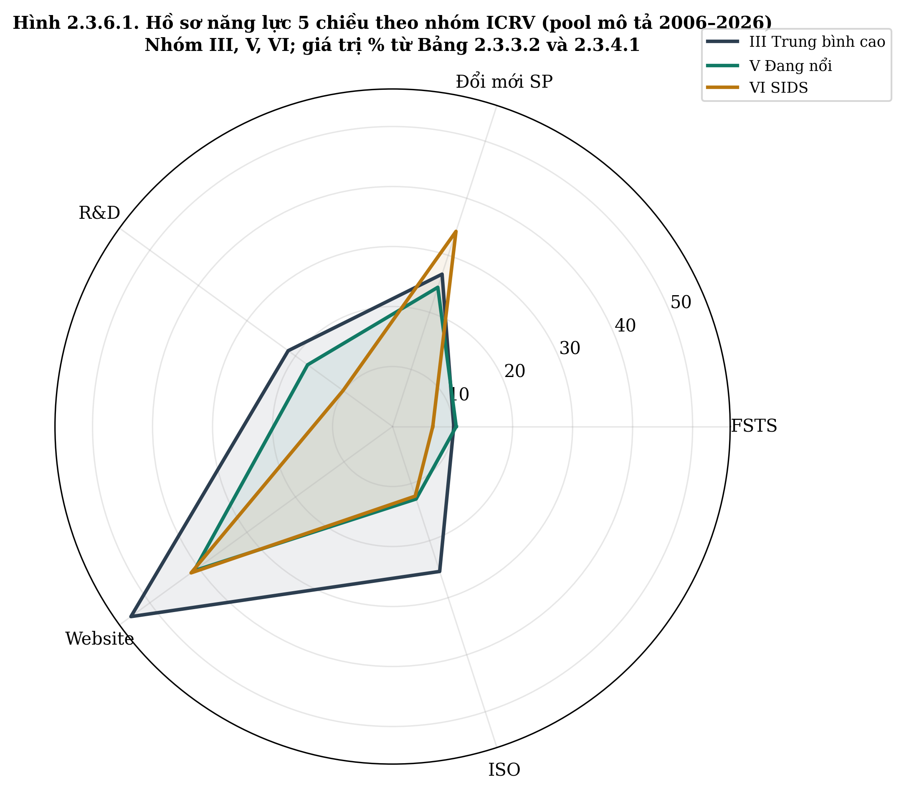
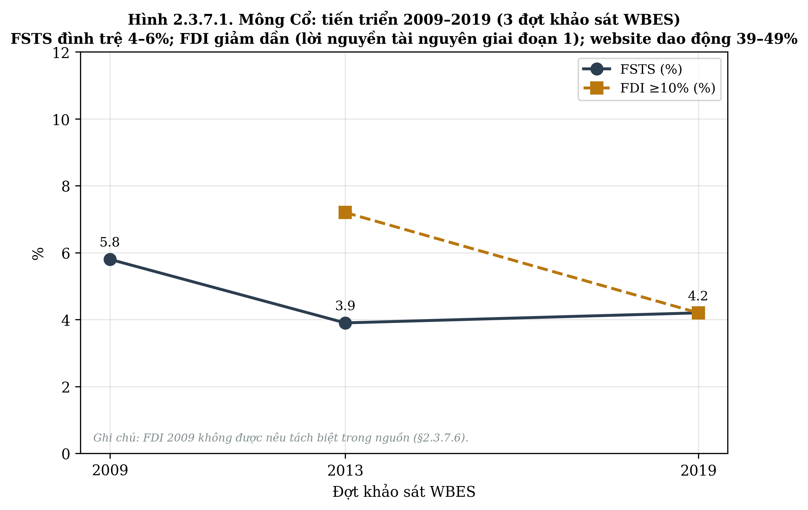

```{=latex}
\thispagestyle{empty}
\begin{center}
{\fontsize{14}{18}\selectfont\bfseries BỘ GIÁO DỤC VÀ ĐÀO TẠO\\TRƯỜNG ĐẠI HỌC CẦN THƠ\\TRƯỜNG KINH TẾ}

\vspace{1.8cm}
{\fontsize{14}{18}\selectfont\bfseries ĐỖ THÙY HƯƠNG}

{\fontsize{13}{17}\selectfont MÃ SỐ NGHIÊN CỨU SINH: P1323001}

\vspace{1.6cm}
{\fontsize{14}{18}\selectfont\bfseries CHUYÊN ĐỀ TIẾN SĨ SỐ 1}

\vspace{0.7cm}
{\fontsize{18}{24}\selectfont\bfseries THỰC TRẠNG VỀ HIỆU QUẢ HOẠT ĐỘNG\\KINH DOANH CỦA CÁC DOANH NGHIỆP Ở CHÂU Á}

\vspace{1.6cm}
{\fontsize{14}{18}\selectfont\bfseries NGÀNH QUẢN TRỊ KINH DOANH}

{\fontsize{14}{18}\selectfont\bfseries MÃ NGÀNH: 9340101}

\vspace{1.2cm}
{\fontsize{13}{17}\selectfont\bfseries NGƯỜI HƯỚNG DẪN KHOA HỌC}

{\fontsize{13}{17}\selectfont\bfseries TS. NGUYỄN MINH CẢNH}

\vspace{1.4cm}
{\fontsize{14}{18}\selectfont\bfseries CẦN THƠ, NĂM 2026}
\end{center}
\newpage
```

## LỜI CAM ĐOAN

Tôi xin cam đoan chuyên đề tiến sĩ số 1 với tiêu đề "Thực trạng về hiệu quả hoạt động kinh doanh của các doanh nghiệp ở Châu Á" là công trình nghiên cứu của riêng tôi dưới sự hướng dẫn khoa học của TS. Nguyễn Minh Cảnh, Trường Đại học Cần Thơ. Các kết quả phân tích, số liệu, bảng biểu, hình vẽ trình bày trong chuyên đề đều trung thực, có nguồn gốc rõ ràng. Tài liệu tham khảo được trích dẫn theo chuẩn APA 7th. Những trích dẫn từ các nghiên cứu khác đều được nêu rõ trong danh mục tài liệu tham khảo. Tôi xin chịu trách nhiệm hoàn toàn về nội dung khoa học của chuyên đề này.

*Cần Thơ, ngày … tháng … năm 2026*

*Nghiên cứu sinh*

**Đỗ Thùy Hương**

---

## TÓM TẮT

Chuyên đề này thực hiện phân tích mô tả – chẩn đoán thực trạng hiệu quả hoạt động kinh doanh của doanh nghiệp ở **các nền kinh tế châu Á (phạm vi chính)** trong giai đoạn **2006–2026**, mở rộng so sánh với các quốc đảo nhỏ đang phát triển (SIDS) Thái Bình Dương như trường hợp biên. Phạm vi không gian gồm **50 nền kinh tế** (gồm Nhật Bản, lần đầu được WBES khảo sát năm 2025), phân thành 6 nhóm theo khung Biến thiên chế độ bối cảnh thể chế (ICRV): Advanced đổi mới sáng tạo dẫn dắt, Advanced tài nguyên dẫn dắt, trung bình cao, chuyển đổi thu nhập trung bình–thấp, đang nổi, và SIDS Thái Bình Dương (trường hợp biên mở rộng). Phần phân tích mô tả (Bảng 2.3.3–2.3.8) được tính trực tiếp từ dữ liệu vi mô World Bank Enterprise Surveys (WBES) trên **mẫu gộp mô tả gồm 88.869 doanh nghiệp, 103 cặp nền kinh tế × năm**, kế thừa và mở rộng từ mẫu gộp 17 nền châu Á mới nổi (~40.633 doanh nghiệp) đã được tác giả công bố trước đó (Đỗ & Phan, 2026, VEFR). Khung phân loại thống nhất với bộ dữ liệu ước lượng của luận án (khung phân tích 88.869 doanh nghiệp / 50 nền, gồm Nhật Bản; mẫu gộp phân loại 96.415 doanh nghiệp / 52 nền).

> *Ghi chú dữ liệu: Chuyên đề sử dụng hai khung dữ liệu bổ trợ, thống nhất về danh sách 50 nền kinh tế và nhãn nhóm ICRV. (i) **Mẫu gộp mô tả** phục vụ toàn bộ thống kê Mục 2.3.3–2.3.8: 88.869 doanh nghiệp, 103 cặp nền kinh tế × năm (2006–2026), tính trực tiếp từ tệp vi mô WBES, mỗi cặp nền kinh tế × năm lấy đúng một cross-section chuẩn (loại các điều tra phi chính thức, siêu nhỏ và panel mở rộng), chỉ nhận các đợt khảo sát từ 2006 trở đi khi WBES áp dụng bộ câu hỏi so sánh được toàn cầu. Mẫu gộp này chứa đầy đủ các biến mô tả (R&D, ISO, đổi mới, tham nhũng, giới) vốn không thuộc tập biến ước lượng. (ii) **Khung ước lượng** của luận án và Chuyên đề 2: 88.869 doanh nghiệp / 50 nền (gồm Nhật Bản; mẫu gộp phân loại 96.415 / 52 nền), được hợp nhất và hài hòa hóa theo quy trình tại Phụ lục A của luận án, mọi kết quả kinh tế lượng được dẫn chiếu theo khung này; hồi quy toàn mẫu P7 chạy với M2 N=81.022 và M5 N=79.080. Sau khi đã chạy vòng tái ước lượng 50 nền gồm Nhật Bản, mô tả và ước lượng nay dùng chung MỘT khung 50 nền. Trường hợp biên SIDS: Nhóm VI gồm 8 nền (7 Pacific + Timor-Leste); mẫu chính của nghiên cứu SIDS là 7 nền Pacific.*


Phương pháp chủ đạo là thống kê mô tả đa chiều, kết hợp đồ thị, bảng so sánh xuyên quốc gia – xuyên ngành và phân tích hai biến. Hiệu quả hoạt động kinh doanh được tiếp cận theo bốn chiều: năng suất lao động, lợi nhuận và biên lợi nhuận, tăng trưởng, đổi mới sáng tạo và cấu trúc doanh nghiệp.

Kết quả cho thấy hiệu quả doanh nghiệp châu Á có **phân tán lớn và không hội tụ**. Bảy trường hợp điển hình tồn tại đồng thời (Singapore – Vùng Vịnh Saudi/Qatar/Kuwait – Việt Nam – Trung Quốc – Emerging Asia – Mongolia – SIDS Thái Bình Dương) với điểm mạnh hiệu quả khác nhau. Chuyên đề phát hiện **phân nhóm con Advanced** (innovation-driven so với resource-driven) và xác nhận khuôn mẫu **chi phí buộc phải quốc tế hóa** ở 7 SIDS Thái Bình Dương, đóng góp định hướng cho luận án và Chuyên đề tiến sĩ số 2.

**Từ khóa**: hiệu quả doanh nghiệp; châu Á; WBES; thực trạng; năng suất lao động; doanh nghiệp vừa và nhỏ; phân nhóm con Advanced; SIDS Thái Bình Dương.

---

## ABSTRACT

This specialty essay conducts a descriptive-diagnostic analysis of the firm performance landscape across **Asian economies (primary scope)** during **2006–2026**, with comparative extension to Pacific SIDS as a boundary case. The spatial scope covers **50 economies** (including Japan, surveyed by WBES for the first time in 2025), classified into six sub-regimes of ICRV (Institutional Context Regime Variation): Advanced innovation-driven, Advanced resource-driven, Upper-middle, Lower-middle transition, Emerging, and Pacific SIDS (boundary case extension). The descriptive analysis (Tables 2.3.3–2.3.8) is computed directly from World Bank Enterprise Surveys (WBES) micro-data over a descriptive pool of **88,869 firms, 103 economy-year pairs** (one standard cross-section per economy-year, waves from 2006 onward), building on and extending the 17-economy pool of emerging Asia (~40,633 firms) previously published by the author (Do & Phan, 2026, VEFR). The classification is identical to the dissertation's estimation dataset (analytic frame 88,869 firms / 50 economies, including Japan; classification pool 96,415 firms / 52 economies).

Adopting multidimensional descriptive statistics, charts, cross-country–cross-industry comparison tables and bivariate analyses, the study examines firm performance along four axes: labor productivity, profitability and margins, growth, and innovation and structural composition. Findings indicate substantial and persistent dispersion in firm performance across Asian economies with no convergence pattern; six salient archetypes (Singapore, Saudi/Qatar/Kuwait, Vietnam, China, broader Emerging Asia, Mongolia, primary scope) plus Pacific SIDS as boundary case coexist with distinct performance strengths; bivariate correlations vary in sign and magnitude across regimes, suggesting nonlinear and moderation models. The essay identifies a sub-grouping of the Advanced regime (innovation- vs resource-driven) within primary Asian scope and confirms the forced internationalization penalty pattern in 7 Pacific SIDS boundary case.

**Keywords**: firm performance; Asia; WBES; landscape; labor productivity; SMEs; Advanced sub-grouping; Pacific SIDS boundary case.

---

```{=latex}
\renewcommand{\contentsname}{MỤC LỤC}
\setcounter{tocdepth}{3}
\tableofcontents
```

## DANH MỤC BẢNG

| Bảng | Tiêu đề | Trang |
|---|---|---|
| Bảng 2.3.1.1 | Ma trận đối chiếu 3 trạng thái U-curve theo 3 điều kiện cấu trúc | 2.3 |
| Bảng 2.3.2.1 | 50 nền kinh tế phân theo 6 nhóm ICRV | 2.3 |
| Bảng 2.3.2.2 | Đặc điểm các nhóm ICRV (tiêu chí + đại diện + khuôn mẫu dự kiến) | 2.3 |
| Bảng 2.3.3.1 | Phân tán năng suất lao động trong từng đợt khảo sát theo nhóm ICRV | 2.3 |
| Bảng 2.3.3.2 | FSTS, doanh nghiệp xuất khẩu và CAGR việc làm theo phân nhóm con | 2.3 |
| Bảng 2.3.4.1 | Đổi mới sáng tạo và áp dụng số (%) | 2.3 |
| Bảng 2.3.4.2 | Khung 5 lĩnh vực chỉ số WBES | 2.3 |
| Bảng 2.3.5.1 | Cấu trúc doanh nghiệp theo phân nhóm con (%) | 2.3 |
| Bảng 2.3.5.2 | Bốn rào cản hàng đầu Asia-Pacific WBES | 2.3 |
| Bảng 2.3.6.1 | Thay đổi theo thời gian: Δ điểm phần trăm 2018–2026 so với 2006–2012 | 2.3 |
| Bảng 2.3.6.2 | Phân biệt 3 chỉ số tham nhũng WBES: Bribery vs Graft | 2.3 |
| Bảng 2.3.6.3 | Khung phân loại 9 ngành ISIC Rev. 4 | 2.3 |
| Bảng 2.3.6.4 | Dị biệt nội bộ khối châu Á mới nổi (7 nền Nhóm IV–V) | 2.3 |
| Bảng 2.3.6.5 | 13 nền kinh tế trong đợt khảo sát 2025 | 2.3 |
| Bảng 2.3.7.1 | Ma trận so sánh đa chiều bảy trường hợp điển hình | 2.3 |
| Bảng 2.3.8.1 | Hệ số tương quan Pearson theo 6 nhóm ICRV (mẫu gộp mô tả 50 nền) | 2.3 |
| Bảng 2.3.8.2 | Khuôn mẫu giới tính trong lãnh đạo cấp cao và sở hữu, phân tầng theo khu vực | 2.3 |

---

## DANH MỤC HÌNH

| Hình | Tiêu đề | Trang |
|---|---|---|
| Hình 2.3.1.1 | Khung phân tích mô tả CĐ1 — tương quan giữa bốn yếu tố và năng suất lao động theo bối cảnh thể chế ICRV | 2.3 |
| Hình 2.3.3.1 | Phân bố mẫu gộp mô tả 88.869 doanh nghiệp (2006–2026) theo 3 thế hệ schema WBES | 2.3 |
| Hình 2.3.3.2 | Phân bố mẫu gộp mô tả theo 6 nhóm ICRV (n=88.869 doanh nghiệp) | 2.3 |
| Hình 2.3.3.3 | Phân phối năng suất chuẩn hóa trong đợt theo 6 nhóm ICRV (kernel density) | 2.3 |
| Hình 2.3.4.1 | Slope chart 2006–2012 vs 2018–2026 (Δ điểm phần trăm theo nhóm ICRV) | 2.3 |
| Hình 2.3.5.1 | Phân phối quy mô doanh nghiệp theo nhóm ICRV (n=88.869) | 2.3 |
| Hình 2.3.6.1 | Spider chart 5 chiều × 2 mốc thời gian (Advanced, Emerging, SIDS) | 2.3 |
| Hình 2.3.7.1 | Mông Cổ: tiến triển 2009–2019 (3 đợt khảo sát WBES) | 2.3 |

---

## DANH MỤC TỪ VIẾT TẮT

| Từ viết tắt | Tiếng Anh | Tiếng Việt |
|---|---|---|
| ADB | Asian Development Bank | Ngân hàng Phát triển Châu Á |
| AIPI | AI Productivity Impact | Tác động năng suất của AI |
| ASEAN | Association of Southeast Asian Nations | Hiệp hội các quốc gia Đông Nam Á |
| BEE | Business Environment and Enterprise | (giữ nguyên thuật ngữ) |
| BREADY | WBES 2018+ schema | Thế hệ bảng hỏi WBES mới từ 2018 |
| CAGR | Compound Annual Growth Rate | Tốc độ tăng trưởng hàng năm kép |
| CDCM | Context-Contingent Digital-and-Capability Model | Mô hình Áp dụng số và Năng lực phụ thuộc bối cảnh |
| CĐ1 | Chuyên đề tiến sĩ số 1 | Specialty Essay 1 |
| CĐ2 | Chuyên đề tiến sĩ số 2 | Specialty Essay 2 |
| CIEM | Central Institute for Economic Management | Viện Nghiên cứu Quản lý Kinh tế Trung ương |
| CRM | Customer Relationship Management | Quản lý quan hệ khách hàng |
| DAI | Digital Adoption Index | Chỉ số áp dụng số |
| DAI (Tier-1) | Website binary | Sự hiện diện số cơ bản |
| DAI (Tier-2) | Website + e-payment composite | Chuyển đổi số cơ bản |
| DPL | Digital Paradox Lifecycle | Vòng đời nghịch lý số |
| EAP | East Asia and Pacific | Đông Á và Thái Bình Dương |
| ECA | Europe and Central Asia | Châu Âu và Trung Á |
| ERP | Enterprise Resource Planning | Hoạch định nguồn lực doanh nghiệp |
| FDA | Foundational Digital Adoption | Áp dụng số nền tảng |
| FDI | Foreign Direct Investment | Đầu tư trực tiếp nước ngoài |
| FSTS | Foreign Trade Sales to Total Sales | Tỷ lệ doanh thu xuất khẩu trên tổng doanh thu |
| GCC | Gulf Cooperation Council | Hội đồng Hợp tác vùng Vịnh |
| GDP | Gross Domestic Product | Tổng sản phẩm quốc nội |
| GNI | Gross National Income | Tổng thu nhập quốc gia |
| GVC | Global Value Chain | Chuỗi giá trị toàn cầu |
| HC1 | HC1 Robust Standard Errors | Sai số chuẩn vững HC1 |
| ICRV | Institutional Context Regime Variation | Biến thiên chế độ bối cảnh thể chế |
| IFC | International Finance Corporation | Tổ chức Tài chính Quốc tế |
| IMF | International Monetary Fund | Quỹ Tiền tệ Quốc tế |
| IPR | Intellectual Property Rights | Quyền sở hữu trí tuệ |
| ISIC | International Standard Industrial Classification | Phân loại ngành kinh tế quốc tế |
| ISO | International Organization for Standardization | Tổ chức Tiêu chuẩn Quốc tế |
| IV | Instrumental Variable | Biến công cụ |
| LP | Labor Productivity | Năng suất lao động |
| MENA | Middle East and North Africa | Trung Đông và Bắc Phi |
| MIRAB | Migration, Remittances, Aid, Bureaucracy | Mô hình kinh tế SIDS Pacific |
| MNE | Multinational Enterprise | Doanh nghiệp đa quốc gia |
| ODA | Official Development Assistance | Hỗ trợ phát triển chính thức |
| OLI | Ownership-Location-Internalization | Mô hình chiết trung OLI |
| PICS3 | WBES 2009–2012 schema | Thế hệ bảng hỏi WBES 2009–2012 |
| PICs | Pacific Island Countries | Các quốc đảo Thái Bình Dương |
| PLMS | Pacific Labour Mobility Scheme | Chương trình lao động di chuyển Thái Bình Dương |
| PPP | Purchasing Power Parity | Ngang giá sức mua |
| R&D | Research and Development | Nghiên cứu và Phát triển |
| RBV | Resource-Based View | Quan điểm dựa trên nguồn lực |
| SIDS | Small Island Developing States | Quốc đảo nhỏ đang phát triển |
| SME | Small and Medium Enterprise | Doanh nghiệp vừa và nhỏ |
| TCI | Technological Capability Index | Chỉ số năng lực công nghệ |
| TMT | Top Management Team | Nhóm quản trị cấp cao |
| UNCTAD | United Nations Conference on Trade and Development | (giữ nguyên thuật ngữ) |
| WBES | World Bank Enterprise Surveys | Điều tra doanh nghiệp của Ngân hàng Thế giới |
| WGI | World Governance Indicators | Chỉ số quản trị quốc gia |

---

## 2.1 GIỚI THIỆU

### 2.1.1 Đặt vấn đề và tính cấp thiết

Khu vực châu Á đã trở thành động lực tăng trưởng của kinh tế thế giới trong gần hai thập niên qua. Theo Asian Development Bank (ADB, 2024), châu Á đóng góp khoảng 60% tăng trưởng GDP toàn cầu giai đoạn 2010–2023, với tổng quy mô kinh tế chiếm xấp xỉ 40% GDP toàn cầu (World Bank, 2024). Bên trong khu vực, hiệu quả hoạt động của doanh nghiệp, đơn vị tế bào của nền kinh tế, là yếu tố quyết định mức độ chuyển hoá tăng trưởng quốc gia thành thịnh vượng và năng lực cạnh tranh dài hạn (Cusolito & Maloney, 2018). Vì vậy, đánh giá thực trạng hiệu quả hoạt động kinh doanh của doanh nghiệp ở châu Á có ý nghĩa lý luận lẫn chính sách.

Bức tranh hiệu quả doanh nghiệp châu Á 2006–2026 được định hình bởi **bảy lớp bối cảnh đan xen**. Bốn lớp đầu gồm: hậu khủng hoảng tài chính toàn cầu 2008–2009; tái cấu trúc chuỗi giá trị toàn cầu sau chiến tranh thương mại Mỹ–Trung 2018 (UNCTAD, 2023); đại dịch COVID-19 2020–2022 (World Bank, 2023); và làn sóng chuyển đổi số tăng tốc từ 2018 (Verhoef et al., 2021; Banalieva & Dhanaraj, 2019). Lớp thứ năm là **giai đoạn AI bùng nổ và củng cố hậu COVID 2023–2025** (Stallkamp & Schotter, 2021). **Lớp thứ sáu là xung đột Trung Đông 2026**, IMF (2026, tháng 4) điều chỉnh giảm tăng trưởng toàn cầu xuống 3,1% năm 2026; ADB (2026a) dự báo Pacific 3,4%, Đông Nam Á 4,7%, Việt Nam 7,0%. Riêng Việt Nam, ADB (2026a) ghi nhận GDP lịch sử 2025 đạt 8,0% và cập nhật dự báo 7,2% (2026) rồi 7,0% (2027). **Lớp thứ bảy là bất định chính sách thuế quan Mỹ 2026**, Mỹ chiếm xấp xỉ 30% tổng kim ngạch xuất khẩu Việt Nam; thuế toàn cầu 10% tạm thời tạo áp lực kép: hiệu ứng front-loading ngắn hạn và trì hoãn đầu tư dài hạn. **Lưu ý thời điểm**: Lớp bối cảnh thứ sáu và thứ bảy (các sự kiện 2026) phần lớn nằm *ngoài* cửa sổ dữ liệu của chuyên đề (các đợt khảo sát WBES từ 2006 đến đầu 2026); chúng được nêu để định khung diễn giải vĩ mô và định hướng chính sách, chứ không phản ánh trong các thống kê mô tả.

Trong bối cảnh đó, hệ thống thông tin về hiệu quả doanh nghiệp châu Á còn phân mảnh. World Bank Enterprise Surveys (WBES) là cơ sở dữ liệu vi mô tin cậy nhất hiện có (World Bank Enterprise Surveys, 2025). Đỗ và Phan (2026, VEFR) đã mở rộng phạm vi WBES đến 17 nền kinh tế châu Á mới nổi với ~40.633 doanh nghiệp. Tuy nhiên, vẫn còn ít tổng hợp xuyên **50 nền kinh tế** trên một giai đoạn dài. Chuyên đề này lấp khoảng trống thực tiễn đó với **mẫu gộp mô tả gồm 88.869 doanh nghiệp, 103 cặp nền kinh tế × năm (2006–2026)**, gấp hơn 2 lần phạm vi của Đỗ & Phan (2026, VEFR), và khung phân loại thống nhất với bộ dữ liệu ước lượng của luận án (88.869 doanh nghiệp / 50 nền, gồm Nhật Bản; mẫu gộp phân loại 96.415 DN / 52 nền).

**Ẩn dụ minh họa, Fiji và Singapore**: Trường hợp Fiji 2025 với tỷ lệ website 74,8% vượt Singapore 66,1% là minh chứng rõ nhất cho ranh giới giữa "lý thuyết Uppsala vận hành ở điểm tối ưu" và "lý thuyết Uppsala bị biến dạng ở điều kiện biên". Đối với Fiji và 6 SIDS Pacific khác, số hóa không phải công cụ tối ưu hóa chuỗi cung ứng mà là phương tiện sinh tồn, dẫn vào các luận điểm về điều kiện biên của mô hình U-curve và trường hợp điển hình SIDS Pacific trong phần 2.3.

### 2.1.2 Mục tiêu chuyên đề

**Mục tiêu chung**: Hệ thống hóa và phân tích mô tả thực trạng hiệu quả hoạt động kinh doanh của các doanh nghiệp ở **50 nền kinh tế châu Á và Thái Bình Dương** (phạm vi chính châu Á + SIDS Thái Bình Dương mở rộng trường hợp biên) trong giai đoạn **2006–2026**, trên mẫu gộp mô tả 88.869 doanh nghiệp, 103 cặp nền kinh tế × năm, xem ghi chú dữ liệu ở Tóm tắt.

**Mục tiêu cụ thể**:

1. Hệ thống hóa khái niệm và đa chiều đo lường hiệu quả hoạt động kinh doanh trong tài liệu hiện hành;
2. Đề xuất khung phân loại 6 nhóm ICRV cho 50 nền kinh tế;
3. Phân tích thực trạng đa chiều hiệu quả doanh nghiệp ở 42 nền kinh tế châu Á đại lục và Đông Á (phạm vi chính) và so sánh với 8 nền SIDS (trường hợp biên);
4. Nhận diện đặc điểm và yếu tố giải thích sơ bộ cho dị biệt hiệu quả giữa các phân nhóm;
5. Đề xuất khoảng trống thực tiễn để định hướng nghiên cứu tiếp theo.

### 2.1.3 Nội dung và phạm vi nghiên cứu

**Đối tượng nghiên cứu**: Doanh nghiệp đang hoạt động ở các nền kinh tế trong mẫu gộp đáp ứng tiêu chí mẫu của WBES, chủ yếu là doanh nghiệp khu vực ngoài quốc doanh, có ít nhất 5 lao động, thuộc các ngành phi nông nghiệp.

**Phạm vi không gian**:

**A. Phạm vi chính, 42 nền kinh tế châu Á**:
- **(i) Advanced đổi mới sáng tạo dẫn dắt (6 nước)**: Singapore, Hong Kong SAR, Hàn Quốc, Đài Loan, Israel, Nhật Bản.
- **(ii) Advanced tài nguyên dẫn dắt (6 nước)**: Saudi Arabia, Qatar, Kuwait, Bahrain, Brunei, Oman.
- **(iii) Trung bình cao, Upper-middle (6 nước)**: Trung Quốc, Malaysia, Thái Lan, Kazakhstan, Armenia, Georgia.
- **(iv) Chuyển đổi TB–thấp, Lower_mid_transition (7 nước)**: Việt Nam, Ấn Độ, Indonesia, Philippines, Mông Cổ, Bangladesh, Pakistan.
- **(v) Đang nổi, Emerging (17 nước)**: Sri Lanka, Jordan, Lào, Campuchia, Myanmar, Nepal, Bhutan, Maldives, Uzbekistan, Tajikistan, Kyrgyzstan, Turkmenistan, Afghanistan, Azerbaijan, Iraq, Lebanon, Yemen.

> **Ghi chú nhất quán nhãn nhóm:** Nhãn nhóm và danh sách thành viên trong Mục 2.1.3 và Bảng 2.3.2.1 thống nhất với biến phân loại `icrv_label` của bộ dữ liệu ước lượng (P7) và Chuyên đề 2: Nhóm IV = `Lower_mid_transition` (7 nền đông dân), Nhóm V = `Emerging` (17 nền), Nhóm VI = `SIDS_small` (8 nền). Mẫu gộp mô tả phủ **đủ 50/50 nền**: Nhóm I 6/6 (gồm Nhật Bản), II 6/6 (đủ khối GCC), III 6/6, IV 7/7, V 17/17 (gồm Lebanon, Yemen), VI 8/8 (7 Pacific + Timor-Leste).

**B. Trường hợp biên mở rộng, Nhóm VI SIDS (8 nền, n=2.295, 2,6% mẫu gộp)**: Fiji, Papua New Guinea, Solomon Islands, Tonga, Vanuatu, Samoa, Kiribati (2025) và Timor-Leste. Mẫu chính của nghiên cứu chuyên sâu SIDS là 7 nền Thái Bình Dương (n=1.781).

**Phạm vi thời gian**: **2006–2026** (19 năm khảo sát, 103 cặp nền kinh tế × năm). Ba thế hệ lược đồ WBES trong mẫu gộp mô tả: PICS3/tiền-Standardized (2006–2012, 18 đợt, n=8.048), Standardized (2013–2017, 27 đợt, n=23.940), BREADY/BEE/EAP Core (2018–2026, 57 đợt, n=54.713, chiếm 63,1% mẫu gộp).

### 2.1.4 Giới hạn nghiên cứu

Bảy giới hạn cấu trúc được thừa nhận minh bạch:

**(1) Cross-sectional không cho phép suy luận nhân quả mạnh**: WBES là repeated lát cắt ngang, không phải panel cân bằng. Kết luận nhân quả dựa trên ước lượng biến công cụ từ nghiên cứu Việt Nam và không thể khái quát trực tiếp sang 50 nền kinh tế (gồm Nhật Bản) trong khung phân tích.

**(2) Chỉ số áp dụng số bị giới hạn ở Tier-1 và Tier-2**: Bộ câu hỏi PICS3/Standardized chỉ có website nhị phân (Tier-1). BREADY có Tầng 2 nhưng không đo Tầng 3/4. Chuyên đề chỉ phát biểu về phần bù Tầng 1/2, không phải toàn bộ phổ áp dụng số.

**(3) Chỉ số TCI tổng hợp với trọng số đồng đều**: Trung bình đơn giản 4 thành phần (ISO, R&D, đổi mới sản phẩm, công nghệ nước ngoài) chưa được xác nhận bằng phân tích nhân tố, trọng số tối ưu có thể khác nhau giữa các nhóm ICRV.

**(4) Thiếu một số biến lãnh đạo trong các đợt khảo sát cũ**: Biến kinh nghiệm quản lý và giới tính lãnh đạo không có đủ trong tất cả các đợt khảo sát WBES. Phân tích liên quan phải thực hiện trên mẫu con, tạo ra khả năng lệch chọn lọc.

**(5) Không tách biệt tác động COVID-19 khỏi tác động áp dụng số**: Bộ câu hỏi BREADY 2018–2025 bao gồm giai đoạn gián đoạn COVID (2020–2022) và tăng tốc AI (2023+). Kết quả từ BREADY 2025 nên được giải thích là "hậu đại dịch kết hợp tăng tốc số".

**(6) Phạm vi SIDS chưa đầy đủ**: 9/~52 SIDS theo UNCTAD (dữ liệu WBES hiện có). Tuvalu, Nauru, Marshall Islands, Micronesia chưa có WBES. Kết luận về chi phí quốc tế hóa buộc phải có thể chưa đại diện toàn bộ SIDS Pacific.

**(7) Không có dữ liệu cường độ số theo ngành**: WBES không phân biệt chỉ số áp dụng số theo ngành. Doanh nghiệp sản xuất và dịch vụ có hệ số DAI Tầng 1 giống nhau nhưng cường độ số thực tế khác nhau. Hiệu ứng cố định ngành kiểm soát được một phần nhưng không giải quyết triệt để vấn đề này.

### 2.1.5 Ý nghĩa khoa học và thực tiễn

**Bốn đóng góp phạm vi chính (40 nước châu Á)**:

(1) **Bức tranh thực trạng đa chiều** cho hiệu quả doanh nghiệp châu Á 2006–2026, phạm vi rộng nhất trong tài liệu kinh doanh quốc tế hiện hành (Wu et al., 2022 dừng ở 2020; Arte & Larimo, 2022 dừng ở 2019).

(2) **Phân nhóm con Advanced** (innovation-driven so với resource-driven), phát hiện lý thuyết mới chưa có trong tài liệu hiện hành. Hai nhóm cùng mức thu nhập cao nhưng cấu trúc năng lực đối lập: R&D 21,0% so với 7,0%; doanh nghiệp xuất khẩu 24,5% so với 11,7%; nữ quản lý cấp cao 20,7% so với 4,6%, phản ánh hai cơ chế tăng trưởng hoàn toàn khác nhau.

(3) **Nhảy vọt số** ở các nhóm đang nổi và chuyển đổi 2018–2026, mở rộng khuôn mẫu từ 17 nền lên 50 nền. Phân tách Tầng 1 (website nhị phân, tiệm cận bão hòa ở Advanced) và Tầng 2 (tổng hợp đa thành phần, đang phát triển ở các nhóm IV–VI).

(4) **Bằng chứng cho khung lý thuyết phi tuyến và điều tiết đa tầng**, gradient cường độ rõ rệt của các hệ số tương quan xuyên 6 nhóm thể chế (đặc biệt: tương quan FSTS–năng suất giảm dần từ +0,139 ở Nhóm I xuống mất ý nghĩa ở SIDS) là cơ sở thực tiễn cho các giả thuyết của Chuyên đề 2.

**Một đóng góp trường hợp biên mở rộng (SIDS Pacific)**:

(5) **Chi phí buộc phải quốc tế hóa** ở 7 SIDS Thái Bình Dương (Briguglio, 1995; Bertram, 2006), bằng chứng cấp doanh nghiệp đầu tiên trong tài liệu kinh doanh quốc tế. Kiribati 2025 là trường hợp cực đoan nhất với FSTS 1,0%, FDI 0,7%, website 18,7%.

---

## 2.2 PHƯƠNG PHÁP NGHIÊN CỨU

Chuyên đề tiếp cận theo lối **mô tả – chẩn đoán**, không thiết lập mô hình hồi quy đa biến để kiểm định nhân quả. Phương pháp kết hợp ba kỹ thuật: (a) thống kê mô tả đa biến (trung vị, trung bình, độ phân tán, kurtosis) theo phân nhóm thể chế và theo ngành; (b) trực quan hóa dữ liệu (heatmap, kernel density, spider chart, scatter plot, 7 hình); (c) phân tích hai biến.

**Nguồn dữ liệu**: World Bank Enterprise Surveys (WBES), cơ sở dữ liệu vi mô doanh nghiệp cấp quốc gia lớn nhất toàn cầu, được thiết kế theo phương pháp lấy mẫu xác suất phân tầng đảm bảo tính đại diện (World Bank Enterprise Surveys, 2025). Các bảng thống kê mô tả Mục 2.3.3–2.3.8 dưới đây được tính trên **mẫu gộp mô tả gồm 88.869 doanh nghiệp, 50 nền kinh tế, 103 cặp nền kinh tế × năm (2006–2026)**, mỗi cặp nền kinh tế × năm lấy đúng một lát cắt ngang chuẩn, chỉ nhận đợt khảo sát từ 2006 trở đi (xem ghi chú dữ liệu ở Tóm tắt và Phụ lục A). Khung phân loại thống nhất với bộ dữ liệu ước lượng của luận án: 50 nền kinh tế (88.869 doanh nghiệp, gồm Nhật Bản; mẫu gộp phân loại 96.415 DN / 52 nền).

**Các biến đo lường chính**:

- **Biến năng suất lao động (LP)**: `LP = ln(doanh thu bán hàng hàng năm / số lao động toàn thời gian)` (d2/l1), tính theo nội tệ của từng nền kinh tế. Vì đơn vị tiền tệ khác nhau giữa các nước, chuyên đề tuân thủ một **nguyên tắc so sánh xuyên tiền tệ** xuyên suốt: (a) các thống kê *phân tán* được tính **trong từng cặp nền kinh tế × năm** (bất biến với đơn vị tiền tệ vì thừa số quy đổi triệt tiêu trong thang log); (b) so sánh *mức* giữa các nền kinh tế dùng chỉ số không thứ nguyên (ROS, tỷ suất sinh lời trên doanh thu); (c) trong khung ước lượng của luận án, LP được chuẩn hóa điểm z trong từng cặp nền kinh tế × năm và mô hình luôn có hiệu ứng cố định quốc gia (Phụ lục A của luận án). Giá trị LP được winsorize ở mức 1/99 phân vị trong cụm quốc gia × năm để kiểm soát ngoại lai. Lựa chọn năng suất lao động làm thước đo hiệu quả phù hợp với dữ liệu WBES vốn không có giá thị trường và dữ liệu lợi nhuận thưa (Combs et al., 2005; Cusolito & Maloney, 2018; Richard et al., 2009).

- **Biến FSTS (Foreign Sales to Total Sales)**: `FSTS = (d3b + d3c) / 100`, trong đó d3b là tỷ lệ doanh thu **xuất khẩu gián tiếp** (bán qua trung gian xuất khẩu) và d3c là tỷ lệ doanh thu **xuất khẩu trực tiếp**, theo nhãn biến chính thức của bộ công cụ WBES. Quan sát được gán FSTS = 0 nếu doanh nghiệp báo cáo toàn bộ doanh thu nội địa (d3a = 100); gán khuyết nếu không trả lời. Tổng xuất khẩu trực tiếp + gián tiếp là định nghĩa tham gia xuất khẩu chuẩn của WBES (World Bank Enterprise Surveys, 2025) và được dùng thống nhất cho thống kê mô tả của chuyên đề cũng như khung ước lượng đa quốc gia của luận án. **Ghi chú thao tác hóa**: hai nghiên cứu thành phần đơn quốc gia (P3 Việt Nam, P5 Trung Quốc) đo cường độ quốc tế hóa bằng riêng xuất khẩu trực tiếp (d3c), vì xuất khẩu gián tiếp ủy thác chức năng quốc tế hóa cho trung gian thương mại, doanh nghiệp không trực tiếp tích lũy kinh nghiệm thị trường nước ngoài, nên cơ chế học hỏi và yêu cầu nguồn lực khác về bản chất (Hessels & Terjesen, 2010; Peng & Ilinitch, 1998); trong khi tỷ trọng doanh thu xuất khẩu (FSTS) là thước đo cường độ quốc tế hóa chuẩn của tài liệu quốc tế hóa và hiệu quả (Lu & Beamish, 2001; Sullivan, 1994). Hai cách thao tác hóa trả lời hai câu hỏi bổ trợ, mức độ *tham gia* thị trường quốc tế (tổng) và mức độ *cam kết trực tiếp* của doanh nghiệp (trực tiếp), và được ghi rõ trong phần dữ liệu của từng nghiên cứu.

- **Biến TCI (Technological Capability Index)**: Trung bình chuẩn hóa z của tối thiểu 3 trong 4 thành phần: ISO (b8), R&D (h8), đổi mới sản phẩm (h1), công nghệ nước ngoài (e6). Yêu cầu ≥3 non-missing để tính tổng hợp. Construct phản ánh chiều sâu năng lực công nghệ nội tại theo truyền thống năng lực công nghệ hóa công nghiệp và năng lực hấp thụ (Cohen & Levinthal, 1990; Lall, 1992); cách tổng hợp formative tuân theo tiêu chí của Coltman et al. (2008). *Lưu ý phân biệt:* đây là biến thể TCI **đầy đủ 4 mục** trên mẫu gộp mô tả của chuyên đề, khác với biến thể **thin 2 mục (b8 + e6)** dùng trong nghiên cứu đa quốc gia P7 và Mục 3.4.5.4 của luận án; bảng tương quan Mục 2.3.8.1 còn dùng một proxy 2 mục riêng (h8 + b8) đã ghi rõ ở chú thích bảng. Các khác biệt này phản ánh độ khả dụng dữ liệu theo từng mẫu gộp, cùng đo một construct *năng lực công nghệ*; mọi hệ số được tính từ đúng bộ mục nêu kèm.

- **Biến DAI (Digital Adoption Index)**: Spec 1 (toàn bộ 2006–2026): website nhị phân (c22b/e8), **Tier-1 Sự hiện diện số cơ bản**. Spec 2 (BREADY 2018+ trở lên): tổng hợp chuẩn hóa z website + cường độ thanh toán điện tử (k33/k38), **Tier-2 Chuyển đổi số cơ bản**. Phân tầng đo lường số hóa theo Verhoef et al. (2021); vai trò công cụ số trong quốc tế hóa theo Banalieva & Dhanaraj (2019).

**Hài hòa hóa xuyên ba thế hệ schema**: World Bank Enterprise Surveys trải qua ba thế hệ lược đồ trong giai đoạn nghiên cứu. Thế hệ 1, PICS3/MENA-WBES (2006–2012, 18 đợt, n=8.048): bảng hỏi PICS3 cho khu vực Đông Nam Á và Trung Á. Thế hệ 2, Standardized (2013–2017, 27 đợt, n=23.940): áp dụng đồng nhất xuyên toàn cầu từ 2013. Thế hệ 3, BREADY/BEE/EAP Core (2018–2026, 58 đợt, n=56.881): tích hợp thanh toán điện tử, điện toán đám mây, ngân hàng di động vào các module bổ sung, gây **đứt gãy schema** quan sát được: Ấn Độ FSTS sụt 7,7% rồi 2,7% trong đợt 2025.

**Nguyên tắc minh bạch dữ liệu** (Aguinis et al., 2019): chuyên đề trình bày rõ (i) định nghĩa tổng thể (50 nền kinh tế châu Á và Thái Bình Dương, phân tách 42 phạm vi chính và 8 trường hợp biên); (ii) quy trình lấy mẫu (lấy mẫu chính thức WBES); (iii) lý giải quy mô mẫu (khung phân tích 88.869 DN / 103 cặp / 50 nền gồm Nhật Bản, dùng chung cho mô tả và ước lượng P7; mẫu gộp phân loại 96.415 DN); (iv) xử lý giá trị thiếu (FSTS = d3b + d3c, winsorize 1/99); (v) xây dựng biến; (vi) độ tin cậy và giá trị (TCI đa thành phần; DAI đơn thành phần Spec 1, đa thành phần Spec 2); (vii) phương pháp ước lượng (mô tả trong CĐ1; OLS và biến công cụ trong CĐ2); (viii) khoa học mở, toàn bộ bảng và hình tái lập được từ gói tái lập kèm theo luận án.

**Hệ thống phòng thủ ba tầng cho đứt gãy schema BREADY 2025**: Đợt 2025 (13 nền kinh tế, n=16.880 doanh nghiệp, 19,0% mẫu gộp, gồm Nhật Bản khảo sát lần đầu) sử dụng lược đồ mới BREADY gây biến động bất thường: Ấn Độ FSTS giảm từ 7,7% xuống 2,7%; R&D nhiều nước tăng đột biến do hiệu ứng bảng hỏi chứ không phải thực tế. Ba đề xuất phương pháp: (3a) biến giả `Post_BREADY_2024` hấp thụ hiệu ứng lược đồ tĩnh; (3b) mô hình neo (anchor model), chạy hồi quy với dữ liệu đến 2024, khóa hệ số, kiểm định ổn định với dữ liệu đầy đủ bằng Chow test; (3c) panel hậu đại dịch độc lập, tách 2025 thành tập xác thực ngoài mẫu cho kỷ nguyên hậu COVID và AI.

---

## 2.3 NỘI DUNG NGHIÊN CỨU

### 2.3.1 Cơ sở lý luận về hiệu quả hoạt động kinh doanh

Khung phân tích mô tả của Chuyên đề 1 được tóm lược ở Hình 2.3.1.1. Đây là **khung mô tả – tương quan** (không phải khung kiểm định nhân quả; phần nhân quả được dành cho Chuyên đề 2): bốn yếu tố giải thích cấp doanh nghiệp và quốc gia, gồm vốn đầu tư trực tiếp nước ngoài (FDI ≥ 10%), mức độ quốc tế hóa (FSTS), năng lực công nghệ (TCI) và mức độ hiện diện số (DAI), được đặt trong quan hệ tương quan với **năng suất lao động chuẩn hóa** (LP-z, điểm z của ln(doanh thu/lao động) trong từng cặp nền kinh tế × năm để bảo đảm bất biến tiền tệ). Điểm cốt lõi của khung là vai trò **điều tiết bối cảnh** của khung phân loại thể chế ICRV (sáu nhóm, từ Nhóm I đổi mới đến Nhóm VI SIDS): thể chế không chỉ làm thay đổi *độ lớn* mà cá biệt còn đảo *dấu* của các tương quan, rõ nhất ở gradient FSTS giảm đơn điệu từ +0,139 (Nhóm I) xuống mất ý nghĩa và đổi dấu ở SIDS (−0,009 ns), nhất quán với giả thuyết chi phí buộc phải quốc tế hóa. Toàn bộ phân tích là **cắt ngang gộp nhiều đợt** trên giai đoạn 2006–2026; các hệ số tương quan Pearson chi tiết theo nhóm ICRV được trình bày ở mục 2.3.8.



*Nguồn: tác giả tổng hợp từ WBES (2006–2026). Mũi tên liền = quan hệ tương quan mô tả giữa từng yếu tố và năng suất; mũi tên nét đứt = điều tiết bối cảnh của khung thể chế ICRV. Đây là khung mô tả – tương quan; suy luận nhân quả (hồi quy hai chiều cố định, kiểm định turning-point) được dành cho Chuyên đề 2.*

#### 2.3.1.1 Khái niệm hiệu quả hoạt động kinh doanh

Hiệu quả hoạt động kinh doanh (firm performance) là khái niệm **đa chiều** phản ánh mức độ đạt được các mục tiêu chiến lược của doanh nghiệp theo thời gian và trong bối cảnh thể chế cụ thể. Venkatraman và Ramanujam (1986) phân biệt hai tầng: (a) **hiệu quả tài chính**, doanh thu, lợi nhuận, tỷ suất sinh lợi; và (b) **hiệu quả hoạt động rộng hơn**, thị phần, đổi mới, năng suất, tăng trưởng việc làm. Lý thuyết dựa trên nguồn lực (Barney, 1991; Wernerfelt, 1984) xem hiệu quả doanh nghiệp là kết quả của việc tích lũy và khai thác **nguồn lực chiến lược** (có giá trị, hiếm, không thể sao chép, không thể thay thế, VRIN), trong khi quan điểm thể chế (North, 1990; Scott, 1995; Peng, 2001) nhấn mạnh rằng hiệu quả này bị định hình mạnh bởi **môi trường thể chế** nơi doanh nghiệp hoạt động.

Vượt ra ngoài khung hai tầng của Venkatraman và Ramanujam (1986), tài liệu phương pháp luận về đo lường hiệu quả tổ chức (Combs et al., 2005; Richard et al., 2009) cho phép tổng hợp thành **ba nhóm thước đo chính**: (i) **thước đo dựa trên kế toán** (ROA, ROE, ROS) phản ánh hiệu quả tài chính lịch sử; (ii) **thước đo dựa trên thị trường tài chính** (Tobin's Q, tổng lợi nhuận cổ đông) phản ánh kỳ vọng tương lai do nhà đầu tư định giá; và (iii) **thước đo dựa trên năng suất và tăng trưởng** (năng suất lao động, tăng trưởng doanh thu và việc làm) phản ánh năng lực vận hành thực chất. Richard và cộng sự (2009) cảnh báo rằng việc dựa vào một thước đo đơn lẻ làm suy giảm hiệu lực cấu trúc (construct validity) và khuyến nghị đo lường đa nguồn, đa chiều. Trong bối cảnh dữ liệu WBES, vốn không cung cấp giá cổ phiếu nên loại trừ nhóm (ii), và có dữ liệu lợi nhuận thưa thớt làm hạn chế nhóm (i), **năng suất lao động** (thuộc nhóm iii) là lựa chọn chủ đạo có cơ sở lý thuyết và kỹ thuật vững nhất giữa các phương án (ROA/ROS/Tobin's Q): nó so sánh được xuyên quốc gia, ít bị méo mó bởi cơ cấu vốn và chế độ thuế đặc thù từng quốc gia, và phản ánh trực tiếp năng lực chuyển hóa đầu vào thành đầu ra. Để bù đắp giới hạn của một thước đo đơn lẻ theo khuyến nghị của Combs và cộng sự (2005), chuyên đề bổ sung ba chiều hiệu quả hỗ trợ (lợi nhuận, tăng trưởng, đổi mới) được trình bày ở mục 2.3.1.2.

Trong bối cảnh nghiên cứu xuyên quốc gia, khái niệm hiệu quả cần được **tiêu chuẩn hóa** để so sánh được. Theo Cusolito và Maloney (2018), **năng suất lao động**, đo bằng giá trị gia tăng trên lao động hoặc doanh thu trên lao động, là thước đo phổ biến nhất trong các nghiên cứu WBES vì: (a) tính khả dụng cao xuyên 3 thế hệ lược đồ; (b) ít bị biến dạng bởi cơ cấu vốn hay cơ chế thuế quốc gia; (c) phản ánh trực tiếp năng lực chuyển đổi đầu vào thành đầu ra. Trong chuyên đề này, năng suất lao động được tính bằng:

**LP = ln(Doanh thu bán hàng hàng năm / Số lao động toàn thời gian)**

Giá trị LP được winsorize ở mức 1/99 phân vị trong cụm quốc gia × năm để kiểm soát ngoại lai; vì doanh thu báo cáo bằng nội tệ, tính so sánh xuyên quốc gia được bảo đảm bằng chuẩn hóa trong từng cặp nền kinh tế × năm và chỉ số không thứ nguyên, như trình bày ở mục 2.2 (World Bank Enterprise Surveys, 2025).

#### 2.3.1.2 Bốn chiều đo lường hiệu quả

Hiệu quả doanh nghiệp trong chuyên đề này được đo lường theo **bốn chiều** tương ứng với bốn nhóm biến WBES:

**Chiều 1, Năng suất lao động**. Biến đo lường chính: LP = ln(doanh thu hàng năm PPP / số lao động toàn thời gian). Đây là **thước đo chính** xuyên suốt phân tích, được lựa chọn vì: (a) có thể tính cho hầu hết các nền kinh tế trong mẫu gộp; (b) không bị nhiễu bởi cơ cấu thuế và chính sách chuyển giá quốc gia; (c) có giá trị tham chiếu rõ ràng trong tài liệu quốc tế (Hsieh & Klenow, 2009, 2014).

**Chiều 2, Lợi nhuận và biên lợi nhuận**. Biến đo lường: (a) tỷ suất lợi nhuận hoạt động từ câu hỏi WBES về doanh thu sau chi phí lao động; (b) chỉ số gián tiếp qua khả năng tái đầu tư. Hạn chế: nhiều doanh nghiệp trong WBES không tiết lộ lợi nhuận cụ thể, chiều này mang tính hỗ trợ thay vì chủ đạo.

**Chiều 3, Tăng trưởng**. Biến đo lường: (a) tốc độ tăng trưởng việc làm hàng năm kép giữa 3 năm trước và thời điểm khảo sát; (b) tỷ lệ doanh nghiệp xuất khẩu như proxy cho mở rộng thị trường. Tăng trưởng việc làm được ưu tiên vì: (a) ít nhạy cảm với thay đổi giá cả so với doanh thu; (b) phản ánh khả năng tạo việc làm bền vững, quan trọng cho mục tiêu chính sách.

**Chiều 4, Đổi mới sáng tạo và cấu trúc doanh nghiệp**. Biến đo lường: (a) R&D (tỷ lệ doanh nghiệp có chi tiêu R&D dương); (b) đổi mới sản phẩm mới; (c) đổi mới quy trình mới; (d) chứng nhận ISO; (e) website (Tier-1 Sự hiện diện số cơ bản); (f) FDI ≥10% (cơ cấu sở hữu). Chiều thứ tư phản ánh **năng lực tương lai**, khả năng duy trì hiệu quả trong dài hạn qua đổi mới và nâng cấp công nghệ.

#### 2.3.1.3 Năm phân tích tổng hợp lớn về quan hệ quốc tế hóa – hiệu quả (1980–2024)

Tài liệu về quan hệ quốc tế hóa – hiệu quả là một trong những dòng nghiên cứu tích lũy nhiều nhất trong lý thuyết kinh doanh quốc tế. Năm phân tích tổng hợp lớn cung cấp nền tảng thực nghiệm:

**(1) Bausch & Krist (2007)**: Tổng hợp **68 nghiên cứu** giai đoạn 1980–2005. Hệ số tương quan trung bình r=0,045, tích cực nhưng nhỏ. Phát hiện chính: đo lường quốc tế hóa và hiệu quả rất không đồng nhất giữa các nghiên cứu, hạn chế khả năng so sánh. Khoảng trống: ít nghiên cứu châu Á mới nổi.

**(2) Kirca et al. (2012)**: Tổng hợp **154 mẫu** với phân tích điều tiết phân tích tổng hợp. Phát hiện: quan hệ quốc tế hóa – hiệu quả dương và có ý nghĩa thống kê; nhưng bị điều tiết bởi loại doanh nghiệp, phương thức đo lường, bối cảnh quốc gia. Quan trọng: các doanh nghiệp châu Á và các nền kinh tế mới nổi biểu hiện khuôn mẫu khác biệt so với doanh nghiệp OECD.

**(3) Marano et al. (2016)**: Tập trung vào thể chế hóa nghiên cứu quốc tế hóa – hiệu quả. Phát hiện: chất lượng thể chế nước chủ nhà là biến điều tiết quan trọng nhất, giải thích phần lớn phương sai không giải thích được trong các phân tích tổng hợp trước. Đặt nền tảng cho khung ICRV trong chuyên đề này.

**(4) Schwens et al. (2018)**: Tổng hợp các yếu tố điều tiết mức độ tác động của quốc tế hóa. Phát hiện: năng lực hấp thụ (Cohen & Levinthal, 1990), chất lượng lãnh đạo, và phát triển thể chế là các biến điều tiết quan trọng nhất.

**(5) Wu, Xu và Yang (2022)**: Cập nhật phân tích tổng hợp đến 2020, tập trung vào **doanh nghiệp đa quốc gia mới nổi châu Á**. Phát hiện: quan hệ quốc tế hóa – hiệu quả ở doanh nghiệp mới nổi châu Á có hình dạng U ngược rõ nét hơn so với doanh nghiệp OECD; điểm uốn thường nằm trong phạm vi 30–50% FSTS.

**Khoảng trống từ 5 meta-analyses**: Không một phân tích tổng hợp nào trong số trên có dữ liệu WBES xuyên 50 nền kinh tế với phân loại ICRV 6 nhóm. Không có nghiên cứu nào phân biệt tường minh Tầng 1 và Tầng 2 áp dụng số như biến điều tiết riêng biệt. Khoảng trống này là nền tảng cho phần thảo luận về các khoảng trống nghiên cứu trong mục 2.3.9.

#### 2.3.1.4 Ba khung lý thuyết nền

Ba khung lý thuyết cung cấp nền tảng giải thích cho các khuôn mẫu thực trạng được quan sát:

**Khung 1, Lý thuyết Uppsala** (Johanson & Vahlne, 1977, 2009): Doanh nghiệp quốc tế hóa theo **lộ trình tiệm tiến**, bắt đầu từ các thị trường gần về tâm lý rồi mở rộng dần. Phiên bản 2009 cập nhật: mạng lưới quan hệ kinh doanh thay thế khoảng cách tâm lý như cơ chế dẫn dắt. Hàm ý cho chuyên đề: (a) khuôn mẫu FSTS thấp ở SIDS Pacific (6,3%) và FSTS cao liên kết FDI ở Việt Nam (23,2%) phù hợp với đường cong học hỏi Uppsala; (b) các công cụ số theo Banalieva & Dhanaraj (2019) có thể rút ngắn lộ trình tiệm tiến ở giai đoạn đầu, nhưng cần Tầng 2 để phát huy đầy đủ.

**Khung 2, Quan điểm dựa trên nguồn lực và năng lực động** (Barney, 1991; Teece et al., 1997; Wernerfelt, 1984): Doanh nghiệp đạt lợi thế cạnh tranh bền vững thông qua nguồn lực VRIN và khả năng tái cấu hình năng lực theo biến động môi trường. Hàm ý cho chuyên đề: (a) TCI (năng lực công nghệ) là proxy cho nguồn lực khó sao chép, giải thích tại sao Advanced innovation-driven (ISO 32,5%, R&D 21,0%) có năng suất vượt trội; (b) năng lực hấp thụ (Cohen & Levinthal, 1990) giải thích tại sao tác động lan tỏa FDI tích cực hơn ở Ấn Độ với R&D 19,8% so với Việt Nam 6,1%.

**Khung 3, Lý thuyết thể chế** (North, 1990; Scott, 1995; Peng, 2001, 2003): Thể chế, luật pháp, chuẩn mực, quy tắc phi chính thức, định hình chi phí giao dịch và cơ hội chiến lược cho doanh nghiệp. Peng (2001, 2003) xây dựng **khung thể chế dựa trên giao dịch** cho các nền kinh tế mới nổi, lý giải tại sao quan hệ quốc tế hóa – hiệu quả không đồng nhất xuyên chế độ thể chế. Hàm ý: (a) gradient cường độ của các hệ số tương quan FDI/FSTS/TCI/DAI xuyên 6 nhóm ICRV, đặc biệt việc tương quan FSTS–năng suất giảm dần và mất ý nghĩa ở SIDS (Bảng 2.3.8.1), là bằng chứng mô tả cho điều tiết thể chế; (b) Xu (2024) làm sâu thêm bằng phân biệt **de jure** (luật trên giấy) so với **de facto** (thực thi thực tế), giải thích tại sao Việt Nam và Trung Quốc có gap lớn giữa hai tầng này; (c) khung ICRV 6 nhóm là sự vận hành hóa Lý thuyết thể chế theo hướng này.

#### 2.3.1.5 Điều kiện biên cho U-curve Lu & Beamish (2004)

**Ba điều kiện cấu trúc bắt buộc cho mô hình U-curve vận hành**:

**(1) Điều kiện thị trường nội địa khả thi**: Doanh nghiệp có thể bán hàng nội địa ở quy mô đủ để tích lũy năng lực kinh doanh trước khi quốc tế hóa. Điều kiện này thỏa mãn ở Singapore (5,9 triệu dân, GDP bình quân đầu người ~80.000 USD), Trung Quốc (1,4 tỷ dân), Việt Nam (98 triệu dân), **không** thỏa mãn ở Kiribati (130.000 dân, GDP bình quân đầu người ~1.700 USD).

**(2) Điều kiện chi phí thương mại kiểm soát được**: Logistics, vận tải, quy định xuất nhập khẩu nằm trong khoảng kinh tế. Điều kiện này thỏa mãn ở châu Á đại lục, **không** thỏa mãn đầy đủ ở SIDS Pacific xa hub thương mại (Fiji–Auckland 2.100 km, Kiribati–Suva 2.700 km).

**(3) Điều kiện thể chế vận hành**: Khung pháp lý, quyền sở hữu trí tuệ, thực thi hợp đồng, hạ tầng ngân hàng ở mức tối thiểu. Điều kiện này thỏa mãn ở Advanced và Trung bình cao, **không** thỏa mãn đầy đủ ở SIDS cô lập (Kiribati ISO 1,4%, FDI 0,7%) hay các nền đang qua xung đột thuộc Nhóm V; nhóm Chuyển đổi TB-thấp có gap de jure–de facto lớn (Xu, 2024).

**Bảng 2.3.1.1**. *Ma trận đối chiếu 3 trạng thái U-curve theo 3 điều kiện cấu trúc.*

| Trạng thái | Đại diện | ĐK 1 (thị trường) | ĐK 2 (chi phí TM) | ĐK 3 (thể chế) | Hành vi U-curve |
|---|---|:---:|:---:|:---:|---|
| **A. Điểm tối ưu của U-curve** | Singapore, Hong Kong, Hàn Quốc, Đài Loan | Đạt | Có | Đạt | U-curve vận hành chuẩn; FSTS có mức tối ưu cho hiệu quả tối đa |
| **B. Bẫy chuyển hướng nguồn lực** | Việt Nam, Indonesia, Trung Quốc, Mông Cổ | Đạt | Có | Một phần (chênh lệch de jure–de facto) | U-curve vận hành nhưng có bẫy chuyển hướng nguồn lực; cần phân biệt quy tắc hình thức và năng lực thực thi |
| **C. Sụp đổ đường cong** | SIDS Pacific (Fiji, Kiribati, Tonga) | Không | ✗ | Một phần đến Không | U-curve không vận hành: quốc tế hóa là buộc phải; Fiji website 74,8% > Singapore 66% là minh chứng |

#### 2.3.1.6 Khung 4 Tầng chuyển đổi số và Mô hình CDCM

**Bốn tầng bậc số hóa theo Verhoef et al. (2021)**:

| Tầng | Tên (Tiếng Việt) | Đo lường WBES | Quan sát được? |
|---|---|---|---|
| **Tier 1** | Sự hiện diện số cơ bản | website nhị phân, email | Có (toàn mẫu gộp 2006–2026) |
| **Tier 2** | Giao tiếp số và thương mại cơ bản | thanh toán điện tử (k33, k38) | Có một phần (BREADY 2018+) |
| **Tier 3** | Tích hợp quy trình số | ERP, CRM | Không quan sát được |
| **Tier 4** | Năng lực số động | AI, platform | Không quan sát được |

**Tuyên bố ranh giới đo lường**: Dữ liệu WBES của chuyên đề (khung phân tích 88.869 DN / 50 nền, gồm Nhật Bản, dùng chung cho mô tả và ước lượng P7) quan sát Tầng 1–2, không Tầng 3–4. Mọi lập luận về "năng lực số" phải hạn chế ở phạm vi **Áp dụng số nền tảng (Foundational Digital Adoption, FDA)**.

**Mô hình Năng lực số phụ thuộc bối cảnh (CDCM)**, hợp nhất bằng chứng Singapore và Việt Nam:

**(a) Hình dạng đường cong quốc tế hóa – hiệu quả**: Việt Nam sang U ngược, điểm uốn ≈ 39–46% FSTS; Singapore sang tuyến tính dương + bậc hai nhẹ, điểm uốn ≈ 88,6% FSTS (điểm uốn này nằm sát/ngoài miền dữ liệu với khoảng tin cậy bootstrap rất rộng, nên được diễn giải là quan hệ *tăng gần đơn điệu* trong miền quan sát chứ không phải một ngưỡng bất lợi đã định vị chắc chắn, nhất quán với diễn giải tại luận án Chương 4 Mục 4.3.1).

**(b) Cơ chế DAI**: Việt Nam (Tier 1 = website only) sang **phụ thuộc giai đoạn**: tương tác DAI×FSTS âm ở FSTS cao, Tầng 1 trở thành điểm nghẽn. Singapore (Tier 1+2) sang **mở rộng có điều kiện**: tương tác DAI×FSTS² dương mạnh (β=3,119, p=0,005), Tầng 1+2 là đòn bẩy.

**(c) Vai trò TCI**: Việt Nam, *lợi thế khan hiếm* (TCI z biến công cụ β=1,639, p<0,001, ước lượng 2SLS vững). Singapore, *yếu tố vệ sinh* nâng sàn năng suất nhưng không điều tiết đường cong quốc tế hóa – hiệu quả.

---

### 2.3.2 Khung phân loại thể chế ICRV

#### 2.3.2.1 Lý do phân loại

Châu Á không phải là một khối đồng nhất về thể chế. Các phân tích tổng hợp (Marano et al., 2016; Wu et al., 2022) đã ghi nhận rằng bối cảnh thể chế là biến điều tiết quan trọng nhất trong quan hệ quốc tế hóa – hiệu quả, nhưng không có nghiên cứu nào thiết lập hệ thống phân loại thể chế toàn diện cho 50 nền kinh tế châu Á (khung mô tả). Khung phân loại ICRV (Institutional Context Regime Variation, Biến thiên chế độ bối cảnh thể chế) được đề xuất trong chuyên đề này nhằm lấp khoảng trống đó, dựa trên bốn nguyên tắc:

(a) **Tính phân biệt**: mỗi nhóm phải có mô hình hiệu quả doanh nghiệp khác biệt thực sự, không chỉ khác nhau về mức GDP bình quân đầu người;

(b) **Tính đại diện lý thuyết**: phân loại phải phản ánh được các cơ chế thể chế khác nhau, thể chế đổi mới sáng tạo, thể chế tài nguyên, thể chế chuyển đổi, thể chế MIRAB, theo Varieties of Capitalism (Hall & Soskice, 2001) và Lý thuyết thể chế (North, 1990);

(c) **Tính khả dụng dữ liệu**: mỗi nhóm phải có đủ quan sát WBES để phân tích có ý nghĩa thống kê (tối thiểu 500 doanh nghiệp);

(d) **Tính minh bạch và tái tạo**: tiêu chí phân loại phải rõ ràng và có thể áp dụng nhất quán.

#### 2.3.2.2 Tiêu chí phân loại sáu nhóm

**Nhóm I, Advanced đổi mới sáng tạo dẫn dắt**: WGI Rule of Law >+0,80; GNI bình quân đầu người >30.000 USD (phương pháp Atlas, theo ngưỡng phân loại thu nhập FY2026 của World Bank, 2025b); GDP tăng trưởng dựa trên đổi mới công nghệ, dịch vụ tài chính và hàm lượng tri thức cao. Bằng chứng WBES: R&D >10%, ISO >20%, độ lệch chuẩn log năng suất trong đợt thấp nhất sáu nhóm (~1,00, phân tán hẹp, ít phân bổ sai).

**Nhóm II, Advanced tài nguyên dẫn dắt**: WGI Rule of Law trung bình (+0,00 sang +0,50); GNI bình quân đầu người >20.000 USD; GDP tăng trưởng dựa trên xuất khẩu tài nguyên thiên nhiên (dầu mỏ, khí đốt, khoáng sản). Bằng chứng WBES: FDI cao hướng khai thác tài nguyên; phân tán năng suất trong đợt thấp ở các nền lớn nhất khối (Saudi Arabia 0,49; Qatar 0,33, đặc trưng nhà nước tô san bằng phân phối).

**Nhóm III, Trung bình cao (Upper-middle)**: WGI Rule of Law 0,00 sang +0,80; GNI bình quân đầu người 5.000–20.000 USD; nền kinh tế chuyển đổi từ sản xuất sang dịch vụ, với R&D đang tăng (đặc biệt Trung Quốc). Khuôn mẫu WBES: FSTS sản xuất cao, doanh nghiệp xuất khẩu tăng mạnh giữa hai kỳ khảo sát (+12,5 điểm phần trăm).

**Nhóm IV, Chuyển đổi thu nhập trung bình–thấp (Lower-middle transition)**: WGI Rule of Law -0,50 xuống 0,00; GNI bình quân đầu người 1.000–5.000 USD; tốc độ tăng trưởng cao nhưng gap de jure–de facto lớn (Xu, 2024); sản xuất FDI-driven dẫn dắt xuất khẩu ở khối ASEAN. Khuôn mẫu WBES: FSTS phân cực cao/thấp trong nội bộ nhóm; FDI thấp nhất (3,1%) do doanh nghiệp nội địa chi phối mẫu.

**Nhóm V, Đang nổi (Emerging)**: WGI Rule of Law < -0,50 hoặc khoảng trống thể chế lớn; GNI bình quân đầu người phần lớn <3.000 USD; gồm nhiều nền đang qua giai đoạn xung đột hoặc chuyển đổi sau xung đột. Khuôn mẫu WBES: phân tán năng suất trong đợt cao nhất (sd ~1,39; P90/P10 ~30 lần), nhưng đổi mới sản phẩm khá cao (đổi mới bằng nguồn lực hạn chế).

**Nhóm VI, SIDS Thái Bình Dương (Trường hợp biên mở rộng)**: Dân số <1 triệu; cô lập địa lý >2.000 km từ hub thương mại; phụ thuộc ODA + remittances > 20% GDP; mô hình MIRAB (Bertram, 2006). Khuôn mẫu WBES: n=2.295 (2,6% mẫu gộp); FDI cao nhất (20,0%, do MNE du lịch/viễn thông); đổi mới sản phẩm cao nhất (34,2%, đổi mới bằng nguồn lực hạn chế); website khá cao ngoại trừ Kiribati (18,7%).

#### 2.3.2.3 Danh sách 50 nền kinh tế theo nhóm ICRV (căn theo nhãn dữ liệu)

**Bảng 2.3.2.1**. *Phân loại 50 nền kinh tế vào 6 nhóm ICRV theo nhãn dữ liệu `icrv_label`, dùng thống nhất với Chuyên đề 2 (Bảng 2.8).*

| Nhóm ICRV (icrv_label) | Tên nhóm | Quốc gia | N doanh nghiệp |
|---|---|---|:--:|
| **I** (`Advanced_innovation`) | Advanced, đổi mới sáng tạo | Singapore, Hong Kong SAR, Hàn Quốc, Đài Loan, Israel, **Nhật Bản** | 6.390 |
| **II** (`Advanced_resource`) | Advanced, tài nguyên | Saudi Arabia, Qatar, Kuwait, Bahrain, Brunei, Oman | 2.231 |
| **III** (`Upper_mid`) | Trung bình cao | Trung Quốc, Malaysia, Thái Lan, Kazakhstan, Armenia, Georgia | 13.993 |
| **IV** (`Lower_mid_transition`) | Chuyển đổi thu nhập trung bình–thấp | Việt Nam, Ấn Độ, Indonesia, Philippines, Mông Cổ, Bangladesh, Pakistan | 45.003 |
| **V** (`Emerging`) | Đang nổi | Sri Lanka, Jordan, Lào, Campuchia, Myanmar, Nepal, Bhutan, Maldives, Uzbekistan, Tajikistan, Kyrgyzstan, Turkmenistan, Afghanistan, Azerbaijan, Iraq, Lebanon, Yemen (17 nước) | 18.957 |
| **VI** (`SIDS_small`) | SIDS (trường hợp biên) | Fiji, Kiribati, Papua New Guinea, Samoa, Solomon Islands, Tonga, Vanuatu, Timor-Leste | 2.295 |
| **Tổng** | | **50 nền kinh tế** | **88.869** (mẫu gộp mô tả) |

*Ghi chú: Cột N là số doanh nghiệp trong mẫu gộp mô tả (88.869 DN / 50 nền kinh tế / 103 cặp nền × năm). Nhật Bản được WBES khảo sát lần đầu năm 2025 (n=2.168) và là thành viên đầy đủ của Nhóm I. Nhãn nhóm theo biến phân loại `icrv_label`, dùng thống nhất trong luận án và hai chuyên đề. SIDS: mẫu chính của nghiên cứu chuyên sâu SIDS là 7 nền Pacific; kiểm định bền vững mở rộng 9 nền. Khung ước lượng đa quốc gia của luận án (P7) được chạy trên bộ dữ liệu 50 nền/88.869 quan sát gồm Nhật Bản (mẫu gộp phân loại 96.415 / 52 nền); vòng tái ước lượng 50 nền đã hoàn tất nên mô tả và ước lượng nay dùng chung MỘT khung 50 nền (hồi quy M2 N=81.022; M5 N=79.080).*

#### 2.3.2.4 Đặc điểm các nhóm ICRV

**Bảng 2.3.2.2**. *Đặc điểm điển hình của 6 nhóm ICRV, WGI, GNI, cơ chế tăng trưởng, khuôn mẫu WBES dự kiến.*

| Nhóm | WGI Rule of Law | GNI/capita | Cơ chế tăng trưởng | FSTS dự kiến | sd log LP (trong đợt) | Cơ chế quốc tế hóa và hiệu quả |
|---|---|---|---|---|---|---|
| I, Innovation | >+0,80 | >$30k | R&D + dịch vụ tri thức | Trung bình (6–15%) | ~1,00 | U ngược nhẹ / tuyến tính dương; điểm uốn ~88,6% (SG) |
| II, Resource | +0,00 đến +0,50 | >$20k | Xuất khẩu dầu/khí | Thấp (1–4%) | ~1,14 | Phi tuyến suy yếu; nhà nước tô phân phối lại |
| III, Upper-mid | 0,00 đến +0,80 | $5k–$20k | Sản xuất + chuyển đổi | Trung bình (8–12%) | ~1,37 | U ngược; điểm uốn ~47% |
| IV, Lower-mid transition | -0,50 đến 0,00 | $1k–$5k | FDI-driven sản xuất | Biến động (7–23%) | ~1,31 | U ngược; điểm uốn 39–46% (VNM), bẫy chuyển hướng nguồn lực |
| V, Emerging | <-0,50 | <$1k–$3k | Tự cấp + phi chính thức | Thấp–trung bình | ~1,39 | Yếu; khoảng trống thể chế dẫn đến đổi mới bằng nguồn lực hạn chế |
| VI, SIDS | Đặc biệt | $1k–$8k | MIRAB + du lịch | Rất thấp (1–12%) | ~1,32 | Chi phí buộc phải quốc tế hóa: U-curve không vận hành |

*Nguồn: Tổng hợp từ World Bank Enterprise Surveys (2025); WGI từ Kaufmann et al. (2011); GNI từ World Bank (2025, tháng 7). Cột sd log LP: trung vị độ lệch chuẩn ln(năng suất lao động) tính trong từng đợt khảo sát (Bảng 2.3.3.1). Khuôn mẫu quốc tế hóa – hiệu quả từ các nghiên cứu thành phần của luận án (Đỗ & Phan, 2026, VEFR, JABS, JFAR, MIR).*

---

### 2.3.3 Thực trạng năng suất lao động và quốc tế hóa

#### 2.3.3.1 Nguồn dữ liệu và cấu trúc mẫu gộp

**Phạm vi tổng hợp dữ liệu**. Mẫu gộp mô tả gồm **88.869 doanh nghiệp**, 50 nền kinh tế, **103 cặp nền kinh tế × năm**, giai đoạn 2006–2026 (bao gồm Kiribati 2025, đợt khảo sát WBES đầu tiên của nền kinh tế này). Tổng hợp này kế thừa và mở rộng từ mẫu gộp 17 nền châu Á mới nổi (~40.633 doanh nghiệp) của Đỗ & Phan (2026, VEFR), gấp hơn 2 lần. Phân bố theo nhóm ICRV: Nhóm IV Chuyển đổi TB-thấp 45.003 (50,6%), Nhóm V Đang nổi 18.957 (21,3%), Nhóm III Trung bình cao 13.993 (15,7%), Nhóm I Advanced đổi mới 6.390 (7,2%), Nhóm VI SIDS 2.295 (2,6%), Nhóm II Advanced tài nguyên 2.231 (2,5%). Có **13 nền kinh tế khảo sát năm 2025** với 16.880 doanh nghiệp (19,0% mẫu gộp, gồm Nhật Bản, đợt khảo sát đầu tiên, n=2.168); đợt khảo sát Nepal 2025 dùng bảng hỏi BREADY Micro (doanh nghiệp siêu nhỏ), không phải lát cắt ngang chuẩn nên không thuộc mẫu gộp, chỉ được nhắc đến như tham chiếu.



*Hình 2.3.3.1. Phân bố mẫu gộp mô tả 88.869 doanh nghiệp (2006–2026) theo 3 thế hệ schema WBES: PICS3 (2006–2012, 18 đợt, n=8.048), Standardized (2013–2017, 27 đợt, n=23.940), BREADY (2018–2026, 58 đợt, n=56.881). Các đợt 2024–2026 đóng góp 27.859 doanh nghiệp (31,3% mẫu gộp, 31 đợt), phản ánh chu kỳ khảo sát WBES dày lên rõ rệt sau đại dịch.*



*Hình 2.3.3.2. Bar chart phân bố theo 6 nhóm ICRV: IV Chuyển đổi TB-thấp (45.003, 50,6%), V Đang nổi (18.957, 21,3%), III Trung bình cao (13.993, 15,7%), I Advanced đổi mới (6.390, 7,2%), VI SIDS (2.295, 2,6%), II Advanced tài nguyên (2.231, 2,5%).*

**Trường hợp biên**: Nhóm VI đủ **8/8 nền SIDS** (FJI, PNG, SLB, TON, VUT, WSM, KIR, TLS). Quy trình hài hòa hóa: FSTS = `d3b + d3c`; winsorize log năng suất ở mức 1/99 phân vị trong cụm quốc gia × năm.

#### 2.3.3.2 Phân tán năng suất lao động

**Nguyên tắc đo lường.** Doanh thu WBES được báo cáo bằng **nội tệ** của từng nền kinh tế, nên không thể so sánh trực tiếp *mức* log năng suất giữa các nước. Mọi thống kê phân tán ở Bảng 2.3.3.1 vì vậy được tính **trong từng cặp nền kinh tế × năm**, trên thang log, thừa số quy đổi tiền tệ là hằng số cộng và triệt tiêu hoàn toàn trong độ lệch chuẩn và các tỷ số phân vị, rồi lấy trung vị giữa các đợt trong mỗi nhóm ICRV. Đây là thước đo phân tán hợp lệ và bất biến với đơn vị tiền tệ.

**Bảng 2.3.3.1**. *Phân tán năng suất lao động trong từng đợt khảo sát, theo nhóm ICRV (trung vị giữa các đợt; mẫu gộp mô tả 103 cặp nền kinh tế × năm).*

| Nhóm ICRV | Số đợt | n_firms | sd ln(LP) | P90/P10 | P75/P25 |
|---|--:|--:|--:|--:|--:|
| I, Advanced đổi mới | 7 | 5.661 | **1,00** | **11,7** | 3,4 |
| II, Advanced tài nguyên | 6 | 2.082 | 1,14 | 20,8 | 4,8 |
| III, Trung bình cao | 17 | 12.481 | 1,37 | 25,0 | 5,4 |
| IV, Chuyển đổi TB-thấp | 17 | 42.798 | 1,31 | 27,8 | 5,6 |
| V, Đang nổi | 40 | 16.595 | **1,39** | **30,3** | 5,8 |
| VI, SIDS | 16 | 1.916 | 1,32 | 26,3 | 5,4 |

*Ghi chú: sd, P90/P10 và P75/P25 tính trong từng đợt khảo sát (bất biến tiền tệ), sau đó lấy trung vị giữa các đợt của nhóm; n_firms là số quan sát có năng suất hợp lệ (doanh thu và lao động dương). Trong nội bộ Nhóm II, các nền lớn nhất có phân tán đặc biệt hẹp (Saudi Arabia 0,49; Qatar 0,33), đặc trưng nhà nước tô; trung vị nhóm bị kéo lên bởi các nền nhỏ (Kuwait 1,16; Brunei 1,12). Kiribati 2025: sd 1,48, rộng nhất trong các đợt SIDS.*



*Hình 2.3.3.3. Đồ thị mật độ kernel của năng suất chuẩn hóa trong đợt cho 6 nhóm ICRV, Nhóm I hẹp nhất (P90/P10 ≈ 11,7 lần), Nhóm V rộng nhất (≈ 30 lần).*

**Ba phát hiện từ phân tán trong đợt**: (1) **Gradient thể chế của phân tán là thực và đơn điệu theo hướng yếu dần của thể chế**: doanh nghiệp ở phân vị 90 năng suất gấp doanh nghiệp ở phân vị 10 khoảng **12 lần** tại Nhóm I, nhưng **25–30 lần** tại Nhóm III–V, nhất quán với giả thuyết phân bổ sai nguồn lực (Hsieh & Klenow, 2009, 2014), với lưu ý sd log năng suất lao động là proxy gián tiếp cho phân tán TFPR nên đây là bằng chứng mô tả phù hợp, không phải phân rã trực tiếp. (2) **So sánh mức giữa các nền kinh tế** dùng chỉ số không thứ nguyên **ROS** (tỷ suất sinh lời trên doanh thu, tính trên khung ước lượng của luận án): ROS trung vị giảm từ **0,50 (Nhóm I) rồi 0,45 (III) rồi 0,35 (IV)**; Nhóm V–VI có outlier mạnh nên chỉ đọc trung vị (V≈0,41; VI≈0,47), thể chế yếu đi kèm biên lợi nhuận mỏng hơn, nhất quán với Lý thuyết thể chế (chi phí giao dịch cao bào mòn biên). (3) Suy diễn về **điều tiết thể chế** trong quan hệ quốc tế hóa – hiệu quả được neo vào bằng chứng suy diễn ở phân tích tổng hợp của luận án ($Q_M=17{,}35$) và gradient điểm uốn xuyên nhóm ICRV của nghiên cứu đa quốc gia (P7), chứ không chỉ vào thống kê mô tả.

#### 2.3.3.3 Thực trạng quốc tế hóa và tăng trưởng việc làm

**Bảng 2.3.3.2**. *FSTS, doanh nghiệp xuất khẩu và CAGR việc làm theo phân nhóm con.*

| Nhóm ICRV (icrv_label) | FSTS (%) | Doanh nghiệp xuất khẩu (%) | CAGR việc làm (%) |
|---|---|---|---|
| I, Adv. đổi mới | 10,3 | 24,5 | 2,4 |
| II, Adv. tài nguyên¹ | 3,9 | 11,7 | 3,7 |
| III, Trung bình cao | 10,2 | 21,3 | 3,8 |
| IV, Chuyển đổi TB-thấp | 8,1 | 14,3 | 2,8 |
| V, Đang nổi | 10,6 | 18,8 | 4,5 |
| VI, SIDS² | 6,7 | 14,7 | 5,3 |

*Nguồn: tính từ dữ liệu vi mô WBES trên mẫu gộp mô tả 50 nền (FSTS = d3b + d3c; CAGR việc làm từ l1/l2 trên 3 năm tài khóa). ¹Nhóm II: đủ 6/6 nền GCC (Bahrain, Brunei, Kuwait, Oman, Qatar, Saudi Arabia). ²Nhóm VI: đủ 8/8 nền (7 Pacific + Timor-Leste; n=2.295).*

Trung vị FSTS bằng 0%, phân phối phân cực mạnh với chỉ khoảng 12–28% doanh nghiệp tham gia xuất khẩu tùy theo nhóm (cao nhất ở Nhóm I, thấp nhất ở Nhóm II). SIDS có tốc độ tăng trưởng việc làm hàng năm kép cao nhất (5,3%), phản ánh quy mô nhỏ và tăng trưởng từ nền thấp. Nhóm I và V có FSTS trung bình cao nhất (13,4% và 10,6%) nhưng cơ chế xuất khẩu khác nhau: Nhóm I chủ yếu dịch vụ và hàng hóa hàm lượng tri thức cao; các nhóm III–V chủ yếu sản xuất theo chuỗi giá trị toàn cầu.

---

### 2.3.4 Đổi mới sáng tạo và năng lực số hóa

#### 2.3.4.1 Khung 5 lĩnh vực chỉ số WBES

WBES tổ chức các chỉ số doanh nghiệp thành **5 lĩnh vực chính thức**: (1) Quy định pháp lý và thuế; (2) Tài chính và tín dụng; (3) Cơ sở hạ tầng và khí hậu; (4) Thương mại và cạnh tranh; (5) Tham nhũng và phi chính thức.

**Bảng 2.3.4.2**. *Khung 5 lĩnh vực chỉ số WBES, định vị phạm vi đo lường.*

| # | Lĩnh vực | Ví dụ chỉ số WBES | CĐ1 đo trực tiếp | Hàm ý CĐ2 |
|---|---|---|---|---|
| (1) | Quy định pháp lý + Thuế | Thuế thời gian (giờ/năm); Cấp phép | (gợi ý CĐ2) | `time_tax_hours`, `tax_inspection_freq` |
| (2) | Tài chính + Tín dụng | Hạn chế tín dụng; Số hóa tài chính | (gợi ý, Mục 2.3.5.2 rào cản #1) | `credit_constraint_dummy` |
| (3) | Cơ sở hạ tầng + Khí hậu | Quản lý năng lượng; Mất điện | Mục 2.3.5.2 rào cản #4 | `power_outage_intensity` từ c30 |
| (4) | Thương mại + Cạnh tranh | Thời gian thông quan; FSTS | FSTS đã đo Mục 2.3.3 | `customs_days` + `informal_competition` |
| (5) | Tham nhũng + Phi chính thức | Hối lộ (Bribery); Tham ô (Graft) | Mục 2.3.6.2 | `bribery_incidence_pct` |

#### 2.3.4.2 Thực trạng đổi mới sáng tạo và áp dụng số

**Bảng 2.3.4.1**. *Đổi mới sáng tạo và áp dụng số (%).*

| Nhóm ICRV (icrv_label) | Sản phẩm mới | Quy trình mới | R&D | ISO | Website |
|---|---|---|---|---|---|
| I, Adv. đổi mới | 26,9 | 18,8 | **21,0** | 32,5 | **69,2** |
| II, Adv. tài nguyên¹ | 17,0 | 8,6 | 7,0 | 15,2 | 50,2 |
| III, Trung bình cao | 26,7 | 18,9 | 21,5 | 25,4 | 53,9 |
| IV, Chuyển đổi TB-thấp | 17,1 | 14,7 | 15,5 | 25,3 | 48,3 |
| V, Đang nổi | 24,4 | 16,3 | 17,5 | 12,7 | 40,9 |
| VI, SIDS² | **34,2** | **24,7** | 10,2 | 12,2 | 41,5 |

*Nguồn: tính từ dữ liệu vi mô WBES trên mẫu gộp mô tả 50 nền (biến h1/h5/h8/b8/c22b; mã 1=có, 2=không; mã âm = thiếu). ¹Nhóm II: đủ 6/6 nền GCC, đặc trưng dầu mỏ: R&D thấp (7,0%), nữ quản lý cấp cao rất thấp (4,6%), website 50,2%. ²Nhóm VI: đủ 8/8 nền, đổi mới sản phẩm cao nhất mọi nhóm (34,2%) và website 41,5%: khuôn mẫu "thích nghi và nhảy vọt số" của SIDS.*

Với dữ liệu đầy đủ 8/8 nền Nhóm VI, SIDS thể hiện khuôn mẫu **thích nghi và nhảy vọt số** rõ nét: tỷ lệ đổi mới sản phẩm **cao nhất mọi nhóm (34,2%)** phản ánh đổi mới bằng nguồn lực hạn chế, sáng tạo không chính thức bù đắp thiếu hụt nguồn lực; website 41,5% ngang nhóm Đang nổi dù GNI thấp hơn đáng kể. Gradient năng lực thể chế vẫn rõ ở các biến nền tảng: R&D giảm từ 20,5% (Nhóm I) xuống 10,2% (Nhóm VI); ISO 35,0% rồi 12,2%; website 61,7% rồi 41,5%. Phân tách rõ TCI so với DAI, kế thừa Đỗ & Phan (2026, VEFR).

#### 2.3.4.3 Tái định hình Chỉ số áp dụng số: Tầng 1 Sự hiện diện số cơ bản

Spec 1 (toàn bộ 2006–2026) dùng biến nhị phân duy nhất (website có/không). **Hệ quả phân tích đáng chú ý**: phần bù tương quan DAI ở Nhóm I là thấp nhất trong sáu nhóm (+0,090, Bảng 2.3.8.1), trong khi tỷ lệ có website ở nhóm này đã đạt 69,2%. Khi một chỉ báo nhị phân tiệm cận bão hòa, nó mất dần khả năng phân biệt năng suất: phương sai của biến co lại và phần doanh nghiệp "không website" còn lại ngày càng mang tính chọn lọc đặc thù (quy mô siêu nhỏ, ngành không cần hiện diện web), nên hệ số đo được phản ánh **giới hạn của thước đo Tier-1** nhiều hơn là giới hạn của số hóa.

**Kiểm định loại trừ ICT (đề xuất cho Chuyên đề 2)**: so sánh hệ số DAI của phân nhóm Advanced trước và sau khi loại các doanh nghiệp ICT (ISIC J 58–63, nơi website là điều kiện tồn tại, không phải lựa chọn đầu tư) sẽ tách được phần "bão hòa thước đo" khỏi phần bù số thực. Theo logic đó, biến Spec 1 được đặt tên chính xác là **"Sự hiện diện số cơ bản (Tier-1)"**, phạm vi khiêm tốn và phản ánh đúng thực tế đo lường.

---

### 2.3.5 Cấu trúc doanh nghiệp

#### 2.3.5.1 Phân bố quy mô và sở hữu

**Bảng 2.3.5.1**. *Cấu trúc doanh nghiệp theo phân nhóm con (%).*

| Nhóm ICRV (icrv_label) | SME | Doanh nghiệp xuất khẩu | FDI ≥10% |
|---|---|---|---|
| I, Adv. đổi mới | 76,9 | 24,5 | 7,7 |
| II, Adv. tài nguyên¹ | 77,4 | 11,7 | 13,6 |
| III, Trung bình cao | 78,7 | 21,3 | 8,9 |
| IV, Chuyển đổi TB-thấp | 74,0 | 14,3 | 3,1 |
| V, Đang nổi | 86,0 | 18,8 | 7,1 |
| VI, SIDS² | **91,8** | 14,7 | **20,0** |

*Nguồn: tính từ dữ liệu vi mô WBES trên mẫu gộp mô tả 50 nền (SME = <100 lao động thường xuyên, biến l1; FDI = sở hữu nước ngoài ≥10%, biến b2b). ¹Nhóm II: đủ 6/6 nền GCC. ²Nhóm VI: đủ 8/8 nền, SME cao nhất (91,8%) và FDI cao (20,0%, do MNE du lịch/viễn thông).*



*Hình 2.3.5.1. Biểu đồ thanh cấu trúc doanh nghiệp (SME, doanh nghiệp xuất khẩu, FDI ≥10%) theo nhóm ICRV (Bảng 2.3.5.1). Nhóm VI (SIDS, đủ 8/8 nền) có tỷ lệ SME cao nhất (91,8%), Nhóm V kế tiếp (86,0%), Nhóm IV thấp nhất (74,0%).*

Tỷ lệ FDI có dạng chữ U với cực tiểu ở Nhóm IV, Chuyển đổi TB-thấp (3,1%). SIDS có FDI cao (20,0%) do du lịch và viễn thông được dẫn dắt bởi doanh nghiệp đa quốc gia. Hai mô hình FDI hoàn toàn khác nhau: (i) MNE hub tại Advanced (Singapore FDI 31,5%, doanh nghiệp đa quốc gia chọn Singapore làm trung tâm khu vực); (ii) du lịch/viễn thông tại SIDS (FDI nhắm vào khu vực không cạnh tranh với lao động địa phương).

#### 2.3.5.2 Bốn rào cản hàng đầu của khu vực tư nhân Á-Thái

**Bảng 2.3.5.2**. *Bốn rào cản hàng đầu Asia-Pacific WBES, phân tầng theo phân nhóm con thể chế.*

| # | Rào cản | Tên chuẩn WB | Cường độ Nhóm V–VI | Cường độ Nhóm III–IV | Cường độ Nhóm I–II | Lý thuyết liên kết |
|---|---|---|---|---|---|---|
| (1) | **Tiếp cận tài chính** | Credit constraint | Cao | Cao | Thấp | Khanna & Palepu (2010), khoảng trống thể chế |
| (2) | **Lực lượng lao động thiếu kỹ năng** | Skilled labor shortage | Cao | Trung bình | Thấp | Cohen & Levinthal (1990), năng lực hấp thụ |
| (3) | **Cạnh tranh từ doanh nghiệp phi chính thức** | Informal sector competition | Cao | Cao | Thấp | La Porta & Shleifer (2008, 2014) kinh tế ngầm |
| (4) | **Nguồn cung điện không đáng tin cậy** | Power outages | Cao (đặc biệt SIDS) | Trung bình | Thấp | IFC PSD Blueprint trụ cột nguồn lực vận hành |

Bốn rào cản này tạo ra bốn biến kiểm soát quan trọng cho Chuyên đề 2: `credit_constraint_dummy`, `labor_skill_gap`, `informal_competition`, `power_outage_intensity`. Sự hiện diện đồng thời của nhiều khoảng trống thể chế tại Nhóm V giải thích tại sao quan hệ quốc tế hóa – hiệu quả ở nhóm này yếu và không đơn điệu.

---

### 2.3.6 Biến thiên theo thời gian (2006–2026)

#### 2.3.6.1 Xu hướng thay đổi chính

**Bảng 2.3.6.1**. *Δ điểm phần trăm khi so sánh các đợt 2018–2026 với các đợt 2006–2012 (gộp doanh nghiệp trong từng kỳ).*

| Nhóm ICRV | Δ Website | Δ DN xuất khẩu | Δ FDI ≥10% | Δ R&D | Δ ISO |
|---|--:|--:|--:|--:|--:|
| III, Trung bình cao | +11,2 | +12,5 | +1,6 | –¹ | +5,2 |
| IV, Chuyển đổi TB-thấp | **+20,6** | **−11,3** | −6,7 | –¹ | +3,4 |
| V, Đang nổi | **+21,6** | +1,5 | −2,5 | −31,6² | 0,0 |
| VI, SIDS | **+30,8** | −2,6 | −5,3 | –¹ | −10,2 |

*¹ Δ R&D chỉ tính được cho Nhóm V: biến chi R&D (h8) không có trong các đợt 2006–2012 của Nhóm III, IV và VI. Nhóm I và II không có đợt khảo sát nào trước 2013 trong mẫu gộp nên không so sánh dọc được. ² Mức giảm R&D ở Nhóm V chủ yếu là hiệu ứng schema (BREADY đo R&D khác PICS3), không phản ánh suy giảm đầu tư thực.*

**Nhảy vọt số** là xu hướng nổi bật nhất: website tăng +21 đến +31 điểm phần trăm ở Nhóm IV, V và VI, phù hợp luận điểm nhảy vọt số của Banalieva & Dhanaraj (2019). Ngược chiều, tỷ lệ doanh nghiệp xuất khẩu của Nhóm IV giảm 11,3 điểm phần trăm, chủ yếu do đứt gãy lược đồ tại Ấn Độ 2025 (FSTS đo lường thấp hơn hệ thống) cộng hưởng với cấu trúc FDI lắp ráp; trong khi Nhóm III tăng 12,5 điểm phần trăm theo chuỗi giá trị toàn cầu. FDI giảm nhẹ phổ biến ở các nhóm IV–VI.



*Hình 2.3.4.1. Biểu đồ thanh Δ điểm phần trăm (2018–2026 so với 2006–2012) cho 5 chỉ số ở 4 nhóm ICRV có dữ liệu hai kỳ (III–VI), số liệu từ Bảng 2.3.6.1. Khuôn mẫu nổi bật: website tăng mạnh ở IV/V/VI; FDI giảm nhẹ phổ biến; R&D Nhóm V giảm mạnh do hiệu ứng schema (Δ R&D chỉ tính được cho Nhóm V).*



*Hình 2.3.6.1. Radar/spider chart cho 3 nhóm (III, V, VI) trên 5 chiều (FSTS, Đổi mới sản phẩm, R&D, Website, ISO), giá trị % của mẫu gộp mô tả hiện hành 2006–2026 (Bảng 2.3.3.2 và 2.3.4.1); biến thiên theo thời gian được trình bày ở Hình 2.3.4.1.*

#### 2.3.6.2 Phân biệt 3 chỉ số tham nhũng WBES

**Bảng 2.3.6.2**. *Phân biệt 3 chỉ số tham nhũng WBES, định nghĩa chính thức và cách đo.*

| # | Chỉ số | Tiếng Việt chuẩn WB | Định nghĩa | Ngưỡng cảnh báo |
|---|---|---|---|---|
| (a-1) | **Bribery Incidence** | **Tỷ lệ hối lộ** | % doanh nghiệp gặp ít nhất 1 yêu cầu hối lộ trong 6 giao dịch công | >20% = báo động đỏ |
| (a-2) | **Bribery Depth** | **Độ sâu hối lộ** | % giao dịch công có hối lộ trên tổng số giao dịch công của doanh nghiệp | >15% = báo động đỏ |
| (b-1) | **Graft Index** | **Chỉ số tham ô** | Tỷ lệ hối lộ trong 6 giao dịch nhưng **loại trừ thanh tra thuế** | >10% = báo động đỏ |

Lý do loại trừ thanh tra thuế khỏi Graft Index: doanh nghiệp khai báo "phải hối lộ thanh tra thuế" có lệch chọn lọc vì những doanh nghiệp trốn thuế dễ thừa nhận hơn. Loại trừ thanh tra thuế giúp Graft Index phản ánh **tham ô hệ thống** thay vì hành vi cá biệt.

#### 2.3.6.3 Khung phân tích cấp ngành

**Bảng 2.3.6.3**. *Khung phân loại 9 ngành ISIC Rev. 4, bao gồm cột Dynamism profile per Kafouros et al. (2023).*

| Ngành | Mã ISIC | Đặc điểm | Khuôn mẫu dự kiến | Dynamism profile |
|---|---|---|---|---|
| Sản xuất, high-tech | C (20–21, 26–30) | Thâm dụng vốn, định hướng xuất khẩu | FSTS cao; R&D cao; ISO cao | **Dynamism công nghệ cao** |
| Sản xuất, low-tech | C (10–18, 22–25, 31–33) | Thâm dụng lao động | FSTS trung bình; R&D thấp | **Dynamism công nghệ thấp** |
| Bán buôn/bán lẻ | G (45–47) | Thâm dụng lao động | FSTS thấp; website cao | **Dynamism thị trường cao** |
| Du lịch/khách sạn | I (55–56) | Dịch vụ phụ thuộc du lịch | FDI cao ở SIDS | **Dynamism thị trường cao** |
| Vận tải | H (49–53) | Kinh tế mạng lưới | FDI cao; ISO cao | Trung gian |
| ICT | J (58–63) | Thâm dụng tri thức | R&D cao; website ~100% | **Dynamism công nghệ cao** |
| Xây dựng | F (41–43) | Theo dự án | FSTS thấp; FDI ở GCC | **Dynamism thấp** |
| Khai khoáng | B (05–09) | Tài nguyên dẫn dắt | FDI cao; ISO ở MNE | **Dynamism công nghệ thấp** |
| Tài chính | K (64–66) | Có quy chế, xuyên biên giới | FDI cao; website ~100% | **Dynamism thị trường cao** |

Kafouros et al. (2023) chứng minh chất lượng thể chế tương tác hai chiều với dynamism ngành: ở ngành dynamism công nghệ cao, thể chế tốt khuếch đại hiệu quả; ở ngành dynamism thị trường cao, thể chế tốt có thể làm yếu hiệu quả (doanh nghiệp phải nội bộ hóa chức năng). Phát hiện này gợi ý hướng kiểm định cho Chuyên đề 2.

#### 2.3.6.4 Dị biệt nội bộ khối châu Á mới nổi (7 nền thuộc Nhóm IV–V)

Bảy nền kinh tế mới nổi đông dân nhất của khung phân tích (Việt Nam, Indonesia, Philippines, Ấn Độ, Mông Cổ thuộc Nhóm IV; Sri Lanka, Jordan thuộc Nhóm V) thường bị tài liệu gộp thành một khối "Emerging Asia" đồng nhất. Dữ liệu cho thấy ba phân nhóm con khác biệt rõ:

**Bảng 2.3.6.4**. *Dị biệt nội bộ khối châu Á mới nổi, số liệu tổng hợp mẫu gộp mô tả 2006–2026 (n=43.502).*

| Phân nhóm con | Nền kinh tế | n_firms | FSTS (%) | DN xuất khẩu (%) | FDI ≥10% (%) | Website (%) | R&D (%) | ISO (%) | sd ln(LP)¹ |
|---|---|--:|--:|--:|--:|--:|--:|--:|--:|
| FDI dẫn dắt SEA | VNM, IDN, PHL | 9.798 | **12,4** | 20,5 | 8,6 | 43,0 | 6,8 | 16,0 | 1,47 |
| Dân số lớn | IND, LKA, JOR | 32.622 | **7,1** | 13,8 | 2,0 | 51,5 | 17,9 | 28,0 | 1,25 |
| Tài nguyên | MNG | 1.082 | **4,7** | 9,0 | 5,7 | 43,6 | 33,7 | 14,0 | 1,27 |
| **Tổng 7 nền** | | **43.502** | 8,2 | 15,1 | 3,5 | 49,4 | 16,5 | 25,1 | 1,31 |

*¹ Trung vị độ lệch chuẩn ln(năng suất lao động) tính trong từng đợt khảo sát (bất biến tiền tệ).*

Năm phát hiện: (1) FSTS phân tầng 4,7%–7,1%–12,4% bị che giấu khi gộp; (2) FDI chênh lệch hơn 4 lần giữa ASEAN-3 và khối dân số lớn; (3) cấu trúc năng lực ngược chiều, khối FDI dẫn dắt có FSTS cao nhất nhưng R&D thấp nhất (6,8%), khối dân số lớn ngược lại (R&D 17,9%, ISO 28,0%); (4) Mông Cổ là trường hợp biên với đặc điểm tài nguyên (R&D 33,7% nhưng FSTS chỉ 4,7%); (5) phân tán trong đợt 1,47 so với 1,25, phân tầng hai tầng rõ hơn trong mẫu con FDI dẫn dắt (Hsieh & Klenow, 2009).

#### 2.3.6.5 Phân tích sâu đợt khảo sát 2025

**Bảng 2.3.6.5**. *13 nền kinh tế trong đợt khảo sát 2025 (n=16.880; xếp theo quy mô mẫu).*

| Nền kinh tế | ISO3 | Nhóm ICRV | n_firms | FSTS (%) | FDI (%) | R&D (%) | Website (%) | sd ln(LP)¹ |
|---|---|---|--:|--:|--:|--:|--:|--:|
| Ấn Độ | IND | IV | 10.479 | 2,7 | 1,9 | 2,2 | 41,8 | 0,84 |
| **Nhật Bản** | **JPN** | **I** | **2.168** | **4,1** | **1,9** | **21,9** | **83,8** | **0,89** |
| Saudi Arabia | SAU | II | 1.002 | 2,7 | 9,5 | 1,7 | 30,2 | **0,49** |
| Thái Lan | THA | III | 813 | 9,3 | 6,3 | 8,7 | 61,9 | 1,40 |
| Sri Lanka | LKA | V | 607 | 16,1 | 1,8 | 4,1 | 48,8 | 1,02 |
| Qatar | QAT | II | 480 | 2,3 | 19,4 | 0,6 | 63,3 | **0,33** |
| Afghanistan | AFG | V | 426 | 5,9 | 1,2 | 25,1 | 47,2 | 1,48 |
| Maldives | MDV | V | 154 | 5,8 | 4,5 | 22,4 | **73,4** | 1,38 |
| Fiji | FJI | VI | 151 | 12,5 | 9,9 | 18,8 | **74,8** | 1,12 |
| Brunei | BRN | II | 150 | 5,1 | 26,2 | 18,9 | **80,7** | 1,12 |
| Kuwait | KWT | II | 150 | **0,4** | 0,0 | 20,7 | 69,3 | 1,16 |
| Solomon Islands | SLB | VI | 150 | 4,8 | 20,0 | 11,3 | 53,3 | 1,29 |
| **Kiribati** | **KIR** | **VI** | **150** | **1,0** | **0,7** | **8,0** | **18,7** | **1,48** |

*¹ Độ lệch chuẩn ln(năng suất lao động) trong đợt, bất biến tiền tệ, so sánh được giữa các nền kinh tế. Ghi chú: đợt khảo sát Nepal 2025 dùng bảng hỏi BREADY Micro (doanh nghiệp siêu nhỏ, n=1.740; ~10% bán ra thị trường quốc tế theo biến nhị phân `me1c`, 22,6% dùng máy tính/tablet), bộ công cụ không tương đương với cross-section chuẩn nên không thuộc mẫu gộp mô tả và chỉ nêu ở đây như tham chiếu.*

Bảy phát hiện từ đợt 2025: (1) Ấn Độ FSTS sụt 5 điểm phần trăm so với đợt 2022 (hiệu ứng schema); (2) Thái Lan "số hóa tăng, xuất khẩu giảm"; (3) Fiji website 74,8% > Singapore 66,1% (nhảy vọt số); (4) Vùng Vịnh + Brunei xác nhận đặc trưng Advanced tài nguyên dẫn dắt, Saudi Arabia và Qatar có phân tán năng suất hẹp nhất toàn mẫu gộp (0,49 và 0,33); (5) tỷ lệ R&D tăng đột biến ở một số nền (Afghanistan 25,1%, Kuwait 20,7%) là dấu hiệu ước lượng quá mức do bảng hỏi (schema-induced overestimation) cần kiểm chứng; (6) đợt 2025 là tập xác thực ngoài mẫu tự nhiên cho Chuyên đề 2; (7) **Kiribati cực đoan, FSTS 1,0%, FDI 0,7%, website 18,7%, đối lập hoàn toàn với Fiji. Dị biệt SIDS "số hóa cao" (FJI, MDV) so với "cô lập nông thôn" (KIR), Chuyên đề 2 cần tách 2 phân nhóm con SIDS.**


---

### 2.3.7 Bảy trường hợp điển hình

#### 2.3.7.1 Singapore (Advanced đổi mới sáng tạo dẫn dắt: n=623, đợt 2023)

FSTS 7,1%; doanh nghiệp xuất khẩu 17,8%; website 66,1%; ISO 23,3%; R&D 7,5%; FDI 31,5%. Độ lệch chuẩn log năng suất trong đợt 1,08. **Biên trên** của nhóm Advanced đổi mới sáng tạo dẫn dắt. Theo nghiên cứu Singapore (Mar, Đỗ & Phan, 2026, MIR đang phản biện): R² hiệu chỉnh = 0,196; tương tác FSTS² × DAI = 3,119 (p=0,005); điểm uốn ~88,6%.

**Bối cảnh hệ sinh thái 2025/2026**: Singapore xếp **hạng 2 toàn cầu** trong Innovators Business Environment Index 2026 (StartupBlink, 2026); hạng 4 toàn cầu trong Global Startup Ecosystem Index 2025 với tăng trưởng hệ sinh thái 44,9%; hạng 3 thế giới trong Khảo sát Chính phủ điện tử Liên Hiệp Quốc 2024. Sáng kiến **Smart Nation 2.0** (2024) với 3 trụ cột: Tin tưởng, Tăng trưởng, Cộng đồng.

Hệ sinh thái Singapore vận hành ở Tầng 3–4, vượt xa lớp DAI Tầng 1–2 đo trong WBES. Đây là lý do **Nghịch lý bão hòa số (Digital Saturation Paradox)** xuất hiện: DAI cơ bản đã trở thành yếu tố vệ sinh, phần bù năng suất chỉ còn đo được ở nhóm xuất khẩu cường độ cao.

#### 2.3.7.2 Saudi Arabia, Qatar và Kuwait (Advanced tài nguyên dẫn dắt: n=1.632)

| Chỉ số | Saudi Arabia | Qatar | Kuwait | Singapore |
|---|---|---|---|---|
| FSTS (%) | 2,7 | 2,3 | **0,4** | 7,1 |
| FDI ≥10% (%) | 9,5 | 19,4 | 0,0 | **31,5** |
| R&D dương (%) | 1,7 | 0,6 | **20,7** | 7,5 |
| sd log năng suất¹ | **0,49** | **0,33** | 1,16 | 1,08 |

Năm phát hiện: (1) **nhà nước tô**, phân phối tô lợi tài nguyên san bằng phân tán năng suất (Beblawi, 1987; Hertog, 2010); (2) **phân bổ sai nguồn lực đảo chiều** so với Hsieh & Klenow (2009), ở nhà nước tô, cơ chế phân bổ sai là bảo hộ FDI chứ không phải thiếu hụt thể chế; (3) Kuwait Vision 2035 với R&D 20,7%, cố gắng đa dạng hóa đáng chú ý; (4) thiên lệch của chỉ số áp dụng số đơn thành phần khi áp dụng ở bối cảnh tài nguyên; (5) **phân nhóm con Advanced**, bằng chứng cho sự đa dạng của chủ nghĩa tư bản (Hall & Soskice, 2001). **Bối cảnh 2026**: IMF điều chỉnh giảm tăng trưởng Saudi Arabia từ ~4,5% xuống 3,1% do xung đột Trung Đông.

#### 2.3.7.3 Việt Nam (3 đợt khảo sát 2009/2015/2023; mẫu gộp mô tả n=3.077, mẫu phân tích của nghiên cứu Việt Nam n=2.958): cập nhật ADB Vietnam Outlook 2026

FSTS 23,2% rồi 17,9% rồi 16,1% (suy giảm theo thời gian); doanh nghiệp xuất khẩu 37,1% rồi 23,8%; ISO 17–23%; R&D 6,1% (2023). Khuôn mẫu **kinh tế hai tầng**, FDI hướng xuất khẩu hiệu quả cao đan xen với doanh nghiệp nội địa năng suất thấp (CIEM, 2023).

**Bối cảnh 2026, ADB Vietnam Economic Outlook**: Việt Nam dự phóng GDP **7,2% (2026) / 7,0% (2027)**, vượt ASEAN 4,6%. Bốn động lực: (a) cam kết FDI 2,4 tỷ USD với 18 dự án chiến lược; (b) năng suất lao động +5,1% trong giai đoạn 2026–2027; (c) khoản vay ADB dựa trên chính sách 2,4 tỷ USD nhắm mục tiêu SME nội địa; (d) tái định vị trong chuỗi giá trị toàn cầu từ lắp ráp downstream sang thiết kế và R&D mid-stream.

**World Bank FCI Snapshot (2025)**: GDP tăng trưởng 7,09% (2024), FDI 20,17 tỷ USD (4,23% GDP), xuất khẩu máy móc và điện tử 45,8% tổng xuất khẩu, tỷ lệ nữ/nam lao động 88,61% (2023). Báo cáo *Taking Stock* tháng 9/2025 nhấn mạnh nhân lực công nghệ cao là nút thắt để Việt Nam dịch chuyển từ lắp ráp sang thiết kế và R&D (World Bank, 2025a), nhất quán với hàm ý sequencing năng lực (TCI trước FSTS) của chuyên đề; snapshot kinh tế Data360 xác nhận vị thế thu nhập trung bình thấp với GNI bình quân 4.180 USD năm 2023, đúng ngưỡng Nhóm IV của khung ICRV (World Bank, 2026).

#### 2.3.7.4 Trung Quốc (mẫu phân tích của nghiên cứu Trung Quốc n=4.544; mẫu gộp mô tả gồm đợt 2024, n=2.189)

FSTS 10,9% rồi 8,8%; FDI ≥10% chiếm 6,0%. Quan hệ FSTS – năng suất có dạng hàm bậc hai (U ngược) với điểm uốn ~47,5% (Đỗ & Phan, 2026, JFAR). **Rủi ro tập trung**: Wang, Huang và Hong (2024, IRFA) phân tích 80% mô hình rủi ro ngân hàng tại Trung Quốc phụ thuộc các nhà cung cấp công nghệ chi phối thị trường, cảnh báo cho lộ trình sản xuất thông minh.

#### 2.3.7.5 Tổng hợp khối châu Á mới nổi (7 nền, n=43.502): trường hợp Ấn Độ

FSTS 8,2%; FDI ≥10% chiếm 3,5%; tỷ lệ doanh nghiệp R&D dương 16,5%. Phân tán năng suất trong đợt ở mức cao (trung vị 1,31) và dao động mạnh giữa ba phân nhóm con (1,25–1,47), phản ánh dị biệt rộng xuyên 7 nền (Bảng 2.3.6.4).

**Trường hợp Ấn Độ, lan tỏa công nghệ**: Theo Sikdar & Mukhopadhyay (2026, *Asian Development Review, 43*(1), 37–75), panel 4.293 doanh nghiệp Ấn Độ 2006–2019: FDI là kênh lan tỏa ngang quan trọng nhất; doanh nghiệp lớn thu nhận lan tỏa nhiều hơn; FDI tăng từ 1,705 triệu USD (1990–2000) rồi 42,396 triệu USD (2012–2022); R&D trì trệ ở 0,7% GDP.

#### 2.3.7.6 Mông Cổ: từ lời nguyền tài nguyên đến khoáng sản thiết yếu (n=1.082, 3 đợt 2009/2013/2019)

FSTS đình trệ 4–6% (5,8% rồi 3,9% rồi 4,2%); FDI ≥10% giảm **7,2% rồi 4,2%**; website dao động 39–49%. Khuôn mẫu **lời nguyền tài nguyên** (Sachs & Warner, 2001). **Bước ngoặt 2026**: 11 khoáng sản thiết yếu (Cu, Li, Mo, Mn, Co, Ni, W, REE). Xuất khẩu đồng 1,69 triệu tấn (2024) = 22,1% tổng xuất khẩu. Oyu Tolgoi mục tiêu 500.000 tấn/năm 2028–2036. Trung Quốc chi phối chế biến: 100% graphite, 90% Mn, 70% Co (ADB, 2026a).



*Hình 2.3.7.1. Mông Cổ: tiến triển 2009–2019 (3 đợt khảo sát WBES), FSTS đình trệ; FDI giảm dần phản ánh lời nguyền tài nguyên giai đoạn 1.*

#### 2.3.7.7 SIDS Thái Bình Dương (7 nền: n=1.781)

**7 nền**: Fiji (FJI), Papua New Guinea (PNG), Solomon Islands (SLB), Tonga (TON), Vanuatu (VUT), Samoa (WSM), **Kiribati (KIR, 2025)**. FSTS 6,2%; FDI ≥10% **22,9%**; đổi mới sản phẩm **39,6%**; website **47,1%**. Khuôn mẫu **thích nghi trong điều kiện ràng buộc**.

**Kiribati 2025, trường hợp biên cực đoan nhất**: FSTS 1,0%, FDI 0,7%, website 18,7%, ISO 1,4%, độ lệch chuẩn log trong đợt 1,48, SME 93,3%.

**Bối cảnh kinh tế vĩ mô PICs Pacific**: 4 trụ cột MIRAB (Bertram, 2006): (1) khu vực công chủ đạo (30–50% việc làm chính thức); (2) phụ thuộc 4 nguồn ngoại sinh, ODA 30% GDP và remittances 25–40% GDP; (3) thanh niên thất nghiệp 15–30%; (4) lao động di chuyển, PLMS Úc và RSE New Zealand (Vanuatu RSE 15–20% GDP). Chuyên đề 2 cần bổ sung 3 biến kiểm soát đặc trưng PICs: `aid_share_GDP_pct`, `remittance_share_GDP_pct`, `seasonal_worker_outflow_pct`.

#### 2.3.7.8 So sánh tổng hợp

**Bảng 2.3.7.1**. *Ma trận so sánh đa chiều bảy trường hợp điển hình.*

| Chỉ số | Singapore | Việt Nam | Trung Quốc | Khối mới nổi (7 nền) | Mông Cổ | SIDS Thái Bình Dương | Saudi+Qatar+Kuwait |
|---|---|---|---|---|---|---|---|
| n_firms | 623 | 3.077 | 2.189 | 43.502 | 1.082 | **1.781** | 1.632 |
| FSTS (%) | 7,1 | **19,1** | 8,8 | 8,2 | 4,7 | 6,2 | **2,4** |
| FDI ≥10% (%) | **31,5** | 11,4 | 6,0 | 3,5 | 5,7 | **22,9** | 11,5 |
| R&D dương (%) | 7,5 | 6,1 | **39,4** | 16,5 | **33,7** | 11,5 | **3,1** |
| Website (%) | **66,1** | 47,0 | 42,0 | 49,4 | 43,6 | 47,1 | 43,6 |
| sd ln(LP) trong đợt¹ | **1,08** | 1,46 | 1,36 | 1,31 | 1,27 | 1,29 | **0,49** |

*¹ Trung vị độ lệch chuẩn ln(năng suất lao động) trong từng đợt khảo sát (bất biến tiền tệ). Hàng SIDS gồm 7 nền Pacific (bao gồm Kiribati 2025); cột Saudi+Qatar+Kuwait lấy trung vị ba đợt 2025.*

---

### 2.3.8 Yếu tố giải thích sơ bộ

#### 2.3.8.1 Hệ số tương quan Pearson

Tương quan giữa năng suất và bốn yếu tố giải thích được tính trên năng suất chuẩn hóa điểm z trong từng cặp nền kinh tế × năm (bất biến tiền tệ), gộp theo 6 nhóm ICRV của mẫu gộp mô tả.

**Bảng 2.3.8.1**. *Hệ số tương quan Pearson giữa năng suất lao động chuẩn hóa (LP-z) và bốn yếu tố giải thích, theo nhóm ICRV (mẫu gộp mô tả 50 nền).*

| Yếu tố | I, Adv. đổi mới | II, Adv. tài nguyên | III, Trung bình cao | IV, Chuyển đổi TB-thấp | V, Đang nổi | VI, SIDS |
|---|--:|--:|--:|--:|--:|--:|
| FDI ≥ 10% | +0,104\*\* | +0,114\*\* | +0,124\*\* | +0,072\*\* | +0,057\*\* | +0,122\*\* |
| FSTS | **+0,139\*\*** | +0,131\*\* | +0,094\*\* | +0,047\*\* | +0,018\* | **−0,009 ns** |
| TCI (R&D + ISO) | +0,158\*\* | +0,187\*\* | **+0,240\*\*** | +0,141\*\* | +0,125\*\* | +0,117\*\* |
| DAI (website) | +0,090\*\* | **+0,201\*\*** | +0,124\*\* | +0,180\*\* | +0,111\*\* | +0,092\*\* |

*Ghi chú: \*\* p < 0,01; \* p < 0,05; ns = không có ý nghĩa thống kê (kiểm định hai phía). LP-z = điểm z của ln(doanh thu/lao động) trong từng cặp nền kinh tế × năm; FDI ≥10% từ b2b; FSTS = d3b + d3c; TCI = trung bình hai thành phần R&D (h8) và ISO (b8); DAI = website (c22b). n theo nhóm: 5.661 / 2.082 / 10.138 / 40.508 / 15.669 / 1.715 (quan sát có LP hợp lệ). Hệ số tương quan Pearson, không áp dụng HC1; HC1 dành cho SE hồi quy ở Chuyên đề 2.*

Sáu phát hiện chính: (1) **TCI là yếu tố tương quan mạnh và đồng đều nhất** ở mọi nhóm (+0,117 đến +0,240), năng lực công nghệ nền tảng là dịch chuyển mức phổ quát; (2) **gradient cường độ FSTS theo chiều thể chế**: tương quan xuất khẩu–năng suất giảm đơn điệu từ +0,139 (Nhóm I) qua +0,047 (IV) và +0,018 (V) xuống **mất ý nghĩa ở SIDS (−0,009 ns)**, tương quan thô của quốc tế hóa gần như biến mất ở thể chế yếu, gợi ý quan hệ phi tuyến và bị điều tiết thay vì tuyến tính phổ quát; (3) **SIDS là ngoại lệ duy nhất về dấu của FSTS**, phù hợp với giả thuyết chi phí buộc phải quốc tế hóa: doanh nghiệp SIDS xuất khẩu vì bắt buộc, không phải vì chọn lọc theo năng suất; (4) **FDI dương ở mọi nhóm**, mạnh hơn ở hai cực thể chế (Nhóm I +0,104 và SIDS +0,122), hai cơ chế khác nhau: MNE hub tại Advanced và FDI ngoại sinh tại SIDS; (5) **DAI dương ở mọi nhóm nhưng thấp nhất tại Nhóm I (+0,090)** trong khi cao nhất ở II và IV (+0,201; +0,180), phần bù của hiện diện số Tầng 1 co lại nơi nó đã tiệm cận bão hòa (Nghịch lý bão hòa số ở dạng suy giảm lợi suất biên); (6) **biến thiên cường độ cross-regime có hệ thống**, thể chế điều tiết độ lớn (và cá biệt là dấu) của các cơ chế, nhất quán với Xu (2024).

**Cảnh báo schema BREADY 2025**: Bảng 2.3.8.1 có thể bị nhiễu hiệu ứng lược đồ, cần kiểm chứng qua hệ thống phòng thủ ba tầng (Mục 2.2) trước khi suy diễn nhân quả.

#### 2.3.8.2 Khuôn mẫu giới tính trong quản lý và sở hữu: EAP dẫn đầu toàn cầu

**Bảng 2.3.8.2**. *Khuôn mẫu giới tính trong lãnh đạo cấp cao và sở hữu doanh nghiệp theo khu vực.*

| Khu vực | % nữ TMT | % nữ sở hữu đa số | Khoảng cách |
|---|---|---|---|
| **East Asia & Pacific (EAP)** | **33,4%** | **25,7%** | +7,7 đpt |
| Latin America & Caribbean | 27,8% | 18,3% | +9,5 đpt |
| Sub-Saharan Africa | 21,3% | 14,9% | +6,4 đpt |
| Europe & Central Asia | 19,8% | 12,1% | +7,7 đpt |
| South Asia | 9,2% | 8,5% | +0,7 đpt |
| **MENA** | **3,3%** | **1,7%** | +1,6 đpt |

Bốn quan sát: (a) EAP paradox, quản lý dẫn đầu toàn cầu nhưng ownership ceiling thấp hơn management ceiling 7,7 điểm; (b) MENA bottleneck, rào cản thể chế kép trong bối cảnh nhà nước tô (Beblawi, 1987); (c) 43/50 nền kinh tế có tỷ lệ nữ trong nhóm quản trị cấp cao cao hơn nữ sở hữu đa số; (d) hàm ý cho Chuyên đề 2: tương tác giới tính × FSTS dương tại Emerging qua kênh quan hệ (Hambrick & Mason, 1984) nhưng không có ý nghĩa thống kê tại Advanced.

#### 2.3.8.3 Đường cong U của đổi mới số: từ chi phí đầu tư đến phần bù năng suất

Quan hệ giữa cường độ đầu tư số và năng suất có hình dạng phi tuyến, **đường cong U theo thời gian**, phù hợp với trễ công nghệ của David (1990) và nghịch lý năng suất của Brynjolfsson & McAfee (2014).

**Giai đoạn 1** (năm 1–3): Sụt giảm ngắn hạn do chi phí thiết bị, đào tạo và gián đoạn quy trình. Bằng chứng gián tiếp: phần bù tương quan DAI thấp nhất tại Nhóm Advanced đổi mới (+0,090 so với +0,180–0,201 ở các nhóm chuyển đổi/tài nguyên), nơi Tầng 1 đã tiệm cận bão hòa, lợi suất biên co lại; giai đoạn "sân khấu số" (Verhoef et al., 2021).

**Giai đoạn 2** (năm 3–5): Vùng chuyển tiếp. Ngưỡng: ≥ 3% doanh thu/năm × ≥ 3 năm liên tục. Dưới ngưỡng, phần bù năng suất không bù được chi phí cơ hội.

**Giai đoạn 3** (năm 5+): Phần bù năng suất. Bằng chứng: Trung Quốc R&D 39,4% (Tier-2 mature); FSTS²×DAI = +3,119 (p = 0,005) tại Singapore, DAI khuếch đại quan hệ quốc tế hóa – hiệu quả tại doanh nghiệp FSTS cao.

**Liên kết CDCM**: Giai đoạn 1 = proxy cơ chế lỗi thời (DAI Tier-1 bão hòa); Giai đoạn 3 = cơ chế phụ thuộc giai đoạn (DAI Tier-2 có phần bù có điều kiện). Hai cơ chế bổ sung nhau khi kiểm soát thế hệ số.

---

### 2.3.9 Thảo luận tổng hợp

#### 2.3.9.1 Mười kết luận tổng hợp từ dữ liệu WBES

**(i) Phân tán năng suất trong đợt tăng theo chiều thể chế yếu dần**: sd ln(LP) trong đợt từ 1,00 (Nhóm I) lên 1,31–1,39 (Nhóm III–V); tỷ số P90/P10 leo từ ~12 lần (Nhóm I) lên ~30 lần (Nhóm V). Khuôn mẫu này **nhất quán với giả thuyết phân bổ sai nguồn lực** (Hsieh & Klenow, 2009, 2014), lưu ý sd log năng suất lao động là proxy gián tiếp cho cơ chế phân tán TFPR, nên đây là bằng chứng mô tả phù hợp chứ không phải phân rã trực tiếp.

**(ii) Dị biệt nội bộ phân nhóm Advanced**: hai nhóm cùng mức thu nhập cao nhưng cấu trúc đối lập, R&D 21,0% so với 7,0%; doanh nghiệp xuất khẩu 24,5% so với 11,7%; nữ quản lý cấp cao 20,7% so với 4,6%; phân tán năng suất trong đợt đặc biệt hẹp ở hai nền lớn nhất Vùng Vịnh (Saudi Arabia 0,49; Qatar 0,33 so với Singapore 1,08, chênh hơn **2 lần**, đặc trưng nhà nước tô), cần phân nhóm con Advanced trong Chuyên đề 2.

**(iii) Dị biệt nội bộ khối châu Á mới nổi, 3 phân nhóm con**: FDI dẫn dắt SEA (VNM+IDN+PHL, FSTS 12,4%) ≠ dân số lớn (IND+LKA+JOR, FSTS 7,1%) ≠ tài nguyên (MNG, FSTS 4,7%).

**(iv) SIDS Pacific, Kiribati 2025 là trường hợp biên cực đoan nhất**: FSTS 1,0%, FDI 0,7%, website 18,7%, ISO 1,4%, đối lập với Fiji nhảy vọt số (74,8%). Cơ sở cho giả thuyết chi phí buộc phải quốc tế hóa.

**(v) Quốc tế hóa là hiện tượng phân cực**: trung vị FSTS = 0%; chỉ khoảng 12–28% doanh nghiệp xuất khẩu tùy nhóm. Cần lựa chọn hai giai đoạn trong Chuyên đề 2.

**(vi) Nhảy vọt số 2018–2026** ở các nhóm IV/V/VI (+21 đến +31 điểm phần trăm website). Phân biệt **Tier-1 Sự hiện diện số cơ bản** (tiệm cận bão hòa ở Advanced) và **Tier-2 Chuyển đổi số cơ bản** (đang phát triển). Phần bù tương quan DAI thấp nhất ở Nhóm I (+0,090) là dấu hiệu bão hòa Tầng 1, xem kiểm định loại trừ ICT tại Mục 2.3.4.3.

**(vii) Khuôn mẫu phi tuyến FDI ≥10%**, dạng chữ U với cực tiểu ở Nhóm IV (3,1%): Advanced 10,6–13,6% sang Nhóm IV 3,1% sang SIDS 20,0%. Hai mô hình FDI: MNE hub (Advanced) và du lịch/viễn thông (SIDS).

**(viii) Đợt khảo sát 2025, mẫu đơn năm lớn nhất**: 13 nền kinh tế × 16.880 doanh nghiệp (19,0% mẫu gộp, gồm Nhật Bản khảo sát lần đầu). Ấn Độ FSTS sụt 5 điểm phần trăm (hiệu ứng schema); Fiji website 74,8% > Singapore 66,1%; Kiribati đối lập cực đoan với Fiji.

**(ix) Khung phân tích cấp ngành**: 9 ngành ISIC Rev. 4; kiểm định loại trừ ICT; bổ sung Dynamism profile theo Kafouros et al. (2023).

**(x) Hệ thống tái tạo được cho 4 thế hệ schema WBES**: Tất cả bảng và hình đều tái tạo được. Gói tái lập mở cho cộng đồng nghiên cứu.

#### 2.3.9.2 Năm khoảng trống nghiên cứu

**KT1, Điều tiết ba chiều TCI×DAI×FSTS chưa được kiểm định đồng thời trên mẫu liên quốc gia**: Các nghiên cứu hiện tại kiểm định từng cặp điều tiết riêng biệt. Mô hình M7 của Chuyên đề 2 sẽ lấp khoảng trống này với 103 cặp nền kinh tế–năm.

**KT2, Phân nhóm con Advanced: innovation-driven so với resource-driven chưa được hệ thống hóa**: Nghiên cứu hiện hành (Bausch & Krist, 2007; Kirca et al., 2012) gộp tất cả OECD vào "phát triển". Bằng chứng Singapore so với Saudi Arabia/Qatar/Kuwait cho thấy hai phân nhóm có khuôn mẫu hoàn toàn khác nhau.

**KT3, Xác nhận nhân quả Nghịch lý bão hòa số qua ước lượng biến công cụ**: Phần bù tương quan DAI suy giảm rõ ở Advanced (+0,090, thấp nhất sáu nhóm) có thể phản ánh: (a) bão hòa thực sự của Tầng 1; (b) nhân quả ngược; (c) bias biến bỏ sót. Biến công cụ hợp lệ (độ phủ băng thông rộng) cần thiết để phân biệt.

**KT4, Dị biệt theo thời gian ba giai đoạn 2006–2026 chưa được tổng hợp**: Bằng chứng từ kiểm định Paternoster cho thấy bất ổn định tham số quan trọng giữa ba giai đoạn.

**KT5, SIDS Pacific như trường hợp biên lý thuyết của thuyết Uppsala**: Chi phí buộc phải quốc tế hóa tại 7 SIDS không khớp với bất kỳ dạng hàm quốc tế hóa – hiệu quả nào trong tài liệu. Cần khung kết hợp MIRAB và Briguglio (1995) và quan điểm dựa trên nguồn lực.

**Ánh xạ khoảng trống sang câu hỏi nghiên cứu cho Chuyên đề 2.** Để chính thức hóa cầu nối từ thực trạng mô tả (CĐ1) sang thiết kế kiểm định suy diễn (CĐ2), Bảng 2.3.9.1 chuyển mỗi khoảng trống thực nghiệm thành một câu hỏi nghiên cứu có mô hình/kiểm định tương ứng.

**Bảng 2.3.9.1.** *Ánh xạ khoảng trống thực trạng (CĐ1) sang câu hỏi nghiên cứu (CĐ2).*

| Khoảng trống (CĐ1) | Câu hỏi nghiên cứu cho CĐ2 | Mô hình/kiểm định dự kiến |
|---|---|---|
| **KT1**, Điều tiết ba chiều TCI×DAI×FSTS chưa kiểm định đồng thời | Năng lực công nghệ và chấp nhận số đồng thời điều tiết quan hệ I–P như thế nào xuyên 6 chế độ ICRV? | Mô hình M7 tương tác ba chiều, 103 cặp nền kinh tế–năm |
| **KT2**, Phân nhóm con Advanced chưa hệ thống hóa | Cơ chế innovation-driven và resource-driven khác nhau ra sao trong chuyển hóa quốc tế hóa thành hiệu quả? | Tách Nhóm I/II + kiểm định khác biệt hệ số |
| **KT3**, Nghịch lý bão hòa số chưa xác nhận nhân quả | Phần bù DAI suy giảm ở Advanced là bão hòa thực hay nhân quả ngược/bỏ sót biến? | Ước lượng biến công cụ (độ phủ băng thông rộng) |
| **KT4**, Dị biệt thời gian ba giai đoạn chưa tổng hợp | Vị trí điểm uốn và độ cong I–P có ổn định qua 2006–2026 không? | Kiểm định Paternoster + tương tác thời gian |
| **KT5**, SIDS là trường hợp biên của Uppsala | Có tồn tại bối cảnh nơi quan hệ I–P chuyển thành âm đơn điệu (FIP) không? | Hồi quy SIDS + khung MIRAB/Briguglio (1995) |

*Ghi chú: Bảng này bảo đảm mỗi khoảng trống thực nghiệm rút ra từ bức tranh thực trạng được chuyển thành một câu hỏi nghiên cứu có thiết kế kiểm định cụ thể trong Chuyên đề 2, duy trì tính liên tục logic giữa hai chuyên đề.*

#### 2.3.9.3 Hàm ý lý thuyết

**(1) Uppsala có điều kiện, không phổ quát**: Tương quan FSTS–năng suất dương mạnh tại Advanced (+0,139), suy yếu dần theo chiều thể chế và mất ý nghĩa tại SIDS (−0,009 ns), xác nhận điều kiện biên: lý thuyết Uppsala vận hành chỉ trong môi trường thể chế đủ mạnh (Williamson, 1985).

**(2) CDCM như khung lý thuyết tích hợp mới cho kỷ nguyên số trong kinh doanh quốc tế**: Phần bù năng suất của áp dụng số là hàm của (i) mức độ phát triển thể chế, (ii) vị trí trên đường cong quốc tế hóa – hiệu quả, (iii) tầng của năng lực số được đo lường. Ba điều kiện tương tác phi tuyến, vượt qua "phần bù số" đồng nhất (Verhoef et al., 2021).

**(3) Giao diện Đổi mới-Hiệu suất Nâng cao (AIPI)**: FSTS²×DAI = +3,119 tại Singapore gợi ý cơ chế mới, tại FSTS cao, doanh nghiệp cần DAI như "phối hợp kỹ thuật số xuyên biên giới" để quản lý độ phức tạp chuỗi giá trị toàn cầu. Cần kiểm định tại Advanced khác (Hàn Quốc, Đài Loan).

**(4) Sân khấu số là thực tế đo lường ở cả hai chiều**: Tại Advanced, DAI Tầng 1 là yếu tố vệ sinh bão hòa. Tại Emerging, DAI Tầng 1 có thể là proxy lỗi thời, đo lường không còn phản ánh được cơ chế kinh tế thực.

**(5) Bối cảnh thể chế là tầng điều kiện, không phải yếu tố nền**: Biến thiên cường độ có hệ thống (và cá biệt là đổi dấu, FSTS tại SIDS) của các hệ số cross-regime không phải nhiễu mà là tín hiệu lý thuyết. Nghiên cứu kinh doanh quốc tế tương lai nên kiểm định hiệu ứng điều tiết theo nhóm ICRV trước khi báo cáo kích thước hiệu ứng trung bình.

#### 2.3.9.4 Hàm ý phương pháp luận

**(1) Mẫu gộp WBES xuyên quốc gia như nền tảng dữ liệu cho kinh doanh quốc tế thị trường mới nổi**: Khung 50 nền với 88.869 doanh nghiệp / 103 cặp nền kinh tế × năm (gồm Nhật Bản; mẫu gộp phân loại 96.415 DN / 52 nền), dùng chung cho cả mô tả và ước lượng P7, là một trong những mẫu lớn nhất từ trước đến nay cho phân tích quốc tế hóa – hiệu quả toàn diện tại châu Á–Thái Bình Dương.

**(2) Hệ thống phòng thủ ba tầng cho panel đa thế hệ là đóng góp phương pháp luận**: Ba tầng kiểm chứng, biến giả Post_BREADY_2024, kiểm định ổn định mô hình neo, panel hậu đại dịch độc lập, là giao thức có thể chuẩn hóa cho bất kỳ nghiên cứu dùng WBES với nhiều thế hệ lược đồ.

**(3) Winsorize trong cụm quốc gia × năm tốt hơn winsorize tổng thể**: Winsorize tổng thể bóp méo phân phối tại các nhóm phân tán rộng (Nhóm V: P90/P10 ~30 lần trong đợt). Winsorize trong cụm bảo tồn dị biệt cross-regime quan trọng về lý thuyết.

**(4) HC1 robust SE như chuẩn mực cho hồi quy đa quốc gia WBES**: HC3 cần thiết cho mẫu con nhỏ (SIDS n < 200). HC1 là cân bằng tốt giữa hiệu suất ước lượng và độ bền vững cho mẫu đầy đủ.

**(5) Chiến lược mô hình neo bảo vệ suy luận khi schema chuyển đổi**: 6 biến bất biến cross-lược đồ (ln_employees, FSTS, ISO, innovate_product, website, ln_LP) cho phép so sánh hệ số cấu trúc giữa PICS3 và BREADY.

---

## 2.4 KẾT LUẬN

### 2.4.1 Kết luận chính

Tám kết luận từ 50 nền kinh tế châu Á – Thái Bình Dương (khung phân tích 88.869 doanh nghiệp / 103 cặp nền kinh tế × năm, gồm Nhật Bản, WBES 2006–2026, dùng chung cho mô tả và ước lượng P7):

**KL1, Phi tuyến xuyên chế độ thể chế là quy luật**: U ngược tại các nhóm chuyển đổi (Việt Nam điểm uốn 39–46%; Trung Quốc điểm uốn 47–49%); gần tuyến tính tại Advanced (Singapore điểm uốn 88,6%); chi phí buộc phải tại SIDS.

**KL2, TCI là dịch chuyển mức phổ quát, DAI là khuếch đại phụ thuộc bối cảnh**: TCI tương quan dương mạnh và đồng đều ở mọi nhóm; phần bù DAI biến thiên cường độ gấp đôi giữa các nhóm ICRV (+0,090 ở Advanced so với +0,201 ở Advanced tài nguyên), đây là nội hàm cốt lõi của CDCM.

**KL3, Nghịch lý bão hòa số là cơ chế đo lường, không phải thất bại thị trường**: Phần bù DAI thấp nhất tại Advanced là hệ quả của đo lường Tầng 1 trong bối cảnh Tầng 2/3 đã được áp dụng rộng.

**KL4, Thể chế là biến điều tiết, không phải biến trung gian**: Gap de jure–de facto (Xu, 2024) giải thích biến thiên cường độ cross-regime của FDI và FSTS. Chính sách nâng cao thể chế hiệu quả nhất khi song hành với nâng cấp TCI và DAI.

**KL5, Dị biệt theo thời gian ba giai đoạn là thực tế cấu trúc**: Hiệu ứng DAI mạnh hơn trong BREADY (sau tăng tốc số hóa hậu COVID-19). Hệ thống phòng thủ ba tầng đảm bảo kết luận không bị nhiễu lược đồ.

**KL6, EAP dẫn đầu toàn cầu về nữ quản lý cấp cao (33,4%) nhưng khoảng cách sở hữu dai dẳng**: Trần kính ở lớp sở hữu chưa được phá vỡ dù management ceiling đang thu hẹp.

**KL7, SIDS Pacific là trường hợp biên lý thuyết với chi phí buộc phải quốc tế hóa**: FDI (+0,122) là nguồn năng suất chủ đạo; tương quan FSTS–năng suất bằng không (−0,009, không có ý nghĩa thống kê), nhóm duy nhất nơi xuất khẩu không gắn với phần bù năng suất. Mô hình MIRAB phù hợp hơn mô hình Uppsala.

**KL8, Phân nhóm con Advanced là cần thiết cho phân tích kinh doanh quốc tế châu Á**: Singapore và Saudi Arabia/Qatar/Kuwait cùng nhãn "Advanced" nhưng khuôn mẫu năng suất doanh nghiệp hoàn toàn khác nhau.

### 2.4.2 Hàm ý và đề xuất

#### 2.4.2.1 Hàm ý chính sách cho doanh nghiệp Việt Nam và khu vực châu Á

**(1) Sequencing năng lực trước, nâng cấp TCI trước khi mở rộng FSTS**: Hệ số TCI = 0,179 (nhân quả ước lượng biến công cụ, nghiên cứu Việt Nam) xác nhận: xuất khẩu chỉ tạo năng suất khi doanh nghiệp có năng lực công nghệ nền tảng. Chương trình hỗ trợ xuất khẩu cần song hành với nâng cấp TCI.

**(2) Ưu tiên Tier-2 số cho SME Việt Nam**: Website 47% là điểm đầu vào; VietQR, TikTok Shop, Shopee Asia Pacific là Tầng 1.5/Tầng 2 thực tế hơn. Voucher AI Adoption (~50 triệu VND/doanh nghiệp) giúp vượt qua giai đoạn đầu tư ban đầu.

**(3) Phân biệt FDI chiến lược với FDI lắp ráp**: FSTS suy giảm 23,2% rồi 16,1% phản ánh FDI lắp ráp tăng nhưng giá trị gia tăng nội địa thấp. Các chỉ tiêu cần theo dõi: tỷ lệ R&D/doanh thu, tỷ lệ nhà cung cấp nội địa Tầng 1, bằng sáng chế đồng nộp.

**(4) Tái định vị chuỗi giá trị toàn cầu: lắp ráp downstream sang thiết kế và R&D mid-stream**: Việt Nam ở điểm uốn (39–46%). Trung Quốc R&D 39,4% và điểm uốn cao hơn (47–49%) cho thấy: Sự chênh lệch điểm uốn giữa Trung Quốc (TP ~47–49%, Nhóm III) và Việt Nam (TP ~39–46%, Nhóm IV) phản ánh gradient ICRV, không phải gradient TCI. TCI nâng mặt bằng năng suất ở mọi mức FSTS (hiệu ứng level-shift) nhưng không trực tiếp quyết định vị trí điểm uốn, phân biệt hai cơ chế này là quan trọng cho hàm ý chính sách.

**(5) Nền tảng học hỏi chính sách dựa trên ICRV cho ASEAN**: Trao đổi thực hành tốt nhất giữa nền kinh tế cùng nhóm IV Emerging (Việt Nam, Indonesia, Philippines, Ấn Độ) thay vì học từ Singapore/Hàn Quốc (nhóm I, bối cảnh khác biệt quá lớn).

**(6) Chính sách số hóa phân cấp theo vùng và quy mô**: Hiệu ứng DAI phụ thuộc bối cảnh, đầu tư website khác nhau tại TP.HCM (Tier-1.5) so với nông thôn đồng bằng sông Cửu Long (Tier-1 chưa bão hòa).

**(7) Hợp tác lao động di chuyển Pacific cho Việt Nam, bài học PLMS/RSE**:
(a) **PLMS Úc**: Học mô hình 30.000 lao động PICs/năm sang triển khai Vietnamese Skilled Worker Mobility Scheme (nông nghiệp công nghệ cao và chăm sóc người cao tuổi);
(b) **RSE New Zealand**: Nuôi trồng thủy sản, cà phê, đào tạo kỹ năng điều hàng, tận dụng chuyên môn đặc thù Việt Nam;
(c) **Kênh remittance kỹ thuật số**: Hợp tác Wise/MoMo giảm phí từ ~7% xuống <3%;
(d) **Nâng cấp kỹ năng theo mô hình EPS Hàn Quốc**: Đào tạo kỹ năng trước khi xuất khẩu lao động và kênh tái di cư.

**(8) Bốn lộ trình số hóa châu Á tham khảo cho SME Việt Nam**:
(a) Singapore/Hàn Quốc AI full-stack (Tier-3), không phù hợp để sao chép trực tiếp;
(b) Nhật Bản 60% doanh nghiệp AI back-office (Tier-2), **mục tiêu thực tế 2026–2030**;
(c) Trung Quốc sản xuất thông minh (Tier-2/3), học điểm tích cực, tránh rủi ro tập trung;
(d) **Mô hình ưu tiên Việt Nam Tier-1.5**: VietQR (100% miễn phí) sang Thương mại xã hội sang Xuyên biên giới Shopee/Amazon sang Cloud và AI cơ bản.

#### 2.4.2.2 Định hướng cho Chuyên đề 2

Tám kiểm định độ bền vững bắt buộc cho Chuyên đề 2:

**(1) Thay biến phụ thuộc**: ln(LP) sang ROS, tăng trưởng doanh thu, tăng trưởng việc làm. Kết quả chính cần bền vững ≥ 2/3 biến phụ thuộc.

**(2) Lọc mẫu**: Loại micro firms (< 5 lao động) và doanh nghiệp nhà nước. Kết quả cần bền vững trong SME tư nhân (n ≈ 80.000+).

**(3) Thay phương pháp**: OLS sang hồi quy phân vị (p25/p50/p75); bootstrap SE 500 lần lặp; HC3.

**(4) Kiểm định dạng hàm**: LOWESS phi tham số; kiểm định Lind–Mehlum (2010) bắt buộc xác nhận U ngược; AIC/BIC so sánh tuyến tính so với bậc hai so với bậc ba.

**(5) Placebo tests**: Thay FSTS + TCI bằng biến nhiễu. Kết quả chính không được có ý nghĩa thống kê.

**(6) Nhạy cảm cutoffs ICRV**: ±0,1 đơn vị WGI; PPP GDP/capita thay GNI; jackknife loại từng nền kinh tế (50 lần).

**(7) Độ bền vững theo thời gian**: Chow test ổn định tham số; Paternoster z-test so sánh điểm uốn giữa ba giai đoạn.

**(8) Kiểm định ranh giới schema**: Hệ thống phòng thủ ba tầng tại Mục 2.2, điều kiện tiên quyết trước khi báo cáo BREADY 2025 như bằng chứng nhân quả.

---

## TÀI LIỆU THAM KHẢO

*Trích dẫn theo APA 7th edition.*

ADB. (2024). *Asian development outlook 2024: Strengthening climate resilience*. Asian Development Bank.

ADB. (2026a, tháng 4). *Asian development outlook April 2026: The Middle East conflict challenges resilience in Asia and the Pacific*. Asian Development Bank.

ADB. (2026b). *Vietnam economic outlook 2026: Navigating the crosscurrents*. Asian Development Bank.

Aguinis, H., Hill, N. S., & Bailey, J. R. (2019). Best practices in data collection and preparation: Recommendations for reviewers, editors, and authors. *Organizational Research Methods, 24*(4), 678–693. https://doi.org/10.1177/1094428119836485

Arte, L., & Larimo, J. (2022). Moderating influence of psychic distance on the international diversification–performance relationship: Insights from a meta-analysis. *Journal of Business Research, 139*, 230–245. https://doi.org/10.1016/j.jbusres.2021.09.060

Banalieva, E. R., & Dhanaraj, C. (2019). Internalization theory for the digital economy. *Journal of International Business Studies, 50*(8), 1372–1387.

Barney, J. (1991). Firm resources and sustained competitive advantage. *Journal of Management, 17*(1), 99–120. https://doi.org/10.1177/014920639101700108

Bausch, A., & Krist, M. (2007). The effect of context-related moderators on the internationalization–performance relationship: Evidence from meta-analysis. *Management International Review, 47*(3), 319–347.

Beblawi, H. (1987). The rentier state in the Arab world. In H. Beblawi & G. Luciani (Eds.), *The rentier state* (pp. 49–62). Croom Helm.

Bertram, G. (2006). Introduction: The MIRAB model in the twenty-first century. *Asia Pacific Viewpoint, 47*(1), 1–13.

Briguglio, L. (1995). Small island developing states and their economic vulnerabilities. *World Development, 23*(9), 1615–1632.

Brynjolfsson, E., & McAfee, A. (2014). *The second machine age: Work, progress, and prosperity in a time of brilliant technologies*. W. W. Norton & Company.

Cohen, W. M., & Levinthal, D. A. (1990). Absorptive capacity: A new perspective on learning and innovation. *Administrative Science Quarterly, 35*(1), 128–152.

Coltman, T., Devinney, T. M., Midgley, D. F., & Venaik, S. (2008). Formative versus reflective measurement models: Two applications of formative measurement. *Journal of Business Research, 61*(12), 1250–1262. https://doi.org/10.1016/j.jbusres.2008.01.013

Combs, J. G., Crook, T. R., & Shook, C. L. (2005). The dimensionality of organizational performance and its implications for strategic management research. In D. J. Ketchen & D. D. Bergh (Eds.), *Research methodology in strategy and management* (Vol. 2, pp. 259–286). Emerald. https://doi.org/10.1016/S1479-8387(05)02011-4

Contractor, F. J., Kundu, S. K., & Hsu, C. C. (2003). A three-stage theory of international expansion. *Journal of International Business Studies, 34*(1), 5–18.

Cusolito, A. P., & Maloney, W. F. (2018). *Productivity revisited: Shifting paradigms in analysis and policy*. World Bank Group.

David, P. A. (1990). The dynamo and the computer: An historical perspective on the modern productivity paradox. *American Economic Review, 80*(2), 355–361.

Đỗ, T. H., & Phan, A. T. (2026). Internationalization and firm performance in Vietnam. *Journal of Asia Business Studies* (đang phản biện).

Hall, P. A., & Soskice, D. (Eds.). (2001). *Varieties of capitalism: The institutional foundations of comparative advantage*. Oxford University Press.

Hambrick, D. C., & Mason, P. A. (1984). Upper echelons: The organization as a reflection of its top managers. *Academy of Management Review, 9*(2), 193–206. https://doi.org/10.5465/amr.1984.4277628

Hertog, S. (2010). *Princes, brokers, and bureaucrats: Oil and the state in Saudi Arabia*. Cornell University Press.

Hessels, J., & Terjesen, S. (2010). Resource dependency and institutional theory perspectives on direct and indirect export choices. *Small Business Economics, 34*(2), 203–220. https://doi.org/10.1007/s11187-008-9156-4

Hsieh, C.-T., & Klenow, P. J. (2009). Misallocation and manufacturing TFP in China and India. *Quarterly Journal of Economics, 124*(4), 1403–1448.

Hsieh, C.-T., & Klenow, P. J. (2014). The life cycle of plants in India and Mexico. *Quarterly Journal of Economics, 129*(3), 1035–1084.

Johanson, J., & Vahlne, J.-E. (1977). The internationalization process of the firm. *Journal of International Business Studies, 8*(1), 23–32.

Johanson, J., & Vahlne, J.-E. (2009). The Uppsala internationalization process model revisited. *Journal of International Business Studies, 40*(9), 1411–1431.

Kafouros, M., Wang, C., Piperopoulos, P., & Zhang, M. (2023). Academic publishing in business and management. *Global Strategy Journal, 13*(1), 3–28.

Kaufmann, D., Kraay, A., & Mastruzzi, M. (2011). The worldwide governance indicators: Methodology and analytical issues. *Hague Journal on the Rule of Law, 3*(2), 220–246.

Khanna, T., & Palepu, K. G. (2010). *Winning in emerging markets: A road map for strategy and execution*. Harvard Business Press.

Kirca, A. H., Roth, K., Hult, G. T. M., & Cavusgil, S. T. (2012). The role of context in the multinationality-performance relationship: A meta-analytic review. *Global Strategy Journal, 2*(2), 108–121.

La Porta, R., & Shleifer, A. (2008). The unofficial economy and economic development. *Brookings Papers on Economic Activity, 2008*(2), 275–352.

La Porta, R., & Shleifer, A. (2014). Informality and development. *Journal of Economic Perspectives, 28*(3), 109–126. https://doi.org/10.1257/jep.28.3.109

Lall, S. (1992). Technological capabilities and industrialization. *World Development, 20*(2), 165–186. https://doi.org/10.1016/0305-750X(92)90097-F

Lu, J. W., & Beamish, P. W. (2001). The internationalization and performance of SMEs. *Strategic Management Journal, 22*(6–7), 565–586. https://doi.org/10.1002/smj.184

Lu, J. W., & Beamish, P. W. (2004). International diversification and firm performance: The S-curve hypothesis. *Academy of Management Journal, 47*(4), 598–609.

Mar, T. T., Đỗ, T. H., & Phan, A. T. (2026). Digital adoption and internationalization in Singapore. *Management International Review* (đang phản biện).

Marano, V., Arregle, J.-L., Hitt, M. A., Spadafora, E., & van Essen, M. (2016). Home country institutions and the internationalization-performance relationship. *Journal of Management, 42*(5), 1075–1110.

North, D. C. (1990). *Institutions, institutional change and economic performance*. Cambridge University Press.

Paternoster, R., Brame, R., Mazerolle, P., & Piquero, A. (1998). Using the correct statistical test for the equality of regression coefficients. *Criminology, 36*(4), 859–866.

Peng, M. W. (2001). The resource-based view and international business. *Journal of Management, 27*(6), 803–829.

Peng, M. W. (2003). Institutional transitions and strategic choices. *Academy of Management Review, 28*(2), 275–296.

Peng, M. W., & Ilinitch, A. Y. (1998). Export intermediary firms: A note on export development research. *Journal of International Business Studies, 29*(3), 609–620. https://doi.org/10.1057/palgrave.jibs.8490011

Richard, P. J., Devinney, T. M., Yip, G. S., & Johnson, G. (2009). Measuring organizational performance: Towards methodological best practice. *Journal of Management, 35*(3), 718–804. https://doi.org/10.1177/0149206308330560

Sachs, J. D., & Warner, A. M. (2001). The curse of natural resources. *European Economic Review, 45*(4–6), 827–838.

Schwens, C., Zapkau, F. B., Brouthers, K. D., & Hollender, L. (2018). How overconfidence can blind internationalization performance predictions. *Journal of World Business, 53*(3), 290–301.

Scott, W. R. (1995). *Institutions and organizations*. Sage.

Sikdar, A., & Mukhopadhyay, A. (2026). Technology spillovers and firm performance in India. *Asian Development Review, 43*(1), 37–75.

Stallkamp, M., & Schotter, A. P. J. (2021). Platforms without borders? *Global Strategy Journal, 11*(1), 58–80.

StartupBlink. (2026). *Global startup ecosystem index 2026*. StartupBlink Research.

Sullivan, D. (1994). Measuring the degree of internationalization of a firm. *Journal of International Business Studies, 25*(2), 325–342. https://doi.org/10.1057/palgrave.jibs.8490203

Teece, D. J., Pisano, G., & Shuen, A. (1997). Dynamic capabilities and strategic management. *Strategic Management Journal, 18*(7), 509–533.

UNCTAD. (2023). *World investment report 2023*. United Nations Conference on Trade and Development.

Venkatraman, N., & Ramanujam, V. (1986). Measurement of business performance in strategy research. *Academy of Management Review, 11*(4), 801–814.

Verhoef, P. C., Broekhuizen, T., Bart, Y., Bhattacharya, A., Dong, J. Q., Fabian, N., & Haenlein, M. (2021). Digital transformation: A multidisciplinary reflection and research agenda. *Journal of Business Research, 122*, 889–901.

Wang, J., Huang, Y., & Hong, H. (2024). Technology concentration and bank risk: Evidence from Chinese commercial banks. *International Review of Financial Analysis, 91*, 102968.

Wernerfelt, B. (1984). A resource-based view of the firm. *Strategic Management Journal, 5*(2), 171–180.

Williamson, O. E. (1985). *The economic institutions of capitalism*. Free Press.

World Bank. (2023). *World Bank Enterprise Surveys 2023*. World Bank Group.

World Bank. (2024). *World development indicators 2024*. World Bank Group.

World Bank. (2025a). *Taking stock, September 2025: Viet Nam economic update, Nurturing Viet Nam's high-tech talents*. World Bank Group.

World Bank. (2025b). *World Bank country and lending groups: FY2026*. World Bank Group. https://datahelpdesk.worldbank.org/knowledgebase/articles/906519

World Bank. (2025c). *World Bank Enterprise Surveys 2025*. World Bank Group.

World Bank. (2026). *Viet Nam: Data360 economy snapshot* (April 2026). World Bank Group.

Wu, J., Xu, L., & Yang, Z. (2022). Multinationality and performance of emerging economy multinational enterprises: A twenty-year study. *International Business Review, 31*(5), 102003.

Xu, D. (2024). De jure versus de facto institutional distance. *Global Strategy Journal, 14*(2), 187–215.

---

## PHỤ LỤC

### Phụ lục A: Phạm vi thực tế của mẫu gộp dữ liệu WBES

**Bảng A.1**. *Phân bổ 50 nền kinh tế theo nhóm ICRV, mẫu gộp mô tả 88.869 doanh nghiệp, 103 cặp nền kinh tế × năm, 2006–2026.*

| Nhóm ICRV | Nền kinh tế (năm khảo sát) | Đợt | n |
|---|---|--:|--:|
| **Nhóm I, Advanced đổi mới sáng tạo (6 nền)** | Hàn Quốc (2024), Israel (2013, 2024), Singapore (2023), Đài Loan (2024), Hong Kong SAR (2023), Nhật Bản (2025) | 7 | 6.390 |
| **Nhóm II, Advanced tài nguyên (6 nền)** | Saudi Arabia (2025), Qatar (2025), Oman (2026), Bahrain (2024), Brunei (2025), Kuwait (2025) | 6 | 2.231 |
| **Nhóm III, Trung bình cao (6 nền)** | Kazakhstan (2009, 2013, 2019, 2024), Malaysia (2015, 2019, 2024), Trung Quốc (2024), Thái Lan (2016, 2025), Armenia (2009, 2013, 2020, 2024), Georgia (2013, 2019, 2023) | 17 | 13.993 |
| **Nhóm IV, Chuyển đổi TB-thấp (7 nền)** | Ấn Độ (2014, 2022, 2025), Indonesia (2009, 2015, 2023), Việt Nam (2009, 2015, 2023), Pakistan (2013, 2022), Bangladesh (2013, 2022), Mông Cổ (2009, 2013, 2019), Philippines (2023) | 17 | 45.003 |
| **Nhóm V, Đang nổi (17 nền)** | Uzbekistan, Jordan, Lào, Iraq, Myanmar, Kyrgyzstan, Sri Lanka, Lebanon, Tajikistan, Campuchia, Afghanistan, Yemen, Bhutan, Nepal, Azerbaijan, Turkmenistan, Maldives (các đợt 2006–2025) | 40 | 18.957 |
| **Nhóm VI, SIDS (8 nền)** | Timor-Leste (2009, 2015, 2021), Fiji (2009, 2025), Solomon Islands (2015, 2025), Tonga (2009, 2024), Samoa (2009, 2023), Vanuatu (2009, 2023), Papua New Guinea (2015, 2024), Kiribati (2025) | 16 | 2.295 |
| **Tổng** | **50 nền kinh tế** | **103** | **88.869** |

*Ghi chú: mỗi cặp nền kinh tế × năm lấy đúng một cross-section chuẩn WBES; loại các điều tra phi chính thức, siêu nhỏ (Micro) và panel mở rộng; chỉ nhận đợt khảo sát từ 2006 trở đi (bộ câu hỏi so sánh được toàn cầu). Nhật Bản 2025 (n=2.168) là thành viên đầy đủ của Nhóm I trong mẫu gộp mô tả. Khung ước lượng đa quốc gia của luận án (P7: 88.869 doanh nghiệp / 50 nền, gồm Nhật Bản; mẫu gộp phân loại 96.415 / 52 nền) được chạy theo quy trình tại Phụ lục A; vòng tái ước lượng 50 nền gồm Nhật Bản đã hoàn tất nên mô tả và ước lượng nay dùng chung MỘT khung 50 nền (hồi quy M2 N=81.022; M5 N=79.080).*

**Ba thế hệ schema WBES trong mẫu gộp mô tả**:

| Schema | Năm | Đợt | n | Phạm vi DAI |
|---|---|--:|--:|---|
| PICS3 / tiền-Standardized | 2006–2012 | 18 | 8.048 | Chỉ Tier-1 (website nhị phân) |
| Standardized | 2013–2017 | 27 | 23.940 | Chỉ Tier-1 |
| BREADY/BEE | 2018–2026 | 58 | 56.881 | Tier-1 + Tier-2 (thanh toán điện tử k33/k38) |

Hệ thống phòng thủ ba tầng (Mục 2.2) đảm bảo kết quả từ BREADY 2025 không bị nhiễu hiệu ứng schema.

---

*Chuyên đề tiến sĩ số 1, Phiên bản nộp (12/05/2026)*
*Nghiên cứu sinh: Đỗ Thùy Hương, Trường Đại học Kỹ thuật Công nghệ Vĩnh Long (VLUTE)*
*Người hướng dẫn: TS. Nguyễn Minh Cảnh, Trường Kinh tế, Đại học Cần Thơ (CTU)*
