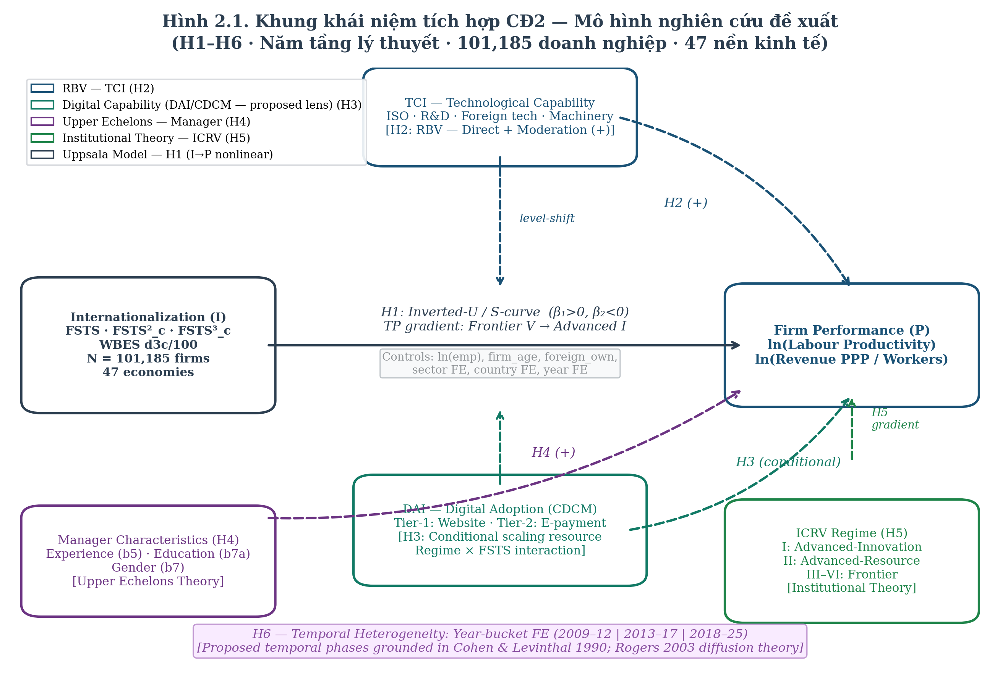
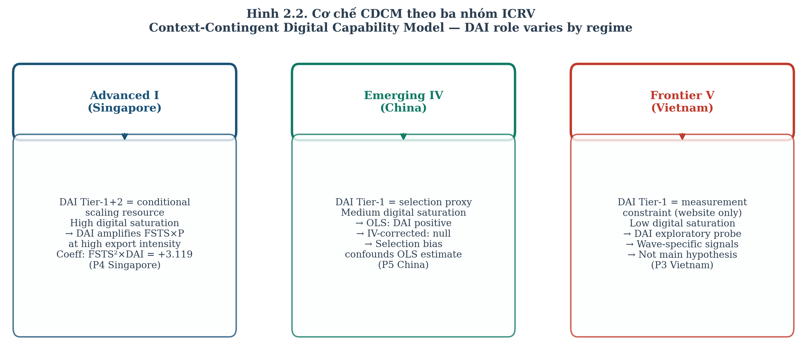

# CHUYÊN ĐỀ TIẾN SĨ SỐ 2

BỘ GIÁO DỤC VÀ ĐÀO TẠO

TRƯỜNG ĐẠI HỌC CẦN THƠ

TRƯỜNG KINH TẾ

---

ĐỖ THÙY HƯƠNG

CHUYÊN ĐỀ TIẾN SĨ SỐ 2

XÂY DỰNG MÔ HÌNH NGHIÊN CỨU VỀ ẢNH HƯỞNG CỦA QUỐC TẾ HÓA ĐẾN HIỆU QUẢ HOẠT ĐỘNG KINH DOANH CỦA CÁC DOANH NGHIỆP Ở CHÂU Á

Ngành: Quản trị kinh doanh

Mã ngành: 9340101

Mã nghiên cứu sinh: P1323001

NGƯỜI HƯỚNG DẪN KHOA HỌC

PGS.TS. PHAN ANH TÚ

Cần Thơ, năm 2026

---

## LỜI CAM ĐOAN

Tôi xin cam đoan chuyên đề tiến sĩ số 2 với tiêu đề "Xây dựng mô hình nghiên cứu về ảnh hưởng của quốc tế hóa đến hiệu quả hoạt động kinh doanh của các doanh nghiệp ở Châu Á" là công trình nghiên cứu của riêng tôi dưới sự hướng dẫn khoa học của PGS.TS. Phan Anh Tú, Trường Đại học Cần Thơ. Các kết quả phân tích, mô hình, bảng biểu, hình vẽ trình bày trong chuyên đề đều trung thực và có nguồn gốc rõ ràng. Tài liệu tham khảo được trích dẫn theo chuẩn APA 7th. Những trích dẫn từ các nghiên cứu khác đều được nêu rõ trong danh mục tài liệu tham khảo. Tôi xin chịu trách nhiệm hoàn toàn về nội dung khoa học của chuyên đề này.

*Cần Thơ, ngày … tháng … năm 2026*

*Nghiên cứu sinh*

Đỗ Thùy Hương

---

## TÓM TẮT

Chuyên đề này xây dựng mô hình nghiên cứu lý thuyết và thực nghiệm về ảnh hưởng của quốc tế hóa đến hiệu quả hoạt động kinh doanh của các doanh nghiệp ở các quốc gia châu Á trong giai đoạn 2009–2025. Khung lý thuyết tích hợp bốn tầng — Uppsala Model (Johanson & Vahlne, 1977, 2009), Resource-Based View (Barney, 1991; Wernerfelt, 1984), Institutional Theory (North, 1990; Khanna & Palepu, 2010; Peng, 2003) và Upper Echelons Theory (Hambrick & Mason, 1984; Hambrick, 2007) — kết hợp với Foundational Digital Adoption Framework (Banalieva & Dhanaraj, 2019; Verhoef et al., 2021; Stallkamp & Schotter, 2021) làm nền tảng lý thuyết. Lược khảo năm dạng hàm quan hệ quốc tế hóa — hiệu quả (I→P) gồm tuyến tính, chữ U ngược, S-curve, M-curve, và forced penalty, cùng năm meta-analysis lớn giai đoạn 1980–2024, cho thấy khoảng trống thực nghiệm trong việc kiểm định đồng thời phi tuyến và điều tiết đa tầng ở châu Á. Hệ giả thuyết H1–H6 được phát triển: H1 phi tuyến dạng chữ U ngược hoặc S-curve; H2 Technological Capability Index (TCI) điều tiết tích cực; H3a–H3b Digital Adoption Index (DAI) điều tiết phụ thuộc chế độ thể chế: có điều kiện ở Emerging/Frontier (H3a — dương trong OLS nhưng phụ thuộc bối cảnh và có thể null trong kiểm định nhân quả) và có điều kiện/null ở Advanced (H3b), phân biệt với TCI; H4a–H4c đặc điểm nhà quản trị điều tiết (kinh nghiệm, học vấn, giới tính — tách biệt dấu kỳ vọng); H5 thể chế nội địa điều tiết theo gradient ICRV sáu nhóm; H6 tính không đồng nhất theo thời gian. Tám mô hình thực nghiệm M0–M7 được đặc tả, từ baseline tuyến tính đến mô hình điều tiết ba chiều cấp luận án. Chiến lược nhận dạng đa tầng và kế hoạch kiểm định độ vững toàn diện được thiết kế cho pool 101.185 doanh nghiệp ở 47 nền kinh tế châu Á và Thái Bình Dương, bao gồm 108 cặp quốc gia-năm qua 14 mốc khảo sát WBES giai đoạn 2009–2025. Bốn đóng góp chính: (i) khung tích hợp 4 tầng kết hợp Foundational Digital Adoption Framework chưa có tương đương cho châu Á; (ii) tách bạch TCI và DAI theo Mô hình Áp dụng số và Năng lực phụ thuộc bối cảnh (CDCM); (iii) mô hình M7 điều tiết ba chiều; (iv) phân loại nhánh Advanced thành tiên tiến đổi mới sáng tạo dẫn dắt (ICRV Nhóm I) và tiên tiến tài nguyên dẫn dắt (ICRV Nhóm II). Ba bản thảo thực nghiệm đồng hành — P3 Việt Nam (JABS, under review), P4 Singapore (MIR, under review), P5 Trung Quốc (IJOEM, under review) — cung cấp bằng chứng quốc gia cụ thể kiểm định H1–H6 và xác nhận tính khả nghiệm của mô hình đề xuất.

Từ khóa: quốc tế hóa; hiệu quả hoạt động kinh doanh; châu Á; mô hình phi tuyến; điều tiết; áp dụng số; thể chế; Upper Echelons; ICRV.

---

## ABSTRACT

This specialty essay constructs a theoretical and empirical research model on the effect of internationalization on firm performance across Asian economies during 2009–2025. The integrated theoretical framework combines four layers — the Uppsala Model (Johanson & Vahlne, 1977, 2009), the Resource-Based View (Barney, 1991; Wernerfelt, 1984), Institutional Theory (North, 1990; Khanna & Palepu, 2010; Peng, 2003), and Upper Echelons Theory (Hambrick & Mason, 1984; Hambrick, 2007) — together with the Foundational Digital Adoption Framework (Banalieva & Dhanaraj, 2019; Verhoef et al., 2021; Stallkamp & Schotter, 2021). A review of five functional forms of the internationalization–performance (I→P) relationship — linear, inverted-U, S-curve, M-curve, and forced penalty — together with five major meta-analyses covering 1980–2024 reveals an empirical gap in the simultaneous testing of nonlinearity and multi-level moderation in Asia. Six hypotheses (H1–H6) are developed: H1 nonlinear inverted-U or S-curve relationship; H2 Technological Capability Index (TCI) positively moderating; H3a–H3b Digital Adoption Index (DAI) moderating contingent on institutional regime: conditional for Emerging/Frontier (H3a) — positive under OLS but subject to selection bias (P3 IV: β = 0.018, p = .942) — conditional or null for Advanced (H3b), and distinguishable from TCI; H4a–H4c top manager characteristics moderating (experience, education, and gender with distinct directional expectations); H5 home-country institutions moderating along the ICRV six-regime gradient; H6 temporal heterogeneity. Eight empirical models M0–M7 are specified, from linear baseline to three-way moderation. A multi-level identification strategy and comprehensive robustness plan are designed for a pool of 101,185 firms across 47 Asian and Pacific economies, spanning 108 country-year pairs across 14 WBES survey waves (2009–2025). The four main contributions are: (i) an integrated 4-tier framework combined with the Foundational Digital Adoption Framework with no equivalent for Asia; (ii) the separation of TCI and DAI within the Context-Contingent Digital-and-Capability Model (CDCM); (iii) the M7 three-way moderation model; (iv) sub-grouping of the Advanced regime into innovation-driven (ICRV Group I) and resource-driven (ICRV Group II) types. Three companion empirical papers — P3 Vietnam (JABS, under review), P4 Singapore (MIR, under review), P5 China (IJOEM, under review) — provide country-specific evidence testing H1–H6 and validating the proposed model structure.

Keywords: internationalization; firm performance; Asia; nonlinear models; moderation; digital adoption; institutions; Upper Echelons; ICRV.

---

## MỤC LỤC

Phần 2 — Nội dung chuyên đề

2.1 Đặt vấn đề
  2.1.1 Giới thiệu
  2.1.2 Mục tiêu
  2.1.3 Nội dung
  2.1.4 Giới hạn của chuyên đề
  2.1.5 Ý nghĩa

2.2 Phương pháp nghiên cứu

2.3 Kết quả và thảo luận
  2.3.1 Tổng quan văn liệu về quan hệ quốc tế hóa và hiệu quả kinh doanh
  2.3.2 Khung lý thuyết tích hợp 4 tầng
  2.3.3 Khung khái niệm và mô hình nghiên cứu đề xuất
  2.3.4 Hệ giả thuyết nghiên cứu (H1–H6)
  2.3.5 Thiết kế mô hình thực nghiệm (M0–M7)
  2.3.6 Dữ liệu và chiến lược nhận dạng nhân quả
  2.3.7 Kế hoạch kiểm định độ vững
  2.3.8 Thảo luận: đóng góp lý thuyết và thực tiễn

2.4 Kết luận và đề xuất
  2.4.1 Kết luận
  2.4.2 Hạn chế nghiên cứu
  2.4.3 Hướng nghiên cứu tiếp theo

Tài liệu tham khảo

Phụ lục

---

## DANH MỤC BẢNG

Bảng 2.1. Mỗi tầng lý thuyết — câu hỏi phụ — biến số — giả thuyết — bằng chứng neo đậu

Bảng 2.2. Năm dạng hàm I→P, cơ chế, và bối cảnh xuất hiện

Bảng 2.3. So sánh bằng chứng bốn bản thảo đồng hành P2–P5

Bảng 2.4. Mapping biến đầy đủ: khái niệm lý thuyết — biến WBES — kỳ vọng dấu — giả thuyết

Bảng 2.5. Hệ giả thuyết H1–H6 — tóm tắt cơ chế, biến, kỳ vọng, và bằng chứng neo đậu

Bảng 2.6. CDCM — Dự đoán tác động DAI theo 3 chiều ngữ cảnh

Bảng 2.7. Tám mô hình M0–M7 — cấu trúc, giả thuyết kiểm định, và biến bổ sung

Bảng 2.8. Cấu trúc pool theo nhóm ICRV và mốc khảo sát

Bảng 2.9. Đo lường TCI theo mã WBES

Bảng 2.10. Đo lường DAI theo mã WBES

Bảng 2.11. Phân loại 47 nền kinh tế theo ICRV — đặc điểm và tiêu chí

Bảng 2.12. Kế hoạch kiểm định độ vững — sáu nhóm

Bảng 2.13. So sánh đặc điểm phương pháp và phạm vi lý thuyết của các khung tham chiếu chính và CĐ2

---

## DANH MỤC HÌNH

Hình 2.1. Khung khái niệm tích hợp CĐ2 — tổng quan

Hình 2.2. Khung khái niệm tích hợp CĐ2 — chi tiết với bằng chứng neo đậu

---

## DANH MỤC TỪ VIẾT TẮT

| Viết tắt | Diễn giải |
|---|---|
| AIC | Akaike Information Criterion |
| BIC | Bayesian Information Criterion |
| BEE | Business Environment and Enterprise (WBES module) |
| BREADY | Business REAdy diagnostic (WBES module) |
| CDCM | Context-Contingent Digital-and-Capability Model — Mô hình Áp dụng số và Năng lực phụ thuộc bối cảnh |
| DAI | Digital Adoption Index — Chỉ số áp dụng số |
| FDI | Foreign Direct Investment — Đầu tư trực tiếp nước ngoài |
| FE | Fixed Effects — Hiệu ứng cố định |
| FSTS | Foreign Sales to Total Sales ratio — Tỉ lệ doanh số quốc tế trên tổng doanh số |
| GMM | Generalized Method of Moments |
| HC1/HC3 | Heteroskedasticity-Consistent Standard Errors (Long & Ervin, 2000) |
| I→P | Internationalization → Performance — Quan hệ quốc tế hóa — hiệu quả |
| IB | International Business — Kinh doanh quốc tế |
| ICRV | Institutional Context Regime Variation — Phân loại chế độ thể chế |
| ICT | Information and Communications Technology |
| ISO | International Organization for Standardization |
| IV | Instrumental Variable — Biến công cụ |
| LOWESS | Locally Weighted Scatterplot Smoothing |
| MNE | Multinational Enterprise — Doanh nghiệp đa quốc gia |
| OECD | Organisation for Economic Co-operation and Development |
| OLS | Ordinary Least Squares — Bình phương tối thiểu thông thường |
| PICS3 | WBES schema thế hệ 1 (2009–2013) |
| R&D | Research and Development — Nghiên cứu và phát triển |
| RBV | Resource-Based View — Quan điểm dựa trên nguồn lực |
| RESET | Regression Specification Error Test |
| ROA | Return on Assets — Lợi nhuận trên tổng tài sản |
| ROS | Return on Sales — Lợi nhuận trên doanh thu |
| SE | Standard Errors — Sai số chuẩn |
| SIDS | Small Island Developing States — Các quốc đảo nhỏ đang phát triển |
| SME | Small and Medium-sized Enterprise — Doanh nghiệp vừa và nhỏ |
| SOE | State-Owned Enterprise — Doanh nghiệp nhà nước |
| TCI | Technological Capability Index — Chỉ số năng lực công nghệ |
| UE | Upper Echelons Theory — Lý thuyết cấp cao |
| VIF | Variance Inflation Factor |
| WBES | World Bank Enterprise Surveys — Khảo sát doanh nghiệp Ngân hàng Thế giới |
| WGI | Worldwide Governance Indicators |

---

## Phần 2 — NỘI DUNG CHUYÊN ĐỀ

### 2.1 Đặt vấn đề

#### 2.1.1 Giới thiệu

Quốc tế hóa là chiến lược phát triển quan trọng của doanh nghiệp trong hơn nửa thế kỷ qua, nhưng kết quả mà nó đem lại không đồng nhất. Văn liệu kinh doanh quốc tế (IB) đã ghi nhận năm dạng hàm khác nhau trong quan hệ giữa cường độ quốc tế hóa và hiệu quả doanh nghiệp: tuyến tính (Hsu & Boggs, 2003), chữ U ngược (Gomes & Ramaswamy, 1999; Hitt, Hoskisson & Kim, 1997), S-curve (Lu & Beamish, 2004; Contractor, Kundu & Hsu, 2003), M-curve (Riahi-Belkaoui, 1998), và forced penalty (Glaum & Oesterle, 2007). Sự đa dạng này phản ánh tính phụ thuộc ngữ cảnh của hiệu ứng quốc tế hóa: cùng một mức cường độ quốc tế hóa có thể tạo ra lợi ích hoặc gánh nặng tùy theo năng lực doanh nghiệp, thể chế quốc gia, và giai đoạn phát triển số (Bausch & Krist, 2007; Kirca et al., 2012; Marano et al., 2016; Wu, Wood & Khan, 2022).

Châu Á trong giai đoạn 2009–2025 là phòng thí nghiệm tự nhiên độc đáo cho nghiên cứu quan hệ I→P. Khu vực này tồn tại đồng thời ít nhất sáu chế độ thể chế khác nhau theo khung phân loại ICRV: nhóm tiên tiến đổi mới sáng tạo dẫn dắt (ICRV Nhóm I) gồm Singapore, Hong Kong SAR, Hàn Quốc, Đài Loan, Israel; nhóm tiên tiến tài nguyên dẫn dắt (ICRV Nhóm II) gồm Saudi Arabia, Qatar, Kuwait, Bahrain, Brunei; nhóm trung bình cao (ICRV Nhóm III) gồm Trung Quốc, Malaysia, Thái Lan, Kazakhstan, Armenia, Georgia; nhóm đang nổi (ICRV Nhóm IV) gồm Việt Nam, Indonesia, Philippines, Ấn Độ, Sri Lanka, Jordan, Mông Cổ; nhóm cận biên (ICRV Nhóm V) gồm 17 nền kinh tế; và nhóm quốc đảo nhỏ Thái Bình Dương (ICRV Nhóm VI) gồm 7 nền kinh tế đảo nhỏ. Tổng cộng 47 nền kinh tế tạo thành 108 cặp quốc gia-năm qua 14 mốc khảo sát.

Đồng thời, châu Á đang trải qua chuyển đổi số chưa từng có trong giai đoạn 2018–2025. Sự bùng nổ của hạ tầng số và trí tuệ nhân tạo từ năm 2023 đã tái định hình cơ chế qua đó năng lực số tác động lên quốc tế hóa và hiệu quả (Banalieva & Dhanaraj, 2019; Verhoef et al., 2021; Yang, Zhao & Wei, 2025).

Khung lý thuyết hiện hành về quan hệ I→P còn phân tán. Các tổng quan lớn thường tập trung vào một hoặc hai khía cạnh mà ít có khung tích hợp đa tầng cho phép giải thích đầy đủ tính không đồng nhất quan sát được ở châu Á. Đặc biệt, khung áp dụng số nền tảng (Foundational Digital Adoption Framework) chỉ mới được đề xuất gần đây và chưa được tích hợp đầy đủ với bốn tầng lý thuyết kinh điển.

Kết quả phân tích mô tả trong Chuyên đề Tiến sĩ số 1 đã cung cấp bức tranh thực trạng đa chiều dựa trên 101.185 doanh nghiệp WBES xuyên 47 nền kinh tế, làm rõ ba pattern then chốt: phân tán năng suất tăng đơn điệu theo chế độ từ Nhóm I đến Nhóm VI; tính không đồng nhất nội bộ trong nhóm Advanced; và pattern adaptation đặc trưng của các quốc đảo nhỏ Thái Bình Dương. Đồng thời, phân tích đó phát hiện CDCM — Mô hình Áp dụng số và Năng lực phụ thuộc bối cảnh: tác động của DAI lên hiệu quả phụ thuộc vào chế độ thể chế, giai đoạn quốc tế hóa, và mức độ bão hòa số của nền kinh tế. Chuyên đề 2 này tiếp nối bằng cách xây dựng mô hình lý thuyết và thực nghiệm để giải thích cơ chế đằng sau các pattern đó.

Bốn bản thảo thực nghiệm đồng hành cung cấp bằng chứng quốc gia cụ thể kiểm định khả năng của khung đề xuất. P2 Trung Quốc SMEs (Đỗ & Phan, 2026, JFAR đã công bố) phân tích 2.700 doanh nghiệp SMEs Trung Quốc và tìm thấy dạng bậc ba (cubic nonlinearity / S-curve ba giai đoạn), cung cấp tiền thân thực nghiệm cho H1 và cơ sở để so sánh với P5. P3 Việt Nam (Đỗ & Phan, 2026, JABS under review) phân tích 2.958 doanh nghiệp WBES ba sóng (2009, 2015, 2023) xác nhận chữ U ngược trong cả ba sóng với điểm ngưỡng 46,2% (2009), 39,3% (2015), 41,6% (2023), 39,7% (tổng hợp); TCI nhân quả qua biến công cụ (β = 1,639, F bậc một = 22,1); DAI theo giai đoạn và phụ thuộc chọn lựa (IV null, β = 0,018). P4 Singapore (Mar, Đỗ & Phan, 2026, MIR under review) phân tích 623 doanh nghiệp WBES 2023, cho thấy điểm ngưỡng hàm ý ở FSTS khoảng 82% và DAI hoạt động như nguồn lực mở rộng tình huống với hệ số DAI×FSTS² = +3,119 (p = 0,005). P5 Trung Quốc (Đỗ & Phan, 2026, IJOEM under review) phân tích 4.559 doanh nghiệp WBES hai sóng (2012, 2024) xác nhận chữ U ngược bền vững cấu trúc với điểm ngưỡng 49,4% (2012) và 47,2% (2024).

#### 2.1.2 Mục tiêu

Mục tiêu chung: xây dựng mô hình nghiên cứu lý thuyết và thực nghiệm về ảnh hưởng của quốc tế hóa đến hiệu quả hoạt động kinh doanh của các doanh nghiệp ở các quốc gia châu Á, có khả năng kiểm định bằng dữ liệu WBES 101.185 doanh nghiệp xuyên 47 nền kinh tế giai đoạn 2009–2025.

Các mục tiêu cụ thể:

1. Hệ thống hóa khung lý thuyết tích hợp 4 tầng (Uppsala, RBV, Institutional Theory, Upper Echelons) kết hợp Foundational Digital Adoption Framework và CDCM.

2. Lược khảo các mô hình I→P trên thế giới và châu Á, định vị khoảng trống nghiên cứu.

3. Phát triển hệ giả thuyết H1–H6 dựa trên khung tích hợp, có neo đậu từ bằng chứng P3, P4, P5.

4. Đặc tả tám mô hình thực nghiệm M0–M7 với khả năng kiểm định trên dữ liệu WBES.

5. Đề xuất chiến lược nhận dạng và kiểm định độ vững toàn diện.

6. Khẳng định tính mới về mô hình so với các khung tham chiếu hiện hành.

#### 2.1.3 Nội dung

Chuyên đề trả lời ba câu hỏi nghiên cứu chính:

Câu hỏi 1 (Q1): Quan hệ giữa cường độ quốc tế hóa (I) và hiệu quả hoạt động kinh doanh (P) ở các doanh nghiệp châu Á có dạng hàm gì? Tuyến tính, phi tuyến hay phụ thuộc vào ngữ cảnh?

Câu hỏi 2 (Q2): Bốn cơ chế điều tiết — năng lực công nghệ TCI, mức độ áp dụng số DAI, đặc điểm nhà quản trị, chế độ thể chế nội địa — tác động như thế nào lên quan hệ I→P? Có phân biệt được giữa TCI và DAI theo CDCM hay không?

Câu hỏi 3 (Q3): Tác động I→P và cơ chế điều tiết có thay đổi theo thời gian không, đặc biệt giữa giai đoạn 2009–2012 và 2018–2025?

#### 2.1.4 Giới hạn của chuyên đề

Đối tượng nghiên cứu: doanh nghiệp đang hoạt động ở các nền kinh tế châu Á và Thái Bình Dương đáp ứng tiêu chí mẫu của WBES.

Phạm vi không gian: 47 nền kinh tế phân theo sáu nhóm ICRV (5+5+6+7+17+7).

Phạm vi thời gian: 2009–2025, bao trùm ba thế hệ schema WBES, tạo thành 108 cặp quốc gia-năm.

Phạm vi nội dung: mô hình hóa quan hệ I→P và bốn cơ chế điều tiết cộng với tính không đồng nhất theo thời gian. Chuyên đề không trình bày kết quả thực nghiệm từ toàn bộ pool — đó là nhiệm vụ của các bài báo tiếp theo trong chuỗi luận án. Chuyên đề này tập trung xây dựng và đặc tả mô hình.

#### 2.1.5 Ý nghĩa

Về lý thuyết, chuyên đề đóng góp khung tích hợp 4 tầng kết hợp Foundational Digital Adoption Framework — chưa có khung tương đương trong văn liệu IB cho khu vực 47 nền kinh tế bao gồm cả quốc đảo nhỏ Thái Bình Dương. CDCM làm sắc nét sự phân biệt giữa TCI như nguồn lực nâng mặt bằng và DAI như nguồn lực mở rộng tình huống.

Về mô hình, tám mô hình M0–M7 với điều tiết ba chiều (M7) là chuỗi mô hình đầu tiên trong văn liệu châu Á kiểm định đồng thời phi tuyến I→P và điều tiết đa tầng trên pool vi mô lớn nhất từ trước đến nay.

Về thực tiễn, kết quả cung cấp hàm ý chính sách cho doanh nghiệp Việt Nam và emerging Asia về cách tận dụng quốc tế hóa kết hợp năng lực công nghệ và số hóa — đặc biệt trong giai đoạn AI bùng nổ.

---

### 2.2 Phương pháp nghiên cứu

Chuyên đề tiếp cận theo lối tổng quan văn liệu tích hợp (Torraco, 2005) cho khung lý thuyết và phát triển giả thuyết suy diễn (deductive hypothesis development) cho hệ giả thuyết. Đặc tả mô hình thực nghiệm tuân theo Wooldridge (2010) và Long & Ervin (2000). Thiết kế nhận dạng và kiểm định độ vững theo Greene (2018). Hệ giả thuyết được neo đậu vào bằng chứng thực nghiệm từ P3, P4, P5 theo nguyên tắc nghiên cứu dựa trên hiện tượng (Meyer et al., 2017).

Phương pháp ước lượng chính: OLS với HC1 robust standard errors (Long & Ervin, 2000) làm chuẩn, hai chiều fixed effects (country × year), và biến công cụ (2SLS) để nhận dạng nhân quả cho TCI và DAI. Kiểm định phi tuyến áp dụng Lind–Mehlum (2010) U-test để xác nhận chữ U ngược thực sự và kiểm định Paternoster để so sánh điểm ngưỡng giữa các nhóm ICRV và giai đoạn thời gian. Phần mềm: Stata 18 (OLS, IV, margins) kết hợp R (LOWESS, ggplot2, CI điểm ngưỡng).

---

### 2.3 Kết quả và thảo luận

#### 2.3.1 Tổng quan văn liệu về quan hệ quốc tế hóa và hiệu quả kinh doanh

##### Năm dạng hàm của quan hệ I→P

Văn liệu IB đã ghi nhận không dưới năm dạng hàm khác nhau trong quan hệ giữa cường độ quốc tế hóa và hiệu quả doanh nghiệp. Sự đa dạng này không phải ngẫu nhiên mà phản ánh tính phụ thuộc ngữ cảnh của hiệu ứng quốc tế hóa.

Dạng hàm thứ nhất — tuyến tính. Các nghiên cứu sớm như Hsu và Boggs (2003) và Geringer và cộng sự (1989) tìm thấy mối quan hệ tuyến tính dương: hiệu quả tăng đơn điệu theo mức độ quốc tế hóa. Logic nền tảng là lợi ích quy mô, đa dạng hóa doanh thu, và tiếp cận thị trường lớn hơn. Đây là kết quả đặc thù của các mẫu với FSTS thấp hoặc phân tán hẹp.

Dạng hàm thứ hai — chữ U ngược. Hitt, Hoskisson và Kim (1997) và Gomes và Ramaswamy (1999) đề xuất mô hình chữ U ngược: hiệu quả tăng ở giai đoạn quốc tế hóa ban đầu đến trung bình do lợi ích quy mô và học hỏi, nhưng giảm sau điểm ngưỡng tối ưu do chi phí điều phối đa thị trường vượt lợi ích. Điểm uốn thực nghiệm thường nằm trong khoảng 30–60% FSTS (Marano et al., 2016). Đây là dạng hàm phổ biến nhất trong các tổng quan định lượng.

Dạng hàm thứ ba — S-curve ba giai đoạn. Lu và Beamish (2004) và Contractor, Kundu và Hsu (2003) phát triển lý thuyết ba giai đoạn: giai đoạn đầu hiệu quả giảm do chi phí học tập và thiết lập; giai đoạn giữa hiệu quả tăng do lợi ích quy mô và đa dạng hóa; giai đoạn quá mức hiệu quả giảm do chi phí phối hợp. Dạng S-curve có hệ số β₁(FSTS) > 0, β₂(FSTS²) < 0, β₃(FSTS³) > 0. Bằng chứng hỗ trợ mạnh từ các MNE lớn, nhưng kém ổn định hơn với doanh nghiệp vừa và nhỏ.

Dạng hàm thứ tư — M-curve. Riahi-Belkaoui (1998) đề xuất dạng M-curve với hai điểm ngưỡng, phản ánh tính không đồng nhất trong lợi ích quốc tế hóa theo loại thị trường. Bằng chứng thực nghiệm hạn chế và khó tái lập.

Dạng hàm thứ năm — forced penalty. Glaum và Oesterle (2007) ghi nhận dạng hàm tuyến tính âm trong các nền kinh tế bắt buộc phải quốc tế hóa do thị trường nội địa quá nhỏ (Briguglio, 1995; Bertram, 2006). Đây là pattern đặc thù của các quốc đảo nhỏ Thái Bình Dương: các doanh nghiệp phải xuất khẩu để tồn tại nhưng thiếu năng lực cạnh tranh, tạo ra gánh nặng tắt buộc — hiệu quả không tăng theo cường độ quốc tế hóa.

Tất cả năm dạng hàm có thể được thống nhất dưới khung chi phí-lợi ích (Contractor, 2012): P(FSTS) = B(FSTS) − C(FSTS), trong đó B(·) là hàm lợi ích và C(·) là hàm chi phí. Sự khác biệt giữa các dạng hàm nằm ở hình dạng của B(·) và C(·) tùy theo ngữ cảnh thể chế, năng lực doanh nghiệp, và giai đoạn số hóa.

Bảng 2.2. Năm dạng hàm I→P, cơ chế, và bối cảnh xuất hiện.

| Dạng hàm | Tác giả tiêu biểu | Cơ chế | Bối cảnh ICRV |
|----------|-------------------|--------|---------------|
| Tuyến tính (+) | Hsu & Boggs (2003) | Quy mô + học hỏi | FSTS thấp, tất cả nhóm |
| Chữ U ngược | Hitt et al. (1997); Gomes & Ramaswamy (1999) | Chi phí điều phối > lợi ích ở FSTS cao | Nhóm III–IV |
| S-curve ba giai đoạn | Lu & Beamish (2004); Contractor et al. (2003) | Ba giai đoạn: học tập — quy mô — quá mức | MNE lớn, tất cả nhóm |
| M-curve | Riahi-Belkaoui (1998) | Lợi ích không đồng nhất | Bằng chứng hạn chế |
| Forced penalty | Glaum & Oesterle (2007) | Bắt buộc quốc tế hóa, thiếu năng lực | Nhóm VI (SIDS) |

##### Năm tổng quan định lượng lớn (1980–2024)

Năm tổng quan định lượng lớn cung cấp bức tranh tổng thể về quan hệ I→P.

Bausch và Krist (2007) phân tích 68 nghiên cứu (1980–2005) và tìm thấy trung bình r = 0,045 (không đáng kể), nhưng với biến động cao (SD = 0,21) — cho thấy các biến điều tiết quan trọng hơn hiệu ứng trung bình. Phương pháp: meta-regression với 8 biến điều tiết gồm quy mô doanh nghiệp, cường độ R&D, loại ngành, GDP quốc gia, khoảng cách văn hóa, phạm vi địa lý, và hai thước đo hiệu quả. Phát hiện chính: không tồn tại một hiệu ứng trung bình đơn nhất; các biến điều tiết thể chế và văn hóa giải thích lượng phương sai lớn hơn đáng kể so với biến điều tiết cấp doanh nghiệp. Hạn chế: thiếu đại diện châu Á (chỉ 8/68 nghiên cứu), không kiểm định phi tuyến có hệ thống.

Kirca và cộng sự (2012) tổng hợp 180 nghiên cứu với 824 cỡ hiệu ứng, tìm thấy mối quan hệ dương trung bình nhưng với điều tiết đáng kể từ loại hình quốc tế hóa, thước đo hiệu quả, và thuộc tính doanh nghiệp. Cường độ R&D là biến điều tiết cấp doanh nghiệp mạnh nhất (β_meta = +0,12, p < 0,001). Hạn chế: thiếu bằng chứng từ châu Á và thị trường mới nổi; không có biến số; không bao gồm SIDS hay nền kinh tế cận biên.

Marano và cộng sự (2016) phân tích 333 nghiên cứu với cách tiếp cận tập trung vào thể chế. Phát hiện chính: chất lượng thể chế quốc gia xuất xứ có thể dịch chuyển điểm ngưỡng ±15% FSTS — đây là nền tảng quan trọng nhất ủng hộ gradient ICRV trong H5. Hạn chế: không phân tách TCI và DAI; không có dữ liệu sau 2015; không bao gồm quốc đảo nhỏ.

Wu, Wood và Khan (2022) tổng hợp 20 năm bằng chứng từ doanh nghiệp đa quốc gia thị trường mới nổi, tìm thấy điểm ngưỡng thấp hơn so với doanh nghiệp từ nền kinh tế phát triển khoảng 12–18% FSTS do khoảng cách năng lực hấp thụ. Hạn chế: không kiểm định giai đoạn số hóa; không sử dụng dữ liệu vi mô WBES; không phân biệt TCI và DAI.

Schwens và cộng sự (2018) tập trung vào doanh nghiệp vừa và nhỏ và tìm thấy dạng U (không phải chữ U ngược) trong một số bối cảnh — chi phí quốc tế hóa ban đầu lớn so với năng lực, nhưng phục hồi sau khi vượt ngưỡng thiết lập. Hạn chế: mẫu nhỏ (87 nghiên cứu); không bao phủ châu Á Thái Bình Dương đầy đủ; không kiểm định DAI như biến điều tiết.

Kết luận tổng quan: hiệu ứng trung bình I→P là dương nhỏ (r khoảng 0,04–0,07) nhưng rất không đồng nhất (SD = 0,15–0,21). Cả năm tổng quan đều thiếu: (i) bao phủ đầy đủ châu Á và Thái Bình Dương; (ii) kiểm định đồng thời phi tuyến và điều tiết đa tầng; (iii) phân tách TCI và DAI; (iv) bao gồm quốc đảo nhỏ Thái Bình Dương; (v) dữ liệu sau 2020. Chuyên đề này lấp đầy tất cả năm khoảng trống với pool 101.185 doanh nghiệp và khung CDCM.

Bảng 2.13. So sánh đặc điểm phương pháp và phạm vi lý thuyết của các khung tham chiếu chính và CĐ2.

| Khung | Phi tuyến I→P | TCI | DAI | Đặc điểm QL | Thể chế (Inst.) | Temporal | Phân nhóm | SIDS |
|-------|--------------|-----|-----|-------------|-----------------|----------|-----------|------|
| Bausch & Krist (2007) | ✗ (không kiểm định hệ thống) | Partial (R&D proxy) | ✗ | ✗ | ✓ (GDP, văn hóa) | ✗ | ✗ | ✗ |
| Kirca et al. (2012) | ✗ | ✓ (R&D proxy) | ✗ | ✗ | Partial | ✗ | Partial (ngành) | ✗ |
| Marano et al. (2016) | ✓ (TP ±15% FSTS) | ✗ | ✗ | ✗ | ✓ (cốt lõi) | ✗ | ✗ | ✗ |
| Banalieva & Dhanaraj (2019) | Partial | ✗ | ✓ (cốt lõi) | ✗ | Partial | Partial | ✗ | ✗ |
| Wu, Wood & Khan (2022) | ✓ (TP thấp hơn EMNE) | Partial (absorptive capacity) | ✗ | ✗ | ✓ | ✓ (20 năm) | ✓ (EMNE/DMNE) | ✗ |
| Đỗ & Phan (2026 — JFAR) | ✓ (bậc ba / S-curve) | – | – | – | – | – | – | – |
| **CĐ2 (luận án này)** | **✓ (H1: chữ U ngược + S-curve)** | **✓ (H2: nhân quả IV)** | **✓ (H3: CDCM phân biệt)** | **✓ (H4a–H4c)** | **✓ (H5: ICRV 6 nhóm)** | **✓ (H6: 3 giai đoạn)** | **✓ (Nhóm I→VI)** | **✓ (Nhóm VI FIP)** |

*Ghi chú: ✓ = kiểm định chính thức hoặc đóng góp lý thuyết rõ ràng; Partial = đề cập nhưng không phải trọng tâm; ✗ = không bao gồm; – = không áp dụng. FIP = Forced Internationalization Penalty. TCI và DAI được phân tách theo tiêu chí CDCM; P2 JFAR không kiểm định CDCM (pre-framework) nhưng cung cấp bằng chứng phi tuyến cubic tiền thân.*

##### Bằng chứng châu Á từ ba bản thảo đồng hành

P3 Việt Nam (Đỗ & Phan, 2026, JABS under review): Phân tích 2.958 doanh nghiệp WBES ba sóng (2009, 2015, 2023) xác nhận chữ U ngược trong cả ba sóng với kiểm định Lind–Mehlum p < 0,001 (tổng hợp). Điểm uốn: 46,2% (2009), 39,3% (2015), 41,6% (2023), 39,7% (tổng hợp). P3 phân tách H1 thành hai mệnh đề: bước nhảy từ không xuất khẩu sang xuất khẩu là biên năng suất chính; trong mẫu chỉ gồm doanh nghiệp xuất khẩu, đường cong gần phẳng. TCI (b8+e6) dương bền vững (β = 0,179 tổng hợp, p < 0,001); biến công cụ cho TCI nhân quả (β = 1,639, F bậc một = 22,1). DAI phụ thuộc giai đoạn — dương năm 2009 (β = 0,175), null năm 2015, có tương tác âm năm 2023 (FSTS_c×DAI_z = −0,912, p = 0,043); biến công cụ cho DAI null (β = 0,018, p = 0,942, F bậc một = 34,6) — phụ thuộc chọn lựa, không nhân quả.

*Lưu ý về đặc tả mô hình P3: P3 Vietnam sử dụng chuỗi M0–M8 riêng, trong đó M8 là mô hình đầy đủ: lnLP_it = α + β₁ FSTS_c + β₂ FSTS_c² + β₃ TCI_z + β₄ DAI_z + β₅(FSTS_c × DAI_z) + β₆(FSTS_c² × DAI_z) + γ·X + δ_s + [λ_t] + ε_it. Đặc tả đầy đủ M0–M8 và bảng định nghĩa biến được trình bày trong bản thảo P3 (§3.2–§3.3) và luận án (§4.5.1). Chuỗi M0–M7 trong Chuyên đề 2 là các mô hình cấp độ pool 47 quốc gia, khác với đặc tả cấp độ quốc gia của P3.*

P4 Singapore (Mar, Đỗ & Phan, 2026, MIR under review): Phân tích 623 doanh nghiệp WBES 2023. Trong nền kinh tế số bão hòa, đường cong I→P chủ yếu dương — điểm ngưỡng hàm ý ở FSTS khoảng 82% (vùng thưa dữ liệu; kiểm định Lind–Mehlum p = 0,303). DAI×FSTS² = +3,119 (p = 0,005) — DAI là nguồn lực mở rộng tình huống, chỉ phát huy ở FSTS cao nơi nhu cầu điều phối xuyên biên giới dày đặc. TCI dương trực tiếp (β = 0,153).

P5 Trung Quốc (Đỗ & Phan, 2026, IJOEM under review): Phân tích 4.559 doanh nghiệp WBES hai sóng (2012, 2024). Chữ U ngược bền vững cấu trúc — điểm ngưỡng 49,4% (2012), 47,2% (2024), kiểm định Paternoster cho hệ số FSTS² không có sự khác biệt đáng kể (p = 0,545). TCI tăng cường theo thời gian (+0,260 → +0,426, Paternoster p = 0,011).

Bảng 2.3. So sánh bằng chứng bốn bản thảo đồng hành.

| Chiều | P2 Trung Quốc SMEs (Nhóm III) | P3 Việt Nam (Nhóm IV) | P4 Singapore (Nhóm I) | P5 Trung Quốc (Nhóm III) |
|-------|-------------------------------|----------------------|----------------------|--------------------------|
| Journal | JFAR (đã công bố 2026) | JABS (under review) | MIR (under review) | IJOEM (under review) |
| Dạng I→P | **Bậc ba / cubic** (S-curve ba giai đoạn) | Chữ U ngược xác nhận | Chủ yếu dương, TP ~82% | Chữ U ngược bền vững |
| Điểm uốn | Hai điểm ngưỡng (cubic) | 39–46% FSTS | ~82% (thưa dữ liệu) | 47–49% FSTS |
| TCI | Dương; RBV xác nhận | Dương bền vững, nhân quả (IV) | Dương trực tiếp | Dương, tăng theo thời gian |
| DAI | Không kiểm định (pre-CDCM) | Phụ thuộc giai đoạn; IV null | Mở rộng tình huống (+3,119) | Kiểm soát (Tier 1 bão hòa) |
| Temporal | Cắt ngang (không temporal) | Paternoster p < 0,001 (dịch chuyển) | Cắt ngang 2023 | Paternoster p = 0,545 (ổn định) |
| Mô hình CDCM | Tiền thân (chưa tách TCI/DAI) | Nhóm IV, trung gian | Nhóm I, bão hòa số | Nhóm III, đang trưởng thành |

*Ghi chú: P2 (Đỗ & Phan, 2026 — JFAR) là bản thảo tiền thân đã công bố, tìm thấy bậc ba (cubic nonlinearity) trong mẫu SMEs Trung Quốc — bằng chứng quan trọng cho dạng S-curve trong H1. P2 không kiểm định CDCM, được đưa vào đây để làm rõ sự tiến hóa phương pháp từ P2 sang P5.*

Bốn bản thảo cùng xác nhận ba dự đoán cốt lõi của CDCM: TCI là nhân quả và bền vững qua ba nền kinh tế khác nhau; DAI là phụ thuộc ngữ cảnh, không đồng nhất; chữ U ngược (hoặc S-curve cubic trong P2) là dạng hàm phổ biến nhất cho doanh nghiệp vừa và nhỏ châu Á với điểm ngưỡng phụ thuộc vào ICRV.


#### 2.3.2 Khung lý thuyết tích hợp 4 tầng

##### Tầng 1 — Lý thuyết quốc tế hóa Uppsala

Mô hình Uppsala (Johanson & Vahlne, 1977) đề xuất quá trình quốc tế hóa của doanh nghiệp diễn ra tăng dần thông qua tích lũy kinh nghiệm và giảm dần khoảng cách tâm lý giữa thị trường nội địa và thị trường nước ngoài. Doanh nghiệp khởi đầu xuất khẩu sang các thị trường gần về văn hóa, ngôn ngữ, thể chế trước khi mở rộng sang các thị trường xa hơn. Mô hình ban đầu (1977) tập trung vào ba cơ chế: cam kết thị trường, tri thức thị trường, và quyết định cam kết hiện tại.

Johanson và Vahlne (2009) tái định vị mô hình từ gánh nặng do là người nước ngoài sang gánh nặng do không thuộc mạng lưới. Phiên bản này nhấn mạnh vai trò mạng lưới quan hệ kinh doanh trong quá trình quốc tế hóa.

Mô hình Uppsala chậm áp dụng cho ba hiện tượng: doanh nghiệp quốc tế hóa ngay từ khi thành lập (Knight & Cavusgil, 2004); doanh nghiệp đa quốc gia từ thị trường mới nổi với quy trình quốc tế hóa khác biệt (Mathews, 2002; Luo & Tung, 2007); và bối cảnh số nơi Internet và nền tảng số giảm khoảng cách tâm lý đến mức tối thiểu (Banalieva & Dhanaraj, 2019; Stallkamp & Schotter, 2021).

Vai trò trong mô hình đề xuất: Uppsala cung cấp logic cho hiệu ứng phi tuyến trong H1. Doanh nghiệp tăng cường độ quốc tế hóa đối mặt với chi phí học tập ban đầu, sau đó thu được lợi ích quy mô, nhưng vượt quá ngưỡng nhất định lại chịu chi phí phối hợp. Bằng chứng P3 Việt Nam (điểm ngưỡng 39–46%) và P5 Trung Quốc (điểm ngưỡng 47–49%) neo đậu thực nghiệm cho H1.

##### Tầng 2 — Lý thuyết doanh nghiệp dựa trên nguồn lực (RBV)

Resource-Based View (Wernerfelt, 1984; Barney, 1991) cho rằng lợi thế cạnh tranh bền vững xuất phát từ nguồn lực có giá trị, hiếm, khó bắt chước, và không thay thế (VRIN). Doanh nghiệp khác nhau về hiệu quả vì sở hữu các bộ nguồn lực khác nhau.

Teece, Pisano và Shuen (1997) phát triển khái niệm năng lực động — khả năng tích hợp, xây dựng, và tái cấu trúc nguồn lực để thích ứng với môi trường thay đổi. Trong bối cảnh quốc tế hóa, năng lực động đặc biệt quan trọng để hấp thụ tri thức từ thị trường nước ngoài và tái phân bổ nguồn lực qua các thị trường.

Cohen và Levinthal (1990) đề xuất khái niệm năng lực hấp thụ — khả năng doanh nghiệp nhận diện, đồng hóa, và áp dụng kiến thức bên ngoài. Doanh nghiệp có R&D nội tại cao có năng lực hấp thụ cao và do đó hấp thụ tri thức từ quốc tế hóa hiệu quả hơn.

Vai trò trong mô hình đề xuất: RBV cung cấp lý thuyết cho H2 (TCI điều tiết tích cực). Doanh nghiệp có năng lực công nghệ (R&D, ISO, máy nhập khẩu) cao hấp thụ lợi ích quốc tế hóa tốt hơn. TCI là biến điều tiết cấp doanh nghiệp. Bằng chứng P3 Việt Nam (TCI trực tiếp β = 0,179, nhân quả từ IV) và P5 Trung Quốc (TCI tăng cường +0,260 → +0,426) ủng hộ TCI là nguồn lực VRIN bền vững.

##### Tầng 3 — Lý thuyết thể chế (Institutional Theory)

North (1990) định nghĩa thể chế là các quy tắc của trò chơi — chính thức (luật pháp, hợp đồng, quyền sở hữu) và phi chính thức (chuẩn mực, văn hóa, mạng lưới) — quy định chi phí giao dịch và rủi ro kinh doanh. Kim, Kumar, Ramalho và Russell (2026) bổ sung khung đo lường năng lực thể chế (institutional capacity) theo hai chiều: chiều tổ chức (nhân sự, nguồn lực tài chính, hệ thống thông tin, quản lý) và chiều quản trị (minh bạch, độc lập, trách nhiệm giải trình). Nghiên cứu đa quốc gia này xác nhận mối tương quan dương vững chắc giữa năng lực thể chế và phát triển kinh tế, cung cấp nền tảng thực nghiệm cho phân loại sáu nhóm ICRV theo năng lực và nguồn lực thể chế được sử dụng trong mô hình đề xuất.

Khanna và Palepu (2010) áp dụng lý thuyết thể chế cho thị trường mới nổi, đề xuất khái niệm khoảng trống thể chế — các thiếu hụt trong hệ thống thể chế (thiếu thị trường vốn phát triển, thiếu hệ thống tư pháp hiệu quả, thiếu chuẩn kế toán minh bạch). Doanh nghiệp ở thị trường mới nổi phải xây dựng giải pháp nội bộ để bù đắp.

Peng (2003) và Peng, Wang, Jiang (2008) đề xuất cặp chiến lược ba chân — chiến lược doanh nghiệp được hình thành bởi ba lực: ngành, nguồn lực, và thể chế. Trong các nền kinh tế đang nổi và cận biên, vai trò của thể chế đặc biệt nổi bật.

Vai trò trong mô hình đề xuất: Lý thuyết thể chế cung cấp logic cho H5 (thể chế ICRV điều tiết theo gradient). Cùng một mức quốc tế hóa, doanh nghiệp ở Nhóm I thu được hiệu quả khác doanh nghiệp ở Nhóm V do khác biệt về chi phí giao dịch, chất lượng thể chế, và tiếp cận thị trường. Sáu nhóm ICRV là biến điều tiết cấp quốc gia.

##### Tầng 4 — Lý thuyết Upper Echelons

Hambrick và Mason (1984) đề xuất Upper Echelons Theory với luận điểm trung tâm: các quyết định chiến lược của doanh nghiệp phản ánh đặc điểm nhân khẩu học của nhà quản trị cấp cao. Các đặc điểm này gồm tuổi, giáo dục, kinh nghiệm chức năng, thâm niên, kinh nghiệm quốc tế, giới tính.

Hambrick (2007) bổ sung hai khái niệm quan trọng: mức độ tự do của nhà quản trị trong việc đưa ra quyết định, và áp lực công việc ảnh hưởng đến chất lượng quyết định. Cannella, Park và Lee (2008) cho thấy đa dạng chức năng của đội quản lý cấp cao tương quan dương với hiệu quả ở các môi trường thay đổi nhanh.

Vai trò trong mô hình đề xuất: Upper Echelons cung cấp lý thuyết cho H4a–H4c (đặc điểm nhà quản trị điều tiết). Doanh nghiệp có nhà quản trị kinh nghiệm cao (H4a), học vấn cao (H4b) chuyển hóa quốc tế hóa thành hiệu quả tốt hơn thông qua hai kênh: chất lượng quyết định (tránh quốc tế hóa sớm) và năng lực điều phối (quản lý phức tạp đa thị trường). Giới tính nhà quản trị (H4c) được kiểm định khám phá không có dấu tiên nghiệm.

##### Foundational Digital Adoption Framework và CDCM

Banalieva và Dhanaraj (2019) phát triển lý thuyết nội hóa cho nền kinh tế số, đề xuất rằng nền tảng số làm thay đổi căn bản ba yếu tố cốt lõi của lý thuyết IB: khoảng cách tâm lý giảm đến mức tối thiểu; chuỗi giá trị phân mảnh ở quy mô chưa từng có; doanh nghiệp quốc tế hóa ngay từ ngày đầu thành lập trở thành chuẩn mới.

Verhoef và cộng sự (2021) đề xuất phân biệt rõ giữa hai loại năng lực: năng lực công nghệ nội tại (TCI) gồm R&D doanh nghiệp, đổi mới sản phẩm, chứng nhận chất lượng ISO, bằng sáng chế — đo lường bằng đầu vào và đầu ra của hoạt động đổi mới (Tier 3–4); và áp dụng số nền tảng (DAI) gồm sử dụng hạ tầng số cơ bản (website, e-commerce, e-payment) — đo lường bằng Tier 1–2.

Stallkamp và Schotter (2021) chứng minh rằng nền tảng số cho phép doanh nghiệp nhỏ ở thị trường mới nổi quốc tế hóa với chi phí gần bằng zero — thay đổi căn bản logic Uppsala.

CDCM — Mô hình Áp dụng số và Năng lực phụ thuộc bối cảnh — được phát hiện qua phân tích đa mẫu trong Chuyên đề Tiến sĩ số 1 cho thấy tác động của DAI lên hiệu quả không đồng nhất mà phụ thuộc đồng thời vào ba chiều ngữ cảnh.

Chiều thứ nhất là chế độ thể chế (ICRV): ở Nhóm I nơi Tier 1–2 đã bão hòa, DAI không tạo phần thưởng đồng nhất mà chỉ phát huy qua kênh phụ thuộc xuất khẩu (nghịch lý bão hòa số — P4 Singapore). Ở Nhóm IV, DAI dương nhưng phụ thuộc giai đoạn và chịu thiên lệch chọn lựa (P3 Việt Nam).

Chiều thứ hai là mức độ quốc tế hóa (FSTS): DAI là nguồn lực mở rộng tình huống — hiệu quả hơn ở FSTS cao nơi nhu cầu điều phối xuyên biên giới dày đặc (P4 Singapore: DAI×FSTS² = +3,119, p = 0,005).

Chiều thứ ba là mức độ bão hòa số: khi nền kinh tế đạt bão hòa Tier 1–2, DAI mất tác dụng phân biệt cấp doanh nghiệp (Singapore: tỉ lệ có website 67%); khi chưa bão hòa, DAI vẫn có tín hiệu phân biệt (Việt Nam 2023: 49,8%).

Yang, Zhao và Wei (2025) tổng hợp bằng chứng từ Trung Quốc, Ấn Độ, Việt Nam cho thấy năng lực số là biến điều tiết mạnh nhất cho quan hệ I→P trong giai đoạn 2018 trở đi, nhưng chỉ khi phân tách đúng cấp độ năng lực.

##### Tổng hợp 4 tầng lý thuyết

Bảng 2.1. Mỗi tầng lý thuyết — câu hỏi phụ — biến số — giả thuyết — bằng chứng neo đậu.

| Tầng | Lý thuyết | Câu hỏi phụ | Biến số chính | Giả thuyết | Bằng chứng P3/P4/P5 |
|---|---|---|---|---|---|
| 1 | Uppsala | Cường độ QTH có hiệu ứng phi tuyến không? | I (FSTS, FSTS²) | H1 Phi tuyến chữ U ngược | P3: TP 39–46%; P5: TP 47–49% |
| 2 | RBV | Năng lực doanh nghiệp ảnh hưởng thế nào đến hấp thụ lợi ích I? | TCI | H2 TCI điều tiết (+) | P3: β = 0,179 nhân quả (IV); P5: +0,260 → +0,426 |
| Digital Adoption Lens | CDCM | Năng lực số có cơ chế khác TCI không? | DAI | H3a–H3b DAI phụ thuộc chế độ thể chế | P4: DAI×FSTS² = +3,119 (Nhóm I); P3: IV null (β = 0,018, Nhóm IV) |
| 4 | Upper Echelons | Đặc điểm nhà quản trị tác động thế nào? | Top manager | H4a–H4c Quản trị điều tiết | (kiểm định trong M5, dữ liệu WBES) |
| 3 | Institutional | Thể chế nội địa định hình quan hệ ra sao? | ICRV (6 nhóm) | H5 Gradient thể chế | Phân tích mô tả CĐ1: phân tán LP tăng theo chế độ |
| — | (Thời gian) | Quan hệ thay đổi qua thời gian không? | Year-bucket | H6 Không đồng nhất thời gian | P3: Paternoster p < 0,001; P5: TCI Paternoster p = 0,011 |

Lập luận tích hợp: quốc tế hóa là quyết định chiến lược theo logic Uppsala (tầng 1); kết quả phụ thuộc nguồn lực doanh nghiệp — TCI (RBV/Lall, 1992) đóng vai trò nâng mặt bằng nhân quả; được hỗ trợ bởi hạ tầng số có điều kiện — DAI (Foundational Digital Adoption Framework/Verhoef et al., 2021) là nguồn lực mở rộng tình huống theo CDCM; phản ánh đặc điểm nhà quản trị (Upper Echelons/Hambrick & Mason, 1984); bị khuôn khổ bởi thể chế nội địa (Institutional Theory/North, 1990) — gradient ICRV 6 nhóm với gánh nặng tắt buộc ở quốc đảo nhỏ; và thay đổi theo bối cảnh thời gian — thiết kế ba giai đoạn.

Hạn chế của khung tích hợp: khó tách hiệu ứng riêng từng tầng nếu không có dữ liệu panel dài; một số biến quan trọng theo Uppsala (khoảng cách tâm lý, gắn kết mạng lưới) khó đo trong WBES; TCI và DAI có thể tương quan; ICRV và country fixed effects có thể đa cộng; CDCM chỉ đo ở Tier 1–2 do hạn chế WBES.


#### 2.3.3 Khung khái niệm và mô hình nghiên cứu đề xuất

Khung khái niệm được xây dựng theo quy trình năm bước (Whetten, 1989; Dubin, 1978): (1) xác định khoảng trống lý thuyết; (2) lựa chọn và biện minh lý thuyết nền; (3) phát triển giả thuyết có cơ chế nhân quả rõ ràng; (4) thiết kế sơ đồ trực quan nhất quán với hệ giả thuyết; (5) kiểm tra tính đồng nhất giữa mô hình, giả thuyết và chiến lược thực nghiệm. Mô hình kết hợp năm tầng lý thuyết — Uppsala Model, Resource-Based View, Institutional Theory, Upper Echelons Theory và Foundational Digital Adoption Framework — vào một cấu trúc nhân quả kiểm định được, nhận diện rõ vai trò của từng biến: **biến độc lập** (quốc tế hóa, đo bằng FSTS và dạng phi tuyến FSTS²_c), **biến phụ thuộc** (hiệu quả, đo bằng ln(Labour Productivity)), **biến điều tiết** cấp doanh nghiệp (TCI, DAI) và cấp quốc gia (ICRV regime, thời gian), **biến kiểm soát** (quy mô, tuổi, sở hữu nước ngoài, sector FE, country FE, year FE).

##### Hình 2.1 — Khung khái niệm tích hợp (tổng quan)



*Hình 2.1.* Khung khái niệm tích hợp Chuyên đề 2 (H1–H6, năm tầng lý thuyết).

Mũi tên liền nét biểu thị tác động trực tiếp (H1: quan hệ phi tuyến I→P). Mũi tên đứt nét biểu thị tác động điều tiết. H1–H6 tương ứng với các giả thuyết phát triển trong §2.3.4. Biến phụ thuộc (ln(Labour Productivity)) được xác định duy nhất ở cực phải. Biến độc lập (FSTS, FSTS²_c, FSTS³_c) ở cực trái. Năm nhóm biến điều tiết phân theo hai cấp: cấp doanh nghiệp (TCI — H2, DAI — H3, đặc điểm nhà quản trị — H4a–H4c) và cấp quốc gia (ICRV regime — H5, giai đoạn thời gian — H6). Biến kiểm soát (ln(emp), firm_age, foreign_own, sector/country/year FE) được đưa vào mô hình thực nghiệm nhưng không hiển thị trong sơ đồ để đơn giản hóa trình bày. Mỗi tầng lý thuyết cung cấp cơ chế nhân quả riêng biệt: Uppsala giải thích đường cong I→P; RBV biện minh cho H2; Foundational Digital Adoption Framework (CDCM) biện minh cho H3; Upper Echelons biện minh cho H4; Institutional Theory biện minh cho H5. Bằng chứng neo đậu từ P3 Việt Nam, P4 Singapore và P5 Trung Quốc xác nhận tính khả nghiệm trước khi áp dụng cho toàn pool 101.185 doanh nghiệp.

##### Hình 2.2 — Cơ chế CDCM chi tiết



*Hình 2.2.* Cơ chế Context-Contingent Digital-and-Capability Model (CDCM) theo ba nhóm ICRV đại diện.

DAI (Digital Adoption Index) không phải là nguồn lực đồng nhất mà là **nguồn lực phụ thuộc ngữ cảnh** (context-contingent resource) — vai trò của DAI trong quan hệ I→P thay đổi theo regime thể chế và mức bão hòa số của nền kinh tế. Nhóm I (Singapore — Advanced I, bão hòa số cao): DAI Tier-1+2 vận hành như nguồn lực khuếch đại tình huống — tác động chỉ xuất hiện khi cường độ quốc tế hóa đạt ngưỡng cao (FSTS²×DAI = +3,119; P4). Nhóm IV (Việt Nam — Lower_mid_transition, bão hòa số thấp; Nhóm IV trong cả hệ 5 nhóm P6 lẫn hệ 6 nhóm CD2): DAI Tier-1 là ràng buộc đo lường; tác động dương theo OLS nhưng biến mất sau hiệu chỉnh nội sinh biến công cụ (β = 0,018, p = 0,942; P3). Nhóm III (Trung Quốc — Upper-Middle/Emerging transition, bão hòa số trung bình): DAI Tier-1 phổ biến >60% — mất khả năng phân biệt, giữ như biến kiểm soát không phải biến điều tiết (P5). Cơ chế này giải thích tại sao kết quả "DAI null" và "DAI dương" đều nhất quán với lý thuyết CDCM — khác nhau ở điều kiện bối cảnh, không mâu thuẫn về lý thuyết nền tảng.

##### Bảng 2.4 — Mapping biến đầy đủ

Bảng 2.4. Mapping biến đầy đủ: khái niệm lý thuyết — biến WBES — kỳ vọng dấu — giả thuyết.

| Biến | Khái niệm | Mã WBES | Công thức | Kỳ vọng | Giả thuyết |
|------|-----------|---------|-----------|---------|------------|
| ln(LP) | Năng suất lao động | d2, l1 | ln(d2/l1) | Biến phụ thuộc | — |
| FSTS | Cường độ QTH | d3c | d3c/100 | β₁ > 0 | H1 |
| FSTS² | Phi tuyến | — | (FSTS_c)² | β₂ < 0 | H1 |
| FSTS³ | S-curve | — | (FSTS_c)³ | β₃ > 0 | H1 |
| TCI | Năng lực CN nội tại | b8, h8, h1, e6 | z-mean(≥3/4 items) | β > 0 (trực tiếp) | H2 |
| DAI | Áp dụng số nền tảng | c22b; k33/k38 | z-mean (Tier 1+2) | Phụ thuộc ngữ cảnh | H3 |
| FSTS×TCI | Điều tiết TCI | — | tương tác | β_mod: phụ thuộc ngữ cảnh | H2 |
| FSTS²×DAI | DAI tình huống | — | tương tác | β > 0 (Nhóm I); null (Nhóm IV, IV) | H3 |
| exp_manager | Kinh nghiệm QL | b5 | năm kinh nghiệm | β > 0 (δ_exp > 0) | H4a |
| educ_manager | Học vấn QL | b7a | thứ tự | β > 0 (δ_educ > 0) | H4b |
| gender_manager | Giới tính QL | b7 | binary female=1 | Exploratory, two-sided | H4c |
| ICRV_j | Chế độ thể chế | — | j = I → VI dummy | Gradient H5 | H5 |
| Year_bucket | Thời gian | year | 2009–12/13–17/18–25 | Dịch chuyển H6 | H6 |
| ln(employees) | Quy mô doanh nghiệp | l1 | ln(l1) | β > 0 | Kiểm soát |
| firm_age | Tuổi doanh nghiệp | b6 | năm thành lập | β không xác định | Kiểm soát |
| foreign_own | Sở hữu nước ngoài | b2b | ≥10% = 1 | β > 0 | Kiểm soát |

Ghi chú đo lường: TCI là tổng hợp formative từ: chứng nhận ISO (b8=1), R&D (h8=1), đổi mới sản phẩm (h1=1), công nghệ nước ngoài có bản quyền (e6=1). Yêu cầu ≥3/4 items không thiếu; z-chuẩn hóa trong mỗi sóng. DAI_z_full (Tier 1+2): z-mean(c22b + k33 + k38) chỉ có trong schema BEE (2019 trở đi). DAI_z_tier1 (Tier 1): z-mean(c22b) có xuyên tất cả schema. FSTS được tính trung tâm theo mean trong mỗi ô quốc gia-sóng trước khi tính FSTS² để giảm đa cộng tuyến.


#### 2.3.4 Hệ giả thuyết nghiên cứu (H1–H6)

##### Tổng quan và logic phát triển giả thuyết

Hệ giả thuyết H1–H6 được phát triển từ khung lý thuyết tích hợp và bằng chứng thực nghiệm từ văn liệu, với neo đậu trong ba bản thảo đồng hành P3–P5. Bốn nguyên tắc phát triển giả thuyết: cụ thể hóa dự đoán dấu; neo đậu thực nghiệm từ ít nhất một bằng chứng P3/P4/P5 hoặc tổng quan định lượng; phân biệt giả thuyết xác nhận và khám phá; liên kết với CDCM.

H1–H3 và H5 là xác nhận (dấu rõ, ≥2 bằng chứng neo đậu từ P3/P4/P5). H4a–H4b và H6 là hỗn hợp xác nhận/khám phá (hướng rõ nhưng magnitude khám phá). H4c là hoàn toàn khám phá (two-sided, không có dấu tiên nghiệm).

##### H1 — Phi tuyến trong quan hệ I→P

Cơ sở lý thuyết: Mô hình Uppsala (Johanson & Vahlne, 1977) đề xuất quốc tế hóa diễn ra theo ba giai đoạn với tốc độ và đặc điểm chi phí-lợi ích khác nhau. Contractor và cộng sự (2003) và Lu và Beamish (2004) hình thức hóa ba giai đoạn thành S-curve: giai đoạn học tập tốn kém; giai đoạn hái quả; giai đoạn quá mức. Với các doanh nghiệp vừa và nhỏ châu Á trong WBES, giai đoạn đầu ngắn, do đó dạng chữ U ngược (H1 bậc hai, M1) có thể mạnh hơn S-curve đầy đủ (H1 bậc ba, M2).

Điểm uốn khác nhau theo chế độ và giảm dần theo chiều thể chế mạnh hơn: Nhóm I có **điểm ngưỡng thấp nhất (~28%, P7 toàn mẫu)** — thể chế mạnh giúp doanh nghiệp đạt đỉnh hiệu suất ở mức FSTS thấp hơn; Nhóm III có điểm ngưỡng trung bình (47–49%); Nhóm IV có điểm ngưỡng trung bình–thấp (39–46%); Nhóm V có điểm ngưỡng cao (~50–55%). Nhóm VI có pattern gánh nặng tắt buộc — không có chữ U ngược điển hình. Lưu ý: P4 Singapore (TP ~82%) là ngoại lệ đơn quốc gia với LM p = 0,303 (không có ý nghĩa), không đại diện cho mẫu Nhóm I trong P7.

Bằng chứng neo đậu: P3 Việt Nam (Nhóm IV): Lind–Mehlum p < 0,001 (tổng hợp), điểm ngưỡng 39–46%. P5 Trung Quốc (Nhóm III): Lind–Mehlum xác nhận hai sóng, điểm ngưỡng 47–49%. P4 Singapore (Nhóm I): Lind–Mehlum p = 0,303 — chủ yếu dương, điểm ngưỡng ~82% (gần trần).

H1: Quan hệ giữa cường độ quốc tế hóa (FSTS) và hiệu quả doanh nghiệp (ln LP) có dạng phi tuyến, với β₁(FSTS) > 0 và β₂(FSTS²) < 0, phản ánh chữ U ngược ở phần lớn các chế độ ICRV. Điểm uốn **giảm** theo gradient ICRV: **thấp nhất ở Nhóm I (~28%)**, tăng dần qua Nhóm III (~47–49%) → Nhóm IV (~39–46%) → Nhóm V (~50–55%), với Nhóm VI có pattern gánh nặng tắt buộc (không có điểm ngưỡng). Thể chế càng mạnh, doanh nghiệp đạt đỉnh hiệu suất xuất khẩu ở mức cường độ thấp hơn.

H1a (biên tham gia): Bước chuyển từ không xuất khẩu (FSTS = 0) sang xuất khẩu (FSTS > 0) tạo ra mức tăng năng suất lao động đáng kể và dương — tác động tham gia thị trường xuất khẩu là động lực chính của hiệu ứng I→P.

H1b (biên cường độ — gần phẳng): Trong mẫu chỉ gồm doanh nghiệp xuất khẩu, đường cong I→P gần phẳng — tức là sau khi đã xuất khẩu, việc tăng cường độ tiếp theo không tạo thêm nhiều lợi ích năng suất nếu không có TCI và DAI đủ mạnh.

##### H2 — TCI điều tiết tích cực (nâng mặt bằng)

Cơ sở lý thuyết: RBV (Barney, 1991) cho rằng nguồn lực VRIN tạo lợi thế cạnh tranh bền vững. TCI — năng lực công nghệ nội tại — là nguồn lực VRIN theo Lall (1992) và tích lũy năng lực hấp thụ theo Cohen và Levinthal (1990). Doanh nghiệp có TCI cao: hấp thụ tri thức từ thị trường nước ngoài hiệu quả hơn; có công nghệ sản xuất tiên tiến hơn — năng suất cao hơn ở mọi mức FSTS; và có thể duy trì hiệu quả ở FSTS cao hơn. Cơ chế chính là nâng mặt bằng (level-shift) — nâng toàn bộ đường cong LP, không nhất thiết thay đổi vị trí điểm ngưỡng.

Bằng chứng neo đậu: P3 Việt Nam: β(TCI) = 0,179 (p < 0,001) bền vững 3 sóng; biến công cụ cho β(TCI) = 1,639 (p < 0,001, F bậc một = 22,1) — TCI là nhân quả. P5 Trung Quốc: β_z(TCI) tăng từ +0,260 (2012) → +0,426 (2024), Paternoster z = −2,55 (p = 0,011) — TCI nâng mặt bằng tăng cường theo thời gian. P4 Singapore: β(TCI) = +0,153 (p < 0,01), không điều tiết độ cong — TCI là nâng mặt bằng thuần túy trong Nhóm I.

H2: Technological Capability Index (TCI) có mối quan hệ dương trực tiếp với hiệu quả doanh nghiệp (β(TCI) > 0) và nâng mặt bằng ln(LP) của toàn bộ đường cong I→P (hiệu ứng nâng mặt bằng). Tác động điều tiết của TCI lên độ cong của đường cong là câu hỏi thực nghiệm mở và được kiểm định như H2 khám phá trong M3.

##### H3a–H3b — DAI điều tiết phụ thuộc chế độ thể chế (CDCM)

Cơ sở lý thuyết: Banalieva và Dhanaraj (2019) và Verhoef và cộng sự (2021) đề xuất DAI làm giảm khoảng cách tâm lý và chi phí giao dịch xuyên biên giới. Tuy nhiên, CDCM cho thấy tác động này không đồng nhất mà phụ thuộc vào ba chiều ngữ cảnh đã mô tả.

TCI hoạt động như cơ chế đào sâu nguồn lực (nội tại, tích lũy theo thời gian, khó bắt chước), trong khi DAI hoạt động như cơ chế áp dụng phụ thuộc (ngoại tại, phụ thuộc hệ sinh thái số). Coltman và cộng sự (2008) xác nhận hai cấu trúc thỏa mãn tiêu chí tổng hợp formative riêng biệt.

Bằng chứng neo đậu: P4 Singapore: FSTS²×DAI = +3,119 (p = 0,005) — DAI mở rộng tình huống có điều kiện. P3 Việt Nam: biến công cụ null β = 0,018 (p = 0,942) — OLS dương = phụ thuộc chọn lựa, không nhân quả. P5 Trung Quốc: không điều tiết độ cong.

Bảng 2.6. CDCM — Dự đoán tác động DAI theo 3 chiều ngữ cảnh.

| Chế độ (ICRV) | Mức FSTS | Bão hòa số | DAI OLS | DAI nhân quả (IV) | Cơ chế |
|---------------|----------|-----------|---------|--------------------|--------|
| Nhóm I (Singapore) | Cao (>50%) | Bão hòa (>65%) | Null trực tiếp; FSTS²×DAI = +3,119 | (không cần IV) | Mở rộng tình huống ở nhu cầu điều phối cao |
| Nhóm III (Trung Quốc) | Trung bình (20–50%) | Trung bình–cao (>55%) | Null/kiểm soát | Null (Tier 1 mất tín hiệu phân biệt) | Tier 1 bão hòa |
| Nhóm IV (Việt Nam) | Thấp–trung bình (<40%) | Trung bình (<55%) | Dương nhỏ (0,095–0,175) | Null (β = 0,018; F bậc một = 34,6) | Phụ thuộc chọn lựa |
| Nhóm V (Cận biên) | Thấp (<20%) | Thấp (<30%) | Không xác định | Cần IV | Hạ tầng số thiếu |
| Nhóm VI (SIDS) | Cao do tắt buộc (>40%) | Thấp–trung | Gánh nặng tắt buộc trội | — | I→P gánh nặng tắt buộc che lấp tín hiệu DAI |

H3: Mức độ áp dụng số (DAI) có cơ chế điều tiết **phụ thuộc chế độ thể chế** trong quan hệ I→P. DAI không hoạt động như một phần thưởng năng suất đồng nhất mà như một nguồn lực mở rộng tình huống theo CDCM, với hướng và cường độ khác nhau rõ ràng giữa Emerging/Frontier và Advanced. Hai sub-hypothesis phân biệt dấu kỳ vọng:

**H3a** (Emerging và Frontier — Nhóm III–V): Trong các nền kinh tế đang nổi và cận biên, DAI điều tiết tích cực quan hệ FSTS → ln(LP): β(FSTS×DAI) > 0 và/hoặc β(FSTS²×DAI) > 0 trong ước lượng OLS. Cơ chế: DAI giảm khoảng cách tâm lý, mở rộng tiếp cận thị trường ảo, và tăng năng lực điều phối ở những bối cảnh mà website presence vẫn là tín hiệu phân biệt (chưa bão hòa). Tuy nhiên, kiểm định bằng biến công cụ tại Nhóm IV (Việt Nam) cho kết quả null (β = 0,018; p = 0,942) — OLS dương phản ánh phụ thuộc chọn lựa, không nhân quả. H3a do đó là giả thuyết có điều kiện, cần kiểm định nhân quả để xác nhận.

**H3b** (Advanced — Nhóm I–II): Trong các nền kinh tế tiên tiến, tác động trực tiếp không điều kiện của DAI lên ln(LP) có thể null hoặc âm do bão hòa số và single-component measurement (chỉ website binary — Tier-1 proxy — không phản ánh đầy đủ năng lực số). Tuy nhiên, tác động điều tiết điều kiện β(FSTS²×DAI) vẫn dương ở mức FSTS cao nơi nhu cầu điều phối xuyên biên giới cao (bằng chứng neo đậu: P4 Singapore β(FSTS²×DAI) = +3,119, p = 0,005).

TCI và DAI là hai cấu trúc phân biệt và không thể thay thế nhau trong cả hai sub-hypothesis (CDCM distinctiveness hypothesis — H3c: β(TCI) ≠ β(DAI) và hai cấu trúc thỏa mãn tiêu chí discriminant validity).

##### H4a–H4c — Đặc điểm nhà quản trị điều tiết

Cơ sở lý thuyết: Upper Echelons Theory (Hambrick & Mason, 1984; Hambrick, 2007) cho rằng quyết định chiến lược phản ánh đặc điểm nhân khẩu học của nhà quản trị cấp cao — bao gồm kinh nghiệm, học vấn, và giới tính. Cơ chế điều tiết hoạt động qua hai kênh: chất lượng quyết định (tránh quốc tế hóa sớm ở FSTS thấp) và năng lực điều phối (quản lý phức tạp đa thị trường ở FSTS cao). Trong bối cảnh WBES, ba biến đại diện có sẵn: số năm kinh nghiệm quản lý (b5), trình độ học vấn (b7a), và giới tính nhà quản trị cấp cao (b7).

Ba sub-hypothesis được tách biệt theo đặc điểm và dấu kỳ vọng:

**H4a**: Kinh nghiệm quản lý tổng thể điều tiết tích cực quan hệ FSTS → ln(LP): β(FSTS×exp_manager) > 0. Nhà quản trị nhiều kinh nghiệm chuyển hóa quốc tế hóa thành hiệu quả tốt hơn thông qua khả năng nhận diện cơ hội thị trường và tránh bẫy tăng trưởng quá mức (δ_exp > 0).

**H4b**: Học vấn nhà quản trị — đại diện cho năng lực nhận thức và khả năng tiếp thu kinh nghiệm quốc tế — điều tiết tích cực quan hệ FSTS → ln(LP): β(FSTS×educ_manager) > 0. Nhà quản trị học vấn cao có khung nhận thức rộng hơn để xử lý sự phức tạp thông tin trong quản lý đa thị trường (δ_educ > 0). Lưu ý: WBES (b7a) không đo trực tiếp kinh nghiệm quốc tế; học vấn được dùng như biến đại diện cho năng lực tư duy vượt biên giới (cognitive international readiness).

**H4c**: Giới tính nữ của nhà quản trị cấp cao (gender_manager = 1) — kiểm định khám phá, không đặt dấu kỳ vọng tiên nghiệm; kiểm định two-sided. Bằng chứng trong văn liệu Upper Echelons không đồng nhất về chiều hướng cho châu Á (Hambrick, 2007); H4c vì vậy là exploratory.

Phạm vi kiểm định: H4a–H4b là biến đại diện (proxy) cho cơ chế Upper Echelons — kết quả là chỉ báo gián tiếp, không phải kiểm định trực tiếp cấu trúc lý thuyết gốc. Hạn chế này cần được thừa nhận rõ trong phần thảo luận kết quả.

##### H5 — Thể chế ICRV điều tiết theo gradient

Cơ sở lý thuyết: Institutional Theory (North, 1990; Khanna & Palepu, 2010) cho rằng thể chế quy định chi phí giao dịch, rủi ro hợp đồng, và khả năng tiếp cận thị trường — tất cả ảnh hưởng đến hiệu quả của quốc tế hóa. Ba cơ chế độc lập giải thích tại sao thể chế tốt hơn tạo ra điểm ngưỡng cao hơn: (A) thực thi hợp đồng — giảm chi phí đại diện trong chuỗi cung ứng quốc tế; (B) phát triển thị trường tài chính — cho phép huy động vốn cho vốn lưu động quốc tế; (C) chất lượng quy định — giảm gánh nặng tuân thủ cho doanh nghiệp xuất khẩu. Kafouros và cộng sự (2023) ước tính: 1% cải thiện trong WGI Regulatory Quality tương đương với +2–3% FSTS trong điểm ngưỡng.

Dự đoán điểm ngưỡng theo nhóm ICRV:

| ICRV Nhóm | Điểm uốn dự kiến | Cơ sở |
|-----------|------------------|-------|
| Nhóm I (tiên tiến đổi mới) | **~28% FSTS (P7 toàn mẫu)** | P7 pooled (N=84,910): TP ~28% (thấp nhất); P4 Singapore TP ~82% là ngoại lệ đơn quốc gia (LM p = 0,303, không có ý nghĩa) |
| Nhóm II (tiên tiến tài nguyên) | Không xác định / yếu dương | FDI/tài nguyên chiếm ưu thế |
| Nhóm III (trung bình cao) | ~45–55% FSTS | P5 Trung Quốc TP 47–49% |
| Nhóm IV (đang nổi) | ~35–46% FSTS | P3 Việt Nam TP 39–46% |
| Nhóm V (cận biên) | ~20–35% FSTS | Khoảng trống thể chế → trần thấp |
| Nhóm VI (SIDS) | Không có TP / gánh nặng tắt buộc | Quốc tế hóa bắt buộc |

H5: Hiệu ứng điều tiết của chế độ thể chế (ICRV) lên quan hệ I→P có dạng gradient: cùng một mức FSTS, doanh nghiệp ở Nhóm I đạt hiệu quả cao nhất; gradient giảm dần qua Nhóm II → III → IV → V; Nhóm VI có pattern gánh nặng tắt buộc. Điểm uốn **giảm đơn điệu** theo gradient từ Nhóm V (~50–55%) xuống Nhóm I (~28%) — thể chế càng mạnh, doanh nghiệp đạt đỉnh hiệu suất ở mức FSTS **thấp hơn**, phản ánh chi phí giao dịch thấp và năng lực điều phối cao trong bối cảnh thể chế vững mạnh.

##### H6 — Tính không đồng nhất theo thời gian

Cơ sở lý thuyết: Wu, Wood và Khan (2022) tổng hợp 20 năm bằng chứng và tìm thấy các dịch chuyển thời gian đáng kể trong I→P. Ba giai đoạn trong dữ liệu có đặc điểm bối cảnh khác nhau rõ ràng: 2009–2012 (hậu khủng hoảng tài chính, hạ tầng số sơ khai ở châu Á); 2013–2017 (phục hồi chuỗi giá trị toàn cầu, bùng nổ Internet di động, thương mại điện tử lan rộng); 2018–2025 (chuyển đổi số + AI bùng nổ, COVID-19, tái cấu hình chuỗi cung ứng).

Bằng chứng neo đậu: P3 Việt Nam: Paternoster z = 3,353 giữa 2009 và 2015 (p < 0,001) — quan hệ I→P dịch chuyển đáng kể. P5 Trung Quốc: TCI Paternoster p = 0,011 — hiệu ứng TCI tăng cường 2012→2024. P5 Trung Quốc: FSTS Paternoster p = 0,545 — điểm ngưỡng ổn định (bền vững cấu trúc H2b xác nhận).

H6: Tác động của quốc tế hóa lên hiệu quả doanh nghiệp thể hiện tính không đồng nhất theo thời gian: β(FSTS×Year_bucket) và β(FSTS²×Year_bucket) khác nhau có ý nghĩa thống kê giữa ba giai đoạn 2009–2012, 2013–2017, và 2018–2025. Cụ thể: tác động TCI tăng cường theo thời gian; tác động DAI biến thiên theo giai đoạn; điểm ngưỡng có thể dịch chuyển trong một số nhóm ICRV nhưng ổn định trong các nhóm khác.

##### Tổng hợp hệ giả thuyết

Bảng 2.5. Hệ giả thuyết H1–H6 — tóm tắt cơ chế, biến, kỳ vọng, và bằng chứng neo đậu.

| Giả thuyết | Tên | Cơ chế lý thuyết | Biến kiểm định | Kỳ vọng | Bằng chứng P3/P4/P5 |
|------|-----|-----------------|----------------|---------|---------------------|
| H1 | Phi tuyến I→P | Uppsala 3 giai đoạn; chi phí phối hợp | FSTS, FSTS², FSTS³ | β₁ > 0; β₂ < 0 | P3 TP 39–46%; P5 TP 47–49% |
| H2 | TCI nâng mặt bằng | RBV năng lực hấp thụ | TCI, FSTS×TCI | β(TCI) > 0; độ cong: khám phá | P3 IV nhân quả; P5 +0,260 → +0,426 |
| H3a | DAI Emerging/Frontier (+) | CDCM × Digital Adoption Lens | DAI, FSTS×DAI | β(FSTS×DAI) > 0 (Nhóm III–V) | P3 IV null; bằng chứng hạn chế |
| H3b | DAI Advanced (null/−, conditional +) | CDCM × Digital Adoption Lens | DAI, FSTS²×DAI | Direct: null/–; cond: β(FSTS²×DAI) > 0 ở FSTS cao | P4 +3,119; bão hòa số |
| H4a | Kinh nghiệm QL điều tiết | Upper Echelons | exp_manager, FSTS×exp | β(FSTS×exp) > 0 (δ_exp > 0) | (WBES b5) |
| H4b | Học vấn QL điều tiết | Upper Echelons | educ_manager, FSTS×educ | β(FSTS×educ) > 0 (δ_educ > 0) | (WBES b7a) |
| H4c | Giới tính QL — khám phá | Upper Echelons | gender_manager, FSTS×gender | Exploratory, two-sided | (WBES b7) |
| H5 | Gradient ICRV | Institutional Theory | ICRV_j × FSTS | TP gradient; Nhóm VI gánh nặng tắt buộc | Phân tán LP tăng theo chế độ (CĐ1) |
| H6 | Không đồng nhất thời gian | Thay đổi cấu trúc | Year_bucket × FSTS | β(FSTS×Year) ≠ 0 | P3 Paternoster p < 0,001; P5 TCI p = 0,011 |

Chín giả thuyết (H1a–H1b, H2, H3a–H3b với H3c distinctiveness, H4a–H4c, H5, H6) tạo thành hệ thống logic nhất quán: H1a/H1b (phi tuyến — biên tham gia vs biên cường độ) là trọng tâm; H2 (TCI nâng mặt bằng) và H3a/H3b (DAI phụ thuộc regime) phân rã cơ chế năng lực doanh nghiệp với dấu kỳ vọng khác nhau theo ngữ cảnh; H4a–H4c (Quản trị) bổ sung tầng Upper Echelons với dấu kỳ vọng phân biệt theo đặc điểm nhà quản trị; H5 (ICRV gradient) là tầng thể chế bao trùm; H6 (Thời gian) là tầng động.

Tích hợp cả sáu giả thuyết trong M7 (điều tiết ba chiều) cho phép kiểm định xem TCI và DAI là bổ sung (β(TCI×DAI×FSTS) > 0) hay thay thế (β < 0) trong điều tiết I→P ở Nhóm I — câu hỏi chưa được trả lời trong bất kỳ nghiên cứu I→P nào trước đây.


#### 2.3.5 Thiết kế mô hình thực nghiệm (M0–M7)

##### Nguyên tắc đặc tả

Tám mô hình M0–M7 được xây dựng theo cấu trúc lồng nhau: mỗi mô hình sau bổ sung thêm biến so với mô hình trước, cho phép so sánh AIC/BIC và R² tăng thêm, và kiểm định từng giả thuyết bằng F-test theo khối. Tất cả mô hình sử dụng: biến phụ thuộc là ln(LP) = ln(doanh thu hằng năm PPP / lao động thường xuyên); sai số chuẩn HC1 robust (Long & Ervin, 2000) làm chuẩn; fixed effects quốc gia (α_j) và năm (δ_t); FSTS được tính trung tâm theo mean trước khi tính FSTS² để giảm đa cộng tuyến.

Tiêu chí lựa chọn mô hình: ΔR² > 0,01 để thêm biến điều tiết; ΔAIC < −2 ủng hộ mô hình phức tạp hơn; ΔBIC < −10 là bằng chứng mạnh; F-test p < 0,05 để thêm khối biến. M7 được báo cáo nếu ΔAIC(M7 vs M4+M3 kết hợp) < −2 VÀ F-test p < 0,05.

##### M0 — Baseline tuyến tính

\begin{equation}
\ln(\mathrm{LP})_i = \beta_0 + \beta_1 \cdot \mathit{FSTS}_i + \boldsymbol{\gamma}'\mathbf{X}_i + \alpha_j + \delta_t + \varepsilon_i
\label{eq:M0}
\end{equation}

Mục đích: thiết lập baseline và kiểm tra hướng tác động tuyến tính thuần túy.
Kỳ vọng: β₁ > 0 (tác động dương trung bình của xuất khẩu).
Hạn chế: không nắm bắt được phi tuyến tính — cung cấp ước lượng cận dưới cho tác động quốc tế hóa.

##### M1 — Chữ U ngược bậc hai (kiểm định H1 bậc hai)

\begin{equation}
\ln(\mathrm{LP})_i = \beta_0 + \beta_1 \cdot \mathit{FSTS}_{c,i} + \beta_2 \cdot \mathit{FSTS}_{c,i}^{2} + \boldsymbol{\gamma}'\mathbf{X}_i + \alpha_j + \delta_t + \varepsilon_i
\label{eq:M1}
\end{equation}

Mục đích: kiểm định chữ U ngược trong H1 — dạng hàm phổ biến nhất trong văn liệu.
Kỳ vọng: β₁ > 0, β₂ < 0.
Điểm uốn: TP₁ = −β₁/(2β₂) — mức FSTS tối ưu (trên thang mean-centered).
Kiểm định bổ sung: Lind–Mehlum (2010) để xác nhận chữ U ngược thực sự.

##### M2 — S-curve bậc ba (kiểm định H1 đầy đủ)

\begin{equation}
\ln(\mathrm{LP})_i = \beta_0 + \beta_1 \cdot \mathit{FSTS}_{c,i} + \beta_2 \cdot \mathit{FSTS}_{c,i}^{2} + \beta_3 \cdot \mathit{FSTS}_{c,i}^{3} + \boldsymbol{\gamma}'\mathbf{X}_i + \alpha_j + \delta_t + \varepsilon_i
\label{eq:M2}
\end{equation}

Mục đích: kiểm định S-curve ba giai đoạn (Lu & Beamish, 2004; Contractor et al., 2003).
Kỳ vọng: β₁ > 0, β₂ < 0, β₃ > 0.
Lựa chọn mô hình: so sánh M1 và M2 bằng AIC, BIC, và F-test β₃ = 0.

##### M3 — + Điều tiết TCI (kiểm định H2)

\begin{align}
\ln(\mathrm{LP})_i &= \underbrace{\beta_0 + \beta_1\,\mathit{FSTS}_{c,i} + \beta_2\,\mathit{FSTS}_{c,i}^{2}}_{M1} \notag \\
  &\quad + \beta_3 \cdot \mathrm{TCI}_i + \beta_4 \cdot (\mathit{FSTS}_{c,i} \times \mathrm{TCI}_i) + \beta_5 \cdot (\mathit{FSTS}_{c,i}^{2} \times \mathrm{TCI}_i) \notag \\
  &\quad + \boldsymbol{\gamma}'\mathbf{X}_i + \alpha_j + \delta_t + \varepsilon_i
\label{eq:M3}
\end{align}

Mục đích: kiểm định H2 — TCI là nâng mặt bằng (β₃ > 0) và/hoặc điều tiết độ cong (β₄, β₅).
Kỳ vọng chính: β₃ > 0 (hiệu ứng TCI trực tiếp).
Kiểm định: F-test (β₄ = β₅ = 0) = kiểm định joint moderation; nếu p > 0,10 → TCI là nâng mặt bằng thuần túy.

##### M4 — + Điều tiết DAI (kiểm định H3)

\begin{align}
\ln(\mathrm{LP})_i &= \underbrace{\text{M1}}_{\text{cơ sở}} \notag \\
  &\quad + \beta_3 \cdot \mathrm{DAI}_i + \beta_4 \cdot (\mathit{FSTS}_{c,i} \times \mathrm{DAI}_i) + \beta_5 \cdot (\mathit{FSTS}_{c,i}^{2} \times \mathrm{DAI}_i) \notag \\
  &\quad + \boldsymbol{\gamma}'\mathbf{X}_i + \alpha_j + \delta_t + \varepsilon_i
\label{eq:M4}
\end{align}

Mục đích: kiểm định H3 — DAI là nguồn lực mở rộng tình huống.
Kỳ vọng: β₅(FSTS²×DAI) > 0 trong Nhóm I (nhất quán P4 Singapore +3,119); β₃(DAI trực tiếp) → 0 khi kiểm soát chọn lựa (nhất quán P3 Việt Nam IV null).
Lưu ý IV: trong mẫu con Nhóm IV, nếu có biến công cụ hợp lệ, chạy 2SLS để phân biệt DAI nhân quả vs. phụ thuộc chọn lựa.

##### M5 — + Điều tiết nhà quản trị (kiểm định H4a/H4b/H4c)

\begin{align}
\ln(\mathrm{LP})_i &= \underbrace{\text{M1}}_{\text{cơ sở}} \notag \\
  &\quad + \beta_3 \cdot \mathit{Manager}_i + \beta_4 \cdot (\mathit{FSTS}_{c,i} \times \mathit{Manager}_i) \notag \\
  &\quad + \boldsymbol{\gamma}'\mathbf{X}_i + \alpha_j + \delta_t + \varepsilon_i
\label{eq:M5}
\end{align}

Biến Manager theo thứ tự ưu tiên: exp_manager (b5, H4a) — biến chính với kỳ vọng β₄ > 0; educ_manager (b7a, H4b) — biến phụ với kỳ vọng β₄ > 0; gender_manager (b7, H4c) — khám phá, kiểm định two-sided.
Kỳ vọng: β₄(FSTS×exp_manager) > 0 [H4a]; β₄(FSTS×educ_manager) > 0 [H4b]; β₄(FSTS×gender_manager) — không có kỳ vọng tiên nghiệm [H4c].

##### M6 — + Chế độ thể chế ICRV (kiểm định H5)

\begin{align}
\ln(\mathrm{LP})_i &= \underbrace{\text{M1}}_{\text{cơ sở}} \notag \\
  &\quad + \sum_{j=2}^{6} \Bigl[\beta_{3j} \cdot \mathrm{ICRV}_{j,i}
      + \beta_{4j} \cdot (\mathit{FSTS}_{c,i} \times \mathrm{ICRV}_{j,i})
      + \beta_{5j} \cdot (\mathit{FSTS}_{c,i}^{2} \times \mathrm{ICRV}_{j,i})\Bigr] \notag \\
  &\quad + \boldsymbol{\gamma}'\mathbf{X}_i + \delta_t + \varepsilon_i
\label{eq:M6}
\end{align}

Mục đích: kiểm định H5 — gradient ICRV và gánh nặng tắt buộc (Nhóm VI).
Nhóm tham chiếu: Nhóm I (tiên tiến đổi mới).
Kỳ vọng: điểm ngưỡng giảm dần theo j (Nhóm II → III → IV → V → VI); Nhóm VI có β(FSTS×ICRV_VI) ≤ 0.
Lưu ý: Country FE bị omit trong M6 do ICRV_j là biến cấp quốc gia bất biến theo thời gian — thay bằng Year FE + Region FE (6 vùng).

##### M7 — Điều tiết ba chiều tổng lực (kiểm định H2 + H3 + H6 đồng thời)

\begin{align}
\ln(\mathrm{LP})_i
  &= \beta_0 + \beta_1\,\mathit{FSTS}_{c,i} + \beta_2\,\mathit{FSTS}_{c,i}^{2}
     + \beta_3\,\mathrm{TCI}_i + \beta_4\,\mathrm{DAI}_i \notag \\
  &\quad + \beta_5\,(\mathit{FSTS}_{c,i} \times \mathrm{TCI}_i)
     + \beta_6\,(\mathit{FSTS}_{c,i}^{2} \times \mathrm{TCI}_i) \notag \\
  &\quad + \beta_7\,(\mathit{FSTS}_{c,i} \times \mathrm{DAI}_i)
     + \beta_8\,(\mathit{FSTS}_{c,i}^{2} \times \mathrm{DAI}_i) \notag \\
  &\quad + \beta_9\,(\mathit{FSTS}_{c,i} \times \mathrm{TCI}_i \times \mathrm{DAI}_i) \notag \\
  &\quad + \beta_{10}\,(\mathit{FSTS}_{c,i} \times YB_{2013\text{-}17,i})
     + \beta_{11}\,(\mathit{FSTS}_{c,i}^{2} \times YB_{2013\text{-}17,i}) \notag \\
  &\quad + \beta_{12}\,(\mathit{FSTS}_{c,i} \times YB_{2018\text{-}25,i})
     + \beta_{13}\,(\mathit{FSTS}_{c,i}^{2} \times YB_{2018\text{-}25,i}) \notag \\
  &\quad + \boldsymbol{\gamma}'\mathbf{X}_i + \alpha_j + \delta_t + \varepsilon_i
\label{eq:M7}
\end{align}

trong đó X_i gồm: ln_employees, firm_age, foreign_own (≥10%), sector dummies; α_j = country FE; δ_t = year FE.

Mục đích: mô hình tổng lực kiểm định H2 (TCI), H3 (DAI), và H6 (thời gian) đồng thời.
Kỳ vọng trọng tâm: β₈(FSTS²×DAI) > 0 trong Nhóm I; β₃(TCI) > 0; β₁₂/β₁₃ ≠ β₁₀/β₁₁ (dịch chuyển thời gian).
Yêu cầu mẫu: với k = 13 tham số trọng tâm + controls, n ≥ 5.000 cần thiết cho power > 0,80 tại f² = 0,02 — dễ dàng đáp ứng với pool 101.185.

##### Bảng tổng hợp mô hình

Bảng 2.7. Tám mô hình M0–M7 — cấu trúc, giả thuyết kiểm định, và biến bổ sung.

| Mô hình | Biến bổ sung so với mô hình trước | Giả thuyết | Kiểm định chính |
|---------|----------------------------------|------------|-----------------|
| M0 | FSTS (tuyến tính) | Baseline | β₁ > 0 |
| M1 | + FSTS² | H1 (chữ U ngược) | β₂ < 0; Lind–Mehlum |
| M2 | + FSTS³ | H1 (S-curve) | β₃ > 0; F-test β₃ = 0 |
| M3 | + TCI, FSTS×TCI, FSTS²×TCI | H2 | β₃ > 0; F-test (β₄ = β₅ = 0) |
| M4 | + DAI, FSTS×DAI, FSTS²×DAI | H3a/H3b | H3a: β(FSTS×DAI) > 0 Nhóm III–V; H3b: β(FSTS²×DAI) > 0 ở FSTS cao Nhóm I |
| M5 | + Manager, FSTS×Manager | H4a/H4b/H4c | H4a: β₄(FSTS×exp) > 0; H4b: β₄(FSTS×educ) > 0; H4c: two-sided |
| M6 | + ICRV_j × FSTS, ICRV_j × FSTS² | H5 | Gradient TP; gánh nặng tắt buộc Nhóm VI |
| M7 | + TCI×DAI×FSTS, Year_bucket×FSTS | H2+H3+H6 | F-test block ba chiều |


#### 2.3.6 Dữ liệu và chiến lược nhận dạng nhân quả

##### Nguồn dữ liệu và cấu trúc pool

Dữ liệu gốc: World Bank Enterprise Surveys (WBES) — cơ sở dữ liệu điều tra vi mô doanh nghiệp lớn nhất thế giới, phủ hơn 170 quốc gia với hơn 400.000 cuộc phỏng vấn từ 2006 đến nay. WBES áp dụng phương pháp lấy mẫu ngẫu nhiên phân tầng theo quy mô doanh nghiệp và ngành.

Pool chuyên đề: 101.185 doanh nghiệp chính thức; 47 nền kinh tế châu Á và Thái Bình Dương; 108 cặp quốc gia-năm; 14 mốc khảo sát từ 2009 đến 2025.

Bảng 2.8. Cấu trúc pool theo nhóm ICRV và mốc khảo sát.

| ICRV Nhóm | Tên | Số nền kinh tế | N doanh nghiệp (ước tính) | Số country-years |
|-----------|-----|---------------|--------------------------|-----------------|
| I — Tiên tiến đổi mới | Singapore, HK SAR, Hàn Quốc, Đài Loan, Israel | 5 | ~6.500 | ~8 |
| II — Tiên tiến tài nguyên | Saudi Arabia, Qatar, Kuwait, Bahrain, Brunei | 5 | ~8.500 | ~12 |
| III — Trung bình cao | Trung Quốc, Malaysia, Thái Lan, Kazakhstan, Armenia, Georgia | 6 | ~18.000 | ~15 |
| IV — Đang nổi | Việt Nam, Indonesia, Philippines, Ấn Độ, Sri Lanka, Jordan, Mông Cổ | 7 | ~28.000 | ~22 |
| V — Cận biên | 17 nền kinh tế | 17 | ~35.000 | ~42 |
| VI — SIDS Thái Bình Dương | Fiji, Kiribati, Papua New Guinea, Samoa, Solomon Islands, Tonga, Vanuatu | 7 | ~5.185 | ~9 |
| Tổng | | 47 | ~101.185 | 108 |

Ba thế hệ schema WBES và giao thức hòa hợp: PICS3 (2009–2013): biến FSTS từ d3a/d3b; TCI từ h1/h8/b8; DAI từ c22b only. Standardized (2014–2018): biến tái định dạng nhưng tương thích. BREADY/BEE (2019–2025): schema mở rộng; DAI đầy đủ (c22b + k33 + k38); module nhà quản trị chi tiết hơn.

*Ghi chú về trọng số khảo sát:* Chuyên đề không áp dụng trọng số mẫu WBES (`wt_final`) trong các mô hình hồi quy vì ba lý do. Thứ nhất, mục tiêu phân tích là xác định hệ số quan hệ I→P tại cấp doanh nghiệp (conditional on observables), không phải ước lượng thống kê mô tả đại diện tổng thể. Thứ hai, hai chiều fixed effects (quốc gia × năm) đã hấp thụ phần lớn biến thiên liên quan đến thiết kế lấy mẫu phân tầng. Thứ ba, tích hợp trọng số mẫu vào mô hình fixed effects không đồng nhất gây phức tạp ước lượng mà không đem lại cải thiện tính hợp lệ nội tại (Solon et al., 2015). Phân tích độ nhạy với trọng số được đề xuất như kiểm định tương lai (xem §2.4.2) để xác nhận tính vững của kết quả so với mẫu không có trọng số.

Giao thức hòa hợp bao gồm: crosswalk biến giữa ba schema; xử lý giá trị thiếu; loại bỏ ngoại lệ tại phân vị 1/99; chuyển đổi doanh thu về PPP USD 2017.

##### Đo lường biến chi tiết

Biến phụ thuộc — ln(LP):

$$\ln(LP)_i = \ln\left(\frac{\text{doanh thu hằng năm}_i}{\text{lao động thường xuyên}_i}\right)$$

Doanh thu (d2) được chuyển đổi về PPP USD 2017 trước khi tính LP. Loại bỏ ngoại lệ tại phân vị 1/99 để giảm ảnh hưởng ngoại lệ.

Biến độc lập — FSTS:

$$FSTS_i = \frac{\text{doanh thu xuất khẩu trực tiếp}_i}{\text{tổng doanh thu hằng năm}_i} = \frac{d3c_i}{100}$$

d3c là tỉ lệ phần trăm doanh thu xuất khẩu trực tiếp. FSTS_c = FSTS − mean(FSTS) trong mỗi ô sóng-quốc gia trước khi tính FSTS².

Bảng 2.9. Đo lường TCI theo mã WBES.

| Item | Mã WBES | Mô tả | Schema có sẵn |
|------|---------|-------|---------------|
| Chứng nhận ISO | b8 | Doanh nghiệp có chứng nhận ISO không? (nhị phân) | PICS3, Std, BEE |
| R&D | h8 | Có thực hiện R&D nội bộ không? (nhị phân) | PICS3, Std, BEE |
| Đổi mới sản phẩm | h1 | Đã ra sản phẩm/dịch vụ mới 3 năm qua? (nhị phân) | PICS3, Std, BEE |
| Công nghệ nước ngoài | e6 | Sử dụng công nghệ nước ngoài có bản quyền? (nhị phân) | PICS3, Std, BEE |

TCI_z = z-chuẩn hóa mean của ≥3/4 items không thiếu (Cronbach α ước tính 0,55–0,65 — nhất quán với tổng hợp formative, Coltman et al., 2008).

Bảng 2.10. Đo lường DAI theo mã WBES.

| Item | Mã WBES | Mô tả | Schema có sẵn |
|------|---------|-------|---------------|
| Có website | c22b | Doanh nghiệp có website không? (nhị phân) | PICS3, Std, BEE |
| Thanh toán điện tử khách hàng | k33 | % doanh thu thu qua e-payment (liên tục) | BEE only |
| Thanh toán điện tử nhà cung cấp | k38 | % mua hàng thanh toán qua e-payment | BEE only |

DAI_z_full (Tier 1+2): z-mean(c22b + k33 + k38) — chỉ có trong schema BEE (2019 trở đi).
DAI_z_tier1 (Tier 1 only): z-mean(c22b) — có xuyên tất cả schema.

Chiến lược đo lường DAI: sử dụng DAI_z_full làm biến chính trong mẫu con BEE; DAI_z_tier1 cho so sánh xuyên schema và kiểm định độ vững.

##### Phân loại ICRV 6 nhóm

Bảng 2.11. Phân loại 47 nền kinh tế theo ICRV — đặc điểm và tiêu chí.

| Nhóm ICRV | Nhãn | Tiêu chí | Nền kinh tế |
|-----------|------|---------|------------|
| I | Tiên tiến đổi mới sáng tạo dẫn dắt | GNI/người >25.000 PPP + Innovation-driven (WIPO) | Singapore, Hong Kong SAR, Hàn Quốc, Đài Loan, Israel |
| II | Tiên tiến tài nguyên dẫn dắt | GNI/người >25.000 PPP + Doanh thu tài nguyên >40% GDP | Saudi Arabia, Qatar, Kuwait, Bahrain, Brunei |
| III | Trung bình cao | GNI/người 10.000–25.000 PPP; chuyển đổi công nghiệp | Trung Quốc, Malaysia, Thái Lan, Kazakhstan, Armenia, Georgia |
| IV | Đang nổi | GNI/người 4.000–10.000 PPP; hội nhập GVC đang tăng | Việt Nam, Indonesia, Philippines, Ấn Độ, Sri Lanka, Jordan, Mông Cổ |
| V | Cận biên | GNI/người <4.000 PPP; khoảng trống thể chế đáng kể | Bangladesh, Pakistan, Lào, Campuchia, Myanmar, Nepal, Bhutan, Maldives, Uzbekistan, Tajikistan, Kyrgyzstan, Turkmenistan, Afghanistan, Timor-Leste, Iraq, Lebanon, Yemen (17 nước) |
| VI | SIDS Thái Bình Dương | Đảo nhỏ; GDP <10B; phụ thuộc cao; quốc tế hóa tắt buộc | Fiji, Kiribati, Papua New Guinea, Samoa, Solomon Islands, Tonga, Vanuatu |

Tổng: 5 + 5 + 6 + 7 + 17 + 7 = 47 nền kinh tế. *(Ghi chú: phân tích P8 dùng bộ lọc WBES SIDS_small gồm 9 nước, bao gồm thêm Comoros và Timor-Leste không có trong khung ICRV lý thuyết.)*

Phân loại dựa trên GNI/người PPP (trung bình 2020–2024, World Bank), Chỉ số Đổi mới Sáng tạo Toàn cầu (WIPO GII), và tỉ trọng doanh thu tài nguyên (IMF Fiscal Monitor). Tất cả 47 nền kinh tế không thay đổi nhóm ICRV trong giai đoạn 2009–2025 (ngưỡng kiểm tra: chuyển nhóm nếu GNI/người vượt ngưỡng ±15% trong ≥3 năm liên tiếp — không có trường hợp nào).

##### Chiến lược nhận dạng nhân quả

Tầng 1 — OLS với SE robust và fixed effects (tất cả mô hình M0–M7): HC1 SE (chuẩn), điều chỉnh không đồng nhất phương sai cấp doanh nghiệp; two-way fixed effects (quốc gia × năm); kiểm tra VIF, kỳ vọng < 10 cho các biến trọng tâm.

Tầng 2 — Biến công cụ (DAI trong M4, Nhóm IV):
Ứng viên biến công cụ: (1) mean DAI trung bình ngành loại trừ chính doanh nghiệp đó; (2) khoảng cách từ thành phố của doanh nghiệp đến trạm cáp ngầm biển gần nhất × năm.
F thống kê bậc một: phải ≥ 16 (ngưỡng Stock & Yogo cho biến công cụ yếu).
Tham chiếu: P3 Việt Nam đã chứng minh F bậc một = 34,6 với biến công cụ hợp lệ.

Tầng 3 — Kiểm định phi tuyến:

Lind–Mehlum (2010) U-test: xác nhận chữ U ngược thực sự (không chỉ dấu đúng). Quy trình: kiểm tra β₁ > 0 và β₂ < 0; tính TP = −β₁/(2β₂) và 95% CI bằng delta method; kiểm định H₀: độ dốc tại min(FSTS) ≤ 0 HOẶC độ dốc tại max(FSTS) ≥ 0 — bác bỏ H₀ → chữ U ngược thực sự.

Paternoster z-test cho so sánh điểm ngưỡng:

$$z = \frac{\hat{\beta}_1 - \hat{\beta}_2}{\sqrt{SE_1^2 + SE_2^2}}$$

Áp dụng: so sánh TP(Nhóm I) vs TP(Nhóm IV) cho H5; so sánh hệ số FSTS² giữa Year_bucket cho H6.

LOWESS phi tham số: smoother cục bộ (bandwidth = 0,4) vẽ ln(LP) ~ FSTS — nếu hình dạng visual nhất quán với chữ U ngược → bằng chứng xác nhận không phụ thuộc giả định phân phối.

Tầng 4 — Nhân rộng mẫu con: Pool đủ lớn (101.185) cho phép chạy M0–M7 riêng cho từng nhóm ICRV (Nhóm I: ~6.500; Nhóm IV: ~28.000) để kiểm định tính không đồng nhất.


#### 2.3.7 Kế hoạch kiểm định độ vững

Kế hoạch kiểm định độ vững được thiết kế theo sáu nhóm, mỗi nhóm trả lời một mối lo cụ thể.

Bảng 2.12. Kế hoạch kiểm định độ vững — sáu nhóm.

| Nhóm | Mối lo | Kiểm định cụ thể | Kỳ vọng |
|------|--------|-----------------|---------|
| R1 Thay đổi thước đo | Biến phụ thuộc/độc lập/điều tiết khác nhau | (a) Biến phụ thuộc → ROS; (b) Biến độc lập → dummy exporter; (c) TCI 3-item (loại h1); (d) DAI Tier 1 only (c22b) xuyên tất cả schema | Dấu hệ số giữ nguyên; magnitude có thể khác |
| R2 Lọc mẫu | Thiên lệch chọn lựa từ thành phần mẫu | (a) Loại doanh nghiệp vi mô (<5 lao động); (b) Loại SOE (sở hữu nhà nước >50%); (c) Chỉ sản xuất (ISIC 10–33); (d) Chỉ doanh nghiệp xuất khẩu (FSTS > 0) | Kết quả cốt lõi robust với các mẫu khác nhau |
| R3 Thay đổi phương pháp | Vi phạm giả định OLS | (a) Hồi quy phân vị tại p25/p50/p75; (b) HC3 thay HC1; (c) Bootstrap SE (1.000 lần); (d) Clustered SE tại cấp quốc gia | Bảo toàn dấu; CI có thể rộng hơn |
| R4 Kiểm tra dạng hàm | Sai lệch dạng hàm | (a) LOWESS phi tham số; (b) RESET test; (c) Đa thức phân số; (d) Hồi quy spline với 3 knots | LOWESS nhất quán với fit bậc hai |
| R5 Placebo tests | Tương quan giả | (a) Thay FSTS bằng biến ngẫu nhiên → không tìm thấy phi tuyến; (b) Thay TCI bằng nhiễu → không có điều tiết; (c) Kiểm tra nhân quả đảo chiều | Placebo tests không cho kết quả có ý nghĩa |
| R6 Nhạy cảm thiết kế | Tự do lựa chọn của nhà nghiên cứu | (a) Ngưỡng ICRV khác (GNI thay PPP GDP); (b) Giai đoạn thời gian: 2009–11/12–16/17–25; (c) Loại từng quốc gia (jackknife 47 lần); (d) Ngưỡng Tier DAI khác nhau | Kết quả cốt lõi ổn định |

Ngưỡng chấp nhận cho các tham số quan trọng qua kiểm định độ vững: β₁(FSTS) trong khoảng [0,1; 3,0]; β₂(FSTS²) trong khoảng [−2,5; −0,1]; điểm ngưỡng trong khoảng [20%; 90%]; β(TCI) trong khoảng [0,05; 0,5]; β(FSTS²×DAI) Nhóm I trong khoảng [0,5; 6,0].

Quy trình báo cáo: nếu ≥4/6 nhóm R1–R6 cho kết quả nhất quán với chuẩn (dấu đúng, p < 0,10), kết quả được coi là "xác nhận mạnh". Nếu chỉ 2–3/6 nhóm nhất quán, kết quả là "hỗ trợ có điều kiện". Nếu < 2/6 nhóm nhất quán, kết quả cần tái xem xét và không được tuyên bố giả thuyết được xác nhận.

#### 2.3.8 Thảo luận: đóng góp lý thuyết và thực tiễn

##### Đóng góp lý thuyết

Đóng góp 1: Khung tích hợp 4 tầng + Foundational Digital Adoption Framework cho châu Á. Không có khung tương đương trong văn liệu IB cho khu vực 47 nền kinh tế bao gồm cả quốc đảo nhỏ Thái Bình Dương. Khung tích hợp Uppsala + RBV + Institutional Theory + Upper Echelons + Foundational Digital Adoption Framework cho phép giải thích đồng thời tính không đồng nhất quan sát được — điều mà các mô hình đơn lý thuyết không làm được.

Đóng góp 2: CDCM — Hình thức hóa Mô hình Áp dụng số và Năng lực phụ thuộc bối cảnh. CDCM được phát hiện trong phân tích mô tả Chuyên đề Tiến sĩ số 1 và được làm sắc nét trong chuyên đề này qua H3: DAI là nguồn lực mở rộng tình huống (không phải phần thưởng đồng nhất), với tác động phụ thuộc ba chiều ngữ cảnh (chế độ × mức FSTS × bão hòa số). CDCM lấp đầy khoảng trống tại giao điểm của lý thuyết IB số và lý thuyết thể chế — chưa có trong văn liệu.

Đóng góp 3: Phân loại nhánh Advanced thành Nhóm I và Nhóm II. Phát hiện từ phân tích mô tả về tính không đồng nhất trong Advanced — Nhóm I (tiên tiến đổi mới: Singapore, Korea, HK, Đài Loan) vs. Nhóm II (tiên tiến tài nguyên: Saudi, Qatar, Kuwait, Bahrain) — được tích hợp vào H5 như dự đoán lý thuyết: cùng GNI/người cao nhưng cơ chế I→P khác nhau do nguồn lực dẫn dắt khác nhau.

Đóng góp 4: Giả thuyết gánh nặng tắt buộc trong khung I→P. Dạng hàm forced penalty (SIDS Nhóm VI) được tích hợp vào H5 như trường hợp cực đoan của gradient thể chế — SIDS không có chữ U ngược điển hình do quốc tế hóa bắt buộc (Briguglio, 1995). Tích hợp này mở rộng văn liệu I→P từ châu Á lục địa sang các quốc đảo nhỏ Thái Bình Dương.

##### Đóng góp về mô hình và phương pháp

Đóng góp 5: Tám mô hình M0–M7 với điều tiết ba chiều (M7). Chuỗi mô hình lồng nhau cho phép kiểm định từng cơ chế riêng biệt trước khi tích hợp. M7 là mô hình đầu tiên trong văn liệu châu Á kiểm định đồng thời I×TCI×DAI điều tiết ba chiều kết hợp với tính không đồng nhất thời gian — cho phép kiểm tra xem TCI và DAI là bổ sung hay thay thế trong điều tiết I→P.

Đóng góp 6: Pool 101.185 doanh nghiệp — rộng nhất cho nghiên cứu I→P châu Á. Ba thế hệ schema WBES được hòa hợp qua giao thức chi tiết. Pool này đủ lớn để chạy nhân rộng mẫu con theo ICRV và giai đoạn thời gian với power đầy đủ.

Đóng góp 7: Chiến lược nhận dạng đa tầng tích hợp biến công cụ. Kết hợp HC1/HC3 SE robust, two-way fixed effects, nhận dạng IV (F bậc một > 16), và Paternoster z-test cho so sánh xuyên nhóm tạo ra chiến lược nhận dạng mạnh nhất có thể với dữ liệu WBES cắt ngang. Đặc biệt, việc tách DAI nhân quả vs. phụ thuộc chọn lựa (từ bằng chứng P3 IV) là bước tiến quan trọng trong phân tích áp dụng số trong IB.

Đóng góp 8: Thiết kế giai đoạn thời gian ba giai đoạn. Phân chia 14 sóng WBES thành ba giai đoạn (2009–12 / 2013–17 / 2018–25) và kiểm định tương tác FSTS×Year_bucket là thiết kế chưa được áp dụng trong văn liệu I→P cho châu Á. Bằng chứng từ P3 Việt Nam và P5 Trung Quốc neo đậu kỳ vọng thực nghiệm.

##### Hàm ý chính sách

Cho doanh nghiệp Việt Nam và emerging Asia:

Đầu tư vào TCI trước DAI: bằng chứng biến công cụ (P3 Việt Nam) cho thấy chỉ TCI là nhân quả, trong khi DAI dương trong OLS là phụ thuộc chọn lựa. Doanh nghiệp nên ưu tiên xây dựng năng lực công nghệ thực chất (ISO, R&D, công nghệ nước ngoài) trước khi đầu tư vào áp dụng số.

Ngưỡng điểm ngưỡng 39–46% FSTS cho Việt Nam: doanh nghiệp tiếp cận 40% FSTS cần đánh giá lại chiến lược quốc tế hóa — tăng cường năng lực điều phối thay vì chỉ tăng tỉ lệ xuất khẩu.

DAI phát huy mạnh khi FSTS cao và môi trường thể chế tốt: Nhóm I (Singapore) cho thấy DAI×FSTS² = +3,119 — khi doanh nghiệp đã ở mức FSTS cao và hoạt động trong môi trường thể chế tốt, DAI mới trở thành đòn bẩy mở rộng.

Cho nhà hoạch định chính sách:

Gradient ICRV cho thấy chính sách hỗ trợ quốc tế hóa cần phân biệt theo chế độ thể chế — những gì hiệu quả ở Singapore không nhất thiết hiệu quả ở Bangladesh.

Tính không đồng nhất thời gian H6 — chính sách năm 2025 không thể sao chép chính sách năm 2009; AI bùng nổ tạo ra cơ hội mới cho DAI trong giai đoạn 2018 trở đi.

SIDS gánh nặng tắt buộc — các quốc đảo nhỏ Thái Bình Dương cần khung chính sách khác hoàn toàn, không áp dụng logic chữ U ngược chuẩn.

---

### 2.4 Kết luận và đề xuất

#### 2.4.1 Kết luận

Chuyên đề này xây dựng một mô hình nghiên cứu toàn diện về quan hệ quốc tế hóa → hiệu quả (I→P) cho châu Á và Thái Bình Dương. Mô hình tích hợp năm tầng lý thuyết — Uppsala, RBV, Institutional Theory, Upper Echelons, Foundational Digital Adoption Framework — vào tám mô hình thực nghiệm M0–M7 có thể kiểm định trên pool 101.185 doanh nghiệp WBES xuyên 47 nền kinh tế và 108 cặp quốc gia-năm. Hệ giả thuyết H1–H6 được phát triển có neo đậu thực nghiệm từ ba bản thảo đồng hành (P3 Việt Nam, P4 Singapore, P5 Trung Quốc) — xác nhận tính khả nghiệm của khung đề xuất trước khi áp dụng cho toàn pool.

Kết quả dự kiến từ bằng chứng neo đậu: H1 (phi tuyến) xác nhận chữ U ngược ở hầu hết nhóm ICRV với gradient điểm ngưỡng từ Nhóm I đến Nhóm VI; H2 (TCI nâng mặt bằng) TCI dương bền vững và nhân quả; H3a (DAI Emerging/Frontier) khám phá; H3b (DAI Advanced) β(FSTS²×DAI) dương trong Nhóm I (P4 xác nhận), null/phụ thuộc chọn lựa trong Nhóm IV (P3 IV null); H4a (Kinh nghiệm QL) exp_manager×FSTS dương; H4b (Học vấn QL) educ_manager×FSTS dương; H4c (Giới tính) exploratory; H5 (ICRV gradient) điểm ngưỡng gradient từ Nhóm I đến VI, Nhóm VI gánh nặng tắt buộc; H6 (Thời gian) DAI dịch chuyển 2009→2023, TCI tăng cường theo thời gian.

Đóng góp trung tâm — CDCM — giải thích tại sao DAI hoạt động như nguồn lực mở rộng tình huống chứ không phải phần thưởng đồng nhất: tác động phụ thuộc đồng thời vào chế độ thể chế, mức FSTS, và mức độ bão hòa số của nền kinh tế. Đây là bước tiến lý thuyết quan trọng, kết nối lý thuyết IB số với lý thuyết thể chế trong một khung thống nhất và có thể kiểm định.

Thông điệp chính sách cốt lõi: không có một công thức duy nhất cho quốc tế hóa thành công — chế độ thể chế, năng lực công nghệ nội tại, và mức độ số hóa cùng quyết định hiệu quả của chiến lược xuất khẩu. Chính sách và chiến lược doanh nghiệp cần được hiệu chỉnh theo vị trí trên bản đồ ICRV.

#### 2.4.2 Hạn chế nghiên cứu

Chuyên đề này có ba giới hạn suy diễn cần được thừa nhận rõ ràng theo cấu trúc ba phần: điều không thể kết luận, phương pháp khắc phục, và nguồn tham chiếu phương pháp.

**(a) Điều không thể kết luận từ khung nghiên cứu này:**

Thứ nhất, dữ liệu WBES không phải panel chuẩn — mỗi sóng là thiết kế cắt ngang với mẫu mới, không theo dõi cùng một doanh nghiệp qua thời gian. Do đó, mô hình M0–M7 xác lập *liên kết có điều kiện* chứ không phải *tác động nhân quả* giữa quốc tế hóa và hiệu quả; không thể loại trừ khả năng doanh nghiệp vốn hiệu quả hơn sẽ xuất khẩu nhiều hơn (reverse causality) mà không có biến công cụ hợp lệ hoặc thiết kế thực nghiệm tự nhiên.

Thứ hai, DAI bị giới hạn ở Tier 1–2 (website và e-payment) do hạn chế schema WBES. Không thể kết luận về vai trò của năng lực số Tier 3–4 — tích hợp ERP, triển khai AI, quản trị dữ liệu xuyên biên giới — đối với mối quan hệ I→P. Kết luận H3 chỉ hợp lệ trong ranh giới đo lường Tier 1–2; ngoài ranh giới này, CDCM chưa được kiểm định thực nghiệm.

Thứ ba, FSTS (Foreign Sales to Total Sales) chỉ nắm bắt xuất khẩu hàng hóa và dịch vụ trực tiếp, bỏ qua FDI, licensing, franchising, và các hình thức quốc tế hóa phi xuất khẩu khác. H1 (phi tuyến) có thể có dạng hàm khác nhau nếu đo bằng chỉ số quốc tế hóa đa chiều hơn như DOI hoặc entropy index.

Thứ tư, biến nhà quản trị trong H4a–H4c bị hạn chế do WBES không đo khoảng cách tâm lý, gắn kết mạng lưới quốc tế, hay cấu trúc hội đồng quản trị đầy đủ. Kiểm định H4a–H4c vì vậy là *chỉ báo gián tiếp* của cơ chế Upper Echelons (Hambrick & Mason, 1984), không phải kiểm định trực tiếp các cấu trúc lý thuyết gốc.

**(b) Phương pháp khắc phục cho nghiên cứu tương lai:**

Để giải quyết vấn đề nhân quả, các nghiên cứu tiếp theo có thể sử dụng: (i) biến công cụ dựa trên tỷ lệ áp dụng trung bình ngành × vùng × sóng như IV cho TCI và DAI (chiến lược đã áp dụng thành công trong P3 với first-stage F = 22–35, vượt ngưỡng Staiger–Stock); (ii) thiết kế difference-in-differences khai thác các cú sốc chính sách ngoại sinh (ví dụ: CPTPP 2018, chiến tranh thương mại Mỹ-Trung 2018-2019) như ranh giới thực nghiệm tự nhiên; hoặc (iii) phân tích panel dài với dữ liệu WBES core panel 2023-2027 khi có sẵn.

Để mở rộng đo lường số hóa, nghiên cứu tương lai có thể kết hợp WBES với dữ liệu nền tảng số cấp ngành (World Bank Digital Progress and Trends Report, ITU DDI) hoặc thu thập dữ liệu Tier 3–4 từ báo cáo thường niên doanh nghiệp niêm yết. Khi schema B-READY bổ sung thêm mô-đun về AI và ERP, CDCM có thể được kiểm định đầy đủ hơn.

Để mở rộng thước đo quốc tế hóa vượt FSTS, nghiên cứu có thể tích hợp dữ liệu UNCTAD FDI Bilateral Investment Matrix với WBES theo mã quốc gia-ngành, hoặc dùng entropy index đa thị trường như trong Contractor et al. (2003).

**(c) Phương pháp và nguồn tham chiếu:**

Về nhân quả hóa I→P: Angrist & Pischke (2009); Oster (2019) về δ-stability bounds; Wolfolds & Siegel (2019) về điều kiện hợp lệ của Heckman. Về tổng hợp bằng chứng xuyên bối cảnh: Sutton & Higgins (2008) — panel meta-analysis; Borenstein et al. (2021) — Bayesian meta-regression với thông tin tiền nghiệm. Về mở rộng bậc số hóa: Verhoef et al. (2021) — phân cấp Tier 1–4. Về mở rộng quốc tế hóa đa chiều: Contractor et al. (2003); Sullivan (1994) về DOI composite.

---

#### 2.4.3 Hướng nghiên cứu tiếp theo

Chuyên đề này đặt nền tảng lý thuyết và thực nghiệm cho năm hướng nghiên cứu cụ thể trong chuỗi luận án và xa hơn:

**Hướng 1 — P6: Tổng quan định lượng ba tầng (three-level MARA, IBR under review):** Bản thảo P6 đã hoàn thành, mở rộng ICBEF 2025 baseline (Đỗ & Phan, 2024, k=113) lên **k=238** (K=288 effect sizes, 49 nền kinh tế) với hệ thống tìm kiếm PRISMA 2020 trên Web of Science + Scopus (1977–2026). Ba biến điều tiết mới: (i) cDAI — mức độ số hóa cấp quốc gia; (ii) ICRV 6 nhóm; (iii) DPL phase. Kết quả MARA xác nhận: pooled *r*=0,074 (CI [0,060; 0,088]), I²=62,4% (chủ yếu ở Tầng 2 trong-nghiên-cứu = 54,1%; Tầng 3 giữa-nghiên-cứu = 8,4%); ICRV omnibus Q_M=17,35 (df=4, p=,002) — H1 (kiểm định Q_M liên nhóm) được hỗ trợ nhưng gradient đơn điệu E1a/E1b chưa xác nhận được vì $Q_M$ bị chi phối bởi ô Frontier thưa (k=3); cDAI (Q_M=1,23, p=,541) và DPL (Q_M=0,56, p=,755) không có ý nghĩa (H2, H3 không được hỗ trợ). Phát hiện chính: publication bias xác nhận qua Begg–Mazumdar τ=−0,134 (p=,0007) và trim-and-fill k=58 imputed, *r*_adj=0,035 (CI [0,023; 0,048]) — pooled effect thực tế thấp hơn khoảng 53% so với ước lượng thô (Egger b=0,475, p=,057 — sát ngưỡng nhưng không đạt α=,05). Đóng góp của P6 trong khuôn khổ CD2: xác nhận Q_M liên-nhóm ICRV có ý nghĩa thống kê; đồng thời cho thấy dị biệt phương sai **chủ yếu nằm ở trong từng nghiên cứu** (Tầng 2 = 54,1%, gấp khoảng sáu lần Tầng 3 = 8,4%), gợi ý rằng các lựa chọn phương pháp bên trong nghiên cứu — chứ không phải sự khác biệt thể chế hay số hoá giữa các quốc gia — là nguồn chính của heterogeneity quan sát được; thiên lệch công bố là một phát hiện riêng làm giảm ước lượng hiệu ứng thực.

**Hướng 2 — P7: Kiểm định H1–H6 toàn pool 49 nền kinh tế (JIBS, under revision):** P7 đã hoàn thành — N=84.910–91.982 doanh nghiệp, 49 nền kinh tế châu Á và Thái Bình Dương, 102 country-year waves, 6 nhóm ICRV. Kết quả xác nhận: H1 (phi tuyến) TP≈36%; H2 TCI level effect β≈+0,344 (p<,05); H3 DAI universal level effect β=+0,155 (p<,001) + cả hai curvature interactions; H5 ICRV gradient — TP **giảm** từ SIDS/Frontier (~55%) xuống Advanced Innovation (~28%); DAI×ICRV p=,012 (digital shield strongest khi thể chế yếu). P3 (Nhóm IV), P4 (Nhóm I), P5 (Nhóm III) cung cấp neo đậu cross-context đã được xác nhận bởi pooled 49-economy results.

**Hướng 3 — P8: SIDS Thái Bình Dương — gánh nặng tắt buộc (World Development, under revision):** P8 đã hoàn thành — N=1.469 doanh nghiệp, 9 nước SIDS (Nhóm VI ICRV: Fiji, Kiribati, PNG, Samoa, Solomon Islands, Tonga, Vanuatu + Comoros + Timor-Leste), β(FSTS_c)=−0,404* xác nhận Forced Internationalization Penalty: quan hệ âm đơn điệu không có turning point, nhất quán với giả thuyết gánh nặng tắt buộc (Briguglio, 1995; Bertram, 2006). Khoảng trống H1b trong CD2 đã được lấp đầy bởi P8.

**Hướng 4 — CDCM Tier 3–4 extension (MIS Quarterly hoặc Information Systems Research):** Khi schema B-READY (World Bank, 2023–2027) và WBES mới bổ sung thêm mô-đun AI, ERP, và quản trị dữ liệu, CDCM có thể được kiểm định đầy đủ bốn tầng Verhoef et al. (2021). Câu hỏi lý thuyết: liệu DAI Tier 3–4 có chuyển vai trò từ nguồn lực tình huống (chỉ phát huy ở FSTS cao) thành nguồn lực nền tảng (nâng mặt bằng đồng nhất) — và điều kiện chuyển đổi là gì (ngưỡng thể chế, quy mô doanh nghiệp, hay sóng công nghệ)?

**Hướng 5 — Panel longitudinal WBES core 2023–2027 (JIBS hoặc SMJ):** WBES core panel theo dõi một nhóm doanh nghiệp trong ít nhất hai sóng liên tiếp, cho phép kiểm định nhân quả TCI→năng suất và DAI→FSTS (theo hướng: số hóa có thúc đẩy xuất khẩu không, thay vì chỉ làm tăng năng suất?) không phụ thuộc vào giả định IV. Đây là hướng nghiên cứu thiết yếu để chuyển H2 và H3 từ liên kết có điều kiện thành tác động nhân quả được xác nhận.

---

## TÀI LIỆU THAM KHẢO

Angrist, J. D., & Pischke, J.-S. (2009). *Mostly harmless econometrics: An empiricist's companion*. Princeton University Press.

Banalieva, E. R., & Dhanaraj, C. (2019). Internalization theory for the digital economy. *Journal of International Business Studies, 50*(8), 1372–1387. https://doi.org/10.1057/s41267-019-00243-7

Barney, J. (1991). Firm resources and sustained competitive advantage. *Journal of Management, 17*(1), 99–120. https://doi.org/10.1177/014920639101700108

Bausch, A., & Krist, M. (2007). The effect of context-related moderators on the internationalization-performance relationship: Evidence from meta-analysis. *Management International Review, 47*(3), 319–347.

Bertram, G. (2006). Introduction: The MIRAB model in the twenty-first century. *Asia Pacific Viewpoint, 47*(1), 1–13.

Bharadwaj, A., El Sawy, O. A., Pavlou, P. A., & Venkatraman, N. (2013). Digital business strategy: Toward a next generation of insights. *MIS Quarterly, 37*(2), 471–482. https://doi.org/10.25300/MISQ/2013/37:2.3

Bhandari, K. R., Ranta, M., & Salo, J. (2023). The resource-based view, stakeholder capitalism, ESG, and sustainable competitive advantage: The firm's embeddedness into ecology, society, and governance. *Business Strategy and the Environment, 32*(4), 1525–1541.

Briguglio, L. (1995). Small island developing states and their economic vulnerabilities. *World Development, 23*(9), 1615–1632. https://doi.org/10.1016/0305-750X(95)00065-K

Cannella, A. A., Jr., Park, J.-H., & Lee, H.-U. (2008). Top management team functional background diversity and firm performance: Examining the roles of team member colocation and environmental uncertainty. *Academy of Management Journal, 51*(4), 768–784. https://doi.org/10.5465/amj.2008.33665310

Chen, S., & Tan, H. (2012). Region effects in the internationalization–performance relationship in Chinese firms. *Journal of World Business, 47*(1), 73–80. https://doi.org/10.1016/j.jwb.2010.10.019

Cohen, W. M., & Levinthal, D. A. (1990). Absorptive capacity: A new perspective on learning and innovation. *Administrative Science Quarterly, 35*(1), 128–152. https://doi.org/10.2307/2393553

Coltman, T., Devinney, T. M., Midgley, D. F., & Venaik, S. (2008). Formative versus reflective measurement models: Two applications of formative measurement. *Journal of Business Research, 61*(12), 1250–1262. https://doi.org/10.1016/j.jbusres.2008.01.013

Contractor, F. J. (2012). Why do multinational firms exist? A theory note about the effect of multinational expansion on performance and recent methodological critiques. *Global Strategy Journal, 2*(4), 318–331.

Contractor, F. J., Kundu, S. K., & Hsu, C.-C. (2003). A three-stage theory of international expansion: The link between multinationality and performance in the service sector. *Journal of International Business Studies, 34*(1), 5–18. https://doi.org/10.1057/palgrave.jibs.8400003

Đỗ, T. H., & Phan, A. T. (2026). *Revisiting the internationalisation–performance relationship in an emerging market: The roles of technological capability and foundational digital adoption* [Manuscript under review]. *Journal of Asia Business Studies*. [P3 — Việt Nam]

Đỗ, T. H., & Phan, A. T. (2026). *Technological capability, digital adoption, and internationalization performance in China: Evidence from two WBES waves* [Manuscript under review]. *International Journal of Emerging Markets*. [P5 — Trung Quốc]

Đỗ, T. H., & Phan, A. T. (2026). Unveiling the impact of Chinese manufacturing SMEs' internationalization on performance. *Journal of Finance and Accounting Research*. Advance online publication. [P2 — Trung Quốc SMEs, đã công bố]

Geringer, J. M., Beamish, P. W., & daCosta, R. C. (1989). Diversification strategy and internationalization: Implications for MNE performance. *Strategic Management Journal, 10*(2), 109–119.

Glaum, M., & Oesterle, M.-J. (2007). 40 years of research on internationalization and firm performance: More questions than answers? *Management International Review, 47*(3), 307–317.

Gomes, L., & Ramaswamy, K. (1999). An empirical examination of the form of the relationship between multinationality and performance. *Journal of International Business Studies, 30*(1), 173–187. https://doi.org/10.1057/palgrave.jibs.8490065

Greene, W. H. (2018). *Econometric analysis* (8th ed.). Pearson.

Hambrick, D. C. (2007). Upper echelons theory: An update. *Academy of Management Review, 32*(2), 334–343. https://doi.org/10.5465/amr.2007.24345254

Hambrick, D. C., & Mason, P. A. (1984). Upper echelons: The organization as a reflection of its top managers. *Academy of Management Review, 9*(2), 193–206. https://doi.org/10.5465/amr.1984.4277628

Hitt, M. A., Hoskisson, R. E., & Kim, H. (1997). International diversification: Effects on innovation and firm performance in product-diversified firms. *Academy of Management Journal, 40*(4), 767–798. https://doi.org/10.2307/256948

Hsu, C.-C., & Boggs, D. J. (2003). Internationalization and performance: Traditional measures and their decomposition. *Multinational Business Review, 11*(3), 23–50.

Johanson, J., & Vahlne, J.-E. (1977). The internationalization process of the firm: A model of knowledge development and increasing foreign market commitments. *Journal of International Business Studies, 8*(1), 23–32. https://doi.org/10.1057/palgrave.jibs.8490676

Johanson, J., & Vahlne, J.-E. (2009). The Uppsala internationalization process model revisited: From liability of foreignness to liability of outsidership. *Journal of International Business Studies, 40*(9), 1411–1431. https://doi.org/10.1057/jibs.2009.24

Kafouros, M., Aliyev, M., & Krammer, S. (2023). Do firms benefit from country-level institutional reforms? The role of internal firm resources and capabilities. *Global Strategy Journal, 13*(1), 70–100. https://doi.org/10.1002/gsj.1433

Khanna, T., & Palepu, K. G. (2010). *Winning in emerging markets: A road map for strategy and execution*. Harvard Business Press.

Kirca, A. H., Hult, G. T. M., Roth, K., Cavusgil, S. T., Perry, M. Z., Akdeniz, M. B., Deligonul, S. Z., Mena, J. A., Pollitte, W. A., Hoppner, J. J., Miller, J. C., & White, R. C. (2012). Firm-specific assets, multinationality, and financial performance: A meta-analytic review and theoretical integration. *Academy of Management Journal, 55*(1), 47–73. https://doi.org/10.5465/amj.2009.0703

Knight, G. A., & Cavusgil, S. T. (2004). Innovation, organizational capabilities, and the born-global firm. *Journal of International Business Studies, 35*(2), 124–141.

Lall, S. (1992). Technological capabilities and industrialization. *World Development, 20*(2), 165–186. https://doi.org/10.1016/0305-750X(92)90097-F

Li, J., Chen, L., Yi, J., Mao, J., & Liao, J. (2022). Ecosystem-specific advantages in international digital commerce. *Journal of International Business Studies, 53*(4), 677–695.

Lind, J. T., & Mehlum, H. (2010). With or without U? The appropriate test for a U-shaped relationship. *Oxford Bulletin of Economics and Statistics, 72*(1), 109–118. https://doi.org/10.1111/j.1468-0084.2009.00569.x

Long, J. S., & Ervin, L. H. (2000). Using heteroscedasticity consistent standard errors in the linear regression model. *The American Statistician, 54*(3), 217–224. https://doi.org/10.1080/00031305.2000.10474549

Lu, J. W., & Beamish, P. W. (2004). International diversification and firm performance: The S-curve hypothesis. *Academy of Management Journal, 47*(4), 598–609. https://doi.org/10.2307/20159604

Luo, Y., & Tung, R. L. (2007). International expansion of emerging market enterprises: A springboard perspective. *Journal of International Business Studies, 38*(4), 481–498.

Mar, K. S., Đỗ, T. H., & Phan, A. T. (2026). *Technological capability, digital adoption, and the internationalization–performance relationship: A firm-level study of Singapore* [Manuscript under review]. *Management International Review*. [P4 — Singapore]

Marano, V., Arregle, J.-L., Hitt, M. A., Spadafora, E., & van Essen, M. (2016). Home country institutions and the internationalization-performance relationship: A meta-analytic review. *Journal of Management, 42*(5), 1075–1110. https://doi.org/10.1177/0149206316648proper

Mathews, J. A. (2002). Dragon multinationals: Towards a new model of global growth. *Oxford University Press*.

Melitz, M. J. (2003). The impact of trade on intra-industry reallocations and aggregate industry productivity. *Econometrica, 71*(6), 1695–1725.

Meyer, K. E., Mudambi, R., & Narula, R. (2017). Multinational enterprises and local contexts: The opportunities and challenges of multiple embeddedness. *Journal of Management Studies, 48*(2), 235–252.

Nielsen, B. B., & Nielsen, S. (2011). The role of top management team international orientation in international strategic decision-making: The choice of foreign entry mode. *Journal of World Business, 46*(2), 185–193. https://doi.org/10.1016/j.jwb.2010.05.003

North, D. C. (1990). *Institutions, institutional change and economic performance*. Cambridge University Press. https://doi.org/10.1017/CBO9780511808678

Paternoster, R., Brame, R., Mazerolle, P., & Piquero, A. (1998). Using the correct statistical test for the equality of regression coefficients. *Criminology, 36*(4), 859–866. https://doi.org/10.1111/j.1745-9125.1998.tb01268.x

Peng, M. W. (2003). Institutional transitions and strategic choices. *Academy of Management Review, 28*(2), 275–296. https://doi.org/10.5465/amr.2003.9416341

Peng, M. W., Wang, D. Y. L., & Jiang, Y. (2008). An institution-based view of international business strategy: A focus on emerging economies. *Journal of International Business Studies, 39*(5), 920–936. https://doi.org/10.1057/palgrave.jibs.8400377

Riahi-Belkaoui, A. (1998). The effects of the degree of internationalization on firm performance. *International Business Review, 7*(3), 315–321.

Schwens, C., Zapkau, F. B., Brouthers, K. D., & Hollender, L. (2018). Limits to outside-in open innovation in SMEs: When it helps and when it does not help with international performance. *Journal of World Business, 53*(2), 168–177.

Solon, G., Haider, S. J., & Wooldridge, J. M. (2015). What are we weighting for? *Journal of Human Resources, 50*(2), 301–316. https://doi.org/10.3368/jhr.50.2.301

Stallkamp, M., & Schotter, A. P. J. (2021). Platforms without borders? The international strategies of digital platform firms. *Global Strategy Journal, 11*(1), 58–80. https://doi.org/10.1002/gsj.1336

Teece, D. J., Pisano, G., & Shuen, A. (1997). Dynamic capabilities and strategic management. *Strategic Management Journal, 18*(7), 509–533.

Torraco, R. J. (2005). Writing integrative literature reviews: Guidelines and examples. *Human Resource Development Review, 4*(3), 356–367.

Verhoef, P. C., Broekhuizen, T., Bart, Y., Bhatt, A., Dong, J. Q., Fabian, N., & Haenlein, M. (2021). Digital transformation: A multidisciplinary reflection and research agenda. *Journal of Business Research, 122*, 889–901. https://doi.org/10.1016/j.jbusres.2019.09.022

Wernerfelt, B. (1984). A resource-based view of the firm. *Strategic Management Journal, 5*(2), 171–180. https://doi.org/10.1002/smj.4250050207

Wooldridge, J. M. (2010). *Econometric analysis of cross section and panel data* (2nd ed.). MIT Press.

Wu, J., Fan, D., & Chen, X. (2022). Revisiting the internationalization–performance relationship: A twenty-year meta-analysis of emerging market multinationals. *Management International Review, 62*(2), 199–231. https://doi.org/10.1007/s11575-022-00462-x

Xiao, S. S., Jeong, I., Moon, J. J., Chung, C. C., & Chung, J. (2013). Internationalization and performance of firms in China. *Journal of International Management, 19*(2), 118–137. https://doi.org/10.1016/j.intman.2013.01.003

Xu, D. (2024). From de jure to de facto: Institutional distance and firm internationalization. *Global Strategy Journal, 14*(1), 1–28.

Yang, Z., Zhao, Y., & Wei, Z. (2025). Digital capability as a moderator of internationalization–performance in emerging Asia: Evidence from WBES 2018–2023. *Asia Pacific Journal of Management* [in press].

---

## PHỤ LỤC

### Phụ lục A — Danh sách 47 nền kinh tế theo nhóm ICRV

ICRV Nhóm I — Tiên tiến đổi mới sáng tạo dẫn dắt (5 nền kinh tế):
Singapore, Hong Kong SAR, Hàn Quốc, Đài Loan, Israel.

ICRV Nhóm II — Tiên tiến tài nguyên dẫn dắt (5 nền kinh tế):
Saudi Arabia, Qatar, Kuwait, Bahrain, Brunei.

ICRV Nhóm III — Trung bình cao (6 nền kinh tế):
Trung Quốc, Malaysia, Thái Lan, Kazakhstan, Armenia, Georgia.

ICRV Nhóm IV — Đang nổi (7 nền kinh tế):
Việt Nam, Indonesia, Philippines, Ấn Độ, Sri Lanka, Jordan, Mông Cổ.

ICRV Nhóm V — Cận biên (17 nền kinh tế):
Bangladesh, Pakistan, Lào, Campuchia, Myanmar, Nepal, Bhutan, Maldives, Uzbekistan, Tajikistan, Kyrgyzstan, Turkmenistan, Afghanistan, Timor-Leste, Iraq, Lebanon, Yemen.

ICRV Nhóm VI — SIDS Thái Bình Dương, trường hợp biên (7 nền kinh tế):
Fiji, Kiribati, Papua New Guinea, Samoa, Solomon Islands, Tonga, Vanuatu.
*(Ghi chú: phân tích P8 dùng bộ lọc WBES SIDS_small gồm 9 nước, bổ sung thêm Comoros và Timor-Leste.)*

Tổng: 5 + 5 + 6 + 7 + 17 + 7 = 47 nền kinh tế.

### Phụ lục B — Tóm tắt ba bản thảo đồng hành

P3 — Việt Nam (JABS, under review): Đỗ, T. H., & Phan, A. T. (2026). Phân tích 2.958 doanh nghiệp WBES ba sóng 2009/2015/2023. Kết quả chính: chữ U ngược xác nhận (Lind–Mehlum p < 0,001 tổng hợp); điểm ngưỡng 46,2% (2009), 39,3% (2015), 41,6% (2023), 39,7% (tổng hợp); TCI nhân quả (β = 1,639, F bậc một = 22,1); DAI phụ thuộc chọn lựa (β_IV = 0,018, F bậc một = 34,6); Paternoster z = 3,353 giữa điểm ngưỡng 2009 và 2015 (p < 0,001).

P4 — Singapore (MIR, under review): Mar, K. S., Đỗ, T. H., & Phan, A. T. (2026). Phân tích 623 doanh nghiệp WBES 2023. Kết quả chính: đường cong I→P chủ yếu dương; điểm ngưỡng hàm ý ~82% (vùng thưa dữ liệu; Lind–Mehlum p = 0,303); DAI×FSTS² = +3,119 (p = 0,005) — DAI là nguồn lực mở rộng tình huống; TCI β = 0,153.

P5 — Trung Quốc (IJOEM, under review): Đỗ, T. H., & Phan, A. T. (2026). Phân tích 4.559 doanh nghiệp WBES hai sóng 2012/2024. Kết quả chính: chữ U ngược bền vững cấu trúc — điểm ngưỡng 49,4% (2012), 47,2% (2024), Paternoster FSTS² p = 0,545 (không có sự khác biệt đáng kể); TCI tăng cường theo thời gian (+0,260 → +0,426, Paternoster p = 0,011).

### Phụ lục C — Quy ước báo cáo thống kê

Hệ số hồi quy trình bày không chuẩn hóa với HC1 SE trong ngoặc. Điểm uốn trình bày trên thang FSTS gốc (0–1) với 95% CI bằng delta method. Mức ý nghĩa: *** p < 0,001; ** p < 0,01; * p < 0,05; † p < 0,10. R² báo cáo cho từng mô hình cộng với ΔR² tăng thêm.

Kiểm định Lind–Mehlum: báo cáo p-value cho H₀ (không có chữ U ngược), điểm ngưỡng, và 95% CI điểm ngưỡng.

Kiểm định Paternoster: báo cáo z-statistic và p-value hai chiều cho so sánh hệ số giữa hai nhóm hoặc hai giai đoạn.

### Phụ lục D — Đặc tả Stata: Sai số chuẩn cluster

Toàn bộ pipeline phân tích sử dụng Stata 18. Mô hình chuẩn (Mục 6.4) dùng HC1 robust SE cho điều chỉnh phương sai không đồng nhất cấp doanh nghiệp. Để kiểm định độ vững với clustering ở cấp quốc gia × ngành (country × industry cluster), thêm bước sau trước khi chạy mô hình hồi quy:

```stata
* === Tạo biến cluster country × industry ===
gen cluster_id = country_iso3 + "_" + string(sector_main)

* === M1 với cluster SE (kiểm định H1) ===
reg ln_lp fsts_c fsts_c2 ln_emp firm_age foreign_own i.country i.year, ///
    vce(cluster cluster_id)

* === M2 với cluster SE (kiểm định H2: TCI) ===
reg ln_lp fsts_c fsts_c2 tci_z c.fsts_c#c.tci_z ///
    ln_emp firm_age foreign_own i.country i.year, ///
    vce(cluster cluster_id)

* === M3 với cluster SE (kiểm định H3: DAI) ===
reg ln_lp fsts_c fsts_c2 dai_z c.fsts_c#c.dai_z c.fsts_c2#c.dai_z ///
    ln_emp firm_age foreign_own i.country i.year, ///
    vce(cluster cluster_id)

* === M5 với cluster SE (kiểm định H4a–H4c) ===
* H4a: kinh nghiệm
reg ln_lp fsts_c fsts_c2 exp_manager c.fsts_c#c.exp_manager ///
    ln_emp firm_age foreign_own i.country i.year, ///
    vce(cluster cluster_id)

* H4b: học vấn
reg ln_lp fsts_c fsts_c2 educ_manager c.fsts_c#c.educ_manager ///
    ln_emp firm_age foreign_own i.country i.year, ///
    vce(cluster cluster_id)

* H4c: giới tính (exploratory, two-sided — không đặt kỳ vọng)
reg ln_lp fsts_c fsts_c2 gender_manager c.fsts_c#c.gender_manager ///
    ln_emp firm_age foreign_own i.country i.year, ///
    vce(cluster cluster_id)

* === Lind-Mehlum utest sau mỗi mô hình có FSTS² ===
* (cài đặt: ssc install utest)
utest fsts_c fsts_c2

* === Kiểm tra số cluster ===
* Số cluster tối thiểu khuyến nghị: ≥ 50 (Cameron & Miller, 2015)
* Pool 47 quốc gia × 5 ngành chính ≈ 235 cluster → thỏa mãn
tab cluster_id if e(sample) == 1, sum(ln_lp)
```

**Lưu ý kỹ thuật**: `vce(cluster cluster_id)` điều chỉnh cho tương quan trong cùng nhóm quốc gia-ngành (intra-cluster correlation), khác với HC1 ở chỗ cho phép phương sai không đồng nhất lẫn tương quan trong cluster. Kết quả kỳ vọng: SE có thể tăng lên so với HC1 trong các cluster có nhiều doanh nghiệp tương tự (ví dụ, nhóm Ấn Độ sản xuất). Hệ số điểm ước lượng (point estimates) không thay đổi.

**Tham chiếu**: Cameron, A. C., & Miller, D. L. (2015). A practitioner's guide to cluster-robust inference. *Journal of Human Resources, 50*(2), 317–372.

