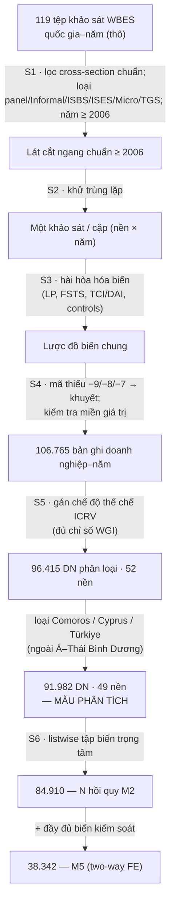

# PHỤ LỤC A — QUY TRÌNH HỢP NHẤT VÀ HÀI HÒA HÓA DỮ LIỆU DOANH NGHIỆP ĐA QUỐC GIA (WBES)

> Phụ lục này trình bày chi tiết, có luận chứng khoa học, quy trình hợp nhất (pooling)
> và hài hòa hóa (harmonisation) các bộ khảo sát doanh nghiệp đơn lẻ theo quốc gia–năm
> thành một bộ dữ liệu cấp doanh nghiệp thống nhất phục vụ phân tích thực nghiệm đa bối
> cảnh của luận án (đặc biệt Nghiên cứu thành phần P7). Đây là **một cấu phần phương pháp
> luận chính thức** của luận án: nó bảo đảm tính minh bạch, khả năng tái lập (replicability)
> và khả năng phản biện trước hội đồng. Toàn bộ quy trình được mã hóa thành tập lệnh tái
> lập (`scripts/build_pooled_dataset.py`, `scripts/wbes_canon.py`) và báo cáo dòng dữ liệu
> kèm theo (`data_wbes/analysis/pooled_dataflow.csv`).

## A.1 Mục đích và vị trí trong thiết kế nghiên cứu

Luận án kiểm định mối quan hệ quốc tế hóa–hiệu quả (I–P) trên một mẫu doanh nghiệp trải
rộng nhiều nền kinh tế và nhiều đợt khảo sát. Bản chất dữ liệu là **lát cắt ngang lặp lại**
(repeated cross-sections) chứ không phải bảng cân bằng (balanced panel): mỗi đợt khảo sát
WBES rút một mẫu doanh nghiệp **độc lập** từ khung mẫu của nền kinh tế tại thời điểm đó,
không theo dõi cùng một doanh nghiệp qua thời gian (Deaton, 1985; Verbeek, 2008). Đặc tính
này quy định toàn bộ chiến lược hợp nhất và nhận dạng (identification) trình bày dưới đây.

Phụ lục A bổ sung cho Chương 3 (Mục 3.3) ở cấp độ **thao tác chi tiết** (operational detail):
trong khi Mục 3.3 nêu nguồn dữ liệu và định nghĩa biến, Phụ lục A tài liệu hóa từng bước
chuyển hóa từ 119 tệp khảo sát thô đến mẫu phân tích cuối cùng, cùng luận chứng cho mỗi
quyết định lọc và hài hòa.

## A.2 Nguồn dữ liệu và đơn vị phân tích

Dữ liệu sơ cấp là **World Bank Enterprise Surveys (WBES)** — bộ khảo sát doanh nghiệp cấp
cơ sở (establishment-level) do Nhóm Ngân hàng Thế giới thực hiện theo một bộ công cụ toàn
cầu chuẩn hóa, áp dụng **chọn mẫu ngẫu nhiên phân tầng** (stratified random sampling) theo
ba chiều: ngành (sản xuất/dịch vụ theo ISIC), quy mô lao động (nhỏ/vừa/lớn) và vùng địa lý
trong mỗi nền kinh tế (World Bank Enterprise Surveys, 2025; World Bank, 2019). Thiết kế
phân tầng này bảo đảm tính đại diện cho khu vực tư nhân chính thức phi nông nghiệp của mỗi
nền kinh tế và cho phép so sánh giữa các nước nhờ bộ câu hỏi cốt lõi đồng nhất (Aterido et
al., 2011). Đơn vị phân tích là **cơ sở kinh doanh** (establishment); biến phụ thuộc, biến
độc lập và biến điều tiết đều được đo ở cấp này.

Một ràng buộc then chốt về tính so sánh: WBES chỉ áp dụng **phương pháp luận toàn cầu thống
nhất từ năm 2006** trở đi; các đợt trước 2006 dùng bộ công cụ và khung chọn mẫu không tương
thích (World Bank, 2019). Do đó luận án giới hạn ở các đợt khảo sát **năm ≥ 2006** để bảo
toàn tính so sánh giữa các đợt và các nước (xem A.3, Bước S1).

## A.3 Quy trình hợp nhất sáu bước (S1–S6) và dòng dữ liệu

Quy trình được thiết kế theo nguyên tắc minh bạch kiểu PRISMA cho dữ liệu thứ cấp: mỗi bước
ghi rõ tiêu chí và số quan sát còn lại, cho phép tái dựng và kiểm tra (Page et al., 2021).

| Bước | Thao tác | Tiêu chí | Kết quả (pool chính thức) |
|---|---|---|---|
| **S1** | Thu thập & lọc loại khảo sát | Giữ lát cắt ngang doanh nghiệp tư nhân chuẩn; **loại** bảng panel, Informal Sector, ISBS, ISES, Micro, và khảo sát theo dõi TGS; giữ **năm ≥ 2006** | — |
| **S2** | Khử trùng lặp | Một khảo sát cho mỗi cặp (nền kinh tế × năm) | — |
| **S3** | Hài hòa hóa biến | Ánh xạ trường câu hỏi dị biệt về một lược đồ chung (A.4) | — |
| **S4** | Xử lý mã thiếu | Mã hóa mã không phản hồi WBES (−9 *Don't Know*, −8 *Refusal*, −7 *N/A*) thành khuyết; kiểm tra miền giá trị | — |
| **S5** | Phân tầng thể chế ICRV | Gán chế độ thể chế; giới hạn khung phân tích **49 nền** Á–Thái Bình Dương | Pool phân loại = **96.415** DN (52 nền) đến khung 49 nền = **91.864** DN |
| **S6** | Mẫu phân tích listwise | Loại quan sát thiếu biến phụ thuộc hoặc biến giải thích trọng tâm | Mẫu phân tích = **91.982**; N hồi quy M2 = **84.910**; mô hình đầy đủ M5 = **38.342** |

*Nguồn số chính thức: tệp pool gộp của luận án (`data_wbes/p7/p7_pooled_clean.csv`), 106.765
bản ghi doanh nghiệp–năm từ 17 đợt khảo sát 2003–2025.*

**Hình A.1.** *Sơ đồ dòng dữ liệu hợp nhất WBES (kiểu PRISMA).*

**Lưu ý tái lập (replication note).** Kho dữ liệu thô tái dựng được công khai trong repo
(`data_wbes/raw_dta/`, 105 sóng chuẩn ≥2006 của 49 nền, 80.523 doanh nghiệp–năm) là **tập
con** của bộ dữ liệu đầy đủ mà nhóm tác giả đã lắp ráp (một số sóng lịch sử chưa được tải
lại). Tập lệnh `scripts/build_pooled_dataset.py` tái lập **quy trình** S1–S6 trên kho hiện
có và cho ra dòng dữ liệu kiểm chứng; các cỡ mẫu **chính thức, đã khóa** của luận án
(96.415 / 91.982 / 84.910) được báo cáo từ tệp pool gốc và là con số được trích dẫn trong
Chương 3–4. Sai khác giữa hai lớp được công bố minh bạch để hội đồng kiểm chứng.

## A.4 Hài hòa hóa biến số (Bước S3)

Thách thức cốt lõi của hợp nhất đa quốc gia là **dị biệt tên trường và mã hóa** giữa các
đợt khảo sát (ví dụ, một số đợt tách xuất khẩu trực tiếp/gián tiếp, một số gộp). Luận án xây
dựng một **lược đồ biến chung** ánh xạ về các module cốt lõi bất biến của bộ công cụ WBES
toàn cầu (World Bank, 2019). Các biến trọng tâm và quy tắc xây dựng:

- **Năng suất lao động (biến phụ thuộc chính):** $\ln(\text{LP}) = \ln(\text{doanh thu hàng năm} / \text{số lao động toàn thời gian})$, từ trường `d2` (tổng doanh thu năm tài chính gần nhất) và `l1` (lao động thường xuyên cuối kỳ). Lựa chọn năng suất lao động làm thước đo hiệu quả là phù hợp với dữ liệu WBES vốn không có giá thị trường (Combs et al., 2005; Richard et al., 2009).
- **Cường độ quốc tế hóa (FSTS):** tổng tỷ trọng xuất khẩu trực tiếp và gián tiếp trên doanh thu, từ `d3b` + `d3c`, giới hạn miền [0, 100]. Doanh nghiệp không xuất khẩu nhận giá trị FSTS = 0 (giá trị hợp lệ, không phải khuyết).
- **Năng lực công nghệ (TCI) và chấp nhận số (DAI):** xây dựng từ các chỉ báo nhị phân (chứng nhận chất lượng quốc tế `b8`; công nghệ nước ngoài cấp phép; website `c22b`; email; thanh toán điện tử), tách biệt theo lập luận thuần khiết cấu trúc (construct purity) ở Mục 2.1.3 và Coltman et al. (2008).
- **Biến kiểm soát:** tuổi doanh nghiệp (từ `b5`), quy mô (log lao động), sở hữu nước ngoài, đặc điểm nhà quản trị, ngành ISIC.

## A.5 Xử lý tính so sánh tiền tệ — vấn đề và giải pháp

Một mối đe dọa hiệu lực (validity threat) đặc thù của pool đa quốc gia là **năng suất lao
động thô được biểu thị bằng nội tệ khác nhau** (ví dụ doanh thu/lao động của Việt Nam tính
bằng VND, của Singapore bằng SGD), khiến **mức** năng suất **không so sánh trực tiếp** giữa
các nước — một dạng "ảo ảnh tiền tệ" (currency artefact). Luận án xử lý vấn đề này theo hai
lớp bổ trợ:

1. **Chuẩn hóa within country–year:** năng suất lao động được chuẩn hóa z (trừ trung bình,
   chia độ lệch chuẩn) **trong từng cặp nền kinh tế × năm** trước khi gộp, đưa mọi quan sát
   về cùng thang vị thế tương đối trong phân phối nội bộ nước–năm. Phép biến đổi này loại bỏ
   khác biệt đơn vị tiền tệ và mặt bằng giá, đồng thời bảo toàn cấu trúc biến thiên bên trong
   mỗi nước (nơi nhận dạng quan hệ I–P diễn ra).
2. **Hiệu ứng cố định hai chiều (two-way fixed effects):** mọi mô hình hồi quy P7 đưa vào
   **hiệu ứng cố định nền kinh tế** và **hiệu ứng cố định năm**. Hiệu ứng cố định nền hấp thụ
   trọn vẹn mọi khác biệt **bất biến theo nước** (gồm đơn vị tiền tệ, mặt bằng giá, thể chế
   nền, văn hóa), do đó hệ số quan hệ I–P được nhận dạng **từ biến thiên bên trong nước**
   (within-country variation), miễn nhiễm với ảo ảnh tiền tệ ở mức (Wooldridge, 2010).

Hệ quả phương pháp luận quan trọng: vì lý do trên, **các so sánh mức năng suất thô giữa các
nước bị loại khỏi suy diễn**; các so sánh giữa nhóm thể chế ICRV ở Chương 4 chỉ dùng **độ
phân tán** (đã chuẩn hóa/PPP–winsorize theo country–year) và **gradient điểm uốn** — những
đại lượng bất biến với đơn vị tiền tệ (xem Mục 4.1.1). Khi cần so sánh **mức** xuyên quốc gia,
luận án dùng tỷ suất không thứ nguyên (ví dụ ROS) hoặc điều chỉnh sức mua tương đương (PPP)
theo Bảng Penn World (Feenstra et al., 2015).

## A.6 Chiến lược hợp nhất kinh tế lượng (pooled repeated cross-sections)

Vì dữ liệu là lát cắt ngang lặp lại chứ không phải panel, ước lượng tuân theo khung **pooled
cross-section với hiệu ứng cố định** thay vì mô hình panel động (Deaton, 1985; Wooldridge,
2010). Cụ thể, mô hình lõi của P7 có dạng bậc hai để nắm bắt quan hệ chữ U ngược (H1):

$$\ln(\text{LP})_{ijt} = \beta_1 \text{FSTS}_{ijt} + \beta_2 \text{FSTS}^2_{ijt} + \mathbf{X}_{ijt}\boldsymbol{\gamma} + \alpha_j + \tau_t + \varepsilon_{ijt}$$

trong đó $i$ là doanh nghiệp, $j$ là nền kinh tế, $t$ là năm khảo sát; $\alpha_j$ và $\tau_t$
lần lượt là hiệu ứng cố định nền và năm; $\mathbf{X}$ là vector biến kiểm soát. Điểm uốn
(turning point) được tính $\text{TP} = -\beta_1/(2\beta_2)$ và kiểm định bằng thủ tục
Lind–Mehlum (2010) cùng Sasabuchi để xác nhận tồn tại cực trị trong miền dữ liệu. Sai số
chuẩn được hiệu chỉnh phương sai thay đổi (heteroskedasticity-robust) và phân cụm theo nền
kinh tế nhằm phản ánh tương quan nội cụm của thiết kế khảo sát phân tầng (Cameron & Trivedi,
2005; White, 1980). Bậc hai (quadratic) được ưu tiên hơn bậc ba (cubic) khi khối lượng phân
phối ở vùng FSTS cao không đủ để nhận dạng điểm uốn bậc ba một cách chính xác.

## A.7 Phân tầng thể chế ICRV (Bước S5)

Mỗi nền kinh tế được gán vào một trong sáu chế độ thể chế (Institutional Context Regime
Variation — ICRV) dựa trên tổ hợp các Chỉ số Quản trị Toàn cầu (Worldwide Governance
Indicators — WGI) của Kaufmann et al. (2011), mức phát triển kinh tế và đặc trưng cấu trúc
thể chế, mở rộng từ khung khoảng trống thể chế của Khanna và Palepu (2010). Việc gán nhóm
đòi hỏi đủ chỉ số WGI; các doanh nghiệp ở nước–năm thiếu chỉ số thể chế không được phân loại
(chênh lệch giữa 106.765 bản ghi thô và 96.415 bản ghi phân loại được ở Bước S5). Khung phân
tích cuối cùng giới hạn ở **49 nền kinh tế châu Á và Thái Bình Dương**, loại ba nền ngoài
khu vực (Comoros, Cyprus, Türkiye) khỏi mẫu phân tích chính trong khi vẫn giữ chúng ở pool
phân loại 52 nền cho mục đích robustness (riêng Comoros được dùng trong kiểm định độ vững
mở rộng của P8).

## A.8 Trọng số mẫu và tính đại diện

Vì thiết kế WBES là phân tầng với xác suất chọn không đều, các thống kê **mô tả cấp quần
thể** (population-level) cần dùng trọng số chọn mẫu để bảo đảm tính đại diện. Tuy nhiên, đối
với **suy diễn hồi quy có hiệu ứng cố định**, luận án theo khuyến nghị của Solon, Haider và
Wooldridge (2015): khi mô hình đã kiểm soát các chiều phân tầng (quy mô, ngành qua biến kiểm
soát; nền qua hiệu ứng cố định), ước lượng OLS không trọng số cho hệ số nhất quán và thường
hiệu quả hơn; trọng số được dùng trong phân tích độ vững để kiểm tra tính ổn định. Cách tiếp
cận này cân bằng giữa tính đại diện và hiệu quả ước lượng một cách có luận chứng.

## A.9 Xử lý dữ liệu thiếu (Bước S4 & S6)

Mã không phản hồi của WBES (−9 *Don't Know*, −8 *Refusal*, −7 *Not Applicable*) được mã hóa
nhất quán thành giá trị khuyết trước mọi phép tính. Mẫu phân tích áp dụng **xóa theo danh
sách** (listwise deletion) trên tập biến trọng tâm, khiến N giảm dần khi thêm biến kiểm soát
(rõ nhất ở biến sở hữu nước ngoài, khuyết ~50% ở các nền nhỏ và sóng sớm). Giả định nền tảng
là dữ liệu khuyết ngẫu nhiên có điều kiện (missing at random) trên các hiệp biến quan sát
được; luận án báo cáo minh bạch sự suy giảm N qua các đặc tả và kiểm tra tính ổn định của
điểm uốn để bảo đảm kết quả không bị chi phối bởi cơ chế khuyết (Little & Rubin, 2019).

## A.10 Khả năng tái lập và hạn chế

**Tái lập.** Toàn bộ quy trình được mã hóa xác định (deterministic) và công khai:
`scripts/wbes_canon.py` (chuẩn hóa định danh nước–năm, quy tắc lọc), `scripts/build_pooled_dataset.py`
(hợp nhất + hài hòa + dòng dữ liệu), với báo cáo `data_wbes/analysis/pooled_dataflow.csv`.
Việc xử lý do thiếu Stata được thực hiện bằng Python (pandas/numpy) — một giải pháp thay thế
hợp lệ cho phân tích kinh tế lượng lát cắt ngang gộp khi không có license Stata.

**Hạn chế.** (i) Dữ liệu lát cắt ngang lặp lại không cho phép theo dõi quỹ đạo doanh nghiệp,
hạn chế suy diễn nhân quả động; (ii) năng suất lao động là proxy cho hiệu quả, không phải
TFPR trực tiếp; (iii) đo lường DAI bị giới hạn ở proxy website cấp nền tảng do ràng buộc dữ
liệu; (iv) kho thô tái lập hiện là tập con của bộ lắp ráp đầy đủ. Các hạn chế này được nêu
nhất quán với phần hạn chế ở Chương 5.

---

*Liên kết tập lệnh & dữ liệu: `scripts/build_pooled_dataset.py`, `scripts/wbes_canon.py`,
`scripts/cd1_descriptives_pipeline.py`; `data_wbes/analysis/pooled_dataflow.csv`,
`DATA_UPDATE_MANIFEST.md`, `CANONICAL_RECONCILIATION.md`.*
