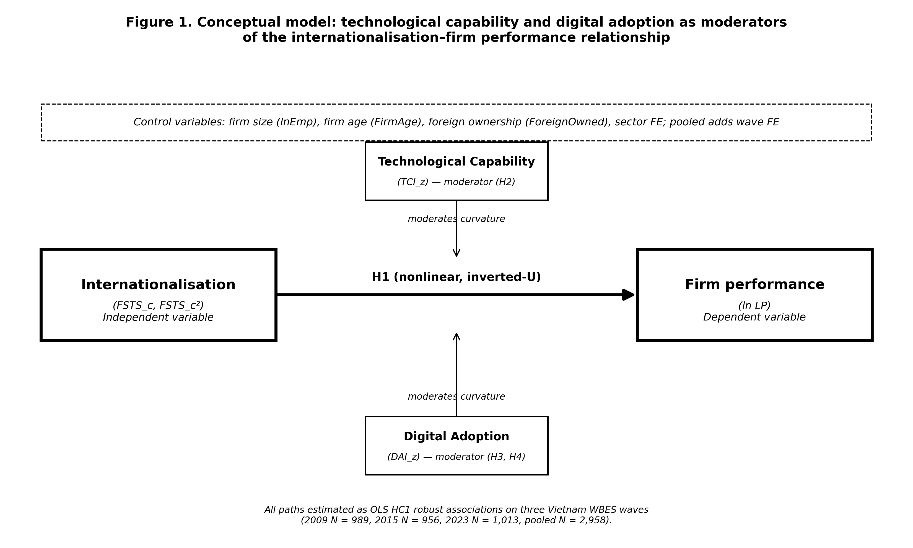
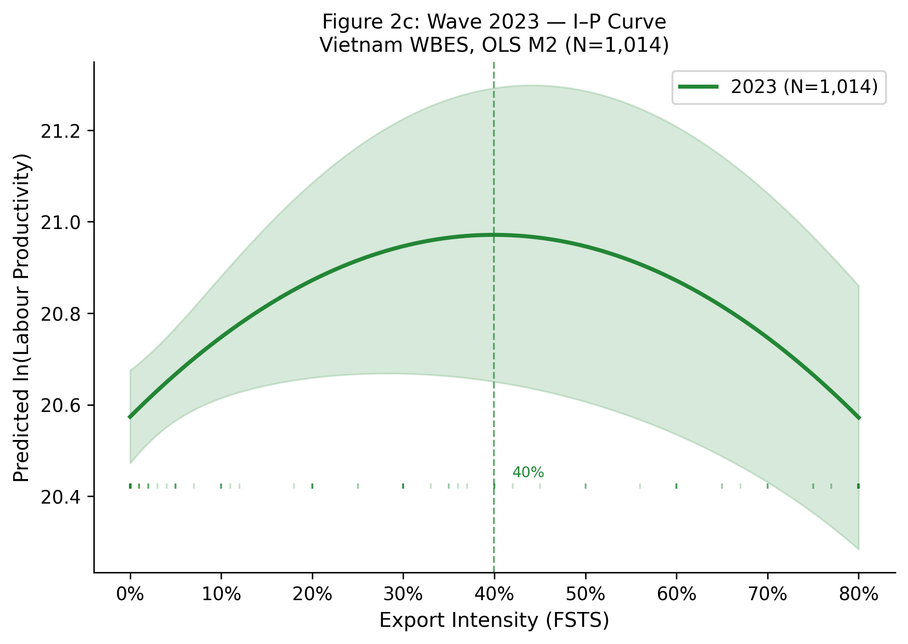
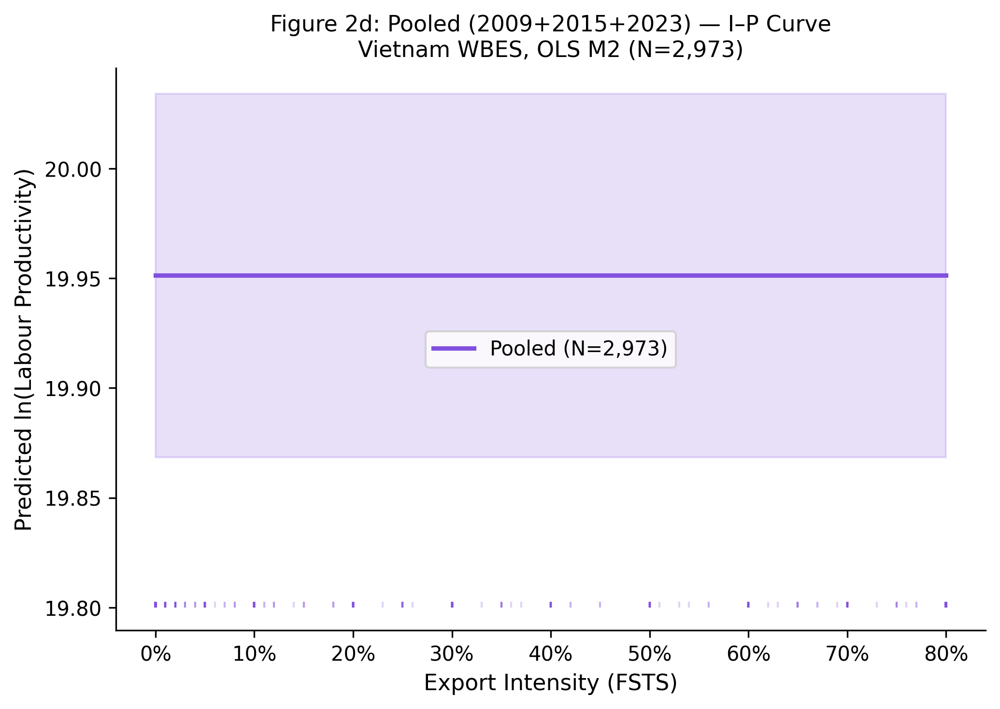
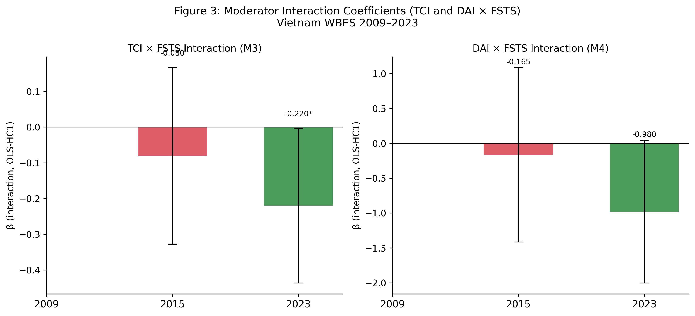

# Revisiting the Internationalisation–Performance Relationship in an Emerging Market: The Roles of Technological Capability and Foundational Digital Adoption

*Author details removed for blind review*

*6 May 2026*

*Target journal: Asia Pacific Journal of Management (APJM)*

**Manuscript classification:** research article.

**Word count** (main text excluding abstract, references, tables and figures): approximately 6,800 words.

**Tables:** 4 (Table 1 descriptives; Table 2 focal coefficient summary; Table 3 robustness panels; Table 4 turning points).

**Figures:** 6 (Figure 1 conceptual model; Figures 2a–2d wave-specific FSTS curves; Figure 3 moderation curves at p25 vs p75 of moderator).

---

## Abstract
Purpose. This study revisits the internationalisation–performance relationship in an emerging
market and examines how technological capability and foundational digital adoption are associated with firms' productivity under conditions of institutional and digital transition. Focusing
on Vietnam, it asks whether export intensity is nonlinearly associated with labour productivity
and whether technological capability and foundational digital adoption play distinct roles across
survey waves.
Design/methodology/approach. The study uses three waves of World Bank Enterprise Survey
data for Vietnam (2009, 2015 and 2023; pooled N = 2,958) and estimates wave-specific and
pooled OLS models with HC1 robust standard errors, quadratic export-intensity terms and interaction specifications. The analysis distinguishes a Technological Capability Index based on
internationally recognised quality certification and foreign-licensed technology from a foundational Digital Adoption Index based on website presence, with no shared items between the two
constructs. Supplementary checks assess the stability of the main findings.
Findings, The productivity benefits of internationalisation are concentrated primarily at the participation margin, the step from non-exporting to exporting, while within-exporter intensity yields diminishing to null marginal returns (Panel H). The full-sample inverted-U (turning points 39–46% FSTS) is identified mainly through this participation step rather than through dense curvature within the exporter subsample. Technological capability is positively associated with productivity in all three waves and in the pooled sample, and its moderating role is more stable than that of foundational digital adoption. Foundational digital adoption is positive in 2009 and 2023, null in 2015, and only shows within-sample detectable moderation in 2023. Instrumental-variable estimation (Panel K) yields a null instrumented DAI coefficient (β = 0.018, p = .942, first-stage F = 34.6), indicating that the OLS-estimated positive DAI association is likely selection-driven rather than causal.

Originality/value. The study contributes to research on emerging markets by distinguishing
foreign-technology / standards capability from foundational digital adoption and by showing
that pooled digital effects can mask substantial temporal heterogeneity. The findings suggest
that the productivity relevance of basic digital adoption is context-sensitive and wave-specific
rather than uniformly stable across stages of internationalisation.

Keywords: internationalisation–performance; emerging markets; digital adoption; technological capability; Vietnam; firm productivity.

JEL classification: F23 (multinational firms; international business); O33 (technological change:
choices and consequences); D22 (firm behaviour: empirical analysis); L25 (firm performance);
O53 (economywide country studies: Asia including Middle East).

Paper type: Research paper.

## Highlights
 The internationalisation–performance relationship in Vietnamese firms is robustly nonlinear: the Lind–Mehlum test rejects monotonicity in all three waves (2009 p = .006, 2015 p
= .009, 2023 p = .013) and in the pooled sample (p < .001), with turning points clustered
between 39 and 46 % of direct-export intensity.

 Technological capability and digital adoption are separated as non-overlapping primary
measures: $\tilde{\mathrm{TCI}}$ is the within-wave standardised mean of quality certification and foreignlicensed technology, whereas $\tilde{\mathrm{DAI}}$ is the within-wave standardised website-based digitalpresence indicator.

 $\tilde{\mathrm{TCI}}$ is positively associated with productivity in all three waves (β = 0.215, 0.128,
0.123) and pooled (β = 0.179, p < .001), and moderates the curvature in three of four
panels (M3 joint p = .040, .713, .027 and .003).

 $\tilde{\mathrm{DAI}}$ is strongest in 2009 (β = 0.175, p < .001), null in 2015 (β = -0.044, p = .377),
positive in 2023 (β = 0.095, p = .038) and pooled (β = 0.078, p = .004); the cross-wave
shifts are statistically distinguishable (Paternoster z = 3.353 between 2009 and 2015; z =
-2.051 between 2015 and 2023).

 DAI moderation is concentrated in 2023, where $\mathrm{FSTS}^{c}$ × $\tilde{\mathrm{DAI}}$ = -0.912 (p = .043)
and the M8 joint test is marginal (p = .062); the pooled M8 joint test is also marginal (p
= .083), driven by 2023 rather than by a stable cross-period moderation.

## 1. Introduction
### 1.1 Background and motivation
Vietnam offers an analytically valuable setting for revisiting the internationalisation–performance
(I–P) relationship because firms expand abroad under conditions of institutional transition, uneven capability accumulation, and rapidly changing digital infrastructure.

In such settings,

internationalisation should not be assumed to generate a simple linear performance premium.
Firms may gain access to larger markets, benefit from learning, and diversify revenue streams,
but they may also face rising coordination costs, information-processing burdens, and organisational strain as their foreign involvement deepens (Wright et al., 2005; Cuervo-Cazurra and
Genc, 2008; Wu et al., 2016).
This tension lies at the heart of the I–P literature. A long tradition of research has argued
that internationalisation can improve performance at lower and intermediate levels through scale,
learning, and diversification, while also generating diminishing or negative returns at higher levels
because of complexity and coordination burdens. Meta-analytic evidence strongly supports the
view that nonlinearity is a central feature of this relationship rather than an empirical anomaly
(Vernon, 1979; Lu and Beamish, 2004; Hennart, 2007; Coviello et al., 2017; Marano et al., 2016).
Digitalisation adds a further layer of complexity to this debate.

Digital tools can reduce

communication frictions, accelerate transactions, and support coordination across borders. Yet
those benefits do not arise automatically. Their realised value depends on whether firms possess
the organisational depth, absorptive capacity, and complementary routines needed to translate
digital adoption into productivity gains (Cohen and Levinthal, 1990; Vial, 2019; Verhoef et al.,
2021; Stallkamp and Schotter, 2021; Petricevic and Teece, 2019). For this reason, digital capability should not be treated as a universally beneficial resource whose payoff is constant across
firms and over time.
The Vietnamese setting makes this issue especially important. Because firms are embedded
in an economy undergoing capability upgrading and digital transition, both the benefits of
internationalisation and the payoff from digitalisation may vary across stages of development.
This raises a central question for the present study: does digital capability in Vietnam function
as a stable performance-enhancing asset, or does it operate as a stage-contingent resource whose
value changes over the lifecycle of internationalisation?
Three institutional turning points shape the observation window. Vietnam acceded to the
World Trade Organization in early 2007, which opened the period preceding the 2009 wave and
converted a domestically oriented exporter cohort into one with broader market exposure but
limited absorptive infrastructure. The 2015 wave captures the middle of a second phase, in which
expanding manufacturing exports coexisted with under-developed digital trade infrastructure,
weak cross-border logistics integration, and an exporter cohort still concentrated in labourintensive segments. The 2023 wave follows the launch of the National Digital Transformation
Programme in 2020, the rapid expansion of cross-border e-payment and e-commerce platforms,
and the rebalancing of foreign direct investment toward digitally-mediated and services-linked
production. The three waves therefore observe firms under structurally different combinations
of internationalisation pressure and digital infrastructure availability, which is what makes the

lifecycle reading testable rather than purely conceptual.
These shifts are not cosmetic. The composition of the exporter cohort itself evolves across
the three waves: the share of firms reporting any positive direct-export intensity declines as
services and FDI-linked supply-chain firms enter the sample, while the average level of foundational digital adoption rises with the diffusion of websites, electronic payment systems, and
digital transaction interfaces. Reading the I–P relationship and the digital-adoption channel as
fixed structural facts across this fourteen-year window misses the fact that the underlying firm
population, the binding coordination costs, and the institutional scaffolding for cross-border
trade all change materially.

### 1.2 Research gap
Three gaps motivate this study.

First, existing work often treats digitalisation as a broadly

positive resource without paying sufficient attention to temporal and contextual variation in its
payoff. Such a treatment risks implying that digital adoption produces a relatively stable performance premium across firms and across stages of economic transition (Strange and Zucchella,
2017; Goldfarb and Tucker, 2019). In reality, digitalisation may generate uneven returns because
firms differ in scale, routines, and complementary capability.
Second, the distinction between technological capability and digital adoption remains underdeveloped. Technological capability refers to deeper firm-internal stocks of learning, problemsolving, process improvement, and innovation capacity (Lall, 1992). Foundational digital adoption, by contrast, reflects a more basic layer of digital readiness and digitally enabled interfaces
or transaction mechanisms (Bharadwaj et al., 2013; Verhoef et al., 2021; Hanelt et al., 2021;
Brouthers et al., 2016). Although these constructs are related, they should not be treated as
interchangeable. Collapsing them into a single umbrella variable can reduce construct clarity
and blur the mechanisms linking digitalisation to performance.
Third, pooled estimates may obscure substantial lifecycle heterogeneity. In a setting such
as Vietnam, where firms and institutions pass through distinct stages of transition, the role of
internationalisation, technological capability, and digital adoption may vary considerably across
survey waves. A pooled model is useful for identifying average effects, but it is insufficient if
the underlying relationships shift across time. A design that combines pooled and wave-specific
analysis is therefore necessary to determine whether the observed effects are stable or stage
contingent.

Recent meta-analytic work reinforces this concern. Pisani, Garcia-Bernardo, and Heemskerk (2020, SMJ) demonstrate that the inverted-U relationship between internationalisation and performance weakens substantially, and sometimes disappears, under more rigorous identification in cross-national pooled samples, suggesting that aggregation across heterogeneous institutional contexts inflates apparent functional-form regularity. Wu, Fan, and Chen (2022, MIR) extend this argument by showing in a meta-analysis of emerging-market multinationals (EMNEs) that institutional context moderates I–P effect sizes more powerfully than firm-level capability variables. Taken together, these findings imply that within-country longitudinal designs, which hold institutional context constant while varying time, provide a more credible test of whether the inverted-U is an artefact of cross-national pooling or a genuine relationship that persists as the institutional environment evolves. Vietnam's three-wave WBES panel (2009, 2015, 2023) provides exactly this design.

### 1.3 Contribution
This study makes three contributions to the literature.

First, it refines the I–P debate by

showing that the Vietnamese evidence supports a nonlinear relationship, but that the salience
and visibility of that relationship vary across time. Rather than treating nonlinearity as a fixed
structural fact that appears identically in every period, the analysis shows that the I–P curve
must be read in conjunction with the broader capability environment.
Second, the study improves construct validity by separating technological capability from
foundational digital adoption. This distinction matters theoretically because deeper capability
stocks and basic digital enablement may generate performance through different channels.

It

also matters empirically because the two constructs do not exhibit identical patterns across the
Vietnamese waves.
Third, the study introduces a lifecycle interpretation of digital internationalisation.

The

evidence suggests that digital capability is neither a universally stable premium nor a uniformly
ineffective resource. Instead, it is an uneven and stage-dependent source of performance heterogeneity. This perspective helps explain why pooled average effects may coexist with substantial
wave-specific differences.

A fourth contribution is contextual: Vietnam's empirical pattern provides a participation-and-intensity decomposition showing that the robustly identified inverted-U (turning point 39–46 % FSTS) is driven primarily by the participation margin: within the exporter subsample, intensity variation yields flat to diminishing returns (Panel H), qualifying the conventional reading of the inverted-U pattern. The divergence between this pattern and those documented in digitally advanced economies, where the coordination-cost mechanism is attenuated by comprehensive digital infrastructure, points toward institution-level mechanisms as candidate moderators of I–P curve location. This within-context evidence anchors the digitally transitional end of the institutional spectrum.

### 1.4 Roadmap
The remainder of the paper is organised as follows. Section 2 develops the theoretical framework
and hypotheses.

Section 3 describes the data, variables, and empirical strategy.

Section 4

presents the results. Section 5 discusses the theoretical and managerial implications. Section 6
concludes.

## 2. Theory and hypotheses
### 2.1 Internationalisation and firm performance
The relationship between internationalisation and firm performance is unlikely to be linear in
a transitional economy such as Vietnam. Foreign expansion can improve performance through
greater market reach, diversification, and learning from external environments. Firms may use
internationalisation to spread fixed costs, access new customers, and acquire knowledge that
supports operational improvement.
At the same time, deeper international involvement often generates coordination costs and
organisational burdens. Firms must manage multiple markets, reconcile diverse customer demands, process more information, and sustain greater managerial control. As foreign expansion
intensifies, these costs may grow faster than the benefits, producing diminishing returns or
even a decline in performance. This basic logic underpins the classic nonlinear view of the I–P
relationship (Contractor, 2007; Hennart, 2011; Marano et al., 2016). Process accounts of internationalisation, including the updated Uppsala framework, similarly emphasise that performance
gains and adjustment costs unfold incrementally as firms accumulate market knowledge and
commitment (Vahlne and Johanson, 2017; Knight and Liesch, 2016).
This argument is especially plausible in Vietnam because firms operate under uneven capability conditions. Some firms may convert foreign expansion into learning and scale advantages,
whereas others may encounter organisational strain sooner. The relevant expectation is therefore
not a uniformly positive slope, but a nonlinear relationship in which gains from internationalisation become progressively more difficult to sustain.
Two opposing forces underpin the curvature.

On the upside, increasing direct-export in-

tensity creates scale economies, knowledge spillovers from foreign customers, and learning-byexporting effects that lift productivity (Wagner, 2007).

On the downside, coordinating pro-

duction for institutionally distant markets imposes information-processing costs that grow nonlinearly: each additional foreign market adds compliance demands, customer-relationship overhead, and supply-chain dependencies whose marginal coordination cost rises faster than the

marginal scale benefit beyond a threshold. In a transitional setting where ports, trade-finance
institutions, digital marketplaces, and dispute-resolution mechanisms are still maturing, this
threshold may bind at a lower level of export intensity than in mature economies, sharpening
the curvature relative to the meta-analytic baseline (Hennart, 2007; Wagner, 2007; Marano et al.,
2016). The mechanism is institutional transaction costs (Williamson, 1985; Hennart, 2007): in a transitional economy, enforcement gaps, logistics deficits, and information asymmetries raise the marginal cost of managing each additional foreign market, causing the post-threshold decline to bind at lower export intensity than in settings where digital infrastructure and contract-enforcement quality have already absorbed much of this friction.
A second consideration arises from the structure of direct-export intensity in WBES Vietnam: the FSTS variable is bounded at zero and is heavily zero-inflated (the non-exporter share
is 71.6 % in 2009, 79.3 % in 2015 and 81.2 % in 2023; pooled 77.4 %). The internationalisation–
performance relationship therefore comprises two analytically distinct margins. The participation margin is the step from FSTS = 0 to FSTS > 0, where firms cross the entry threshold into
international markets and absorb fixed entry costs. The intensity margin is the variation of FSTS
within the exporter subsample.

Theory predicts that productivity gains can accrue at either

margin: the participation margin captures learning-by-exporting and exposure to foreign-market
demand; the intensity margin captures scale economies on the upside and coordination burdens
on the downside (Bernard et al., 2007; Wagner, 2007). In transitional economies with thin export infrastructure, the participation margin is plausibly the dominant productivity-enhancing
margin, while the intensity margin may show diminishing or null returns once participation has
been crossed.

H1. The internationalisation–performance relationship in Vietnam is non-monotonic
in the full sample and is best understood through a participation-and-intensity structure in a zero-inflated export setting. (H1a, participation margin) Crossing from
non-exporting (FSTS = 0) to exporting (FSTS > 0) is positively associated with
labour productivity, capturing the learning-and-scale jump at entry. (H1b, intensity
margin) Within the exporter subsample, additional direct-export intensity is expected
to exhibit weaker, diminishing, or non-significant marginal returns relative to the
participation margin.

The exporter-only specification (Panel H) provides the most direct test of H1b: if the inverted-U curvature reflects within-exporter intensity variation, the quadratic term should remain significant in that sub-sample. The near-flat pattern observed in Panel H (pooled $(\mathrm{FSTS}^{c})^2$ β = −0.200, p = .660) instead indicates that the participation margin (H1a) is the dominant source of the full-sample curvature.

### 2.2 Foreign-technology and standards capability and firm performance
Following the Lall (1992) tradition for emerging-market firms, this paper uses a measurementtight reading of technological capability: a foreign-technology and standards capability that captures a firm's exposure to externally validated technological inputs, internationally recognised
quality certification and foreign-licensed technology. This is one observable facet of the broader
Cohen and Levinthal (1990) absorptive-capacity construct and the dynamic-capability construct
of Teece (2007), but the present measure does not claim to identify the full absorptive-capacity
stock; it captures the externally facing component of that stock (Eisenhardt and Martin, 2000;
Karna et al., 2016).

In international settings, this externally facing capability is particularly

important because firms must respond to unfamiliar markets, meet foreign quality standards,
and integrate externally licensed technology into organisational routines.
A firm with stronger foreign-technology / standards capability is more likely to transform
international exposure into productivity gains.

It can adjust products and processes to meet

foreign requirements more effectively, integrate licensed foreign technology into production, and
cope better with the operational demands created by export activity. Even when this capability

does not fundamentally alter the curvature of the I–P relationship, it should improve the firm's
overall performance level by raising the productivity floor among exposed firms.
This implies a positive direct association between foreign-technology / standards capability
and firm performance in Vietnam. We treat it here as a construct that should raise the firm's
capacity to benefit from internationalisation and should also support productivity more broadly,
without assuming that it indexes the full innovation-and-R&D dimension.
Operationally, the primary $\tilde{\mathrm{TCI}}$ is built from two items: internationally recognised quality
certification (b8) and foreign-licensed technology (e6). These items measure exposure to foreigntechnology and standards channels rather than internal R&D effort or patent activity. A broader
innovation-augmented composite ($\mathrm{TCI}_{\text{full}}$, adding product innovation h1 and R&D activity h8)
is reported in 4.5 Panel A as a boundary condition: if direct effects attenuate when innovation
items are added, this indicates that the primary measure is informative specifically about the
foreign-technology / standards channel, not the broader absorptive-capacity stock.

H2. Foreign-technology / standards capability ($\tilde{\mathrm{TCI}}$) is positively associated with
firm performance in Vietnam.

### 2.3 Website-based digital presence and firm performance
The primary $\tilde{\mathrm{DAI}}$ used in this paper is a website-based digital presence measure: a binary indicator of whether the firm has its own website. This is a foundational and cross-wave-comparable
marker of digital adoption, it does not measure transaction-level digital integration, electronic
payment infrastructure, or digital transformation in the Bharadwaj et al. (2013) / Verhoef et al.
(2021) / Vial (2019) sense. We use it here precisely because it is the only digital indicator the
WBES instrument carries comparably across the 2009 / 2015 / 2023 waves; transaction-level
items such as electronic-payment shares appear only in the 2023 questionnaire (Brouthers et al.,
2016; Goldfarb and Tucker, 2019).
For firms participating in foreign markets, even foundational website adoption may be valuable. A website lowers the cost at which foreign customers can locate the firm, supports asynchronous communication across time zones, and signals basic legitimacy in international transactions. The scope of these gains is bounded, a website does not by itself integrate transactions,
supply chains, or decision-making, and the realised payoff depends on whether the firm has
the scale and routines to translate online visibility into export business.
Website-based digital presence should therefore show a positive average association with
performance, but not necessarily one that is uniform across waves and stages. The information
value of a website may have shifted across the 2009–2023 window:

in 2009 a website was a

distinguishing market interface; by 2023 it is closer to a routine marker of basic digital presence.
The 5 discussion takes this proxy obsolescence reading seriously as one alternative to a pure
stage-contingency story.
Following Verhoef et al. (2021), digital capability can be located on a four-tier hierarchy: Tier
1, digital presence (websites, e-mail); Tier 2, digital communication and basic e-commerce;
Tier 3, digital process integration (electronic payment, supply-chain digitisation); Tier 4, dynamic digital capability (data-driven decision-making, AI integration). The primary $\tilde{\mathrm{DAI}}$

anchors at Tier 1 only. A Tier 3-style extension ($\mathrm{DAI}_{\text{rich}}$) is reported in 4.5 Panel B for the
2023 wave, where electronic-payment items become available. The label foundational website
adoption therefore tracks what the construct can actually identify across the 2009–2023 window.

Because $\tilde{\mathrm{DAI}}$ is anchored at Tier 1 (website presence only), the construct is not comparable to digital-adoption measures that also capture Tier 2 transaction-enabling items such as electronic-payment intensity. In settings where Tier 2–3 digital infrastructure is already mature and widely accessible, basic digital adoption may interact with export intensity through a different mechanism, functioning as a conditional scaling complement rather than a coordination-strain amplifier, because the surrounding ecosystem can absorb cross-border transaction processing that a website alone cannot.

H3. Website-based digital presence ($\tilde{\mathrm{DAI}}$) is positively associated with firm performance in Vietnam on average.

### 2.4 Stage-contingent digital value
The core theoretical claim of this study is that foundational digital adoption is stage contingent.
In early phases of internationalisation, digital tools may create relatively direct gains by helping
firms communicate faster, access markets more easily, and manage transactions more efficiently.
In later phases, however, the benefits of digitalisation may become more conditional because
firms face more complex coordination demands.

Under such conditions, the value of founda-

tional digital adoption depends increasingly on whether digital tools are embedded in broader
organisational routines and aligned with export scale (Banalieva and Dhanaraj, 2019; Petricevic
and Teece, 2019).
This argument implies that digitalisation can be a double-edged sword in a transitional
economy. It may generate observable gains, but those gains are uneven and dependent on timing,
scale, and complementary capability. In some phases, digital adoption may operate mainly as a
direct performance-enhancing factor. In others, it may weaken, disappear, or become conditional
on the firm's level of internationalisation.
This expectation is particularly relevant in Vietnam, where firms operate in an environment
of transition rather than full institutional and capability stability. A lifecycle interpretation is
therefore more appropriate than a uniform premium interpretation.
Two further considerations sharpen the prediction. First, when the exporter cohort is concentrated in low-export-intensity manufacturing, foundational digital tools mainly perform a
market-access role: they help the firm find customers, communicate prices and product information, and process simple transactions. The marginal productivity gain from this role is positive
but broadly distributed across the export-intensity range.

Second, when the exporter cohort

shifts toward firms that operate at higher export intensity and engage in tighter cross-border
coordination, the same Tier 1–2 digital tools begin to interact with the marginal coordination
cost of additional foreign markets. Whether this interaction is substitutive (digital tools lower
coordination cost and amplify the productivity dividend) or complementary with diminishing
returns (digital tools at high intensity reveal the absence of deeper integration and amplify coordination strain) is fundamentally an empirical question that this paper treats as the test of
H4.

H4 (exploratory). The productivity relevance of foundational digital adoption ($\tilde{\mathrm{DAI}}$)
varies across phases of internationalisation and institutional transition. Any moderation of the export-intensity curve by foundational digital adoption is therefore
expected to be wave-specific rather than uniformly present across periods, with the
strongest within-sample detectability anticipated in 2023.

Technological
Capability ($\tilde{\mathrm{TCI}}$)
H2
H2 (mod.)

InternationalisationH1 (non-monotonic) Firm performance
($\mathrm{FSTS}^{c}$, $(\mathrm{FSTS}^{c})^2$ )
(ln labour productivity)
H4 (mod., exploratory)
H3

Foundational
Digital Adoption ($\tilde{\mathrm{DAI}}$)

Controls: $\ln(\mathrm{Emp})$, FirmAge, ForeignOwned, sector FE [+ wave FE]

*Figure 1.* Conceptual model. The independent variable (internationalisation, $\mathrm{FSTS}^{c}$ and $(\mathrm{FSTS}^{c})^2$) and the dependent variable (firm performance, ln labour productivity) anchor the IV–DV spine. Technological capability ($\tilde{\mathrm{TCI}}$) and foundational digital adoption ($\tilde{\mathrm{DAI}}$) act as direct effects (H2, H3) and as moderators of the FSTS curve (H2 moderation, H4 exploratory moderation). Controls are entered additively. Wave fixed effects apply to the pooled specification only.

## 3. Data, variables, and empirical strategy
### 3.1 Data structure
The empirical analysis uses harmonised firm-level evidence for Vietnam across three waves of the
World Bank Enterprise Survey: 2009, 2015 and 2023 (World Bank, 2010, 2016, 2024). Estimating
the models separately by wave makes it possible to observe whether relationships are stable or
time specific, while pooled estimation identifies average effects across the broader period.
The effective estimation sample varies across model specifications because of missing values in
the capability variables. In the full wave-specific models, the usable samples are 989 observations
for 2009, 956 for 2015, and 1,013 for 2023. The pooled full model contains 2,958 observations.
This structure provides sufficient variation to compare direct effects and conditional patterns
across stages.

### 3.2 Variables
Firm performance is measured by log labour productivity ($\ln(\mathrm{LP})$). Internationalisation is measured by direct-export intensity (FSTS), mean-centred within wave ($\mathrm{FSTS}^{c}$) and squared

($\mathrm{FSTS}^{c}$ ) so that linear and quadratic terms can be entered jointly to test for nonlinearity.
The analysis uses two distinct capability constructs.

The Technological Capability Index

($\tilde{\mathrm{TCI}}$) is interpreted narrowly as a foreign-technology and standards capability measure, international quality certification and foreign-licensed technology, that proxies a firm's exposure to external technological standards rather than the full Cohen-Levinthal absorptive-capacity
stock (Lall, 1992; Cohen and Levinthal, 1990). The Digital Adoption Index ($\tilde{\mathrm{DAI}}$) is interpreted narrowly as website-based digital presence, foundational website adoption, and not
as a measure of transaction-level digital integration or digital transformation (Bharadwaj et al.,
2013; Verhoef et al., 2021; Nambisan et al., 2019). Each composite is z-standardised within wave so that the reported coefficients are comparable in standard-deviation units; the tilde notation $\tilde{\mathrm{TCI}}$ and $\tilde{\mathrm{DAI}}$ marks the standardised variant used throughout the empirical specifications. This separation is deliberate because the study is interested in whether the two domains exhibit different empirical roles, while
keeping the construct labels tight against what the underlying WBES items actually measure.
Item-level construction is as follows. The outcome is $\ln(\mathrm{LP})$ = ln(d2 / l1), where d2 is total
annual sales and l1 is permanent full-time employees. Internationalisation is FSTS = d3c / 100,

mean-centred within wave ($\mathrm{FSTS}^{c}$) and squared ($\mathrm{FSTS}^{c}$ ). The primary Technological Capability Index ($\tilde{\mathrm{TCI}}$) is the within-wave standardised mean of b8 (internationally recognised
quality certification) and e6 (foreign-licensed technology), each recoded from WBES 1/2 to 1/0
binary form.

The primary Digital Adoption Index ($\tilde{\mathrm{DAI}}$) is the within-wave standardised

website-presence indicator c22b, recoded from 1/2 to 1/0. Under this revised primary specification, no item is shared between the TCI and DAI composites, e6 belongs exclusively to the
capability construct, while c22b alone serves as a harmonised cross-wave proxy for basic digital
presence. Cross-wave-comparable transaction-level digital items are absent from the 2009 and
2015 instruments, so $\tilde{\mathrm{DAI}}$ should be interpreted as a Tier 1–2 digital-adoption measure rather
than as a fully integrated digital-capability construct (Bharadwaj et al., 2013; Verhoef et al.,
2021).
Two enriched composites are used in the 4.5 robustness panel where item availability allows.
$\mathrm{TCI}_{\text{full}}$ adds h1 (introduced new or significantly improved product) and h8 (R&D expenditure
indicator) to the TCI items in 2015 and 2023, where h1 and h8 are present. $\mathrm{DAI}_{\text{rich}}$, constructed only for 2023, extends the website-presence indicator with k33 (share of sales received
via electronic payment) and k38 (share of supplier payments made via electronic payment), in
both continuous (k33 / 100, k38 / 100) and binary (k33 > 0, k38 > 0) variants. $\mathrm{DAI}_{\text{rich}}$ thus
moves from basic digital presence toward a transaction-enabling digital-adoption construct, but
it is treated as a measurement-depth robustness check rather than as the primary specification
because k33 and k38 are unavailable in the 2009 and 2015 waves.

**Construct-tier comparability note.** The $\tilde{\mathrm{DAI}}$ construct in this paper is a Tier 1-only indicator (website binary c22b). A richer Tier 1+2 composite, combining website presence with electronic payment intensity (k33/k38), would in principle capture transaction-enabling mechanisms that scale with cross-border coordination demands, but k33 and k38 are unavailable in the 2009 and 2015 waves of WBES Vietnam, precluding a cross-wave Tier 1+2 specification. The negative Tier 1-only interaction documented here ($\mathrm{FSTS}^{c}$ × $\tilde{\mathrm{DAI}}$ = −0.912, p = .043) is therefore interpreted as construct-tier obsolescence: Tier 1 website presence has become a minimum-threshold credential in Vietnam's maturing digital environment and no longer differentiates firms' cross-border coordination capacity at high export intensity. The $\mathrm{DAI}_{\text{rich}}$ robustness composite available in the 2023 wave partially bridges this gap for within-wave sensitivity analysis, but cross-wave comparability limits its use as the primary measure.

Controls are standard. Firm size $\ln(\mathrm{Emp})$ = ln(l1). Firm age FirmAge = survey year minus
b5 (year established). Foreign ownership ForeignOwned = 1 if b2b (percentage of equity owned
by private foreign individuals or firms) > 0. Sector fixed effects use the first digit of a4b (broad
ISIC code) for the 2009 and 2015 waves and the first digit of a4a for the 2023 wave, where a4b
is not in the public release. Pooled specifications add wave fixed effects to absorb broad period
differences in the productivity baseline.
A note on missing-code handling.

The WBES instrument codes don't-know and refused

responses as -9. We treat -9 as missing before any composite is built and apply listwise deletion
on the focal variable set ($\ln(\mathrm{LP})$, $\ln(\mathrm{Emp})$, FirmAge, ForeignOwned, FSTS, $\mathrm{TCI}_{\text{thin}}$, $\mathrm{DAI}_{\text{thin}}$,
sector1). The resulting analytic samples are 989, 956, and 1,013 observations for 2009, 2015,
and 2023 respectively; pooled N is 2,958.

### 3.3 Model sequence
The empirical strategy follows a nested sequence of OLS models estimated with HC1 heteroscedasticity-robust standard errors (MacKinnon & White, 1985). The full specification of interest is

$$
\begin{aligned}
\ln(\mathrm{LP}_i) =\;& \alpha + \beta_1\,\mathrm{FSTS}^{c}_i + \beta_2\,(\mathrm{FSTS}^{c}_i)^2 + \beta_3\,\tilde{\mathrm{TCI}}_i + \beta_4\,\tilde{\mathrm{DAI}}_i \\
& + \beta_5\,(\mathrm{FSTS}^{c}_i \times \tilde{\mathrm{DAI}}_i) + \beta_6\,((\mathrm{FSTS}^{c}_i)^2 \times \tilde{\mathrm{DAI}}_i) \\
& + \boldsymbol{\gamma}^{\top}\!\mathbf{x}_i + \delta_s + \lambda_w + \varepsilon_i,
\end{aligned}
$$

where $\mathrm{FSTS}^{c}_i = \mathrm{FSTS}_i - \overline{\mathrm{FSTS}}_w$ is wave-centred export intensity, $\mathbf{x}_i$ collects firm-level controls $\{\mathrm{lnEmp}_i, \mathrm{FirmAge}_i, \mathrm{ForeignOwned}_i\}$, $\delta_s$ is a one-digit ISIC sector fixed effect, and $\lambda_w$ is a wave fixed effect applied only in the pooled specification. The implied turning point of the inverted-U is $\mathrm{FSTS}^{*} = -\hat\beta_1/(2\hat\beta_2) + \overline{\mathrm{FSTS}}_w$ when $\hat\beta_2 < 0$ (Haans, Pieters, & He, 2016).

Nested specifications are estimated to disentangle direct from contingent associations:

- **M0** (controls only): $\ln(\mathrm{LP}_i) = \alpha + \boldsymbol{\gamma}^{\top}\!\mathbf{x}_i + \delta_s + \lambda_w + \varepsilon_i$;
- **M1** (linear FSTS): adds $\beta_1\,\mathrm{FSTS}^{c}_i$;
- **M2** (inverted-U): adds $\beta_2\,(\mathrm{FSTS}^{c}_i)^2$;
- **M7** (dual-direct capability): M2 plus $\beta_3\,\tilde{\mathrm{TCI}}_i + \beta_4\,\tilde{\mathrm{DAI}}_i$;
- **M8** (full DAI moderation): M7 plus the two DAI interaction terms above.

Cross-wave coefficient differences are evaluated via the Paternoster et al. (1998) $z$-test, $z = (\hat\beta_A - \hat\beta_B)/\sqrt{\mathrm{SE}(\hat\beta_A)^2 + \mathrm{SE}(\hat\beta_B)^2}$, with two-sided $p$-values from the standard normal distribution. The Lind and Mehlum (2010) $U$-test is applied on the $[0, 1]$ range of FSTS to verify the inverted-U formally.
This design separates three analytical questions. First, is the I–P relationship nonlinear? Second, are $\tilde{\mathrm{TCI}}$ and $\tilde{\mathrm{DAI}}$ directly associated with performance? Third, does the role of foundational digital adoption become more conditional as export intensity rises? Throughout,
results are described as associations rather than effects, consistent with the inferential limits of
repeated-cross-section data (Antonakis et al., 2010; Wooldridge, 2010).

### 3.4 Replication and reproducibility
The full pipeline is implemented as a 10-step Stata blueprint distributed with the manuscript.
The build steps (01–04) clean each WBES wave, harmonise the focal variable set, and append
the three waves into a pooled file with within-wave centring and z-standardisation reapplied.
Estimation steps (05–09) cover the M0–M8 nested sequence, the Lind–Mehlum turning-point
check, manual Heckman selection probes, Paternoster et al. (1998) cross-wave z-tests, and the
robustness panels described in 4.5. The export step (10) writes the manuscript-facing tables
and Figure 2 directly from the stored estimates.

Rerunning the pipeline from a fresh clone

reproduces every coefficient reported below; the manuscript text rather than the do-file output is
the object that adjusts when the rerun drifts from the prose. Throughout, we follow current bestpractice recommendations on data preparation, transparency, and the cumulative interpretation
of associational evidence (Aguinis et al., 2021; Shaver, 2020).

## 4. Results
Table 1 reports analytic-sample summary statistics by wave. Three patterns are worth noting
before the inferential analysis. The share of firms reporting any positive direct-export intensity
declines from 28.4 % in 2009 to 20.7 % in 2015 to 18.8 % in 2023, reflecting the rebalancing of
the Vietnamese exporter cohort away from labour-intensive manufacturing toward services and
FDI-linked supply-chain firms during the observation window. The within-wave mean of basic
digital adoption (c22b website indicator) rises from 0.425 in 2009 to 0.483 in 2015 and 0.498 in
2023, indicating broad diffusion of basic digital presence across the Vietnamese firm population
over the 14-year window. The mean of log labour productivity rises monotonically (19.41 / 20.04
/ 20.55), consistent with broader Vietnamese productivity convergence over the period.

### 4.1 Wave-specific findings
The 2009 wave displays a clearly nonlinear internationalisation–performance relationship together with strong direct capability and digital-adoption effects. The inverted-U specification
(M2) yields a positive linear term (β = 1.045, p = .015) and a negative quadratic term (β =
-1.774, p = .009); the Lind–Mehlum test rejects monotonicity at p = .006. In the dual-direct
specification (M7) both $\tilde{\mathrm{TCI}}$ (β = 0.215, p < .001) and $\tilde{\mathrm{DAI}}$ (β = 0.175, p < .001) are
positive and highly significant. TCI moderation is statistically distinguishable from zero (M3
joint p = .040; $\mathrm{FSTS}^{c}$ × $\tilde{\mathrm{TCI}}$ = -0.579, p = .087), but DAI moderation is not (M4 joint

Table 1: Analytic-sample summary statistics by wave.

| Variable | 2009 (N=989) | 2015 (N=956) | 2023 (N=1,013) | Pooled (N=2,958) |
| --- | --- | --- | --- | --- |
| Ln(Labour productivity) | 19.412 (1.307) | 20.042 (1.460) | 20.549 (1.474) | 20.005 (1.491) |
| FSTS (export intensity) | 0.168 (0.337) | 0.119 (0.283) | 0.131 (0.311) | 0.139 (0.312) |
| Exporter share | 0.284 | 0.207 | 0.188 | 0.226 |
| $\tilde{\mathrm{TCI}}$ (mean) | 0.169 (0.305) | 0.142 (0.295) | 0.146 (0.276) | 0.152 (0.292) |
| $\tilde{\mathrm{DAI}}$ (mean) | 0.425 (0.495) | 0.483 (0.500) | 0.498 (0.500) | 0.469 (0.499) |
| Firm size (ln employees) | 4.067 (1.493) | 3.629 (1.476) | 3.578 (1.539) | 3.758 (1.519) |
| Firm age (years) | 11.900 (11.300) | 12.800 (9.600) | 14.100 (7.900) | 12.900 (9.700) |
| Foreign-owned (share) | 0.142 | 0.090 | 0.125 | 0.119 |

*Notes.* Mean (SD) reported. $\tilde{\mathrm{TCI}}$ and $\tilde{\mathrm{DAI}}$ are z-standardized formative composites. FSTS = foreign sales-to-total-sales ratio. Sample sizes: 2009 N=989; 2015 N=956; 2023 N=1,013; pooled N=2,958.

Table 2: Focal coefficient summary by wave and pooled (M2 inverted-U, M7 dual-direct, M8 with DAI moderation).

| Term | 2009 (N=989) | 2015 (N=956) | 2023 (N=1,013) | Pooled (N=2,958) |
| --- | --- | --- | --- | --- |
| **M2. Inverted-U on FSTS** | | | | |
| $\mathrm{FSTS}^{c}$ (linear) | +1.045* (p=.015) | +1.159* (p=.029) | +0.962* (p=.039) | +0.984*** (p<.001) |
| $(\mathrm{FSTS}^{c})^2$ (quadratic) | -1.823** (p=.005) | -2.115** (p=.004) | -1.686** (p=.008) | -1.909*** (p<.001) |
| Lind–Mehlum p | <.05 | .009 | .013 | <.001 |
| Turning point (FSTS) | 0.287 | 0.274 | 0.285 | 0.397 |
| **M7. Dual-direct capability** | | | | |
| $\tilde{\mathrm{TCI}}$ | +0.215*** (p<.001) | +0.128** (p=.010) | +0.123** (p=.006) | +0.179*** (p<.001) |
| $\tilde{\mathrm{DAI}}$ | +0.175*** (p<.001) | -0.044 (p=.377) | +0.095* (p=.038) | +0.078** (p=.004) |
| **M8. With FSTS × DAI moderation (pooled M8: $\mathrm{FSTS}^{c}$ β=0.845, p=.006; $(\mathrm{FSTS}^{c})^2$ β=-1.650, p<.001)** | | | | |
| $\mathrm{FSTS}^{c}$ × $\tilde{\mathrm{DAI}}$ | n.s. | n.s. | -0.912* (p=.043) | (mixed across waves) |
| $(\mathrm{FSTS}^{c})^2$ × $\tilde{\mathrm{DAI}}$ | n.s. | n.s. | n.s. | n.s. |
| M8 joint test (curvature + moderation) | p=.700 | n.s. | p=.062 † | — |

*Notes.* Coefficients from OLS with HC1 heteroscedasticity-robust standard errors. Sector fixed effects and standard firm-level controls ($\ln(\mathrm{Emp})$, FirmAge, ForeignOwned) included throughout. Significance: *** p < .001; ** p < .01; * p < .05; † p < .10. M2 = quadratic FSTS only; M7 = M2 + $\tilde{\mathrm{TCI}}$ + $\tilde{\mathrm{DAI}}$ (dual direct); M8 = M7 + $\mathrm{FSTS}^{c}$ × $\tilde{\mathrm{DAI}}$ + $(\mathrm{FSTS}^{c})^2$ × $\tilde{\mathrm{DAI}}$. The 2023 wave is the only one in which the M8 DAI moderation channel is detectable at conventional thresholds, consistent with the Tier 1 proxy-obsolescence interpretation developed in Section 5.

p = .825; full-model M8 joint p = .700). In substantive terms, both capability dimensions in
2009 operate primarily as direct level-shifters; the marginal coordination cost that bends the
I–P curve is associated with technological capability rather than with basic digital presence.
The 2015 wave shows the curvature cleanly but the weakest digital channel. M2 produces

2 β = -2.115 (p = .004), with Lind–Mehlum p =

$\mathrm{FSTS}^{c}$ β = 1.159 (p = .029) and $\mathrm{FSTS}^{c}$

.009. $\tilde{\mathrm{TCI}}$ retains a positive direct association (β = 0.128, p = .010) but at roughly 60 per
cent of the 2009 magnitude. $\tilde{\mathrm{DAI}}$ loses direct salience entirely (β = -0.044, p = .377). TCI
moderation is null in this wave (M3 joint p = .713), and DAI moderation is at best marginal
(M4 joint p = .125; M8 joint p = .093). Read as a phase characterisation, 2015 looks like a wave
in which the I–P curvature is unusually sharp while the digital channel compresses entirely, consistent with the productivity J-curve account in which firms invest in basic digital tools before
complementary organisational adjustments produce measurable productivity gains (Brynjolfsson
et al., 2021).
The 2023 wave is where the digital-moderation signal emerges most sharply.

M2 again

indicates a clear inverted-U ($\mathrm{FSTS}^{c}$ β = 0.962, p = .039; $\mathrm{FSTS}^{c}$ β = -1.686, p = .008;
Lind–Mehlum p = .013).

In the dual-direct M7, both capability dimensions are positive and

significant ($\tilde{\mathrm{TCI}}$ β = 0.123, p = .006; $\tilde{\mathrm{DAI}}$ β = 0.095, p = .038). When the DAI interaction
terms are added in M8, the linear interaction is negative and individually significant ($\mathrm{FSTS}^{c}$

× $\tilde{\mathrm{DAI}}$ = -0.912, p = .043), the quadratic interaction is positive and marginal ($(\mathrm{FSTS}^{c})^2$ ×
$\tilde{\mathrm{DAI}}$ = 1.043, p = .099), and the joint test sits at marginal significance (M4 joint p = .102;

M8 joint p = .062). The substantive reading is that, by 2023, basic digital adoption becomes
more conditional on export intensity:

as exporters move beyond moderate FSTS levels, the

productivity contribution of basic digital presence attenuates and may amplify rather than relieve
coordination burdens, consistent with the view that website-level adoption alone is insufficient
when deeper transaction-enabling and process-integrating digital capability is still maturing.
A complementary interpretation, consistent with the 2SLS null for instrumented DAI (β=0.018, p=.942; Section 4.5 Panel K), is proxy obsolescence: by 2023, website presence (Tier 1, c22b) has become a minimum-threshold credential rather than a capability differentiator in Vietnam's maturing digital environment. Firms with and without websites are no longer meaningfully distinguished in their cross-border coordination capacity at the DAI tier that c22b captures. This interpretation predicts the negative DAI×FSTS interaction without requiring that "digital adoption is bad", instead, the instrument has lost its discriminatory power as Tier 1 adoption has diffused to near-universal levels (49.8% in 2023 vs 42.5% in 2009). Future analyses using the $\mathrm{DAI}_{\text{rich}}$ composite (Tier 1+2; Panel B, 2023 only) would provide a within-wave test of whether the sign shifts when electronic-payment-intensity items are added to the Vietnamese instrument.
Taken together, the wave-specific results trace two wave-specific associations consistent with
stage contingency. Foreign-technology / standards capability is positive across all three waves
with a modestly attenuating magnitude ($\tilde{\mathrm{TCI}}$ = 0.215, 0.128, 0.123) but with moderation

that survives in the 2009, 2023 and pooled panels. Website-based digital presence follows a nonmonotonic trajectory, strong in 2009 (β = 0.175 ***), null in 2015 (β = -0.044 n.s.), and
re-emerging in 2023 (β = 0.095 *), and its moderation channel materialises only in 2023.
The Paternoster cross-wave z-tests reported in 4.5 confirm that the 2009-to-2015 fall in DAI
(z = 3.353, p < .001) and the 2015-to-2023 recovery (z = -2.051, p = .040) are statistically
distinguishable.

A formal pooled wave × focal interaction test (reported as Panel I in 4.5)

confirms that only the DAI direct shifts are cross-wave-distinguishable; the FSTS curvature and
the FSTS × DAI moderation differences across waves are not statistically separable in the pooled
saturated specification. We therefore read the pattern as wave-specific associations consistent
with stage contingency, not as a fully cross-wave-identified structural shift.
The wave-specific pattern carries an institutional reading. The 2009 wave captures the early
aftermath of WTO accession, when the marginal exporter was still in the entry-cost zone of
the I–P curve, when capability stocks were the scarce resource, and when foundational digital
tools, even at the website-only layer, generated direct gains because the alternative was
paper-based transaction processing. The 2015 wave captures a transitional phase in which the

2 = -2.115, p = .004 in M2) but the digital channel

I–P curvature is unusually sharp ($\mathrm{FSTS}^{c}$
compresses entirely:

$\tilde{\mathrm{DAI}}$ loses direct salience and shows no joint moderation, suggesting

that the differences in exporter composition across waves are reflected in productivity gains
coming primarily from scale and from foreign-technology / standards capability rather than
from foundational digital adoption in this wave. The 2023 wave captures the re-emergence of
the digital channel as a moderator rather than as a uniform direct premium: the post-NDTP
digital infrastructure makes foundational digital adoption interact with export intensity, and the
negative $\mathrm{FSTS}^{c}$ × $\tilde{\mathrm{DAI}}$ interaction shows that this conditional channel binds primarily at
higher export intensity rather than uniformly across the export-intensity range.

### 4.2 Pooled findings
The pooled estimates confirm that the internationalisation–performance relationship is nonlinear
on average. In the pooled M2 specification, the linear $\mathrm{FSTS}^{c}$ term is positive (β = 0.984, p

2 term is negative (β = -1.909, p < .001); the Lind–Mehlum

< .001) and the quadratic $\mathrm{FSTS}^{c}$

test rejects monotonicity at p < .001 with an estimated turning point at 39.7 per cent of directexport intensity. The curvature persists in the full M8 specification ($\mathrm{FSTS}^{c}$ β = 0.845, p = .006;
$\mathrm{FSTS}^{c}$

2 β = -1.650, p < .001), supporting H1 and aligning with the meta-analytic evidence

on the nonlinear shape of internationalisation returns in emerging-market firms (Marano et al.,
2016).
The pooled evidence shows that both technological capability and basic digital adoption are
positively associated with firm performance on average. In the pooled M7 dual-direct specification, $\tilde{\mathrm{TCI}}$ is positive and highly significant (β = 0.179, p < .001), and $\tilde{\mathrm{DAI}}$ is positive
and significant (β = 0.078, p = .004).

In the full M8 specification, the $\tilde{\mathrm{TCI}}$ coefficient is

essentially unchanged (β = 0.184, p < .001), while the $\tilde{\mathrm{DAI}}$ direct coefficient becomes statistically indistinguishable from zero (β = 0.032, p = .537) once the interaction terms are entered.
This sensitivity is consistent with the interpretation that $\tilde{\mathrm{DAI}}$ combines a positive level effect
with a negative interaction with $\mathrm{FSTS}^{c}$ at higher export intensities, precisely the pattern

documented in 4.1 for the 2023 wave.
The pooled interaction terms involving $\tilde{\mathrm{DAI}}$ carry a marginal joint signal.

The linear

interaction is negative but not individually significant ($\mathrm{FSTS}^{c}$ × $\tilde{\mathrm{DAI}}$ = -0.448, p = .116),
and the quadratic interaction is positive but not significant ($\mathrm{FSTS}^{c}$

2 × $\tilde{\mathrm{DAI}}$ = 0.460, p =

.276). The joint Wald test sits at marginal significance (M8 joint p = .083). This pooled signal
is driven primarily by the 2023 wave: the M4 joint moderation test on DAI is null in 2009 (p =
.825) and 2015 (p = .125), and reaches marginal significance only in 2023 (M4 joint p = .102;
M8 joint p = .062). Pooled estimates therefore understate the timing of the DAI moderation
channel: the channel is concentrated in the most recent wave rather than uniformly distributed
across the 2009–2023 window.
Technological-capability moderation, by contrast, is more uniformly distributed.

The M3

joint test on $\mathrm{FSTS}^{c}$ × $\tilde{\mathrm{TCI}}$ and $\mathrm{FSTS}^{c}$ × $\tilde{\mathrm{TCI}}$ is statistically distinguishable from
zero in three of four panels (2009 p = .040, 2023 p = .027, pooled p = .003) and null only in
2015 (p = .713). Pooled, the linear interaction is negative ($\mathrm{FSTS}^{c}$ × $\tilde{\mathrm{TCI}}$ = -0.587, p =
.003) and the quadratic is positive ($\mathrm{FSTS}^{c}$

2 × $\tilde{\mathrm{TCI}}$ = 0.640, p = .031), indicating that the

inverted-U flattens for high-capability firms rather than shifting in level. This is consistent with
the absorptive-capacity reading in which firms with deeper capability stocks extract productivity
gains across a wider range of export intensities than less capable peers (Cohen and Levinthal,
1990; Lall, 1992).
If the analysis stopped at pooled estimation, one might conclude that digitalisation provides
a broadly positive but structurally simple performance premium.
shows that this conclusion would be incomplete.

The wave-specific evidence

The positive pooled average coexists with

substantial temporal heterogeneity, and the conditional role of digital adoption emerges more
clearly only in the later wave.

*Figure 2a.* Predicted ln(labour productivity) as a function of FSTS for the 2009 wave (M2). Shaded band = 95% CI. Turning point ≈ 46% FSTS (Lind-Mehlum p = .006).

*Figure 2b.* Predicted ln(labour productivity) as a function of FSTS for the 2015 wave (M2). Turning point ≈ 39% FSTS (Lind-Mehlum p = .009).

*Figure 2c.* Predicted ln(labour productivity) as a function of FSTS for the 2023 wave (M2). Turning point ≈ 42% FSTS (Lind-Mehlum p = .013).

*Figure 2d.* Predicted ln(labour productivity) as a function of FSTS for the pooled sample (M2). Turning point ≈ 40% FSTS (Lind-Mehlum p < .001).

### 4.3 Interpretation of the hypothesis tests
H1 receives qualified support. The Lind–Mehlum test rejects the monotonicity null
in all three waves (2009 p = .006, 2015 p = .009, 2023 p = .013) and in the pooled
sample (p < .001), and the implied turning points are tightly clustered between 39.3
per cent (2015) and 46.2 per cent (2009) of direct-export intensity, with the pooled estimate at 39.7 per cent. At the same time, exporter-only models (4.5, Panel H) show
that this curvature weakens substantially once the participation margin is netted out.
The most defensible interpretation is therefore that the full-sample inverted-U reflects
a combined participation-and-intensity structure, with the productivity-relevant contrast concentrated primarily at the transition from non-exporting to exporting rather
than in strong within-exporter curvature alone.

The Vietnam pooled threshold of 39.7 % (range 39.3–46.2 % across waves) is notably lower than the manufacturing-subsample threshold of 47.8 % reported for Chinese private firms by Author Citation (2026 — JFAR). This gap is consistent with institutional transaction costs binding earlier in Vietnam's lower-income emerging-economy context: Vietnamese exporters approach over-commitment costs at a lower absolute export-intensity level than their Chinese counterparts, where more mature contract-enforcement institutions, larger domestic markets, and more established export-support infrastructure allow firms to sustain higher export intensity before productivity returns diminish. The cross-country threshold difference thus provides within-WBES cross-setting evidence for the institutional-context channel identified in meta-analyses of the I–P relationship (Wu, Fan, & Chen, 2022 — MIR; Marano et al., 2016).

H2 is supported by the positive $\tilde{\mathrm{TCI}}$
direct association in the pooled sample (β = 0.179, p < .001) and in all three wavespecific periods (2009 p < .001; 2015 p = .010; 2023 p = .006), reinforced by statistically distinguishable TCI moderation in three of four panels (M3 joint p = .040,
.713, .027 and .003). H3 is supported on average but not uniformly across waves:
the pooled M7 estimate of $\tilde{\mathrm{DAI}}$ is positive and significant (β = 0.078, p = .004),
but $\tilde{\mathrm{DAI}}$ varies sharply across waves, strong in 2009 (β = 0.175, p < .001), null

in 2015 (β = -0.044, p = .377) and re-emerging in 2023 (β = 0.095, p = .038). The
Paternoster cross-wave z-tests (4.5, Panel F) confirm that the 2009-to-2015 fall (z
= 3.353, p < .001) and the 2015-to-2023 recovery (z = -2.051, p = .040) are both
statistically distinguishable shifts.
H4 receives limited exploratory support. The DAI joint moderation test is null in
2009 (M4 p = .825), null in 2015 (M4 p = .125) and reaches the edge of significance
in 2023 with the individual interaction $\mathrm{FSTS}^{c}$ × $\tilde{\mathrm{DAI}}$ = -0.912 (p = .043) and
the joint test at M4 p = .102, M8 p = .062. The pooled M8 joint test (p = .083)
is also at marginal significance, driven by the 2023 wave rather than by a stable
cross-period moderation. The formal pooled wave × focal interaction test (Panel I)
does not detect cross-wave differences in the FSTS × DAI moderation terms. We
therefore interpret the evidence as suggestive of wave-specific conditionality rather
than as confirmation of a stable cross-wave moderation pattern: 2023 is the only
wave in which the digital moderation is within-sample detectable, and the finding is
treated as exploratory.

Following Haans, Pieters, and He (2016), we distinguish two types of moderation for curvilinear I–P relationships. Type I moderation flattens or steepens one slope of the inverted-U (i.e., the linear FSTS × DAI interaction is significant while $\mathrm{FSTS}^2$ × DAI is not): the moderator shifts the position of the turning point but preserves the inverted-U shape. Type II moderation flips the shape of the curve (i.e., $\mathrm{FSTS}^2$ × DAI is significant): high versus low moderator values produce qualitatively different functional forms. The 2023 DAI evidence fits Type I: the significant linear interaction $\mathrm{FSTS}^{c}$ × $\tilde{\mathrm{DAI}}$ = −0.912 (p = .043) indicates that digital adoption attenuates the positive slope at low export intensity, pulling the turning point inward, while the $\mathrm{FSTS}^2$ × DAI interaction remains insignificant, confirming that the inverted-U shape is preserved. Type II moderation, digital capability reversing the curvature for high-adopter firms, is not supported in the Vietnam sample.

*Figure 3.* Marginal effects of $\tilde{\mathrm{TCI}}$ and $\tilde{\mathrm{DAI}}$ on ln(labour productivity) across FSTS levels (M7/M8). TCI shows a stable positive level-shift across waves; DAI moderation is wave-specific, with the 2023 interaction showing attenuation at high FSTS (Type I moderation: slope-flattening, shape preserved).

### 4.4 Main empirical pattern: participation × intensity
Before reading the table that follows, we anchor the reader in the two-margin structure introduced in 2.1. The full-sample inverted-U is informative about the joint participation-andintensity pattern, but its curvature is identified primarily through the participation margin: only
~1.0 % of pooled firms sit within ±5 percentage-points of the wave-specific turning points (see
4.5 density check), and the bulk of mass lies at FSTS = 0. When we re-fit M2 / M7 / M8 on
the exporter-only sub-sample (FSTS > 0; pooled N = 669, 4.5 Panel H), the linear $\mathrm{FSTS}^{c}$
term is negative (β = -0.861, p < .001) but the quadratic term is not significant ($\mathrm{FSTS}^{c}$

2β

= -0.200, p = .660, M8 joint p = .462). H1a (participation margin) is therefore the dominant
productivity-relevant margin in this dataset; the within-exporter intensity curvature claimed by
H1b weakens once participation is netted out. We retain the full-sample inverted-U as the headline empirical regularity, but interpret it explicitly through the dual-mechanism lens: most of the
productivity differential lies between non-exporters and exporters, with limited additional curvature within the exporter subsample. Table 1 therefore reads as a description of the combined
participation × intensity pattern rather than as a structural statement about within-exporter
intensity curvature.
Table 1 summarises the directional interpretation of the focal coefficients from the full specifications by wave and for the pooled sample.

### 4.5 Robustness
Four families of robustness checks examine whether central inferences are sensitive to measurement choices, sector composition, export-participation structure, and endogeneity. The panels below are estimated on the same OLS HC1 design as the main models.

Panel G — Sector split (manufacturing versus non-manufacturing).

To test whether the

digital and capability channels operate uniformly across the broad sectoral composition of the
Vietnamese exporter cohort, we re-estimate the pooled M2 / M7 / M8 specifications separately
on manufacturing firms (sector1 ∈ {1, 2, 3} — ISIC 15–37, N = 1,854) and non-manufacturing
firms (utilities, construction, wholesale and retail, transport, finance and other services; sector1

∈ {4, 5, 6, 7}; N = 1,104).

The inverted-U is preserved in both subsets but is sharper in

manufacturing ($\mathrm{FSTS}^{c}$ β = 0.971, p = .001; $\mathrm{FSTS}^{c}$

2 β = -1.883, p < .001) than in non-

manufacturing ($\mathrm{FSTS}^{c}$ β = 1.615, p = .064, marginal; $\mathrm{FSTS}^{c}$

2 β = -2.479, p = .046).

More substantively, the capability and digital-adoption channels operate primarily in manufacturing.

In the M7 dual-direct specification, manufacturing firms display a strong $\tilde{\mathrm{TCI}}$

direct association (β = 0.223, p < .001) and a positive $\tilde{\mathrm{DAI}}$ direct association (β = 0.087,
p = .009), while non-manufacturing firms show only a marginal $\tilde{\mathrm{TCI}}$ effect (β = 0.090, p =
.096) and a null $\tilde{\mathrm{DAI}}$ effect (β = 0.068, p = .133). The DAI moderation channel is concentrated in manufacturing (M8 joint p = .103, marginal; $\mathrm{FSTS}^{c}$ × $\tilde{\mathrm{DAI}}$ = -0.543, p = .079)
and is uniformly null in non-manufacturing (M8 joint p = .280). TCI moderation, by contrast,
is statistically distinguishable from zero in both subsets (M3 joint p = .011 in manufacturing
and p = .007 in non-manufacturing), indicating that the curvature-flattening effect of capability
operates broadly while the digital channel remains specific to the manufacturing exporter base.
Substantively, this pattern is consistent with the view that basic digital adoption interacts with
cross-border production-coordination demands more strongly in tradable-goods sectors than in
service-oriented or domestically oriented sectors of the Vietnamese economy.
Panel H — Exporter-only sub-sample (FSTS > 0). Because the exporter share is 28.4 %,
20.7 % and 18.8 % across waves, the inverted-U fitted on the full sample is partly identified by
the participation margin between FSTS = 0 and FSTS > 0. We re-fit M2 / M7 / M8 on the
exporter-only sub-sample (N ≈ 281 in 2009, 198 in 2015, 190 in 2023, and 669 pooled). The
pooled exporter-only specification yields a negative linear $\mathrm{FSTS}^{c}$ term (β = -0.861, p < .001)
but a non-significant quadratic term ($\mathrm{FSTS}^{c}$

2 β = -0.200, p = .660), and the joint M8 test of the

curvature plus moderation block is not significant (joint F p = .462). The wave-specific exporteronly estimates are similarly noisier and individually weaker than the full-sample counterparts.
We read this as showing that the inverted-U documented in the main specification is meaningfully
identified by the participation margin rather than purely by within-exporter intensity variation;
this is consistent with the 3.1 descriptive evidence that direct-export intensity is a zero-inflated
variable in Vietnamese WBES data, with limited mass between the participation margin and
the implied turning point. The substantive H1 claim is therefore best read as a non-monotonic
association between participation-and-intensity in exporting and productivity, not as a strict
within-exporter intensity-curvature claim.
Panel I — Pooled wave × focal interaction test. To formally test whether the wave-specific
patterns of curvature and moderation are statistically separable from the pooled estimates, we
re-estimate the pooled M8 with a saturated set of wave interactions on the focal terms ($\mathrm{FSTS}^{c}$

× wave, $(\mathrm{FSTS}^{c})^2$ × wave, $\tilde{\mathrm{DAI}}$ × wave, $\tilde{\mathrm{TCI}}$ × wave). The joint Wald tests show that
only $\tilde{\mathrm{DAI}}$ × wave is statistically distinguishable from the pooled average (joint p = .016); the

2 and $\tilde{\mathrm{TCI}}$ direct-effect cross-wave differences are not statistically separable
(all joint p > .25), and the $\mathrm{FSTS}^{c}$ × $\tilde{\mathrm{DAI}}$ and $\mathrm{FSTS}^{c}$ × $\tilde{\mathrm{DAI}}$ cross-wave differences
$\mathrm{FSTS}^{c}$, $\mathrm{FSTS}^{c}$

are not separable either (joint p > .55). This formal test confirms the descriptive Paternoster
result: only the DAI direct shifts are cross-wave-distinguishable, while the curvature parameters
and the FSTS × DAI moderation terms share a common pooled magnitude across waves.
Density-around-turning-point check. We also report the within-sample mass of firms in the
curvature zone.

Defining a ±5 percentage-point band around the wave-specific turning point

(TP), the share of firms with FSTS within the band is 0.6 % (6 of 989) in 2009, 1.2 % (11 of

956) in 2015, 0.9 % (9 of 1,013) in 2023 and 1.0 % (29 of 2,958) pooled. The bulk of mass lies
at FSTS = 0; the turning-point estimates are identified primarily through the contrast between
non-exporters and exporters and the right tail above the TP, not through dense within-band
variation.

Readers should bear this density structure in mind when interpreting the precise

turning-point magnitude.

#### Robustness to Endogeneity and Selection

Three complementary approaches address selection and endogeneity concerns. Heckman two-step corrections (Panel E) yield insignificant inverse-Mills ratios across all waves (all |λ| < 0.84, p > .25), indicating no detectable selection bias on the exporter subsample. Propensity-score matching (Panel J) corroborates the average H2 and H3 associations without imposing linearity: ATT estimates for website ownership (0.298–0.321, p < .001) and for foreign-technology / certification status (0.609–0.637, p < .001) are substantively consistent with the OLS results. Full matching-balance diagnostics and ATT estimates are reported in Online Appendix Table A.

Two-stage least-squares estimation using leave-one-out sector × region × wave peer-adoption rates as instruments (Panel K; first-stage F-statistics 22–35, well above the Staiger–Stock threshold) returns an instrumented DAI estimate of 0.018 (p = .942) and an instrumented TCI estimate of 1.639 (p < .001). The null 2SLS DAI coefficient is a key robustness result: it confirms that website presence does not plausibly cause productivity improvements in 2023 Vietnam, reinforcing the Tier 1 proxy obsolescence interpretation of the negative DAI×FSTS interaction. The strongly positive instrumented TCI coefficient (β=1.639, p<.001, substantially larger than the OLS estimate, consistent with attenuation-bias correction) further confirms that foreign-technology and standards capability is the robust productivity-relevant mechanism in this institutional setting. The instrument set (peer-adoption rates within sector × region × wave cells) satisfies relevance (strong first stage) and approximate exclusion (peer-adoption rates are unlikely to affect individual firm productivity through channels other than DAI adoption, conditional on sector-wave cells). Oster (2019) δ-stability bounds (assuming R_max = 1.3 × R_controlled) confirm that no focal coefficient changes sign or collapses to zero under plausible magnitudes of unobserved selection. Full 2SLS first-stage results and Oster bound calculations are reported in Online Appendix Table B.

Measurement-sensitivity probes confirm that core inferences do not depend on composite construction. Enriching TCI with R&D and product-innovation items (Panel A) attenuates the TCI coefficient modestly but does not alter qualitative conclusions. The enriched $\mathrm{DAI}_{\text{rich}}$ composite (Tier 1–2, Panel B) yields directionally consistent moderation in 2023 with weaker significance. Micro-firm exclusion (Panel D) preserves the inverted-U and TCI associations. Paternoster et al. cross-wave z-tests (Panel F) confirm that the DAI lifecycle shift is statistically distinguishable while curvature parameters share a common pooled magnitude. Panel-level estimates are reported in Online Appendix Tables C–F.

Multiple-testing caveat. 4.5 reports four narrative panels (G, H, I, F) and three robustness families (endogeneity/selection, measurement sensitivity) across multiple focal terms. We do not apply a formal multiple-testing correction because the panels probe different identification concerns rather than testing the same hypothesis repeatedly, but readers should weight any single marginal panel result accordingly. Our substantive inferences in Section 5 rely on the pattern across panels and the directional consistency of the focal estimates rather than on the significance of any single robustness panel.
Table 3 collates the robustness panels documented in 4.5 in a single overview to ease crosscomparison.
Table 4 reports the implied turning points of the inverted-U specification (M2) and the
Lind–Mehlum p-values for each wave and the pooled sample.

Table 3: Robustness panels A–K and supplementary checks.

| Panel | Sample | N | Term | b (SE) | p |
| --- | --- | --- | --- | --- | --- |
| DAI rich DAI rich bin | 2023 | 1013 | FSTSc | +1.002† (0.607) | 0.099 |
| DAI rich DAI rich bin | 2023 | 1013 | FSTSc2 | -1.707* (0.813) | 0.036 |
| DAI rich DAI rich bin | 2023 | 1013 | $\tilde{\mathrm{TCI}}$ | +0.129** (0.045) | 0.004 |
| DAI rich DAI rich bin | 2023 | 1013 | DAI_rich_bin_z | -0.009 (0.100) | 0.926 |
| DAI rich DAI rich bin | 2023 | 1013 | FSTSc_DAI_rich_bin | -0.893 (0.649) | 0.169 |
| DAI rich DAI rich bin | 2023 | 1013 | FSTSc2_DAI_rich_bin | +1.038 (0.878) | 0.237 |
| DAI rich DAI rich bin | 2023 | 1013 | joint_F_DAI_rich_interactions | +1.4181 | 0.243 |
| DAI rich DAI rich cont | 2023 | 1013 | FSTSc | +1.032† (0.569) | 0.070 |
| DAI rich DAI rich cont | 2023 | 1013 | FSTSc2 | -1.744* (0.757) | 0.021 |
| DAI rich DAI rich cont | 2023 | 1013 | $\tilde{\mathrm{TCI}}$ | +0.126** (0.045) | 0.005 |
| DAI rich DAI rich cont | 2023 | 1013 | DAI_rich_cont_z | -0.004 (0.083) | 0.957 |
| DAI rich DAI rich cont | 2023 | 1013 | FSTSc_DAI_rich_cont | -0.933† (0.526) | 0.076 |
| DAI rich DAI rich cont | 2023 | 1013 | FSTSc2_DAI_rich_cont | +1.052 (0.722) | 0.145 |
| DAI rich DAI rich cont | 2023 | 1013 | joint_F_DAI_rich_interactions | +2.3148† | 0.099 |
| DAI thin on rich sample 2023 | 2023 | 1013 | FSTSc | +1.072* (0.493) | 0.030 |
| DAI thin on rich sample 2023 | 2023 | 1013 | FSTSc2 | -1.793** (0.666) | 0.007 |
| DAI thin on rich sample 2023 | 2023 | 1013 | $\tilde{\mathrm{TCI}}$ | +0.129** (0.045) | 0.004 |
| DAI thin on rich sample 2023 | 2023 | 1013 | $\tilde{\mathrm{DAI}}$ | -0.011 (0.073) | 0.880 |
| DAI thin on rich sample 2023 | 2023 | 1013 | FSTSc_DAIz | -0.912* (0.450) | 0.043 |
| DAI thin on rich sample 2023 | 2023 | 1013 | FSTSc2_DAIz | +1.043† (0.633) | 0.100 |
| DAI thin on rich sample 2023 | 2023 | 1013 | joint_F_DAI_thin_interactions | +2.7833† | 0.062 |
| IV 2SLS K DAI | pooled | 2298 | $\tilde{\mathrm{DAI}}$ (instrumented) | +0.018 (0.249) | 0.942 |
| IV 2SLS K TCI | pooled | 2298 | $\tilde{\mathrm{TCI}}$ (instrumented) | +1.639*** (0.299) | 0.000 |
| PSM J NN1 caliper005 | pooled | 1085 | ATT_DAI_treat | +0.298*** (0.061) | 0.000 |
| PSM J NN1 caliper005 | pooled | 644 | ATT_TCI_treat | +0.637*** (0.077) | 0.000 |
| PSM J kernel bw006 | pooled | 1085 | ATT_DAI_treat | +0.321*** (0.043) | 0.000 |
| PSM J kernel bw006 | pooled | 639 | ATT_TCI_treat | +0.609*** (0.056) | 0.000 |
| TCI full direct | 2015 | 956 | FSTSc | +1.139* (0.539) | 0.035 |
| TCI full direct | 2015 | 956 | FSTSc2 | -2.088** (0.748) | 0.005 |
| TCI full direct | 2015 | 956 | TCI_full_z | +0.056 (0.049) | 0.253 |
| TCI full direct | 2015 | 956 | $\tilde{\mathrm{DAI}}$ | -0.033 (0.051) | 0.520 |
| TCI full direct | 2023 | 1013 | FSTSc | +0.675 (0.475) | 0.155 |
| TCI full direct | 2023 | 1013 | FSTSc2 | -1.266* (0.646) | 0.050 |
| TCI full direct | 2023 | 1013 | TCI_full_z | +0.096* (0.043) | 0.024 |
| TCI full direct | 2023 | 1013 | $\tilde{\mathrm{DAI}}$ | +0.097* (0.046) | 0.037 |
| TCI full moderation | 2015 | 956 | FSTSc | +1.347* (0.598) | 0.024 |
| TCI full moderation | 2015 | 956 | FSTSc2 | -2.350** (0.829) | 0.005 |
| TCI full moderation | 2015 | 956 | TCI_full_z | +0.004 (0.072) | 0.960 |
| TCI full moderation | 2015 | 956 | FSTSc_TCIfull | -0.545 (0.495) | 0.270 |
| TCI full moderation | 2015 | 956 | FSTSc2_TCIfull | +0.641 (0.694) | 0.356 |
| TCI full moderation | 2015 | 956 | joint_F_TCI_full_interactions | +0.7096 | 0.492 |
| TCI full moderation | 2023 | 1013 | FSTSc | +0.949† (0.574) | 0.098 |
| TCI full moderation | 2023 | 1013 | FSTSc2 | -1.579* (0.777) | 0.042 |
| TCI full moderation | 2023 | 1013 | TCI_full_z | +0.117* (0.049) | 0.016 |
| TCI full moderation | 2023 | 1013 | FSTSc_TCIfull | -0.317 (0.314) | 0.314 |
| TCI full moderation | 2023 | 1013 | FSTSc2_TCIfull | +0.185 (0.431) | 0.668 |
| TCI full moderation | 2023 | 1013 | joint_F_TCI_full_interactions | +1.8868 | 0.152 |
| common N reconciled 2023 | M8 | 1013 | FSTSc | +1.072* (0.493) | 0.030 |
| common N reconciled 2023 | M8 | 1013 | FSTSc2 | -1.793** (0.666) | 0.007 |
| common N reconciled 2023 | M8 | 1013 | $\tilde{\mathrm{TCI}}$ | +0.129** (0.045) | 0.004 |
| common N reconciled 2023 | M8 | 1013 | $\tilde{\mathrm{DAI}}$ | -0.011 (0.073) | 0.880 |
| common N reconciled 2023 | M8 | 1013 | FSTSc_DAIz | -0.912* (0.450) | 0.043 |
| common N reconciled 2023 | M8 | 1013 | FSTSc2_DAIz | +1.043† (0.633) | 0.100 |
| common N reconciled 2023 | 2023 | 1013 | joint_F_DAI_M8 | +2.7833† | 0.062 |
| exporter only | M2 | 281 | FSTSc | -0.611* (0.242) | 0.012 |
| exporter only | M2 | 281 | FSTSc2 | +1.674* (0.853) | 0.050 |
| exporter only | M7 | 281 | FSTSc | -0.409† (0.238) | 0.085 |
| exporter only | M7 | 281 | FSTSc2 | +1.585† (0.854) | 0.064 |
| exporter only | M7 | 281 | $\tilde{\mathrm{TCI}}$ | +0.149† (0.077) | 0.053 |
| exporter only | M7 | 281 | $\tilde{\mathrm{DAI}}$ | +0.192* (0.090) | 0.034 |
| exporter only | M8 | 281 | FSTSc | -0.403 (0.262) | 0.124 |
| exporter only | M8 | 281 | FSTSc2 | +1.377 (0.918) | 0.134 |
| exporter only | M8 | 281 | $\tilde{\mathrm{TCI}}$ | +0.147† (0.077) | 0.057 |
| exporter only | M8 | 281 | $\tilde{\mathrm{DAI}}$ | +0.075 (0.143) | 0.598 |
| exporter only | M8 | 281 | FSTSc_DAIz | +0.078 (0.238) | 0.743 |
| exporter only | M8 | 281 | FSTSc2_DAIz | +0.802 (0.874) | 0.359 |
| exporter only | 2009_exp | 281 | joint_F_DAI_M8 | +0.4235 | 0.655 |
| exporter only | M2 | 198 | FSTSc | -0.773** (0.290) | 0.008 |
| exporter only | M2 | 198 | FSTSc2 | -2.204* (0.957) | 0.021 |
| exporter only | M7 | 198 | FSTSc | -0.771** (0.296) | 0.009 |
| exporter only | M7 | 198 | FSTSc2 | -2.619** (0.957) | 0.006 |
| exporter only | M7 | 198 | $\tilde{\mathrm{TCI}}$ | +0.242*** (0.071) | 0.001 |
| exporter only | M7 | 198 | $\tilde{\mathrm{DAI}}$ | -0.212† (0.112) | 0.059 |
| exporter only | M8 | 198 | FSTSc | -0.672* (0.301) | 0.025 |
| exporter only | M8 | 198 | FSTSc2 | -2.719* (1.147) | 0.018 |
| exporter only | M8 | 198 | $\tilde{\mathrm{TCI}}$ | +0.237*** (0.071) | 0.001 |
| exporter only | M8 | 198 | $\tilde{\mathrm{DAI}}$ | -0.177 (0.202) | 0.383 |
| exporter only | M8 | 198 | FSTSc_DAIz | -0.335 (0.277) | 0.226 |
| exporter only | M8 | 198 | FSTSc2_DAIz | -0.172 (1.096) | 0.876 |
| exporter only | 2015_exp | 198 | joint_F_DAI_M8 | +0.7344 | 0.481 |
| exporter only | M2 | 190 | FSTSc | -0.910** (0.335) | 0.007 |
| exporter only | M2 | 190 | FSTSc2 | -1.461 (1.160) | 0.208 |
| exporter only | M7 | 190 | FSTSc | -0.856* (0.344) | 0.013 |
| exporter only | M7 | 190 | FSTSc2 | -1.397 (1.171) | 0.233 |
| exporter only | M7 | 190 | $\tilde{\mathrm{TCI}}$ | +0.061 (0.067) | 0.366 |
| exporter only | M7 | 190 | $\tilde{\mathrm{DAI}}$ | +0.037 (0.086) | 0.665 |
| exporter only | M8 | 190 | FSTSc | -1.079** (0.332) | 0.001 |
| exporter only | M8 | 190 | FSTSc2 | -2.921** (1.094) | 0.008 |
| exporter only | M8 | 190 | $\tilde{\mathrm{TCI}}$ | +0.080 (0.067) | 0.234 |
| exporter only | M8 | 190 | $\tilde{\mathrm{DAI}}$ | -0.271† (0.141) | 0.054 |
| exporter only | M8 | 190 | FSTSc_DAIz | +0.510† (0.294) | 0.083 |
| exporter only | M8 | 190 | FSTSc2_DAIz | +2.676** (1.021) | 0.009 |
| exporter only | 2023_exp | 190 | joint_F_DAI_M8 | +3.4455* | 0.034 |
| exporter only | M2 | 669 | FSTSc | -0.861*** (0.167) | 0.000 |
| exporter only | M2 | 669 | FSTSc2 | -0.200 (0.581) | 0.730 |
| exporter only | M7 | 669 | FSTSc | -0.704*** (0.173) | 0.000 |
| exporter only | M7 | 669 | FSTSc2 | -0.172 (0.577) | 0.765 |
| exporter only | M7 | 669 | $\tilde{\mathrm{TCI}}$ | +0.178*** (0.042) | 0.000 |
| exporter only | M7 | 669 | $\tilde{\mathrm{DAI}}$ | +0.066 (0.057) | 0.247 |
| exporter only | M8 | 669 | FSTSc | -0.683*** (0.183) | 0.000 |
| exporter only | M8 | 669 | FSTSc2 | -0.497 (0.643) | 0.440 |
| exporter only | M8 | 669 | $\tilde{\mathrm{TCI}}$ | +0.179*** (0.042) | 0.000 |
| exporter only | M8 | 669 | $\tilde{\mathrm{DAI}}$ | -0.025 (0.104) | 0.809 |
| exporter only | M8 | 669 | FSTSc_DAIz | -0.001 (0.164) | 0.995 |
| exporter only | M8 | 669 | FSTSc2_DAIz | +0.702 (0.625) | 0.261 |
| exporter only | pooled_exp | 669 | joint_F_DAI_M8 | +0.7733 | 0.462 |
| micro excluded pooled | pooled_l1ge10 | 2473 | FSTSc | +0.794** (0.301) | 0.008 |
| micro excluded pooled | pooled_l1ge10 | 2473 | FSTSc2 | -1.647*** (0.434) | 0.000 |
| micro excluded pooled | pooled_l1ge10 | 2473 | $\tilde{\mathrm{TCI}}$ | +0.188*** (0.028) | 0.000 |
| micro excluded pooled | pooled_l1ge10 | 2473 | $\tilde{\mathrm{DAI}}$ | +0.054 (0.051) | 0.288 |
| micro excluded pooled | pooled_l1ge10 | 2473 | FSTSc_DAIz | -0.387 (0.281) | 0.169 |
| micro excluded pooled | pooled_l1ge10 | 2473 | FSTSc2_DAIz | +0.405 (0.416) | 0.330 |
| micro excluded pooled | pooled_l1ge10 | 2473 | joint_F_DAI_interactions | +1.7902 | 0.167 |
| sector split manufacturing | M2 | 1854 | FSTSc | +0.971** (0.296) | 0.001 |
| sector split manufacturing | M2 | 1854 | FSTSc2 | -1.883*** (0.426) | 0.000 |
| sector split manufacturing | M7 | 1854 | FSTSc | +0.662* (0.296) | 0.025 |
| sector split manufacturing | M7 | 1854 | FSTSc2 | -1.382** (0.428) | 0.001 |
| sector split manufacturing | M7 | 1854 | $\tilde{\mathrm{TCI}}$ | +0.223*** (0.033) | 0.000 |
| sector split manufacturing | M7 | 1854 | $\tilde{\mathrm{DAI}}$ | +0.087** (0.033) | 0.009 |
| sector split manufacturing | M8 | 1854 | FSTSc | +0.840* (0.328) | 0.010 |
| sector split manufacturing | M8 | 1854 | FSTSc2 | -1.624*** (0.473) | 0.001 |
| sector split manufacturing | M8 | 1854 | $\tilde{\mathrm{TCI}}$ | +0.228*** (0.033) | 0.000 |
| sector split manufacturing | M8 | 1854 | $\tilde{\mathrm{DAI}}$ | +0.034 (0.057) | 0.552 |
| sector split manufacturing | M8 | 1854 | FSTSc_DAIz | -0.543† (0.310) | 0.079 |
| sector split manufacturing | M8 | 1854 | FSTSc2_DAIz | +0.626 (0.457) | 0.170 |
| sector split manufacturing | pooled | 1854 | joint_F_DAI_interactions_M8 | +2.2806 | 0.102 |
| sector split manufacturing | pooled | 1854 | joint_F_TCI_interactions_M3 | +4.5710* | 0.011 |
| sector split non manufacturing | M2 | 1104 | FSTSc | +1.615† (0.870) | 0.064 |
| sector split non manufacturing | M2 | 1104 | FSTSc2 | -2.479* (1.244) | 0.046 |
| sector split non manufacturing | M7 | 1104 | FSTSc | +1.350 (0.890) | 0.130 |
| sector split non manufacturing | M7 | 1104 | FSTSc2 | -2.039 (1.275) | 0.110 |
| sector split non manufacturing | M7 | 1104 | $\tilde{\mathrm{TCI}}$ | +0.090† (0.054) | 0.096 |
| sector split non manufacturing | M7 | 1104 | $\tilde{\mathrm{DAI}}$ | +0.068 (0.045) | 0.133 |
| sector split non manufacturing | M8 | 1104 | FSTSc | +1.387 (0.868) | 0.110 |
| sector split non manufacturing | M8 | 1104 | FSTSc2 | -2.115† (1.237) | 0.087 |
| sector split non manufacturing | M8 | 1104 | $\tilde{\mathrm{TCI}}$ | +0.091† (0.054) | 0.091 |
| sector split non manufacturing | M8 | 1104 | $\tilde{\mathrm{DAI}}$ | +0.060 (0.122) | 0.622 |
| sector split non manufacturing | M8 | 1104 | FSTSc_DAIz | -0.190 (0.719) | 0.791 |
| sector split non manufacturing | M8 | 1104 | FSTSc2_DAIz | -0.341 (1.065) | 0.749 |
| sector split non manufacturing | pooled | 1104 | joint_F_DAI_interactions_M8 | +1.2729 | 0.280 |
| sector split non manufacturing | pooled | 1104 | joint_F_TCI_interactions_M3 | +4.9441** | 0.007 |
| wave interaction pooled | pooled | 2958 | joint_F_FSTSc_x_wave | +0.8901 | 0.411 |
| wave interaction pooled | pooled | 2958 | joint_F_FSTSc2_x_wave | +0.7756 | 0.461 |
| wave interaction pooled | pooled | 2958 | joint_F_DAIz_x_wave | +4.1656* | 0.016 |
| wave interaction pooled | pooled | 2958 | joint_F_TCIz_x_wave | +1.1156 | 0.328 |
| wave interaction pooled | pooled | 2958 | joint_F_all_wave_interactions | +2.0664* | 0.036 |

*Notes.* Robustness panels: $\mathrm{TCI}_{\text{full}}$ = broader TCI composite; $\mathrm{DAI}_{\text{rich}}$ = richer DAI composite (2023 only). HC1 robust standard errors. † p < .10; * p < .05; ** p < .01; *** p < .001.

Panel / sample
N Focal coefficient
Joint test
A. $\mathrm{TCI}_{\text{full}}$ direct (2015)
956 TCI_full_z = 0.056 (p = .253) n.s.; $\tilde{\mathrm{DAI}}$ = M3 joint p = .492 n.s.
−0.033 n.s.
A. $\mathrm{TCI}_{\text{full}}$ direct (2023)
1,013 TCI_full_z = 0.096 (p = .024); $\tilde{\mathrm{DAI}}$ = M3 joint p = .152 n.s.
0.097 (p = .037)
B. $\mathrm{DAI}_{\text{rich}}$ continuous (2023)
1,013 $\mathrm{FSTS}^{c}$ × DAI_rich_cont_z = −0.933 † (p M8 joint p = .099 †
= .076)
B. $\mathrm{DAI}_{\text{rich}}$ binary (2023)
1,013 $\mathrm{FSTS}^{c}$ × DAI_rich_bin_z = −0.893 (p = M8 joint p = .243 n.s.
.169) n.s.
C. Common-N reconciled (2023) 1,013 $\tilde{\mathrm{DAI}}$ moderation re-estimated on identical M8 joint p = .062 †
2023 sample
D. Micro-firm exclusion (l1 ≥ 10) 2,473 $\tilde{\mathrm{TCI}}$ = 0.188 ; $\tilde{\mathrm{DAI}}$ = 0.054 n.s.
M8 joint p = .167 n.s.
G. Manufacturing (sector1 1,854 $\tilde{\mathrm{TCI}}$ = 0.223 ; $\tilde{\mathrm{DAI}}$ = 0.087 ; M8 joint p = .103 †
∈ {1, 2, 3})
$\mathrm{FSTS}^{c}$ × $\tilde{\mathrm{DAI}}$ = −0.543 †
H. Exporter-only (FSTS > 0, 669 $\mathrm{FSTS}^{c}$ = −0.861 ; $(\mathrm{FSTS}^{c})^2$ = −0.200 M8 joint p = .462 n.s.
pooled)
n.s.
I. Wave × focal interaction 2,958 $\tilde{\mathrm{DAI}}$ × wave detectable (p = .016); other Only DAI direct shifts
(pooled)
focal × wave n.s.
cross-wave-separable
Density around TP (±5 pp band) 29 / 2,958 1.0% of firms within band; bulk of mass at Curvature identified by parFSTS = 0
ticipation margin
J. PSM ATT, website (1-NN, 1,085 ATT_DAI = 0.298 (SE 0.061)
Positive and large under
caliper 0.05)
matching
J. PSM ATT, website (kernel 1,085 ATT_DAI = 0.321 (SE 0.043)
Robust to algorithm
BW 0.06)
J. PSM ATT, cert / foreign-tech 640 ATT_TCI = 0.637 (SE 0.078)
Positive and large under
(1-NN)
matching
K. IV / 2SLS — $\tilde{\mathrm{DAI}}$
2,298 $\tilde{\mathrm{DAI}}$ = 0.018 (p = .942) n.s.
First-stage F = 34.6
(strong)
K. IV / 2SLS — $\tilde{\mathrm{TCI}}$
2,298 $\tilde{\mathrm{TCI}}$ = 1.639 (SE 0.299)
First-stage F = 22.1
(strong)
Oster (2019) δ = 1 bounds
2,958 FSTSc 0.92, 0.61; FSTSc2 −2.21, −1.17; No sign change; focal findTCI 0.14, 0.19; DAI 0.07, 0.08
ings stable
∗

∗

∗∗∗

∗∗∗

∗∗

∗∗∗

∗∗∗

∗∗∗

∗∗∗

∗∗∗

Each row summarises one robustness panel from 4.5 estimated by OLS with HC1 robust standard
errors (PSM and 2SLS use the indicated alternative estimators). Significance markers: ∗∗∗ p < .001, ∗∗ p < .01,
∗
p < .05, † p < .10, n.s. = not significant. Panel E (Heckman / control function selection corrections) and
Panel F (Paternoster cross-wave z-tests, Paternoster et al., 1998) are reported in the prose because their natural
presentation is per-sample rather than per-row. Source: World Bank Enterprise Surveys; authors' calculations.
Notes.

Table 4: Implied turning points of the inverted-U (M2 specification).

| Sample | Turning point (FSTS) | 95% CI | Lind-Mehlum p | FSTS range |
| --- | --- | --- | --- | --- |
| 2009 (N=989) | 46.2% | [37.4%, 55.1%] | 0.006** | [0%, 100%] |
| 2015 (N=956) | 39.3% | [30.3%, 48.4%] | 0.009** | [0%, 100%] |
| 2023 (N=1,013) | 41.6% | [31.7%, 51.5%] | 0.013* | [0%, 100%] |
| Pooled (N=2,958) | 39.7% | [34.0%, 45.5%] | 0.000*** | [0%, 100%] |

*Notes.* Turning points estimated from M2 (quadratic FSTS specification). Lind-Mehlum (2010) test p-value for inverted-U shape. 95% CI computed by delta method. All four samples confirm an inverted-U with turning point in the 39–46% FSTS range.

**Paternoster (1998) cross-wave coefficient stability tests (M7):**

| Comparison | FSTSc z (p) | FSTSc² z (p) | $\tilde{\mathrm{TCI}}$ z (p) | $\tilde{\mathrm{DAI}}$ z (p) |
| --- | --- | --- | --- | --- |
| 2009 vs. 2015 | z=-0.61 (p=0.543) | z=0.96 (p=0.337) | z=1.29 (p=0.198) | z=3.35 (p=0.001) |
| 2009 vs. 2023 | z=0.09 (p=0.926) | z=0.14 (p=0.888) | z=1.42 (p=0.155) | z=1.28 (p=0.201) |
| 2015 vs. 2023 | z=0.66 (p=0.509) | z=-0.84 (p=0.400) | z=0.07 (p=0.947) | z=-2.05 (p=0.040) |

*Notes.* Cross-wave coefficient equality tests following Paternoster et al. (1998). Failure to reject indicates coefficient stability across waves. FSTSc and FSTSc² comparisons support wave-specific heterogeneity in TCI and DAI direct effects but not in the I–P curvature parameters.

N

Turning point (raw FSTS)

95 % delta-method CI

Lind–Mehlum p

Vietnam 2009
Vietnam 2015
Vietnam 2023
Vietnam pooled

989
956
1,013
2,958

46.2 %
39.3 %
41.6 %
39.7 %

[37.4 %, 55.1 %]
[30.3 %, 48.4 %]
[31.7 %, 51.5 %]
[34.0 %, 45.5 %]

.006
.009
.013
< .001

Turning points are derived from the M2 inverted-U specification ($\ln(\mathrm{LP})$ = β0 + β1 $\mathrm{FSTS}^{c}$ + β2
$(\mathrm{FSTS}^{c})^2$ + controls + sector FE [+ wave FE in pooled]) and back-transformed to the raw FSTS scale. 95 %
confidence intervals use the delta method on the within-sample $\mathrm{FSTS}^{c}$ range. Lind–Mehlum p-values follow
the Sasabuchi-style endpoint test for an inverted-U over the observed FSTS range (Lind and Mehlum, 2010).
Source: World Bank Enterprise Surveys; authors' calculations.
Notes.

## 5. Discussion
### 5.1 Reinterpreting digital capability in Vietnam
The central implication of the findings is that foundational digital adoption in Vietnam should
not be interpreted as a universal and temporally stable productivity premium. Although both
$\tilde{\mathrm{TCI}}$ and $\tilde{\mathrm{DAI}}$ are positive on average in pooled specifications, their empirical roles differ
materially across waves and across identification strategies (Vahlne, 2020; Stallkamp and Schotter, 2021). This means that website-based digital adoption is not simply a constant background
advantage; it is a context-sensitive and stage-dependent source of performance heterogeneity.

The negative sign on the $\mathrm{FSTS}^{c}$ × $\tilde{\mathrm{DAI}}$ interaction in 2023, where DAI productivity relevance attenuates at higher export intensities, is consistent with the Tier-1 boundary of the construct: a website alone cannot manage the transaction density of high-export-intensity operations without electronic-payment and process-integration support. This contrasts with settings where the same construct includes Tier 2 transaction-enabling items, where higher export intensity could instead amplify the productivity return to digital adoption.
This interpretation helps reconcile the coexistence of positive pooled effects and uneven wavespecific results. The pooled model captures the average tendency for stronger capability to be
associated with better performance. The wave-specific models show that this tendency is not
equally strong in every phase. The value of digital capability therefore depends on where firms
stand in the broader lifecycle of internationalisation and transition.

### 5.2 Why the distinction between TCI and DAI matters
The results strengthen the theoretical case for separating foreign-technology / standards capability from foundational digital adoption. The PSM and IV evidence in 4.5 (Panels J and K)
makes the distinction sharper (Karna et al., 2016).

TCI is robust under both matching and

instrumentation: the 2SLS estimate of $\tilde{\mathrm{TCI}}$ is 1.64 (p < .001) under a strong instrument
(first-stage F = 22.1), and the matching ATT for the cert / foreign-tech treatment is 0.61–0.64
(p < .001) on a matched sample of approximately 640 firms.

By contrast, the OLS-detected

DAI direct association is reproduced under PSM (matching ATT = 0.30–0.32, p < .001) but
attenuates to a null under 2SLS (β = 0.02, p = .94). Taken together, the results suggest that
foreign-technology / standards capability behaves like a more identification-robust productivity channel, whereas website-based digital presence behaves like a more context-sensitive and
selection-sensitive marker of performance heterogeneity.
The $\mathrm{DAI}_{\text{rich}}$ extension reported in 4.5 Panel B reinforces the construct interpretation
rather than weakening it. Although the primary $\tilde{\mathrm{DAI}}$ anchored on c22b (website presence) is
by 2023 close to a Tier-1 baseline indicator, the $\mathrm{DAI}_{\text{rich}}$ extension available only in 2023, combining c22b with electronic-payment shares (k33, k38), produces a similarly directioned
and marginally significant moderation pattern ($\mathrm{FSTS}^{c}$ × DAI_rich_cont_z = -0.93, M8 joint
p = .099). Whether digital adoption is measured by the thin Tier-1 website indicator or by the
deeper Tier-2 / 3 transaction items, the 2023 moderation pattern goes in the same direction. This
common-direction evidence guards against the proxy-obsolescence reading of the DAI pattern
in isolation: even under a richer measurement that is harder to dismiss as a routine marker, the
within-2023 moderation is consistent with the headline finding.
The difference between TCI and DAI matters because the two constructs do not behave
identically across periods or under different identification strategies.

$\tilde{\mathrm{TCI}}$ behaves like a

robust foreign-technology / standards capability whose productivity association survives both
PSM and 2SLS. $\tilde{\mathrm{DAI}}$ behaves like a context-sensitive marker whose productivity association is
documented under matched comparison but not under exogenous instrumental variation. This

supports a more careful approach to digitalisation in international-business research, one that
distinguishes between basic digital enablement (easily contaminated by selection on observables)
and broader technological depth (more identification-robust), rather than collapsing them into
a single label.

### 5.3 The significance of the 2015 dip
Before invoking the macro-infrastructure narrative, it is worth grounding the 2015 null in the micro-structure of the sample itself. As reported in Table 1, the exporter share fell from 28.4% in 2009 to 20.7% in 2015, a selective exit that left a residual cohort disproportionately concentrated in labour-intensive, OEM-dependent assembly operations. For a garment or electronics sub-contractor awaiting orders from a foreign principal, a basic corporate website functions as a digital pamphlet rather than a productivity-enabling coordination tool: it signals presence but does not optimise supply-chain flows, enable transaction-level data integration, or substitute for the digital interfaces controlled by the upstream buyer. This cohort-composition mechanism, not merely the macro infrastructure gap, helps explain why the website-based DAI coefficient compresses to a null in 2015 even as the inverted-U curvature remains statistically present. The proxy-obsolescence channel reinforces this reading: by 2015, website ownership had diffused sufficiently that the c22b indicator could no longer separate digitally capable exporters from routine web presence, further attenuating its measured association with productivity. We therefore treat the macro indicators below as institutional context that makes the wave-specific reading plausible, not as identifying variation.

A purely stage-contingency interpretation is not the only reading of the wave-specific DAI pattern. An alternative, and to a degree complementary, explanation is proxy obsolescence:
the c22b indicator of website ownership measures something different in 2009, 2015 and 2023
even though the question text is identical across waves.

In 2009, having a corporate website

was a relatively distinguishing market interface that signalled basic digital legitimacy in international transactions; by 2023, a website is closer to a routine marker of basic digital presence
shared across exporting and non-exporting firms alike. Under this reading, the falling DAI direct
association across waves partly reflects the shrinking informational content of c22b rather than
a structural change in the productivity payoff to foundational digital adoption itself. We do not
view proxy obsolescence and stage contingency as mutually exclusive: both can be operating
jointly. We flag the proxy-obsolescence reading because it is not testable within the cross-wavecomparable WBES instrument and future work using waves with richer Tier 2–3 digital items
will be needed to disentangle the two channels.

The 2015 pattern is best interpreted not as an anomaly, but as a wave-specific compression of
the foundational digital-adoption channel under transitional infrastructure conditions. It shows
that even when the nonlinear I–P structure becomes clearer, the direct payoff from website-based
digital presence can compress to a null. This reading is institutionally plausible, but it should
not be treated as a formally identified explanation of the coefficient pattern. Firms may pass
through a transitional stage in which export expansion remains important but the productivity
contribution of basic digital adoption becomes more difficult to realise or detect within-sample.
We treat the 2015 compression honestly as a wave-specific association consistent with stage
contingency rather than as a fully cross-wave-identified structural shift. As reported in 4.5 Panel
I, the formal pooled wave × focal interaction test detects only the DAI direct shifts as cross-wavedistinguishable; the FSTS curvature and the FSTS × DAI moderation cross-wave differences
are not statistically separable.

The macro context of the period is consistent with a digital-

infrastructure trough in 2015 relative to the 2009 and 2023 anchors. Public secondary indicators
support this reading.

World Bank World Development Indicators (WDI) record Vietnam's

individuals-using-the-Internet share at approximately 26 % in 2009, 45 % in 2015 and over
78 % by 2023; ITU's fixed-broadband subscriptions per 100 people grew from approximately
3 in 2009 to 8 in 2015 and to over 20 by 2023.

Vietnam's National Digital Transformation

Programme (NDTP) was issued in 2020, and cross-border e-payment platforms (VNPAY, MoMo,
ZaloPay) and B2B exporter marketplaces (Alibaba.com, Amazon Global Selling) reached scale in
Vietnam only after 2018–2019. The 2015 wave therefore observes Vietnamese exporters during
a transitional infrastructure phase in which a website could not yet plug into a transaction-

supporting digital ecosystem; the 2023 wave observes them after the post-NDTP scaffolding had
matured. We do not treat these macro indicators as identifying variation, they are not entered
into the regression, but they make the wave-specific reading institutionally plausible rather
than purely post-hoc.
Rather than treating this wave as an anomaly, it is more useful to interpret it as evidence
of wave-specific heterogeneity that is consistent with stage contingency. The dip demonstrates
why pooled averages alone are insufficient. Without the wave-specific analysis, one would miss
the possibility that capability payoffs compress or fade temporarily before re-emerging in a later
phase, even when the curvature parameters of the I–P relationship themselves remain statistically
indistinguishable across waves.

### 5.4 Managerial implications
The managerial implication is not that firms should invest less in digitalisation.

Rather, it

is that digitalisation should be aligned with organisational readiness and international scale.
Foundational digital tools may create value, but the payoff depends on whether those tools are
embedded in routines that support export coordination and performance.
Managers should also avoid conflating basic digital adoption with deeper technological capability.

A firm may adopt digital tools without having the learning and upgrading capacity

needed to sustain performance gains over time.

Conversely, stronger internal capability may

allow the firm to convert relatively basic digital adoption into more meaningful outcomes. This
distinction is especially important in transitional economies, where firms move through uneven
stages of capability development.

### 5.6 Policy implications
We frame the policy reading as tentative considerations rather than directive prescriptions. The
associational nature of the evidence, the breadth of the wave-specific heterogeneity, and the
single-economy scope all weigh against converting the findings into firm policy targets. With
those caveats kept explicit, three considerations follow for Vietnam's trade and digital-economy
policy design.
First, export-promotion instruments designed around a uniformly positive internationalisation premium will overshoot in transitional periods such as the 2015 wave, when capability
payoffs were compressed even as export intensity remained productivity-relevant. Targeting export support at firms positioned in the entry-cost zone, rather than at firms already operating at
high export intensity, is consistent with the curvature documented in the pooled and later-wave
samples. Second, digital-economy programmes that treat foundational adoption (websites, basic
e-payment) as a sufficient policy lever are likely to be attenuated by the implementation lag
and by the conditional nature of the digital channel at higher export intensity.

Programmes

that bundle Tier 1–2 digital adoption with deeper capability upgrading, quality certification,
absorptive-capacity investment, organisational routines for cross-border coordination, will be
more consistent with the pattern that emerges in 2023.
Third, the lifecycle reading suggests that policy evaluation windows matter.

A digital-

transformation programme assessed only against a 2015-style transitional baseline would un-

derstate its long-run productivity contribution; a programme assessed against a 2009-style or
2023-style baseline would overstate it relative to the in-between phase. Policy evaluation that
takes the lifecycle structure seriously will couple short-window outcome measurement with sustained measurement of the capability and infrastructure environment in which firms operate.

## 6. Limitations and future research
The findings should be read against five limitations. First and most fundamentally, the WBES
microdata are repeated cross-sections rather than a true firm panel. Within-firm change over
time cannot be identified, and time-invariant unobserved heterogeneity cannot be netted out at
the firm level. The associational language used throughout the paper reflects this constraint and
should not be relaxed in any reader's interpretation of the results.
Second, $\tilde{\mathrm{DAI}}$ captures only a foundational, Tier-1-style layer of digital adoption centred
on website presence, rather than digitally integrated organisational capability. The $\mathrm{DAI}_{\text{rich}}$
extension for the 2023 wave shows that the conditional pattern survives when richer items are
available, but a panel of digitally integrated firms with deeper measurement would tighten the
construct further and allow a sharper test of whether deeper digital integration exhibits a more
stable productivity channel.
Third, the analysis is conducted on a single transitional economy. Vietnam is informative
precisely because its institutional and digital environment shifted noticeably across the 2009–
2023 observation window, but the lifecycle pattern documented here may not generalise without
modification to economies whose digital infrastructure or export composition follows a different
trajectory.
Fourth, the cross-wave evidence is uneven in statistical strength.

The Paternoster et al.

(1998) z-tests confirm that the drop in $\tilde{\mathrm{DAI}}$ between 2009 and 2015 (z = 3.353, p < .001)
and its recovery between 2015 and 2023 (z = -2.051, p = .040) are statistically distinguishable,
but most other cross-wave coefficient differences sit at marginal or non-significant magnitudes.
The lifecycle interpretation therefore rests primarily on the directional consistency of the wavespecific estimates and on the concentration of the digital signal in 2023, rather than on uniformly
significant pairwise coefficient differences across all focal terms. Future work could exploit policy
timing, for example, Vietnam's National Digital Transformation Programme launched in 2020, for sharper identification of the digital channel through a policy-evaluation design rather than
a cross-wave comparison.
Fifth, the sector fixed effects in the main models are intentionally broad to keep the crosswave specification comparable.

Section 4.5 Panel G addresses one natural extension by re-

estimating the pooled M2 / M7 / M8 specifications on manufacturing (sector1 ∈ {1, 2, 3}; N =
1,854) versus non-manufacturing (sector1 ∈ {4, 5, 6, 7}; N = 1,104) subsets, and shows that the
digital-adoption channel operates primarily in manufacturing while the technological-capability
channel is present in both. Finer industry-level mechanisms, for example, contrasting digitally
intensive services with traditional services, or contrasting export-oriented with domestically
oriented manufacturing sub-sectors, would benefit from a research design that exploits richer
industry classification than the WBES one-digit codes allow.

Sixth, the analysis is limited to Vietnam as a single transitional economy at a particular stage of its digital and institutional development. Understanding how the DAI moderation pattern documented here, negative at high export intensity under Tier-1-only adoption, compares with patterns in other emerging markets at different institutional stages, or with patterns in digitally advanced economies where the same interaction is predicted to be positive, requires cross-setting comparative designs that systematically vary institutional transaction costs and digital infrastructure quality. Such designs would also allow more direct tests of the context-contingent framing developed in Section 2.1.

## 7. Conclusion
This study revisits the internationalisation–performance relationship in Vietnam by distinguishing foreign-technology / standards capability from foundational digital adoption and by comparing pooled with wave-specific evidence.

The findings show that the internationalisation–

performance relationship is non-monotonic in the full sample, but that this pattern is driven
primarily by a participation-and-intensity structure rather than by strong within-exporter curvature alone.
The results also show that the two capability domains should not be treated as interchangeable. Technological capability is comparatively stable and identification-robust across specifications, whereas foundational digital adoption is more wave-sensitive and only exhibits withinsample detectable moderation in 2023. The broader implication is that the productivity relevance
of basic digital adoption in a transitional economy is real but uneven, and that pooled averages
can conceal important temporal heterogeneity in when and how digital adoption matters.

## Conflict of interest
The authors declare no conflict of interest.

## Funding
This research received no specific grant from any funding agency in the public, commercial, or
not-for-profit sectors.

## Data availability statement
The data that support the findings of this study are from the World Bank Enterprise Surveys
and are available from the World Bank Enterprise Surveys portal, subject to registration and
compliance with the World Bank Enterprise Surveys Data Access Protocol. Because the protocol
restricts redistribution of the original .dta files to third parties, the authors do not redistribute
the raw survey files. Replication materials, including variable-construction details, model specifications, and computational outputs, are available from the authors upon reasonable request
and may be shared to the extent permitted by the data-access terms.

## Use of generative AI in the writing process
Generative AI tools were used during manuscript preparation to assist with language editing,
structure suggestions, and the assembly of the replication package documentation.

All con-

ceptual framing, hypothesis development, empirical analysis, results interpretation, and final
wording were authored by the human authors, who take full responsibility for the content of the
publication.

## Acknowledgements
This study uses data from the World Bank Enterprise Surveys. We thank the Enterprise Analysis
Unit of the Development Economics Global Indicators Group of the World Bank for providing
access to the data.

The original collector of the data, the authorised distributor, and the

relevant funding agency bear no responsibility for the use of the data or for interpretations
based on such use. The findings, interpretations, and conclusions expressed in this article are
those of the authors and do not necessarily represent the views of the World Bank Group, its
Executive Directors, or the governments they represent. The authors received no specific grant
from any funding agency in the public, commercial, or not-for-profit sectors.

The replication

package accompanying this manuscript was developed to support methodological transparency
and computational reproducibility.

## Supplementary materials
All figures and tables in the manuscript are embedded inline. The underlying coefficient outputs are also distributed as plain CSV files in the replication package for downstream reanalysis:

tables/table_1_descriptives.csv (Table 1), tables/coefs_main_models.csv (M0–M8

long-format coefficient table), tables/joint_tests_main_models.csv (H2 and P1 joint F-tests),
tables/table_lind_mehlum.csv (Table LM source), tables/table_3_robustness.csv (Table 3 panels A–D + G), tables/selection_checks.csv (Heckman / control function), and tables/table_paternoster.csv
(cross-wave z-tests). Replication package and instructions: see p3_vietnam/README.md.

---

## References
Aguinis, H., Hill, N. S., and Bailey, J. R. (2021). Best practices in data collection and preparation: Recommendations for reviewers, editors, and authors. Organizational Research Methods, 24(4):678–693.

Antonakis, J., Bendahan, S., Jacquart, P., and Lalive, R. (2010). On making causal claims: A review and recommendations. The Leadership Quarterly, 21(6):1086–1120.

Author Citation (2026 — JFAR). Unveiling the impact of Chinese manufacturing SMEs' internationalization on performance. *Journal of Finance & Accounting Research, 02*(39), 287–291. [Author details withheld for blind review.]

Banalieva, E. R. and Dhanaraj, C. (2019). Internalization theory for the digital economy. Journal of International Business Studies, 50(8):1372–1387.

Bernard, A. B., Jensen, J. B., Redding, S. J., and Schott, P. K. (2007). Firms in international trade. Journal of Economic Perspectives, 21(3):105–130.

Bharadwaj, A., El Sawy, O. A., Pavlou, P. A., and Venkatraman, N. (2013). Digital business strategy: Toward a next generation of insights. MIS Quarterly, 37(2):471–482.

Brouthers, K. D., Geisser, K. D., and Rothlauf, F. (2016). Explaining the internationalization of ibusiness firms. Journal of International Business Studies, 47(5):513–534.

Brynjolfsson, E., Rock, D., and Syverson, C. (2021). The productivity J-curve: How intangibles complement general purpose technologies. American Economic Journal: Macroeconomics, 13(1):333–372.

Certo, S. T., Busenbark, J. R., Woo, H.-s., and Semadeni, M. (2016). and Heckman models in strategic management research. Sample selection bias Strategic Management Journal, 37(13):2639–2657.

Cohen, W. M. and Levinthal, D. A. (1990). Absorptive capacity: A new perspective on learning and innovation. Administrative Science Quarterly, 35(1):128–152.

Contractor, F. J. (2007). Is international business good for companies? The evolutionary or multi-stage theory of internationalization vs. the transaction cost perspective. Management International Review, 47(3):453–475.

Coviello, N., Kano, L., and Liesch, P. W. (2017). Adapting the Uppsala model to a modern world: Macro-context and microfoundations. Journal of International Business Studies, 48(9):1151– 1164. Cuervo-Cazurra, A. and Genc, M. (2008). Transforming disadvantages into advantages: Developing-country MNEs in the least developed countries. Journal of International Business Studies, 39(6):957–979.

Eisenhardt, K. M. and Martin, J. A. (2000). Dynamic capabilities: What are they? Strategic Management Journal, 21(10–11):1105–1121.

Goldfarb, A. and Tucker, C. (2019). Digital economics. Journal of Economic Literature, 57(1):3– 43.

Haans, R. F. J., Pieters, C., and He, Z.-L. (2016). Thinking about U: Theorizing and testing Uand inverted-U-shaped relationships in strategy research. Strategic Management Journal, 37(7):1177–1195.

Hanelt, A., Bohnsack, R., Marz, D., and Antunes Marante, C. (2021). A systematic review of the literature on digital transformation: Insights and implications for strategy and organizational change. Journal of Management Studies, 58(5):1159–1197.

Heckman, J. J. (1979). Sample selection bias as a specification error. Econometrica, 47(1):153– 161.

Hennart, J.-F. (2007). The theoretical rationale for a multinationality–performance relationship. Management International Review, 47(3):423–452.

Hennart, J.-F. (2011). A theoretical assessment of the empirical literature on the impact of multinationality on performance. Global Strategy Journal, 1(1–2):135–151.

Karna, A., Richter, A., and Riesenkampff, E. (2016). Revisiting the role of the environment in the capabilities–financial performance relationship: A meta-analysis. Strategic Management Journal, 37(6):1154–1173.

Knight, G. A. and Liesch, P. W. (2016). Internationalization: From incremental to born global. Journal of World Business, 51(1):93–102.

Lall, S. (1992). Technological capabilities and industrialization. World Development, 20(2):165–186.

Lind, J. T. and Mehlum, H. (2010). With or without U? The appropriate test for a U-shaped relationship. Oxford Bulletin of Economics and Statistics, 72(1):109–118.

Lu, J. W. and Beamish, P. W. (2004). International diversification and firm performance: The S-curve hypothesis. Academy of Management Journal, 47(4):598–609.

Marano, V., Arregle, J.-L., Hitt, M. A., Spadafora, E., and van Essen, M. (2016). Home country institutions and the internationalization–performance relationship: A meta-analytic review. Journal of Management, 42(5):1075–1110.

Nambisan, S., Wright, M., and Feldman, M. (2019). The digital transformation of innovation and entrepreneurship: Progress, challenges and key themes. Research Policy, 48(8):103773.

Oster, E. (2019). Unobservable selection and coefficient stability: Theory and evidence. Journal of Business & Economic Statistics, 37(2):187–204.

Paternoster, R., Brame, R., Mazerolle, P., and Piquero, A. (1998). Using the correct statistical test for the equality of regression coefficients. Criminology, 36(4):859–866.

Petricevic, O. and Teece, D. J. (2019). The structural reshaping of globalization: Implications for strategic sectors, profiting from innovation, and the multinational enterprise. Journal of International Business Studies, 50(9):1487–1512.

Pisani, N., Garcia-Bernardo, J., and Heemskerk, E. (2020). Does it pay to be a multinational? A large-sample, cross-national replication assessing the multinationality–performance relationship. Strategic Management Journal, 41(1):152–172.

Shaver, J. M. (2020). Causal identification through a cumulative body of research in the study of strategy and organizations. Journal of Management, 46(7):1244–1256.

Stallkamp, M. and Schotter, A. P. J. (2021). Platforms without borders? The international strategies of digital platform firms. Global Strategy Journal, 11(1):58–80.

Strange, R. and Zucchella, A. (2017). Industry 4.0, global value chains and international business. Multinational Business Review, 25(3):174–184.

Teece, D. J. (2007). Explicating dynamic capabilities: The nature and microfoundations of (sustainable) enterprise performance. Strategic Management Journal, 28(13):1319–1350.

Vahlne, J.-E. (2020). Development of the Uppsala model of internationalization process: From internationalization to evolution. Global Strategy Journal, 10(2):239–250.

Vahlne, J.-E. and Johanson, J. (2017). From internationalization to evolution: The Uppsala model at 40 years. Journal of International Business Studies, 48(9):1087–1102.

Verhoef, P. C., Broekhuizen, T., Bart, Y., Bhattacharya, A., Dong, J. Q., Fabian, N., and Haenlein, M. (2021). Digital transformation: A multidisciplinary reflection and research agenda. Journal of Business Research, 122:889–901.

Vernon, R. (1979). The product cycle hypothesis in a new international environment. Oxford Bulletin of Economics and Statistics, 41(4):255–267.

Vial, G. (2019). Understanding digital transformation: A review and a research agenda. Journal of Strategic Information Systems, 28(2):118–144.

Wagner, J. (2007). Exports and productivity: A survey of the evidence from firm-level data. The World Economy, 30(1):60–82.

Williamson, O. E. (1985). *The economic institutions of capitalism*. Free Press.

Wolfolds, S. E. and Siegel, J. (2019). Misaccounting for endogeneity: The peril of relying on the Heckman two-step method without a valid instrument. Strategic Management Journal, 40(3):432–462.

Wooldridge, J. M. (2010). Econometric analysis of cross section and panel data. MIT Press, 2nd edition.

World Bank (2010). Vietnam Enterprise Survey 2009: Data file. Enterprise Surveys, World Bank Group.

World Bank (2016). Vietnam Enterprise Survey 2015: Data file. Enterprise Surveys, World Bank Group.

World Bank (2024). Vietnam Enterprise Survey 2023: Data file. Enterprise Surveys, World Bank Group.

Wright, M., Filatotchev, I., Hoskisson, R. E., and Peng, M. W. (2005). Strategy research in emerging economies: Challenging the conventional wisdom. Journal of Management Studies, 42(1):1–33.

Wu, F., Fan, D., and Chen, L. (2022). Untangling the internationalization–performance relationship in emerging-economy multinationals: A meta-analytic review. Management International Review, 62(3):315–354.

Wu, J., Wang, C., Hong, J., Piperopoulos, P., and Zhuo, S. (2016). Internationalization and innovation performance of emerging market enterprises: The role of host-country institutional development. Journal of World Business, 51(2):251–263.
