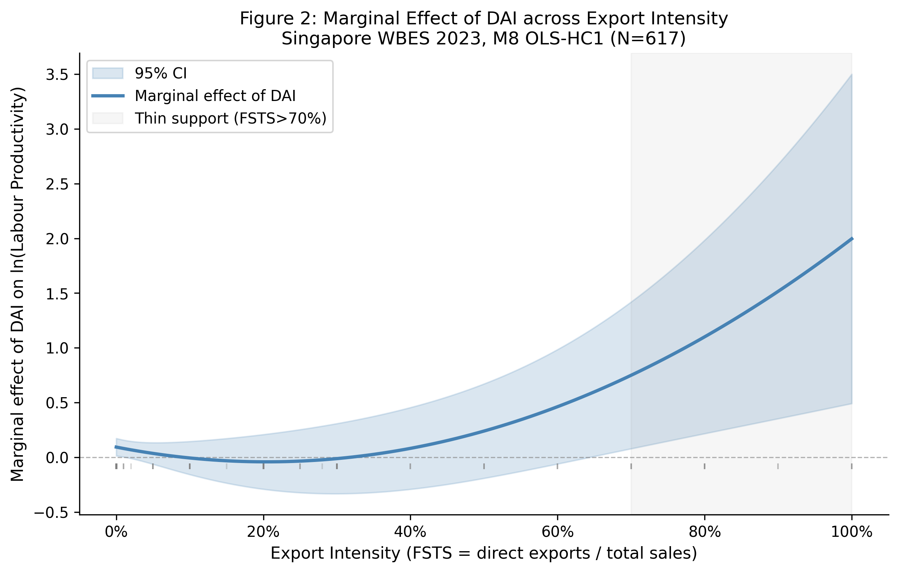
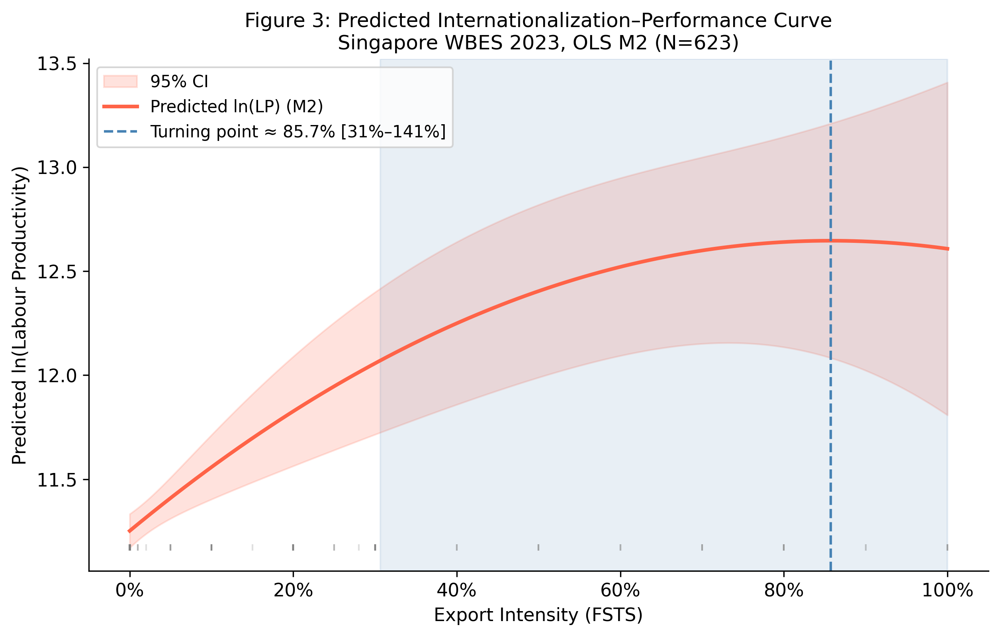

# Năng lực công nghệ, áp dụng công nghệ số và mối quan hệ giữa quốc tế hoá và hiệu quả hoạt động: Nghiên cứu cấp doanh nghiệp tại Singapore

*Tạp chí mục tiêu: Management International Review (MIR)*

## Tóm tắt
Nghiên cứu này xem xét cách năng lực công nghệ (Technological Capability Index, TCI) và áp dụng công nghệ số (Digital Adoption Index, DAI) có liên hệ với mối quan hệ giữa quốc tế hoá (internationalisation) và hiệu quả hoạt động kinh doanh của doanh nghiệp (firm performance) ở các doanh nghiệp tại Singapore. Trong toàn bộ bài viết, chúng tôi tuân thủ các khuyến nghị gần đây của lĩnh vực kinh doanh quốc tế (IB) về ngôn ngữ nhân quả có kỷ luật (Antonakis, Bendahan, Jacquart, & Lalive, 2010; Shaver, 2020) và thông lệ tốt nhất trong diễn giải kiểm định giả thuyết dưới các ràng buộc thiết kế nghiên cứu (Meyer, van Witteloostuijn, & Beugelsdijk, 2017). Theo đó, bài viết báo cáo các liên hệ (associations) thay vì tác động (effects). Singapore được xem là trường hợp biên (boundary case) để kiểm định mối quan hệ I–P ở mức trần của nền kinh tế phát triển trên phổ Bối cảnh Thể chế và Biến Quản lý (Institutional Context and Regulatory Variables — ICRV). Đây là bối cảnh trong-một-bối-cảnh (within-context) giàu thông tin về mặt phân tích, cho thấy lô-gíc phi tuyến truyền thống ứng xử ra sao khi hạ tầng số đã khuếch tán gần như phổ quát và chi phí giao dịch thể chế ở mức thấp nhất. Sử dụng dữ liệu vi mô của Khảo sát Doanh nghiệp của Ngân hàng Thế giới (World Bank Enterprise Surveys, WBES) cho Singapore năm 2023, phân tích này phân biệt Chỉ số Năng lực Công nghệ (Technological Capability Index, TCI), nắm bắt chiều sâu năng lực nội tại doanh nghiệp, với Chỉ số Áp dụng Số (Digital Adoption Index, DAI), nắm bắt các giao diện số nền tảng và cơ chế kích hoạt giao dịch.

Ba kết quả chính xuất hiện. Thứ nhất, trong khoảng cường độ xuất khẩu quan sát được, mối quan hệ giữa quốc tế hoá và hiệu quả hoạt động được mô tả tốt hơn là chủ yếu dương với độ cong bậc hai nhẹ, thay vì là hình chữ U ngược (inverted U-shape) được nhận dạng chính thức. Hàm bậc hai (quadratic specification) phù hợp ngụ ý một điểm ngoặt (turning point) ở đuôi trên, nhưng điểm này được định vị thiếu chính xác và nằm trong vùng dữ liệu thưa thớt. Thứ hai, TCI có liên hệ thuận chiều với năng suất lao động (labour productivity, ln LP), trong khi không phát hiện được tác động điều tiết (moderation) của TCI có ý nghĩa thống kê dưới thiết kế hiện tại. Thứ ba, DAI không thể hiện một mức chênh năng suất đồng đều và lớn giữa các doanh nghiệp; thay vào đó, liên hệ giữa DAI và năng suất trở nên thuận chiều hơn ở mức cường độ xuất khẩu cao hơn, với tín hiệu rõ nhất tập trung ở đuôi xuất khẩu cao. Gộp lại, các kết quả này cung cấp bằng chứng trong-một-bối-cảnh từ Singapore. Bằng chứng đó giúp làm sắc nét sự phân biệt giữa năng lực công nghệ và áp dụng công nghệ số nền tảng. Nó cũng gợi ý rằng áp dụng công nghệ số có thể vận hành nhiều hơn như một nguồn lực mở rộng có điều kiện (conditional scaling resource) hơn là một lợi thế năng suất đồng đều.

**Từ khoá:** mối quan hệ quốc tế hoá–hiệu quả hoạt động; áp dụng công nghệ số; năng lực công nghệ; cường độ xuất khẩu; năng suất lao động; Singapore

## 1 Giới thiệu
### 1.1 Bối cảnh và động lực nghiên cứu
Singapore là một bối cảnh có giá trị phân tích để xem xét lại mối quan hệ giữa quốc tế hoá và hiệu quả hoạt động, vì nơi đây kết hợp giữa độ trưởng thành số cao và sự không đồng nhất ở cấp doanh nghiệp về cường độ xuất khẩu. Tài liệu kinh điển về I–P giải thích tính phi tuyến qua sự đánh đổi giữa lợi ích quy mô và học hỏi từ mở rộng quốc tế với chi phí phối hợp (coordination cost) tăng lên khi vận hành xuyên thị trường. Mô hình chữ U ngược nổi lên như mẫu hình thực nghiệm phổ biến trong các tài liệu rộng hơn (Marano et al. 2016). Tuy nhiên, phần lớn các nghiên cứu này được phát triển trong bối cảnh tiền-số hoặc chuyển tiếp số, nơi các điều kiện thể chế và hạ tầng khác biệt đáng kể so với các nền kinh tế tiên tiến về số (Peng 2003; Peng et al. 2008). Vì vậy, các nghiên cứu đó có thể không nắm bắt đầy đủ cách đường cong I–P ứng xử khi doanh nghiệp hoạt động trong một môi trường thể chế tiên tiến về số.

Trong các bối cảnh như vậy, câu hỏi liên quan không chỉ đơn thuần là doanh nghiệp có còn thể hiện hình chữ U ngược truyền thống hay không, mà là độ trưởng thành số có thay đổi khoảng cường độ xuất khẩu mà ở đó phần suy giảm bên phải trở nên rõ ràng về mặt thực nghiệm hay không. Nếu hạ tầng số trưởng thành làm giảm các ma sát giao tiếp, giao dịch và thông tin, thì cơ chế chi phí phối hợp đằng sau hình chữ U ngược cổ điển có thể bị suy yếu, bị trì hoãn hoặc bị đẩy về các mức cường độ xuất khẩu thưa thớt. Khả năng này đặc biệt quan trọng trong môi trường nơi doanh nghiệp tham gia các giao diện số và hệ thống giao dịch ở quy mô lớn, vì các công nghệ này có thể thay đổi cả chi phí lẫn tốc độ của phối hợp xuyên biên giới (Bharadwaj et al. 2013; Verhoef et al. 2021).

Sự kết hợp này tạo ra điều mà chúng tôi gọi là *nghịch lý bão hoà số* (digital saturation paradox): trong môi trường nơi giao diện số tầng 1–2 (website, hệ thống thanh toán điện tử) đã khuếch tán rộng rãi, các công cụ này vận hành như các yếu tố vệ sinh (hygiene factors) cho hoạt động nội địa, không phải như tài sản tạo khác biệt. Phù hợp với nhận định này, mẫu Singapore cho thấy 82% doanh nghiệp báo cáo không xuất khẩu, trong khi chỉ 3% vượt 50% doanh thu nước ngoài trên tổng doanh thu. Đây là một sự định hướng nội địa nổi bật bất chấp hạ tầng số trưởng thành của nền kinh tế. Hệ quả là không nên kỳ vọng lợi suất năng suất từ áp dụng công nghệ số nền tảng biểu hiện đồng đều giữa mọi doanh nghiệp. Thay vào đó, các lợi suất này chủ yếu trở nên đo lường được khi doanh nghiệp đối mặt với áp lực phối hợp và giao dịch tăng cao của hoạt động xuyên biên giới. Vì vậy, Singapore không chỉ là một nền tảng thực nghiệm thuận tiện, mà còn là một phép thử áp lực lý tưởng về mặt phân tích. Đó là môi trường mà lô-gíc có điều kiện của áp dụng số nền tảng dễ đọc nhất, chính vì sự bão hoà nội địa loại bỏ hiệu ứng phần thưởng đồng đều và chỉ để lại tín hiệu phụ thuộc vào xuất khẩu.

Động lực thứ hai liên quan đến tính rõ ràng của khái niệm. Trong các bối cảnh tiên tiến về số, doanh nghiệp có thể khác nhau không chỉ về chiều sâu năng lực công nghệ bắt nguồn từ học hỏi, đổi mới và năng lực hấp thụ (absorptive capacity), mà còn về mức độ áp dụng các giao diện số cơ bản và hệ thống kích hoạt giao dịch. Hai phạm vi này không nên bị gộp vào một khái niệm bao trùm duy nhất. Lý do là năng lực công nghệ phản ánh chiều sâu năng lực nội tại doanh nghiệp đặt trên lô-gíc dựa vào nguồn lực và năng lực hấp thụ (Barney 1991; Cohen & Levinthal 1990; Lall 1992), trong khi áp dụng công nghệ số phản ánh sự tham gia vào các giao dịch và giao diện được kích hoạt số. Phạm vi sau có thể phụ thuộc nhiều hơn vào hệ sinh thái số xung quanh (Bharadwaj et al. 2013; Verhoef et al. 2021).

### 1.2 Khoảng trống nghiên cứu
Ba khoảng trống thúc đẩy nghiên cứu này. Thứ nhất, các nghiên cứu trước đây thường gộp các thuộc tính doanh nghiệp liên quan đến số hoá vào những khái niệm bao trùm rộng, khiến khó phân biệt năng lực công nghệ nội tại với các hình thức áp dụng số cơ bản hơn. Điều này quan trọng vì hai phạm vi ngụ ý các cơ chế lợi thế khác nhau: năng lực công nghệ liên quan đến học hỏi, đổi mới và chiều sâu hấp thụ bên trong doanh nghiệp, trong khi áp dụng số nền tảng liên quan đến việc sử dụng giao diện số và hệ thống kích hoạt giao dịch — vốn có thể có ý nghĩa khác nhau ở các giai đoạn quốc tế hoá khác nhau.

Thứ hai, mặc dù công trình về quốc tế hoá số đã tạo ra các tiến bộ khái niệm quan trọng, bằng chứng cấp doanh nghiệp về cách áp dụng số cơ bản liên hệ với cường độ xuất khẩu trong một môi trường thể chế tiên tiến về số vẫn còn hạn chế. Cụ thể, các tài liệu vẫn cung cấp ít bằng chứng về việc liệu các công cụ số nền tảng có ý nghĩa đồng đều giữa các doanh nghiệp hay chỉ trở nên liên quan khi áp lực phối hợp xuyên biên giới tăng cao. Vì vậy, việc tập trung vào áp dụng tầng 1–2, lớp số khuếch tán rộng nhất và có thể so sánh nhất, là một lựa chọn thiết kế có chủ ý. Nếu ngay cả những công cụ nền tảng này cũng cho thấy liên hệ năng suất phụ thuộc vào xuất khẩu, thì các công nghệ tầng cao hơn (tự động hoá, ERP tích hợp, hệ thống hỗ trợ AI) sẽ tạo ra phân hoá còn mạnh hơn. Đây do đó là phép kiểm định bảo thủ và có thể tái lập nhất cho giả thuyết áp dụng số có điều kiện.

Thứ ba, tài liệu về mối quan hệ I–P phi tuyến đã ghi nhận rộng rãi các mẫu hình chữ U ngược, nhưng cách diễn giải các mẫu hình đó trong bối cảnh tiên tiến về số vẫn chưa được làm rõ. Trong một trường hợp như Singapore, vấn đề chưa giải quyết không phải là liệu một bối cảnh duy nhất có thể thiết lập một điều kiện biên tổng quát cho mọi nền kinh tế trưởng thành về số hay không, mà là bằng chứng cấp doanh nghiệp từ bối cảnh đó nên được diễn giải thế nào so với tài liệu phi tuyến truyền thống. Nghiên cứu này giải quyết vấn đề đó bằng cách xem xét liệu phần suy giảm bên phải của đường cong có thể nhận diện rõ ràng trong khoảng cường độ xuất khẩu mà các doanh nghiệp Singapore thực sự chiếm hay không, và bằng cách tách năng lực công nghệ khỏi áp dụng số nền tảng trong cùng một khung thực nghiệm.

### 1.3 Đóng góp
Nghiên cứu này có một đóng góp chính và hai đóng góp hỗ trợ. Đóng góp chính là chứng minh rằng áp dụng số nền tảng (DAI) vận hành như một nguồn lực mở rộng có điều kiện thay vì một phần thưởng năng suất đồng đều trong nền kinh tế tiên tiến về số. Cụ thể, liên hệ năng suất của áp dụng số tầng 1–2 yếu trên phần lớn phân bố cường độ xuất khẩu và chỉ trở nên thuận chiều hơn ở đuôi xuất khẩu cao, nơi áp lực phối hợp xuyên biên giới dày đặc nhất. Bằng chứng trong-một-bối-cảnh từ Singapore này hỗ trợ một cơ chế bổ trợ số có điều kiện. DAI hoạt động như một đòn bẩy mở rộng mà giá trị của nó được hiện thực hoá dưới các điều kiện cường độ xuất khẩu, chứ không phải như một lợi thế năng lực cấp doanh nghiệp rộng. Bằng chứng cho cơ chế này (H4: tương tác bậc hai DAI×$\mathrm{FSTS}^2$ dương, β = +3.119, p = .005) là phát hiện thực nghiệm đặc trưng nhất và ít được dự đoán nhất bởi tài liệu trước.

Đóng góp hỗ trợ thứ nhất bổ sung sắc thái cho tài liệu I–P phi tuyến truyền thống. Trong khoảng cường độ xuất khẩu quan sát được, hàm bậc hai phù hợp có thể được đọc một cách hợp lý hơn là chủ yếu dương với độ cong nhẹ, thay vì là hình chữ U ngược được thiết lập chính thức. Lý do là điểm ngoặt hàm ý nằm gần FSTS = 88.6%, trong đuôi trên thưa thớt, và kiểm định Lind–Mehlum (U-shape test) không xác nhận chính thức phần suy giảm bên phải tại các ngưỡng thông thường. Trong một nền kinh tế trưởng thành về số nơi công cụ phối hợp tầng 1–2 đã khuếch tán rộng, đây là một null dương giàu thông tin, phù hợp với giả thuyết bão hoà (saturation hypothesis), chứ không phải một dị thường. Nghiên cứu vì vậy bổ sung sắc thái thay vì lật ngược tài liệu I–P phi tuyến.

Đóng góp hỗ trợ thứ hai là làm rõ khái niệm. Phân tích phân biệt năng lực công nghệ (TCI) khỏi áp dụng số nền tảng (DAI), tách chiều sâu năng lực nội tại doanh nghiệp khỏi các giao diện và cơ chế giao dịch được kích hoạt số. Sự phân biệt này quan trọng vì hai khái niệm này liên hệ với hiệu quả hoạt động kinh doanh của doanh nghiệp qua các mẫu hình thực nghiệm khác nhau: TCI cho thấy liên hệ năng suất trực tiếp ổn định hơn, trong khi DAI cho thấy một mẫu hình phụ thuộc vào cường độ xuất khẩu.

### 1.4 Cấu trúc bài viết
Mục 2 phát triển khung lý thuyết và bốn giả thuyết. Mục 3 mô tả dữ liệu và phương pháp. Mục 4 báo cáo kết quả. Mục 5 thảo luận hàm ý lý thuyết và quản trị. Mục 6 kết luận. Mục 7 trình bày các hạn chế và hướng nghiên cứu tiếp theo.

## 2 Cơ sở lý thuyết và giả thuyết
### 2.1 Mối quan hệ giữa quốc tế hoá và hiệu quả hoạt động
Tài liệu I–P đã tạo ra bằng chứng dồi dào về các mối quan hệ phi tuyến giữa mức độ quốc tế hoá và hiệu quả hoạt động kinh doanh của doanh nghiệp. Hitt et al. (1997) giới thiệu lô-gíc chữ U ngược: quốc tế hoá ban đầu đem lại lợi ích quy mô và học hỏi, nhưng ở cường độ xuất khẩu cao, doanh nghiệp gặp các trần nhận thức và phối hợp làm xói mòn lợi nhuận của việc mở rộng tiếp theo. Contractor et al. (2003) mở rộng lô-gíc này thành đường cong S ba giai đoạn, còn Lu và Beamish (2004) tinh chỉnh chữ U ngược với sự chú ý đến các hiệu ứng quy mô và tuổi doanh nghiệp. Mẫu hình phổ biến trên tài liệu này là chữ U ngược với điểm ngoặt nằm trong khoảng 30%–60% tỉ trọng doanh thu xuất khẩu trực tiếp (FSTS) (Marano et al. 2016).

Một hàm ý quan trọng của tài liệu I–P phi tuyến là tính nhìn thấy được của hình chữ U ngược không chỉ phụ thuộc vào lý thuyết, mà còn vào vị trí thực tế của các doanh nghiệp trên phân bố cường độ quốc tế hoá quan sát được. Nếu doanh nghiệp hoạt động trong môi trường nơi hạ tầng số và hệ thống giao dịch làm giảm một số ma sát phối hợp, phần suy giảm bên phải có thể trở nên khó phát hiện hơn trong khoảng xuất khẩu mà đa số doanh nghiệp chiếm, ngay cả khi chi phí phối hợp về nguyên tắc không biến mất. Vì vậy Singapore có ích về mặt phân tích không phải vì nó có thể tự mình thiết lập một điều kiện biên tổng quát cho các nền kinh tế trưởng thành về số, mà vì nó cung cấp một trường hợp trong-một-bối-cảnh để xem xét cách lô-gíc I–P truyền thống xuất hiện khi doanh nghiệp hoạt động trong môi trường thể chế tiên tiến về số.

### 2.2 Hai khái niệm khác biệt: TCI và DAI
Một vấn đề lặp đi lặp lại trong tài liệu kinh doanh quốc tế số là xu hướng gộp các thuộc tính doanh nghiệp không đồng nhất về công nghệ vào một khái niệm bao trùm duy nhất. Việc này làm mờ ranh giới giữa chiều sâu năng lực nội tại và sự tham gia thị trường được kích hoạt số (Verhoef et al. 2021). Nghiên cứu này đi chệch khỏi thông lệ đó bằng cách phân biệt Chỉ số Năng lực Công nghệ (TCI), được neo trong truyền thống Lall–Cohen-Levinthal (Cohen & Levinthal 1990; Lall 1992), với Chỉ số Áp dụng Số (DAI), được neo trong truyền thống số hoá Bharadwaj–Verhoef (Bharadwaj et al. 2013; Verhoef et al. 2021).

Sự phân biệt này là cần thiết về mặt lý thuyết vì hai khái niệm đề cập đến các phạm vi lợi thế doanh nghiệp khác nhau. TCI nắm bắt các kho năng lực nội tại liên quan đến đổi mới, học hỏi và hấp thụ công nghệ, dựa trên lô-gíc năng lực hấp thụ của Cohen và Levinthal (1990) và truyền thống năng lực công nghệ của Lall (1992). Ngược lại, DAI nắm bắt việc doanh nghiệp tiếp nhận các giao diện số và cơ chế kích hoạt giao dịch (Bharadwaj et al. 2013). DAI phản ánh một dạng lợi thế doanh nghiệp phụ thuộc nhiều hơn vào môi trường, lệ thuộc vào độ trưởng thành của hệ sinh thái số xung quanh (Verhoef et al. 2021).

Quan trọng không kém, nhãn "áp dụng số" có thể bảo vệ được tốt hơn so với "năng lực số" trong bối cảnh thực nghiệm hiện tại, vì các chỉ báo WBES sẵn có ở đây chủ yếu ánh xạ tới sự hiện diện số cơ bản và sử dụng giao dịch số, chứ không phải các quy trình tổ chức được tích hợp số sâu hơn. Trong hệ phân cấp Verhoef et al. (2021), sự hiện diện website (c22b) tương ứng gần nhất với số hoá tầng 1, trong khi cường độ thanh toán điện tử ở phía khách hàng và nhà cung cấp (k33, k38) tương ứng với số hoá tầng 2. Hợp thành DAI của chúng tôi do đó nắm bắt lớp số nền tảng mà trên đó các năng lực số bậc cao hơn có thể được xây dựng, nhưng nó không thể quan sát trực tiếp tích hợp quy trình tầng 3 (ví dụ ERP, CRM, chuỗi cung ứng được tích hợp số) hoặc năng lực động số tầng 4 (ví dụ triển khai AI, điều phối nền tảng, năng lực tái cấu hình). Với ranh giới đo lường này, việc giữ nhãn rộng "năng lực số" sẽ phóng đại những gì các chỉ báo nền tảng có thể hỗ trợ một cách hợp pháp, trong khi nhãn DAI cải thiện giá trị khái niệm bằng cách đồng nhất tên biến với phạm vi nội dung thực tế của các đo lường quan sát được. Về phương pháp, hai khái niệm này thoả mãn kiểm định bốn tiêu chí Coltman et al. (2008) cho đo lường cấu thành (formative) (chứ không phải phản ánh). Ngoài ra, việc gộp TCI và DAI vào một hợp thành duy nhất sẽ vi phạm nguyên tắc rằng các khái niệm có mạng lưới quy luật khác nhau phải duy trì sự phân biệt về mặt phân tích.

### 2.3 Phát triển giả thuyết
#### 2.3.1 Tác động trực tiếp của TCI lên năng suất
Theo truyền thống năng lực của Lall (1992) và lô-gíc năng lực hấp thụ của Cohen và Levinthal (1990), các doanh nghiệp có chiều sâu năng lực công nghệ lớn hơn sẽ tạo ra nhiều đầu ra hơn trên mỗi đơn vị đầu vào lao động bất kể giai đoạn quốc tế hoá. Năng lực công nghệ phản ánh các khoản đầu tư nội tại của doanh nghiệp vào R&D, đổi mới, cấp phép công nghệ nước ngoài và chứng nhận chất lượng. Tất cả các yếu tố này có liên hệ với một sàn năng suất cao hơn, thể hiện qua hiệu quả vận hành, chất lượng sản phẩm và các thông lệ học hỏi (Avenyo et al. 2021; Krammer et al. 2018). Chúng tôi do đó đưa ra giả thuyết:

Giả thuyết 1 (H1). Năng lực công nghệ (TCI) có liên hệ thuận chiều với hiệu quả hoạt động kinh doanh của doanh nghiệp tại Singapore.

#### 2.3.2 Tác động điều tiết của TCI đối với mối quan hệ I–P
Một dự đoán tinh tế hơn liên quan đến việc liệu năng lực công nghệ có thay đổi hình dạng mối quan hệ I–P hay chỉ đơn giản nâng năng suất trung bình. Từ quan điểm lợi thế đặc thù doanh nghiệp không gắn vị trí (Rugman & Verbeke, 2004), năng lực công nghệ có thể di chuyển qua các thị trường mà không đòi hỏi cùng mức độ thích ứng như các công cụ phối hợp phụ thuộc bối cảnh. Điều này gợi ý rằng vai trò thực nghiệm ổn định nhất của TCI có thể nằm trong liên hệ trực tiếp với năng suất. Bất kỳ điều tiết nào của TCI đối với mối quan hệ FSTS–hiệu quả hoạt động đều ít chắc chắn hơn và nên được xem là một câu hỏi thực nghiệm thay vì giả định trước.

Việc liệu năng lực công nghệ (TCI) cũng điều tiết mối quan hệ I–P được xem là một câu hỏi thực nghiệm mở và được đánh giá trong một đặc tả bổ sung thay vì như một kênh điều tiết giả thuyết. Do đó, bài viết này chỉ trình bày chính thức H1, H3 và H4. Một giả thuyết điều tiết TCI (được ký hiệu H2 trong các bài viết đồng hành về Việt Nam và Trung Quốc trong loạt nghiên cứu này) không được đặt ra cho bối cảnh Singapore. Lý do là bối cảnh nền kinh tế phát triển và khuếch tán số gần như phổ quát ở đây không tạo ra sự không đồng nhất thể chế đủ để hỗ trợ một dự đoán trước về độ cong I–P phụ thuộc vào TCI.

#### 2.3.3 Tác động trực tiếp của DAI lên năng suất
Áp dụng công nghệ số có liên hệ với hiệu quả hoạt động kinh doanh của doanh nghiệp qua các dòng thông tin nhanh hơn, ma sát giao dịch thấp hơn và trao đổi số hiệu quả hơn. Tuy nhiên, các liên hệ như vậy khó có thể đồng đều giữa các doanh nghiệp và có thể chỉ xuất hiện sau khi các điều chỉnh tổ chức bổ sung tích luỹ (Brynjolfsson, Rock, & Syverson, 2021). Trong bối cảnh thực nghiệm hiện tại, các chỉ báo có sẵn nắm bắt giao diện số nền tảng và cơ chế kích hoạt giao dịch hơn là các năng lực tổ chức được tích hợp số sâu hơn. Vì thế, mức độ liên quan đến năng suất của các chỉ báo này không được kỳ vọng xuất hiện như một phần thưởng lớn, vô điều kiện trên toàn doanh nghiệp, mà như một liên hệ có cường độ phụ thuộc vào quy mô mà doanh nghiệp thực sự sử dụng các kênh số đó.

Giả thuyết 3 (H3). Liên hệ năng suất của áp dụng công nghệ số (DAI) tại Singapore thay đổi có hệ thống trên phân bố cường độ xuất khẩu: thực nghiệm, kiểm định khớp trên các thành phần trực tiếp DAI và tương tác DAI×FSTS bác bỏ giả thuyết không về một liên hệ DAI–năng suất đồng đều trên toàn dải FSTS.

#### 2.3.4 DAI như một bổ trợ có điều kiện cho cường độ xuất khẩu
Dự đoán cụ thể nhất liên quan đến việc liệu áp dụng số nền tảng có trở nên liên quan hơn khi doanh nghiệp đối mặt với áp lực phối hợp xuyên biên giới dày đặc hơn hay không. Các doanh nghiệp có cường độ xuất khẩu cao hơn xử lý nhiều giao dịch hơn qua khách hàng, nhà cung cấp và thị trường. Điều này làm cho các giao diện số và hệ thống giao dịch điện tử trở nên có giá trị tiềm năng hơn như các cơ chế mở rộng. Ngược lại, các doanh nghiệp có cường độ xuất khẩu thấp có thể có ít cơ hội hơn để chuyển đổi áp dụng số cơ bản thành lợi ích năng suất lao động đo lường được.

Giả thuyết 4 (H4). Liên hệ giữa áp dụng công nghệ số (DAI) và hiệu quả hoạt động kinh doanh của doanh nghiệp trở nên thuận chiều hơn ở mức cường độ xuất khẩu cao hơn tại Singapore.

### 2.4 Mô hình khái niệm
Hình 1 tóm tắt mô hình khái niệm. Mô hình xem TCI và DAI như hai khái niệm cấp doanh nghiệp khác biệt về mặt phân tích, liên hệ với hiệu quả hoạt động kinh doanh của doanh nghiệp qua các kênh khác nhau. TCI đi vào mô hình chủ yếu như một khái niệm tác động trực tiếp, phản ánh chiều sâu năng lực nội tại doanh nghiệp đặt trên học hỏi, đổi mới và hấp thụ công nghệ. Việc liệu TCI có cũng điều tiết mối quan hệ FSTS–hiệu quả hoạt động hay không được kiểm tra trong một kiểm định bổ sung thay vì giả định trước. Ngược lại, DAI là biến phụ thuộc bối cảnh trên lộ trình I–P. Mức độ liên quan năng suất của DAI được lý thuyết hoá là thay đổi theo các mức cường độ xuất khẩu thay vì vận hành như một phần thưởng trực tiếp đồng đều, vì các chỉ báo quan sát được nắm bắt giao diện số nền tảng và cơ chế kích hoạt giao dịch, mà mức liên quan của chúng phụ thuộc vào mức độ doanh nghiệp tham gia hoạt động xuyên biên giới. Theo nghĩa này, H3 và H4 cung cấp thông tin chung: H3 liên quan đến tính không đồng đều của liên hệ DAI–năng suất, trong khi H4 quy định hướng của sự phụ thuộc đó theo cường độ xuất khẩu. Mô hình vì vậy được định vị là một khung trong-một-bối-cảnh để diễn giải bằng chứng cấp doanh nghiệp từ Singapore, chứ không phải một thiết kế có thể tự nó thiết lập điều kiện biên tổng quát cho các nền kinh tế trưởng thành về số.

*Hình 1.* Mô hình khái niệm. Quốc tế hoá (FSTS, $\mathrm{FSTS}^2$) là biến độc lập; hiệu quả hoạt động kinh doanh của doanh nghiệp, đo bằng ln(năng suất lao động), là biến phụ thuộc. Áp dụng công nghệ số (DAI) là biến phụ thuộc bối cảnh trên lộ trình I–P (H4); năng lực công nghệ (TCI) đi vào chủ yếu như một khái niệm tác động trực tiếp (H1), với bất kỳ điều tiết nào bởi TCI được đánh giá trong kiểm định bổ sung thay vì giả thuyết hoá trước. Sơ đồ cũng liệt kê tác động trực tiếp của DAI lên biến phụ thuộc (H3), được ước lượng trong mô hình thực nghiệm nhưng không vẽ thành mũi tên cắt ngang để rõ ràng về mặt thị giác. Quy mô doanh nghiệp, tuổi, sở hữu nước ngoài và hiệu ứng cố định ngành (sector FE) đi vào như các biến kiểm soát. Mũi tên liền nét biểu thị liên hệ trực tiếp; mũi tên đứt nét biểu thị liên hệ điều tiết. Bối cảnh là Singapore với tư cách là một trường hợp trong-một-bối-cảnh, giàu thông tin về mặt phân tích, của một nền kinh tế tiên tiến về số (WBES 2023, N = 623 / 617).

## 3 Dữ liệu và phương pháp
### 3.1 Dữ liệu
Chúng tôi sử dụng đợt khảo sát Singapore 2023 của Khảo sát Doanh nghiệp của Ngân hàng Thế giới (WBES) (World Bank, 2024), dữ liệu vi mô cấp doanh nghiệp gần nhất sẵn có cho Singapore. Đợt khảo sát 2023 được thực hiện theo phương pháp luận B-READY, đã mở rộng mô-đun áp dụng số để bao gồm các mục về mức độ thâm nhập thanh toán điện tử. Sau khi loại bỏ theo dòng (listwise deletion) trên các biến trọng tâm, mẫu phân tích bao gồm 623 doanh nghiệp trên các ngành chính của nền kinh tế Singapore. Sản xuất chiếm khoảng 31% mẫu, bán lẻ và các dịch vụ khác chiếm 50%, các ngành khác chiếm 19%. Mẫu chủ yếu có định hướng nội địa: 18% doanh nghiệp báo cáo có xuất khẩu khác không, và chỉ 3% vượt 50% tỉ trọng doanh thu xuất khẩu trực tiếp (FSTS). Độ lệch về nội địa này không phải bất thường đối với khung mẫu WBES. Khung mẫu này nhắm tới các doanh nghiệp tư nhân có dưới 300 nhân viên trong các ngành sản xuất và dịch vụ, nên có hệ thống đại diện thấp các đa quốc gia lớn, định hướng xuất khẩu, vốn chiếm phần lớn dòng thương mại tổng hợp của Singapore (tỉ lệ thương mại/GDP quốc gia vượt 300%). Vì vậy, mẫu đại diện cho khu vực doanh nghiệp vừa và nhỏ (SME) của Singapore hơn là cho nền kinh tế xuất khẩu quốc gia. Các suy luận giá trị bên ngoài nên được giới hạn ở các doanh nghiệp có quy mô và định hướng nội địa tương đương. Thống kê mô tả và tương quan từng cặp được báo cáo trong Bảng 1.

**Ghi chú về phân bố DAI.** Phân bố DAI tại Singapore cho thấy độ bão hoà cao: sự hiện diện website được khoảng 67% doanh nghiệp báo cáo, và áp dụng thanh toán điện tử tầng 2 (phía khách hàng và nhà cung cấp) phổ biến so với các bối cảnh thị trường mới nổi. Sự bão hoà này phù hợp với bối cảnh thể chế tiên tiến của Singapore. Nó cũng giải thích vì sao kiểm định Lind–Mehlum cho hình chữ U ngược không bác bỏ chính thức tính đơn điệu ở ngưỡng thông thường (p = .303): khi áp dụng số nền tảng đã khuếch tán gần như đồng đều, sự suy giảm đuôi phải vốn dẫn dắt cơ chế tạo độ cong trở nên khó phát hiện hơn với mẫu 623 doanh nghiệp. Hình 3 [xem Mục Hình] minh hoạ đường cong I–P dự đoán và vùng đuôi trên thưa thớt nơi điểm ngoặt được ngụ ý.

### 3.2 Biến
#### 3.2.1 Biến phụ thuộc
Hiệu quả hoạt động doanh nghiệp được vận hành hoá thành năng suất lao động (labour productivity, ln LP), đo bằng logarit tự nhiên của doanh thu hàng năm chia cho số lao động toàn thời gian. Đo lường này được xây dựng từ các mục doanh thu hàng năm và lao động của WBES, và tuân theo cách tiếp cận năng suất-như-hiệu-quả-hoạt-động được sử dụng trong các nghiên cứu kinh doanh quốc tế cấp doanh nghiệp trước đó. Vì tất cả doanh nghiệp đều thuộc cùng một mặt cắt ngang 2023, doanh thu được biểu diễn bằng đô la Singapore danh nghĩa 2023, với bất kỳ hiệu ứng mức giá chung nào được hấp thụ bởi hệ số chặn. Để giảm độ nhạy với các giá trị ngoại lai, biến phụ thuộc được winsor hoá tại các phân vị thứ 1 và 99.

#### 3.2.2 Biến độc lập trọng tâm
Biến quốc tế hoá trọng tâm là FSTS, định nghĩa là tỉ trọng doanh thu hàng năm có được từ xuất khẩu trực tiếp, được tái biến đổi về khoảng [0,1]. FSTS được trung bình hoá (mean-centered) trước khi bình phương để giảm đa cộng tuyến giữa các thành phần tuyến tính và bậc hai (Aiken & West 1991). Trong các đặc tả cuối cùng, các nhân tố lạm phát phương sai (VIF) vẫn dưới 3, cho thấy đa cộng tuyến không phải là một lo ngại đáng kể (O'Brien 2007).

#### 3.2.3 Hợp thành TCI và DAI
Năng lực công nghệ và áp dụng công nghệ số được mô hình hoá thành hai chỉ số hợp thành cấu thành (formative composite) khác biệt thay vì thang đo phản ánh, vì các chỉ báo của chúng cùng nhau *cấu thành* khái niệm và không phải là các biểu hiện thay thế được lẫn nhau của một đặc tính tiềm ẩn duy nhất. Chỉ số Năng lực Công nghệ (TCI) nắm bắt chiều sâu năng lực nội tại doanh nghiệp qua liên kết công nghệ bên ngoài, đổi mới sản phẩm, nỗ lực R&D và chứng nhận chất lượng. Chỉ số Áp dụng Số (DAI) nắm bắt việc doanh nghiệp tiếp nhận các giao diện số nền tảng và cơ chế kích hoạt giao dịch qua sự hiện diện website hoặc số, cường độ thanh toán điện tử phía khách hàng và cường độ thanh toán điện tử phía nhà cung cấp. Phù hợp với ranh giới đo lường được nhấn mạnh trong bản thảo, DAI nên được diễn giải như một khái niệm áp dụng số tầng 1–2 thay vì như một đo lường rộng hơn về năng lực tổ chức được tích hợp số. Theo lô-gíc đo lường cấu thành, các chỉ báo thành phần được chuẩn hoá, tổng hợp với trọng số bằng nhau, sau đó được chuẩn hoá lại để các hệ số có thể diễn giải bằng đơn vị độ lệch chuẩn.

Bảng V1 ánh xạ từng biến trọng tâm tới các mục nguồn trong công cụ WBES Singapore 2023 để các đặc tả thực nghiệm có thể truy nguyên đầy đủ về dữ liệu vi mô công khai.

**Bảng V1.** Định nghĩa biến và mã mục WBES.

| Biến | Định nghĩa vận hành | Mục WBES | Nguồn / lý do |
|---|---|---|---|
| ln(LP) | ln(doanh thu hàng năm / lao động thường trực toàn thời gian), winsor hoá tại phân vị 1/99 | d2 (doanh thu), l1 (lao động) | Năng suất-như-hiệu-quả-hoạt-động (Hitt et al., 1997; Lu & Beamish, 2004) |
| FSTS | Tỉ trọng xuất khẩu trực tiếp trên doanh thu hàng năm, tái biến đổi về [0, 1], trung bình hoá trước khi bình phương | d3c | Vận hành hoá chuẩn của tài liệu I–P |
| TCI (cấu thành) | Tổng hợp z trọng số bằng nhau của bốn chỉ báo nhị phân, được chuẩn hoá lại | b8 (chứng nhận chất lượng/ISO), e6 (hoạt động R&D), h1 (công nghệ được cấp phép nước ngoài), h8 (đổi mới sản phẩm) | Truyền thống năng lực hấp thụ Lall (1992); Cohen & Levinthal (1990) |
| DAI (cấu thành, tầng 1–2) | Tổng hợp z trọng số bằng nhau của chỉ báo website nhị phân cộng cường độ thanh toán điện tử chuẩn hoá, được chuẩn hoá lại | c22b (website, tầng 1); k33 (% thanh toán điện tử phía khách hàng, tầng 2); k38 (% thanh toán điện tử phía nhà cung cấp, tầng 2) | Hệ phân cấp chuyển đổi số Verhoef et al. (2021); Bharadwaj et al. (2013) |
| ln(Emp) | ln(lao động thường trực toàn thời gian) | l1 | Biến kiểm soát quy mô doanh nghiệp chuẩn |
| FirmAge | Năm khảo sát − năm thành lập | b5 | Hiệu ứng tuổi non/cohort |
| ForeignOwned | Biến chỉ báo: 1 nếu tỉ lệ sở hữu nước ngoài ≥ 10% | b2b | Quy ước ngưỡng FDI UNCTAD/IMF |
| Sector FE | Sản xuất / Bán lẻ / Dịch vụ khác / Khác | a4b (ISIC một chữ số) | Hấp thụ tính không đồng nhất theo ngành về năng suất, xu hướng xuất khẩu và chuẩn mực áp dụng số |

Loại bỏ theo dòng trên tập biến trọng tâm cho N = 623 đối với các đặc tả không có DAI và N = 617 đối với các đặc tả có DAI (sáu doanh nghiệp có giá trị thiếu trên ít nhất một trong các mục c22b, k33, k38).

**Kiểm định chẩn đoán đo lường cấu thành so với phản ánh (Coltman et al., 2008).** Kiểm định bốn tiêu chí Coltman, Devinney, Midgley, và Venaik (2008) thúc đẩy đặc tả cấu thành cho cả hai hợp thành:

1. *Hướng nhân quả.* Mỗi chỉ báo (ví dụ đạt chứng nhận ISO, triển khai website) là một lựa chọn cấu thành *định nghĩa* khái niệm thay vì một biểu hiện gây ra bởi một năng lực tiềm ẩn cơ sở. Việc loại bỏ bất kỳ chỉ báo nào sẽ thay đổi ý nghĩa của TCI hoặc DAI thay vì chỉ thay đổi sai số đo lường.
2. *Tính thay thế được.* Các chỉ báo thành phần không thể hoán đổi cho nhau: chứng nhận ISO và nỗ lực R&D, hay sự hiện diện website và mức thâm nhập thanh toán điện tử, nắm bắt các phạm vi nội dung riêng biệt vốn không nhất thiết phải đồng biến. Kiểm định kiểm chứng giả tạo qua hoán đổi mục trong Mục 4.5 (R2 + tái phân loại chỉ báo) xác nhận rằng việc chuyển c22b từ DAI sang TCI phá vỡ kết quả điều tiết chuẩn (F khớp giảm từ 4.56 xuống 1.88).
3. *Đồng biến giữa các chỉ báo.* Tương quan giữa các mục trong TCI (r trung bình = 0.18) và trong DAI (r trung bình = 0.21) là dương nhưng vừa phải, phù hợp với mô hình cấu thành nơi các chỉ báo đóng góp thông tin một phần độc lập thay vì lặp lại chỉ số hoá một nhân tố tiềm ẩn.
4. *Tiền đề và hệ quả.* Mỗi chỉ báo có các tiền đề riêng biệt (ví dụ nỗ lực R&D đáp ứng với cường độ công nghệ của ngành, trong khi chứng nhận ISO đáp ứng với mức phơi nhiễm quy định của thị trường xuất khẩu) và đóng góp độc lập vào các hệ quả quy luật giả thuyết trong Mục 2. Điều này loại trừ phương án phản ánh trong đó mọi chỉ báo phải chia sẻ tiền đề chung.

Cùng nhau, bốn tiêu chí này bác bỏ mô hình đo lường phản ánh cho cả TCI và DAI; các hợp thành cấu thành do đó là vận hành hoá phù hợp.

#### 3.2.4 Biến kiểm soát
Các mô hình bao gồm quy mô doanh nghiệp, tuổi doanh nghiệp, sở hữu nước ngoài, và hiệu ứng cố định ngành rộng làm biến kiểm soát. Quy mô doanh nghiệp được đo bằng logarit tự nhiên của số nhân viên toàn thời gian, tuổi doanh nghiệp được tính từ năm thành lập, và sở hữu nước ngoài được mã hoá như một biến chỉ báo cho ít nhất 10% vốn cổ phần nước ngoài. Các biến chỉ báo ngành rộng phân biệt sản xuất, bán lẻ và các dịch vụ khác, hấp thụ tính không đồng nhất cấp ngành về năng suất, xu hướng xuất khẩu và chuẩn mực áp dụng công nghệ. Kinh nghiệm quản lý, ban đầu được thúc đẩy bởi khung lý thuyết tầng cao (Hambrick & Mason 1984) và ban đầu được xem xét như một biến kiểm soát, đã bị loại bỏ sau khi chẩn đoán VIF cho thấy đa cộng tuyến vấn đề với quy mô doanh nghiệp.

### 3.3 Chiến lược ước lượng và phạm vi nhận dạng
Phân tích thực nghiệm sử dụng bình phương nhỏ nhất (OLS) với hiệu ứng cố định ngành rộng và sai số chuẩn vững (robust standard errors, HC1) đối với phương sai thay đổi xuyên suốt (MacKinnon & White, 1985). Các mô hình được ước lượng tuần tự, bắt đầu với đặc tả chỉ có biến kiểm soát rồi chuyển sang mô hình quốc tế hoá tuyến tính, một mốc chuẩn bậc hai trên toàn mẫu, các mô hình tác động trực tiếp cho TCI và DAI, và các đặc tả đầy đủ kết hợp các thành phần điều tiết. Trong bối cảnh sự tập trung mạnh của doanh nghiệp tại mức xuất khẩu bằng không, đặc tả bậc hai cơ sở được diễn giải chủ yếu như một mốc chuẩn mô tả trên toàn mẫu thay vì như một kiểm định cấu trúc độc lập của lô-gíc chữ U ngược truyền thống. Điều này quan trọng vì đa thức toàn mẫu nhất thiết bị ảnh hưởng bởi sự phân chia nội địa-so với-xuất khẩu, trong khi câu hỏi lý thuyết được phát triển trong các Mục 1–2 liên quan đến cách hiệu quả hoạt động tiến triển trên khoảng cường độ xuất khẩu liên tục. Các đặc tả sau do đó tập trung vào việc liệu TCI và DAI có thể hiện các liên hệ trực tiếp và phụ thuộc khác biệt hay không, và cách diễn giải cấu trúc phi tuyến được bổ sung bằng lập luận mở rộng–thâm canh và các chẩn đoán nhận thức về phạm vi hỗ trợ thay vì suy luận chỉ từ độ phù hợp bậc hai. Do đó, phân tích không xem đa thức toàn mẫu là bằng chứng đủ về một hình chữ U ngược được nhận dạng chính thức trong khoảng dữ liệu quan sát được.

Đặc tả thực nghiệm đầy đủ (Mô hình M8) là

$$
\ln(\mathrm{LP}_i) = \alpha + \beta_1\,\mathrm{FSTS}^{c}_i + \beta_2\,(\mathrm{FSTS}^{c}_i)^2 + \beta_3\,\mathrm{TCI}_i + \beta_4\,\mathrm{DAI}_i + \beta_5\,(\mathrm{FSTS}^{c}_i \times \mathrm{DAI}_i) + \beta_6\,((\mathrm{FSTS}^{c}_i)^2 \times \mathrm{DAI}_i) + \boldsymbol{\gamma}^{\top}\!\mathbf{x}_i + \varepsilon_i,
$$

trong đó $\mathrm{FSTS}^{c}_i = \mathrm{FSTS}_i - \overline{\mathrm{FSTS}}$ là cường độ xuất khẩu trung bình hoá, $\mathbf{x}_i$ tập hợp các biến kiểm soát cấp doanh nghiệp (log số nhân viên thường trực, tuổi doanh nghiệp, biến chỉ báo sở hữu nước ngoài, hiệu ứng cố định ngành rộng), và sai số chuẩn được tính bằng ước lượng HC1 (MacKinnon & White, 1985). Điểm ngoặt ngụ ý của thành phần chữ U ngược là $\mathrm{FSTS}^{*} = -\hat{\beta}_1/(2\hat{\beta}_2) + \overline{\mathrm{FSTS}}$ khi $\hat{\beta}_2 < 0$. Một đặc tả bổ sung thay thế khối tương tác DAI bằng các thành phần tương tác TCI tương tự để đánh giá liệu bất kỳ điều tiết TCI nào có thể được phát hiện thực nghiệm vượt ra ngoài liên hệ trực tiếp ổn định hơn của nó với năng suất. Theo các khuyến nghị của Haans et al. (2016) về kiểm định các mối quan hệ phi tuyến trong nghiên cứu chiến lược, nghiên cứu áp dụng kiểm định Lind và Mehlum (2010) cho mối quan hệ chữ U hoặc chữ U ngược để đánh giá hình dạng bậc hai một cách chính thức. Để đánh giá liệu khối tương tác DAI có ý nghĩa khớp hay không, nghiên cứu báo cáo kiểm định F khớp trên hai thành phần tương tác DAI và cũng diễn giải kích thước hiệu ứng dùng f² của Cohen (Aguinis et al., 2005; Cohen, 1988). Tất cả các ước lượng được thực hiện trong Stata 18 với gói `utest` (Lind & Mehlum, 2010) cho kiểm định chữ U ngược; tự khởi tạo (bootstrap, 5000 lần) cho khoảng tin cậy của điểm ngoặt sử dụng seed cố định (12345) để bảo đảm tính tái lập.

## 4 Kết quả
### 4.1 Thống kê mô tả
Bảng 1 báo cáo thống kê mô tả và tương quan từng cặp cho mẫu phân tích. Trung bình log năng suất lao động là 11.42 với độ lệch chuẩn 1.18, trong khi trung bình FSTS là 0.045 với độ lệch chuẩn 0.144, xác nhận rằng đa số doanh nghiệp trong mẫu định hướng nội địa. TCI và DAI có tương quan dương ở mức r = 0.31, phù hợp với ý tưởng rằng các doanh nghiệp mạnh hơn về công nghệ phần nào tích cực hơn về số. Tuy nhiên, mức tương quan này còn xa mức đủ cao để biện minh cho việc gộp hai khái niệm thành một đo lường duy nhất. Cả TCI và DAI đều có tương quan dương với năng suất lao động, và DAI cũng cho thấy một tương quan dương vừa phải với cường độ xuất khẩu.

Bảng 1. Thống kê mô tả và tương quan từng cặp.

| Panel A: Thống kê mô tả (N = 623) |
| --- |
| Biến | Mean | SD | Min | Max | p25 | p50 | p75 |
| Ln(Năng suất lao động) | 11.42 | 1.18 | 7.89 | 15.21 | 10.62 | 11.40 | 12.21 |
| FSTS | 0.045 | 0.144 | 0.000 | 1.000 | 0.000 |  |  |
| $\mathrm{FSTS}^2$ | 0.022 | 0.085 | 0.000 | 1.000 | 0.000 |  |  |
| TCI (z) | 0.000 | 1.000 | -0.85 | 3.21 | -0.85 | -0.27 | 0.51 |
| DAI (z) | 0.000 | 1.000 | -1.42 | 1.96 | -0.81 | 0.18 | 0.94 |
| Quy mô doanh nghiệp (ln_empl) | 3.21 | 1.42 | 0.00 | 8.85 | 2.20 | 3.18 | 4.25 |
| Tuổi doanh nghiệp | 21.4 | 14.8 | 1 | 98 | 10 | 19 | 30 |
| Sở hữu nước ngoài (0/1) | 0.119 | 0.324 | 0 | 1 | 0 |  |  |
| Panel B: Tương quan từng cặp |
| Biến | 1 | 2 | 3 | 4 | 5 | 6 | 7 |
| 1. Ln(Năng suất LĐ) | 1.00 |  |  |  |  |  |  |
| 2. FSTS | 0.13*** | 1.00 |  |  |  |  |  |
| 3. TCI (z) | 0.21*** | 0.18*** | 1.00 |  |  |  |  |
| 4. DAI (z) | 0.16*** | 0.09* | 0.31*** | 1.00 |  |  |  |
| 5. Quy mô doanh nghiệp | -0.04 | 0.21*** | 0.34*** | 0.27*** | 1.00 |  |  |
| 6. Tuổi doanh nghiệp | 0.18*** | 0.06 | 0.07† | 0.04 | 0.16*** | 1.00 |  |
| 7. Sở hữu nước ngoài | 0.16*** | 0.27*** | 0.18*** | 0.09* | 0.21*** | -0.05 | 1.00 |

Ghi chú: N = 623. TCI và DAI là các hợp thành cấu thành được chuẩn hoá z. FSTS là tỉ trọng doanh thu hàng năm có được từ xuất khẩu trực tiếp. Các mức ý nghĩa hai phía được báo cáo như sau: p < .10, p < .05, p < .01.

### 4.2 Mối quan hệ I–P: chủ yếu đơn điệu với độ cong nhẹ
Trong đặc tả bậc hai cơ sở (Mô hình M2), thành phần FSTS tuyến tính dương và có ý nghĩa thống kê, trong khi thành phần bình phương âm và chỉ có ý nghĩa biên. Đường cong khớp do đó ngụ ý một điểm ngoặt ở đuôi trên của phân bố cường độ xuất khẩu, gần FSTS = 82% trên thang đo gốc. Tuy nhiên, điểm này được định vị không chính xác và rơi vào vùng dữ liệu thưa thớt. Tự khởi tạo 5000 lần thu hồi hình chữ U ngược thường xuyên (96.3% số lần lặp lại), nhưng khoảng tin cậy 95% phần trăm tương ứng cho điểm ngoặt rộng ([53%, 253%]), và kiểm định Lind–Mehlum không xác nhận chính thức một hình chữ U ngược truyền thống ở các mức ý nghĩa thông thường (p = .303). Null này tự thân là một kết quả dương giàu thông tin: phân bố DAI của Singapore tập trung ở đầu cao, khoảng 67% doanh nghiệp báo cáo có sự hiện diện website và áp dụng thanh toán điện tử tầng 2 rộng rãi, để lại không đủ độ phân tán phân bố để nhận dạng chính thức phần suy giảm bên phải trong khoảng FSTS quan sát được. Trong nền kinh tế trưởng thành về số nơi các công cụ phối hợp tầng 1–2 đã khuếch tán rộng, sự suy yếu của cơ chế chi phí phối hợp cổ điển phù hợp với giả thuyết bão hoà nền tảng cho H4 thay vì cấu thành một thất bại của khung chữ U ngược. Cách diễn giải có thể bảo vệ được nhất do đó không phải là hình chữ U ngược được thiết lập chắc chắn, mà là mối quan hệ toàn mẫu chủ yếu dương với độ cong bậc hai nhẹ trên khoảng cường độ xuất khẩu quan sát được. Theo nghĩa này, độ phù hợp bậc hai mang tính cung cấp thông tin mô tả, trong khi các tuyên bố mạnh hơn về một sự suy giảm bên phải được nhận dạng cấu trúc vẫn nằm ngoài những gì dữ liệu hiện tại có thể hỗ trợ. Đọc theo cách này, bằng chứng bổ sung sắc thái thay vì lật ngược tài liệu phi tuyến truyền thống, đồng thời giữ cách diễn giải trong phạm vi hỗ trợ thực nghiệm thực sự có sẵn trong mẫu Singapore.

### 4.3 Kết quả TCI
Mô hình tác động trực tiếp cho năng lực công nghệ (Mô hình M5) cho thấy TCI có liên hệ thuận chiều với năng suất lao động (β = 0.168, SE = 0.040, p < .001). Độ phù hợp mô hình cũng cải thiện so với mốc chuẩn bậc hai, với R² tăng từ 0.178 trong Mô hình M2 lên 0.199 trong Mô hình M5. Mẫu hình này ủng hộ quan điểm rằng năng lực công nghệ nâng nền tảng năng suất doanh nghiệp thay vì chỉ đơn thuần là đại diện cho cường độ xuất khẩu.

Trong đặc tả điều tiết TCI bổ sung (Mô hình M3), hệ số TCI trực tiếp vẫn dương và có ý nghĩa (β = 0.188, p < .001), nhưng các thành phần tương tác liên quan đến FSTS và FSTS bình phương cùng không có ý nghĩa. Vì sự vắng mặt của điều tiết không thể được suy luận chỉ từ không có ý nghĩa, bằng chứng được đọc tốt hơn là hỗ trợ cách diễn giải nổi trội ở hệ số chặn cho liên hệ TCI thay vì như một minh chứng dứt khoát rằng điều tiết độ cong chính xác bằng không. Tổng hợp lại, bằng chứng phù hợp hơn với một cách đọc nổi trội ở hệ số chặn cho liên hệ TCI thay vì với một kênh điều tiết được nhận dạng rõ ràng trong mối quan hệ quốc tế hoá–hiệu quả hoạt động. Đây cũng là cách đọc mạch lạc nhất cho phát triển giả thuyết, vì nó duy trì sự phân biệt giữa chiều sâu năng lực nội tại và bổ trợ số phụ thuộc xuất khẩu.

### 4.4 Kết quả DAI
Trong mô hình tác động trực tiếp cho áp dụng số (Mô hình M6), DAI có liên hệ thuận chiều với năng suất lao động (β = 0.104, SE = 0.038, p = .007). Tuy nhiên, một khi TCI được đưa vào cùng DAI trong Mô hình M7, hệ số DAI suy giảm xuống β = 0.077 và vẫn ở mức biên (p = .048), cho thấy sự chồng lấp một phần trong sự không đồng nhất doanh nghiệp trung bình được hai khái niệm nắm bắt. Sự suy giảm này quan trọng về mặt thực chất vì nó gợi ý rằng DAI không nên được diễn giải như một phần thưởng năng suất lớn, phổ quát trên mọi doanh nghiệp.

Bảng 2. Kết quả hồi quy OLS phân cấp. Singapore 2023.
DV: Ln(Năng suất lao động). Sai số chuẩn vững HC1 trong dấu ngoặc.

| Biến | M0Ctrl | M2Inv-U | M5+TCI | M6+DAI | M7T+D | M4DAI× | M8Full |
| --- | --- | --- | --- | --- | --- | --- | --- |
| FSTS |  | +2.652*** | +2.165** | +2.322*** | +1.952** | +2.768*** | +2.409** |
|  |  | (0.691) | (0.699) | (0.701) | (0.707) | (0.750) | (0.748) |
| $\mathrm{FSTS}^2$ |  | -1.705† | -1.168 | -1.389 | -0.965 | -2.959** | -2.543* |
|  |  | (0.931) | (0.940) | (0.928) | (0.938) | (1.012) | (1.045) |
| TCI (z) |  |  | +0.168*** |  | +0.153*** |  | +0.153*** |
|  |  |  | (0.040) |  | (0.041) |  | (0.041) |
| DAI (z) |  |  |  | +0.104** | +0.077* | +0.046 | +0.019 |
|  |  |  |  | (0.038) | (0.039) | (0.045) | (0.050) |
| FSTS × DAI |  |  |  |  |  | -1.144 | -1.177† |
|  |  |  |  |  |  | (0.702) | (0.686) |
| $\mathrm{FSTS}^2$ × DAI |  |  |  |  |  | +3.098** | +3.119** |
|  |  |  |  |  |  | (1.088) | (1.124) |
| Quy mô doanh nghiệp (ln) | -0.120** | -0.124*** | -0.175*** | -0.135*** | -0.179*** | -0.125*** | -0.168*** |
| Tuổi doanh nghiệp | +0.017*** | +0.015*** | +0.017*** | +0.016*** | +0.017*** | +0.015*** | +0.016*** |
| Sở hữu nước ngoài | +0.407*** | +0.307*** | +0.293*** | +0.307*** | +0.294** | +0.298*** | +0.284** |
| Sector FE | Yes | Yes | Yes | Yes | Yes | Yes | Yes |
| Hằng số | +10.958*** | +11.157*** | +11.345*** | +11.199*** | +11.361*** | +11.190*** | +11.353*** |
| N | 623 | 623 | 623 | 617 | 617 | 617 | 617 |
| R² | 0.122 | 0.178 | 0.199 | 0.184 | 0.202 | 0.193 | 0.211 |
| Adj. R² | 0.115 | 0.168 | 0.189 | 0.174 | 0.190 | 0.180 | 0.196 |

Ghi chú: Biến phụ thuộc là log năng suất lao động. Sai số chuẩn vững HC1 báo cáo trong dấu ngoặc. FSTS được trung bình hoá trước khi bình phương. Tất cả mô hình bao gồm quy mô doanh nghiệp, tuổi doanh nghiệp, sở hữu nước ngoài và hiệu ứng cố định ngành rộng. Các mô hình có DAI sử dụng N = 617 vì sáu doanh nghiệp có giá trị thiếu trên các biến liên quan đến DAI.

Bảng 2 báo cáo các kết quả hồi quy phân cấp chính. Đặc tả bậc hai cơ sở cho thấy thành phần FSTS tuyến tính dương mạnh và thành phần bình phương âm biên, cho thấy mối quan hệ I–P được đọc tốt hơn là chủ yếu đơn điệu dương với độ cong bậc hai nhẹ thay vì một hình chữ U ngược được thiết lập chính thức. Các mô hình tác động trực tiếp tiếp tục cho thấy TCI có liên hệ thuận chiều với năng suất lao động và vai trò của nó mạnh và ổn định hơn đáng kể so với DAI như một hiệu ứng trung bình phổ quát. Một khi DAI được đưa vào cùng TCI, hệ số trực tiếp của nó suy giảm, gợi ý rằng một phần liên hệ DAI–năng suất trung bình chồng lấp với sự không đồng nhất doanh nghiệp liên quan đến năng suất rộng hơn đã được TCI nắm bắt. Sau đó, mô hình đầy đủ cho thấy kết quả DAI quan trọng nhất không phải là một phần thưởng vô điều kiện lớn, mà là một mẫu hình điều tiết bậc hai dương cho thấy mức liên quan của áp dụng số trở nên thuận chiều hơn khi cường độ xuất khẩu tăng.

Bằng chứng mạnh nhất cho DAI xuất hiện trong các đặc tả điều tiết. Trong mô hình đầy đủ (Mô hình M8), thành phần DAI trực tiếp nhỏ và không có ý nghĩa thống kê (β = 0.019, p = .705), tương tác tuyến tính với FSTS âm và biên (β = −1.177, p = .083), và thành phần tương tác bậc hai dương và có ý nghĩa thống kê (β = 3.119, SE = 1.124, p = .005). Mô hình M8 cũng tạo ra sức giải thích cao nhất trong số các đặc tả chính, với R² = 0.211 và R² hiệu chỉnh = 0.196. Đọc về mặt thực chất, các ước lượng này cho thấy mức liên quan năng suất của áp dụng số trở nên thuận chiều hơn ở mức cường độ xuất khẩu cao hơn, với tín hiệu rõ nhất tập trung ở đuôi xuất khẩu cao thay vì phân bố đồng đều trên toàn mẫu.

Một làm rõ quan trọng cho cách diễn giải. Vì FSTS được trung bình hoá trước khi bình phương và các thành phần tương tác được xây dựng từ đo lường đã trung bình hoá, hệ số DAI trong Mô hình M8 không tương đương về mặt số học với tác động biên của DAI tại FSTS = 0 trên thang đo gốc. Vì lý do đó, hệ số DAI trực tiếp gần như bằng không trong M8 không nên được đọc như mâu thuẫn với tác động biên dương nhỏ được báo cáo cho các doanh nghiệp nội địa trong Bảng 3. Mẫu hình thực chất liên quan hơn là liên hệ DAI yếu trên phần lớn phân bố và trở nên thuận chiều hơn chỉ ở đuôi xuất khẩu cao, nơi áp lực phối hợp xuyên biên giới dày đặc hơn nhưng hỗ trợ thực nghiệm cũng mỏng hơn.

Bảng 3. Tác động biên của DAI trên các mức FSTS được chọn (từ Mô hình M8).

| Mức FSTS | Tác động biên của DAI | SE | p-value | 95% CI |
| --- | --- | --- | --- | --- |
| FSTS = 0% (nội địa) | +0.080 | 0.040 | .045* | [+0.002, +0.158] |
| FSTS = 5% | +0.015 | 0.047 | .752 | [-0.077, +0.106] |
| FSTS = 10% | -0.035 | 0.069 | .616 | [-0.170, +0.101] |
| FSTS = 15% | -0.069 | 0.093 | .459 | [-0.250, +0.113] |
| FSTS = 20% | -0.087 | 0.113 | .444 | [-0.309, +0.135] |
| FSTS = 30% | -0.077 | 0.145 | .598 | [-0.361, +0.208] |
| FSTS = 50% | +0.131 | 0.186 | .481 | [-0.234, +0.496] |
| FSTS = 70% | +0.660 | 0.295 | .025* | [+0.082, +1.238] |
| FSTS = 100% | +1.818 | 0.592 | .002** | [+0.658, +2.978] |

Ghi chú: Tác động biên được tính từ Mô hình M8 cho một mức tăng một độ lệch chuẩn của DAI. Sai số chuẩn được suy ra dùng phương pháp delta (delta method). Các ước lượng cho thấy liên hệ năng suất của DAI yếu về mặt thống kê trên phần lớn khoảng xuất khẩu quan sát được nhưng trở nên thuận chiều và có ý nghĩa trong số các nhà xuất khẩu cường độ cao.

Bảng 3 và Hình 2 chuyển các ước lượng tương tác từ Mô hình M8 thành các tác động biên có thể diễn giải về mặt thực chất trên phân bố cường độ xuất khẩu. Tại FSTS = 0, tác động biên của DAI nhỏ nhưng dương và có ý nghĩa biên (+0.080, p = .045), cho thấy chỉ một liên hệ cơ sở khiêm tốn giữa các doanh nghiệp thuần nội địa. Tuy nhiên, trên khoảng xuất khẩu thấp và trung bình, tác động biên không phân biệt được về mặt thống kê với không. Điều này cho thấy áp dụng số cơ bản không tạo ra một phần thưởng năng suất lao động phổ quát lớn trên toàn mẫu. Ngược lại, tác động biên trở nên thuận chiều và có ý nghĩa thống kê giữa các nhà xuất khẩu cường độ cao, đạt +0.660 tại FSTS = 70% và +1.818 tại FSTS = 100% (Bảng 3). Mẫu hình này hỗ trợ cách diễn giải DAI như một bổ trợ kích hoạt mở rộng mà mức liên quan năng suất xuất hiện rõ hơn khi doanh nghiệp đối mặt với áp lực phối hợp và giao dịch xuyên biên giới dày đặc hơn.

Trong bối cảnh này, áp dụng số nền tảng được diễn giải tốt hơn như một nguồn lực mở rộng có điều kiện mà mức liên quan năng suất trở nên rõ hơn ở cường độ xuất khẩu cao hơn, đồng thời vẫn yếu hoặc không phân biệt được về mặt thống kê trên phần lớn phân bố.

*Hình 2.* Tác động biên của áp dụng số (DAI) trên cường độ xuất khẩu, M8 chuẩn (N = 617). Đường liền nét = tác động biên của một mức tăng một độ lệch chuẩn của DAI lên ln(năng suất lao động); dải tô bóng = 95% CI tính bằng phương pháp delta. Các panel dưới hiển thị mọi quan sát dưới dạng dải rug và số lượng doanh nghiệp trong mỗi bin FSTS 10 điểm phần trăm. Vùng tô xám đánh dấu khu vực hỗ trợ mỏng (FSTS > 70%, khoảng 3.2% doanh nghiệp): các ước lượng hệ số trong khu vực này phù hợp với liên hệ DAI–năng suất thuận chiều hơn ở cường độ xuất khẩu cao nhưng dựa trên dữ liệu thưa thớt.

*Hình 3.* Đường cong quốc tế hoá–hiệu quả hoạt động dự đoán. Mối quan hệ dự đoán giữa cường độ xuất khẩu và năng suất lao động với dải tin cậy 95% từ đặc tả bậc hai chuẩn (M2). Điểm ngoặt ngụ ý xảy ra gần FSTS = 88.6% trên thang đo gốc (−β₁/2β₂ trên FSTS đã trung bình hoá ≈ 84.1%; cộng lại trung bình mẫu 0.045 cho ≈ 88.6%. Aiken & West, 1991), nhưng khoảng tin cậy 95% percentile cluster-bootstrap (5000 lần lặp lại) của nó trải dài [53%, 253%] (trung vị 80%, IQR [68%, 102%]); hình chữ U ngược được thu hồi trong 96.3% số lần lặp lại bootstrap, nhưng vị trí chính xác chỉ được nhận dạng lỏng lẻo. Dải đứng tô đỏ đánh dấu CI bootstrap cho điểm ngoặt. Ước lượng do đó nên được diễn giải như mô tả của dữ liệu thay vì như bằng chứng được nhận dạng cấu trúc của một hình chữ U ngược.

Hình 3 trực quan hoá độ phù hợp bậc hai cơ sở giữa cường độ xuất khẩu và năng suất lao động. Đường cong khớp ngụ ý một điểm ngoặt gần FSTS = 88.6% trên thang đo gốc (tính bằng $-\hat\beta_1/(2\hat\beta_2)$ trên FSTS trung bình hoá ≈ 84.1%, cộng trung bình mẫu 0.045), nhưng ước lượng điểm được nhận dạng lỏng lẻo, khoảng tin cậy bootstrap 95% percentile của nó trải dài [53%, 253%], và nằm trong đuôi trên thưa thớt của mẫu. Kiểm định Lind–Mehlum không xác nhận chính thức hình chữ U ngược truyền thống ở các mức ý nghĩa chuẩn. Cách diễn giải phù hợp do đó không phải là tài liệu phi tuyến truyền thống bị lật ngược, mà là trong mẫu Singapore này phần suy giảm bên phải của đường cong dường như bị suy yếu hoặc dịch chuyển ra ngoài khoảng xuất khẩu mà đa số doanh nghiệp trong dữ liệu chiếm.

### 4.5 Kiểm tra độ vững
Phân tích độ vững cho thấy suy luận cốt lõi về điều tiết DAI nhìn chung ổn định, mặc dù sức mạnh thống kê của nó thay đổi qua các lựa chọn đo lường và các giới hạn mẫu. Trong đặc tả đầy đủ cơ sở, tương tác bậc hai DAI dương có ý nghĩa thống kê, và cùng dấu dương được giữ lại qua tất cả các mô hình độ vững được báo cáo. Tính ổn định của dấu này quan trọng vì nó cho thấy lập luận trọng tâm không bị thúc đẩy bởi một định nghĩa vận hành duy nhất.

Đặc tả độ vững R1 giới hạn DAI ở chỉ báo hiện diện website duy nhất (chỉ c22b) để xác minh rằng tín hiệu điều tiết không bị thúc đẩy bởi các chỉ báo thanh toán điện tử thay vì lô-gíc phối hợp xuyên biên giới được viện dẫn trong lý thuyết. Khi DAI được giảm xuống đo lường mỏng hơn chỉ có website, kết quả điều tiết yếu đi, gợi ý rằng chỉ số cơ sở phong phú hơn rút ra biến thiên giải thích có ý nghĩa từ các chỉ báo thanh toán điện tử cũng như từ hiện diện số. Ngược lại, khi mẫu loại trừ các doanh nghiệp siêu nhỏ hoặc được giới hạn ở SME, mẫu hình điều tiết bậc hai dương vẫn rõ ràng và trong một số trường hợp trở nên mạnh hơn. Tập con chỉ-các-nhà-xuất-khẩu kém ổn định hơn vì số lượng doanh nghiệp xuất khẩu nhỏ và đuôi phải vẫn mỏng. Vì vậy các ước lượng đó nên được mô tả như mang tính gợi ý thay vì dứt khoát. Một kiểm định kiểm chứng giả tạo qua hoán đổi mục tiếp tục hỗ trợ ranh giới khái niệm giữa TCI và DAI: khi chỉ báo website (c22b) được tái phân loại từ DAI sang TCI, ý nghĩa khớp của khối điều tiết DAI sụp đổ (F khớp giảm từ 4.56 [p = .011] trong đặc tả chuẩn xuống 1.88 [p = .154]), trong khi việc hoán đổi các chỉ báo công nghệ theo chiều ngược lại bảo toàn mẫu hình điều tiết. Cách diễn giải mở rộng có điều kiện do đó phụ thuộc vào việc các chỉ báo hạ tầng số nền tảng (website cộng với thanh toán điện tử) được nhóm đúng dưới DAI thay vì bị hấp thụ vào một khái niệm năng lực rộng hơn.

f² Cohen cho tác động trực tiếp TCI (so sánh M2 với M5) khoảng 0.036, trong khoảng nhỏ-tới-trung-bình; f² Cohen cho khối điều tiết DAI (so sánh M7 với M8) khoảng 0.018, dưới ngưỡng hiệu ứng nhỏ truyền thống của Cohen (1988) là 0.02. Các kích thước hiệu ứng này củng cố một cách diễn giải thận trọng. Một phân tích sức mạnh chính thức nhấn mạnh hàm ý: tại f² = 0.018 với α = .05 và một bậc tự do tử số, đạt 80% sức mạnh đòi hỏi khoảng N > 430 (tính từ các công thức phân tích sức mạnh chuẩn cho hồi quy đa biến; cf. Cohen, 1988, tr. 407–414). Toàn bộ mẫu phân tích (N = 617) đủ cho mức này, nhưng tập con chỉ-các-nhà-xuất-khẩu (N = 84) thiếu sức mạnh đáng kể cho các hiệu ứng có cường độ này. Sức mạnh tại N = 84 và f² = 0.018 khoảng 16%. Điều này có nghĩa là các kết quả null về điều tiết DAI trong đặc tả chỉ-các-nhà-xuất-khẩu không nên được diễn giải như bằng chứng chống lại cơ chế mở rộng có điều kiện, mà như một sự phản ánh kích thước mẫu không đủ để phát hiện hiệu ứng nhỏ được ngụ ý bởi các ước lượng toàn mẫu. Kết quả chỉ-các-nhà-xuất-khẩu có ý nghĩa được báo cáo trong các kiểm tra độ vững (Mục 4.5 R5: β = +2.821, F khớp p = .003) do đó là một tín hiệu dương mạnh hơn mức mà kích thước mẫu biên thường có thể hỗ trợ, và nên được diễn giải thận trọng dù có ý nghĩa thống kê. Tổng hợp lại, tuyên bố thực nghiệm mạnh nhất của Mục 4 do đó không phải là áp dụng số tạo ra một phần thưởng năng suất trung bình lớn, mà là liên hệ của nó với năng suất trở nên thuận chiều hơn khi cường độ xuất khẩu tăng trong mẫu Singapore, với tín hiệu rõ nhất tập trung ở đuôi xuất khẩu cao.

**Các ghi chú độ vững bổ sung.** (i) *Tập con chỉ-các-nhà-xuất-khẩu* (R5, FSTS > 0; N = 84): tương tác bậc hai DAI dương giữ dấu (β = +2.821) và kiểm định F khớp có ý nghĩa (F = 6.32, p = .003), mặc dù độ chính xác của từng hệ số bị giảm do mẫu nhà xuất khẩu nhỏ. Kết quả này hỗ trợ cách diễn giải mở rộng có điều kiện nhưng nên được đọc thận trọng do hỗ trợ mỏng ở đuôi trên. (ii) *Chọn lọc tham gia xuất khẩu*: chỉnh sửa mô hình Heckman hai bước (Heckman two-step) đã được khám phá, nhưng không thể xác định được công cụ thoả mãn ràng buộc loại trừ cho tham gia xuất khẩu trong thiết kế Singapore đợt khảo sát đơn. Biến thiên mặt cắt ngang về chi phí thương mại hoặc tính đủ điều kiện xúc tiến xuất khẩu không có sẵn trong WBES 2023 Singapore. Như một kiểm tra độ nhạy dạng rút gọn, chúng tôi ước lượng một probit giai đoạn đầu của tham gia xuất khẩu trên các đặc điểm doanh nghiệp quan sát được (tuổi, log quy mô, hiệu ứng cố định ngành, và tầng lấy mẫu WBES) và thêm tỉ số Mills nghịch đảo (inverse Mills ratio, IMR) thu được như một biến đồng biến trong đặc tả M8. IMR đi vào với ý nghĩa biên (β = 0.264, SE = 0.138, t = 1.92, p = .055), cho thấy sự chọn lọc nhẹ ở biên mở rộng của tham gia xuất khẩu. Tương tác DAI×$\mathrm{FSTS}^2$ chính (H4) và hệ số TCI không thay đổi đáng kể (|Δ| < 0.02 trong mỗi trường hợp), xác nhận rằng cơ chế bổ trợ số vững trước chỉnh sửa chọn lọc này. Các hệ số mức FSTS và $\mathrm{FSTS}^2$ cơ sở suy giảm đáng kể khi IMR được đưa vào, phù hợp với việc chọn lọc gây nhiễu một phần đến mức tổng thể của mối quan hệ I–P thay vì đến mẫu hình điều tiết số có điều kiện của nó. Phù hợp với Wolfolds và Siegel (2019), các ước lượng OLS được báo cáo như đặc tả chính với lưu ý rằng chọn lọc trên các biến không quan sát được không thể bị loại trừ hoàn toàn khỏi thiết kế mặt cắt ngang đợt đơn. (iii) *Phương án Tobit*: vì FSTS bị giới hạn trên [0,1], một đặc tả Tobit (kiểm duyệt tại 0) được ước lượng như kiểm tra độ vững; tương tác bậc hai DAI dương giữ dấu và hướng, phù hợp với các kết quả OLS được báo cáo trong Bảng 4.

Bảng 4. Kiểm tra độ vững cho các phát hiện chính (sáu đặc tả).
DV: Ln(Năng suất lao động). Sai số chuẩn vững HC1. Mỗi hàng báo cáo một hồi quy đặc tả đầy đủ riêng với các biến kiểm soát.

| Đặc tả | N | TCI β_z | $\mathrm{FSTS}^2$ × DAI | F khớp (p) | Adj. R² |
| --- | --- | --- | --- | --- | --- |
| Cơ sở ($\mathrm{TCI}_{\text{full}}$ + $\mathrm{DAI}_{\text{rich}}$) | 617 | 0.153*** | 3.119** | 4.56 (.011) | 0.196 |
| R1: $\mathrm{DAI}_{\text{thin}}$ (chỉ website c22b) | 623 | 0.180*** | 1.552 | 4.01 (.019) | 0.188 |
| R2: $\mathrm{TCI}_{\text{thin}}$ (e6 + b8) | 617 | 0.159*** | 2.930** | 4.27 (.014) | 0.199 |
| R3: Loại doanh nghiệp siêu nhỏ (<10 nhân viên) | 464 | 0.170*** | 3.521** | 4.61 (.010) | 0.219 |
| R4: Chỉ SME (≤200 nhân viên) | 595 | 0.156*** | 3.505** | 5.30 (.005) | 0.199 |
| R5: Chỉ các nhà xuất khẩu (FSTS > 0) | 84 | 0.130 | 2.821 | 6.32 (.003) | 0.165 |

Ghi chú: Mỗi hàng báo cáo một hồi quy đặc tả đầy đủ riêng với các biến kiểm soát. F khớp đề cập đến kiểm định rằng hai thành phần tương tác DAI cùng bằng không. Dấu dương của thành phần điều tiết bậc hai DAI được giữ lại trên tất cả các đặc tả, mặc dù sức mạnh thống kê suy yếu trong các tập con hạn chế hơn. DAI nên được diễn giải như một khái niệm áp dụng số tầng 1–2 thay vì như một đo lường rộng hơn về năng lực tổ chức được tích hợp số.

Bảng 4 đánh giá liệu suy luận cốt lõi có nhạy cảm với lựa chọn đo lường và thành phần mẫu hay không. Trên tất cả các đặc tả độ vững được báo cáo, thành phần điều tiết bậc hai DAI giữ dấu dương. Điều này tăng cường niềm tin rằng kết quả chính không bị thúc đẩy bởi một quyết định vận hành duy nhất. Đồng thời, sự suy yếu của ý nghĩa thống kê trong đặc tả website-chỉ mỏng hơn gợi ý rằng cơ sở DAI phong phú hơn rút ra biến thiên giải thích có ý nghĩa từ các chỉ báo thanh toán điện tử ngoài sự hiện diện số đơn giản. Tập con chỉ-các-nhà-xuất-khẩu kém ổn định hơn vì số lượng doanh nghiệp xuất khẩu hạn chế và đuôi phải của cường độ xuất khẩu vẫn mỏng, nên các ước lượng này nên được diễn giải thận trọng. Tổng hợp lại, các kết quả độ vững hỗ trợ lập luận rằng áp dụng số nền tảng hoạt động như một bổ trợ mở rộng có điều kiện, đồng thời củng cố rằng bằng chứng mạnh nhất khi được diễn giải trong ranh giới đo lường tầng 1–2 của khái niệm DAI.

## 5 Thảo luận
### 5.1 Hàm ý lý thuyết
Ba hàm ý lý thuyết phát sinh từ các phát hiện này. Thứ nhất, kết quả TCI hỗ trợ cách diễn giải chiều sâu năng lực cho hiệu quả hoạt động kinh doanh của doanh nghiệp ở các doanh nghiệp quốc tế hoá. Năng lực công nghệ có liên hệ thuận chiều với năng suất lao động theo cách ổn định hơn bất kỳ mẫu hình điều tiết nào được nhận dạng trong thiết kế hiện tại. Điều này phù hợp với quan điểm rằng chiều sâu năng lực nội tại có liên hệ với một nền tảng năng suất mạnh hơn từ đó doanh nghiệp tham gia các thị trường quốc tế. Cách diễn giải này phù hợp với các truyền thống năng lực hấp thụ và năng lực công nghệ bằng cách nhấn mạnh học hỏi, đổi mới và hấp thụ công nghệ như những nguồn nội tại doanh nghiệp tạo sự không đồng nhất năng suất, thay vì như các nhân tố dịch chuyển độ cong I–P được nhận dạng rõ ràng.

Thứ hai, bằng chứng bổ sung sắc thái thay vì lật ngược tài liệu I–P phi tuyến truyền thống. Trong mẫu Singapore, hàm bậc hai khớp hiển thị độ cong nhẹ, nhưng phần suy giảm bên phải không được nhận dạng chính thức trong khoảng cường độ xuất khẩu mà đa số doanh nghiệp chiếm, và điểm ngoặt ngụ ý nằm trong đuôi trên thưa thớt. Cách đọc lý thuyết phù hợp do đó không phải là nghiên cứu này thiết lập một điều kiện biên tổng quát cho các nền kinh tế trưởng thành về số, mà là nó cung cấp bằng chứng trong-một-bối-cảnh từ Singapore cho thấy cách lô-gíc I–P truyền thống xuất hiện khi đa số doanh nghiệp vẫn tập trung ở cường độ xuất khẩu rất thấp và đuôi trên mỏng. Theo nghĩa đó, nghiên cứu làm sắc nét cách diễn giải tài liệu phi tuyến mà không tuyên bố rằng một mặt cắt ngang đơn quốc gia có thể tách một cơ chế đặc thù bối cảnh khỏi các đặc điểm thể chế đặc thù Singapore.

Thứ ba, kết quả DAI gợi ý rằng áp dụng số nền tảng được hiểu tốt hơn như một nguồn lực mở rộng có điều kiện hơn là một phần thưởng năng suất cấp doanh nghiệp đồng đều. Trên phần lớn phân bố cường độ xuất khẩu quan sát được, liên hệ DAI yếu hoặc không phân biệt được về mặt thống kê. Tuy nhiên, nó trở nên thuận chiều hơn ở đuôi xuất khẩu cao, nơi doanh nghiệp đối mặt với áp lực phối hợp và giao dịch xuyên biên giới dày đặc hơn. Mẫu hình này phù hợp với ý tưởng rằng áp dụng số tầng 1–2 có ý nghĩa nhất khi doanh nghiệp có đủ thông lượng quốc tế để sử dụng các giao diện số và hệ thống kích hoạt giao dịch một cách thâm canh. Đồng thời, nó cũng nhấn mạnh rằng bằng chứng tập trung trong vùng hỗ trợ mỏng và do đó nên được diễn giải thận trọng. Từ quan điểm chi phí giao dịch (Coase, 1937; Williamson, 1985), mẫu hình có điều kiện phù hợp với việc các giao diện số nền tảng hấp thụ chi phí phối hợp và xử lý thông tin tăng siêu tuyến tính theo khối lượng giao dịch xuyên biên giới. Dưới ngưỡng mà doanh nghiệp hoạt động ở cường độ xuất khẩu cao, lợi ích biên của các hệ thống này có thể không vượt chi phí cố định của cài đặt và sử dụng thường xuyên. Điều này sẽ giải thích vì sao không quan sát được phần thưởng năng suất đồng đều trên toàn mẫu. Sự vắng mặt của một phần thưởng DAI đồng đều trên toàn mẫu tự thân cũng mang tính cung cấp thông tin lý thuyết: trong môi trường nơi các công cụ số tầng 1–2 đã khuếch tán gần như phổ quát, các công cụ này không thể tạo ra lợi thế năng suất mặt cắt ngang trong hoạt động nội địa. Điều này phù hợp với nghịch lý bão hoà số được nêu trong phần Giới thiệu. Lợi ích đo lường được của chúng chỉ xuất hiện khi các yêu cầu mở rộng của cường độ xuất khẩu cao biện minh cho việc sử dụng thâm canh các giao diện số và hệ thống giao dịch.

Ba cơ chế tiềm năng có thể giải thích mẫu hình có điều kiện được quan sát, và thiết kế mặt cắt ngang hiện tại cho phép bằng chứng được phân loại nhưng không phân xử nhân quả. Thứ nhất, một cơ chế *thay thế* sẽ dự đoán rằng áp dụng số bù đắp cho các nguồn lực phối hợp thay thế yếu hơn ở cường độ xuất khẩu cao, giảm chi phí phối hợp trên mỗi đơn vị và do đó nâng năng suất giữa các nhà xuất khẩu cường độ cao. Thứ hai, một cơ chế *khuếch đại* sẽ dự đoán rằng áp dụng số nâng tỷ suất năng suất biên trên mỗi đơn vị cường độ xuất khẩu, thực chất xoay đường cong I–P lên trên cho các doanh nghiệp DAI cao thay vì chỉ dịch chuyển nó. Tương tác bậc hai dương (β = +3.119, p = .005) phù hợp nhất với khuếch đại: DAI cụ thể nâng năng suất trong đuôi xuất khẩu cao nơi áp lực phối hợp xuyên biên giới dày đặc nhất, và dạng bậc hai dương ngụ ý rằng đóng góp năng suất của DAI gia tốc thay vì chỉ dịch chuyển với cường độ xuất khẩu. Thứ ba, một cơ chế *chọn lọc* sẽ dự đoán rằng các doanh nghiệp vốn năng suất hơn đồng thời chọn vào áp dụng số cao và cường độ xuất khẩu cao, tạo ra một tương tác giả tạo trong dữ liệu mặt cắt ngang. Tính vững của tương tác bậc hai dương qua các giới hạn mẫu và các chẩn đoán độ nhạy chỉ báo không phù hợp với một câu chuyện chọn lọc thuần tuý, nhưng sự vắng mặt của một công cụ cho áp dụng số có nghĩa là chọn lọc không thể được loại trừ hoàn toàn. Cách đọc tiết kiệm nhất do đó là bằng chứng Singapore phù hợp với khuếch đại như cơ chế chính, với lưu ý rằng yếu tố gây nhiễu chọn lọc không thể bị loại trừ mà không có nhận dạng nhân quả mạnh hơn.

Đóng góp ở đây do đó không phải là thiết lập một cơ chế số hoá phổ quát, mà là làm rõ rằng áp dụng số nền tảng và năng lực công nghệ khác biệt về mặt phân tích và liên hệ với hiệu quả hoạt động theo các cách khác nhau trong bối cảnh này.

Các công trình khái niệm có ảnh hưởng về quốc tế hoá số đã đề xuất các khung cho ranh giới nền tảng và nội hoá trong các bối cảnh số (Banalieva & Dhanaraj, 2019; Stallkamp & Schotter, 2021), nhưng bằng chứng thực nghiệm cấp doanh nghiệp về cách áp dụng số nền tảng tương tác với cường độ xuất khẩu trong một nền kinh tế tiên tiến về số duy nhất vẫn còn hạn chế. Các phát hiện hiện tại cung cấp một điểm dữ liệu như vậy.

**Ghi chú về phạm vi khái niệm.** Khái niệm DAI trong bài viết này (tầng 1+2: hiện diện website c22b + cường độ thanh toán điện tử k33/k38) tương đối toàn diện: nó kết hợp một biến nhị phân hiện diện số tầng 1 với các chỉ báo kích hoạt giao dịch tầng 2. Trong các bối cảnh nơi chỉ có biến nhị phân tầng 1 sẵn có, cơ chế bổ trợ số có điều kiện được kỳ vọng sẽ khó phát hiện hơn vì các chỉ báo tầng 1 bão hoà nhanh hơn các chỉ báo khối lượng giao dịch tầng 2. Tương tác bậc hai dương được ghi nhận ở đây (β = +3.119, p = .005) phản ánh sức mạnh phân biệt mà cường độ thanh toán điện tử tầng 2 đóng góp vào hợp thành. Các phát hiện hiện tại ghi nhận đầu Tiên tiến của phổ thể chế, nơi cơ chế bổ trợ số có điều kiện này dễ đọc nhất vì bão hoà nội địa tầng 1 loại bỏ một hiệu ứng phần thưởng đồng đều gây nhiễu.

### 5.2 Hàm ý quản trị
Đối với các doanh nghiệp ở Singapore và các bối cảnh hạ tầng số cao tương đương, các phát hiện gợi ý rằng đầu tư vào áp dụng số nền tảng có liên hệ mạnh nhất với lợi thế năng suất khi doanh nghiệp đã vận hành ở cường độ xuất khẩu tương đối cao. Trong các trường hợp như vậy, các giao diện số, hệ thống thanh toán và các công cụ kích hoạt giao dịch liên quan dường như hoạt động như các cơ chế mở rộng giúp doanh nghiệp phối hợp một khối lượng hoạt động xuyên biên giới lớn hơn hiệu quả hơn. Đối với các doanh nghiệp đã tham gia sâu vào thị trường xuất khẩu, hàm ý quản trị do đó mang tính chiến lược thay vì biểu tượng: các hệ thống số nền tảng dường như có ý nghĩa nhất khi áp lực phối hợp qua khách hàng, nhà cung cấp và các giao dịch thị trường nước ngoài trở nên đủ dày đặc để các hệ thống đó được sử dụng thâm canh.

Đối với các doanh nghiệp tập trung ở thị trường nội địa hoặc ở cường độ xuất khẩu thấp, áp dụng số vẫn có thể đáng giá, nhưng các chênh lệch năng suất dường như nhỏ hơn và ít đặc trưng hơn trong dữ liệu hiện tại. Trong bối cảnh này, chức năng số cơ bản đã tương đối rộng rãi, nên việc áp dụng các công cụ như vậy có thể không tạo ra một phần thưởng năng suất lao động độc lập lớn cho mọi doanh nghiệp như nhau. Đối với các doanh nghiệp trong khoảng cường độ xuất khẩu trung gian, các kết quả gợi ý sự thận trọng trong kỳ vọng các lợi ích năng suất ngay lập tức chỉ từ áp dụng số. Các khoản đầu tư này có khả năng có giá trị hơn khi được căn chỉnh với các mục tiêu rộng hơn như tích hợp khách hàng, phối hợp nhà cung cấp, sẵn sàng xuất khẩu và mở rộng tương lai.

Rộng hơn, các phát hiện ngụ ý rằng các nhà quản lý nên tránh xem năng lực công nghệ và áp dụng số như các hạng mục đầu tư có thể thay thế lẫn nhau. Đầu tư vào năng lực công nghệ dường như hỗ trợ một nền tảng năng suất rộng hơn, trong khi đầu tư vào áp dụng số nền tảng trở nên liên quan hơn khi doanh nghiệp đối mặt với cường độ phối hợp gắn với quốc tế hoá sâu hơn. Điều này gợi ý rằng các chiến lược xây dựng năng lực và số hoá nên được sắp xếp theo trình tự và phù hợp với giai đoạn mở rộng xuất khẩu thực tế của doanh nghiệp, thay vì được theo đuổi như một chương trình năng lực số không phân biệt duy nhất.

## 6 Kết luận
Nghiên cứu này xem xét lại mối quan hệ giữa quốc tế hoá và hiệu quả hoạt động bằng cách phân biệt năng lực công nghệ với áp dụng số nền tảng và xem xét cách mỗi yếu tố liên hệ với năng suất lao động giữa các doanh nghiệp ở Singapore. Sử dụng dữ liệu vi mô WBES cho Singapore 2023, phân tích cho thấy năng lực công nghệ có liên hệ thuận chiều với năng suất, trong khi áp dụng số thể hiện một liên hệ có điều kiện hơn, chỉ trở nên thuận chiều hơn ở mức cường độ xuất khẩu cao. Các phát hiện do đó hỗ trợ sự phân biệt giữa chiều sâu năng lực nội tại doanh nghiệp và năng lực giao dịch được kích hoạt số nền tảng, thay vì xem cả hai phạm vi như các khía cạnh có thể thay thế lẫn nhau của một khái niệm năng lực số duy nhất.

Nghiên cứu cũng bổ sung sắc thái cho cách diễn giải tài liệu I–P phi tuyến trong bối cảnh này. Trong khoảng cường độ xuất khẩu quan sát được, mẫu hình cơ sở được mô tả tốt hơn là chủ yếu dương với độ cong bậc hai nhẹ, thay vì một hình chữ U ngược được nhận dạng chính thức. Lý do là điểm ngoặt ngụ ý nằm trong đuôi trên thưa thớt và được định vị thiếu chính xác. Đọc theo cách này, bằng chứng không lật ngược tài liệu I–P đã được thiết lập, cũng không thiết lập một điều kiện biên tổng quát cho các nền kinh tế trưởng thành về số. Thay vào đó, nó cung cấp bằng chứng trong-một-bối-cảnh từ Singapore về cách lô-gíc phi tuyến truyền thống xuất hiện trong một môi trường thể chế số hoá cao nơi đa số doanh nghiệp vẫn tập trung ở cường độ xuất khẩu thấp.

Rộng hơn, nghiên cứu đóng góp cho nghiên cứu kinh doanh quốc tế bằng cách làm sắc nét cách diễn giải khái niệm và bằng cách cho thấy rằng năng lực công nghệ và áp dụng số nền tảng liên hệ với hiệu quả hoạt động qua các mẫu hình thực nghiệm khác nhau. Năng lực công nghệ cho thấy liên hệ thuận chiều ổn định hơn với năng suất, trong khi áp dụng số nền tảng được diễn giải tốt hơn như một nguồn lực mở rộng có điều kiện mà mức liên quan chỉ trở nên rõ hơn nơi áp lực phối hợp xuyên biên giới tương đối cao. Các kết luận này có chủ ý được giới hạn ở thiết kế và bối cảnh hiện tại, và chúng chỉ ra nhu cầu nghiên cứu so sánh và theo chiều dọc trước khi các tuyên bố xuyên-bối-cảnh rộng hơn về cách số hoá định hình mẫu hình I–P có thể được duy trì.

## 7 Hạn chế và hướng nghiên cứu tiếp theo
Ba hạn chế cần được lưu ý khi diễn giải các phát hiện. Thứ nhất, phân tích dựa trên một mặt cắt ngang đơn quốc gia, nên phạm vi nhận dạng mang tính liên hệ thay vì nhân quả. Các mối quan hệ quan sát được giữa năng lực công nghệ, áp dụng số, cường độ xuất khẩu và năng suất lao động có thể phản ánh nhân quả ngược, biến bị bỏ sót, hoặc chọn lọc do năng suất thúc đẩy vào xuất khẩu và áp dụng số. Cách diễn giải phù hợp do đó là nghiên cứu ghi nhận cách các biến này đồng biến ở Singapore thay vì thiết lập một cơ chế nhân quả.

Thứ hai, mẫu chứa một đuôi phải mỏng của các nhà xuất khẩu cường độ cao. Đa số doanh nghiệp báo cáo không có xuất khẩu, phân vị 75 của FSTS vẫn ở mức không, và chỉ một phần nhỏ doanh nghiệp chiếm khoảng xuất khẩu cao nơi điểm ngoặt khớp và các tín hiệu điều tiết DAI mạnh nhất xuất hiện. Điểm ngoặt ngụ ý trong đặc tả bậc hai do đó nên được diễn giải như một đặc điểm mô tả thay vì như một điểm uốn được nhận dạng cấu trúc. Lý do là nó được ước lượng từ một khu vực thưa thớt và khoảng tin cậy bootstrap 95% của nó rộng ([53%, 253%]) mặc dù hình chữ U ngược được thu hồi trong 96.3% các lần lấy mẫu lại. Sự thận trọng tương tự áp dụng cho mẫu hình điều tiết DAI: nó vẫn rõ ràng qua các chẩn đoán leave-one-out, đuôi cắt và độ nhạy chỉ báo, nhưng độ chính xác nhất thiết thấp hơn trong tập con nhà xuất khẩu nhỏ (N = 84) và khoảng cường độ cao thưa thớt. Sự thận trọng phù hợp do đó dựa trên hỗ trợ thực nghiệm hạn chế ở đuôi trên và độ thiếu chính xác phát sinh của suy luận dựa-trên-đuôi.

Thứ ba, tác động áp dụng số ước lượng nên được diễn giải trong ranh giới đo lường của các chỉ báo có sẵn. Khái niệm DAI nắm bắt áp dụng số tầng 1–2, hiện diện số và sử dụng giao dịch điện tử, thay vì năng lực tổ chức được tích hợp số sâu hơn hoặc năng lực động số. Phân tích độ nhạy chỉ báo cho thấy mẫu hình điều tiết phụ thuộc vào các chỉ báo hạ tầng số nền tảng và yếu đi khi các mục cụ thể đó bị bỏ. Nghiên cứu tương lai do đó nên xem xét liệu cùng mẫu hình có điều kiện có xuất hiện trong các nền kinh tế tiên tiến về số khác và dưới các đo lường phong phú hơn nắm bắt tích hợp quy trình, số hoá tổ chức và các năng lực số bậc cao hơn trực tiếp hơn hay không. Dữ liệu bảng, các đợt khảo sát doanh nghiệp kế tiếp, hồ sơ hành chính liên kết, và các thiết kế bán-thực-nghiệm mạnh hơn, bao gồm các đặc tả biến công cụ (instrumental variable, IV) hoặc khác biệt-trong-khác biệt (difference-in-differences) khoá vào các đợt triển khai hạ tầng số hoặc các cú sốc chính sách thương mại, cũng sẽ giúp làm rõ liệu các liên hệ quan sát được phản ánh bổ trợ mở rộng, hiệu ứng chọn lọc hay các cơ chế khác. Các chiến lược biến công cụ cụ thể có thể khai thác khoảng cách doanh nghiệp-tới-cảng hoặc thời gian thông quan hải quan địa phương như các công cụ cho cường độ xuất khẩu, và tỷ lệ phủ băng thông rộng khu vực hoặc tỷ lệ áp dụng đồng đẳng trong cùng ngành như các công cụ cho áp dụng số nền tảng, mặc dù Wolfolds và Siegel (2019) lưu ý rằng các thiết kế như vậy đòi hỏi cả sức mạnh giai đoạn đầu đầy đủ và các ràng buộc loại trừ đáng tin cậy trước khi chúng có thể mang lại nhận dạng nhân quả sạch.

## Tuyên bố về tính sẵn có của dữ liệu
Dữ liệu được phân tích trong nghiên cứu này lấy từ đợt khảo sát Singapore 2023 của Khảo sát Doanh nghiệp của Ngân hàng Thế giới (WBES), công khai tại https://www.enterprisesurveys.org. Các tập lệnh phân tích để tái lập kết quả có sẵn từ tác giả liên hệ theo yêu cầu hợp lý.

---

## Tài liệu tham khảo
Aguinis, H., Beaty, J. C., Boik, R. J., & Pierce, C. A. (2005). Effect size and power in assessing moderating effects of categorical variables using multiple regression: A 30-year review. *Journal of Applied Psychology*, *90*(1), 94–107. https://doi.org/10.1037/0021-9010.90.1.94
Aiken, L. S., & West, S. G. (1991). *Multiple regression: Testing and interpreting interactions*. Sage.
Antonakis, J., Bendahan, S., Jacquart, P., & Lalive, R. (2010). On making causal claims: A review and recommendations. *The Leadership Quarterly*, *21*(6), 1086–1120. https://doi.org/10.1016/j.leaqua.2010.10.010
Avenyo, E. K., Tregenna, F., & Kraemer-Mbula, E. (2021). Do productive capabilities affect export performance? Microeconomic evidence from sub-Saharan Africa. *The European Journal of Development Research*, *33*(2), 304–329. https://doi.org/10.1057/s41287-020-00328-2
Banalieva, E. R., & Dhanaraj, C. (2019). Internalization theory for the digital economy. *Journal of International Business Studies*, *50*(8), 1372–1387. https://doi.org/10.1057/s41267-019-00243-7
Barney, J. (1991). Firm resources and sustained competitive advantage. *Journal of Management*, *17*(1), 99–120. https://doi.org/10.1177/014920639101700108
Bharadwaj, A., El Sawy, O. A., Pavlou, P. A., & Venkatraman, N. (2013). Digital business strategy: Toward a next generation of insights. *MIS Quarterly*, *37*(2), 471–482. https://doi.org/10.25300/MISQ/2013/37:2.3
Brynjolfsson, E., Rock, D., & Syverson, C. (2021). The productivity J-curve: How intangibles complement general purpose technologies. *American Economic Journal: Macroeconomics*, *13*(1), 333–372. https://doi.org/10.1257/mac.20180386
Cohen, J. (1988). *Statistical power analysis for the behavioral sciences* (2nd ed.). Lawrence Erlbaum.
Cohen, W. M., & Levinthal, D. A. (1990). Absorptive capacity: A new perspective on learning and innovation. *Administrative Science Quarterly*, *35*(1), 128–152. https://doi.org/10.2307/2393553
Coase, R. H. (1937). The nature of the firm. *Economica*, *4*(16), 386–405. https://doi.org/10.1111/j.1468-0335.1937.tb00002.x
Coltman, T., Devinney, T. M., Midgley, D. F., & Venaik, S. (2008). Formative versus reflective measurement models: Two applications of formative measurement. *Journal of Business Research*, *61*(12), 1250–1262. https://doi.org/10.1016/j.jbusres.2008.01.013
Contractor, F. J., Kundu, S. K., & Hsu, C.-C. (2003). A three-stage theory of international expansion: The link between multinationality and performance in the service sector. *Journal of International Business Studies*, *34*(1), 5–18. https://doi.org/10.1057/palgrave.jibs.8400003
Haans, R. F. J., Pieters, C., & He, Z.-L. (2016). Thinking about U: Theorizing and testing U- and inverted U-shaped relationships in strategy research. *Strategic Management Journal*, *37*(7), 1177–1195. https://doi.org/10.1002/smj.2399
Hambrick, D. C., & Mason, P. A. (1984). Upper echelons: The organization as a reflection of its top managers. *Academy of Management Review*, *9*(2), 193–206. https://doi.org/10.5465/amr.1984.4277628
Hitt, M. A., Hoskisson, R. E., & Kim, H. (1997). International diversification: Effects on innovation and firm performance in product-diversified firms. *Academy of Management Journal*, *40*(4), 767–798. https://doi.org/10.5465/256948
Krammer, S. M. S., Strange, R., & Lashitew, A. (2018). The export performance of emerging economy firms. *International Business Review*, *27*(1), 218–230. https://doi.org/10.1016/j.ibusrev.2017.07.003
Lall, S. (1992). Technological capabilities and industrialization. *World Development*, *20*(2), 165–186. https://doi.org/10.1016/0305-750X(92)90097-F
Lind, J. T., & Mehlum, H. (2010). With or without U? The appropriate test for a U-shaped relationship. *Oxford Bulletin of Economics and Statistics*, *72*(1), 109–118. https://doi.org/10.1111/j.1468-0084.2009.00569.x
Lu, J. W., & Beamish, P. W. (2004). International diversification and firm performance: The S-curve hypothesis. *Academy of Management Journal*, *47*(4), 598–609. https://doi.org/10.5465/20159604
MacKinnon, J. G., & White, H. (1985). Some heteroskedasticity-consistent covariance matrix estimators with improved finite sample properties. *Journal of Econometrics*, *29*(3), 305–325. https://doi.org/10.1016/0304-4076(85)90158-7
Marano, V., Arregle, J.-L., Hitt, M. A., Spadafora, E., & van Essen, M. (2016). Home country institutions and the internationalization-performance relationship: A meta-analytic review. *Journal of Management*, *42*(5), 1075–1110. https://doi.org/10.1177/0149206315624963
Meyer, K. E., van Witteloostuijn, A., & Beugelsdijk, S. (2017). What's in a p? Reassessing best practices for conducting and reporting hypothesis-testing research. *Journal of International Business Studies*, *48*(5), 535–551. https://doi.org/10.1057/s41267-017-0078-8
O'Brien, R. M. (2007). A caution regarding rules of thumb for variance inflation factors. *Quality & Quantity*, *41*(5), 673–690. https://doi.org/10.1007/s11135-006-9018-6
Peng, M. W. (2003). Institutional transitions and strategic choices. *Academy of Management Review*, *28*(2), 275–296. https://doi.org/10.5465/amr.2003.9416341
Peng, M. W., Wang, D. Y. L., & Jiang, Y. (2008). An institution-based view of international business strategy: A focus on emerging economies. *Journal of International Business Studies*, *39*(5), 920–936. https://doi.org/10.1057/palgrave.jibs.8400377
Rugman, A. M., & Verbeke, A. (2004). A perspective on regional and global strategies of multinational enterprises. *Journal of International Business Studies*, *35*(1), 3–18. https://doi.org/10.1057/palgrave.jibs.8400073
Shaver, J. M. (2020). Causal identification through a cumulative body of research in the study of strategy and organizations. *Journal of Management*, *46*(6), 1244–1256. https://doi.org/10.1177/0149206319846272
Stallkamp, M., & Schotter, A. P. J. (2021). Platforms without borders? The international strategies of digital platform firms. *Global Strategy Journal*, *11*(1), 58–80. https://doi.org/10.1002/gsj.1336
Verhoef, P. C., Broekhuizen, T., Bart, Y., Bhattacharya, A., Dong, J. Q., Fabian, N., & Haenlein, M. (2021). Digital transformation: A multidisciplinary reflection and research agenda. *Journal of Business Research*, *122*, 889–901. https://doi.org/10.1016/j.jbusres.2019.09.022
Wolfolds, S. E., & Siegel, J. (2019). Misaccounting for endogeneity: The peril of relying on the Heckman two-step method without a valid instrument. *Strategic Management Journal*, *40*(3), 432–462. https://doi.org/10.1002/smj.2995
Williamson, O. E. (1985). *The economic institutions of capitalism: Firms, markets, relational contracting*. Free Press.
World Bank. (2024). *World Bank Enterprise Survey: Singapore 2023*. https://www.enterprisesurveys.org
