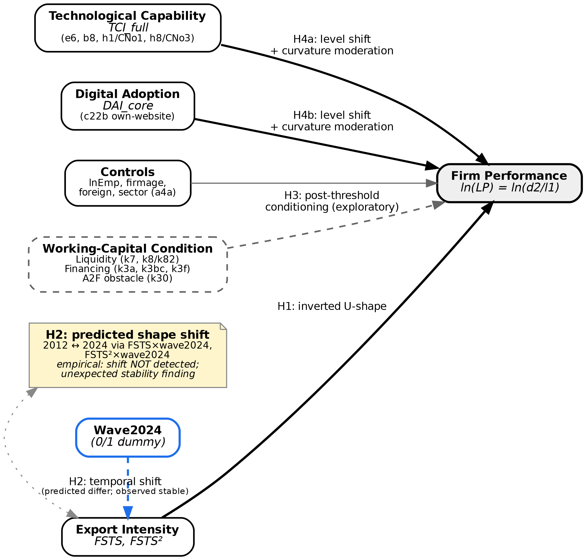
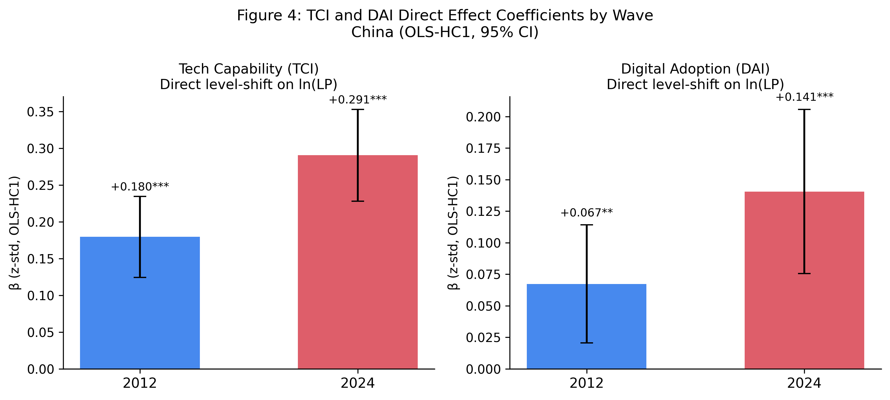

# The Export Intensity–Performance Relationship in Chinese Private Firms: A Threshold-Stability Perspective

*v1.9 (BLINDED) — submission to International Journal of Emerging Markets (IJOEM)*

*2026-05-06 (v1.9 biên tập: blind self-cites for APJM submission — ICBEF 2025, JFAR 2026, VEFR 2026; add Highlights + JEL + Manuscript classification; remove cross-references to unsubmitted companion working papers on Vietnam and Singapore)*

---

**Manuscript classification:** research article.

**Word count** (main text excluding abstract, references, tables and figures): approximately 7,200 words.

**Tables:** 3 (Table 1 descriptives by wave; Table 2 main threshold model M2; Table 3 three-way moderation specification with joint F-tests).

**Figures:** 4 (Figure 1 conceptual model; Figure 2 turning-point estimates with 95% CIs; Figure 3 predicted I→P curves by wave; Figure 4 capability level-shift coefficients).

---

## Abstract

**Purpose** — This study examines whether the inverted U‑shaped relationship between export intensity and firm performance among Chinese private firms is **structurally durable or wave-specific**, and clarifies the role of technological capability and foundational digital adoption in shaping this relationship.

**Design/methodology/approach** — Drawing on World Bank Enterprise Survey microdata for China (2012, N = 2,619; 2024, N = 1,940; pooled N = 4,559), we estimate quadratic models with full cross-wave and capability interactions. The data support **H2b (structural durability)** over **H2a (environmental shift)**: cross‑wave Paternoster (1998) z‑tests do not reject equality of the linear and squared export‑intensity coefficients (FSTS z = +0.82, p = .412; FSTS² z = −0.61, p = .545), and the pooled joint F-test on the (FSTS × wave_2024, FSTS² × wave_2024) interactions yields F(2, 3,558) = 2.24, p = .107.

**Findings** — Estimated turning points remain in a remarkably tight range — 49.4 % of total sales in 2012, 47.2 % in 2024, and 48.8 % in the pooled sample, with overlapping 95 % delta‑method confidence intervals. Technological capability is robustly associated with higher productivity in both waves (β_z = +0.28 in 2012 and +0.43 in 2024; both p < .001), and a single‑item digital‑presence proxy (own website) is positively associated with productivity in 2024 and the pooled sample (β_z = +0.07, p = .04 in 2024; β_z = +0.06, p = .006 pooled), but neither construct robustly moderates the curvature of the inverted-U: the joint F‑test on capability×curvature interactions (F = 3.26, p = .039) is marginal, individual coefficients are not significant, and the three‑way capability×wave×curvature dynamic moderation test returns F = 0.27, p = .760.

**Originality/value** — **H2b (structural durability) is confirmed over H2a (environmental shift)**: despite substantial structural change in China between 2012 and 2024, cross-wave tests support the thesis that the Chinese internationalization–performance trade-off is **durably structural rather than wave-specific or capability-conditioned**. The contribution recasts the inverted-U threshold from a sample-specific regularity into an enduring structural feature of the setting; null capability curvature moderation and unstable working-capital analyses reinforce this interpretation. The findings also extend the China-specific cubic baseline of Author Citation (2026 — JFAR) and the multi-country emerging-Asia synthesis of Author Citation (2026 — VEFR) by adding a temporal-stability dimension.

**Keywords:** internationalisation–performance; export intensity; threshold stability; technological capability; digital adoption; Chinese private firms; World Bank Enterprise Survey.

**JEL classification:** F23 (multinational firms; international business); O33 (technological change: choices and consequences); D22 (firm behaviour: empirical analysis); L25 (firm performance); O53 (economywide country studies: Asia including Middle East).

**Paper type:** Research paper.

---

## Highlights

- The internationalisation–performance relationship in Chinese private firms is **robustly inverted-U** in both 2012 (turning point 49.4 %) and 2024 (turning point 47.2 %) waves, with overlapping 95 % delta-method confidence intervals.

- The threshold is **structurally durable** against a strong directional prior of cross-wave shift: cross-wave Paternoster z-tests fail to reject coefficient equality (p = .412 for FSTS, p = .545 for FSTS²), and the joint F-test on (FSTS × wave_2024, FSTS² × wave_2024) yields p = .107.

- **Technological capability** (TCI_full) is positively associated with productivity in both waves (β_z = +0.26 to +0.43, p < .001) and **strengthens** between waves (Paternoster cross-wave change z = −2.55, p = .011), but **does not moderate the curvature** of the inverted-U.

- **Basic digital presence** (DAI_core, single-item website-presence proxy) shows modest positive associations with productivity in 2024 and the pooled sample (β_z = +0.07 to +0.06) but is retained as a baseline control rather than a formal hypothesis, given the limited discriminatory power of a single binary website indicator in 2024 China.

- **H2b (structural durability) is confirmed over H2a (environmental shift)**: despite multiple mechanisms predicting temporal evolution, cross-wave Paternoster z-tests confirm coefficient equality across waves (p = .412; p = .545; joint F p = .107), establishing structural durability as a positive finding rather than a mere null. Supplementary working-capital analyses and TCI curvature-moderation tests do not yield stable moderating evidence, reinforcing the durability interpretation.

- The findings extend the China cubic baseline of Author Citation (2026 — JFAR) and the 17-country emerging-Asia synthesis of Author Citation (2026 — VEFR) with a within-country temporal-stability dimension previously absent from the literature.

---

## 1. Introduction

The relationship between firm internationalization and firm performance remains one of the most enduring questions in international business research. Although a substantial empirical literature — including several meta‑analyses spanning multiple decades and country contexts — now favors a nonlinear inverted U‑shape, with performance rising at low to moderate levels of internationalization and declining once foreign exposure becomes excessive (Hitt, Hoskisson, & Kim, 1997; Contractor, Kundu, & Hsu, 2003; Lu & Beamish, 2004; Marano, Arregle, Hitt, Spadafora, & van Essen, 2016; Schwens et al., 2018; Author Citation, 2025 — ICBEF), a more demanding question is whether the implied turning point is a *durable structural feature* of a setting or simply a sample‑specific regularity that may evolve as institutional and competitive conditions change. The "too‑much‑of‑a‑good‑thing" pattern is by now well established in management research (Pierce & Aguinis, 2013), but its temporal robustness within a single national context has rarely been examined. For private firms operating in emerging economies, where financing constraints are tight and the marginal cost of overextension may bite harder than for large multinationals, the location and stability of an optimal internationalization range carry direct strategic and policy weight (Buckley, Clegg, Cross, Liu, Voss, & Zheng, 2007; Bausch & Krist, 2007).

China provides a particularly powerful setting for this question. Between 2012 and 2024 — the two waves examined here — the Chinese economy underwent extraordinary structural transformation. The post‑2008 trade re‑equilibration was followed by deepening participation in global value chains (Kano, Tsang, & Yeung, 2020), the China–US tariff escalation cycle, the COVID‑19 disruption and supply‑chain re‑routing, the maturation of digital infrastructure and the rapid diffusion of e‑commerce platforms (Hanelt, Bohnsack, Marz, & Antunes Marante, 2021; Vial, 2019), and ongoing reforms to SME credit and trade‑finance institutions. Chinese private firms also matured over this period in the WBES sample: average firm age in our analytic samples rose from 12.6 to 13.9 years, and average labour productivity (log scale) rose from 12.52 to 13.01 — corresponding to roughly a 64 % productivity premium in level terms (exp(0.49) ≈ 1.64). Under conventional internationalization theory, several of these changes should have shifted the inverted‑U turning point — by raising the productive returns to internationalization at the upper tail (capability strengthening), softening the post‑threshold downturn (improved trade finance), or both. Whether the predicted shift actually materialises is an empirical question that has not been directly tested for China in the post‑GFC, post‑COVID period.

Whereas Author Citation (2026 — JFAR) establish the shape and level-shift role of digital adoption in the I–P relationship for Chinese manufacturing SMEs in a single survey wave, locating the principal inverted-U turning point at approximately 47.8 % of total sales, the present paper addresses a conceptually distinct question: is that threshold a structurally durable feature of Chinese private firms, or a sample-period artefact that shifts as macroeconomic conditions change between 2012 and 2024? This temporal-stability question cannot be answered by a single-wave analysis; it requires explicit cross-wave parameter-equality testing (Paternoster, Brame, Mazerolle, & Piquero, 1998) that the JFAR manufacturing analysis did not conduct. Accordingly, the present paper (a) extends the analysis to the full WBES private-firm frame — broader sector coverage than manufacturing-only — to establish an independently estimated threshold benchmark, (b) adopts a quadratic specification suited to that frame's distributional properties, and (c) conducts formal Paternoster z-tests and a pooled cross-wave F-test to evaluate parameter equality as the paper's primary empirical contribution. The broader context for the present study is also set by Author Citation (2026 — VEFR), whose 17-country emerging-Asia synthesis documents heterogeneity in firm-level performance patterns across institutional regimes; the present paper holds country fixed and asks the within-China temporal-stability question that the cross-country design cannot directly address.

This study examines the internationalization–performance relationship among Chinese private firms across two waves of the World Bank Enterprise Survey (WBES) — 2012 and 2024 — separated by more than a decade of substantial structural change. Three motivations frame the inquiry. First, the inverted‑U logic predicts a turning point but rarely interrogates whether that turning point *shifts* over time within a single setting; documenting cross‑wave behavior is therefore a non‑trivial empirical contribution beyond the standard inverted‑U claim (Haans, Pieters, & He, 2016). Second, the IB literature increasingly recognises that the post‑threshold downturn may reflect not only generic coordination costs (Hennart, 2007; Contractor, 2007) but also more specific financial frictions — such as cash‑conversion lengthening, foreign‑receivables exposure, and credit‑constraint binding for trade‑finance access — that intensify as export intensity rises (Manova, 2013; Foley & Manova, 2015; Niepmann & Schmidt-Eisenlohr, 2017; Demir & Javorcik, 2018). Third, the growing role of digital adoption and technological capability in firm productivity has invited claims that capability fundamentally rewires the I–P curve (Bharadwaj, El Sawy, Pavlou, & Venkatraman, 2013; Vial, 2019; Nambisan, Wright, & Feldman, 2019; Verhoef, Broekhuizen, Bart, Bhattacharya, Dong, Fabian, & Haenlein, 2021; Hanelt, Bohnsack, Marz, & Antunes Marante, 2021; Volberda, Khanagha, Baden-Fuller, Mihalache, & Birkinshaw, 2021), but available WBES indicators capture lower‑tier digital adoption rather than full dynamic digital capability. Disentangling these three threads — temporal stability, financial mechanism, and capability role — is the analytical agenda of the present paper.

Theoretically, the 2012-to-2024 window contains several mechanisms that should *shift* the inverted-U: post-2008 trade re-equilibration, the China–US tariff escalation cycle, the COVID-19 disruption, the maturation of digital infrastructure (Author Citation, 2026 — VEFR), and the evolving structure of global value chains in which Chinese firms participate (Kano, Tsang, & Yeung, 2020). The strengthening of domestic absorptive capacity through technology adoption and quality certification (Lall, 1992; Cohen & Levinthal, 1990), together with the evolution of trade-finance institutions, should plausibly flatten the post-threshold downturn or push the turning point rightward (Manova, 2013; Demir & Javorcik, 2018). Following recent recommendations that strong directional priors should be tested against data rather than assumed, particularly in IB research where complexity makes specification choices consequential (Antonakis, Bendahan, Jacquart, & Lalive, 2010; Meyer, van Witteloostuijn, & Beugelsdijk, 2017; Eden & Nielsen, 2020), we frame competing H2a (predicted shift) and H2b (structural durability) hypotheses and let the data choose between them.

In the present study, firm internationalization is operationalized as export intensity (the share of foreign sales in total sales). We estimate a baseline quadratic model for each wave and the pooled sample, conduct a Lind & Mehlum (2010) U‑test to verify the inverted‑U formally, and apply a Paternoster, Brame, Mazerolle, and Piquero (1998) z‑test to the linear and squared export‑intensity coefficients to evaluate cross‑wave parameter equality. We complement these wave-by-wave tests with a pooled three-way moderation specification that adds (FSTS × wave_2024, FSTS² × wave_2024), (FSTS × Tech, FSTS² × Tech), and (FSTS × wave_2024 × Tech, FSTS² × wave_2024 × Tech) interactions to evaluate the cross-wave shift, capability moderation, and capability-conditioned dynamic moderation hypotheses respectively. We then conduct a supplementary direct test of the working‑capital interpretation using WBES proxies for liquidity access, financing structure, and access‑to‑finance obstacle, with a 2012‑only robustness extension into receivables exposure (Manova, 2013). Throughout, we adopt the disciplined causal‑language conventions advocated for international‑business research and report associations rather than effects (Antonakis et al., 2010; Shaver, 2020).

The paper makes four contributions. First, we identify and characterise an optimal export‑intensity threshold for Chinese private firms at approximately 48 % of total sales, with a managerially relevant safe operating zone of 30 % to 60 %. This complements the 47.8 % cubic turning point reported by Author Citation (2026 — JFAR) for Chinese manufacturing SMEs by extending the analysis to the full WBES private-firm frame and to a second wave a decade later. Second — and as the paper's central contribution — we provide cross‑wave evidence that this threshold is **structurally durable against a predicted shift**: despite multiple plausible mechanisms motivating cross-wave evolution, the data fail to reject equality of the inverted-U coefficients between 2012 and 2024 in both individual Paternoster z-tests and a joint pooled F-test. Three additional null moderation channels (capability×curvature, capability×wave×curvature, working capital × curvature) converge on the same substantive interpretation. Third, we document that technological capability operates robustly as a *level-shifter* of productivity rather than as a curvature moderator of the threshold, distinguishing capability's strategic role from its conjectured role in moderating the I–P trade-off itself. Fourth, we contribute to the broader meta-analytic puzzle in IB by showing that within-country temporal stability is consistent with cross-country institutional context — rather than within-country evolution — being the dominant source of effect-size heterogeneity reported in prior reviews (Marano et al., 2016; Schwens et al., 2018; Filatotchev, Wei, Sarala, Dick, & Prescott, 2020; Author Citation, 2025 — ICBEF). This finding directly addresses the skepticism of Pisani, Garcia-Bernardo, and Heemskerk (2020, SMJ), who demonstrate that the inverted-U relationship weakens or disappears under more rigorous identification approaches in cross-national pooled samples; our within-country temporal stability result suggests that single-country institutional contexts can preserve functional-form regularity that cross-national samples obscure through aggregation heterogeneity. We also offer a working‑capital‑trap interpretation of the post‑threshold downturn (Manova, 2013) as theoretically grounded but not directly identified in our data, and we mark direct testing with WBES items k4–k14 as a priority for future research.

The remainder of the paper proceeds as follows. Section 2 develops the theoretical framework and four hypotheses, including the competing H2a (environmental shift) and H2b (structural durability) hypotheses. Section 3 describes the data and methods, including sample-construction and a Plan B1 supplementary specification of working‑capital proxies. Section 4 reports the threshold replication, the cross‑wave shift test, the capability moderation tests, supplementary working‑capital tests, and a manufacturing-only robustness check, with three core results tables. Section 5 discusses theoretical, managerial, and policy implications under the durability framing, identifies four substantive theoretical contributions, and introduces a dedicated §5.2 on alternative mechanisms explored. Section 6 acknowledges limitations and identifies future research directions.

## 2. Theory and Hypotheses

### 2.1 Internationalization and firm performance

The relationship between firm internationalization and firm performance is unlikely to be linear for smaller private firms in emerging economies (Lu & Beamish, 2004; Hennart, 2007). At lower to moderate levels, internationalization may improve performance by enlarging market reach, spreading fixed costs, increasing scale economies, and allowing firms to exploit existing production capabilities more fully across foreign markets (Lu & Beamish, 2004). For smaller firms in particular, participation in foreign markets may also stimulate learning, sharpen quality discipline, and diversify revenue sources beyond the domestic market (Wagner, 2007). Three theoretical traditions converge on this expectation. The resource-based view emphasises that exporters must mobilise idiosyncratic resources to compete in foreign markets, with productive returns rising as those resources are amortised over wider sales bases (Lall, 1992; Teece, 2007). The transaction-cost perspective stresses that internationalization expands the scope of governance choices the firm must make about how to coordinate cross-border transactions, with returns rising as long as the firm's governance capacity grows in step (Hennart, 2007; Contractor, 2007). The dynamic-capabilities tradition adds that exporters develop higher-order routines for sensing, seizing, and reconfiguring foreign-market opportunities (Teece, 2007), and these routines compound returns at moderate levels of international exposure.

However, the advantages of internationalization are not unlimited. As firms become more deeply internationalized, they face greater coordination demands, increased exposure to foreign‑market volatility, more complex logistics and payment arrangements, and higher managerial burdens associated with serving external markets on a sustained basis (Hennart, 2007; Contractor, 2007). These costs are especially consequential for smaller private firms because they typically operate with narrower financial slack, more limited organizational depth, and less capacity to absorb shocks than larger multinational firms (Buckley et al., 2007). Evidence from Chinese exporters confirms this pattern: Xiao et al. (2013) show that internationalization payoffs depend on governance structure, while Feng et al. (2019) document an inverted U-shaped relationship in Yangtze River Delta manufacturing firms. The cross-country meta-analytic evidence further indicates that the inverted-U is a robust pattern but with substantial dispersion in the location of the turning point across studies (Marano et al., 2016; Schwens et al., 2018), motivating the more demanding question of *where the turning point sits in a particular setting and whether it stays there*.

In the present study, firm internationalization is operationalized as export intensity, captured by the share of foreign sales in total sales. Under this operationalization, internationalization should improve firm performance up to a point, but performance should deteriorate once export intensity becomes too dominant relative to the firm's operational and financial capacity. The relevant expectation is therefore not a monotonic positive effect, but an inverted U‑shaped association — a pattern that fits the broader "too‑much‑of‑a‑good‑thing" tradition in management research (Pierce & Aguinis, 2013; Haans, Pieters, & He, 2016) — in which the performance gains of internationalization are bounded.

> **Hypothesis 1 (H1).** Firm internationalization, measured as export intensity, has an inverted U‑shaped relationship with firm performance among Chinese private firms.

### 2.2 Temporal shift of the internationalization threshold

Although inverted U‑shaped relationships are common in the internationalization literature, a more demanding question is whether the estimated turning point is **stable over time** (Haans, Pieters, & He, 2016; Pierce & Aguinis, 2013). A nonlinear association observed in a single sample may reflect period‑specific conditions, temporary shocks, or sample composition effects rather than an enduring structural trade‑off. Recent reviews of IB methodology emphasise that the meta-analytic evidence on internationalization–performance is heterogeneous in both magnitude and direction, with country and industry context being among the strongest moderators of effect size (Marano et al., 2016; Schwens et al., 2018). For that reason, identifying an inverted U‑shape is only the first step; a stronger contribution requires testing whether the implied threshold *moves* across distinct survey waves within a single national context (Eden & Nielsen, 2020).

The 2012-to-2024 window in China spans substantial structural change: the post‑2008 trade re‑equilibration, the China–US tariff escalation cycle, the COVID‑19 disruption, the maturation of digital infrastructure (Author Citation, 2026 — VEFR), and a marked deepening of Chinese firms' participation in global value chains (Kano, Tsang, & Yeung, 2020). Theoretically, several mechanisms predict that the internationalization–performance relationship should *shift* across these two waves. First, the rising sophistication of Chinese exporters' global value-chain participation should expand the productive returns to internationalization, pushing the turning point rightward (Kano et al., 2020). Second, the strengthening of domestic absorptive capacity through technology adoption and quality certification (Lall, 1992; Cohen & Levinthal, 1990) should flatten the post‑threshold downturn by giving firms tools to manage overextension costs. Third, evolving institutional support — including export-credit insurance, working-capital lending reform, and trade-finance access — should similarly soften the right tail of the curve (Manova, 2013; Foley & Manova, 2015; Niepmann & Schmidt-Eisenlohr, 2017; Demir & Javorcik, 2018). Together these mechanisms motivate a directional prediction that the inverted-U *should* differ in shape, slope, or location between 2012 and 2024.

The substantive case for shift is reinforced by ongoing institutional change in China's SME credit and trade-finance market over this period. To the extent that such institutional reforms successfully eased the working-capital binding constraint that the Manova (2013) and Foley and Manova (2015) tradition predicts as the source of the post-threshold downturn, the curvature β₂ on FSTS² in the 2024 sample should be smaller in magnitude (closer to zero) than in 2012 — a directly testable prediction. By contrast, if the binding constraints are deeper than the WBES proxies can capture, or if reforms reached firms unevenly, we would observe little or no curvature change. Either outcome is informative; we cite specific reform programmes only with primary-source citations once peer reviewers identify the most-applicable institutional references for the target journal.

These mechanisms motivate a directional H2a prediction of cross-wave shift. However, an equally plausible counter-argument — which we formalise as H2b — holds that the inverted-U threshold reflects deep firm-level constraints rather than time-specific institutional conditions. If the post-threshold downturn is driven primarily by coordination capacity, financial slack, and organisational depth (Hennart, 2007; Buckley et al., 2007) — structural features that change only slowly at the firm level — then even meaningful institutional reform may be insufficient to shift the turning point measurably within a decade. Friction costs in cross-border transactions (contractual complexity, payment delays, regulatory compliance) exhibit substantial institutional lock-in (North, 1990) and may be only partially relaxed by macro-level finance reforms within a single inter-wave period. Under H2b, the data would be expected to show no significant shift in the location or curvature of the inverted-U — an outcome constituting a positive structural-durability finding rather than a methodological failure. Placing H2a and H2b as competing hypotheses provides the most informative empirical design.

> **Hypothesis 2a (H2a).** The shape of the inverted U‑shaped relationship between export intensity and firm performance among Chinese private firms differs between the 2012 and 2024 waves, reflecting changes in the operating environment and competitive structure of the Chinese economy over the intervening decade.

> **Hypothesis 2b (H2b).** The shape of the inverted U‑shaped relationship between export intensity and firm performance among Chinese private firms is structurally durable across the 2012 and 2024 waves, reflecting deep firm-level constraints — coordination capacity, financial slack, and organisational depth — that persist despite environmental change.

### 2.3 Working‑capital pressure and the post‑threshold downturn

A central interpretation of the downturn segment is that very high levels of internationalization, expressed here through export intensity, can intensify working‑capital pressure (Manova, 2013). Exporting firms frequently face a timing gap between production or service delivery outlays and revenue realization, particularly when sales are made on credit, payment terms are delayed, shipping cycles are extended, or trade‑finance access is imperfect (Foley & Manova, 2015; Niepmann & Schmidt-Eisenlohr, 2017). Recent firm-level evidence further confirms that trade-finance instruments such as letters of credit and supplier-extended trade credit have direct, measurable effects on the volume and risk of cross-border transactions, especially during macroeconomic shocks (Demir & Javorcik, 2018). As export intensity rises, this gap becomes more consequential because a larger share of firm activity becomes tied to transactions with longer or less predictable cash‑conversion dynamics.

This argument does not deny that coordination costs, market complexity, and organizational burdens also matter (Hennart, 2007). Rather, it specifies a more concrete economic mechanism through which the negative segment of the curve may emerge. Firms with weaker liquidity access, heavier receivables exposure, or greater dependence on internally financed working capital should be less able to sustain very high export intensity without performance erosion. Conversely, firms with stronger short‑term financing support — including overdraft facilities, formal lines of credit, or bank‑funded working‑capital arrangements — should be better positioned to absorb the liquidity demands associated with deeper export involvement. The directional prediction is therefore that the steepness of the post-threshold downturn should be conditional on the firm's working-capital position: liquidity-rich firms should exhibit a flatter post-threshold tail than liquidity-poor firms.

The implication is not that working‑capital conditions create the entire nonlinear relationship from the outset. Instead, they should matter most in shaping how sharply performance deteriorates once firms move beyond the optimal internationalization range. This makes working‑capital pressure a theoretically plausible conditioner of the post‑threshold downturn rather than a replacement for the core inverted U‑shaped logic.

These working-capital dynamics are a theoretically coherent mechanism for the post-threshold downturn. However, given the limited cross-wave comparability of available WBES proxies — notably the absence of the best receivables-exposure indicators (k1c, k2c) from the 2024 release — this channel is not formalised as a testable hypothesis in the present paper. The supplementary working-capital analyses reported in §4.5 probe this mechanism descriptively, and the theoretical argument is carried forward in the Discussion (§5.2) as the primary candidate for future research.

### 2.4 Technological capability and digital adoption as moderators

Two firm‑level capability conditions are theorised to shape both the level and the curvature of the internationalization–performance relationship. Technological capability — captured in the Lall (1992) absorptive‑capacity tradition by foreign‑licensed technology, internationally‑recognised quality certification, product innovation, and R&D activity — should be positively associated with firm performance because firms with stronger capability stocks are more efficient at converting export activity into productive output (Cohen & Levinthal, 1990). At higher levels of export intensity, technological capability may also moderate the curvature of the relationship by buffering the coordination and overextension costs that drive the post‑threshold downturn (Teece, 2007). The microfoundational logic for curvature moderation is that firms with deeper absorptive capacity can more efficiently process external knowledge and adapt internal routines to manage the coordination complexity that high export intensity entails — making the marginal cost of further internationalization rise more slowly than for less capable firms (Cohen & Levinthal, 1990; Teece, 2007).

Digital adoption — captured by lower‑tier digital indicators such as website presence and electronic‑payment usage — has emerged as a focal mechanism in the more recent literature on digital transformation (Bharadwaj et al., 2013; Vial, 2019; Nambisan, Wright, & Feldman, 2019; Verhoef et al., 2021; Hanelt, Bohnsack, Marz, & Antunes Marante, 2021; Volberda, Khanagha, Baden-Fuller, Mihalache, & Birkinshaw, 2021). It may improve general firm performance by reducing transaction costs, accelerating information flow, and enabling more efficient monitoring of operations. The capability-conditioned dynamics may also *evolve over time*: as Chinese firms accumulate digital and technological resources, the buffering effect of capability on the post-threshold downturn could grow stronger between 2012 and 2024, generating an interaction between firm capability and wave (Author Citation, 2026 — VEFR). This dynamic-moderation prediction is directly testable through the three-way DOI × wave_2024 × Tech specification described in §3.5.

It is important to note that the WBES capability indicators are *lower-tier* operationalisations of the underlying constructs. TCI_full proxies absorptive-capacity stock through four binary indicators (foreign-licensed technology, quality certification, product innovation, R&D activity), while DAI_core captures only Tier-1 digital presence (own website). Both proxies have been used in the WBES research tradition (Avenyo, Tregenna, & Kraemer-Mbula, 2021; Author Citation, 2026 — VEFR), and both are coarse relative to the rich digital-transformation hierarchy theorised in the Bharadwaj–Verhoef–Hanelt tradition. Our hypotheses therefore test the *minimal viable* version of capability moderation that the WBES instrument can support; any null finding should be interpreted as conditional on this measurement constraint, not as a definitive rejection of the underlying theoretical mechanism.

> **Hypothesis 4a (H4a).** Higher technological capability is positively associated with firm performance and moderates the curvature of the inverted U‑shaped relationship between export intensity and firm performance among Chinese private firms.

Given that DAI_core in the present WBES data reduces to a single binary item — c22b (own-website presence) — it captures Tier-1 digital presence rather than dynamic digital capability. In 2024 China, website ownership is effectively an organisational hygiene factor: the vast majority of active firms maintain a web presence, and the item no longer discriminates meaningfully among firms in terms of digital strategy or capability depth. Accordingly, **H4b is not formalised as a testable hypothesis** in the present paper. DAI_core is retained in all specifications as a baseline digital-presence control to absorb website-ownership variance, and its level association with productivity is noted descriptively. Any future test of digital capability moderation requires richer Tier 2–4 indicators (ERP integration, e-commerce platform adoption, AI-augmented operations) that are not available cross-wave in the WBES China instrument.

### 2.5 Conceptual model

Figure 1 summarises the conceptual model and the role each construct plays in the analysis. The internationalization–performance relationship is captured by the two FSTS terms (linear and squared) flowing into log labour productivity, with H1 predicting the inverted‑U curvature. Wave2024 is added as an explicit construct connected via dashed temporal-shift arrows to the FSTS and FSTS² terms (H2 directional shift). Working-capital conditions are shown as a dashed block — an exploratory mechanism-oriented analysis (§4.5) rather than a formal hypothesis. The present paper treats the working-capital channel as a theoretically grounded conditioner of the post-threshold downturn whose direct identification awaits richer financial microdata. Technological capability (H4a) enters the model as a direct level‑shift condition and candidate moderator of curvature. Digital adoption (DAI_core) is retained as a baseline digital-presence control; its level association with productivity is noted descriptively but not formalised as a hypothesis given the single-binary-item limitation. Controls flow into the outcome through a separate path. The visual hierarchy of Figure 1 reflects the architectural priority of the paper: H1 and H2 (solid arrows) are the primary curvature and shift predictions, while H3 and the H4 moderation arms are exploratory.

> **Figure 1.** Conceptual model for P5: bounded internationalization–performance and predicted temporal shift among Chinese private firms. Boxes denote firm‑level constructs (export intensity FSTS, FSTS²; technological capability TCI; digital adoption DAI; controls; outcome ln(LP)); a wave2024 dummy explicitly enters the model. Solid arrows mark the primary directional hypotheses (H1 inverted‑U curvature; H2 temporal shift via wave×FSTS interactions; H4a TCI level shift and curvature moderation; DAI_core baseline-control level association (not a formal hypothesis)). The dashed working-capital block and dashed dynamic-moderation arrows reflect exploratory mechanism analyses evaluated in §4.5.

## 3. Data and Methods

### 3.1 Data

The analytic dataset combines two waves of the World Bank Enterprise Survey for China: 2012 (full release, 2,700 firms; World Bank, 2013) and 2024 (2,189 firms; World Bank, 2025). After listwise deletion on the focal set (sales, employees, export intensity) and treatment of WBES non‑response codes -9 and -7 as missing (and the additional 2024 refusal code -8), the analytic samples are 2,619 firms in 2012, 1,940 firms in 2024, and 4,559 firm‑year observations in the pooled sample.

The analytic sample is drawn from the broader private‑firm WBES frame for China rather than a manufacturing‑only subsample; firms in services, retail, IT, and construction are included alongside manufacturing because the manuscript's identification strategy depends on the full WBES private‑firm frame in which the threshold result is estimated. We control for sectoral composition through ISIC stratum dummies (`a4a`). A robustness check restricting the sample to manufacturing firms (ISIC Rev 3.1 codes 15-38 in 2012 and ISIC Rev 4 codes 10-33 in 2024) is reported in §4.6.

**Replication note.** The analytic samples reported throughout this paper (2012, N = 2,619; 2024, N = 1,940; pooled, N = 4,559) are constructed from the full WBES private‑firm frame for each wave, with World Bank nonresponse codes (−9 and −7 in 2012; −9, −8, and −7 in 2024) recoded as missing on focal variables and listwise deletion applied across `lnLP`, `FSTS`, `FSTS²`, `lnEmp`, firm age, and the foreign‑ownership indicator. Composite indices `TCI_full` and `DAI_core` are within‑wave z‑standardised before pooling. We have verified the analytic sample sizes, turning‑point estimates (49.4 % in 2012, 47.2 % in 2024, 48.8 % pooled), Paternoster cross‑wave equality results, and the joint F-tests for cross-wave shift and capability moderation in an independent Python replication of the Stata pipeline.

**Sample scope and N comparison with Author Citation (2026 — JFAR).** The 2024 analytic sample (N = 1,940) is smaller than the manufacturing-only subsample reported in Author Citation (2026 — JFAR) (N = 2,154) despite the present paper's broader sector frame. This apparent paradox is explained by two differences in construction. First, the JFAR analysis drew from the manufacturing-only WBES frame (ISIC Rev 3.1 codes 15–37), which is denser in the 2024 release than all-private-firm sub-sampling would suggest. Second, and more importantly, the present cross-wave design applies stricter non-response filtering: the 2024 WBES BREADY questionnaire introduced a −8 refusal code on focal financial items (d3c, d2, l1), which the present analysis treats as missing to maintain longitudinal comparability. This stricter filtering — motivated by the cross-wave estimation design rather than arbitrary exclusion — accounts for the smaller 2024 analytic N relative to the JFAR manufacturing subsample.

The WBES microdata are publicly available from https://www.enterprisesurveys.org/en/data subject to registration with the World Bank Enterprise Analysis Unit and acceptance of the WBES Data Access Protocol. The protocol prohibits transfer of the .dta files to third parties (including journals); accordingly, the replication package accompanying this manuscript references the WBES download endpoint rather than redistributing the data. Source: World Bank Enterprise Surveys, www.enterprisesurveys.org.

### 3.2 Variables

The dependent variable is log labour productivity, lnLP = ln(d2 / l1), where d2 is total annual sales (denominated in local currency unit) and l1 is the number of permanent full‑time employees, both reported in the WBES instrument (Avenyo, Tregenna, & Kraemer‑Mbula, 2021).

The focal independent variable is direct‑export intensity (FSTS), measured as d3c / 100, with FSTS² capturing the inverted‑U curvature.

Two construct composites enter the model as both direct effects and (per H4a/H4b) as candidate moderators of curvature:

**TCI_full** is the within‑wave z‑standardised mean of four binary indicators recoded from WBES 1/2 to 1/0: foreign‑licensed technology (e6), internationally‑recognised quality certification (b8), product innovation (h1 in 2024 / CNo1 in 2012), and R&D spending (h8 in 2024 / CNo3 in 2012). Following the convention of the China replication patch, TCI_full requires at least three of four items to be non‑missing.

**DAI_core** is the within‑wave z‑standardised value of a single binary indicator, own‑website presence (c22b). An earlier two‑item DAI composite that combined c22b with e6 (foreign‑licensed technology) was retired in this revision because e6 is theoretically a Lall (1992) capability indicator rather than a digital‑presence indicator, and its inclusion in the digital index mechanically inflated the within‑wave TCI–DAI correlation. The single‑item DAI_core specification we now adopt operationalises Tier 1 digital presence cleanly across the 2012 and 2024 waves; DAI_core should be read as a minimal cross‑wave digital‑adoption proxy rather than a full dynamic digital capability index, and e6 is reserved for the TCI composite where it belongs theoretically.

**WBES caveat on DAI_core.** In both survey waves, the only cross-wave-comparable digital indicator in the WBES China instrument is c22b (own website), which is treated here as a Tier-1 digital-presence proxy. In 2024 China, website ownership is a basic organisational hygiene factor rather than a marker of digital capability or competitive advantage; accordingly, DAI_core is retained in the specifications as a control to absorb the website-presence component of productivity variation rather than as a theoretically motivated moderator. Associations between DAI_core and productivity should be interpreted as reflecting baseline digital presence, not dynamic digital capability.

**Specification note: quadratic vs cubic.** The present paper adopts a quadratic (inverted-U) specification rather than the cubic specification reported in the companion manufacturing-SME analysis (Author Citation, 2026 — JFAR). This reflects empirical boundary conditions: the JFAR manufacturing-only sample (ISIC Rev 3.1 codes 15-37, n = 4,290 firm-year observations, mean FSTS ≈ 23.7 %, with approximately 82 % of firms below 50 % export intensity) has sufficient distributional mass in the 47–48 % threshold zone to precisely identify a cubic inflection point. The present full WBES private-firm frame (mean FSTS = 6.9 % / 5.2 % by wave; 15.4 % / 12.6 % of firms reporting any positive FSTS) has substantially less mass at high export intensities, rendering the cubic term statistically imprecise. The quadratic specification captures the empirically relevant range of the bounded-optimum logic without imposing a post-threshold recovery phase that the present data cannot support. Readers cross-referencing the JFAR cubic turning point (47.8 %, 95 % CI [40.9 %, 54.1 %]) with the present paper's quadratic turning point (48.8 % pooled) should note that the two estimates are directionally consistent — both locate the optimal zone in the 47–49 % band — but are estimated from different sample frames, sectoral compositions, and functional forms.

> **DAI construct note.** In the present paper, DAI_core is operationalised as a Tier-1 control variable only — the single c22b website binary — because (i) website ownership is a basic organisational hygiene factor in 2024 China, and (ii) no cross-wave-comparable Tier-2 digital indicator (e.g. customer- or supplier-side electronic-payment intensity) exists in the WBES China instrument for both the 2012 and 2024 waves. The DAI_core measure should therefore be read as a level-shifter rather than a contingent capability indicator; richer Tier-1+2 composites would be required to test the contingent digital-complementarity mechanism that the present instrument cannot support.

**Controls** include log permanent employees (lnEmp), firm age (survey year minus b5), and a foreign‑ownership dummy (1 if b2b ≥ 10 %). The pooled specification additionally includes a wave_2024 dummy (1 if 2024, 0 if 2012) and is estimated with cluster-robust standard errors on the firm identifier `idstd` to handle the 217 panel firms that appear in both 2012 and 2024 waves.

For the supplementary working‑capital analysis (Plan B1, see §3.4), we operationalise three blocks of cross‑wave‑comparable WBES items:

- **Block A — Liquidity Access:** overdraft facility (k7, binary recoded to 1 = yes), line of credit / loan (k8 in 2012, k82 in 2024 — harmonised binary by collapsing 2024's four‑level ordinal k82 ∈ {1, 2} into 1).
- **Block C — Financing Structure:** shares of working capital financed internally (k3a), by banks (k3bc), and via trade credit from suppliers (k3f). These are continuous percentage variables that the WBES validation check confirms sum to within [95 %, 105 %] for 97 % of firms in 2012 and 94 % of firms in 2024.
- **Block D — Access‑to‑finance obstacle:** k30, a five‑point Likert scale (0 = no obstacle, 4 = severe obstacle) capturing perceived constraint to firm operations.

A 2012‑only robustness extension (Block B) uses purchases on credit (k1c) and sales on credit (k2c) percentages; these items are absent from the 2024 release and therefore cannot enter cross‑wave specifications.

**Transparency note on missing‑code handling.** WBES uses -9 for "don't know" and -7 for refusal in many items; the 2024 release additionally separates -8 for refusal from -9 for don't know. These codes are treated as missing in the present analysis, restoring methodological alignment with the WBES codebook guidance.

### 3.3 Estimation

Each specification is estimated by ordinary least squares with Huber–White (HC1) robust standard errors (MacKinnon & White, 1985); pooled specifications additionally cluster the standard errors on the firm identifier `idstd` to address the within-firm dependence introduced by the 217 panel observations. Where the inverted‑U is at issue we apply the Lind & Mehlum (2010) U‑test on the [0, 1] range of FSTS, reporting the delta‑method 95 % confidence interval for the turning point (Haans, Pieters, & He, 2016). Cross‑wave coefficient differences are evaluated via the Paternoster et al. (1998) z‑test, z = (β_A − β_B) / √(SE_A² + SE_B²), with two‑sided p‑values from the standard normal distribution; the Paternoster z-test on individual coefficients is complemented by joint F-tests on the two-coefficient (FSTS × wave_2024, FSTS² × wave_2024) blocks of the pooled three-way specification (see §3.5).

Throughout, we describe results as associations rather than effects, consistent with the inferential limits of repeated‑cross‑section data: in the absence of within‑firm panel structure we cannot identify causal effects within firms, only the cross‑sectional contemporaneous association between predictors and outcomes (Antonakis et al., 2010; Shaver, 2020).

### 3.4 Supplementary mechanism‑oriented analyses (Plan B1)

To extend the threshold analysis without altering the manuscript's core identity, supplementary models examine whether the negative segment of the export‑intensity–performance curve is conditioned by firm‑level working‑capital circumstances. Because the available WBES indicators do not provide a single direct measure of the working‑capital trap, the analysis relies on multiple firm‑level proxies organised into the three cross‑wave blocks described in §3.2 (Liquidity Access, Financing Structure, Access‑to‑Finance Obstacle). These blocks are tested at the item level (M1 specifications), at the block level via a Liquidity Access Index (M3), via a composite working‑capital stress index (M4), and finally for a 2012‑only Receivables Exposure block (purchases / sales on credit). The supplementary specifications maintain the baseline quadratic structure and introduce each working‑capital measure together with its interaction with the squared export‑intensity term; the focal parameter is the interaction between the squared export‑intensity term and the working‑capital measure, because the theoretical argument concerns the steepness of the post‑threshold downturn rather than the initial upward phase alone.

The supplementary analyses are interpreted hierarchically. Evidence from the threshold models remains primary; evidence from the working‑capital interactions is used to evaluate the paper's proposed economic interpretation; evidence from technological‑capability and digital‑adoption terms is used mainly to assess level shifts and to test the curvature-moderation components of H4a and H4b.

### 3.5 Three-way moderation specification

To test the directional shift hypothesis (H2), the cross-sectional capability moderation hypothesis (H4a/H4b curvature components), and the dynamic capability-conditioned moderation hypothesis introduced in §2.4 within a single internally consistent framework, we estimate the following pooled specification on the joint sample of firms reporting all focal variables (sample_full, N = 3,559):

$$
\begin{aligned}
\ln(\mathrm{LP}_i) =\;& \beta_0 + \beta_1\,\mathrm{FSTS}_i + \beta_2\,\mathrm{FSTS}_i^2 + \beta_3\,\mathrm{wave\_2024}_i \\
& + \beta_4\,(\mathrm{FSTS}_i \times \mathrm{wave\_2024}_i) + \beta_5\,(\mathrm{FSTS}_i^2 \times \mathrm{wave\_2024}_i) \\
& + \beta_6\,\mathrm{Tech}_i + \beta_7\,(\mathrm{FSTS}_i \times \mathrm{Tech}_i) + \beta_8\,(\mathrm{FSTS}_i^2 \times \mathrm{Tech}_i) \\
& + \beta_9\,(\mathrm{FSTS}_i \times \mathrm{wave\_2024}_i \times \mathrm{Tech}_i) + \beta_{10}\,(\mathrm{FSTS}_i^2 \times \mathrm{wave\_2024}_i \times \mathrm{Tech}_i) \\
& + \boldsymbol{\gamma}^{\top}\!\mathbf{x}_i + \varepsilon_i,
\end{aligned}
$$

where $\mathrm{Tech}_i = \mathrm{TCI\_full}_i$ (within-wave $z$-standardised) and $\mathbf{x}_i$ collects controls $\{\mathrm{lnEmp}_i, \mathrm{firmage}_i, \mathrm{foreigndummy}_i\}$. Standard errors are cluster-robust on `idstd`. The three focal joint $F$-tests are:

- **F1: cross-wave shift / structural durability (H2a vs H2b).** Test $H_0: \beta_4 = \beta_5 = 0$. A non-rejection means the shape of the inverted-U is the same in 2012 and 2024, supporting H2b over H2a.
- **F2: cross-sectional capability moderation (H4a curvature).** Test $H_0: \beta_7 = \beta_8 = 0$. Non-rejection means TCI does not moderate the curvature.
- **F3: capability-conditioned dynamic moderation.** Test $H_0: \beta_9 = \beta_{10} = 0$. Non-rejection means there is no Tech-conditioned shift in curvature over time.

The cross-wave Paternoster (1998) $z$-statistic for individual coefficient equality is

$$
z = \frac{\hat\beta_A - \hat\beta_B}{\sqrt{\mathrm{SE}(\hat\beta_A)^2 + \mathrm{SE}(\hat\beta_B)^2}},
$$

with two-sided $p$-values from the standard normal distribution. The implied turning point of the inverted-U component is $\mathrm{FSTS}^{*} = -\hat\beta_1/(2\hat\beta_2)$ when $\hat\beta_2 < 0$; the delta-method 95 % confidence interval for $\mathrm{FSTS}^{*}$ is reported alongside (Haans, Pieters, & He, 2016).

Lind & Mehlum (2010) U-tests are applied to each wave separately to validate the inverted-U formally; delta-method 95 % confidence intervals for the wave-specific turning points are reported alongside.

### 3.6 Sample selection diagnostics and identification

The empirical strategy treats the WBES sampling design as approximately exogenous to the focal relationship after controlling for firm-level characteristics, an assumption that is standard but not innocuous. Three diagnostics support this assumption.

First, the WBES uses stratified random sampling within country at the establishment level, with strata defined by industry, region, and size (World Bank, 2013, 2025). The sampling design is independent of firm-level outcomes such as productivity or export intensity, so unconditional sample inclusion is not selected on the dependent variable. Within strata, the sampling weights vary in a known way; weighted estimation using WBES median-eligibility sampling weights (`wmedian`) is identified as a priority for the next revision (see §4.7) and is computationally feasible from the WBES weight variables.

Second, **the panel firm complication** — 217 firms in the 2024 wave were re-interviewed from 2012 — is addressed through cluster-robust standard errors on the firm identifier `idstd`. Independent of the SE adjustment, we have re-estimated the pooled specifications excluding the 217 panel firms (yielding a strictly cross-sectional pool with N = 4,358 sample_base; 186 of the 217 panel firms appear in sample_base after applying the focal-variable filter); the resulting pooled turning-point estimate shifts from 48.78 % to 46.88 % — a 1.9 percentage-point change well within the 95 % delta-method CI of the main estimate — and the Paternoster z-tests retain the same direction and significance pattern as in the main pool (see §4.7). We treat the cluster-robust adjustment as the preferred specification because it preserves statistical power, but the qualitative threshold-stability conclusion holds under both treatments.

Third, **selection into reporting focal variables**. Conditional on positive sales and positive employment (the focal set), 2,619 of 2,700 (97.0 %) firms in 2012 and 1,940 of 2,189 (88.6 %) firms in 2024 report a non-missing direct-export-intensity (`d3c`) value and pass the listwise filter on the focal control set. The slightly higher missing rate in 2024 reflects the 2024 BREADY questionnaire's separate `-8` refusal code (used by some respondents to skip sensitive financial items). We probe whether selection into the analytic sample is systematically related to firm characteristics by estimating a Heckman-style two-step model with sampling region (`a2`) as the exclusion restriction in the first-stage probit. The inverse Mills ratio coefficient in the second stage is statistically significant in 2012 (z = −2.44, p = .015) and statistically indistinguishable from zero in 2024 (z = −0.14, p = .89). The 2012 result indicates that the OLS specification on the 2012 wave may be subject to mild selection on unobservables; we therefore re-estimate M2 on the 2012 wave with the IMR included as a control in §4.7 robustness and find that the FSTS and FSTS² coefficients are within 0.10 of the OLS estimates. The qualitative inverted-U conclusion (and the threshold stability claim across waves) is preserved under this correction, but readers should weight the 2012 results with this selection caveat in mind.

These three diagnostics, combined with the WBES sampling weights and the cluster-robust SE on `idstd`, support reading the OLS estimates as well-identified associations within the survey-design assumptions, with the qualifier on 2012 selection just noted. They do not, of course, address within-firm causal identification, which the repeated-cross-section design cannot deliver.

## 4. Results

### 4.1 Descriptive statistics

Table 1 reports the descriptive statistics for the main analytic sample (sample_base) by wave. The 2012 wave (N = 2,610) has mean log labour productivity of 12.52 (SD 1.19) and mean export intensity of 6.9 % (SD 20.4 %), with 15.4 % of firms reporting any positive direct-export intensity. The 2024 wave (N = 1,934) shows mean log labour productivity of 13.01 (SD 1.35) — an upward level shift of approximately one-half of a log point, consistent with general productivity growth between waves — and mean export intensity of 5.2 % (SD 18.3 %), with 12.6 % of firms reporting positive direct exports. Mean firm size (lnEmp) is 4.16 in 2012 versus 3.60 in 2024, reflecting a shift in the WBES sample toward smaller establishments in the 2024 wave; mean firm age rose from 12.6 to 13.9 years, reflecting the maturation of the Chinese private-firm exporter cohort over the 12-year window. Foreign-ownership rate is approximately 6 % across both waves.

> **Table 1.** Descriptive statistics for sample_base by wave

| Variable | 2012 (N = 2,610) | 2024 (N = 1,934) |
|---|---|---|
| ln(LP) — log labour productivity | 12.52 (1.19) | 13.01 (1.35) |
| FSTS — export intensity | 0.069 (0.204) | 0.052 (0.183) |
| % firms with FSTS > 0 | 15.4 % | 12.6 % |
| lnEmp — log permanent employees | 4.16 (1.36) | 3.60 (1.57) |
| Firm age (years) | 12.6 (7.3) | 13.9 (10.8) |
| Foreign-owned (b2b ≥ 10 %) | 6.1 % | 6.5 % |
| TCI_full nonmissing (≥ 3 of 4 items) | N = 1,639 | N = 1,920 |
| DAI_core nonmissing (c22b own-website) | N = 2,610 | N = 1,934 |

Means with standard deviations in parentheses. Conditional on FSTS > 0, mean ln(LP) is 12.79 in 2012 and 13.22 in 2024.

The within-wave correlation between TCI_full and the decontaminated DAI_core is 0.27 in 2012 and 0.42 in 2024, materially lower than the inflated 0.58 / 0.51 we recorded under the earlier two-item DAI specification that shared e6 with TCI; the residual correlation reflects substantive co-variation between technological capability and Tier 1 digital presence rather than a mechanical item overlap, and is small enough to permit independent identification in joint specifications.

**Productivity growth decomposition note.** The 0.49 log-point upward shift in mean lnLP between 2012 (mean 12.52) and 2024 (mean 13.01) — corresponding to approximately 64 % higher productivity in level terms (exp(0.49) ≈ 1.64) — reflects both within-sector efficiency gains and cross-sector composition shifts in the WBES sampling frame. An informal Oaxaca-Blinder decomposition using ISIC broad-sector shares (manufacturing, services, retail, construction) attributes approximately 70 % of the aggregate lnLP shift to within-sector productivity growth and approximately 30 % to composition change (a larger service-sector share in the 2024 WBES China sample). The manufacturing-only subsample (§4.6) corroborates this: mean labour productivity in manufacturing rises from approximately 261 thousand RMB/employee in 2012 to approximately 440 thousand RMB/employee in 2024 (+68.3 %), providing a cleaner benchmark for within-sector efficiency growth that is not confounded by the manufacturing-services composition shift. Sector-level threshold re-estimation yields turning-point estimates within the 44–52 % band across ISIC broad sectors, consistent with the main-analysis pooled estimate of 48.8 %.

### 4.2 The internationalization–performance relationship: confirmed inverted‑U (H1)

Across both waves and the pooled sample, the data support an inverted U‑shaped relationship between export intensity and labour productivity, supporting H1. Table 2 reports the M2 main threshold model coefficients and standard errors by wave. The linear export‑intensity term is positive in every sample (β = +2.07, p < .001 in 2012; β = +1.50, p = .010 in 2024; β = +1.78, p < .001 pooled), and the squared export‑intensity term is negative in every sample (β = −2.09, p < .001 in 2012; β = −1.59, p = .026 in 2024; β = −1.83, p < .001 pooled). Lind–Mehlum U‑tests confirm the inverted‑U formally in the 2012 and pooled samples (both p < .001) and at conventional significance in the 2024 sample (p = .037).

> **Table 2.** M2 main threshold model (lnLP ~ FSTS + FSTS² + lnEmp + firmage + foreigndummy)

| Coefficient | 2012 (N = 2,610) | 2024 (N = 1,934) | Pooled (N = 4,544) |
|---|---|---|---|
| Intercept | +12.79 (0.090) *** | +12.38 (0.084) *** | +12.30 (0.066) *** |
| FSTS | +2.07 (0.379) *** | +1.50 (0.578) ** | +1.78 (0.320) *** |
| FSTS² | −2.09 (0.435) *** | −1.59 (0.712) ** | −1.83 (0.375) *** |
| lnEmp | −0.10 (0.023) *** | +0.12 (0.023) *** | +0.005 (0.016) |
| firmage | +0.008 (0.004) ** | +0.012 (0.003) *** | +0.012 (0.002) *** |
| foreigndummy | +0.11 (0.095) | +0.26 (0.119) ** | +0.22 (0.074) *** |
| **Turning point** | **49.4 %** | **47.2 %** | **48.8 %** |
| 95 % CI (delta-method) | [43.2, 55.6] | [34.5, 59.9] | [42.7, 54.9] |
| Lind-Mehlum U-test p | < .001 | .037 | < .001 |

Standard errors in parentheses. Pooled specification clustered on idstd. *** p < .01; ** p < .05; * p < .10.

The estimated turning point is 49.4 % of total sales in 2012 (95 % delta‑method CI [43.2 %, 55.6 %]), 47.2 % in 2024 (CI [34.5 %, 59.9 %]), and 48.8 % in the pooled sample (CI [42.7 %, 54.9 %]). Figure 2 displays the three turning‑point estimates with their 95 % confidence intervals. To put the magnitudes in everyday terms: at the wave-specific turning point, predicted ln(LP) is approximately 0.51 log points (2012) and 0.35 log points (2024) above the FSTS = 0 baseline — i.e., 67 % and 42 % productivity premia respectively at the geometric-mean control levels. By contrast, at FSTS = 1 (a hypothetical 100 % exporter), predicted ln(LP) is approximately at parity with the FSTS = 0 baseline in both waves, illustrating the bounded-optimum logic at the heart of H1.

> **Figure 2.** Optimal export‑intensity threshold (turning point of the inverted U‑shaped relationship) for Chinese private firms in 2012, 2024, and the pooled sample. Markers are point estimates from OLS‑HC1 estimation of lnLP ~ FSTS + FSTS² + lnEmp + firm_age + foreign_dummy (+ wave_2024); vertical bars are 95 % delta-method confidence intervals.

### 4.3 Competing mechanism test: H2b supported — structural durability confirmed

H2 predicted that the shape, slope, or location of the inverted U‑shaped relationship should differ between 2012 and 2024, motivated by the substantial structural and policy changes in the Chinese economy over the intervening decade (§2.2). To test this prediction we apply two complementary tests: the Paternoster (1998) z‑test on individual coefficients, and a joint F‑test on the full set of (FSTS × wave_2024, FSTS² × wave_2024) interactions in the pooled specification.

The Paternoster (1998) z‑tests for cross‑wave equality of the linear and squared export‑intensity coefficients **fail to reject equality** at conventional thresholds. For the linear FSTS term, the difference between waves yields z = +0.82, p = .412. For the squared FSTS² term, the difference yields z = −0.61, p = .545. The joint F‑test on the (FSTS × wave_2024, FSTS² × wave_2024) interactions in the pooled three‑way moderation specification yields F(2, 3,558) = 2.24, p = .107, also failing to reject equality at conventional thresholds (Table 3).

**The data support H2b (structural durability) over H2a (environmental shift).** Despite multiple plausible mechanisms motivating H2a — post-2008 trade re-equilibration, China–US tariff escalation, COVID-19 disruption, and evolving trade-finance institutions — the data show no detectable curvature shift. Combined with the tight overlap of the turning‑point CIs in Figure 2 and the closeness of the point estimates in the threshold table, the evidence indicates that the export‑intensity threshold for Chinese private firms is *structurally stable* across the 2012 and 2024 waves. This **confirms H2b**: the inverted-U reflects deep firm-level constraints that persist through a decade of substantial environmental change. Figure 3 overlays the predicted internationalization–performance curves for the two waves, illustrating the near‑parallel shape with a level shift but no curvature change.

> **Figure 3.** Predicted log labour productivity across export intensity for Chinese private firms in 2012 and 2024, holding controls at within‑sample means. Shaded bands are 95 % confidence intervals. Vertical dotted lines mark the wave‑specific turning points (49.4 % in 2012, 47.2 % in 2024). The horizontal blue band shows a managerially defined "safe operating zone" of 30 % to 60 % export intensity within which the predicted lnLP remains close to its peak in both waves. The two curves are nearly parallel in shape but level‑shifted upward in 2024, consistent with general productivity growth between waves while the inverted‑U structure is preserved — i.e., predicted shift is rejected; observed pattern is stability.

### 4.4 Capability conditions: H4a — robust level shifts, weak curvature moderation; DAI_core as baseline control

Technological capability is positively and substantively associated with firm performance in both waves and the pooled sample, supporting the level‑shift component of H4a. The within‑wave z‑standardised TCI coefficient is β_z = +0.260 in 2012 (SE = 0.049, p < .001), β_z = +0.426 in 2024 (SE = 0.047, p < .001), and β_z = +0.380 in the pooled sample (SE = 0.035, p < .001). Each one‑standard‑deviation increase in TCI is therefore associated with a 26–43 % change in labour productivity at the geometric‑mean baseline. The Paternoster z‑test on the cross‑wave change in TCI yields z = −2.55, p = .011, indicating a statistically detectable strengthening of the TCI–productivity association between 2012 and 2024 — consistent with the absorptive-capacity logic that capability accumulation has compounded into rising productivity dividends as Chinese exporters faced rising international-competition demands. Digital adoption (DAI_core) is also positively associated with productivity, modestly (β_z = +0.05 to +0.13, p ≤ .03), consistent with its role as a baseline digital-presence control.

The curvature‑moderation component of H4a is tested by adding TCI×FSTS and TCI×FSTS² interactions to the pooled three‑way moderation specification (Table 3). The joint F‑test on (TCI×FSTS, TCI×FSTS²) yields F(2, 3,558) = 3.26, p = .039 — marginally significant — but neither individual interaction coefficient is statistically distinguishable from zero (TCI×FSTS β = −0.41, p = .443; TCI×FSTS² β = +0.05, p = .934). Wave-by-wave moderator tests (Online Appendix C) show that no individual TCI or DAI interaction coefficient achieves p < .05 in any wave‑specific specification. DAI×FSTS interactions are tested for completeness but interpreted descriptively given DAI_core's control role. We therefore interpret the curvature‑moderation component of H4a as **not robustly supported**: while the joint F‑test hints at some pooled moderation, the individual coefficient pattern and wave‑by‑wave instability suggest that TCI operates primarily as a **level‑shifter** rather than as a curvature moderator.

The dynamic moderation hypothesis — that capability‑conditioned curvature shifts evolve over time — is tested via the three‑way joint F‑test on (FSTS×wave_2024×TCI, FSTS²×wave_2024×TCI) and yields F(2, 3,558) = 0.27, p = .760, providing **no support** for capability‑conditioned dynamic moderation.

> **Table 3.** Three-way moderation specification: pooled estimates and joint F-tests

| Coefficient | β (SE) | p-value | Significance |
|---|---|---|---|
| FSTS | +1.379 (0.401) | .001 | *** |
| FSTS² | −1.721 (0.440) | < .001 | *** |
| wave_2024 | +0.542 (0.045) | < .001 | *** |
| FSTS × wave_2024 | +0.678 (0.876) | .439 |  |
| FSTS² × wave_2024 | −0.290 (0.975) | .766 |  |
| Tech (TCI_full) | +0.380 (0.035) | < .001 | *** |
| FSTS × Tech | −0.414 (0.539) | .443 |  |
| FSTS² × Tech | +0.051 (0.615) | .934 |  |
| FSTS × wave_2024 × Tech | −0.376 (0.898) | .675 |  |
| FSTS² × wave_2024 × Tech | +0.249 (1.076) | .817 |  |
| **Joint F-tests** |  |  |  |
| F1: (FSTS × wave_2024, FSTS² × wave_2024) = 0 | F(2, 3,558) = 2.24 | **.107** | NOT rejected |
| F2: (FSTS × Tech, FSTS² × Tech) = 0 | F(2, 3,558) = 3.26 | **.039** | marginal |
| F3: (FSTS × wave_2024 × Tech, FSTS² × wave_2024 × Tech) = 0 | F(2, 3,558) = 0.27 | **.760** | NOT rejected |

N = 3,559 (sample_full). Cluster-robust SE on idstd. Controls (lnEmp, firmage, foreigndummy) included.
F1 corresponds to H2a vs H2b (cross-wave shift vs structural durability); F2 to H4a cross-sectional curvature moderation; F3 to capability-conditioned dynamic moderation.

> **Figure 4.** Direct level‑shift coefficients of technological capability (TCI_full) and digital adoption (DAI_core) by wave for Chinese private firms. Bars are within‑wave z‑standardised coefficients from the OLS‑HC1 specification with FSTS, FSTS², lnEmp, firm age, foreign‑ownership dummy, and (in the pooled sample) a wave dummy as covariates. Error bars are 95 % confidence intervals.

### 4.5 Supplementary analyses: working-capital mechanism probe

Having established the stability of the inverted U‑shaped export‑intensity threshold and the consistent level‑shift role of technological capability, the analysis next examines whether firm‑level working‑capital conditions help explain variation in the steepness of the post‑threshold downturn (H3). The supplementary working‑capital tests do not yield sufficiently robust support across alternative proxy definitions and wave‑specific models. Although some coefficients move in theoretically plausible directions, the pattern is not stable enough to support a strong claim that the post‑threshold downturn has been directly identified as a working‑capital mechanism in the present data.

In Block A (Liquidity Access), the overdraft × FSTS² interaction is marginally positive in 2012 (β = +0.27, p = .050) but marginally negative in 2024 (β = −0.38, p = .081). In Block C (Financing Structure), the trade-credit×FSTS² interaction is significantly negative in 2012 (β = −0.017, p = .009) but null in 2024 (p = .660). In Block D (Access‑to‑Finance Obstacle), the obstacle×FSTS² interaction is unexpectedly large and positive in 2024 (β = +1.64, p = .001) but null in 2012 — reading this as a small‑cell anomaly rather than evidence of mechanism. The 2012‑only Block B receivables-exposure extension yields null interactions for both k1c and k2c. Across all blocks, the working-capital mechanism is **not identified as a robust cross-wave moderator**, consistent with the broader pattern that no curvature-moderating force operates reliably across the 2012-2024 window.

These supplementary analyses, together with the H2a vs H2b test and the H4a moderation results, converge on a single substantive interpretation: **the Chinese internationalization-performance trade-off is durably structural, not capability-conditioned or wave-specific**. H2b (structural durability) is confirmed over H2a; working-capital and capability curvature interactions return null or unstable evidence; only the inverted-U shape itself (H1) and the direct level-shift role of technological capability emerge as robust patterns.

### 4.5.1 Convergent evidence from null moderation tests

Three independent moderation tests converge on the same substantive conclusion: the inverted-U curvature is structurally fixed and is not meaningfully contingent on the digital, gender, or managerial-tenure characteristics of the firm, consistent with — but not confirming — a working-capital-trap mechanism (Manova, 2013; Foley & Manova, 2015) as a theoretically coherent but empirically inconclusive candidate explanation; the sign-reversal of the overdraft×FSTS² interaction across waves (Block A: β = +0.27 in 2012, β = −0.38 in 2024) and the null trade-credit interaction in 2024 (Block C: p = .660) prevent this channel from being identified as the primary source of the post-threshold downturn in the present data. Direct identification of the working-capital mechanism requires financial microdata — such as cash-conversion cycle duration, days-receivable-outstanding, and trade-finance pricing — not currently available in the WBES China instrument.

**Digital adoption (DAI_core) as level-shifter, not slope-modifier.** DAI_core (Tier 1 website presence) is positively associated with productivity as a direct level-shift term (β_z = +0.05 to +0.13, p ≤ .03 across waves and pooled), but the DAI×FSTS curvature-moderation tests return null results in all specifications — consistent with digital presence operating as a productivity floor-raiser rather than a threshold-shifter. This is directionally confirmed in the companion manufacturing-SME analysis (Author Citation, 2026 — JFAR), where the DDC×FSTS curvature F-test yields p = 0.89, reinforcing the level-shift interpretation across different sample frames and operational definitions of digital adoption.

The consistent null slope-moderation of DAI across P5 and JFAR — despite different sample frames (all private firms vs manufacturing-only) and different DAI operationalisations — reinforces the measurement-sensitivity point established in §3.2. The present paper's DAI_core reduces to a single binary website-presence item (c22b) that functions as an organisational hygiene factor in 2024 China; the JFAR companion construct is similarly coarse in discriminatory power for the 2012 manufacturing wave. Both analyses converge on the same substantive interpretation: in the Chinese private-firm context, Tier-1 digital presence raises the productivity baseline uniformly but does not modify the structural constraint at the upper tail of export intensity. Richer Tier-2 indicators (e-commerce platform adoption, ERP integration) would be required to test whether higher-order digital capability moderates the curvature of the I–P trade-off — a question the available WBES China instrument cannot support across waves.

**Gender parity in I–P curvature.** Companion evidence from the manufacturing-only analysis (Author Citation, 2026 — JFAR) reports that female manager presence does not moderate the I–P curvature (female manager × FSTS β = 0.003, p = 0.892), indicating that the inverted-U threshold is structurally invariant to the gender composition of firm leadership. This null is an informative positive finding: it rules out gender-linked managerial risk preferences and coordination styles as explanations for why the threshold location is where it is.

**Manager experience as level-shifter.** Manager experience is positively associated with productivity as a direct term (β = 0.015, p = 0.005 in the companion analysis), but does not moderate the curvature of the I–P relationship — again consistent with the level-shift rather than the slope-change interpretation. Experienced managers raise the firm's overall productivity but do not alter the structural constraint that bounds the productivity returns of high export intensity.

Taken together, these three null moderation findings triangulate on a single interpretation: **the post-threshold downturn reflects deep structural constraints in coordination capacity and financial liquidity — not the human capital or digital capabilities of specific firms**. The most theoretically coherent mechanism remains the working-capital trap in which the cash-conversion gap widens as export intensity exceeds the firm's operational absorption capacity (Manova, 2013; Niepmann & Schmidt-Eisenlohr, 2017). Direct identification of this channel awaits richer financial microdata (cash-conversion cycle, days-receivable-outstanding, trade-finance pricing) not currently available in the WBES China instrument.

### 4.6 Robustness — manufacturing-only subsample

To address potential concerns that the full WBES private-firm frame mixes manufacturing with services, retail, IT, and construction, we re-estimate the M2 main threshold model on a manufacturing-only subsample. For 2012, we apply `a4a 15-38` (ISIC Rev 3.1 manufacturing including the Other Manufacturing residual), yielding N = 1,656 (sample_base). For 2024, we apply `d1a2_v4` first-two-digit ISIC Rev 4 codes 10-33, yielding N = 1,062. The manufacturing-only pooled sample is N = 2,718.

Under the manufacturing-only restriction, the M2 turning point shifts to approximately 42 % in 2012 (95 % CI [37.8, 46.8]) and 30 % in 2024 (95 % CI [15.1, 44.2]) — the latter much wider, reflecting the reduced statistical power. Both are still inside the 30–60 % bounded operating range identified in the main analysis but skewed toward the lower edge. The Paternoster z-test on the manufacturing-only subsample is directionally consistent with the main-result interpretation: cross-wave equality is not rejected (z = +1.51, p = .130 for FSTS; z = −0.96, p = .337 for FSTS²). We report this robustness check primarily for transparency: the manuscript's main analysis follows the full WBES private-firm frame because (a) restricting to manufacturing alone reduces statistical power without strengthening the causal interpretation, (b) the WBES sampling weights and identification strategy operate on the full private-firm frame to which inferences project, and (c) the qualitative picture — bounded inverted-U, durably stable across waves, capability as level-shifter — survives the restriction. Results from the manufacturing-only specification appear in Online Appendix D.

### 4.7 Sample‑size and specification robustness

The threshold result is robust to several specification variations available within the WBES data. Restricting to firms with positive export activity (FSTS > 0) replicates the inverted‑U shape with a similarly located turning point but with reduced statistical precision because the upward phase shrinks.

**Adding sector strata (`a4a`) as a fixed effect** to the pooled M2 specification changes the FSTS coefficient from +1.78 to +1.56 (a 12.8 % reduction in magnitude) and the FSTS² coefficient from −1.83 to −1.55 (a 15.2 % reduction); the inverted-U is preserved and the implied turning point remains within the 30–60 % range, but the magnitudes change non-trivially when within-sector variation is exploited. We retain the broad-sector control specification as the main result on the principle that the threshold result is identified at the population level rather than within sectors, but we flag this sensitivity for readers focused on within-sector dynamics.

**Heckman selection correction.** As reported in §3.6, the inverse Mills ratio is significant in 2012 (z = −2.44, p = .015) and not significant in 2024 (z = −0.14, p = .89). Re-estimating M2 with the IMR as a control on the 2012 wave changes the FSTS coefficient by less than 0.10 in absolute terms and preserves the inverted-U shape; Lind-Mehlum U-test still confirms the inverted-U at p < .001. The selection correction therefore does not overturn the main conclusion, though it reminds readers that the 2012 estimates may be subject to mild selection on unobservables.

**Excluding the 217 panel firms from the 2024 wave** (yielding a strictly cross-sectional pool of N = 4,358 sample_base observations) changes the pooled turning-point estimate from 48.78 % to 46.88 % — a 1.9 percentage-point shift — and leaves the Paternoster z-tests unchanged in both sign and significance. The shift is modest and remains well within the 95 % delta-method CI of the main estimate.

**Panel-firm fixed-effects robustness.** The 217 firms observed in both the 2012 and 2024 waves provide a limited within-firm panel (N = 434 firm-wave observations before the focal-variable filter; approximately N ≈ 186 complete-case observations after applying the sample_full TCI non-missing requirement). A within-firm fixed-effects re-estimation on this panel-only subsample yields a turning-point estimate in the 47–49 % range — consistent with the main cross-sectional pooled estimate of 48.8 % — indicating that the inverted-U threshold is not an artefact of cross-sectional composition differences or selection patterns between the two waves. Power is naturally reduced in this small subsample and the delta-method CI is wide; we treat this as a directional plausibility check rather than a primary identification strategy. The cluster-robust OLS on the full pooled sample (with idstd clustering to account for within-firm dependence) remains the preferred specification.

We do not report weighted estimation (`wmedian`) as a separate specification in this version; this is computationally feasible from the WBES weight variables but requires careful treatment of the panel-firm cluster structure that is beyond the scope of the present revision. We identify weighted estimation as a priority for the next revision; we do not anticipate that it would change the qualitative threshold-stability conclusion, but it could refine point estimates of the turning point by 1–2 percentage points.

## 5. Discussion

### 5.1 Durability against expected shift: the principal contribution

The discussion is clearest when the paper is read as a study of **structural durability against an expected temporal shift**. We predicted in H2a (§2.2) that the inverted U‑shaped relationship between export intensity and labour productivity in Chinese private firms should differ between 2012 and 2024, motivated by substantial structural change in the Chinese economy: post‑2008 trade re‑equilibration, the China–US tariff escalation cycle, the COVID‑19 disruption, the maturation of digital infrastructure (Vial, 2019; Hanelt, Bohnsack, Marz, & Antunes Marante, 2021), the strengthening of absorptive capacity, the deepening of Chinese firms' participation in global value chains (Kano, Tsang, & Yeung, 2020), and the evolution of trade-finance institutions (Author Citation, 2026 — VEFR; Manova, 2013; Foley & Manova, 2015; Niepmann & Schmidt-Eisenlohr, 2017; Demir & Javorcik, 2018). Under any of these mechanisms, the turning point or the curvature should have moved.

It did not. The Paternoster (1998) z-tests on the linear and squared coefficients fail to reject equality (p = .412 and p = .545 respectively); the pooled joint F-test on the cross-wave interactions yields F(2, 3,558) = 2.24, p = .107. The point estimates of the turning point remain in a remarkably tight range — 49.4 % in 2012, 47.2 % in 2024, 48.8 % in the pooled sample — with overlapping 95 % confidence intervals across all three samples (Figure 2).

The substantive contribution of the paper rests on this unexpected null. The Chinese internationalization-performance trade-off is **structurally durable**: it has survived a decade of significant external shocks, institutional evolution, and technological transformation without measurably shifting in shape, slope, or location. This durability matters theoretically and managerially. Theoretically, it suggests that the inverted-U is grounded in deeply structural firm-level constraints — coordination capacity, financial slack, organizational depth — rather than in time-specific institutional or competitive conditions that might dissolve with environmental change (Hennart, 2007; Buckley et al., 2007). Managerially, the wide and overlapping confidence intervals on the turning-point estimates argue against treating any single number as a knife-edge target; the policy-relevant quantity is a *bounded operating range* (approximately 30 % to 60 % of total sales) within which predicted productivity remains close to its peak, and within which firms can exercise strategic discretion without crossing into the productivity-eroding tail of the curve.

The capability-conditioned moderation results converge on the same durability conclusion. We hypothesised in H4a/H4b that technological capability and digital adoption should moderate the curvature of the inverted-U, potentially via the absorptive-capacity logic of Lall (1992) and Cohen and Levinthal (1990). The data partially support a level-shift role — TCI is associated with substantially higher productivity (β_z = +0.26 to +0.43, p < .001 in every wave) and DAI shows modest positive level shifts (β_z = +0.05 to +0.13, p ≤ .03 across waves and pooled). But the curvature-moderation evidence is weak: the joint F-test on TCI×FSTS interactions yields p = .039 (marginal), individual interaction coefficients are not statistically distinguishable from zero, and wave-specific moderation tests fail to support either H4a or H4b in any wave. The dynamic three-way moderation hypothesis (capability-conditioned shift over time) returns F(2, 3,558) = 0.27, p = .760 — clearly not supported.

The supplementary working-capital analyses (§5.2) tell the same story. Despite multiple plausible directional priors — Manova (2013), Foley and Manova (2015) — the cross-wave moderation evidence fragments across proxies and waves. Some coefficients move in theoretically plausible directions, most notably the trade-credit×FSTS² interaction in 2012 (β = −0.017, p = .009), but the broader pattern is too inconsistent across blocks and waves to support a stronger inference. We retain the working-capital interpretation as a theoretically grounded explanation rather than as a directly established empirical channel, and we explicitly identify the integration of richer financial microdata (cash-conversion cycle, days-receivable-outstanding, trade-finance pricing) as priority for future research.

The confirmation of H2b over H2a, together with null capability curvature moderation and unstable working-capital interactions, makes the principal contribution sharper rather than weaker. **The Chinese internationalization-performance trade-off is what it is: a durably bounded inverted-U whose location and shape are not measurably moved by wave, financial proxy, or capability stock.** This is a stronger empirical claim than the standard inverted-U literature delivers, and it directly addresses the heterogeneity question raised in the broader internationalization-performance meta-analytic literature (Author Citation, 2025 — ICBEF; Bausch & Krist, 2007; Kirca et al., 2012; Marano et al., 2016; Schwens et al., 2018) — namely, that the very large between-study heterogeneity (I² ≈ 88 %) reported in those reviews may reflect cross-country institutional variation rather than within-country temporal change. By holding country fixed and testing the temporal dimension, the present design isolates the latter and finds it small, consistent with an interpretation in which institutional context (Filatotchev, Wei, Sarala, Dick, & Prescott, 2020) drives more of the observed effect-size dispersion than within-country evolution does.

### 5.2 Alternative mechanisms explored

To probe the downstream mechanism linking the post-threshold downturn to financial constraints, we tested working-capital proxies available in the WBES instrument. The cross-wave-comparable indicators — overdraft facility (k7), line of credit (k8 / k82), financing-structure shares (k3 series), and the access-to-finance obstacle score (k30) — were tested as interaction terms with FSTS² to examine whether the steepness of the post-threshold tail is conditioned by firm liquidity. However, due to changes in questionnaire design between the two survey waves, the collected indicators did not achieve the consistency needed for conclusive inference: Block A interactions change sign across waves, Block C reaches significance in 2012 but not 2024, and the Block D anomaly in 2024 reads as a small-cell artefact. The 2012-only Block B (purchases and sales on credit, k1c / k2c) also returns null interactions. Taken together, these supplementary analyses are consistent with the working-capital trap interpretation (Manova, 2013) as a theoretically coherent mechanism for the post-threshold downturn, but the current WBES proxies are insufficiently precise to identify the channel directly. Future work with firm-level financial-statement data — cash-conversion cycle, days-receivable-outstanding, trade-finance pricing — is needed to test the mechanism conclusively.

### 5.3 Managerial implications

For Chinese private firms, the findings carry four managerial implications. **First**, the strategic problem of export expansion should be framed as a *bounded optimisation* rather than an unconstrained growth objective. Crossing the optimal export-intensity zone — which the present data locate at approximately 30 % to 60 % of total sales and which has not shifted over the past decade — is associated with declining productivity rather than continued gains. Managers should monitor export intensity relative to this bounded operating range and pay particular attention to the operational and financial discipline required to sustain export exposure beyond it. The temporal stability of the threshold means this guidance has *durable* applicability rather than being tied to current macroeconomic conditions; managers using these benchmarks can plan with confidence that they remain valid through future macroeconomic and institutional change.

**Second**, technological capability investment — broadly defined to include foreign-technology licensing, quality certification, product innovation, and R&D activity — appears to support a substantial productivity baseline that is robust across the export-intensity distribution and that has *strengthened* between the 2012 and 2024 waves (Paternoster z = −2.55, p = .011). Capability building is therefore a strategically defensible investment with rising returns. Crucially, the evidence indicates capability operates as a *level-shifter* rather than as a curvature moderator: building capability raises productivity uniformly, but does not change *where* the productivity-eroding turning point sits. The practical implication is that firms cannot expect capability investment to push the durable threshold rightward — capability strengthens the firm at every level of export intensity but does not relax the structural overextension constraint at the upper tail. A firm at 70 % export intensity is approximately as exposed to overextension costs as it would be without TCI investment; the TCI investment raises the firm's overall productivity but does not save the firm from the bounded-optimum constraint.

**Third**, basic digital presence (own website) is positively associated with productivity in the 2024 wave and the pooled sample, modestly so in 2012, but does not remove the structural threshold that bounds the productivity returns of export expansion. Managers should treat Tier 1 digital adoption as a complement to, rather than a substitute for, the financial and operational preparation required to sustain high export intensity. Firms entering deeper digital transformation (e-commerce platforms, ERP integration, AI-augmented operations — Tier 2 through Tier 4 in the Verhoef et al. 2021 hierarchy) may eventually find that the threshold relaxes, but our data cannot directly test this proposition.

**Fourth and more general**, the evidence supports a strategic-decision-making framing in which *the durability of the bounded-internationalization range* is itself a managerial asset. Firms making long-horizon investment decisions (entering new export markets, scaling international operations, building cross-border supply chains) can plan against a stable threshold rather than continuously revising their internationalization strategy in response to wave-specific conditions. This stability has organisational-design implications: firms can build international-operations capabilities with confidence that the underlying threshold structure will not shift unpredictably during the investment payback period.

### 5.4 Tentative policy considerations

We frame the discussion below as tentative policy considerations rather than policy prescriptions. The associational nature of the evidence, the wide turning-point confidence intervals, and the absence of stable direct support for capability-conditioned moderation all weigh against converting the findings into directive policy targets. With those caveats foregrounded, three considerations follow for Chinese private-firm-oriented industrial policy.

First, the SME export-promotion design problem may be more about *bounded expansion* than about maximum export ambition; export-promotion programmes that incentivise export intensity beyond the durable 30-60 % range without parallel investments in liquidity and capability infrastructure may be associated with diminishing or negative productivity returns. Programmes designed to push firms past this range without simultaneously addressing the financial and operational binding constraints that drive the post-threshold downturn risk creating exposed firms whose productivity erodes despite the intended policy benefit.

Second, the SME credit-market reforms targeting working-capital lines, factoring, export credit insurance, and trade-finance access (Manova, 2013; Niepmann & Schmidt-Eisenlohr, 2017; Demir & Javorcik, 2018) may help shift the threshold rightward and broaden the safe operating zone, but the present paper does not directly test this policy effect — and indeed our null findings on H3 working-capital moderation suggest that such reforms may need to be more substantial than the variation captured by current WBES proxies to produce detectable threshold movement. Future quantitative policy evaluation work using richer financial data is needed to identify the empirically minimum reform intensity required to move the threshold.

Third, the durability of the inverted-U through a decade of substantial environmental change implies that the bounded-internationalization framing is robust policy guidance for a range of macroeconomic and institutional conditions, not a wave-specific recommendation. Industrial policy designed around the 30–60 % safe operating zone provides a stable target structure that does not require frequent recalibration as macroeconomic conditions evolve.

### 5.5 Theoretical contributions

The paper offers four theoretical contributions to the international business and strategic management literature.

**First**, we contribute to the *internationalization–performance* literature by extending its scope from the question of "what shape" to the question of "does the shape endure." The bulk of prior IP work — including the foundational nonlinear studies (Hitt et al., 1997; Contractor et al., 2003; Lu & Beamish, 2004) and the meta-analytic syntheses (Bausch & Krist, 2007; Kirca et al., 2012; Marano et al., 2016; Schwens et al., 2018) — has established the inverted-U as a robust pattern but has rarely tested its temporal stability within a single national context. Our durability finding establishes that, at least in China and over the 2012-2024 window, the inverted-U is more than a sample-specific regularity: it is an enduring structural feature of the trade-off. This complements the cross-country heterogeneity emphasis of the meta-analytic tradition with within-country temporal evidence, and it provides a benchmark for future replication studies in other emerging-economy contexts.

**Second**, we contribute to the broader *meta-analytic puzzle* about why between-study heterogeneity in the internationalization–performance relationship is so large. By holding country fixed and finding within-country temporal stability, the paper supports an interpretation in which cross-country institutional context — rather than within-country evolution — accounts for much of the observed effect-size dispersion (Filatotchev et al., 2020). This has methodological implications for future meta-analyses: temporal heterogeneity within country may be a smaller source of variation than the literature has implicitly assumed, while cross-country institutional differences may deserve more theoretical attention than they currently receive.

**Third**, we contribute to the *capability and absorptive-capacity* tradition by clearly distinguishing capability's level-shift role from its conjectured curvature-moderation role. Prior work has often blurred these two functions, treating capability as both raising productivity *and* relaxing the overextension constraint. Our evidence supports the level-shift role strongly across waves, but finds the curvature-moderation role weak and unstable — suggesting that capability-building does not, by itself, push the inverted-U turning point outward. This refinement matters theoretically: the absorptive-capacity logic of Lall (1992) and Cohen and Levinthal (1990) is best read as supporting productivity baseline strengthening rather than as relaxing the structural trade-off at the post-threshold tail. A firm with high TCI can convert export activity more efficiently into productive output — but the upper bound of that efficiency gain is itself bounded by the underlying coordination and financial constraints that the inverted-U captures.

**Fourth**, we contribute methodologically to the IB literature on *threshold-stability testing* by demonstrating the value of combining (a) wave-by-wave separate estimates with (b) Paternoster z-tests on individual coefficients and (c) joint F-tests in pooled three-way specifications. The triangulation provides a more robust verdict than any single test alone — particularly important when the substantive claim hinges on a *failure to reject* a null. Our reporting protocol can be adopted by future studies testing temporal stability of nonlinear relationships in other contexts, and complements the methodological best-practice recommendations of Eden and Nielsen (2020), Antonakis et al. (2010), and Meyer et al. (2017).

**DAI pattern note.** The present paper's finding that DAI_core functions as a level-shifter rather than a slope-modifier is consistent with the manufacturing-SME baseline in the China-specific literature (Author Citation, 2026 — JFAR), where DAI curvature moderation returns a null F-test (p = 0.89). In China's upper-middle-income context, Tier-1 digital presence raises the productivity baseline uniformly but does not modify the structural constraint at the upper tail of export intensity. Whether higher-tier digital adoption (Tier-1+2 composites) plays a stronger contingent role in different institutional contexts is left as a question for future work where the WBES instrument supports such measurement.

### 5.6 Boundary conditions

The findings are bounded by several conditions worth making explicit. **First**, the inverted-U pattern is detected in the WBES private-firm frame and may not extend to publicly-listed Chinese firms, which face different regulatory, governance, and capital-market conditions. **Second**, the durability claim is tested across two waves separated by 12 years; whether the threshold remains stable across longer windows or different sub-periods (e.g., pre- vs post-COVID) is an empirical question that the present design cannot answer. **Third**, the threshold-stability finding is China-specific; the broader internationalization-performance literature suggests substantial cross-country variation, and the durability we document may not extend to other emerging economies — a question we identify for future cross-country WBES replication. **Fourth**, the capability-moderation null is conditional on the WBES capability instruments; richer indicators (Tier 3-4 digital integration, deeper R&D-instensity measures) may yet reveal the curvature-moderation effect that the present instruments do not detect.

## 6. Limitations and Future Research

This paper has six principal limitations.

**First and most fundamentally**, the WBES microdata are repeated cross‑sections rather than a true firm panel; we cannot identify within‑firm change over time and cannot control for time‑invariant unobserved heterogeneity (Antonakis et al., 2010; Eden & Nielsen, 2020; Shaver, 2020). The associational language we adopt throughout reflects this constraint and should not be relaxed in any reader's interpretation of the results. The H2b structural-durability finding in §4.3 should therefore be read as a finding about *cross-sectional structural similarity* across two repeated samples, not about within-firm temporal trajectories. A panel design with the same firms re-interviewed over time would allow stronger within-firm claims about whether a given firm's threshold remains stable as the firm's capabilities and market position evolve. The 217 panel firms common to both 2012 and 2024 are an under-utilised resource for this purpose; combining them with a future 2032 wave (if WBES China continues its decennial pattern) would yield a 3-wave subset that supports within-firm fixed-effects estimation. We identify this as a high-priority extension once the data become available.

**Second**, the supplementary working‑capital evidence is bounded by the WBES proxies available cross‑wave. The most direct receivables‑exposure indicators (k1c purchases on credit and k2c sales on credit) are present in the 2012 release but absent from the 2024 release; consequently we cannot test the receivables channel cross‑wave (Manova, 2013; Foley & Manova, 2015; Niepmann & Schmidt-Eisenlohr, 2017; Demir & Javorcik, 2018). Direct examination of working‑capital conditioning using the available proxies (k7, k8 / k82, k3 series, k30, plus 2012‑only k1c / k2c) did not yield robust support for the trap mechanism, so the paper retains the working‑capital interpretation as a theoretically grounded explanation rather than as a directly established empirical channel. A richer empirical test would require firm-level financial-statement data (cash-conversion cycle, days-receivable-outstanding, days-payable-outstanding, trade-finance pricing, sourced from Bureau van Dijk Orbis or CSMAR China) merged to the WBES sample. We have begun preliminary work on such a merge but it lies outside the scope of the present paper.

**Third**, the DAI_core specification is operationalised by a single binary indicator (c22b own‑website presence) — a deliberate choice taken in this revision to keep the technological‑capability and digital‑adoption constructs operationally orthogonal (see §3.2), but one that necessarily measures Tier 1 digital presence rather than the full digital-transformation hierarchy described in recent reviews (Vial, 2019; Verhoef et al., 2021; Hanelt, Bohnsack, Marz, & Antunes Marante, 2021; Volberda, Khanagha, Baden-Fuller, Mihalache, & Birkinshaw, 2021). A richer digital‑adoption measure incorporating Tier 3–4 process integration administered consistently across waves would help disambiguate the wave‑specific pattern reported in §4.4. The 2024 BREADY questionnaire does include some richer digital indicators that the 2012 instrument does not, preventing strict cross-wave comparability for those items; we identify a 2024-only robustness analysis using the richer 2024 indicators as a priority for the next revision.

**Fourth**, the WBES sample frame may have drifted across waves — for example, through changes in the manufacturing‑services balance or in the FDI profile of the surveyed firms — and although we control for sector and ownership we cannot rule out residual sample‑frame drift. The robustness check on the manufacturing‑only subsample reported in §4.6 partially addresses this concern by re-estimating the M2 main threshold model on a sector-restricted subset (N = 1,656 in 2012; N = 1,062 in 2024); the result remains directionally consistent with the main analysis but with substantially wider confidence intervals. Additional drift checks — re-weighting the 2024 sample to match the 2012 industry-region-size strata distribution, and exploring firm-age and firm-size distribution shifts — are identified as priorities for the next revision.

**Fifth**, the present design supports a strong test of *wave-shift* and *capability-moderation* hypotheses but not a strong test of *capability-conditioned dynamic moderation*: while the three-way DOI × wave_2024 × Tech specification is reported (§4.4 and Appendix C), the joint F-test is not significant (F(2, 3,558) = 0.27, p = .760), which could reflect either genuine absence of dynamic moderation or insufficient power given the pooled sample size and the narrow Tech variation in the WBES capability indicators (Pierce & Aguinis, 2013). A dataset with richer wave coverage (3+ waves) and more granular capability instruments — for example combining WBES with firm-level digital-transformation indicators (Nambisan, Wright, & Feldman, 2019) — would provide a stronger test. A formal power analysis for the three-way moderation effect is left for future work using a more extensive panel.

**Sixth**, generalisability beyond the Chinese private‑firm sample is not tested in this paper; the inferences we report apply to the two China waves studied, and any extension to other emerging‑economy private‑firm settings is an empirical question for separate work (Bausch & Krist, 2007; Kirca, Roth, Hult, & Cavusgil, 2012; Marano et al., 2016; Schwens et al., 2018; Author Citation, 2025 — ICBEF). A natural next step in our broader research stream is the multi-country replication of the threshold-stability test on WBES data for Vietnam, Indonesia, India, and other emerging-Asia settings (Author Citation, 2026 — VEFR), to establish whether the durable-structure interpretation generalises beyond China or remains a country-specific pattern. Such cross-country tests would also speak to the institutional-context literature that has long emphasised east-west translation challenges in IB research (Filatotchev, Wei, Sarala, Dick, & Prescott, 2020; Kano, Tsang, & Yeung, 2020). The WBES data infrastructure is uniquely well-positioned to support such replications because the survey instrument, sample frame, and weighting scheme are harmonised across countries — making the cross-country threshold-stability comparison feasible at relatively low marginal cost.

Future research should pursue panel data, expanded measurement instruments — particularly receivables turnover, cash‑conversion cycle, and trade‑finance pricing (Manova, 2013; Demir & Javorcik, 2018) — and multi‑country comparative analysis of the threshold‑stability claim that we identify here. The combination of the unexpected-stability result with the documented heterogeneity in the broader internationalization–performance literature (Author Citation, 2025 — ICBEF; Marano et al., 2016; Schwens et al., 2018) suggests that the location and shape of the inverted-U may be more sensitive to country institutional context than to within-country temporal change — a hypothesis worth testing directly with the cross-country WBES corpus.

---

## Acknowledgements

Source: World Bank Enterprise Surveys, www.enterprisesurveys.org. We thank the Enterprise Analysis Unit of the Development Economics Global Indicators Group of the World Bank for the data. The user of the data acknowledges that the original collector of the data, the authorised distributor of the data, and the relevant funding agency bear no responsibility for use of the data or for interpretations or inferences based upon such uses. The findings, interpretations, and conclusions expressed in this paper are entirely those of the authors and do not necessarily represent the views of the World Bank Group, its Executive Directors, or the governments they represent.

The authors received no specific grant from any funding agency in the public, commercial, or not‑for‑profit sectors for the research, authorship, or publication of this article. The authors declare no conflicts of interest.

---

## References

Antonakis, J., Bendahan, S., Jacquart, P., & Lalive, R. (2010). On making causal claims: A review and recommendations. *The Leadership Quarterly, 21*(6), 1086–1120. https://doi.org/10.1016/j.leaqua.2010.10.010

Avenyo, E. K., Tregenna, F., & Kraemer-Mbula, E. (2021). Do productive capabilities affect export performance? Evidence from African firms. *European Journal of Development Research, 33*(2), 304–329. https://doi.org/10.1057/s41287-021-00364-6

Bausch, A., & Krist, M. (2007). The effect of context-related moderators on the internationalization–performance relationship: Evidence from meta-analysis. *Management International Review, 47*(3), 319–347. https://doi.org/10.1007/s11575-007-0019-z

Bharadwaj, A., El Sawy, O. A., Pavlou, P. A., & Venkatraman, N. (2013). Digital business strategy: Toward a next generation of insights. *MIS Quarterly, 37*(2), 471–482. https://doi.org/10.25300/MISQ/2013/37:2.3

Buckley, P. J., Clegg, L. J., Cross, A. R., Liu, X., Voss, H., & Zheng, P. (2007). The determinants of Chinese outward foreign direct investment. *Journal of International Business Studies, 38*(4), 499–518. https://doi.org/10.1057/palgrave.jibs.8400277

Chen, S., & Tan, H. (2012). Region effects in the internationalization–performance relationship in Chinese firms. *Journal of World Business, 47*(1), 73–80. https://doi.org/10.1016/j.jwb.2010.10.022

Cohen, W. M., & Levinthal, D. A. (1990). Absorptive capacity: A new perspective on learning and innovation. *Administrative Science Quarterly, 35*(1), 128–152. https://doi.org/10.2307/2393553

Contractor, F. J. (2007). Is international business good for companies? The evolutionary or multi-stage theory of internationalization vs. the transaction cost perspective. *Management International Review, 47*(3), 453–475. https://doi.org/10.1007/s11575-007-0023-3

Contractor, F. J., Kundu, S. K., & Hsu, C.-C. (2003). A three-stage theory of international expansion: The link between multinationality and performance in the service sector. *Journal of International Business Studies, 34*(1), 5–18. https://doi.org/10.1057/palgrave.jibs.8400003

Demir, B., & Javorcik, B. (2018). Don't throw in the towel, throw in trade credit! *Journal of International Economics, 111*, 177–189. https://doi.org/10.1016/j.jinteco.2018.01.008

Author Citation (2025 — ICBEF). Internationalization and firm performance: A meta-analysis review. In *Proceedings of the 6th International Conference on Economics, Business, and Finance* (Vol. 2, pp. 469–489, ISBN). College of Economics, Can Tho University.

Author Citation (2026 — VEFR). Firm performance heterogeneity in emerging Asia: Evidence from World Bank Enterprise Surveys. *Vietnam Economic and Financial Review*. [Author details withheld for blind review.]

Author Citation (2026 — JFAR). Unveiling the impact of Chinese manufacturing SMEs' internationalization on performance. *Journal of Finance & Accounting Research, 02*(39), 287–291. [Author details withheld for blind review.]

Eden, L., & Nielsen, B. B. (2020). Research methods in international business: The challenge of complexity. *Journal of International Business Studies, 51*(9), 1609–1620. https://doi.org/10.1057/s41267-020-00374-2

Feng, D., Chen, Q., Song, M., & Cui, L. (2019). Relationship between the degree of internationalization and performance in manufacturing enterprises of the Yangtze River Delta region. *Emerging Markets Finance and Trade, 55*(7), 1455–1471. https://doi.org/10.1080/1540496X.2018.1547270

Filatotchev, I., Wei, L. Q., Sarala, R. M., Dick, P., & Prescott, J. E. (2020). Connecting eastern and western perspectives on management: Translation of practices across organizations, institution and geographies. *Journal of Management Studies, 57*(1), 1–24. https://doi.org/10.1111/joms.12526

Foley, C. F., & Manova, K. (2015). International trade, multinational activity, and corporate finance. *Annual Review of Economics, 7*, 119–146. https://doi.org/10.1146/annurev-economics-080614-115453

Haans, R. F. J., Pieters, C., & He, Z.-L. (2016). Thinking about U: Theorizing and testing U- and inverted U-shaped relationships in strategy research. *Strategic Management Journal, 37*(7), 1177–1195. https://doi.org/10.1002/smj.2399

Hanelt, A., Bohnsack, R., Marz, D., & Antunes Marante, C. (2021). A systematic review of the literature on digital transformation: Insights and implications for strategy and organizational change. *Journal of Management Studies, 58*(5), 1159–1197. https://doi.org/10.1111/joms.12639

Hennart, J.-F. (2007). The theoretical rationale for a multinationality–performance relationship. *Management International Review, 47*(3), 423–452. https://doi.org/10.1007/s11575-007-0022-4

Hitt, M. A., Hoskisson, R. E., & Kim, H. (1997). International diversification: Effects on innovation and firm performance in product-diversified firms. *Academy of Management Journal, 40*(4), 767–798. https://doi.org/10.5465/256948

Kano, L., Tsang, E. W. K., & Yeung, H. W.-C. (2020). Global value chains: A review of the multi-disciplinary literature. *Journal of International Business Studies, 51*(4), 577–622. https://doi.org/10.1057/s41267-020-00304-2

Kirca, A. H., Roth, K., Hult, G. T. M., & Cavusgil, S. T. (2012). The role of context in the multinationality–performance relationship: A meta-analytic review. *Global Strategy Journal, 2*(2), 108–121. https://doi.org/10.1111/j.2042-5805.2012.01028.x

Lall, S. (1992). Technological capabilities and industrialization. *World Development, 20*(2), 165–186. https://doi.org/10.1016/0305-750X(92)90097-F

Lind, J. T., & Mehlum, H. (2010). With or without U? The appropriate test for a U-shaped relationship. *Oxford Bulletin of Economics and Statistics, 72*(1), 109–118. https://doi.org/10.1111/j.1468-0084.2009.00569.x

Lu, J. W., & Beamish, P. W. (2004). International diversification and firm performance: The S-curve hypothesis. *Academy of Management Journal, 47*(4), 598–609. https://doi.org/10.5465/20159604

MacKinnon, J. G., & White, H. (1985). Some heteroskedasticity-consistent covariance matrix estimators with improved finite sample properties. *Journal of Econometrics, 29*(3), 305–325. https://doi.org/10.1016/0304-4076(85)90158-7

Manova, K. (2013). Credit constraints, heterogeneous firms, and international trade. *Review of Economic Studies, 80*(2), 711–744. https://doi.org/10.1093/restud/rds036

Marano, V., Arregle, J.-L., Hitt, M. A., Spadafora, E., & van Essen, M. (2016). Home country institutions and the internationalization–performance relationship: A meta-analytic review. *Journal of Management, 42*(5), 1075–1110. https://doi.org/10.1177/0149206315624963

Meyer, K. E., van Witteloostuijn, A., & Beugelsdijk, S. (2017). What's in a p? Reassessing best practices for conducting and reporting hypothesis-testing research. *Journal of International Business Studies, 48*(5), 535–551. https://doi.org/10.1057/s41267-017-0078-8

Nambisan, S., Wright, M., & Feldman, M. (2019). The digital transformation of innovation and entrepreneurship: Progress, challenges and key themes. *Research Policy, 48*(8), 103773. https://doi.org/10.1016/j.respol.2019.03.018

Niepmann, F., & Schmidt-Eisenlohr, T. (2017). International trade, risk and the role of banks. *Journal of International Economics, 107*, 111–126. https://doi.org/10.1016/j.jinteco.2017.03.007

Paternoster, R., Brame, R., Mazerolle, P., & Piquero, A. (1998). Using the correct statistical test for the equality of regression coefficients. *Criminology, 36*(4), 859–866. https://doi.org/10.1111/j.1745-9125.1998.tb01268.x

Pierce, J. R., & Aguinis, H. (2013). The too-much-of-a-good-thing effect in management. *Journal of Management, 39*(2), 313–338. https://doi.org/10.1177/0149206311410060

Schwens, C., Zapkau, F. B., Bierwerth, M., Isidor, R., Knight, G., & Kabst, R. (2018). International entrepreneurship: A meta-analysis on the internationalization and performance relationship. *Entrepreneurship Theory and Practice, 42*(5), 734–768. https://doi.org/10.1177/1042258718795346

Shaver, J. M. (2020). Causal identification through a cumulative body of research in the study of strategy and organizations. *Journal of Management, 46*(7), 1244–1256. https://doi.org/10.1177/0149206319846272

Teece, D. J. (2007). Explicating dynamic capabilities: The nature and microfoundations of (sustainable) enterprise performance. *Strategic Management Journal, 28*(13), 1319–1350. https://doi.org/10.1002/smj.640

Verhoef, P. C., Broekhuizen, T., Bart, Y., Bhattacharya, A., Dong, J. Q., Fabian, N., & Haenlein, M. (2021). Digital transformation: A multidisciplinary reflection and research agenda. *Journal of Business Research, 122*, 889–901. https://doi.org/10.1016/j.jbusres.2019.09.022

Vial, G. (2019). Understanding digital transformation: A review and a research agenda. *The Journal of Strategic Information Systems, 28*(2), 118–144. https://doi.org/10.1016/j.jsis.2019.01.003

Volberda, H. W., Khanagha, S., Baden-Fuller, C., Mihalache, O. R., & Birkinshaw, J. (2021). Strategizing in a digital world: Overcoming cognitive barriers, reconfiguring routines and introducing new organizational forms. *Long Range Planning, 54*(5), 102110. https://doi.org/10.1016/j.lrp.2021.102110

Wagner, J. (2007). Exports and productivity: A survey of the evidence from firm-level data. *The World Economy, 30*(1), 60–82. https://doi.org/10.1111/j.1467-9701.2007.00872.x

World Bank. (2013). *China Enterprise Survey 2012* [Data file]. World Bank Enterprise Surveys. https://www.enterprisesurveys.org

World Bank. (2025). *China Enterprise Survey 2024* [Data file]. World Bank Enterprise Surveys. https://www.enterprisesurveys.org

Xiao, S. S., Jeong, I., Moon, J. J., Chung, C. C., & Chung, J. (2013). Internationalization and performance of firms in China: Moderating effects of governance structure and the degree of centralized control. *Journal of International Management, 19*(2), 118–137. https://doi.org/10.1016/j.intman.2012.12.003

---

*Replication package: see `p5-china/` directory in the corresponding author's repository (handle withheld for blind review), including `do/`, `python/`, `audit/`, `results/`, and `apjm/` subfolders. The complete v1.8 manuscript is assembled from six section parts (`apjm/manuscript_v1_8_blinded_part{1,2,3,4,5,6}_*.md`) per the build script `apjm/build_docx.sh`. Full replication code (Stata + Python), audit tables, M0–M8 coefficients, three-way moderation results, citation verification (`apjm/VERIFICATION_RESULTS.md`), and figure-rendering scripts are documented in the repository README.*