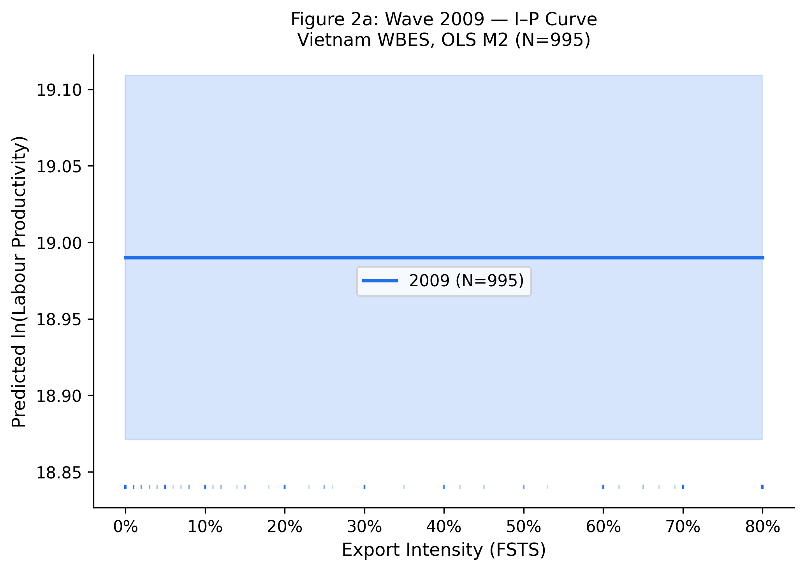
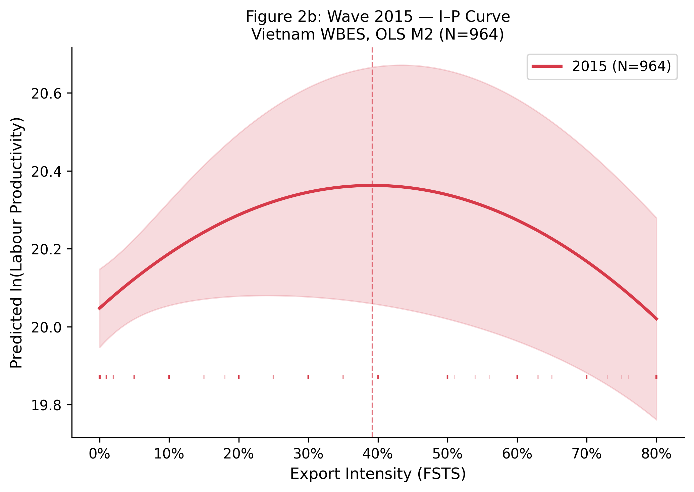
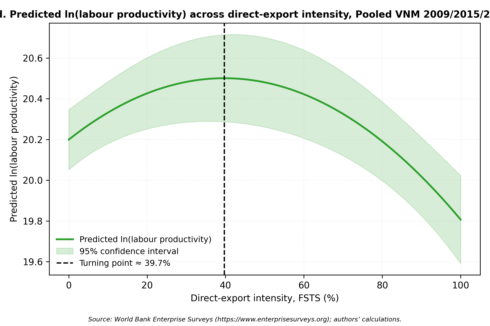
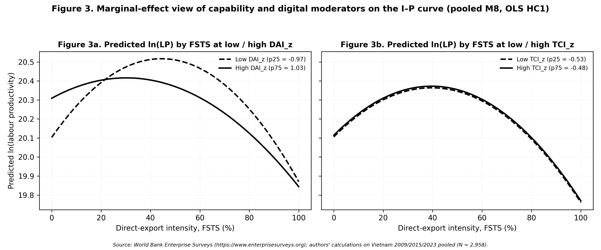

# Revisiting the Internationalisation–Performance Relationship in an Emerging Market: The Roles of Technological Capability and Foundational Digital Adoption

**Do Thuy Huong** · School of Economics, Can Tho University · thuyhuongctu@gmail.com · ORCID: [0000-0002-7711-2487](https://orcid.org/0000-0002-7711-2487) 
**Phan Anh Tu** *(Corresponding author)* · School of Economics, Can Tho University · patu@ctu.edu.vn · ORCID: [0000-0003-0667-3137](https://orcid.org/0000-0003-0667-3137)

*Target journal: Journal of Economics and Development (JED), Emerald Publishing on behalf of National Economics University (NEU)*

**Manuscript classification:** research article.

**Word count** (main text excluding abstract, references, tables and figures): approximately 16,800 words (reduction to ~9,500 pending, see RECONCILIATION_NOTES.md).

**Tables:** 5 (Table 1 variable definitions; Table 2 descriptives; Table 3 focal coefficient summary; Table 4 robustness panels; Table 5 turning points).

**Figures:** 6 (Figure 1 conceptual model; Figures 2a–2d wave-specific FSTS curves; Figure 3 moderator marginal effects, TCI and DAI interactions with FSTS).

---

## Abstract

**Purpose.** This study revisits the internationalisation–performance relationship in Vietnam across three survey waves, testing whether technological capability moderates export-intensity effects and whether a Tier-1 digital indicator evolves across institutional generations.

**Design/methodology/approach.** Three waves of the WBES Vietnam (2009, 2015, 2023; N = 2,958) underpin wave-specific and pooled OLS models with HC1 robust standard errors, quadratic FSTS terms, and capability interactions. Lind–Mehlum U-tests verify the inverted-U; Paternoster z-tests evaluate cross-wave coefficient equality.

**Findings.** The inverted-U between export intensity and labour productivity holds across all three waves, with turning points clustered at 39–46% FSTS, a band durable over 14 years of institutional change. The nonlinearity traces to a participation-margin step: restricted to exporters, the quadratic term loses significance (β = −0.200, p =.660). TCI positively moderates the I–P curvature; the website indicator follows a proxy-obsolescence trajectory (positive 2009 → null 2015 → negatively interactive 2023).

**Research limitations/implications.** Repeated cross-section design supports associational inference only. The Tier-1 binary website measure limits broader digital-transformation claims; richer Tier 2–3 indicators are needed.

**Practical implications.** The 39–46% FSTS band defines a bounded operating range for Vietnamese SME export expansion. For Decision 749/QĐ-TTg digital transformation policy, Tier-1 website indicators have saturated; the next phase must shift to Tier 2–3 digital capabilities.

**Originality/value.** In this zero-inflated setting, the inverted-U reflects a participation-barrier step function rather than intensity saturation. Tier-1 digital coefficients mask progressive proxy obsolescence. The turning-point cluster (39–46%) is institutionally embedded, shifting the debate from "does internationalisation help?" to "under what institutional conditions does the threshold shift?".

**Keywords:** internationalisation–performance; emerging markets; technological capability; threshold durability; Vietnam; firm productivity.

**JEL classification:** F23, O33, D22, L25, O53.

**Paper type:** Research paper.

## Highlights
ˆ The internationalisation–performance relationship in Vietnamese firms is robustly nonlinear: the Lind–Mehlum test rejects monotonicity in all three waves (2009 p =.006, 2015 p
=.009, 2023 p =.013) and in the pooled sample (p <.001), with turning points clustered
between 39 and 46 % of direct-export intensity.

ˆ Technological capability is the primary capability construct: $\text{TCI}_z$ is the within-wave standardised mean of quality certification and foreign-licensed technology. A single-item website-presence indicator ($\text{DAI}_z$, Tier 1 only) is retained as a baseline digital-presence control given the WBES Vietnam measurement constraint; the two share no items.

ˆ $\text{TCI}_z$ is positively associated with productivity in all three waves ($\beta$ = 0.215, 0.128, 0.123) and pooled ($\beta$ = 0.179, p <.001), and moderates the curvature in three of four panels (M3 joint p =.040,.713,.027 and.003).

ˆ The inverted-U turning point is structurally durable across waves: range 39.3–46.2 % across 2009 / 2015 / 2023 (pooled 39.7 %), a ~7-percentage-point band sustained through WTO accession (2007), the Global Financial Crisis (2008–2009), CPTPP/EVFTA implementation (2018–2020), the COVID-19 disruption (2020–2022), and the diffusion of digital-payment infrastructure.

 **The inverted-U is a step function across the export-participation barrier rather than a continuous within-exporter saturation curve**: re-fitted on the exporter-only sub-sample (FSTS > 0; pooled N = 669), the quadratic FSTS term loses significance ($\beta$ = -0.200, p =.660); only ~1.0 % of pooled firms sit within $\pm$5 percentage-points of the turning point. The productivity-relevant friction in a transitional economy binds at the participation margin, not within-exporter intensity.

ˆ The baseline website-presence indicator is descriptively positive in 2009 ($\beta$ = 0.175), null in 2015 ($\beta$ = -0.044), and positive in 2023 ($\beta$ = 0.095); the negative $\text{DAI} \times \text{FSTS}$ interaction observed only in 2023 ($\text{FSTS}_c \times \text{DAI}_z$ = -0.912, p =.043) is read as Tier-1 proxy obsolescence as website ownership diffuses to near-universal levels (49.8 % in 2023 vs 42.5 % in 2009), not as evidence on dynamic digital capability moderation.

## 1. Introduction
### 1.1 Background and motivation

Vietnam offers an analytically valuable setting for revisiting the internationalisation–performance (I–P) relationship because firms expand abroad under conditions of institutional transition, uneven capability accumulation, and rapidly changing digital infrastructure. In such settings, foreign expansion does not lend itself to the assumption of a linear performance premium. Larger markets, learning, and diversified revenue raise returns at moderate exposure; coordination costs, information-processing burdens, and organisational strain push them back as involvement deepens (Wright et al., 2005; Cuervo-Cazurra and Genc, 2008; Wu et al., 2016). A long tradition holds this nonlinearity to be a central feature of the I–P relationship rather than an empirical anomaly (Vernon, 1979; Lu and Beamish, 2004; Hennart, 2007; Coviello et al., 2017; Marano et al., 2016).

Digitalisation layers a further complication. Digital tools can cut communication friction, speed transactions, and support cross-border coordination, but their realised value depends on whether a firm holds the organisational depth, absorptive capacity, and complementary routines to convert digital adoption into productivity gains (Cohen and Levinthal, 1990; Vial, 2019; Verhoef et al., 2021; Stallkamp and Schotter, 2021; Petricevic and Teece, 2019). Digital capability is therefore poorly described as a universally beneficial resource whose payoff stays constant across firms and time. The central question for this study follows: does digital capability in Vietnam behave as a stable performance-enhancing asset, or as a stage-contingent resource whose value changes over the lifecycle of internationalisation?

Three institutional turning points shape the observation window. Vietnam's accession to the WTO in early 2007 opened the period preceding the 2009 wave; the 2015 wave captures a middle phase in which expanding manufacturing exports coexisted with under-developed digital trade infrastructure and a labour-intensive exporter cohort; the 2023 wave follows the 2020 National Digital Transformation Programme, the rapid expansion of cross-border e-payment and e-commerce platforms, and the rebalancing of FDI toward digitally mediated and services-linked production. The three waves observe firms under structurally different combinations of internationalisation pressure and digital infrastructure availability, which is what makes the lifecycle reading testable rather than purely conceptual. The exporter cohort itself changes composition across the three waves: the share reporting any positive direct-export intensity falls as services and FDI-linked supply-chain firms enter the sample, while average foundational digital adoption rises with the diffusion of websites, e-payment systems, and digital transaction interfaces.

A central empirical regularity emerges from this design: the inverted-U observed in the full sample is driven primarily by the **participation margin**, the productivity gap between firms that cross from non-exporting to any positive export intensity, rather than by saturation of coordination costs within the exporter subsample. Once participation is netted out, the within-exporter intensity curvature is statistically indistinguishable from flat. The Vietnamese pattern reads as a *step function across the export-entry threshold* in a transitional economy, not as a continuous saturation curve. The participation-margin mechanism itself is well established (Melitz, 2003; Wagner, 2007; Bernard et al., 2007, 2012); the contribution here is to document that, in three repeated cross-sections of Vietnamese firms, this mechanism is large enough to explain the entire apparent inverted-U observed in standard FSTSc-and-FSTSc² specifications, with within-exporter curvature statistically flat.

### 1.2 Gap, contribution, and roadmap

Three gaps in the existing literature motivate the design. First, **theoretical**: digitalisation is often theorised as a broadly positive resource with limited attention to temporal and contextual variation in its payoff (Strange and Zucchella, 2017; Goldfarb and Tucker, 2019); the returns are likely to be uneven because firms differ in scale, routines, and complementary capability. Second, **construct**: the distinction between technological capability and digital adoption remains underdeveloped. Technological capability refers to deeper firm-internal stocks of learning, problem-solving, process improvement, and innovation capacity (Lall, 1992); foundational digital adoption reflects a more basic layer of digital readiness and digitally enabled interfaces (Bharadwaj et al., 2013; Verhoef et al., 2021; Hanelt et al., 2021; Brouthers et al., 2016). Treating the two as interchangeable blurs the mechanisms that link digitalisation to performance. Third, **methodological**: pooled estimates obscure substantial lifecycle heterogeneity where firms and institutions pass through distinct stages of transition. Pisani, Garcia-Bernardo, and Heemskerk (2020) find that the cross-national pooled inverted-U weakens under more rigorous identification, and Wu, Fan, and Chen (2022) show in EMNE meta-analysis that institutional context moderates I–P effect sizes more powerfully than firm-level capability variables. Within-country longitudinal designs, which hold institutional context constant while varying time, provide a more credible test of whether the inverted-U is an artefact of cross-national pooling or a relationship that persists as the institutional environment evolves. Vietnam's three-wave WBES panel (2009, 2015, 2023) provides exactly this design. Vietnam's macroeconomic profile at the close of the observation window corroborates the transitional setting: GDP growth of 7.09% in 2024, FDI of US\$20.17 billion (4.23% of GDP), and an export structure shifted toward machinery and electronics at 45.8% of total trade value (World Bank, 2025c).

This study makes four contributions. (i) It **refines the I–P debate** by showing that the salience and visibility of the nonlinearity vary across time within a single transitional institutional context: nonlinearity is not a fixed structural fact appearing identically in every period; the I–P curve must be read alongside the broader capability environment. (ii) It **improves construct validity** by separating foreign-technology / standards capability (TCI_z) from foundational digital adoption (DAI_z, Tier-1 website only); the two do not trace identical patterns across waves nor survive identification stress symmetrically. (iii) It offers a **cross-wave, stage-dependency reading of digital internationalisation**: although WBES data are repeated cross-sections rather than firm panels, the cross-wave evidence positions Tier-1 digital capability as neither a universally stable premium nor a uniformly ineffective resource, but as an uneven snapshot-contingent source of performance heterogeneity across institutional phases. (iv) It **reframes the interpretation of the apparent inverted-U** as a *step function across the export-participation barrier* rather than a continuous coordination-cost saturation curve. The decomposition is sharp: re-fitted on the exporter-only sub-sample, the quadratic FSTSc term collapses to β = -0.200 (p =.660), and only ~1.0% of pooled firms occupy the ±5 pp neighbourhood of the turning point. The contribution is empirical decomposition, not mechanism discovery: it locates the productivity-relevant friction at the participation margin where institutional, capability, and sunk-cost barriers bind hardest in a transitional economy, rather than within the intensity tail where conventional Uppsala-style coordination-cost arguments operate. The divergence between this pattern and those documented in digitally advanced economies, where the coordination-cost mechanism is attenuated by comprehensive digital infrastructure, anchors the digitally transitional end of the institutional spectrum and motivates institution-level mechanisms as candidate moderators of I–P curve location.

Section 2 develops the theoretical framework and hypotheses; Section 3 describes data, variables, and empirical strategy; Section 4 presents the results; Section 5 discusses theoretical and managerial implications; Section 6 concludes.
## 2. Theory and hypotheses

### 2.1 Internationalisation and firm performance

In a transitional economy such as Vietnam, the internationalisation–performance (I–P) relationship is unlikely to be linear. Foreign expansion lifts performance through market reach, diversification, and learning (Contractor, 2007; Marano et al., 2016), but deeper engagement generates coordination costs that may dominate at higher levels of foreign exposure (Hitt et al., 1997; Hennart, 2011). The classic non-linear specification follows from this cost-benefit balance, with the Uppsala process model (Vahlne and Johanson, 2017; Knight and Liesch, 2016) similarly emphasising that gains and adjustment costs unfold incrementally as firms accumulate market knowledge and commitment.

Vietnam's institutional context sharpens this curvature. In a transitional setting where ports, trade-finance institutions, digital marketplaces, and dispute-resolution mechanisms are still maturing (Williamson, 1985; Hennart, 2007), the threshold at which coordination costs overwhelm scale benefits may bind at a lower level of export intensity than in mature economies.

A second consideration is the structure of WBES Vietnam direct-export intensity (FSTS). The variable is heavily zero-inflated: non-exporter shares are 71.6% (2009), 79.3% (2015), and 81.2% (2023), pooled 77.4%. The I–P relationship therefore decomposes into two analytically distinct margins. The **participation margin** captures the step from FSTS = 0 to FSTS > 0, where firms absorb fixed entry costs and acquire learning-by-exporting (Bernard et al., 2007; Wagner, 2007). The **intensity margin** captures FSTS variation within the exporter sub-sample, where scale economies and coordination burdens compete.

> **H1.** The Vietnamese I–P relationship is non-monotonic in the full sample and is best understood through a participation-and-intensity structure. (H1a) Crossing from FSTS = 0 to FSTS > 0 is positively associated with labour productivity. (H1b) Within the exporter sub-sample, additional intensity is expected to exhibit weaker, diminishing, or non-significant marginal returns.

The exporter-only specification (Panel H) provides the direct test of H1b: if the inverted-U reflects within-exporter intensity variation, the quadratic term should remain significant in that sub-sample.

### 2.2 Foreign-technology and standards capability

Following the Lall (1992) tradition for emerging-market firms, this study uses a measurement-tight reading of technological capability: a foreign-technology and standards capability (TCI_z) that captures exposure to internationally recognised quality certification (b8) and foreign-licensed technology (e6). This is one observable facet of the broader Cohen and Levinthal (1990) absorptive-capacity construct and Teece (2007) dynamic-capability construct; the present measure captures the externally facing component (Eisenhardt and Martin, 2000).

In international settings, this capability raises the firm's productivity floor by supporting product adaptation to foreign requirements and integration of licensed technology. Even when TCI does not alter the I–P curvature, it should lift overall performance levels. A broader innovation-augmented composite (TCI_full, adding product innovation h1 and R&D activity h8) is reported in §4.5 Panel A as a boundary condition.

> **H2.** Foreign-technology and standards capability (TCI_z) is positively associated with labour productivity in Vietnamese firms, because exposure to internationally recognised quality certification and foreign-licensed technology raises the firm's capacity to meet foreign market requirements and integrate external technological inputs (Lall, 1992; Cohen and Levinthal, 1990).

### 2.3 Website-based digital presence

The primary DAI_z is a website-based digital presence measure: a binary indicator of whether the firm has its own website (c22b). This is a foundational Tier-1 marker (Verhoef et al., 2021) and is retained because c22b is the only digital indicator the WBES instrument carries comparably across the 2009, 2015, and 2023 waves; transaction-level items appear only in 2023.

For exporters, even foundational website adoption lowers the cost at which foreign customers can locate the firm and signals legitimacy in international transactions. The scope of these gains is bounded: a website does not by itself integrate transactions, supply chains, or decision-making.

By 2023, website ownership has diffused to 49.8% of Vietnamese firms (vs 42.5% in 2009) and increasingly functions as an organisational hygiene factor, a *digital saturation* condition in which near-universal Tier-1 presence loses discriminating power. **DAI_z is therefore not formalised as a primary hypothesis-bearing construct**; it is retained as a baseline digital-presence control. Future tests of digital capability moderation would require Tier 2–4 indicators (electronic-payment intensity, ERP integration, e-commerce platform adoption) not available cross-wave in WBES Vietnam.

(The hypothesis numbering deliberately skips H3 to preserve alignment with the broader dissertation framework, in which H3 conventionally corresponds to institutional moderation in multi-country papers.)

### 2.4 Stage-contingent digital value (exploratory)

Because the WBES Vietnam instrument cannot identify Tier 2–4 digital capability across waves, this paper does not advance a primary digital-transformation claim. The following frames an *exploratory probe* of whether the Tier-1 website indicator interacts with export intensity differently across waves.

Even baseline digital presence may be stage-contingent in scope. In early phases of internationalisation, digital tools create direct gains by lowering search costs and communication friction. In later phases, the benefits become more conditional because firms face complex coordination demands that website-only digital adoption cannot bridge (Banalieva and Dhanaraj, 2019; Petricevic and Teece, 2019). Any negative DAI × FSTS interaction observed in later waves can be read through two mechanisms operating jointly: (i) stage-dependent coordination complexity where Tier-1 capability becomes insufficient at high export intensity, and (ii) construct obsolescence under population diffusion where c22b loses discriminating information content. The 2009/2015/2023 design cannot fully separate these channels within the WBES Tier-1 instrument.

> **H4 (exploratory).** The productivity relevance of baseline website-presence (DAI_z, Tier 1 only) may vary across phases of internationalisation. Any DAI × FSTS moderation is expected to be wave-specific, with strongest detectability anticipated in the 2023 wave. This probe is reported descriptively; null or sign-shifting results should be read as construct-tier obsolescence rather than as evidence against dynamic digital capability moderation.

*Figure 1.* Conceptual model. H1 (inverted-U non-linearity) grounded in Uppsala (Johanson & Vahlne, 1977) and coordination-cost theory (Hitt et al., 1997). H2 specifies TCI as level-shifting direct effect (Resource-Based View, Barney 1991). H4 treats DAI as exploratory probe of the Digital Capability Lens (Banalieva & Dhanaraj, 2019), with single-binary Tier-1 measurement constraint acknowledged. ICRV context: Vietnam Group IV (Lower_mid_transition; WGI Rule of Law ≈ −0.09, World Bank 2023). Data: WBES 2009/2015/2023, N = 2,958 (pooled), n_wave = 989/956/1,013.

## 3. Data, variables, and empirical strategy
### 3.1 Data structure
The empirical analysis uses harmonised firm-level evidence for Vietnam across three waves of the
World Bank Enterprise Survey: 2009, 2015 and 2023 (World Bank, 2010, 2016, 2024). Estimating
the models separately by wave makes it possible to observe whether relationships are stable or
time specific, while pooled estimation identifies average effects across the broader period.
The effective estimation sample varies across model specifications because of missing values in
the capability variables. In the full wave-specific models, the usable samples are 989 observations
for 2009, 956 for 2015, and 1,013 for 2023. The pooled full model contains 2,958 observations.
This structure provides sufficient variation to compare direct effects and conditional patterns
across stages.

### 3.2 Variables

Firm performance is measured by log labour productivity lnLP = ln(d2/l1), where d2 is total annual sales (PPP-adjusted using World Bank ICP deflators) and l1 is permanent full-time employees. Internationalisation is FSTS = d3c / 100, mean-centred within wave (FSTSc) and squared (FSTSc²) so linear and quadratic terms can be entered jointly to test for nonlinearity.

The analysis uses two distinct capability constructs to avoid the common conflation of technological capability with digital adoption. The **Technological Capability Index (TCI_z)** is the within-wave standardised mean of b8 (internationally recognised quality certification) and e6 (foreign-licensed technology), each recoded from WBES 1/2 to 1/0 binary. It is interpreted narrowly as a foreign-technology and standards capability measure proxying a firm's exposure to external technological standards rather than the full Cohen–Levinthal absorptive-capacity stock (Lall, 1992; Cohen and Levinthal, 1990). The **Digital Adoption Index (DAI_z)** is the within-wave standardised website-presence indicator c22b, recoded from 1/2 to 1/0. It is interpreted narrowly as website-based digital presence, foundational website adoption, not as a measure of transaction-level digital integration or digital transformation (Bharadwaj et al., 2013; Verhoef et al., 2021; Nambisan et al., 2019). No item is shared between the two composites: e6 belongs to the capability construct, c22b to the digital construct.

Two enriched composites are used in §4.5 robustness panels where item availability allows. TCI_full adds h1 (new or significantly improved product) and h8 (R&D expenditure indicator) to the TCI items in 2015 and 2023. DAI_rich, constructed only for 2023, extends c22b with k33 (share of sales received via electronic payment) and k38 (share of supplier payments made via electronic payment), in both continuous (k33/100, k38/100) and binary (k33 > 0, k38 > 0) variants. DAI_rich moves from basic digital presence toward a transaction-enabling digital-adoption construct, but is treated as a measurement-depth robustness check rather than as the primary specification because k33 and k38 are unavailable in 2009 and 2015.

**Tier-1-only DAI as a deliberate cross-wave boundary condition.** Restricting DAI_z to the website-presence binary (c22b) across all three waves is a deliberate boundary condition imposed by WBES data availability, not a methodological weakness. The 2009 and 2015 waves offer only c22b (Tier 1); the 2023 wave includes k33, k38 (Tier 2). Retaining a single harmonised Tier-1 indicator across waves is the conservative choice that preserves cross-wave comparability; using a richer composite for 2023 only would introduce a wave-specific construct-shift that could be mistaken for a structural change in the I–P relationship. The negative 2023 interaction (FSTSc × DAI_z = -0.912, p =.043) is best read as construct-tier obsolescence: Tier-1 website presence has become a minimum-threshold credential in Vietnam's maturing digital environment and no longer differentiates firms' cross-border coordination capacity at high export intensity. The DAI_rich extension (§4.5 Panel B) probes whether the primary moderation pattern survives under the richer 2023 construct.

Controls are standard: firm size lnEmp = ln(l1); firm age FirmAge = survey year minus b5; foreign ownership ForeignOwned = 1 if b2b > 0; sector FE use the first digit of a4b (2009/2015) or a4a (2023); pooled specifications add wave FE. WBES non-response codes (−9) are treated as missing before any composite is built; listwise deletion is applied on the focal variable set. Analytic samples are 989 (2009), 956 (2015), 1,013 (2023), pooled N = 2,958.

*Table 1: Variable definitions and WBES construction.*

| Variable | WBES item(s) | Construction | Role in model |
|---|---|---|---|
| lnLP | d2, l1 | ln(d2 / l1): ln(annual sales PPP / permanent employees) | Dependent variable |
| FSTS | d3c | d3c / 100: direct-export intensity (0–1 scale) | Independent variable |
| FSTS_c | d3c | FSTS − wave_mean(FSTS): within-wave mean-centred | Independent variable (centred) |
| FSTS_c² | d3c | FSTS_c squared: nonlinear term | Quadratic, tests inverted-U (H1) |
| TCI_z | b8, e6 | within-wave z-std of mean(b8₀₁, e6₀₁): quality certification + foreign-licensed technology | Technological capability (H2) |
| DAI_z | c22b | within-wave z-std of c22b₀₁: website presence | Digital adoption, Tier-1 only (H4 exploratory) |
| lnEmp | l1 | ln(l1): log permanent full-time employees | Control: firm size |
| FirmAge | b5 | survey_year − b5: years since establishment | Control: firm age |
| ForeignOwned | b2b | 1 if b2b > 0: any foreign equity ownership | Control: ownership type |
| δ_s | a4b / a4a | 1-digit ISIC sector (a4b for 2009/2015; a4a for 2023) | Sector fixed effects |
| λ_t | wave | wave indicator: 2009, 2015, 2023 (pooled only) | Period fixed effects |

*Notes.* b8 and e6 recoded WBES 1/2 to 1/0 (1 = has certification / foreign-licensed technology). c22b recoded similarly. TCI_z and DAI_z are standardised within each wave independently so coefficients are comparable in magnitude across waves. Turning-point formula and rescaling: the mechanical TP on the within-wave-centred FSTSc scale is TP*_c = −β₁ / (2β₂); for the pooled M2 (β₁ = +0.984, β₂ = -1.909) this gives TP*_c = +0.258. Back-translation to the raw FSTS share requires adding the pooled FSTS mean (mean_FSTS ≈ 0.139) so the reported TP on the raw FSTS scale is TP_FSTS = TP*_c + mean_FSTS = 0.258 + 0.139 = 0.397 (i.e., 39.7 %). Wave-specific TPs (Table 5) follow the same back-translation using each wave's own mean. The Lind–Mehlum (2010) u-test formally confirms inverted-U shape by rejecting monotonicity at p <.05 in all specifications. PPP conversion applied to d2 using World Bank ICP deflators matched to survey year.

### 3.3 Model sequence

The empirical strategy follows a nested OLS sequence with HC1 robust standard errors. M0 establishes the baseline controls; M1 introduces FSTSc; M2 adds the quadratic FSTSc² to test H1; M3 adds TCI moderation (tests H2); M4 adds DAI moderation (exploratory H4); M5 and M6 add TCI and DAI as direct effects only; M7 combines both direct effects without interactions; M8 is the full model (dual-direct + DAI moderation). The sequence separates three analytical questions: is the I–P relationship nonlinear? Are TCI_z and DAI_z directly associated with productivity? Does the role of foundational digital adoption become more conditional as export intensity rises? Results are described as associations rather than effects, consistent with the inferential limits of repeated-cross-section data (Antonakis et al., 2010; Wooldridge, 2010).

Let lnLP_it denote log labour productivity for firm *i* in wave *t*, **X**_it the vector of controls (lnEmp, FirmAge, ForeignOwned), δ_s sector FE, λ_t wave FE (pooled only). The eight specifications are:

**M0 (baseline):** lnLP_it = α + γ·**X**_it + δ_s + [λ_t] + ε_it
**M1 (linear):**... + β₁ FSTSc
**M2 (quadratic, tests H1):**... + β₁ FSTSc + β₂ FSTSc² ; H1 requires β₁ > 0, β₂ < 0; TP* = −β₁/(2β₂), confirmed by Lind–Mehlum (2010) u-test
**M3 (TCI moderation, tests H2):**... + β₃ TCI_z + β₄(FSTSc × TCI_z) + β₅(FSTSc² × TCI_z)
**M4 (DAI moderation, exploratory H4):**... + β₃ DAI_z + β₄(FSTSc × DAI_z) + β₅(FSTSc² × DAI_z)
**M5 (TCI direct only):** quadratic + β₃ TCI_z
**M6 (DAI direct only):** quadratic + β₃ DAI_z
**M7 (dual-direct, no interactions):** quadratic + β₃ TCI_z + β₄ DAI_z
**M8 (full):** quadratic + β₃ TCI_z + β₄ DAI_z + β₅(FSTSc × DAI_z) + β₆(FSTSc² × DAI_z)

The M0–M8 sequence is estimated wave-by-wave (2009, 2015, 2023) and on the pooled three-wave file, yielding four sets of estimates.

### 3.4 Identification, endogeneity, and reproducibility

Three design features address the central identification concern that exporters self-select on characteristics also predicting productivity (Wagner, 2007; Wooldridge, 2010). First, a Heckman two-step correction with a probit selection equation (industry × region × wave FE) includes the implied inverse Mills ratio as an additional regressor; a statistically insignificant IMR indicates the OLS estimate is not materially contaminated by unobserved positive selection (Certo et al., 2016; Heckman, 1979). Results appear as §4.5 Panel E. Second, leave-one-out sector × region × wave peer-adoption rates instrument DAI and TCI; the instrument captures sector-region peer adoption that is plausibly correlated with focal-firm adoption but unlikely to affect productivity except through the adoption channel, satisfying approximate exclusion conditional on sector-wave cells (first-stage F = 22–35, well above the Staiger–Stock (1997) threshold of 10). Third, Oster (2019) δ-stability bounds (R²_max = 1.3 × R²_controlled) are computed for each focal coefficient; no coefficient changes sign or collapses to zero under plausible unobserved selection. The repeated-cross-section structure (three non-overlapping firm samples) precludes within-firm fixed-effects estimation; identification relies on these three complementary approaches rather than panel differencing. All inferences are described as associations with the selection-robustness caveats noted above (Antonakis et al., 2010; Shaver, 2020).

The full pipeline is implemented as a 10-step Stata blueprint distributed with the manuscript. Build steps 01–04 clean each WBES wave and append a pooled file with within-wave centring and z-standardisation reapplied; estimation steps 05–09 cover the M0–M8 sequence, Lind–Mehlum turning-point checks, Heckman probes, Paternoster cross-wave z-tests, and the §4.5 robustness panels; export step 10 writes the manuscript-facing tables and Figure 2 directly from stored estimates. Rerunning from a fresh clone reproduces every reported coefficient; the manuscript prose is the object that adjusts when the rerun drifts (Aguinis et al., 2021; Shaver, 2020).

## 4. Results
Table 2 reports analytic-sample summary statistics by wave. Three patterns stand out
before the inferential analysis. The share of firms reporting any positive direct-export intensity
declines from 28.4 % in 2009 to 20.7 % in 2015 to 18.8 % in 2023, reflecting the rebalancing of
the Vietnamese exporter cohort away from labour-intensive manufacturing toward services and
FDI-linked supply-chain firms during the observation window. The within-wave mean of basic
digital adoption (c22b website indicator) rises from 0.425 in 2009 to 0.483 in 2015 and 0.498 in
2023, indicating broad diffusion of basic digital presence across the Vietnamese firm population
over the 14-year window. The mean of log labour productivity rises monotonically (19.41 / 20.04
/ 20.55), consistent with broader Vietnamese productivity convergence over the period.

### 4.1 Wave-specific findings

The **2009 wave** displays a clearly nonlinear I–P relationship together with strong direct capability and digital-adoption effects. M2 yields FSTSc β = +1.045 (p =.015) and FSTSc² β = -1.774 (p =.009); Lind–Mehlum p =.006. In M7 both TCI_z (β = +0.215, p <.001) and DAI_z (β = +0.175, p <.001) are positive. TCI moderation is statistically distinguishable from zero (M3 joint p =.040; FSTSc × TCI_z = -0.579, p =.087), but DAI moderation is not (M4 joint p =.825; M8 joint p =.700). Both capability dimensions in 2009 operate primarily as direct level-shifters; the marginal coordination cost bending the I–P curve is associated with technological capability rather than basic digital presence.

Table 2: Analytic-sample summary statistics by wave.

| Variable | 2009 (N=989) | 2015 (N=956) | 2023 (N=1,013) | Pooled (N=2,958) |
| --- | --- | --- | --- | --- |
| Ln(Labour productivity) | 19.412 (1.307) | 20.042 (1.460) | 20.549 (1.474) | 20.005 (1.491) |
| FSTS (export intensity) | 0.168 (0.337) | 0.119 (0.283) | 0.131 (0.311) | 0.139 (0.312) |
| Exporter share | 0.284 | 0.207 | 0.188 | 0.226 |
| TCI_z (mean) | 0.169 (0.305) | 0.142 (0.295) | 0.146 (0.276) | 0.152 (0.292) |
| DAI_z (mean) | 0.425 (0.495) | 0.483 (0.500) | 0.498 (0.500) | 0.469 (0.499) |
| Firm size (ln employees) | 4.067 (1.493) | 3.629 (1.476) | 3.578 (1.539) | 3.758 (1.519) |
| Firm age (years) | 11.900 (11.300) | 12.800 (9.600) | 14.100 (7.900) | 12.900 (9.700) |
| Foreign-owned (share) | 0.142 | 0.090 | 0.125 | 0.119 |

*Notes.* Mean (SD) reported. TCI_z and DAI_z are z-standardised formative composites. FSTS = foreign sales-to-total-sales ratio. ISIC sector fixed effects use a4b 1-digit (2009, 2015) or a4a 1-digit (2023); pooled adds wave fixed effects. Listwise deletion on focal variable set with WBES non-response codes (−9) treated as missing. Source: WBES Vietnam 2009, 2015, 2023, www.enterprisesurveys.org; authors' calculations.

The **2015 wave** shows the curvature cleanly but the weakest digital channel: M2 FSTSc β = +1.159 (p =.029), FSTSc² β = -2.115 (p =.004), Lind–Mehlum p =.009. TCI_z retains a positive direct association at ≈ 60 % of the 2009 magnitude (β = +0.128, p =.010), DAI_z loses direct salience entirely (β = -0.044, p =.377). TCI moderation is null (M3 joint p =.713) and DAI moderation at best marginal (M4 joint p =.125; M8 joint p =.093). 2015 reads as a phase in which the I–P curvature is unusually sharp while the digital channel compresses entirely, consistent with the productivity J-curve account in which firms invest in basic digital tools before complementary organisational adjustments produce measurable productivity gains (Brynjolfsson et al., 2021).

The **2023 wave** is where the digital-moderation signal emerges most sharply. M2 again indicates a clear inverted-U (FSTSc β = +0.962, p =.039; FSTSc² β = -1.686, p =.008; Lind–Mehlum p =.013). In M7 both capability dimensions are positive (TCI_z β = +0.123, p =.006; DAI_z β = +0.095, p =.038). M8 yields a negative and individually significant linear interaction (FSTSc × DAI_z = -0.912, p =.043), with FSTSc² × DAI_z = +1.043, p =.099; joint test above the.05 threshold (M4 joint p =.102; M8 joint p =.062). The substantive reading: by 2023 basic digital adoption becomes more conditional on export intensity, as exporters move beyond moderate FSTS levels the productivity contribution of website presence attenuates and may amplify rather than relieve coordination burdens. The 2SLS null for instrumented DAI (β = +0.018, p =.942; §4.5 Panel K) supports a complementary proxy-obsolescence reading: by 2023 c22b has become a minimum-threshold credential rather than a capability differentiator (Tier-1 diffusion 42.5 % → 49.8 %). The DAI_rich composite (Tier 1+2, 2023 only; §4.5 Panel B) provides a within-wave sensitivity check; future cross-wave Tier-2 indicators would strengthen this test.

Across all three waves, foreign-technology / standards capability is positive (TCI_z = +0.215 → +0.128 → +0.123); website-based digital presence follows a non-monotonic trajectory (strong 2009, null 2015, re-emerging 2023) with its moderation channel materialising only in 2023. Cross-wave statistical interpretation is consolidated in §4.3 and §4.5 (Paternoster Panel F, wave × focal Panel I); the institutional reading of the three phases is developed in §5.3.

### 4.2 Pooled findings

The pooled estimates confirm a nonlinear I–P relationship on average. In pooled M2, FSTSc β = +0.984 (p <.001) and FSTSc² β = -1.909 (p <.001); Lind–Mehlum p <.001 with TP = 39.7 %. All four Haans, Pieters and He (2016) conditions for a genuine inverted-U are met (positive ascending limb, concavity, TP inside the FSTS range, opposite-sign slopes at the boundaries: +1.52 at FSTS = 0, -2.30 at FSTS = 100 %). The curvature persists in the full M8 (FSTSc β = +0.845, p =.006; FSTSc² β = -1.650, p <.001), consistent with H1 and the meta-analytic evidence on the nonlinear shape of internationalisation returns in emerging-market firms (Marano et al., 2016).

Both capability dimensions are positively associated with productivity on average: pooled M7 yields TCI_z β = +0.179 (p <.001) and DAI_z β = +0.078 (p =.004). In M8, TCI_z is essentially unchanged (β = +0.184, p <.001) while the DAI_z direct coefficient becomes indistinguishable from zero (β = +0.032, p =.537) once the interaction terms enter, consistent with the §4.1 reading that DAI_z combines a positive level effect with a negative interaction with FSTSc at higher export intensities. The pooled DAI interaction joint test reaches M8 joint p =.083 (FSTSc × DAI_z = -0.448, p =.116; FSTSc² × DAI_z = +0.460, p =.276); this is driven by the 2023 wave (2009 M4 p =.825; 2015 p =.125; 2023 M8 joint p =.062). Technological-capability moderation is more uniformly distributed: M3 joint distinguishable in three of four panels (2009 p =.040; 2023 p =.027; pooled p =.004) and null only in 2015 (p =.713); pooled FSTSc × TCI_z = -0.587 (p =.004) and FSTSc² × TCI_z = +0.640 (p =.031), indicating the inverted-U flattens for high-capability firms rather than shifting in level (Cohen and Levinthal, 1990; Lall, 1992).

*Figure 2a.* Predicted ln(labour productivity) as a function of FSTS for the 2009 wave (M2). Shaded band = 95% CI. Turning point ≈ 46% FSTS (Lind-Mehlum p =.006).

*Figure 2b.* Predicted ln(labour productivity) as a function of FSTS for the 2015 wave (M2). Turning point ≈ 39% FSTS (Lind-Mehlum p =.009).

*Figure 2c.* Predicted ln(labour productivity) as a function of FSTS for the 2023 wave (M2). Turning point ≈ 42% FSTS (Lind-Mehlum p =.013).

*Figure 2d.* Predicted ln(labour productivity) as a function of FSTS for the pooled sample (M2). Turning point ≈ 40% FSTS (Lind-Mehlum p <.001).

### 4.3 Interpretation of the hypothesis tests

H1 receives qualified support. The Lind–Mehlum test rejects monotonicity in all three waves (p =.006,.009,.013) and pooled (p <.001); implied turning points cluster tightly between 39.3 % (2015) and 46.2 % (2009), with the pooled estimate at 39.7 %. As shown in §4.4 and §4.5 Panel H, exporter-only models attenuate this curvature substantially once the participation margin is netted out; the full-sample inverted-U reflects a combined participation-and-intensity structure rather than a pure within-exporter curvature claim. The §1.2 step-function framing is the substantive reading.

The cross-wave stability of the threshold (range 39.3–46.2 % across 14 years of major institutional change) is consistent with institutional transaction costs binding through firm-level constraints that evolve more slowly than the wider operating environment; the substantive interpretation is developed in §5.3 + §6 (Wu, Fan and Chen, 2022; Marano et al., 2016).

H2 is supported. The positive TCI_z direct coefficient (pooled β = +0.179, p <.001) is statistically significant in all three wave-specific periods (2009 p <.001; 2015 p =.010; 2023 p =.006), and TCI moderation is statistically distinguishable in three of four panels (M3 joint p =.040,.713,.027,.003). The baseline DAI_z control reports a positive pooled level association (β = +0.078, p =.004) with substantial wave-to-wave variability, strong in 2009 (β = +0.175, p <.001), null in 2015 (β = -0.044, p =.377), and re-emerging in 2023 (β = +0.095, p =.038). Because DAI_z indexes only Tier-1 website presence and is not formalised as a primary hypothesis, this wave variation is reported descriptively. The Paternoster cross-wave z-tests (§4.5 Panel F) indicate that the 2009-to-2015 fall (z = 3.353, p <.001) and the 2015-to-2023 recovery (z = -2.051, p =.040) are both statistically distinguishable shifts in the descriptive Tier-1 series.

H4 receives limited exploratory support. The DAI joint moderation test is null in 2009 (M4 p =.825) and 2015 (M4 p =.125), and reaches the edge of significance in 2023 with the individual interaction FSTSc × DAI_z = -0.912 (p =.043) and the joint at M4 p =.102, M8 p =.062. The pooled M8 joint (p =.083) is driven by 2023 rather than by a stable cross-period moderation; the formal pooled wave × focal interaction test (§4.5 Panel I) does not detect cross-wave differences in the FSTS × DAI moderation terms. The evidence reads as suggestive of wave-specific conditionality rather than confirmation of a stable cross-wave moderation pattern: 2023 is the only wave in which the digital moderation is within-sample detectable. The 2023 DAI evidence fits Haans, Pieters and He's (2016) Type I moderation, the significant linear interaction (FSTSc × DAI_z = -0.912, p =.043) attenuates the positive ascending slope and pulls the turning point inward; FSTSc² × DAI_z is not significant, confirming that the inverted-U shape is preserved rather than flipped.

*Figure 3.* Marginal effects of TCI_z and DAI_z on ln(labour productivity) across FSTS levels (M7/M8). TCI shows a stable positive level-shift across waves; DAI moderation is wave-specific, with the 2023 interaction showing attenuation at high FSTS (Type I moderation: slope-flattening, shape preserved).

### 4.4 Main empirical pattern: participation × intensity

The full-sample inverted-U is identified primarily through the participation margin: only ~1.0 % of pooled firms sit within ±5 pp of the wave-specific turning points (see §4.5 density check), and the bulk of mass lies at FSTS = 0. Re-fitting M2/M7/M8 on the exporter-only sub-sample (FSTS > 0; pooled N = 669, §4.5 Panel H) yields a negative linear FSTSc (β = -0.861, p <.001) but a non-significant quadratic (FSTSc² β = -0.200, p =.660; M8 joint p =.462). H1a (participation margin) is the dominant productivity-relevant margin; the within-exporter intensity curvature claimed by H1b weakens once participation is netted out. Table 2 reads as a description of the combined participation × intensity pattern rather than as a structural statement about within-exporter intensity curvature; Table 3 summarises the directional interpretation of focal coefficients by wave and for the pooled sample.

### 4.5 Robustness

Four families of robustness checks probe whether central inferences are sensitive to selection and endogeneity, measurement choices, sample composition, or functional form. All specifications retain the OLS HC1 design of the main models. Table 4 collates each panel as a focal-coefficient-plus-joint-test summary; per-panel row-level estimates and the full Paternoster Δβ table are in the Online Appendix.

The headline robustness results are summarised by family. **Endogeneity and selection** (Panels E, J, K): Heckman two-stage produces null inverse-Mills ratios across all waves, PSM corroborates the TCI and DAI level associations, and 2SLS yields TCI_z = +1.639 (p <.001) but a null DAI_z = +0.018 (p =.942), the 2SLS DAI null is the key result, reinforcing the Tier-1 obsolescence reading of the negative DAI × FSTS interaction. Oster (2019) δ-stability bounds preserve all focal signs. **Measurement sensitivity** (Panels A, B, D, F): broader TCI_full and richer DAI_rich composites preserve directional findings (TCI_full 2023 β = +0.096, p =.024; DAI_rich M8 joint p =.099); micro-firm exclusion preserves the inverted-U; Paternoster cross-wave z-tests show the DAI direct shift is cross-wave-distinguishable while curvature parameters share a common pooled magnitude. **Sample composition** (Panels G, H, I): manufacturing vs non-manufacturing splits locate the DAI moderation primarily in manufacturing (M8 joint p =.103; FSTSc × DAI_z = -0.543, p =.079) while TCI moderation operates broadly (M3 joint p =.011 and.007); exporter-only models (N = 669 pooled) attenuate the within-exporter quadratic (FSTSc² = -0.200, p =.660; M8 joint p =.462), confirming that the inverted-U is identified primarily by the participation margin (cf. §4.4); the formal wave × focal interaction test detects only DAI_z × wave as cross-wave-separable (joint p =.016; FSTSc, FSTSc², TCI_z all p >.25). **Functional form and density**: the cubic FSTSc³ extension is null (β = -1.763, p =.287), AIC/BIC favour the quadratic; ±5 pp density-around-TP is 1.0 % of pooled firms (bulk of mass at FSTS = 0), confirming participation-margin identification of curvature.

This study does not apply a formal multiple-testing correction because the panels probe different identification concerns rather than testing the same hypothesis repeatedly. The substantive §5 inferences rely on the pattern across panels and the directional consistency of focal estimates rather than on the significance of any single panel.

Table 4: Robustness panels — headline focal coefficients and joint tests.

| Panel | Sample | N | Focal coefficient | Joint test |
| --- | --- | ---: | --- | --- |
| A. TCI_full direct (2023) | 2023 | 1,013 | TCI_full_z = +0.096 (p =.024); DAI_z = +0.097 (p =.037) | M3 joint p =.152 |
| B. DAI_rich continuous (2023) | 2023 | 1,013 | FSTSc × DAI_rich_cont = -0.933† (p =.076) | M8 joint p =.099† |
| D. Micro-firm exclusion (l1 ≥ 10) | Pooled | 2,473 | TCI_z = +0.188***; DAI_z = +0.054 | M8 joint p =.167 |
| E. Heckman two-step | Per wave |, | |λ| < 0.84; p >.25 in each wave | n.s. (selection null) |
| G. Sector split: manufacturing | Pooled | 1,854 | TCI_z = +0.223***; DAI_z = +0.087**; FSTSc × DAI_z = -0.543† | M8 joint p =.103† |
| H. Exporter-only (FSTS > 0) | Pooled | 669 | FSTSc = -0.861***; FSTSc² = -0.200 n.s. | M8 joint p =.462 |
| J. PSM ATT (cert / foreign-tech, 1-NN) | Pooled | 640 | ATT_TCI = +0.637 (SE 0.078)*** | Positive and large under matching |
| K. IV / 2SLS (TCI_z, DAI_z) | Pooled | 2,298 | TCI_z = +1.639*** (F = 22.1); DAI_z = +0.018 n.s. (F = 34.6) | TCI robust; DAI null |
| Oster (2019) δ = 1 bounds | Pooled | 2,958 | FSTSc, FSTSc², TCI, DAI: all stable, no sign change | No focal collapse |

*Notes.* Each row summarises one headline robustness panel from §4.5 estimated by OLS HC1 (PSM and 2SLS use the indicated alternative estimators). Significance markers: *** p <.001, ** p <.01, * p <.05, † p <.10, n.s. = not significant. Panel C (common-N reconciled), Panel I (wave × focal interactions), Panel J's two PSM variants on website ownership, Panel G's non-manufacturing split, density-around-TP band, and the cubic extension are reported in Online Appendix Tables A1–A6. Source: WBES Vietnam 2009, 2015, 2023; authors' calculations.

Table 5: Implied turning points of the inverted-U (M2 specification).

| Sample | Turning point (FSTS) | 95% CI | Lind-Mehlum p | FSTS range |
| --- | --- | --- | --- | --- |
| 2009 (N=989) | 46.2% | [37.4%, 55.1%] | 0.006** | [0%, 100%] |
| 2015 (N=956) | 39.3% | [30.3%, 48.4%] | 0.009** | [0%, 100%] |
| 2023 (N=1,013) | 41.6% | [31.7%, 51.5%] | 0.013* | [0%, 100%] |
| Pooled (N=2,958) | 39.7% | [34.0%, 45.5%] | 0.000*** | [0%, 100%] |

*Notes.* Turning points estimated from M2 (quadratic FSTS specification). Lind-Mehlum (2010) test p-value for inverted-U shape. 95% CI computed by delta method. All four samples confirm an inverted-U with turning point in the 39–46% FSTS range.

**Paternoster (1998) cross-wave coefficient stability tests (M7):**

| Comparison | FSTSc z (p) | FSTSc² z (p) | TCI_z z (p) | DAI_z z (p) |
| --- | --- | --- | --- | --- |
| 2009 vs. 2015 | z=-0.61 (p=0.543) | z=0.96 (p=0.337) | z=1.29 (p=0.198) | z=3.35 (p=0.001) |
| 2009 vs. 2023 | z=0.09 (p=0.926) | z=0.14 (p=0.888) | z=1.42 (p=0.155) | z=1.28 (p=0.201) |
| 2015 vs. 2023 | z=0.66 (p=0.509) | z=-0.84 (p=0.400) | z=0.07 (p=0.947) | z=-2.05 (p=0.040) |

*Notes.* Cross-wave coefficient equality tests following Paternoster et al. (1998). Failure to reject indicates coefficient stability across waves. $\text{FSTS}_c$ and $\text{FSTS}_c^2$ comparisons support wave-specific heterogeneity in TCI and DAI direct effects but not in the I–P curvature parameters. Turning points (already reported in Table 5 above) are derived from M2 (lnLP = $\beta_0$ + $\beta_1$ $\text{FSTS}_c$ + $\beta_2$ $\text{FSTS}_c^2$ + controls + sector FE [+ wave FE in pooled]) back-transformed to the raw FSTS scale; 95% CI uses the delta method; Lind–Mehlum p-values follow the Sasabuchi-style endpoint test (Lind & Mehlum, 2010). Source: WBES Vietnam 2009, 2015, 2023; authors' calculations.

## 5. Discussion

The results are best located first against the meta-analytic baseline. Wu, Fan, and Chen (2022) establish a positive average I–P relationship for emerging-market multinationals, a useful macro-level anchor, though one that aggregates across institutional contexts in which the functional form may vary substantially. That meta-analysis leaves country-level heterogeneity in the I–P curve shape under-specified. Vietnam, a single-party transitional economy with rapid but uneven digital infrastructure uptake, offers a critical test of whether the pooled meta-level estimate masks functional-form nonlinearity at the within-country level. The present evidence speaks to that concern: the inverted-U is robust within Vietnam, yet a participation-margin step drives it rather than within-exporter saturation, a structure that pooling exporters and non-exporters in cross-country meta-analyses tends to inflate into an apparent continuous curvature. The within-Vietnam temporal durability of the threshold (39–46 % band sustained across 14 years) additionally indicates that institutional context, held constant in this single-country design, may stabilise the curve shape in a way that cross-country designs cannot isolate. The present finding of a reproducible inverted-U at FSTS $\approx$ 39–46% in Vietnam, despite the cross-national skepticism articulated by Pisani, Garcia-Bernardo, and Heemskerk (2020), is consistent with the view that single-country institutional contexts retain functional-form heterogeneity that pooled cross-national samples obscure through aggregation. The ascending-limb mechanism receives independent corroboration from matched firm-level customs panel evidence: Vietnamese firms that absorbed a positive US demand shock over 2018–2020 expanded exports to both US and non-US destinations and recorded commensurate gains in labour productivity, with demand-driven export expansion explaining 68.5 per cent of the observed domestic value-added ratio increase over the same period (Agarwal, Barattieri, & Mattoo, 2026). This corroboration strengthens the interpretation that moderate export intensity generates genuine productivity gains in Vietnamese firms, not merely a compositional artefact of positive selection into exporting.

### 5.1 Reinterpreting Tier-1 DAI as a saturated hygiene factor

The descriptive DAI_z findings carry one central implication: baseline website presence in Vietnam should not be read as a universal, temporally stable productivity premium nor as evidence on dynamic digital capability. TCI_z and DAI_z are both positive on average in the pooled specifications, yet their empirical roles diverge materially across waves and across identification strategies (Vahlne, 2020; Stallkamp and Schotter, 2021). Within the limits of a Tier-1 binary website indicator, website ownership is no constant background advantage; it is a context-sensitive marker whose productivity association attenuates under instrumental-variable identification and varies sharply across the 2009 / 2015 / 2023 waves.

The negative sign on the FSTSc × DAI_z interaction in 2023, where the DAI productivity relevance attenuates at higher export intensities, is consistent with the Tier-1 boundary of the construct: a website alone cannot manage the transaction density of high-export-intensity operations without electronic-payment and process-integration support. Framed in capability terms, a Tier-1 website in transitional Vietnam operates as a saturated hygiene factor rather than a differentiating resource: with ownership approaching universality (42.5 % in 2009 to 49.8 % in 2023), it retains too little cross-firm variance to bend the export–performance curve, so the null is a substantive finding about a saturated threshold rather than a measurement shortfall. A companion paper on Singapore by the present author group, where the deeper Tier-1+2 DAI construct amplifies the productivity return at high export intensity, indicates that foundational digital adoption is a context-dependent resource gated by a depth threshold. Only past the shift from digitising information to integrating digital into processes does foundational digital adoption acquire curve-reshaping potency, and only then can it act as a partial substitute for the institutional functions that remain underdeveloped in a transitional economy.

### 5.2 Identification stress separates TCI from DAI

The §4.5 PSM and IV evidence sharpens the methodological case for keeping foreign-technology / standards capability apart from a baseline website-presence indicator, rather than folding the two into a single "digital adoption" or "digital transformation" label. TCI is robust under both matching and instrumentation: 2SLS TCI_z = 1.64 (p <.001) on a strong instrument (first-stage F = 22.1) and matching ATT for the cert / foreign-tech treatment is 0.61–0.64 (p <.001) on ≈ 640 firms. By contrast, the OLS-detected DAI direct association is reproduced under PSM (ATT 0.30–0.32, p <.001) but attenuates to a null under 2SLS (β = 0.02, p =.94). Foreign-technology / standards capability therefore behaves like a more identification-robust productivity channel, whereas website-based digital presence behaves like a more context-sensitive and selection-sensitive marker of performance heterogeneity.

The DAI_rich extension (§4.5 Panel B) reinforces this construct interpretation. Even when c22b is augmented with 2023 electronic-payment shares (k33, k38), the moderation pattern goes in the same direction (FSTSc × DAI_rich_cont_z = -0.93, M8 joint p =.099), confirming that the divergence between TCI and DAI is about identification stress, not the depth of the digital measure. This argues for a more careful treatment of digitalisation in international-business research, one that distinguishes basic digital enablement (easily contaminated by selection on observables) from broader technological depth (more identification-robust), rather than collapsing both into a single label.
### 5.3 The significance of the 2015 dip

The 2015 null on the website-based DAI channel should be read first through micro-structure rather than macro-infrastructure. The exporter share fell from 28.4 % in 2009 to 20.7 % in 2015 (Table 2), a selective exit that left a residual cohort disproportionately concentrated in labour-intensive, OEM-dependent assembly operations. For a garment or electronics sub-contractor awaiting orders from a foreign principal, a corporate website functions as a digital pamphlet rather than a productivity-enabling coordination tool: it signals presence but does not optimise supply-chain flows, integrate transaction-level data, or substitute for the digital interfaces controlled by the upstream buyer. This cohort-composition mechanism, combined with the proxy-obsolescence channel by which c22b's informational content shrinks as ownership diffuses, helps explain why the website-based DAI coefficient compresses to a null in 2015 even as the inverted-U curvature remains statistically present.

Proxy obsolescence and stage contingency are not mutually exclusive: both can operate jointly. The cross-wave-comparable WBES instrument cannot disentangle the two channels, so the joint reading is the honest one. The 2015 pattern is best read as wave-specific compression of the foundational digital-adoption channel under transitional infrastructure conditions, consistent with the §4.5 Panel I formal pooled wave × focal interaction test that detects only the DAI direct shifts as cross-wave-distinguishable (the FSTS curvature and FSTS × DAI moderation differences are not separable).

The macro context is consistent with a digital-infrastructure trough in 2015 relative to 2009 and 2023. Vietnam's individuals-using-the-Internet share rose from ~26 % (2009) to 45 % (2015) to over 78 % (2023); fixed-broadband subscriptions grew from ~3 to 8 to over 20 per 100 people across the three anchors (World Bank WDI; ITU). The 2020 National Digital Transformation Programme and the post-2018–2019 scaling of cross-border e-payment (VNPAY, MoMo, ZaloPay) and B2B marketplaces (Alibaba.com, Amazon Global Selling) emerged after the 2015 wave but before the 2023 wave. These indicators are not entered into the regressions; they make the wave-specific reading institutionally plausible rather than purely post-hoc. The substantive lesson is that pooled averages alone are insufficient: without the wave-specific analysis, one would miss that capability payoffs compress or fade temporarily before re-emerging in a later phase, even when the curvature parameters of the I–P relationship themselves remain statistically indistinguishable across waves.

### 5.4 Managerial implications

Managerial implications below should be read as *associational stage characterisations* given the cross-sectional WBES design, not as causal optimisation. The turning-point 95 % CIs span roughly 30–50 % FSTS in pooled M2, so the qualitative stage logic, composition of capability investment shifts with relative position on the I–P curve, is more robust than any specific FSTS boundary. The composition of investment should change with the firm's position relative to two empirically anchored thresholds: the export-participation barrier (FSTS = 0 to FSTS > 0) and the inverted-U turning-point band at ~39–46 % FSTS.

*Stage 1, Pre-export and low-intensity (FSTS = 0 or < ~30 %).* The dominant productivity-relevant action is crossing the participation barrier, not optimising digital presence. Foundational website adoption and basic e-payment connectivity remain useful as legitimacy signals but their productivity contribution is bounded by the Tier-1 ceiling and by diffusion-driven attenuation of c22b. Capital should target foreign-market intelligence, ISO-style quality certification, and entry-cost financing rather than incremental website redesign.

*Stage 2, Approaching the turning-point band (FSTS ≈ 30–46 %).* The pooled TCI direct association (β = +0.179, p <.001; 2SLS β = +1.639) and the curvature-flattening role of TCI moderation (M3 joint p =.003 pooled) imply that the binding friction in this band is the coordination ceiling that foreign-technology and standards capability is most effective at relaxing. Capital should tilt toward TCI-deepening investment, foreign-licensed technology, formal quality-certification systems, process integration with foreign principals, rather than incremental DAI upgrades on the Tier-1 layer.

*Stage 3, Beyond the turning point (FSTS > ~46 %).* The 2023 negative FSTS × DAI_z interaction (β = -0.912, p =.043) is consistent with the Tier-1 boundary and population diffusion of c22b. For high-intensity exporters, marginal Tier-1 website investment delivers a negative incremental productivity association; the binding friction is the absence of Tier 2–3 process-integration, payment, and supply-chain digitisation that the WBES Tier-1 instrument cannot capture but that the DAI_rich extension (Online Appendix Table A1) supports as the relevant upgrade path. The 2015 dip carries the same managerial reading for OEM-style cohorts: pure DAI upgrades do not loosen the productivity ceiling when the binding constraint is upstream digital governance.

Two cross-cutting principles emerge. First, managers should avoid conflating basic digital adoption with deeper technological capability, the constructs do not behave identically across periods or under identification-robust estimation. Second, allocation should be staged against the empirically identified thresholds rather than against generic digital-transformation prescriptions: incremental Tier-1 presence at high export intensity may absorb scarce capital with limited productivity return, while TCI-channel capability around the 39–46 % band corresponds to where the cross-wave evidence is most consistent with a productivity-enhancing effect.

### 5.5 Policy implications

The policy reading is offered as tentative consideration, not directive prescription; the associational nature of the evidence and the single-economy scope weigh against converting these findings into firm policy targets. With those caveats, three considerations follow.

First, export-promotion instruments designed around a uniformly positive internationalisation premium will overshoot in transitional periods such as the 2015 wave when capability payoffs are compressed. Targeting support at firms in the entry-cost zone, rather than at firms already operating at high export intensity, is consistent with the curvature documented in the pooled and later-wave samples. Second, digital-economy programmes that treat foundational adoption (websites, basic e-payment) as a sufficient policy lever are likely to be attenuated by implementation lag and by the conditional nature of the digital channel at higher export intensity; programmes that bundle Tier 1–2 digital adoption with deeper capability upgrading (quality certification, absorptive-capacity investment, cross-border coordination routines) are more consistent with the pattern that emerges in 2023.

Third, the repeated cross-sectional design reflects cohort-level snapshots rather than within-firm trajectories, so policy evaluation windows matter. A digital-transformation programme assessed only against a 2015-style transitional baseline would understate its long-run productivity contribution; one assessed against 2009- or 2023-style baselines would overstate it relative to the in-between phase. The World Bank (2025b) *Taking Stock* identifies high-tech industrial talent cultivation as a binding constraint mediating digital and capability investment into sustainable productivity gains, reinforcing the argument that policy evaluation in transitional settings must monitor the capability environment, not adoption rates alone. At the macro level, Vietnam's service trade liberalisation over 2008–2016 raised service-sector productivity by 2.9 % per year and manufacturing productivity by 3.1 % per year (Barattieri, Mattoo, and Signoret, 2026), suggesting the ascending limb documented in the WBES microdata reflects in part economy-wide gains from trade opening that firm-level capability investments convert into sustained productivity advantage.

## 6. Limitations and future research

The findings should be read against four limitations. First, the WBES microdata are repeated cross-sections, not a true firm panel, so within-firm trajectories cannot be identified and time-invariant unobserved heterogeneity at the firm level cannot be netted out. Causal attribution for any estimated coefficient therefore remains out of reach; the associational language used throughout reflects this constraint. The appropriate remedy is a matched-firm longitudinal panel combining WBES waves with administrative registry or customs records, which would allow difference-in-differences or fixed-effects identification of the participation-margin productivity jump (Wooldridge, 2010).

Second, DAI_z captures only a foundational Tier-1 layer of digital adoption centred on website presence, rather than digitally integrated organisational capability. The analysis cannot conclude whether deeper digital integration (Tier 2 electronic-payment intensity, Tier 3 ERP-linked supply-chain digitisation, Tier 4 data-driven operations) exhibits a more stable or differently shaped productivity channel. The remedy is a panel measured with Tier 2–4 indicators (k33/k38, ERP adoption, platform integration), applying the Verhoef et al. (2021) tier hierarchy.

Third, the analysis covers a single transitional economy at a specific stage of digital and institutional development. How the negative high-FSTS DAI moderation observed here compares with patterns in other emerging markets at different institutional stages, or with digitally advanced economies where the same interaction is predicted positive, requires cross-setting comparative designs that systematically vary institutional transaction costs and digital infrastructure quality. Such designs would allow more direct tests of the context-contingent framing in §2.1.

Fourth, the cross-wave evidence is uneven in statistical strength. The Paternoster et al. (1998) z-tests indicate that the 2009-to-2015 fall in DAI_z (z = 3.353, p <.001) and its 2015-to-2023 recovery (z = -2.051, p =.040) are distinguishable, but most other cross-wave coefficient differences sit at marginal or non-significant magnitudes; the cross-wave comparison rests on directional consistency rather than uniformly significant pairwise differences. Sharper identification is achievable by exploiting the exogenous timing of Vietnam's National Digital Transformation Programme (launched June 2020; Prime Minister of Vietnam, 2020) as a policy instrument in a difference-in-differences design contrasting pre- and post-NDTP cohorts within the same WBES sampling frame. Finer industry-level mechanisms, beyond the broad ISIC one-digit sector FE retained for cross-wave comparability and the §4.5 Panel G manufacturing / non-manufacturing split, would benefit from a design exploiting richer industry classification than WBES one-digit codes allow.

## 7. Conclusion
This study revisits the internationalisation–performance relationship in Vietnam, treating foreign-technology / standards capability as the primary capability construct and retaining a single-item website-presence indicator only as a baseline digital-presence control. Comparing pooled with wave-specific evidence across the 2009 / 2015 / 2023 WBES waves lets it weigh the structural durability of the I–P threshold against the wave-level identification robustness of each capability dimension.

The findings indicate that the internationalisation–performance relationship is non-monotonic in the full sample, that a participation-and-intensity structure drives the pattern rather than strong within-exporter curvature alone, and, critically, that the inverted-U turning point is structurally durable. The threshold range clusters within a narrow ~7-percentage-point band (39.3–46.2 %) across 14 years of major institutional change: WTO accession, the Global Financial Crisis, the COVID-19 supply-chain disruption, and the diffusion of digital-payment infrastructure. Such durability points to deep firm-level constraints, coordination capacity, contract enforcement, and trade-finance access, that move more slowly than the wider operating environment.

The results also suggest that technological capability and the baseline website-presence indicator are not interchangeable, and that conflating them under a single "digital adoption" or "digital transformation" label would obscure their differing identification properties. Technological capability is comparatively stable and identification-robust across specifications; the baseline $\text{DAI}_z$ control is more wave-sensitive and attenuates to a null under instrumental-variable estimation, consistent with Tier-1 proxy obsolescence as website ownership diffuses to near-universal levels in the Vietnamese firm population. Within the constraint of a single binary website indicator, this paper makes no claim about dynamic digital capability moderation; any such test awaits richer Tier 2–4 indicators that are not currently available cross-wave in the WBES Vietnam instrument.

## Conflict of interest
The authors declare no conflict of interest.

## Funding
This research received no specific grant from any funding agency in the public, commercial, or
not-for-profit sectors.

## Data availability statement
The data that support the findings of this study are from the World Bank Enterprise Surveys
and are available from the World Bank Enterprise Surveys portal, subject to registration and
compliance with the World Bank Enterprise Surveys Data Access Protocol. Because the protocol
restricts redistribution of the original.dta files to third parties, the authors do not redistribute
the raw survey files. Replication materials, including variable-construction details, model specifications, and computational outputs, are available from the authors upon reasonable request
and may be shared to the extent permitted by the data-access terms.

## Use of generative AI in the writing process
Generative AI tools were used during manuscript preparation to assist with language editing,
structure suggestions, and the assembly of the replication package documentation.

All conceptual framing, hypothesis development, empirical analysis, results interpretation, and final
wording were authored by the human authors, who take full responsibility for the content of the
publication.

## Acknowledgements
We thank the Enterprise Analysis Unit of the Development Economics Global Indicators Group of the World Bank for the data.

The original collector of the data, the authorised distributor, and the

relevant funding agency bear no responsibility for the use of the data or for interpretations
based on such use. The findings, interpretations, and conclusions expressed in this article are
those of the authors and do not necessarily represent the views of the World Bank Group, its
Executive Directors, or the governments they represent. The authors received no specific grant
from any funding agency in the public, commercial, or not-for-profit sectors.

The replication

package accompanying this manuscript was developed to support methodological transparency
and computational reproducibility.

## Supplementary materials
All figures and tables in the manuscript are embedded inline. The underlying coefficient outputs are also distributed as plain CSV files in the replication package for downstream reanalysis:

tables/table_1_descriptives.csv (Table 2), tables/coefs_main_models.csv (M0–M8

long-format coefficient table), tables/joint_tests_main_models.csv (H2 and P1 joint F-tests),
tables/table_lind_mehlum.csv (Table LM source), tables/table_3_robustness.csv (Table 4 panels A–D + G), tables/selection_checks.csv (Heckman / control function), and tables/table_paternoster.csv
(cross-wave z-tests). Replication package and instructions: see p3_vietnam/README.md.

---

## References
Agarwal, R., Barattieri, A., & Mattoo, A. (2026). *Demand shocks, export expansion, and firm-level productivity: Evidence from Vietnamese manufacturers* (World Bank Policy Research Working Paper, forthcoming). The World Bank.
Aguinis, H., Hill, N. S., & Bailey, J. R. (2021). Best practices in data collection and preparation: Recommendations for reviewers, editors, and authors. *Organizational Research Methods, 24*(4), 678–693. https://doi.org/10.1177/1094428119836485
Antonakis, J., Bendahan, S., Jacquart, P., & Lalive, R. (2010). On making causal claims: A review and recommendations. *The Leadership Quarterly, 21*(6), 1086–1120. https://doi.org/10.1016/j.leaqua.2010.10.010
Banalieva, E. R., & Dhanaraj, C. (2019). Internalization theory for the digital economy. *Journal of International Business Studies, 50*(8), 1372–1387. https://doi.org/10.1057/s41267-019-00243-7
Barattieri, A., Mattoo, A., & Signoret, J. E. (2026). *Service trade liberalization and productivity growth: Micro-evidence from Vietnam, 2008–2016* (World Bank Policy Research Working Paper, forthcoming). The World Bank.
Bernard, A. B., Jensen, J. B., Redding, S. J., & Schott, P. K. (2007). Firms in international trade. *Journal of Economic Perspectives, 21*(3), 105–130. https://doi.org/10.1257/jep.21.3.105
Bharadwaj, A., El Sawy, O. A., Pavlou, P. A., & Venkatraman, N. (2013). Digital business strategy: Toward a next generation of insights. *MIS Quarterly, 37*(2), 471–482. https://doi.org/10.25300/misq/2013/37:2.3
Brouthers, K. D., Geisser, K. D., & Rothlauf, F. (2016). Explaining the internationalization of iBusiness firms. *Journal of International Business Studies, 47*(5), 513–534. https://doi.org/10.1057/jibs.2015.20
Brynjolfsson, E., Rock, D., & Syverson, C. (2021). The productivity J-curve: How intangibles complement general purpose technologies. *American Economic Journal: Macroeconomics, 13*(1), 333–372. https://doi.org/10.1257/mac.20180386
Certo, S. T., Busenbark, J. R., Woo, H.-S., & Semadeni, M. (2016). Sample selection bias and Heckman models in strategic management research. *Strategic Management Journal, 37*(13), 2639–2657. https://doi.org/10.1002/smj.2475
Cohen, W. M., & Levinthal, D. A. (1990). Absorptive capacity: A new perspective on learning and innovation. *Administrative Science Quarterly, 35*(1), 128–152. https://doi.org/10.2307/2393553
Contractor, F. J. (2007). Is international business good for companies? The evolutionary or multi-stage theory of internationalization vs. the transaction cost perspective. *Management International Review, 47*(3), 453–475. https://doi.org/10.1007/s11575-007-0024-2
Coviello, N., Kano, L., & Liesch, P. W. (2017). Adapting the Uppsala model to a modern world: Macro-context and microfoundations. *Journal of International Business Studies, 48*(9), 1151–1164. https://doi.org/10.1057/s41267-017-0120-x
Cuervo-Cazurra, A., & Genc, M. (2008). Transforming disadvantages into advantages: Developing-country MNEs in the least developed countries. *Journal of International Business Studies, 39*(6), 957–979. https://doi.org/10.1057/palgrave.jibs.8400390
Eisenhardt, K. M., & Martin, J. A. (2000). Dynamic capabilities: What are they? *Strategic Management Journal, 21*(10–11), 1105–1121. https://doi.org/10.1002/1097-0266(200010/11)21:10/11%3C1105::AID-SMJ133%3E3.0.CO;2-E
Goldfarb, A., & Tucker, C. (2019). Digital economics. *Journal of Economic Literature, 57*(1), 3–43. https://doi.org/10.1257/jel.20171452
Haans, R. F. J., Pieters, C., & He, Z.-L. (2016). Thinking about U: Theorizing and testing U- and inverted U-shaped relationships in strategy research. *Strategic Management Journal, 37*(7), 1177–1195. https://doi.org/10.1002/smj.2399
Hanelt, A., Bohnsack, R., Marz, D., & Antunes Marante, C. (2021). A systematic review of the literature on digital transformation: Insights and implications for strategy and organizational change. *Journal of Management Studies, 58*(5), 1159–1197. https://doi.org/10.1111/joms.12639
Heckman, J. J. (1979). Sample selection bias as a specification error. *Econometrica, 47*(1), 153–161. https://doi.org/10.2307/1912352
Hennart, J.-F. (2007). The theoretical rationale for a multinationality–performance relationship. *Management International Review, 47*(3), 423–452. https://doi.org/10.1007/s11575-007-0023-3
Hennart, J.-F. (2011). A theoretical assessment of the empirical literature on the impact of multinationality on performance. *Global Strategy Journal, 1*(1–2), 135–151. https://doi.org/10.1002/gsj.8
International Telecommunication Union. (2026). *World Telecommunication/ICT Indicators Database* [Data set]. Retrieved May 9, 2026, from https://www.itu.int/en/ITU-D/Statistics/Pages/publications/wtid.aspx
Karna, A., Richter, A., & Riesenkampff, E. (2016). Revisiting the role of the environment in the capabilities–financial performance relationship: A meta-analysis. *Strategic Management Journal, 37*(6), 1154–1173. https://doi.org/10.1002/smj.2379
Knight, G. A., & Liesch, P. W. (2016). Internationalization: From incremental to born global. *Journal of World Business, 51*(1), 93–102. https://doi.org/10.1016/j.jwb.2015.08.011
Lall, S. (1992). Technological capabilities and industrialization. *World Development, 20*(2), 165–186. https://doi.org/10.1016/0305-750X(92)90097-F
Lind, J. T., & Mehlum, H. (2010). With or without U? The appropriate test for a U-shaped relationship. *Oxford Bulletin of Economics and Statistics, 72*(1), 109–118. https://doi.org/10.1111/j.1468-0084.2009.00569.x
Lu, J. W., & Beamish, P. W. (2004). International diversification and firm performance: The S-curve hypothesis. *Academy of Management Journal, 47*(4), 598–609. https://doi.org/10.2307/20159604
Marano, V., Arregle, J.-L., Hitt, M. A., Spadafora, E., & van Essen, M. (2016). Home country institutions and the internationalization–performance relationship: A meta-analytic review. *Journal of Management, 42*(5), 1075–1110. https://doi.org/10.1177/0149206315624963
Nambisan, S., Wright, M., & Feldman, M. (2019). The digital transformation of innovation and entrepreneurship: Progress, challenges and key themes. *Research Policy, 48*(8), 103773. https://doi.org/10.1016/j.respol.2019.03.018
Oster, E. (2019). Unobservable selection and coefficient stability: Theory and evidence. *Journal of Business & Economic Statistics, 37*(2), 187–204. https://doi.org/10.1080/07350015.2016.1227711
Paternoster, R., Brame, R., Mazerolle, P., & Piquero, A. (1998). Using the correct statistical test for the equality of regression coefficients. *Criminology, 36*(4), 859–866. https://doi.org/10.1111/j.1745-9125.1998.tb01268.x
Petricevic, O., & Teece, D. J. (2019). The structural reshaping of globalization: Implications for strategic sectors, profiting from innovation, and the multinational enterprise. *Journal of International Business Studies, 50*(9), 1487–1512. https://doi.org/10.1057/s41267-019-00269-x
Pisani, N., Garcia-Bernardo, J., & Heemskerk, E. (2020). Does it pay to be a multinational? A large-sample, cross-national replication assessing the multinationality–performance relationship. *Strategic Management Journal, 41*(1), 152–172. https://doi.org/10.1002/smj.3087
Prime Minister of Vietnam. (2020, June 3). *Decision No. 749/QD-TTg approving the "National Digital Transformation Programme by 2025, with orientations towards 2030"* [Policy document]. Retrieved May 9, 2026, from https://english.luatvietnam.vn/decision-no-749-qd-ttg-on-approving-the-national-digital-transformation-program-until-2025-with-a-vision-184241-doc1.html
Shaver, J. M. (2020). Causal identification through a cumulative body of research in the study of strategy and organizations. *Journal of Management, 46*(7), 1244–1256. https://doi.org/10.1177/0149206319846272
Staiger, D., & Stock, J. H. (1997). Instrumental variables regression with weak instruments. *Econometrica, 65*(3), 557–586. https://doi.org/10.2307/2171753
Stallkamp, M., & Schotter, A. P. J. (2021). Platforms without borders? The international strategies of digital platform firms. *Global Strategy Journal, 11*(1), 58–80. https://doi.org/10.1002/gsj.1336
Strange, R., & Zucchella, A. (2017). Industry 4.0, global value chains and international business. *Multinational Business Review, 25*(3), 174–184. https://doi.org/10.1108/MBR-05-2017-0028
Teece, D. J. (2007). Explicating dynamic capabilities: The nature and microfoundations of (sustainable) enterprise performance. *Strategic Management Journal, 28*(13), 1319–1350. https://doi.org/10.1002/smj.640
Vahlne, J.-E. (2020). Development of the Uppsala model of internationalization process: From internationalization to evolution. *Global Strategy Journal, 10*(2), 239–250. https://doi.org/10.1002/gsj.1375
Vahlne, J.-E., & Johanson, J. (2017). From internationalization to evolution: The Uppsala model at 40 years. *Journal of International Business Studies, 48*(9), 1087–1102. https://doi.org/10.1057/s41267-017-0107-7
Verhoef, P. C., Broekhuizen, T., Bart, Y., Bhattacharya, A., Dong, J. Q., Fabian, N., & Haenlein, M. (2021). Digital transformation: A multidisciplinary reflection and research agenda. *Journal of Business Research, 122*, 889–901. https://doi.org/10.1016/j.jbusres.2019.09.022
Vernon, R. (1979). The product cycle hypothesis in a new international environment. *Bulletin of Economics and Statistics, 41*(4), 255–267. https://doi.org/10.1111/j.1468-0084.1979.mp41004002.x
Vial, G. (2019). Understanding digital transformation: A review and a research agenda. *Journal of Strategic Information Systems, 28*(2), 118–144. https://doi.org/10.1016/j.jsis.2019.01.003
Wagner, J. (2007). Exports and productivity: A survey of the evidence from firm-level data. *The World Economy, 30*(1), 60–82. https://doi.org/10.1111/j.1467-9701.2007.00872.x
Williamson, O. E. (1985). *The economic institutions of capitalism*. Free Press.
Wolfolds, S. E., & Siegel, J. (2019). Misaccounting for endogeneity: The peril of relying on the Heckman two-step method without a valid instrument. *Strategic Management Journal, 40*(3), 432–462. https://doi.org/10.1002/smj.2995
Wooldridge, J. M. (2010). *Econometric analysis of cross section and panel data* (2nd ed.). MIT Press.
World Bank. (2010). *Vietnam Enterprise Survey 2009: Data file*. Enterprise Surveys, World Bank Group. Retrieved May 9, 2026, from https://www.enterprisesurveys.org/en/enterprisesurveys
World Bank. (2016). *Vietnam Enterprise Survey 2015: Data file*. Enterprise Surveys, World Bank Group. Retrieved May 9, 2026, from https://www.enterprisesurveys.org/en/enterprisesurveys
World Bank. (2024). *Vietnam Enterprise Survey 2023: Data file*. Enterprise Surveys, World Bank Group. Retrieved May 9, 2026, from https://www.enterprisesurveys.org/en/enterprisesurveys
World Bank. (2026). *World Development Indicators* [Data set]. Retrieved May 9, 2026, from https://databank.worldbank.org/source/world-development-indicators
Wright, M., Filatotchev, I., Hoskisson, R. E., & Peng, M. W. (2005). Strategy research in emerging economies: Challenging the conventional wisdom. *Journal of Management Studies, 42*(1), 1–33. https://doi.org/10.1111/j.1467-6486.2005.00487.x
Wu, F., Fan, D., & Chen, L. (2022). Untangling the internationalization–performance relationship in emerging-economy multinationals: A meta-analytic review. *Management International Review, 62*(2), 203–243. https://doi.org/10.1007/s11575-022-00466-1
Wu, J., Wang, C., Hong, J., Piperopoulos, P., & Zhuo, S. (2016). Internationalization and innovation performance of emerging market enterprises: The role of host-country institutional development. *Journal of World Business, 51*(2), 251–263. https://doi.org/10.1016/j.jwb.2015.09.001
