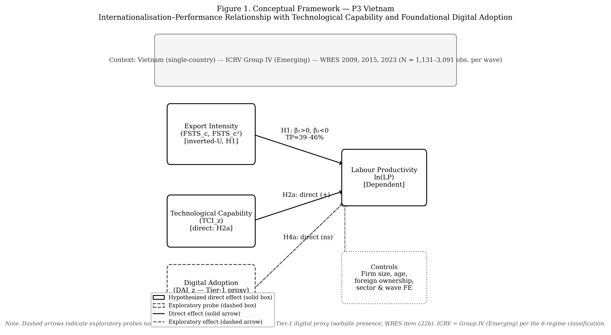

# Revisiting the Internationalisation–Performance Relationship in an Emerging Market: The Roles of Technological Capability and Foundational Digital Adoption

*[Blinded manuscript for double-anonymous review. Author identities, affiliations, and acknowledgements are supplied in the separate Title Page. Tables are supplied in a separate file (Tables I–III); robustness analyses are supplied as online Supplementary Material.]*

## Abstract
**Purpose:** This study revisits the internationalisation–performance relationship in Vietnam across three survey waves, testing whether technological capability moderates export-intensity effects and how a Tier-1 digital indicator evolves across institutional generations.

**Design/methodology/approach:** Three waves of World Bank Enterprise Survey (Vietnam 2009, 2015, 2023; N = 2,958) underpin wave-specific and pooled OLS models with HC1 standard errors, quadratic FSTS terms, and capability interactions. TCI (quality certification, foreign-licensed technology) is the primary construct; a Tier-1 website indicator serves as digital-presence control.

**Findings:** An inverted-U between export intensity and labour productivity holds across all three waves, with turning points clustered between 39% and 46%, a durable band over 14 years. The nonlinearity reflects a participation-margin effect: on exporters only, the quadratic term loses significance. TCI positively moderates productivity and the I–P curvature across waves. The website indicator follows a proxy-obsolescence trajectory: positive in 2009, null in 2015, negatively interactive in 2023.

**Originality/value:** The inverted-U in this zero-inflated setting reflects a participation-barrier effect rather than intensity saturation; pooled Tier-1 coefficients mask progressive proxy obsolescence. The institutionally embedded turning-point cluster (39–46% FSTS) shifts the debate from 'does internationalisation help?' to 'under what institutional conditions does the threshold shift?'

Keywords: internationalisation–performance; emerging markets; technological capability; threshold durability; Vietnam; firm productivity.

JEL classification: F23, O33, D22, L25, O53.

Paper type: Research paper.

## 1. Introduction
Vietnam offers an analytically valuable setting for revisiting the internationalisation–performance (I–P) relationship because firms expand abroad under conditions of institutional transition, uneven capability accumulation, and rapidly changing digital infrastructure. In such settings, internationalisation should not be assumed to generate a simple linear performance premium: firms may gain access to larger markets, benefit from learning, and diversify revenue, but may also face rising coordination costs, information-processing burdens, and organisational strain as foreign involvement deepens (Wright *et al.*, 2005; Cuervo-Cazurra and Genc, 2008; Wu *et al.*, 2016). Meta-analytic evidence supports the view that nonlinearity is a central feature of this relationship rather than an empirical anomaly (Vernon, 1979; Lu and Beamish, 2004; Hennart, 2007; Coviello *et al.*, 2017; Marano *et al.*, 2016).

Digitalisation adds a further layer. Digital tools can reduce communication frictions and support coordination across borders, but their realised value depends on whether firms possess the organisational depth, absorptive capacity, and complementary routines needed to translate adoption into productivity gains (Cohen and Levinthal, 1990; Vial, 2019; Verhoef *et al.*, 2021; Petricevic and Teece, 2019). This raises the study's central question: does digital capability in Vietnam function as a stable performance-enhancing asset, or as a stage-contingent resource whose value changes over the lifecycle of internationalisation?

Three institutional turning points shape the observation window. Vietnam acceded to the World Trade Organization in early 2007, opening the period preceding the 2009 wave. The 2015 wave captures a phase in which expanding manufacturing exports coexisted with under-developed digital trade infrastructure and an exporter cohort still concentrated in labour-intensive segments. The 2023 wave follows the 2020 National Digital Transformation Programme, the rapid expansion of cross-border e-payment and e-commerce platforms, and the rebalancing of foreign direct investment toward digitally-mediated production. The three waves therefore observe firms under structurally different combinations of internationalisation pressure and digital infrastructure, which makes the lifecycle reading testable rather than conceptual.

A central regularity that emerges is that the inverted-U observed in the full sample is driven by the participation margin (the productivity gap between firms that cross from non-exporting to any positive export intensity) rather than by saturation of coordination costs within the exporter subsample. Once participation is netted out, the within-exporter intensity curvature is statistically indistinguishable from flat. The Vietnamese pattern reads as a step function across the export-entry threshold in a transitional economy, not as a continuous saturation curve of the kind documented in developed-market samples.

Three gaps motivate the study. First, existing work often treats digitalisation as a broadly positive resource without attention to temporal and contextual variation in its payoff (Strange and Zucchella, 2017; Goldfarb and Tucker, 2019); in reality digitalisation may generate uneven returns because firms differ in scale, routines, and complementary capability. Second, the distinction between technological capability (deeper firm-internal stocks of learning, problem-solving, and innovation capacity; Lall, 1992) and foundational digital adoption (a more basic layer of digital readiness and digitally enabled interfaces; Bharadwaj *et al.*, 2013; Verhoef *et al.*, 2021; Hanelt *et al.*, 2021) remains under-developed; collapsing them into a single umbrella variable blurs the mechanisms linking digitalisation to performance. Third, pooled estimates may obscure lifecycle heterogeneity, so a design combining pooled and wave-specific analysis is necessary to determine whether effects are stable or stage-contingent. Recent meta-analytic work reinforces this concern: Pisani *et al.* (2020) find that the inverted-U weakens substantially, and sometimes disappears, under more rigorous identification in cross-national pooled samples, while Wu *et al.* (2022) show that institutional context moderates I–P effect sizes more powerfully than firm-level capability. Within-country longitudinal designs, which hold institutional context constant while varying time, therefore provide a more credible test of whether the inverted-U is an artefact of cross-national pooling; Vietnam's three-wave WBES panel provides exactly this design.

The study makes four contributions. First, it refines the I–P debate by showing that the Vietnamese evidence supports a nonlinear relationship whose salience varies across time, so the I–P curve must be read in conjunction with the broader capability environment. Second, it improves construct validity by separating technological capability from foundational digital adoption, which matters because deeper capability stocks and basic digital enablement may generate performance through different channels and do not exhibit identical patterns across the Vietnamese waves. Third, it introduces a cross-wave, stage-dependency interpretation of digital internationalisation: because the WBES data are repeated cross-sections, within-firm trajectories cannot be observed, but the cross-wave evidence suggests digital capability is neither a universally stable premium nor a uniformly ineffective resource. Fourth, it reframes the inverted-U itself: the robustly identified turning point (39–46% FSTS) emerges as a step function across the export-participation barrier rather than a continuous coordination-cost saturation curve, locating the productivity-relevant friction at the participation margin, where institutional, capability, and sunk-cost barriers bind hardest, rather than within the intensity tail.

## 2. Theory and hypotheses
### 2.1 Internationalisation and firm performance
The I–P relationship is unlikely to be linear in a transitional economy such as Vietnam. Foreign expansion can improve performance through greater market reach, diversification, and learning, but deeper involvement generates coordination costs and organisational burdens that, as expansion intensifies, may grow faster than the benefits, producing diminishing or negative returns. This underpins the classic nonlinear view of the I–P relationship (Contractor, 2007; Hennart, 2011; Marano *et al.*, 2016), and process accounts including the updated Uppsala framework emphasise that gains and adjustment costs unfold incrementally as firms accumulate market knowledge and commitment (Vahlne and Johanson, 2017; Knight and Liesch, 2016).

Two opposing forces underpin the curvature. On the upside, increasing direct-export intensity creates scale economies, knowledge spillovers, and learning-by-exporting effects that lift productivity (Wagner, 2007). On the downside, coordinating production for institutionally distant markets imposes information-processing costs whose marginal coordination cost rises faster than the marginal scale benefit beyond a threshold. The mechanism is institutional transaction costs (Williamson, 1985; Hennart, 2007): in a transitional economy, enforcement gaps, logistics deficits, and information asymmetries cause the post-threshold decline to bind at lower export intensity than in settings where digital infrastructure and contract-enforcement quality have already absorbed much of this friction.

A second consideration arises from the structure of direct-export intensity in WBES Vietnam: the FSTS variable is bounded at zero and heavily zero-inflated (the non-exporter share is 71.6% in 2009, 79.3% in 2015 and 81.2% in 2023; pooled 77.4%). The I–P relationship therefore comprises two analytically distinct margins. The participation margin is the step from FSTS = 0 to FSTS > 0, where firms cross the entry threshold and absorb fixed entry costs; the intensity margin is the variation of FSTS within the exporter subsample. In transitional economies with thin export infrastructure, the participation margin is plausibly the dominant productivity-enhancing margin, while the intensity margin may show diminishing or null returns once participation has been crossed (Bernard *et al.*, 2007; Wagner, 2007).

**H1.** In Vietnam's zero-inflated export setting, the internationalisation–performance relationship is non-monotonic in the full sample and is best understood through a participation-and-intensity structure, because the coordination-cost and learning mechanisms operate differently at the participation margin versus within the exporter subsample (Hennart, 2007; Wagner, 2007). *(H1a, participation margin)* Crossing from non-exporting (FSTS = 0) to exporting (FSTS > 0) is positively associated with labour productivity, capturing the learning-and-scale jump at entry. *(H1b, intensity margin)* Within the exporter subsample, additional direct-export intensity is expected to exhibit weaker, diminishing, or non-significant marginal returns. The exporter-only specification provides the most direct test of H1b: if the curvature reflects within-exporter intensity variation, the quadratic term should remain significant in that sub-sample.

### 2.2 Foreign-technology and standards capability and firm performance
Following the Lall (1992) tradition for emerging-market firms, this paper uses a measurement-tight reading of technological capability: a foreign-technology and standards capability that captures a firm's exposure to externally validated technological inputs: internationally recognised quality certification and foreign-licensed technology. This is one observable facet of the broader Cohen and Levinthal (1990) absorptive-capacity construct and the dynamic-capability construct of Teece (2007), but the measure does not claim to identify the full absorptive-capacity stock; it captures the externally facing component (Eisenhardt and Martin, 2000; Karna *et al.*, 2016). A firm with stronger foreign-technology / standards capability is more likely to transform international exposure into productivity gains, adjusting products and processes to meet foreign requirements and integrating licensed technology into production, and even when it does not alter the curvature of the I–P relationship, should raise the productivity floor among exposed firms. The primary TCI_z is built from two items, internationally recognised quality certification (b8) and foreign-licensed technology (e6), which measure exposure to foreign-technology and standards channels rather than internal R&D effort.

**H2.** In Vietnam's transitional export environment, stronger foreign-technology and standards capability (TCI_z) is associated with higher labour productivity, because exposure to internationally recognised quality certification and foreign-licensed technology raises a firm's capacity to meet foreign-market requirements and integrate external technological inputs into production routines (Lall, 1992; Cohen and Levinthal, 1990), before the premium from this channel is bounded by the firm's absorptive depth relative to the full innovation-and-R&D stock (Eisenhardt and Martin, 2000).

### 2.3 Website-based digital presence and firm performance
The primary DAI_z is a website-based digital presence measure: a binary indicator of whether the firm has its own website. This is a foundational and cross-wave-comparable marker of digital adoption; it does not measure transaction-level digital integration, electronic payment, or digital transformation in the Bharadwaj *et al.* (2013) / Verhoef *et al.* (2021) / Vial (2019) sense. We use it because it is the only digital indicator the WBES instrument carries comparably across the 2009 / 2015 / 2023 waves; transaction-level items such as electronic-payment shares appear only in the 2023 questionnaire (Brouthers *et al.*, 2016; Goldfarb and Tucker, 2019). For firms participating in foreign markets, even foundational website adoption may lower the cost at which foreign customers locate the firm, support asynchronous communication, and signal legitimacy; but the scope of these gains is bounded, and the realised payoff depends on whether the firm has the scale and routines to translate online visibility into export business. Website-based digital presence should therefore show a positive average association with performance, but not necessarily one uniform across waves: in 2009 a website was a distinguishing market interface; by 2023 it is closer to a routine marker of basic digital presence.

Following Verhoef *et al.* (2021), digital capability spans a four-tier hierarchy from Tier 1 (digital presence: websites, e-mail) through Tier 2–3 (e-commerce, electronic payment, supply-chain digitisation) to Tier 4 (dynamic digital capability); the primary DAI_z anchors at Tier 1 only. Because DAI_z reduces to a single binary item (own-website presence c22b) and website ownership has diffused to near half of the firm population (49.8% in 2023 vs 42.5% in 2009), DAI_z is **not formalised as a primary hypothesis-bearing construct**; it is retained in all specifications as a baseline digital-presence control, reported descriptively. Accordingly no H3 is formulated here; the exploratory probe that follows (§2.4) is designated H4 to preserve alignment with the broader dissertation framework, in which H3 conventionally corresponds to institutional moderation in multi-country papers.

### 2.4 Stage-contingent digital value
Because the WBES Vietnam instrument cannot identify Tier 2–4 digital capability across waves, the paper does not advance a primary digital-transformation claim; the following frames a secondary, exploratory probe of whether the Tier-1 website indicator interacts with export intensity differently across waves. In early phases of internationalisation, digital tools may create relatively direct gains by helping firms communicate faster and manage transactions; in later phases, the benefits may become more conditional, depending on whether digital tools are embedded in broader organisational routines and aligned with export scale (Banalieva and Dhanaraj, 2019; Petricevic and Teece, 2019). Any negative DAI × FSTS interaction in the later waves can be read through two complementary, jointly operating mechanisms. The first is *stage-dependent coordination complexity*: at high export intensity, the binding friction is the absence of deeper Tier 2–3 process-integration that a single Tier-1 website cannot support. The second is *construct obsolescence under population diffusion*: as website ownership broadens across the firm population (though still only about half of firms by 2023), c22b may function increasingly as an organisational hygiene marker rather than a differentiating signal; with adoption only near half, this reading remains tentative. The 2009 / 2015 / 2023 design cannot fully separate the two channels, and both readings are treated as legitimate within the limits of the data.

**H4 (exploratory probe, not a primary hypothesis).** The productivity relevance of baseline website-presence (DAI_z, Tier 1 only) may vary across phases of internationalisation and institutional transition, so any moderation of the export-intensity curve by baseline digital presence is expected to be wave-specific rather than uniformly present, with the strongest within-sample detectability anticipated in 2023. A null or sign-shifting result should be read as construct-tier obsolescence rather than as evidence against dynamic digital capability moderation.

*Figure 1.* Conceptual model: TCI, DAI, and export intensity as determinants of firm performance (Vietnam, three waves). Solid arrows denote hypothesised direct and curvilinear effects; dashed arrows denote moderating effects. Internationalisation intensity (FSTS_c, FSTS_c²) is the independent variable and ln(labour productivity) the dependent variable. H1 (inverted-U: β₁ > 0, β₂ < 0) is grounded in the Uppsala model (Johanson and Vahlne, 1977, 2009) and coordination-cost theory (Hitt *et al.*, 1997). H2 specifies technological capability (TCI_z; Resource-Based View, Barney, 1991) as a level-shifting direct effect and secondary moderator. H4 treats website-based adoption (DAI_z, Tier-1 only) as an exploratory probe of the Digital Capability Lens (Banalieva and Dhanaraj, 2019). Controls (ln firm size, firm age, foreign ownership, sector and wave fixed effects) enter additively. Data: WBES 2009, 2015, 2023; N = 2,958 (pooled), n_wave = 989/956/1,013.

## 3. Data, variables, and empirical strategy
### 3.1 Data structure
The analysis uses harmonised firm-level evidence for Vietnam across three WBES waves: 2009, 2015 and 2023 (World Bank, 2010, 2016, 2024). Wave-specific estimation shows whether relationships are stable or time-specific; pooled estimation identifies average effects. The effective samples are 989 (2009), 956 (2015) and 1,013 (2023); the pooled model contains 2,958 observations.

### 3.2 Variables
Firm performance is log labour productivity, lnLP = ln(d2 / l1), where d2 is total annual sales (PPP-converted using World Bank ICP deflators) and l1 is permanent full-time employees. Internationalisation is direct-export intensity, FSTS = d3c / 100, mean-centred within wave (FSTS_c) and squared (FSTS_c²) so linear and quadratic terms can be entered jointly to test for nonlinearity. The primary Technological Capability Index (TCI_z) is the within-wave standardised mean of b8 (internationally recognised quality certification) and e6 (foreign-licensed technology), each recoded to 1/0; it is interpreted narrowly as a foreign-technology and standards measure (Lall, 1992; Cohen and Levinthal, 1990). The primary Digital Adoption Index (DAI_z) is the within-wave standardised website-presence indicator c22b; under this specification no item is shared between TCI and DAI. Controls are firm size (lnEmp = ln l1), firm age (survey year minus b5), foreign ownership (ForeignOwned = 1 if foreign equity b2b > 0), one-digit ISIC sector fixed effects (a4b for 2009/2015; a4a for 2023), and wave fixed effects in pooled specifications. WBES non-response codes (−9) are treated as missing before composites are built, with listwise deletion on the focal set. Two enriched composites are used only in the robustness analyses where item availability allows: TCI_full adds product-innovation (h1) and R&D (h8) items in 2015 and 2023; DAI_rich, constructed only for 2023, extends c22b with electronic-payment shares (k33, k38). Variable definitions, source items, and construction rules are reported in Table I.

[Insert Table I about here]

### 3.3 Model sequence
The strategy follows a nested OLS sequence with HC1 robust standard errors. Let lnLP_it denote log labour productivity for firm *i* in wave *t*, FSTS_c_it within-wave centred export intensity, **X**_it the controls (lnEmp, FirmAge, ForeignOwned), δ_s sector fixed effects, and λ_t wave fixed effects (pooled only). M0 is baseline controls; M1 adds FSTS_c (linear); M2 adds FSTS_c² (tests H1, requiring β₁ > 0, β₂ < 0, with turning point TP* = −β₁/(2β₂) confirmed by the Lind–Mehlum (2010) u-test); M3 adds TCI_z and its FSTS interactions (tests H2); M4 adds DAI_z and its FSTS interactions (exploratory H4); M5 and M6 enter TCI_z and DAI_z as direct effects only; M7 is dual-direct without interactions; M8 is the full model (dual-direct plus DAI moderation). The M0–M8 sequence is estimated wave-by-wave and on the pooled file, yielding four sets of estimates (2009, 2015, 2023, pooled). Throughout, results are described as associations rather than effects, consistent with the inferential limits of repeated-cross-section data (Antonakis *et al.*, 2010; Wooldridge, 2010).

### 3.4 Identification and endogeneity
A central concern is that exporters self-select into foreign markets on characteristics that also predict productivity (Wagner, 2007; Wooldridge, 2010). Three design features address this. A Heckman two-step correction adds an inverse Mills ratio from a probit selection equation with industry × region × wave fixed effects; an insignificant IMR indicates the OLS estimate is not materially contaminated by positive selection (Certo *et al.*, 2016; Heckman, 1979). Instrumental-variable estimation uses leave-one-out sector × region × wave peer-adoption rates as instruments for DAI and TCI, with first-stage F-statistics of 22–35, well above the Staiger–Stock (1997) threshold of 10. Oster (2019) coefficient-stability bounds show that no focal coefficient changes sign or collapses under plausible unobserved selection. The repeated-cross-section structure precludes within-firm fixed effects, so identification relies on these three complementary approaches; all inferences are described as associations (Shaver, 2020).

### 3.5 Replication and reproducibility
The full pipeline is implemented as a ten-step Stata blueprint distributed with the manuscript, covering wave cleaning and harmonisation, the M0–M8 sequence, the Lind–Mehlum turning-point check, Heckman selection probes, Paternoster *et al.* (1998) cross-wave z-tests, and the robustness panels. Rerunning the pipeline from a fresh clone reproduces every coefficient reported below (Aguinis *et al.*, 2021; Shaver, 2020).

## 4. Results
Table II reports analytic-sample summary statistics by wave. Three patterns stand out before the inferential analysis. The share of firms reporting any positive direct-export intensity declines from 28.4% in 2009 to 20.7% in 2015 to 18.8% in 2023, reflecting the rebalancing of the exporter cohort away from labour-intensive manufacturing toward services and FDI-linked supply-chain firms. The within-wave mean of the website indicator rises from 0.425 (2009) to 0.483 (2015) and 0.498 (2023), indicating broad diffusion of basic digital presence. Mean log labour productivity rises monotonically (19.41 / 20.04 / 20.55), consistent with broader Vietnamese productivity convergence.

[Insert Table II about here]

### 4.1 Wave-specific findings
The 2009 wave displays a clearly nonlinear I–P relationship with strong direct capability and digital-adoption effects. The inverted-U specification (M2) yields a positive linear term (β = 1.045, p = .015) and a negative quadratic term (β = -1.774, p = .009); Lind–Mehlum rejects monotonicity at p = .006. In the dual-direct M7, both TCI_z (β = 0.215, p < .001) and DAI_z (β = 0.175, p < .001) are positive. TCI moderation is statistically distinguishable from zero (M3 joint p = .040; FSTS_c × TCI_z = -0.579, p = .087), but DAI moderation is not (M4 joint p = .825; M8 joint p = .700). Both capability dimensions in 2009 operate primarily as direct level-shifters.

The 2015 wave shows the curvature cleanly but the weakest digital channel. M2 produces FSTS_c β = 1.159 (p = .029) and FSTS_c² β = -2.115 (p = .004), Lind–Mehlum p = .009. TCI_z retains a positive direct association (β = 0.128, p = .010), roughly 60% of the 2009 magnitude, while DAI_z loses direct salience entirely (β = -0.044, p = .377). TCI moderation is null (M3 joint p = .713) and DAI moderation at best marginal (M4 joint p = .125; M8 joint p = .093). The I–P curvature is unusually sharp while the digital channel compresses entirely, consistent with the productivity J-curve account in which firms invest in basic digital tools before complementary organisational adjustments produce gains (Brynjolfsson *et al.*, 2021).

The 2023 wave is where the digital-moderation signal emerges most sharply. M2 again indicates a clear inverted-U (FSTS_c β = 0.962, p = .039; FSTS_c² β = -1.686, p = .008; Lind–Mehlum p = .013). In M7 both capability dimensions are positive (TCI_z β = 0.123, p = .006; DAI_z β = 0.095, p = .038). When the DAI interactions are added in M8, the linear interaction is negative and individually significant (FSTS_c × DAI_z = -0.912, p = .043), the quadratic interaction positive but not significant (FSTS_c² × DAI_z = 1.043, p = .099), and the joint test above .05 (M4 joint p = .102; M8 joint p = .062). By 2023, basic digital adoption becomes more conditional on export intensity: beyond moderate FSTS, the productivity contribution of basic digital presence attenuates. A complementary interpretation, consistent with the 2SLS null for instrumented DAI (β = 0.018, p = .942), is proxy obsolescence: website presence has become a minimum-threshold credential rather than a capability differentiator as Tier-1 adoption diffuses to roughly half of firms.

Taken together, the wave-specific results trace two associations consistent with stage contingency. Foreign-technology / standards capability is positive across all three waves with a modestly attenuating magnitude (TCI_z = 0.215 → 0.128 → 0.123) but moderation that survives in the 2009, 2023 and pooled panels. Website-based digital presence follows a non-monotonic trajectory (strong in 2009, null in 2015, re-emerging in 2023), and its moderation channel materialises only in 2023. A formal pooled wave × focal interaction test suggests that only the DAI direct shifts are cross-wave-distinguishable, so we read the pattern as wave-specific associations consistent with stage contingency rather than a fully cross-wave-identified structural shift.

### 4.2 Pooled findings
The pooled estimates are consistent with a nonlinear I–P relationship on average. In M2, the linear FSTS_c term is positive (β = 0.984, p < .001) and the quadratic negative (β = -1.909, p < .001); Lind–Mehlum rejects monotonicity at p < .001 with a turning point at 39.7% of direct-export intensity. Following Haans *et al.* (2016), all four conditions for a genuine inverted-U are met (β₁ = +0.984 and β₂ = −1.909, both p < .001; TP* = 39.7% within the observed range; marginal return positive at the lower data bound and negative at the upper). The curvature persists in M8 (FSTS_c β = 0.845, p = .006; FSTS_c² β = -1.650, p < .001), consistent with H1 and with the meta-analytic evidence on nonlinear internationalisation returns in emerging-market firms (Marano *et al.*, 2016).

Both capability dimensions are positively associated with performance on average. In the pooled M7, TCI_z is positive (β = 0.179, p < .001) and DAI_z positive (β = 0.078, p = .004). In M8, TCI_z is essentially unchanged (β = 0.184, p < .001) while the DAI_z direct coefficient becomes indistinguishable from zero (β = 0.032, p = .537) once interactions enter, consistent with DAI_z combining a positive level effect with a negative interaction with FSTS_c at higher intensities, precisely the 2023 pattern. The pooled DAI interactions carry only a marginal joint signal (FSTS_c × DAI_z = -0.448, p = .116; FSTS_c² × DAI_z = 0.460, p = .276; M8 joint p = .083), driven primarily by the 2023 wave. Technological-capability moderation is more uniformly distributed: the M3 joint test is distinguishable from zero in three of four panels (2009 p = .040, 2023 p = .027, pooled p = .003) and null only in 2015 (p = .713); pooled, the linear interaction is negative (FSTS_c × TCI_z = -0.587, p = .003) and the quadratic positive (FSTS_c² × TCI_z = 0.640, p = .031), indicating that the inverted-U flattens for high-capability firms rather than shifting in level (Cohen and Levinthal, 1990; Lall, 1992).

*Figure 2.* Predicted ln(labour productivity) as a function of FSTS (M2). Turning points: ≈ 46% (2009), ≈ 39% (2015), ≈ 42% (2023), ≈ 40% (pooled); Lind–Mehlum p = .006 / .009 / .013 / <.001. Wave-specific panels (Figures 2a–2d) are provided in the Supplementary Material.

### 4.3 Interpretation of the hypothesis tests
H1 receives qualified support. Lind–Mehlum rejects monotonicity in all three waves (2009 p = .006, 2015 p = .009, 2023 p = .013) and pooled (p < .001), and the implied turning points cluster tightly between 39.3% (2015) and 46.2% (2009), pooled 39.7%. At the same time, exporter-only models show the curvature weakens substantially once the participation margin is netted out; the most defensible interpretation is therefore a combined participation-and-intensity structure with the productivity-relevant contrast concentrated at the transition from non-exporting to exporting. The institutional-context reading is reinforced by within-Vietnam cross-wave stability: the pooled threshold (39.7%; range 39.3–46.2%) is structurally durable across three waves spanning 14 years of major institutional change. A turning point clustering within a narrow ~7-percentage-point band despite these shifts is consistent with institutional transaction costs binding through deep firm-level constraints (coordination capacity, contract enforcement, and trade-finance access) that change more slowly than the wider environment (Wu *et al.*, 2022; Marano *et al.*, 2016).

H2 is supported: the positive TCI_z direct coefficient (pooled β = 0.179, p < .001) is significant in all three waves (2009 p < .001; 2015 p = .010; 2023 p = .006), and distinguishable TCI moderation appears in three of four panels. The baseline DAI_z control reports a positive pooled level association (β = 0.078, p = .004) but with substantial wave-to-wave variability (strong in 2009, null in 2015, re-emerging in 2023); because DAI_z indexes only Tier-1 presence and is not a primary hypothesis, this variation is reported descriptively.

H4 receives limited exploratory support. The DAI joint moderation test is null in 2009 (M4 p = .825) and 2015 (M4 p = .125) and reaches the edge of significance in 2023 (FSTS_c × DAI_z = -0.912, p = .043; M4 joint p = .102, M8 p = .062); the pooled M8 joint test (p = .083) is driven by the 2023 wave. Following Haans *et al.* (2016), the 2023 DAI evidence fits Type I moderation: the significant linear interaction indicates digital adoption attenuates the positive slope at low export intensity, pulling the turning point inward, while the insignificant FSTS² × DAI interaction confirms the inverted-U shape is preserved. Type II moderation, in which digital capability reverses the curvature, is not supported.

[Insert Table III about here]

### 4.4 Main empirical pattern: participation × intensity
The full-sample inverted-U is informative about the joint participation-and-intensity pattern, but its curvature is identified primarily through the participation margin: only ~1.0% of pooled firms sit within ±5 percentage-points of the wave-specific turning points, with the bulk of mass at FSTS = 0. When M2 / M7 / M8 are re-fitted on the exporter-only sub-sample (FSTS > 0; pooled N = 669), the linear FSTS_c term is negative (β = -0.861, p < .001) but the quadratic term is not significant (FSTS_c² β = -0.200, p = .660; M8 joint p = .462). H1a (participation margin) is therefore the dominant productivity-relevant margin; the within-exporter intensity curvature claimed by H1b weakens once participation is netted out. We retain the full-sample inverted-U as the headline regularity but interpret it explicitly through the dual-mechanism lens: most of the productivity differential lies between non-exporters and exporters, with limited additional curvature within the exporter subsample (focal coefficients by wave and pooled are summarised in Table III).

### 4.5 Robustness
Four families of robustness checks examine whether central inferences are sensitive to measurement choices, sector composition, export-participation structure, and endogeneity; all are estimated on the same OLS HC1 design and reported in full in the Supplementary Material. In summary: the inverted-U is preserved in both manufacturing and non-manufacturing subsets but is sharper in manufacturing, where the capability and digital-adoption channels are concentrated (Panel G); the exporter-only sub-sample confirms the participation-margin reading (Panel H); innovation-augmented (TCI_full) and transaction-enabling (DAI_rich, 2023) composites reproduce the direction of the headline results (Panels A–B); the Heckman inverse Mills ratio is insignificant (Panel E); and the IV/PSM evidence shows TCI is identification-robust (2SLS β = 1.64, p < .001; matching ATT 0.61–0.64) while DAI attenuates to a null under 2SLS (β = 0.02, p = .94) though it survives matching (ATT 0.30–0.32), consistent with website presence behaving as a context-sensitive, selection-sensitive marker rather than an identification-robust capability.

## 5. Discussion
Located against the meta-analytic baseline, the results qualify the positive average I–P relationship that Wu *et al.* (2022) establish for emerging-market multinationals by aggregating across institutional contexts in which the functional form may vary. The inverted-U is robust within Vietnam but is driven predominantly by a participation-margin step rather than within-exporter saturation, a structure that cross-country pooling would tend to inflate into an apparent continuous curvature. The temporal durability of the threshold (39–46% band across 14 years) further indicates that institutional context, held constant in this single-country design, may stabilise the curve shape in a way cross-country designs cannot isolate, consistent with the cross-national scepticism of Pisani *et al.* (2020).

Baseline website presence should not be interpreted as a universal, stable productivity premium, nor as evidence on dynamic digital capability. Although both TCI_z and DAI_z are positive on average, their empirical roles differ across waves and identification strategies (Vahlne, 2020; Stallkamp and Schotter, 2021): website ownership is a context-sensitive marker whose productivity association attenuates under instrumental-variable identification. The negative FSTS_c × DAI_z sign in 2023 is consistent with the Tier-1 boundary of the construct: a website alone cannot manage the transaction density of high-export-intensity operations without electronic-payment and process-integration support.

These results strengthen the methodological case for separating foreign-technology / standards capability from a baseline website-presence indicator. The IV and matching evidence makes the distinction sharper: TCI is robust under both matching and instrumentation (2SLS β = 1.64, p < .001, first-stage F = 22.1; matching ATT 0.61–0.64), whereas the OLS-detected DAI association is reproduced under PSM (ATT 0.30–0.32) but attenuates to a null under 2SLS (β = 0.02, p = .94). The 2023-only DAI_rich extension (c22b plus electronic-payment shares) produces a moderation pattern in the same direction (FSTS_c × DAI_rich_cont_z = -0.93, M8 joint p = .099), guarding against a pure proxy-obsolescence reading. The two constructs therefore do not behave identically, which supports distinguishing basic digital enablement (easily contaminated by selection on observables) from broader technological depth (more identification-robust) rather than collapsing them into a single label.

The 2015 null should be grounded in the micro-structure of the sample. The exporter share fell from 28.4% in 2009 to 20.7% in 2015, a selective exit that left a residual cohort disproportionately concentrated in labour-intensive, OEM-dependent assembly operations, for which a basic website functions as a digital pamphlet rather than a productivity-enabling coordination tool. Reinforced by proxy obsolescence (by 2015 website ownership had diffused sufficiently that c22b could no longer separate digitally capable exporters from routine web presence), this helps explain why the DAI coefficient compresses to a null even as the inverted-U curvature remains present. Public secondary indicators make the institutional reading plausible without entering the regression: Vietnam's internet-use share rose from roughly 26% (2009) to 45% (2015) to over 78% (2023) (World Bank, 2026; International Telecommunication Union, 2026), and cross-border e-payment and B2B marketplaces reached scale only after 2018–2019, following the 2020 National Digital Transformation Programme. The 2015 wave therefore observes exporters before a transaction-supporting digital ecosystem had matured; the dip shows why pooled averages alone are insufficient, as capability payoffs can compress temporarily before re-emerging.

The managerial implication is not that firms should invest less in digitalisation, but that the composition of capability investment should change with the firm's position relative to two empirically anchored thresholds: the export-participation barrier and the inverted-U turning-point band at 39–46% FSTS. For pre-export and low-intensity firms, the dominant productivity-relevant action is crossing the participation barrier (foreign-market intelligence, quality certification, entry-cost financing) rather than optimising Tier-1 website presence, whose contribution is bounded by the diffusion-driven attenuation of c22b. Approaching and beyond the turning-point band, the TCI direct association (pooled β = 0.179; instrumented β = 1.639) and its curvature-flattening moderation imply that capital should tilt toward TCI-deepening investments (foreign-licensed technology, certification systems, process integration with foreign principals), while the negative 2023 FSTS × DAI_z interaction implies that marginal Tier-1 website investment delivers a negative incremental association, the binding friction being the absence of Tier 2–3 process, payment, and supply-chain digitisation. Managers should therefore not conflate basic digital adoption with deeper technological capability, and should stage allocation against the empirically identified thresholds rather than generic digital-transformation prescriptions.

The policy reading is tentative, given the associational evidence and single-economy scope. First, export-promotion instruments designed around a uniformly positive internationalisation premium will overshoot in transitional periods such as 2015; targeting support at firms in the entry-cost zone is more consistent with the documented curvature. Second, digital-economy programmes that treat foundational adoption as a sufficient lever are likely attenuated by implementation lag and by the conditional digital channel at higher export intensity; bundling Tier 1–2 adoption with deeper capability upgrading is more consistent with the 2023 pattern. Third, policy evaluation windows matter: a programme assessed only against a 2015-style transitional baseline would understate its long-run contribution, so evaluation in transitional settings must monitor the capability environment, not adoption rates alone.

## 6. Limitations and future research
The findings should be read against five limitations. First and most fundamentally, the WBES microdata are repeated cross-sections rather than a true firm panel; this design cannot identify within-firm trajectories or net out time-invariant unobserved heterogeneity, so causal attribution remains unavailable and the associational language used throughout should not be relaxed. A matched-firm longitudinal panel combining WBES waves with administrative registry or customs records would allow difference-in-differences identification of the participation-margin productivity jump (Wooldridge, 2010). Second, DAI_z captures only a foundational Tier-1 layer, so the analysis cannot conclude whether deeper digital integration (Tier 2–4) exhibits a more stable or differently shaped channel; the remedy is a panel measured with Tier 2–4 indicators applying the Verhoef *et al.* (2021) hierarchy. Third, the analysis is a single transitional economy: Vietnam is informative precisely because its environment shifted across the window, but the pattern may not generalise to economies on a different trajectory. Fourth, the cross-wave evidence is uneven in statistical strength (the Paternoster z-tests distinguish the DAI fall and recovery, but most other cross-wave differences are marginal), so the comparison rests on directional consistency and on the concentration of the digital signal in 2023; sharper identification is achievable by exploiting the exogenous timing of the 2020 NDTP in a difference-in-differences design (Prime Minister of Vietnam, 2020). Fifth, the sector fixed effects are intentionally broad to keep the cross-wave specification comparable; finer industry-level mechanisms, and cross-setting comparisons with other emerging or digitally advanced economies, require designs that systematically vary institutional transaction costs and digital infrastructure quality.

## 7. Conclusion
This study revisits the internationalisation–performance relationship in Vietnam by treating foreign-technology / standards capability as the primary capability construct and retaining a single-item website-presence indicator only as a baseline digital-presence control, comparing pooled with wave-specific evidence across the 2009 / 2015 / 2023 WBES waves. The relationship is non-monotonic in the full sample, driven primarily by a participation-and-intensity structure rather than by strong within-exporter curvature alone, and the inverted-U turning point is structurally durable: the threshold range clusters within a narrow ~7-percentage-point band (39.3–46.2%) across 14 years of major institutional change. This durability is consistent with deep firm-level constraints (coordination capacity, contract enforcement, and trade-finance access) that change more slowly than the wider operating environment. The results also suggest that technological capability and the baseline website-presence indicator should not be treated as interchangeable: technological capability is comparatively stable and identification-robust, whereas the baseline DAI_z control is more wave-sensitive and attenuates to a null under instrumental-variable estimation, consistent with partial Tier-1 proxy obsolescence as website ownership broadens toward roughly half the firm population. Within the constraint of a single binary website indicator, the paper makes no claim about dynamic digital capability moderation; any such test awaits richer Tier 2–4 indicators not currently available cross-wave in the WBES Vietnam instrument.

## Conflict of interest
The authors declare no conflict of interest.

## Funding
This research received no specific grant from any funding agency in the public, commercial, or not-for-profit sectors.

## Data availability statement
The data that support the findings are from the World Bank Enterprise Surveys and are available from the World Bank Enterprise Surveys portal, subject to registration and compliance with the World Bank Enterprise Surveys Data Access Protocol. Because the protocol restricts redistribution of the original data files to third parties, the authors do not redistribute the raw survey files. Replication materials, including variable-construction details, model specifications, and computational outputs, are available from the authors upon reasonable request and may be shared to the extent permitted by the data-access terms.

## Ethics statement
This study uses secondary, de-identified, firm-level data from the World Bank Enterprise Surveys. It does not involve human participants, identifiable personal data, animals, or biological samples, and therefore did not require institutional ethical approval. The research was conducted in accordance with the data-access terms of the World Bank Enterprise Surveys.

## Use of generative AI in the writing process
In preparing this manuscript, the author(s) used Grammarly, a writing-assistance tool, to help correct spelling, grammar, and punctuation in the author(s)' own original text. No generative artificial-intelligence tool was used to generate, draft, or create any substantive content, analysis, or interpretation. All conceptual framing, hypothesis development, empirical analysis, results interpretation, and final wording were produced by the human author(s), who take full responsibility for the content of the publication.

## Acknowledgements
[Acknowledgements removed for blind review; see separately submitted Title Page.]

## Supplementary materials
Robustness analyses (Panels A–K: enriched composites, sector split, exporter-only sub-sample, Heckman selection, IV/PSM, Paternoster cross-wave z-tests, density checks), the wave-specific predicted-productivity figures (Figures 2a–2d), and extended construct-tier and mechanism notes are provided as online Supplementary Material (`Supplementary_material.docx`), hosted on Emerald Insight. Replication package and instructions are available from the authors.

## References

Aguinis, H., Hill, N.S. and Bailey, J.R. (2021), "Best practices in data collection and preparation: recommendations for reviewers, editors, and authors", *Organizational Research Methods*, Vol. 24 No. 4, pp.678-693, https://doi.org/10.1177/1094428119836485

Antonakis, J., Bendahan, S., Jacquart, P. and Lalive, R. (2010), "On making causal claims: a review and recommendations", *The Leadership Quarterly*, Vol. 21 No. 6, pp.1086-1120, https://doi.org/10.1016/j.leaqua.2010.10.010

Banalieva, E.R. and Dhanaraj, C. (2019), "Internalization theory for the digital economy", *Journal of International Business Studies*, Vol. 50 No. 8, pp.1372-1387, https://doi.org/10.1057/s41267-019-00243-7

Barney, J. (1991), "Firm resources and sustained competitive advantage", *Journal of Management*, Vol. 17 No. 1, pp.99-120, https://doi.org/10.1177/014920639101700108

Bernard, A.B., Jensen, J.B., Redding, S.J. and Schott, P.K. (2007), "Firms in international trade", *Journal of Economic Perspectives*, Vol. 21 No. 3, pp.105-130, https://doi.org/10.1257/jep.21.3.105

Bharadwaj, A., El Sawy, O.A., Pavlou, P.A. and Venkatraman, N. (2013), "Digital business strategy: toward a next generation of insights", *MIS Quarterly*, Vol. 37 No. 2, pp.471-482, https://doi.org/10.25300/misq/2013/37:2.3

Brouthers, K.D., Geisser, K.D. and Rothlauf, F. (2016), "Explaining the internationalization of iBusiness firms", *Journal of International Business Studies*, Vol. 47 No. 5, pp.513-534, https://doi.org/10.1057/jibs.2015.20

Brynjolfsson, E., Rock, D. and Syverson, C. (2021), "The productivity J-curve: how intangibles complement general purpose technologies", *American Economic Journal: Macroeconomics*, Vol. 13 No. 1, pp.333-372, https://doi.org/10.1257/mac.20180386

Certo, S.T., Busenbark, J.R., Woo, H.-S. and Semadeni, M. (2016), "Sample selection bias and Heckman models in strategic management research", *Strategic Management Journal*, Vol. 37 No. 13, pp.2639-2657, https://doi.org/10.1002/smj.2475

Cohen, W.M. and Levinthal, D.A. (1990), "Absorptive capacity: a new perspective on learning and innovation", *Administrative Science Quarterly*, Vol. 35 No. 1, pp.128-152, https://doi.org/10.2307/2393553

Contractor, F.J. (2007), "Is international business good for companies? The evolutionary or multi-stage theory of internationalization vs. the transaction cost perspective", *Management International Review*, Vol. 47 No. 3, pp.453-475, https://doi.org/10.1007/s11575-007-0024-2

Coviello, N., Kano, L. and Liesch, P.W. (2017), "Adapting the Uppsala model to a modern world: macro-context and microfoundations", *Journal of International Business Studies*, Vol. 48 No. 9, pp.1151-1164, https://doi.org/10.1057/s41267-017-0120-x

Cuervo-Cazurra, A. and Genc, M. (2008), "Transforming disadvantages into advantages: developing-country MNEs in the least developed countries", *Journal of International Business Studies*, Vol. 39 No. 6, pp.957-979, https://doi.org/10.1057/palgrave.jibs.8400390

Eisenhardt, K.M. and Martin, J.A. (2000), "Dynamic capabilities: what are they?", *Strategic Management Journal*, Vol. 21 No. 10-11, pp.1105-1121, https://doi.org/10.1002/1097-0266(200010/11)21:10/11<1105::AID-SMJ133>3.0.CO;2-E

Goldfarb, A. and Tucker, C. (2019), "Digital economics", *Journal of Economic Literature*, Vol. 57 No. 1, pp.3-43, https://doi.org/10.1257/jel.20171452

Haans, R.F.J., Pieters, C. and He, Z.-L. (2016), "Thinking about U: theorizing and testing U- and inverted U-shaped relationships in strategy research", *Strategic Management Journal*, Vol. 37 No. 7, pp.1177-1195, https://doi.org/10.1002/smj.2399

Hanelt, A., Bohnsack, R., Marz, D. and Antunes Marante, C. (2021), "A systematic review of the literature on digital transformation: insights and implications for strategy and organizational change", *Journal of Management Studies*, Vol. 58 No. 5, pp.1159-1197, https://doi.org/10.1111/joms.12639

Heckman, J.J. (1979), "Sample selection bias as a specification error", *Econometrica*, Vol. 47 No. 1, pp.153-161, https://doi.org/10.2307/1912352

Hennart, J.-F. (2007), "The theoretical rationale for a multinationality-performance relationship", *Management International Review*, Vol. 47 No. 3, pp.423-452, https://doi.org/10.1007/s11575-007-0023-3

Hennart, J.-F. (2011), "A theoretical assessment of the empirical literature on the impact of multinationality on performance", *Global Strategy Journal*, Vol. 1 No. 1-2, pp.135-151, https://doi.org/10.1002/gsj.8

Hitt, M.A., Hoskisson, R.E. and Kim, H. (1997), "International diversification: effects on innovation and firm performance in product-diversified firms", *Academy of Management Journal*, Vol. 40 No. 4, pp.767-798, https://doi.org/10.2307/256948

International Telecommunication Union (2026), *World Telecommunication/ICT Indicators Database* [data set], available at: https://www.itu.int/en/ITU-D/Statistics/Pages/publications/wtid.aspx (accessed 9 May 2026).

Johanson, J. and Vahlne, J.-E. (1977), "The internationalization process of the firm: a model of knowledge development and increasing foreign market commitments", *Journal of International Business Studies*, Vol. 8 No. 1, pp.23-32, https://doi.org/10.1057/palgrave.jibs.8490676

Johanson, J. and Vahlne, J.-E. (2009), "The Uppsala internationalization process model revisited: from liability of foreignness to liability of outsidership", *Journal of International Business Studies*, Vol. 40 No. 9, pp.1411-1431, https://doi.org/10.1057/jibs.2009.24

Karna, A., Richter, A. and Riesenkampff, E. (2016), "Revisiting the role of the environment in the capabilities-financial performance relationship: a meta-analysis", *Strategic Management Journal*, Vol. 37 No. 6, pp.1154-1173, https://doi.org/10.1002/smj.2379

Knight, G.A. and Liesch, P.W. (2016), "Internationalization: from incremental to born global", *Journal of World Business*, Vol. 51 No. 1, pp.93-102, https://doi.org/10.1016/j.jwb.2015.08.011

Lall, S. (1992), "Technological capabilities and industrialization", *World Development*, Vol. 20 No. 2, pp.165-186, https://doi.org/10.1016/0305-750X(92)90097-F

Lind, J.T. and Mehlum, H. (2010), "With or without U? The appropriate test for a U-shaped relationship", *Oxford Bulletin of Economics and Statistics*, Vol. 72 No. 1, pp.109-118, https://doi.org/10.1111/j.1468-0084.2009.00569.x

Lu, J.W. and Beamish, P.W. (2004), "International diversification and firm performance: the S-curve hypothesis", *Academy of Management Journal*, Vol. 47 No. 4, pp.598-609, https://doi.org/10.2307/20159604

Marano, V., Arregle, J.-L., Hitt, M.A., Spadafora, E. and van Essen, M. (2016), "Home country institutions and the internationalization-performance relationship: a meta-analytic review", *Journal of Management*, Vol. 42 No. 5, pp.1075-1110, https://doi.org/10.1177/0149206315624963

Oster, E. (2019), "Unobservable selection and coefficient stability: theory and evidence", *Journal of Business & Economic Statistics*, Vol. 37 No. 2, pp.187-204, https://doi.org/10.1080/07350015.2016.1227711

Paternoster, R., Brame, R., Mazerolle, P. and Piquero, A. (1998), "Using the correct statistical test for the equality of regression coefficients", *Criminology*, Vol. 36 No. 4, pp.859-866, https://doi.org/10.1111/j.1745-9125.1998.tb01268.x

Petricevic, O. and Teece, D.J. (2019), "The structural reshaping of globalization: implications for strategic sectors, profiting from innovation, and the multinational enterprise", *Journal of International Business Studies*, Vol. 50 No. 9, pp.1487-1512, https://doi.org/10.1057/s41267-019-00269-x

Pisani, N., Garcia-Bernardo, J. and Heemskerk, E. (2020), "Does it pay to be a multinational? A large-sample, cross-national replication assessing the multinationality-performance relationship", *Strategic Management Journal*, Vol. 41 No. 1, pp.152-172, https://doi.org/10.1002/smj.3087

Prime Minister of Vietnam (2020), "Decision No. 749/QD-TTg approving the 'National Digital Transformation Programme by 2025, with orientations towards 2030'", available at: https://english.luatvietnam.vn/decision-no-749-qd-ttg-on-approving-the-national-digital-transformation-program-until-2025-with-a-vision-184241-doc1.html (accessed 9 May 2026).

Shaver, J.M. (2020), "Causal identification through a cumulative body of research in the study of strategy and organizations", *Journal of Management*, Vol. 46 No. 7, pp.1244-1256, https://doi.org/10.1177/0149206319846272

Staiger, D. and Stock, J.H. (1997), "Instrumental variables regression with weak instruments", *Econometrica*, Vol. 65 No. 3, pp.557-586, https://doi.org/10.2307/2171753

Stallkamp, M. and Schotter, A.P.J. (2021), "Platforms without borders? The international strategies of digital platform firms", *Global Strategy Journal*, Vol. 11 No. 1, pp.58-80, https://doi.org/10.1002/gsj.1336

Strange, R. and Zucchella, A. (2017), "Industry 4.0, global value chains and international business", *Multinational Business Review*, Vol. 25 No. 3, pp.174-184, https://doi.org/10.1108/MBR-05-2017-0028

Teece, D.J. (2007), "Explicating dynamic capabilities: the nature and microfoundations of (sustainable) enterprise performance", *Strategic Management Journal*, Vol. 28 No. 13, pp.1319-1350, https://doi.org/10.1002/smj.640

Vahlne, J.-E. (2020), "Development of the Uppsala model of internationalization process: from internationalization to evolution", *Global Strategy Journal*, Vol. 10 No. 2, pp.239-250, https://doi.org/10.1002/gsj.1375

Vahlne, J.-E. and Johanson, J. (2017), "From internationalization to evolution: the Uppsala model at 40 years", *Journal of International Business Studies*, Vol. 48 No. 9, pp.1087-1102, https://doi.org/10.1057/s41267-017-0107-7

Verhoef, P.C., Broekhuizen, T., Bart, Y., Bhattacharya, A., Dong, J.Q., Fabian, N. and Haenlein, M. (2021), "Digital transformation: a multidisciplinary reflection and research agenda", *Journal of Business Research*, Vol. 122, pp.889-901, https://doi.org/10.1016/j.jbusres.2019.09.022

Vernon, R. (1979), "The product cycle hypothesis in a new international environment", *Oxford Bulletin of Economics and Statistics*, Vol. 41 No. 4, pp.255-267, https://doi.org/10.1111/j.1468-0084.1979.mp41004002.x

Vial, G. (2019), "Understanding digital transformation: a review and a research agenda", *Journal of Strategic Information Systems*, Vol. 28 No. 2, pp.118-144, https://doi.org/10.1016/j.jsis.2019.01.003

Wagner, J. (2007), "Exports and productivity: a survey of the evidence from firm-level data", *The World Economy*, Vol. 30 No. 1, pp.60-82, https://doi.org/10.1111/j.1467-9701.2007.00872.x

Williamson, O.E. (1985), *The Economic Institutions of Capitalism*, Free Press, New York, NY.

Wooldridge, J.M. (2010), *Econometric Analysis of Cross Section and Panel Data*, 2nd ed., MIT Press, Cambridge, MA.

World Bank (2010), *Vietnam Enterprise Survey 2009: Data File*, Enterprise Surveys, World Bank Group, available at: https://www.enterprisesurveys.org/en/enterprisesurveys (accessed 9 May 2026).

World Bank (2016), *Vietnam Enterprise Survey 2015: Data File*, Enterprise Surveys, World Bank Group, available at: https://www.enterprisesurveys.org/en/enterprisesurveys (accessed 9 May 2026).

World Bank (2024), *Vietnam Enterprise Survey 2023: Data File*, Enterprise Surveys, World Bank Group, available at: https://www.enterprisesurveys.org/en/enterprisesurveys (accessed 9 May 2026).

World Bank (2026), *World Development Indicators* [data set], available at: https://databank.worldbank.org/source/world-development-indicators (accessed 9 May 2026).

Wright, M., Filatotchev, I., Hoskisson, R.E. and Peng, M.W. (2005), "Strategy research in emerging economies: challenging the conventional wisdom", *Journal of Management Studies*, Vol. 42 No. 1, pp.1-33, https://doi.org/10.1111/j.1467-6486.2005.00487.x

Wu, F., Fan, D. and Chen, L. (2022), "Untangling the internationalization-performance relationship in emerging-economy multinationals: a meta-analytic review", *Management International Review*, Vol. 62 No. 2, pp.203-243, https://doi.org/10.1007/s11575-022-00466-1

Wu, J., Wang, C., Hong, J., Piperopoulos, P. and Zhuo, S. (2016), "Internationalization and innovation performance of emerging market enterprises: the role of host-country institutional development", *Journal of World Business*, Vol. 51 No. 2, pp.251-263, https://doi.org/10.1016/j.jwb.2015.09.001
