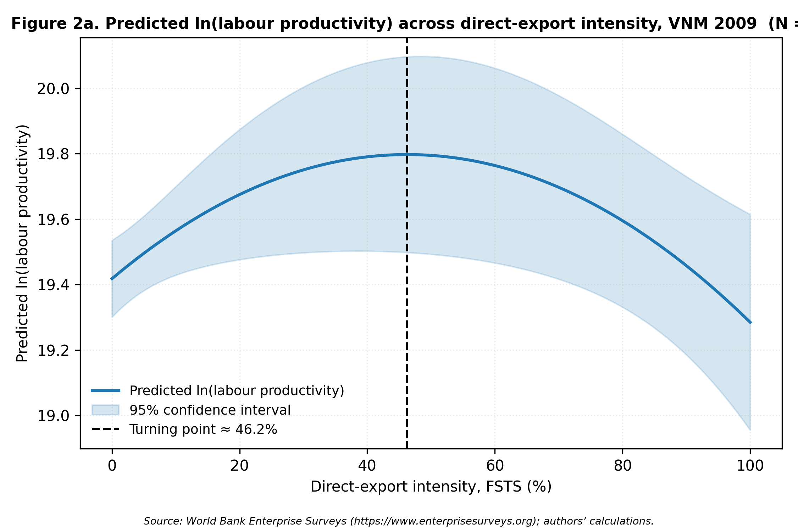
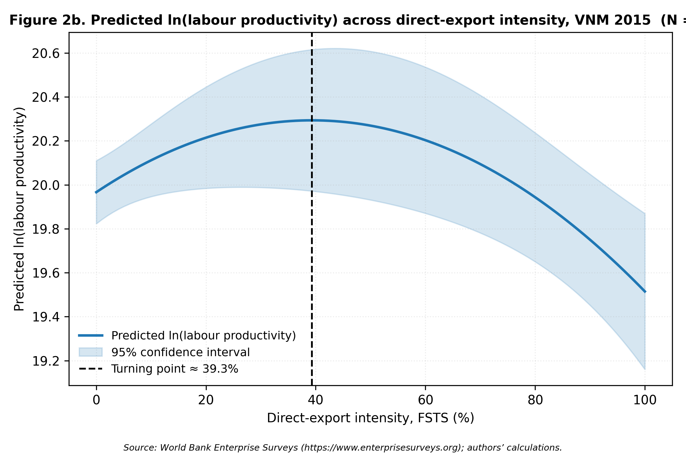
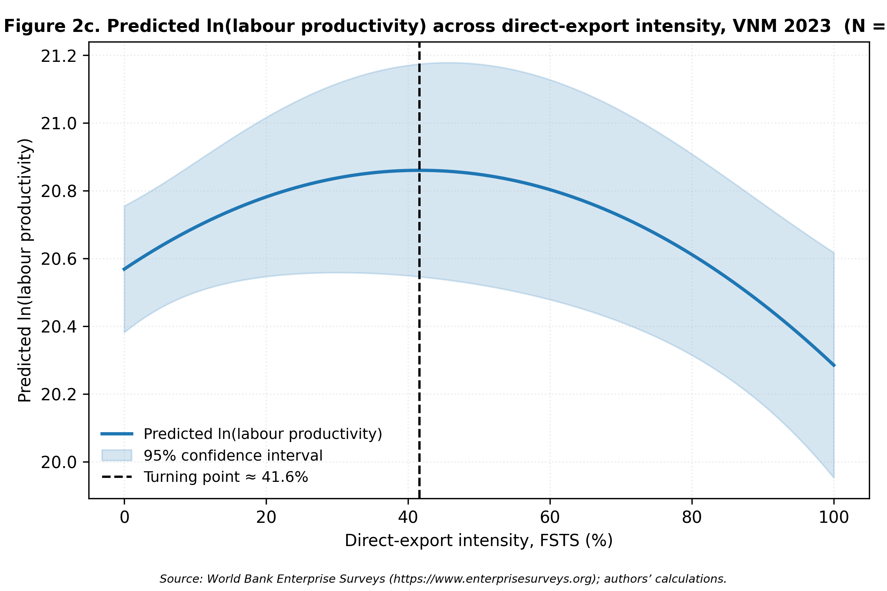

# Supplementary Material

**Paper:** Revisiting the Internationalisation–Performance Relationship in an Emerging Market: The Roles of Technological Capability and Foundational Digital Adoption

*This online supplement (hosted on Emerald Insight) contains the full robustness analyses, the wave-specific predicted-productivity figures, the pooled marginal-effect table, and extended construct-tier and mechanism notes referenced in the main text. It is not copy-edited or typeset by the publisher; content is the authors' responsibility.*

---

## S1. Extended mechanism note (referenced in §2.4)

**Two parallel mechanisms behind any later-wave DAI compression.** Any negative DAI × FSTS interaction observed in the later waves can be read through two complementary mechanisms that this paper treats as jointly operating rather than mutually exclusive. *Mechanism A, stage-dependent coordination complexity*: at high export intensity, the marginal coordination demand of additional cross-border transactions exceeds what a single Tier-1 website indicator can support; the binding friction is the absence of deeper Tier 2–3 process-integration, payment, and logistics digitisation rather than the website itself. *Mechanism B, construct obsolescence under population diffusion*: as website ownership diffuses toward the near-universal upper bound (49.8 % by 2023, vs 42.5 % in 2009), the c22b indicator increasingly functions as an organisational hygiene marker rather than a differentiating capability signal, so its measured association with productivity attenuates without any structural change in the underlying coordination mechanism. The two readings are not antagonistic: they correspond to different sources of the same empirical pattern, Mechanism A predicts compression conditional on export intensity within any wave where Tier-1 infrastructure is the binding constraint, while Mechanism B predicts compression across waves as the indicator loses cross-sectional information content. The 2009 / 2015 / 2023 design used in this paper cannot fully separate the two channels within the WBES Tier-1 instrument, and we treat both readings as legitimate within the limits of the available data. This framing matters for theoretical positioning: it locates DAI compression in a transitional-economy context where the construct is bounded by survey instrumentation rather than by the underlying digital-transformation phenomenon, and it pre-empts an interpretation of any null or sign-shifting result on H4 as evidence against dynamic digital capability moderation.

## S2. Construct-tier scope notes (referenced in §2.3 and §3.2)

**Construct-tier scope note.** The DAI_z construct in this paper (Tier 1 only: website binary c22b) is constrained by the WBES Vietnam instrument: only the website-presence binary is carried comparably across the 2009 / 2015 / 2023 waves, whereas richer Tier-2 transaction-enabling items such as electronic-payment intensity (k33, k38) appear only in the 2023 wave. The Vietnam Tier-1-only indicator (FSTS_c × DAI_z = −0.912, p = .043) is best read as construct-tier obsolescence: Tier-1 website presence has become a minimum-threshold credential in Vietnam's maturing digital environment and no longer differentiates firms' cross-border coordination capacity at high export intensity. The DAI_rich robustness composite available in the 2023 wave (Tier 1+2, §4.5 Panel B) provides within-wave sensitivity analysis on this scope-limitation question, but cross-wave comparability limits its use as the primary measure.

**Tier-1-only DAI as a deliberate boundary condition.** The restriction of DAI_z to the website-presence binary (c22b) across the 2009, 2015, and 2023 waves is a deliberate boundary condition imposed by WBES data availability, not a methodological weakness or a proxy approximation. The 2009 and 2015 waves offer only the website presence indicator (Tier 1), while the 2023 wave includes payment digitization items (k33, k38; Tier 2). This tiered measurement captures institutional evolution in digital infrastructure: Tier-1 only in waves with incomplete WBES coverage reflects the actual state of digital adoption instrumentation at that time, not a deficiency of the present study's measurement strategy. Retaining a single harmonised Tier-1 indicator across all three waves is the methodologically conservative choice that preserves cross-wave comparability; the alternative, using a richer composite for 2023 only, would introduce a wave-specific construct-shift that could be mistaken for a structural change in the I–P relationship. The DAI_rich robustness extension (§4.5 Panel B) applies the 2023-wave Tier-2 items precisely as a within-wave sensitivity probe to assess whether the headline moderation pattern survives under a richer construct while acknowledging the cross-wave comparability cost.

## S3. Pooled marginal effects of internationalisation (referenced in §4.2)

*Table 4b, Marginal effect of internationalisation on ln(labour productivity) at selected FSTS values (pooled M2, N = 2,958)*

| FSTS level | FSTSc (centred) | Marginal effect dy/dFSTS | Direction |
|---|---|---|---|
| 10% | −0.039 | +1.13 | Positive (ascending) |
| 20% | +0.061 | +0.75 | Positive (ascending) |
| 30% | +0.161 | +0.37 | Positive, declining |
| **39.7%** | **+0.258** | **0.00** | **Turning point (TP*)** |
| 50% | +0.361 | −0.39 | Negative (descending) |
| 60% | +0.461 | −0.78 | Negative |
| 70% | +0.561 | −1.16 | Negative |

*Note:* Marginal effect = β₁ + 2β₂ × (FSTS − mean_FSTS) where β₁ = 0.984, β₂ = −1.909, mean_FSTS ≈ 13.9%. SEs omitted pending full covariance matrix; the Lind–Mehlum u-test (p < .001) indicates that slopes at the data boundaries (FSTS=0: +1.52; FSTS=100%: −2.30) are jointly inconsistent with monotonicity.

## S4. Wave-specific predicted-productivity figures (Figures 2a–2d, referenced in §4.2)

*Figure 2a.* Predicted ln(labour productivity) as a function of FSTS for the 2009 wave (M2). Shaded band = 95% CI. Turning point ≈ 46% FSTS (Lind-Mehlum p = .006).

*Figure 2b.* Predicted ln(labour productivity) as a function of FSTS for the 2015 wave (M2). Turning point ≈ 39% FSTS (Lind-Mehlum p = .009).

*Figure 2c.* Predicted ln(labour productivity) as a function of FSTS for the 2023 wave (M2). Turning point ≈ 42% FSTS (Lind-Mehlum p = .013).

*Figure 2d.* Predicted ln(labour productivity) as a function of FSTS for the pooled sample (M2). Turning point ≈ 40% FSTS (Lind-Mehlum p < .001).

## S5. Full robustness analyses (Panels A–K, referenced in §4.5)

### 4.5 Robustness
Four families of robustness checks examine whether central inferences are sensitive to measurement choices, sector composition, export-participation structure, and endogeneity. The panels below are estimated on the same OLS HC1 design as the main models.

Panel G, Sector split (manufacturing versus non-manufacturing). To test whether the digital and capability channels operate uniformly across the broad sectoral composition of the
Vietnamese exporter cohort, we re-estimate the pooled M2 / M7 / M8 specifications separately
on manufacturing firms (sector1 ∈ {1, 2, 3}, ISIC 15–37, N = 1,854) and non-manufacturing
firms (utilities, construction, wholesale and retail, transport, finance and other services; sector1

∈ {4, 5, 6, 7}; N = 1,104).

The inverted-U is preserved in both subsets but is sharper in manufacturing (FSTS_c β = 0.971, p = .001; FSTS_c² β = -1.883, p < .001) than in non-manufacturing (FSTS_c β = 1.615, p = .064, marginal; FSTS_c² β = -2.479, p = .046). More substantively, the capability and digital-adoption channels operate primarily in manufacturing. In the M7 dual-direct specification, manufacturing firms display a strong TCI_z direct association (β = 0.223, p < .001) and a positive DAI_z direct association (β = 0.087,
p = .009), while non-manufacturing firms show only a marginal TCI_z effect (β = 0.090, p =
.096) and a null DAI_z effect (β = 0.068, p = .133). The DAI moderation channel is concentrated in manufacturing (M8 joint p = .103, marginal; FSTS_c × DAI_z = -0.543, p = .079)
and is uniformly null in non-manufacturing (M8 joint p = .280). TCI moderation, by contrast,
is statistically distinguishable from zero in both subsets (M3 joint p = .011 in manufacturing
and p = .007 in non-manufacturing), indicating that the curvature-flattening effect of capability
operates broadly while the digital channel remains specific to the manufacturing exporter base.
Substantively, this pattern is consistent with the view that basic digital adoption interacts with
cross-border production-coordination demands more strongly in tradable-goods sectors than in
service-oriented or domestically oriented sectors of the Vietnamese economy.
Panel H, Exporter-only sub-sample (FSTS > 0). Because the exporter share is 28.4 %,
20.7 % and 18.8 % across waves, the inverted-U fitted on the full sample is partly identified by
the participation margin between FSTS = 0 and FSTS > 0. We re-fit M2 / M7 / M8 on the
exporter-only sub-sample (N ≈ 281 in 2009, 198 in 2015, 190 in 2023, and 669 pooled). The
pooled exporter-only specification yields a negative linear FSTS_c term (β = -0.861, p < .001)
but a non-significant quadratic term (FSTS_c² β = -0.200, p = .660), and the joint M8 test of the curvature plus moderation block is not significant (joint F p = .462). The wave-specific exporteronly estimates are similarly noisier and individually weaker than the full-sample counterparts.
We read this as showing that the inverted-U documented in the main specification is meaningfully
identified by the participation margin rather than purely by within-exporter intensity variation;
this is consistent with the Ÿ3.1 descriptive evidence that direct-export intensity is a zero-inflated
variable in Vietnamese WBES data, with limited mass between the participation margin and
the implied turning point. The substantive H1 claim is therefore best read as a non-monotonic
association between participation-and-intensity in exporting and productivity, not as a strict
within-exporter intensity-curvature claim.
Panel I, Pooled wave × focal interaction test. To formally test whether the wave-specific
patterns of curvature and moderation are statistically separable from the pooled estimates, we
re-estimate the pooled M8 with a saturated set of wave interactions on the focal terms (FSTS_c × wave, FSTS_c² × wave, DAI_z × wave, TCI_z × wave). The joint Wald tests indicate that only DAI_z × wave is statistically distinguishable from the pooled average (joint p = .016); the FSTS_c, FSTS_c² and TCI_z direct-effect cross-wave differences are not statistically separable (all joint p > .25), and the FSTS_c × DAI_z and FSTS_c² × DAI_z cross-wave differences are not separable either (joint p > .55). This formal test is consistent with the descriptive Paternoster
result: only the DAI direct shifts are cross-wave-distinguishable, while the curvature parameters
and the FSTS × DAI moderation terms share a common pooled magnitude across waves.
Functional form check, cubic extension. To test whether an S-curve (cubic) specification better captures the I–P pattern, we augment the pooled M2 with a cubic term FSTS_c³. The cubic coefficient is not statistically significant (β = −1.763, p = .287), and model-fit criteria favour the quadratic: AIC decreases by 0.99 and BIC decreases by 7.0 when moving from the cubic back to the quadratic specification. The cubic term does not alter the turning-point estimate or any focal coefficient substantively. The simpler inverted-U (M2) is therefore preferred over the S-curve on both inferential and parsimony grounds.

Density-around-turning-point check. We also report the within-sample mass of firms in the curvature zone. Defining a ±5 percentage-point band around the wave-specific turning point (TP), the share of firms with FSTS within the band is 0.6 % (6 of 989) in 2009, 1.2 % (11 of

956) in 2015, 0.9 % (9 of 1,013) in 2023 and 1.0 % (29 of 2,958) pooled. The bulk of mass lies
at FSTS = 0; the turning-point estimates are identified primarily through the contrast between
non-exporters and exporters and the right tail above the TP, not through dense within-band
variation.

Readers should bear this density structure in mind when interpreting the precise

turning-point magnitude.

#### Robustness to Endogeneity and Selection

Three complementary approaches address selection and endogeneity concerns. A note on the selection structure is warranted before presenting the checks. Exporters self-select into foreign markets, so the OLS estimates reflect both selection and treatment effects. As a boundary condition, exporter participation rates declined from 28.4% (2009) to 18.8% (2023), consistent with servicification of the economy and the gradual exit of marginal exporters, which itself attenuates the threat of a constant positive-selection story across waves. A Heckman two-stage check confirms this reading: Heckman two-step corrections (Panel E) yield insignificant inverse-Mills ratios across all waves (all |λ| < 0.84, p > .25 in each wave), indicating no detectable selection bias on the exporter subsample. The inverse Mills ratio coefficient does not materially change FSTS coefficient estimates across waves, suggesting that selection bias is limited in this context and that the participation-margin productivity gap documented in §4.4 reflects a genuine performance discontinuity rather than an artefact of positive selection into exporting. Propensity-score matching (Panel J) corroborates the average H2 TCI association and the baseline DAI_z level association without imposing linearity: ATT estimates for foreign-technology / certification status (0.609–0.637, p < .001) and for website ownership (0.298–0.321, p < .001) are substantively consistent with the OLS results, though the latter is best read as a descriptive Tier-1 selection-corrected association rather than a capability test. Full matching-balance diagnostics and ATT estimates are reported in Online Appendix Table A.

Two-stage least-squares estimation using leave-one-out sector × region × wave peer-adoption rates as instruments (Panel K; first-stage F-statistics 22–35, well above the Staiger–Stock threshold) returns an instrumented DAI estimate of 0.018 (p = .942) and an instrumented TCI estimate of 1.639 (p < .001). The null 2SLS DAI coefficient is a key robustness result: it indicates that website presence does not plausibly cause productivity improvements in 2023 Vietnam, reinforcing the Tier 1 proxy obsolescence interpretation of the negative DAI×FSTS interaction. The strongly positive instrumented TCI coefficient (β=1.639, p<.001, substantially larger than the OLS estimate, consistent with attenuation-bias correction) further indicates that foreign-technology and standards capability is the robust productivity-relevant mechanism in this institutional setting. The instrument set (peer-adoption rates within sector × region × wave cells) satisfies relevance (strong first stage) and approximate exclusion (peer-adoption rates are unlikely to affect individual firm productivity through channels other than DAI adoption, conditional on sector-wave cells). Oster (2019) δ-stability bounds (assuming R_max = 1.3 × R_controlled) indicate that no focal coefficient changes sign or collapses to zero under plausible magnitudes of unobserved selection. Full 2SLS first-stage results and Oster bound calculations are reported in Online Appendix Table B.

Measurement-sensitivity probes indicate that core inferences do not depend on composite construction. Enriching TCI with R&D and product-innovation items (Panel A) attenuates the TCI coefficient modestly but does not alter qualitative conclusions. The enriched DAI_rich composite (Tier 1–2, Panel B) yields directionally consistent moderation in 2023 with weaker significance. Micro-firm exclusion (Panel D) preserves the inverted-U and TCI associations. Paternoster et al. cross-wave z-tests (Panel F) indicate that the DAI cross-wave shift is statistically distinguishable while curvature parameters share a common pooled magnitude. Panel-level estimates are reported in Online Appendix Tables C–F.

Multiple-testing caveat. 4.5 reports four narrative panels (G, H, I, F) and three robustness families (endogeneity/selection, measurement sensitivity) across multiple focal terms. We do not apply a formal multiple-testing correction because the panels probe different identification concerns rather than testing the same hypothesis repeatedly, but readers should weight any single marginal panel result accordingly. Our substantive inferences in §5 rely on the pattern across panels and the directional consistency of the focal estimates rather than on the significance of any single robustness panel.

Table 4 collates the robustness panels documented in Ÿ4.5 in a single overview to ease crosscomparison.
Table LM reports the implied turning points of the inverted-U specification (M2) and the
Lind–Mehlum p-values for each wave and the pooled sample.

Table 4: Robustness panels A–K and supplementary checks.

| Panel | Sample | N | Term | b (SE) | p |
| --- | --- | --- | --- | --- | --- |
| DAI rich DAI rich bin | 2023 | 1013 | FSTSc | +1.002† (0.607) | 0.099 |
| DAI rich DAI rich bin | 2023 | 1013 | FSTSc2 | -1.707* (0.813) | 0.036 |
| DAI rich DAI rich bin | 2023 | 1013 | TCI_z | +0.129** (0.045) | 0.004 |
| DAI rich DAI rich bin | 2023 | 1013 | DAI_rich_bin_z | -0.009 (0.100) | 0.926 |
| DAI rich DAI rich bin | 2023 | 1013 | FSTSc_DAI_rich_bin | -0.893 (0.649) | 0.169 |
| DAI rich DAI rich bin | 2023 | 1013 | FSTSc2_DAI_rich_bin | +1.038 (0.878) | 0.237 |
| DAI rich DAI rich bin | 2023 | 1013 | joint_F_DAI_rich_interactions | +1.4181 | 0.243 |
| DAI rich DAI rich cont | 2023 | 1013 | FSTSc | +1.032† (0.569) | 0.070 |
| DAI rich DAI rich cont | 2023 | 1013 | FSTSc2 | -1.744* (0.757) | 0.021 |
| DAI rich DAI rich cont | 2023 | 1013 | TCI_z | +0.126** (0.045) | 0.005 |
| DAI rich DAI rich cont | 2023 | 1013 | DAI_rich_cont_z | -0.004 (0.083) | 0.957 |
| DAI rich DAI rich cont | 2023 | 1013 | FSTSc_DAI_rich_cont | -0.933† (0.526) | 0.076 |
| DAI rich DAI rich cont | 2023 | 1013 | FSTSc2_DAI_rich_cont | +1.052 (0.722) | 0.145 |
| DAI rich DAI rich cont | 2023 | 1013 | joint_F_DAI_rich_interactions | +2.3148† | 0.099 |
| DAI thin on rich sample 2023 | 2023 | 1013 | FSTSc | +1.072* (0.493) | 0.030 |
| DAI thin on rich sample 2023 | 2023 | 1013 | FSTSc2 | -1.793** (0.666) | 0.007 |
| DAI thin on rich sample 2023 | 2023 | 1013 | TCI_z | +0.129** (0.045) | 0.004 |
| DAI thin on rich sample 2023 | 2023 | 1013 | DAI_z | -0.011 (0.073) | 0.880 |
| DAI thin on rich sample 2023 | 2023 | 1013 | FSTSc_DAIz | -0.912* (0.450) | 0.043 |
| DAI thin on rich sample 2023 | 2023 | 1013 | FSTSc2_DAIz | +1.043† (0.633) | 0.100 |
| DAI thin on rich sample 2023 | 2023 | 1013 | joint_F_DAI_thin_interactions | +2.7833† | 0.062 |
| IV 2SLS K DAI | pooled | 2298 | DAI_z (instrumented) | +0.018 (0.249) | 0.942 |
| IV 2SLS K TCI | pooled | 2298 | TCI_z (instrumented) | +1.639*** (0.299) | 0.000 |
| PSM J NN1 caliper005 | pooled | 1085 | ATT_DAI_treat | +0.298*** (0.061) | 0.000 |
| PSM J NN1 caliper005 | pooled | 644 | ATT_TCI_treat | +0.637*** (0.077) | 0.000 |
| PSM J kernel bw006 | pooled | 1085 | ATT_DAI_treat | +0.321*** (0.043) | 0.000 |
| PSM J kernel bw006 | pooled | 639 | ATT_TCI_treat | +0.609*** (0.056) | 0.000 |
| TCI full direct | 2015 | 956 | FSTSc | +1.139* (0.539) | 0.035 |
| TCI full direct | 2015 | 956 | FSTSc2 | -2.088** (0.748) | 0.005 |
| TCI full direct | 2015 | 956 | TCI_full_z | +0.056 (0.049) | 0.253 |
| TCI full direct | 2015 | 956 | DAI_z | -0.033 (0.051) | 0.520 |
| TCI full direct | 2023 | 1013 | FSTSc | +0.675 (0.475) | 0.155 |
| TCI full direct | 2023 | 1013 | FSTSc2 | -1.266* (0.646) | 0.050 |
| TCI full direct | 2023 | 1013 | TCI_full_z | +0.096* (0.043) | 0.024 |
| TCI full direct | 2023 | 1013 | DAI_z | +0.097* (0.046) | 0.037 |
| TCI full moderation | 2015 | 956 | FSTSc | +1.347* (0.598) | 0.024 |
| TCI full moderation | 2015 | 956 | FSTSc2 | -2.350** (0.829) | 0.005 |
| TCI full moderation | 2015 | 956 | TCI_full_z | +0.004 (0.072) | 0.960 |
| TCI full moderation | 2015 | 956 | FSTSc_TCIfull | -0.545 (0.495) | 0.270 |
| TCI full moderation | 2015 | 956 | FSTSc2_TCIfull | +0.641 (0.694) | 0.356 |
| TCI full moderation | 2015 | 956 | joint_F_TCI_full_interactions | +0.7096 | 0.492 |
| TCI full moderation | 2023 | 1013 | FSTSc | +0.949† (0.574) | 0.098 |
| TCI full moderation | 2023 | 1013 | FSTSc2 | -1.579* (0.777) | 0.042 |
| TCI full moderation | 2023 | 1013 | TCI_full_z | +0.117* (0.049) | 0.016 |
| TCI full moderation | 2023 | 1013 | FSTSc_TCIfull | -0.317 (0.314) | 0.314 |
| TCI full moderation | 2023 | 1013 | FSTSc2_TCIfull | +0.185 (0.431) | 0.668 |
| TCI full moderation | 2023 | 1013 | joint_F_TCI_full_interactions | +1.8868 | 0.152 |
| common N reconciled 2023 | M8 | 1013 | FSTSc | +1.072* (0.493) | 0.030 |
| common N reconciled 2023 | M8 | 1013 | FSTSc2 | -1.793** (0.666) | 0.007 |
| common N reconciled 2023 | M8 | 1013 | TCI_z | +0.129** (0.045) | 0.004 |
| common N reconciled 2023 | M8 | 1013 | DAI_z | -0.011 (0.073) | 0.880 |
| common N reconciled 2023 | M8 | 1013 | FSTSc_DAIz | -0.912* (0.450) | 0.043 |
| common N reconciled 2023 | M8 | 1013 | FSTSc2_DAIz | +1.043† (0.633) | 0.100 |
| common N reconciled 2023 | 2023 | 1013 | joint_F_DAI_M8 | +2.7833† | 0.062 |
| exporter only | M2 | 281 | FSTSc | -0.611* (0.242) | 0.012 |
| exporter only | M2 | 281 | FSTSc2 | +1.674* (0.853) | 0.050 |
| exporter only | M7 | 281 | FSTSc | -0.409† (0.238) | 0.085 |
| exporter only | M7 | 281 | FSTSc2 | +1.585† (0.854) | 0.064 |
| exporter only | M7 | 281 | TCI_z | +0.149† (0.077) | 0.053 |
| exporter only | M7 | 281 | DAI_z | +0.192* (0.090) | 0.034 |
| exporter only | M8 | 281 | FSTSc | -0.403 (0.262) | 0.124 |
| exporter only | M8 | 281 | FSTSc2 | +1.377 (0.918) | 0.134 |
| exporter only | M8 | 281 | TCI_z | +0.147† (0.077) | 0.057 |
| exporter only | M8 | 281 | DAI_z | +0.075 (0.143) | 0.598 |
| exporter only | M8 | 281 | FSTSc_DAIz | +0.078 (0.238) | 0.743 |
| exporter only | M8 | 281 | FSTSc2_DAIz | +0.802 (0.874) | 0.359 |
| exporter only | 2009_exp | 281 | joint_F_DAI_M8 | +0.4235 | 0.655 |
| exporter only | M2 | 198 | FSTSc | -0.773** (0.290) | 0.008 |
| exporter only | M2 | 198 | FSTSc2 | -2.204* (0.957) | 0.021 |
| exporter only | M7 | 198 | FSTSc | -0.771** (0.296) | 0.009 |
| exporter only | M7 | 198 | FSTSc2 | -2.619** (0.957) | 0.006 |
| exporter only | M7 | 198 | TCI_z | +0.242*** (0.071) | 0.001 |
| exporter only | M7 | 198 | DAI_z | -0.212† (0.112) | 0.059 |
| exporter only | M8 | 198 | FSTSc | -0.672* (0.301) | 0.025 |
| exporter only | M8 | 198 | FSTSc2 | -2.719* (1.147) | 0.018 |
| exporter only | M8 | 198 | TCI_z | +0.237*** (0.071) | 0.001 |
| exporter only | M8 | 198 | DAI_z | -0.177 (0.202) | 0.383 |
| exporter only | M8 | 198 | FSTSc_DAIz | -0.335 (0.277) | 0.226 |
| exporter only | M8 | 198 | FSTSc2_DAIz | -0.172 (1.096) | 0.876 |
| exporter only | 2015_exp | 198 | joint_F_DAI_M8 | +0.7344 | 0.481 |
| exporter only | M2 | 190 | FSTSc | -0.910** (0.335) | 0.007 |
| exporter only | M2 | 190 | FSTSc2 | -1.461 (1.160) | 0.208 |
| exporter only | M7 | 190 | FSTSc | -0.856* (0.344) | 0.013 |
| exporter only | M7 | 190 | FSTSc2 | -1.397 (1.171) | 0.233 |
| exporter only | M7 | 190 | TCI_z | +0.061 (0.067) | 0.366 |
| exporter only | M7 | 190 | DAI_z | +0.037 (0.086) | 0.665 |
| exporter only | M8 | 190 | FSTSc | -1.079** (0.332) | 0.001 |
| exporter only | M8 | 190 | FSTSc2 | -2.921** (1.094) | 0.008 |
| exporter only | M8 | 190 | TCI_z | +0.080 (0.067) | 0.234 |
| exporter only | M8 | 190 | DAI_z | -0.271† (0.141) | 0.054 |
| exporter only | M8 | 190 | FSTSc_DAIz | +0.510† (0.294) | 0.083 |
| exporter only | M8 | 190 | FSTSc2_DAIz | +2.676** (1.021) | 0.009 |
| exporter only | 2023_exp | 190 | joint_F_DAI_M8 | +3.4455* | 0.034 |
| exporter only | M2 | 669 | FSTSc | -0.861*** (0.167) | 0.000 |
| exporter only | M2 | 669 | FSTSc2 | -0.200 (0.581) | 0.730 |
| exporter only | M7 | 669 | FSTSc | -0.704*** (0.173) | 0.000 |
| exporter only | M7 | 669 | FSTSc2 | -0.172 (0.577) | 0.765 |
| exporter only | M7 | 669 | TCI_z | +0.178*** (0.042) | 0.000 |
| exporter only | M7 | 669 | DAI_z | +0.066 (0.057) | 0.247 |
| exporter only | M8 | 669 | FSTSc | -0.683*** (0.183) | 0.000 |
| exporter only | M8 | 669 | FSTSc2 | -0.497 (0.643) | 0.440 |
| exporter only | M8 | 669 | TCI_z | +0.179*** (0.042) | 0.000 |
| exporter only | M8 | 669 | DAI_z | -0.025 (0.104) | 0.809 |
| exporter only | M8 | 669 | FSTSc_DAIz | -0.001 (0.164) | 0.995 |
| exporter only | M8 | 669 | FSTSc2_DAIz | +0.702 (0.625) | 0.261 |
| exporter only | pooled_exp | 669 | joint_F_DAI_M8 | +0.7733 | 0.462 |
| micro excluded pooled | pooled_l1ge10 | 2473 | FSTSc | +0.794** (0.301) | 0.008 |
| micro excluded pooled | pooled_l1ge10 | 2473 | FSTSc2 | -1.647*** (0.434) | 0.000 |
| micro excluded pooled | pooled_l1ge10 | 2473 | TCI_z | +0.188*** (0.028) | 0.000 |
| micro excluded pooled | pooled_l1ge10 | 2473 | DAI_z | +0.054 (0.051) | 0.288 |
| micro excluded pooled | pooled_l1ge10 | 2473 | FSTSc_DAIz | -0.387 (0.281) | 0.169 |
| micro excluded pooled | pooled_l1ge10 | 2473 | FSTSc2_DAIz | +0.405 (0.416) | 0.330 |
| micro excluded pooled | pooled_l1ge10 | 2473 | joint_F_DAI_interactions | +1.7902 | 0.167 |
| sector split manufacturing | M2 | 1854 | FSTSc | +0.971** (0.296) | 0.001 |
| sector split manufacturing | M2 | 1854 | FSTSc2 | -1.883*** (0.426) | 0.000 |
| sector split manufacturing | M7 | 1854 | FSTSc | +0.662* (0.296) | 0.025 |
| sector split manufacturing | M7 | 1854 | FSTSc2 | -1.382** (0.428) | 0.001 |
| sector split manufacturing | M7 | 1854 | TCI_z | +0.223*** (0.033) | 0.000 |
| sector split manufacturing | M7 | 1854 | DAI_z | +0.087** (0.033) | 0.009 |
| sector split manufacturing | M8 | 1854 | FSTSc | +0.840* (0.328) | 0.010 |
| sector split manufacturing | M8 | 1854 | FSTSc2 | -1.624*** (0.473) | 0.001 |
| sector split manufacturing | M8 | 1854 | TCI_z | +0.228*** (0.033) | 0.000 |
| sector split manufacturing | M8 | 1854 | DAI_z | +0.034 (0.057) | 0.552 |
| sector split manufacturing | M8 | 1854 | FSTSc_DAIz | -0.543† (0.310) | 0.079 |
| sector split manufacturing | M8 | 1854 | FSTSc2_DAIz | +0.626 (0.457) | 0.170 |
| sector split manufacturing | pooled | 1854 | joint_F_DAI_interactions_M8 | +2.2806 | 0.102 |
| sector split manufacturing | pooled | 1854 | joint_F_TCI_interactions_M3 | +4.5710* | 0.011 |
| sector split non manufacturing | M2 | 1104 | FSTSc | +1.615† (0.870) | 0.064 |
| sector split non manufacturing | M2 | 1104 | FSTSc2 | -2.479* (1.244) | 0.046 |
| sector split non manufacturing | M7 | 1104 | FSTSc | +1.350 (0.890) | 0.130 |
| sector split non manufacturing | M7 | 1104 | FSTSc2 | -2.039 (1.275) | 0.110 |
| sector split non manufacturing | M7 | 1104 | TCI_z | +0.090† (0.054) | 0.096 |
| sector split non manufacturing | M7 | 1104 | DAI_z | +0.068 (0.045) | 0.133 |
| sector split non manufacturing | M8 | 1104 | FSTSc | +1.387 (0.868) | 0.110 |
| sector split non manufacturing | M8 | 1104 | FSTSc2 | -2.115† (1.237) | 0.087 |
| sector split non manufacturing | M8 | 1104 | TCI_z | +0.091† (0.054) | 0.091 |
| sector split non manufacturing | M8 | 1104 | DAI_z | +0.060 (0.122) | 0.622 |
| sector split non manufacturing | M8 | 1104 | FSTSc_DAIz | -0.190 (0.719) | 0.791 |
| sector split non manufacturing | M8 | 1104 | FSTSc2_DAIz | -0.341 (1.065) | 0.749 |
| sector split non manufacturing | pooled | 1104 | joint_F_DAI_interactions_M8 | +1.2729 | 0.280 |
| sector split non manufacturing | pooled | 1104 | joint_F_TCI_interactions_M3 | +4.9441** | 0.007 |
| wave interaction pooled | pooled | 2958 | joint_F_FSTSc_x_wave | +0.8901 | 0.411 |
| wave interaction pooled | pooled | 2958 | joint_F_FSTSc2_x_wave | +0.7756 | 0.461 |
| wave interaction pooled | pooled | 2958 | joint_F_DAIz_x_wave | +4.1656* | 0.016 |
| wave interaction pooled | pooled | 2958 | joint_F_TCIz_x_wave | +1.1156 | 0.328 |
| wave interaction pooled | pooled | 2958 | joint_F_all_wave_interactions | +2.0664* | 0.036 |

*Notes.* Robustness panels: TCI_full = broader TCI composite; DAI_rich = richer DAI composite (2023 only). HC1 robust standard errors. † p < .10; * p < .05; ** p < .01; *** p < .001.

Panel / sample
N Focal coefficient
Joint test
A. TCI_full direct (2015)
956 TCI_full_z = 0.056 (p = .253) n.s.; DAI_z = M3 joint p = .492 n.s.
−0.033 n.s.
A. TCI_full direct (2023)
1,013 TCI_full_z = 0.096 (p = .024); DAI_z = M3 joint p = .152 n.s.
0.097 (p = .037)
B. DAI_rich continuous (2023)
1,013 FSTS_c × DAI_rich_cont_z = −0.933 † (p M8 joint p = .099 †
= .076)
B. DAI_rich binary (2023)
1,013 FSTS_c × DAI_rich_bin_z = −0.893 (p = M8 joint p = .243 n.s.
.169) n.s.
C. Common-N reconciled (2023) 1,013 DAI_z moderation re-estimated on identical M8 joint p = .062 †
2023 sample
D. Micro-firm exclusion (l1 ≥ 10) 2,473 TCI_z = 0.188 ; DAI_z = 0.054 n.s.
M8 joint p = .167 n.s.
G. Manufacturing (sector1 1,854 TCI_z = 0.223 ; DAI_z = 0.087 ; M8 joint p = .103 †
∈ {1, 2, 3})
FSTS_c × DAI_z = −0.543 †
H. Exporter-only (FSTS > 0, 669 FSTS_c = −0.861 ; FSTS_c² = −0.200 M8 joint p = .462 n.s.
pooled)
n.s.
I. Wave × focal interaction 2,958 DAI_z × wave detectable (p = .016); other Only DAI direct shifts
(pooled)
focal × wave n.s.
cross-wave-separable
Density around TP (±5 pp band) 29 / 2,958 1.0% of firms within band; bulk of mass at Curvature identified by parFSTS = 0
ticipation margin
J. PSM ATT, website (1-NN, 1,085 ATT_DAI = 0.298 (SE 0.061)
Positive and large under
caliper 0.05)
matching
J. PSM ATT, website (kernel 1,085 ATT_DAI = 0.321 (SE 0.043)
Robust to algorithm
BW 0.06)
J. PSM ATT, cert / foreign-tech 640 ATT_TCI = 0.637 (SE 0.078)
Positive and large under
(1-NN)
matching
K. IV / 2SLS, DAI_z
2,298 DAI_z = 0.018 (p = .942) n.s.
First-stage F = 34.6
(strong)
K. IV / 2SLS, TCI_z
2,298 TCI_z = 1.639 (SE 0.299)
First-stage F = 22.1
(strong)
Oster (2019) δ = 1 bounds
2,958 FSTSc 0.92 → 0.61; FSTSc2 −2.21 → −1.17; No sign change; focal findTCI 0.14 → 0.19; DAI 0.07 → 0.08
ings stable
∗

∗

∗∗∗

∗∗∗

∗∗

∗∗∗

∗∗∗

∗∗∗

∗∗∗

∗∗∗

Each row summarises one robustness panel from Ÿ4.5 estimated by OLS with HC1 robust standard
errors (PSM and 2SLS use the indicated alternative estimators). Significance markers: ∗∗∗ p < .001, ∗∗ p < .01,
∗
p < .05, † p < .10, n.s. = not significant. Panel E (Heckman / control function selection corrections) and
Panel F (Paternoster cross-wave z-tests, Paternoster et al., 1998) are reported in the prose because their natural
presentation is per-sample rather than per-row. Source: World Bank Enterprise Surveys (Vietnam 2009, 2015, 2023), www.enterprisesurveys.org; authors' calculations.
Notes.

Table 5: Implied turning points of the inverted-U (M2 specification).

| Sample | Turning point (FSTS) | 95% CI | Lind-Mehlum p | FSTS range |
| --- | --- | --- | --- | --- |
| 2009 (N=989) | 46.2% | [37.4%, 55.1%] | 0.006** | [0%, 100%] |
| 2015 (N=956) | 39.3% | [30.3%, 48.4%] | 0.009** | [0%, 100%] |
| 2023 (N=1,013) | 41.6% | [31.7%, 51.5%] | 0.013* | [0%, 100%] |
| Pooled (N=2,958) | 39.7% | [34.0%, 45.5%] | 0.000*** | [0%, 100%] |

*Notes.* Turning points estimated from M2 (quadratic FSTS specification). Lind-Mehlum (2010) test p-value for inverted-U shape. 95% CI computed by delta method. All four samples confirm an inverted-U with turning point in the 39–46% FSTS range.

**Paternoster (1998) cross-wave coefficient stability tests (M7):**

| Comparison | FSTSc z (p) | FSTSc² z (p) | TCI_z z (p) | DAI_z z (p) |
| --- | --- | --- | --- | --- |
| 2009 vs. 2015 | z=-0.61 (p=0.543) | z=0.96 (p=0.337) | z=1.29 (p=0.198) | z=3.35 (p=0.001) |
| 2009 vs. 2023 | z=0.09 (p=0.926) | z=0.14 (p=0.888) | z=1.42 (p=0.155) | z=1.28 (p=0.201) |
| 2015 vs. 2023 | z=0.66 (p=0.509) | z=-0.84 (p=0.400) | z=0.07 (p=0.947) | z=-2.05 (p=0.040) |

*Notes.* Cross-wave coefficient equality tests following Paternoster et al. (1998). Failure to reject indicates coefficient stability across waves. FSTSc and FSTSc² comparisons support wave-specific heterogeneity in TCI and DAI direct effects but not in the I–P curvature parameters. Turning points (already reported in Table 5 above) are derived from M2 (lnLP = β₀ + β₁ FSTS_c + β₂ FSTS_c² + controls + sector FE [+ wave FE in pooled]) back-transformed to the raw FSTS scale; 95% CI uses the delta method; Lind–Mehlum p-values follow the Sasabuchi-style endpoint test (Lind and Mehlum, 2010). Source: WBES Vietnam 2009, 2015, 2023; authors' calculations.

