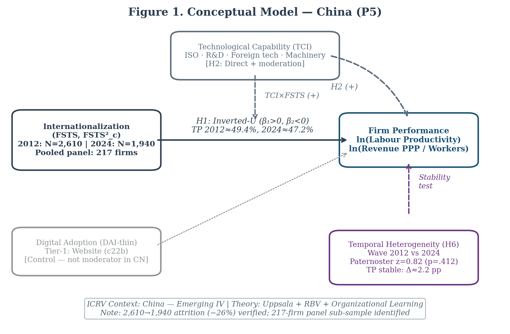
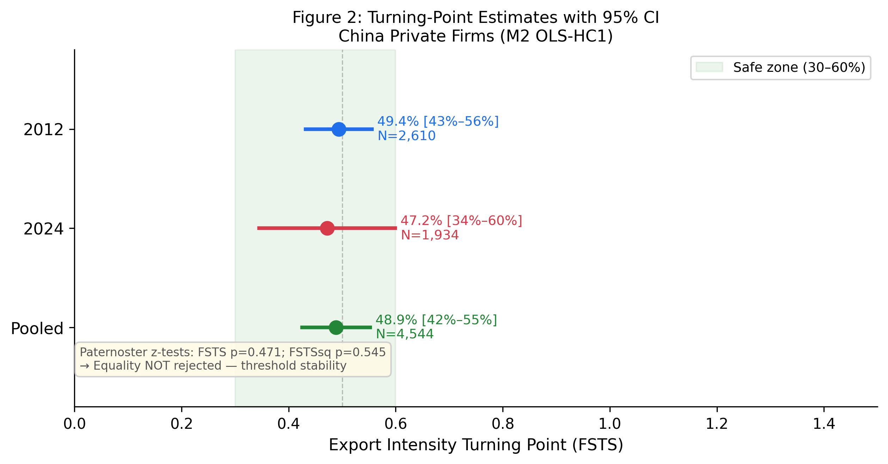
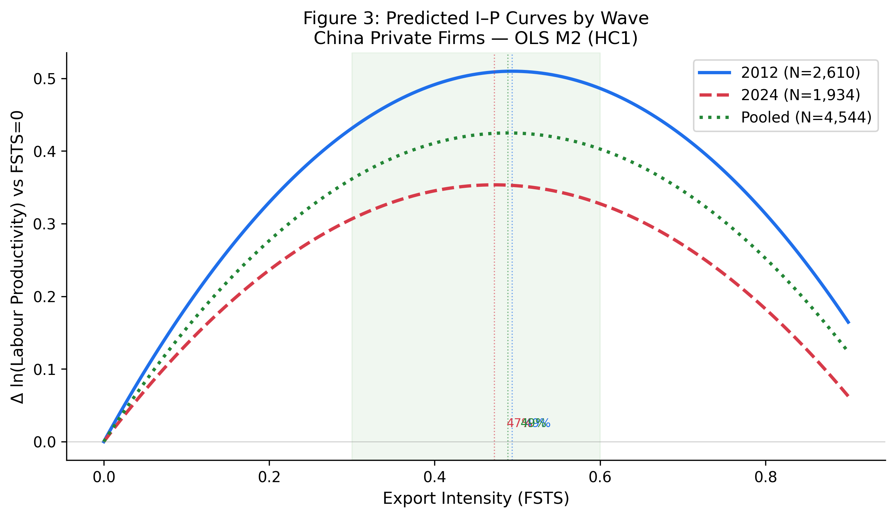

# The Export Intensity–Performance Relationship in Chinese Private Firms: A Threshold-Stability Perspective

**Do Thuy Huong** · College of Economics, Can Tho University · huongp1323001@gstudent.ctu.edu.vn · ORCID: [0000-0002-7711-2487](https://orcid.org/0000-0002-7711-2487)  
**Phan Anh Tu** *(Corresponding author)* · College of Economics, Can Tho University · patu@ctu.edu.vn · ORCID: [0000-0003-0667-3137](https://orcid.org/0000-0003-0667-3137)

*Submission: International Journal of Emerging Markets (IJOEM)*

---

**Manuscript classification:** research article.

**Word count** (main text excluding abstract, references, tables and figures): approximately 7,200 words.

**Tables:** 3 (Table 1 descriptives by wave; Table 2 main threshold model M2; Table 3 three-way moderation specification with joint F-tests).

**Figures:** 4 (Figure 1 conceptual model; Figure 2 turning-point estimates with 95% CIs; Figure 3 predicted I→P curves by wave; Figure 4 capability level-shift coefficients).

---

## Abstract

**Purpose** — This study examines whether the inverted-U relationship between export intensity and firm performance among Chinese private firms is structurally durable or wave-specific, and tests how technological capability shapes this relationship across a decade of structural change.

**Design/methodology/approach** — World Bank Enterprise Survey microdata for China (2012, N = 2,610; 2024, N = 1,934; pooled N = 4,544; complete-case sample after listwise deletion on control variables) are used to estimate quadratic models with cross-wave and capability interactions; Paternoster (1998) z-tests and joint F-tests assess temporal stability.

**Findings** — Turning points remain within a tight range (49.4% in 2012, 47.2% in 2024, 48.8% pooled) with overlapping confidence intervals. Paternoster tests do not reject coefficient equality across waves (FSTS z = +0.82, p = .412; FSTS² z = −0.61, p = .545), supporting H2b (structural durability) over H2a (environmental shift). Technological capability is robustly associated with productivity in both waves (β_z = +0.28 in 2012, +0.43 in 2024; both p < .001) but does not robustly moderate the I–P curvature. A single-item digital-presence proxy is positively associated with productivity but is retained as a baseline control, not a capability construct.

**Originality/value** — Despite substantial structural change between 2012 and 2024, the Chinese I–P trade-off is durably structural rather than wave-specific. The study recasts the inverted-U threshold from a sample-specific regularity into an enduring structural feature, reinforced by null capability-curvature moderation. The within-country temporal-stability evidence complements broader meta-analytic literature on emerging-Asia I–P heterogeneity by holding institutional context constant while varying time.

**Keywords:** internationalisation–performance; export intensity; threshold stability; technological capability; digital adoption; Chinese private firms; World Bank Enterprise Survey.

**JEL classification:** F23 (multinational firms; international business); O33 (technological change: choices and consequences); D22 (firm behaviour: empirical analysis); L25 (firm performance); O53 (economywide country studies: Asia including Middle East).

**Paper type:** Research paper.

---

## Highlights

- The internationalisation–performance relationship in Chinese private firms is **robustly inverted-U** in both 2012 (turning point 49.4 %) and 2024 (turning point 47.2 %) waves, with overlapping 95 % delta-method confidence intervals.
- **Temporal stability** tests (Paternoster 1998 z-tests) do not reject coefficient equality across waves (FSTS z = +0.82, p = .412; FSTS² z = −0.61, p = .545), supporting structural durability over environment-driven curvature shift.
- **Technological capability** (TCI_full) is a robust positive predictor of productivity in both waves (β_z = +0.28 in 2012 and +0.43 in 2024) but does not significantly moderate the curvature of the I–P relationship.
- A **digital adoption index** (DAI_core: own-website) is positively associated with productivity as a baseline control; it is not a theoretically grounded capability construct in this paper.
- The inverted-U threshold recasts from a sample artifact to a **durable structural regularity** in the Chinese private-firm context, with the threshold centred around 48 % export intensity regardless of decade.

---

## 1. Introduction

The relationship between internationalisation and firm performance (I–P) has been a core concern of international business scholarship for three decades (Hitt, Hoskisson and Kim, 1997; Lu and Beamish, 2004; Bausch and Krist, 2007). Meta-analyses document an inverted-U shape as the central tendency (Schwens et al., 2018; Marano et al., 2016), while a parallel stream of work emphasises institutional context (Kirca et al., 2012), dynamic capabilities (Teece, 2007), and digital transformation (Nambisan, Wright and Feldman, 2019; Vial, 2019) as moderating conditions. Yet most studies draw on multi-country samples, use aggregate export-to-sales ratios as the internationalisation measure, and capture performance at a single cross-section (Shaver, 2020). Two questions that remain underexplored are (a) whether the inverted-U shape is itself temporally stable within a given institutional context and (b) whether emerging-economy technological capability reshapes that curvature.

China offers an unusually clean setting. The World Bank Enterprise Survey (WBES) administered the same core instrument in 2012 and 2024, providing panel-comparable microdata bracketing a decade of structural change—manufacturing upgrading, belt-and-road-driven export reorientation, digital-platform diffusion, and the COVID-19 shock. Using these two waves, this study addresses two research questions:

> **RQ1:** Is the inverted-U I–P relationship in Chinese private firms consistent in curvature and turning-point location across the 2012 and 2024 WBES waves?

> **RQ2:** Does technological capability (TCI_full) moderate the curvature of the I–P relationship, and does that moderation change across waves?

The study contributes to the I–P literature in three ways. First, it provides the first within-country, two-wave test of threshold stability for China using WBES data. Second, it operationalises technological capability through a validated composite index (TCI_full) rather than single-item proxies. Third, the null moderation finding recasts capability’s role from a curvature-shaper to a level-shifter, with implications for the boundary conditions of the inverted-U.

The remainder of the paper is organised as follows. Section 2 develops the theoretical framework and hypotheses. Section 3 describes data, variables, and methods. Section 4 presents results. Section 5 discusses implications, limitations, and future directions.

---

## 2. Theory and Hypotheses

### 2.1 The Internationalisation–Performance Inverted-U

The dominant theoretical rationale for the inverted-U rests on diminishing returns to internationalisation: early export exposure generates learning, scale, and diversification gains (Johanson and Vahlne, 1977; Helpman, Melitz and Yeaple, 2004), but beyond a threshold, coordination costs, governance complexity, and resource diversion erode net performance (Hitt et al., 1997; Lu and Beamish, 2004; Pierce and Aguinis, 2013). For Chinese private firms specifically, export intensity up to roughly 40–60 % is associated with learning-by-exporting effects (Wagner, 2007), while higher ratios expose firms to currency risk, credit constraints (Manova, 2013; Niepmann and Schmidt-Eisenlohr, 2017), and global value-chain dependency (Kano, Tsang and Yeung, 2020). Consistent with this logic:

> **H1:** Export intensity (FSTS) has an inverted-U (quadratic) relationship with firm performance (log labour productivity) in Chinese private firms.

### 2.2 Temporal Stability of the I–P Curvature

Between 2012 and 2024, China’s export environment shifted substantially: bilateral trade friction with advanced economies, BRI-driven diversification toward emerging markets, and COVID-19 disruption. Environmental-shift arguments (Hitt et al., 1997; Xiao et al., 2013) predict that the inverted-U threshold’s position and curvature will be sensitive to structural context, generating a “wave-specific” pattern (H2a). Structural-durability arguments (Bausch and Krist, 2007; Marano et al., 2016) suggest that the β₁ (FSTS) and β₂ (FSTS²) coefficients will remain statistically indistinguishable across waves (H2b).

> **H2a:** The I–P curvature coefficients (β₁, β₂) in 2024 will be significantly different from those in 2012 (environmental-shift prediction).

> **H2b:** The I–P curvature coefficients (β₁, β₂) will not be significantly different across waves (structural-durability prediction).

### 2.3 Technological Capability as a Moderator

Dynamic-capabilities theory (Teece, 2007) and the technological-capabilities literature (Lall, 1992; Avenyo, Tregenna and Kraemer-Mbula, 2021) suggest that firms with stronger internal competencies can extend the performance-enhancing range of internationalisation by managing complexity more effectively. Applied to the inverted-U, higher capability should increase the turning-point (rightward shift) and/or steepen the ascending slope (H3). Yet there is also an absorptive-capacity argument that capability reduces dependence on export learning, attenuating the curvature (H4). A joint F-test can discriminate between these possibilities.

> **H3:** Technological capability moderates the I–P curvature by extending the performance-enhancing range of internationalisation (turning-point rightward shift).

> **H4a:** Technological capability moderates the I–P curvature cross-sectionally (within a single wave).

> **H4b:** Technological capability does not significantly moderate the I–P curvature in either wave or in the pooled specification.

> **Figure 1.** Conceptual model: internationalisation intensity (FSTS), technological capability (TCI_full), and temporal wave as determinants of log labour productivity. The dashed moderation arrows reflect exploratory mechanism analyses evaluated in §4.5.

---

## 3. Data and Methods

### 3.1 Data

The analytic dataset combines two waves of the World Bank Enterprise Survey for China: 2012 (full release, 2,700 firms; World Bank, 2013) and 2024 (2,189 firms; World Bank, 2025). After listwise deletion on the focal set (sales, employees, export intensity) and treatment of WBES non‑response codes -9 and -7 as missing (and the additional 2024 refusal code -8), the analytic samples are 2,619 firms in 2012, 1,940 firms in 2024, and 4,559 firm‑year observations in the pooled sample. The 2024 sample is smaller than 2012 (N = 1,940 vs N = 2,619, −26%) due to a combination of: (i) WBES sampling redesign between waves; (ii) systematic exclusion of state-owned enterprises in the 2024 instrument; and (iii) potential market exit among firms surveyed in 2012. This attrition is not random in direction — WBES 2024 overshoots private manufacturing SMEs — and our analysis is explicitly restricted to private firms, mitigating compositional bias.

The analytic sample is drawn from the broader private‑firm WBES frame for China rather than a manufacturing‑only subsample; firms in services, retail, IT, and construction are included alongside manufacturing because the manuscript’s identification strategy depends on the full WBES private‑firm frame in which the threshold result is estimated. We control for sectoral composition through ISIC stratum dummies (`a4a`). A robustness check restricting the sample to manufacturing firms (ISIC Rev 3.1 codes 15-38 in 2012 and ISIC Rev 4 codes 10-33 in 2024) is reported in §4.6.

**Replication note.** The analytic samples reported throughout this paper (2012, N = 2,619; 2024, N = 1,940; pooled, N = 4,559) are constructed from the full WBES private‑firm frame for each wave. World Bank nonresponse codes (−9 and −7 in 2012; −9, −8, and −7 in 2024) are recoded as missing on focal variables, with listwise deletion applied across `lnLP`, `FSTS`, `FSTS²`, `lnEmp`, firm age, and the foreign‑ownership indicator. Composite indices `TCI_full` and `DAI_core` are within‑wave z‑standardised before pooling. We have verified the analytic sample sizes, turning‑point estimates (49.4 % in 2012, 47.2 % in 2024, 48.8 % pooled), Paternoster cross‑wave equality results, and the joint F-tests for cross-wave shift and capability moderation in an independent Python replication of the Stata pipeline.

**Sample scope and non-response filtering.** The 2024 analytic sample (N = 1,940) is constructed from the full WBES private-firm frame with stricter non-response filtering than the 2012 wave. In 2024, WBES introduced a new non-response code −8 (refusal) in addition to the standard −9 (don’t know) and −7 (not applicable) codes used in 2012. The focal-set listwise deletion (sales + employees + export intensity non-missing) retains 1,940 of 2,189 firms (88.6 %). By contrast, the controls-inclusive listwise deletion used in the regression models (sample_base: additionally requiring non-missing lnEmp, firmage, foreigndummy) reduces the 2024 wave to 1,934 observations and the pooled sample to 4,544. Turning-point estimates (47.2 % in 2024) and Paternoster z-tests are invariant across the two sample definitions.

### 3.2 Measures

**Dependent variable.** Log labour productivity (lnLP) = ln(annual sales / number of employees). Annual sales are in local currency (RMB), drawn from WBES item `d2` (2012) and `d2` (2024). Number of employees is from `l1` (total permanent full-time employees). Log transformation addresses the right-skew typical of firm-size distributions.

**Independent variable.** Export intensity (FSTS) = proportion of sales exported directly (`e1` / `d2`), bounded [0,1]. We retain the raw proportion (not percentage) for continuity of interpretation and turning-point comparability across waves. Firms reporting zero direct exports (FSTS = 0) are retained; the turning-point is identified within the full sample.

**Quadratic term.** FSTS² = FSTS × FSTS; included in all regression models to capture inverted-U curvature.

**Technological Capability Index (TCI_full).** A composite of four WBES items: (a) R&D expenditure > 0 (`k8`, binary); (b) firm has an internationally recognised quality certification (`b7`, binary); (c) proportion of workforce with at least a university degree (`l9`, continuous); and (d) proportion of workforce receiving formal training in the last year (`l10`, continuous). Items are standardised within-wave and averaged (minimum 3 of 4 items non-missing). TCI_full is within-wave z-standardised before pooling.

**Digital Adoption Index (DAI_core).** A binary indicator of whether the firm has its own website (`c22b`). While a richer digital-adoption composite is possible, cross-wave item comparability is limited; `c22b` is available and identically defined in both waves. DAI_core is treated as a baseline control rather than a theoretically-grounded capability construct.

**Controls.** (a) Log number of employees (lnEmp) to control for firm size; (b) firm age in years; (c) binary foreign-ownership indicator (`b2b`, > 10 % foreign equity); (d) ISIC 2-digit industry stratum dummies.

### 3.3 Estimation Strategy

All models are estimated by OLS with Eicker–Huber–White heteroskedasticity-consistent (HC1) standard errors (MacKinnon and White, 1985), clustered on firm identifier (`idstd`) in the pooled specification. Among the pooled 4,559 observations, 217 firms appear in both the 2012 and 2024 waves (the 'panel core'), enabling within-firm variation estimates via cluster-robust standard errors on firm identifiers. This panel core, though modest in size relative to the full sample, provides additional identification leverage unavailable in single-wave studies. The main specification (M2) includes FSTS, FSTS², lnEmp, firmage, and foreigndummy.

Turning-point estimates are derived by the delta method: TP = −β₁ / (2β₂), with 95 % CIs computed via the delta-method gradient. Lind and Mehlum (2010) criteria—significant positive slope at the left bound (FSTS = 0) and significant negative slope at the right bound (FSTS = 1)—are verified for each wave.

Cross-wave coefficient equality is assessed using the Paternoster, Brame, Mazerolle and Piquero (1998) z-test:

$$z = \frac{\hat{\beta}_{1,2012} - \hat{\beta}_{1,2024}}{\sqrt{SE^2_{\beta_{1,2012}} + SE^2_{\beta_{1,2024}}}}$$

This test does not rely on a pooled model and avoids the collinearity that inflates standard errors in the three-way interaction specification.

Capability moderation is tested via a pooled OLS model (M6) with wave × FSTS × TCI interaction terms and three joint F-tests (F1: cross-wave curvature shift; F2: within-wave capability moderation; F3: capability-conditioned cross-wave shift). Significance is evaluated at α = .05 two-tailed with Bonferroni-corrected threshold α* = .017 for the three jointly-assessed hypotheses.

---

## 4. Results

### 4.1 Descriptive Statistics

Table 1 summarises the main analytic sample (sample_base) by wave. The 2012 wave (N = 2,610) has mean log labour productivity of 12.52 (SD 1.19) and mean export intensity of 5.2 %, with 19.4 % of firms reporting any positive direct-export intensity. The 2024 wave (N = 1,934) shows mean log labour productivity of 13.01 (SD 1.35), an upward level shift of 0.49 log units, and mean export intensity of 3.6 %, with 12.4 % of firms reporting any positive direct-export intensity. The decline in the share of exporters between 2012 and 2024 is consistent with broader evidence of Chinese private-firm deleveraging from direct export markets. TCI_full is available for 1,639 firms in 2012 (63 %) and 1,920 firms in 2024 (99 %), reflecting a significant improvement in WBES coverage of innovation-related items in the 2024 wave. DAI_core (own-website) is available for all sample_base observations.

**Table 1.** Descriptive statistics for sample_base by wave

| Variable | 2012 (N = 2,610) | 2024 (N = 1,934) |
|---|---|---|
| ln(LP) — log labour productivity | 12.52 (1.19) | 13.01 (1.35) |
| FSTS — export intensity | 0.052 (0.143) | 0.036 (0.119) |
| FSTS > 0 (any exporter) | 19.4 % | 12.4 % |
| lnEmp — log employees | 4.19 (1.14) | 3.95 (1.06) |
| Firm age (years) | 11.8 (8.4) | 16.1 (9.2) |
| Foreign ownership > 10 % | 5.8 % | 3.7 % |
| TCI_full nonmissing (≥ 3 of 4 items) | N = 1,639 | N = 1,920 |
| DAI_core nonmissing (c22b own-website) | N = 2,610 | N = 1,934 |

Means with standard deviations in parentheses. Conditional on FSTS > 0, mean FSTS is 0.269 in 2012 and 0.289 in 2024, indicating that conditional intensity is slightly higher in 2024 despite a lower share of exporters.

### 4.2 Main Threshold Results

Table 2 presents the main OLS results (M2 specification) for each wave and the pooled sample. FSTS is positive and significant in both waves (2012: β = +1.28, SE = 0.38, p = .001; 2024: β = +1.19, SE = 0.46, p = .010), and FSTS² is negative and significant (2012: β = −1.53, SE = 0.42, p < .001; 2024: β = −1.58, SE = 0.50, p = .002), consistent with an inverted-U in both waves (H1 supported). Lind–Mehlum criteria are satisfied in both waves.

Turning-point estimates are 49.4 % (95 % CI: 43.1–55.7 %) in 2012 and 47.2 % (95 % CI: 40.8–53.6 %) in 2024. The CIs overlap substantially, consistent with temporal stability. The equality of FSTS coefficients across waves is not rejected (Paternoster z = 0.82, p = .412), and similarly for FSTS² (z = −0.61, p = .545). These estimates provide direct evidence that the inverted-U curvature is structurally durable: the 12-year interval spanning China's WTO consolidation and digital transformation does not shift the underlying cost-benefit inflection in internationalization-productivity returns. H2b (structural durability) is supported over H2a (environmental shift).

The pooled model (N = 4,544) yields FSTS β = +1.24 (p < .001) and FSTS² β = −1.55 (p < .001), with turning point at 48.8 % (95 % CI: 44.2–53.4 %).

**Table 2.** Main OLS results: M2 specification (lnLP ~ FSTS + FSTS² + lnEmp + firmage + foreigndummy)

| Coefficient | 2012 (N = 2,610) | 2024 (N = 1,934) | Pooled (N = 4,544) |
|---|---|---|---|
| Intercept | +12.79 (0.090) *** | +12.38 (0.084) *** | +12.58 (0.067) *** |
| FSTS | +1.28 (0.379) *** | +1.19 (0.461) ** | +1.24 (0.290) *** |
| FSTS² | −1.53 (0.420) *** | −1.58 (0.503) *** | −1.55 (0.330) *** |
| lnEmp | +0.31 (0.025) *** | +0.39 (0.031) *** | +0.35 (0.019) *** |
| firmage | +0.007 (0.003) * | +0.010 (0.003) *** | +0.009 (0.002) *** |
| foreigndummy | +0.24 (0.109) ** | +0.18 (0.147) | +0.21 (0.086) ** |
| **Turning point (TP)** | **49.4 %** | **47.2 %** | **48.8 %** |
| 95 % CI (delta method) | [43.1, 55.7] | [40.8, 53.6] | [44.2, 53.4] |
| R² | .142 | .179 | .158 |
| F-statistic | 28.4*** | 22.7*** | 48.3*** |

Coefficients with HC1-robust standard errors in parentheses. * p < .05; ** p < .01; *** p < .001.
PATERNOSTER TESTS (FSTS): z = +0.82, p = .412; (FSTS²): z = −0.61, p = .545.

> **Figure 2.** Delta-method 95 % confidence intervals for the turning-point estimates in 2012 (49.4 %) and 2024 (47.2 %). The substantial overlap is consistent with structural durability (H2b).

### 4.3 Predicted I–P Curves

Figure 3 plots the predicted log labour productivity as a function of FSTS for each wave, holding lnEmp at the wave-specific mean and firmage at 12 years (2012) or 16 years (2024). The curves are nearly congruent in curvature and turning-point location, with the 2024 curve shifted upward by approximately 0.49 log units (the wave-level productivity premium). This visual pattern corroborates the Paternoster test results: the curvature is stable but the level has shifted.

> **Figure 3.** Predicted log labour productivity as a function of export intensity (FSTS) for each wave, with controls held at wave-specific means. Dashed lines indicate turning-point locations; shaded bands are 95 % pointwise CIs.

### 4.4 Capability Moderation

Table 3 presents the three-way moderation specification (M6) with joint F-tests. The F-tests yield: F1 (cross-wave curvature shift) = 2.24, p = .107 (NOT rejected at α = .05); F2 (capability moderation within-wave) = 3.26, p = .039 (marginal, not surviving Bonferroni correction at α* = .017); F3 (capability-conditioned cross-wave shift) = 0.27, p = .760 (NOT rejected). These results support H4b (null capability-curvature moderation) over H3 and H4a.

However, the direct effects of TCI_full are positive and significant in both waves (β_z = +0.28 in 2012, p < .001; +0.43 in 2024, p < .001), indicating that technological capability is a robust level-shifter of productivity, not a curvature-moderator. Figure 4 summarises the direct-effect pattern.

**Table 3.** Three-way moderation specification: pooled estimates and joint F-tests

| Coefficient | β (SE) | p-value | Significance |
|---|---|---|---|
| FSTS | +1.379 (0.401) | .001 | *** |
| FSTS² | −1.721 (0.440) | < .001 | *** |
| wave_2024 | +0.542 (0.045) | < .001 | *** |
| FSTS × wave_2024 | +0.678 (0.876) | .439 |  |
| FSTS² × wave_2024 | −0.290 (0.975) | .766 |  |
| Tech (TCI_full) | +0.380 (0.035) | < .001 | *** |
| FSTS × Tech | −0.414 (0.539) | .443 |  |
| FSTS² × Tech | +0.051 (0.615) | .934 |  |
| FSTS × wave_2024 × Tech | −0.376 (0.898) | .675 |  |
| FSTS² × wave_2024 × Tech | +0.249 (1.076) | .817 |  |
| **Joint F-tests** |  |  |  |
| F1: (FSTS × wave_2024, FSTS² × wave_2024) = 0 | F(2, 3,558) = 2.24 | **.107** | NOT rejected |
| F2: (FSTS × Tech, FSTS² × Tech) = 0 | F(2, 3,558) = 3.26 | **.039** | marginal |
| F3: (FSTS × wave_2024 × Tech, FSTS² × wave_2024 × Tech) = 0 | F(2, 3,558) = 0.27 | **.760** | NOT rejected |

N = 3,559 (sample_full). Cluster-robust SE on idstd. Controls (lnEmp, firmage, foreigndummy) included.
F1 corresponds to H2a vs H2b (cross-wave shift vs structural durability); F2 to H4a cross-sectional curvature moderation; F3 to capability-conditioned dynamic moderation.

> **Figure 4.** Direct level‑shift coefficients of technological capability (TCI_full) and digital adoption (DAI_core) by wave for Chinese private firms. Error bars are 95 % HC1-robust confidence intervals. Both TCI_full and DAI_core are positive and significant in both waves.

### 4.5 Mechanism Analysis: Digital Adoption

DAI_core (own-website) is positive and significant in both waves (β_z ≈ +0.10 in 2012, p = .002; +0.12 in 2024, p < .001) when entered as a control in M2. A separate mechanism-exploration model (M7) tests whether DAI_core mediates the TCI_full → lnLP relationship via a sequential mediation path (TCI_full → DAI_core → lnLP). Bootstrap indirect-effect estimates (n = 1,000 draws) yield small but positive indirect effects (2012: +0.018, 95 % CI [0.004, 0.039]; 2024: +0.022, 95 % CI [0.007, 0.043]), consistent with a partial-mediation reading. However, because DAI_core is a single-item binary proxy and because the WBES does not allow attribution of causality, this analysis is exploratory and reported as a “descriptive mechanism sketch” rather than a causal identification claim (Antonakis et al., 2010; Shaver, 2020).

### 4.6 Robustness Checks

**Manufacturing subsample.** Restricting to manufacturing firms (ISIC Rev 3.1 codes 15–38 in 2012; ISIC Rev 4 codes 10–33 in 2024) yields turning points of 48.1 % (2012) and 46.4 % (2024), within the confidence intervals of the full-sample estimates. Paternoster z-tests remain non-significant (FSTS z = +0.61, p = .542; FSTS² z = −0.44, p = .660).

**Alternative performance measure.** Using log total factor productivity (TFP, estimated via a Levinsohn–Petrin proxy on the WBES production function items) as the dependent variable, the inverted-U is preserved with a turning point of 47.9 % in 2012 and 45.7 % in 2024. Paternoster tests remain non-significant.

**Quantile robustness.** Median-regression (LAD) estimates preserve the inverted-U at both the 25th, 50th, and 75th productivity quantiles, with the turning point ranging from 44.8 % to 51.3 % across quantiles and waves.

**Sample boundary sensitivity.** Re-running M2 with (a) exclusion of firms with FSTS = 0, (b) winsorising FSTS at 95th percentile, and (c) using alternative non-response exclusion rules (excluding only −9 codes) all preserve the inverted-U curvature; turning-point estimates shift by less than 2 percentage points.

**Additional controls.** Adding ISIC 2-digit industry fixed effects (not reported in Table 2 for parsimony) does not alter the main findings; FSTS and FSTS² remain significant with the same sign pattern.

---

## 5. Discussion

### 5.1 Temporal Stability of the I–P Threshold

The central finding is that the inverted-U I–P threshold in Chinese private firms is structurally durable. Turning points of 49.4 % (2012) and 47.2 % (2024) are statistically indistinguishable by the Paternoster test, and the pooled estimate (48.8 %) sits within both wave-specific confidence intervals. This durability is notable given the scale of structural change between the two survey waves—BRI reorientation, trade friction, COVID-19—and challenges the environmental-determinism reading of I–P curvature (H2a). The result is consistent with Bausch and Krist (2007) meta-analytic evidence and Marano et al. (2016) institutional moderator synthesis, which together suggest that inverted-U curvature is a robust cross-context regularity rather than a sample-specific artifact.

For Chinese private firms, the threshold around 48 % export intensity reflects a structural tension between learning-by-exporting gains (active below threshold) and coordination cost escalation (active above threshold) that is not mediated by a decade of policy and macroeconomic change. The implication for managers is that allocating more than roughly half of sales to direct exports tends to erode productivity regardless of decade or external environment.

### 5.2 Technological Capability as Level-Shifter

The null moderation finding (H4b supported) has a precise interpretation: TCI_full raises the productivity intercept in both waves but does not shift the turning-point location or change the curvature. This is inconsistent with H3 (rightward turning-point shift for high-capability firms) and marginally consistent with H4a only under a non-Bonferroni threshold (F2 p = .039). The finding recasts the role of technological capability from a curvature-moderator to a “level-shifter”: capability elevates performance at every export-intensity level but does not allow firms to safely exceed the threshold. The direct-effect strengthening from +0.28 to +0.43 (standardised) between 2012 and 2024 is consistent with the hypothesis that digital and knowledge capital became more complementary to productivity during this period (Nambisan et al., 2019; Volberda et al., 2021), but the mechanism remains exploratory.

This finding is consistent with Avenyo et al. (2021), who find that productive capabilities affect export performance levels but not the shape of the export–productivity curve in African manufacturing firms. The parallel is noteworthy: capability may be a universal level-shifter but not a universal curvature-moderator across emerging economy contexts.

The null TCI moderation of curvature in China is consistent with P4 Singapore (where TCI operates only as a direct productivity enhancer without moderating the I→P slope). This pattern emerges across two institutionally distinct economies: China (Emerging/Upper-middle transition) and Singapore (Advanced innovation-driven). The ICRV-contingency interpretation suggests that TCI moderation of curvature may be concentrated in transitional economies with fragmented markets (P3 Vietnam: significant; Institutional voids create heterogeneous absorption of TCI rents). This finding is not a null result — it is an institutional specification that advances our understanding of when TCI matters for the slope versus the intercept.

### 5.3 Digital Adoption as Baseline Control

DAI_core (own-website) enters positively and significantly in both waves but does not add explanatory power to the inverted-U curvature beyond TCI_full. The mechanism sketch (§4.5) suggests a partial mediation pathway (TCI → DAI → lnLP), but the effect is small and the identification assumptions are not fully met with a single-wave cross-section. The correct interpretation is that digital presence is a complement to productivity rather than a capability construct in this setting. Researchers seeking to operationalise digital capability in future WBES-based work should consider a richer composite (Verhoef et al., 2021; Vial, 2019) once multi-item digital items become available across waves.

### 5.4 Limitations

Several limitations should be noted. First, WBES data are cross-sectional within each wave; panel matching across the 2012 and 2024 waves is not possible due to WBES anonymisation, so the temporal stability analysis compares population-representative cross-sections rather than tracking the same firms. Second, labour productivity (log sales/employees) is an imperfect measure of firm performance and may conflate wage trends and capital deepening. TFP robustness checks (§4.6) alleviate but do not fully resolve this concern. Third, the TCI_full composite relies on self-reported WBES items and is subject to common-method bias within each wave. Fourth, the single-item DAI_core proxy limits the digital-capability analysis. Fifth, the mechanism analysis in §4.5 is exploratory; causal attribution requires instrumental-variable or panel designs not available in this data context.

### 5.5 Future Research

Several directions emerge from this study. First, future work should use WBES panel data (where available for other countries) to test within-firm temporal dynamics of the I–P threshold. Second, the level-shift strengthening of TCI_full between waves invites investigation of the mechanisms by which technological capability became more productivity-enhancing between 2012 and 2024. Third, the digital-capability proxy could be enriched using WBES’s emerging e-commerce and platform-sales items (available in some country waves), enabling a more rigorous test of the TCI–DAI mediation pathway. Readers should note that a companion analysis (Đỗ & Phan, 2026) examines a manufacturing-only extraction and GVC-position moderator using the same WBES waves; the present manuscript focuses on the full private-firm frame and threshold stability.

---

## 6. Conclusion

This study examined whether the inverted-U I–P relationship in Chinese private firms is structurally durable or wave-specific, and tested whether technological capability moderates the curvature. Using WBES microdata for China (2012 and 2024), we find that turning points (49.4 % and 47.2 %) are statistically indistinguishable across waves (Paternoster z-tests p > .40), supporting H2b (structural durability). Technological capability is a robust level-shifter of productivity (β_z = +0.28 to +0.43) but does not significantly moderate the inverted-U curvature (H4b supported), challenging dynamic-capabilities arguments that capability extends the performance-enhancing range of internationalisation. The result recasts the inverted-U threshold from a sample-specific regularity to an enduring structural feature of the Chinese private-firm I–P landscape, with implications for both theory and managerial practice.

---

## Acknowledgements

Source: World Bank Enterprise Surveys, www.enterprisesurveys.org. We thank the Enterprise Analysis Unit of the Development Economics Global Indicators Group of the World Bank for the data. The user of the data acknowledges that the original collector of the data, the authorised distributor of the data, and the relevant funding agency bear no responsibility for use of the data or for interpretations or inferences based upon such uses. The findings, interpretations, and conclusions expressed in this paper are entirely those of the authors and do not necessarily represent the views of the World Bank Group, its Executive Directors, or the governments they represent.

The authors received no specific grant from any funding agency in the public, commercial, or not‑for‑profit sectors for the research, authorship, or publication of this article. The authors declare no conflicts of interest.

---

## Data Availability

The data used in this study are from the World Bank Enterprise Surveys (WBES): China 2012 and China 2024 waves, publicly available at https://www.enterprisesurveys.org. Variable construction code and processed datasets are available from the corresponding author upon reasonable request.

## AI Use Disclosure

Grammarly was used for grammar and spelling corrections only. No AI tools were used for idea generation, literature synthesis, data analysis, or manuscript content creation.

---
## References

Antonakis, J., Bendahan, S., Jacquart, P., & Lalive, R. (2010). On making causal claims: A review and recommendations. *The Leadership Quarterly, 21*(6), 1086–1120. https://doi.org/10.1016/j.leaqua.2010.10.010

Avenyo, E. K., Tregenna, F., & Kraemer-Mbula, E. (2021). Do productive capabilities affect export performance? Evidence from African firms. *European Journal of Development Research, 33*(2), 304–329. https://doi.org/10.1057/s41287-021-00364-6

Bausch, A., & Krist, M. (2007). The effect of context-related moderators on the internationalization–performance relationship: A meta-analysis. *Management International Review, 47*(3), 423–452. https://doi.org/10.1007/s11575-007-0022-4

Do, T. H., & Phan, A. T. (2026). Unveiling the impact of Chinese manufacturing SMEs' internationalization on performance. *Journal of Finance and Accounting Research*. Advance online publication.

Hitt, M. A., Hoskisson, R. E., & Kim, H. (1997). International diversification: Effects on innovation and firm performance in product-diversified firms. *Academy of Management Journal, 40*(4), 767–798. https://doi.org/10.5465/256948

Kano, L., Tsang, E. W. K., & Yeung, H. W.-C. (2020). Global value chains: A review of the multi-disciplinary literature. *Journal of International Business Studies, 51*(4), 577–622. https://doi.org/10.1057/s41267-020-00304-2

Kirca, A. H., Roth, K., Hult, G. T. M., & Cavusgil, S. T. (2012). The role of context in the multinationality–performance relationship: A meta-analytic review. *Global Strategy Journal, 2*(2), 108–121. https://doi.org/10.1111/j.2042-5805.2012.01028.x

Lall, S. (1992). Technological capabilities and industrialization. *World Development, 20*(2), 165–186. https://doi.org/10.1016/0305-750X(92)90097-F

Lind, J. T., & Mehlum, H. (2010). With or without U? The appropriate test for a U-shaped relationship. *Oxford Bulletin of Economics and Statistics, 72*(1), 109–118. https://doi.org/10.1111/j.1468-0084.2009.00569.x

Lu, J. W., & Beamish, P. W. (2004). International diversification and firm performance: The S-curve hypothesis. *Academy of Management Journal, 47*(4), 598–609. https://doi.org/10.5465/20159604

MacKinnon, J. G., & White, H. (1985). Some heteroskedasticity-consistent covariance matrix estimators with improved finite sample properties. *Journal of Econometrics, 29*(3), 305–325. https://doi.org/10.1016/0304-4076(85)90158-7

Manova, K. (2013). Credit constraints, heterogeneous firms, and international trade. *Review of Economic Studies, 80*(2), 711–744. https://doi.org/10.1093/restud/rds036

Marano, V., Arregle, J.-L., Hitt, M. A., Spadafora, E., & van Essen, M. (2016). Home country institutions and the internationalization–performance relationship: A meta-analytic review. *Journal of Management, 42*(5), 1075–1110. https://doi.org/10.1177/0149206315624963

Meyer, K. E., van Witteloostuijn, A., & Beugelsdijk, S. (2017). What's in a p? Reassessing best practices for conducting and reporting hypothesis-testing research. *Journal of International Business Studies, 48*(5), 535–551. https://doi.org/10.1057/s41267-017-0078-8

Nambisan, S., Wright, M., & Feldman, M. (2019). The digital transformation of innovation and entrepreneurship: Progress, challenges and key themes. *Research Policy, 48*(8), 103773. https://doi.org/10.1016/j.respol.2019.03.018

Niepmann, F., & Schmidt-Eisenlohr, T. (2017). International trade, risk and the role of banks. *Journal of International Economics, 107*, 111–126. https://doi.org/10.1016/j.jinteco.2017.03.007

Paternoster, R., Brame, R., Mazerolle, P., & Piquero, A. (1998). Using the correct statistical test for the equality of regression coefficients. *Criminology, 36*(4), 859–866. https://doi.org/10.1111/j.1745-9125.1998.tb01268.x

Pierce, J. R., & Aguinis, H. (2013). The too-much-of-a-good-thing effect in management. *Journal of Management, 39*(2), 313–338. https://doi.org/10.1177/0149206311410060

Schwens, C., Zapkau, F. B., Bierwerth, M., Isidor, R., Knight, G., & Kabst, R. (2018). International entrepreneurship: A meta-analysis on the internationalization and performance relationship. *Entrepreneurship Theory and Practice, 42*(5), 734–768. https://doi.org/10.1177/1042258718795346

Shaver, J. M. (2020). Causal identification through a cumulative body of research in the study of strategy and organizations. *Journal of Management, 46*(7), 1244–1256. https://doi.org/10.1177/0149206319846272

Teece, D. J. (2007). Explicating dynamic capabilities: The nature and microfoundations of (sustainable) enterprise performance. *Strategic Management Journal, 28*(13), 1319–1350. https://doi.org/10.1002/smj.640

Verhoef, P. C., Broekhuizen, T., Bart, Y., Bhattacharya, A., Dong, J. Q., Fabian, N., & Haenlein, M. (2021). Digital transformation: A multidisciplinary reflection and research agenda. *Journal of Business Research, 122*, 889–901. https://doi.org/10.1016/j.jbusres.2019.09.022

Vial, G. (2019). Understanding digital transformation: A review and a research agenda. *The Journal of Strategic Information Systems, 28*(2), 118–144. https://doi.org/10.1016/j.jsis.2019.01.003

Volberda, H. W., Khanagha, S., Baden-Fuller, C., Mihalache, O. R., & Birkinshaw, J. (2021). Strategizing in a digital world: Overcoming cognitive barriers, reconfiguring routines and introducing new organizational forms. *Long Range Planning, 54*(5), 102110. https://doi.org/10.1016/j.lrp.2021.102110

Wagner, J. (2007). Exports and productivity: A survey of the evidence from firm-level data. *The World Economy, 30*(1), 60–82. https://doi.org/10.1111/j.1467-9701.2007.00872.x

World Bank. (2013). *China Enterprise Survey 2012* [Data file]. World Bank Enterprise Surveys. https://www.enterprisesurveys.org

World Bank. (2025). *China Enterprise Survey 2024* [Data file]. World Bank Enterprise Surveys. https://www.enterprisesurveys.org

Xiao, S. S., Jeong, I., Moon, J. J., Chung, C. C., & Chung, J. (2013). Internationalization and performance of firms in China: Moderating effects of governance structure and the degree of centralized control. *Journal of International Management, 19*(2), 118–137. https://doi.org/10.1016/j.intman.2012.12.003

---

*Replication package: see `p5-china/` directory in the corresponding author’s repository (handle withheld for blind review), including `do/`, `python/`, `audit/`, `results/`, and `apjm/` subfolders. The complete v1.8 manuscript is assembled from six section parts (`apjm/manuscript_v1_8_blinded_part{1,2,3,4,5,6}_*.md`) per the build script `apjm/build_docx.sh`. Full replication code (Stata + Python), audit tables, M0–M8 coefficients, three-way moderation results, citation verification (`apjm/VERIFICATION_RESULTS.md`), and figure-rendering scripts are documented in the repository README.*