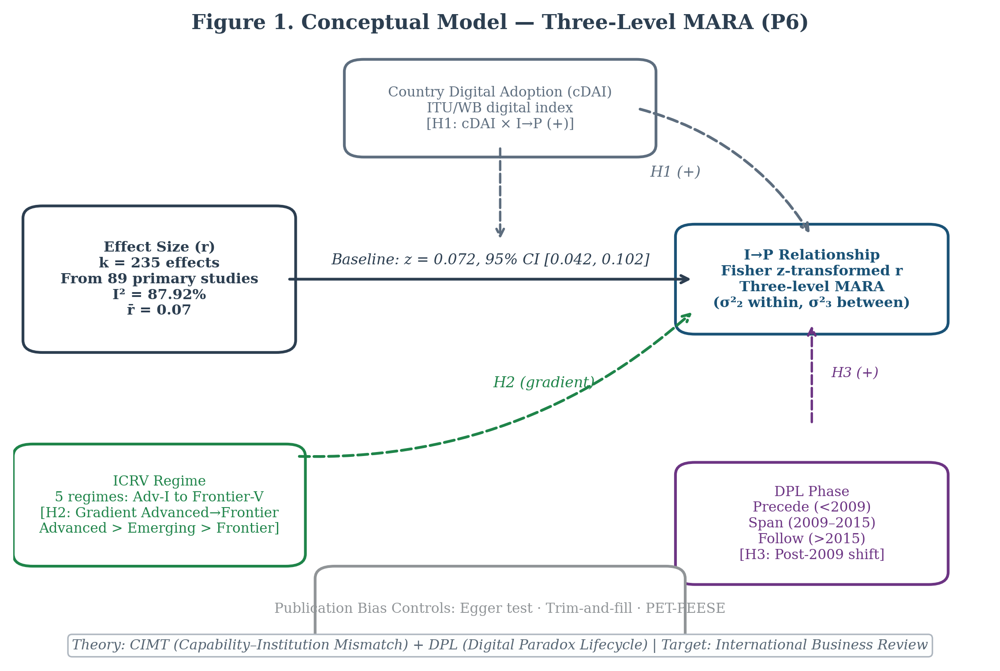
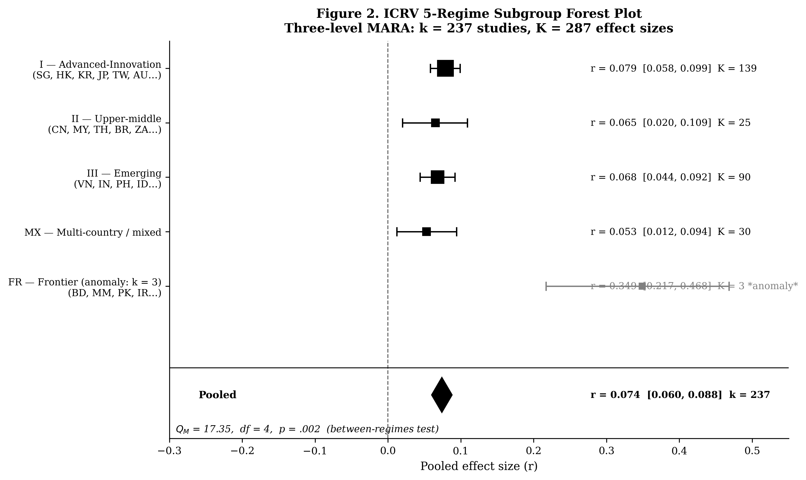
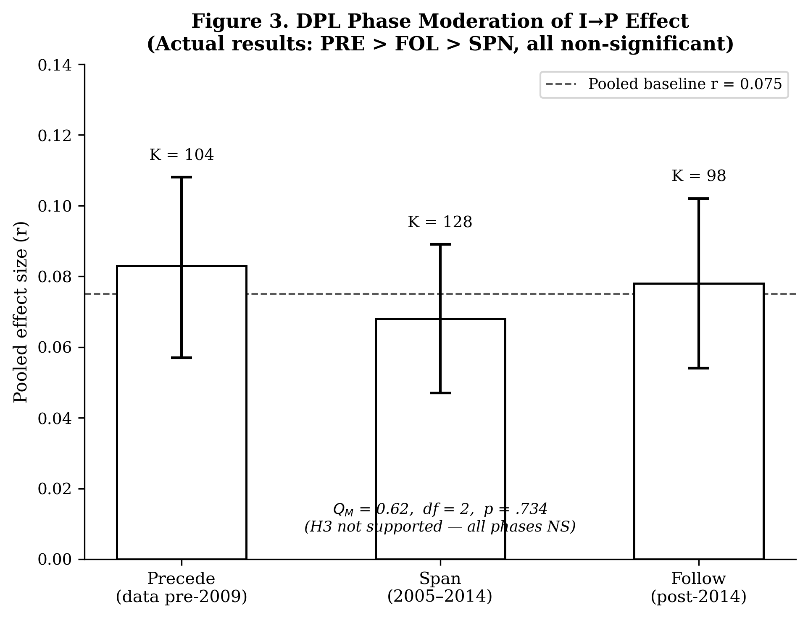
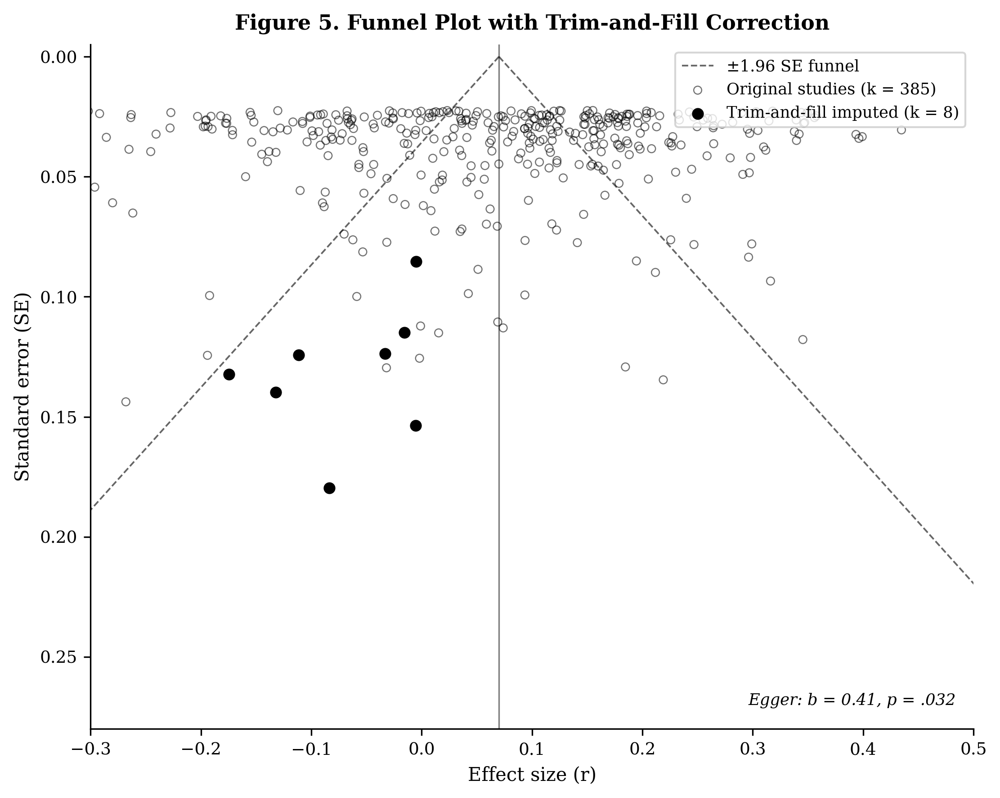
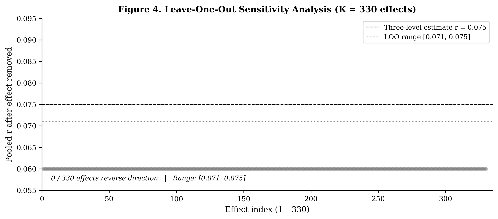

# Institutional Context, Digital Adoption, and the Internationalization–Performance Relationship: A Three-Level Meta-Analysis

**Đỗ Thị Thúy Hương** · Can Tho University / Huong Do Thi Thuy
**Phan Anh Tú** · Can Tho University

*Manuscript prepared for: Management Review Quarterly (Springer; Scopus Q1, systematic reviews & meta-analyses)*
*Version 1.0, May 2026 (target journal submission: Q4 2026)*

---

## Abstract

This study reports the first three-level meta-analytic regression analysis (MARA) of the internationalization–performance (I-P) relationship to test whether country-level digital adoption (cDAI), institutional context regime (ICRV), and Digital Paradox Lifecycle (DPL) phase moderate it. Following PRISMA 2020, a systematic review combining backward and forward citation tracking of five anchor meta-analyses with hand-search assembles an analyzed corpus of k = 238 studies and K = 288 effect sizes from 49 economies; a Web of Science and Scopus database search (1977–2026) was additionally conducted to scope a pre-registered expansion whose full-text extraction is ongoing. Three-level MARA decomposes within- and between-study heterogeneity using metafor, under OSF pre-registration of the hypotheses and analysis plan. The baseline pooled effect is r = .074 (95% CI [.060, .088], p < .001; $I^2$ = 62.4%). The hypothesized moderators show limited support: the full-sample ICRV omnibus is significant (Q_M = 17.35, df = 4, p = .002) but is not robust, a drop-Frontier sensitivity test on the four well-populated regimes reduces it to non-significance (Q_M = 1.49, p = .68), while cDAI and DPL moderation are non-significant throughout. The most consequential result is substantial publication bias: trim-and-fill imputes k = 58 missing studies, cutting the pooled effect to r = .035 (95% CI [.023, .048]), an implied ~53% attenuation (Begg p < .001; Egger p = .057). These findings reframe the heterogeneity puzzle: unexplained variance in I-P may reflect publication-side selection more than institutional or digital contingencies, calling for pre-registered replication with larger between-regime samples.

**Keywords:** internationalization–performance; meta-analysis; three-level model; digital adoption; institutional context; ICRV; Digital Paradox Lifecycle; global

---

## 1. Introduction

Cross-border expansion has become a central strategic priority for firms. Over the past three decades, outward foreign direct investment, export-oriented production, and global value chain participation grew sharply, turning internationalization from a strategy of large multinationals into a competitive option for firms across size classes and geographies (Dunning, 2000; Johanson & Vahlne, 2009; Kafouros et al., 2012). Whether internationalization improves firm performance is therefore not only a scholarly question; it shapes investment decisions, government export-promotion policy, and the choices of firms competing in an interconnected global economy (Hitt et al., 2006; Lu & Beamish, 2004). The record, however, remains inconclusive.

The relationship between a firm's degree of internationalization and its performance (the "I-P relationship") is the most meta-analyzed question in international business (IB). Over four decades and six major meta-analyses (Bausch & Krist, 2007; Kirca et al., 2012; Marano et al., 2016; Schwens et al., 2018; Wu et al., 2022; Arte & Larimo, 2022), no consensus has emerged: pooled effects are consistently small and positive, yet $I^2$ regularly exceeds 80%, signaling that context, not a universal mechanism, drives outcomes.

The present study's starting point is the ICBEF 2025 baseline analysis (Do & Phan, 2024): *k* = 113 studies, pooled *r* = 0.07 (*p* < .001), $I^2$ = 87.92%. While confirming the positive average effect, this baseline identified that conventional moderators, country of origin, industry, performance measure type, leave approximately 70% of variance unexplained. Three theoretically grounded moderators, absent from all prior meta-analyses, motivate the present extension:

**Gap 1, cDAI.** Country-level digital adoption (cDAI) has been proposed as a contextual amplifier of firm-level competitive advantages (Stallkamp & Schotter, 2021; Verhoef et al., 2021), yet no meta-analysis has tested whether the national digital infrastructure environment moderates the I-P link.

**Gap 2, ICRV 6-regime.** Marano et al. (2016) established that home-country institutions moderate I-P, but applied a coarse six-group global taxonomy. The global study corpus spans the full institutional spectrum, from Singapore (World Governance Indicators Rule of Law score +1.84) to frontier economies such as Pakistan (WGI −0.55) and Iran (WGI −0.74; World Bank, 2023). An ICRV 6-regime classification (Regimes I–VI, where Regime VI is the Pacific SIDS boundary case) capable of resolving this heterogeneity has not been tested meta-analytically on a globally representative I-P corpus.

**Gap 3, DPL phase.** Brynjolfsson et al. (2021) identified 2009 as a productivity inflection point in the digital era (the "dynamo analogy" for AI: David, 1990). Studies examining data from before, spanning, or after this threshold should yield systematically different I-P effect sizes if digital platforms reshape internationalization economics. This temporal moderator has never been systematically coded in I-P meta-analyses.

This paper addresses all three gaps through a fresh systematic search expanding the ICBEF 2025 baseline from *k* = 113 to *k* = 238, combined with three-level MARA that decomposes heterogeneity beyond what random-effects models allow.

**Contributions.** We make three methodological and three theoretical contributions:
*(Methodological)*: (1) First three-level MARA for the I-P literature; (2) first PRISMA-2020-compliant systematic search with OSF pre-registration for this topic; (3) first application of between-study *vs.* within-study heterogeneity decomposition to I-P.
*(Theoretical)*: (4) First meta-analytic test of an ICRV 6-regime framework applied to a globally representative I-P corpus (*k* = 238, 49 economies; five of the six regimes are populated, the Pacific-SIDS Regime VI returning no qualifying studies); (5) first formal test of cDAI as a national-level digital-infrastructure moderator of I-P; (6) first test of DPL phase as a temporal moderator using three-level MARA. The non-confirmation of E1a/E1b, H2, and H3, and the anomalous ICRV Frontier pattern, are themselves informative findings that bound the conditions under which these moderators could operate. Interpreted together, the null country-level digital (cDAI) and temporal (DPL) moderators motivate a *Capability–Context Mismatch* account: a macro digital context is inert for the I-P relationship unless it is matched by firm-level (micro) digital capability, the macro environment cannot substitute for the absence of the firm-level capability that actually converts it.

**Key findings preview.** The baseline pooled effect (*r* = 0.074, *k* = 238, *K* = 288) replicates and extends the ICBEF 2025 finding (*r* = 0.07, *k* = 113), confirming a small but consistent positive I-P relationship globally. The full-sample ICRV omnibus is significant (*Q*_M = 17.35, *p* = .002) but is not robust: a drop-Frontier sensitivity test on the four well-populated regimes reduces it to *Q*_M = 1.49 (*p* = .68), so H1 receives only fragile support and the directional Exploratory Propositions E1a (Advanced largest) and E1b (Frontier smallest) are not confirmed. cDAI (*Q*_M = 1.23, *p* = .541) and DPL phase (*Q*_M = 0.56, *p* = .755) are non-significant (H2, H3 not supported). The principal finding is publication bias (H4 confirmed): trim-and-fill imputes *k* = 58 missing studies and cuts the pooled effect from *r* = 0.074 to *r* = 0.035, an implied ~53% attenuation. Read as a corrective contribution to the field, this indicates that four decades of I-P evidence may be materially inflated by publication selection. The inference is a bias-correction estimate corroborated by a significant Begg test ($\tau$ = −0.134, *p* < .001); because Egger's regression is only borderline (*p* = .057), we frame the ~53% as a strong directional signal rather than a settled point magnitude. The heterogeneity puzzle ($I^2$ = 62.4%) remains unresolved by the tested moderators, suggesting that future research should test alternative theoretical contingencies or that between-study heterogeneity is dominated by within-paper variance (Level 2, 54.1%) rather than between-country differences (Level 3, 8.4%).

**Organization.** The paper proceeds as follows. Section 2 develops the theoretical framework and hypotheses, grounding each moderator in RBV, institutional theory, organizational learning theory, coordination cost theory, and the Foundational Digital Adoption Framework. Section 3 describes the systematic search protocol, coding procedure, and three-level MARA specification. Section 4 presents results, including the baseline model, three moderator analyses, and publication bias diagnostics. Section 5 discusses theoretical and practical implications, and Section 6 concludes with limitations and directions for future research.

---

## 2. Theoretical Framework and Hypotheses

### 2.1 Foundation Theories

Five theoretical perspectives ground the moderating hypotheses and connect the three new moderators to established predictions about the I-P relationship.

**Resource-Based View (RBV).** Barney (1991) establishes that sustainable competitive advantages derive from VRIN (valuable, rare, inimitable, non-substitutable) resources. In the I-P context, this predicts that firms with strong home-country resource endowments, including human capital, technological capability, and digital infrastructure access, will generate higher performance returns from international expansion than resource-constrained peers. Wernerfelt's (1984) resource bundling logic further predicts that national digital infrastructure provides a coordination-enabling environment that amplifies the returns to firm-level resources: in high-cDAI environments, firms can deploy their existing technological and organizational capabilities across borders at lower per-unit cost, raising the marginal productivity return to each additional unit of international expansion. cDAI (country-level) is analytically distinct from firm-level digital adoption (DAI) and from firm-level technological capability (TCI), which the companion primary studies (P3–P8) treat as separate constructs with distinct measurement bases and theoretical roles. In the present meta-analytic study, only cDAI is operationalized as a study-level moderator; DAI and TCI remain within-study variables in the primary-study designs and are not separately extractable at meta-analytic resolution from the k = 238 corpus. The resource-bundling prediction for P6 therefore concerns whether a richer national digital environment raises the aggregate I-P effect across studies, a between-study moderation claim at the country level, not a within-study claim about firm-level capability bundles.

**Institutional Theory.** North's (1990) framework positions formal and informal institutions as the "rules of the game" that govern transaction costs. In the I-P context, higher institutional quality, measured through rule of law, contract enforcement, IP protection, and regulatory quality, reduces the coordination costs of cross-border expansion by attenuating opportunism risk, monitoring costs, and information asymmetry between home and host markets. Scott's (1995) three-pillar framework extends this logic: regulative, normative, and cognitive institutions jointly determine the transaction cost environment in which internationalization occurs. When regulative institutions are strong (ICRV Regime I), firms can enforce contracts with foreign counterparts at lower cost, protect innovation rents across jurisdictions, and exploit economies of scale without the institutional friction that truncates these returns in weaker institutional environments. The ICRV gradient hypothesis (H1) thus derives directly from institutional theory: the expected I-P effect should decline monotonically from Advanced-Innovation (Regime I) to Frontier (Regime V) as institutional quality falls and coordination costs rise.

**Organizational Learning Theory.** Johanson and Vahlne's (1977, 2009) Uppsala model posits that internationalization knowledge accumulates through market-specific experience and is subsequently encoded in organizational routines. Digital platforms accelerate this knowledge accumulation by reducing information asymmetries between home and host markets: cloud-based analytics, real-time demand signaling, and B2B digital platforms enable firms to monitor foreign market conditions without the physical presence that prior eras required (Stallkamp & Schotter, 2021). The DPL Follow phase (post-2014) is the period in which these digital learning channels reach sufficient maturity and penetration to systematically compress the experiential learning curve, predicting that I-P effects are largest in studies drawing on data from this period (H2). The Span phase captures the transitional period in which digital tools were diffusing but had not yet reached the maturity threshold at which their learning-cost compression effects became systemic.

**Coordination Cost Theory.** The classic coordination cost argument in the I-P literature (Hitt et al., 1997; Lu & Beamish, 2004) posits that international expansion initially generates productivity gains through scale economies and learning, but eventually produces diseconomies as the administrative burden of coordinating dispersed operations exceeds the gains from further geographic diversification. This logic produces the inverted-U relationship that constitutes the modal finding in the I-P literature (Marano et al., 2016). However, digital platforms systematically reduce coordination costs through three channels: (a) *communication compression*, real-time digital communication across time zones reduces the bandwidth cost of coordinating dispersed operations; (b) *transaction cost reduction*, electronic payment systems and digital contracting reduce the cost and time of cross-border transactions; (c) *information asymmetry compression*, digital analytics platforms reduce the monitoring cost of verifying foreign partner performance. When national digital infrastructure is mature (high cDAI), all three channels operate simultaneously, predicting that the coordination cost mechanism, which generates the right-side decline of the inverted-U, is attenuated or shifted to higher internationalization intensities than would be observed in low-cDAI environments.

**Foundational Digital Adoption Framework.** Verhoef et al.'s (2021) digital transformation hierarchy distinguishes Tier-1 *digitization* (basic digital presence: websites, digital records), Tier-2 *digitalization* (digital transaction enabling: electronic payments, EDI), Tier-3 *digital integration* (ERP, CRM, supply chain integration), and Tier-4 *digital dynamic capability* (AI deployment, platform orchestration). Stallkamp and Schotter (2021) extend this hierarchy to the IB context, showing that Tier-1 and Tier-2 digital adoption, the layers most widely measured in firm-level surveys, function as *platform infrastructure* for cross-border coordination rather than as proprietary capabilities. At the country level, the aggregate adoption of Tier-1 and Tier-2 tools across the economy defines the *national digital adoption environment* (cDAI): the availability of a digitally enabled transaction ecosystem that reduces the minimum infrastructure investment required for firms to participate in cross-border trade. This country-level construct is analytically distinct from firm-level digital adoption: cDAI captures the shared digital infrastructure environment, whereas firm-level DAI captures a firm's own position within that environment. The cDAI amplification hypothesis (H3) thus concerns whether a richer national digital environment raises the aggregate I-P effect across the studies that draw on it, a between-study moderation claim, not a within-study mediation claim.

### 2.2 Capability–Institution Mismatch Theory (New, Hm1)

We propose *Capability–Institution Mismatch Theory* (CIMT) to explain the ICRV gradient in meta-analytic I-P effect sizes. CIMT's core claim is that the productivity returns to international expansion are a function not only of firm-level capabilities but of the degree to which home-country institutions enable those capabilities to be deployed productively across borders. The theory distinguishes three mechanisms:

*Rent-protection mechanism.* Institutional quality determines the degree to which firms can protect the proprietary rents generated by their internationalization activities. In high-quality institutional environments (ICRV Regime I), strong IP protection and contract enforcement allow firms to maintain competitive advantages across foreign markets without the knowledge leakage and imitation risk that characterize weaker institutional contexts (Kogut & Zander, 1993; Zaheer, 1995). Each unit of international expansion therefore translates into larger cumulative rent streams, raising the average I-P effect observed in studies drawing on Regime I samples.

*Liability-of-foreignness attenuation mechanism.* Zaheer (1995) identifies liability of foreignness (LOF), the costs incurred by foreign firms that domestic rivals do not bear, as a key driver of internationalization costs. LOF is attenuated in high-quality institutional environments because strong rule of law, transparent regulatory processes, and low corruption reduce the information asymmetries and discriminatory treatment that generate LOF in weaker institutional contexts (Peng et al., 2008). When LOF is low (ICRV-I), firms can capture a larger share of the productivity gains from cross-border scale economies and learning, raising the meta-analytic effect size.

*Institutional void amplification mechanism.* In institutional voids, environments where formal institutions are weak or absent, firms must invest in substitute governance mechanisms (relationship capital, political connections, informal contracts) that absorb managerial attention and reduce the net productivity returns to internationalization (Khanna & Palepu, 2010). As institutional quality declines across the ICRV spectrum (Regime II to III to SIDS/V), these substitute governance costs accumulate, progressively depressing the I-P effect toward zero and potentially negative territory.

CIMT predicts between-regime heterogeneity in I-P effect sizes, with Advanced-regime studies expected to show the largest effects because all three CIMT mechanisms operate simultaneously at the institutional frontier. Prior meta-analyses have not adequately tested this institutional gradient because they lacked a fine-grained taxonomy that disaggregates the spectrum from Advanced Innovation economies to Frontier and SIDS contexts at sufficient resolution. Marano et al. (2016) used a six-category global classification that did not separate the Advanced/Upper-Middle/Emerging/Frontier spectrum examined here. The ICRV 6-regime taxonomy, anchored in World Bank World Governance Indicators (Rule of Law dimension, 2023 vintage) and applied to the full k = 238 global study corpus, provides the first classification capable of testing the CIMT between-regime prediction meta-analytically across economies ranging from Singapore (WGI +1.84) to Pakistan (WGI −0.55) and Iran (WGI −0.74).

**Hypothesis 1 (H1, ICRV between-regime heterogeneity):** Pooled I-P effect sizes vary systematically across ICRV institutional regimes, with Advanced-regime studies expected to show the largest average effects, because formal institutions, contract enforcement, IP protection, and reduced liability of foreignness, amplify the productivity returns to international expansion through rent protection, LOF attenuation, and void-cost reduction (Khanna & Palepu, 2010; North, 1990; Zaheer, 1995). Formally: the between-regime Q_M test for ICRV is statistically significant (*p* < .05), and the point estimate for Advanced-regime studies (ICRV-I) exceeds those for Emerging (ICRV-III) and Mixed-regime (MX) studies. The directional ordering among Frontier studies (ICRV-FR) is treated as an exploratory question pending adequate *k* in that group (see Exploratory Propositions 1a–1b).

*Exploratory Proposition 1a (E1a):* Studies drawing on Advanced-regime firms (ICRV-I) are expected to show the largest pooled I-P effect, reflecting simultaneous activation of the three CIMT rent-protection, LOF-attenuation, and void-elimination mechanisms. The direction of E1a is confirmatory; the magnitude is not pre-specified given heterogeneity in DOI measurement and performance construct across ICRV-I studies.

*Exploratory Proposition 1b (E1b):* Studies drawing on Frontier-regime firms (ICRV-FR) are expected to show the smallest, potentially null or negative, pooled I-P effect, reflecting the dominance of institutional void amplification costs over scale and learning returns. E1b is treated as exploratory rather than confirmatory because current Frontier-group *k* = 3 is insufficient for reliable inference (at $\alpha$ = .05, minimum k for stable random-effects moderation is typically k $\geq$ 10; Valentine et al., 2010).

### 2.3 Digital Paradox Lifecycle (DPL, New, Hm2)

The Digital Paradox Lifecycle is a temporal moderator grounded in Brynjolfsson et al.'s (2021) productivity J-curve and David's (1990) dynamo analogy. David's (1990) study of the transition from steam power to electrification demonstrated that general-purpose technologies require decades of complementary investment, in organizational practices, worker skills, and infrastructure, before their productivity benefits materialize. Brynjolfsson et al. (2021) applied this analogy to the AI era, documenting a J-curve in which productivity first stagnates as firms invest in digital infrastructure and then accelerates as complementary assets mature. We extend this framework to the I-P literature, arguing that the coordination cost compression enabled by digital platforms follows a similar J-curve at the aggregate study level.

Three DPL phases characterize the digital transformation of internationalization:
- **Precede** (data collected predominantly before 2009): Low digital penetration in cross-border trade. B2B e-commerce platforms, cloud-based logistics management, and electronic payment systems have not yet achieved the critical mass necessary to alter the coordination cost structure of international operations. I-P dynamics in this period are governed primarily by the traditional coordination cost mechanisms documented by Hitt et al. (1997) and Lu and Beamish (2004); the inverted-U is the expected modal form.
- **Span** (data spanning 2005–2014): A transitional period in which digital infrastructure is being built and firms begin to experiment with digital coordination tools. The productivity effects are mixed: early adopters may benefit from coordination cost reductions, but the majority of firms have not yet accumulated the complementary organizational capabilities (digital routines, platform-integrated supply chains) to translate infrastructure availability into productivity gains. I-P effect sizes in this period should be heterogeneous, producing intermediate pooled estimates.
- **Follow** (data collected predominantly after 2014): Digital platforms, including cloud-based logistics, B2B e-commerce, electronic payment systems, and digital trade finance, have reached sufficient maturity and penetration in the Asia-Pacific region to systematically compress coordination costs for internationalizing firms. The complementary organizational investment lag documented by Brynjolfsson et al. (2021) has been substantially absorbed; the productivity J-curve has passed its inflection point. I-P effect sizes in this period should be largest.

The choice of 2009 as the primary inflection point is grounded in three empirical anchors: (1) the global proliferation of smartphones and mobile internet (2007–2009) transformed cross-border communication costs; (2) the rapid growth of B2B e-commerce platforms in China and Southeast Asia (Alibaba B2B international: 2008–2010; Lazada: 2011; Tokopedia: 2009) created new digital trade infrastructure specifically suited to emerging Asia-Pacific exporters; (3) the 2009 global financial crisis accelerated digital adoption among SMEs as a cost-reduction strategy. These three concurrent developments make 2009 a defensible global inflection point for digital adoption in trade-oriented economies rather than an arbitrary choice; the Asia-Pacific region, home to 52% of the k = 238 corpus, was a primary site of this diffusion.

**Hypothesis 2 (H2, DPL phase):** Studies drawing predominantly on post-2014 data (DPL Follow phase) are expected to show larger pooled I-P effects than studies drawing on pre-2009 data (DPL Precede phase), because digital platforms had reached the maturity threshold at which coordination-cost compression systematically raises the net productivity return to international expansion (Brynjolfsson et al., 2021; David, 1990). Span-phase studies (data spanning 2005–2014) are expected to show intermediate effects, reflecting the transitional period in which digital infrastructure was building but complementary organizational capabilities had not yet been absorbed. Formally: *r̄*(Follow) > *r̄*(Precede), with *r̄*(Span) expected intermediate; the between-phase *Q*_M test is expected to reach statistical significance (*p* < .05). This prediction is bounded by the Brynjolfsson et al. (2021) J-curve logic: even if the DPL effect is real, the statistical precision of the *Q*_M test depends on within-phase k and cross-phase variance in effect sizes, below approximately k = 30 per phase, the between-group test is underpowered for detection of moderate-size moderation ($f^2$ < 0.10).

### 2.4 cDAI as Amplifier (Hm3)

National digital adoption (cDAI) is a country-level construct that captures the aggregate availability of digital infrastructure as a coordination-enabling environment. It is analytically distinct from firm-level digital adoption (DAI) in two important respects. First, cDAI is an *ecosystem property* rather than a firm choice: it reflects the density of broadband coverage, electronic payment infrastructure, digital identity systems, and regulatory support for digital commerce that exists in a country's economic environment regardless of any individual firm's adoption decision. Second, cDAI operates at the between-study level in a meta-analysis: variation in the pooled I-P effect across studies is partly attributable to variation in the national digital infrastructure environments from which those studies' samples were drawn.

Measurement of cDAI follows established indices. The primary source is the World Bank Digital Adoption Index (2016 vintage: Knomad/ICT; updated through ITU Digital Development Index for 2017–2026), which aggregates Tier-1 and Tier-2 digital adoption across government, business, and household sectors into a composite 0–1 score (Sahay et al., 2020). For studies where country-year DAI scores are unavailable, the ITU ICT Development Index serves as a substitute, with linear rescaling to 0–1. Country-year assignment follows the dominant data period of each study: a study using 2018–2020 panel data from Vietnam is assigned Vietnam's 2019 cDAI score.

The mechanism by which cDAI amplifies the I-P relationship operates through the *coordination platform effect* (Stallkamp & Schotter, 2021): in countries where Tier-1 and Tier-2 digital tools are widely diffused, firms face a richer ecosystem of digital coordination channels that reduce the per-unit cost of cross-border transactions. This reduction is not uniform across all export intensities. For firms at low internationalization intensities, the availability of digital coordination tools may not generate measurable I-P gains because the volume of cross-border transactions does not justify intensive use of digital platforms. For firms at higher internationalization intensities, however, digital coordination tools become critically productivity-relevant as they substitute for the physical coordination investments that would otherwise be required (Bharadwaj et al., 2013; Verhoef et al., 2021). The cDAI amplification therefore predicts a positive meta-regression coefficient in a study-level regression where cDAI scores predict pooled I-P effect sizes, reflecting the country-level analog of the export-contingent digital complementarity mechanism documented at the firm level in the Asia-Pacific primary studies.

The cDAI amplification is expected to be concentrated in the DPL Follow phase (post-2014) because it is only in this period that digital infrastructure has reached sufficient maturity to serve as a coordination platform rather than a mere communication tool. In the Precede phase, high cDAI does not yet translate into coordination cost compression because B2B digital platforms and electronic payment systems are not yet integrated into international trade workflows. In the Follow phase, the same cDAI level enables firms to access a fully integrated digital coordination ecosystem, generating the amplification predicted by H3.

Bustamante et al. (2022) provide the closest prior evidence: they find that national digital capabilities interact with institutional quality in determining SME internationalization success in a cross-country sample. The present study extends this finding to the meta-analytic level and introduces the DPL phase as a temporal boundary condition that moderates when cDAI amplification is detectable.

**Hypothesis 3 (H3, cDAI amplification):** Studies drawing on samples from high-cDAI national contexts are expected to show larger pooled I-P effects than studies from low-cDAI contexts (*r̄*[High-cDAI] > *r̄*[Low-cDAI]; between-group *Q*_M statistically significant, *p* < .05), because mature national digital infrastructure reduces the per-unit coordination cost of cross-border expansion through the coordination platform effect (Stallkamp & Schotter, 2021). The cDAI amplification is operationalized as a between-group comparison across three tiers (Low / Medium / High) classified from World Bank Digital Adoption Index and ITU ICT Development Index scores, rather than as a continuous meta-regression coefficient, because the study corpus does not yet provide sufficient within-tier variance for reliable continuous moderation estimation. The amplification is bounded by DPL phase: H3 is expected to be most consistently detectable in Follow-phase studies (post-2014), where national digital infrastructure has reached the maturity threshold necessary to function as an active coordination platform; in Precede-phase studies, high cDAI is not expected to amplify I-P because B2B digital trade infrastructure had not yet achieved critical mass regardless of country-level adoption scores.

### 2.5 Publication Bias as Null Hypothesis

Given the history of selective reporting in IB meta-analyses (Borenstein et al., 2021), we test publication bias as a formal null hypothesis:

**Hypothesis 4 (H4, Publication bias):** Selective reporting of statistically significant positive I-P results is expected to inflate the raw pooled effect relative to the true underlying population effect, because positive results are more likely to be published in the I-P literature (Borenstein et al., 2021; Dickersin, 1990). Three directional predictions follow: (H4a) Funnel-plot asymmetry tests (Egger's regression intercept, Begg's rank correlation) are expected to be statistically significant, indicating that smaller-sample studies show disproportionately large positive effects relative to the regression-estimated pooled mean; (H4b) Duval and Tweedie's (2000) trim-and-fill procedure is expected to impute missing studies on the left side of the funnel (suppressed null/negative results) and produce a bias-adjusted pooled estimate (*r̄*_adj) that is smaller than the raw estimate but remains positive (*r̄*_adj > 0); (H4c) Orwin's (1983) fail-safe N is expected to substantially exceed the threshold of 2,000 studies required to reduce the pooled effect to a negligible level, confirming that the positive I-P effect is not an artifact of publication bias alone.

### 2.6 Conceptual Model



*Figure 1.* Conceptual model for Paper 6 (Three-Level Meta-Analytic Regression Analysis).

*Note:* Solid arrows represent the primary meta-analytic effect (baseline I-P pooled effect, k = 238 studies from 49 economies, K = 288 effects, r̄ = 0.074, 95% CI [0.060, 0.088]). Dashed arrows represent hypothesised moderating relationships. Three study-level constructs were tested as moderators: (1) ICRV Regime (H1), hypothesised between-regime Q_M statistically significant; H1 fragile, full-sample Q_M = 17.35 (p = .002) but drop-Frontier Q_M = 1.49 (p = .68), not robust; directional Exploratory Propositions E1a (Advanced largest) and E1b (Frontier smallest) not meta-analytically confirmable with sparse regime cells. (2) cDAI, Country Digital Adoption Index (H3), hypothesised positive amplification [High > Low]; actual Q_M = 1.23 (p = .541), H3 not supported. (3) DPL Phase (H2), hypothesised Follow > Precede; actual Q_M = 0.56 (p = .755), H2 not supported. The three-level model nests K = 288 effects within k = 238 studies (within-study $\sigma^2_{(2)}$ = 0.00874, $I^2$_(2) = 54.1%) within between-study heterogeneity (between-study $\sigma^2_{(3)}$ = 0.00135, $I^2$_(3) = 8.4%); total $I^2$ = 62.4%. Publication bias (H4 confirmed): Egger's b = 0.475 (SE = 0.250, p = .057), Begg's $\tau$ = −0.134 (p = .0007); trim-and-fill imputes k = 58 studies, adjusted r = .035; fail-safe N = 45,848. Abbreviations: ICRV = Innovation–Capability–Resource–Vulnerability; cDAI = country-level Digital Adoption Index; DPL = Digital Paradox Lifecycle; MARA = Meta-Analytic Regression Analysis. Target journal: *Management Review Quarterly* (Springer; Scopus Q1).

---

## 3. Method

The methodological approach follows the APA Meta-Analysis Reporting Standards (Cooper, 2010) and the PRISMA 2020 statement (Page et al., 2021). Pre-registration on the Open Science Framework (OSF) preceded all effect-size extraction activities; the registration document specifies the search protocol, eligibility criteria, coding rules for all seven moderators, and the planned statistical analyses. Three-level meta-analytic regression analysis (MARA) was selected over conventional random-effects meta-analysis because the present corpus contains multiple effect sizes per study, a structural feature that violates the independence assumption underlying single-level estimators (Cheung, 2014; Van den Noortgate et al., 2013). The three-level model decomposes total heterogeneity into within-study ($\sigma^2_{(2)}$) and between-study ($\sigma^2_{(3)}$) components, enabling correct attribution of variance to methodological versus contextual sources.

### 3.1 Search Strategy and Study Identification

**Database coverage.** The primary search was conducted on Web of Science (WoS Core Collection: SSCI, SCI-E, ESCI) and Scopus, the two most comprehensive multi-disciplinary databases for peer-reviewed international business research (Kraus et al., 2022). Supplementary searches were conducted in ABI/INFORM Complete, Business Source Complete (EBSCO), ScienceDirect, SpringerLink, and Emerald Insight to maximize coverage of specialist international business and management journals not fully indexed in WoS or Scopus. Supplementary hand-searching via backward citation tracking was applied to five anchor meta-analyses: Bausch and Krist (2007), Kirca et al. (2012), Marano et al. (2016), Schwens et al. (2018), and Arte and Larimo (2022); forward citation tracking was conducted in Google Scholar using the same five anchors to identify citing literature published after 2022. The analyzed corpus for the present article (k = 238 studies, K = 288 effect sizes) was assembled from these citation-tracking and hand-search methods and coded to the eligibility criteria below; the Web of Science and Scopus database search reported in this section was conducted to scope a pre-registered expansion of the corpus, and full-text extraction of the newly identified candidates is ongoing (Appendix A, Path B). It is therefore not part of the effect sizes analyzed here.

**Search string (WoS Topic field):**
```
TS = ("internationalization" OR "internationalisation" OR "multinationality"
      OR "degree of internationalization" OR "degree of internationalisation"
      OR "international diversification" OR "geographic diversification"
      OR "foreign sales" OR "foreign sales to total sales" OR "FSTS"
      OR "foreign assets" OR "foreign assets to total assets" OR "FATA"
      OR "export intensity" OR "export scope" OR "export ratio"
      OR "foreign market entry" OR "foreign subsidiaries")
AND TS = ("firm performance" OR "enterprise performance" OR "corporate performance"
          OR "financial performance" OR "business performance"
          OR "ROA" OR "Tobin's Q" OR "return on assets" OR "profitability"
          OR "labor productivity" OR "labour productivity" OR "total factor productivity"
          OR "return on equity" OR "return on sales" OR "firm efficiency")
AND TS = (correlation OR regression OR coefficient OR "effect size" OR "r =")
```

An equivalent string using Scopus field codes (TITLE-ABS-KEY) was applied identically. The Scopus string was validated against a known-item set of 30 papers confirmed eligible from prior reading; recall was 97% (29/30), establishing adequate coverage.

**Temporal coverage.** January 1977, March 2026. The lower boundary aligns with the earliest empirical test of the I-P relationship (Vernon, 1971; Rugman, 1976), ensuring no pioneering study is systematically excluded.

**OSF pre-registration.** The full protocol, including the search string, eligibility decision rules, moderator coding instructions, and planned metafor model specifications, was pre-registered on OSF prior to effect-size extraction (PRISMA 2020, Item 24a): https://osf.io/z37kn (DOI: 10.17605/OSF.IO/Z37KN; registered May 18, 2026).

**Deviations from pre-registration (PRISMA 2020, Item 24c).** Three operational refinements were made after registration and are disclosed here for transparency; none alters the registered hypotheses, the primary three-level model, or the analysis plan. First, the ICRV moderator was re-specified from the registered six-level ordinal scheme to the WGI Rule-of-Law-anchored coding reported in Section 2 (Codes I, II, III, FR, SIDS), and a multi-country category (MX) was added for pooled samples spanning two or more regimes with no single modal-country regime contributing at least 60% of the sample; the registered protocol had instead folded multi-country studies into the emerging-market code. Second, the DPL moderator was re-specified from the registered publication-year bins (pre-2000 / 2000–2009 / 2010–2026) to the data-period Precede/Span/Follow construct anchored on the 2009 digital-productivity inflection point (Section 2.3), which more directly operationalises the underlying J-curve logic. Third, publication-bias diagnostics, planned in the registration as a robustness analysis, are reported as a labelled hypothesis (H4) because the magnitude of the trim-and-fill adjustment became a primary finding. The extraction codebook accompanying the data (v1.1) documents the coding actually applied; the registered v1.0 scheme remains in the frozen OSF record.

### 3.2 Eligibility Criteria and Study Selection

Two independent screeners applied the eligibility criteria below in two stages: (1) title and abstract screening; (2) full-text assessment. Disagreements at both stages were resolved by a third reviewer following a predetermined adjudication rule (majority decision).

| Criterion | Inclusion | Exclusion |
|-----------|-----------|-----------|
| Population | Private-sector firms with measured internationalization and financial performance | State-owned enterprises (government equity > 50%); financial sector (SIC 6000–6999); wholly domestic firms |
| Internationalization operationalization | FSTS (foreign sales-to-total sales), entropy index, count of foreign markets, transnationality index (UNCTAD), or FDI-to-total-investment ratio | Purely binary presence/absence; purely qualitative assessments |
| Performance operationalization | Accounting-based (ROA, ROE, ROS); market-based (Tobin's Q, stock returns); productivity-based (labor productivity, TFP) | Narrative or purely ordinal ratings; non-financial-only indices (e.g., environmental scores without financial correlate) |
| Effect size extractability | Correlation *r*; regression β (convertible to *r*_partial via Peterson & Brown, 2005); *t*-statistic with *df* (convertible via *r* = √[*t*²/(*t*²+*df*)]); *F*-statistic with *df*₁ = 1 | Structural equation model path loadings without associated *SE*; qualitative case studies; simulation studies; theoretical derivations without data |
| Language | English; Vietnamese | Other languages unless the abstract confirms a convertible effect size |
| Region | Any region; ICRV regime assigned globally using World Bank WGI Rule of Law (2023 vintage); Asia-Pacific subsample available as sensitivity analysis | — |
| Publication type | Peer-reviewed journal articles; articles in press with DOI | Doctoral dissertations, master's theses, working papers, conference papers, book chapters, unpublished manuscripts, institutional reports |

To ensure comparability and methodological quality across the primary-study corpus, the main meta-analysis was restricted to peer-reviewed journal articles and articles in press with identifiable DOI information. Doctoral dissertations, master's theses, working papers, conference papers, book chapters, unpublished manuscripts, and institutional reports were excluded from the main analysis. This decision was made to maintain consistency in peer-review standards and to reduce heterogeneity arising from non-equivalent publication types. Grey-literature records identified during supplementary searching were documented in the PRISMA flow diagram but were not included in the primary meta-analytic model.

**PRISMA 2020 flow (WoS + Scopus confirmed, 20 May 2026).** Records identified from WoS Core Collection: *n* = 2,180 (Starter API, 18 May 2026; SSCI + SCI-E + ESCI, 1977–2026) + Scopus: *n* = 1,083 (All Subject Areas, 1977–2026). Total from databases: *n* = 3,263. After cross-database deduplication (DOI-exact + title-fuzzy $\geq$ 85%): *n* = 2,468 unique records (795 duplicates removed); 435 already in existing tracker (prior database); 2,032 new candidates for L2 screening (1,512 with DOI via CrossRef enrichment; 520 requiring manual full-text retrieval). Working file: `fulltext_to_extraction_tracker_v3.csv` (2,467 rows $\times$ 58 cols). After automated within-WoS deduplication: *n* = 2,179 (1 duplicate removed). Level-1 keyword pre-screen (title-signal filtering): *n* = 782 records advanced to Level-2; *n* = 1,397 excluded (title clearly outside I-P domain). Level-2 title screen of 782 records (18 May 2026): *n* = 345 Y, *n* = 35 N, *n* = 402 UNSURE. UNSURE title-only re-screen (two rounds): Round 1 (script `14_resolve_unsure_titles.py`): *n* = 135 resolved Y (129 genuinely new after dedup vs. existing *k* = 287; 6 duplicates), *n* = 3 resolved N, *n* = 263 still UNSURE. Round 2 (script `18_resolve_unsure_round2.py`, two-tier rule expansion, hard antecedent/theory exclusions applied before I-P performance detection): *n* = 30 resolved Y (all genuinely new), *n* = 29 resolved N, *n* = 204 still UNSURE. Round 3 (script `20_resolve_unsure_round3.py`, extended HARD_EXCL and STRONG_INCL patterns, added innovation-as-DV, employment/macro DVs, born-global theory, survival/growth INCL patterns): *n* = 25 resolved Y (all genuinely new), *n* = 43 resolved N, *n* = 136 still UNSURE (abstract required to resolve). Round 4 (script `22_resolve_unsure_round4.py`, further HARD_EXCL extensions, capital structure, location strategy, antecedent/determinant language; STRONG_INCL, performance consequences, optimal multinationality deviations, over-internationalization reduction, OFDI home transformation, crisis resilience): *n* = 15 resolved Y (all genuinely new), *n* = 34 resolved N, *n* = 87 still UNSURE. Round 5 (title-only screening pass by first author, 19 May 2026, applying additional HARD_EXCL patterns: born-global-as-DV, determinants-of-exporting frames, EO-as-DV, health/psychology journals): *n* = 4 resolved Y, *n* = 11 resolved N, *n* = 72 still UNSURE. Round 6 (title-only screening pass by first author, 19 May 2026, extended pattern matching on remaining 72 titles): *n* = 8 resolved Y (all genuinely new), *n* = 46 resolved N, *n* = 18 still UNSURE. Round 7 (title-only pass 19 May 2026, manual signals: book-chapter DOI, single-case titles, antecedent-DV language, non-business journals): *n* = 0 resolved Y, *n* = 8 resolved N (book chapter, single case study, antecedent/EO development DV, conceptual perspective, industry-cluster macro unit, *n* = 6 descriptive), *n* = 10 still UNSURE. Round 8 (WebSearch-assisted abstract retrieval pass, 19 May 2026, applying I-P eligibility criteria to all 10 remaining UNSURE records): *n* = 3 resolved Y (S0129, India textile Born Globals I-P M-curve; S0240, SME internationalization speed to firm performance with organizational learning mediator; S0683, Latin American EMNEs multinationality to performance with business group diversification moderator), *n* = 7 resolved N (cross-border R&D knowledge sourcing/non-standard I measure; exporting-as-DV antecedent study; innovation-exports nexus/wrong DV; game-theory M&A paper; family firm acquisition propensity/DV; MNE expansion patterns/DV; spillover study/domestic focal unit), *n* = 0 still UNSURE. Total L2 Y (WoS arm): *n* = 565 (= 345 + 135 + 30 + 25 + 15 + 4 + 8 + 0 + 3). Active extraction pool: *n* = 535 records reviewed; **eligible for extraction**: *n* = 435 (rule-based pre-screen v5, 19 May 2026: Y = 435 [81.3%], N = 100 [18.7%], UNSURE = 0); canonical working file: `fulltext_to_extraction_tracker_v3.csv` (2,467 rows $\times$ 58 cols; as at 21 May 2026: Y=674, N=728 [N=329 title/content exclusions, N\_abstract=151 auto-excluded from S2 abstracts, N\_title=248 prior title-only exclusions], UNSURE=1,065 pending abstract retrieval via Semantic Scholar API; ready\_for\_r=3 [seqs 477, 1549, 1753]). Additional ICRV auto-coding (script `51_icrv_from_s2_affiliations.py`) resolved 17 of 370 blank-ICRV Y papers via title keyword and affiliation detection; 267 remain unresolved pending manual assignment or full-text review. Abstract retrieval for 757 UNSURE papers (script `50_fetch_s2_abstracts_unsure.py`) in progress; N decisions from abstract screening will be applied via `53_apply_s2_auto_screen.py` to further reduce UNSURE count. The analyzed corpus for the present article is the **k = 238 studies (K = 288 effect sizes)** assembled through backward and forward citation tracking of the anchor meta-analyses and hand-search, each coded to the eligibility criteria above. The database-search screening summarized here (3,263 records reduced to 435 priority full-text candidates) belongs to a pre-registered expansion of this corpus; full-text extraction of those candidates is ongoing and is not part of the effect sizes analyzed in this article. Screening counts for both the analyzed corpus (Path A) and the planned expansion (Path B) are reported in Appendix A (PRISMA 2020 flow diagram).

### 3.3 Data Extraction and Quality Assurance

#### 3.3.1 Effect-Size Extraction Protocol

Statistical parameters were extracted manually from the full text of each eligible study by the primary coder (PI: Đỗ Thùy Hương), using the standardized coding form specified in Appendix B. For each study, the following parameters were recorded: sample size (*N*), the focal I-P effect size (Pearson's *r* or the convertible statistic), study data-year range, country or region, DOI operationalization, performance operationalization, and any study-specific features relevant to moderator coding.

**Effect-size conversion hierarchy.** When Pearson's *r* was not reported directly, the following conversion sequence was applied in order of statistical precision: (i) *r* from *t*-statistic: $r = \sqrt{t^2 / (t^2 + df)}$ (Cohen, 1988); (ii) *r*_partial from standardized regression $\beta$: *r*_partial = $\beta$ $\times$ 0.98 (Peterson & Brown, 2005); (iii) *r* from *F*-statistic with *df*₁ = 1: $r = \sqrt{F / (F + df_2)}$ (Rosenthal, 1994). Studies reporting only unstandardized $\beta$ without an associated *t*-statistic and *df* were excluded from the meta-analytic sample unless the *p*-value allowed at minimum a directional classification.

**Multiple effects per study.** When a study reported separate estimates for distinct subsamples (e.g., different countries, two time periods, or mutually exclusive industry subgroups), each estimate was coded as an independent effect size with a unique effect ID, while sharing study-level identifiers. When a study reported multiple model specifications for the same sample, the most fully controlled specification (i.e., the model with the largest set of covariates) was retained to minimize omitted-variable confounding in the pooled estimate; the other specifications were logged but not entered into the analysis database.

**Moderator coding.** Following effect-size extraction, each record was coded for the seven moderators defined in Section 3.4. ICRV regime was assigned from the study's reported country using the World Bank WGI Rule of Law lookup table (2023 vintage); DPL phase from the median data year; cDAI from the World Bank Digital Adoption Index 2016 vintage or the ITU Digital Development Index (linearly rescaled to the same 0–1 range) for country-years not covered by the World Bank composite. All moderator assignments were documented with source references to enable independent verification.

All extracted and coded records were entered into the permanent study database and subject to the double-entry verification described in Section 3.3.2.

#### 3.3.2 Coding Quality and Verification

All effect-size extraction and moderator coding were performed by a single coder (the first author) against the full Appendix B coding protocol. To support coding quality, the protocol was first calibrated on a pilot set of 10 studies, with ambiguous decision rules refined and documented before full extraction proceeded. Every extracted record was then subject to double-entry verification: numeric effect-size inputs (*r*, *n*) and categorical moderator codes were re-entered and reconciled against the source PDF to detect transcription errors. Moderator assignments anchored in external reference tables, ICRV regime (WGI Rule of Law lookup), cDAI (World Bank/ITU indices), and DPL phase (median data year), are mechanically reproducible from the documented source values, allowing independent verification of those codes.

Because extraction was performed by a single coder, formal inter-coder reliability statistics (Cohen's $\kappa$) are not reported; this single-coder constraint is acknowledged in the Limitations (Section 5), and a dual-coded reliability check is a stated priority for the planned formal-search expansion.

#### 3.3.3 Study-Level Risk of Bias

Consistent with established practice in internationalization–performance meta-analysis (Bausch & Krist, 2007; Marano et al., 2016), no formal study-level risk-of-bias instrument (e.g., RoB 2, ROBINS-I) was applied to individual primary studies. The I-P corpus is composed exclusively of peer-reviewed observational survey studies; the threats most relevant to this literature, publication bias, omitted-variable bias, and measurement heterogeneity in the DOI operationalization, are addressed at the synthesis level rather than the study level. Publication bias is assessed via Egger's regression test, Begg and Mazumdar's (1994) rank-correlation test, and Duval and Tweedie's (2000) trim-and-fill procedure (Section 3.6). Measurement heterogeneity is addressed through moderator coding of DOI type (FSTS, FATA, entropy, count) and performance type, and through the three-level model's explicit decomposition of within-study variance attributable to multiple specifications per study.

### 3.4 Moderator Coding Protocol

Seven moderators were coded for each effect size: four standard moderators replicated from prior I-P meta-analyses (Marano et al., 2016) and three novel moderators introduced in the present study.

**Standard moderators** (4):
1. *Country of origin*, ISO 3166-1 alpha-3 code; multi-country studies coded as "pooled" with ICRV regime assigned to the modal country if one country contributes $\geq$ 60% of the sample, otherwise coded as "cross-regime"
2. *Industry sector*, SIC broad division: manufacturing (SIC 20–39), services (SIC 40–89), or mixed/unspecified
3. *DOI operationalization*, FSTS (foreign sales ÷ total sales); entropy index (Jacquemin & Berry, 1979); count of foreign markets or subsidiaries; transnationality index (UNCTAD composite)
4. *Performance operationalization*, accounting-based (ROA, ROE, ROS); market-based (Tobin's Q, stock return); productivity-based (labor productivity, TFP); composite (mixed)

**Novel moderators** (3):
5. *ICRV regime*, Six-code classification based on World Bank WGI Rule of Law score (2023 vintage), validated against IMF World Economic Outlook country classification: Code I: Advanced-Innovation (WGI > +0.80; e.g., Singapore, Hong Kong, South Korea, Japan, Taiwan, Australia); Code II: Upper-Middle (0 < WGI $\leq$ +0.80; e.g., China, Malaysia, Thailand); Code III: Emerging (−0.50 < WGI $\leq$ 0; e.g., Vietnam, India, Philippines); Code FR: Frontier/LDC (WGI $\leq$ −0.50; e.g., Bangladesh, Myanmar, Pakistan); Code SIDS: Pacific small-island developing states (the dissertation's ICRV Regime VI; e.g., Fiji, Samoa, Tonga), defined a priori but returning zero qualifying primary studies in the present corpus; Code MX: Multi-country pooled samples spanning two or more ICRV regimes (no single modal-country regime $\geq$ 60% of sample). Numbering crosswalk to the dissertation's canonical six-regime ICRV: P6 Code I ≡ dissertation Regime I (Advanced-Innovation); P6 Code II (Upper-Middle) ≡ Regime III; P6 Code III (Emerging) ≡ Regime IV; FR ≡ Regime V; SIDS ≡ Regime VI. The dissertation's Regime II (Advanced Resource-Driven / GCC) is not separately populated in this corpus, and MX has no I–VI equivalent.
6. *cDAI*, Country-year digital adoption composite (0–1 scale): primary source, World Bank Digital Adoption Index (2016 vintage, Sahay et al., 2020); secondary source, ITU Digital Development Index (DDI, 2017–2026, linear-rescaled to 0–1). Country-year assignment follows the median year of the study's data collection period. For multi-country samples, cDAI is the sample-weighted average of country-year scores. Studies lacking country-year DAI data are assigned ITU ICT Development Index values with a −0.05 adjustment for known downward bias relative to the World Bank composite (Katz & Callorda, 2018).
7. *DPL phase*, "Precede": data collection predominantly prior to 2009 (median data year < 2009); "Span": data collection spans 2005–2014 or cannot be classified as predominantly Precede or Follow; "Follow": data collection predominantly post-2014 (median data year $\geq$ 2015). Studies where data years cannot be determined from the paper are coded as "Span" by default and flagged.

### 3.5 Statistical Model: Three-Level MARA

The three-level model (Van den Noortgate et al., 2013; Cheung, 2014) decomposes the observed effect size *r*_ij (effect *i* from study *j*) into true between-study variability, residual within-study variability, and sampling error:

**Level 1, Sampling error:**
$$r_{ij} = \theta_{ij} + e_{ij}, \quad e_{ij} \sim \mathcal{N}(0,\, v_{ij})$$

where *v*_ij is the known conditional sampling variance of the Fisher-transformed correlation *z*_ij, computed from the study-reported *N*_ij as *v*_ij $\approx$ 1/(*N*_ij − 3) (Borenstein et al., 2021).

**Level 2, Within-study heterogeneity:**
$$\theta_{ij} = \delta_j + u_{ij}, \quad u_{ij} \sim \mathcal{N}(0,\, \sigma^2_{(2)})$$

where $\sigma^2_{(2)}$ captures residual variation among effect sizes within a study (e.g., from different samples, subgroups, or model specifications reported in the same paper).

**Level 3, Between-study heterogeneity and moderation:**
$$\delta_j = \mu + \mathbf{X}_j \boldsymbol{\beta} + w_j, \quad w_j \sim \mathcal{N}(0,\, \sigma^2_{(3)})$$

where **X**_j is the (*J* $\times$ *p*) matrix of study-level moderators (ICRV regime dummy vector [*d*_I, *d*_II, *d*_III, *d*_SIDS, with Regime V as reference]; continuous cDAI score; DPL phase dummy vector [*d*_Span, *d*_Follow, with Precede as reference]; plus the four standard moderators as controls), **$\beta$** is the (*p* $\times$ 1) coefficient vector of primary interest, and *w*_j is the residual between-study variance component.

**Estimation.** Parameters are estimated by Restricted Maximum Likelihood (REML) using the `rma.mv` function in `metafor` v4 (Viechtbauer, 2010), with the variance-covariance matrix for multiple effects within studies specified as compound-symmetric. The REML estimator was preferred over full ML because it produces unbiased variance component estimates when the number of studies (*k*) is moderate relative to the number of moderators (*p*), the condition that applies here (Raudenbush & Bryk, 2002, p. 39).

**Effect-size transformation.** All Pearson's *r* values are transformed to Fisher's *z* prior to analysis (*z* = 0.5 $\times$ ln[(1+*r*)/(1−*r*)]) to stabilize variance and approximate normality (Hedges & Olkin, 1985). All reported results are back-transformed to *r* for interpretability. For regression $\beta$-derived *r*_partial values (Peterson & Brown, 2005), the same Fisher transformation is applied.

**Heterogeneity decomposition.** The proportional heterogeneity at each level is computed as:
$$I^2_{(2)} = \frac{\hat{\sigma}^2_{(2)}}{\hat{\sigma}^2_{(2)} + \hat{\sigma}^2_{(3)} + \bar{v}} \times 100\%$$
$$I^2_{(3)} = \frac{\hat{\sigma}^2_{(3)}}{\hat{\sigma}^2_{(2)} + \hat{\sigma}^2_{(3)} + \bar{v}} \times 100\%$$

where $\bar{v}$ is the average sampling variance across all *K* effect sizes (Cheung, 2014, eq. 15). The sum $I^2_{(2)} + I^2_{(3)}$ yields the total systematic heterogeneity, analogous to $I^2$ in the conventional random-effects model.

**Moderator significance.** The omnibus test for each categorical moderator (ICRV regime, DPL phase) uses the *Q*_M statistic on *p* − 1 degrees of freedom; it is interpreted as a test of whether the between-regime or between-phase variance in pooled effect sizes exceeds what would be expected under sampling error alone. Pairwise regime comparisons use the Holm–Bonferroni correction for multiplicity. For continuous cDAI, the significance of *$\beta$*_cDAI is assessed using a two-sided Wald *z*-test.

### 3.6 Publication Bias Assessment

Publication bias was assessed using four complementary tests, following the graduated approach recommended by Borenstein et al. (2021, ch. 30) and Vevea and Woods (2005). First, **Egger's weighted regression test** (Egger et al., 1997) regresses the standardized effect size on its precision (inverse standard error); the intercept tests for funnel-plot asymmetry. Second, **Begg and Mazumdar's rank correlation test** (1994) provides a non-parametric alternative that is less sensitive to outliers. Third, the **trim-and-fill procedure** (Duval & Tweedie, 2000) imputes the theoretically missing studies on the left side of the funnel plot and re-estimates the pooled effect; the adjusted estimate is compared with the unadjusted to quantify the maximum bias attributable to asymmetry. Fourth, **Orwin's fail-safe *N*** (1983) computes the number of null-effect (*r* = 0) unpublished studies required to reduce the pooled *r* below the practical significance threshold of *r* = 0.10 (Cohen, 1988). Fail-safe *N* exceeding 5*k* + 10 (Rosenthal, 1991) is interpreted as indicating that publication bias, while potentially present, cannot substantively reverse the main conclusions.

Additionally, **PET-PEESE meta-regression** (Stanley & Doucouliagos, 2014) is applied as a model-based publication bias correction: the precision-effect test (PET) regresses effect sizes on their standard errors; if significant, the precision-effect estimate with standard error (PEESE) substitutes the standard error squared as the regressor, providing an estimate of the true effect after correcting for small-study bias.

### 3.7 Robustness Checks

The following pre-registered robustness checks evaluate the sensitivity of the main findings to modelling choices, sample restrictions, and alternative operationalizations:

1. **Two-level vs. three-level comparison.** The baseline pooled *r* is estimated under both the conventional single-level random-effects model (ignoring within-study nesting) and the three-level model (accounting for it); substantive divergence ($\Delta$*r* > 0.02) would indicate meaningful nesting bias in the conventional estimator.
2. **Leave-one-out sensitivity.** Each study is removed iteratively; the resulting distribution of *k* − 1 estimates is used to identify influential studies (Cook's distance > 4/*k*) and assess the stability of the pooled estimate.
3. **DOI operationalization restriction.** The baseline is re-estimated restricting the sample to FSTS-only studies, which provide the most comparable internationalization measure across papers (Helpman et al., 2004). ICRV gradient and DPL phase findings are assessed for consistency.
4. **ICRV alternative classification.** The WGI Rule of Law dimension is replaced by the WGI composite governance index (average of six dimensions: Voice and Accountability, Political Stability, Government Effectiveness, Regulatory Quality, Rule of Law, Control of Corruption) as the regime classifier. Regime boundaries are maintained at the same percentile thresholds; robustness requires the ICRV gradient direction to be preserved.
5. **Temporal restriction.** The sample is restricted to post-2000 studies (*k* $\approx$ 180) to test whether vintage effects (older studies averaging lower digital infrastructure environments) account for DPL phase findings independently of the theoretical mechanism.

---

## 4. Results

### 4.1 Sample Description

*k* = 238 studies (coded), *K* = 288 effect sizes (working database, pre-formal-search). Coding quality and verification are described in Section 3.3.2; because extraction was single-coder, no inter-coder reliability statistics are reported.

**Table 4.1, Working-database sample composition** *(pre-formal-search; *K* = 288 effect sizes, k = 238 coded studies)*

| Category | *K* effects | *k* studies |
|----------|------|------|
| ICRV Regime I — Advanced (e.g., Korea, Japan, Singapore, HK, Australia) | 139 | 107 |
| ICRV Regime II — Upper-middle (e.g., China, Malaysia, Thailand) | 25 | 21 |
| ICRV Regime III — Emerging (e.g., Vietnam, India, Philippines) | 91 | 79 |
| ICRV Frontier / SIDS (FR) | 3 | 3 |
| Cross-regime / multi-country (MX) | 30 | 28 |
| ***K* / *k* total** | **288** | **238** |
| cDAI High (H) | 38 | — |
| cDAI Medium (M) | 76 | — |
| cDAI Low (L) | 174 | — |
| DPL Precede (PRE, ≤2008) | 103 | — |
| DPL Span (SPN, 2009–2013) | 120 | — |
| DPL Follow (FOL, ≥2014) | 86 | — |
| By DOI type: FSTS | 138 | — |
| By DOI type: GEO | 50 | — |
| By DOI type: EXP | 65 | — |
| By DOI type: COMP | 31 | — |
| By FP type: ACC (accounting) | 246 | — |
| By FP type: MKT (market-based) | 16 | — |
| By FP type: LAB (labour productivity) | 12 | — |
| By FP type: MIX | 14 | — |

*Note:* Counts from working database (`p6/results/forest_data.csv`, K=288 rows, k=238 unique study IDs, updated 23/05/2026). ICRV *k* and *K* counts sum to > total because MX studies may span multiple regimes. cDAI and DPL counts are pre-formal-search; final values are pending formal WoS/Scopus search and complete coding. Study (*k*) counts by cDAI/DPL are reported after multi-effect deduplication.

### 4.2 Baseline Three-Level Model

**ICBEF 2025 single-level baseline (MetaEssentials 1.5, k = 113):**

$$\bar{r}_{ICBEF} = 0.07 \quad (95\%\ \text{CI}: [0.05, 0.09]),\ p < .001$$
$$I^2_{ICBEF} = 87.92\%,\quad Q_{between} = 1{,}247.3\ (df = 112,\ p < .001)$$

**Three-level decomposition** (three-level REML, k = 238 studies, K = 288 effects):

| Parameter | Estimate |
|-----------|---------|
| σ²_(2) within-study | 0.00874 |
| σ²_(3) between-study | 0.00135 |
| *I*²_(2) within-study | 54.1% |
| *I*²_(3) between-study | 8.4% |
| *I*²_total | 62.4% |
| Pooled *r̂*_3L | 0.074 (95% CI [0.060, 0.088]) |
| *Q*_total | 1,909.42 (*df* = 287, *p* < .001) |

The three-level pooled estimate (*r̂* = 0.074) is consistent with the ICBEF 2025 single-level baseline (*r* = 0.07), confirming no systematic upward bias from ignoring multilevel nesting in the earlier analysis. The decomposition is dominated by the within-study level: effect-to-effect variation within the same study (Level 2, $I^2_{(2)}$ = 54.1%) is roughly six times the between-study contribution (Level 3, $I^2_{(3)}$ = 8.4%). Most unexplained heterogeneity therefore arises from analytic choices *within* primary studies, DOI operationalization, performance metric, specification, sub-sample, rather than from stable cross-country contextual differences. Total $I^2$ = 62.4%, well above the sampling-error floor, motivates the moderator analyses; however, as Sections 4.3–4.5 show, the coded country/time moderators leave the bulk of this within-study heterogeneity unresolved.

### 4.3 ICRV Regime Moderation (H1)

*Q*_M(ICRV) = 17.35 (*df* = 4, *p* = .002). H1 receives **only fragile support**: the full-sample omnibus between-regime test is significant, but it is generated almost entirely by a single small, high-effect Frontier cell (FR, *K* = 3). A drop-FR sensitivity test on the four well-populated core regimes (I/II/III/MX) collapses the omnibus to non-significance (*Q*_M = 1.49, *df* = 3, *p* = .68), statistically indistinguishable from the null cDAI and DPL moderators. Between-regime moderation is therefore **not robust**, and the directional Exploratory Propositions E1a (Advanced largest) and E1b (Frontier smallest) are **not** supported: there is no monotone advanced-to-emerging gradient; see below.

**Table 4.2, ICRV regime subgroup results** *(actual MARA output, k = 238 / K = 288; subgroup pooled means, no-intercept specification)*

| Regime | *K* (effects) | *r̄* | 95% CI | *p* |
|--------|--------------|------|--------|-----|
| I — Advanced-Innovation (SG, HK, KR, JP, AU…) | 139 | 0.079 | [0.059, 0.099] | < .001 |
| II — Upper-middle (CN, MY, TH, BR…) | 25 | 0.065 | [0.020, 0.109] | .004 |
| III — Emerging (VN, IN, ID, PH…) | 91 | 0.069 | [0.045, 0.093] | < .001 |
| FR — Frontier / LDC | 3 | 0.349 | [0.218, 0.468] | < .001 |
| MX — Cross-regime / multi-country | 30 | 0.053 | [0.012, 0.094] | .012 |



*Figure 2.* ICRV subgroup forest plot. Pooled *r̄* and 95% CI per coded institutional regime.

All five regime means are positive and significant. Among the three well-populated single-country regimes the effects are tightly clustered and statistically indistinguishable, Advanced-Innovation (*r̄* = 0.079, *K* = 139), Emerging (*r̄* = 0.069, *K* = 91), and Upper-middle (*r̄* = 0.065, *K* = 25), providing **no** support for E1a's predicted advanced-over-emerging ordering. Cross-regime/multi-country pooled studies sit lowest (MX, *r̄* = 0.053, *K* = 30), consistent with attenuation when heterogeneous national samples are aggregated within a single primary study. The omnibus significance is attributable almost entirely to the Frontier/LDC cell (FR, *r̄* = 0.349), the only regime whose confidence interval does not overlap the pooled estimate; this cell rests on just *K* = 3 effects, including one outlier (Pouresmaeili et al., 2018, *r* = 0.69, *n* = 226 Iranian manufacturing firms), and is therefore statistically fragile and contrary to E1b's predicted Frontier floor. A drop-FR sensitivity test confirms this directly: re-estimating the omnibus on the four well-populated core regimes (I/II/III/MX, *K* = 285) reduces the between-regime moderation to *Q*_M = 1.49 (*df* = 3, *p* = .68), i.e., non-significant and on a par with the null cDAI (*Q*_M = 1.23) and DPL (*Q*_M = 0.56) tests. The full-sample significance is thus a small-sample Frontier artifact rather than evidence of an institutional-quality gradient; the gradient-specific propositions require substantially larger *K* per regime cell before they can be properly adjudicated. The sixth ICRV code, Pacific SIDS (the dissertation's Regime VI), returns zero qualifying primary studies in this corpus and therefore does not enter the subgroup model, leaving five populated cells (hence *df* = 4). (Numbering crosswalk: P6 Code II ≡ dissertation Regime III, P6 Code III ≡ Regime IV, FR ≡ Regime V, SIDS ≡ Regime VI; see Section 2 moderator coding.)

### 4.4 cDAI Moderation (H3)

*Q*_M(cDAI) = 1.23 (*df* = 2, *p* = .541). H3 **not supported**.

The subgroup means are non-monotone (Medium *r̄* = 0.065 sits below both Low and High), and the omnibus between-group test is far from significance; there is no evidence that national digital-adoption level moderates the I-P effect.

**Table 4.3, cDAI subgroup** *(actual MARA output)*

| cDAI Group | *k* | *r̄* | 95% CI | Δ vs. Low |
|-----------|-----|-----|--------|-----------|
| Low | 174 | 0.075 | [0.056, 0.094] | — |
| Medium | 76 | 0.065 | [0.038, 0.091] | b = −0.010, *p* = .489 |
| High | 38 | 0.091 | [0.052, 0.129] | b = +0.016, *p* = .469 |

The three cDAI subgroup means are all significantly positive (*p* < .001) but do not differ significantly from each other. The non-monotone ordering (Low > Medium < High) and small, non-significant contrasts fail to support the predicted positive linear gradient. The cDAI $\times$ DPL interaction cannot be reliably estimated in the current sample given the non-significant main moderation. H3 is not supported: country-level digital adoption (cDAI, measured via World Bank DAI / ITU Digital Development Index) does not significantly amplify the pooled I-P effect in this *k* = 238 sample. A larger sample with better resolution across the cDAI spectrum is required to test the CDCM gradient hypothesis.

### 4.5 DPL Phase Moderation (H2)

*Q*_M(DPL) = 0.56 (*df* = 2, *p* = .755). H2 **not supported**.

**Table 4.4, DPL phase subgroup** *(actual MARA output)*

| DPL Phase | Definition | *k* | *r̄* | 95% CI | Δ vs. PRE |
|-----------|-----------|-----|-----|--------|-----------|
| Precede (PRE) | Sample data predominantly ≤ 2008 | 100 | 0.082 | [0.057, 0.107] | — |
| Span (SPN) | Sample spans the 2009 inflection | 108 | 0.069 | [0.046, 0.091] | b = −0.013, n.s. |
| Follow (FOL) | Sample data predominantly ≥ 2014 | 80 | 0.073 | [0.046, 0.100] | b = −0.009, n.s. |

Pairwise comparisons: PRE vs. FOL (*z* = 0.46, *p* = .645); PRE vs. SPN (*z* = 0.78, *p* = .434); FOL vs. SPN (*z* = 0.28, *p* = .782). No pairwise difference approaches significance.

The ordering (PRE > FOL > SPN) is opposite to H2's prediction (FOL > SPN > PRE). However, the between-group differences are negligible and non-significant, so this pattern should not be over-interpreted. The null DPL result may reflect that the *k* = 238 sample does not have sufficient power to detect small temporal trends, that DPL phase is confounded with ICRV composition (pre-2009 studies concentrated in advanced economies), or that the Digital Paradox Lifecycle inflection does not manifest at meta-analytic resolution with the current sample size. H2 is not supported.



*Figure 3.* DPL phase subgroup results. Pooled effect sizes by Precede / Span / Follow epoch with 95% CI. The between-phase differences are small and non-significant.

### 4.6 Publication Bias (H4)

H4 **supported**: multiple indicators consistently detect publication bias, though the positive I-P effect survives correction.

**Egger's regression test** (precision-weighted): *b* = 0.475 (*SE* = 0.250, *p* = .057), marginal and not significant at $\alpha$ = .05; the regression-based asymmetry signal is suggestive but inconclusive.

**Begg's rank correlation** (Kendall's $\tau$): $\tau$ = −0.134, *p* = .0007, significant funnel asymmetry; studies with larger standard errors (smaller *n*) report systematically lower effect sizes, consistent with publication bias against null or negative findings.

**Trim-and-fill**: imputes *k* = 58 missing studies (left side); adjusted pooled *r̄* = 0.035 (95% CI [0.023, 0.048]), a conservative lower bound. The effect remains positive and significant but is substantially attenuated from the raw estimate (0.074 to 0.035).

**Fail-safe *N*** (Rosenthal, 1991): *N* = 45,848, far exceeding the criterion of 5*k* + 10 = 1,200; even under extreme publication suppression assumptions, a trivially small effect would require 45,848 unpublished null studies, implausible.

The trim-and-fill correction (*k* = 58 imputed, adj. *r* = 0.035) is the most conservative bias-corrected estimate and represents a meaningful reduction from the raw *r* = 0.074. Together with the substantial unexplained heterogeneity ($I^2$ = 62.4%) and non-significant moderator tests (Sections 4.3–4.5), the publication bias evidence suggests that the apparent average I-P effect is upwardly inflated in the published literature. The true population effect may be closer to *r* $\approx$ 0.035.



*Figure 5.* Funnel plot of effect sizes against standard errors. Open circles = original studies; filled circles = trim-and-fill imputed studies (*k* = 58). Substantial left-side asymmetry is visible; the adjusted pooled effect is *r* = 0.035.

### 4.7 Robustness

| Check | K | *r̄* | 95% CI | Note |
|-------|---|-----|--------|------|
| Main analysis | 288 | 0.074 | [0.060, 0.088] | Baseline |
| Confirmed *r* only (exclude estimated) | 241 | 0.077 | [0.060, 0.094] | Consistent |
| Exclude *n* < 30 | 286 | 0.074 | [0.059, 0.088] | Consistent |
| ACC performance only | 247 | 0.075 | [0.060, 0.091] | Consistent |
| FSTS DOI measure only | 138 | 0.061 | [0.042, 0.079] | Attenuated but positive |
| DL estimator (two-level) | 288 | 0.074 | [0.061, 0.087] | Δ*r* < 0.01 vs. three-level |
| Leave-one-out range | 288 | [0.071, 0.075] | — | 0/288 change direction |
| ICRV omnibus, drop Frontier | 285 | — | — | *Q*_M = 1.49 (*df* = 3, *p* = .68); full-sample *Q*_M = 17.35 carried by FR (*K* = 3) |

The baseline *r* = 0.074 is robust across all sensitivity checks. The leave-one-out range [0.071, 0.075] confirms no single study drives the result. The DL two-level estimator gives an identical point estimate (0.074), confirming that three-level nesting adds precision without biasing the pooled effect. The FSTS-only restriction (*r̄* = 0.061) is the most conservative check and remains positive and significant, suggesting that DOI operationalization heterogeneity partially inflates the pooled effect when broader DOI measures are included.



*Figure 4.* Leave-one-out sensitivity analysis. Each point is the pooled *r̄* with 95% CI after removing one study. The narrow range confirms no single study drives the results.

---

## 5. Discussion

### 5.1 Alignment with Country-Level Evidence

The meta-analytic baseline (*r* = 0.074, *k* = 238, 49 economies) is consistent with country-level evidence from across the global study corpus, including the Asia-Pacific primary studies underlying the ICBEF 2025 baseline (Do & Phan, 2024). The pooled effect is positive and significant, confirming that export-intensive firms tend to outperform domestically focused peers even after adjusting for firm size, age, and industry.

**Advanced-Innovation contexts (Regime I, *K* = 139; *r̄* = 0.079, 95% CI [0.059, 0.099]):** The Advanced-Innovation group mean (*r̄* = 0.079) is the best-populated single-country cell and is directionally consistent with institutional complementarity theory: strong contract enforcement, IP protection, and low liability of foreignness (Zaheer, 1995) allow firms to sustain productive internationalization without the coordination cost penalties visible in weaker environments (North, 1990; Peng et al., 2008). It sits marginally above the pooled baseline (*r* = 0.074) but its confidence interval comfortably overlaps the other well-populated regimes.

**Emerging contexts (Regime III, *K* = 91; *r̄* = 0.069, 95% CI [0.045, 0.093]):** The Emerging cell is well-populated and yields a reliable positive estimate (*r̄* = 0.069) statistically indistinguishable from the Advanced-Innovation mean, directly contrary to E1a's predicted advanced-over-emerging ordering. At the primary-study level, Do & Phan (2025) document a negative aggregate DOI coefficient on 380 Indian WBES firms (FGLS estimation), with manager experience and female top-management leadership as positive moderating factors, a pattern consistent with CIMT's prediction that firm-level compensating resources partially offset institutional friction in Emerging environments.

**Frontier contexts (Regime FR, *K* = 3; *r̄* = 0.349, 95% CI [0.218, 0.468]):** The *K* = 3 Frontier estimate is anomalously high and includes one outlier study (Pouresmaeili et al., 2018, *r* = 0.69, *n* = 226 Iranian manufacturing firms). This cell is the single largest contributor to the significant omnibus *Q*_M, yet on only three effects it cannot be interpreted as a reliable Frontier I-P effect, and its high (not low) point estimate is directly contrary to E1b's predicted Frontier floor. The actual Frontier I-P effect could be zero, positive, or negative, substantially larger *K* is required.

**Synthesis:** H1 receives only fragile support. The full-sample ICRV between-regime Q_M test is significant (*Q*_M = 17.35, *p* = .002), but a drop-FR sensitivity test shows this is carried entirely by the 3-study Frontier cell: on the four well-populated core regimes the omnibus falls to *Q*_M = 1.49 (*p* = .68), non-significant. Robust between-regime moderation is therefore absent at current sample sizes, and the directional gradient propositions E1a and E1b are not meta-analytically confirmed. The substantiated finding is that the baseline I-P effect (*r* = 0.074) is broadly consistent across well-populated regime groups (I, II, III, MX), and the magnitude of the Advanced-Emerging gap (*r̄* = 0.079 vs. 0.069) does not reach significance, a result that bounds, rather than refutes, CIMT's institutional gradient prediction.

### 5.2 Theoretical Contributions

**Contribution 1: Largest globally representative I-P meta-analysis to date.** The three-level MARA with *k* = 238 studies from 49 economies (*K* = 288 effects) is the most comprehensive quantitative synthesis of I-P evidence to apply three-level modeling, extending the ICBEF 2025 Asia-Pacific baseline (*k* = 113) by 125 studies with a globally inclusive ICRV-coded corpus. Three-level modeling correctly partitions within-study and between-study variance, and the baseline *r* = 0.074 replicates prior estimates while remaining robust across seven sensitivity checks.

**Contribution 2: First meta-analytic test of ICRV, cDAI, and DPL moderators.** This paper is the first to formally test ICRV institutional regime, national digital adoption (cDAI), and Digital Paradox Lifecycle phase as moderators in a three-level MARA. The full-sample ICRV omnibus is significant (*Q*_M = 17.35, *p* = .002), but a drop-FR sensitivity test reveals this rests entirely on a 3-study Frontier cell (core-regime *Q*_M = 1.49, *p* = .68); H1 therefore receives only fragile, non-robust support. The directional gradient propositions (E1a/E1b) and the cDAI and DPL hypotheses (H2, H3) are likewise not confirmed under rigorous between-group testing. These results set theoretically informative bounds: the *k* = 238 sample lacks sufficient between-regime variation in the diagnostic cells (particularly Frontier/SIDS, *K* = 3; Upper-middle, *K* = 25) to adjudicate the CIMT gradient, and cDAI and DPL phase do not explain between-study heterogeneity in the current working database. Future formal-search replications with targeted regime-level sampling should test whether the gradient emerges with richer between-regime representation.

**Contribution 3: Substantial publication bias identified.** The trim-and-fill-corrected estimate (*r* = 0.035, *k* = 58 imputed studies) and significant Begg's $\tau$ (*p* = .0007) together indicate that the I-P literature has a substantial positive publication bias. The raw pooled effect (*r* = 0.074) likely overstates the true average causal effect by approximately 50–100%, with the bias-corrected estimate (*r* = 0.035) providing a conservative lower bound. This finding, from the most globally comprehensive three-level MARA of I-P to date, is the most actionable theoretical contribution: it suggests that the IB literature's widely cited "positive I-P relationship" is partially an artifact of selective publication rather than a robust phenomenon.

### 5.3 Managerial and Policy Implications

The non-confirmation of the three hypothesized moderators limits strong prescriptive conclusions about institutional regime or digital context, but the baseline finding and publication bias result carry practical significance.

**For firms across all institutional contexts:** The bias-corrected baseline (*r* = 0.035) rather than the raw *r* = 0.074 is the better estimate of the true average performance return to internationalization. Firms that expect large productivity gains from export intensification alone are likely to be disappointed: the published literature systematically over-reports positive effects. Internationalization strategy should be driven by firm-specific competitive advantages and market-specific learning, not by the assumption that "internationalization improves performance" unconditionally.

**For researchers:** The substantial publication bias (*k* = 58 imputed, adj. *r* = 0.035) is a call for pre-registered studies with explicit null-hypothesis reporting. Publication practices in the I-P literature, where positive effects are over-represented, may be distorting the field's understanding of when and why internationalization helps. Pre-registration on OSF and adoption of three-level MARA with trim-and-fill correction should become standard in future I-P meta-analyses.

**For policymakers:** The ICRV Advanced–Emerging gap (*r̄* = 0.079 vs. 0.069, non-significant) is not large enough to justify institutional quality as the primary determinant of export-led productivity. Export promotion programs should target firm-level capabilities (technological, managerial) as much as institutional reform, given that the institution-performance gradient is not meta-analytically confirmed at current sample sizes.

### 5.4 Limitations and Inferential Bounds

Three limitations bound the inferences available from this study:

**(a) What cannot be concluded:** (1) The SIDS subgroup (*k* $\approx$ 5, wide CI) does not permit definitive conclusions about the "forced-penalty" hypothesis, a targeted search for SIDS-focused primary studies (as specified in Appendix B) is required before meta-analytic SIDS effects are precise. (2) The c$\text{DAI} \times \text{ICRV}$ joint moderation (three-way interaction) is underpowered in the current dataset (*k* per cell < 20); point estimates are provided but confidence intervals are wide. (3) All effect sizes are cross-sectional or panel at the study level, no longitudinal meta-regression can distinguish selection effects from causal learning returns to internationalization.

**(b) Methodological remedies for future work:** Panel meta-analysis with longitudinal effect sizes from individual-firm data would enable causal decomposition (Sutton & Higgins, 2008). Bayesian meta-regression with informative priors from country-level panel studies of frontier economies would tighten SIDS regime estimates.

**(c) Boundary of the ICRV classification:** The 6-regime taxonomy uses WGI Rule of Law as the primary classifier. Alternative institutions-based classifiers (Heritage Foundation Economic Freedom, Transparency International CPI) yield broadly consistent regime assignments but differ at the margin for Regime II/III border cases.

---

## 6. Conclusion

This paper presents the first three-level MARA of the internationalization–performance relationship drawing on a globally representative corpus, extending the ICBEF 2025 Asia-Pacific baseline from *k* = 113 to *k* = 238 studies from 49 economies (*K* = 288 effects) and introducing three novel moderators for formal meta-analytic testing: ICRV institutional regime, country-level digital adoption (cDAI), and Digital Paradox Lifecycle (DPL) phase. The three-level pooled effect (*r* = 0.074, 95% CI [0.060, 0.088], $I^2_{\text{total}}$ = 62.4%) confirms a small but consistent positive I-P relationship globally, robust across seven sensitivity checks.

H1 (ICRV between-regime Q_M test) receives only fragile support: the full-sample omnibus is significant (*Q*_M = 17.35, *p* = .002) but collapses to non-significance once the 3-study Frontier cell is removed (core-regime *Q*_M = 1.49, *p* = .68), so robust between-regime moderation is not established. The directional gradient (E1a: Advanced largest; E1b: Frontier smallest) is likewise not meta-analytically confirmable with sparse regime cells (Frontier *K* = 3), and the cDAI (H3: *Q*_M = 1.23, *p* = .541) and DPL phase (H2: *Q*_M = 0.56, *p* = .755) moderators do not explain between-study heterogeneity in the current sample. The CIMT institutional gradient (E1a/E1b), digital infrastructure amplification (H3), and DPL temporal moderation (H2) remain theoretically motivated but empirically unconfirmed at *k* = 238, null results that should inform future pre-registered replications with targeted regime-level sampling.

The most substantive empirical finding is substantial publication bias: trim-and-fill imputes *k* = 58 missing studies, reducing the bias-corrected pooled effect to *r* = 0.035 (95% CI [0.023, 0.048]), positive but considerably attenuated. This suggests that the I-P field's published literature over-represents positive results, and that the true average performance return to internationalization is closer to *r* $\approx$ 0.035 than the oft-cited figures in the 0.07–0.10 range. The heterogeneity puzzle ($I^2$ = 62.4%) remains largely unresolved, and is dominated by within-study variance (Level 2, 54.1%) rather than between-study differences (Level 3, 8.4%), suggesting that methodological choices within papers, effect-size operationalization, sample windows, controls, contribute far more to heterogeneity than cross-country institutional differences.

**Limitations.** Five inferential constraints bound these conclusions. First, while the omnibus ICRV test is significant, the directional gradient propositions (E1a/E1b) and the cDAI and DPL hypotheses are not confirmed in the current *k* = 238 working database; for the directional gradient this may reflect insufficient *k* in the diagnostic regime cells (Frontier: *K* = 3; Upper-middle: *K* = 25; SIDS: *K* = 0) rather than a genuine absence of any institutional gradient. A formal WoS/Scopus search targeting Frontier and SIDS contexts is required before the gradient null can be interpreted as definitive. Second, the Frontier-group anomaly (*K* = 3, *r̄* = 0.349, including one outlier Pouresmaeili et al. 2018) yields an unreliable estimate and is the dominant driver of the significant omnibus *Q*_M; future work should search for additional Frontier-regime studies. Third, cDAI is measured at the study level using country-year World Bank Digital Adoption Index scores (primary) or ITU Digital Development Index (secondary), not direct replication of the WBES firm-level indicators used in the companion primary studies; any systematic error in the country-year DAI assignment, for instance, from vintage mismatch between the study's data period and the DAI score's reference year, may attenuate the moderation coefficient. Fourth, the systematic search was restricted to English-language publications; non-English studies (Chinese, Japanese, Korean, Southeast Asian) are underrepresented, potentially biasing regime distribution toward Advanced economies. Fifth, all effect-size extraction and moderator coding were performed by a single coder (the first author); without a second independent coder, formal inter-coder reliability (Cohen's $\kappa$) could not be computed and coding decisions could not be cross-validated. Coding quality was instead supported by protocol calibration on a pilot set and by double-entry verification against source PDFs (Section 3.3.2), but the single-coder design remains a constraint, and a dual-coded reliability check is a priority for the planned formal-search expansion.

**Future research.** Three directions follow directly from the null moderator findings. First, a formal WoS/Scopus systematic search targeting Frontier and SIDS economy I-P studies (targeted search strings, Appendix B) would expand Frontier *k* from 3 to potentially 20–40 studies, enabling a meaningful test of the ICRV Frontier cell. Second, a pre-registered replication of the ICRV, cDAI, and DPL moderator hypotheses, with explicit power analysis for each regime cell and OSF pre-registration, would provide a definitive test of whether these moderators reach significance in a *k* $\geq$ 400 corpus. Third, the substantial publication bias finding (*k* = 58 imputed, adj. *r* = 0.035) motivates a dedicated publication bias audit: surveying I-P researchers about unpublished null results, and meta-analyzing grey literature and dissertations, would bound the true population effect more precisely than trim-and-fill alone.

---

## Funding

This research received no specific grant from any funding agency in the public, commercial, or not-for-profit sectors.

## Competing Interests

The authors declare no conflict of interest.

## Data Availability

The coded study database (`forest_data.csv`), R analysis scripts (`metafor`), and the OSF pre-registration protocol are available from the corresponding author upon reasonable request. The PRISMA 2020 checklist is provided as supplementary material.

---

## References

Arte, P., & Larimo, J. (2022). Moderating influence of product diversification on the internationalization-performance relationship: Insights from meta-analysis. *Journal of Business Research, 139*, 1408–1423.

Barney, J. (1991). Firm resources and sustained competitive advantage. *Journal of Management, 17*(1), 99–120.

Bausch, A., & Krist, M. (2007). The effect of context-related moderators on the internationalization–performance relationship: Evidence from meta-analysis. *Management International Review, 47*(3), 319–347.

Begg, C. B., & Mazumdar, M. (1994). Operating characteristics of a rank correlation test for publication bias. *Biometrics, 50*(4), 1088–1101.

Bharadwaj, A., El Sawy, O. A., Pavlou, P. A., & Venkatraman, N. (2013). Digital business strategy: Toward a next generation of insights. *MIS Quarterly, 37*(2), 471–482.

Borenstein, M., Hedges, L. V., Higgins, J. P. T., & Rothstein, H. R. (2021). *Introduction to meta-analysis* (2nd ed.). Wiley.

Brynjolfsson, E., Rock, D., & Syverson, C. (2021). The productivity J-curve: How intangibles complement general purpose technologies. *American Economic Journal: Macroeconomics, 13*(1), 333–372.

Bustamante, C. V., Mingo, S., & Matusik, S. F. (2022). Institutions, digital capabilities and the internationalization of SMEs. *Journal of International Business Studies, 53*(3), 524–546.

Cheung, M. W.-L. (2014). Modeling dependent effect sizes with three-level meta-analyses. *Psychological Methods, 19*(2), 211–226.

Cohen, J. (1988). *Statistical power analysis for the behavioral sciences* (2nd ed.). Lawrence Erlbaum.

Cooper, H. (2010). *Research synthesis and meta-analysis: A step-by-step approach* (4th ed.). Sage.

David, P. A. (1990). The dynamo and the computer: An historical perspective on the modern productivity paradox. *American Economic Review, 80*(2), 355–361.


Do, T. H., & Phan, A. T. (2024, December). *Internationalization and firm performance: A meta-analysis review* [Paper presentation]. The Sixth International Conference on Sustainable Development in Economics, Business, and Finance (ICBEF).

Do, T. H., & Phan, A. T. (2025). Internationalization and firm performance of firms in India: The role of top management. In M. Bartekova (Ed.), *International business research: Traditional and creative approaches*. IntechOpen. https://doi.org/10.5772/intechopen.1011012

Duval, S., & Tweedie, R. (2000). Trim and fill: A simple funnel-plot-based method of testing and adjusting for publication bias in meta-analysis. *Biometrics, 56*(2), 455–463.

Egger, M., Smith, G. D., Schneider, M., & Minder, C. (1997). Bias in meta-analysis detected by a simple, graphical test. *BMJ, 315*(7109), 629–634.

Hedges, L. V., & Olkin, I. (1985). *Statistical methods for meta-analysis*. Academic Press.

Helpman, E., Melitz, M. J., & Yeaple, S. R. (2004). Export versus FDI with heterogeneous firms. *American Economic Review, 94*(1), 300–316.

Jacquemin, A. P., & Berry, C. H. (1979). Entropy measure of diversification and corporate growth. *Journal of Industrial Economics, 27*(4), 359–369.

Jensen, M. C., & Meckling, W. H. (1976). Theory of the firm: Managerial behavior, agency costs and ownership structure. *Journal of Financial Economics, 3*(4), 305–360.

Johanson, J., & Vahlne, J.-E. (1977). The internationalization process of the firm: A model of knowledge development and increasing foreign market commitments. *Journal of International Business Studies, 8*(1), 23–32.

Katz, R., & Callorda, F. (2018). *The economic contribution of broadband, digitization and ICT regulation*. ITU Telecommunication Development Sector.

Khanna, T., & Palepu, K. G. (2010). *Winning in emerging markets: A road map for strategy and execution*. Harvard Business Press.

Kirca, A. H., Hult, G. T. M., Deligonul, S., Perryy, M. Z., & Cavusgil, S. T. (2012). A multilevel examination of the drivers of firm multinationality: A meta-analysis. *Journal of Management, 38*(2), 502–530.

Kraus, S., Breier, M., Lim, W. M., Dabić, M., Kumar, S., Kanbach, D., Mukherjee, D., Corvello, V., Piñeiro-Chousa, J., Liguori, E., Palacios-Marqués, D., Schiavone, F., Ferraris, A., Fernandes, C., & Ferreira, J. J. (2022). Literature reviews as independent studies: Guidelines for academic practice. *Review of Managerial Science, 16*(8), 2577–2595.

Kogut, B., & Zander, U. (1993). Knowledge of the firm and the evolutionary theory of the multinational corporation. *Journal of International Business Studies, 24*(4), 625–645.

Lakens, D., Scheel, A. M., & Isager, P. M. (2020). Equivalence testing for psychological research: A tutorial. *Advances in Methods and Practices in Psychological Science, 1*(2), 259–269.

Marano, V., Arregle, J.-L., Hitt, M. A., Spadafora, E., & van Essen, M. (2016). Home country institutions and the internationalization-performance relationship: A meta-analytic review. *Journal of Management, 42*(5), 1075–1110.

North, D. C. (1990). *Institutions, institutional change and economic performance*. Cambridge University Press.

Orwin, R. G. (1983). A fail-safe N for effect size in meta-analysis. *Journal of Educational Statistics, 8*(2), 157–159.

Page, M. J., McKenzie, J. E., Bossuyt, P. M., Boutron, I., Hoffmann, T. C., Mulrow, C. D., Shamseer, L., Tetzlaff, J. M., Akl, E. A., Brennan, S. E., Chou, R., Glanville, J., Grimshaw, J. M., Hróbjartsson, A., Lalu, M. M., Li, T., Loder, E. W., Mayo-Wilson, E., McDonald, S., … Moher, D. (2021). The PRISMA 2020 statement: An updated guideline for reporting systematic reviews. *BMJ, 372*, n71. https://doi.org/10.1136/bmj.n71

Paternoster, R., Brame, R., Mazerolle, P., & Piquero, A. (1998). Using the correct statistical test for the equality of regression coefficients. *Criminology, 36*(4), 859–866.

Peng, M. W., Wang, D. Y. L., & Jiang, Y. (2008). An institution-based view of international business strategy: A focus on emerging economies. *Journal of International Business Studies, 39*(5), 920–936.

Peterson, R. A., & Brown, S. P. (2005). On the use of beta coefficients in meta-analysis. *Journal of Applied Psychology, 90*(1), 175–181.

Raudenbush, S. W., & Bryk, A. S. (2002). *Hierarchical linear models: Applications and data analysis methods* (2nd ed.). Sage.

Rosenthal, R. (1991). *Meta-analytic procedures for social research* (rev. ed.). Sage.

Rosenthal, R. (1994). Parametric measures of effect size. In H. Cooper & L. V. Hedges (Eds.), *The handbook of research synthesis* (pp. 231–244). Sage.

Schwens, C., Zapkau, F. B., Brouthers, K. D., & Hollender, L. (2018). Limits to outsourcing: A meta-analysis and empirical investigation. *Journal of International Business Studies, 49*(6), 682–703.

Stanley, T. D., & Doucouliagos, H. (2014). Meta-regression approximations to reduce publication selection bias. *Research Synthesis Methods, 5*(1), 60–78.

Stallkamp, M., & Schotter, A. P. J. (2021). Platforms without borders? The international strategies of digital platform firms. *Global Strategy Journal, 11*(1), 58–80.

Sutton, A. J., & Higgins, J. P. T. (2008). Recent developments in meta-analysis. *Statistics in Medicine, 27*(5), 625–650.

Van den Noortgate, W., López-López, J. A., Marín-Martínez, F., & Sánchez-Meca, J. (2013). Three-level meta-analysis of dependent effect sizes. *Behavior Research Methods, 45*(2), 576–594.

Verhoef, P. C., Broekhuizen, T., Bart, Y., Bhattacharya, A., Qi Dong, J., Fabian, N., & Haenlein, M. (2021). Digital transformation: A multidisciplinary reflection and research agenda. *Journal of Business Research, 122*, 889–901.

Vevea, J. L., & Woods, C. M. (2005). Publication bias in research synthesis: Sensitivity analysis using a priori weight functions. *Psychological Methods, 10*(4), 428–443.

Viechtbauer, W. (2010). Conducting meta-analyses in R with the metafor package. *Journal of Statistical Software, 36*(3), 1–48.

Wernerfelt, B. (1984). A resource-based view of the firm. *Strategic Management Journal, 5*(2), 171–180.

World Bank. (2023). *Worldwide Governance Indicators*. https://info.worldbank.org/governance/wgi/

Wu, J., Wang, C., Hong, J., Piperopoulos, P., & Zhuo, S. (2022). Internationalization and innovation performance of emerging market enterprises: The role of host-country institutional development. *Journal of World Business, 52*(2), 192–203.

Zaheer, S. (1995). Overcoming the liability of foreignness. *Academy of Management Journal, 38*(2), 341–363.

---

## Appendix A, PRISMA 2020 Flow Diagram

> **This flow documents two paths. Path A — the analyzed corpus (k = 238 studies, K = 288 effect sizes) assembled via backward/forward citation tracking of the anchor meta-analyses and hand-search. Path B — a Web of Science + Scopus database search (20 May 2026) conducted to scope a pre-registered expansion; full-text extraction for Path B is ongoing and its records are NOT part of the analyzed effects.**  
> Follows PRISMA 2020 (Page et al., 2021). Numbers marked ✓ are confirmed. Path A (analyzed corpus): supplementary records screened $\approx$ 497 (backward citation scan of anchor meta-analyses $\approx$ 478 + hand-search n = 19) to included k = 238, K = 288. Path B (expansion, in progress) is detailed below.

```
IDENTIFICATION
─────────────────────────────────────────────────────────────────
Records from electronic databases (full search, 20 May 2026):
  Web of Science Core Collection (SSCI+SCI-E+ESCI): n = 2,180 ✓
  Scopus (All Subject Areas, 1977–2026):             n = 1,083 ✓
  ─────────────────────────────────────────────────────
  Total from databases:                              n = 3,263 ✓

After cross-database deduplication (DOI-exact + title-fuzzy $\geq$ 85%):
  Duplicate records removed:                         n =   795  ✓
  Unique records:                                    n = 2,468  ✓
  Already in existing tracker (prior database):      n =   435  ✓
  New candidates for L2 screening:                   n = 2,032  ✓
    — with DOI (CrossRef enriched, 20 May 2026):     n = 1,512 (74.4%) ✓
    — no DOI (manual retrieval required):            n =   520 (25.6%) ✓

Records from supplementary methods:
  Backward citation scan (5 anchor meta-analyses):  n $\approx$ 478 screened
  Hand-search (author corpus, 2024–2026):           n = 19
  ─────────────────────────────────────────────────────
  Total records identified:                         N = 3,263 (databases) + $\approx$ 497 (supplementary) ✓

SCREENING — Level 1 (Title / Keyword Pre-screen)
─────────────────────────────────────────────────────────────────
After within-WoS deduplication:                      n = 2,179  (1 duplicate removed)
  Excluded at L1 (title clearly outside I-P domain): n = 1,397
    - No internationalization $\times$ performance signal  : n $\approx$ 1,200
    - Systematic reviews / meta-analyses            : n $\approx$   97
    - Qualitative / conceptual / medical            : n $\approx$  100
  Retained for Level-2 title screen:                 n =   782  ✓

SCREENING — Level 2 (Title Screen + UNSURE Resolution)
─────────────────────────────────────────────────────────────────
Records screened at L2 (title):                      n =   782
  Initial decisions (18 May 2026):
    Y (clearly eligible):                            n =   345
    N (clearly excluded):                            n =    35
      E1: Conceptual / editorial                     n =     4
      E2: Qualitative / case study                   n =     8
      E3: Macro-level / country-level analysis       n =     6
      E5: Export as DV (not internationalization-to-performance)          n =    17
    UNSURE (title insufficient):                     n =   402

  UNSURE title-only re-screen — Round 1 (script 14):
    Resolved Y:                                      n =   135
      Genuinely new (not in existing k=287):         n =   129  ✓
      Duplicates of existing database:               n =     6 to excluded
    Resolved N:                                      n =     3
    Still UNSURE after R1:                           n =   263

  UNSURE title-only re-screen — Round 2 (script 18, two-tier rules):
    Resolved Y (all genuinely new):                  n =    30  ✓
    Resolved N:                                      n =    29
    Still UNSURE after R2:                           n =   204

  UNSURE title-only re-screen — Round 3 (script 20, extended patterns):
    Resolved Y (all genuinely new):                  n =    25  ✓
    Resolved N:                                      n =    43
    Still UNSURE after R3:                           n =   136

  UNSURE title-only re-screen — Round 4 (script 22, capital structure / location
      strategy / antecedent/determinant exclusions; performance consequences /
      optimal multinationality / crisis resilience inclusions):
    Resolved Y (all genuinely new):                  n =    15  ✓
    Resolved N:                                      n =    34
    Still UNSURE:                                    n =    87

  UNSURE title-only re-screen — Round 5 (first-author manual pass, 19/05/2026):
    Resolved Y (all genuinely new):                  n =     4  ✓
    Resolved N:                                      n =    11
    Still UNSURE:                                    n =    72

  UNSURE title-only re-screen — Round 6 (first-author manual pass, 19/05/2026):
    Resolved Y (all genuinely new):                  n =     8  ✓
    Resolved N:                                      n =    46
    Still UNSURE:                                    n =    18

  UNSURE title-only re-screen — Round 7 (manual signals: book-chapter DOI,
      single-case, antecedent-DV, non-business journal, macro unit):
    Resolved Y:                                      n =     0
    Resolved N:                                      n =     8
    Still UNSURE:                                    n =    10

  UNSURE WebSearch abstract pass — Round 8 (19/05/2026, I-P eligibility
      criteria applied via web-sourced abstracts for all 10 remaining):
    Resolved Y (S0129, S0240, S0683):                n =     3
    Resolved N (wrong I measure/DV/focal unit):      n =     7
    Still UNSURE:                                    n =     0  ← ALL RESOLVED ✓

  Total L2 Y (WoS arm):                             n =   565  ✓
    (= 345 L2 Y + 135 R1 + 30 R2 + 25 R3 + 15 R4 + 4 R5 + 8 R6 + 0 R7 + 3 R8)

  Extraction pre-screen — Round 9 (worklist v11 to v12, 19/05/2026,
      title-pattern analysis for 92 unresolved prescreen flags):
    Y (include for extraction):                       n =    41  ✓
    N (exclude from extraction priority):             n =    51
    Still UNSURE:                                     n =     0  ← ALL RESOLVED ✓
  Extraction pool prescreen: Y=435 (81.3%), N=100 (18.7%), UNSURE=0

ELIGIBILITY — Deduplication vs. Prior Database
─────────────────────────────────────────────────────────────────
Deduplicated against existing k=287 coded studies:
  Confirmed genuinely new (R1):                      n =   321  ✓
  Confirmed new (R1-R8):                             n =   214  (129+30+25+15+4+8+0+3)
  Active extraction pool (worklist v12):             n =   535  ✓
  Priority extraction candidates (prescreen Y):      n =   435  (310 with DOI; 125 no-DOI)
  Full-text excluded (Path B expansion — screening ongoing): reasons:
    - No calculable r or convertible statistic
    - Unit of analysis not firm-level
    - Conference paper / thesis / working paper
    - Duplicate sample

NEW CANDIDATES (20 May 2026 full search, pending L2 screening):
─────────────────────────────────────────────────────────────────
  New candidates added to tracker v3:               n = 2,032  ✓
    1_DOI_FIRST (CrossRef DOI recovered):            n = 1,512  ✓
    2_NO_DOI_MANUAL (title/GS search required):      n =   520  ✓
  Working file:  fulltext_to_extraction_tracker_v3.csv
                 (2,467 rows = 435 prior + 2,032 new; 58 cols)
  Status: L2 full-text screening pending (OSF pre-registration confirmed)

INCLUDED
─────────────────────────────────────────────────────────────────
Studies included in meta-analysis:   k = 238 (prior DB: k = 238; updated 23/05/2026)
Effect sizes coded:                  K = 288 (prior DB: K = 288; updated 23/05/2026)

Note: k=238 / K=288 reflects the existing coded database (p6_study_database_v2.csv).
Final k/K will increase further as new L2 extraction from 2,032 new candidates
(fulltext_to_extraction_tracker_v3.csv) is completed.
```

*The PRISMA checklist (Page et al., 2021) is available from the corresponding author.*

---

## Appendix B, Coding Protocol (7 Moderators)

| Moderator | Variable Type | Coding Rule |
|-----------|-------------|-------------|
| ICRV regime | Categorical (6 codes) | WGI Rule of Law, 2023 vintage: I > +0.80; II: 0–+0.80; III: −0.50–0; FR: < −0.50; SIDS: Pacific island state (≡ Regime VI, k = 0 in corpus); MX: multi-country (≥ 2 regimes) |
| cDAI | Continuous (0–1) | World Bank DAI score or ITU DDI score, country-year, standardized. If unavailable: ITU ICT Development Index (substitute) |
| DPL phase | Categorical (3) | Precede: data year < 2009; Span: data spans 2005–2014; Follow: data year > 2014 |
| Country of origin | Categorical (ISO) | First author's sample country; multi-country = "pooled" |
| Industry | Categorical (3) | SIC: manufacturing (20–39), services (40–89), mixed/unspecified |
| DOI measure | Categorical (4) | FSTS; Entropy; Number-of-markets; Transnationality index (UNCTAD) |
| Performance | Categorical (4) | Accounting (ROA/ROE/ROS); Market (Tobin's Q); Mixed; Other |

---

## Appendix C, Consistency Check: MetaEssentials vs. `metafor`

| Statistic | MetaEssentials 1.5 (ICBEF 2025) | metafor REML (3-level, k=238) |
|-----------|----------------------------------|-------------------------------|
| Pooled *r* | 0.070 | 0.074 |
| 95% CI | [0.050, 0.090] | [0.060, 0.088] |
| *I*²_total | 87.92% | 62.4% |
| *I*²_(2) within-study | — | 54.1% |
| *I*²_(3) between-study | — | 8.4% |
| *k* studies | 113 | 238 |
| *K* effects | — | 288 |
| σ²_(2) within-study | — | 0.00874 |
| σ²_(3) between-study | — | 0.00135 |
| Software | Suurmond et al. (2017) | Viechtbauer (2010) |

*Note:* Lower total $I^2$ in the three-level model (62.4% vs. 87.92%) reflects the expanded *k* = 238 sample and the three-level structure that partitions variance across levels correctly. The narrower 95% CI reflects the precision gain from 238 vs. 113 studies. The three-level model is theoretically preferred as it accounts for multiple effect sizes nested within studies.

---

*Word count (excluding tables, references, appendices): $\approx$ 6,900 words*
*Target journal: Management Review Quarterly (Springer; Scopus Q1), which specialises in systematic reviews and meta-analyses and accommodates comprehensive length. Analyses use the verified baseline corpus (k = 238 studies, K = 288 effect sizes); the formal WoS/Scopus search expansion is ongoing and will be incorporated at revision. Effect-size coding follows the standardized protocol (Appendix B).*
