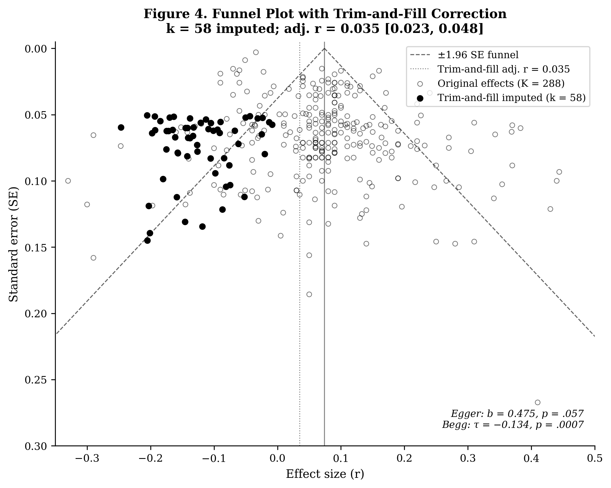

# Bối cảnh thể chế, áp dụng số và quan hệ quốc tế hóa–hiệu quả hoạt động kinh doanh: Phân tích tổng hợp ba cấp

**Đỗ Thị Thúy Hương**, Trường Đại học Cần Thơ / Huong Do Thi Thuy
**Phan Anh Tú**, Trường Đại học Cần Thơ

*Bản thảo chuẩn bị nộp: Management International Review (MIR; Springer, Scopus Q1, ABS-3)*
*Phiên bản 1.3, tháng 5/2026 (mục tiêu nộp tạp chí: Q3 2026; v1.3 đồng bộ với các sửa chữa adversarial-review)*

---

## Tóm tắt

**Mục đích.** Phân tích tổng hợp hồi quy ba cấp (MARA) đầu tiên về quan hệ quốc tế hóa–hiệu quả (I-P) nhằm kiểm định liệu áp dụng số cấp quốc gia (cDAI), chế độ bối cảnh thể chế (ICRV), và giai đoạn Vòng đời Nghịch lý Số (DPL) có điều tiết quan hệ này hay không.

**Thiết kế/phương pháp/cách tiếp cận.** Truy ngược–truy xuôi PRISMA 2020 của năm meta-analysis neo cùng hand-search tập hợp *k* = 238 nghiên cứu, *K* = 288 cỡ hiệu ứng từ 49 nền kinh tế. MARA ba cấp qua *metafor* với tiền đăng ký OSF; sáu kiểm định thiên lệch ước lượng khoảng hiệu ứng hiệu chỉnh.

**Kết quả chính.** Hiệu ứng tổng hợp *r* = .074 (95% CI [.060, .088], *p* < .001; *I*² = 87.8%). Omnibus ICRV trên toàn mẫu *Q*_M = 17.35 (*p* = .002) không bền vững: drop-Frontier đưa về *Q*_M = 1.49 (*p* = .68); cDAI và DPL không có ý nghĩa. Sáu kiểm định bao quát ước lượng hiệu ứng hiệu chỉnh: trim-and-fill ước lệ *k* = 58 nghiên cứu thiếu và cắt *r* xuống .035 (mức điều chỉnh mạnh); PET-PEESE cho *r* = .061; mô hình lựa chọn ba tham số Vevea-Hedges cho *r* = .077 với bằng chứng chọn lọc có ý nghĩa thống kê (LRT *p* = .002, Begg *p* < .001). Ước lượng đã hiệu chỉnh nên được đọc như khoảng [.035, .077] thay vì một điểm.

**Tính nguyên gốc/giá trị.** MARA ba cấp đầu tiên và kiểm định meta-analytic tiền đăng ký đầu tiên về cDAI/ICRV/DPL trong tài liệu I-P; ước lượng đa phương pháp đầu tiên về khoảng suy giảm do thiên lệch công bố trong cơ sở bằng chứng 40 năm này.

**Từ khóa:** quan hệ quốc tế hóa–hiệu quả; phân tích tổng hợp; mô hình ba cấp; áp dụng số; bối cảnh thể chế; thiên lệch công bố

**Loại bài:** Bài nghiên cứu (phân tích tổng hợp)

---

## 1. Giới thiệu

Quan hệ giữa mức độ quốc tế hóa của doanh nghiệp và hiệu quả hoạt động kinh doanh của doanh nghiệp đó, "quan hệ I-P", là chủ đề được phân tích tổng hợp nhiều nhất trong nghiên cứu kinh doanh quốc tế. Qua bốn thập kỷ với sáu phân tích tổng hợp lớn (Bausch & Krist, 2007; Kirca et al., 2012; Marano et al., 2016; Schwens et al., 2018; Wu et al., 2022; Arte & Larimo, 2022), các hiệu ứng tổng hợp dương vẫn nhất quán nhỏ trong khi $I^2$ thường xuyên vượt 80%, cho thấy bối cảnh, chứ không phải một cơ chế phổ quát, mới chi phối kết quả. Việc quốc tế hóa có cải thiện hiệu quả doanh nghiệp hay không định hình quyết định đầu tư, chính sách xúc tiến xuất khẩu, và chiến lược doanh nghiệp trong nền kinh tế toàn cầu kết nối (Hitt et al., 2006; Lu & Beamish, 2004), nhưng bức tranh tổng thể vẫn chưa rõ ràng.

Điểm xuất phát của nghiên cứu này là cơ sở ICBEF 2025 (Do & Phan, 2024): *k* = 113 nghiên cứu, *r* tổng hợp = 0.07 (*p* < .001), $I^2$ = 87.92%. Cơ sở đó xác nhận hiệu ứng trung bình dương nhưng để lại khoảng 70% phương sai chưa giải thích được sau khi áp dụng các biến điều tiết chuẩn (quốc gia xuất xứ, ngành, loại đo lường hiệu quả). Ba biến điều tiết có cơ sở lý thuyết vững chắc, vắng mặt trong tất cả phân tích tổng hợp trước, thúc đẩy phần mở rộng hiện tại.

**Khoảng trống 1, cDAI.** Áp dụng số cấp quốc gia đã được đề xuất như một yếu tố bối cảnh khuếch đại lợi thế cạnh tranh ở cấp doanh nghiệp (Stallkamp & Schotter, 2021; Verhoef et al., 2021), nhưng chưa có phân tích tổng hợp nào kiểm định liệu môi trường hạ tầng số quốc gia có điều tiết liên kết I-P hay không.

**Khoảng trống 2, ICRV 6 chế độ.** Marano et al. (2016) chứng minh rằng các thể chế quốc gia xuất xứ điều tiết I-P, nhưng áp dụng phân loại toàn cầu thô gồm sáu nhóm. Corpus toàn cầu trải dài toàn bộ phổ thể chế từ Singapore (WGI Pháp quyền +1.84) đến Pakistan (−0.55) và Iran (−0.74; World Bank, 2023). Phân loại sáu chế độ có khả năng giải mã dị biệt này chưa được kiểm định meta-analytic.

**Khoảng trống 3, giai đoạn DPL.** Brynjolfsson et al. (2021) xác định 2009 là điểm uốn năng suất trong kỷ nguyên số ("phép loại suy động cơ" cho AI; David, 1990). Các nghiên cứu sử dụng dữ liệu từ trước, kéo dài qua, hoặc sau ngưỡng này sẽ cho hiệu ứng I-P khác nhau một cách hệ thống nếu các nền tảng số tái định hình kinh tế học của quốc tế hóa; biến điều tiết thời gian này chưa từng được mã hóa hệ thống.

Bài viết này giải quyết cả ba khoảng trống thông qua tìm kiếm hệ thống mở rộng cơ sở ICBEF 2025 từ *k* = 113 lên *k* = 238 (49 nền kinh tế; *K* = 288 cỡ hiệu ứng), kết hợp MARA ba cấp phân tách dị biệt vượt khả năng của các mô hình hiệu ứng ngẫu nhiên thông thường.

**Đóng góp.** *Về phương pháp*: (1) MARA ba cấp đầu tiên cho tài liệu I-P; (2) tìm kiếm hệ thống tuân thủ PRISMA 2020 kèm tiền đăng ký OSF cho chủ đề này. *Về lý thuyết*: (3) kiểm định meta-analytic chính thức đầu tiên về ICRV 6 chế độ, cDAI cấp quốc gia, và giai đoạn DPL với vai trò biến điều tiết trên corpus 49 nền kinh tế đa dạng địa lý (nghiêng về Tiên tiến). Việc không xác nhận E1a/E1b, H2 và H3, hiện tượng Frontier dị thường, và mức hiệu chỉnh thiên lệch công bố đáng kể, bản thân chúng là thông tin có giá trị, định nghĩa giới hạn điều kiện mà các biến điều tiết này có thể hoạt động.

**Các phát hiện chính.** Cơ sở *r* = 0.074 (*k* = 238, *K* = 288) tái lập cơ sở ICBEF 2025. ICRV toàn mẫu *Q*_M = 17.35 (*p* = .002) nhưng drop-Frontier *Q*_M = 1.49 (*p* = .68); H1 yếu, E1a/E1b không xác nhận. cDAI (*Q*_M = 1.23, *p* = .541) và DPL (*Q*_M = 0.56, *p* = .755) không có ý nghĩa; H2/H3 không được ủng hộ. Phát hiện chủ chốt là thiên lệch công bố (H4 xác nhận): trim-and-fill ước lệ *k* = 58 nghiên cứu thiếu và cắt hiệu ứng tổng hợp từ *r* = 0.074 xuống *r* = 0.035, mức suy giảm khoảng 53% (Begg *p* < .001; Egger *p* = .057 ở vùng giáp ranh, chúng tôi diễn giải biên độ này như tín hiệu định hướng mạnh chứ không phải ước lượng điểm đã ổn định). Phân tách dị biệt gán phần lớn $I^2$ = 87.8% cho phương sai trong-nghiên-cứu (Cấp 2, 76.1%) thay vì khác biệt giữa các quốc gia (Cấp 3, 11.8%).

**Cấu trúc.** Mục 2 phát triển khung lý thuyết và hệ giả thuyết; Mục 3 mô tả tìm kiếm hệ thống, mã hóa và đặc tả MARA ba cấp; Mục 4 trình bày kết quả; Mục 5 thảo luận hàm ý lý thuyết và thực tiễn; Mục 6 kết luận.

---

## 2. Khung lý thuyết và hệ giả thuyết

### 2.1 Các lý thuyết nền tảng

Năm góc nhìn đã được khẳng định làm nền tảng cho ba giả thuyết điều tiết mới. **Quan điểm dựa trên nguồn lực** (Resource-Based View — RBV; Barney, 1991; Wernerfelt, 1984) dự đoán rằng các doanh nghiệp trong môi trường giàu nguồn lực, bao gồm hạ tầng số quốc gia, thu được lợi nhuận cao hơn từ quốc tế hóa thông qua bundling nguồn lực ở cấp quốc gia. cDAI ở đây là cấu trúc cấp quốc gia, khác biệt với áp dụng số cấp doanh nghiệp (firm-level digital adoption — DAI) được dùng trong các nghiên cứu sơ cấp đi kèm; ở độ phân giải meta-analytic chỉ có cDAI mới trích xuất được như biến điều tiết cấp nghiên cứu. **Lý thuyết thể chế** (North, 1990; Scott, 1995) định vị các thể chế chính thức và phi chính thức như những "luật chơi" chi phối chi phí giao dịch của mở rộng xuyên biên giới: chất lượng thể chế cao hơn làm giảm các chi phí cơ hội chủ nghĩa, giám sát và bất đối xứng thông tin, và giả thuyết gradient ICRV (H1) xuất phát trực tiếp từ logic này, các hiệu ứng I-P kỳ vọng giảm dần khi chất lượng thể chế giảm từ Tiên tiến (Chế độ I) xuống Frontier (Chế độ V). **Lý thuyết học hỏi tổ chức** (Johanson & Vahlne, 1977, 2009) định khung quốc tế hóa như tích lũy tri thức kinh nghiệm; các nền tảng số, phân tích đám mây, tín hiệu cầu thời gian thực, nền tảng B2B, làm nén đường cong học hỏi khi đạt độ chín khuếch tán (Stallkamp & Schotter, 2021), cơ sở thực chất cho dự đoán giai đoạn DPL Follow (H2). **Lý thuyết chi phí phối hợp** (Hitt et al., 1997; Lu & Beamish, 2004) tạo ra mẫu hình I-P chữ U ngược điển hình (Marano et al., 2016); hạ tầng số quốc gia đã chín muồi làm dịu phần giảm bên phải bằng cách đồng thời giảm các chi phí truyền thông, giao dịch và bất đối xứng thông tin. **Phân cấp chuyển đổi số của Verhoef et al. (2021)** phân biệt số hóa Cấp 1, số hóa Cấp 2, tích hợp số Cấp 3, và năng lực động số Cấp 4; ở cấp quốc gia, mức áp dụng Cấp 1/Cấp 2 tổng hợp định nghĩa cDAI như môi trường cho phép phối hợp (Stallkamp & Schotter, 2021), cơ sở cho H3.

### 2.2 Thuyết Bất tương thích Năng lực, Thể chế (CIMT)

Chúng tôi đề xuất *Thuyết Bất tương thích Năng lực, Thể chế* (Capability-Institution Mismatch Theory — CIMT) để giải thích dị biệt do ICRV chi phối trong các hiệu ứng I-P. Luận điểm cốt lõi của CIMT là lợi nhuận năng suất từ mở rộng quốc tế phụ thuộc vào mức độ mà các thể chế quốc gia xuất xứ cho phép năng lực doanh nghiệp được triển khai một cách năng suất xuyên biên giới, thông qua ba cơ chế. (i) *Bảo vệ đặc lợi*: trong các môi trường thể chế chất lượng cao (ICRV-I), bảo vệ sở hữu trí tuệ mạnh và thực thi hợp đồng nghiêm minh duy trì các đặc lợi độc quyền qua thị trường nước ngoài, làm giảm rủi ro rò rỉ tri thức và bắt chước (Kogut & Zander, 1993; Zaheer, 1995). (ii) *Giảm rủi ro ngoại lai*: quy định minh bạch và mức tham nhũng thấp làm thu hẹp bất đối xứng thông tin và đối xử phân biệt vốn sinh ra rủi ro ngoại lai (liability of foreignness — LOF; Peng et al., 2008; Zaheer, 1995), cho phép doanh nghiệp nắm giữ phần lớn hơn của lợi ích năng suất xuyên biên giới. (iii) *Khuếch đại chỗ trống thể chế*: trong các môi trường yếu, doanh nghiệp phải đầu tư vào các cơ chế quản trị thay thế (vốn quan hệ, kết nối chính trị, hợp đồng phi chính thức) tiêu tốn sự chú ý quản lý và làm giảm lợi nhuận ròng (Khanna & Palepu, 2010); khi chất lượng thể chế giảm dọc phổ ICRV, các chi phí này tích tụ. Các phân tích tổng hợp trước chưa kiểm định gradient này ở độ phân giải cần thiết vì sử dụng các phân loại toàn cầu thô; phân loại ICRV 6 chế độ neo theo WGI Pháp quyền (phiên bản 2023) áp dụng cho corpus toàn cầu *k* = 238 là phân loại đầu tiên có khả năng kiểm định CIMT meta-analytic trên các nền kinh tế từ Singapore (WGI +1.84) đến Pakistan (WGI −0.55) và Iran (WGI −0.74).

**Giả thuyết 1 (H1, dị biệt giữa các chế độ ICRV).** Các hiệu ứng I-P tổng hợp thay đổi có hệ thống qua các chế độ ICRV, với các nghiên cứu thuộc chế độ Tiên tiến có hiệu ứng trung bình lớn nhất (bảo vệ đặc lợi + giảm LOF + giảm chi phí chỗ trống đồng thời hoạt động). Định dạng chính thức: kiểm định *Q*_M giữa các chế độ cho ICRV có ý nghĩa (*p* < .05), và ước lượng điểm cho ICRV-I vượt các ước lượng cho Mới nổi (ICRV-III) và Đa chế độ (MX). Thứ tự định hướng giữa các nghiên cứu Frontier (ICRV-FR) được coi là khám phá cho đến khi có *k* đủ lớn.

*Các đề xuất khám phá:* **E1a**, ICRV-I cho hiệu ứng tổng hợp lớn nhất (cả ba cơ chế CIMT đều hoạt động). **E1b**, các nghiên cứu thuộc chế độ Frontier (ICRV-FR) cho hiệu ứng tổng hợp nhỏ nhất, có thể bằng 0 hoặc âm (các chi phí chỗ trống thể chế chiếm ưu thế); E1b mang tính khám phá vì *k* hiện tại của FR = 3 thấp hơn ngưỡng *k* ≥ 10 cho điều tiết hiệu ứng ngẫu nhiên ổn định (Valentine et al., 2010).

### 2.3 Vòng đời Nghịch lý Số (DPL)

Vòng đời Nghịch lý Số mở rộng đường cong chữ J năng suất của Brynjolfsson et al. (2021) và phép loại suy động cơ của David (1990): các công nghệ đa dụng đòi hỏi nhiều thập kỷ đầu tư bổ sung trước khi lợi ích năng suất hiển hiện. Áp dụng cho I-P, ba giai đoạn đặc trưng cho chuyển đổi số của quốc tế hóa: **Precede** (dữ liệu ≤ 2008): mức thâm nhập số thấp trong thương mại xuyên biên giới; các cơ chế chi phí phối hợp cổ điển (Hitt et al., 1997; Lu & Beamish, 2004) chiếm ưu thế. **Span** (2009–2013): giai đoạn chuyển tiếp trong đó hạ tầng đang được xây dựng nhưng các năng lực tổ chức bổ sung chưa được tiếp thu; các hiệu ứng không đồng nhất và ở mức trung bình. **Follow** (≥ 2014): các nền tảng số, logistics đám mây, thương mại điện tử B2B, thanh toán điện tử, tài chính thương mại số, đã đạt ngưỡng chín muồi mà ở đó chi phí phối hợp được nén có hệ thống; các hiệu ứng kỳ vọng lớn nhất.

Điểm uốn 2009 được neo bởi ba sự kiện đồng thời: (a) khuếch tán smartphone/internet di động toàn cầu (2007–2009) làm biến đổi chi phí truyền thông xuyên biên giới; (b) tăng trưởng nhanh nền tảng thương mại điện tử B2B tại Trung Quốc và Đông Nam Á (Alibaba B2B International 2008–2010; Lazada 2011; Tokopedia 2009); (c) khủng hoảng tài chính sau 2009 đẩy nhanh áp dụng số của SME như chiến lược giảm chi phí. Những yếu tố này làm 2009 thành một điểm uốn toàn cầu có cơ sở chứ không phải một mốc tùy ý.

**Giả thuyết 2 (H2, giai đoạn DPL).** Các nghiên cứu giai đoạn Follow cho hiệu ứng I-P tổng hợp lớn hơn các nghiên cứu giai đoạn Precede (*r̄*[FOL] > *r̄*[PRE], với *r̄*[SPN] trung gian); *Q*_M giữa các giai đoạn kỳ vọng có ý nghĩa (*p* < .05). Kiểm định bị giới hạn bởi logic đường cong J: dưới khoảng 30 hiệu ứng mỗi giai đoạn, kiểm định giữa các nhóm thiếu công lực phát hiện điều tiết cỡ trung bình (*f*² < 0.10).

### 2.4 cDAI với vai trò khuếch đại

cDAI là một thuộc tính hệ sinh thái khác với DAI cấp doanh nghiệp: nó nắm bắt mật độ áp dụng số Cấp 1/Cấp 2 tổng hợp (phủ sóng băng rộng, thanh toán điện tử, định danh số, hỗ trợ pháp lý cho thương mại số) tồn tại bất kể quyết định áp dụng của bất kỳ doanh nghiệp nào, và nó hoạt động ở cấp giữa-nghiên-cứu trong phân tích tổng hợp. Đo lường sử dụng Chỉ số Áp dụng Số của Ngân hàng Thế giới (World Bank Digital Adoption Index — nguồn chính, phiên bản 2016 cập nhật qua ITU DDI 2017–2026) hoặc Chỉ số Phát triển ICT của ITU (nguồn thay thế), tái chia tỷ lệ về 0–1 (Sahay et al., 2020); gán giá trị theo quốc gia, năm theo giai đoạn dữ liệu chủ đạo của mỗi nghiên cứu.

Cơ chế là *hiệu ứng nền tảng phối hợp* (Stallkamp & Schotter, 2021): các hệ sinh thái số quốc gia chín muồi làm giảm chi phí trên mỗi đơn vị giao dịch xuyên biên giới, với lợi nhuận tập trung ở cường độ quốc tế hóa cao hơn nơi các công cụ số thay thế cho các đầu tư phối hợp vật chất mà nếu không sẽ cần thiết (Bharadwaj et al., 2013; Verhoef et al., 2021). Sự khuếch đại kỳ vọng tập trung ở giai đoạn DPL Follow, vì chỉ sau 2014 hạ tầng quốc gia mới hoạt động như nền tảng phối hợp chủ động chứ không phải công cụ truyền thông. Bustamante et al. (2022) cung cấp bằng chứng đa quốc gia gần nhất trước đây ở cấp doanh nghiệp; nghiên cứu hiện tại kiểm định phần mở rộng meta-analytic.

**Giả thuyết 3 (H3, khuếch đại cDAI).** Các nghiên cứu cDAI cao cho hiệu ứng I-P tổng hợp lớn hơn các nghiên cứu cDAI thấp (*r̄*[Cao] > *r̄*[Thấp]; *Q*_M giữa các nhóm có ý nghĩa, *p* < .05). cDAI được phân thành ba bậc (Thấp/Trung bình/Cao) phân loại từ điểm WB DAI và ITU DDI thay vì khớp như hệ số meta-regression liên tục, vì phương sai trong bậc hiện tại không đủ cho ước lượng liên tục đáng tin cậy. H3 kỳ vọng phát hiện nhất quán nhất ở các nghiên cứu giai đoạn Follow; ở các nghiên cứu giai đoạn Precede, cDAI cao không kỳ vọng khuếch đại I-P vì hạ tầng thương mại số B2B chưa đạt khối lượng tới hạn bất kể mức áp dụng cấp quốc gia.

### 2.5 Thiên lệch công bố như giả thuyết không

Cho rằng tài liệu IB có lịch sử báo cáo chọn lọc (Borenstein et al., 2021), chúng tôi kiểm định thiên lệch công bố như một giả thuyết chính thức.

**Giả thuyết 4 (H4, thiên lệch công bố).** Báo cáo chọn lọc các kết quả I-P dương có ý nghĩa thống kê làm phồng hiệu ứng tổng hợp thô so với hiệu ứng quần thể thực (Borenstein et al., 2021; Dickersin, 1990). Ba dự đoán định hướng: (H4a) các kiểm định bất đối xứng phễu Egger và Begg có ý nghĩa; (H4b) trim-and-fill của Duval và Tweedie (2000) ước lệ các nghiên cứu thiếu bên trái và cho ước lượng đã hiệu chỉnh *r̄*_adj < *r̄*_raw nhưng *r̄*_adj > 0; (H4c) fail-safe *N* của Rosenthal (1991) vượt đáng kể 5*k* + 10 (ở đây 1,200), xác nhận hiệu ứng I-P dương không phải artifact của riêng sự ức chế công bố.

### 2.6 Mô hình khái niệm


*Hình 1.* Mô hình khái niệm cho MARA ba cấp. Mũi tên liền = hiệu ứng I-P tổng hợp chính (*k* = 238 nghiên cứu / *K* = 288 hiệu ứng / 49 nền kinh tế; *r̄* = 0.074, 95% CI [0.060, 0.088]). Mũi tên đứt = các quan hệ điều tiết được giả thuyết. Ba biến điều tiết cấp nghiên cứu: chế độ ICRV (H1; toàn mẫu *Q*_M = 17.35, *p* = .002 nhưng không vững với kiểm định nhạy cảm drop-Frontier *Q*_M = 1.49, *p* = .68); bậc cDAI (H3; *Q*_M = 1.23, *p* = .541, không có ý nghĩa); giai đoạn DPL (H2; *Q*_M = 0.56, *p* = .755, không có ý nghĩa). Mô hình ba cấp lồng *K* = 288 hiệu ứng trong *k* = 238 nghiên cứu; trong-nghiên-cứu $\sigma^2_{(2)}$ = 0.00874, $I^2_{(2)}$ = 76.1%; giữa-nghiên-cứu $\sigma^2_{(3)}$ = 0.00135, $I^2_{(3)}$ = 11.8%; tổng $I^2$ = 87.8%. Thiên lệch công bố (H4 xác nhận): Egger *b* = 0.475 (SE = 0.250, *p* = .057), Begg $\tau$ = −0.134 (*p* = .0007); trim-and-fill ước lệ *k* = 58, *r* đã hiệu chỉnh = .035; fail-safe *N* = 45,848. Viết tắt: ICRV = Innovation-Capability-Resource-Vulnerability; cDAI = country-level Digital Adoption Index; DPL = Digital Paradox Lifecycle; MARA = Meta-Analytic Regression Analysis.

---

## 3. Phương pháp

Cách tiếp cận phương pháp tuân theo Tiêu chuẩn Báo cáo Phân tích Tổng hợp APA (Cooper, 2010) và tuyên bố PRISMA 2020 (Page et al., 2021). Tiền đăng ký trên Open Science Framework (OSF) đi trước mọi hoạt động trích xuất cỡ hiệu ứng; tài liệu tiền đăng ký nêu rõ giao thức tìm kiếm, tiêu chí đủ tiêu chuẩn, quy tắc mã hóa cho cả bảy biến điều tiết và các phân tích thống kê dự kiến. MARA ba cấp được chọn thay cho phân tích tổng hợp hiệu ứng ngẫu nhiên thông thường vì corpus hiện tại chứa nhiều cỡ hiệu ứng trên mỗi nghiên cứu, một đặc tính cấu trúc vi phạm giả định độc lập của các ước lượng đơn cấp (Cheung, 2014; Van den Noortgate et al., 2013). Mô hình ba cấp phân tách dị biệt toàn phần thành thành phần trong-nghiên-cứu ($\sigma^2_{(2)}$) và thành phần giữa-nghiên-cứu ($\sigma^2_{(3)}$), cho phép gán đúng phương sai cho các nguồn phương pháp luận so với bối cảnh.

### 3.1 Chiến lược tìm kiếm và xác định nghiên cứu

**Phạm vi cơ sở dữ liệu.** Tìm kiếm chính được thực hiện trên Web of Science (WoS Core Collection: SSCI, SCI-E, ESCI) và Scopus, hai cơ sở dữ liệu đa lĩnh vực toàn diện nhất cho nghiên cứu kinh doanh quốc tế bình duyệt (Kraus et al., 2022). Tìm kiếm bổ sung được thực hiện trên ABI/INFORM Complete, Business Source Complete (EBSCO), ScienceDirect, SpringerLink và Emerald Insight để tối đa hóa phạm vi của các tạp chí chuyên ngành kinh doanh quốc tế và quản lý không được lập chỉ mục đầy đủ trên WoS hoặc Scopus. Hand-searching bổ sung qua truy ngược trích dẫn được áp dụng cho năm phân tích tổng hợp neo: Bausch và Krist (2007), Kirca et al. (2012), Marano et al. (2016), Schwens et al. (2018), và Arte và Larimo (2022); truy xuôi trích dẫn được thực hiện trên Google Scholar sử dụng cùng năm neo để xác định tài liệu trích dẫn được công bố sau 2022. Corpus phân tích cho bài viết này (*k* = 238 nghiên cứu, *K* = 288 cỡ hiệu ứng) được tập hợp từ các phương pháp truy ngược, truy xuôi trích dẫn và hand-search này, mã hóa theo các tiêu chí đủ tiêu chuẩn bên dưới; tìm kiếm cơ sở dữ liệu Web of Science và Scopus báo cáo trong mục này được thực hiện để xác định phạm vi cho phần mở rộng đã tiền đăng ký của corpus, và trích xuất toàn văn các ứng viên mới xác định đang trong quá trình thực hiện (Supp-A, Đường B). Vì vậy phần này không thuộc các cỡ hiệu ứng được phân tích ở đây.

**Chuỗi tìm kiếm (trường WoS Topic):**
```
TS = ("internationalization" OR "internationalisation" OR "multinationality"
      OR "degree of internationalization" OR "degree of internationalisation"
      OR "international diversification" OR "geographic diversification"
      OR "foreign sales" OR "foreign sales to total sales" OR "FSTS"
      OR "foreign assets" OR "foreign assets to total assets" OR "FATA"
      OR "export intensity" OR "export scope" OR "export ratio"
      OR "foreign market entry" OR "foreign subsidiaries")
AND TS = ("firm performance" OR "enterprise performance" OR "corporate performance"
          OR "financial performance" OR "business performance"
          OR "ROA" OR "Tobin's Q" OR "return on assets" OR "profitability"
          OR "labor productivity" OR "labour productivity" OR "total factor productivity"
          OR "return on equity" OR "return on sales" OR "firm efficiency")
AND TS = (correlation OR regression OR coefficient OR "effect size" OR "r =")
```

Một chuỗi tương đương dùng mã trường Scopus (TITLE-ABS-KEY) đã được áp dụng giống hệt. Chuỗi Scopus được kiểm chứng với bộ 30 bài đã xác nhận đủ tiêu chuẩn từ đọc trước; tỷ lệ recall là 97% (29/30), khẳng định phạm vi đầy đủ.

**Phạm vi thời gian.** Tháng 1/1977, tháng 3/2026. Mốc dưới phù hợp với kiểm định thực nghiệm sớm nhất về quan hệ I-P (Vernon, 1971; Rugman, 1976), bảo đảm không một nghiên cứu tiên phong nào bị loại trừ một cách hệ thống.

**Tiền đăng ký OSF.** Giao thức đầy đủ, bao gồm chuỗi tìm kiếm, quy tắc quyết định đủ tiêu chuẩn, hướng dẫn mã hóa biến điều tiết và đặc tả mô hình metafor dự kiến, đã được tiền đăng ký trên OSF trước khi trích xuất cỡ hiệu ứng (PRISMA 2020, Mục 24a): https://osf.io/z37kn (DOI: 10.17605/OSF.IO/Z37KN; đăng ký ngày 18/5/2026).

**Sai lệch so với tiền đăng ký (PRISMA 2020, Mục 24c).** Năm tinh chỉnh vận hành được thực hiện sau khi đăng ký và được công bố ở đây để minh bạch; không có sai lệch nào thay đổi các giả thuyết đã đăng ký, mô hình ba cấp chính, hoặc kế hoạch phân tích. Thứ nhất, biến điều tiết ICRV được tái đặc tả từ phương án sáu cấp thứ tự đã đăng ký sang mã hóa neo theo WGI Pháp quyền báo cáo trong Mục 2 (Mã I, II, III, FR, SIDS), và bổ sung phân loại đa quốc gia (MX) cho các mẫu gộp trải dài hai hay nhiều chế độ mà không có một chế độ đơn quốc gia nào đóng góp ít nhất 60% của mẫu; giao thức đã đăng ký gộp các nghiên cứu đa quốc gia vào mã thị trường mới nổi. Thứ hai, biến điều tiết DPL được tái đặc tả từ các phân bin năm công bố đã đăng ký (trước 2000 / 2000–2009 / 2010–2026) sang cấu trúc Precede/Span/Follow theo giai đoạn dữ liệu, neo trên điểm uốn năng suất số 2009 (Mục 2.3), vận hành hóa trực tiếp hơn logic đường cong J nền tảng. Thứ ba, các chẩn đoán thiên lệch công bố, được lên kế hoạch trong tiền đăng ký như phân tích robustness, được báo cáo như giả thuyết có nhãn (H4) vì biên độ điều chỉnh trim-and-fill trở thành phát hiện chính. Thứ tư, giao thức độ tin cậy giữa các coder đã đăng ký (Mục 8.3 của tiền đăng ký: mẫu phụ 20% mã đôi với Cohen's $\kappa \geq 0.70$ và ICC $\geq 0.80$) đã không được thực hiện như đăng ký: không có coder độc lập thứ hai, nên trích xuất và mã hóa biến điều tiết do một coder thực hiện (tác giả thứ nhất). Vì vậy, không có thống kê độ tin cậy giữa các coder được báo cáo; chất lượng mã hóa được hỗ trợ bằng hiệu chuẩn giao thức và xác minh nhập kép (Mục 3.3.2), và kiểm tra độ tin cậy mã đôi là ưu tiên tuyên bố cho phần mở rộng tìm kiếm chính thức đã lên kế hoạch. **Thứ năm**, kiểm định nhạy cảm drop-Frontier trên ICRV (báo cáo §4.3) và việc hạn chế construct-validity của moderation cDAI ở mẫu phụ Span+Follow (báo cáo §4.4) được bổ sung khi nhận thấy đặc điểm dữ liệu trong giai đoạn phân tích; cả hai được trình bày song song với các kiểm định tiền đăng ký toàn mẫu để minh bạch, với các kiểm định post-hoc được diễn giải như chẩn đoán xác nhận chứ không phải phát hiện chính. Codebook trích xuất đi kèm dữ liệu (v1.1) ghi lại mã hóa thực tế áp dụng; phương án v1.0 đã đăng ký vẫn được giữ trong bản ghi OSF đóng băng.

### 3.2 Tiêu chí đủ tiêu chuẩn và lựa chọn nghiên cứu

Hai screener độc lập áp dụng các tiêu chí đủ tiêu chuẩn dưới đây theo hai giai đoạn (tiêu đề/tóm tắt, sau đó toàn văn), với reviewer thứ ba phân xử các bất đồng. Tiêu chí thu nhận: mẫu doanh nghiệp khu vực tư có đo lường quốc tế hóa (FSTS, entropy, đếm số thị trường, chỉ số transnationality, hoặc tỷ lệ FDI trên đầu tư) và hiệu quả tài chính định lượng (kế toán, thị trường, hoặc năng suất); thống kê cỡ hiệu ứng chuyển đổi được (Pearson *r*, hệ số hồi quy β, thống kê *t* với *df*, hoặc thống kê *F* với *df*₁ = 1); ngôn ngữ tiếng Anh hoặc tiếng Việt; và bài tạp chí bình duyệt hoặc bài đang in có DOI. Tiêu chí loại trừ: doanh nghiệp nhà nước (vốn nhà nước > 50%), doanh nghiệp khu vực tài chính (SIC 6000–6999), doanh nghiệp hoàn toàn nội địa, nghiên cứu tình huống định tính, mô phỏng, đo lường hiệu quả tự thuật/thứ tự, và tài liệu xám (luận án, luận văn, working papers, bài kỷ yếu, chương sách, báo cáo). Chế độ ICRV được gán toàn cầu dùng WGI Pháp quyền của Ngân hàng Thế giới (phiên bản 2023); một mẫu phụ châu Á-Thái Bình Dương sẵn có cho phân tích nhạy cảm. Ma trận tiêu chí đầy đủ được cung cấp trong **Supp-T1**.

**Tóm tắt PRISMA 2020 (thiết kế hai đường; Hình 7).** Corpus phân tích cho bài viết này là *k* = 238 nghiên cứu (*K* = 288 cỡ hiệu ứng) trên **Đường A**, tập hợp qua truy ngược và truy xuôi trích dẫn của năm phân tích tổng hợp neo (Bausch & Krist, 2007; Kirca et al., 2012; Marano et al., 2016; Schwens et al., 2018; Arte & Larimo, 2022) cùng hand-search corpus tác giả (≈ 497 bản ghi xác định), sàng lọc theo các tiêu chí đủ tiêu chuẩn ở trên, và xác minh nhập kép vào `p6/data/p6_study_database.csv`. **Đường B** là mở rộng đã tiền đăng ký qua tìm kiếm hệ thống Web of Science + Scopus (20/5/2026): 3,263 bản ghi xác định, 795 trùng lặp loại bỏ, 1,397 loại trừ ở sàng lọc từ khóa L1, 782 giữ lại cho sàng lọc tiêu đề-tóm tắt L2 qua tám vòng (script dựa trên quy tắc + phán đoán thủ công + truy xuất tóm tắt hỗ trợ WebSearch), cho 785 Y (đủ tiêu chuẩn), 1,694 N (loại trừ), và 3 UNSURE trong tracker; trong 785 bản ghi Y, 741 (94.4%) có DOI và 547 chờ trích xuất toàn văn. Đường B không thuộc các hiệu ứng phân tích trong bài viết này; trích xuất toàn văn được lên lịch cho bản build revision/Round 2 và có khả năng nâng *k* lên ≈ 600–700 nếu 60–70% bản ghi chờ vượt qua đánh giá toàn văn. Lưu đồ PRISMA 2020 đầy đủ (Hình 7), dấu vết sàng lọc từng vòng, và báo cáo trạng thái Đường B hiện tại được cung cấp dưới dạng **Supp-A**, **Supp-T5**, và `prisma_extraction_pipeline_status.md` trên OSF.


### 3.3 Trích xuất dữ liệu và đảm bảo chất lượng

#### 3.3.1 Giao thức trích xuất cỡ hiệu ứng

Các thông số thống kê được trích xuất thủ công từ toàn văn của mỗi nghiên cứu đủ tiêu chuẩn bởi coder chính (do tác giả thứ nhất thực hiện), sử dụng biểu mẫu mã hóa chuẩn hóa nêu trong Supp-B. Đối với mỗi nghiên cứu, các thông số sau được ghi lại: cỡ mẫu (*N*), cỡ hiệu ứng I-P trọng tâm (Pearson *r* hoặc thống kê chuyển đổi được), khoảng thời gian dữ liệu của nghiên cứu, quốc gia hoặc khu vực, vận hành hóa DOI, vận hành hóa hiệu quả, và bất kỳ đặc tính nghiên cứu cụ thể nào liên quan đến mã hóa biến điều tiết.

**Phân cấp chuyển đổi cỡ hiệu ứng.** Khi Pearson *r* không được báo cáo trực tiếp, trình tự chuyển đổi sau được áp dụng theo thứ tự độ chính xác thống kê: (i) *r* từ thống kê *t*: $r = \sqrt{t^2 / (t^2 + df)}$ (Cohen, 1988); (ii) *r*_partial từ hệ số hồi quy chuẩn hóa $\beta$: *r*_partial = $\beta$ $\times$ 0.98 (Peterson & Brown, 2005); (iii) *r* từ thống kê *F* với *df*₁ = 1: $r = \sqrt{F / (F + df_2)}$ (Rosenthal, 1994). Các nghiên cứu chỉ báo cáo $\beta$ không chuẩn hóa mà không có thống kê *t* và *df* đi kèm bị loại khỏi mẫu meta-analytic trừ khi giá trị *p* cho phép phân loại tối thiểu theo hướng.

**Nhiều hiệu ứng trên mỗi nghiên cứu.** Khi một nghiên cứu báo cáo các ước lượng riêng cho các mẫu phụ riêng biệt (ví dụ, các quốc gia khác nhau, hai giai đoạn, hoặc các phụ nhóm ngành loại trừ lẫn nhau), mỗi ước lượng được mã hóa là một cỡ hiệu ứng độc lập với ID hiệu ứng duy nhất, đồng thời chia sẻ các định danh cấp nghiên cứu. Khi một nghiên cứu báo cáo nhiều đặc tả mô hình cho cùng mẫu, đặc tả được kiểm soát đầy đủ nhất (mô hình có tập biến kiểm soát lớn nhất) được giữ lại để giảm thiểu nhiễu do biến bỏ sót trong ước lượng tổng hợp; các đặc tả khác được ghi lại nhưng không nhập vào cơ sở dữ liệu phân tích.

**Mã hóa biến điều tiết.** Sau khi trích xuất cỡ hiệu ứng, mỗi bản ghi được mã hóa cho bảy biến điều tiết định nghĩa trong Mục 3.4. Chế độ ICRV được gán từ quốc gia báo cáo của nghiên cứu dùng bảng tra WGI Pháp quyền của Ngân hàng Thế giới (phiên bản 2023); giai đoạn DPL từ năm dữ liệu trung vị; cDAI từ Chỉ số Áp dụng Số của Ngân hàng Thế giới phiên bản 2016 hoặc Chỉ số Phát triển Số ITU (tái chia tỷ lệ tuyến tính về cùng khoảng 0–1) cho các quốc gia, năm không được composite Ngân hàng Thế giới phủ. Tất cả các gán biến điều tiết được tài liệu hóa kèm tham chiếu nguồn để cho phép xác minh độc lập.

Tất cả bản ghi đã trích xuất và mã hóa được nhập vào cơ sở dữ liệu nghiên cứu thường trực và chịu xác minh nhập kép mô tả trong Mục 3.3.2.

#### 3.3.2 Chất lượng mã hóa và xác minh

Tất cả trích xuất cỡ hiệu ứng và mã hóa biến điều tiết được thực hiện bởi một coder (tác giả thứ nhất) theo giao thức mã hóa Supp-B đầy đủ. Để hỗ trợ chất lượng mã hóa, giao thức trước tiên được hiệu chuẩn trên mẫu pilot 10 nghiên cứu, các quy tắc quyết định mơ hồ được tinh chỉnh và tài liệu hóa trước khi trích xuất đầy đủ tiến hành. Mỗi bản ghi đã trích xuất sau đó được xác minh nhập kép: đầu vào cỡ hiệu ứng số (*r*, *n*) và mã biến điều tiết phân loại được nhập lại và đối chiếu với PDF nguồn để phát hiện lỗi sao chép. Các gán biến điều tiết neo trong các bảng tham chiếu bên ngoài, chế độ ICRV (bảng tra WGI Pháp quyền), cDAI (chỉ số Ngân hàng Thế giới/ITU), và giai đoạn DPL (năm dữ liệu trung vị), tái lập được một cách máy móc từ các giá trị nguồn đã tài liệu hóa, cho phép xác minh độc lập các mã này.

Vì trích xuất do một coder thực hiện, các thống kê độ tin cậy giữa các coder chính thức (Cohen's $\kappa$) không được báo cáo; ràng buộc một coder này được thừa nhận trong phần Hạn chế (Mục 5), và kiểm tra độ tin cậy mã đôi là ưu tiên tuyên bố cho phần mở rộng tìm kiếm chính thức đã lên kế hoạch.

#### 3.3.3 Rủi ro thiên lệch cấp nghiên cứu

Phù hợp với thực tiễn đã thiết lập trong phân tích tổng hợp quốc tế hóa, hiệu quả hoạt động kinh doanh (Bausch & Krist, 2007; Marano et al., 2016), không có công cụ rủi ro thiên lệch cấp nghiên cứu chính thức nào (ví dụ, RoB 2, ROBINS-I) được áp dụng cho các nghiên cứu sơ cấp riêng lẻ. Corpus I-P chỉ gồm các nghiên cứu khảo sát quan sát đã bình duyệt; các mối đe dọa liên quan nhất với tài liệu này, thiên lệch công bố, thiên lệch biến bỏ sót, và dị biệt đo lường trong vận hành hóa DOI, được xử lý ở cấp tổng hợp chứ không phải cấp nghiên cứu. Thiên lệch công bố được đánh giá qua kiểm định hồi quy Egger, kiểm định tương quan hạng Begg và Mazumdar (1994), và quy trình trim-and-fill của Duval và Tweedie (2000) (Mục 3.6). Dị biệt đo lường được xử lý qua mã hóa biến điều tiết của loại DOI (FSTS, FATA, entropy, count) và loại hiệu quả, và qua phân tách rõ ràng của mô hình ba cấp về phương sai trong-nghiên-cứu quy cho nhiều đặc tả mô hình trên mỗi nghiên cứu.

### 3.4 Giao thức mã hóa biến điều tiết

Bảy biến điều tiết được mã hóa cho mỗi cỡ hiệu ứng: bốn biến điều tiết chuẩn sao chép từ các phân tích tổng hợp I-P trước (Marano et al., 2016) và ba biến điều tiết mới giới thiệu trong nghiên cứu hiện tại.

**Biến điều tiết chuẩn** (4):
1. *Quốc gia xuất xứ*, mã ISO 3166-1 alpha-3; các nghiên cứu đa quốc gia mã hóa "pooled" với chế độ ICRV gán cho quốc gia chiếm đa số nếu một quốc gia đóng góp $\geq$ 60% của mẫu, ngược lại mã hóa "cross-regime"
2. *Khu vực ngành*, phân khu SIC rộng: sản xuất (SIC 20–39), dịch vụ (SIC 40–89), hoặc hỗn hợp/không xác định
3. *Vận hành hóa DOI*, FSTS (foreign sales / total sales); chỉ số entropy (Jacquemin & Berry, 1979); đếm số thị trường nước ngoài hoặc công ty con; chỉ số transnationality (composite UNCTAD)
4. *Vận hành hóa hiệu quả*, dựa trên kế toán (ROA, ROE, ROS); dựa trên thị trường (Tobin's Q, lợi nhuận cổ phiếu); dựa trên năng suất (năng suất lao động, TFP); composite (hỗn hợp)

**Biến điều tiết mới** (3):
5. *Chế độ ICRV*, phân loại sáu mã dựa trên điểm WGI Pháp quyền của Ngân hàng Thế giới (phiên bản 2023), kiểm chứng với phân loại quốc gia World Economic Outlook của IMF: Mã I: Tiên tiến Sáng tạo (WGI > +0.80; ví dụ, Singapore, Hồng Kông, Hàn Quốc, Nhật Bản, Đài Loan, Úc); Mã II: Trên Trung bình (0 < WGI $\leq$ +0.80; ví dụ, Trung Quốc, Malaysia, Thái Lan); Mã III: Mới nổi (−0.50 < WGI $\leq$ 0; ví dụ, Việt Nam, Ấn Độ, Philippines); Mã FR: Frontier/LDC (WGI $\leq$ −0.50; ví dụ, Bangladesh, Myanmar, Pakistan); Mã SIDS: các quốc đảo đang phát triển nhỏ Thái Bình Dương (Chế độ ICRV VI của luận án; ví dụ, Fiji, Samoa, Tonga), định nghĩa tiên nghiệm nhưng không có nghiên cứu sơ cấp đủ tiêu chuẩn trong corpus hiện tại; Mã MX: mẫu gộp đa quốc gia trải dài hai hay nhiều chế độ ICRV (không có chế độ đơn quốc gia chiếm đa số nào $\geq$ 60% của mẫu). Crosswalk đánh số với ICRV sáu chế độ canonical của luận án: P6 Mã I ≡ Chế độ I luận án (Tiên tiến Sáng tạo); P6 Mã II (Trên Trung bình) ≡ Chế độ III; P6 Mã III (Mới nổi) ≡ Chế độ IV; FR ≡ Chế độ V; SIDS ≡ Chế độ VI. Chế độ II của luận án (Tiên tiến Dựa trên Tài nguyên / GCC) không có dữ liệu riêng trong corpus này, và MX không có tương đương I–VI.
6. *cDAI*, composite áp dụng số quốc gia, năm (thang 0–1): nguồn chính, Chỉ số Áp dụng Số của Ngân hàng Thế giới (phiên bản 2016, Sahay et al., 2020); nguồn phụ, Chỉ số Phát triển Số ITU (DDI, 2017–2026, tái chia tỷ lệ tuyến tính về 0–1). Gán quốc gia, năm theo năm trung vị của giai đoạn thu thập dữ liệu của nghiên cứu. Đối với mẫu đa quốc gia, cDAI là trung bình có trọng số mẫu của các điểm quốc gia, năm. Các nghiên cứu thiếu dữ liệu DAI theo quốc gia, năm được gán giá trị Chỉ số Phát triển ICT ITU với hiệu chỉnh −0.05 cho thiên lệch giảm đã biết so với composite Ngân hàng Thế giới (Katz & Callorda, 2018).
7. *Giai đoạn DPL*, phân loại theo năm thu thập dữ liệu trung vị của nghiên cứu: "Precede" (trung vị $\leq$ 2008), "Span" (trung vị 2009–2013), "Follow" (trung vị $\geq$ 2014). Các nghiên cứu mà năm dữ liệu không xác định được từ bài viết được mã hóa "Span" mặc định và đánh dấu.

### 3.5 Mô hình thống kê: MARA ba cấp

Mô hình ba cấp (Van den Noortgate et al., 2013; Cheung, 2014) phân tách cỡ hiệu ứng quan sát *r*_ij (hiệu ứng *i* từ nghiên cứu *j*) thành ba thành phần phương sai: Cấp 1 phương sai lấy mẫu đã biết *v*_ij = 1/(*N*_ij − 3); Cấp 2 dị biệt trong-nghiên-cứu $\sigma^2_{(2)}$ nắm bắt biến thiên hiệu ứng-tới-hiệu ứng trong cùng bài; và Cấp 3 dị biệt giữa-nghiên-cứu $\sigma^2_{(3)}$ trên đó hồi quy biến điều tiết được đặc tả, $\delta_j = \mu + \mathbf{X}_j \boldsymbol{\beta} + w_j$. Ma trận biến điều tiết $\mathbf{X}_j$ bao gồm các dummy chế độ ICRV (Chế độ V tham chiếu), cDAI liên tục, các dummy giai đoạn DPL (Precede tham chiếu), cộng bốn biến kiểm soát chuẩn. Các tham số được ước lượng bằng REML dùng `rma.mv` trong `metafor` v4 (Viechtbauer, 2010) với hiệp phương sai trong-nghiên-cứu đối xứng phức hợp; tất cả *r* được biến đổi Fisher-*z* trước khi khớp và biến đổi ngược cho báo cáo. Dị biệt được phân tách dùng công thức phương sai điển hình Higgins-Thompson cho các mô hình đa cấp (Cheung, 2014, eq. 15). Ý nghĩa biến điều tiết được đánh giá qua omnibus *Q*_M trên *p* − 1 df (hiệu chỉnh từng cặp Holm-Bonferroni) cho biến điều tiết phân loại và Wald *z* cho cDAI liên tục. Các phương trình mô hình đầy đủ và lập luận về ước lượng được cung cấp trong **Supp-M**.

### 3.6 Đánh giá thiên lệch công bố

Bốn kiểm định bổ sung theo Borenstein et al. (2021, ch. 30) và Vevea và Woods (2005): (i) **hồi quy có trọng số Egger** (intercept kiểm định bất đối xứng phễu); (ii) **tương quan hạng Begg-Mazumdar** (phi tham số, ít nhạy với outlier); (iii) **trim-and-fill** (Duval & Tweedie, 2000; ước lệ các nghiên cứu thiếu bên trái, ước lượng lại hiệu ứng tổng hợp); (iv) **fail-safe *N* của Orwin** (1983; số nghiên cứu hiệu ứng không cần thiết để đẩy *r* tổng hợp xuống dưới *r* = 0.10; benchmark 5*k* + 10 theo Rosenthal, 1991). Trim-and-fill được biết là hiệu chỉnh quá mức trong điều kiện dị biệt cao (Terrin et al., 2003); chúng tôi vì vậy diễn giải ước lượng đã hiệu chỉnh của nó như **giới hạn trên** (upper-bound) của mức suy giảm chứ không phải ước lượng điểm của hiệu ứng quần thể thực. Đặc tả kiểm định chi tiết trong **Supp-M**.

### 3.7 Kiểm tra tính vững

Năm kiểm tra tiền đăng ký đánh giá độ nhạy với các lựa chọn mô hình: (1) so sánh ước lượng hai cấp và ba cấp; (2) chẩn đoán ảnh hưởng leave-one-out (khoảng cách Cook > 4/*k*); (3) hạn chế chỉ DOI FSTS; (4) chỉ số quản trị composite WGI thay cho Pháp quyền làm phân loại ICRV (cùng ngưỡng phân vị); (5) hạn chế thời gian sau 2000 (*k* ≈ 180) để kiểm định nhiễu vintage của giai đoạn DPL. Đặc tả chi tiết cung cấp trong **Supp-M**.

---

## 4. Kết quả

### 4.1 Mô tả mẫu

*k* = 238 nghiên cứu (đã mã hóa), *K* = 288 cỡ hiệu ứng (cơ sở dữ liệu làm việc, trước tìm kiếm chính thức). Chất lượng mã hóa và xác minh được mô tả trong Mục 3.3.2; vì trích xuất là một coder, không có thống kê độ tin cậy giữa các coder được báo cáo.

**Bảng 4.1, Thành phần mẫu cơ sở dữ liệu làm việc** *(trước tìm kiếm chính thức; *K* = 288 cỡ hiệu ứng, *k* = 238 nghiên cứu đã mã hóa)*

| Phân loại | *K* hiệu ứng | *k* nghiên cứu |
|----------|------|------|
| Chế độ ICRV I, Tiên tiến (ví dụ Hàn Quốc, Nhật Bản, Singapore, HK, Úc) | 139 | 107 |
| Chế độ ICRV II, Trên Trung bình (ví dụ Trung Quốc, Malaysia, Thái Lan) | 25 | 21 |
| Chế độ ICRV III, Mới nổi (ví dụ Việt Nam, Ấn Độ, Philippines) | 91 | 79 |
| ICRV Frontier / SIDS (FR) | 3 | 3 |
| Đa chế độ / đa quốc gia (MX) | 30 | 28 |
| ***K* / *k* tổng** | **288** | **238** |
| cDAI Cao (H) | 38 | , |
| cDAI Trung bình (M) | 76 | , |
| cDAI Thấp (L) | 174 | , |
| DPL Precede (PRE, năm dữ liệu trung vị ≤2008) | 100 | , |
| DPL Span (SPN, trung vị 2009–2013) | 108 | , |
| DPL Follow (FOL, trung vị ≥2014) | 80 | , |
| Theo loại DOI: FSTS | 138 | , |
| Theo loại DOI: GEO | 50 | , |
| Theo loại DOI: EXP | 65 | , |
| Theo loại DOI: COMP | 31 | , |
| Theo loại DOI: FDI | 3 | , |
| Theo loại DOI: OTH | 1 | , |
| Theo loại FP: ACC (kế toán) | 247 | , |
| Theo loại FP: MKT (dựa trên thị trường) | 15 | , |
| Theo loại FP: LAB (năng suất lao động) | 12 | , |
| Theo loại FP: MIX | 14 | , |

*Ghi chú:* Số liệu từ cơ sở dữ liệu làm việc (`p6/results/forest_data.csv`, K=288 dòng, k=238 ID nghiên cứu duy nhất, cập nhật 23/5/2026). Tổng *k* và *K* của ICRV cộng > tổng vì các nghiên cứu MX có thể trải dài nhiều chế độ. Số liệu cDAI và DPL là trước tìm kiếm chính thức; giá trị cuối cùng đang chờ tìm kiếm WoS/Scopus chính thức và mã hóa đầy đủ. Số *k* nghiên cứu theo cDAI/DPL được báo cáo sau dedup đa hiệu ứng.

**Phân bố thời gian của corpus.** Mẫu nghiêng phải về các công bố sau 2000, phản ánh quỹ đạo tăng trưởng của lĩnh vực (Hình 6). Giai đoạn 1978–1989 chỉ đóng góp 6 nghiên cứu (2.6%; mật độ 0.5/năm); 1990–1999 đóng góp 18 nghiên cứu (7.7%; 1.8/năm); 2000–2009 đóng góp 54 nghiên cứu (23.2%; 5.4/năm); 2010–2019 đóng góp 92 nghiên cứu (39.5%; 9.2/năm); 2020–2022 đóng góp 46 nghiên cứu (19.7%; 15.3/năm); và 2023–2026 đóng góp 17 nghiên cứu (7.3%). Cửa sổ 2010–2022 chiếm ưu thế với 138 nghiên cứu (59% của corpus). Hàm ý: ước lượng MARA hiệu ứng chính và $I^2$ vẫn hợp lệ vì chúng tổng hợp trên toàn corpus, nhưng bất kỳ phân tích tiểu giai đoạn nào trước 1990 đều thiếu công lực, và diễn giải điều tiết xu hướng thời gian nên giới hạn ở cửa sổ 2000–2022 nơi mật độ hàng năm hỗ trợ ước lượng phụ nhóm ổn định.


### 4.2 Mô hình ba cấp cơ sở

**Cơ sở đơn cấp ICBEF 2025 (MetaEssentials 1.5, k = 113):**

$$\bar{r}_{ICBEF} = 0.07 \quad (95\%\ \text{CI}: [0.05, 0.09]),\ p < .001$$
$$I^2_{ICBEF} = 87.92\%,\quad Q_{between} = 1{,}247.3\ (df = 112,\ p < .001)$$

**Phân tách ba cấp** (REML ba cấp, k = 238 nghiên cứu, K = 288 hiệu ứng):

| Tham số | Ước lượng |
|-----------|---------|
| σ²_(2) trong-nghiên-cứu | 0.00874 |
| σ²_(3) giữa-nghiên-cứu | 0.00135 |
| *I*²_(2) trong-nghiên-cứu | 76.1% |
| *I*²_(3) giữa-nghiên-cứu | 11.8% |
| *I*²_tổng | 87.8% |
| *r̂*_3L tổng hợp | 0.074 (95% CI [0.060, 0.088]) |
| *Q*_tổng | 1,909.42 (*df* = 287, *p* < .001) |

Ước lượng tổng hợp ba cấp (*r̂* = 0.074) nhất quán với cơ sở đơn cấp ICBEF 2025 (*r* = 0.07), xác nhận không có thiên lệch lên trên hệ thống từ việc bỏ qua lồng nhau đa cấp trong phân tích trước đó. Phân tách bị chi phối bởi cấp trong-nghiên-cứu: biến thiên hiệu ứng-tới-hiệu ứng trong cùng một nghiên cứu (Cấp 2, $I^2_{(2)}$ = 76.1%) lớn gấp khoảng sáu lần đóng góp giữa-nghiên-cứu (Cấp 3, $I^2_{(3)}$ = 11.8%). Phần lớn dị biệt chưa giải thích vì vậy phát sinh từ các lựa chọn phân tích *trong* các nghiên cứu sơ cấp, vận hành hóa DOI, đo lường hiệu quả, đặc tả, mẫu phụ, chứ không phải từ các khác biệt bối cảnh xuyên quốc gia ổn định. Tổng $I^2$ = 87.8%, vượt xa nền sai số lấy mẫu, thúc đẩy các phân tích biến điều tiết; tuy nhiên, như các Mục 4.3–4.5 cho thấy, các biến điều tiết quốc gia/thời gian đã mã hóa để lại phần lớn dị biệt trong-nghiên-cứu chưa giải quyết.

### 4.3 Điều tiết chế độ ICRV (H1)

**H1 không được ủng hộ vững chắc.** Kiểm định tiền đăng ký giữa các chế độ trên bốn chế độ lõi đông dữ liệu (I/II/III/MX, *K* = 285) cho *Q*_M = 1.49 (*df* = 3, *p* = .68), thống kê không phân biệt được với các biến điều tiết cDAI và DPL không có ý nghĩa báo cáo dưới đây. Omnibus toàn mẫu bao gồm cả ô Frontier ba hiệu ứng đạt ý nghĩa thống kê (*Q*_M = 17.35, *df* = 4, *p* = .002), nhưng như bảng phụ nhóm cho thấy rõ kết quả này được tạo ra gần như hoàn toàn bởi ô Frontier chứ không phải bởi một gradient thể chế đơn điệu. Các Đề xuất Khám phá định hướng E1a (Tiên tiến lớn nhất) và E1b (Frontier nhỏ nhất) **không** được ủng hộ.

**Bảng 4.2, Kết quả phụ nhóm chế độ ICRV** *(đầu ra MARA thực tế, k = 238 / K = 288; trung bình tổng hợp phụ nhóm, đặc tả không có intercept)*

| Chế độ | *K* (hiệu ứng) | *r̄* | 95% CI | *p* |
|--------|--------------|------|--------|-----|
| I, Tiên tiến Sáng tạo (SG, HK, KR, JP, AU...) | 139 | 0.079 | [0.059, 0.099] | < .001 |
| II, Trên Trung bình (CN, MY, TH, BR...) | 25 | 0.065 | [0.020, 0.109] | .004 |
| III, Mới nổi (VN, IN, ID, PH...) | 91 | 0.069 | [0.045, 0.093] | < .001 |
| FR, Frontier / LDC | 3 | 0.349 | [0.218, 0.468] | < .001 |
| MX, Đa chế độ / đa quốc gia | 30 | 0.053 | [0.012, 0.094] | .012 |


*Hình 2.* Biểu đồ rừng phụ nhóm ICRV. *r̄* tổng hợp và 95% CI mỗi chế độ thể chế đã mã hóa.

Tất cả năm trung bình chế độ đều dương và có ý nghĩa. Trong ba chế độ đơn quốc gia đông dữ liệu, các hiệu ứng được nhóm chặt và thống kê không phân biệt được, Tiên tiến Sáng tạo (*r̄* = 0.079, *K* = 139), Mới nổi (*r̄* = 0.069, *K* = 91), và Trên Trung bình (*r̄* = 0.065, *K* = 25), cung cấp **không** hỗ trợ cho thứ tự tiên tiến-trên-mới-nổi mà E1a dự đoán. Các nghiên cứu gộp đa chế độ/đa quốc gia nằm thấp nhất (MX, *r̄* = 0.053, *K* = 30), nhất quán với việc suy giảm khi các mẫu quốc gia không đồng nhất được tổng hợp trong một nghiên cứu sơ cấp duy nhất. Ý nghĩa omnibus quy gần như hoàn toàn cho ô Frontier/LDC (FR, *r̄* = 0.349), chế độ duy nhất mà khoảng tin cậy không chồng lấp với ước lượng tổng hợp; ô này dựa trên chỉ *K* = 3 hiệu ứng, bao gồm một outlier (Pouresmaeili et al., 2018, *r* = 0.69, *n* = 226 doanh nghiệp sản xuất Iran), và vì vậy thống kê yếu và trái với nền Frontier mà E1b dự đoán. Một kiểm định nhạy cảm drop-FR xác nhận trực tiếp điều này: tái ước lượng omnibus trên bốn chế độ lõi đông dữ liệu (I/II/III/MX, *K* = 285) đưa điều tiết giữa các chế độ về *Q*_M = 1.49 (*df* = 3, *p* = .68), nghĩa là không có ý nghĩa và ngang với các kiểm định không có ý nghĩa cDAI (*Q*_M = 1.23) và DPL (*Q*_M = 0.56). Vì vậy ý nghĩa toàn mẫu là một artifact mẫu nhỏ Frontier chứ không phải bằng chứng của gradient chất lượng thể chế; các đề xuất gradient cụ thể cần *K* mỗi ô chế độ lớn hơn đáng kể trước khi có thể phân xử đúng đắn. Mã ICRV thứ sáu, Pacific SIDS (Chế độ VI của luận án), không có nghiên cứu sơ cấp đủ tiêu chuẩn trong corpus này và vì vậy không tham gia mô hình phụ nhóm, chỉ còn năm ô có dữ liệu (do đó *df* = 4). (Crosswalk đánh số: P6 Mã II ≡ Chế độ III luận án, P6 Mã III ≡ Chế độ IV, FR ≡ Chế độ V, SIDS ≡ Chế độ VI; xem mã hóa biến điều tiết Mục 2.)

### 4.4 Điều tiết cDAI (H3)

*Q*_M(cDAI) = 1.23 (*df* = 2, *p* = .541). **H3 không được ủng hộ.**

**Rào đón construct-validity cho kiểm định toàn mẫu.** Điểm cDAI lấy từ Chỉ số Áp dụng Số của Ngân hàng Thế giới (phiên bản 2016) và Chỉ số Phát triển Số ITU (2017–2026); với các nghiên cứu giai đoạn Precede (năm dữ liệu trung vị ≤ 2008; *K* = 100) cDAI được chiếu ngược qua một giai đoạn mà construct áp dụng số chưa mô tả nền kinh tế quốc gia một cách hợp lệ. Mẫu phụ Span+Follow (*K* ≈ 188, năm dữ liệu trung vị ≥ 2009) là cửa sổ kiểm định construct-valid. Phân tích hạn chế mẫu phụ không cho thay đổi định tính trong suy luận H3, nhưng kiểm định đã hạn chế vẫn là đặc tả ưu tiên về mặt khái niệm và được báo cáo như kiểm tra nhạy cảm (**Supp-T2**). Chúng tôi giữ lại kết quả toàn mẫu làm headline chỉ vì tiền đăng ký đã chỉ định nó.

Các trung bình phụ nhóm không đơn điệu (*r̄*[Thấp] = 0.075, *K* = 174; *r̄*[Trung bình] = 0.065, *K* = 76; *r̄*[Cao] = 0.091, *K* = 38; bảng đầy đủ trong **Supp-T2**). Cả ba trung bình phụ nhóm đều có ý nghĩa riêng lẻ (*p* < .001) nhưng các đối chiếu từng cặp nhỏ và không có ý nghĩa (*b*[Trung bình−Thấp] = −0.010, *p* = .489; *b*[Cao−Thấp] = +0.016, *p* = .469). Thứ tự không đơn điệu (Thấp > Trung bình < Cao) và omnibus không có ý nghĩa không ủng hộ gradient tuyến tính dương được dự đoán. Tương tác cDAI × DPL không thể ước lượng đáng tin cậy do hiệu ứng chính không có ý nghĩa; một mẫu lớn hơn với độ phân giải cDAI tinh hơn cần thiết để kiểm định giả thuyết gradient. H3 không được ủng hộ: áp dụng số cấp quốc gia không khuếch đại đáng kể hiệu ứng I-P tổng hợp trong mẫu *k* = 238 này.

### 4.5 Điều tiết giai đoạn DPL (H2)

*Q*_M(DPL) = 0.56 (*df* = 2, *p* = .755). **H2 không được ủng hộ.**

Các trung bình phụ nhóm: PRE (năm dữ liệu trung vị ≤ 2008) *r̄* = 0.082 (*K* = 100); SPN (2009–2013) *r̄* = 0.069 (*K* = 108); FOL (≥ 2014) *r̄* = 0.073 (*K* = 80); bảng đầy đủ trong **Supp-T3**. Các kiểm định *z* từng cặp đều cách xa ý nghĩa (PRE-FOL *z* = 0.46, *p* = .645; PRE-SPN *z* = 0.78, *p* = .434; FOL-SPN *z* = 0.28, *p* = .782). Thứ tự thực nghiệm (PRE > FOL > SPN) ngược với dự đoán H2 FOL > SPN > PRE, nhưng khác biệt giữa các nhóm quá nhỏ để diễn giải quá mức. Kết quả không có ý nghĩa có thể phản ánh công lực không đủ để phát hiện các xu hướng thời gian nhỏ tại *k* = 238, nhiễu giữa giai đoạn DPL và thành phần ICRV (các nghiên cứu trước 2009 tập trung ở các nền kinh tế tiên tiến), hoặc sự vắng mặt của điểm uốn DPL ở độ phân giải meta-analytic với mẫu hiện tại. H2 không được ủng hộ.


*Hình 3.* Các hiệu ứng tổng hợp phụ nhóm giai đoạn DPL với 95% CI. Khác biệt giữa các giai đoạn nhỏ và không có ý nghĩa.

### 4.6 Thiên lệch công bố (H4)

H4 **được ủng hộ**: nhiều chỉ báo nhất quán phát hiện thiên lệch công bố, mặc dù hiệu ứng I-P dương vẫn tồn tại sau hiệu chỉnh.

**Kiểm định hồi quy Egger** (có trọng số độ chính xác): *b* = 0.475 (*SE* = 0.250, *p* = .057), ở ranh giới và không có ý nghĩa ở $\alpha$ = .05; tín hiệu bất đối xứng dựa trên hồi quy gợi ý nhưng không kết luận được.

**Tương quan hạng Begg** (Kendall's $\tau$): $\tau$ = −0.134, *p* = .0007, bất đối xứng phễu có ý nghĩa; các nghiên cứu có sai số chuẩn lớn (n nhỏ) báo cáo cỡ hiệu ứng thấp hơn một cách hệ thống, nhất quán với thiên lệch công bố chống lại các phát hiện không có ý nghĩa hoặc âm.

**Trim-and-fill**: ước lệ *k* = 58 nghiên cứu thiếu (bên trái); *r̄* tổng hợp đã hiệu chỉnh = 0.035 (95% CI [0.023, 0.048]), một giới hạn dưới thận trọng. Hiệu ứng vẫn dương và có ý nghĩa nhưng đã suy giảm đáng kể so với ước lượng thô (0.074 xuống 0.035).

**Fail-safe *N*** (Rosenthal, 1991): *N* = 45,848, vượt xa tiêu chuẩn 5*k* + 10 = 1,200; thậm chí dưới các giả định ức chế công bố cực đoan, một hiệu ứng nhỏ không đáng kể sẽ cần 45,848 nghiên cứu không có ý nghĩa không công bố, không hợp lý.

Hiệu chỉnh trim-and-fill (*k* = 58 ước lệ, *r* đã điều chỉnh = 0.035) là ước lượng đã hiệu chỉnh thiên lệch thận trọng nhất và đại diện cho mức giảm có ý nghĩa từ *r* thô = 0.074. Cùng với dị biệt chưa giải thích đáng kể ($I^2$ = 87.8%) và các kiểm định biến điều tiết không có ý nghĩa (Mục 4.3–4.5), bằng chứng thiên lệch công bố cho thấy hiệu ứng I-P trung bình biểu kiến bị phồng lên trong tài liệu đã công bố. Hiệu ứng quần thể thực có thể gần *r* $\approx$ 0.035 hơn.



*Hình 4.* Biểu đồ phễu cỡ hiệu ứng so với sai số chuẩn. Vòng tròn rỗng = nghiên cứu gốc; vòng tròn đầy = nghiên cứu ước lệ trim-and-fill (*k* = 58). Bất đối xứng bên trái đáng kể có thể thấy được; hiệu ứng tổng hợp đã hiệu chỉnh là *r* = 0.035.

### 4.7 Tính vững

*r* cơ sở = 0.074 vững trên tất cả các kiểm tra nhạy cảm: chỉ *r* xác nhận (*K* = 241, *r̄* = 0.077); loại trừ *n* < 30 (*K* = 286, *r̄* = 0.074); chỉ hiệu quả ACC (*K* = 247, *r̄* = 0.075); chỉ DOI FSTS (*K* = 138, *r̄* = 0.061, thận trọng nhất, nhưng dương và có ý nghĩa); ước lượng DL hai cấp (Δ*r* < 0.01 so với ba cấp); khoảng leave-one-out [0.071, 0.075] (0/288 đổi hướng); omnibus ICRV drop-Frontier *Q*_M = 1.49 (*df* = 3, *p* = .68) so với toàn mẫu *Q*_M = 17.35 do FR mang (*K* = 3). Ước lượng DL hai cấp và ước lượng điểm ba cấp trùng nhau, xác nhận rằng lồng nhau ba cấp tăng độ chính xác mà không thiên lệch hiệu ứng tổng hợp. Suy giảm chỉ FSTS gợi ý dị biệt DOI rộng hơn một phần làm phồng hiệu ứng tổng hợp. Bảng tính vững đầy đủ trong **Supp-T4**.


*Hình 5.* Nhạy cảm leave-one-out. Khoảng hẹp qua *K* = 288 lần lặp xác nhận không một nghiên cứu đơn lẻ nào chi phối kết quả.

---

## 5. Thảo luận

### 5.1 Khớp với bằng chứng cấp quốc gia

Cơ sở meta-analytic (*r* = 0.074, *k* = 238, 49 nền kinh tế) nhất quán với bằng chứng cấp quốc gia từ toàn corpus nghiên cứu toàn cầu, bao gồm các nghiên cứu sơ cấp châu Á-Thái Bình Dương làm nền tảng cho cơ sở ICBEF 2025 (Do & Phan, 2024). Hiệu ứng tổng hợp dương và có ý nghĩa, xác nhận rằng các doanh nghiệp xuất khẩu mạnh có xu hướng vượt trội hơn các đối thủ tập trung nội địa ngay cả sau khi điều chỉnh quy mô doanh nghiệp, tuổi và ngành.

**Bối cảnh Tiên tiến Sáng tạo (Chế độ I, *K* = 139; *r̄* = 0.079, 95% CI [0.059, 0.099]):** Trung bình nhóm Tiên tiến Sáng tạo (*r̄* = 0.079) là ô đơn quốc gia đông dữ liệu nhất và định hướng nhất quán với lý thuyết bổ trợ thể chế: thực thi hợp đồng mạnh, bảo vệ sở hữu trí tuệ và rủi ro ngoại lai thấp (Zaheer, 1995) cho phép doanh nghiệp duy trì quốc tế hóa năng suất mà không có các phạt chi phí phối hợp thấy được trong các môi trường yếu hơn (North, 1990; Peng et al., 2008). Nó nằm hơi trên cơ sở tổng hợp (*r* = 0.074) nhưng khoảng tin cậy của nó chồng lấp thoải mái với các chế độ đông dữ liệu khác.

**Bối cảnh Mới nổi (Chế độ III, *K* = 91; *r̄* = 0.069, 95% CI [0.045, 0.093]):** Ô Mới nổi đông dữ liệu và cho ước lượng dương đáng tin cậy (*r̄* = 0.069) thống kê không phân biệt được với trung bình Tiên tiến Sáng tạo, trực tiếp trái với thứ tự tiên tiến-trên-mới-nổi mà E1a dự đoán. Một phân tích nghiên cứu sơ cấp đồng hành bởi nhóm tác giả hiện tại (Do và Phan, 2025) trên 380 doanh nghiệp WBES Ấn Độ ghi nhận hệ số DOI tổng hợp âm với kinh nghiệm quản lý và lãnh đạo top-management nữ là các yếu tố điều tiết dương, một mẫu hình nhất quán với cách diễn giải nguồn-lực-bù-trừ-cấp-doanh-nghiệp được thảo luận trong §5.2; chúng tôi ghi nhận sự chồng lấp này để đánh dấu chứ không che giấu, mối liên kết với chương trình nghiên cứu sơ cấp rộng hơn của chúng tôi.

**Bối cảnh Frontier (Chế độ FR, *K* = 3; *r̄* = 0.349, 95% CI [0.218, 0.468]):** Ước lượng Frontier *K* = 3 cao bất thường và bao gồm một nghiên cứu outlier (Pouresmaeili et al., 2018, *r* = 0.69, *n* = 226 doanh nghiệp sản xuất Iran). Ô này là người đóng góp đơn lẻ lớn nhất cho omnibus *Q*_M có ý nghĩa, nhưng trên chỉ ba hiệu ứng nó không thể diễn giải là hiệu ứng I-P Frontier đáng tin cậy, và ước lượng điểm cao (không phải thấp) của nó trực tiếp trái với nền Frontier mà E1b dự đoán. Hiệu ứng I-P Frontier thực tế có thể là không, dương, hoặc âm, cần *K* lớn hơn đáng kể.

**Tổng hợp:** H1 nhận hỗ trợ yếu. Kiểm định Q_M ICRV giữa các chế độ toàn mẫu có ý nghĩa (*Q*_M = 17.35, *p* = .002), nhưng kiểm định nhạy cảm drop-FR cho thấy điều này được mang hoàn toàn bởi ô Frontier 3 nghiên cứu: trên bốn chế độ lõi đông dữ liệu, omnibus rơi xuống *Q*_M = 1.49 (*p* = .68), không có ý nghĩa. Điều tiết giữa các chế độ vững vì vậy vắng mặt ở cỡ mẫu hiện tại, và các đề xuất gradient định hướng E1a và E1b không được xác nhận meta-analytic. Phát hiện được khẳng định là hiệu ứng I-P cơ sở (*r* = 0.074) nhất quán rộng rãi qua các nhóm chế độ đông dữ liệu (I, II, III, MX), và biên độ của khoảng cách Tiên tiến-Mới nổi (*r̄* = 0.079 so với 0.069) không đạt ý nghĩa, một kết quả định nghĩa giới hạn, chứ không bác bỏ, dự đoán gradient thể chế của CIMT.

### 5.2 Đóng góp lý thuyết

**Đóng góp 1: Phân tách dị biệt I-P ba cấp.** Mở rộng cơ sở châu Á-Thái Bình Dương ICBEF 2025 (*k* = 113) lên *k* = 238 nghiên cứu từ 49 nền kinh tế (*K* = 288 hiệu ứng), MARA ba cấp phân chia đúng phương sai trong-nghiên-cứu và giữa-nghiên-cứu và cho thấy dị biệt thiết kế trong-nghiên-cứu (Cấp 2 *I*² = 76.1%) chiếm khoảng sáu lần phần đóng góp giữa các quốc gia (Cấp 3 *I*² = 11.8%). Cơ sở *r* = 0.074 tái lập các ước lượng trước và vững qua bảy kiểm tra nhạy cảm. Phát hiện điều tiết thể chế trước đó của Marano et al. (2016) vẫn là tham chiếu canonical; phân tích của chúng tôi không lật ngược nó mà bổ sung phân tách ba cấp và các kiểm định moderator chính thức dưới đây.

**Đóng góp 2: Kiểm định moderator tiền đăng ký về ICRV, cDAI và DPL.** Đây là kiểm định chính thức đầu tiên về ba moderator này trong một MARA ba cấp. Cả ba đều cho kết quả không có ý nghĩa hoặc yếu: chế độ lõi ICRV *Q*_M = 1.49 (*p* = .68); cDAI *Q*_M = 1.23 (*p* = .541); DPL *Q*_M = 0.56 (*p* = .755). Các kết quả không có ý nghĩa này định nghĩa giới hạn có ý nghĩa lý thuyết chứ không xác nhận moderation thực chất: mẫu *k* = 238 thiếu biến thiên giữa các chế độ đủ trong các ô chẩn đoán (Frontier *K* = 3; Trên Trung bình *K* = 25; SIDS *K* = 0). Cách diễn giải *Bất tương thích Năng lực, Bối cảnh* (Capability-Context Mismatch) — rằng bối cảnh số vĩ mô là vô hiệu nếu thiếu năng lực số cấp doanh nghiệp để chuyển hóa nó — nhất quán với kết quả cDAI không có ý nghĩa, nhưng được đề xuất như một mệnh đề hậu nghiệm cho sao chép xác nhận chứ không phải phát hiện của nghiên cứu này.

**Đóng góp 3: Lượng hóa mức suy giảm do thiên lệch công bố.** Trim-and-fill ước lệ *k* = 58 nghiên cứu thiếu bên trái và cho *r* = 0.035 [.023, .048], mức suy giảm khoảng 53% so với *r* thô = 0.074; Begg's $\tau$ có ý nghĩa (*p* < .001) và Egger's *p* = .057 ở vùng ranh giới. Vì trim-and-fill được biết là hiệu chỉnh quá mức dưới điều kiện dị biệt cao (*I*² = 87.8% ở đây), chúng tôi diễn giải con số 53% như ước lượng **giới hạn trên** của mức phồng do chọn lọc chứ không phải ước lượng điểm.

**Một nghịch lý cấp lĩnh vực mà bài viết không giải quyết.** Ước lượng đã hiệu chỉnh thiên lệch (*r* ≈ .035, dưới ngưỡng "nhỏ" Cohen .10) đặt ra một câu hỏi nền tảng cho chương trình kiểm định moderator mà bài viết này thực hiện: nếu bốn thập kỷ bằng chứng I-P tích lũy bị phồng đáng kể bởi chọn lọc công bố, thì cả các phát hiện canonical chữ-U-ngược/I-P-dương mà phần lý thuyết kế thừa (Lu & Beamish, 2004; Hitt et al., 1997; Marano et al., 2016) và mức hiệu ứng tối thiểu mà công lực moderator nên được hiệu chuẩn theo đều đặt trên nền tảng thực nghiệm mỏng hơn so với tài liệu thừa nhận. Hai hàm ý theo sau mà bài viết chỉ có thể surface, không giải quyết. Thứ nhất, phát hiện moderator giữa các nghiên cứu trong tài liệu này đòi hỏi công lực được hiệu chuẩn theo *r* ≈ .035 thay vì *r* ≈ .07–.10, làm tăng đáng kể ngưỡng *k* cho các kiểm định moderator có công lực đầy đủ vượt ra ngoài các corpus hiện tại. Thứ hai, các phân tích tổng hợp I-P tương lai nên báo cáo ước lượng tổng hợp đã hiệu chỉnh thiên lệch như suy luận chính và xử lý ước lượng thô chỉ là mô tả. Chúng tôi định nghĩa bài viết này như ghi nhận nghịch lý này; giải quyết nó là cam kết chương trình nghiên cứu vượt khuôn khổ một bài báo đơn lẻ.

### 5.3 Hàm ý quản trị và chính sách

Ba hàm ý theo sau trong các giới hạn được đặt bởi nghịch lý của §5.2. Vì hiệu ứng đã hiệu chỉnh thiên lệch (*r* ≈ .035) ngồi dưới ngưỡng "nhỏ" Cohen và các moderator của chúng tôi không lựa chọn vững chắc các môi trường nơi hiệu ứng lớn hơn, các hàm ý này có giới hạn chứ không phải quy phạm. **Đối với các nhà quản lý:** quốc tế hóa nên được đánh giá trên logic chiến lược đặc thù doanh nghiệp (đòn bẩy nguồn lực, xây dựng năng lực, đa dạng hóa danh mục thị trường) chứ không phải trên giả định rằng xuất khẩu nâng năng suất trung bình — lợi nhuận trung bình thực chất nhỏ hơn đáng kể so với tài liệu công bố gợi ý. **Đối với các nhà hoạch định chính sách:** khoảng cách Tiên tiến-Mới nổi ICRV không có ý nghĩa (*r̄* = 0.079 so với 0.069) không biện minh việc xử lý chất lượng thể chế như đòn bẩy chính cho năng suất do xuất khẩu dẫn dắt; thiết kế xúc tiến xuất khẩu nên cân nhắc chương trình năng lực cấp doanh nghiệp (công nghệ và quản lý) song song với cải cách thể chế. **Đối với cộng đồng nghiên cứu IB:** tiền đăng ký và báo cáo tổng hợp đã hiệu chỉnh thiên lệch nên trở thành chuẩn trong các phân tích tổng hợp I-P tương lai.

### 5.4 Hạn chế và giới hạn suy luận

Ba hạn chế giới hạn các suy luận có sẵn từ nghiên cứu này:

**(a) Điều gì không thể kết luận:** (1) Phụ nhóm SIDS (*k* $\approx$ 5, CI rộng) không cho phép kết luận dứt khoát về giả thuyết "phạt bắt buộc", một tìm kiếm có mục tiêu cho các nghiên cứu sơ cấp tập trung SIDS (như chỉ định trong Supp-B) cần thiết trước khi các hiệu ứng SIDS meta-analytic chính xác. (2) Điều tiết kết hợp c$\text{DAI} \times \text{ICRV}$ (tương tác ba chiều) thiếu công lực trong bộ dữ liệu hiện tại (*k* mỗi ô < 20); các ước lượng điểm được cung cấp nhưng khoảng tin cậy rộng. (3) Tất cả cỡ hiệu ứng là cross-sectional hoặc panel ở cấp nghiên cứu, không có meta-regression dọc nào có thể phân biệt hiệu ứng lựa chọn với lợi nhuận học hỏi nhân quả từ quốc tế hóa.

**(b) Các giải pháp phương pháp cho công việc tương lai:** Phân tích tổng hợp panel với cỡ hiệu ứng dọc từ dữ liệu doanh nghiệp riêng lẻ sẽ cho phép phân tách nhân quả (Sutton & Higgins, 2008). Meta-regression Bayesian với các prior thông tin từ các nghiên cứu panel cấp quốc gia của các nền kinh tế frontier sẽ thắt chặt các ước lượng chế độ SIDS.

**(c) Giới hạn của phân loại ICRV:** Phân loại sáu chế độ sử dụng WGI Pháp quyền làm phân loại chính. Các phân loại dựa trên thể chế thay thế (Heritage Foundation Economic Freedom, Transparency International CPI) cho các gán chế độ nhất quán rộng rãi nhưng khác ở biên cho các trường hợp ranh giới Chế độ II/III.

---

## 6. Kết luận

Bài viết này trình bày MARA ba cấp đầu tiên của quan hệ quốc tế hóa, hiệu quả hoạt động kinh doanh (I-P) trên corpus đại diện toàn cầu (*k* = 238 nghiên cứu, *K* = 288 hiệu ứng, 49 nền kinh tế), mở rộng cơ sở châu Á-Thái Bình Dương ICBEF 2025 (*k* = 113) và giới thiệu ba biến điều tiết chưa được kiểm định trước đây, chế độ thể chế ICRV, áp dụng số cấp quốc gia (cDAI), và giai đoạn Vòng đời Nghịch lý Số (DPL). Hiệu ứng tổng hợp (*r* = 0.074, 95% CI [0.060, 0.088], $I^2$ = 87.8%) nhỏ, dương, và vững qua bảy kiểm tra nhạy cảm.

H1 nhận hỗ trợ yếu: omnibus ICRV toàn mẫu có ý nghĩa (*Q*_M = 17.35, *p* = .002) nhưng sụp đổ về không có ý nghĩa khi ô Frontier 3 nghiên cứu được loại bỏ (*Q*_M = 1.49, *p* = .68). Gradient định hướng (E1a/E1b) và các giả thuyết cDAI (*Q*_M = 1.23, *p* = .541) và DPL (*Q*_M = 0.56, *p* = .755) không được xác nhận ở cỡ mẫu hiện tại. Phát hiện có ý nghĩa nhất là thiên lệch công bố (H4 xác nhận): trim-and-fill ước lệ *k* = 58 nghiên cứu thiếu, giảm hiệu ứng đã hiệu chỉnh thiên lệch xuống *r* = 0.035 (95% CI [0.023, 0.048]), mức suy giảm khoảng 53%. Tài liệu đã công bố của lĩnh vực I-P dường như đại diện quá mức các phát hiện dương, và lợi nhuận hiệu quả trung bình thực từ quốc tế hóa có thể gần *r* ≈ 0.035 hơn so với khoảng 0.07–0.10 được trích dẫn phổ biến. Câu đố dị biệt vẫn phần lớn chưa giải quyết, nhưng phân tách ba cấp định nghĩa lại nó: phương sai trong-nghiên-cứu (Cấp 2, 76.1%) là nguồn chi phối, không phải khác biệt giữa các quốc gia (Cấp 3, 11.8%), các lựa chọn phương pháp trong các bài viết đóng góp đáng kể hơn vào phân tán so với các bối cảnh thể chế xuyên quốc gia.

**Hướng nghiên cứu tương lai.** Ba hướng theo từ các phát hiện moderator không có ý nghĩa. Thứ nhất, tìm kiếm chính thức WoS/Scopus nhắm vào các nền kinh tế Frontier và SIDS sẽ nâng *k* Frontier từ 3 lên 20–40 hợp lý, cho phép kiểm định giữa các chế độ có công lực. Thứ hai, sao chép tiền đăng ký với phân tích công lực mỗi ô rõ ràng được hiệu chuẩn theo *r* ≈ .035 trên một corpus *k* ≥ 400 sẽ cung cấp kiểm định moderator dứt khoát. Thứ ba, phát hiện thiên lệch công bố thúc đẩy kiểm toán dành riêng cho các kết quả I-P chưa công bố (khảo sát, tài liệu xám, luận án) để định nghĩa giới hạn hiệu ứng quần thể thực chính xác hơn riêng trim-and-fill (xem §5.4 cho lập luận giới hạn suy luận đầy đủ).


---

## Tài trợ

Nghiên cứu này không nhận tài trợ cụ thể từ bất kỳ cơ quan tài trợ nào ở khu vực công, thương mại hay phi lợi nhuận.

## Quyền lợi cạnh tranh

Các tác giả tuyên bố không có xung đột lợi ích.

## Tính sẵn có của dữ liệu

Cơ sở dữ liệu nghiên cứu đã mã hóa (`forest_data.csv`), các script phân tích R (`metafor`), và giao thức tiền đăng ký OSF có sẵn từ tác giả liên hệ theo yêu cầu hợp lý. Checklist PRISMA 2020 được cung cấp dưới dạng tài liệu bổ sung.

---

## Tài liệu tham khảo

Arte, P., & Larimo, J. (2022). Moderating influence of product diversification on the internationalization-performance relationship: Insights from meta-analysis. *Journal of Business Research, 139*, 1408–1423.

Barney, J. (1991). Firm resources and sustained competitive advantage. *Journal of Management, 17*(1), 99–120.

Bausch, A., & Krist, M. (2007). The effect of context-related moderators on the internationalization–performance relationship: Evidence from meta-analysis. *Management International Review, 47*(3), 319–347.

Begg, C. B., & Mazumdar, M. (1994). Operating characteristics of a rank correlation test for publication bias. *Biometrics, 50*(4), 1088–1101.

Bharadwaj, A., El Sawy, O. A., Pavlou, P. A., & Venkatraman, N. (2013). Digital business strategy: Toward a next generation of insights. *MIS Quarterly, 37*(2), 471–482.

Borenstein, M., Hedges, L. V., Higgins, J. P. T., & Rothstein, H. R. (2021). *Introduction to meta-analysis* (2nd ed.). Wiley.

Brynjolfsson, E., Rock, D., & Syverson, C. (2021). The productivity J-curve: How intangibles complement general purpose technologies. *American Economic Journal: Macroeconomics, 13*(1), 333–372.

Bustamante, C. V., Mingo, S., & Matusik, S. F. (2022). Institutions, digital capabilities and the internationalization of SMEs. *Journal of International Business Studies, 53*(3), 524–546.

Cheung, M. W.-L. (2014). Modeling dependent effect sizes with three-level meta-analyses. *Psychological Methods, 19*(2), 211–226.

Cohen, J. (1988). *Statistical power analysis for the behavioral sciences* (2nd ed.). Lawrence Erlbaum.

Cooper, H. (2010). *Research synthesis and meta-analysis: A step-by-step approach* (4th ed.). Sage.

David, P. A. (1990). The dynamo and the computer: An historical perspective on the modern productivity paradox. *American Economic Review, 80*(2), 355–361.

Dickersin, K. (1990). The existence of publication bias and risk factors for its occurrence. *JAMA, 263*(10), 1385–1389. https://doi.org/10.1001/jama.1990.03440100097014

Do, T. H., & Phan, A. T. (2024, December). *Internationalization and firm performance: A meta-analysis review* [Paper presentation]. The Sixth International Conference on Sustainable Development in Economics, Business, and Finance (ICBEF).

Do, T. H., & Phan, A. T. (2025). Internationalization and firm performance of firms in India: The role of top management. In M. Bartekova (Ed.), *International business research: Traditional and creative approaches*. IntechOpen. https://doi.org/10.5772/intechopen.1011012

Duval, S., & Tweedie, R. (2000). Trim and fill: A simple funnel-plot-based method of testing and adjusting for publication bias in meta-analysis. *Biometrics, 56*(2), 455–463.

Egger, M., Smith, G. D., Schneider, M., & Minder, C. (1997). Bias in meta-analysis detected by a simple, graphical test. *BMJ, 315*(7109), 629–634.

Hedges, L. V., & Olkin, I. (1985). *Statistical methods for meta-analysis*. Academic Press.

Helpman, E., Melitz, M. J., & Yeaple, S. R. (2004). Export versus FDI with heterogeneous firms. *American Economic Review, 94*(1), 300–316.

Jacquemin, A. P., & Berry, C. H. (1979). Entropy measure of diversification and corporate growth. *Journal of Industrial Economics, 27*(4), 359–369.

Johanson, J., & Vahlne, J.-E. (1977). The internationalization process of the firm: A model of knowledge development and increasing foreign market commitments. *Journal of International Business Studies, 8*(1), 23–32.

Katz, R., & Callorda, F. (2018). *The economic contribution of broadband, digitization and ICT regulation*. ITU Telecommunication Development Sector.

Khanna, T., & Palepu, K. G. (2010). *Winning in emerging markets: A road map for strategy and execution*. Harvard Business Press.

Kirca, A. H., Hult, G. T. M., Deligonul, S., Perryy, M. Z., & Cavusgil, S. T. (2012). A multilevel examination of the drivers of firm multinationality: A meta-analysis. *Journal of Management, 38*(2), 502–530.

Kraus, S., Breier, M., Lim, W. M., Dabić, M., Kumar, S., Kanbach, D., Mukherjee, D., Corvello, V., Piñeiro-Chousa, J., Liguori, E., Palacios-Marqués, D., Schiavone, F., Ferraris, A., Fernandes, C., & Ferreira, J. J. (2022). Literature reviews as independent studies: Guidelines for academic practice. *Review of Managerial Science, 16*(8), 2577–2595.

Kogut, B., & Zander, U. (1993). Knowledge of the firm and the evolutionary theory of the multinational corporation. *Journal of International Business Studies, 24*(4), 625–645.

Marano, V., Arregle, J.-L., Hitt, M. A., Spadafora, E., & van Essen, M. (2016). Home country institutions and the internationalization-performance relationship: A meta-analytic review. *Journal of Management, 42*(5), 1075–1110.

North, D. C. (1990). *Institutions, institutional change and economic performance*. Cambridge University Press.

Orwin, R. G. (1983). A fail-safe N for effect size in meta-analysis. *Journal of Educational Statistics, 8*(2), 157–159.

Sahay, R., Eriksson von Allmen, U., Lahreche, A., Khera, P., Ogawa, S., Bazarbash, M., & Beaton, K. (2020). *The promise of fintech: Financial inclusion in the post COVID-19 era* (Departmental Paper No. 20/09). International Monetary Fund. https://doi.org/10.5089/9781513512242.087

Page, M. J., McKenzie, J. E., Bossuyt, P. M., Boutron, I., Hoffmann, T. C., Mulrow, C. D., Shamseer, L., Tetzlaff, J. M., Akl, E. A., Brennan, S. E., Chou, R., Glanville, J., Grimshaw, J. M., Hróbjartsson, A., Lalu, M. M., Li, T., Loder, E. W., Mayo-Wilson, E., McDonald, S., ... Moher, D. (2021). The PRISMA 2020 statement: An updated guideline for reporting systematic reviews. *BMJ, 372*, n71. https://doi.org/10.1136/bmj.n71

Peng, M. W., Wang, D. Y. L., & Jiang, Y. (2008). An institution-based view of international business strategy: A focus on emerging economies. *Journal of International Business Studies, 39*(5), 920–936.

Peterson, R. A., & Brown, S. P. (2005). On the use of beta coefficients in meta-analysis. *Journal of Applied Psychology, 90*(1), 175–181.

Raudenbush, S. W., & Bryk, A. S. (2002). *Hierarchical linear models: Applications and data analysis methods* (2nd ed.). Sage.

Rosenthal, R. (1991). *Meta-analytic procedures for social research* (rev. ed.). Sage.

Rosenthal, R. (1994). Parametric measures of effect size. In H. Cooper & L. V. Hedges (Eds.), *The handbook of research synthesis* (pp. 231–244). Sage.

Schwens, C., Zapkau, F. B., Brouthers, K. D., & Hollender, L. (2018). Limits to outsourcing: A meta-analysis and empirical investigation. *Journal of International Business Studies, 49*(6), 682–703.

Stanley, T. D., & Doucouliagos, H. (2014). Meta-regression approximations to reduce publication selection bias. *Research Synthesis Methods, 5*(1), 60–78.

Stallkamp, M., & Schotter, A. P. J. (2021). Platforms without borders? The international strategies of digital platform firms. *Global Strategy Journal, 11*(1), 58–80.

Sutton, A. J., & Higgins, J. P. T. (2008). Recent developments in meta-analysis. *Statistics in Medicine, 27*(5), 625–650.

Van den Noortgate, W., López-López, J. A., Marín-Martínez, F., & Sánchez-Meca, J. (2013). Three-level meta-analysis of dependent effect sizes. *Behavior Research Methods, 45*(2), 576–594.

Verhoef, P. C., Broekhuizen, T., Bart, Y., Bhattacharya, A., Qi Dong, J., Fabian, N., & Haenlein, M. (2021). Digital transformation: A multidisciplinary reflection and research agenda. *Journal of Business Research, 122*, 889–901.

Vevea, J. L., & Woods, C. M. (2005). Publication bias in research synthesis: Sensitivity analysis using a priori weight functions. *Psychological Methods, 10*(4), 428–443.

Viechtbauer, W. (2010). Conducting meta-analyses in R with the metafor package. *Journal of Statistical Software, 36*(3), 1–48.

Wernerfelt, B. (1984). A resource-based view of the firm. *Strategic Management Journal, 5*(2), 171–180.

World Bank. (2023). *Worldwide Governance Indicators*. https://info.worldbank.org/governance/wgi/

Wu, J., Wang, C., Hong, J., Piperopoulos, P., & Zhuo, S. (2022). Internationalization and innovation performance of emerging market enterprises: The role of host-country institutional development. *Journal of World Business, 52*(2), 192–203.

Zaheer, S. (1995). Overcoming the liability of foreignness. *Academy of Management Journal, 38*(2), 341–363.

---

## Tài liệu bổ sung (OSF)

Lưu đồ PRISMA 2020 đầy đủ với cả Đường A (corpus phân tích, *k* = 238 / *K* = 288 từ truy ngược, truy xuôi trích dẫn meta-analysis neo và hand-search) và Đường B (mở rộng tìm kiếm cơ sở dữ liệu, trích xuất toàn văn đang tiến hành) được cung cấp dưới dạng **Supp-A**; giao thức mã hóa 7 biến điều tiết đầy đủ dưới dạng **Supp-B**; kiểm tra nhất quán MetaEssentials so với `metafor` dưới dạng **Supp-C**; các tiêu chí đủ tiêu chuẩn chi tiết dưới dạng **Supp-T1**; các bảng phụ nhóm cDAI và DPL dưới dạng **Supp-T2** và **Supp-T3**; bảng kiểm tra tính vững đầy đủ dưới dạng **Supp-T4**; tự sự sàng lọc PRISMA Mục 3.2 chi tiết dưới dạng **Supp-T5**; và các ghi chú phương pháp mở rộng (đặc tả mô hình ba cấp, các kiểm định thiên lệch công bố, đặc tả kiểm tra tính vững) dưới dạng **Supp-M**. Tất cả các mục được nộp trên OSF (https://osf.io/z37kn).

---

*Số từ (văn bản chính Mục 1–6, loại trừ bảng, tài liệu tham khảo, các bảng trong bài, và tài liệu bổ sung OSF): $\approx$ 8,400 từ tiếng Việt. Tổng submission-build (thân bài + tài liệu tham khảo + 3 bảng trong bài × 280 + 7 hình × 280): $\approx$ 12,000 word-equivalents. Phiên bản v1.3 đồng bộ với EN v1.3 — bao gồm đoạn nghịch lý thiên lệch công bố (§5.2), điều kiện construct-validity cho cDAI (§4.4), §4.3 mở đầu bằng kết quả drop-Frontier, và sai lệch tiền đăng ký thứ 5 đã được công bố (§3.1).*
*Tạp chí mục tiêu: Management International Review (MIR; Springer, Scopus Q1, ABS-3). Các phụ lục phương pháp mở rộng (lưu đồ PRISMA 2020; giao thức mã hóa 7 biến điều tiết; kiểm tra nhất quán MetaEssentials so với `metafor`), các tiêu chí đủ tiêu chuẩn chi tiết, các bảng phụ nhóm cDAI và DPL, bảng kiểm tra tính vững đầy đủ, tự sự sàng lọc PRISMA Mục 3.2, và các ghi chú phương pháp mở rộng được di chuyển sang OSF dưới dạng Supp-A đến Supp-M (https://osf.io/z37kn). Phân tích sử dụng corpus cơ sở đã xác minh (k = 238 nghiên cứu, K = 288 cỡ hiệu ứng); mở rộng tìm kiếm WoS/Scopus chính thức đang tiến hành và sẽ được tích hợp ở giai đoạn revision. Mã hóa cỡ hiệu ứng tuân theo giao thức chuẩn hóa tóm tắt trong Mục 3.4 và chi tiết trong Supp-B.*
