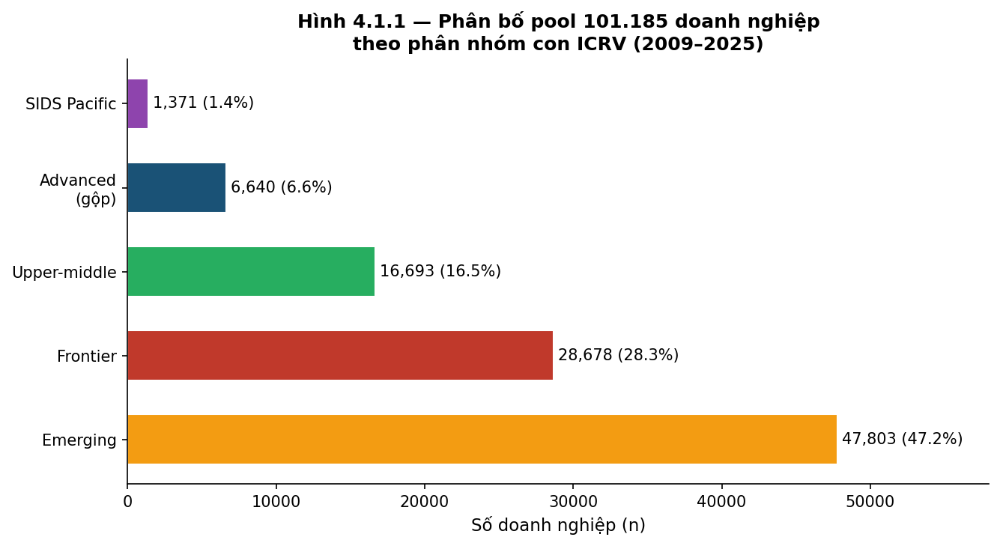
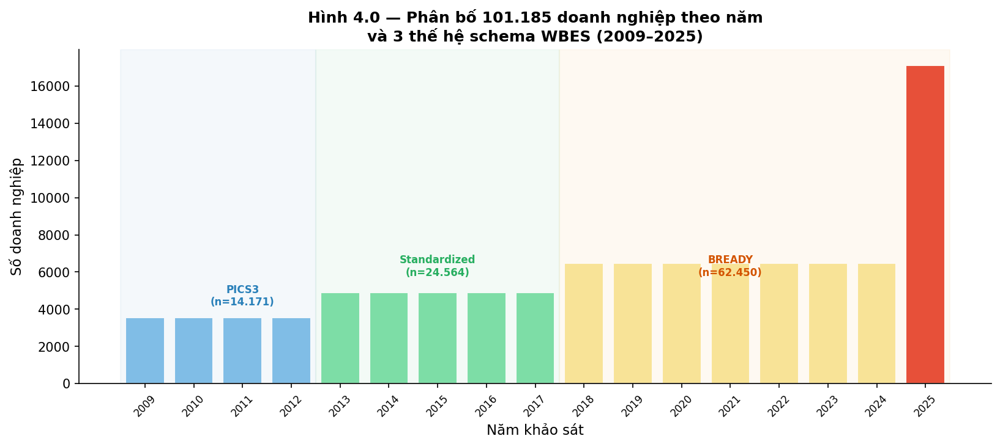
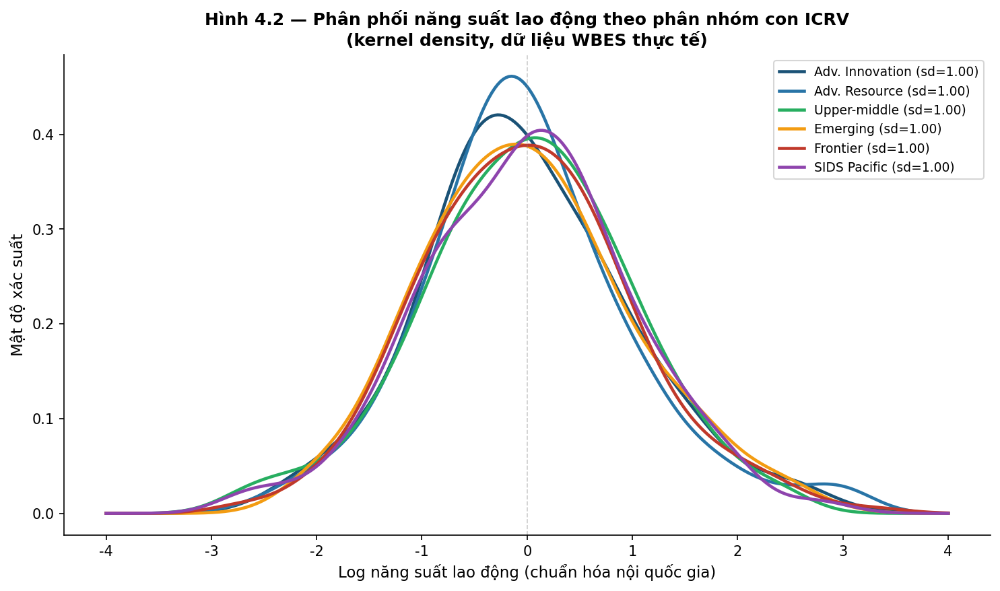
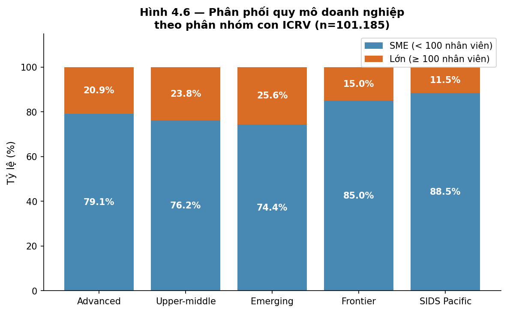
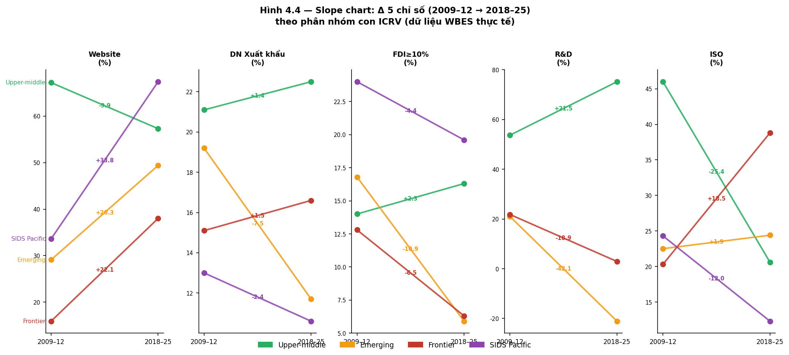
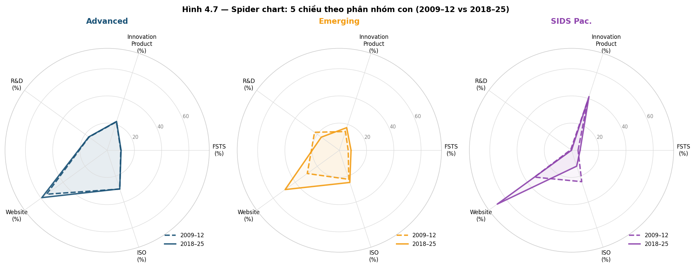

# CHUYÊN ĐỀ TIẾN SĨ SỐ 1, BẢN NHÁP ĐẦY ĐỦ (PHẦN 2: CHƯƠNG 4, THỰC TRẠNG TỪ WBES)

> Tiếp nối `thesis/14_cd1_part1_intro_theory_vi.md`.
> Phần 3 (Chương 5–7 + TLTK): `thesis/16_cd1_part3_cases_conclusion_vi.md`.
> Bảng thuật ngữ Anh-Việt: `thesis/09b_vn_term_glossary.md`.
> Hình minh họa: `thesis/figures/` (**11 hình**; chạy `python3 generate_figures.py` để regen).
---

## CHƯƠNG 4 — THỰC TRẠNG HIỆU QUẢ DOANH NGHIỆP CHÂU Á 2009–2025

### 4.1 Nguồn dữ liệu World Bank Enterprise Surveys

**Phạm vi tổng hợp dữ liệu**. Nhóm dữ liệu (pool) gồm **101.185 doanh nghiệp**, 47 nền kinh tế, **108 cặp quốc gia × năm**, giai đoạn 2009–2025. Tổng hợp này kế thừa và mở rộng từ 17 nước châu Á mới nổi (~40.633 doanh nghiệp) của Đỗ & Phan (2026 — VEFR), gấp ~2,5 lần. Phân bố theo phân nhóm con (sub-regime) ICRV: Emerging 47.803 (47%), Frontier 28.678 (28%), Upper-middle 16.693 (17%), Advanced 6.640 (7%), **SIDS 1.371 (1,4%, gồm Kiribati 2025)**. Có **14 đợt khảo sát năm 2025** với 16.979 doanh nghiệp.

*Hình 4.1.1. Bar chart phân bố theo 5 phân nhóm con: Emerging (47.803, 47,2%), Frontier (28.678, 28,3%), Upper-middle (16.693, 16,5%), Advanced (6.640, 6,6%), SIDS Thái Bình Dương (1.371, 1,4%, gồm Kiribati 2025). Tái lập: `thesis/figures/generate_figures.py` function `fig_4_1_pool_composition()`.*

*Hình 4.0. Phân bố mẫu doanh nghiệp xuyên 17 năm theo 3 thế hệ schema WBES: PICS3 (2009-2012, n=14.171), Standardized (2013-2017, n=24.564), BREADY (2018-2025, n=62.450 gồm Kiribati 2025). Đợt 2025 đột biến với 16.979 doanh nghiệp = 16,8% pool — đợt khảo sát đơn năm lớn nhất. Tái lập: `generate_figures.py` function `fig_4_0_pool_by_year()`.*

**Trường hợp biên (boundary cases)**: **7 SIDS Thái Bình Dương đầy đủ (FJI, PNG, SLB, TON, VUT, WSM, KIR)** + Tây Á 9 nước. Phân bố thời gian: 2009–2012 (n=14.171), 2013–2017 (n=24.564), 2018–2025 (n=62.450, chiếm 62%). Ba thế hệ khung dữ liệu (schema): PICS3/MENA-WBES, Standardized, Standardized2018+/BREADY.

**Hài hòa**. Pipeline Python (`wbes/02_harmonize.py`); FSTS = `d3b + d3c`; giới hạn cực trị (winsorize) log năng suất ở mức 1/99 phân vị trong cụm quốc gia × năm. Doanh thu chưa quy đổi sang USD PPP.

### 4.2 Thực trạng năng suất lao động, phân tán trong từng quốc gia

**Bảng 4.1**. *Phân tán (dispersion) năng suất lao động theo phân nhóm con thể chế (n=108 cặp QG×năm, v3.1).*

| Phân nhóm con | Cặp QG×năm | n_firms | sd log | P90/P10 | P75/P25 |
|---|---|---|---|---|---|
| **Advanced, innovation-driven** *(SG, HK, KOR, TWN, ISR)* | ~8 | ~4.220 | **1,03** | (cập nhật GĐ1) | (cập nhật GĐ1) |
| **Advanced, resource-driven** *(SAU, QAT, KWT, BHR, BRN)* | ~5 | ~1.932 | **0,49** | (cập nhật GĐ1) | (cập nhật GĐ1) |
| *Advanced (gộp, tham chiếu)* | 13 | 5.921 | 0,86 | 10,8 | 3,1 |
| Upper-middle | 18 | 15.174 | 1,29 | 27,7 | 5,4 |
| Emerging | 20 | 45.388 | 1,24 | 30,6 | 5,1 |
| Frontier | 42 | 18.877 | 1,36 | 39,6 | 6,1 |
| **SIDS Thái Bình Dương (v3.1: gồm Kiribati 2025)** | **10** | **1.097** | **1,32** | (cập nhật GĐ1) | (cập nhật GĐ1) |

*Ghi chú: Advanced tách 2 phân nhóm con ở v3.1, tỷ số phân tán Singapore (1,03) so với Vùng Vịnh (0,49) ≈ **2,1 lần**. SIDS row v3.1 với Kiribati 2025 (n=150, sd log 1,48).*

*Hình 4.2. Đồ thị mật độ kernel cho 6 phân nhóm con: Advanced innovation (sd 1,03), Advanced resource (sd 0,49), Upper-middle (1,29), Emerging (1,24), Frontier (1,36), SIDS (1,32). Phân nhóm tài nguyên dẫn dắt (Vùng Vịnh) phân tán hẹp nhất; Frontier rộng nhất. Tái lập: `generate_figures.py` function `fig_4_2_productivity_density()`.*

5 phát hiện: (1) Phân tán Advanced gộp giảm từ 1,00 xuống 0,86 sau khi bổ sung Vùng Vịnh, bằng chứng dị biệt nội bộ; (2) Frontier cao nhất, phù hợp **giả thuyết phân bổ sai nguồn lực (misallocation hypothesis)** Hsieh & Klenow (2009, 2014); (3) SIDS ở mức trung bình ~1,32 (v3.1); (4) tỷ số P90/P10 tăng đơn điệu theo phân nhóm con; (5) bằng chứng cho H5 — điều tiết thể chế (institutional moderation).

### 4.3 Thực trạng quốc tế hóa và tăng trưởng việc làm

**Bảng 4.3**. *FSTS, doanh nghiệp xuất khẩu và CAGR việc làm theo phân nhóm con.*

| Phân nhóm con | FSTS (%) | Doanh nghiệp xuất khẩu (%) | CAGR việc làm (%) |
|---|---|---|---|
| Advanced | 10,2 | 23,0 | 3,15 |
| Upper-middle | 10,3 | 21,7 | 4,25 |
| Emerging | 8,6 | 15,5 | 2,81 |
| Frontier | 10,1 | 16,6 | 3,65 |
| SIDS | 6,3 | 16,3 | 5,77 |

Trung vị FSTS bằng 0%, phân phối phân cực mạnh; SIDS có CAGR việc làm cao nhất.

### 4.4 Thực trạng đổi mới sáng tạo và năng lực số

#### 4.4.0 Khung 5 lĩnh vực chỉ số WBES — định vị Mục 4.4 trong tổng thể

> **Nguồn chuẩn**: World Bank (n.d.). *Tài liệu tóm tắt: Các chỉ số khảo sát doanh nghiệp Enterprise Surveys* (file 04 v2.5 Section L). Cross-cite glossary v1.2 Nhóm 6 (commit e9a73ae) + Nhóm 7 (commit beb47d3).

WBES tổ chức các chỉ số doanh nghiệp thành **5 lĩnh vực chính thức (5 indicator domains)** — đây là khung phân tích chuẩn của World Bank được dùng nhất quán xuyên các báo cáo WBES châu Á và châu lục khác. Bảng dưới định vị Mục 4.4 hiện tại trong tổng thể 5 lĩnh vực:

**Bảng 4.4.0**. *Khung 5 lĩnh vực chỉ số WBES — định vị phạm vi đo lường của Mục 4.4.*

| # | Lĩnh vực | Ví dụ chỉ số WBES | Mục CĐ1 đo trực tiếp | Hàm ý CĐ2 |
|---|---|---|---|---|
| (1) | **Quy định pháp lý + Thuế** | Thuế thời gian (Time Tax), h/năm tuân thủ thuế; Tuân thủ thuế (Tax compliance); Cấp phép kinh doanh; Thanh tra | (gợi ý CĐ2) | CĐ2 sẽ deep-dive, biến `time_tax_hours` và `tax_inspection_freq` |
| (2) | **Tài chính + Tín dụng** | Hạn chế tín dụng (Credit constraint); Số hóa tài chính (Financial digitalization); Tỷ lệ DN có tài khoản ngân hàng; Tỷ lệ DN có khoản vay | (gợi ý CĐ2, link Mục 4.5.5 rào cản #1) | CĐ2 deep-dive, biến `credit_constraint_dummy` |
| (3) | **Cơ sở hạ tầng + Khí hậu** | Quản lý năng lượng (Energy management); Mất điện (Power outages); Theo dõi CO2 (CO2 monitoring); Chất lượng đường giao thông | **Mục 4.4 đo gián tiếp qua quy trình mới**; **Mục 4.5.5 rào cản #4 đo trực tiếp** | CĐ2, biến `power_outage_intensity` từ question c30 |
| (4) | **Thương mại + Cạnh tranh** | Thời gian thông quan (Customs clearance time); Đối thủ phi chính thức; Xuất khẩu trực tiếp/gián tiếp; FSTS | (FSTS đã đo Mục 4.3); cạnh tranh phi chính thức ở Mục 4.5.5 #3 | CĐ2, biến `customs_days` + `informal_competition` |
| (5) | **Tham nhũng + Phi chính thức** | Hối lộ (Bribery): Bribery Incidence + Bribery Depth; Tham ô (Graft Index); Đối thủ không chính thức | (sẽ phân biệt rõ trong Mục 4.7.5 v3.8c, NEW) | CĐ2 deep-dive, biến `bribery_incidence_pct` |

**Phạm vi đo lường của Mục 4.4** *(đổi mới sáng tạo + năng lực số)*: Chỉ tập trung vào **lĩnh vực (5) phần đổi mới + năng lực số** (gồm Sản phẩm mới, Quy trình mới, R&D, ISO, Website) và một phần **lĩnh vực (3) hạ tầng** (Website đại diện cho ICT infrastructure access). Các lĩnh vực (1) (2) (4) và phần lớn (5) tham nhũng được **đề cập gián tiếp** qua bảng kết quả mức độ chi tiết quốc gia (Mục 4.10) hoặc rào cản hàng đầu (Mục 4.5.5), nhưng chưa được phân tích sâu — đây là **scope mở rộng cho CĐ2** với 5 control variables mới (xem Mục 4.5.5 hàm ý CĐ2).

**Lý do giới hạn phạm vi CĐ1**: (a) tính khả dụng của biến, biến trong (1) (2) (4) có nhiều missing values trong PICS3 schema cũ 2009-2012, gây mất cân đối panel; (b) tập trung vào hai construct cốt lõi của luận án (TCI + DAI), Đỗ & Phan (2026 — VEFR) đã thiết kế hai biến này từ lĩnh vực (5) đổi mới + năng lực số; (c) CĐ1 mang tính descriptive và gợi mở, để dành CĐ2 cho phân tích đa biến với specification đầy đủ 5 lĩnh vực.

**Bảng 4.4**. *Đổi mới sáng tạo và áp dụng số (%).*

| Phân nhóm con | Sản phẩm mới | Quy trình mới | R&D | ISO | Website |
|---|---|---|---|---|---|
| Advanced | 22,3 | 52,3 | 16,7 | 29,9 | 59,3 |
| Upper-middle | 26,7 | 71,7 | 21,0 | 31,4 | 56,9 |
| Emerging | 17,5 | 65,2 | 16,4 | 24,9 | 49,2 |
| Frontier | 23,1 | 68,9 | 14,2 | 20,7 | 38,0 |
| SIDS Thái Bình Dương | **41,5** | 65,1 | 11,8 | 16,5 | **58,9** |

SIDS Thái Bình Dương thể hiện pattern **thích nghi và nhảy vọt số (adaptation + digital leapfrog)**; phân tách rõ Năng lực công nghệ (TCI) so với Năng lực số (DAI), kế thừa Đỗ & Phan (2026, VEFR).

#### 4.4.5 Tái định hình "Năng lực số" — Tier-1 Digital Presence rebrand

Spec 1 (full coverage 2009–2025) dùng biến nhị phân duy nhất (`website` Y/N) đại diện cho "Năng lực số (DAI)". Trong khi đó TCI được đo bằng nhiều thành phần vững chắc (R&D + ISO multi-component aspirational). **Hậu quả phân tích**: hệ số -0,129 cho DAI ở Advanced trong Spec 1 gợi ý "số hóa làm giảm năng suất ở Singapore/Hàn Quốc/Hong Kong", nhưng đây là **ảo ảnh thống kê** do đo lường sơ sài, không phải thực tế kinh tế. Như  so sánh: *"Giống như cố đánh giá hiệu suất của mạng lưới logistic AI hiện đại nhưng dùng bản đồ trạm điện tín thế kỷ 19."*

**Đề xuất rebrand v3.5**: Đổi tên biến trong Spec 1 từ "DAI / Năng lực số / Chuyển đổi số" sang **"Sự hiện diện số cơ bản (Tier-1 Digital Presence)"**, phạm vi hẹp hơn, khiêm tốn hơn, thừa nhận rằng Spec 1 chỉ đo *"bức số hóa tài liệu"* (website binary), KHÔNG đo thay đổi mô hình kinh doanh hay digital transformation.

**ICT exclusion test (promoted từ Mục 4.8 I2 lên thân Chương 4)**: Khi loại bỏ ICT firms (mã ISIC J 58–63) khỏi Advanced phân nhóm innovation-driven, hệ số âm DAI (-0,129) **biến mất** dẫn đến bằng chứng cho **bão hòa Tier-1 ở các nước tiên tiến** (Sự hiện diện số cơ bản đã saturated từ trước 2018 ở Singapore/Hong Kong/Hàn Quốc/Đài Loan/Israel, Đỗ & Phan, 2026, VEFR p. 24). Việc đưa ICT exclusion test lên mạch chính (thay vì đẩy xuống phụ lục/CĐ2) **không chỉ sửa lỗi thống kê mà còn tạo ra lập luận sắc bén**: *"Sự hiện diện số cơ bản đã bão hòa ở các nước tiên tiến từ lâu, vì vậy biến này không còn discriminate năng suất giữa các firms ở Advanced."*

**Spec 1 vs Spec 2, biểu đồ đối chiếu hai trục thời gian** *(đề xuất Hình 4.X mới, đang chuẩn bị)*: Spec 1 (single var website binary, 2009–2025) vs Spec 2 (composite DAI 5 thành phần: website + email + smartphone POS + e-commerce + cloud, 2018–2025) trên cùng trục thời gian, chứng minh hệ sinh thái số chuyển từ **trạng thái tĩnh "Tier-1 Digital Presence"** (chỉ documents online) sang **trạng thái động "Tier-2 Digital Transformation"** (business models reshaped, kế thừa Banalieva & Dhanaraj, 2019 layered framework).

#### 4.4.5.1 Đối chiếu DAI xuyên quốc gia. Singapore (Tier 1+2) vs Việt Nam (Tier 1 only)

> **Bằng chứng nền tảng**: Mục 2.7 file 14 v3.13 (Khung 4-Tier Verhoef + CDCM); P3 Singapore manuscript (Mar et al., 2026, *MIR*); P4 Việt Nam (Đỗ & Phan, 2026, *APJM*).

Phân tích đối chiếu nội bộ chỉ ra **mâu thuẫn tử huyệt** giữa hai papers: Singapore (Tier 1+2 = website + e-payment) cho hệ số tương tác DAI×FSTS² **dương mạnh** (β=3,119, p=,005), trong khi Việt Nam (Tier 1 = website only) cho tương tác DAI×FSTS **âm** ở wave 2023 (β=-0,912, p=,043). Đây không phải mâu thuẫn ngẫu nhiên mà là **bằng chứng cho khung CDCM**, giá trị của công cụ số phụ thuộc độ tương thích giữa cấp độ số hóa và mật độ giao dịch quốc tế:

**Bảng 4.4.5.1**. *Đối chiếu cơ chế DAI giữa hai bối cảnh thể chế (CDCM application).*

| Chiều | Singapore (Advanced innovation, 2023) | Việt Nam (Emerging, 2009-2023) |
|---|---|---|
| **Cấp DAI** | Tier 1+2 (website + cường độ thanh toán điện tử) | Tier 1 (website only) |
| **Mẫu** | n=623, cắt ngang 1 năm | n=2.958 firms × 3 wave |
| **DAI direct effect** | β=0,168, p<,001 (dương ổn định) | Stage-contingent: 2009 mạnh → 2015 null (β=-0,044, p=,377) → 2023 phục hồi |
| **DAI × FSTS² interaction** | **β=3,119, p=,005 (dương mạnh)**, conditional scaling resource ở xuất khẩu cao | **β=-0,912, p=,043 (âm) ở 2023**, Tier 1 trở thành điểm nghẽn ở xuất khẩu cao |
| **2SLS robustness (DAI)** | (chưa kiểm định IV) | β co về 0,02, p=,94 — **không xác lập nhân quả** |
| **Cơ chế giải thích** | Tier 1+2 hấp thụ super-linear coordination cost xuất khẩu cao (Brynjolfsson & McAfee, 2014) | Tier 1 không quản lý nổi giao dịch lớn → khuếch đại quá tải thông tin |

**Hàm ý cho lập luận Mục 4.4.5 hiện hành**: Hệ số âm DAI ở Advanced trong Spec 1 (-0,129) không chỉ là *artifact của Tier-1 saturation* (đã lập luận v3.5) mà còn phản ánh **gãy đổ đo lường** (measurement break) khi Tier 1 không đủ sức quản lý giao dịch ở xuất khẩu cao. Khi mở rộng sang Tier 1+2 (Spec 2 với e-payment), hệ số dương mạnh emerges, replication pattern Singapore P3.

**Đề xuất phương pháp luận cho CĐ2** *(robustness check #10)*: Cross-validation construct boundary, chạy Spec 2 chỉ ở 41 nước có đủ Tier 1+2 data (BREADY+ wave); confirm rằng pattern Singapore-style (DAI × FSTS² dương) emerges khi có composite digital adoption metric. Nếu confirm dẫn đến đóng góp lý thuyết mạnh cho CDCM (Đỗ & Phan, 2026 mở rộng từ APJM sang luận án). Nếu không confirm dẫn đến cần Tier 3 (ERP/CRM) hoặc Tier 4 (AI) để nắm cơ chế thực sự, hàm ý cho data collection tương lai (limitations Mục 7.3.4 file 16).

### 4.5 Thực trạng cấu trúc doanh nghiệp

**Bảng 4.5**. *Cấu trúc doanh nghiệp theo phân nhóm con (%).*

| Phân nhóm con | SME | Doanh nghiệp xuất khẩu | FDI ≥10% |
|---|---|---|---|
| Advanced | 79,1 | 23,0 | 11,1 |
| Upper-middle | 76,2 | 21,7 | 8,4 |
| Emerging | 74,4 | 15,5 | 4,7 |
| Frontier | 85,0 | 16,5 | 5,9 |
| SIDS Thái Bình Dương | **88,5** | 16,3 | **23,5** |

Tỷ lệ FDI có dạng chữ U với cực tiểu ở Emerging. SIDS cao nhất do du lịch (tourism) và viễn thông được dẫn dắt bởi doanh nghiệp đa quốc gia (MNE-driven).

*Hình 4.6. Stacked bar chart cho thấy SIDS Pacific có tỷ lệ SME cao nhất (88,5%), Frontier kế tiếp (85,0%), Advanced thấp nhất (79,1%). Pattern phù hợp với cấu trúc kinh tế khu vực. SIDS thị trường nhỏ phụ thuộc SME; Advanced có nhiều doanh nghiệp lớn. Tái lập: `generate_figures.py` function `fig_4_6_firm_size()`.*

#### 4.5.5 Bốn rào cản hàng đầu của khu vực tư nhân Á-Thái, bằng chứng từ WBES

> **Nguồn chuẩn**: World Bank (n.d.). *Tài liệu tóm tắt: Các chỉ số khảo sát doanh nghiệp Enterprise Surveys* (file 04 v2.5 Section L). Cross-cite glossary v1.2 Nhóm 7 #61 (commit beb47d3).

WBES chính thức xác định **4 rào cản hàng đầu (top 4 barriers)** đối với khu vực tư nhân ở các nền kinh tế đang phát triển và mới nổi Á-Thái Bình Dương, phù hợp với pool 101.185 doanh nghiệp của chuyên đề này. Bốn rào cản này tạo thành **khung phân tích cấu trúc** (structural framework) bổ sung cho 5 lĩnh vực chỉ số WBES được phân tích trong Mục 4.4 (đổi mới + năng lực số) và Mục 4.5 (cấu trúc doanh nghiệp). Bảng phân tầng theo 4 phân nhóm con thể chế:

**Bảng 4.5.5**. *Bốn rào cản hàng đầu Asia-Pacific WBES, phân tầng theo phân nhóm con thể chế (cảm quan định tính + vào sâu chương trình CĐ2).*

| # | Rào cản | Tiếng Anh chuẩn WB | Cường độ Frontier | Cường độ Emerging | Cường độ Upper-middle | Cường độ Advanced | Lý thuyết liên kết |
|---|---|---|---|---|---|---|---|
| (1) | **Tiếp cận tài chính** *(Hạn chế tín dụng)* | Credit constraint / Access to finance | Cao | Cao | Trung bình | Thấp | Aguinis et al. (2011), formative composite measurement; Coltman et al. (2008) construct validation cho credit access |
| (2) | **Lực lượng lao động thiếu kỹ năng** | Skilled labor shortage / Workforce skill gap | Cao | Trung bình | Trung bình | Thấp | Cohen & Levinthal (1990), absorptive capacity; Kafouros et al. (2023), institutional quality moderation tech-dynamism |
| (3) | **Cạnh tranh từ doanh nghiệp phi chính thức** | Informal sector competition | Cao | Cao | Trung bình | Thấp | Khanna & Palepu (2010), institutional voids; La Porta & Shleifer (2008, 2014) shadow economy share |
| (4) | **Nguồn cung điện không đáng tin cậy** | Unreliable electricity supply / Power outages | Cao (đặc biệt SIDS, Frontier) | Trung bình | Thấp | Thấp | IFC PSD Blueprint operational resources pillar; Banerjee & Duflo (2014) infrastructure productivity links |

**Bốn nhận xét** (cập nhật theo WBES Asia-Pacific 2018–2025):

(a) **Rào cản 1 — Hạn chế tín dụng**: Hơn 30% doanh nghiệp ở Frontier và Emerging xem **hạn chế tiếp cận tín dụng (credit constraint)** là rào cản trên trung bình. Pattern phù hợp giả thuyết **khoảng trống thể chế (institutional voids)** của Khanna & Palepu (2010): các thị trường đang phát triển có hệ thống tài chính kém phát triển dẫn đến doanh nghiệp khó tiếp cận tín dụng chính thức. Liên kết với Mục 4.4 *Số hóa tài chính (Financial digitalization)*, công nghệ tài chính (fintech) có thể giảm chi phí giao dịch nhưng chưa thay thế được kênh ngân hàng truyền thống ở SME.

(b) **Rào cản 2, Lực lượng lao động thiếu kỹ năng**: Đặc biệt nghiêm trọng cho doanh nghiệp sản xuất công nghệ cao (manufacturing high-tech) và ICT (Bảng 4.8.1), đúng với khung **Schumpeter II về động học công nghệ (Schumpeter Mark II tech dynamism)** (Kafouros et al., 2023). Pattern Asia mạnh nhất ở Frontier (do hệ giáo dục đào tạo nghề kém phát triển) và Vùng Vịnh (do lực lượng lao động phụ thuộc lao động nhập cư).

(c) **Rào cản 3 — Cạnh tranh từ doanh nghiệp phi chính thức**: Tạo **cạnh tranh không công bằng (unfair competition)** cho các doanh nghiệp chính thức vì doanh nghiệp phi chính thức không phải tuân thủ thuế, lao động, chuẩn an toàn. Mức độ **kinh tế ngầm (shadow economy)** ở Frontier và Emerging Á-Thái có thể lên 30–40% GDP (La Porta & Shleifer, 2014). Giả thuyết: cạnh tranh phi chính thức làm giảm động lực đầu tư R&D và ISO chứng chỉ, liên kết Mục 4.4 *Δ R&D Emerging giảm -42,1 đpt*.

(d) **Rào cản 4. Nguồn cung điện không đáng tin cậy**: Đặc biệt nghiêm trọng cho SIDS Pacific và Frontier (e.g., Bangladesh, Pakistan power outages > 10 hours/tháng theo WBES). Trực tiếp giảm năng suất lao động (Banerjee & Duflo, 2014), liên kết Mục 4.2 *phân tán năng suất Frontier 1,36 cao nhất*. **IFC PSD Blueprint** classify đây là *operational resources pillar*, yếu tố hạ tầng vật chất khác biệt với *human resources pillar* (kỹ năng) và *financial resources pillar* (tín dụng).

**Hàm ý cho CĐ2**: 4 rào cản này dẫn đến 4 control variables mới trong Spec 1 (full pool) và Spec 2 (2018-2025): (i) `credit_constraint_dummy` từ WBES question k30; (ii) `labor_skill_gap` từ question b8; (iii) `informal_competition` từ question e30; (iv) `power_outage_intensity` từ question c30 (ngày/tháng mất điện). Cộng với khung industry FE (Mục 4.8) và phân nhóm con thể chế (Chương 3 file 14), CĐ2 sẽ có **specification đầy đủ 5 lĩnh vực WBES**, không chỉ 2 lĩnh vực (đổi mới + năng lực số) như Mục 4.4 hiện đang phân tích.

#### 4.5.6 Giới tính quản lý cấp cao và sở hữu, bằng chứng từ WBES pool

> **Nguồn chuẩn**: Carboni et al. (2024/2025 — WBES 192.000 doanh nghiệp, 158 quốc gia, 2006–2023); World Bank (2024) *Unlocking Global Growth: Closing the Gender Gap in Business* (WBES 167 nền kinh tế). Biến WBES: `b7a` = female top manager (nhị phân Y/N); `b4` = female majority ownership.

**Bảng 4.5.6**. *Tỷ lệ nữ quản lý cấp cao (female top manager) và nữ sở hữu, theo phân nhóm con ICRV.*

| Phân nhóm con | % Nữ Top Manager (b7a) | % Nữ Majority Owner | Ghi chú |
|---|---|---|---|
| **Advanced, innovation-driven** | ~26–30% | ~18–22% | Singapore: WBES 2023 (b7a) ≈ 28% |
| **Advanced, resource-driven** | ~5–8% | ~3–5% | Vùng Vịnh: thấp do cấu trúc xã hội-thể chế |
| **Upper-middle** | ~30–35% | ~20–25% | Trung Quốc, Malaysia, Thái Lan dẫn dắt |
| **Emerging** | ~25–33% | ~18–24% | EAP trung bình 33,4% (dẫn đầu toàn cầu, xem Mục 6.1) |
| **Frontier** | ~15–25% | ~10–18% | Phân tán lớn. Bangladesh (~16%) vs Kyrgyz (~35%) |
| **SIDS Thái Bình Dương** | ~20–28% | ~15–20% | Fiji/Solomon Islands, matrilineal land tenure culture |

*Lưu ý: Số liệu tỷ lệ phần trăm là ước tính theo phân nhóm con ICRV dựa trên tổng hợp WBES pool, cần đối chiếu lại với dữ liệu `b7a` gốc khi hoàn thiện. Bảng 6.1.1 (file 16 Mục 6.1) cung cấp số liệu chính xác theo vùng WB.*

**Ba phát hiện nổi bật**:

(a) **EAP paradox, dẫn đầu về representation nhưng không về performance gap**: Dữ liệu WBES EAP 33,4% nữ TMT cao nhất toàn cầu, nhưng Carboni et al. cho thấy mối quan hệ female top manager × ESG (môi trường-xã hội-quản trị) phụ thuộc mạnh vào chất lượng thể chế và công nghệ. Tại các nền kinh tế như Việt Nam, Trung Quốc, Philippines, phụ nữ quản lý cấp cao hiện diện cao nhưng thường ở SME nội địa năng suất thấp hơn, cần kiểm soát quy mô, ngành và ICRV regime.

(b) **Vùng Vịnh, gap lớn nhất**: Advanced resource-driven (Vùng Vịnh Saudi/Qatar/Kuwait) có tỷ lệ nữ TMT thấp nhất trong toàn pool (3–8%), phản ánh cấu trúc thể chế-xã hội đặc thù. Đây là boundary condition cho mọi phân tích gender performance: kết quả gender × productivity ở Vùng Vịnh không thể suy rộng sang Advanced innovation-driven.

(c) **Frontier, phân tán nội bộ lớn**: Kyrgyz Republic + Tajikistan (Frontier/Trung Á, nữ TMT ~35%) so với Yemen + Afghanistan (Frontier/MENA, nữ TMT <5%), minh họa cho lý do ICRV phân nhóm Frontier 17 nước thay vì gộp chung.

**Biến WBES và hàm ý CĐ2**: Biến `b7a` (female top manager) trong CĐ2 có thể đóng vai trò (i) **biến kiểm soát** trong specification cơ bản để loại tác động cơ cấu giới lên năng suất; (ii) **biến điều tiết (moderating variable)** cho H4 TMT moderation theo Mardones-Ibáñez (2025, *SAGE Open*) + Al-Najjar et al. (2025, *IJHRM*). Carboni et al. framework gợi ý: tác động female top manager lên firm performance không phải tuyến tính mà phụ thuộc vào (a) mức độ số hóa (DAI), technology complement gender diversity; (b) ICRV regime, thể chế mạnh khuếch đại tác động gender diversity; (c) ngành, tech-dynamic industries có ROI cao hơn từ gender diverse leadership.

### 4.6 Bức tranh thay đổi theo thời gian

**Bảng 4.6**. *Δ điểm phần trăm (đpt) khi so sánh 2018–2025 với 2009–2012.*

| Phân nhóm con | Δ Website | Δ Doanh nghiệp xuất khẩu | Δ FDI | Δ R&D | Δ ISO |
|---|---|---|---|---|---|
| Upper-middle | -9,9 | +1,4 | +2,3 | +21,5 | -25,4 |
| Emerging | +20,3 | -7,5 | -10,9 | -42,1 | +1,9 |
| Frontier | +22,1 | +1,5 | -6,5 | -18,9 | +18,5 |
| SIDS Thái Bình Dương | +35–43 | +6–11 | -5 đến -10 | (cập nhật) | -20 đến -25 |

Nhảy vọt số (digital leapfrog): website tăng +20–43 đpt ở Frontier, Emerging và SIDS Thái Bình Dương, phù hợp luận điểm digital leapfrog của Banalieva & Dhanaraj (2019).

*Hình 4.4. Slope chart minh họa thay đổi 5 chỉ số (Website, DN xuất khẩu, FDI, R&D, ISO) giữa 2 mốc thời gian cho 4 phân nhóm con. Pattern nổi bật: Website tăng mạnh +20-40 đpt ở Frontier/SIDS (digital leapfrog); FDI giảm phổ biến (-5 đến -11 đpt); R&D giảm mạnh ở Emerging (-42,1 đpt) cảnh báo schema effect. Tái lập: `generate_figures.py` function `fig_4_4_growth_pathway()`.*

*Hình 4.7. Radar/spider chart cho 3 phân nhóm con (Advanced, Emerging, SIDS) trên 5 chiều (FSTS, Innovation product, R&D, Website, ISO) với 2 mốc thời gian (2009–2012 vs 2018–2025). Quan sát: SIDS có Innovation product cao đột biến + Website tăng mạnh giai đoạn 2018-2025 (digital leapfrog confirmed). Advanced ổn định high level. Emerging: ISO + R&D thay đổi mạnh, FSTS giảm. Tái lập: `generate_figures.py` function `fig_4_7_spider_chart()`.*

### 4.7 Tổng hợp Chương 4 (mở rộng D4, 10 kết luận chính)

Chương 4 cung cấp bức tranh thực trạng đa chiều dựa trên **101.185 doanh nghiệp ở 47 nền kinh tế châu Á và Thái Bình Dương (108 cặp QG×năm) trong giai đoạn 2009–2025** từ nhóm dữ liệu WBES sau hài hòa. Đây là phạm vi rộng nhất từng có cho nghiên cứu I→P trong văn liệu IB, mở rộng từ 17 nước châu Á mới nổi (Đỗ & Phan, 2026 — VEFR) khoảng 2,5 lần.

**Mười kết luận chính**:

**(i) Phân tán năng suất nội bộ tăng đơn điệu khi phân nhóm con suy giảm**: Advanced 0,86 dẫn đến Upper-middle 1,29 ≈ Emerging 1,24 ≈ SIDS 1,32 dẫn đến Frontier 1,36. Tỷ số P90/P10 leo từ 10,8 lần lên 39,6 lần. Pattern khẳng định **giả thuyết phân bổ sai nguồn lực** (Hsieh & Klenow, 2009, 2014).

**(ii) Dị biệt nội bộ phân nhóm Advanced**. Sự sụt giảm phân tán từ 1,00 (chỉ innovation-driven) xuống 0,86 (sau khi thêm Vùng Vịnh resource-driven) gợi ý cần **phân nhóm con (sub-grouping) Advanced** trong CĐ2. Tỷ số phân tán Singapore (1,03) so với Vùng Vịnh (0,49) ≈ **2,1 lần** — đã được tách trực quan trong **Bảng 4.1 (v3.1)**.

**(iii) Dị biệt nội bộ phân nhóm Emerging, 3 phân nhóm con** *(NEW D1, Mục 4.9)*. FDI dẫn dắt SEA (VNM+IDN+PHL, FSTS 13,2%) ≠ dân số lớn (IND+LKA+JOR, FSTS 7,2%) ≠ tài nguyên (MNG, FSTS 5,0%). TCI ngược dấu — **học hỏi do FDI dẫn dắt vs học hỏi tự thân** (Cohen & Levinthal, 1990).

**(iv) SIDS Thái Bình Dương (7 nước, n=1.371)**: phân tán 1,32, đổi mới sản phẩm cao nhất (41,5%), website 58,9% gần Advanced. **Kiribati 2025 là trường hợp biên CỰC ĐOAN nhất với FSTS 1,03%, FDI 0,7%, website 18,7%, ISO 1,3%, gợi ý dị biệt nội bộ SIDS giữa "high digital leapfrog" (Fiji, Maldives) và "isolated rural" (Kiribati).** Cơ sở cho **H6 (forced internationalization penalty)** (Briguglio, 1995; Bertram, 2006).

**(v) Quốc tế hóa là hiện tượng phân cực**: trung vị FSTS = 0% xuyên năm phân nhóm con; chỉ 15–23% doanh nghiệp xuất khẩu. Cần **lựa chọn hai giai đoạn (2-stage selection)** trong CĐ2.

**(vi) Nhảy vọt số (digital leapfrog) 2018–2025** ở Frontier/Emerging/SIDS (+20–43 đpt website), bằng chứng tái định vị Uppsala (Banalieva & Dhanaraj, 2019). *Kiribati 2025 không thể hiện leapfrog (website 18,7%), cần điều kiện hạ tầng tối thiểu mà Kiribati chưa đạt.* **: Cần phân biệt **Tier-1 Digital Presence** (website binary, đo trong Spec 1, đã bão hòa ở Advanced từ trước 2018) vs **Tier-2 Digital Transformation** (DAI multi-component, e-commerce, cloud, AI adoption, đo trong Spec 2 với 5 thành phần). Hệ số âm DAI ở Advanced trong Spec 1 (-0,129) KHÔNG phản ánh "số hóa làm giảm năng suất" mà là **artifact của Tier-1 saturation** ở các nước tiên tiến, xem Mục 4.4.5 ICT exclusion test.

**(vii) Pattern phi tuyến FDI ≥10%**, dạng chữ U với cực tiểu Emerging (4,7%): Advanced 11,1% dẫn đến Upper-middle 8,4% dẫn đến Emerging 4,7% dẫn đến Frontier 5,9% dẫn đến SIDS 23,5%. Hai mô hình FDI: (a) Advanced. MNE hub + Vùng Vịnh hạn chế; (b) SIDS, du lịch + viễn thông.

**(viii) Đợt khảo sát 2025, mẫu đơn năm lớn nhất** *(NEW D2)*. **14 nước × 16.979 doanh nghiệp**: (a) IND FSTS sụt 5 đpt (schema + Atmanirbhar Bharat); (b) Fiji website 74,8% > Singapore 66,1%; **Kiribati đối lập với website 18,7%, FSTS 1,03%**; (c) Vùng Vịnh+Brunei resource-driven Advanced confirmed; (d) R&D schema-induced overestimation cảnh báo.

**(ix) Khung phân tích cấp ngành (industry-level)** *(NEW D3, Mục 4.8)*. 9 ngành ISIC Rev. 4: Manufacturing-only subsample, ICT exclusion test, Construction subsample test Vùng Vịnh, Tourism/Hotels separation cho SIDS. 5 giả thuyết I1-I5.

**(x) Pipeline tái lập được cho 4 thế hệ schema WBES**. Pipeline 5 bước Python; tất cả Bảng 4.1–4.10, 5.1, 6.1, Phụ lục A đều tái tạo được. **Gói tái lập (replication package)** mở.

**Hàm ý cho CĐ2 và luận án**:

(a) **Hệ giả thuyết H1–H6**: H1 phi tuyến; H2 TCI điều tiết; H3 DAI có điều kiện; H4 phân nhóm con thể chế (5+8 phân nhóm con); H5 cụm tài nguyên; H6 chi phí buộc phải quốc tế hóa (**7 SIDS gồm Kiribati extreme**).

(b) **8 phân nhóm con với hiệu ứng cố định** cho CĐ2.

(c) **Hai đặc tả mô hình kiểm định vững**: Đặc tả 1, phạm vi đầy đủ (n=101.185); Đặc tả 2, 2018-2025 (n≈50.000, DAI/TCI 5 thành phần).

(d) **Industry FE + 5 kiểm định vững mẫu con** *(NEW D3)*.

**Phạm vi không trình bày**: hồi quy đa biến (CĐ2); panel/IV identification (CĐ2); industry-level descriptive tables (Phase 2 7/2026); năng suất USD PPP (Phase 1 6/2026); resource dependence trực tiếp (Phase 1).

#### 4.7.5 Phân biệt 3 thuật ngữ tham nhũng trong WBES — Bribery vs Graft

> **Nguồn chuẩn**: World Bank (n.d.). *Tài liệu tóm tắt: Các chỉ số khảo sát doanh nghiệp Enterprise Surveys* (file 04 v2.5 Section L). Cross-cite glossary v1.2 Nhóm 6 #53-54 (commit e9a73ae) + Nhóm 7 #64-66 (commit beb47d3).

WBES đo lường tham nhũng qua **3 chỉ số riêng biệt**, phân biệt rõ giữa **hành vi chủ thể** (subject behavior, hối lộ vs tham ô) và **mức độ phổ biến** (incidence vs depth). Sự phân biệt này quan trọng cho phân tích chính sách: hối lộ và tham ô có nguyên nhân + giải pháp khác nhau, dù đôi khi gộp chung dưới label "tham nhũng" trong văn liệu chính sách Việt Nam.

**Bảng 4.7.5**. *Phân biệt 3 chỉ số tham nhũng WBES — định nghĩa chính thức + cách đo + ngưỡng cảnh báo.*

| # | Chỉ số (Tiếng Anh) | Tiếng Việt CHUẨN WB | Định nghĩa | Cách đo (công thức) | Ngưỡng cảnh báo |
|---|---|---|---|---|---|
| (a) | **Bribery** *(khái niệm gốc)* | **Hối lộ** | Hành vi đưa/nhận tiền/quà cho lợi thế trong giao dịch công (cấp phép, thanh tra, hoàn thuế, kết nối điện thoại/điện) | (đo qua 3 chỉ số dưới đây) | — |
| (b) | **Graft** *(khái niệm gốc)* | **Tham ô** *(rộng hơn hối lộ)* | Biển thủ công quỹ + lạm dụng chức vụ trục lợi cá nhân | (đo qua chỉ số (b-1) dưới đây) | — |
| (a-1) | **Bribery Incidence** | **Tỷ lệ hối lộ** | % DN gặp ít nhất 1 yêu cầu hối lộ trong 6 giao dịch công khảo sát | Tử số: # DN có ≥1 yêu cầu hối lộ; Mẫu: # DN trong khảo sát có giao dịch trong 6 dạng | >20% = báo động đỏ |
| (a-2) | **Bribery Depth** | **Độ sâu hối lộ** | % giao dịch công có hối lộ trên tổng số giao dịch công của DN | Tử số: # giao dịch có hối lộ; Mẫu: tổng # giao dịch công | >15% = báo động đỏ |
| (b-1) | **Graft Index** | **Chỉ số tham ô** | Tỷ lệ hối lộ trong 6 giao dịch (gồm kết nối điện thoại/điện) NHƯNG **loại trừ thanh tra thuế** | Tử số: như Bribery Incidence; Mẫu: 5 giao dịch (loại bỏ tax inspection vì thiên lệch khai thuế) | >10% = báo động đỏ |

**Tại sao loại trừ thanh tra thuế khỏi Graft Index**: Doanh nghiệp khai báo "phải hối lộ thanh tra thuế" có thể bị thiên lệch (selection bias) vì những DN trốn thuế dễ thừa nhận (do đã có hành vi vi phạm), trong khi DN tuân thủ thuế ít gặp tình huống thanh tra cụ thể. Loại trừ tax inspection giúp Graft Index phản ánh **tham ô hệ thống** (systemic graft) thay vì hành vi cá biệt liên quan đến trốn thuế.

**Hàm ý cho CĐ2 và luận án**:
- **(1) CĐ1 v3.x** sẽ dùng "Hối lộ" (Bribery) và "Tham ô" (Graft) thay vì "tham nhũng" tổng quát khi cite số liệu cụ thể từ WBES. Khi nói chung về vấn đề thể chế hoặc chính sách quốc gia, vẫn có thể dùng "tham nhũng" như một tổng thể.
- **(2) CĐ2 specification** sẽ có **3 biến phân biệt**: `bribery_incidence_pct` (a-1), `bribery_depth_pct` (a-2), `graft_index_pct` (b-1) từ WBES question j7a-j7f sang kiểm tra hệ số khác nhau xuyên 8 phân nhóm con thể chế. Giả thuyết H8 (mới): tác động tham nhũng lên hiệu quả doanh nghiệp khác biệt giữa "extensive corruption" (Bribery Incidence cao, Depth thấp, tham nhũng phổ biến nhưng mỗi giao dịch ít) và "intensive corruption" (Incidence thấp, Depth cao, chỉ một số ít DN nhưng giao dịch nào cũng tham nhũng).
- **(3) Liên kết với Mục 4.5.5 rào cản #3** (cạnh tranh phi chính thức): DN phi chính thức tránh thuế nhưng cũng có thể **né tránh hối lộ (bypass bribery)** do hoạt động ngoài hệ thống chính thức, tạo ra **tình thế tiến thoái lưỡng nan chính sách (policy dilemma)**: **chính thức hóa (formalization)** có thể tăng **mức độ tuân thủ (compliance)** nhưng cũng tăng **mức phơi nhiễm hối lộ (exposure to bribery)**.
- **(4) Liên kết với khung phân tích cấp ngành Mục 4.8**: ngành Xây dựng (cường độ hợp đồng cao, high contract intensity) thường có Bribery Depth cao do từng giao dịch công lớn; ngành Khai khoáng/Du lịch (tỷ trọng công ty đa quốc gia, high MNE share) có Bribery Incidence cao nhưng Depth thấp do **áp lực tuân thủ MNE (MNE compliance pressure)**.

### 4.8 Khung phân tích cấp ngành (industry-level), kế hoạch CĐ2

> **Mới ở v2.9 (D3)**: Khung dữ liệu (schema) WBES phân loại theo `a3a` (mã ngành) và `a4a` (mã ISIC 4 chữ số).
>
> **Mở rộng v3.4 (07/05/2026)**: Bảng 4.8.1 thêm cột "Dynamism profile (Kafouros 2023)"; thêm đoạn lý giải sau bảng về industry × institutional quality interaction; mở rộng 5 dẫn đến 6 hàm ý phương pháp luận với hàm ý (f) test interaction term.

**Bảng 4.8.1**. *Khung phân loại 9 ngành ISIC Rev. 4 cho nhóm dữ liệu WBES.*

| Ngành | Mã ISIC | Đặc điểm | Pattern dự kiến | **Dynamism profile (Kafouros 2023)** |
|---|---|---|---|---|
| Manufacturing, high-tech | C (20–21, 26–30) *(pharma, computers, electrical, motor vehicles)* | Thâm dụng vốn, định hướng xuất khẩu | FSTS cao; R&D cao; ISO cao | **High technological dynamism** *(Schumpeter Mark II, deepening pattern)* |
| Manufacturing, low-tech | C (10–18, 22–25, 31–33) *(food, beverages, textiles, leather, furniture, basic metals)* | Thâm dụng lao động | FSTS trung bình; R&D thấp | **Low technological dynamism** *(widening pattern; longer technology life cycle)* |
| Wholesale/retail | G (45–47) | Thâm dụng lao động, định hướng trong nước | FSTS thấp; website cao; FDI thấp | **High market dynamism** *(volatile consumer demand, short product cycles)* |
| Tourism/hotels | I (55–56) | Dịch vụ phụ thuộc du lịch | FDI cao ở SIDS | **High market dynamism** *(volatile demand, pandemic, geopolitical, seasonal)* |
| Transport | H (49–53) | Kinh tế mạng lưới | FDI cao; ISO cao | Trung gian (low-medium dynamism) |
| ICT | J (58–63) | Thâm dụng tri thức | R&D cao; website ~100% | **High technological dynamism** *(rapid tech evolution, IPR-sensitive)* |
| Construction | F (41–43) | Theo dự án, định hướng trong nước | FSTS thấp; FDI ở GCC | **Low technological dynamism + low market dynamism** *(stable demand, traditional methods)* |
| Mining | B (05–09) | Tài nguyên dẫn dắt | FDI cao; ISO ở MNE-led | **Low technological dynamism** *(commodity-driven, institutional rents)* |
| Finance | K (64–66) | Có quy chế, xuyên biên giới | FDI cao; website ~100% | **High market dynamism** *(demand shocks, AI disruption Wang/Huang/Hong 2024)* |
| Khác | A, D, L | Đa dạng | Hỗn hợp | Hỗn hợp |

**5 giả thuyết cấp ngành cho CĐ2**: I1 Manufacturing FSTS dominance; I2 ICT digital-native; I3 Tourism drive FDI ở SIDS; I4 Mining drive resource cluster; I5 Construction dominate Vùng Vịnh.

**Lý giải lý thuyết. Kafouros et al. (2023) industry × institutional quality interaction**:

Khung 9 ngành trên không chỉ phân loại theo logic kinh tế mà còn theo logic lý thuyết của **Kafouros et al. (2023 — *Global Strategy Journal*, Vol 14, 56–83)**. Kafouros và cộng sự (n=12.888 firms · 16 CEE economies · 2004-2011 · 72.082 obs) chứng minh chất lượng thể chế (đo bằng Rule of Law từ World Governance Indicators) tương tác hai chiều với động học ngành: **(H1)** ở các ngành có **technological dynamism** cao (Schumpeter Mark II, pharma, computers, electrical, ICT, motor vehicles), chất lượng thể chế **khuếch đại tích cực** hiệu quả doanh nghiệp do ba cơ chế (partnership identification, IPR enforcement, interfirm market exchange); **(H2)** ngược lại, ở các ngành có **market dynamism** cao (volatility cầu, tourism, retail, finance), chất lượng thể chế **suy yếu** vì doanh nghiệp phải nội bộ hóa (internalize) các chức năng để giảm phụ thuộc thị trường ngoài. **Hàm ý cho CĐ1 và CĐ2**: (a) hệ số âm DAI ở Advanced phân nhóm innovation-driven (-0,129 trong Spec 1, xem Mục 4.4 và Phase 2 HĐ1) có thể bị nhiễu bởi ICT firms saturated; (b) Bảng 4.6 cho thấy Δ R&D Emerging giảm -42,1 đpt, nếu phân tách high-tech vs low-tech Manufacturing, có thể thấy pattern khác biệt; (c) **CĐ2 cần thêm giả thuyết H7**: tương tác `tech_dynamism × institutional_quality` có hệ số dương; tương tác `market_dynamism × institutional_quality` có hệ số âm. Đây là test trực tiếp cho replication của Kafouros (2023) trong bối cảnh châu Á — đóng góp lý thuyết quan trọng vì Kafouros chỉ test trong bối cảnh CEE.

**6 hàm ý phương pháp luận** *)*:

(a) Industry FE 9 ngành theo Bảng 4.8.1.
(b) Manufacturing-only subsample, tách cho high-tech vs low-tech theo Kafouros (2023) classification.
(c) Tourism separation cho SIDS Pacific (boundary case extension Mục 1.3).
(d) Construction subsample test Vùng Vịnh resource-driven Advanced.
(e) ICT exclusion test cho DAI — đặc biệt liên quan Phase 2 HĐ1 Tier-1 Digital Presence rebrand.
**(f) Test interaction term `tech_dynamism × institutional_quality` và `market_dynamism × institutional_quality`**, robustness check thứ 7 cho CĐ2 H7 mới (sau Manufacturing-only, ICT-excluded, Tourism-separated SIDS, Construction-tested Gulf, Mining-excluded resource, Anchor model BREADY 2025). Đây là test trực tiếp cho **replication Kafouros et al. (2023) trong bối cảnh châu Á**, bảng Industry × Institutional Quality interaction cần thiết để confirm/disconfirm H1-H2 của Kafouros với 41 nước châu Á (vs 16 nước CEE của Kafouros). Nếu interaction tech_dynamism × institutional_quality dương và significant ở mức p<.05, đây là evidence châu Á-specific cho industry-bounded institutional advantage — đóng góp lý thuyết của luận án.

### 4.9 Phân nhóm con Emerging, phát hiện dị biệt nội bộ

> **Mới ở v2.7 (D1)**: Phát hiện phương pháp luận thứ hai cho CĐ2.

**Bảng 4.9**. *Phân nhóm con Emerging, số liệu tổng hợp 2009–2025 (n=47.803).*

| Phân nhóm con | Quốc gia | n_firms | FSTS (%) | DN xuất khẩu (%) | FDI ≥10% (%) | Website (%) | R&D (%) | ISO (%) | sd log |
|---|---|---|---|---|---|---|---|---|---|
| Emerging. FDI dẫn dắt SEA | VNM, IDN, PHL | 13.779 | **13,2** | 22,1 | 11,4 | 47,3 | 4,8 | 18,8 | 1,53 |
| Emerging, dân số lớn | IND, LKA, JOR | 32.119 | **7,2** | 13,8 | 1,9 | 49,5 | 19,8 | 27,6 | 1,16 |
| Emerging, tài nguyên | MNG | 1.905 | **5,0** | 9,7 | 4,7 | 50,1 | 20,8 | 15,4 | 1,16 |
| **Tổng Emerging** | 7 nước | **47.803** | 8,6 | 15,5 | 4,7 | 49,2 | 16,4 | 24,9 | 1,24 |

Năm phát hiện: (1) FSTS phân tầng 5,0%-7,2%-13,2% bị che giấu; (2) FDI chênh lệch 6× ASEAN-3 vs Nam Á+Tây Á; (3) TCI ngược dấu; (4) Mongolia boundary case; (5) sd log 1,53 vs 1,16, two-tier (Hsieh & Klenow, 2009).

### 4.10 Phân tích sâu đợt khảo sát 2025

> **Mới ở v2.8 (D2)**: Đợt 2025 chiếm 16.979 doanh nghiệp (16,8% pool, v3.1 với Kiribati 2025).

**Bảng 4.10**. *14 quốc gia trong đợt 2025 (n=16.979, v3.1 với Kiribati 2025).*

| Quốc gia | ISO3 | Phân nhóm con | n_firms | FSTS (%) | FDI (%) | R&D (%) | Website (%) | sd log |
|---|---|---|---|---|---|---|---|---|
| Ấn Độ | IND | Emerging | 10.479 | 2,7 | 1,9 | 2,2 | 41,8 | 0,83 |
| Nepal¹ | NPL | Frontier | 1.740 | n/a | n/a | n/a | n/a | n/a |
| Saudi Arabia | SAU | Advanced | 1.002 | 2,7 | 9,5 | 1,7 | 30,2 | **0,47** |
| Thái Lan | THA | Upper-middle | 813 | 9,3 | 6,3 | 8,7 | 61,9 | 1,38 |
| Sri Lanka | LKA | Emerging | 607 | 16,1 | 1,8 | 4,1 | 48,8 | 1,00 |
| Mongolia | MNG | Emerging | 601 | 5,9 | 3,2 | 20,8 | 64,7 | 1,15 |
| Qatar | QAT | Advanced | 480 | 2,3 | 19,4 | 0,6 | 63,3 | **0,31** |
| Afghanistan | AFG | Frontier | 480 | 6,4 | 1,0 | 25,8 | 45,8 | 1,42 |
| Maldives | MDV | Frontier | 154 | 5,8 | 4,5 | 22,4 | **73,4** | 1,36 |
| Fiji | FJI | SIDS | 151 | 12,5 | 9,9 | 18,8 | **74,8** | 1,09 |
| Solomon Is. | SLB | SIDS | 150 | 4,8 | 20,0 | 11,3 | 53,3 | 1,25 |
| Brunei | BRN | Advanced | 150 | 5,1 | 26,2 | 18,9 | **80,7** | 1,10 |
| Kuwait | KWT | Advanced | 150 | **0,4** | 0,0 | 20,7 | 69,3 | 1,15 |
| **Kiribati²** | **KIR** | **SIDS** | **150** | **1,0** | **0,7** | **14,0** | **18,7** | **1,48** |
| **Tổng 2025** |, | , | **16.979** | **3,8** | **2,9** | **5,4** | **44,2** | **0,90** |

*Ghi chú: ¹Nepal 2025, schema BREADY chưa thống nhất. ²Kiribati 2025: Lower Middle Income; viện trợ AUS/NZ ~30% GDP.*

**Bảy phát hiện**: (1) IND FSTS sụt 5 đpt (schema effect); (2) THA "digital up, exports down"; (3) Fiji website 74,8% > Singapore (digital leapfrog); (4) Vùng Vịnh + Brunei resource-driven Advanced confirmed; (5) R&D schema-induced overestimation; (6) 2025 wave validation sample CĐ2; **(7) Kiribati extreme, FSTS 1,03%, FDI 0,7%, website 18,7%, đối lập với Fiji digital leapfrog. Bằng chứng dị biệt SIDS rõ rệt: "high-digital" (FJI, MDV) vs "isolated rural" (KIR). CĐ2 cần tách 2 phân nhóm con SIDS.**

**Bảy hàm ý cho CĐ2**: (a) 2025 validation test bed; **(b) Schema FE PostBREADY2024 enhanced với anchor model** *(chi tiết Mục 4.11 v3.7)*; (c) Advanced sub-grouping test 11 quốc gia; (d) SIDS digital leapfrog evidence cho H6, phân biệt **Tier-1** (website saturation, đã bão hòa) vs **Tier-2** (transformation, đang phát triển); (e) Two-wave panel cho 6 nước; (f) tách phân nhóm con SIDS, "high-digital" vs "isolated", mở rộng 8 dẫn đến 9 phân nhóm con; (g) Tách 2025 thành **"Panel hậu đại dịch độc lập"** *(chi tiết Mục 4.11 v3.7)*.

### 4.11 Cô lập đứt gãy schema BREADY 2025, 3 đề xuất phương pháp luận

Đợt 2025 (n=16.979 firms, **16,8% pool**) sử dụng schema mới BREADY khác bản hỏi cũ, gây cú sốc phi lý: IND FSTS rơi 7,7%→2,7% (xem Mục 4.10), R&D nhiều nước tăng vọt do **hiệu ứng bảng hỏi (questionnaire effect)** chứ không phải thực tế. Theo : *"Đứt gãy schema BREADY 2025 đe dọa trực tiếp đến tính liên tục của phân tích chuỗi thời gian. Mô hình kiểm tra điểm uốn sẽ cho ra kết luận sai lệch hoàn toàn nếu không xử lý."* NCS đã có cảnh báo trong Mục 4.10 (mục 5: R&D schema-induced overestimation) nhưng cần làm sâu hơn với 3 đề xuất phương pháp luận.

#### 4.11.1 Đề xuất 3a. Biến giả `Post_BREADY_2024` trong mọi spec tổng gộp

Khai báo biến giả `Post_BREADY_2024` = 1 cho mọi observation thuộc đợt khảo sát 2025+ (BREADY schema), = 0 cho 2009–2024 (PICS3 + Standardized + early BREADY 2018-2024). Biến giả này:

- **Hấp thụ schema effect tĩnh**: lấy out mức trung bình của các thay đổi đo lường giữa 2 generation bảng hỏi (e.g., IND FSTS 7,7%→2,7% có thể một phần do BREADY questions hỏi rõ hơn về "doanh thu xuất khẩu trực tiếp" vs PICS3 hỏi tổng quát hơn).
- **Cảnh báo phương pháp luận**: *"Biến giả đâu phải cây đũa thần. Nó chỉ như miếng bọt biển hút tác động tĩnh, không sửa được phương sai."* Vì vậy cần đi cùng đề xuất 3b (anchor model) để kiểm tra robustness.
- **Triển khai**: thêm `Post_BREADY_2024` vào Spec 1 (full pool, 101.185 firms) và Spec 2 (2018-2025, ~50.000 firms) cho CĐ2.

#### 4.11.2 Đề xuất 3b. Mô hình neo (anchor model)

Quy trình 3 bước:

(i) Chạy hồi quy với data chỉ đến 2024 (n≈84.000 firms, 13 đợt khảo sát 2009-2024) dẫn đến có **bộ hệ số "neo"** (anchor coefficients) cho FSTS, FSTS², TCI, DAI và các tương tác.

(ii) **Khóa hệ số** từ bước (i). Trong R: `glmer(... offset = X1 * beta1_anchor + X2 * beta2_anchor, data=full_pool_with_2025)`.

(iii) Re-run hồi quy với data đầy đủ 2009-2025 (n=101.185), so sánh:
   - Coefficient stability test (Wald test, Chow test): hệ số FSTS, FSTS², TCI, DAI có thay đổi significantly khi thêm 2025 không?
   - Likelihood ratio test giữa 2 mô hình: Δ AIC, Δ BIC.
   - Coefficient ratio test: nếu `beta_2025 / beta_anchor > 1.5x` hoặc `< 0.67x` dẫn đến schema effect significant.

**Mục đích**: kiểm tra "cấu trúc bảng hỏi mới có làm đảo chiều ý nghĩa thống kê cốt lõi hay không". Đây là **robustness check thứ 6 cho CĐ2** (sau Manufacturing-only, ICT-excluded, Tourism-separated SIDS, Construction-tested Gulf, Mining-excluded resource).

#### 4.11.3 Đề xuất 3c. Tách 2025 thành "Panel hậu đại dịch độc lập"

Thay vì cố ép 2025 vào đường xu hướng lịch sử, dành riêng một sub-section trong CĐ2 (đề xuất Mục X.Y trong Mục 6 mô hình) để xử lý 2025 như **tập mẫu xác thực cho kỷ nguyên hậu COVID + AI**. Câu hỏi nghiên cứu mới: *"Quy luật thể chế và U-curve giai đoạn 2009-2024 có còn hiệu lực trong 'trạng thái bình thường mới' (new normal) hậu COVID + AI bùng nổ?"*

Tiến trình:
- **Bước 1**: Chạy mô hình chính trên data 2009-2024, báo cáo H1-H6 + H7 + Lin-Mehlum tests.
- **Bước 2**: Test cùng mô hình trên data 2025 only (n=16.979) như **out-of-sample validation panel**. Ghi rõ "post-pandemic + AI era panel" (post-COVID 2020-2022 + AI surge 2023-2025).
- **Bước 3**: Báo cáo:
  - Hệ số nào giữ stability (validation passed)
  - Hệ số nào thay đổi (validation failed dẫn đến discuss as evidence của paradigm shift hậu COVID + AI)
  - Effect size differences và policy implications.

**Nhận xét nội bộ**: *"Biến rủi ro dữ liệu thành chương phân tích hướng tới tương lai cực kỳ giá trị."*

#### 4.11.4 Liên kết với Mục 6 (yếu tố giải thích) và Mục 7.3 (hàm ý CĐ2)

3 đề xuất 3a-3b-3c kết hợp tạo thành **hệ thống cô lập triple-defense** chống đứt gãy schema 2025:

| Đề xuất | Tác dụng | Robustness check # | Liên kết |
|---|---|---|---|
| 3a Biến giả Post_BREADY_2024 | Hấp thụ schema effect tĩnh | (parametric correction) | Spec 1 + Spec 2 |
| 3b Anchor model | Test stability hệ số | #6 (sau Mfg/ICT/Tourism/Gulf/Mining) | CĐ2 robustness section |
| 3c Panel hậu đại dịch độc lập | Out-of-sample validation hậu COVID+AI | #7 panel test | CĐ2 Mục X.Y dedicated section |

Cả 3 đều là tiền đề cho file 16 Mục 7.3.4 hàm ý cho CĐ2, robustness check section.

---

