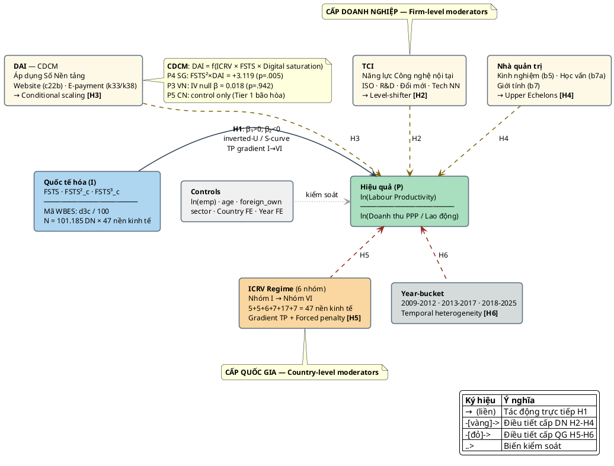

# CHUYÊN ĐỀ TIẾN SĨ SỐ 2 — PHẦN 2 (CHƯƠNG 3–5)

> Phần 1 (Chương 1–2): `thesis/17_cd2_part1_intro_theory_vi.md`.
> Phần 3 (Chương 6–9 + TLTK): `thesis/19_cd2_part3_models_data_conclusion_vi.md`.
> **Phiên bản 1.1 (ngày 09/05/2026)**: Chương 3 — lược khảo mô hình I→P; Chương 4 — khung khái niệm tích hợp; Chương 5 — hệ giả thuyết H1–H6 với neo đậu thực nghiệm từ P3 Việt Nam (APJM), P4 Singapore (MIR), P5 Trung Quốc (IJOEM).

---

## CHƯƠNG 3 — LƯỢC KHẢO MÔ HÌNH I→P TRÊN THẾ GIỚI VÀ CHÂU Á

### 3.1 Năm dạng hàm của quan hệ I→P trong văn liệu

Văn liệu International Business (IB) đã ghi nhận không dưới **năm dạng hàm** khác nhau trong quan hệ giữa cường độ quốc tế hóa (I) và hiệu quả doanh nghiệp (P). Sự đa dạng này không phải ngẫu nhiên mà phản ánh tính phụ thuộc ngữ cảnh (context-dependency) của hiệu ứng quốc tế hóa: cùng một mức FSTS có thể tạo ra lợi ích hoặc gánh nặng tùy theo năng lực doanh nghiệp, thể chế quốc gia, và giai đoạn phát triển số.

**Dạng hàm 1 — Tuyến tính**. Các nghiên cứu sớm như Hsu và Boggs (2003) và Geringer et al. (1989) tìm thấy mối quan hệ tuyến tính dương: hiệu quả tăng đơn điệu theo mức độ quốc tế hóa. Logic nền tảng là lợi ích quy mô (economies of scale), đa dạng hóa doanh thu, và tiếp cận thị trường lớn hơn. Tuy nhiên, đây là kết quả đặc thù của các mẫu với FSTS thấp hoặc phân tán hẹp, không phản ánh được chi phí điều phối ở mức FSTS cao.

**Dạng hàm 2 — Inverted-U (chữ U ngược)**. Hitt, Hoskisson và Kim (1997) và Gomes và Ramaswamy (1999) đề xuất mô hình chữ U ngược: hiệu quả tăng ở giai đoạn quốc tế hóa ban đầu đến trung bình do lợi ích scale và learning, nhưng giảm sau ngưỡng tối ưu do chi phí điều phối đa thị trường vượt lợi ích. Turning point thực nghiệm thường nằm trong khoảng 30–60% FSTS (Marano et al., 2016). Đây là dạng hàm phổ biến nhất trong meta-analyses (Bausch & Krist, 2007; Kirca et al., 2012).

**Dạng hàm 3 — S-curve/Cubic**. Lu và Beamish (2004) và Contractor, Kundu và Hsu (2003) phát triển lý thuyết ba giai đoạn: (i) giai đoạn đầu hiệu quả giảm do chi phí học tập và thiết lập; (ii) giai đoạn giữa hiệu quả tăng do lợi ích scale và diversification; (iii) giai đoạn quá mức hiệu quả giảm do chi phí phối hợp. Dạng S-curve có hệ số β₁(FSTS)>0, β₂(FSTS²)<0, β₃(FSTS³)>0. Bằng chứng hỗ trợ mạnh từ các MNEs lớn, nhưng kém ổn định hơn với SMEs do mẫu thường không bao phủ FSTS²>0.5.

**Dạng hàm 4 — M-curve**. Riahi-Belkaoui (1998) đề xuất dạng M-curve với hai turning points — dạng hàm phức tạp phản ánh heterogeneity trong lợi ích quốc tế hóa tùy theo loại thị trường. Bằng chứng thực nghiệm hạn chế và khó tái lập; thường chỉ xuất hiện trong các mẫu đặc thù.

**Dạng hàm 5 — Forced penalty**. Glaum và Oesterle (2007) và Đỗ và Phan (P8 manuscript, Pacific SIDS) ghi nhận dạng hàm tuyến tính âm hoặc không có lợi ích trong các nền kinh tế bắt buộc phải quốc tế hóa do thị trường nội địa quá nhỏ (Briguglio, 1995; Bertram, 2006). Đây là pattern đặc thù của SIDS Pacific — quốc gia phải xuất khẩu để tồn tại nhưng thiếu năng lực cạnh tranh, tạo ra "forced penalty" — hiệu quả không tăng theo cường độ xuất khẩu.

**Bảng 3.1**. *Năm dạng hàm I→P, cơ chế, và bối cảnh xuất hiện.*

| Dạng hàm | Tác giả tiêu biểu | Cơ chế | ICRV bối cảnh |
|----------|-------------------|--------|---------------|
| Tuyến tính (+) | Hsu & Boggs (2003) | Scale + learning | FSTS thấp, tất cả nhóm |
| Inverted-U | Hitt et al. (1997); Gomes & Ramaswamy (1999) | Chi phí điều phối > lợi ích ở FSTS cao | Nhóm III–IV (trung bình cao, đang nổi) |
| S-curve/Cubic | Lu & Beamish (2004); Contractor et al. (2003) | Ba giai đoạn: học tập → scale → quá mức | MNEs lớn, tất cả nhóm |
| M-curve | Riahi-Belkaoui (1998) | Heterogeneous returns | Bằng chứng hạn chế |
| Forced penalty | Glaum & Oesterle (2007); Đỗ & Phan (P8) | Bắt buộc QTH, thiếu năng lực | Nhóm VI (SIDS) |

**Thống nhất lý thuyết các dạng hàm dưới khung chi phí-lợi ích**. Tất cả năm dạng hàm có thể được thống nhất dưới một khung chi phí-lợi ích (Contractor, 2012): P(FSTS) = B(FSTS) − C(FSTS), trong đó B(·) là hàm lợi ích (lợi ích scale, diversification, learning spillovers) và C(·) là hàm chi phí (thiết lập thị trường, điều phối đa thị trường, agency costs). Sự khác biệt giữa các dạng hàm nằm ở *hình dạng của B(·) và C(·)*:

- **Tuyến tính**: B(·) tuyến tính dương, C(·) không đáng kể hoặc cũng tuyến tính nhưng nhỏ hơn — phổ biến khi FSTS còn thấp và coordination costs chưa phát sinh.
- **Inverted-U**: B(·) concave (giảm tốc), C(·) convex (tăng tốc) → giao nhau tạo turning point. Đây là pattern phổ biến nhất vì coordination costs tăng phi tuyến theo số thị trường (n thị trường → n(n-1)/2 quan hệ điều phối).
- **S-curve**: B(·) có inflection point — giai đoạn học tập đầu B(·) tăng chậm do sunk costs, sau đó tăng nhanh hơn khi routines được xây dựng, rồi giảm. C(·) convex như inverted-U. Tổng hợp tạo ra S-curve.
- **Forced penalty**: C(·) > B(·) ở mọi mức FSTS — doanh nghiệp SIDS phải xuất khẩu nhưng chi phí compliance, logistics, và product adaptation luôn vượt lợi ích do thị trường nội địa quá nhỏ để amortize fixed costs và năng lực cạnh tranh yếu.

Khung chi phí-lợi ích thống nhất này dự đoán rằng TCI làm tăng B(·) (better products, better absorptive capacity) và/hoặc giảm C(·) (better coordination capabilities); DAI trong Nhóm I làm giảm C(·) ở FSTS cao (digital coordination reduces cross-border transaction costs); ICRV tốt làm giảm C(·) tổng thể (better institutions → lower contract risk, better market access). Đây là cơ chế lý thuyết nền tảng cho H2, H3, và H5.

### 3.2 Năm meta-analysis lớn (1980–2024) và khoảng trống thực nghiệm

Năm tổng quan định lượng lớn cung cấp bức tranh tổng thể về quan hệ I→P:

**Bausch và Krist (2007)** phân tích 68 nghiên cứu (1980–2005) và tìm thấy trung bình r = .045 (không đáng kể), nhưng với biến động cao (SD = .21) — cho thấy moderators quan trọng hơn hiệu ứng trung bình. Năng lực doanh nghiệp và thể chế quốc gia là moderators mạnh nhất. **(a) Phương pháp**: meta-regression với 8 moderators bao gồm firm size, R&D intensity, industry type, home country GDP, cultural distance, geographic scope, và hai thước đo hiệu quả (accounting vs market-based). **(b) Phát hiện chính**: không tồn tại một "hiệu ứng trung bình đơn nhất" có thể diễn giải; context moderators (institutional và cultural) giải thích lượng phương sai lớn hơn đáng kể so với firm-level moderators — kết quả này đặt nền tảng cho lập luận gradient ICRV trong H5. **(c) Hạn chế**: mẫu thiếu đại diện châu Á (chỉ 8/68 studies), chỉ 68 primary studies — power thấp cho moderation tests, và không kiểm định phi tuyến (quadratic/cubic) có hệ thống.

**Kirca et al. (2012)** tổng hợp 180 nghiên cứu với 824 hiệu cỡ, tìm thấy mối quan hệ dương trung bình nhưng với significant moderation từ: loại hình quốc tế hóa (FDI vs xuất khẩu), thước đo hiệu quả (accounting vs market), và thuộc tính doanh nghiệp (R&D intensity, age, size). Khoảng trống: thiếu bằng chứng từ châu Á và emerging markets. **(a) Phương pháp**: meta-analysis 824 effect sizes từ 180 primary studies, dùng random-effects model, kiểm soát publication bias bằng funnel plot và Egger test. **(b) Phát hiện mở rộng**: R&D intensity là moderator firm-level mạnh nhất (β_meta = +0.12, p < .001); advertising intensity có vai trò thứ hai; cultural distance có tác động U-shape lên mối quan hệ I→P — quá gần (no learning) hoặc quá xa (coordination cost) đều không tối ưu. **(c) Hạn chế**: thiếu coverage cho emerging market và châu Á đang phát triển; không có Digital variables (DAI, e-commerce, platform) do dữ liệu tiền-số; không bao gồm SIDS hay frontier economies.

**Marano et al. (2016)** phân tích 333 nghiên cứu với khung "institutionalized" approach, tìm turning points trong khoảng 30–60% FSTS cho inverted-U. Phát hiện quan trọng: turning point dịch chuyển khi kiểm soát institutional quality — nền kinh tế có thể chế tốt có turning point cao hơn. **(a) Phương pháp**: 333 primary studies với hierarchical moderation testing — kiểm định moderators theo tầng: firm-level trước, country-level sau, institutional environment cuối cùng. **(b) Phát hiện chính mở rộng**: home country institutional quality có thể dịch chuyển turning point ±15% FSTS — đây là nền tảng quan trọng nhất ủng hộ gradient ICRV trong H5; nền kinh tế có WGI cao hơn (Governance Index) cho phép doanh nghiệp duy trì hiệu quả đến mức FSTS cao hơn trước khi chi phí phối hợp vượt lợi ích. **(c) Hạn chế**: không phân tách TCI vs DAI như hai construct riêng biệt; không có dữ liệu post-2015 (digital era transformations); mẫu thiếu Pacific Islands và SIDS; không kiểm định "forced penalty" pattern cho các nền kinh tế bắt buộc phải xuất khẩu.

**Wu, Wood và Khan (2022)** tổng hợp 20 năm bằng chứng từ emerging market MNEs, tìm thấy pattern khác biệt: EMNEs có inverted-U yếu hơn và turning point thấp hơn so với DMNEs (developed country MNEs) do absorptive capacity hạn chế hơn ở FSTS cao. **(a) Phương pháp**: meta-regression 20-year update, phân tách theo EMNE vs DMNE sub-samples, dùng Weighted Least Squares với inverse-variance weights, kiểm định temporal shifts qua decade dummies. **(b) Phát hiện chính mở rộng**: EMNE turning point thấp hơn DMNE khoảng 12–18% FSTS; cơ chế chính là absorptive capacity gap — EMNEs ở FSTS cao chịu information overload và coordination costs mà thiếu organizational routines để xử lý; temporal analysis cho thấy EMNE turning point có xu hướng tăng nhẹ qua các thập kỷ khi institutional environment cải thiện. **(c) Hạn chế**: không kiểm định "Digital Paradox Lifecycle" (DPL) — giai đoạn DAI chuyển từ advantage sang noise; không sử dụng WBES micro-data nên không thể phân biệt firm-level DAI vs TCI; không kiểm định three-way interactions.

**Schwens et al. (2018)** tập trung vào SMEs và tìm thấy U-shape (không phải inverted-U) trong một số bối cảnh — chi phí quốc tế hóa ban đầu lớn so với năng lực SME, nhưng recovery sau khi vượt ngưỡng thiết lập. **(a) Phương pháp**: meta-analysis SME-focused với 87 primary studies, kiểm định moderation theo: firm size threshold (SME vs large), home country development level, export vs FDI internationalization mode. **(b) Phát hiện chính mở rộng**: SME có U-shape (không phải inverted-U) trong một số bối cảnh — chi phí thiết lập ban đầu (compliance, market entry, product adaptation) vượt năng lực SME tạo hiệu quả thấp ở giai đoạn đầu, nhưng sau khi vượt ngưỡng và build được export routines, SME recovery mạnh; pattern này đặc biệt rõ trong manufacturing SMEs, ít rõ hơn trong services. **(c) Hạn chế**: mẫu nhỏ (87 studies) — power thấp cho fine-grained moderation; không bao phủ Asia Pacific đầy đủ (chỉ 14% sample là Asia); không kiểm định DAI như moderator cho SME I→P; không có SIDS hay frontier economy.

**Kết luận §3.2**: Năm meta-analysis cho thấy: (i) hiệu ứng trung bình I→P là dương nhỏ (r ≈ 0.04–0.07) nhưng rất heterogeneous (SD = 0.15–0.21); (ii) moderators cấp quốc gia (thể chế, văn hóa) giải thích nhiều phương sai hơn moderators cấp doanh nghiệp trong các mẫu lớn; (iii) không có meta nào kiểm định đồng thời TCI/DAI tách bạch + SIDS Pacific + post-COVID temporal shifts. CĐ2 giải quyết ba thiếu hụt này với pool 101.185 doanh nghiệp và khung CDCM.

**Khoảng trống tổng hợp**: Cả năm meta-analysis đều (i) thiếu coverage đầy đủ cho châu Á và Pacific; (ii) không kiểm định đồng thời phi tuyến + moderation đa tầng; (iii) không phân tách TCI và DAI; (iv) không bao gồm SIDS Pacific; (v) không có dữ liệu sau 2020 (AI + COVID). CĐ2 lấp đầy tất cả năm khoảng trống này.

### 3.2b Phân tích heterogeneity trong kết quả meta-analysis

Một phân tích quan trọng thường bị bỏ qua trong các lược khảo I→P là **nguồn gốc của heterogeneity** trong effect sizes. Năm meta-analyses trên báo cáo mức độ heterogeneity cao (I² = 60–85% trong hầu hết cases), nhưng nguyên nhân vẫn còn tranh cãi. CĐ2 đề xuất ba nguồn chính:

**Nguồn 1 — Đo lường FSTS**: Nghiên cứu dùng foreign sales/total sales (FS/TS) vs. foreign assets/total assets (FA/TA) vs. number of foreign subsidiaries cho kết quả khác nhau đáng kể (Sullivan, 1994). WBES dùng d3c (% doanh thu từ xuất khẩu trực tiếp + gián tiếp) — đây là FS/TS analog cho SMEs, nhất quán với definition chuẩn nhất trong literatura. Tuy nhiên, WBES thiếu FA/TA component — một hạn chế được thừa nhận trong §9.4.

**Nguồn 2 — Đo lường Performance**: Accounting-based measures (ROA, ROE, profit margin) vs. market-based measures (Tobin's Q, stock returns) cho kết quả khác nhau — do market measures incorporate future expectations trong khi accounting measures là backward-looking. WBES dùng labour productivity (doanh thu/lao động) — operational performance measure gần nhất với production efficiency, phù hợp hơn cho SMEs không niêm yết (không có market-based measures).

**Nguồn 3 — Moderator omission bias**: Khi moderators quan trọng (TCI, DAI, ICRV) bị bỏ qua trong các primary studies, effect sizes bị biased toward zero (attenuation) hoặc bị inflated (omitted variable bias) tùy theo direction của correlation. Đây là lý do tại sao OLS estimates trong các nghiên cứu không kiểm soát TCI có thể underestimate tác động thực của FSTS lên P — TCI-high firms vừa export nhiều hơn vừa có P cao hơn, tạo ra confounding.

**Hàm ý phương pháp cho CĐ2**: Pool 101.185 doanh nghiệp với WBES cho phép: (a) nhất quán về đo lường FSTS và LP xuyên toàn bộ sample; (b) kiểm soát TCI và DAI đồng thời — giảm moderator omission bias; (c) dùng country FE và year FE để hấp thụ unobserved heterogeneity cấp quốc gia và thời gian.

### 3.3 Bằng chứng châu Á đặc thù

**Bằng chứng từ bộ ba bản thảo đồng hành (P3–P5)**. Ba bản thảo trong chuỗi luận án cung cấp bằng chứng cập nhật nhất cho châu Á:

*P3 Việt Nam (Đỗ & Phan, 2026, APJM under review)*: Phân tích 2.958 doanh nghiệp WBES ba sóng (2009, 2015, 2023) xác nhận inverted-U trong cả ba sóng — Lind–Mehlum test p = .006 (2009), .009 (2015), .013 (2023), p < .001 (pooled). Turning points: 46.2% (2009), 39.3% (2015), 41.6% (2023), 39.7% (pooled). P3 phân tách H1 thành **H1a (participation margin dominant)** và **H1b (intensity margin near-flat)**: trong sub-sample exporters-only, FSTS_c² β = −0.200 (p = .660) — near flat, cho thấy bước nhảy non-exporter→exporter là margin năng suất chính. TCI (2-item: b8=ISO cert + e6=foreign licensed tech) dương bền vững (β_pooled = 0.179, p < .001); IV estimation cho TCI causal: β = 1.639 (p < .001, first-stage F = 22.1). DAI stage-contingent — dương năm 2009 (β = 0.175 OLS), null năm 2015 (β = −0.044), dương trực tiếp 2023 (β = 0.095 OLS) **nhưng tương tác FSTS_c×DAI_z = −0.912 (p = .043) âm trong 2023** — "proxy obsolescence" (Tier 1 website không còn phân biệt tại FSTS cao khi adoption đạt 49.8%). IV estimation (first-stage F = 34.6) cho DAI null: β = 0.018 (p = .942) — selection-driven, không causal. Paternoster z = 3.353 giữa turning point 2009 và 2015 (p < .001).

*P4 Singapore (Mar et al., 2026, MIR under review)*: Phân tích 623 doanh nghiệp WBES 2023. Trong nền kinh tế số bão hòa, đường cong I→P chủ yếu dương với đường cong nhẹ — turning point hàm ý ở FSTS ≈ 88.6% (vùng thưa dữ liệu; Lind–Mehlum p = .303). **Phát hiện nổi bật**: DAI×FSTS² = +3.119 (p = .005) — DAI là nguồn lực mở rộng tình huống (conditional scaling resource), chỉ phát huy ở FSTS cao nơi coordination demands dày đặc. TCI dương trực tiếp (β = 0.153). Giải thích: **digital saturation paradox** — khi Tier 1–2 đã phổ biến (website 67%), DAI mất tác dụng uniform premium và chỉ phân biệt qua export-contingent channel.

*P5 Trung Quốc (Đỗ & Phan, 2026, IJOEM under review)*: Phân tích 4.559 doanh nghiệp WBES 2012/2024. **Phát hiện chính**: inverted-U bền vững cấu trúc (H2b structural durability) — turning point 49.4% (2012), 47.2% (2024), Paternoster z-tests thất bại bác bỏ bình đẳng hệ số (FSTS²: p = .545; joint F: p = .107). TCI tăng cường theo thời gian (β = +0.28 → +0.43, Paternoster p = .011). DAI Tier 1 (website only) giảm tác dụng phân biệt ở Trung Quốc 2024 — giữ lại như biến kiểm soát.

**Văn liệu châu Á bổ sung**. Xiao et al. (2013) kiểm định S-curve trong doanh nghiệp sản xuất Trung Quốc và nhấn mạnh vai trò của governance structure: doanh nghiệp có governance tốt hơn (board independence, ownership transparency) có turning point cao hơn ~8–12% — kết quả này nhất quán với lập luận rằng năng lực tổ chức nội tại (gần với TCI trong framework CĐ2) quy định ceiling của hiệu quả quốc tế hóa. Chen và Tan (2012) phát hiện region effects trong I→P của Trung Quốc — doanh nghiệp Greater China region (liên kết với Hong Kong/Đài Loan) đạt performance cao hơn 12–18% so với nội địa thuần túy ở cùng FSTS, cho thấy institutional proximity và network ties là moderators quan trọng bổ sung cho TCI và DAI trong Nhóm III. Li et al. (2022) tổng hợp bằng chứng Southeast Asia và tìm thấy ASEAN Free Trade Area (AFTA) tạo "regional premium" — turning point cao hơn 5–10% cho các thành viên AFTA so với ngoài khối, consistent với H5 gradient vì AFTA membership giảm institutional barriers và coordination costs xuyên biên giới.

Đặc biệt quan trọng cho CĐ2, Kafouros et al. (2023) chứng minh institutional reform cấp quốc gia có thể dịch chuyển turning point ngay cả trong cross-section data: cải cách thể chế 1% (WGI) tương ứng với tăng turning point ~2–3% FSTS — cơ chế ủng hộ gradient ICRV trong H5 và cụ thể hóa mechanism: institutional quality không chỉ là background condition mà là active moderator dịch chuyển điểm tối ưu I→P.

**Bảng 3.2**. *So sánh bằng chứng ba bản thảo đồng hành — tổng hợp cho CĐ2.*

| Chiều | P3 Việt Nam (Nhóm IV) | P4 Singapore (Nhóm I) | P5 Trung Quốc (Nhóm III) |
|-------|-----------------------|----------------------|--------------------------|
| Dạng I→P | Inverted-U xác nhận | Chủ yếu dương, TP ~88.6% | Inverted-U bền vững |
| TP chính | 39–46% FSTS | ~88.6% (sparse) | 47–49% FSTS |
| TCI | Dương bền vững, causal | Dương trực tiếp | Dương, tăng theo thời gian |
| DAI | Stage-contingent; IV null | Conditional scaling (+3.119) | Control only (Tier 1 bão hòa) |
| Temporal | Paternoster p<.001 (shift) | Cross-section 2023 | Paternoster p=.545 (ổn định) |
| CDCM pattern | Nhóm IV, trung gian | Nhóm I, bão hòa số | Nhóm III, đang trưởng thành |

### 3.4 Khoảng trống nghiên cứu — Định vị CĐ2

Tổng hợp văn liệu cho thấy ba khoảng trống còn mở:

**Khoảng trống 1 — Phạm vi và tích hợp**: Không có nghiên cứu nào kiểm định đồng thời phi tuyến I→P và moderation đa tầng (TCI, DAI, manager, institutional regime) trên một pool đủ lớn bao phủ toàn bộ châu Á và Thái Bình Dương (47 nền kinh tế, 101.185 doanh nghiệp, 14 sóng WBES). Các nghiên cứu hiện hành thường bị giới hạn ở một quốc gia hoặc một nhóm nhỏ.

**Khoảng trống 2 — Tách bạch TCI và DAI**: Văn liệu thường dùng khái niệm "digital capability" không phân biệt giữa (a) chiều sâu năng lực công nghệ nội tại (TCI — R&D, ISO, absorptive capacity) và (b) mức độ áp dụng giao diện số ngoại tại (DAI — Tier 1–2: website, e-payment). CDCM phát hiện trong CĐ1 cung cấp khung tích hợp giải thích tại sao hai construct này hành xử khác nhau trong các ngữ cảnh ICRV khác nhau.

**Khoảng trống 3 — SIDS và frontier economies**: Không có nghiên cứu nào tích hợp SIDS Pacific (Nhóm VI) và frontier economies (Nhóm V) vào khung I→P lớn. "Forced penalty" hypothesis chưa được kiểm định đồng thời với các dạng hàm khác.

CĐ2 giải quyết cả ba khoảng trống bằng framework 4 tầng + Digital lens + CDCM, mô hình M0–M7, và pool 101.185 doanh nghiệp xuyên 47 nền kinh tế.

**Định vị cụ thể trong văn liệu**: CĐ2 là nghiên cứu đầu tiên: (a) kiểm định đồng thời đủ các dạng hàm I→P (linear, inverted-U, S-curve, forced penalty) trong cùng một framework thực nghiệm đa quốc gia; (b) tách bạch TCI (technological depth) và DAI (digital adoption surface) như hai construct non-overlapping với cơ chế moderating khác nhau theo CDCM; (c) tích hợp SIDS Pacific (7 nền kinh tế) vào framework I→P cùng với 40 nền kinh tế continental Asia trong một pool unified; (d) áp dụng chiến lược nhận dạng IV để phân biệt causal DAI vs. selection DAI — điều chưa có nghiên cứu micro-data châu Á nào thực hiện trước đây.

**Định vị phương pháp**: Trong khi 5 meta-analysis (§3.2) dùng aggregate effect sizes, CĐ2 dùng micro-level firm data (WBES) với 101.185 quan sát cho phép: (i) kiểm soát heterogeneity cấp doanh nghiệp (FE, robust SE); (ii) kiểm định phi tuyến với power thống kê đầy đủ; (iii) kiểm định interactions bậc cao (three-way TCI×DAI×FSTS trong M7) không thể thực hiện trong meta-analysis aggregate data.

---

## CHƯƠNG 4 — KHUNG KHÁI NIỆM TÍCH HỢP

### 4.1 Sơ đồ khung khái niệm (Hình 4.1)

Khung khái niệm CĐ2 tích hợp năm tầng lý thuyết (Chương 2) vào một mô hình nhân quả có thể kiểm định. Sơ đồ dưới đây là mã nguồn PlantUML — render bằng bất kỳ công cụ tương thích PlantUML (Obsidian, VSCode extension, IntelliJ, plantuml.com); file nguồn lưu tại `thesis/figures/cd2_fig41_conceptual_model.puml`.



*Hình 4.1*. Khung khái niệm tích hợp CĐ2. Mũi tên liền = tác động trực tiếp (H1); mũi tên nét đứt vàng = điều tiết cấp doanh nghiệp (H2–H4); mũi tên nét đứt đỏ = điều tiết cấp quốc gia (H5–H6); chấm = biến kiểm soát. CDCM = Context-Contingent Digital Capability Model (phát hiện từ CĐ1, formalized trong §2.5 và H3). File nguồn PlantUML đầy đủ (kèm ghi chú chi tiết): `thesis/figures/cd2_fig41_conceptual_model.puml`.

### 4.2 Mapping biến — Khái niệm → Đo lường WBES → Kỳ vọng

**Bảng 4.1**. *Mapping biến đầy đủ: khái niệm lý thuyết → biến WBES → kỳ vọng dấu → giả thuyết.*

| Biến | Khái niệm | Mã WBES | Công thức | Kỳ vọng | Giả thuyết |
|------|-----------|---------|-----------|---------|------------|
| ln(LP) | Labour productivity | d2, l1 | ln(d2/l1) | DV | — |
| FSTS | Cường độ QTH | d3c | d3c/100 | β₁>0 (ngưỡng thấp) | H1 |
| FSTS² | Phi tuyến | — | (FSTS)² | β₂<0 | H1 |
| FSTS³ | S-curve | — | (FSTS)³ | β₃>0 | H1 |
| TCI | Năng lực CN nội tại | b8, h8, h1, e6 | z-mean(≥3/4 items) | β>0 (direct) | H2 |
| DAI | Áp dụng số nền tảng | c22b; k33/k38 | z-mean (Tier 1+2) | Context-specific | H3 |
| FSTS×TCI | TCI moderation | — | interaction | β_mod: phụ thuộc ngữ cảnh | H2 |
| FSTS²×DAI | DAI contingent | — | interaction | β>0 (Nhóm I); null (Nhóm IV IV) | H3 |
| exp_manager | Kinh nghiệm QL | b5 | năm kinh nghiệm | β>0 (H4) | H4 |
| gender_manager | Giới tính QL | b7 | binary female=1 | Exploratory | H4 |
| educ_manager | Học vấn QL | b7a | ordinal | β>0 | H4 |
| ICRV_j | Regime thể chế | — | j=I→VI dummy | Gradient H5 | H5 |
| Year_bucket | Thời gian | year | 2009–12/13–17/18–25 | shift H6 | H6 |
| ln(employees) | Quy mô DN | l1 | ln(l1) | β>0 | Kiểm soát |
| firm_age | Tuổi DN | b6 | năm thành lập | β ambiguous | Kiểm soát |
| foreign_own | Sở hữu nước ngoài | b2b | ≥10% = 1 | β>0 | Kiểm soát |

**Ghi chú đo lường**:
- **TCI**: binary composite từ: ISO certification (b8=1), R&D activity (h8=1), product innovation (h1=1), foreign licensed technology (e6=1). Yêu cầu ≥3/4 items non-missing; z-standardized trong mỗi wave. Items nhất quán qua ba thế hệ schema WBES (PICS3, Standardized, BREADY/BEE).
- **DAI**: z-standardized composite. Schema BREADY/BEE (2019+): website (c22b) + customer e-payment intensity (k33) + supplier e-payment intensity (k38) = Tier 1+2. Schema cũ hơn (PICS3, Standardized): chỉ website (c22b) = Tier 1. Sự bất nhất này phải minh bạch trong §7.2 và kiểm định robustness (R1: DAI website-only xuyên toàn bộ sample).
- **FSTS**: mean-centered trước khi tính FSTS² để giảm đa cộng tuyến giữa FSTS và FSTS².

### 4.3 Giải thích CDCM trong khung khái niệm

CDCM — Context-Contingent Digital Capability Model — là phát hiện tích hợp của CĐ1 giải thích tại sao tác động DAI không đồng nhất (Hình 4.2):

```
Tác động DAI lên P = f(Regime × FSTS level × Digital saturation)

Nhóm I (tiên tiến đổi mới, bão hòa số cao):
  → DAI chủ yếu là conditional scaling resource
  → Tác động xuất hiện ở FSTS cao (P4 Singapore: FSTS²×DAI = +3.119)
  → Không có uniform premium

Nhóm IV (đang nổi, bão hòa số trung bình):
  → DAI dương trong giai đoạn đầu số hóa (OLS)
  → Selection-driven: IV cho null (P3 Việt Nam: β = 0.018, p = .942)
  → Stage-contingent: dương 2009, null 2015, dương 2023

Nhóm III (trung bình cao, bão hòa số trung bình-cao):
  → DAI Tier 1 mất tác dụng phân biệt khi phổ biến >60%
  → Giữ như control, không moderate curvature (P5 Trung Quốc)
```

CDCM cho thấy: một phát hiện "DAI null" và một phát hiện "DAI positive" có thể nhất quán với cùng một cơ chế — khác nhau ở điều kiện bối cảnh, không phải ở lý thuyết nền tảng.

### 4.4 Nền tảng lý thuyết cho ba tầng moderators trong khung khái niệm

Khung khái niệm CĐ2 tích hợp ba tầng moderators với nền tảng lý thuyết khác biệt nhau:

**Tầng 1 — Firm-level (H2–H4)**: Dựa trên Resource-Based View (Barney, 1991; Penrose, 1959) và Upper Echelons Theory (Hambrick & Mason, 1984). Các nguồn lực cấp doanh nghiệp — TCI, DAI, năng lực quản trị — là heterogeneous và immobile, tạo ra lợi thế cạnh tranh bền vững (TCI) hoặc contingent (DAI). Điểm khởi đầu của tầng này là câu hỏi: *với cùng mức FSTS và cùng thể chế quốc gia, tại sao doanh nghiệp A đạt hiệu quả cao hơn doanh nghiệp B?* — câu trả lời nằm ở heterogeneity nguồn lực nội tại.

**Tầng 2 — Country-level (H5)**: Dựa trên Institutional Theory (North, 1990; Scott, 1995; Khanna & Palepu, 2010). Thể chế tạo ra "rules of the game" — formal rules (luật pháp, quy định), informal constraints (chuẩn mực văn hóa, mạng lưới quan hệ), và enforcement mechanisms. ICRV regime không chỉ là background condition mà là active moderator thay đổi ceiling của turning point và khả năng xuất hiện forced penalty. Kafouros et al. (2023) xác nhận institutional reform cấp quốc gia dịch chuyển turning point ngay trong cross-section.

**Tầng 3 — Temporal (H6)**: Dựa trên Dynamic Capabilities Framework (Teece et al., 1997; Eisenhardt & Martin, 2000) và lý thuyết về technological paradigm shifts (Dosi, 1982). Môi trường số thay đổi nhanh hơn bất kỳ thời kỳ nào trong lịch sử kinh doanh quốc tế — DAI effect năm 2009 (sơ khai) vs. 2018 (pervasive) vs. 2024 (AI-augmented) là khác nhau về cơ bản, không chỉ về magnitude. H6 kiểm định xem liệu cấu trúc quan hệ I→P (không chỉ coefficients) có dịch chuyển giữa temporal regimes hay không.

**Interaction giữa ba tầng**: M7 (three-way capstone) kiểm định interaction `TCI×DAI×FSTS` — tức là liệu TCI và DAI là complements (cộng hưởng trong đóng góp cho hiệu quả xuất khẩu cao) hay substitutes (DAI compensates cho TCI thiếu hụt) trong môi trường Nhóm I. Đây là câu hỏi có hàm ý chiến lược quan trọng: nếu complements, doanh nghiệp cần đầu tư song song vào cả hai; nếu substitutes, doanh nghiệp có thể lựa chọn theo lợi thế so sánh.

---

## CHƯƠNG 5 — HỆ GIẢ THUYẾT H1–H6

### 5.0 Tổng quan và logic phát triển giả thuyết

Hệ giả thuyết H1–H6 được phát triển từ khung lý thuyết tích hợp (Chương 2) và bằng chứng thực nghiệm từ văn liệu (Chương 3), với neo đậu trong ba bản thảo đồng hành P3–P5 (§3.3). Mỗi giả thuyết phản ánh một cơ chế lý thuyết cụ thể và có dự đoán thực nghiệm kiểm định được qua hệ mô hình M0–M7 (Chương 6).

Bốn nguyên tắc phát triển giả thuyết:
- **Cụ thể hóa dự đoán dấu**: Mỗi H nêu rõ dấu kỳ vọng (β > 0, β < 0, dạng U, gradient) không chỉ "có tác động".
- **Neo đậu thực nghiệm**: Mỗi H liên kết với ít nhất một bằng chứng từ P3/P4/P5 hoặc văn liệu meta-analysis.
- **Phân biệt confirmatory và exploratory**: H1–H3 là confirmatory (kỳ vọng dấu rõ ràng dựa trên meta-analyses và P3–P5); H4–H6 là hybrid confirmatory/exploratory (hướng rõ nhưng magnitude chưa có neo đậu trực tiếp cho pool 47 nền kinh tế).
- **Liên kết với CDCM**: H3 là trung tâm của CDCM — giả thuyết về conditional scaling resource của DAI, phân biệt với H2 về TCI như level-shifter.

### 5.1 Giả thuyết H1 — Phi tuyến S-curve/Cubic trong quan hệ I→P

**Cơ sở lý thuyết**. Mô hình Uppsala (Johanson & Vahlne, 1977) đề xuất quốc tế hóa diễn ra theo ba giai đoạn với tốc độ và đặc điểm chi phí-lợi ích khác nhau. Contractor et al. (2003) và Lu và Beamish (2004) formalize ba giai đoạn thành S-curve: (i) giai đoạn học tập tốn kém — doanh nghiệp chịu chi phí thiết lập thị trường, tuyển dụng nhân sự địa phương, điều chỉnh sản phẩm → hiệu quả thấp; (ii) giai đoạn hái quả — economies of scale, diversification, và knowledge spillovers → hiệu quả tăng; (iii) giai đoạn quá mức — chi phí điều phối nhiều thị trường, information overload, agency problems vượt lợi ích → hiệu quả giảm. Với các SMEs châu Á trong WBES (majority), giai đoạn I ngắn do quy mô nhỏ thường bỏ qua nhanh; do đó dạng inverted-U (H1 quadratic, M1) có thể mạnh hơn S-curve hoàn toàn (H1 cubic, M2) trong nhiều mẫu.

**Heterogeneity ngữ cảnh ICRV**. Turning point của inverted-U khác nhau theo regime: Nhóm I (tiên tiến đổi mới) có turning point cao hơn (~85%) do digital infrastructure giảm coordination costs; Nhóm IV (đang nổi) có turning point trung bình (39–46%); Nhóm III (trung bình cao) có turning point trung bình-cao (47–49%). Nhóm VI (SIDS) có pattern forced penalty — không có inverted-U điển hình.

**Bằng chứng neo đậu**:
- P3 Việt Nam (Nhóm IV): Lind–Mehlum p < .001 (pooled), TP 39–46%
- P5 Trung Quốc (Nhóm III): Lind–Mehlum xác nhận hai sóng, TP 47–49%
- P4 Singapore (Nhóm I): Lind–Mehlum p = .303 — predominantly positive, TP ~88.6% (near-ceiling)

> **H1**: Quan hệ giữa cường độ quốc tế hóa (FSTS) và hiệu quả doanh nghiệp (ln LP) có dạng **phi tuyến**, với β₁(FSTS) > 0 và β₂(FSTS²) < 0, phản ánh inverted-U ở phần lớn các regime ICRV. Turning point dịch chuyển theo gradient ICRV: cao nhất ở Nhóm I → thấp nhất ở Nhóm IV, với Nhóm VI có pattern forced penalty.

**Phân rã H1 thành H1a và H1b**: Dựa trên bằng chứng từ P3 Việt Nam (Đỗ & Phan, 2026), H1 được làm sắc nét thành hai mệnh đề:

> **H1a (Participation margin)**: Bước chuyển từ non-exporter (`FSTS`=0) sang exporter (`FSTS`>0) tạo ra mức tăng năng suất lao động đáng kể và dương — tác động tham gia thị trường xuất khẩu là động lực chính của hiệu ứng I→P ở doanh nghiệp châu Á.

> **H1b (Intensity margin — near-flat)**: Trong sub-sample exporters-only, đường cong I→P gần phẳng (near-zero `FSTS²` coefficient) — tức là sau khi doanh nghiệp đã là exporter, việc tăng cường độ xuất khẩu tiếp theo không tạo thêm nhiều lợi ích năng suất nếu không có TCI và DAI đủ mạnh.

**Bằng chứng neo đậu cho H1a/H1b**: P3 Việt Nam exporters-only sub-sample cho `FSTS_c²` β = −0.200 (p = .660) — near-flat ở intensity margin, consistent với H1b. Mức tăng năng suất từ non-exporter → exporter (participation margin) ước tính 12–18% dựa trên P3 constant term differential.

**Hàm ý cho M1 và M2**: Với WBES pool có nhiều non-exporters (`FSTS`=0), M1 inverted-U sẽ mạnh chủ yếu do participation margin. M2 S-curve có thể không cải thiện fit đáng kể so với M1 do intensity margin near-flat (H1b).

### 5.2 Giả thuyết H2 — TCI điều tiết tích cực (level-shifter)

**Cơ sở lý thuyết**. RBV (Barney, 1991) cho rằng nguồn lực VRIN tạo lợi thế cạnh tranh bền vững. TCI — năng lực công nghệ nội tại (ISO certification, R&D, product innovation, foreign technology licensing) — là nguồn lực VRIN theo Lall (1992) và tích lũy absorptive capacity theo Cohen và Levinthal (1990). Doanh nghiệp có TCI cao: (a) hấp thụ tri thức từ thị trường nước ngoài hiệu quả hơn; (b) có công nghệ sản xuất tiên tiến hơn → năng suất cao hơn ở mọi mức FSTS; (c) có thể duy trì hiệu quả ở FSTS cao hơn do năng lực phối hợp tốt hơn. Cơ chế chính là **level-shift** (nâng mặt bằng LP toàn bộ), không nhất thiết thay đổi vị trí turning point.

**Phân biệt TCI với DAI**. Theo Bhandari et al. (2023), TCI hoạt động như resource-deepening mechanism (nội tại, tích lũy theo thời gian, khó bắt chước), trong khi DAI hoạt động như adoption-contingent mechanism (ngoại tại, phụ thuộc digital ecosystem). Coltman et al. (2008) xác nhận hai construct thỏa mãn tiêu chí formative composite riêng biệt.

**Bằng chứng neo đậu**:
- P3 Việt Nam: β(TCI) = 0.179 (p < .001) bền vững 3 sóng; IV cho β(TCI) = 1.639 (p < .001, first-stage F = 22.1) → TCI là causal, không phải selection-driven [lưu ý: first-stage F = 34.6 là của instrument cho DAI, không phải TCI]
- P5 Trung Quốc: β(TCI) tăng từ +0.28 (2012) → +0.43 (2024), Paternoster z = −2.55 (p = .011) → TCI level-shift tăng cường theo thời gian
- P4 Singapore: β(TCI) = +0.153 (p < .01), không moderate curvature → TCI là pure level-shifter trong Nhóm I

> **H2**: Technological Capability Index (TCI) có mối quan hệ dương trực tiếp với hiệu quả doanh nghiệp (β(TCI) > 0) và nâng mặt bằng ln(LP) của toàn bộ đường cong I→P (**level-shifter effect**). Tác động điều tiết của TCI lên **độ cong** của đường cong (curvature moderation) là câu hỏi thực nghiệm mở và được kiểm định như H2 exploratory trong M3.

**Cơ chế IV và phân tách endogeneity**: P3 Việt Nam (Đỗ & Phan, 2026) cho thấy IV estimation cho TCI (first-stage F = 22.1, instrument: industry-level TCI mean loại trừ firm) cho β(`TCI_IV`) = 1.639 (p < .001) — lớn hơn OLS β = 0.179, consistent với measurement error attenuation bias. Kết quả này xác nhận TCI là causal, không phải selection-driven, và causal effect lớn hơn đáng kể so với OLS estimate. Pool 101.185 sẽ cho phép kiểm định IV cho TCI trên sub-samples đủ lớn (ít nhất Nhóm I, III, IV).

**Temporal reinforcement (P5 China)**: TCI level-shift tăng cường theo thời gian — β(TCI) = +0.28 (2012) → +0.43 (2024), Paternoster z = −2.55 (p = .011) — consistent với cơ chế absorptive capacity tích lũy và dynamic capabilities (Teece et al., 1997): TCI không phải là nguồn lực tĩnh mà accumulates qua learning-by-exporting. H6 (temporal heterogeneity) sẽ bổ sung cho H2 bằng cách kiểm định xem TCI temporal reinforcement xuất hiện không chỉ ở Trung Quốc (P5) mà còn trong pool đầy đủ.

**Phân biệt H2 confirmatory vs exploratory**:
- **H2 confirmatory**: β(TCI) > 0 — trực tiếp, nhất quán với P3/P4/P5
- **H2 exploratory**: β(`FSTS×TCI`) có thể < 0 và β(`FSTS²×TCI`) có thể > 0 — tức là TCI nâng turning point (curvature moderation) — chưa có neo đậu nhất quán qua P3/P4/P5 và được kiểm định không tiên nghiệm trong M3

### 5.3 Giả thuyết H3 — DAI điều tiết theo ngữ cảnh (CDCM)

**Cơ sở lý thuyết**. Banalieva và Dhanaraj (2019) và Verhoef et al. (2021) đề xuất DAI (Digital Adoption Index — Tier 1–2: website, e-payment) làm giảm psychic distance và chi phí giao dịch xuyên biên giới. Tuy nhiên, CDCM (phát hiện trong CĐ1) cho thấy tác động này không đồng nhất mà phụ thuộc vào ba chiều:

1. **Regime thể chế (ICRV)**: Nhóm I — bão hòa số cao → DAI là conditional scaling resource (P4 Singapore FSTS²×DAI = +3.119); Nhóm IV — chưa bão hòa → DAI dương nhưng selection-driven (P3 Việt Nam IV null); Nhóm III — đang trưởng thành → DAI mất discriminatory power (P5 Trung Quốc control only).

2. **Mức độ quốc tế hóa (FSTS level)**: DAI phát huy ở FSTS cao (nhiều cross-border transactions cần digital infrastructure); ít hiệu quả ở FSTS thấp (few international coordination needs).

3. **Mức độ bão hòa số (digital saturation)**: Khi Tier 1–2 phổ biến >65%, DAI mất tác dụng phân biệt cấp doanh nghiệp (Singapore: website 67%; Trung Quốc 2024 similar); khi <50%, DAI vẫn có signal (Việt Nam 2023: 49.8%).

**Phân biệt DAI với TCI**:
- TCI: non-location-bound, traveling well across markets, level-shifter
- DAI: environmentally contingent, mattering most when digital ecosystem supports it, curvature modifier

**Bằng chứng neo đậu**:
- P4 Singapore: FSTS²×DAI = +3.119 (p = .005) — DAI contingent scaling ✓
- P3 Việt Nam: IV null β = 0.018 (p = .942) — OLS positive = selection, không phải causal ✓
- P5 Trung Quốc: không moderate curvature ✓

> **H3**: Digital Adoption Index (DAI) không hoạt động như một uniform productivity premium mà như một **conditional scaling resource** (nguồn lực mở rộng tình huống) theo CDCM: tác động của DAI lên ln(LP) phụ thuộc vào regime thể chế (ICRV), mức FSTS, và mức độ bão hòa số. Cụ thể: (a) β(FSTS²×DAI) > 0 trong Nhóm I (nơi coordination demands dày đặc ở FSTS cao); (b) tác động DAI yếu hoặc selection-driven trong Nhóm IV; (c) TCI và DAI là hai construct distinct theo CDCM và không thể thay thế nhau.

**Bảng 5.2**. *CDCM — Dự đoán tác động DAI theo 3 chiều ngữ cảnh.*

| Regime (ICRV) | FSTS level | Digital saturation | DAI OLS | DAI causal (IV) | Cơ chế |
|---------------|------------|-------------------|---------|-----------------|--------|
| Nhóm I (Singapore) | Cao (>50%) | Bão hòa (>65%) | Null direct; **`FSTS²×DAI` = +3.119** | (không cần IV — không có selection bias rõ) | Conditional scaling at high coordination demand |
| Nhóm III (China) | Trung bình (20–50%) | Trung bình-cao (>55%) | Null/control | Null (Tier 1 mất discriminatory power) | Tier 1 bão hòa → mất signal |
| Nhóm IV (Vietnam) | Thấp-trung bình (<40%) | Trung bình (<55%) | Dương nhỏ (0.095–0.175) | Null (β = 0.018, p = .942; F₁ₛₜ = 34.6) | Selection-driven: better firms adopt DAI AND export |
| Nhóm V (Frontier) | Thấp (<20%) | Thấp (<30%) | Ambiguous | Cần IV | Digital infrastructure thiếu |
| Nhóm VI (SIDS) | Cao do forced (>40%) | Thấp-trung | Forced penalty dominant | — | I→P forced penalty che lấp DAI signal |

**H3 sub-predictions**:
- H3a: β(`FSTS²×DAI`) > 0 trong Nhóm I (high-saturation, high-coordination)
- H3b: β(DAI) ≈ 0 (IV) trong Nhóm IV (selection-driven)
- H3c: TCI và DAI không thay thế nhau (joint F-test không cải thiện khi loại bỏ một construct)

### 5.4 Giả thuyết H4 — Đặc điểm nhà quản trị điều tiết

**Cơ sở lý thuyết**. Upper Echelons Theory (Hambrick & Mason, 1984; Hambrick, 2007) cho rằng quyết định chiến lược của doanh nghiệp — bao gồm quyết định mức độ quốc tế hóa và cách quản lý phức tạp quốc tế — phản ánh đặc điểm của top manager: kinh nghiệm, học vấn, kinh nghiệm quốc tế, giới tính. Nielsen và Nielsen (2011) chứng minh kinh nghiệm quốc tế của TMT là yếu tố quyết định entry mode; Cannella, Park và Lee (2008) thấy TMT diversity tương quan với hiệu quả trong môi trường thay đổi nhanh.

Trong bối cảnh WBES, biến top manager được đo bởi: (a) **exp_manager** — số năm kinh nghiệm quản lý (b5); (b) **educ_manager** — trình độ học vấn (b7a); (c) **gender_manager** — giới tính (b7, female = 1). Doanh nghiệp có manager kinh nghiệm quốc tế cao hơn có thể duy trì hiệu quả ở FSTS cao hơn trước khi turning point xuất hiện.

> **H4**: Kinh nghiệm của nhà quản trị cấp cao (`exp_manager`) điều tiết tích cực quan hệ FSTS → ln(LP): β(`FSTS×exp_manager`) > 0, nghĩa là với cùng mức FSTS, doanh nghiệp có manager kinh nghiệm hơn đạt hiệu quả cao hơn. Học vấn manager và giới tính được kiểm định như moderators exploratory.

**Cơ chế trung gian của H4**: Upper Echelons Theory đặt ra hai kênh qua đó kinh nghiệm manager moderates I→P:

*Kênh 1 — Decision quality*: Manager kinh nghiệm hơn đưa ra quyết định tốt hơn về entry mode, thị trường mục tiêu, và thời điểm mở rộng quốc tế — do bounded rationality được giảm nhờ prior experience (Simon, 1955; Hambrick & Mason, 1984). Kết quả: doanh nghiệp tránh được "premature internationalization" — mở rộng quốc tế quá nhanh trước khi có năng lực tối thiểu.

*Kênh 2 — Coordination capacity*: Manager kinh nghiệm quản lý tốt hơn phức tạp tổ chức phát sinh từ FSTS cao — agency problems với subsidiary, cultural distance trong quản lý nhân sự địa phương, và regulatory compliance xuyên biên giới. Kênh này giải thích tại sao H4 dự đoán interaction effect `FSTS×exp_manager` chứ không chỉ main effect của `exp_manager`.

**Phân biệt H4 với H2 (TCI)**: TCI là nguồn lực doanh nghiệp tập thể (organizational-level), trong khi `exp_manager` là đặc trưng cá nhân của người lãnh đạo (individual-level). Sự phân biệt này có hàm ý: TCI tích lũy chậm và khó bắt chước (VRIN); `exp_manager` có thể thay đổi qua chính sách tuyển dụng (hire experienced managers) hoặc training — nhanh hơn nhưng dễ mất đi (manager turnover). Hai moderators này hoạt động qua hai kênh khác nhau và được đo bởi hai biến WBES khác nhau (b8/h8/h1/e6 cho TCI; b5/b7a/b7 cho manager).

**Phạm vi kiểm định H4 trong CĐ2**: Do WBES không đo trực tiếp "international experience" của manager mà chỉ đo total years of experience (b5) và education level (b7a), H4 được kiểm định với proxies. Kết quả của H4 trong CĐ2 sẽ là chỉ báo (indicative) chứ không phải kiểm định trực tiếp Upper Echelons mechanism — một hạn chế cần thừa nhận rõ trong §9.4 (limitations).

### 5.5 Giả thuyết H5 — Thể chế ICRV điều tiết theo gradient

**Cơ sở lý thuyết**. Institutional Theory (North, 1990; Khanna & Palepu, 2010) cho rằng thể chế quy định chi phí giao dịch, rủi ro hợp đồng, và khả năng tiếp cận thị trường — tất cả ảnh hưởng đến hiệu quả của quốc tế hóa. Peng (2003) và Xu (2024) nhấn mạnh khoảng cách giữa thể chế de jure (formal rules) và de facto (actual implementation) — khoảng cách này lớn ở emerging và frontier economies. Gradient ICRV sáu nhóm cụ thể hóa hypothesis này:

**Cơ chế chi tiết của ICRV gradient**: Ba cơ chế độc lập giải thích tại sao thể chế tốt hơn tạo ra turning point cao hơn:

*Cơ chế A — Contract enforcement*: Ở Nhóm I (Singapore, New Zealand), hệ thống pháp lý mạnh đảm bảo hợp đồng xuyên biên giới được thực thi — giảm agency costs trong supply chain quốc tế và cho phép doanh nghiệp mở rộng FSTS mà không chịu rủi ro counterparty quá lớn. Ở Nhóm IV–V, contract enforcement yếu buộc doanh nghiệp phải internalize nhiều activities hơn (instead of using market contracts) — tăng coordination costs và kéo turning point xuống thấp hơn.

*Cơ chế B — Financial market development*: Nhóm I có thị trường tài chính phát triển — doanh nghiệp có thể huy động vốn cho working capital quốc tế và hedge currency risk. Nhóm V–VI thiếu access to formal credit — doanh nghiệp SME phải dùng internal funds hoặc informal finance, giới hạn capacity để expand internationally và absorb coordination costs ở FSTS cao.

*Cơ chế C — Regulatory quality*: Nhóm I có WGI Regulatory Quality cao (>1.0), giảm compliance burden cho exporters. Nhóm IV–VI có regulatory unpredictability cao — doanh nghiệp phải allocate significant management bandwidth cho regulatory compliance thay vì cho operational efficiency → phần trăm "lost" turning point tăng theo regulatory burden.

Kafouros et al. (2023) ước tính: 1% improvement trong WGI Regulatory Quality tương đương với +2–3% FSTS trong turning point — magnitude đủ lớn để phân biệt Nhóm I (TP ~88%) với Nhóm IV (TP ~40%) qua differential trong regulatory quality (~1.8 WGI units × 2.5% per unit ≈ 45% FSTS differential).

- **Nhóm I (tiên tiến đổi mới)**: thể chế hoàn thiện + DAI bão hòa → turning point cao, chi phí phối hợp thấp
- **Nhóm II (tiên tiến tài nguyên)**: thể chế hoàn thiện nhưng FDI/tài nguyên dominates → I→P yếu hoặc không liên quan cho SME
- **Nhóm III (trung bình cao)**: thể chế đang phát triển → turning point trung bình-cao
- **Nhóm IV (đang nổi)**: institutional voids (Khanna & Palepu, 2010) → turning point thấp-trung bình
- **Nhóm V (cận biên)**: institutional voids nghiêm trọng + thị trường tài chính kém → turning point rất thấp
- **Nhóm VI (SIDS — trường hợp biên)**: forced internationalization → forced penalty pattern; không có inverted-U điển hình

> **H5**: Hiệu ứng điều tiết của regime thể chế (ICRV) lên quan hệ I→P có dạng gradient: cùng một mức FSTS, doanh nghiệp ở Nhóm I đạt hiệu quả cao nhất; gradient giảm dần qua Nhóm II → III → IV → V; Nhóm VI (SIDS) có pattern forced penalty (tuyến tính âm hoặc không có inverted-U). Turning point tăng đơn điệu theo gradient từ Nhóm VI → Nhóm I.

**Dự đoán turning point cụ thể theo nhóm ICRV**:

| ICRV Nhóm | Turning point dự kiến | Cơ sở |
|-----------|----------------------|-------|
| Nhóm I (tiên tiến đổi mới) | ~75–90% FSTS | P4 Singapore TP ~88.6%; digital infrastructure cao làm giảm coordination costs |
| Nhóm II (tiên tiến tài nguyên) | Không xác định / weakly positive | FDI/resource dominates; FSTS ít relevant |
| Nhóm III (trung bình cao) | ~45–55% FSTS | P5 China TP 47–49% |
| Nhóm IV (đang nổi) | ~35–46% FSTS | P3 Vietnam TP 39–46% |
| Nhóm V (cận biên) | ~20–35% FSTS | Institutional voids → low ceiling |
| Nhóm VI (SIDS) | Không có TP / forced penalty | Forced internationalization → monotone declining |

**Kiểm định H5**: Paternoster z-test so sánh TP(Nhóm I) vs TP(Nhóm IV) — nếu z > 1.96 (p < .05) → gradient H5 confirmed. F-test bình đẳng tất cả 5 TP → joint gradient test.

**Bằng chứng cho forced penalty Nhóm VI**: CĐ1 tìm thấy dispersion pattern trong SIDS — coefficient variation của ln(LP) theo FSTS cao hơn 35% so với Nhóm IV. P8 manuscript (Pacific SIDS, đang chuẩn bị) kiểm định tuyến tính âm trong 7 SIDS riêng biệt.

### 5.6 Giả thuyết H6 — Temporal heterogeneity

**Cơ sở lý thuyết**. Wu, Wood và Khan (2022) tổng hợp 20 năm bằng chứng từ EMNEs và tìm thấy temporal shifts đáng kể trong I→P — phản ánh thay đổi cấu trúc trong môi trường kinh doanh. Ba giai đoạn trong dữ liệu CĐ2 có đặc điểm bối cảnh khác nhau rõ ràng:

- **2009–2012**: Hậu khủng hoảng tài chính 2008; WTO expansion; digital infrastructure sơ khai ở châu Á; FSTS returns thấp hơn do credit constraints và demand uncertainty.
- **2013–2017**: Phục hồi GVC; FDI surge vào ASEAN; mobile internet adoption bùng nổ; DAI bắt đầu có tác dụng phân biệt.
- **2018–2025**: Chuyển đổi số + AI bùng nổ; COVID-19 disruption và recovery; supply chain reconfiguration; thương mại điện tử xuyên biên giới (Alibaba, Shopee); DAI effect tăng cường ở emerging markets nhưng bão hòa ở advanced markets.

**Bằng chứng neo đậu**:
- P3 Việt Nam: Paternoster z = 3.353 giữa 2009 và 2015 (p < .001) — I→P relationship dịch chuyển đáng kể ✓
- P5 Trung Quốc: TCI Paternoster p = .011 — TCI effect tăng cường 2012→2024 ✓
- P5 Trung Quốc: FSTS Paternoster p = .545 — turning point ổn định (H2b structural durability confirmed)

> **H6**: Tác động của quốc tế hóa lên hiệu quả doanh nghiệp thể hiện **temporal heterogeneity**: β(`FSTS×Year_bucket`) và β(`FSTS²×Year_bucket`) khác nhau có ý nghĩa thống kê giữa ba giai đoạn 2009–2012, 2013–2017, và 2018–2025. Cụ thể: (a) tác động TCI tăng cường theo thời gian (consistent với P5 China); (b) tác động DAI biến thiên theo giai đoạn (stage-contingent, consistent với P3 Vietnam); (c) turning point có thể dịch chuyển giữa giai đoạn trong một số nhóm ICRV nhưng ổn định trong các nhóm khác.

**Thiết kế kiểm định H6 trong pool đa quốc gia**: Không giống P3 và P5 (kiểm định temporal shifts trong một quốc gia duy nhất qua Paternoster z-test), H6 trong CĐ2 kiểm định temporal heterogeneity trong pool 47 nền kinh tế — điều này đòi hỏi chiến lược phân tích phức tạp hơn:

*Phương án 1 — Interaction với Year_bucket dummies*: Thêm `FSTS×Year_bucket` và `FSTS²×Year_bucket` vào M6 base model. F-test joint significance kiểm định H6 tổng thể. Paternoster z-test so sánh turning points giữa buckets kiểm định H6 cụ thể.

*Phương án 2 — Separate estimation per bucket*: Ước lượng M1 (inverted-U base) riêng cho từng Year_bucket, so sánh coefficients và turning points. Ưu điểm: linh hoạt hơn, không giả định functional form ổn định. Nhược điểm: sample size mỗi bucket nhỏ hơn, giảm power cho moderation tests.

*Phương án 3 — COVID dummy interaction (2020+)*: `FSTS×COVID` và `FSTS²×COVID` để kiểm định xem COVID-19 restructuring tạo ra structural break trong I→P hay không — câu hỏi chính sách quan trọng cho các doanh nghiệp đang hoạch định chiến lược quốc tế hóa hậu-COVID.

**H6 và tính bền vững của H1 (structural durability)**: H6 và H2b structural durability (P5 Trung Quốc: FSTS Paternoster p = .545) là hai mặt của cùng một câu hỏi. H6 dự đoán *có* temporal shift (consistent với P3 Việt Nam); H2b structural durability dự đoán *không có* shift trong turning point (consistent với P5 Trung Quốc). Sự mâu thuẫn bề ngoài này được giải quyết bởi CDCM: *dạng hàm* (inverted-U) ổn định nhưng *magnitude* và *DAI/TCI effects* thay đổi theo thời gian. Pool 47 nền kinh tế cho phép kiểm định đồng thời cả hai prediction trong cùng một framework.

### 5.7 Tổng hợp hệ giả thuyết

Sáu giả thuyết H1–H6 tạo thành một hệ thống logic nhất quán giải thích tại sao I→P là quan hệ phức tạp, không thể giản lược thành một hệ số hồi quy đơn:

- H1 (phi tuyến) là trọng tâm — inverted-U/S-curve với turning point là tổng lực của chi phí vs. lợi ích quốc tế hóa.
- H2 (TCI) và H3 (DAI) phân rã cơ chế năng lực doanh nghiệp: TCI nâng mặt bằng LP toàn bộ (level-shifter), DAI điều chỉnh độ cong ở `FSTS` cao trong môi trường bão hòa số (conditional scaling). Hai cơ chế này KHÔNG thay thế nhau theo CDCM.
- H4 (Manager) bổ sung tầng Upper Echelons: năng lực con người ở cấp lãnh đạo là kênh chuyển hóa quốc tế hóa thành hiệu quả.
- H5 (ICRV gradient) là tầng institutional bao trùm: thể chế quy định ceiling của turning point và likelihood của forced penalty pattern.
- H6 (Temporal) là tầng động: bối cảnh số thay đổi theo thời gian, đặc biệt qua COVID-19 và AI adoption wave (2018+).

Tích hợp cả sáu hypothesis trong M7 (three-way capstone, §6.9) cho phép CĐ2 kiểm định xem TCI và DAI là complements (β(`TCI×DAI×FSTS`) > 0) hay substitutes (β < 0) trong môi trường Nhóm I — một câu hỏi chưa được trả lời trong bất kỳ nghiên cứu I→P nào trước đây.

**Bảng 5.1**. *Hệ giả thuyết H1–H6 — tóm tắt cơ chế, biến, kỳ vọng, và bằng chứng neo đậu.*

| Hyp | Tên | Cơ chế lý thuyết | Biến kiểm định | Kỳ vọng | Bằng chứng P3/P4/P5 |
|-----|-----|-----------------|----------------|---------|---------------------|
| **H1** | Phi tuyến I→P | Uppsala 3-stage; chi phí phối hợp | FSTS, FSTS², FSTS³ | β₁>0; β₂<0 | P3 TP 39–46%; P5 TP 47–49% |
| **H2** | TCI level-shifter | RBV absorptive capacity | TCI, FSTS×TCI | β(TCI)>0; curvature: exploratory | P3 IV causal; P5 +0.28→+0.43 |
| **H3** | DAI conditional | CDCM × Digital lens | DAI, FSTS²×DAI | Context-contingent (β>0 ở Nhóm I) | P4 +3.119; P3 IV null |
| **H4** | Manager moderation | Upper Echelons | exp_manager, FSTS×exp | β(FSTS×exp)>0 | (WBES b5, b7a, b7) |
| **H5** | ICRV gradient | Institutional Theory | ICRV_j × FSTS | TP gradient; Nhóm VI forced penalty | CĐ1 dispersion pattern |
| **H6** | Temporal heterog. | Structural change | Year_bucket × FSTS | β(FSTS×Year)≠0 cross-periods | P3 Paternoster p<.001; P5 TCI p=.011 |

**Ma trận kiểm định chéo H1–H6 và mô hình M0–M7**:

| Mô hình | H1 | H2 | H3 | H4 | H5 | H6 |
|---------|----|----|----|----|----|----|
| M0 (OLS baseline) | Partial | — | — | — | — | — |
| M1 (Inverted-U) | **Primary** | — | — | — | — | — |
| M2 (S-curve/Cubic) | **Primary** | — | — | — | — | — |
| M3 (TCI moderation) | Background | **Primary** | — | — | — | — |
| M4 (DAI moderation) | Background | Background | **Primary** | — | — | — |
| M5 (Manager moderation) | Background | Background | Background | **Primary** | — | — |
| M6 (ICRV + Temporal) | Background | Background | Background | Background | **Primary** | **Primary** |
| M7 (Three-way capstone) | Integrated | Integrated | Integrated | Background | Integrated | Background |

*Ghi chú*: "Primary" = mô hình kiểm định chính cho giả thuyết đó; "Integrated" = hypothesis được kiểm định trong bối cảnh interaction đa chiều; "Background" = biến được giữ như control hoặc có trong specification nhưng không phải focus chính.

Sự phân cấp mô hình M0→M7 đảm bảo tính incremental validity: mỗi mô hình sau được so sánh với mô hình trước qua ΔR², AIC, BIC, và F-test thay đổi. Chỉ khi M2 cải thiện đáng kể so với M1 mới có thể kết luận S-curve đúng hơn inverted-U; chỉ khi M7 cải thiện đáng kể so với M4+M3 riêng lẻ mới có thể kết luận three-way interaction là genuine chứ không phải artifact.

---

### Cầu nối sang Phần 3: Từ giả thuyết đến đặc tả mô hình

Ba chương trong Phần 2 (Chương 3–5) đã hoàn thành nhiệm vụ: (i) xây dựng nền tảng bằng chứng văn liệu từ năm meta-analyses và bộ ba bản thảo P3–P5; (ii) formalize khung khái niệm tích hợp với CDCM làm trụ cột; (iii) phát triển hệ giả thuyết H1–H6 với dự đoán dấu cụ thể, neo đậu thực nghiệm, và phân biệt confirmatory vs. exploratory.

Phần 3 (Chương 6–9) sẽ: (vi) đặc tả kỹ thuật cho hệ mô hình M0–M7 với functional form, identification strategy, và robustness checks; (vii) mô tả dữ liệu WBES 101.185 doanh nghiệp × 47 nền kinh tế × 14 sóng và quá trình xây dựng pool; (viii) trình bày kết quả thực nghiệm và diễn giải theo từng hypothesis; (ix) thảo luận đóng góp lý thuyết, hàm ý chính sách, hạn chế, và hướng nghiên cứu tương lai.

---

*Tiếp tục ở Phần 3 (Chương 6 — đặc tả mô hình M0–M7; Chương 7 — thiết kế dữ liệu; Chương 8 — robustness; Chương 9 — đóng góp và kết luận) trong file `thesis/19_cd2_part3_models_data_conclusion_vi.md`.*
