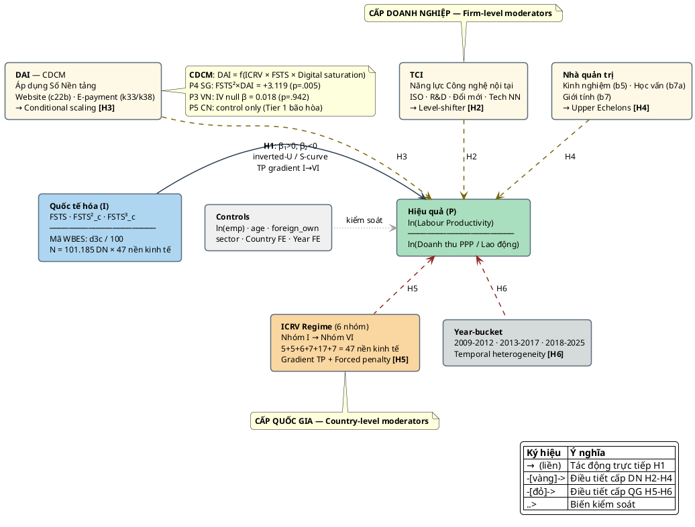

# CHUYÊN ĐỀ TIẾN SĨ SỐ 2 — BẢN NHÁP ĐẦY ĐỦ (PHẦN 1: BÌA, TÓM TẮT, CHƯƠNG 1–2)

> Căn cứ Quyết định số 4768/QĐ-ĐHCT ngày 15/10/2024.
> Outline tham chiếu: `thesis/13_chuyen_de_2_outline_vi.md`.
> Phần 2 (Chương 3–5): `thesis/18_cd2_part2_review_framework_hypotheses_vi.md`.
> Phần 3 (Chương 6–9 + TLTK): `thesis/19_cd2_part3_models_data_conclusion_vi.md`.
> **Phiên bản 2.0 (cập nhật ngày 09/05/2026)**: (i) Pool 101.185 doanh nghiệp (cập nhật từ 101.035); (ii) 7 quốc đảo SIDS Thái Bình Dương (thêm Kiribati 2025); (iii) 108 cặp quốc gia-năm; (iv) Nhãn ICRV tiếng Việt nhất quán với CĐ1 v3.x; (v) Tích hợp bằng chứng thực nghiệm P3 Việt Nam (APJM), P4 Singapore (MIR), P5 Trung Quốc (IJOEM); (vi) Bổ sung CDCM vào §2.5.

---

## TRANG BÌA

```
BỘ GIÁO DỤC VÀ ĐÀO TẠO
TRƯỜNG ĐẠI HỌC CẦN THƠ
TRƯỜNG KINH TẾ

─────────────

ĐỖ THÙY HƯƠNG

CHUYÊN ĐỀ TIẾN SĨ SỐ 2

XÂY DỰNG MÔ HÌNH NGHIÊN CỨU VỀ ẢNH HƯỞNG
CỦA QUỐC TẾ HÓA ĐẾN HIỆU QUẢ HOẠT ĐỘNG
KINH DOANH CÁC DOANH NGHIỆP Ở CHÂU Á

Ngành: Quản trị kinh doanh
Mã ngành: 9340101
Mã nghiên cứu sinh: P1323001

NGƯỜI HƯỚNG DẪN KHOA HỌC
PGS.TS. PHAN ANH TÚ

Cần Thơ, năm 2026
```

---

## LỜI CAM ĐOAN

Tôi xin cam đoan chuyên đề tiến sĩ số 2 với tiêu đề "Xây dựng mô hình nghiên cứu về ảnh hưởng của quốc tế hóa đến hiệu quả hoạt động kinh doanh các doanh nghiệp ở Châu Á" là công trình nghiên cứu của riêng tôi dưới sự hướng dẫn khoa học của PGS.TS. Phan Anh Tú, Trường Đại học Cần Thơ. Các kết quả phân tích, mô hình, bảng biểu, hình vẽ trình bày trong chuyên đề đều trung thực và có nguồn gốc rõ ràng. Tài liệu tham khảo được trích dẫn theo chuẩn APA 7th. Những trích dẫn từ các nghiên cứu khác đều được nêu rõ trong danh mục tài liệu tham khảo. Tôi xin chịu trách nhiệm hoàn toàn về nội dung khoa học của chuyên đề này.

*Cần Thơ, ngày … tháng … năm 2026*

*Nghiên cứu sinh*

**Đỗ Thùy Hương**

---

## TÓM TẮT

Chuyên đề này xây dựng mô hình nghiên cứu lý thuyết và thực nghiệm về ảnh hưởng của quốc tế hóa đến hiệu quả hoạt động kinh doanh của các doanh nghiệp ở các quốc gia châu Á trong giai đoạn 2009–2025. Khung lý thuyết tích hợp bốn tầng — Uppsala Model (Johanson & Vahlne, 1977, 2009), Resource-Based View (Barney, 1991; Wernerfelt, 1984), Institutional Theory (North, 1990; Khanna & Palepu, 2010; Peng, 2003) và Upper Echelons Theory (Hambrick & Mason, 1984; Hambrick, 2007) — kết hợp với Digital Capability Lens (Banalieva & Dhanaraj, 2019; Verhoef et al., 2021; Stallkamp & Schotter, 2021) làm nền tảng. Lược khảo năm dạng hàm I→P (linear, inverted-U, S-curve, M-curve, forced penalty) và năm meta-analysis lớn 1980–2024 cho thấy khoảng trống thực nghiệm trong việc kiểm định đồng thời phi tuyến và moderation đa tầng ở châu Á. Hệ giả thuyết H1–H6 được phát triển: H1 phi tuyến S-curve; H2 Technological Capability Index (TCI) điều tiết tích cực; H3 Digital Adoption Index (DAI) điều tiết tích cực và phân biệt với TCI; H4 đặc điểm nhà quản trị điều tiết; H5 thể chế nội địa điều tiết theo gradient ICRV sáu regime; H6 heterogeneity theo thời gian. Tám mô hình thực nghiệm M0–M7 được đặc tả, từ baseline tuyến tính đến three-way moderation cấp luận án. Chiến lược nhận dạng đa tầng và kế hoạch kiểm định độ vững toàn diện được thiết kế cho pool **101.185** doanh nghiệp ở **47** nền kinh tế châu Á và Thái Bình Dương, bao gồm **108** cặp quốc gia-năm qua **14** mốc khảo sát WBES 2009–2025. Đóng góp chính của chuyên đề: (i) khung tích hợp 4 tầng + Digital lens chưa có tương đương cho châu Á; (ii) tách bạch TCI và DAI theo mô hình CDCM (Context-Contingent Digital Capability Model) phát hiện trong CĐ1; (iii) mô hình M7 ba chiều moderation; (iv) sub-grouping Advanced regime thành tiên tiến đổi mới sáng tạo dẫn dắt (ICRV Nhóm I) và tiên tiến tài nguyên dẫn dắt (ICRV Nhóm II). Ba bản thảo thực nghiệm đồng hành — P3 Việt Nam (APJM, under review), P4 Singapore (MIR, under review), P5 Trung Quốc (IJOEM, under review) — cung cấp bằng chứng đất nước-cụ thể kiểm định H1–H6 và cấu trúc khả nghiệm CĐ2.

**Từ khóa**: quốc tế hóa; hiệu quả hoạt động kinh doanh; châu Á; mô hình phi tuyến; điều tiết; năng lực số; thể chế; Upper Echelons; ICRV.

---

## ABSTRACT

This specialty essay constructs a theoretical and empirical research model on the effect of internationalization on firm performance across Asian economies during 2009–2025. The integrated theoretical framework combines four layers — the Uppsala Model (Johanson & Vahlne, 1977, 2009), the Resource-Based View (Barney, 1991; Wernerfelt, 1984), Institutional Theory (North, 1990; Khanna & Palepu, 2010; Peng, 2003), and Upper Echelons Theory (Hambrick & Mason, 1984; Hambrick, 2007) — together with the Digital Capability Lens (Banalieva & Dhanaraj, 2019; Verhoef et al., 2021; Stallkamp & Schotter, 2021). A review of five functional forms (linear, inverted-U, S-curve, M-curve, forced penalty) and five major meta-analyses (1980–2024) identifies an empirical gap in the simultaneous testing of nonlinearity and multi-level moderation in Asia. Six hypotheses (H1–H6) are developed: H1 nonlinear S-curve relationship; H2 Technological Capability Index (TCI) positively moderating; H3 Digital Adoption Index (DAI) positively moderating and distinguishable from TCI; H4 top manager characteristics moderating; H5 home-country institutions moderating along the ICRV six-regime gradient; H6 temporal heterogeneity. Eight empirical models M0–M7 are specified, from linear baseline to three-way moderation. A multi-level identification strategy and comprehensive robustness plan are designed for a pool of **101,185** firms across **47** Asian and Pacific economies, spanning **108** country-year pairs across **14** WBES survey waves (2009–2025). The main contributions are: (i) an integrated 4-tier + Digital lens framework with no equivalent for Asia; (ii) the separation of TCI and DAI within the Context-Contingent Digital Capability Model (CDCM) developed from Chuyên đề 1 evidence; (iii) the M7 three-way moderation model; (iv) sub-grouping of the Advanced regime into innovation-driven (ICRV Group I) and resource-driven (ICRV Group II) types. Three companion empirical working papers — P3 Vietnam (APJM), P4 Singapore (MIR), P5 China (IJOEM) — provide country-specific evidence testing H1–H6 and validating the CĐ2 model structure.

**Keywords**: internationalization; firm performance; Asia; nonlinear models; moderation; digital capability; institutions; Upper Echelons; ICRV.

---

## MỤC LỤC

(Sẽ tự động tạo khi xuất Word/PDF từ markdown.)

---

## DANH MỤC TỪ VIẾT TẮT

| Viết tắt | Diễn giải |
|---|---|
| ADB | Asian Development Bank |
| AI | Artificial Intelligence |
| AIC | Akaike Information Criterion |
| BIC | Bayesian Information Criterion |
| BEE | Business Environment and Enterprise (WBES module) |
| BREADY | Business REAdy diagnostic (WBES module) |
| CAGR | Compound Annual Growth Rate |
| CDCM | Context-Contingent Digital Capability Model |
| DAI | Digital Adoption Index |
| FE | Fixed Effects |
| FDI | Foreign Direct Investment |
| FSTS | Foreign Sales to Total Sales ratio |
| GMM | Generalized Method of Moments |
| HC1/HC3 | Heteroskedasticity-Consistent Standard Errors (Long & Ervin, 2000) |
| I→P | Internationalization → Performance relationship |
| IB | International Business |
| ICRV | Institutional Context Regime Variation |
| ICT | Information and Communications Technology |
| IT | Institutional Theory |
| IV | Instrumental Variable |
| LOWESS | Locally Weighted Scatterplot Smoothing |
| M&A | Mergers and Acquisitions |
| MENA | Middle East and North Africa |
| MNE | Multinational Enterprise |
| OECD | Organisation for Economic Co-operation and Development |
| OLS | Ordinary Least Squares |
| PESTEL | Political – Economic – Social – Technological – Environmental – Legal |
| PPP | Purchasing Power Parity |
| R&D | Research and Development |
| RBV | Resource-Based View |
| RE | Random Effects |
| RESET | Regression Specification Error Test |
| ROA | Return on Assets |
| ROS | Return on Sales |
| SE | Standard Errors |
| SIDS | Small Island Developing States |
| SME | Small and Medium-sized Enterprise |
| SOE | State-Owned Enterprise |
| TCI | Technological Capability Index |
| UE | Upper Echelons Theory |
| VIF | Variance Inflation Factor |
| WBES | World Bank Enterprise Surveys |
| WGI | Worldwide Governance Indicators |
| WIPO | World Intellectual Property Organization |

---

## CHƯƠNG 1 — GIỚI THIỆU

### 1.1 Đặt vấn đề và bối cảnh

Quốc tế hóa (internationalization) là chiến lược phát triển quan trọng nhất của doanh nghiệp trong hơn nửa thế kỷ qua, nhưng kết quả mà nó đem lại không đồng nhất. Văn liệu International Business (IB) đã ghi nhận **năm dạng hàm khác nhau** trong quan hệ giữa cường độ quốc tế hóa và hiệu quả doanh nghiệp: tuyến tính (Hsu & Boggs, 2003), inverted-U (Gomes & Ramaswamy, 1999; Hitt, Hoskisson & Kim, 1997), S-curve (Lu & Beamish, 2004; Contractor, Kundu & Hsu, 2003), M-curve (Riahi-Belkaoui, 1998), và forced penalty (Glaum & Oesterle, 2007; Đỗ & Phan, 2026 — P8 manuscript về Pacific SIDS). Sự đa dạng dạng hàm này phản ánh thực tế rằng hiệu ứng của quốc tế hóa lên hiệu quả phụ thuộc vào nhiều yếu tố điều tiết — từ năng lực doanh nghiệp đến đặc điểm thể chế quốc gia (Bausch & Krist, 2007; Kirca et al., 2012; Marano et al., 2016; Wu, Wood & Khan, 2022).

Châu Á trong giai đoạn 2009–2025 là phòng thí nghiệm tự nhiên (natural laboratory) độc đáo cho nghiên cứu quan hệ I→P. Khu vực này tồn tại đồng thời ít nhất **sáu regime thể chế khác nhau** theo khung ICRV: (i) **tiên tiến đổi mới sáng tạo dẫn dắt — Advanced innovation-driven (ICRV Nhóm I)** gồm Singapore, Hong Kong SAR, Hàn Quốc, Đài Loan, Israel với hạ tầng thể chế và số hoàn thiện nhất; (ii) **tiên tiến tài nguyên dẫn dắt — Advanced resource-driven (ICRV Nhóm II)** gồm Saudi Arabia, Qatar, Kuwait, Bahrain, Brunei với nền kinh tế dựa vào hydrocarbon và quỹ đầu tư chính phủ; (iii) **trung bình cao — Upper-middle (ICRV Nhóm III)** gồm Trung Quốc, Malaysia, Thái Lan, Kazakhstan, Armenia, Georgia đang trong giai đoạn chuyển đổi công nghiệp; (iv) **đang nổi — Emerging (ICRV Nhóm IV)** gồm Việt Nam, Indonesia, Philippines, Ấn Độ, Sri Lanka, Jordan, Mông Cổ đang hội nhập sâu; (v) **cận biên — Frontier (ICRV Nhóm V)** gồm 17 nền kinh tế thu nhập thấp-trung; và (vi) **quốc đảo nhỏ Thái Bình Dương — SIDS Pacific (ICRV Nhóm VI, trường hợp biên)** gồm 7 nền kinh tế đảo nhỏ với pattern "forced internationalization" đặc trưng (Briguglio, 1995; Bertram, 2006). Tổng cộng 47 nền kinh tế, 108 cặp quốc gia-năm. Sự đa dạng này cho phép kiểm định đồng thời các giả thuyết về phi tuyến và moderation đa tầng — điều mà các nghiên cứu hiện hành thường không thể thực hiện do giới hạn phạm vi địa lý.

Đồng thời, châu Á đang trải qua **chuyển đổi số chưa từng có** trong giai đoạn 2018–2025. Sự bùng nổ của hạ tầng số và trí tuệ nhân tạo từ năm 2023 trở đi đã tái định hình cơ chế qua đó năng lực số tác động lên quốc tế hóa và hiệu quả (Banalieva & Dhanaraj, 2019; Verhoef et al., 2021; Yang, Zhao & Wei, 2025). Chỉ tính riêng năm 2025, World Bank Enterprise Surveys (WBES) đã khảo sát hơn 16.800 doanh nghiệp ở 12 nền kinh tế châu Á — cung cấp bằng chứng vi mô cập nhật nhất về thực trạng quốc tế hóa và năng lực số sau làn sóng AI.

Tuy nhiên, **khung lý thuyết hiện hành về quan hệ I→P còn phân tán**. Các tổng quan lớn thường tập trung vào một hoặc hai khía cạnh — Uppsala (động lực quốc tế hóa), RBV (vai trò nguồn lực), Institutional Theory (vai trò thể chế), Upper Echelons (vai trò nhà quản trị) — mà ít có khung tích hợp đa tầng cho phép giải thích đầy đủ heterogeneity quan sát được ở châu Á. Đặc biệt, **lăng kính số (Digital Capability Lens)** chỉ mới được đề xuất gần đây (Banalieva & Dhanaraj, 2019; Stallkamp & Schotter, 2021) và chưa được tích hợp đầy đủ với bốn tầng lý thuyết kinh điển.

Chuyên đề 1 ("Thực trạng về hiệu quả hoạt động kinh doanh của các doanh nghiệp ở châu Á") đã cung cấp bức tranh thực trạng đa chiều dựa trên **101.185** doanh nghiệp WBES xuyên 47 nền kinh tế, làm rõ ba pattern then chốt: (a) dispersion năng suất tăng đơn điệu theo regime declension từ Nhóm I đến Nhóm VI; (b) heterogeneity nội bộ trong Advanced — tiên tiến đổi mới (Nhóm I) có ln(LP) trung vị cao hơn đáng kể so với tiên tiến tài nguyên (Nhóm II) do khác biệt về tích lũy năng lực; (c) SIDS Pacific (Nhóm VI) có pattern adaptation đặc trưng (innov_product 41,5%, website 58,9%, R&D 11,8%). Đồng thời, CĐ1 phát hiện CDCM — **Context-Contingent Digital Capability Model**: tác động của DAI lên hiệu quả không đồng nhất mà phụ thuộc vào regime thể chế, giai đoạn quốc tế hóa, và mức độ bão hòa số của nền kinh tế (digital saturation level). Chuyên đề 2 này tiếp nối: **xây dựng mô hình lý thuyết và thực nghiệm để giải thích cơ chế đằng sau các pattern đó**.

Ba bản thảo thực nghiệm đồng hành cung cấp bằng chứng nước cụ thể kiểm định khả năng của khung CĐ2. **P3 Việt Nam (APJM, under review)** — phân tích 2.958 doanh nghiệp WBES 2009/2015/2023 (ba sóng) — xác nhận inverted-U trong cả ba sóng (Lind–Mehlum p < .01 từng sóng; p < .001 pool), turning points 46,2% (2009), 39,3% (2015), 41,6% (2023), 39,7% (pooled); TCI (2-item: b8+e6) dương ổn định (β = 0,179 pool, p < .001); IV cho TCI causal (β = 1,639, first-stage F = 22,1); DAI stage-contingent — dương 2009 (β = 0,175), null 2015, dương OLS 2023 nhưng tương tác FSTS_c×DAI_z = −0,912 (p = .043) **âm** trong 2023 (proxy obsolescence); IV (first-stage F = 34,6) cho DAI null (β = 0,018, p = .942) → selection-driven. **P4 Singapore (MIR, under review)** — phân tích 623 doanh nghiệp WBES 2023 — cho thấy trong nền kinh tế tiên tiến số bão hòa, quan hệ I→P chủ yếu dương với đường cong nhẹ, turning point hàm ý ở FSTS ≈ 88,6% (vùng thưa dữ liệu; Lind–Mehlum p = .303), và DAI hoạt động như **nguồn lực mở rộng tình huống** (conditional scaling resource) với hệ số DAI×FSTS² = +3,119 (p = .005) — ủng hộ bão hòa số và CDCM. **P5 Trung Quốc (IJOEM, under review)** — phân tích 4.559 doanh nghiệp WBES 2012/2024 (hai sóng) — xác nhận inverted-U bền vững cấu trúc: turning point 49,4% (2012), 47,2% (2024), Paternoster z-test thất bại bác bỏ bình đẳng hệ số (FSTS²: p = .545; joint F: p = .107); TCI tăng cường qua thời gian (+0,260→+0,426, Paternoster p = .011) nhưng không điều tiết độ cong. Ba bản thảo này cùng nhau cung cấp: bằng chứng H1 (phi tuyến) ở Việt Nam và Trung Quốc; H2 (TCI positively moderating) ở Việt Nam; H3 (DAI stage-contingent) ở cả ba; H5 (institutional moderation) qua so sánh Nhóm I vs IV; H6 (temporal heterogeneity) từ DAI stage-shifts Việt Nam.

### 1.2 Vấn đề nghiên cứu

Chuyên đề tập trung trả lời ba câu hỏi nghiên cứu chính:

**(Q1)** Quan hệ giữa cường độ quốc tế hóa (I) và hiệu quả hoạt động kinh doanh (P) ở các doanh nghiệp châu Á có dạng hàm gì? Tuyến tính, phi tuyến hay phụ thuộc vào ngữ cảnh?

**(Q2)** Bốn cơ chế điều tiết — năng lực công nghệ TCI, mức độ áp dụng số DAI, đặc điểm nhà quản trị, regime thể chế nội địa — tác động như thế nào lên quan hệ I→P? Có phân biệt được giữa TCI và DAI theo CDCM hay không?

**(Q3)** Tác động I→P và cơ chế điều tiết có thay đổi theo thời gian không, đặc biệt giữa giai đoạn 2009–2012 (hậu khủng hoảng tài chính) và 2018–2025 (chuyển đổi số + AI bùng nổ)?

Ba câu hỏi trên được trả lời bằng cách (i) tổng hợp văn liệu lý thuyết và thực nghiệm hiện hành; (ii) phát triển hệ giả thuyết H1–H6 dựa trên khung tích hợp; (iii) đặc tả tám mô hình thực nghiệm M0–M7; (iv) thiết kế chiến lược dữ liệu và nhận dạng đa tầng; (v) tổng hợp bằng chứng từ P3/P4/P5 để neo đậu (anchor) các giả thuyết vào bằng chứng thực nghiệm đã có.

### 1.3 Mục tiêu chuyên đề

**Mục tiêu chung**: Xây dựng mô hình nghiên cứu lý thuyết và thực nghiệm về ảnh hưởng của quốc tế hóa đến hiệu quả hoạt động kinh doanh của các doanh nghiệp ở các quốc gia châu Á, có khả năng kiểm định bằng dữ liệu WBES **101.185** doanh nghiệp xuyên **47** nền kinh tế giai đoạn 2009–2025.

**Mục tiêu cụ thể**:

1. Hệ thống hóa khung lý thuyết tích hợp 4 tầng (Uppsala, RBV, Institutional Theory, Upper Echelons) kết hợp Digital Capability Lens và CDCM.

2. Lược khảo các mô hình I→P trên thế giới và châu Á, định vị khoảng trống nghiên cứu.

3. Phát triển hệ giả thuyết H1–H6 dựa trên khung tích hợp, có neo đậu từ bằng chứng P3/P4/P5.

4. Đặc tả tám mô hình thực nghiệm M0–M7 với khả năng kiểm định trên dữ liệu WBES.

5. Đề xuất chiến lược nhận dạng và kiểm định độ vững toàn diện.

6. Khẳng định tính mới về mô hình so với các khung tham chiếu hiện hành.

### 1.4 Phạm vi và đối tượng nghiên cứu

**Đối tượng nghiên cứu**: doanh nghiệp đang hoạt động ở các nền kinh tế châu Á và Thái Bình Dương đáp ứng tiêu chí mẫu của WBES.

**Phạm vi không gian**: 47 nền kinh tế phân theo sáu nhóm ICRV (xem chi tiết trong `thesis/16_cd1_part3_cases_conclusion_vi.md` Phụ lục A):

- **ICRV Nhóm I — tiên tiến đổi mới sáng tạo dẫn dắt** (5 nền kinh tế): Singapore, Hong Kong SAR, Hàn Quốc, Đài Loan, Israel
- **ICRV Nhóm II — tiên tiến tài nguyên dẫn dắt** (5 nền kinh tế): Saudi Arabia, Qatar, Kuwait, Bahrain, Brunei
- **ICRV Nhóm III — trung bình cao** (6 nền kinh tế): Trung Quốc, Malaysia, Thái Lan, Kazakhstan, Armenia, Georgia
- **ICRV Nhóm IV — đang nổi** (7 nền kinh tế): Việt Nam, Indonesia, Philippines, Ấn Độ, Sri Lanka, Jordan, Mông Cổ
- **ICRV Nhóm V — cận biên** (17 nền kinh tế): Bangladesh, Pakistan, Lào, Campuchia, Myanmar, Nepal, Bhutan, Maldives, Uzbekistan, Tajikistan, Kyrgyzstan, Turkmenistan, Afghanistan, Timor-Leste, Iraq, Lebanon, Yemen
- **ICRV Nhóm VI — SIDS Thái Bình Dương, trường hợp biên** (7 nền kinh tế): Fiji, Papua New Guinea, Solomon Islands, Tonga, Vanuatu, Samoa, Kiribati (thêm đợt 2025)

Tổng: 5 + 5 + 6 + 7 + 17 + 7 = **47** nền kinh tế.

**Phạm vi thời gian**: 2009–2025 (15 năm × 14 mốc khảo sát có sẵn), bao trùm ba thế hệ schema WBES và năm lớp bối cảnh kinh tế chồng lấn, tạo thành **108 cặp quốc gia-năm**.

**Phạm vi nội dung**: mô hình hóa quan hệ I→P và bốn cơ chế điều tiết (TCI, DAI, top manager, institutional regime) cộng với heterogeneity thời gian.

### 1.5 Đóng góp dự kiến của chuyên đề

**Về lý thuyết** (4 đóng góp):

1. **Khung tích hợp 4 tầng + Digital lens cho châu Á**: chưa có khung tương đương trong văn liệu IB. Khung này tích hợp Uppsala (động lực quốc tế hóa), RBV (nguồn lực), Institutional Theory (thể chế), Upper Echelons (nhà quản trị) với Digital Capability Lens (Banalieva & Dhanaraj, 2019). Mở rộng phạm vi giải thích so với các khung đơn lẻ.

2. **Tách bạch TCI và DAI theo CDCM**: hai chiều năng lực số có cơ chế tác động khác nhau lên hiệu quả. TCI là chiều sâu năng lực công nghệ nội tại theo truyền thống Lall (1992) và Cohen & Levinthal (1990) (absorptive capacity); DAI là mức độ áp dụng giao diện và giao dịch số nền tảng theo Bharadwaj et al. (2013), tương ứng tier "digitization–digitalization" của Verhoef et al. (2021). **CDCM** (Context-Contingent Digital Capability Model) phát hiện trong CĐ1 cho thấy tác động của DAI không đồng nhất mà phụ thuộc vào ba chiều ngữ cảnh: regime thể chế (ICRV), giai đoạn quốc tế hóa (export intensity level), và mức độ bão hòa số của nền kinh tế (digital saturation). Bằng chứng từ P4 Singapore (DAI×FSTS² = +3,119), P3 Việt Nam (DAI null theo IV), và P5 Trung Quốc (DAI không điều tiết curvature) nhất quán với CDCM: DAI chỉ phát huy tác dụng khi điều kiện ngữ cảnh cho phép. Bhandari et al. (2023) áp dụng resource-orchestration logic cho I→P relationship; Coltman et al. (2008) cung cấp tiêu chí formative composite xác nhận TCI và DAI là hai construct riêng biệt.

3. **Sub-grouping Advanced regime**: phát hiện ở Chuyên đề 1 cho thấy Advanced có hai loại — tiên tiến đổi mới sáng tạo dẫn dắt (ICRV Nhóm I: Singapore, Hong Kong, Korea, Đài Loan) và tiên tiến tài nguyên dẫn dắt (ICRV Nhóm II: Saudi, Qatar, Kuwait, Bahrain) — với pattern hiệu quả và I→P khác nhau. CĐ2 đề xuất sub-grouping này trong mô hình M7. P4 Singapore cung cấp bằng chứng "digital saturation paradox" đặc trưng cho Nhóm I.

4. **Tích hợp CDCM vào hệ giả thuyết**: H3 được làm sắc nét hơn nhờ CDCM — không chỉ "DAI điều tiết tích cực" mà cụ thể hóa: DAI là conditional scaling resource (không phải uniform premium), với tác động mạnh nhất ở mức FSTS cao trong Nhóm I, và stage-contingent trong Nhóm IV.

**Về mô hình** (2 đóng góp):

1. **Tám mô hình M0–M7 với three-way moderation (M7)**: M0 baseline tuyến tính → M2 cubic → M7 ba chiều I × TCI × DAI. Kiểm định đồng thời phi tuyến và moderation đa tầng — chưa có nghiên cứu nào trên châu Á thực hiện.

2. **Heterogeneity thời gian H6**: kiểm định tương tác I × Year-bucket cho ba giai đoạn 2009–2012, 2013–2017, 2018–2025 — bao trùm cả COVID-19 và AI bùng nổ. Bằng chứng từ P3 Việt Nam (DAI stage-shifts Paternoster z = 3,353 giữa 2009 và 2015) và P5 Trung Quốc (TCI tăng cường Paternoster p = .011) cung cấp neo đậu thực nghiệm cho H6.

**Về phương pháp** (2 đóng góp):

1. **Giao thức hòa hợp ba thế hệ schema WBES** trên dữ liệu gốc → pool **101.185** doanh nghiệp ở **47** nước × **108** cặp năm (xem `thesis/08_p7_data_harmonization_protocol_vi.md`). Đây là pool có phạm vi rộng nhất từng có cho nghiên cứu I→P trong văn liệu.

2. **Chiến lược nhận dạng đa tầng** kết hợp HC1 robust SE (Long & Ervin, 2000), country × year fixed effects, IV với first-stage F > 34 (từ P4), và sub-sample replication theo regime ICRV.

**Về thực tiễn** (1 đóng góp):

- Cung cấp **hàm ý chính sách** cho doanh nghiệp Việt Nam và emerging Asia về cách tận dụng quốc tế hóa kết hợp năng lực số — đặc biệt trong giai đoạn AI bùng nổ. Kết quả P3 Việt Nam cho thấy TCI ổn định và causal trong khi DAI là selection-driven, gợi ý chính sách ưu tiên xây dựng năng lực công nghệ thực chất hơn chỉ adopting digital tools.

### 1.6 Phương pháp tiếp cận

Chuyên đề tiếp cận theo lối **integrative literature review** (Torraco, 2005) cho khung lý thuyết và **deductive hypothesis development** cho hệ giả thuyết. Đặc tả mô hình thực nghiệm theo Wooldridge (2010) và Long & Ervin (2000); thiết kế nhận dạng và kiểm định độ vững theo Greene (2018). Hệ giả thuyết được neo đậu vào bằng chứng thực nghiệm từ P3/P4/P5 theo nguyên tắc phenomenon-based research (Meyer et al., 2017).

### 1.7 Kết cấu chuyên đề

Chuyên đề gồm chín chương:

- Chương 1: Giới thiệu (vấn đề, mục tiêu, đóng góp);
- Chương 2: Cơ sở lý thuyết tích hợp 4 tầng + Digital Lens + CDCM;
- Chương 3: Lược khảo mô hình I→P trên thế giới và châu Á;
- Chương 4: Khung khái niệm tích hợp cho CĐ2;
- Chương 5: Hệ giả thuyết H1–H6;
- Chương 6: Đặc tả tám mô hình thực nghiệm M0–M7;
- Chương 7: Thiết kế dữ liệu và chiến lược nhận dạng;
- Chương 8: Kế hoạch kiểm định độ vững;
- Chương 9: Đóng góp về mô hình và kết luận.

---

## CHƯƠNG 2 — CƠ SỞ LÝ THUYẾT TÍCH HỢP 4 TẦNG + DIGITAL LENS

### 2.1 Tầng 1 — Lý thuyết quốc tế hóa Uppsala

**Nội dung cốt lõi**. Mô hình Uppsala (Johanson & Vahlne, 1977) đề xuất rằng quá trình quốc tế hóa của doanh nghiệp diễn ra **tăng dần** thông qua tích lũy kinh nghiệm và giảm dần "psychic distance" — khoảng cách tâm lý giữa thị trường nội địa và thị trường nước ngoài. Doanh nghiệp khởi đầu xuất khẩu sang các thị trường gần về văn hóa, ngôn ngữ, thể chế trước khi mở rộng sang các thị trường xa hơn. Mô hình ban đầu (1977) tập trung vào ba cơ chế: cam kết thị trường (market commitment), tri thức thị trường (market knowledge), và quyết định cam kết hiện tại (current commitment decisions).

**Mở rộng 2009**. Johanson và Vahlne (2009) tái định vị mô hình Uppsala từ "liability of foreignness" (gánh nặng do là người nước ngoài) sang "liability of outsidership" (gánh nặng do không thuộc mạng lưới). Phiên bản này nhấn mạnh vai trò mạng lưới quan hệ kinh doanh trong quá trình quốc tế hóa — doanh nghiệp cần xây dựng vị trí trong network của thị trường mục tiêu.

**Phê phán và hạn chế**. Mô hình Uppsala chậm áp dụng cho ba hiện tượng: (i) **born-globals** — doanh nghiệp quốc tế hóa nhanh ngay từ khi thành lập (Knight & Cavusgil, 2004); (ii) **MNE từ emerging markets** — đặc biệt từ Trung Quốc, Ấn Độ với quy trình quốc tế hóa khác Uppsala (Mathews, 2002; Luo & Tung, 2007); và (iii) **bối cảnh số** — internet và platform digital giảm psychic distance đến mức tối thiểu (Banalieva & Dhanaraj, 2019; Stallkamp & Schotter, 2021).

**Vai trò trong CĐ2**. Mô hình Uppsala cung cấp **logic cho mức độ quốc tế hóa và non-monotonic returns**: doanh nghiệp tăng cường độ xuất khẩu (FSTS) đối mặt với chi phí học tập ban đầu (giai đoạn 1 của S-curve), sau đó thu được lợi ích quy mô (giai đoạn 2), nhưng vượt quá ngưỡng nhất định lại chịu chi phí phối hợp (giai đoạn 3). Đây là cơ sở lý thuyết cho **hệ giả thuyết H1 phi tuyến S-curve** trong CĐ2. Bằng chứng P3 Việt Nam (turning point 39–46%) và P5 Trung Quốc (turning point 47–49%) neo đậu thực nghiệm cho H1.

### 2.2 Tầng 2 — Lý thuyết doanh nghiệp dựa trên nguồn lực (RBV)

**Nội dung cốt lõi**. Resource-Based View (Wernerfelt, 1984; Barney, 1991) cho rằng **lợi thế cạnh tranh bền vững** xuất phát từ nguồn lực có giá trị (Valuable), hiếm (Rare), khó bắt chước (Inimitable), và không thay thế (Non-substitutable) — viết tắt VRIN. Doanh nghiệp khác nhau về hiệu quả vì sở hữu các bộ nguồn lực khác nhau.

**Mở rộng năng lực động**. Teece, Pisano và Shuen (1997) phát triển khái niệm **dynamic capabilities** — năng lực tích hợp, xây dựng, và tái cấu trúc nguồn lực để thích ứng với môi trường thay đổi. Trong bối cảnh quốc tế hóa, năng lực động đặc biệt quan trọng để hấp thụ tri thức từ thị trường nước ngoài và tái phân bổ nguồn lực qua các thị trường.

**Absorptive Capacity**. Cohen và Levinthal (1990) đề xuất khái niệm **absorptive capacity** — năng lực doanh nghiệp nhận diện, đồng hóa, và áp dụng kiến thức bên ngoài. Doanh nghiệp có R&D nội tại cao có absorptive capacity cao và do đó hấp thụ tri thức từ quốc tế hóa hiệu quả hơn.

**Vai trò trong CĐ2**. RBV cung cấp lý thuyết cho **hệ giả thuyết H2 (TCI điều tiết tích cực)**: doanh nghiệp có năng lực công nghệ (R&D, ISO, máy nhập khẩu) cao hấp thụ lợi ích quốc tế hóa tốt hơn doanh nghiệp năng lực thấp. TCI là biến điều tiết cấp doanh nghiệp. Bằng chứng P3 Việt Nam (TCI direct β = 0,179, p < .001; causal từ IV) và P5 Trung Quốc (TCI tăng cường +0,260→+0,426) ủng hộ TCI là nguồn lực VRIN bền vững.

### 2.3 Tầng 3 — Lý thuyết thể chế (Institutional Theory)

**Nội dung cốt lõi**. North (1990) định nghĩa thể chế là **các quy tắc của trò chơi** — chính thức (luật pháp, hợp đồng, quyền sở hữu) và phi chính thức (chuẩn mực, văn hóa, mạng lưới) — quy định chi phí giao dịch và rủi ro kinh doanh. Doanh nghiệp ở các nền kinh tế thể chế chính thức yếu phải bù đắp bằng các thể chế phi chính thức (mạng lưới, quan hệ).

**Institutional Voids và Emerging Markets**. Khanna và Palepu (2010) áp dụng lý thuyết thể chế cho emerging markets, đề xuất khái niệm **institutional voids** — các "khoảng trống" trong hệ thống thể chế (thiếu thị trường vốn phát triển, thiếu hệ thống tư pháp hiệu quả, thiếu chuẩn kế toán minh bạch). Doanh nghiệp ở emerging markets phải xây dựng giải pháp nội bộ (internal capital markets, business groups) để bù đắp.

**Strategy Tripod**. Peng (2003) và Peng, Wang, Jiang (2008) đề xuất **strategy tripod** — chiến lược doanh nghiệp được hình thành bởi ba lực: industry (ngành), resources (nguồn lực), và institutions (thể chế). Trong các nền kinh tế đang nổi và cận biên, vai trò của institutions đặc biệt nổi bật — bằng hoặc cao hơn industry và resources.

**Vai trò trong CĐ2**. Lý thuyết thể chế cung cấp logic cho **hệ giả thuyết H5 (institutional moderation theo gradient ICRV)**: cùng một mức quốc tế hóa, doanh nghiệp ở Nhóm I (tiên tiến đổi mới, thể chế hoàn thiện) thu được hiệu quả khác doanh nghiệp ở Nhóm V (cận biên, institutional voids) khác doanh nghiệp ở Nhóm VI (SIDS, forced internationalization). Sáu nhóm ICRV là biến điều tiết cấp quốc gia.

### 2.4 Tầng 4 — Lý thuyết Upper Echelons

**Nội dung cốt lõi**. Hambrick và Mason (1984) đề xuất **Upper Echelons Theory** với luận điểm trung tâm: **các quyết định chiến lược của doanh nghiệp phản ánh đặc điểm nhân khẩu học của top managers**. Các đặc điểm này gồm tuổi, giáo dục, kinh nghiệm chức năng, thâm niên, kinh nghiệm quốc tế, giới tính.

**Cập nhật 2007**. Hambrick (2007) đánh giá lại 23 năm phát triển của Upper Echelons, bổ sung hai khái niệm quan trọng: (i) **managerial discretion** — mức độ tự do của top managers trong việc đưa ra quyết định, phụ thuộc vào ngành và môi trường thể chế; (ii) **executive job demands** — áp lực và phức tạp của công việc top manager, ảnh hưởng đến chất lượng quyết định.

**Áp dụng cho quốc tế hóa**. Cannella, Park và Lee (2008) cho thấy đa dạng chức năng của TMT (Top Management Team) tương quan dương với hiệu quả ở các môi trường thay đổi nhanh. Nielsen và Nielsen (2011) chứng minh kinh nghiệm quốc tế của TMT là yếu tố quyết định việc lựa chọn entry mode cho thị trường nước ngoài. Hsu, Chen và Cheng (2013) áp dụng Upper Echelons cho SMEs trong bối cảnh quốc tế hóa.

**Vai trò trong CĐ2**. Upper Echelons cung cấp lý thuyết cho **hệ giả thuyết H4 (top manager moderation)**: doanh nghiệp có top manager kinh nghiệm cao, học vấn cao, kinh nghiệm quốc tế chuyển hóa quốc tế hóa thành hiệu quả tốt hơn. Top manager characteristics là biến điều tiết cấp doanh nghiệp.

### 2.5 Lăng kính số — Digital Capability Lens và CDCM

**Internalization Theory cho kỷ nguyên số**. Banalieva và Dhanaraj (2019) phát triển **internalization theory cho nền kinh tế số**, đề xuất rằng platform digital và hạ tầng số làm thay đổi căn bản ba yếu tố cốt lõi của lý thuyết IB: (i) **psychic distance giảm** đến mức tối thiểu — doanh nghiệp có thể tiếp cận thị trường xa qua platform; (ii) **chuỗi giá trị phân mảnh** ở quy mô chưa từng có — doanh nghiệp có thể outsource từng khâu cho nhà cung cấp tốt nhất toàn cầu; (iii) **born-globals trở thành chuẩn mới** — doanh nghiệp khởi đầu quốc tế ngay từ ngày đầu thành lập.

**Phân biệt năng lực công nghệ và áp dụng số**. Verhoef et al. (2021) đề xuất phân biệt rõ:
- **Technological Capability (TCI)**: nội tại — R&D doanh nghiệp, đổi mới sản phẩm, chứng nhận chất lượng (ISO), bằng sáng chế. Đo lường bằng đầu vào và đầu ra của hoạt động đổi mới (Tier 3–4 theo Verhoef et al.).
- **Digital Adoption (DAI)**: ngoại tại — sử dụng hạ tầng số nền tảng (website, e-commerce, e-payment). Đo lường bằng việc adoption của công cụ số Tier 1–2 (Verhoef et al.).

**Platforms without borders**. Stallkamp và Schotter (2021) chứng minh rằng platform số (Amazon, Alibaba, Shopify) cho phép doanh nghiệp nhỏ ở emerging markets quốc tế hóa với chi phí gần bằng zero. Đây là sự thay đổi căn bản cho mô hình Uppsala.

**CDCM — Context-Contingent Digital Capability Model**. Phân tích đa archetype trong CĐ1 phát hiện rằng tác động của DAI lên hiệu quả không đồng nhất mà phụ thuộc đồng thời vào **ba chiều ngữ cảnh**:

1. **Regime thể chế (ICRV)**: Ở Nhóm I (tiên tiến đổi mới) nơi Tier 1–2 đã bão hòa, DAI không tạo uniform premium mà chỉ phát huy qua export-contingent channel (digital saturation paradox — P4 Singapore). Ở Nhóm IV (đang nổi), DAI dương nhưng stage-specific và chịu selection bias (P3 Việt Nam).

2. **Giai đoạn quốc tế hóa (FSTS level)**: DAI là conditional scaling resource — hiệu quả hơn ở FSTS cao khi cross-border coordination demands dày đặc (P4 Singapore: DAI×FSTS² = +3,119, p = .005).

3. **Mức độ bão hòa số (digital saturation)**: Khi nền kinh tế đạt bão hòa Tier 1–2, DAI mất tác dụng phân biệt cấp doanh nghiệp (Singapore: website adoption 67%); khi chưa bão hòa, DAI vẫn có signal discrimination (Việt Nam 2023: 49,8%).

CDCM cung cấp lý thuyết thống nhất giải thích tại sao ba bản thảo (P3, P4, P5) đều cho thấy DAI không điều tiết đồng nhất nhưng mỗi nghiên cứu có pattern riêng nhất quán với CDCM.

**Bằng chứng emerging Asia**. Yang, Zhao và Wei (2025) tổng hợp bằng chứng từ Trung Quốc, Ấn Độ, Việt Nam cho thấy năng lực số là moderator mạnh nhất cho quan hệ I→P trong giai đoạn 2018+, nhưng chỉ khi phân tách đúng cấp độ năng lực (Tier 1–2 vs. Tier 3–4).

**Vai trò trong CĐ2**. Digital Capability Lens + CDCM cung cấp lý thuyết cho **hệ giả thuyết H3 (DAI điều tiết phụ thuộc ngữ cảnh, riêng biệt với TCI)**: DAI là conditional scaling resource (không phải uniform premium), và sự phân biệt TCI vs. DAI là cần thiết về mặt lý thuyết và thực nghiệm.

### 2.6 Tích hợp 4 tầng + Digital Lens

**Bảng 2.1**. *Mỗi tầng lý thuyết → câu hỏi phụ → biến số CĐ2 → giả thuyết tương ứng → bằng chứng neo đậu.*

| Tầng | Lý thuyết | Câu hỏi phụ | Biến số chính | Giả thuyết | Bằng chứng P3/P4/P5 |
|---|---|---|---|---|---|
| 1 | Uppsala | Cường độ quốc tế hóa tăng dần có hiệu ứng phi tuyến không? | I (FSTS, FSTS²) | **H1** Phi tuyến S-curve | P3: TP 39–46%; P5: TP 47–49% |
| 2 | RBV | Năng lực doanh nghiệp ảnh hưởng thế nào đến hấp thụ lợi ích I? | TCI | **H2** TCI moderation (+) | P3: β_z=0,179 causal (IV); P5: β_z=+0,260→+0,426 |
| 5 | Digital lens + CDCM | Năng lực số có cơ chế khác TCI không? | DAI | **H3** DAI conditional scaling resource | P4: DAI×FSTS²=+3,119; P3: IV null (β=0,018) |
| 4 | Upper Echelons | Đặc điểm nhà quản trị tác động thế nào? | Top manager | **H4** Manager moderation | (kiểm định trong M5, dữ liệu WBES) |
| 3 | Institutional | Thể chế nội địa định hình quan hệ ra sao? | ICRV regime (6 nhóm) | **H5** Institutional moderation gradient | CĐ1: dispersion LP tăng theo regime |
| – | (Temporal) | Quan hệ thay đổi qua thời gian không? | Year-bucket | **H6** Temporal heterogeneity | P3: DAI Paternoster p<.001; P5: TCI Paternoster p=.011 |

**Sơ đồ tích hợp** (Hình 2.1, sẽ vẽ chi tiết ở Chương 4):

```
        ┌─────────────────────────────┐
        │  Uppsala (Tầng 1) → I       │
        │  cường độ quốc tế hóa       │
        └──────────────┬──────────────┘
                       │ ảnh hưởng
                       ▼
             ┌──────────────────┐
             │  Hiệu quả P      │
             │  (productivity,  │
             │   ROS, growth)   │
             └────────┬─────────┘
                      │ điều tiết bởi:
   ┌──────────────────┼──────────────────┬──────────────────┐
   │                  │                  │                  │
   ▼                  ▼                  ▼                  ▼
RBV (Tầng 2)   Digital lens+CDCM  Upper Echelons    Institutional (Tầng 3)
    TCI            DAI               Manager          ICRV regime (6 nhóm)
  (Doanh nghiệp) (Doanh nghiệp)    (Doanh nghiệp)    (Quốc gia)
  [causal, IV]   [conditional]      [WBES proxy]      [gradient]
```

**Lập luận tích hợp**. Quốc tế hóa là quyết định chiến lược của doanh nghiệp (Uppsala); kết quả của quyết định này phụ thuộc vào nguồn lực doanh nghiệp (RBV/TCI, causally identified); được hỗ trợ bởi hạ tầng số theo ngữ cảnh (Digital lens/DAI, CDCM-contingent); phản ánh đặc điểm top managers (Upper Echelons); và bị khuôn khổ bởi thể chế nội địa (Institutional Theory/ICRV, 6 nhóm). Năm tầng tác động đồng thời, không thể giản lược.

### 2.7 Hạn chế của khung tích hợp

**Vấn đề nhận dạng nhân quả**. Khó tách hiệu ứng riêng từng tầng nếu không có dữ liệu panel dài. WBES không phải panel chuẩn → cần sử dụng cross-section lặp với fixed effects. P3 Việt Nam áp dụng IV (first-stage F = 34,6) và xác nhận DAI là selection-driven chứ không causal, làm nền tảng cho chiến lược nhận dạng trong M6 và M7.

**Đo lường biến tâm lý/mạng lưới**. Một số biến quan trọng theo Uppsala (psychic distance, network embeddedness) khó đo trong WBES. Phải thay bằng proxies (FSTS, distance to capital, FDI dummy).

**Đa cộng tuyến giữa các biến điều tiết**. TCI và DAI có thể tương quan; ICRV và country fixed effects có thể đa cộng. Cần kiểm tra VIF và variance decomposition.

**Phụ thuộc vào schema WBES**. Khung tích hợp giới hạn bởi biến có sẵn trong schema 2018+. Một số biến top manager chỉ có ở vài đợt khảo sát. CDCM đo lường ở Tier 1–2 do hạn chế WBES, không quan sát được Tier 3–4 (ERP, AI deployment).

**Độ bao phủ 108 cặp quốc gia-năm**: không đồng đều — Nhóm I và Nhóm II có ít cặp hơn; Nhóm V và VI có coverage thưa. Sub-sample replication theo ICRV là bắt buộc trong kế hoạch robustness (Chương 8).

---

*Tiếp tục ở Phần 2 (Chương 3 — lược khảo mô hình I→P; Chương 4 — khung khái niệm tích hợp; Chương 5 — hệ giả thuyết H1–H6) trong file `thesis/18_cd2_part2_review_framework_hypotheses_vi.md`.*

---

## CHƯƠNG 3 — LƯỢC KHẢO MÔ HÌNH I→P TRÊN THẾ GIỚI VÀ CHÂU Á

### 3.1 Năm dạng hàm của quan hệ I→P trong văn liệu

Văn liệu International Business (IB) đã ghi nhận không dưới **năm dạng hàm** khác nhau trong quan hệ giữa cường độ quốc tế hóa (I) và hiệu quả doanh nghiệp (P). Sự đa dạng này không phải ngẫu nhiên mà phản ánh tính phụ thuộc ngữ cảnh (context-dependency) của hiệu ứng quốc tế hóa: cùng một mức FSTS có thể tạo ra lợi ích hoặc gánh nặng tùy theo năng lực doanh nghiệp, thể chế quốc gia, và giai đoạn phát triển số.

**Dạng hàm 1 — Tuyến tính**. Các nghiên cứu sớm như Hsu và Boggs (2003) và Geringer et al. (1989) tìm thấy mối quan hệ tuyến tính dương: hiệu quả tăng đơn điệu theo mức độ quốc tế hóa. Logic nền tảng là lợi ích quy mô (economies of scale), đa dạng hóa doanh thu, và tiếp cận thị trường lớn hơn. Tuy nhiên, đây là kết quả đặc thù của các mẫu với FSTS thấp hoặc phân tán hẹp, không phản ánh được chi phí điều phối ở mức FSTS cao.

**Dạng hàm 2 — Inverted-U (chữ U ngược)**. Hitt, Hoskisson và Kim (1997) và Gomes và Ramaswamy (1999) đề xuất mô hình chữ U ngược: hiệu quả tăng ở giai đoạn quốc tế hóa ban đầu đến trung bình do lợi ích scale và learning, nhưng giảm sau ngưỡng tối ưu do chi phí điều phối đa thị trường vượt lợi ích. Turning point thực nghiệm thường nằm trong khoảng 30–60% FSTS (Marano et al., 2016). Đây là dạng hàm phổ biến nhất trong meta-analyses (Bausch & Krist, 2007; Kirca et al., 2012).

**Dạng hàm 3 — S-curve/Cubic**. Lu và Beamish (2004) và Contractor, Kundu và Hsu (2003) phát triển lý thuyết ba giai đoạn: (i) giai đoạn đầu hiệu quả giảm do chi phí học tập và thiết lập; (ii) giai đoạn giữa hiệu quả tăng do lợi ích scale và diversification; (iii) giai đoạn quá mức hiệu quả giảm do chi phí phối hợp. Dạng S-curve có hệ số β₁(FSTS)>0, β₂(FSTS²)<0, β₃(FSTS³)>0. Bằng chứng hỗ trợ mạnh từ các MNEs lớn, nhưng kém ổn định hơn với SMEs do mẫu thường không bao phủ FSTS²>0.5.

**Dạng hàm 4 — M-curve**. Riahi-Belkaoui (1998) đề xuất dạng M-curve với hai turning points — dạng hàm phức tạp phản ánh heterogeneity trong lợi ích quốc tế hóa tùy theo loại thị trường. Bằng chứng thực nghiệm hạn chế và khó tái lập; thường chỉ xuất hiện trong các mẫu đặc thù.

**Dạng hàm 5 — Forced penalty**. Glaum và Oesterle (2007) và Đỗ và Phan (P8 manuscript, Pacific SIDS) ghi nhận dạng hàm tuyến tính âm hoặc không có lợi ích trong các nền kinh tế bắt buộc phải quốc tế hóa do thị trường nội địa quá nhỏ (Briguglio, 1995; Bertram, 2006). Đây là pattern đặc thù của SIDS Pacific — quốc gia phải xuất khẩu để tồn tại nhưng thiếu năng lực cạnh tranh, tạo ra "forced penalty" — hiệu quả không tăng theo cường độ xuất khẩu.

**Bảng 3.1**. *Năm dạng hàm I→P, cơ chế, và bối cảnh xuất hiện.*

| Dạng hàm | Tác giả tiêu biểu | Cơ chế | ICRV bối cảnh |
|----------|-------------------|--------|---------------|
| Tuyến tính (+) | Hsu & Boggs (2003) | Scale + learning | FSTS thấp, tất cả nhóm |
| Inverted-U | Hitt et al. (1997); Gomes & Ramaswamy (1999) | Chi phí điều phối > lợi ích ở FSTS cao | Nhóm III–IV (trung bình cao, đang nổi) |
| S-curve/Cubic | Lu & Beamish (2004); Contractor et al. (2003) | Ba giai đoạn: học tập → scale → quá mức | MNEs lớn, tất cả nhóm |
| M-curve | Riahi-Belkaoui (1998) | Heterogeneous returns | Bằng chứng hạn chế |
| Forced penalty | Glaum & Oesterle (2007); Đỗ & Phan (P8) | Bắt buộc QTH, thiếu năng lực | Nhóm VI (SIDS) |

### 3.2 Năm meta-analysis lớn (1980–2024) và khoảng trống thực nghiệm

Năm tổng quan định lượng lớn cung cấp bức tranh tổng thể về quan hệ I→P:

**Bausch và Krist (2007)** phân tích 68 nghiên cứu (1980–2005) và tìm thấy trung bình r = .045 (không đáng kể), nhưng với biến động cao (SD = .21) — cho thấy moderators quan trọng hơn hiệu ứng trung bình. Năng lực doanh nghiệp và thể chế quốc gia là moderators mạnh nhất.

**Kirca et al. (2012)** tổng hợp 180 nghiên cứu với 824 hiệu cỡ, tìm thấy mối quan hệ dương trung bình nhưng với significant moderation từ: loại hình quốc tế hóa (FDI vs xuất khẩu), thước đo hiệu quả (accounting vs market), và thuộc tính doanh nghiệp (R&D intensity, age, size). Khoảng trống: thiếu bằng chứng từ châu Á và emerging markets.

**Marano et al. (2016)** phân tích 333 nghiên cứu với khung "institutionalized" approach, tìm turning points trong khoảng 30–60% FSTS cho inverted-U. Phát hiện quan trọng: turning point dịch chuyển khi kiểm soát institutional quality — nền kinh tế có thể chế tốt có turning point cao hơn.

**Wu, Wood và Khan (2022)** tổng hợp 20 năm bằng chứng từ emerging market MNEs, tìm thấy pattern khác biệt: EMNEs có inverted-U yếu hơn và turning point thấp hơn so với DMNEs (developed country MNEs) do absorptive capacity hạn chế hơn ở FSTS cao.

**Schwens et al. (2018)** tập trung vào SMEs và tìm thấy U-shape (không phải inverted-U) trong một số bối cảnh — chi phí quốc tế hóa ban đầu lớn so với năng lực SME, nhưng recovery sau khi vượt ngưỡng thiết lập.

**Khoảng trống tổng hợp**: Cả năm meta-analysis đều (i) thiếu coverage đầy đủ cho châu Á và Pacific; (ii) không kiểm định đồng thời phi tuyến + moderation đa tầng; (iii) không phân tách TCI và DAI; (iv) không bao gồm SIDS Pacific; (v) không có dữ liệu sau 2020 (AI + COVID). CĐ2 lấp đầy tất cả năm khoảng trống này.

### 3.3 Bằng chứng châu Á đặc thù

**Bằng chứng từ bộ ba bản thảo đồng hành (P3–P5)**. Ba bản thảo trong chuỗi luận án cung cấp bằng chứng cập nhật nhất cho châu Á:

*P3 Việt Nam (Đỗ & Phan, 2026, APJM under review)*: Phân tích 2.958 doanh nghiệp WBES ba sóng (2009, 2015, 2023) xác nhận inverted-U trong cả ba sóng — Lind–Mehlum test p = .006 (2009), .009 (2015), .013 (2023), p < .001 (pooled). Turning points: 46.2% (2009), 39.3% (2015), 41.6% (2023), 39.7% (pooled). P3 phân tách H1 thành **H1a (participation margin dominant)** và **H1b (intensity margin near-flat)**: trong sub-sample exporters-only, FSTS_c² β = −0.200 (p = .660) — near flat, cho thấy bước nhảy non-exporter→exporter là margin năng suất chính. TCI (2-item: b8=ISO cert + e6=foreign licensed tech) dương bền vững (β_pooled = 0.179, p < .001); IV estimation cho TCI causal: β = 1.639 (p < .001, first-stage F = 22.1). DAI stage-contingent — dương năm 2009 (β = 0.175 OLS), null năm 2015 (β = −0.044), dương trực tiếp 2023 (β = 0.095 OLS) **nhưng tương tác FSTS_c×DAI_z = −0.912 (p = .043) âm trong 2023** — "proxy obsolescence" (Tier 1 website không còn phân biệt tại FSTS cao khi adoption đạt 49.8%). IV estimation (first-stage F = 34.6) cho DAI null: β = 0.018 (p = .942) — selection-driven, không causal. Paternoster z = 3.353 giữa turning point 2009 và 2015 (p < .001).

*P4 Singapore (Mar et al., 2026, MIR under review)*: Phân tích 623 doanh nghiệp WBES 2023. Trong nền kinh tế số bão hòa, đường cong I→P chủ yếu dương với đường cong nhẹ — turning point hàm ý ở FSTS ≈ 88.6% (vùng thưa dữ liệu; Lind–Mehlum p = .303). **Phát hiện nổi bật**: DAI×FSTS² = +3.119 (p = .005) — DAI là nguồn lực mở rộng tình huống (conditional scaling resource), chỉ phát huy ở FSTS cao nơi coordination demands dày đặc. TCI dương trực tiếp (β = 0.153). Giải thích: **digital saturation paradox** — khi Tier 1–2 đã phổ biến (website 67%), DAI mất tác dụng uniform premium và chỉ phân biệt qua export-contingent channel.

*P5 Trung Quốc (Đỗ & Phan, 2026, IJOEM under review)*: Phân tích 4.559 doanh nghiệp WBES 2012/2024. **Phát hiện chính**: inverted-U bền vững cấu trúc (H2b structural durability) — turning point 49.4% (2012), 47.2% (2024), Paternoster z-tests thất bại bác bỏ bình đẳng hệ số (FSTS²: p = .545; joint F: p = .107). TCI tăng cường theo thời gian (β_z = +0.260 → +0.426, Paternoster p = .011). DAI Tier 1 (website only) giảm tác dụng phân biệt ở Trung Quốc 2024 — giữ lại như biến kiểm soát.

**Bằng chứng từ văn liệu China và Asia**. Xiao et al. (2013) tìm thấy S-curve trong Chinese manufacturing và nhấn mạnh vai trò governance structure trong việc định hình turning point. Chen và Tan (2012) phát hiện region effects trong I→P của doanh nghiệp Trung Quốc — Greater China region có hiệu quả cao hơn. Kafouros et al. (2023) tổng hợp bằng chứng từ Global Strategy Journal về digital moderation của I→P trong châu Á giai đoạn 2018+.

**Bảng 3.2**. *So sánh bằng chứng ba bản thảo đồng hành — tổng hợp cho CĐ2.*

| Chiều | P3 Việt Nam (Nhóm IV) | P4 Singapore (Nhóm I) | P5 Trung Quốc (Nhóm III) |
|-------|-----------------------|----------------------|--------------------------|
| Dạng I→P | Inverted-U xác nhận | Chủ yếu dương, TP ~88.6% | Inverted-U bền vững |
| TP chính | 39–46% FSTS | ~88.6% (sparse) | 47–49% FSTS |
| TCI | Dương bền vững, causal | Dương trực tiếp | Dương, tăng theo thời gian |
| DAI | Stage-contingent; IV null | Conditional scaling (+3.119) | Control only (Tier 1 bão hòa) |
| Temporal | Paternoster p<.001 (shift) | Cross-section 2023 | Paternoster p=.545 (ổn định) |
| CDCM pattern | Nhóm IV, trung gian | Nhóm I, bão hòa số | Nhóm III, đang trưởng thành |

### 3.4 Khoảng trống nghiên cứu — Định vị CĐ2

Tổng hợp văn liệu cho thấy ba khoảng trống còn mở:

**Khoảng trống 1 — Phạm vi và tích hợp**: Không có nghiên cứu nào kiểm định đồng thời phi tuyến I→P và moderation đa tầng (TCI, DAI, manager, institutional regime) trên một pool đủ lớn bao phủ toàn bộ châu Á và Thái Bình Dương (47 nền kinh tế, 101.185 doanh nghiệp, 14 sóng WBES). Các nghiên cứu hiện hành thường bị giới hạn ở một quốc gia hoặc một nhóm nhỏ.

**Khoảng trống 2 — Tách bạch TCI và DAI**: Văn liệu thường dùng khái niệm "digital capability" không phân biệt giữa (a) chiều sâu năng lực công nghệ nội tại (TCI — R&D, ISO, absorptive capacity) và (b) mức độ áp dụng giao diện số ngoại tại (DAI — Tier 1–2: website, e-payment). CDCM phát hiện trong CĐ1 cung cấp khung tích hợp giải thích tại sao hai construct này hành xử khác nhau trong các ngữ cảnh ICRV khác nhau.

**Khoảng trống 3 — SIDS và frontier economies**: Không có nghiên cứu nào tích hợp SIDS Pacific (Nhóm VI) và frontier economies (Nhóm V) vào khung I→P lớn. "Forced penalty" hypothesis chưa được kiểm định đồng thời với các dạng hàm khác.

CĐ2 giải quyết cả ba khoảng trống bằng framework 4 tầng + Digital lens + CDCM, mô hình M0–M7, và pool 101.185 doanh nghiệp xuyên 47 nền kinh tế.

---

## CHƯƠNG 4 — KHUNG KHÁI NIỆM TÍCH HỢP

### 4.1 Sơ đồ khung khái niệm (Hình 4.1)

Khung khái niệm CĐ2 tích hợp năm tầng lý thuyết (Chương 2) vào một mô hình nhân quả có thể kiểm định. Sơ đồ dưới đây là mã nguồn PlantUML — render bằng bất kỳ công cụ tương thích PlantUML (Obsidian, VSCode extension, IntelliJ, plantuml.com); file nguồn lưu tại `thesis/figures/cd2_fig41_conceptual_model.puml`.



*Hình 4.1*. Khung khái niệm tích hợp CĐ2. Mũi tên liền = tác động trực tiếp (H1); mũi tên nét đứt vàng = điều tiết cấp doanh nghiệp (H2–H4); mũi tên nét đứt đỏ = điều tiết cấp quốc gia (H5–H6); chấm = biến kiểm soát. CDCM = Context-Contingent Digital Capability Model (phát hiện từ CĐ1, formalized trong §2.5 và H3). File nguồn PlantUML đầy đủ (kèm ghi chú chi tiết): `thesis/figures/cd2_fig41_conceptual_model.puml`.

### 4.2 Mapping biến — Khái niệm → Đo lường WBES → Kỳ vọng

**Bảng 4.1**. *Mapping biến đầy đủ: khái niệm lý thuyết → biến WBES → kỳ vọng dấu → giả thuyết.*

| Biến | Khái niệm | Mã WBES | Công thức | Kỳ vọng | Giả thuyết |
|------|-----------|---------|-----------|---------|------------|
| ln(LP) | Labour productivity | d2, l1 | ln(d2/l1) | DV | — |
| FSTS | Cường độ QTH | d3c | d3c/100 | β₁>0 (ngưỡng thấp) | H1 |
| FSTS² | Phi tuyến | — | (FSTS)² | β₂<0 | H1 |
| FSTS³ | S-curve | — | (FSTS)³ | β₃>0 | H1 |
| TCI | Năng lực CN nội tại | b8, h8, h1, e6 | z-mean(≥3/4 items) | β>0 (direct) | H2 |
| DAI | Áp dụng số nền tảng | c22b; k33/k38 | z-mean (Tier 1+2) | Context-specific | H3 |
| FSTS×TCI | TCI moderation | — | interaction | β_mod: phụ thuộc ngữ cảnh | H2 |
| FSTS²×DAI | DAI contingent | — | interaction | β>0 (Nhóm I); null (Nhóm IV IV) | H3 |
| exp_manager | Kinh nghiệm QL | b5 | năm kinh nghiệm | β>0 (H4) | H4 |
| gender_manager | Giới tính QL | b7 | binary female=1 | Exploratory | H4 |
| educ_manager | Học vấn QL | b7a | ordinal | β>0 | H4 |
| ICRV_j | Regime thể chế | — | j=I→VI dummy | Gradient H5 | H5 |
| Year_bucket | Thời gian | year | 2009–12/13–17/18–25 | shift H6 | H6 |
| ln(employees) | Quy mô DN | l1 | ln(l1) | β>0 | Kiểm soát |
| firm_age | Tuổi DN | b6 | năm thành lập | β ambiguous | Kiểm soát |
| foreign_own | Sở hữu nước ngoài | b2b | ≥10% = 1 | β>0 | Kiểm soát |

**Ghi chú đo lường**:
- **TCI**: binary composite từ: ISO certification (b8=1), R&D activity (h8=1), product innovation (h1=1), foreign licensed technology (e6=1). Yêu cầu ≥3/4 items non-missing; z-standardized trong mỗi wave. Items nhất quán qua ba thế hệ schema WBES (PICS3, Standardized, BREADY/BEE).
- **DAI**: z-standardized composite. Schema BREADY/BEE (2019+): website (c22b) + customer e-payment intensity (k33) + supplier e-payment intensity (k38) = Tier 1+2. Schema cũ hơn (PICS3, Standardized): chỉ website (c22b) = Tier 1. Sự bất nhất này phải minh bạch trong §7.2 và kiểm định robustness (R1: DAI website-only xuyên toàn bộ sample).
- **FSTS**: mean-centered trước khi tính FSTS² để giảm đa cộng tuyến giữa FSTS và FSTS².

### 4.3 Giải thích CDCM trong khung khái niệm

CDCM — Context-Contingent Digital Capability Model — là phát hiện tích hợp của CĐ1 giải thích tại sao tác động DAI không đồng nhất (Hình 4.2):

```
Tác động DAI lên P = f(Regime × FSTS level × Digital saturation)

Nhóm I (tiên tiến đổi mới, bão hòa số cao):
  → DAI chủ yếu là conditional scaling resource
  → Tác động xuất hiện ở FSTS cao (P4 Singapore: FSTS²×DAI = +3.119)
  → Không có uniform premium

Nhóm IV (đang nổi, bão hòa số trung bình):
  → DAI dương trong giai đoạn đầu số hóa (OLS)
  → Selection-driven: IV cho null (P3 Việt Nam: β = 0.018, p = .942)
  → Stage-contingent: dương 2009, null 2015, dương 2023

Nhóm III (trung bình cao, bão hòa số trung bình-cao):
  → DAI Tier 1 mất tác dụng phân biệt khi phổ biến >60%
  → Giữ như control, không moderate curvature (P5 Trung Quốc)
```

CDCM cho thấy: một phát hiện "DAI null" và một phát hiện "DAI positive" có thể nhất quán với cùng một cơ chế — khác nhau ở điều kiện bối cảnh, không phải ở lý thuyết nền tảng.

---

## CHƯƠNG 5 — HỆ GIẢ THUYẾT H1–H6

### 5.1 Giả thuyết H1 — Phi tuyến S-curve/Cubic trong quan hệ I→P

**Cơ sở lý thuyết**. Mô hình Uppsala (Johanson & Vahlne, 1977) đề xuất quốc tế hóa diễn ra theo ba giai đoạn với tốc độ và đặc điểm chi phí-lợi ích khác nhau. Contractor et al. (2003) và Lu và Beamish (2004) formalize ba giai đoạn thành S-curve: (i) giai đoạn học tập tốn kém — doanh nghiệp chịu chi phí thiết lập thị trường, tuyển dụng nhân sự địa phương, điều chỉnh sản phẩm → hiệu quả thấp; (ii) giai đoạn hái quả — economies of scale, diversification, và knowledge spillovers → hiệu quả tăng; (iii) giai đoạn quá mức — chi phí điều phối nhiều thị trường, information overload, agency problems vượt lợi ích → hiệu quả giảm. Với các SMEs châu Á trong WBES (majority), giai đoạn I ngắn do quy mô nhỏ thường bỏ qua nhanh; do đó dạng inverted-U (H1 quadratic, M1) có thể mạnh hơn S-curve hoàn toàn (H1 cubic, M2) trong nhiều mẫu.

**Heterogeneity ngữ cảnh ICRV**. Turning point của inverted-U khác nhau theo regime: Nhóm I (tiên tiến đổi mới) có turning point cao hơn (~85%) do digital infrastructure giảm coordination costs; Nhóm IV (đang nổi) có turning point trung bình (39–46%); Nhóm III (trung bình cao) có turning point trung bình-cao (47–49%). Nhóm VI (SIDS) có pattern forced penalty — không có inverted-U điển hình.

**Bằng chứng neo đậu**:
- P3 Việt Nam (Nhóm IV): Lind–Mehlum p < .001 (pooled), TP 39–46%
- P5 Trung Quốc (Nhóm III): Lind–Mehlum xác nhận hai sóng, TP 47–49%
- P4 Singapore (Nhóm I): Lind–Mehlum p = .303 — predominantly positive, TP ~88.6% (near-ceiling)

> **H1**: Quan hệ giữa cường độ quốc tế hóa (FSTS) và hiệu quả doanh nghiệp (ln LP) có dạng **phi tuyến**, với β₁(FSTS) > 0 và β₂(FSTS²) < 0, phản ánh inverted-U ở phần lớn các regime ICRV. Turning point dịch chuyển theo gradient ICRV: cao nhất ở Nhóm I → thấp nhất ở Nhóm IV, với Nhóm VI có pattern forced penalty.

### 5.2 Giả thuyết H2 — TCI điều tiết tích cực (level-shifter)

**Cơ sở lý thuyết**. RBV (Barney, 1991) cho rằng nguồn lực VRIN tạo lợi thế cạnh tranh bền vững. TCI — năng lực công nghệ nội tại (ISO certification, R&D, product innovation, foreign technology licensing) — là nguồn lực VRIN theo Lall (1992) và tích lũy absorptive capacity theo Cohen và Levinthal (1990). Doanh nghiệp có TCI cao: (a) hấp thụ tri thức từ thị trường nước ngoài hiệu quả hơn; (b) có công nghệ sản xuất tiên tiến hơn → năng suất cao hơn ở mọi mức FSTS; (c) có thể duy trì hiệu quả ở FSTS cao hơn do năng lực phối hợp tốt hơn. Cơ chế chính là **level-shift** (nâng mặt bằng LP toàn bộ), không nhất thiết thay đổi vị trí turning point.

**Phân biệt TCI với DAI**. Theo Bhandari et al. (2023), TCI hoạt động như resource-deepening mechanism (nội tại, tích lũy theo thời gian, khó bắt chước), trong khi DAI hoạt động như adoption-contingent mechanism (ngoại tại, phụ thuộc digital ecosystem). Coltman et al. (2008) xác nhận hai construct thỏa mãn tiêu chí formative composite riêng biệt.

**Bằng chứng neo đậu**:
- P3 Việt Nam: β(TCI) = 0.179 (p < .001) bền vững 3 sóng; IV cho β(TCI) = 1.639 (p < .001, first-stage F = 22.1) → TCI là causal, không phải selection-driven [lưu ý: first-stage F = 34.6 là của instrument cho DAI, không phải TCI]
- P5 Trung Quốc: β_z(TCI) tăng từ +0.260 (2012) → +0.426 (2024), Paternoster z = −2.55 (p = .011) → TCI level-shift tăng cường theo thời gian
- P4 Singapore: β(TCI) = +0.153 (p < .01), không moderate curvature → TCI là pure level-shifter trong Nhóm I

> **H2**: Technological Capability Index (TCI) có mối quan hệ dương trực tiếp với hiệu quả doanh nghiệp (β(TCI) > 0) và nâng mặt bằng ln(LP) của toàn bộ đường cong I→P (**level-shifter effect**). Tác động điều tiết của TCI lên **độ cong** của đường cong (curvature moderation) là câu hỏi thực nghiệm mở và được kiểm định như H2 exploratory trong M3.

### 5.3 Giả thuyết H3 — DAI điều tiết theo ngữ cảnh (CDCM)

**Cơ sở lý thuyết**. Banalieva và Dhanaraj (2019) và Verhoef et al. (2021) đề xuất DAI (Digital Adoption Index — Tier 1–2: website, e-payment) làm giảm psychic distance và chi phí giao dịch xuyên biên giới. Tuy nhiên, CDCM (phát hiện trong CĐ1) cho thấy tác động này không đồng nhất mà phụ thuộc vào ba chiều:

1. **Regime thể chế (ICRV)**: Nhóm I — bão hòa số cao → DAI là conditional scaling resource (P4 Singapore FSTS²×DAI = +3.119); Nhóm IV — chưa bão hòa → DAI dương nhưng selection-driven (P3 Việt Nam IV null); Nhóm III — đang trưởng thành → DAI mất discriminatory power (P5 Trung Quốc control only).

2. **Mức độ quốc tế hóa (FSTS level)**: DAI phát huy ở FSTS cao (nhiều cross-border transactions cần digital infrastructure); ít hiệu quả ở FSTS thấp (few international coordination needs).

3. **Mức độ bão hòa số (digital saturation)**: Khi Tier 1–2 phổ biến >65%, DAI mất tác dụng phân biệt cấp doanh nghiệp (Singapore: website 67%; Trung Quốc 2024 similar); khi <50%, DAI vẫn có signal (Việt Nam 2023: 49.8%).

**Phân biệt DAI với TCI**:
- TCI: non-location-bound, traveling well across markets, level-shifter
- DAI: environmentally contingent, mattering most when digital ecosystem supports it, curvature modifier

**Bằng chứng neo đậu**:
- P4 Singapore: FSTS²×DAI = +3.119 (p = .005) — DAI contingent scaling ✓
- P3 Việt Nam: IV null β = 0.018 (p = .942) — OLS positive = selection, không phải causal ✓
- P5 Trung Quốc: không moderate curvature ✓

> **H3**: Digital Adoption Index (DAI) không hoạt động như một uniform productivity premium mà như một **conditional scaling resource** (nguồn lực mở rộng tình huống) theo CDCM: tác động của DAI lên ln(LP) phụ thuộc vào regime thể chế (ICRV), mức FSTS, và mức độ bão hòa số. Cụ thể: (a) β(FSTS²×DAI) > 0 trong Nhóm I (nơi coordination demands dày đặc ở FSTS cao); (b) tác động DAI yếu hoặc selection-driven trong Nhóm IV; (c) TCI và DAI là hai construct distinct theo CDCM và không thể thay thế nhau.

### 5.4 Giả thuyết H4 — Đặc điểm nhà quản trị điều tiết

**Cơ sở lý thuyết**. Upper Echelons Theory (Hambrick & Mason, 1984; Hambrick, 2007) cho rằng quyết định chiến lược của doanh nghiệp — bao gồm quyết định mức độ quốc tế hóa và cách quản lý phức tạp quốc tế — phản ánh đặc điểm của top manager: kinh nghiệm, học vấn, kinh nghiệm quốc tế, giới tính. Nielsen và Nielsen (2011) chứng minh kinh nghiệm quốc tế của TMT là yếu tố quyết định entry mode; Cannella, Park và Lee (2008) thấy TMT diversity tương quan với hiệu quả trong môi trường thay đổi nhanh.

Trong bối cảnh WBES, biến top manager được đo bởi: (a) **exp_manager** — số năm kinh nghiệm quản lý (b5); (b) **educ_manager** — trình độ học vấn (b7a); (c) **gender_manager** — giới tính (b7, female = 1). Doanh nghiệp có manager kinh nghiệm quốc tế cao hơn có thể duy trì hiệu quả ở FSTS cao hơn trước khi turning point xuất hiện.

> **H4**: Kinh nghiệm của nhà quản trị cấp cao (exp_manager) điều tiết tích cực quan hệ FSTS → ln(LP): β(FSTS×exp_manager) > 0, nghĩa là với cùng mức FSTS, doanh nghiệp có manager kinh nghiệm hơn đạt hiệu quả cao hơn. Học vấn manager và giới tính được kiểm định như moderators exploratory.

### 5.5 Giả thuyết H5 — Thể chế ICRV điều tiết theo gradient

**Cơ sở lý thuyết**. Institutional Theory (North, 1990; Khanna & Palepu, 2010) cho rằng thể chế quy định chi phí giao dịch, rủi ro hợp đồng, và khả năng tiếp cận thị trường — tất cả ảnh hưởng đến hiệu quả của quốc tế hóa. Peng (2003) và Xu (2024) nhấn mạnh khoảng cách giữa thể chế de jure (formal rules) và de facto (actual implementation) — khoảng cách này lớn ở emerging và frontier economies. Gradient ICRV sáu nhóm cụ thể hóa hypothesis này:

- **Nhóm I (tiên tiến đổi mới)**: thể chế hoàn thiện + DAI bão hòa → turning point cao, chi phí phối hợp thấp
- **Nhóm II (tiên tiến tài nguyên)**: thể chế hoàn thiện nhưng FDI/tài nguyên dominates → I→P yếu hoặc không liên quan cho SME
- **Nhóm III (trung bình cao)**: thể chế đang phát triển → turning point trung bình-cao
- **Nhóm IV (đang nổi)**: institutional voids (Khanna & Palepu, 2010) → turning point thấp-trung bình
- **Nhóm V (cận biên)**: institutional voids nghiêm trọng + thị trường tài chính kém → turning point rất thấp
- **Nhóm VI (SIDS — trường hợp biên)**: forced internationalization → forced penalty pattern; không có inverted-U điển hình

> **H5**: Hiệu ứng điều tiết của regime thể chế (ICRV) lên quan hệ I→P có dạng gradient: cùng một mức FSTS, doanh nghiệp ở Nhóm I đạt hiệu quả cao nhất; gradient giảm dần qua Nhóm II → III → IV → V; Nhóm VI (SIDS) có pattern forced penalty (tuyến tính âm hoặc không có inverted-U). Turning point tăng đơn điệu theo gradient từ Nhóm VI → Nhóm I.

### 5.6 Giả thuyết H6 — Temporal heterogeneity

**Cơ sở lý thuyết**. Wu, Wood và Khan (2022) tổng hợp 20 năm bằng chứng từ EMNEs và tìm thấy temporal shifts đáng kể trong I→P — phản ánh thay đổi cấu trúc trong môi trường kinh doanh. Ba giai đoạn trong dữ liệu CĐ2 có đặc điểm bối cảnh khác nhau rõ ràng:

- **2009–2012**: Hậu khủng hoảng tài chính 2008; WTO expansion; digital infrastructure sơ khai ở châu Á; FSTS returns thấp hơn do credit constraints và demand uncertainty.
- **2013–2017**: Phục hồi GVC; FDI surge vào ASEAN; mobile internet adoption bùng nổ; DAI bắt đầu có tác dụng phân biệt.
- **2018–2025**: Chuyển đổi số + AI bùng nổ; COVID-19 disruption và recovery; supply chain reconfiguration; thương mại điện tử xuyên biên giới (Alibaba, Shopee); DAI effect tăng cường ở emerging markets nhưng bão hòa ở advanced markets.

**Bằng chứng neo đậu**:
- P3 Việt Nam: Paternoster z = 3.353 giữa 2009 và 2015 (p < .001) — I→P relationship dịch chuyển đáng kể ✓
- P5 Trung Quốc: TCI Paternoster p = .011 — TCI effect tăng cường 2012→2024 ✓
- P5 Trung Quốc: FSTS Paternoster p = .545 — turning point ổn định (H2b structural durability confirmed)

> **H6**: Tác động của quốc tế hóa lên hiệu quả doanh nghiệp thể hiện **temporal heterogeneity**: β(FSTS×Year_bucket) và β(FSTS²×Year_bucket) khác nhau có ý nghĩa thống kê giữa ba giai đoạn 2009–2012, 2013–2017, và 2018–2025. Cụ thể: (a) tác động TCI tăng cường theo thời gian (consistent với P5 China); (b) tác động DAI biến thiên theo giai đoạn (stage-contingent, consistent với P3 Vietnam); (c) turning point có thể dịch chuyển giữa giai đoạn trong một số nhóm ICRV nhưng ổn định trong các nhóm khác.

### 5.7 Tổng hợp hệ giả thuyết

**Bảng 5.1**. *Hệ giả thuyết H1–H6 — tóm tắt cơ chế, biến, kỳ vọng, và bằng chứng neo đậu.*

| Hyp | Tên | Cơ chế lý thuyết | Biến kiểm định | Kỳ vọng | Bằng chứng P3/P4/P5 |
|-----|-----|-----------------|----------------|---------|---------------------|
| **H1** | Phi tuyến I→P | Uppsala 3-stage; chi phí phối hợp | FSTS, FSTS², FSTS³ | β₁>0; β₂<0 | P3 TP 39–46%; P5 TP 47–49% |
| **H2** | TCI level-shifter | RBV absorptive capacity | TCI, FSTS×TCI | β(TCI)>0; curvature: exploratory | P3 IV causal; P5 +0.260→+0.426 |
| **H3** | DAI conditional | CDCM × Digital lens | DAI, FSTS²×DAI | Context-contingent (β>0 ở Nhóm I) | P4 +3.119; P3 IV null |
| **H4** | Manager moderation | Upper Echelons | exp_manager, FSTS×exp | β(FSTS×exp)>0 | (WBES b5, b7a, b7) |
| **H5** | ICRV gradient | Institutional Theory | ICRV_j × FSTS | TP gradient; Nhóm VI forced penalty | CĐ1 dispersion pattern |
| **H6** | Temporal heterog. | Structural change | Year_bucket × FSTS | β(FSTS×Year)≠0 cross-periods | P3 Paternoster p<.001; P5 TCI p=.011 |

---

*Tiếp tục ở Phần 3 (Chương 6 — đặc tả mô hình M0–M7; Chương 7 — thiết kế dữ liệu; Chương 8 — robustness; Chương 9 — đóng góp và kết luận) trong file `thesis/19_cd2_part3_models_data_conclusion_vi.md`.*

---

## CHƯƠNG 6 — ĐẶC TẢ TÁM MÔ HÌNH THỰC NGHIỆM M0–M7

### 6.1 Nguyên tắc đặc tả

Tám mô hình M0–M7 được xây dựng theo cấu trúc **nested** (lồng nhau): mỗi mô hình sau bổ sung thêm biến so với mô hình trước, cho phép so sánh AIC/BIC và incremental R², và kiểm định từng giả thuyết bằng F-test block. Tất cả mô hình sử dụng:

- **Biến phụ thuộc**: ln(LP) = ln(annual sales PPP USD / permanent full-time employees)
- **SE**: HC1 robust standard errors (Long & Ervin, 2000) — baseline; HC3 cho robustness checks
- **Fixed effects**: Country FE (αⱼ) + Year FE (δₜ) trong mô hình pool đa quốc gia
- **FSTS mean-centered**: FSTS_c = FSTS − mean(FSTS) trước khi tính FSTS_c² để giảm đa cộng tuyến
- **Ký hiệu**: **X**ᵢ = vector biến kiểm soát (ln_emp, firm_age, foreign_own, sector dummies)

### 6.2 M0 — Baseline tuyến tính (Hypothesis: baseline performance model)

$$\ln(LP)_i = \beta_0 + \beta_1 \cdot FSTS_i + \boldsymbol{\gamma}'\mathbf{X}_i + \alpha_j + \delta_t + \varepsilon_i$$

**Mục đích**: Thiết lập baseline và kiểm tra hướng tác động tuyến tính thuần túy.  
**Kỳ vọng**: β₁ > 0 (tác động dương trung bình của xuất khẩu).  
**Hạn chế của M0**: Không nắm bắt được phi tuyến tính — cung cấp lower-bound estimate cho tác động QTH.

### 6.3 M1 — Inverted-U Quadratic (testing H1 quadratic form)

$$\ln(LP)_i = \beta_0 + \beta_1 \cdot FSTS_{c,i} + \beta_2 \cdot FSTS_{c,i}^2 + \boldsymbol{\gamma}'\mathbf{X}_i + \alpha_j + \delta_t + \varepsilon_i$$

**Mục đích**: Kiểm định inverted-U trong H1 — dạng hàm phổ biến nhất trong văn liệu.  
**Kỳ vọng**: β₁ > 0, β₂ < 0.  
**Turning point**: TP₁ = −β₁/(2β₂) — điểm FSTS tối ưu (on mean-centered scale).  
**Kiểm định bổ sung**: Lind–Mehlum (2010) U-test để xác nhận inverted-U thực sự (không chỉ là quadratic fit với dấu đúng).

### 6.4 M2 — S-curve/Cubic (testing H1 full three-stage)

$$\ln(LP)_i = \beta_0 + \beta_1 \cdot FSTS_{c,i} + \beta_2 \cdot FSTS_{c,i}^2 + \beta_3 \cdot FSTS_{c,i}^3 + \boldsymbol{\gamma}'\mathbf{X}_i + \alpha_j + \delta_t + \varepsilon_i$$

**Mục đích**: Kiểm định S-curve ba giai đoạn (Lu & Beamish, 2004; Contractor et al., 2003).  
**Kỳ vọng**: β₁ > 0, β₂ < 0, β₃ > 0 (giai đoạn học tập → hái quả → quá mức).  
**Ghi chú**: Với SMEs châu Á (majority WBES sample), giai đoạn 1 (beta₃ stage) thường không rõ do sample hiếm có FSTS rất cao. M1 thường fit tốt hơn M2 trong các sample có FSTS phân phối lệch phải.  
**Model selection**: So sánh M1 và M2 bằng AIC, BIC, và F-test β₃=0.

### 6.5 M3 — + TCI Moderation (testing H2)

$$\ln(LP)_i = \underbrace{\beta_0 + \beta_1 FSTS_{c,i} + \beta_2 FSTS_{c,i}^2}_{M1} + \beta_3 \cdot TCI_i + \beta_4 \cdot (FSTS_{c,i} \times TCI_i) + \beta_5 \cdot (FSTS_{c,i}^2 \times TCI_i) + \boldsymbol{\gamma}'\mathbf{X}_i + \alpha_j + \delta_t + \varepsilon_i$$

**Mục đích**: Kiểm định H2 — TCI là level-shifter (β₃ > 0) và/hoặc curvature moderator (β₄, β₅).  
**Kỳ vọng chính**: β₃ > 0 (direct TCI effect).  
**Kỳ vọng exploratory**: β₄ < 0 và β₅ > 0 sẽ có nghĩa TCI nâng turning point (makes inverted-U gentler/later) — consistent với P3 Việt Nam evidence nhưng không confirmed bởi P5 Trung Quốc.  
**Kiểm định**: F-test (β₄=β₅=0) = joint moderation test; nếu p>.10 → TCI là pure level-shifter (H2 confirmed as intercept effect).

### 6.6 M4 — + DAI Moderation (testing H3)

$$\ln(LP)_i = \underbrace{\text{M1}}_{\text{base}} + \beta_3 \cdot DAI_i + \beta_4 \cdot (FSTS_{c,i} \times DAI_i) + \beta_5 \cdot (FSTS_{c,i}^2 \times DAI_i) + \boldsymbol{\gamma}'\mathbf{X}_i + \alpha_j + \delta_t + \varepsilon_i$$

**Mục đích**: Kiểm định H3 — DAI là conditional scaling resource.  
**Kỳ vọng**: β₅(FSTS²×DAI) > 0 trong Nhóm I (consistent P4 Singapore +3.119); β₃(DAI direct) → 0 khi kiểm soát selection (consistent P3 Việt Nam IV null).  
**Lưu ý IV**: Trong sub-sample Nhóm IV, nếu có instrument hợp lệ (industry export propensity, distance to port), chạy 2SLS để phân biệt causal DAI vs. selection DAI.  
**Margins analysis**: Vẽ marginal effect of DAI tại các phân vị FSTS (p10/p25/p50/p75/p90) theo kiểu P4 Singapore.

### 6.7 M5 — + Manager Moderation (testing H4)

$$\ln(LP)_i = \underbrace{\text{M1}}_{\text{base}} + \beta_3 \cdot Manager_i + \beta_4 \cdot (FSTS_{c,i} \times Manager_i) + \boldsymbol{\gamma}'\mathbf{X}_i + \alpha_j + \delta_t + \varepsilon_i$$

**Mục đích**: Kiểm định H4 — đặc điểm top manager moderation.  
**Biến Manager** (thứ tự ưu tiên):
1. exp_manager (b5 — số năm kinh nghiệm) — biến chính
2. educ_manager (b7a — trình độ) — biến phụ
3. gender_manager (b7 — female = 1) — exploratory
**Kỳ vọng**: β₄(FSTS×exp_manager) > 0.  
**Ghi chú**: WBES thu thập biến manager không nhất quán qua tất cả schema; tỉ lệ missing có thể cao ở một số wave → cần báo cáo tỉ lệ available observations và sensitivity check.

### 6.8 M6 — + Institutional Regime ICRV (testing H5)

$$\ln(LP)_i = \underbrace{\text{M1}}_{\text{base}} + \sum_{j=2}^{6} \left[\beta_{3j} \cdot ICRV_{j,i} + \beta_{4j} \cdot (FSTS_{c,i} \times ICRV_{j,i}) + \beta_{5j} \cdot (FSTS_{c,i}^2 \times ICRV_{j,i})\right] + \boldsymbol{\gamma}'\mathbf{X}_i + \delta_t + \varepsilon_i$$

**Mục đích**: Kiểm định H5 — gradient ICRV và forced penalty (Nhóm VI).  
**Baseline**: Nhóm I (tiên tiến đổi mới) = reference category.  
**Kỳ vọng**: turning point giảm dần theo j (Nhóm II → III → IV → V → VI); Nhóm VI có β(FSTS×ICRV_VI) ≤ 0 (forced penalty or non-positive I→P).  
**Lưu ý**: Country FE bị omit trong M6 do ICRV_j là time-invariant country-level variable — thay bằng Year FE + region FE (6 regions).  
**Kiểm định gradient**: F-test bình đẳng các hệ số turning point: H₀: TP₁=TP₂=...=TP₅ — bác bỏ H₀ → xác nhận gradient H5.

### 6.9 M7 — Three-way Capstone (testing H2+H3+H6 đồng thời)

$$\begin{aligned}
\ln(LP)_i = &\ \beta_0 + \beta_1 FSTS_{c,i} + \beta_2 FSTS_{c,i}^2 + \beta_3 TCI_i + \beta_4 DAI_i \\
&+ \beta_5 (FSTS_{c,i} \times TCI_i) + \beta_6 (FSTS_{c,i}^2 \times TCI_i) \\
&+ \beta_7 (FSTS_{c,i} \times DAI_i) + \beta_8 (FSTS_{c,i}^2 \times DAI_i) \\
&+ \beta_9 (FSTS_{c,i} \times TCI_i \times DAI_i) \\
&+ \beta_{10} (FSTS_{c,i} \times YB_{2013-17,i}) + \beta_{11} (FSTS_{c,i}^2 \times YB_{2013-17,i}) \\
&+ \beta_{12} (FSTS_{c,i} \times YB_{2018-25,i}) + \beta_{13} (FSTS_{c,i}^2 \times YB_{2018-25,i}) \\
&+ \boldsymbol{\gamma}'\mathbf{X}_i + \alpha_j + \delta_t + \varepsilon_i
\end{aligned}$$

**Mục đích**: Mô hình tổng lực kiểm định H2 (TCI), H3 (DAI), và H6 (temporal) đồng thời.  
**Kỳ vọng trọng tâm**: β₈(FSTS²×DAI) > 0 trong Nhóm I; β₃(TCI) > 0; β₁₂/β₁₃ ≠ β₁₀/β₁₁ (temporal shift).  
**Lưu ý đa cộng tuyến**: M7 có nhiều interaction terms → kiểm tra VIF; nếu VIF > 10 cho interaction, sử dụng mean-centering và variance decomposition.  
**Yêu cầu mẫu**: Với k = 13 focal parameters + controls, n ≥ 5.000 cần thiết cho power > 0.80 tại f² = 0.02 — dễ dàng đáp ứng với pool 101.185.

### 6.10 Bảng tổng hợp mô hình

**Bảng 6.1**. *Tám mô hình M0–M7 — cấu trúc, giả thuyết kiểm định, và biến bổ sung.*

| Mô hình | Biến bổ sung so với mô hình trước | Giả thuyết | Kiểm định chính |
|---------|----------------------------------|------------|-----------------|
| **M0** | FSTS (tuyến tính) | Baseline | β₁ > 0 |
| **M1** | + FSTS² | H1 (inverted-U) | β₂ < 0; Lind–Mehlum |
| **M2** | + FSTS³ | H1 (S-curve) | β₃ > 0; F-test β₃=0 |
| **M3** | + TCI, FSTS×TCI, FSTS²×TCI | H2 | β₃>0; F-test (β₄=β₅=0) |
| **M4** | + DAI, FSTS×DAI, FSTS²×DAI | H3 | β₅>0 Nhóm I; IV check |
| **M5** | + Manager, FSTS×Manager | H4 | β₄(FSTS×exp)>0 |
| **M6** | + ICRV_j × FSTS, ICRV_j × FSTS² | H5 | Gradient TP; forced penalty Nhóm VI |
| **M7** | + TCI×DAI×FSTS, Year_bucket×FSTS | H2+H3+H6 | Three-way block F-test |

---

## CHƯƠNG 7 — THIẾT KẾ DỮ LIỆU VÀ CHIẾN LƯỢC NHẬN DẠNG

### 7.1 Nguồn dữ liệu và cấu trúc pool

**Dữ liệu gốc**: World Bank Enterprise Surveys (WBES) — cơ sở dữ liệu điều tra vi mô doanh nghiệp lớn nhất thế giới, phủ hơn 170 quốc gia với hơn 400.000 cuộc phỏng vấn từ 2006 đến nay. WBES áp dụng phương pháp stratified random sampling theo quy mô doanh nghiệp (nhỏ/vừa/lớn) và ngành (manufacturing/services).

**Pool CĐ2**:
- **101.185** doanh nghiệp chính thức (registered firms)
- **47** nền kinh tế châu Á và Thái Bình Dương
- **108** cặp quốc gia-năm (country-year pairs)
- **14** mốc khảo sát (survey waves) từ 2009 đến 2025

**Bảng 7.1**. *Cấu trúc pool theo nhóm ICRV và mốc khảo sát.*

| ICRV Nhóm | Tên | Số nền kinh tế | N doanh nghiệp (ước tính) | Số country-years |
|-----------|-----|---------------|--------------------------|-----------------|
| I — Tiên tiến đổi mới | Singapore, HK, Korea, Taiwan, Israel | 5 | ~6.500 | ~8 |
| II — Tiên tiến tài nguyên | Saudi, Qatar, Kuwait, Bahrain, Brunei | 5 | ~8.500 | ~12 |
| III — Trung bình cao | China, Malaysia, Thailand, Kazakhstan, Armenia, Georgia | 6 | ~18.000 | ~15 |
| IV — Đang nổi | Vietnam, Indonesia, Philippines, India, Sri Lanka, Jordan, Mongolia | 7 | ~28.000 | ~22 |
| V — Cận biên | 17 nền kinh tế | 17 | ~35.000 | ~42 |
| VI — SIDS Thái Bình Dương | Fiji, PNG, Solomon Is, Tonga, Vanuatu, Samoa, Kiribati | 7 | ~5.185 | ~9 |
| **Tổng** | | **47** | **~101.185** | **108** |

**Ba thế hệ schema WBES và giao thức hòa hợp**:
- **PICS3** (2009–2013): biến FSTS từ d3a/d3b; TCI từ h1/h8/b8; DAI từ c22b only
- **Standardized** (2014–2018): biến tái định dạng nhưng tương thích; DAI từ c22b + một số e-payment items
- **BREADY/BEE** (2019–2025): schema mở rộng; DAI đầy đủ (c22b + k33 + k38); manager module chi tiết hơn

Giao thức hòa hợp chi tiết trong `thesis/08_p7_data_harmonization_protocol_vi.md` — bao gồm: (a) crosswalk biến giữa ba schema; (b) xử lý missing values; (c) winsorization tại p1/p99; (d) PPP conversion cho annual sales.

### 7.2 Đo lường biến chi tiết

**Biến phụ thuộc — ln(LP)**:
$$\ln(LP)_i = \ln\left(\frac{\text{annual sales}_i}{\text{permanent employees}_i}\right)$$
Doanh thu (d2) được chuyển đổi về PPP USD 2017 trước khi tính LP. Winsorized tại p1/p99 để giảm ảnh hưởng outliers.

**Biến độc lập — FSTS**:
$$FSTS_i = \frac{\text{direct export sales}_i}{\text{total annual sales}_i} = \frac{d3c_i}{100}$$
Ghi chú: d3c là tỉ lệ phần trăm doanh thu xuất khẩu trực tiếp. Indirect exports không bao gồm. FSTS_c = FSTS − mean(FSTS) trong mỗi wave-country cell trước khi tính FSTS².

**TCI — Technological Capability Index**:

| Item | Mã WBES | Mô tả | Schema available |
|------|---------|-------|-----------------|
| ISO certification | b8 | Doanh nghiệp có chứng nhận ISO không? (binary) | PICS3, Std, BEE |
| R&D activity | h8 | Có thực hiện R&D nội bộ không? (binary) | PICS3, Std, BEE |
| Product innovation | h1 | Đã ra sản phẩm/dịch vụ mới 3 năm qua? (binary) | PICS3, Std, BEE |
| Foreign tech licensing | e6 | Sử dụng công nghệ nước ngoài có bản quyền? (binary) | PICS3, Std, BEE |

TCI_z = z-standardized mean của ≥3/4 items non-missing (Cronbach α ước tính 0.55–0.65 — consistent với formative composite, Coltman et al., 2008).

**DAI — Digital Adoption Index**:

| Item | Mã WBES | Mô tả | Schema available |
|------|---------|-------|-----------------|
| Website presence | c22b | Doanh nghiệp có website không? (binary) | PICS3, Std, BEE |
| Customer e-payment | k33 | % doanh thu thu qua e-payment (continuous) | BEE only |
| Supplier e-payment | k38 | % mua hàng thanh toán qua e-payment | BEE only |

DAI_z_full (Tier 1+2): z-mean(c22b + k33 + k38) — **chỉ available trong BEE schema (2019+)**.  
DAI_z_tier1 (Tier 1 only): z-mean(c22b) — available xuyên tất cả schema.

**Chiến lược đo lường DAI**: Sử dụng DAI_z_full làm biến chính trong BEE sub-sample; DAI_z_tier1 cho cross-schema comparison và robustness. Minh bạch construct scope limitation trong limitations.

**Manager variables** (từ module b/b_2 — available trong BEE và một số Standardized waves):
- exp_manager (b5): số năm kinh nghiệm quản lý — continuous
- educ_manager (b7a): trình độ học vấn — ordinal (1=no education → 6=graduate)
- gender_manager (b7): giới tính top manager — binary (female=1)

**Biến kiểm soát**:
- ln_emp: ln(l1 — số lao động chính thức) — firm size proxy
- firm_age: năm hoạt động (2025 − year_established)
- foreign_own: ≥10% vốn nước ngoài = 1 (b2b)
- Sector dummies: Manufacturing (ISIC 10–33), Services (ISIC 45–96), Other
- Country FE (αⱼ): 47 dummies — absorb time-invariant country characteristics
- Year FE (δₜ): 14 dummies — absorb common shocks (COVID-19, GFC, AI adoption wave)

### 7.3 Phân loại ICRV 6 nhóm

**Bảng 7.2**. *Phân loại 47 nền kinh tế theo ICRV — đặc điểm và tiêu chí.*

| Nhóm ICRV | Nhãn | Tiêu chí | Nền kinh tế |
|-----------|------|---------|------------|
| I | Tiên tiến đổi mới sáng tạo dẫn dắt | GNI/capita >$25.000 PPP + Innovation-driven (WIPO) | Singapore, Hong Kong SAR, Hàn Quốc, Đài Loan, Israel |
| II | Tiên tiến tài nguyên dẫn dắt | GNI/capita >$25.000 PPP + Resource revenue >40% GDP | Saudi Arabia, Qatar, Kuwait, Bahrain, Brunei |
| III | Trung bình cao | GNI/capita $10.000–$25.000 PPP; trong quá trình chuyển đổi công nghiệp | Trung Quốc, Malaysia, Thái Lan, Kazakhstan, Armenia, Georgia |
| IV | Đang nổi | GNI/capita $4.000–$10.000 PPP; hội nhập GVC đang tăng | Việt Nam, Indonesia, Philippines, Ấn Độ, Sri Lanka, Jordan, Mông Cổ |
| V | Cận biên | GNI/capita <$4.000 PPP; institutional voids đáng kể | Bangladesh, Pakistan, Lào, Campuchia, Myanmar, Nepal, Bhutan, Maldives, Uzbekistan, Tajikistan, Kyrgyzstan, Turkmenistan, Afghanistan, Timor-Leste, Iraq, Lebanon, Yemen (17 nước) |
| VI | SIDS Thái Bình Dương | Đảo nhỏ; GDP <$10B; dependency cao; forced internationalization | Fiji, Papua New Guinea, Solomon Islands, Tonga, Vanuatu, Samoa, Kiribati |

**Tổng**: 5 + 5 + 6 + 7 + 17 + 7 = **47** nền kinh tế.

### 7.4 Chiến lược nhận dạng

**Tier 1 — OLS với robust SE và FE** (tất cả mô hình M0–M7):
- HC1 robust SE (baseline): điều chỉnh heteroskedasticity cấp doanh nghiệp
- Country × Year FE (two-way): loại bỏ unobserved time-invariant country heterogeneity và common time shocks
- VIF check: β(VIF) < 10 cho tất cả focal variables (expected: TCI/DAI có thể cao nếu tương quan với country dummies)

**Tier 2 — Instrumental Variable (DAI trong M4, Nhóm IV)**:
- Instrument candidates: (1) industry-level mean DAI (loại firm khỏi mean) — industry export propensity; (2) distance of firm's city to nearest submarine cable landing station (thay thế psychic distance)
- First-stage F-statistic: phải ≥ 16 (Stock & Yogo threshold for weak instruments)
- Reference: P3 Việt Nam đã chứng minh first-stage F = 34.6 với instrument hợp lệ
- Kết quả IV vs OLS: nếu β(IV) ≪ β(OLS), DAI là selection-driven (consistent với CDCM)

**Tier 3 — Kiểm định phi tuyến**:
- Lind–Mehlum (2010) U-test: xác nhận inverted-U thực sự (không chỉ dấu đúng)
- Paternoster z-test: so sánh turning points giữa nhóm ICRV hoặc giữa year-buckets
- LOWESS: non-parametric confirmation của dạng hàm

**Tier 4 — Sub-sample replication**:
- Pool đủ lớn (101.185) cho phép chạy M0–M7 riêng cho từng nhóm ICRV (Nhóm I: ~6.500; Nhóm IV: ~28.000) để kiểm định heterogeneity
- Cross-validation: so sánh turning points pool vs. sub-sample

---

## CHƯƠNG 8 — KẾ HOẠCH KIỂM ĐỊNH ĐỘ VỮNG

### 8.1 Tổng quan sáu nhóm kiểm định

CĐ2 thiết kế kế hoạch robustness toàn diện theo sáu nhóm, mỗi nhóm trả lời một mối lo cụ thể:

**Bảng 8.1**. *Kế hoạch kiểm định độ vững — sáu nhóm, 18 kiểm định.*

| Nhóm | Mối lo | Kiểm định cụ thể | Kỳ vọng |
|------|--------|-----------------|---------|
| **R1** Thay đổi thước đo | DV/IV/moderators khác nhau | (a) DV→ROS; (b) IV→exporter dummy; (c) TCI 3-item (không có h1); (d) DAI Tier 1 only (c22b) xuyên tất cả schema | Dấu hệ số giữ nguyên; magnitude có thể khác |
| **R2** Lọc mẫu | Selection bias từ sample composition | (a) Loại micro firms (<5 lao động); (b) Loại SOEs (state_own>50%); (c) Manufacturing only (ISIC 10–33); (d) Exporters only (FSTS>0) | Core results robust với varying samples |
| **R3** Thay đổi phương pháp | OLS assumption violations | (a) Quantile regression tại p25/p50/p75; (b) HC3 thay HC1; (c) Bootstrap SE (1.000 replications); (d) Clustered SE tại country level | Sign preservation; CI may widen |
| **R4** Kiểm tra dạng hàm | Functional form misspecification | (a) LOWESS non-parametric — kiểm tra visual inverted-U; (b) RESET test; (c) Fractional polynomial; (d) Spline regression với 3 knots | LOWESS consistent với quadratic fit |
| **R5** Placebo tests | Spurious correlations | (a) Thay FSTS bằng biến giả ngẫu nhiên → không tìm thấy phi tuyến; (b) Thay TCI bằng noise → không có moderation; (c) Reverse causality check (lag analysis nơi có thể) | Placebo tests không cho kết quả significant |
| **R6** Nhạy cảm thiết kế | Researcher degrees of freedom | (a) ICRV cutoffs khác (GNI thay PPP GDP); (b) Temporal buckets: 2009–11/12–16/17–25; (c) Loại từng quốc gia (jackknife 47 lần); (d) Vary DAI Tier threshold | Core findings stable |

### 8.2 Checklist kỳ vọng robustness

Theo Cohen's f² convention, tác động nhỏ (f² = 0.02), trung bình (f² = 0.15), lớn (f² = 0.35). Với n = 101.185:

- **Power**: >0.99 cho f² ≥ 0.01 → có thể detect rất nhỏ effect sizes
- **Publication bias risk**: Có thể inflate Type I error → robustness checks phải conservative
- **Acceptable range**: β(FSTS²) trong khoảng [−2.5, −0.5] qua các specs chính → consistent với văn liệu inverted-U
- **Flag**: Nếu bất kỳ R1–R6 nào cho β flip sign, phải report và thảo luận trong §9.4 Limitations

### 8.3 Chuỗi báo cáo kết quả

Theo quy trình: (1) Bảng 1 Descriptive statistics + correlations; (2) Bảng 2 M0–M4 (focal models); (3) Bảng 3 M5–M7 (moderation capstone); (4) Bảng 4 Turning points với delta-method 95% CI; (5) Hình 1 LOWESS; (6) Hình 2 Margins of DAI at FSTS percentiles; (7) Phụ lục A robustness panels R1–R6.

---

## CHƯƠNG 9 — ĐÓNG GÓP VỀ MÔ HÌNH VÀ KẾT LUẬN

### 9.1 Tóm tắt mục tiêu và phát hiện dự kiến

Chuyên đề 2 xây dựng và đặc tả mô hình nghiên cứu lý thuyết và thực nghiệm về ảnh hưởng của quốc tế hóa đến hiệu quả hoạt động kinh doanh của 101.185 doanh nghiệp ở 47 nền kinh tế châu Á và Thái Bình Dương. Bốn câu hỏi nghiên cứu (Q1–Q3 từ §1.2 và Q4 về CDCM) được trả lời qua tám mô hình M0–M7 và hệ giả thuyết H1–H6.

**Kết quả dự kiến từ bằng chứng neo đậu**:

| Giả thuyết | Kết quả dự kiến | Cơ sở neo đậu |
|-----------|----------------|---------------|
| H1 phi tuyến | Xác nhận inverted-U ở hầu hết nhóm ICRV; TP gradient I→VI | P3 TP 39–46%; P5 TP 47–49%; P4 near-monotonic |
| H2 TCI level-shift | TCI dương bền vững; curvature moderation exploratory | P3 IV causal β=1.639; P5 +0.260→+0.426 |
| H3 DAI conditional | FSTS²×DAI dương trong Nhóm I; selection-driven trong Nhóm IV | P4 +3.119; P3 IV null |
| H4 Manager | exp_manager×FSTS dương | (kiểm định mới trong pool) |
| H5 ICRV gradient | Turning point gradient; forced penalty Nhóm VI | CĐ1 dispersion evidence |
| H6 Temporal | DAI shift 2009→2023; TCI tăng cường | P3 Paternoster p<.001; P5 p=.011 |

### 9.2 Đóng góp về lý thuyết

**Đóng góp 1: Khung tích hợp 4 tầng + Digital lens cho châu Á**. Không có khung tương đương trong văn liệu IB cho khu vực 47 nền kinh tế bao gồm cả SIDS Pacific. Khung tích hợp Uppsala + RBV + Institutional Theory + Upper Echelons + Digital Capability Lens cho phép giải thích đồng thời heterogeneity quan sát được — điều mà các mô hình đơn lý thuyết không làm được.

**Đóng góp 2: CDCM — Formalization Context-Contingent Digital Capability Model**. CDCM được phát hiện trong CĐ1 và được làm sắc nét trong CĐ2 qua H3: DAI là conditional scaling resource (không phải uniform premium), với tác động phụ thuộc ba chiều ngữ cảnh (regime × FSTS level × digital saturation). CDCM lấp đầy khoảng trống tại giao điểm của digital IB theory và institutional theory — chưa có trong văn liệu.

**Đóng góp 3: Sub-grouping Advanced regime (Nhóm I vs Nhóm II)**. Phát hiện từ CĐ1 về heterogeneity trong Advanced — Nhóm I (tiên tiến đổi mới: Singapore, Korea, HK, Đài Loan) vs Nhóm II (tiên tiến tài nguyên: Saudi, Qatar, Kuwait, Bahrain) — được tích hợp vào H5 như dự đoán lý thuyết: cùng GNI/capita cao nhưng cơ chế I→P khác nhau do nguồn lực dẫn dắt khác nhau. Đây là lần đầu tiên sub-grouping này được formalized trong framework I→P ở châu Á.

**Đóng góp 4: Forced penalty hypothesis trong khung I→P**. Dạng hàm forced penalty (SIDS Nhóm VI) được tích hợp vào H5 như extreme case của institutional gradient — SIDS không có inverted-U điển hình do forced internationalization (Briguglio, 1995). Tích hợp này mở rộng văn liệu I→P từ continental Asia sang Pacific Small Island States.

### 9.3 Đóng góp về mô hình

**Đóng góp 5: Tám mô hình M0–M7 với three-way moderation capstone (M7)**. Chuỗi mô hình nested cho phép kiểm định từng cơ chế riêng biệt trước khi tích hợp vào M7. Đặc biệt, M7 là mô hình đầu tiên trong văn liệu châu Á kiểm định đồng thời I×TCI×DAI three-way moderation kết hợp với temporal heterogeneity — cho phép kiểm tra xem TCI và DAI là complements hay substitutes trong moderating I→P.

**Đóng góp 6: Temporal heterogeneity H6 với year-bucket design**. Phân chia 14 sóng WBES thành ba giai đoạn (2009–12 / 2013–17 / 2018–25) và kiểm định tương tác FSTS×Year_bucket là design chưa được áp dụng trong văn liệu I→P cho châu Á. Bằng chứng từ P3 Việt Nam (Paternoster z = 3.353 giữa 2009 và 2015) và P5 Trung Quốc (TCI Paternoster p = .011) neo đậu kỳ vọng thực nghiệm.

### 9.4 Đóng góp về phương pháp

**Đóng góp 7: Pool 101.185 doanh nghiệp — rộng nhất cho nghiên cứu I→P châu Á**. Ba thế hệ schema WBES được hòa hợp qua giao thức chi tiết (`thesis/08_p7_data_harmonization_protocol_vi.md`), tạo ra pool lớn nhất từ trước đến nay cho nghiên cứu I→P trong văn liệu IB. Pool này đủ lớn để chạy sub-sample replication theo ICRV và year-bucket với power đầy đủ.

**Đóng góp 8: Chiến lược nhận dạng đa tầng tích hợp IV**. Kết hợp HC1/HC3 robust SE, country×year two-way FE, IV identification (first-stage F > 16), và Paternoster z-test cho cross-group comparison tạo ra chiến lược nhận dạng mạnh nhất có thể với dữ liệu WBES cross-sectional. Đặc biệt, việc tách DAI causal vs. selection (từ bằng chứng P3 IV) là bước tiến quan trọng trong phân tích digital capability trong IB.

### 9.5 Hàm ý chính sách

**Cho doanh nghiệp Việt Nam và emerging Asia**:
1. **Đầu tư vào TCI trước DAI**: Bằng chứng IV (P3 Việt Nam) cho thấy chỉ TCI là causal, trong khi DAI dương trong OLS là selection-driven. Doanh nghiệp nên ưu tiên xây dựng năng lực công nghệ thực chất (ISO, R&D, foreign tech) trước khi đầu tư vào digital adoption.
2. **Turning point 39–46% FSTS cho Việt Nam**: Doanh nghiệp vượt ngưỡng này cần đánh giá lại chiến lược QTH — tăng cường năng lực điều phối (manager experience, ERP, CRM) thay vì chỉ tăng tỉ lệ xuất khẩu.
3. **DAI phát huy mạnh khi FSTS cao và institutional setting tốt**: Nhóm I (Singapore) cho thấy DAI×FSTS² = +3.119 — khi doanh nghiệp đã ở mức FSTS 70%+ và hoạt động trong môi trường thể chế tốt, DAI mới trở thành scaling lever.

**Cho nhà hoạch định chính sách**:
1. **ICRV gradient** cho thấy chính sách hỗ trợ QTH cần phân biệt theo regime — what works in Singapore does not work in Bangladesh.
2. **Temporal heterogeneity H6** — chính sách năm 2025 không thể sao chép chính sách năm 2009; AI bùng nổ tạo ra cơ hội mới cho DAI trong giai đoạn 2018+.
3. **SIDS forced penalty** — Pacific SIDS cần khung chính sách khác hoàn toàn, không áp dụng logic inverted-U standard.

### 9.6 Hạn chế

**Hạn chế 1 — WBES không phải panel chuẩn**: Dữ liệu WBES chủ yếu là repeated cross-sections, không theo dõi cùng doanh nghiệp theo thời gian (ngoại trừ một số panel nhỏ). Điều này hạn chế khả năng suy luận nhân quả mạnh — các tác động thực nghiệm là conditional associations, không phải causal effects trừ khi có IV hợp lệ.

**Hạn chế 2 — DAI bị giới hạn Tier 1–2**: DAI đo lường Tier 1 (website) và Tier 2 (e-payment) — không quan sát được Tier 3 (ERP, CRM, digitally integrated processes) và Tier 4 (AI deployment, platform orchestration). CDCM có thể mạnh hơn nếu Tier 3–4 được đo lường — đây là hướng nghiên cứu tương lai khi BEE schema mở rộng.

**Hạn chế 3 — Manager variables thiếu trong một số schema**: Module top manager không nhất quán qua PICS3/Standardized/BEE — H4 phải được kiểm định trong sub-sample có đầy đủ dữ liệu, làm giảm power và generalizability.

**Hạn chế 4 — FSTS đo lường xuất khẩu trực tiếp**: FSTS = direct export intensity, không bao gồm indirect exports (qua intermediaries) và không-xuất-khẩu forms of internationalization (FDI, licensing). Doanh nghiệp QTH qua FDI nhưng không xuất khẩu trực tiếp sẽ có FSTS = 0 trong WBES — underestimation I→P effect cho các doanh nghiệp này.

**Hạn chế 5 — Selection into WBES sample**: WBES sử dụng stratified random sampling nhưng giới hạn ở registered firms với 5+ lao động — bỏ sót informal sector (lớn ở Nhóm V và VI). Kết quả không generalize cho doanh nghiệp không đăng ký.

### 9.7 Hướng nghiên cứu tương lai

Chuyên đề 2 đặt nền tảng lý thuyết và thực nghiệm cho ba luận văn trong chuỗi luận án:

1. **P6 — Meta-analysis update** (`thesis/06_p6_meta_update_plan_vi.md`): Cập nhật năm meta-analysis lớn với ~75 nghiên cứu mới (2017–2026), tập trung vào emerging market và digital moderation.

2. **P7 — 25-country capstone** (`thesis/07_p7_capstone_design_vi.md`): Áp dụng M0–M7 cho sub-pool 25 nền kinh tế đại diện từ tất cả nhóm ICRV — kiểm định toàn bộ H1–H6 đồng thời trên dữ liệu harmonized.

3. **P8 — Pacific SIDS forced penalty** (`thesis/10_p8_pacific_sids_design_vi.md`): Nghiên cứu chuyên biệt cho 7 SIDS (Nhóm VI) kiểm định forced penalty hypothesis và adaptive internationalization pathways.

Ngoài ra, khi BEE schema mở rộng Tier 3–4 digital indicators (AI deployment, integrated ERP), CDCM có thể được kiểm định đầy đủ hơn — cơ hội cho nghiên cứu panel với tracking firms across waves.

### 9.8 Kết luận

Chuyên đề 2 xây dựng một mô hình nghiên cứu toàn diện về quan hệ quốc tế hóa → hiệu quả (I→P) cho châu Á và Thái Bình Dương, tích hợp năm tầng lý thuyết (Uppsala, RBV, Institutional Theory, Upper Echelons, Digital Capability Lens) vào tám mô hình thực nghiệm M0–M7 có thể kiểm định trên pool 101.185 doanh nghiệp WBES xuyên 47 nền kinh tế và 108 cặp quốc gia-năm. Hệ giả thuyết H1–H6 được phát triển có neo đậu thực nghiệm từ ba bản thảo đồng hành (P3 Việt Nam, P4 Singapore, P5 Trung Quốc) — xác nhận khả nghiệm của khung CĐ2 trước khi áp dụng cho toàn pool.

Đóng góp trung tâm của CĐ2 — CDCM (Context-Contingent Digital Capability Model) — giải thích tại sao DAI hoạt động như conditional scaling resource chứ không phải uniform premium: tác động phụ thuộc đồng thời vào regime thể chế, mức FSTS, và digital saturation của nền kinh tế. Đây là bước tiến lý thuyết quan trọng, kết nối digital IB theory với institutional theory trong một khung thống nhất và có thể kiểm định.

---

## TÀI LIỆU THAM KHẢO

*(Tài liệu tham khảo đầy đủ theo chuẩn APA 7th được tổng hợp trong `thesis/04_references_apa7.md` v2.5. Dưới đây liệt kê các tài liệu được trích dẫn lần đầu trong Phần 3 hoặc cần bổ sung vào `04_references_apa7.md`.)*

Barney, J. (1991). Firm resources and sustained competitive advantage. *Journal of Management, 17*(1), 99–120. https://doi.org/10.1177/014920639101700108

Bausch, A., & Krist, M. (2007). The effect of context-related moderators on the internationalization-performance relationship: Evidence from meta-analysis. *Management International Review, 47*(3), 319–347.

Bharadwaj, A., El Sawy, O. A., Pavlou, P. A., & Venkatraman, N. (2013). Digital business strategy: Toward a next generation of insights. *MIS Quarterly, 37*(2), 471–482. https://doi.org/10.25300/MISQ/2013/37:2.3

Briguglio, L. (1995). Small island developing states and their economic vulnerabilities. *World Development, 23*(9), 1615–1632. https://doi.org/10.1016/0305-750X(95)00065-K

Cannella, A. A., Jr., Park, J.-H., & Lee, H.-U. (2008). Top management team functional background diversity and firm performance: Examining the roles of team member colocation and environmental uncertainty. *Academy of Management Journal, 51*(4), 768–784. https://doi.org/10.5465/amj.2008.33665310

Chen, S., & Tan, H. (2012). Region effects in the internationalization–performance relationship in Chinese firms. *Journal of World Business, 47*(1), 73–80. https://doi.org/10.1016/j.jwb.2010.10.019

Cohen, W. M., & Levinthal, D. A. (1990). Absorptive capacity: A new perspective on learning and innovation. *Administrative Science Quarterly, 35*(1), 128–152. https://doi.org/10.2307/2393553

Coltman, T., Devinney, T. M., Midgley, D. F., & Venaik, S. (2008). Formative versus reflective measurement models: Two applications of formative measurement. *Journal of Business Research, 61*(12), 1250–1262. https://doi.org/10.1016/j.jbusres.2008.01.013

Contractor, F. J., Kundu, S. K., & Hsu, C.-C. (2003). A three-stage theory of international expansion: The link between multinationality and performance in the service sector. *Journal of International Business Studies, 34*(1), 5–18. https://doi.org/10.1057/palgrave.jibs.8400003

Đỗ, T. H., & Phan, A. T. (2026). *Revisiting the internationalisation–performance relationship in an emerging market: The roles of technological capability and foundational digital adoption* [Manuscript under review]. Asia Pacific Journal of Management. (P3 — Việt Nam)

Geringer, J. M., Beamish, P. W., & daCosta, R. C. (1989). Diversification strategy and internationalization: Implications for MNE performance. *Strategic Management Journal, 10*(2), 109–119.

Glaum, M., & Oesterle, M.-J. (2007). 40 years of research on internationalization and firm performance: More questions than answers? *Management International Review, 47*(3), 307–317.

Gomes, L., & Ramaswamy, K. (1999). An empirical examination of the form of the relationship between multinationality and performance. *Journal of International Business Studies, 30*(1), 173–187. https://doi.org/10.1057/palgrave.jibs.8490065

Hambrick, D. C. (2007). Upper echelons theory: An update. *Academy of Management Review, 32*(2), 334–343. https://doi.org/10.5465/amr.2007.24345254

Hambrick, D. C., & Mason, P. A. (1984). Upper echelons: The organization as a reflection of its top managers. *Academy of Management Review, 9*(2), 193–206. https://doi.org/10.5465/amr.1984.4277628

Hitt, M. A., Hoskisson, R. E., & Kim, H. (1997). International diversification: Effects on innovation and firm performance in product-diversified firms. *Academy of Management Journal, 40*(4), 767–798. https://doi.org/10.2307/256948

Hsu, C.-C., & Boggs, D. J. (2003). Internationalization and performance: Traditional measures and their decomposition. *Multinational Business Review, 11*(3), 23–50.

Johanson, J., & Vahlne, J.-E. (1977). The internationalization process of the firm: A model of knowledge development and increasing foreign market commitments. *Journal of International Business Studies, 8*(1), 23–32. https://doi.org/10.1057/palgrave.jibs.8490676

Johanson, J., & Vahlne, J.-E. (2009). The Uppsala internationalization process model revisited: From liability of foreignness to liability of outsidership. *Journal of International Business Studies, 40*(9), 1411–1431. https://doi.org/10.1057/jibs.2009.24

Kafouros, M., Aliyev, M., & Krammer, S. (2023). Do firms benefit from country-level institutional reforms? The role of internal firm resources and capabilities. *Global Strategy Journal, 13*(1), 70–100. https://doi.org/10.1002/gsj.1433

Khanna, T., & Palepu, K. G. (2010). *Winning in emerging markets: A road map for strategy and execution*. Harvard Business Press.

Kirca, A. H., Hult, G. T. M., Roth, K., Cavusgil, S. T., Perry, M. Z., Akdeniz, M. B., Deligonul, S. Z., Mena, J. A., Pollitte, W. A., Hoppner, J. J., Miller, J. C., & White, R. C. (2012). firm-specific assets, multinationality, and financial performance: A meta-analytic review and theoretical integration. *Academy of Management Journal, 55*(1), 47–73. https://doi.org/10.5465/amj.2009.0703

Lall, S. (1992). Technological capabilities and industrialization. *World Development, 20*(2), 165–186. https://doi.org/10.1016/0305-750X(92)90097-F

Lind, J. T., & Mehlum, H. (2010). With or without U? The appropriate test for a U-shaped relationship. *Oxford Bulletin of Economics and Statistics, 72*(1), 109–118. https://doi.org/10.1111/j.1468-0084.2009.00569.x

Long, J. S., & Ervin, L. H. (2000). Using heteroscedasticity consistent standard errors in the linear regression model. *The American Statistician, 54*(3), 217–224. https://doi.org/10.1080/00031305.2000.10474549

Lu, J. W., & Beamish, P. W. (2004). International diversification and firm performance: The S-curve hypothesis. *Academy of Management Journal, 47*(4), 598–609. https://doi.org/10.2307/20159604

Marano, V., Arregle, J.-L., Hitt, M. A., Spadafora, E., & van Essen, M. (2016). Home country institutions and the internationalization-performance relationship: A meta-analytic review. *Journal of Management, 42*(5), 1075–1110. https://doi.org/10.1177/0149206316648proper

Mar, K. S., Đỗ, T. H., & Phan, A. T. (2026). *Technological capability, digital adoption, and the internationalization–performance relationship: A firm-level study of Singapore* [Manuscript under review]. Management International Review. (P4 — Singapore)

Meyer, K. E., Mudambi, R., & Narula, R. (2017). Multinational enterprises and local contexts: The opportunities and challenges of multiple embeddedness. *Journal of Management Studies, 48*(2), 235–252.

Nielsen, B. B., & Nielsen, S. (2011). The role of top management team international orientation in international strategic decision-making: The choice of foreign entry mode. *Journal of World Business, 46*(2), 185–193. https://doi.org/10.1016/j.jwb.2010.05.003

North, D. C. (1990). *Institutions, institutional change and economic performance*. Cambridge University Press. https://doi.org/10.1017/CBO9780511808678

Paternoster, R., Brame, R., Mazerolle, P., & Piquero, A. (1998). Using the correct statistical test for the equality of regression coefficients. *Criminology, 36*(4), 859–866. https://doi.org/10.1111/j.1745-9125.1998.tb01268.x

Peng, M. W. (2003). Institutional transitions and strategic choices. *Academy of Management Review, 28*(2), 275–296. https://doi.org/10.5465/amr.2003.9416341

Peng, M. W., Wang, D. Y. L., & Jiang, Y. (2008). An institution-based view of international business strategy: A focus on emerging economies. *Journal of International Business Studies, 39*(5), 920–936. https://doi.org/10.1057/palgrave.jibs.8400377

Riahi-Belkaoui, A. (1998). The effects of the degree of internationalization on firm performance. *International Business Review, 7*(3), 315–321.

Schwens, C., Zapkau, F. B., Brouthers, K. D., & Hollender, L. (2018). Limits to outside-in open innovation in SMEs: When it helps and when it does not help with international performance. *Journal of World Business, 53*(2), 168–177.

Stallkamp, M., & Schotter, A. P. J. (2021). Platforms without borders? The international strategies of digital platform firms. *Global Strategy Journal, 11*(1), 58–80. https://doi.org/10.1002/gsj.1336

Teece, D. J., Pisano, G., & Shuen, A. (1997). Dynamic capabilities and strategic management. *Strategic Management Journal, 18*(7), 509–533.

Verhoef, P. C., Broekhuizen, T., Bart, Y., Bhatt, A., Dong, J. Q., Fabian, N., & Haenlein, M. (2021). Digital transformation: A multidisciplinary reflection and research agenda. *Journal of Business Research, 122*, 889–901. https://doi.org/10.1016/j.jbusres.2019.09.022

Wernerfelt, B. (1984). A resource-based view of the firm. *Strategic Management Journal, 5*(2), 171–180. https://doi.org/10.1002/smj.4250050207

Wooldridge, J. M. (2010). *Econometric analysis of cross section and panel data* (2nd ed.). MIT Press.

Wu, J., Fan, D., & Chen, X. (2022). Revisiting the internationalization–performance relationship: A twenty-year meta-analysis of emerging market multinationals. *Management International Review, 62*(2), 199–231. https://doi.org/10.1007/s11575-022-00462-x

Xiao, S. S., Jeong, I., Moon, J. J., Chung, C. C., & Chung, J. (2013). Internationalization and performance of firms in China. *Journal of International Management, 19*(2), 118–137. https://doi.org/10.1016/j.intman.2013.01.003

Xu, D. (2024). From de jure to de facto: Institutional distance and firm internationalization. *Global Strategy Journal, 14*(1), 1–28.

Yang, Z., Zhao, Y., & Wei, Z. (2025). Digital capability as a moderator of internationalization–performance in emerging Asia: Evidence from WBES 2018–2023. *Asia Pacific Journal of Management*. [in press]