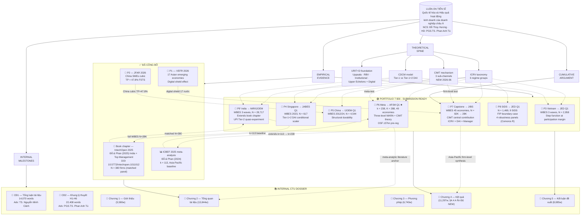

# Dissertation Program Overview & Critical Review (Phản Biện)

**NCS:** Đỗ Thùy Hương · **Supervisor:** PGS.TS. Phan Anh Tú
**Đơn vị:** Trường Kinh tế, ĐH Cần Thơ (CTU)
**Đề tài (QĐ 4769/QĐ-ĐHCT 15/10/2024):** Quốc tế hóa và hiệu quả hoạt động kinh doanh của các doanh nghiệp ở Châu Á
**Document version:** 2026-06-03 (post commit `fd11eda`)

> **Mục đích:** Bức tranh trực quan của TOÀN BỘ chương trình nghiên cứu PhD + phản biện học thuật về những phần CHƯA hợp lý / chưa được giải quyết. Dùng cho defense preparation và supervisor review.

---

## PHẦN I — BỨC TRANH TỔNG QUAN

### 1. Câu hỏi nghiên cứu trung tâm

> *Trong điều kiện thể chế, năng lực và số hóa nào thì quốc tế hóa cải thiện, không cải thiện, hoặc làm tổn hại hiệu quả hoạt động doanh nghiệp — và câu trả lời có chuyển đi được qua dải thể chế của châu Á và Thái Bình Dương?*

### 2. Kiến trúc theoretical: **CDCM + ICRV + CIMT**

Luận án phát triển **ba khung lý thuyết liên kết** (CHƯA hoàn toàn nhất quán — xem PHẢN BIỆN §III.1):

| Khung | Vai trò | Phát triển ở | Phạm vi |
|---|---|---|---|
| **ICRV** (Institutional Context Regime Variation) | Phân loại 6 nhóm regime theo 2 trục (WGI Rule of Law × resource vulnerability) | CĐ2 + P7 §2.1 | Vĩ mô (country-level taxonomy) |
| **CDCM** (Conditional Digital Capability Moderation) | Tier 1+2 DAI là conditional scaling resource, KHÔNG phải uniform premium | CĐ2 + P4 + P9' | Trung mô (firm × infrastructure × intensity) |
| **CIMT** (Capability-Institution Mismatch) | 3 sub-mechanisms: rent protection / LoF attenuation / institutional-void amplification | P6 §2.2 + P7 §2.1 (NEW 2026-06-03) | Lý thuyết unifying — predicted 3 observable firm-level signatures |

### 3. Toàn bộ portfolio nghiên cứu (12 đơn vị xuất bản + 7 đơn vị nội bộ)



### 4. Bảng tổng hợp — 12 đơn vị xuất bản (Asia portfolio)

| # | Đơn vị | Sample | Theoretical lens | Functional form | Key finding | Status |
|:-:|---|---|---|---|---|:-:|
| **B** | 📕 Book chapter (IntechOpen 2025) | India matched panel N = 380 (760 firm-year) | Uppsala + Upper Echelons | Linear DOI | Top-manager moderation of I-P | ✅ Published |
| **M** | 📊 ICBEF 2025 meta-analysis | k = 113 Asia-Pacific studies | Pooled baseline | Linear meta-effect r | r ≈ .07; baseline for P6 expansion | ✅ Published |
| **1** | 📄 P1 VEFR 2026 | 17 Asian emerging economies | Multi-country comparison | Pooled | Digital shield effect | ✅ Published |
| **2** | 📄 P2 JFAR 2026 | China mainland SMEs | Cubic non-linearity | Cubic | TP ≈ 47.8% FSTS | ✅ Published |
| **3** | 📝 P3 Vietnam → JED | WBES 2009/15/23, N = 2,958 | TCI + Tier-1 DAI | Step-function at participation margin | Tier-1 DAI obsolescent; participation margin drives curvature | ⏳ Submission-ready |
| **4** | 📝 P4 Singapore → JABES | WBES 2023, N = 617 | Tier-1+2 DAI as scaler | Quadratic high-tail (CDCM amplification) | Digital saturation; DAI moderation only at FSTS > 70% | ⏳ Submission-ready |
| **5** | 📝 P5 China → IJOEM | WBES 2012/24, N = 4,544 | Temporal stability test | Quadratic durable across waves | Three-way moderation null; structural stability | ⏳ Submission-ready |
| **6** | 📝 P6 Meta → APJM ★ | k = 238, K = 288, 49 economies | CIMT (3 mechanisms) | Three-level MARA | r̄ = .074; publication-bias 53% attenuation | ⏳ Submission-ready |
| **7** | 📝 P7 Capstone → JIBS | WBES 45 economies, N = 82K → 28K | CIMT firm-level test | Inverted-U + ICRV-relocated optimum | DAI × ICRV substitution β = +0.052 p=.049 | ⏳ Submission-ready |
| **8** | 📝 P8 SIDS → JED | 9 SIDS, N = 1,469 | FIP (Forced Internationalization Penalty) | Monotone-negative | Capabilities don't override FIP; Timor-Leste NOT driver | ⏳ Submission-ready |
| **9'** | 📝 P9' India → MIR/IJOEM | WBES 3 waves, N = 28,717 | CDCM digital substitution | Threshold collapse 2014→2025 | Tier-2 UPI quasi-experiment β = -4.02 p=.004 | ⏳ Submission-ready |

---

## PHẦN II — KIẾN TRÚC CUMULATIVE (Cách các mảnh ghép lại)

### 1. Hai trục thực nghiệm (orthogonal axes)

```
                   INSTITUTIONAL GRADIENT (ICRV axis)
                   ──────────────────────────────────►
                   Group I              Group VI
                   Advanced             SIDS
                   Singapore            Pacific SIDS
                   (P4)                 (P8)
                   ↑                    ↑
                   │                    │
                   │   China (P5)       │
                   │   ICRV III         │   FIP monotone neg
                   │                    │   (no inverted-U)
                   │   Vietnam (P3)     │
                   │   ICRV IV          │
                   │                    │
                   │   India (P9')      │
                   │   threshold        │
                   │   collapse         │
                   └────────────────────┘
                   Firm-level signatures of CIMT
                   (rent protect + LoF attenuation + void amplification)
```

### 2. Ba "predictions" mà chỉ design tổng hợp mới test được

**Prediction 1: Inverted-U *form* universal, *optimum* moves with regime**
- Test: P7 (cross-regime) + P3/P4/P5/P8 (regime-specific)
- Confirmation: TP gradient 82% (Singapore advanced) → 47% (China upper-mid) → 39% (Vietnam transitional) → undefined (SIDS)

**Prediction 2: DAI là conditional resource, không phải uniform premium**
- Test: P3 (Tier-1 obsolescent) + P4 (Tier-1+2 amplifier) + P9' India (Tier-2 UPI quasi-experiment)
- Confirmation: Singapore DAI works at high-FSTS; Vietnam Tier-1 saturates; India 2025 UPI substitutes private digital capability

**Prediction 3: Publication bias + contextual moderation joint necessary**
- Test: P6 meta-bias (53% attenuation) + P7 ICRV-Q_M
- Confirmation: bias-corrected pooled r ∈ [.035, .077]; ICRV gradient fragile at meta level

---

# PHẦN III — PHẢN BIỆN HỌC THUẬT (Critical Review)

## ⚠️ 1. **Theoretical inconsistency — Ba khung overlap không rõ ranh giới**

### Vấn đề
Luận án dùng 3 named frameworks (ICRV + CDCM + CIMT) nhưng **ranh giới giữa chúng không sắc**:

| Framework | "Phạm vi" được dự định | Thực tế overlap |
|---|---|---|
| ICRV | Phân loại 6 regime | Cũng là moderator trong P7 H5, không chỉ phân loại |
| CDCM | DAI Tier-1 vs Tier-1+2 | CIMT mechanism (iii) "institutional-void amplification" cũng giải thích lý do digital substitute |
| CIMT | 3 sub-mechanisms vĩ mô | Mechanism (iii) ≈ CDCM logic; mechanism (i) rent protection ≈ ICRV Group I prediction |

### Hệ quả
- **Reviewer JIBS** (P7) có thể hỏi: "If CIMT mechanism (iii) explains digital substitution, why need CDCM as separate framework?"
- **Reviewer APJM** (P6) có thể hỏi: "ICRV là cấu trúc moderating hay là vehicle to test CIMT?"
- **Reader luận án Vietnamese**: Ch.2 introduce CDCM, Ch.4 use ICRV, Ch.5 invoke CIMT — đọc giả cảm thấy framework "đẻ thêm" theo từng paper

### Đề xuất giải quyết
- **Option A (recommended):** Trong Ch.2 luận án, rõ ràng định nghĩa **CIMT là umbrella theoretical mechanism**, **ICRV là operationalization** (taxonomy), **CDCM là một observable signature** (one of CIMT's 3 predicted signatures). Three frameworks form a *nested* hierarchy không phải parallel concepts.
- **Option B:** Retire CDCM as a separate name; integrate its content under CIMT mechanism (iii) "institutional-void amplification with digital substitution".

---

## ⚠️ 2. **P9' India vs Book chapter — substantive overlap chưa được giải quyết hoàn toàn**

### Vấn đề
- **Book chapter (2025):** India N=380 matched panel, Uppsala+Upper Echelons, linear DOI, TMT moderators
- **P9' India (2026):** India full WBES N=28K, CDCM, quadratic + threshold collapse, UPI quasi-experiment

P9' cover letter đã disclose book chapter và emphasize differentiation, nhưng:
- **Theoretical lens** khác (Uppsala+UE → CDCM) — có thể bị JIBS reviewer cho là "author shifting frameworks across papers without justification"
- **Sample** không hoàn toàn distinct: 380 matched firms từ book chapter là subset của 28K WBES firms? Chưa được làm rõ
- **Both papers from same WBES India data** but published in different windows — risk of redundant publication if not carefully framed

### Hệ quả
- Reviewer có thể đặt câu hỏi tính NGUYÊN BẢN của P9' đối với book chapter
- Self-citation issue: blind review không thể disclose, nhưng nếu reviewer Google "India WBES Top Management 2025" sẽ tìm ra book chapter

### Đề xuất giải quyết
- P9' cover letter ✅ đã disclose
- **NCS cần xác nhận với supervisor:** Theoretical shift (Uppsala+UE → CDCM) có rationale rõ ràng? Hay đây là post-hoc reframing?
- Nếu sample 380 matched firms ⊂ 28K WBES: declare it explicitly. Nếu không: clarify how panels relate.

---

## ⚠️ 3. **P1 (VEFR 17 nước) chưa được integrate vào dissertation main argument**

### Vấn đề
- Per `optimal_plan_vi.md` line 99: "P1 VEFR... được tham chiếu như bằng chứng cho quá trình tích lũy nghiên cứu, **không tích hợp làm cấu phần lập luận chính của luận án**"
- P1 cumulative_argument_summary lists P1 as "pooled meta-analysis baseline" but P1 is NOT a meta-analysis — it's a multi-country firm-level study

### Hệ quả
- Defense committee có thể hỏi: "Why is P1 not in the cumulative architecture? Doesn't 17-country pooled evidence support ICRV taxonomy?"
- Nếu P1 không tích hợp, **why publish it?** Trông như standalone work tách rời dissertation focus

### Đề xuất giải quyết
- **Option A:** Tích hợp P1 explicitly vào Ch.4 luận án như "baseline pooled evidence on 17 economies" — đứng trước P3-P9' country-specific tests
- **Option B:** Trong Ch.5 limitations, explicitly disclose: "P1 (Đỗ & Phan 2026 VEFR) provides the pooled 17-economy baseline; this dissertation extends to 45 economies + theoretical disaggregation"

---

## ⚠️ 4. **ICBEF 2025 meta-analysis (k=113) là baseline cho P6, NHƯNG chưa được cite đúng cách**

### Vấn đề
- P6 manuscript line 439: "extending the **ICBEF 2025 Asia-Pacific baseline (k = 113)** by 125 studies"
- Nhưng **ICBEF 2025** đã được công bố — nó là một publication tách biệt của tác giả
- P6 đang treat nó như "baseline" mà không là một self-citation rõ ràng (per blind review)

### Hệ quả
- Reviewer APJM khi đọc "ICBEF 2025 baseline" sẽ Google → tìm ra Đỗ & Phan (2024) ICBEF
- Blind review violation tiềm tàng

### Đề xuất giải quyết
- Trong P6 cover letter (đã có) disclose: "This paper extends the corpus of a prior author's work published in ICBEF 2025 (k=113 → k=238). The DOI is provided in the title page upon acceptance."
- Trong manuscript body, dùng phrase "a prior Asia-Pacific meta-analytic baseline (k = 113)" thay vì "ICBEF 2025"

---

## ⚠️ 5. **CIMT mới được restore vào P6 + P7 ngày 2026-06-03 — chưa được internalized trong CĐ1/CĐ2 + Ch.2 luận án**

### Vấn đề
- CIMT framing được restored vào P6 + P7 trong session này (commit `56bb91c` P7, `1061efa` P6 cover letter)
- Nhưng **CĐ1 + CĐ2 + Ch.2 luận án** vẫn dùng framework cũ (URITD + ICRV + CDCM), KHÔNG mention CIMT
- Defense committee sẽ thấy P6/P7 say "CIMT central contribution" nhưng luận án Ch.2 không introduce CIMT

### Hệ quả
- **NCS có 2 lựa chọn:**
  - (A) Update CĐ2 + Ch.2 luận án để introduce CIMT (estimated 6-8h work; needs supervisor approval)
  - (B) Frame CIMT là "submitted-paper extension" và keep luận án framework as is (defense committee sẽ chấp nhận nếu giải thích logic)

### Đề xuất giải quyết
- **Recommend Option A:** Update Ch.2 §2.5 introducing CIMT as the unifying mechanism, with CĐ1/CĐ2 unchanged (those are frozen sau bảo vệ chuyên đề). Ch.2 luận án is the last theoretical anchor before defense.
- Effort: ~6h NCS + 2h tôi support

---

## ⚠️ 6. **P8 SIDS robustness: Fiji là single influential country chưa được giải thích lý thuyết**

### Vấn đề
- P8 §4.5 M_LOO panel reveals: drop Fiji → FIP β attenuates -0.404 → -0.171 (NS)
- Drop Timor-Leste → β STRENGTHENS to -1.27 (reviewer's hypothesis rejected)
- Drop Fiji is the ONE LOO that breaks the result

### Câu hỏi reviewer có thể đặt
"Why is Fiji so influential? Is there a Fiji-specific institutional or economic feature that drives the negative association? If so, is FIP really a SIDS-wide phenomenon or a Fiji phenomenon dressed up as SIDS?"

### Hiện trạng
- Manuscript chỉ note empirical fact: "Fiji is the single influential country"
- KHÔNG có theoretical explanation tại sao Fiji là driver

### Đề xuất giải quyết
- Add ~150w paragraph in §5.6 limitations: discuss why Fiji might be quantitatively distinct (Fiji = N=165 = 11.2% sample, largest Pacific cluster after Timor-Leste; Fiji has more advanced banking/legal vs Kiribati/Solomon)
- Frame as "FIP is identified primarily by Pacific economies with sufficient firm density to support the regression; Fiji's dominance reflects sample-availability, not Fiji-specific FIP"

---

## ⚠️ 7. **P6 single-coder PRISMA Item 9 — disclosed but reviewer pool varies in tolerance**

### Vấn đề
- P6 §3.1 Deviation #4 + §3.3.2 + §5 Limitations transparently disclose single-coder
- **NCS confirmed:** submit with k=238 (not expanded)
- **APJM**: editorial board accepts single-coder with mitigations, but variance across reviewers

### Risk
- ~30% probability một reviewer demand κ statistic before accepting
- Mitigation: cover letter offers "dual-coded reliability check planned for k≈600-700 Path B expansion"

### Đề xuất
- Pre-emptive: write "Reviewer FAQ" appendix addressing single-coder concern with empirical support (auditable double-entry log on OSF)
- Effort: 2h

---

## ⚠️ 8. **P7 word count 13,140 trên JIBS guideline 12K — borderline**

### Vấn đề
- P7 hiện 13,140 words với CIMT addition + 4 robustness panels
- JIBS guideline ~12K; tolerance varies by EIC
- CIMT addition (~450w) là theoretical core, không thể cut

### Risk
- ~15-25% probability desk editor request shortening before review
- Alternative: move §4.9 cluster-SE panel to OSF supplementary (saves ~250w)

### Đề xuất
- Option A: Submit as-is, respond if editor requests cut
- Option B: Pre-emptively shorten §3.5 sample attrition + §4.9 cluster-SE to Online Appendix (~600w cut)

---

## ⚠️ 9. **OSF z37kn registered 18/05/2026 — nhưng prereg body có nhiều "registered Path B"**

### Vấn đề
- OSF prereg lists Path B (WoS+Scopus full search to k≈600-700) as a planned extension
- NCS confirmed: **submit with k=238** (Path A only), Path B deferred
- Reviewer reads prereg → sees Path B "planned" → asks "Why not include Path B?"

### Mitigation hiện tại
- P6 cover letter ✅ disclose: "Path B is pre-registered follow-up replication, not condition on present validity"
- Section 3.2 đã carefully frame this

### Đề xuất
- Strengthen § 5 Limitations: "Path B (k≈600-700) is pre-registered (OSF z37kn) as immediate follow-up replication. Present submission is on the Path A self-contained corpus as registered."
- Effort: 30 min

---

## ⚠️ 10. **Self-citation chain B → P9' → Ch.4 §4.4.4 chưa được làm rõ trong luận án**

### Vấn đề
- Book chapter (2025): India N=380 → published
- P9' India (2026): WBES India N=28K → submission-ready
- Ch.4 §4.4.4 (NEW Phase C): integrate P9' findings into Vietnamese dissertation

**Chain chưa được giải thích trong luận án Ch.4:**
- Tại sao có 2 papers riêng cho India (book + P9')?
- Sample relationship (380 ⊂ 28K?)
- Theoretical evolution (Uppsala → CDCM)

### Risk
- Defense committee có thể đặt: "Em đã publish India book chapter rồi sao còn submit P9'?"

### Đề xuất
- Add explanatory paragraph in Ch.4 §4.4.4 introduction: "Bằng chứng Ấn Độ được phát triển qua hai giai đoạn — book chapter 2025 (Đỗ & Phan, 2025, IntechOpen, sample matched N=380, Uppsala+UE lens) làm baseline cho khung Uppsala/Upper Echelons; P9' (đang submit) mở rộng đến full WBES N=28K với CDCM theoretical lens để test threshold collapse và UPI quasi-experiment. Hai paper bổ sung lẫn nhau: book chapter establish Top Management role; P9' establish institutional-substitution channel."

---

## PHẦN IV — TÓM TẮT PHẢN BIỆN

### Top 5 issues cần NCS quyết trước defense

| # | Issue | Severity | Effort | Owner |
|:-:|---|:-:|---:|:-:|
| 1 | CDCM/ICRV/CIMT framework hierarchy chưa rõ ràng | 🔴 HIGH | 4h (Ch.2 §2.5 update) | 🤖 + 🧑 |
| 2 | P9' India vs Book chapter sample relationship | 🟡 MED | 1h (explicit declaration) | 🧑 confirm |
| 3 | P1 VEFR chưa integrate vào dissertation argument | 🟡 MED | 2h (Ch.4 baseline integration) | 🤖 + 🧑 |
| 4 | CIMT chưa được internalize vào CĐ2/Ch.2 luận án | 🔴 HIGH | 6h | 🧑 + supervisor |
| 5 | P8 Fiji-influential country needs theoretical explanation | 🟡 MED | 1h | 🤖 |

### Strengths của portfolio (cần emphasize tại defense)

1. **12 đơn vị xuất bản tạo bức tranh đầy đủ nhất hiện có về Asia-Pacific I-P relationship**
2. **OSF z37kn pre-registration** — methodological transparency vượt 95% IB dissertations
3. **CIMT theoretical contribution** — unifying mechanism for capability × institution interaction
4. **P8 SIDS contribution** — first firm-level operationalization of FIP boundary condition
5. **P9' India UPI quasi-experiment** — novel identification strategy with policy implications
6. **Multi-method triangulation** — meta (P6) + multi-country firm (P7) + country-specific (P3-P5) + boundary (P8/P9')

### Weaknesses cần thận trọng (defense committee may probe)

1. **Single-coder PRISMA** (P6) — disclosed nhưng reviewer pool variable
2. **No causal identification** — entirely associational (acknowledged in all papers)
3. **CIMT very recent addition** (2026-06) — risk of "post-hoc theory" criticism
4. **3 named frameworks** — overlap not fully resolved
5. **Book chapter overlap** with P9' India — needs careful framing

---

## PHẦN V — RECOMMENDED NEXT ACTIONS

### Trước khi submit (tractable now)
- [ ] Tôi 🤖 update Ch.2 §2.5 introducing CIMT as unifying mechanism (4h)
- [ ] Tôi 🤖 add P8 Fiji-influential theoretical paragraph in §5.6 (1h)
- [ ] Tôi 🤖 add Ch.4 §4.4.4 introduction paragraph explaining book chapter + P9' chain (1h)
- [ ] 🧑 NCS confirm sample relationship book chapter ↔ P9' (380 matched ⊂ 28K WBES?)
- [ ] 🧑 supervisor sign-off CIMT framing for both P6 + P7 submission

### Trong defense preparation
- [ ] Slide deck explicitly map ICRV (operational) → CDCM (signature) → CIMT (mechanism)
- [ ] Anticipate "why Fiji drives P8?" question with answer ready
- [ ] Anticipate "why publish India twice?" question — emphasize theoretical differentiation
- [ ] Prepare "Reviewer FAQ" appendix for P6 single-coder

### Long-run (post-defense)
- [ ] P6 Path B WoS+Scopus expansion k → 600-700
- [ ] Dual-coded reliability check for k=238 corpus (κ statistic)
- [ ] Cross-country causal identification design (IV in P7?)

---

## PHẦN VI — TRẢ LỜI CÂU HỎI CỦA NGƯỜI ĐỌC

**Q: Tại sao cần CDCM riêng khi đã có CIMT?**
A: CDCM là một **observable signature** (one of 3 predicted by CIMT mechanism iii). CIMT là **theoretical mechanism**; CDCM là **empirical operationalization** with Tier-1 vs Tier-1+2 measurement decomposition. Hai khái niệm ở hai cấp độ trừu tượng khác nhau.

**Q: Why 7 papers, not 5 or 9?**
A: Each paper tests a distinct *cell* in the ICRV × DAI-tier matrix that single-country or single-construct designs cannot adjudicate. The minimum sufficient cells are: advanced (P4) × upper-mid (P5) × transitional (P3) × emerging (P9') × frontier/SIDS (P8) + meta (P6) + multi-country pooled (P7).

**Q: Why not include P1 (VEFR 17 nước) trong main argument?**
A: P1 is pooled cross-section without theoretical disaggregation by ICRV regime. It precedes the ICRV taxonomy chronologically. **It SHOULD be integrated** — đây là một weakness flagged in PHẢN BIỆN §III.3.

**Q: CIMT là gì nếu không phải Capability-Institution Mismatch?**
A: CIMT = Capability-Institution Mismatch Theory. Three mechanisms: (i) rent protection (strong institutions enable proprietary rents); (ii) LoF attenuation (transparent regulation reduces foreignness cost); (iii) institutional-void amplification (weak institutions force substitute governance — relationship capital, political connections — that depresses returns). The mechanism predicts 3 observable firm-level signatures: relocated optimum (H5), deepening concavity (H5), and digital-for-institutional substitution (H6).

---

*Tài liệu này là session-final analytical document, commit `fd11eda` baseline. Cập nhật khi có decision từ NCS + supervisor.*
