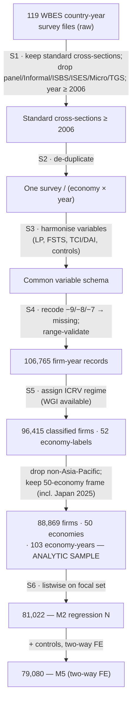

# APPENDIX A — POOLING AND HARMONISATION OF THE MULTI-COUNTRY ENTERPRISE DATASET (WBES)

> This appendix documents, with scientific justification, the procedure used to pool
> and harmonise the country-year World Bank Enterprise Survey (WBES) cross-sections
> into a single firm-level analytic dataset underpinning the dissertation's
> multi-context empirical analysis (notably component study P7). It is a **formal
> methodological component** of the dissertation: it secures transparency,
> replicability, and defensibility before the examination committee. The entire
> procedure is encoded in reproducible scripts (`scripts/build_pooled_dataset.py`,
> `scripts/wbes_canon.py`) with an accompanying data-flow report
> (`data_wbes/analysis/pooled_dataflow.csv`).

## A.1 Purpose and position within the research design

The dissertation tests the internationalisation–performance (I–P) relationship on a
firm sample spanning many economies and survey rounds. The data are **repeated
cross-sections**, not a balanced panel: each WBES round draws an *independent* random
sample of firms from the economy's frame at that time and does not track the same
firm over time (Deaton, 1985; Verbeek, 2008). This property governs the entire
pooling and identification strategy below. Appendix A complements Chapter 3 (§3.3) at
the level of operational detail: whereas §3.3 states the data source and variable
definitions, Appendix A documents every transformation from 119 raw survey files to
the final analytic sample, together with the rationale for each filtering and
harmonisation decision.

## A.2 Data source and unit of analysis

The primary data are the **World Bank Enterprise Surveys (WBES)**, an
establishment-level firm survey administered by the World Bank Group under a
standardised global instrument using **stratified random sampling** along three
dimensions—sector (manufacturing/services by ISIC), employment size (small/medium/
large), and geographic region within each economy (World Bank Enterprise Surveys,
2025; World Bank, 2019). This stratified design ensures representativeness of each
economy's formal, non-agricultural private sector and supports cross-country
comparison through an identical core questionnaire (Aterido et al., 2011). The unit
of analysis is the **establishment**; the dependent, focal, and moderating variables
are all measured at this level.

A key comparability constraint: WBES has applied a **unified global methodology only
from 2006 onward**; earlier rounds used non-comparable instruments and sampling
frames (World Bank, 2019). The dissertation therefore restricts the data to survey
**years ≥ 2006** to preserve cross-round and cross-country comparability (see A.3,
Step S1).

## A.3 Six-step pooling procedure (S1–S6) and data flow

The procedure follows a PRISMA-style transparency principle for secondary data: each
step records its criterion and the surviving number of observations, enabling
reconstruction and audit (Page et al., 2021).

| Step | Operation | Criterion | Outcome (official pool) |
|---|---|---|---|
| **S1** | Acquisition & instrument filtering | Keep standard private-firm cross-sections; **exclude** panel, Informal Sector, ISBS, ISES, Micro, and TGS follow-up surveys; keep **year ≥ 2006** | — |
| **S2** | De-duplication | One survey per (economy × year) pair | — |
| **S3** | Variable harmonisation | Map heterogeneous questionnaire fields to a common schema (A.4) | — |
| **S4** | Missing-code treatment | Recode WBES non-response codes (−9 *Don't Know*, −8 *Refusal*, −7 *N/A*) to missing; range-validate | — |
| **S5** | Institutional stratification (ICRV) | Assign regime; restrict to the **50-economy** Asia-Pacific frame (incl. Japan 2025) | Classification pool = **96,415** firms (52 economy-labels) → 50-economy frame |
| **S6** | Listwise analytic sample | Drop records missing the dependent variable or focal regressor | Analytic sample = **88,869** (50 economies, 103 economy-year pairs); M2 regression N = **81,022**; two-way-FE M5 = **79,080** |

*Official counts from the dissertation's pooled file (`data_wbes/p7/p7_pooled_clean.csv`):
106,765 firm-year records across 17 survey rounds, 2003–2025.*

**Figure A.1.** *PRISMA-style WBES data-pooling flow.*

**Replication note.** The canonical analytic frame (50 economies incl. Japan 2025;
96,415 classified → 88,869 analytic → M2 N = 81,022 / M5 N = 79,080) is reproducible
from the raw archive (`data_wbes/raw_dta/`) via `scripts/p7_run_50econ.py`; the locked
values are recorded in `data_wbes/analysis/CANONICAL_NUMBERS.md` and the re-estimation
log (`REESTIMATION_LOG_2026-06-13.md`), and are the figures cited in Chapters 3–4.
An earlier master-file assembly (`data_wbes/p7/p7_pooled_clean.csv`) produced a
pre-Japan 49-economy build (91,982 analytic / 84,910 M2 / 38,342 full-control M5); that
build is **superseded** by the Japan-inclusive re-estimation and is retained only for
provenance. The standalone P7 working paper still reports the earlier build and is being
reconciled to the canonical frame before journal submission.

## A.4 Variable harmonisation (Step S3)

The core challenge of multi-country pooling is **field-name and coding heterogeneity**
across rounds (e.g., some rounds split direct/indirect exports, others combine them).
The dissertation builds a **common variable schema** mapping back to the invariant
core modules of the global WBES instrument (World Bank, 2019). Focal variables and
construction rules:

- **Labour productivity (primary dependent variable):** $\ln(\text{LP}) = \ln(\text{annual sales} / \text{full-time permanent employees})$, from field `d2` (total sales, last fiscal year) and `l1` (permanent workers). Labour productivity is appropriate for WBES, which lacks market prices (Combs et al., 2005; Richard et al., 2009).
- **Internationalisation intensity (FSTS):** sum of direct and indirect exports as a share of sales, from `d3b` + `d3c`, range-bounded to [0, 100]. Non-exporting firms receive FSTS = 0 (a valid value, not missing).
- **Technological capability (TCI) and digital adoption (DAI):** constructed from binary indicators (internationally recognised quality certification `b8`; licensed foreign technology; website `c22b`; e-mail; electronic payment), kept conceptually distinct per the construct-purity argument in §2.1.3 and Coltman et al. (2008).
- **Controls:** firm age (from `b5`), size (log employment), foreign ownership, top-manager characteristics, ISIC sector.

## A.5 Currency comparability — the problem and the solution

A validity threat specific to a multi-country pool is that **raw labour productivity
is denominated in different national currencies** (e.g., sales/worker in VND for
Vietnam, SGD for Singapore), so productivity **levels are not directly comparable**
across economies—a "currency artefact". The dissertation addresses this with two
complementary layers:

1. **Within country-year standardisation:** labour productivity is z-standardised
   (centred and scaled) **within each (economy × year)** before pooling, placing
   every observation on a common relative-position scale within its own country-year
   distribution. This removes currency-unit and price-level differences while
   preserving the within-country variation on which identification of the I–P
   relationship rests.
2. **Two-way fixed effects:** every P7 regression includes **economy fixed effects**
   and **year fixed effects**. Economy fixed effects fully absorb all
   country-invariant differences (currency, price level, baseline institutions,
   culture); the I–P coefficient is thus identified from **within-country variation**
   and is immune to the currency artefact at the level (Wooldridge, 2010).

An important methodological consequence: for this reason, **raw cross-country
productivity-level comparisons are excluded from inference**; inter-regime (ICRV)
comparisons in Chapter 4 use only **dispersion** (PPP/winsorised within country-year)
and the **turning-point gradient**—quantities invariant to currency units (see
§4.1.1). Where cross-country **level** comparison is required, the dissertation uses a
dimensionless ratio (e.g., ROS) or purchasing-power-parity adjustment via the Penn
World Table (Feenstra et al., 2015).

## A.6 Econometric pooling strategy (pooled repeated cross-sections)

Because the data are repeated cross-sections rather than a panel, estimation follows
the **pooled cross-section with fixed effects** framework rather than a dynamic panel
model (Deaton, 1985; Wooldridge, 2010). The core P7 model is quadratic to capture the
inverted-U relationship (H1):

$$\ln(\text{LP})_{ijt} = \beta_1 \text{FSTS}_{ijt} + \beta_2 \text{FSTS}^2_{ijt} + \mathbf{X}_{ijt}\boldsymbol{\gamma} + \alpha_j + \tau_t + \varepsilon_{ijt}$$

where $i$ indexes firms, $j$ economies, $t$ survey years; $\alpha_j$ and $\tau_t$ are
economy and year fixed effects; $\mathbf{X}$ is the control vector. The turning point
is $\text{TP} = -\beta_1/(2\beta_2)$, tested with the Lind and Mehlum (2010) /
Sasabuchi procedure to confirm an interior extremum within the data range. Standard
errors are heteroskedasticity-robust and clustered by economy to reflect the
intra-cluster correlation of the stratified survey design (Cameron & Trivedi, 2005;
White, 1980). A quadratic is preferred over a cubic where the distributional mass at
high FSTS is insufficient to identify a cubic inflection precisely.

## A.7 Institutional stratification (ICRV, Step S5)

Each economy is assigned to one of six Institutional Context Regime Variation (ICRV)
regimes based on a combination of the Worldwide Governance Indicators (Kaufmann et
al., 2011), level of economic development, and structural institutional features,
extending the institutional-voids framework of Khanna and Palepu (2010). Assignment
requires sufficient WGI coverage; firms in country-years lacking institutional
indicators are not classified (the gap between 106,765 raw records and 96,415
classified records at S5). The final analytic frame is restricted to **49 Asia-Pacific
economies**, dropping three out-of-region economies (Comoros, Cyprus, Türkiye) from
the main analytic sample while retaining them in the 52-economy classification pool
for robustness (Comoros is used in P8's extended SIDS robustness set).

## A.8 Sampling weights and representativeness

Because WBES uses a stratified design with unequal selection probabilities,
**population-level descriptive** statistics require sampling weights. For
**fixed-effects regression inference**, however, the dissertation follows Solon,
Haider, and Wooldridge (2015): once the model conditions on the stratification
dimensions (size and sector via controls; economy via fixed effects), unweighted OLS
yields consistent and typically more efficient coefficients; weights are used in
robustness checks to confirm stability. This balances representativeness against
estimation efficiency on a justified basis.

## A.9 Missing-data treatment (Steps S4 & S6)

WBES non-response codes (−9 *Don't Know*, −8 *Refusal*, −7 *Not Applicable*) are
consistently recoded to missing before any computation. The analytic sample uses
**listwise deletion** on the focal variable set, so N declines as controls are added
(most sharply for foreign ownership, ~50% missing in small economies and early
rounds). The maintained assumption is missingness at random conditional on observed
covariates; the dissertation transparently reports the decline in N across
specifications and checks turning-point stability to ensure results are not driven by
the missingness mechanism (Little & Rubin, 2019).

## A.10 Reproducibility and limitations

**Reproducibility.** The entire procedure is deterministic and open:
`scripts/wbes_canon.py` (economy-year identifier canonicalisation, filtering rules),
`scripts/build_pooled_dataset.py` (pooling + harmonisation + data flow), with the
report `data_wbes/analysis/pooled_dataflow.csv`. Estimation in the absence of Stata is
performed in Python (pandas/numpy)—a valid alternative for pooled cross-section
econometrics when no Stata licence is available.

**Limitations.** (i) Repeated cross-sections do not track firm trajectories, limiting
dynamic causal inference; (ii) labour productivity proxies performance and is not
direct TFPR; (iii) DAI measurement is constrained to a foundational website proxy by
data availability; (iv) the reproducible raw archive is currently a subset of the
full assembly. These limitations are stated consistently with the limitations section
in Chapter 5.

---

*Script & data links: `scripts/build_pooled_dataset.py`, `scripts/wbes_canon.py`,
`scripts/cd1_descriptives_pipeline.py`; `data_wbes/analysis/pooled_dataflow.csv`,
`DATA_UPDATE_MANIFEST.md`, `CANONICAL_RECONCILIATION.md`.*
