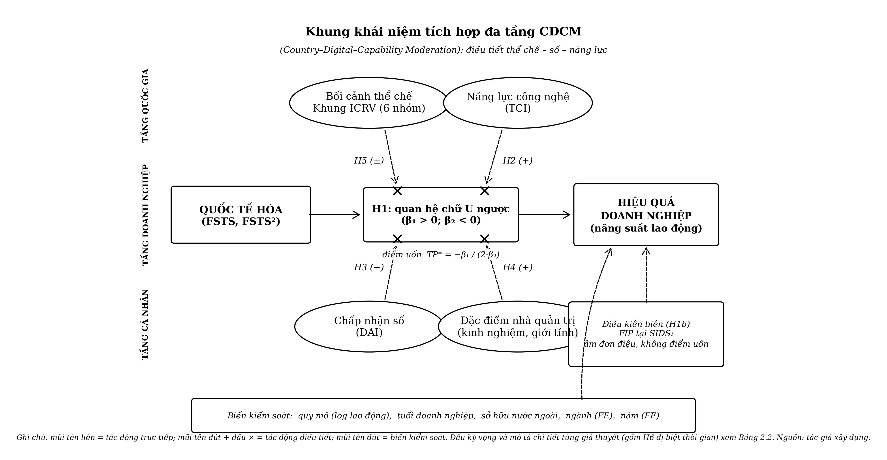

# CHƯƠNG 2: TỔNG QUAN TÀI LIỆU

Chương 2 có nhiệm vụ hệ thống hóa các khái niệm cốt lõi và lý thuyết nền tảng, lược khảo và đánh giá các công trình thực nghiệm đã công bố về mối quan hệ giữa quốc tế hóa và hiệu quả hoạt động doanh nghiệp, xác định những khoảng trống còn tồn tại trong văn liệu, và từ đó xây dựng khung khái niệm tích hợp cùng hệ giả thuyết nghiên cứu H1–H6 cho luận án. Logic của chương đi từ nền tảng khái niệm đến lý thuyết, từ bằng chứng thực nghiệm đến khoảng trống, và từ khoảng trống đến mô hình nghiên cứu và giả thuyết.

---

## 2.1 Các khái niệm cốt lõi

### 2.1.1 Quốc tế hóa doanh nghiệp

Quốc tế hóa doanh nghiệp (internationalization) được hiểu là mức độ và phạm vi tham gia của một doanh nghiệp vào các hoạt động kinh tế có yếu tố quốc tế, bao gồm xuất khẩu hàng hóa và dịch vụ, đầu tư trực tiếp ra nước ngoài, liên doanh quốc tế, cấp phép công nghệ xuyên biên giới, và thiết lập mạng lưới phân phối ở thị trường nước ngoài (Sullivan, 1994; Hitt et al., 2006). Khái niệm này không đồng nhất với "toàn cầu hóa", vốn mang nghĩa một xu hướng kinh tế vĩ mô, mà là một thuộc tính đo lường được ở cấp độ doanh nghiệp, phản ánh chiến lược mở rộng quốc tế và mức độ phụ thuộc vào thị trường nước ngoài. Nền tảng lý thuyết của lĩnh vực này bắt nguồn từ các công trình kinh điển về doanh nghiệp đa quốc gia và đầu tư trực tiếp nước ngoài: lý thuyết vòng đời sản phẩm (Vernon, 1966), lý thuyết lợi thế độc quyền của doanh nghiệp (Hymer, 1976; Caves, 1971), và lý thuyết nội bộ hóa chi phí giao dịch (Buckley & Casson, 1976), về sau được tổng hợp trong khung chiết trung OLI (Dunning, 1988).

Trong văn liệu, mức độ quốc tế hóa được vận hành hóa bằng nhiều thước đo khác nhau. Sullivan (1994) đề xuất một chỉ số tổng hợp đa chiều bao gồm tỷ trọng doanh thu từ nước ngoài trên tổng doanh thu (foreign sales to total sales, FSTS), tỷ trọng tài sản ở nước ngoài trên tổng tài sản (foreign assets to total assets, FATA), và phạm vi địa lý (geographic scope). Trong những nghiên cứu sử dụng dữ liệu doanh nghiệp từ các nền kinh tế đang phát triển và từ khảo sát doanh nghiệp của Ngân hàng Thế giới (World Bank Enterprise Surveys, WBES), thước đo phổ biến nhất là cường độ xuất khẩu (export intensity), tức là tỷ lệ phần trăm doanh thu xuất khẩu trên tổng doanh thu, hay tương đương với FSTS theo nghĩa rộng (Johanson & Vahlne, 1977; Lu & Beamish, 2004). Luận án này sử dụng FSTS và bình phương FSTS (FSTS²) làm thước đo chính về mức độ quốc tế hóa, với lý do phù hợp với cấu trúc dữ liệu WBES và nhất quán với các nghiên cứu I–P sử dụng bộ dữ liệu tương tự (Bhandari et al., 2023; nghiên cứu thành phần P1).

Điều quan trọng cần lưu ý là quốc tế hóa không phải là một trạng thái nhị phân, mà là một biến liên tục biểu thị cường độ tham gia thị trường quốc tế, có thể thay đổi theo thời gian và phản ánh quá trình cam kết tích lũy của doanh nghiệp vào các thị trường nước ngoài (Johanson & Vahlne, 1977, 2009).

### 2.1.2 Hiệu quả hoạt động doanh nghiệp

Hiệu quả hoạt động doanh nghiệp (firm performance) là một khái niệm đa chiều không có một định nghĩa hoặc thước đo thống nhất trong văn liệu. Combs et al. (2005) và Richard et al. (2009) phân biệt ba nhóm thước đo chính: (i) thước đo dựa trên kế toán (accounting-based), bao gồm tỷ suất sinh lời trên tổng tài sản (ROA), tỷ suất sinh lời trên vốn chủ sở hữu (ROE), và tỷ suất sinh lời trên doanh thu (ROS); (ii) thước đo dựa trên thị trường tài chính (market-based), bao gồm Tobin's Q và tổng lợi nhuận cổ đông; và (iii) thước đo dựa trên năng suất và tăng trưởng (productivity-based), bao gồm năng suất lao động (labor productivity) và tăng trưởng doanh thu.

Trong bối cảnh nghiên cứu sử dụng dữ liệu WBES, vốn không cung cấp thông tin về giá cổ phiếu hay giá trị thị trường, thước đo năng suất lao động là lựa chọn phổ biến nhất và phù hợp nhất về mặt kỹ thuật. Năng suất lao động được tính bằng logarithm tự nhiên của tỷ số doanh thu hàng năm trên số lao động toàn thời gian (ln(doanh thu/lao động)), cho phép so sánh chuẩn hóa giữa các doanh nghiệp thuộc các quốc gia, ngành nghề và quy mô khác nhau (nghiên cứu thành phần P1). Luận án sử dụng thước đo này làm biến phụ thuộc chính, với ROS, tăng trưởng doanh thu, tăng trưởng việc làm và ln(doanh thu) được sử dụng như các thước đo độ vững để kiểm tra tính nhất quán của kết quả (xem Chương 3, Mục 3.5).

Cần nhấn mạnh rằng việc chọn thước đo hiệu quả không chỉ là quyết định kỹ thuật, mà còn phản ánh quan niệm lý thuyết về hiệu quả. Trong bối cảnh quốc tế hóa ở các nền kinh tế đang phát triển, năng suất lao động phản ánh trực tiếp khả năng chuyển hóa nguồn lực đầu vào thành kết quả đầu ra, qua đó thể hiện năng lực cạnh tranh thực chất của doanh nghiệp, khác với ROA vốn bị ảnh hưởng bởi cấu trúc tài sản và hệ thống kế toán đặc thù của từng quốc gia.

### 2.1.3 Năng lực công nghệ và chỉ số chấp nhận số

Một trong những đóng góp khái niệm trọng tâm của luận án là sự phân biệt rõ ràng giữa hai cấu trúc: năng lực công nghệ (Technological Capability Index, TCI) và chỉ số chấp nhận số (Digital Adoption Index, DAI). Trong nhiều nghiên cứu trước đây, hai cấu trúc này thường bị gộp lại thành một khái niệm chung về "năng lực số" (digital capability), dẫn đến sự mơ hồ lý thuyết và sai lệch trong đo lường (Bhandari et al., 2023; Bustamante et al., 2022).

Năng lực công nghệ (TCI) đề cập đến chiều sâu của năng lực công nghệ được nhập vào tổ chức, phản ánh khả năng hấp thụ, khai thác và phát triển tri thức công nghệ tiên tiến. Các chỉ báo tiêu biểu bao gồm việc sở hữu chứng nhận chất lượng quốc tế (ISO hoặc tương đương) và sử dụng công nghệ được cấp phép từ các đối tác nước ngoài. Về bản chất lý thuyết, TCI gần với khái niệm năng lực hấp thụ (absorptive capacity) của Cohen và Levinthal (1990) và năng lực công nghệ của Lall (1992), đây là chiều sâu nội tại của tổ chức, khó sao chép và tạo ra lợi thế bền vững theo tinh thần RBV (Barney, 1991).

Chỉ số chấp nhận số (Digital Adoption Index, DAI), ngược lại, phản ánh mức độ áp dụng các công cụ số tại giao diện ngoại tại của doanh nghiệp, bao gồm việc sở hữu website, sử dụng email trong giao dịch kinh doanh, thanh toán điện tử, và bán hàng trực tuyến. Đây là các công cụ số có tính bề mặt (surface digital tools) theo phân loại của Verhoef et al. (2021), tức là nằm ở cấp độ số hóa (digitization) và số hóa quy trình (digitalization), chưa đạt đến cấp độ chuyển đổi số toàn diện (digital transformation). Trong phạm vi luận án, DAI được đo bằng biến đại diện "foundational website adoption" từ dữ liệu WBES, đây là ràng buộc đo lường có chủ đích do giới hạn của bộ dữ liệu, không phải thiếu sót lý thuyết.

Hai cấu trúc TCI và DAI không đồng nhất và vận hành theo cơ chế khác nhau trong mối quan hệ quốc tế hóa, hiệu quả: TCI hoạt động chủ yếu như một nhân tố nâng mặt bằng hiệu quả (level shifter), trong khi DAI có xu hướng làm thay đổi độ dốc hoặc độ cong của đường quan hệ I–P tùy theo bối cảnh (Bhandari et al., 2023; Chen & Meng, 2022). Việc duy trì sự phân biệt rõ ràng này trong suốt luận án là điều kiện tiên quyết để đảm bảo tính thuần khiết của cấu trúc (construct purity) theo tiêu chuẩn của Coltman et al. (2008).

### 2.1.4 Bối cảnh thể chế và khung ICRV

Thể chế (institutions) theo North (1990) là "luật chơi" của một xã hội, bao gồm các ràng buộc chính thức (luật pháp, quy định, hợp đồng) và phi chính thức (chuẩn mực, giá trị, văn hóa ứng xử). Thể chế tạo ra cấu trúc khuyến khích và chi phí giao dịch, do đó ảnh hưởng trực tiếp đến chiến lược và kết quả kinh doanh của doanh nghiệp.

Để vận hành hóa bối cảnh thể chế đa cấp và đa quốc gia trong luận án, khung ICRV (Institutional Context Regime Variation, Biến thiên chế độ bối cảnh thể chế) được phát triển như một công cụ phân loại có hệ thống. Khung ICRV chia 50 nền kinh tế trong phạm vi nghiên cứu thành sáu nhóm (sub-regime), dựa trên tổ hợp các chỉ số quản trị toàn cầu (World Governance Indicators, WGI) của Kaufmann et al. (2011), mức độ phát triển kinh tế, và đặc trưng cấu trúc thể chế: Nhóm I (Advanced Innovation-Driven, gồm Singapore, Hong Kong SAR, Hàn Quốc, Đài Loan, Israel và Nhật Bản), Nhóm II (Advanced Resource-Driven, bao gồm các nền kinh tế vùng Vịnh), Nhóm III (Upper-middle, điển hình là Trung Quốc), Nhóm IV (Lower-middle transition, bao gồm Việt Nam và Ấn Độ), Nhóm V (Emerging), và Nhóm VI (SIDS, Small Island Developing States). Khung này mở rộng từ phân loại thể chế của Khanna và Palepu (2010) và được điều chỉnh để phản ánh thực tiễn đa dạng của châu Á và khu vực lân cận.

ICRV không chỉ là một biến phân loại mà còn là một gradient thể chế liên tục, từ môi trường thể chế mạnh, ít rủi ro (Nhóm I) đến môi trường thể chế yếu, nhiều rủi ro và khoảng trống thể chế (Nhóm V và VI). Gradient này tạo ra điều kiện biên (boundary conditions) quan trọng để kiểm định khả năng tổng quát hóa của mối quan hệ I–P, đặc biệt liên quan đến giả thuyết phi tuyến.

---

## 2.2 Các lý thuyết nền

### 2.2.1 Mô hình quốc tế hóa Uppsala

Mô hình Uppsala (Johanson & Vahlne, 1977) là một trong những lý thuyết có ảnh hưởng sâu rộng nhất trong nghiên cứu về quốc tế hóa doanh nghiệp. Được xây dựng trên cơ sở quan sát quá trình quốc tế hóa của các doanh nghiệp Thụy Điển, mô hình đề xuất rằng doanh nghiệp quốc tế hóa theo một quá trình tuần tự và tích lũy, trong đó tri thức thị trường nước ngoài và cam kết nguồn lực vào thị trường đó tác động lẫn nhau theo vòng lặp phản hồi. Doanh nghiệp bắt đầu bằng xuất khẩu gián tiếp, tiến đến đại lý độc lập, sau đó là chi nhánh kinh doanh, và cuối cùng là sản xuất tại nước ngoài, phản ánh mức độ cam kết và tri thức ngày càng tăng.

Một trong những khái niệm trọng tâm của mô hình Uppsala là "gánh nặng của người nước ngoài" (liability of foreignness), chi phí và bất lợi mà doanh nghiệp phải gánh chịu khi hoạt động ở môi trường văn hóa, thể chế, và pháp lý xa lạ (Zaheer, 1995). Johanson và Vahlne (2009) cập nhật mô hình bằng cách bổ sung khái niệm "gánh nặng của người ngoài mạng lưới" (liability of outsidership), nhấn mạnh rằng trong nền kinh tế toàn cầu hiện đại, rào cản lớn nhất không phải là khoảng cách địa lý hay tâm lý, mà là vị trí ngoài lề của các mạng lưới kinh doanh địa phương. Hai loại gánh nặng này giải thích vì sao chi phí quốc tế hóa giai đoạn đầu thường cao, tạo ra giai đoạn hiệu quả giảm trước khi doanh nghiệp tích lũy đủ tri thức và quan hệ để thu được lợi ích từ mở rộng quốc tế (Lu & Beamish, 2004; Contractor et al., 2003).

Tuy nhiên, mô hình Uppsala cổ điển được xây dựng trong bối cảnh tiền số và tiền nền tảng (pre-platform), nên đã bị thách thức đáng kể trong thập kỷ gần đây. Các nghiên cứu về born-global firms, tức doanh nghiệp quốc tế hóa ngay từ giai đoạn đầu mà không theo trình tự tuần tự, và doanh nghiệp nền tảng, tức doanh nghiệp công nghệ tận dụng nền tảng số để vươn ra thị trường quốc tế không cần hiện diện vật lý, cho thấy logic của Uppsala không còn phổ quát (Stallkamp & Schotter, 2021; Yang et al., 2025). Trong luận án này, mô hình Uppsala không bị bác bỏ, mà được tái định vị như một lớp nền giải thích chi phí học hỏi và bất định trong giai đoạn đầu quốc tế hóa, còn cơ chế học hỏi được mở rộng để bao gồm "học hỏi tăng cường bằng dữ liệu số" (data-augmented learning) trong kỷ nguyên chuyển đổi số, nơi dữ liệu từ thị trường nước ngoài có thể được thu thập, xử lý và phân tích nhanh hơn nhiều so với trước (Banalieva & Dhanaraj, 2019).

Việc tái định vị mô hình Uppsala trong luận án dựa trên một phân biệt khái niệm quan trọng giữa cơ chế học hỏi và trình tự thâm nhập. Vahlne (2020), trong bản cập nhật gần đây nhất do chính đồng tác giả của mô hình gốc thực hiện, nhấn mạnh rằng cốt lõi bền vững của truyền thống Uppsala không nằm ở trình tự bốn bước mang tính mô tả, mà nằm ở cơ chế tiến hóa: doanh nghiệp tích lũy tri thức trải nghiệm, điều chỉnh cam kết, và tái cấu trúc vị trí mạng lưới theo thời gian. Cách diễn giải này tách phần lõi lý thuyết khỏi phần biểu hiện thực nghiệm, do đó giải phóng mô hình khỏi sự phụ thuộc vào bối cảnh tiền số. Đối với các doanh nghiệp ở những nền kinh tế chuyển đổi và mới nổi tại châu Á, cơ chế học hỏi trải nghiệm có hàm ý trực tiếp với hình dạng phi tuyến của quan hệ I–P: giai đoạn đầu của đường cong, nơi hiệu quả suy giảm, phản ánh chính chi phí học hỏi và chi phí của gánh nặng người nước ngoài chưa được khấu hao, trong khi giai đoạn giữa phản ánh lợi ích thu được khi tri thức trải nghiệm đạt ngưỡng tới hạn (Lu & Beamish, 2004). Hennart (2007) bổ sung một cảnh báo lý thuyết quan trọng rằng quan hệ giữa mức độ đa quốc gia và hiệu quả không phải là một quy luật phổ quát tự thân, mà phụ thuộc vào bản chất của tài sản đặc thù mà doanh nghiệp khai thác xuyên biên giới; lập luận này củng cố cách tiếp cận của luận án, theo đó cơ chế học hỏi của Uppsala cần được đặt trong tương tác với năng lực và bối cảnh, thay vì được xem là động lực độc lập.

### 2.2.2 Lý thuyết dựa trên nguồn lực

Lý thuyết dựa trên nguồn lực (Resource-Based View, RBV) do Wernerfelt (1984) đặt nền và được Barney (1991) hệ thống hóa thành một khung lý thuyết có ảnh hưởng bền vững. RBV cho rằng doanh nghiệp không chỉ là tập hợp các hoạt động giá trị (value chain) mà còn là bó nguồn lực (bundle of resources), và sự khác biệt về hiệu quả lâu dài giữa các doanh nghiệp bắt nguồn từ sự khác biệt trong sở hữu và khai thác các nguồn lực thỏa mãn tiêu chí VRIN: có giá trị (Valuable), hiếm có (Rare), khó sao chép (Inimitable), và khó thay thế (Non-substitutable).

Áp dụng vào bối cảnh quốc tế hóa, RBV giải thích vì sao cùng một mức độ FSTS nhưng các doanh nghiệp lại đạt hiệu quả rất khác nhau: những doanh nghiệp sở hữu năng lực công nghệ, năng lực quản trị vượt trội, và năng lực học hỏi mạnh hơn sẽ chuyển hóa quốc tế hóa thành hiệu quả tốt hơn do họ có thể giảm chi phí gánh nặng người nước ngoài và khai thác lợi thế cạnh tranh trên phạm vi quốc tế hiệu quả hơn (Hitt et al., 2006; Peng, 2001). Cùng mức độ quốc tế hóa, doanh nghiệp có nguồn lực yếu hơn sẽ gánh chịu chi phí điều phối và rủi ro lớn hơn, trong khi doanh nghiệp có nguồn lực VRIN mạnh hơn có thể biến những thách thức đó thành lợi thế cạnh tranh.

Trong bối cảnh đương đại, RBV được mở rộng bằng lý thuyết năng lực động (dynamic capabilities) của Teece et al. (1997), nhấn mạnh khả năng của doanh nghiệp trong việc tích hợp, xây dựng và tái cấu hình các năng lực nội bộ để ứng phó với môi trường cạnh tranh thay đổi nhanh chóng. Trong kỷ nguyên số, năng lực công nghệ (TCI), theo phân biệt của luận án, được xem là một dạng năng lực động quan trọng, cho phép doanh nghiệp tái cấu hình nguồn lực và mô hình kinh doanh để ứng phó với bất định trong quốc tế hóa (Bhandari et al., 2023; Verhoef et al., 2021). DAI, chỉ số áp dụng số nền tảng (Tier-1 proxy) đo lường sự hiện diện website, phản ánh mức độ chấp nhận kỹ thuật số cơ bản chứ không phải năng lực động theo nghĩa Teece et al. (1997). RBV cung cấp nền lý thuyết trực tiếp cho giả thuyết H2 về vai trò điều tiết của TCI, trong khi H3 về DAI được neo đậu trong Foundational Digital Adoption Framework (Banalieva & Dhanaraj, 2019).

Lý thuyết năng lực động cần được phân tích sâu hơn để làm rõ vì sao TCI được định vị như một dạng năng lực bậc cao trong khung của luận án. Eisenhardt và Martin (2000) tinh chỉnh khái niệm năng lực động bằng cách lập luận rằng các năng lực này về bản chất là những quy trình tổ chức có thể nhận diện được, và giá trị cạnh tranh của chúng phụ thuộc vào tính kịp thời cùng khả năng tái cấu hình nguồn lực trong môi trường biến động. Teece (2007) làm rõ thêm vi nền tảng của năng lực động qua ba nhóm hoạt động: cảm nhận cơ hội, nắm bắt cơ hội, và tái cấu hình tài sản; ba nhóm hoạt động này tương ứng trực tiếp với những đòi hỏi mà doanh nghiệp phải đáp ứng khi mở rộng ra thị trường nước ngoài bất định. Theo logic đó, năng lực công nghệ không chỉ là một kho tài sản tĩnh thỏa mãn tiêu chí VRIN, mà còn là cơ chế cho phép doanh nghiệp hấp thụ tri thức mới và tái triển khai nguồn lực khi điều kiện thị trường quốc tế thay đổi (Cohen & Levinthal, 1990; Teece et al., 1997). Sự phân biệt giữa năng lực bậc một, tức năng lực vận hành thường nhật, và năng lực bậc cao, tức năng lực tái cấu hình, cung cấp cơ sở lý thuyết cho việc tách TCI khỏi DAI: TCI mang đặc trưng của năng lực bậc cao gắn với chiều sâu tổ chức, trong khi DAI gần với năng lực vận hành bề mặt, dễ tiếp cận và dễ sao chép hơn, do đó khó tạo ra lợi thế bền vững theo tinh thần RBV (Barney, 1991). Phân tầng này giải thích vì sao luận án dự báo hai cấu trúc số vận hành qua hai cơ chế khác nhau trong quan hệ I–P, thay vì giả định một hiệu ứng đồng nhất.

### 2.2.3 Lý thuyết thể chế

Lý thuyết thể chế (Institutional Theory) trong kinh doanh quốc tế rút từ nhiều nguồn lý luận: kinh tế học thể chế mới của North (1990), xã hội học thể chế của Scott (1995), và lý thuyết về khoảng trống thể chế (institutional voids) của Khanna và Palepu (2010). Điểm chung của các tiếp cận này là nhấn mạnh vai trò của môi trường thể chế, cả chính thức lẫn phi chính thức, trong việc định hình chiến lược và kết quả kinh doanh của doanh nghiệp.

North (1990) chỉ ra rằng thể chế hiệu quả làm giảm chi phí giao dịch, bảo vệ quyền sở hữu trí tuệ, và tạo ra môi trường khuyến khích đầu tư dài hạn. Ngược lại, ở các nền kinh tế đang phát triển, sự vắng mặt hoặc yếu kém của các thể chế trung gian thị trường, từ hệ thống pháp lý đến thị trường vốn, từ tổ chức đánh giá tín nhiệm đến hiệp hội ngành nghề, tạo ra "khoảng trống thể chế" (institutional voids) làm tăng chi phí giao dịch và rủi ro cho doanh nghiệp khi hoạt động hoặc mở rộng ra nước ngoài (Khanna & Palepu, 2010).

Trong văn liệu về I–P, bằng chứng meta-analytic của Marano et al. (2016), phân tích 170 nghiên cứu với 32 quốc gia giai đoạn 1972–2012, cho thấy thể chế quốc gia nguồn điều tiết đáng kể mối quan hệ quốc tế hóa, hiệu quả, với doanh nghiệp từ các nền kinh tế có thể chế yếu hơn có xu hướng thu được lợi ích thấp hơn hoặc thậm chí tổn thất từ quốc tế hóa. Cuervo-Cazurra et al. (2018) bổ sung rằng bất định thể chế ở quốc gia nguồn (home country uncertainty) không chỉ tạo ra thách thức mà còn có thể xây dựng năng lực quản lý bất định đặc thù, giúp doanh nghiệp ở các thị trường mới nổi cạnh tranh hiệu quả hơn ở các thị trường nước ngoài có đặc điểm tương tự. Lý thuyết thể chế cung cấp nền tảng lý luận cho giả thuyết H5 và cho khung ICRV trong luận án.

Để vận hành hóa bối cảnh thể chế một cách chặt chẽ, luận án dựa trên một nền tảng lý luận rộng hơn về kinh tế học thể chế và quan điểm dựa trên thể chế trong chiến lược quốc tế. Williamson (2000) phân tầng các cấp độ phân tích thể chế từ những ràng buộc phi chính thức ăn sâu vào văn hóa, đến môi trường thể chế chính thức, đến quản trị giao dịch, và sau cùng là phân bổ nguồn lực; cách phân tầng này làm rõ rằng chất lượng thể chế tác động đến doanh nghiệp qua nhiều kênh đồng thời, chứ không chỉ qua một chỉ số tổng hợp duy nhất. Peng và cộng sự (2008) phát triển quan điểm dựa trên thể chế như một trụ cột thứ ba của chiến lược quốc tế, bên cạnh quan điểm dựa trên ngành và quan điểm dựa trên nguồn lực, lập luận rằng ở các nền kinh tế mới nổi, thể chế không chỉ là bối cảnh nền mà là yếu tố trực tiếp định hình lựa chọn chiến lược của doanh nghiệp. Peng (2003) bổ sung góc nhìn động về quá trình chuyển đổi thể chế, theo đó các doanh nghiệp ở những nền kinh tế đang chuyển đổi điều chỉnh chiến lược từ dựa trên quan hệ sang dựa trên quy tắc khi khung thể chế chính thức trưởng thành; góc nhìn này cung cấp cơ sở lý thuyết cho giả thuyết H6 về dị biệt thời gian của quan hệ I–P ở các nền kinh tế chuyển đổi nhanh. Ngoài ra, Kim và cộng sự (2026) định nghĩa năng lực thể chế như khả năng thực thi chính sách của các tổ chức công, phân tách thành chiều tổ chức và chiều quản trị, cung cấp một khung phân tích chính thức làm cơ sở cho việc phân loại sáu chế độ thể chế trong khung ICRV. Tổng hợp các tiếp cận này, luận án xem khung ICRV không phải là một biến phân loại tùy nghi, mà là sự vận hành hóa có hệ thống của một gradient thể chế đa chiều, neo đậu trong lý thuyết thể chế đương đại.

### 2.2.4 Lý thuyết thượng tầng quản trị

Lý thuyết thượng tầng quản trị (Upper Echelons Theory) do Hambrick và Mason (1984) đề xuất và được Hambrick (2007) cập nhật, cho rằng các quyết định chiến lược lớn và kết quả của tổ chức không phải là sản phẩm của các quy trình duy lý hoàn toàn, mà phản ánh đặc điểm nhận thức, giá trị và kinh nghiệm của nhà quản trị cấp cao. Nói cách khác, "tổ chức là sự phản chiếu của nhà quản trị đỉnh cao" (Hambrick & Mason, 1984, tr. 193).

Trong bối cảnh quốc tế hóa, Upper Echelons Theory có hai hàm ý trực tiếp. Thứ nhất, kinh nghiệm quốc tế của nhà quản trị cấp cao, được đo bằng số năm kinh nghiệm làm việc hoặc học tập ở nước ngoài, hay tiếp xúc với thị trường quốc tế, giúp giảm nhận thức về gánh nặng người nước ngoài và nâng cao khả năng đánh giá cơ hội, quản trị rủi ro ở thị trường quốc tế (Hsu et al., 2013; Sambharya, 1996). Thứ hai, sự đa dạng giới tính trong lãnh đạo, đặc biệt là sự hiện diện của quản trị viên nữ ở các vị trí lãnh đạo, liên quan đến nhận thức chiến lược đa chiều hơn và thực tiễn quản trị rủi ro thận trọng hơn, qua đó có tác động tích cực đến hiệu quả doanh nghiệp trong quá trình quốc tế hóa (Post & Byron, 2015). Những hàm ý này cung cấp cơ sở lý thuyết cho giả thuyết H4 về vai trò điều tiết của đặc điểm nhà quản trị cấp cao.

Cơ sở lý luận của lý thuyết thượng tầng quản trị trong bối cảnh quốc tế hóa được củng cố thêm bởi luận điểm trung tâm rằng quyết định chiến lược lớn được lọc qua trường nhận thức hạn chế và hệ giá trị của nhà quản trị cấp cao, đặc biệt khi nhiệm vụ mang tính bất định cao và quá tải thông tin (Hambrick, 2007). Mở rộng quốc tế là một trong những quyết định chiến lược điển hình cho điều kiện này, bởi nó đòi hỏi nhà quản trị đánh giá cơ hội và rủi ro ở những thị trường mà thông tin không đầy đủ và khung tham chiếu quen thuộc không còn phù hợp. Kinh nghiệm quốc tế của đội ngũ quản trị cấp cao, theo Sambharya (1996), gắn với mức độ và phạm vi của chiến lược đa quốc gia, vì kinh nghiệm này mở rộng trường nhận thức và giảm thiên lệch nhận thức gắn với gánh nặng người nước ngoài. Nielsen (2010) tinh chỉnh thêm bằng cách chỉ ra rằng tác động của tính quốc tế của đội ngũ quản trị cấp cao lên hiệu quả có thể vận hành qua những cơ chế trung gian liên quan đến lựa chọn phương thức thâm nhập, hàm ý rằng đặc điểm nhà quản trị không tác động trực tiếp lên hiệu quả mà điều tiết chất lượng của các quyết định quốc tế hóa. Trong khung của luận án, hai hàm ý này hội tụ vào giả thuyết H4: kinh nghiệm và đa dạng giới tính của nhà quản trị cấp cao điều tiết khả năng doanh nghiệp chuyển hóa quốc tế hóa thành hiệu quả, thông qua việc nâng cao chất lượng nhận thức chiến lược và sự thận trọng trong quản trị rủi ro quốc tế (Post & Byron, 2015).

### 2.2.5 Lớp mở rộng: Digital Capability Lens

Bốn lý thuyết nền trên được xây dựng chủ yếu trong bối cảnh tiền số (pre-digital). Sự phát triển mạnh mẽ của kinh tế số và trí tuệ nhân tạo từ cuối thập niên 2010 đến nay đặt ra yêu cầu cập nhật và mở rộng các lý thuyết kinh doanh quốc tế để phản ánh logic mới của quốc tế hóa trong kỷ nguyên số.

Banalieva và Dhanaraj (2019) là một trong những nghiên cứu đầu tiên đề xuất cập nhật lý thuyết nội hóa (internalization theory) cho nền kinh tế số, lập luận rằng dữ liệu số và tương tác dựa trên nền tảng làm giảm sự phụ thuộc vào hiện diện vật lý và thay đổi cơ bản logic về quyết định nội hóa. Stallkamp và Schotter (2021) mở rộng luận điểm này bằng cách chỉ ra rằng các doanh nghiệp nền tảng (platform firms) quốc tế hóa theo logic đa diện (multi-sided) khác hẳn với các MNCs truyền thống, với hiệu ứng mạng lưới tạo ra lợi thế quy mô không bị ràng buộc bởi biên giới địa lý. Verhoef et al. (2021) cung cấp khung khái niệm phân tầng ba cấp độ: số hóa thông tin (digitization), số hóa quy trình (digitalization), và chuyển đổi số toàn diện (digital transformation), nhấn mạnh rằng các cấp độ này khác nhau về chiều sâu tổ chức và tác động kinh doanh. Yang et al. (2025) bổ sung bằng tổng quan hệ thống về quốc tế hóa của các doanh nghiệp số, phác thảo các lý thuyết cần điều chỉnh và hướng nghiên cứu tiếp theo.

Sự phân biệt giữa hai cấu trúc số có nền tảng đo lường vững chắc trong văn liệu. Bharadwaj et al. (2013) lập luận rằng năng lực công nghệ thông tin (IT capability) và chiến lược kinh doanh số (digital business strategy) có mạng quan hệ lý thuyết khác nhau, nghĩa là chúng liên hệ với các tiền tố và hệ quả khác nhau, do đó không nên gộp thành một cấu trúc. Coltman et al. (2008) cung cấp bốn tiêu chí để phân biệt cấu trúc formative với reflective, làm cơ sở phương pháp luận cho việc xây dựng TCI và DAI như hai chỉ số hợp thành formative độc lập thay vì các chỉ báo của một cấu trúc tiềm ẩn chung. Trên nền đó, luận án định vị TCI ở truyền thống năng lực công nghệ hóa công nghiệp và năng lực hấp thụ, vốn xem năng lực công nghệ là chiều sâu năng lực nội tại được tích lũy qua đầu tư và học hỏi (Cohen & Levinthal, 1990; Lall, 1992), trong khi DAI phản ánh mức độ áp dụng công cụ số ở giao diện ngoại tại. Sự tách biệt khái niệm này không chỉ là tinh tế đo lường mà có hệ quả lý thuyết trực tiếp: nếu hai cấu trúc vận hành qua hai cơ chế khác nhau, thì việc gộp chúng sẽ trung bình hóa hai hiệu ứng trái chiều và che khuất chính cơ chế mà nhà nghiên cứu và nhà hoạch định chính sách cần phân biệt.

Trong luận án, lớp mở rộng về năng lực số đóng vai trò mở rộng RBV bằng cách xác định TCI và DAI như hai loại tài sản số có chiều sâu và cơ chế vận hành khác nhau, đồng thời mở rộng Uppsala bằng cơ chế học hỏi dựa trên dữ liệu số. Sự tích hợp này tạo thành lớp thứ năm của khung lý thuyết, bổ sung cho bốn lý thuyết kinh điển để tạo thành một khung giải thích hoàn chỉnh và phù hợp với thực tiễn kinh doanh đương đại. Cách tích hợp năm lớp này, thay vì chọn một hoặc hai lý thuyết làm nền như đa số nghiên cứu trước, chính là phản hồi trực tiếp cho khoảng trống thứ nhất đã nêu ở Chương 1: không một lý thuyết đơn lẻ nào đủ sức giải thích mức dị biệt cao của quan hệ I–P, và chỉ một khung đa tầng tích hợp mới nắm bắt được đồng thời chi phí học hỏi (Uppsala), khác biệt năng lực (RBV), bối cảnh thể chế (Institutional Theory), đặc điểm nhà quản trị (Upper Echelons) và logic số (Digital Capability Lens).

---

## 2.3 Tổng quan thực nghiệm

### 2.3.1 Giai đoạn phát triển của văn liệu I–P

Nghiên cứu về mối quan hệ giữa quốc tế hóa và hiệu quả hoạt động doanh nghiệp (I–P relationship) đã trải qua hơn bốn thập kỷ phát triển, với những thay đổi đáng kể về cả câu hỏi nghiên cứu, phương pháp luận, và kết luận lý thuyết.

Giai đoạn đầu (từ thập niên 1980 đến giữa thập niên 1990) đặc trưng bởi giả định về quan hệ tuyến tính dương giữa quốc tế hóa và hiệu quả. Grant (1987) và Kim et al. (1989) cho rằng quốc tế hóa giúp doanh nghiệp khai thác lợi thế theo quy mô (economies of scale), lợi thế phạm vi (economies of scope), và phân tán rủi ro kinh tế vĩ mô, do đó dẫn đến hiệu quả cao hơn. Logic này trực quan và phù hợp với quan sát ban đầu về các MNCs thành công từ Mỹ, Châu Âu và Nhật Bản.

Giai đoạn thứ hai (từ cuối thập niên 1990 đến đầu thập niên 2000) chứng kiến sự xuất hiện của mô hình phi tuyến, thách thức giả định tuyến tính giản đơn. Hitt et al. (1997) là nghiên cứu đầu tiên kiểm định và tìm thấy bằng chứng cho quan hệ chữ U ngược (chữ U ngược) giữa đa dạng hóa sản phẩm quốc tế và hiệu quả, lập luận rằng lợi ích từ quốc tế hóa tăng đến một điểm tối ưu rồi suy giảm do chi phí điều phối và phức tạp tổ chức vượt qua lợi ích. Gomes và Ramaswamy (1999) cung cấp bằng chứng tương tự trong bối cảnh doanh nghiệp đa ngành. Contractor et al. (2003) và Lu và Beamish (2004) tinh chỉnh mô hình phi tuyến với đề xuất "đường cong chữ S ba giai đoạn" (three-stage S-curve), theo đó hiệu quả giảm ở giai đoạn thâm nhập ban đầu (chi phí thiết lập), tăng ở giai đoạn khai thác (học hỏi tích lũy và quy mô), rồi lại giảm ở giai đoạn siêu mở rộng (over-extension) khi chi phí phức tạp vượt quá lợi ích. Ruigrok và Wagner (2003) bổ sung bằng chứng cho cơ chế học hỏi tổ chức làm nền cho giai đoạn giữa của đường cong, trong khi Contractor (2012) tổng hợp lý thuyết đa giai đoạn này cùng các phê phán phương pháp luận về cách đo lường và kiểm định quan hệ phi tuyến.

Giai đoạn thứ ba (từ cuối thập niên 2000 đến hiện tại) chuyển trọng tâm sang nghiên cứu các yếu tố điều tiết (các biến điều tiết), tức điều kiện bối cảnh làm thay đổi hình dạng, cường độ, hoặc dấu của mối quan hệ I–P. Các biến điều tiết được nghiên cứu bao gồm đặc điểm quốc gia nguồn (Marano et al., 2016), đặc điểm ngành (Kirca et al., 2012), năng lực lãnh đạo cấp cao (Hsu et al., 2013), và năng lực kỹ thuật số (Bhandari et al., 2023; Wu et al., 2022). Sự chuyển dịch này phản ánh nhận thức ngày càng sâu sắc rằng không có quan hệ I–P phổ quát, kết quả quốc tế hóa phụ thuộc vào điều kiện cụ thể của doanh nghiệp, ngành và quốc gia (Arte & Larimo, 2022).

Một vấn đề xuyên suốt bốn thập kỷ phát triển của văn liệu I–P là sự thiếu thống nhất về hình dạng hàm số của mối quan hệ, mà bản thân nó phần nào bắt nguồn từ khác biệt phương pháp luận hơn là từ khác biệt thực chất. Glaum và Oesterle (2007), trong bài tổng kết bốn mươi năm nghiên cứu, kết luận rằng văn liệu để lại nhiều câu hỏi hơn câu trả lời, một phần do sự đa dạng trong cách đo lường mức độ quốc tế hóa và cách định dạng hàm hồi quy. Thomas và Eden (2004) chỉ ra trực tiếp rằng hình dạng quan hệ phụ thuộc vào việc nghiên cứu giả định bậc hai hay bậc ba, và vào khoảng giá trị của biến quốc tế hóa được quan sát trong mẫu. Berry và Kaul (2016), qua một nỗ lực tái lặp quy mô lớn, đặt câu hỏi về tính phổ quát của đường cong chữ S, cho thấy kết quả nhạy cảm với đặc tả mô hình và cấu thành mẫu. Những phê phán này có hệ quả phương pháp luận quan trọng đối với luận án: kiểm định quan hệ phi tuyến đòi hỏi quy trình chặt chẽ, bao gồm kiểm định sự tồn tại của điểm cực trị nằm trong khoảng dữ liệu (Lind & Mehlum, 2010) và lý thuyết hóa cẩn trọng về cơ chế tạo ra độ cong thay vì chỉ đưa số hạng bình phương vào mô hình một cách máy móc (Haans et al., 2016). Cách tiếp cận của luận án, theo đó điểm uốn của đường cong được lý thuyết hóa như hệ quả của tương tác giữa chi phí học hỏi, năng lực và bối cảnh thể chế, là một phản hồi trực tiếp cho các phê phán phương pháp luận này, đồng thời tránh hiện tượng "quá nhiều điều tốt" được khái quát hóa bởi Pierce và Aguinis (2013).

### 2.3.2 Bằng chứng meta-analytic

Một trong những đóng góp quan trọng nhất trong giai đoạn gần đây là sự phát triển của các meta-analyses về I–P relationship, cho phép tổng hợp và định lượng hóa kết quả từ hàng trăm nghiên cứu thực nghiệm riêng lẻ. Tổng hợp từ các meta-analyses chính cho thấy một bức tranh nhất quán nhưng phức tạp.

Bausch và Krist (2007) phân tích 65 nghiên cứu và tìm thấy tác động tổng hợp dương nhưng nhỏ (r ≈ 0,10), đồng thời xác nhận rằng mức độ dị biệt (heterogeneity) giữa các nghiên cứu rất cao với I² > 80%, hàm ý rằng các biến điều tiết là nguồn giải thích chủ yếu cho sự khác biệt. Kirca et al. (2012) mở rộng pool lên 154 mẫu và tìm thấy tác động tổng hợp tương tự, đồng thời xác nhận vai trò của bối cảnh quốc gia và ngành. Marano et al. (2016), nghiên cứu meta-analytic toàn diện nhất trong văn liệu với 170 nghiên cứu và 32 quốc gia, tìm thấy r ≈ 0,07–0,13 và chứng minh rằng thể chế quốc gia nguồn là biến điều tiết quan trọng nhất trong tất cả các biến bối cảnh được kiểm định. Wu et al. (2022) cập nhật với pool 218 quy mô hiệu ứng tập trung vào các thị trường mới nổi multinationals (EMNEs) và tìm thấy mô hình biến điều tiết tương tự. Tại hội nghị ICBEF 2024, kết quả sơ bộ từ pool nghiên cứu về châu Á với k = 113 nghiên cứu cho thấy r = 0,07, nhất quán với các meta-analyses toàn cầu nhưng cụ thể hơn về bối cảnh châu Á. Luận án này mở rộng pool đó thông qua Nghiên cứu P6, một meta-analysis ba tầng (three-level MARA) với k = 238 nghiên cứu và K = 288 quy mô hiệu ứng từ châu Á và Thái Bình Dương, ước lượng r̄ = 0,074 [KTC 95%: 0,060; 0,088], I² = 62,4%, Q_M(ICRV) = 17,35 (df = 4, p = ,002). Kết quả này xác nhận tác động tổng hợp dương nhỏ nhưng bền vững, đồng thời chứng minh rằng gradient ICRV, điểm uốn giảm dần khi chuyển từ thể chế yếu sang thể chế mạnh, là biến điều tiết thực chất của mối quan hệ I–P trong bối cảnh châu Á (nghiên cứu thành phần P6). Tuy vậy, một số nghiên cứu gần đây sử dụng chiến lược nhận diện chặt chẽ hơn đặt câu hỏi về tính phổ quát của dạng hàm chữ U ngược: Pisani, Garcia-Bernardo và Heemskerk (2020) cho thấy quan hệ này suy yếu đáng kể, thậm chí biến mất, trong các mẫu gộp xuyên quốc gia khi áp dụng nhận diện nghiêm ngặt hơn, củng cố lập luận rằng chính dị biệt bối cảnh, chứ không phải một quy luật hàm phổ quát, mới chi phối kết quả I–P. Ở cấp doanh nghiệp, Arbelo, Arbelo-Pérez và Pérez-Gómez (2024) chứng minh quan hệ I–P phụ thuộc vào tài sản đặc thù của doanh nghiệp theo quan điểm dựa trên nguồn lực, nhất quán với vai trò điều tiết của năng lực công nghệ được nhấn mạnh trong luận án này.

Nhìn chung, bằng chứng meta-analytic cho thấy ba kết luận quan trọng: tác động tổng hợp của quốc tế hóa lên hiệu quả là dương nhưng khiêm tốn; mức dị biệt cực kỳ cao; và các biến điều tiết bối cảnh, đặc biệt là thể chế quốc gia, năng lực doanh nghiệp, và đặc điểm ngành, là những nguồn giải thích chính cho sự khác biệt giữa các nghiên cứu. Đây là luận điểm cơ bản biện hộ cho sự cần thiết của một khung giải thích đa tầng.

Giá trị của bằng chứng meta-analytic không chỉ nằm ở ước lượng tác động tổng hợp, mà còn ở khả năng phân tách các nguồn tạo nên mức dị biệt cao giữa các nghiên cứu, qua đó định hướng việc xây dựng lý thuyết. Combs và cộng sự (2011) lập luận rằng tổng hợp tích lũy bằng phương pháp meta-analysis nên được ưu tiên hơn so với đếm phiếu, vì meta-analysis cho phép đánh giá cả độ lớn lẫn tính ổn định của hiệu ứng qua nhiều bối cảnh. Aguinis và cộng sự (2011) cảnh báo rằng nhiều lựa chọn phương pháp và phán đoán trong quá trình tổng hợp, từ cách mã hóa biến điều tiết đến cách xử lý phụ thuộc giữa các quy mô hiệu ứng, có thể ảnh hưởng đáng kể đến kết luận, do đó đòi hỏi tính minh bạch và phân tích độ vững. Những nguyên tắc này có hàm ý trực tiếp đối với thiết kế của Nghiên cứu thành phần P6: việc sử dụng mô hình ba tầng cho phép tách phương sai trong nội bộ nghiên cứu khỏi phương sai giữa các nghiên cứu, qua đó xử lý đúng cấu trúc phụ thuộc mà Aguinis và cộng sự (2011) lưu ý. Karna và cộng sự (2016), qua một meta-analysis về quan hệ giữa năng lực và hiệu quả tài chính, cung cấp bằng chứng rằng môi trường điều tiết đáng kể cách năng lực chuyển hóa thành hiệu quả; phát hiện này song song với luận điểm trung tâm của luận án rằng bối cảnh thể chế điều tiết cơ chế chuyển hóa quốc tế hóa thành hiệu quả. Tổng hợp lại, bằng chứng meta-analytic không chỉ định lượng mức dị biệt mà còn xác nhận rằng các biến điều tiết bối cảnh là đối tượng lý thuyết hóa chính, từ đó biện hộ cho việc xây dựng một khung tích hợp đa tầng thay vì kiểm định rời rạc từng biến điều tiết đơn lẻ.

### 2.3.3 Bối cảnh châu Á và các nền kinh tế mới nổi

Châu Á là bối cảnh đặc biệt quan trọng và đặc thù trong văn liệu I–P vì nhiều lý do. Thứ nhất, sự đa dạng thể chế trong khu vực là ngoại lệ không có ở bất kỳ khu vực nào khác trên thế giới: từ Singapore với chất lượng quản trị đứng hàng đầu thế giới đến Afghanistan với chất lượng quản trị cực kỳ yếu, từ Nhật Bản với nền kinh tế phát triển hoàn thiện đến các SIDS với quy mô siêu nhỏ và hạ tầng thể chế còn sơ khai (Khanna & Palepu, 2010; Peng, 2003). Thứ hai, tốc độ chuyển đổi số và hội nhập quốc tế rất không đồng đều giữa các quốc gia trong khu vực, tạo ra "thí nghiệm tự nhiên" về ảnh hưởng của bối cảnh thể chế và năng lực số đến kết quả quốc tế hóa.

nghiên cứu thành phần P1 là nghiên cứu thực nghiệm đa quốc gia quy mô lớn nhất hiện có về I–P trong bối cảnh châu Á mới nổi, phân tích 40.633 doanh nghiệp từ 17 nền kinh tế châu Á sử dụng dữ liệu WBES. Nghiên cứu tìm thấy: (i) tồn tại phân tầng năng suất rõ rệt giữa nhóm Chinese economies, South Asia và ASEAN, phản ánh sự dị biệt thể chế và năng lực giữa các nhóm; (ii) việc áp dụng công nghệ vừa làm tăng năng suất lao động trực tiếp vừa làm suy giảm đáng kể tác động bất lợi của các rào cản thể chế, phát hiện được gọi là "hiệu ứng lá chắn số" (digital shield effect). Nghiên cứu thành phần P2 kiểm định cụ thể với dữ liệu doanh nghiệp Trung Quốc và tìm thấy cấu trúc bậc ba chữ U ngược với ngưỡng FSTS tối ưu khoảng 47,8%, tức điểm điểm uốn khá thấp so với các nền kinh tế tiên tiến. Luận án kế thừa và mở rộng các kết quả này trên pool đầy đủ 50 nền kinh tế (bao gồm 7 nền kinh tế đảo nhỏ Thái Bình Dương (mẫu chính; 9 nền khi mở rộng độ vững)).

Phần lớn các nghiên cứu về I–P trong bối cảnh châu Á tập trung vào Nhật Bản, Hàn Quốc, Đài Loan, và Trung Quốc, trong khi các nền kinh tế chuyển đổi như Việt Nam, Campuchia, Bangladesh, và đặc biệt là các SIDS, về cơ bản thiếu vắng trong văn liệu. Sự thiếu đại diện này tạo ra khoảng trống nghiêm trọng trong khả năng khái quát hóa lý thuyết, vì các nền kinh tế frontier và SIDS có thể là địa điểm quan trọng để kiểm định điều kiện biên (boundary conditions) của các lý thuyết về I–P.

Văn liệu về quan hệ I–P trong bối cảnh các nền kinh tế mới nổi của châu Á đã tích lũy đủ để cho thấy rằng vai trò của bối cảnh thể chế và năng lực doanh nghiệp là đặc biệt nổi bật ở khu vực này. Kafouros và cộng sự (2023) chứng minh rằng chất lượng thể chế và tính năng động của ngành cùng giải thích biến thiên hiệu quả doanh nghiệp ở các nền kinh tế mới nổi, hàm ý rằng tác động của quốc tế hóa không thể tách rời khỏi điều kiện thể chế và ngành mà doanh nghiệp hoạt động. Xu (2024) tinh chỉnh quan điểm về chênh lệch thể chế bằng cách phân tách giữa mức độ phơi nhiễm trên luật định và mức độ thực thi trên thực tế, cho thấy rằng khoảng cách giữa quy định chính thức và thực thi thực tế là một nguồn dị biệt quan trọng mà các thước đo thể chế tổng hợp dễ bỏ sót. Chao và Kumar (2010) cung cấp bằng chứng rằng khoảng cách thể chế giữa quốc gia nguồn và quốc gia đích điều tiết quan hệ giữa đa dạng quốc tế và hiệu quả, củng cố luận điểm rằng cùng một mức độ quốc tế hóa tạo ra kết quả khác nhau tùy theo bối cảnh thể chế. Da Cunha và cộng sự (2023) bổ sung bằng chứng rằng thể chế chính thức ở quốc gia nguồn điều tiết quan hệ giữa phương thức quốc tế hóa và hiệu quả, trong khi Cuervo-Cazurra và cộng sự (2018) lập luận rằng bất định thể chế ở quốc gia nguồn có thể bồi đắp năng lực quản lý bất định đặc thù. Tổng hợp các bằng chứng này định vị châu Á như một bối cảnh lý tưởng để kiểm định khung điều tiết đa tầng, đồng thời làm nổi bật rằng sự thiếu đại diện của các nền kinh tế chuyển đổi và các nền kinh tế đảo nhỏ là một khoảng trống thực chất chứ không chỉ là vấn đề về phạm vi mẫu.

### 2.3.4 Vai trò của năng lực số trong mối quan hệ I–P

Sự tích hợp giữa nghiên cứu về năng lực số và I–P relationship là một xu hướng tương đối mới, phát triển mạnh từ 2019 đến nay. Bhandari et al. (2023) phân tích 571 doanh nghiệp sản xuất của Mỹ và tìm thấy rằng năng lực kỹ thuật số (được đo như một composite duy nhất) điều tiết tích cực mối quan hệ I–P, với doanh nghiệp có năng lực số cao hơn thu được lợi ích lớn hơn từ quốc tế hóa. Bustamante et al. (2022) sử dụng mẫu SMEs đa quốc gia và phát hiện rằng công cụ số làm giảm chi phí thâm nhập thị trường nước ngoài, đặc biệt ở các thị trường có khoảng trống thể chế lớn. Chen và Meng (2022) nghiên cứu doanh nghiệp Trung Quốc từ WBES và phát hiện rằng ràng buộc thể chế làm giảm cường độ xuất khẩu, nhưng doanh nghiệp có năng lực số cao hơn có thể vượt qua ràng buộc này hiệu quả hơn.

Tuy nhiên, phần lớn các nghiên cứu hiện tại không phân biệt TCI và DAI, xử lý năng lực số như một khái niệm đơn nhất. Hậu quả lý thuyết của sự đồng nhất không hợp lý này là không thể phân tách được hai cơ chế vận hành khác nhau: chiều sâu năng lực tổ chức (TCI) và khả năng phối hợp kỹ thuật số bề mặt (DAI). Sự không phân biệt này làm mờ đi cơ chế tác động và dẫn đến kết luận không thể áp dụng trực tiếp vào thực tiễn chính sách và quản trị doanh nghiệp.

Nền tảng lý luận cho việc phân tách TCI và DAI cần được trình bày sâu hơn để làm rõ rằng đây không phải là một tinh chỉnh đo lường tùy nghi, mà là một yêu cầu lý thuyết có cơ sở. Bharadwaj và cộng sự (2013) lập luận rằng chiến lược kinh doanh số là một cấu trúc ở cấp độ chiến lược, khác biệt với năng lực công nghệ thông tin ở cấp độ chức năng, và việc gộp hai cấu trúc này che khuất chính cơ chế tạo giá trị mà nhà nghiên cứu cần phân tách. Nambisan và cộng sự (2019) làm rõ thêm rằng chuyển đổi số tác động đến đổi mới và khởi nghiệp qua nhiều cơ chế phân tầng, từ số hóa công cụ đến tái cấu trúc mô hình kinh doanh, hàm ý rằng các chỉ báo số ở những tầng khác nhau không thể được xem là tương đương về mặt lý thuyết. Phân tầng này nhất quán với khung ba cấp độ của Verhoef và cộng sự (2021), theo đó số hóa thông tin và số hóa quy trình nằm ở tầng nông hơn so với chuyển đổi số toàn diện. Trong bối cảnh quốc tế hóa, Li và cộng sự (2022) cung cấp bằng chứng từ doanh nghiệp sản xuất Trung Quốc rằng số hóa điều tiết quan hệ I–P, song nghiên cứu này, giống như đa số văn liệu hiện hành, vẫn xử lý năng lực số như một cấu trúc tổng hợp. Knight và Cavusgil (2004) bổ sung một góc nhìn lịch sử quan trọng rằng năng lực tổ chức và đổi mới cho phép một số doanh nghiệp quốc tế hóa sớm và nhanh, cho thấy rằng chiều sâu năng lực nội tại và công cụ giao diện đóng vai trò khác nhau trong quá trình quốc tế hóa. Tổng hợp các luận điểm này, luận án lập luận rằng nếu TCI vận hành như chiều sâu năng lực hấp thụ và tái cấu hình, còn DAI vận hành như công cụ phối hợp bề mặt, thì việc gộp hai cấu trúc sẽ trung bình hóa hai hiệu ứng có thể trái chiều, dẫn đến ước lượng chệch và kết luận chính sách không thể áp dụng (Coltman et al., 2008; Bharadwaj et al., 2013).

### 2.3.5 Bằng chứng vĩ mô về chất lượng thể chế và phân hóa kết quả tăng trưởng

Bên cạnh dòng nghiên cứu cấp doanh nghiệp, một khối bằng chứng vĩ mô đang tích lũy cung cấp nền tảng bối cảnh quan trọng cho luận điểm điều tiết thể chế của luận án. Phân tích hệ thống đầu tiên của Ngân hàng Thế giới về nhóm thị trường biên định nghĩa nhóm này là tập con của các nền kinh tế đang phát triển và mới nổi có mức độ tiếp cận thị trường tài chính quốc tế "có ý nghĩa nhưng hạn chế", nằm giữa các thị trường mới nổi và các nền kinh tế đang phát triển khác (World Bank, 2026c). Điều đáng chú ý về mặt phương pháp luận là chính báo cáo này thừa nhận rằng "thị trường biên với tư cách một tiểu nhóm có xu hướng bị bỏ qua trong các phân tích kinh tế" (World Bank, 2026c), một sự thừa nhận trực tiếp về khoảng trống mà luận án này lấp ở cấp doanh nghiệp đối với khu vực châu Á–Thái Bình Dương.

Phát hiện cốt lõi của khối bằng chứng vĩ mô này là chất lượng thể chế phân hóa kết quả tăng trưởng một cách có hệ thống. Các thị trường biên tăng trưởng nhanh nhất trong một phần tư thế kỷ qua chia sẻ một số đặc điểm chung: cải thiện quản trị, thu hẹp chênh lệch lãi suất cho vay–huy động của ngân hàng, kiểm soát nợ công và gánh nặng trả nợ, cùng với tích lũy vốn trên đầu người mạnh hơn (World Bank, 2026c). Ngược lại, các điểm yếu thể chế và quản trị, biểu hiện qua thị trường tài chính nội địa nông và chênh lệch lãi suất rộng, đi kèm với tăng trưởng vốn trên đầu người đáng thất vọng và làm khuếch đại tác động bất lợi của các cú sốc (World Bank, 2026c). Cơ chế vĩ mô này nhất quán với lập luận institutional-voids ở cấp doanh nghiệp (Khanna & Palepu, 2010): thể chế yếu làm tăng chi phí giao dịch và bất định, từ đó bào mòn khả năng chuyển hóa đầu tư và quốc tế hóa thành hiệu quả thực.

Quan trọng không kém, bằng chứng vĩ mô cho thấy không tồn tại một con đường phát triển phổ quát: các thị trường biên thành công đã áp dụng những chiến lược rất khác nhau, từ thu hút đầu tư vào năng lượng và khoáng sản (Kazakhstan), đến sản xuất chế tạo giá trị gia tăng và xuất khẩu (Việt Nam), đến tăng trưởng dựa trên dịch vụ và du lịch (Rwanda); và bốn nền kinh tế (Bulgaria, Costa Rica, Panama, Romania) đã đạt thu nhập cao và "tốt nghiệp" khỏi nhóm biên trong giai đoạn 2012–2025 (World Bank, 2026c). Sự đa dạng con đường này củng cố trực tiếp tiền đề của khung ICRV: cơ chế chuyển hóa quốc tế hóa thành hiệu quả phụ thuộc vào chế độ thể chế và mô hình tăng trưởng đặc thù, chứ không tuân theo một dạng hàm phổ quát. Tuy nhiên, bằng chứng vĩ mô này dừng ở cấp quốc gia và để ngỏ câu hỏi về cơ chế cấp doanh nghiệp, chính là khoảng trống mà luận án giải quyết bằng dữ liệu WBES cấp cơ sở trên 50 nền kinh tế.

---

## 2.4 Khoảng trống nghiên cứu

Trên cơ sở tổng quan lý thuyết và thực nghiệm ở các phần trước, ba khoảng trống nghiên cứu chính được xác định như sau.

**Khoảng trống thứ nhất: Thiếu khung tích hợp đa tầng để giải thích dị biệt trong I–P relationship.** Các meta-analyses nhất quán cho thấy I² > 80%, tức hơn 80% biến thiên trong quy mô hiệu ứng không được giải thích bởi sai số ngẫu nhiên mà bởi sự khác biệt có hệ thống giữa các bối cảnh (Bausch & Krist, 2007; Marano et al., 2016). Tuy nhiên, hầu hết các nghiên cứu thực nghiệm hiện tại chỉ kiểm định một hoặc hai biến điều tiết từ một lý thuyết đơn lẻ, không có khả năng giải thích đồng thời dị biệt do bối cảnh thể chế, năng lực doanh nghiệp, và đặc điểm lãnh đạo tạo ra. Không có lý thuyết đơn lẻ nào, dù là Uppsala, RBV, Institutional Theory, hay Upper Echelons Theory, đủ để giải thích đầy đủ sự phức tạp của I–P relationship trong bối cảnh đa quốc gia đa dạng như châu Á. Khoảng trống này đòi hỏi một khung tích hợp đa tầng, trong đó các lý thuyết bổ sung cho nhau thay vì cạnh tranh nhau.

**Khoảng trống thứ hai: Sự đồng nhất không hợp lý giữa TCI và DAI trong phần lớn văn liệu trước.** Phần lớn các nghiên cứu về năng lực số trong bối cảnh I–P hoặc là không đo lường năng lực số, hoặc là gộp tất cả các chỉ báo số vào một chỉ số hợp thành duy nhất, không phân biệt giữa chiều sâu năng lực công nghệ tổ chức (TCI) và mức độ chấp nhận công cụ số bề mặt (DAI). Hậu quả thực tiễn của sự đồng nhất này là: (i) không thể trả lời câu hỏi liệu nên đầu tư vào năng lực công nghệ nội tại hay vào việc áp dụng công cụ số giao diện; (ii) không thể phân biệt được hai cơ chế tác động có hàm ý chính sách khác nhau. Phân biệt rõ TCI và DAI là điều kiện cần để rút ra hàm ý quản trị và chính sách có tính cụ thể và ứng dụng cao.

**Khoảng trống thứ ba: Thiếu bằng chứng cross-country quy mô lớn, toàn diện và có cấu trúc cho bối cảnh châu Á.** Mặc dù châu Á là khu vực kinh tế năng động và đa dạng nhất thế giới, văn liệu về I–P vẫn thiếu bằng chứng đa quốc gia bao quát đủ rộng để kiểm định khả năng tổng quát hóa của các lý thuyết. Pool 17 nước của nghiên cứu thành phần P1 là cơ sở lớn nhất hiện có trong văn liệu về châu Á, nhưng vẫn chưa bao gồm các nền kinh tế frontier và SIDS, những địa điểm cực kỳ quan trọng để kiểm định điều kiện biên. Thiếu vắng các bằng chứng này khiến cho các lý thuyết về I–P, vốn được xây dựng chủ yếu trên dữ liệu từ Nhật Bản, Hàn Quốc, và các nền kinh tế tiên tiến, có nguy cơ bị áp dụng sai trong bối cảnh các nền kinh tế đang phát triển và chuyển đổi ở châu Á.

Ba khoảng trống này hội tụ vào một hướng giải quyết chung: cần phát triển và kiểm định một khung giải thích tích hợp đa tầng (multi-tier integrated framework) trên dữ liệu đa quốc gia đủ rộng và đủ đa dạng về thể chế để bao phủ toàn bộ gradient thể chế của châu Á. Luận án đề xuất khung CDCM (Country–Digital–Capability Moderation), là khung lý thuyết tích hợp đa tầng kết hợp bối cảnh thể chế (tầng vĩ mô, vận hành hóa bằng ICRV), năng lực doanh nghiệp với TCI và DAI riêng biệt (tầng tổ chức), đặc điểm nhà quản trị cấp cao (tầng cá nhân), và lớp mở rộng digital capability lens. Trong khung này, FSTS là biến độc lập chính và hiệu quả doanh nghiệp (labor productivity) là biến phụ thuộc.

**Từ khoảng trống đến Nghiên cứu P7, Kiểm định CDCM trên 50 nền kinh tế châu Á.** Khoảng trống thứ nhất và thứ ba hội tụ vào một câu hỏi kiểm định trực tiếp: liệu CDCM có thể giải thích đồng thời dị biệt I–P khi kiểm soát đầy đủ cả ba tầng trong một mô hình tích hợp ở quy mô đủ rộng để bao phủ toàn bộ gradient ICRV không? Văn liệu hiện tại chưa có bằng chứng kiểm định đồng thời năm biến điều tiết chính (TCI, DAI, kinh nghiệm quản trị, giới tính nhà quản trị, ICRV) trong một mô hình hồi quy đơn lẻ trên dữ liệu đa quốc gia quy mô lớn. Nghiên cứu thành phần P7 lấp đầy khoảng trống này bằng dữ liệu WBES từ 50 nền kinh tế (mẫu hồi quy M2 N = 81.022; N hồi quy mô hình đầy đủ = 79.080 sau loại bỏ listwise các biến điều tiết, 103 country-year waves), bao phủ toàn bộ gradient ICRV từ nhóm tiên tiến đến SIDS, kiểm định đồng thời H1–H6 với country-year hiệu ứng cố định. Kết quả điểm uốn trung bình ~36% FSTS tại P7, thấp hơn P3 Vietnam (~40%) và P5 Trung Quốc (~49%), xác nhận ICRV điều tiết vị trí điểm uốn theo gradient dự đoán lý thuyết, đóng góp bằng chứng kiểm định tích hợp đầu tiên cho CDCM ở cấp độ liên quốc gia quy mô lớn.

**Từ khoảng trống đến Nghiên cứu P8, Kiểm định điều kiện biên FIP tại SIDS.** Khoảng trống thứ ba không chỉ đòi hỏi mở rộng phạm vi địa lý mà còn đòi hỏi kiểm định điều kiện biên lý thuyết cực trị: liệu có tồn tại bối cảnh nơi chữ U ngược hoàn toàn sụp đổ thành quan hệ âm đơn điệu? Không có nghiên cứu nào trong văn liệu I–P hiện tại kiểm định "Forced Internationalization Penalty" (FIP), bối cảnh mà quốc tế hóa là gánh nặng sinh tồn, không phải lựa chọn chiến lược dựa trên lợi thế cạnh tranh. Nghiên cứu thành phần P8, Nghiên cứu P8, kiểm định H1b bằng dữ liệu WBES từ các nền kinh tế SIDS (Fiji, Papua New Guinea, Solomon Islands, Tonga, Vanuatu, Samoa, Kiribati), nơi ba điều kiện cấu trúc cơ bản của chữ U ngược đồng thời bị vi phạm: thị trường nội địa cực nhỏ, chi phí logistics cao bất thường, và hỗ trợ thể chế cho xuất khẩu gần như không tồn tại. Kết quả P8 xác định điều kiện biên cực trị của CDCM: điểm nơi lý thuyết đường cong chữ U ngược không còn ứng dụng được.

---

## 2.5 Mô hình nghiên cứu và hệ giả thuyết

### 2.5.1 Mô hình khái niệm

Mô hình khái niệm của luận án vận hành theo logic đa tầng, trong đó mối quan hệ trung tâm giữa quốc tế hóa (FSTS) và hiệu quả hoạt động doanh nghiệp (labor productivity) được điều tiết đồng thời bởi ba tầng can thiệp.

Tầng vĩ mô, bối cảnh thể chế, được vận hành hóa bằng khung ICRV với sáu chế độ con theo gradient từ Advanced Innovation-Driven đến SIDS. Ở tầng này, ICRV điều tiết mối quan hệ I–P thông qua hai cơ chế: (i) mức độ khoảng trống thể chế (institutional voids) ảnh hưởng đến chi phí giao dịch xuyên biên giới; và (ii) chất lượng thể chế ảnh hưởng đến khả năng doanh nghiệp khai thác lợi ích từ quốc tế hóa. Ở các nền kinh tế frontier và SIDS, khoảng trống thể chế cực kỳ lớn có thể đảo ngược quan hệ I–P, biến lợi ích tiềm năng thành tổn thất thực tế (nghiên cứu thành phần P8).

Tầng tổ chức, năng lực doanh nghiệp, bao gồm TCI và DAI như hai biến điều tiết độc lập với cơ chế tác động khác nhau. TCI đóng vai trò như một "nâng đỡ mặt bằng" (level shifter): doanh nghiệp có TCI cao sẽ đạt hiệu quả cao hơn ở mọi mức độ FSTS, và đặc biệt có khả năng khai thác lợi ích quốc tế hóa tốt hơn nhờ năng lực hấp thụ tri thức và công nghệ từ thị trường nước ngoài. DAI, ngược lại, đóng vai trò là "bộ đệm phối hợp số" (digital coordination buffer): ở mức FSTS cao, DAI giúp giảm chi phí điều phối xuyên biên giới, làm chuyển dịch điểm điểm uốn sang phải và kéo dài giai đoạn lợi ích dương của quan hệ I–P.

Tầng cá nhân, đặc điểm nhà quản trị cấp cao, bao gồm kinh nghiệm quản trị và giới tính nhà quản trị như các biến điều tiết vi mô. Kinh nghiệm quốc tế của nhà quản trị giảm chi phí nhận thức của gánh nặng người nước ngoài; sự hiện diện của quản trị viên nữ tăng cường đa dạng nhận thức và thận trọng trong quản trị rủi ro quốc tế.

Ngoài các cơ chế điều tiết, mô hình còn bao gồm một yếu tố động thái quan trọng: hình dạng phi tuyến của quan hệ I–P (điểm uốn của chữ U ngược) không cố định theo thời gian mà có thể thay đổi khi bối cảnh thể chế và năng lực doanh nghiệp thay đổi theo chiều dọc, đặc biệt rõ rệt ở các nền kinh tế chuyển đổi nhanh như Trung Quốc.

**Hình 2.1.** *Khung khái niệm tích hợp đa tầng CDCM.* Mũi tên liền thể hiện tác động trực tiếp (H1, quan hệ phi tuyến chữ U ngược); mũi tên đứt thể hiện tác động điều tiết của ba tầng (thể chế ICRV, H5; năng lực số TCI/DAI, H2, H3; đặc điểm nhà quản trị, H4); mũi tên chấm thể hiện điều kiện biên FIP (H1b) tại nhóm SIDS. Biến kiểm soát không thể hiện để giữ rõ ràng. *Nguồn: tác giả xây dựng dựa trên Uppsala, RBV, lý thuyết thể chế, lý thuyết thượng tầng quản trị và digital capability lens.*

### 2.5.2 Giả thuyết H1: Phi tuyến chữ U ngược

Trên cơ sở lý thuyết từ Uppsala về chi phí thâm nhập giai đoạn đầu, RBV về lợi thế cạnh tranh tích lũy ở giai đoạn trung, và lý thuyết chi phí giao dịch về sự phức tạp điều phối ở giai đoạn mở rộng quá mức, giả thuyết H1 được phát biểu như sau. Quan hệ giữa mức độ quốc tế hóa và hiệu quả hoạt động của các doanh nghiệp ở các quốc gia châu Á có dạng phi tuyến chữ U ngược, với một điểm điểm uốn tối ưu trước khi chi phí điều phối và bất định vượt qua lợi ích từ mở rộng thị trường quốc tế. Cơ sở lý thuyết trực tiếp bao gồm mô hình đường cong chữ S của Lu và Beamish (2004), lý thuyết ba giai đoạn của Contractor et al. (2003), và bằng chứng chữ U ngược ban đầu của Hitt et al. (1997).

### 2.5.2b Điều kiện biên H1b: Gánh nặng quốc tế hóa bắt buộc (FIP) tại SIDS

H1 dự báo quan hệ chữ U ngược, tức là tồn tại một mức FSTS tối ưu mà dưới ngưỡng đó quốc tế hóa tạo ra lợi ích, và trên ngưỡng đó chi phí điều phối vượt qua lợi ích học hỏi. Tuy nhiên, lý thuyết dự đoán này ngầm giả định rằng ba điều kiện cấu trúc cơ bản được đáp ứng: (i) tồn tại thị trường nội địa đủ lớn để doanh nghiệp có nền tảng hiệu suất và thanh khoản trước khi xuất khẩu; (ii) chi phí thương mại ở mức chấp nhận được, cho phép cân nhắc kinh tế hợp lý; và (iii) tồn tại hỗ trợ thể chế tối thiểu cho hoạt động trao đổi quốc tế.

Tại các nền kinh tế SIDS (Nhóm VI ICRV), cả ba điều kiện này đồng thời bị vi phạm: thị trường nội địa cực nhỏ buộc các doanh nghiệp phải xuất khẩu không phải vì có lợi thế cạnh tranh mà vì thiếu cầu nội địa đủ lớn để duy trì hoạt động (xuất khẩu bắt buộc); chi phí hậu cần và vận chuyển cực cao do địa lý đảo xa và phân tán làm suy giảm biên lợi nhuận ở mọi mức FSTS; và hỗ trợ thể chế (logistics, tài chính thương mại, năng lực xúc tiến xuất khẩu) thiếu hụt nghiêm trọng. Khi ba điều kiện này đồng thời không được đáp ứng, quan hệ I–P không chỉ mất đi phần lợi ích giai đoạn đầu của chữ U ngược mà có thể chuyển thành **quan hệ âm đơn điệu không có điểm uốn**, tức là điều kiện biên lý thuyết nơi mọi mức độ quốc tế hóa đều gây tổn hại đến hiệu quả doanh nghiệp.

Giả thuyết H1b được phát biểu như sau. Tại các nền kinh tế SIDS (ICRV Nhóm VI), mối quan hệ giữa mức độ quốc tế hóa (FSTS) và hiệu quả hoạt động doanh nghiệp (năng suất lao động) là **âm đơn điệu**, không có điểm điểm uốn trong phạm vi dữ liệu, phản ánh gánh nặng quốc tế hóa bắt buộc (Forced Internationalization Penalty, FIP) nơi doanh nghiệp xuất khẩu để sinh tồn chứ không phải để khai thác lợi thế cạnh tranh. Cơ sở lý thuyết bao gồm Institutional Theory (North, 1990), lý thuyết chi phí giao dịch (Williamson, 1985), Khanna và Palepu (2010) về khoảng trống thể chế, và Lall (2004) về SIDS structural constraints.

### 2.5.3 Giả thuyết H2: Điều tiết bởi năng lực công nghệ (TCI)

Dựa trên RBV (Barney, 1991) và lý thuyết năng lực động (Teece et al., 1997), năng lực công nghệ là một nguồn lực VRIN giúp doanh nghiệp khai thác lợi ích từ quốc tế hóa hiệu quả hơn. Giả thuyết H2 được phát biểu như sau. Năng lực công nghệ (TCI) làm gia tăng tác động tích cực của quốc tế hóa lên hiệu quả hoạt động của doanh nghiệp, bằng cách nâng mặt bằng hiệu quả tổng thể và làm giảm chi phí học hỏi thị trường quốc tế, do đó làm dịch chuyển đường quan hệ I–P lên cao hơn và có thể điều chỉnh vị trí của điểm điểm uốn. Cơ sở lý thuyết bao gồm Barney (1991), Teece et al. (1997), và Bhandari et al. (2023).

### 2.5.4 Giả thuyết H3: Điều tiết bởi chỉ số chấp nhận số (DAI)

Phân biệt rõ với H2, DAI không có chiều sâu năng lực tổ chức như TCI nhưng có vai trò giảm thiểu chi phí phối hợp xuyên biên giới ở mức xuất khẩu cao. Giả thuyết H3 được phát biểu như sau. Chỉ số chấp nhận số (DAI) điều tiết mối quan hệ I–P, với vai trò bổ trợ rõ rệt hơn ở mức export intensity cao khi DAI giúp giảm chi phí phối hợp giao dịch xuyên biên giới, theo đó DAI làm thay đổi độ dốc của đường quan hệ I–P chứ không nhất thiết nâng mặt bằng hiệu quả như TCI. Cơ sở lý thuyết bao gồm Verhoef et al. (2021), Stallkamp và Schotter (2021), và Bustamante et al. (2022). Sự phân biệt cơ chế tác động giữa H2 và H3 là đóng góp lý thuyết quan trọng, cho phép phân tách TCI và DAI trong mô hình hồi quy thực nghiệm.

### 2.5.5 Giả thuyết H4: Điều tiết bởi đặc điểm nhà quản trị cấp cao

Dựa trên Upper Echelons Theory (Hambrick & Mason, 1984; Hambrick, 2007), quyết định chiến lược quốc tế hóa và khả năng chuyển hóa nó thành hiệu quả phụ thuộc vào đặc điểm nhận thức và kinh nghiệm của nhà quản trị. Giả thuyết H4 được phát biểu như sau. Kinh nghiệm quản trị và giới tính nữ của nhà quản trị cấp cao làm mạnh hơn tác động tích cực của quốc tế hóa lên hiệu quả hoạt động, thông qua cơ chế nâng cao nhận thức chiến lược quốc tế và quản trị rủi ro thận trọng hơn trong quá trình mở rộng quốc tế. Cơ sở lý thuyết bao gồm Hambrick và Mason (1984), Hsu et al. (2013), và Post và Byron (2015); bằng chứng thực nghiệm ở cấp doanh nghiệp cho thấy kinh nghiệm và giới tính của nhà quản trị có thể điều tiết quan hệ quốc tế hóa–hiệu quả (Phan, Do, & Phan, 2020; Phan et al., 2021; Do & Phan, 2025).

### 2.5.6 Giả thuyết H5: Điều tiết bởi bối cảnh thể chế (ICRV)

Trên cơ sở Institutional Theory (North, 1990; Khanna & Palepu, 2010), chất lượng thể chế tạo ra chi phí giao dịch và rủi ro khác nhau, do đó điều tiết đáng kể mối quan hệ I–P. Giả thuyết H5 được phát biểu như sau. Chất lượng thể chế theo khung ICRV điều tiết tác động của các rào cản thể chế (institutional obstacles) lên hiệu quả hoạt động trong quá trình quốc tế hóa, với chỉ số chấp nhận số (DAI) đóng vai trò "lá chắn số" (digital shield) giúp bù đắp một phần khoảng trống thể chế; cường độ điều tiết này giảm dần theo gradient ICRV từ các nền kinh tế frontier (Nhóm V–VI, điều tiết mạnh nhất) đến các nền kinh tế tiên tiến (Nhóm I, điều tiết yếu nhất). Cơ sở lý thuyết bao gồm North (1990), Khanna và Palepu (2010), và Marano et al. (2016).

### 2.5.7 Giả thuyết H6: Dị biệt thời gian trong quan hệ I–P

Dựa trên quan sát về tốc độ chuyển đổi số và thay đổi thể chế rất nhanh ở một số nền kinh tế châu Á, đặc biệt Trung Quốc, quan hệ I–P không nhất thiết ổn định theo thời gian. Giả thuyết H6 được phát biểu như sau. Hình dạng phi tuyến của quan hệ I–P, cụ thể là vị trí của điểm điểm uốn và độ cong của đường quan hệ, thay đổi theo thời gian trong các nền kinh tế chuyển đổi nhanh, phản ánh sự phát triển của năng lực doanh nghiệp và cải thiện điều kiện thể chế qua các giai đoạn. Cơ sở lý thuyết bao gồm Wu et al. (2022), Xiao et al. (2013), và Banalieva và Dhanaraj (2019). Bằng chứng từ nghiên cứu thành phần P2 về sự ổn định tương đối của điểm uốn Trung Quốc giữa 2012 và 2024 (Paternoster z = +0,82, p = .412, không bác bỏ bằng nhau) cung cấp cơ sở thực nghiệm bổ sung cho việc kiểm định H6 ở cấp độ luận án.

---

### 2.5.8 Ánh xạ giả thuyết và các nghiên cứu thành phần

Luận án được phát triển gắn với một chuỗi nghiên cứu thành phần (ký hiệu P1–P10), mỗi nghiên cứu kiểm định một phần của hệ giả thuyết H1–H6 và điều kiện biên H1b trong một bối cảnh thể chế cụ thể. Bảng 2.1 ánh xạ các nghiên cứu thành phần với chương trình bày kết quả và các giả thuyết tương ứng.

**Bảng 2.1.** *Ánh xạ nghiên cứu thành phần, chương, giả thuyết.*

| Nghiên cứu thành phần | Bối cảnh (nhóm ICRV) | Trình bày tại | Giả thuyết kiểm định |
|---|---|---|---|
| P1–P2 (meta baseline, ICBEF 2024) | Toàn cầu/châu Á | Mục 2.3.2; Mục 4.2 | Nền tảng cho H1, H5 |
| P3: Việt Nam | Lower-middle transition (Nhóm IV) | Mục 4.5 | H1, H2, H3 |
| P4: Singapore | Advanced đổi mới (Nhóm I) | Mục 4.3 | H1, H3 |
| P5: Trung Quốc 2012–2024 | Upper-middle (Nhóm III) | Mục 4.4 | H1, H6 |
| P6: Meta-analysis ba tầng | Toàn bộ literature | Mục 4.2 | H1, H5 |
| P7: Capstone đa quốc gia (50 nền kinh tế) | Toàn bộ gradient ICRV | Mục 4.6 | H1, H2, H3, H4, H5 (và tương tác tổng hợp ba chiều) |
| P8: Pacific SIDS (mẫu chính 7 nước, N=959; kiểm định độ vững mở rộng 9 nước Nhóm VI) | SIDS (Nhóm VI) | Mục 4.7 | H1b (FIP) |
| P9: Ấn Độ 2014–2025 | Lower-middle transition (Nhóm IV) | Mục 4.8 | H1c (độ bền ngưỡng dưới biến động thể chế) |
| P10: Nhật Bản 2025 | Advanced đổi mới (Nhóm I) | Mục 4.1.5 | H1 (dự đoán biên trên: gần tuyến tính) |

*Ghi chú về ký hiệu: Hệ giả thuyết của luận án gồm sáu giả thuyết trọng tâm H1–H6 và một giả thuyết điều kiện biên H1b. Trong các mô hình thực nghiệm chi tiết ở Chương 3, một số nghiên cứu thành phần sử dụng các giả thuyết con (sub-hypotheses) lồng dưới hệ giả thuyết chính của luận án, cụ thể: H2b (kiểm định tính ổn định xuyên sóng của năng lực điều tiết, thuộc P5, lồng dưới H2/H6); H4a–H4b (kiểm định điều tiết độ cong theo năng lực, thuộc P5, lồng dưới H2); tương tác tổng hợp ba chiều của P7 (lồng dưới H3 và H5); E1a–E1b (kiểm định định hướng gradient ICRV, lồng dưới H5); và H1c (kiểm định tan biến ngưỡng chữ U ngược theo thời gian tại Ấn Độ, thuộc P9, lồng dưới H1 và H6). Các ký hiệu con này phục vụ độ chính xác kỹ thuật của từng mô hình và không làm thay đổi hệ giả thuyết trọng tâm H1–H6/H1b của luận án.*

## 2.6 Tóm tắt chương

Chương 2 đã trình bày hệ thống nền tảng lý thuyết và thực nghiệm cho luận án theo một trục logic nhất quán: từ khái niệm đến lý thuyết, từ bằng chứng thực nghiệm đến khoảng trống, và từ khoảng trống đến khung nghiên cứu và giả thuyết.

Phần đầu chương xác lập bốn khái niệm cốt lõi: quốc tế hóa doanh nghiệp (đo bằng FSTS), hiệu quả hoạt động (đo bằng labor productivity là chính), năng lực công nghệ (TCI) và chỉ số chấp nhận số (DAI) như hai cấu trúc độc lập, và bối cảnh thể chế được vận hành hóa bằng khung ICRV sáu nhóm. Phần lý thuyết nền trình bày và phân tích bốn lý thuyết kinh điển, Uppsala, RBV, Institutional Theory, và Upper Echelons Theory, cùng với lớp mở rộng Digital Capability Lens, xác định vai trò của từng lý thuyết trong khung giải thích tổng thể của luận án.

Tổng quan thực nghiệm cho thấy văn liệu I–P đã phát triển qua ba giai đoạn, từ tuyến tính dương đến phi tuyến đến tập trung vào các biến điều tiết; các meta-analyses nhất quán cho thấy tác động tổng hợp là dương nhưng nhỏ với I² > 80%, đòi hỏi cách tiếp cận biến điều tiết-centric; và bối cảnh châu Á, đặc biệt là các nền kinh tế frontier và SIDS, đang thiếu đại diện nghiêm trọng trong văn liệu.

Ba khoảng trống được xác định: thiếu khung tích hợp đa tầng, sự đồng nhất không hợp lý TCI–DAI, và thiếu bằng chứng cross-country quy mô lớn có cấu trúc cho châu Á. Để lấp đầy ba khoảng trống này, luận án đề xuất khung CDCM và phát triển sáu giả thuyết (H1–H6) bao phủ phi tuyến cơ bản, vai trò của TCI và DAI, vai trò của đặc điểm nhà quản trị, vai trò của thể chế ICRV, và dị biệt thời gian. Chương 3 sẽ trình bày thiết kế phương pháp và chiến lược kiểm định hệ giả thuyết này.
