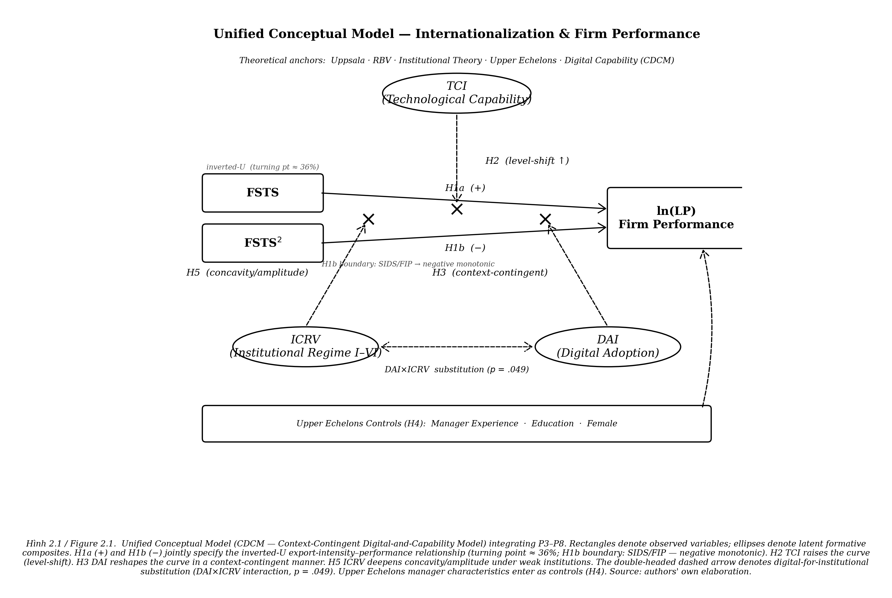

# CHƯƠNG 2: TỔNG QUAN TÀI LIỆU

Chương 2 đảm nhận bốn nhiệm vụ gắn bó với nhau. Trước hết là hệ thống hóa các khái niệm cốt lõi và lý thuyết nền tảng. Tiếp đó là lược khảo, đánh giá các công trình thực nghiệm đã công bố về mối quan hệ giữa quốc tế hóa và hiệu quả hoạt động doanh nghiệp. Trên cơ sở đó, chương chỉ ra những khoảng trống còn tồn tại, rồi dựng nên khung khái niệm tích hợp cùng hệ giả thuyết H1-H6 cho luận án. Mạch lập luận đi từ nền tảng khái niệm đến lý thuyết, từ một công cụ phân loại bối cảnh thể chế đến bằng chứng thực nghiệm, rồi từ khoảng trống đến mô hình nghiên cứu và giả thuyết. Trục logic ấy phục vụ một mục tiêu xuyên suốt: cho thấy vì sao một quan hệ kinh tế tưởng chừng đơn giản, giữa mức độ quốc tế hóa và hiệu quả doanh nghiệp, lại đòi hỏi một khung giải thích đa tầng để hiểu thấu đáo trong bối cảnh châu Á.

---

## 2.1 Các khái niệm cốt lõi

Trước khi đi vào lý thuyết và bằng chứng, cần xác lập rõ năm khái niệm cốt lõi mà toàn bộ luận án xoay quanh: quốc tế hóa doanh nghiệp, hiệu quả hoạt động kinh doanh, cường độ xuất khẩu, năng lực công nghệ, và mức độ chấp nhận số. Năm khái niệm này không chỉ là thuật ngữ; chúng là những cấu trúc khái niệm được vận hành hóa thành biến đo lường cụ thể, nên tính rõ ràng và nhất quán của chúng quyết định tính chặt chẽ của toàn bộ thiết kế nghiên cứu.

### 2.1.1 Quốc tế hóa doanh nghiệp

Quốc tế hóa doanh nghiệp (internationalization) được hiểu là mức độ và phạm vi tham gia của một doanh nghiệp vào các hoạt động kinh tế có yếu tố quốc tế, bao gồm xuất khẩu hàng hóa và dịch vụ, đầu tư trực tiếp ra nước ngoài, liên doanh quốc tế, cấp phép công nghệ xuyên biên giới, và thiết lập mạng lưới phân phối ở thị trường nước ngoài (Sullivan, 1994; Hitt et al., 2006). Khái niệm này không đồng nhất với "toàn cầu hóa", vốn mang nghĩa một xu hướng kinh tế vĩ mô. Nó là một thuộc tính đo lường được ở cấp độ doanh nghiệp, phản ánh chiến lược mở rộng quốc tế và mức độ phụ thuộc vào thị trường nước ngoài của từng doanh nghiệp.

Các nghiên cứu vận hành hóa mức độ quốc tế hóa bằng nhiều thước đo khác nhau. Sullivan (1994) đề xuất một chỉ số tổng hợp đa chiều, gồm tỷ trọng doanh thu từ nước ngoài trên tổng doanh thu (foreign sales to total sales, FSTS), tỷ trọng tài sản ở nước ngoài trên tổng tài sản (foreign assets to total assets, FATA), và phạm vi địa lý. Với những nghiên cứu dùng dữ liệu doanh nghiệp từ các nền kinh tế đang phát triển và từ Khảo sát Doanh nghiệp của Ngân hàng Thế giới (World Bank Enterprise Surveys, WBES), thước đo phổ biến nhất lại là cường độ xuất khẩu, tức tỷ lệ phần trăm doanh thu xuất khẩu trên tổng doanh thu, tương đương với FSTS theo nghĩa rộng (Johanson & Vahlne, 1977; Lu & Beamish, 2004). Luận án chọn FSTS và bình phương FSTS (FSTS²) làm thước đo chính cho mức độ quốc tế hóa, bởi hai lẽ. Thước đo này phù hợp với cấu trúc dữ liệu WBES, và nó nhất quán với các nghiên cứu về quan hệ quốc tế hóa-hiệu quả kinh doanh (I-P) dùng bộ dữ liệu tương tự (Bhandari et al., 2023; Do & Phan, 2026a).

Cần lưu ý rằng quốc tế hóa không phải là một trạng thái nhị phân. Đó là một biến liên tục, biểu thị cường độ tham gia thị trường quốc tế, có thể thay đổi theo thời gian và phản ánh quá trình cam kết tích lũy của doanh nghiệp vào các thị trường nước ngoài (Johanson & Vahlne, 1977, 2009). Tuy nhiên, trong bối cảnh nền kinh tế đang phát triển và chuyển đổi, biến này thường có phân phối lệch mạnh: phần lớn doanh nghiệp định hướng thị trường nội địa, FSTS trung bình chỉ khoảng 12% và trung vị xấp xỉ 0, trong khi nhóm doanh nghiệp xuất khẩu thực sự chỉ chiếm chừng 18% mẫu. Đặc điểm phân phối này đặt ra một hệ quả phương pháp quan trọng được phân tích sâu hơn ở Mục 2.4, đó là biên tham gia xuất khẩu có thể quan trọng ngang hoặc hơn cường độ xuất khẩu nội bộ trong việc giải thích hiệu quả.

### 2.1.2 Hiệu quả hoạt động kinh doanh

Hiệu quả hoạt động kinh doanh (firm performance) là một khái niệm đa chiều, đến nay vẫn chưa có một định nghĩa hay thước đo thống nhất giữa các nghiên cứu. Combs et al. (2005) và Richard et al. (2009) phân biệt ba nhóm thước đo chính. Nhóm thứ nhất dựa trên kế toán, gồm tỷ suất sinh lời trên tổng tài sản (return on assets, ROA), tỷ suất sinh lời trên vốn chủ sở hữu, và tỷ suất sinh lời trên doanh thu (return on sales, ROS). Nhóm thứ hai dựa trên thị trường tài chính, gồm hệ số Tobin's Q và tổng lợi nhuận cổ đông. Nhóm thứ ba dựa trên năng suất và tăng trưởng, gồm năng suất lao động và tăng trưởng doanh thu.

Với những nghiên cứu dùng dữ liệu WBES, vốn không có thông tin về giá cổ phiếu hay giá trị thị trường, năng suất lao động là lựa chọn phổ biến nhất và cũng phù hợp nhất về mặt kỹ thuật. Năng suất lao động được tính bằng logarit tự nhiên của tỷ số doanh thu hằng năm trên số lao động toàn thời gian, tức $\ln(\text{doanh thu}/\text{lao động})$, cho phép so sánh đã chuẩn hóa giữa các doanh nghiệp ở những quốc gia, ngành nghề và quy mô khác nhau (Do & Phan, 2026a). Luận án dùng thước đo này làm biến phụ thuộc chính; ROS và tăng trưởng doanh thu đóng vai trò thước đo độ vững để kiểm tra tính nhất quán của kết quả.

Việc chọn thước đo hiệu quả không thuần túy là quyết định kỹ thuật; nó còn phản ánh quan niệm lý thuyết về hiệu quả. Ở bối cảnh quốc tế hóa tại các nền kinh tế đang phát triển, năng suất lao động phản ánh trực tiếp khả năng chuyển hóa nguồn lực đầu vào thành kết quả đầu ra, qua đó cho thấy năng lực cạnh tranh thực chất của doanh nghiệp. Cách hiểu này gắn với truyền thống nghiên cứu năng suất doanh nghiệp coi năng suất là thước đo trung tâm của hiệu quả vi mô và là kênh chính kết nối thương mại với phúc lợi (Wagner, 2007; Cusolito & Maloney, 2018). Năng suất lao động cũng khác với ROA, vốn chịu ảnh hưởng của cấu trúc tài sản và hệ thống kế toán đặc thù từng quốc gia, nên kém tương thích cho so sánh liên quốc gia trên dữ liệu khảo sát doanh nghiệp.

### 2.1.3 Cường độ xuất khẩu và thước đo FSTS

Cường độ xuất khẩu là biểu hiện cụ thể và đo lường được nhất của quốc tế hóa trên dữ liệu khảo sát doanh nghiệp, nên xứng đáng được làm rõ như một khái niệm riêng. Trong khuôn khổ luận án, cường độ xuất khẩu được vận hành hóa bằng tỷ lệ doanh thu xuất khẩu trên tổng doanh thu (FSTS), đo trực tiếp từ câu hỏi WBES về tỷ trọng doanh thu đến từ xuất khẩu trực tiếp. Lựa chọn này có ba ưu điểm. Một là, FSTS có sẵn và được định nghĩa nhất quán xuyên các thế hệ bảng hỏi WBES, từ thế hệ PICS3 (2009-2013), thế hệ chuẩn hóa (2014-2018) đến thế hệ BREADY/BEE (2019-2025), nên cho phép gộp dữ liệu đa quốc gia, đa năm. Hai là, FSTS là thước đo cường độ tương đối, độc lập với quy mô tuyệt đối của doanh nghiệp, nên so sánh được giữa doanh nghiệp nhỏ và lớn. Ba là, dạng bình phương FSTS² cho phép kiểm định trực tiếp giả thuyết phi tuyến, vốn là tâm điểm tranh luận của tài liệu I-P.

Dù vậy, FSTS cũng có giới hạn nội tại cần thừa nhận. Thước đo này chỉ phản ánh xuất khẩu trực tiếp, không nắm bắt được xuất khẩu gián tiếp qua chuỗi cung ứng, hay sự tham gia chuỗi giá trị toàn cầu (global value chain, GVC) ở vai trò nhà cung ứng cấp dưới (Kano et al., 2020). Ở các nền kinh tế hội nhập sâu vào GVC như Việt Nam, một phần đáng kể giá trị quốc tế hóa diễn ra qua kênh gián tiếp mà FSTS không ghi nhận được. Luận án nhìn nhận hạn chế này như một ràng buộc đo lường có chủ đích, đánh đổi giữa tính so sánh liên quốc gia và độ tinh tế khái niệm, chứ không phải một thiếu sót lý thuyết.

### 2.1.4 Năng lực công nghệ

Một trong những đóng góp khái niệm trọng tâm của luận án là phân biệt rạch ròi hai cấu trúc khái niệm thường bị gộp lẫn: năng lực công nghệ (Technological Capability Index, TCI) và chỉ số chấp nhận số (Digital Adoption Index, DAI). Nhiều nghiên cứu trước thường gộp hai cấu trúc này thành một khái niệm chung là "năng lực số", và chính sự gộp đó gây mơ hồ về lý thuyết lẫn sai lệch trong đo lường (Bhandari et al., 2023; Bustamante et al., 2022).

Năng lực công nghệ chỉ chiều sâu của công nghệ được nhập vào tổ chức, phản ánh khả năng hấp thụ, khai thác và phát triển tri thức công nghệ tiên tiến. Các chỉ báo tiêu biểu là việc sở hữu chứng nhận chất lượng quốc tế (chứng nhận ISO hoặc tương đương), việc sử dụng công nghệ được cấp phép từ đối tác nước ngoài, hoạt động đổi mới sản phẩm và cường độ nghiên cứu và phát triển (research and development, R&D). Về bản chất lý thuyết, TCI gần với khái niệm năng lực hấp thụ (absorptive capacity) của Cohen và Levinthal (1990) và năng lực công nghệ của Lall (1992). Đó là chiều sâu nội tại của tổ chức, khó sao chép và tạo ra lợi thế bền vững theo tinh thần của lý thuyết dựa trên nguồn lực (Barney, 1991). Theo phân tầng của Verhoef et al. (2021), TCI thuộc các cấp độ năng lực số tầng cao (Tier-2 trở lên), gắn với đầu vào và đầu ra của hoạt động đổi mới chứ không phải sự hiện diện công cụ số cơ bản.

Một lưu ý đo lường quan trọng: TCI là một cấu trúc hình thành (formative composite), tức là một chỉ số tổng hợp từ nhiều thành phần phản ánh các khía cạnh khác nhau của năng lực công nghệ, chứ không phải một cấu trúc phản ánh nơi các chỉ báo cùng đo một biến ngầm duy nhất. Vì vậy, việc gộp các thành phần bằng trọng số phù hợp, và việc kiểm tra tính nhất quán của chúng, là yêu cầu phương pháp cần được xử lý cẩn trọng theo tiêu chuẩn của Coltman et al. (2008).

### 2.1.5 Mức độ chấp nhận số

Chỉ số chấp nhận số vận hành theo logic khác hẳn năng lực công nghệ. Nó phản ánh mức độ áp dụng các công cụ số ở giao diện bên ngoài của doanh nghiệp, gồm việc sở hữu trang web, dùng thư điện tử trong giao dịch, thanh toán điện tử và bán hàng trực tuyến. Theo phân loại của Verhoef et al. (2021), đây là các công cụ số bề mặt, nằm ở cấp độ số hóa thông tin (digitization) và số hóa quy trình (digitalization), chưa chạm tới cấp độ chuyển đổi số toàn diện (digital transformation). Trong khuôn khổ thuật ngữ của luận án, DAI tương ứng với sự hiện diện số cơ bản (Tier-1 digital presence), đo bằng biến đại diện cho mức chấp nhận trang web nền tảng lấy từ dữ liệu WBES. Đây là một ràng buộc đo lường có chủ đích, xuất phát từ giới hạn của bộ dữ liệu, chứ không phải một thiếu sót lý thuyết.

Hai cấu trúc TCI và DAI không đồng nhất, và chúng vận hành theo những cơ chế khác nhau trong quan hệ giữa quốc tế hóa và hiệu quả. TCI hoạt động chủ yếu như một nhân tố nâng mặt bằng hiệu quả; còn DAI lại có xu hướng làm thay đổi độ dốc hoặc độ cong của đường quan hệ I-P tùy theo bối cảnh (Bhandari et al., 2023; Chen & Meng, 2022). Phân tích đa mẫu của Do và Phan (2026a) cho thấy tác động của DAI không cố định mà phụ thuộc đồng thời ba chiều bối cảnh: chế độ thể chế quốc gia, mức cường độ xuất khẩu của doanh nghiệp, và mức độ bão hòa số của nền kinh tế. Ở nền kinh tế đã bão hòa số, nơi gần như mọi doanh nghiệp đều có trang web, DAI mất khả năng phân biệt ở cấp độ doanh nghiệp, một hiện tượng có thể gọi là nghịch lý bão hòa số. Giữ vững sự phân biệt giữa TCI và DAI xuyên suốt luận án là điều kiện tiên quyết để bảo đảm tính độc lập khái niệm và để rút ra hàm ý chính sách phân biệt được.

---

## 2.2 Các lý thuyết nền

Tài liệu nghiên cứu về quan hệ I-P đã tích lũy nhiều thập kỷ nhưng vẫn chưa đạt đồng thuận, dù ở phương diện lý thuyết hay thực nghiệm. Các phân tích tổng hợp (meta-analysis) đều cho thấy tác động chung là dương nhưng nhỏ, trong khi mức dị biệt giữa các nghiên cứu lại rất cao, hàm ý rằng không một lý thuyết đơn lẻ nào đủ sức giải thích trọn vẹn quan hệ này (Bausch & Krist, 2007; Kirca et al., 2012; Marano et al., 2016; Wu et al., 2022). Xuất phát từ nhận thức đó, luận án tiếp cận vấn đề bằng một khung giải thích tích hợp đa tầng, trong đó bốn lý thuyết kinh điển của kinh doanh quốc tế được kết hợp với một lớp mở rộng về năng lực số, nhằm phản ánh quá trình chuyển đổi số và bối cảnh trí tuệ nhân tạo đương đại. Bốn lý thuyết nền không cạnh tranh nhau mà bổ sung cho nhau, mỗi lý thuyết soi sáng một tầng cơ chế khác nhau của quan hệ I-P.

### 2.2.1 Mô hình quốc tế hóa Uppsala

Mô hình Uppsala (Johanson & Vahlne, 1977) là một trong những lý thuyết có ảnh hưởng sâu rộng nhất trong nghiên cứu về quốc tế hóa doanh nghiệp. Được xây dựng trên cơ sở quan sát quá trình quốc tế hóa của các doanh nghiệp Thụy Điển, mô hình đề xuất rằng doanh nghiệp quốc tế hóa theo một quá trình tuần tự và tích lũy, trong đó tri thức thị trường nước ngoài và cam kết nguồn lực vào thị trường đó tác động lẫn nhau theo vòng lặp phản hồi. Doanh nghiệp bắt đầu bằng xuất khẩu sang các thị trường gần về tâm lý, ngôn ngữ và thể chế, rồi mở rộng dần sang thị trường xa hơn, phản ánh mức độ cam kết và tri thức ngày càng tăng. Phiên bản gốc năm 1977 xoay quanh ba cơ chế gắn kết: cam kết thị trường, tri thức thị trường, và quyết định cam kết hiện tại.

Một trong những khái niệm trọng tâm của mô hình Uppsala là gánh nặng người nước ngoài (liability of foreignness), tức chi phí và bất lợi mà doanh nghiệp phải gánh khi hoạt động trong môi trường văn hóa, thể chế và pháp lý xa lạ (Zaheer, 1995). Johanson và Vahlne (2009) cập nhật mô hình bằng khái niệm gánh nặng người ngoài mạng lưới (liability of outsidership), nhấn mạnh rằng trong nền kinh tế toàn cầu hiện đại, rào cản lớn nhất không còn là khoảng cách địa lý hay tâm lý, mà là vị trí ngoài lề các mạng lưới kinh doanh địa phương. Quá trình hoàn thiện mô hình không dừng ở phiên bản 2009: Vahlne và Johanson (2017), trong bản tổng kết "mô hình Uppsala ở tuổi bốn mươi", tái định hình mô hình theo hướng tiến hóa của doanh nghiệp đa quốc gia gắn với năng lực động; Coviello, Kano và Liesch (2017) điều chỉnh mô hình cho bối cảnh hiện đại bằng cách kết nối tầng vĩ mô với các nền tảng vi mô; và Vahlne (2020) tiếp tục phát triển hướng đi từ quốc tế hóa sang tiến hóa. Những bản cập nhật này cho thấy Uppsala là một khung lý thuyết đang tiến hóa chứ không cố định ở năm 2009, và chính chúng tạo điểm tựa lý luận cho việc luận án mở rộng cơ chế học hỏi sang môi trường số. Hai loại gánh nặng này lý giải vì sao chi phí quốc tế hóa giai đoạn đầu thường cao, tạo nên một giai đoạn hiệu quả sụt giảm trước khi doanh nghiệp tích lũy đủ tri thức và quan hệ để hưởng lợi từ việc mở rộng (Lu & Beamish, 2004; Contractor et al., 2003).

Mô hình Uppsala cổ điển ra đời trong bối cảnh tiền số, nên đã chịu nhiều thách thức trong thập kỷ gần đây. Các nghiên cứu về doanh nghiệp toàn cầu từ khi khởi sự (born-global firms), tức quốc tế hóa ngay từ đầu mà không theo trình tự tuần tự (Knight & Cavusgil, 2004), về doanh nghiệp đa quốc gia từ thị trường mới nổi với lộ trình quốc tế hóa khác biệt, và về doanh nghiệp nền tảng vươn ra thị trường quốc tế qua nền tảng số mà không cần hiện diện vật lý, đều cho thấy logic của Uppsala không còn phổ quát (Stallkamp & Schotter, 2021; Yang et al., 2025). Luận án không bác bỏ mô hình Uppsala. Thay vào đó, luận án tái định vị nó như một lớp nền lý giải chi phí học hỏi và sự bất định trong giai đoạn đầu quốc tế hóa, đồng thời mở rộng cơ chế học hỏi để bao gồm cả học hỏi tăng cường bằng dữ liệu số (data-augmented learning) trong kỷ nguyên chuyển đổi số, khi dữ liệu từ thị trường nước ngoài có thể được thu thập, xử lý và phân tích nhanh hơn nhiều so với trước; hướng mở rộng này nối tiếp chính lộ trình tiến hóa mà các tác giả Uppsala đã khởi xướng sau 2009 (Vahlne & Johanson, 2017; Vahlne, 2020; Banalieva & Dhanaraj, 2019). Hàm ý cho quan hệ I-P là rõ ràng: chính cơ chế chi phí học hỏi đầu vào cao rồi lợi ích tích lũy về sau của Uppsala tạo nên cơ sở lý luận cho dạng hàm phi tuyến của quan hệ I-P, đặc biệt là giai đoạn đầu chi phí cao trước điểm uốn.

### 2.2.2 Quan điểm dựa trên nguồn lực

Quan điểm dựa trên nguồn lực (resource-based view, RBV) do Wernerfelt (1984) đặt nền và được Barney (1991) hệ thống hóa thành một khung lý thuyết có ảnh hưởng bền vững. RBV cho rằng doanh nghiệp không chỉ là một chuỗi các hoạt động tạo giá trị, mà còn là một bó nguồn lực. Sự khác biệt về hiệu quả lâu dài giữa các doanh nghiệp bắt nguồn từ khác biệt trong việc sở hữu và khai thác những nguồn lực thỏa mãn tiêu chí VRIN: có giá trị, hiếm có, khó sao chép và khó thay thế.

Đưa vào bối cảnh quốc tế hóa, RBV lý giải vì sao cùng một mức FSTS mà các doanh nghiệp lại đạt hiệu quả rất khác nhau. Doanh nghiệp có năng lực công nghệ, năng lực quản trị vượt trội và năng lực học hỏi mạnh hơn sẽ chuyển hóa quốc tế hóa thành hiệu quả tốt hơn, bởi họ giảm được chi phí của gánh nặng người nước ngoài và khai thác lợi thế cạnh tranh trên phạm vi quốc tế hiệu quả hơn (Hitt et al., 2006; Peng, 2001). Ở cùng một mức độ quốc tế hóa, doanh nghiệp nguồn lực yếu phải gánh chi phí điều phối và rủi ro lớn hơn, trong khi doanh nghiệp giàu nguồn lực VRIN có thể biến chính những thách thức đó thành lợi thế cạnh tranh.

Trong bối cảnh đương đại, RBV được mở rộng bằng lý thuyết năng lực động (dynamic capabilities) của Teece et al. (1997), vốn nhấn mạnh khả năng tích hợp, xây dựng và tái cấu hình các năng lực nội bộ để ứng phó với môi trường cạnh tranh biến động nhanh. Eisenhardt và Martin (2000) làm rõ thêm rằng năng lực động chính là các quy trình tổ chức cho phép tái phân bổ nguồn lực. Trong kỷ nguyên số, theo cách phân biệt của luận án, năng lực công nghệ (TCI) được xem là một dạng năng lực động quan trọng, cho phép doanh nghiệp tái cấu hình nguồn lực và mô hình kinh doanh để đương đầu với sự bất định trong quốc tế hóa, đồng thời nâng cao năng lực hấp thụ tri thức và công nghệ từ thị trường nước ngoài (Bhandari et al., 2023; Verhoef et al., 2021). Trong khi đó, DAI là chỉ số chấp nhận số nền tảng, đo sự hiện diện cơ bản, phản ánh mức chấp nhận số sơ khởi chứ không phải năng lực động theo nghĩa của Teece et al. (1997). RBV cung cấp nền lý thuyết trực tiếp cho giả thuyết H2 về vai trò điều tiết của TCI, với hàm ý rằng năng lực công nghệ nâng mặt bằng hiệu quả và làm sắc nét hơn độ cong của đường quan hệ I-P.

### 2.2.3 Lý thuyết thể chế

Trong kinh doanh quốc tế, lý thuyết thể chế (institutional theory) rút ra từ nhiều nguồn lý luận: kinh tế học thể chế mới của North (1990), xã hội học thể chế của Scott (1995), và lý thuyết về khoảng trống thể chế của Khanna và Palepu (2010). Điểm chung của các hướng tiếp cận này là cùng nhấn mạnh vai trò của môi trường thể chế, cả chính thức lẫn phi chính thức, trong việc định hình chiến lược và kết quả kinh doanh của doanh nghiệp.

North (1990) chỉ ra rằng thể chế là "luật chơi" của một xã hội, bao gồm các ràng buộc chính thức như luật pháp, quy định, hợp đồng, quyền sở hữu, và các ràng buộc phi chính thức như chuẩn mực, giá trị, văn hóa ứng xử. Thể chế hiệu quả giúp giảm chi phí giao dịch, bảo vệ quyền sở hữu trí tuệ và tạo môi trường khuyến khích đầu tư dài hạn. Ngược lại, ở các nền kinh tế đang phát triển, sự vắng mặt hoặc yếu kém của các thể chế trung gian thị trường, từ hệ thống pháp lý đến thị trường vốn, từ tổ chức đánh giá tín nhiệm đến hiệp hội ngành nghề, tạo ra những khoảng trống thể chế (institutional voids) làm tăng chi phí giao dịch và rủi ro cho doanh nghiệp khi hoạt động hay mở rộng ra nước ngoài (Khanna & Palepu, 2010). Peng (2003) bổ sung bằng khung chiến lược dựa trên thể chế, lập luận rằng ở các nền kinh tế mới nổi, thể chế không phải bối cảnh phông nền mà là một lực định hình chiến lược ngang hàng với ngành và nguồn lực.

Một bước tinh chỉnh quan trọng đến từ Xu (2024), người phân tách quy tắc hình thức trên giấy (de jure) với thực thi thực tế (de facto), qua đó giải thích vì sao những nền kinh tế có khung pháp lý tương tự lại tạo ra kết quả kinh doanh rất khác nhau. Kim et al. (2026) cung cấp một khung đo lường năng lực thể chế (institutional capacity) theo hai chiều, chiều tổ chức gồm nhân sự, tài chính, hệ thống thông tin, quản lý, và chiều quản trị gồm minh bạch, độc lập, trách nhiệm giải trình; nghiên cứu đa quốc gia này xác nhận tương quan dương bền vững giữa năng lực thể chế và phát triển kinh tế. Về phía bằng chứng tổng hợp, Marano et al. (2016) trên 170 nghiên cứu thuộc 32 quốc gia cho thấy thể chế quốc gia nguồn điều tiết đáng kể quan hệ I-P, với khả năng thay đổi độ cong của đường cong; doanh nghiệp từ các nền kinh tế thể chế yếu hơn thường thu được lợi ích thấp hơn, thậm chí chịu tổn thất khi quốc tế hóa. Cuervo-Cazurra et al. (2018) bổ sung một góc nhìn khác: sự bất định thể chế ở quốc gia nguồn không chỉ là thách thức mà còn có thể rèn cho doanh nghiệp một năng lực quản lý bất định đặc thù, nhờ đó họ cạnh tranh hiệu quả hơn ở những thị trường nước ngoài có đặc điểm tương tự. Lý thuyết thể chế là nền tảng lý luận cho giả thuyết H5 và cho khung phân tích ICRV trình bày ở Mục 2.3.

### 2.2.4 Lý thuyết Bậc trên

Lý thuyết Bậc trên (upper echelons theory) do Hambrick và Mason (1984) đề xuất và được Hambrick (2007) cập nhật, cho rằng các quyết định chiến lược lớn và kết quả của tổ chức không phải là sản phẩm của những quy trình hoàn toàn duy lý, mà phản ánh đặc điểm nhận thức, giá trị và kinh nghiệm của nhà quản trị cấp cao. Nói cách khác, tổ chức là sự phản chiếu của những người đứng đầu nó. Các đặc điểm có liên quan gồm tuổi, học vấn, kinh nghiệm chức năng, thâm niên, kinh nghiệm quốc tế và giới tính. Hambrick (2007) bổ sung hai khái niệm điều hòa: mức độ tự do quyết định của nhà quản trị (managerial discretion) và áp lực công việc, vốn quyết định mức độ mà đặc điểm cá nhân thực sự chuyển hóa thành kết quả tổ chức.

Đặt trong bối cảnh quốc tế hóa, lý thuyết này có hai hàm ý trực tiếp. Một mặt, kinh nghiệm quốc tế của nhà quản trị cấp cao, đo bằng số năm làm việc hoặc học tập ở nước ngoài hay mức độ tiếp xúc với thị trường quốc tế, giúp giảm nhận thức về gánh nặng người nước ngoài và nâng cao khả năng đánh giá cơ hội, quản trị rủi ro ở thị trường quốc tế (Hsu et al., 2013; Sambharya, 1996). Mặt khác, sự đa dạng giới tính trong lãnh đạo, đặc biệt là sự hiện diện của quản trị viên nữ ở các vị trí lãnh đạo, gắn với nhận thức chiến lược đa chiều hơn và thực tiễn quản trị rủi ro thận trọng hơn, qua đó tác động tích cực đến hiệu quả doanh nghiệp trong quá trình quốc tế hóa (Post & Byron, 2015). Hai hàm ý này là cơ sở lý thuyết cho khối kiểm soát quản trị nội sinh H4. Tuy nhiên, trên mẫu đa quốc gia quy mô lớn, khác biệt cấp doanh nghiệp về đặc điểm nhà quản trị nhiều khả năng nâng mặt bằng hiệu quả hơn là tái định hình toàn bộ độ cong của đường quan hệ I-P, vốn được chi phối chủ yếu bởi các yếu tố thể chế và mức độ trưởng thành thị trường ở cấp nền kinh tế. Vì lý do đó, và vì năng lực cùng sự đa dạng giới của nhà quản trị có thể đồng thời tác động đến quyết định xuất khẩu, đến năng lực công nghệ và đến năng suất, khung của luận án không nâng đặc điểm nhà quản trị thành một tầng điều tiết trọng tâm mà đưa kinh nghiệm, học vấn và giới tính vào như nhóm biến kiểm soát quản trị nội sinh. Để bảo vệ tính nhân quả riêng phần của tương tác Thể chế × Công nghệ, các đặc điểm nhà quản trị (kinh nghiệm, học vấn, giới tính) được đưa vào như biến kiểm soát quản trị nội sinh, không phải nhân tố điều tiết trọng tâm của đường cong I-P; lựa chọn này tránh thiên lệch biến bị bỏ sót và ngăn hiện tượng "Kitchen Sink Modeling" làm loãng thông điệp vĩ mô Institution × Technology. Bốn nhân tố điều tiết trọng tâm của khung do đó là TCI (H2), DAI (H3), chế độ thể chế ICRV (H5) và thời gian (H6).

### 2.2.5 Lớp mở rộng: lăng kính số

Bốn lý thuyết nền trên đều ra đời chủ yếu trong bối cảnh tiền số. Sự bùng nổ của kinh tế số và trí tuệ nhân tạo từ cuối thập niên 2010 đến nay đặt ra yêu cầu cập nhật và mở rộng các lý thuyết kinh doanh quốc tế, sao cho phản ánh được logic mới của quốc tế hóa trong kỷ nguyên số. Lăng kính số (digital lens) không phải là một lý thuyết thay thế bốn lý thuyết kinh điển, mà là một lớp mở rộng đan cài vào chúng, làm sắc nét lại các cơ chế cũ trong điều kiện công nghệ mới.

Banalieva và Dhanaraj (2019) nằm trong số những nghiên cứu đầu tiên đề xuất cập nhật lý thuyết nội hóa cho nền kinh tế số. Họ lập luận rằng dữ liệu số và tương tác dựa trên nền tảng làm giảm sự phụ thuộc vào hiện diện vật lý, qua đó thay đổi căn bản logic về quyết định nội hóa, làm khoảng cách tâm lý giảm đến mức tối thiểu và đẩy nhanh quốc tế hóa từ giai đoạn đầu. Stallkamp và Schotter (2021) đẩy luận điểm này đi xa hơn khi chỉ ra rằng doanh nghiệp nền tảng quốc tế hóa theo một logic đa diện, khác hẳn với công ty đa quốc gia truyền thống, trong đó hiệu ứng mạng lưới tạo ra lợi thế quy mô không bị biên giới địa lý ràng buộc, và nền tảng số cho phép doanh nghiệp nhỏ ở thị trường mới nổi quốc tế hóa với chi phí gần bằng không. Verhoef et al. (2021) đóng góp một khung khái niệm phân tầng ba cấp độ là số hóa thông tin, số hóa quy trình và chuyển đổi số toàn diện, đồng thời nhấn mạnh rằng ba cấp độ này khác nhau về chiều sâu tổ chức lẫn tác động kinh doanh. Yang et al. (2025) bổ sung bằng một tổng quan hệ thống về quốc tế hóa của doanh nghiệp số, phác họa những lý thuyết cần điều chỉnh và các hướng nghiên cứu tiếp theo.

Trong luận án, lớp năng lực số đóng vai trò mở rộng RBV theo hai chiều. Một là xác định TCI và DAI như hai loại tài sản số có chiều sâu và cơ chế vận hành khác nhau, qua đó hình thành nền tảng cho việc tách bạch H2 và H3. Hai là mở rộng mô hình Uppsala bằng cơ chế học hỏi dựa trên dữ liệu số. Sự tích hợp này tạo thành lớp thứ năm của khung lý thuyết, bổ sung cho bốn lý thuyết kinh điển để hợp thành một khung giải thích hoàn chỉnh, phù hợp với thực tiễn kinh doanh đương đại. Bảng 2.1 tóm lược vai trò của từng tầng lý thuyết trong khung tích hợp.

**Bảng 2.1.** *Năm tầng lý thuyết và vai trò của chúng trong khung giải thích của luận án.*

| Tầng lý thuyết | Tác giả nền tảng | Cơ chế cốt lõi | Hàm ý cho quan hệ I-P | Giả thuyết liên quan |
|----------------|------------------|----------------|------------------------|----------------------|
| Mô hình Uppsala | Johanson & Vahlne (1977, 2009); Vahlne & Johanson (2017); Vahlne (2020) | Học hỏi tích lũy; gánh nặng người nước ngoài và người ngoài mạng lưới; tiến hóa sang năng lực động | Chi phí đầu vào cao rồi lợi ích về sau tạo phi tuyến | H1 |
| Quan điểm dựa trên nguồn lực | Wernerfelt (1984); Barney (1991); Teece et al. (1997) | Nguồn lực VRIN và năng lực động; năng lực hấp thụ | Năng lực công nghệ nâng mặt bằng và làm sắc nét đường cong | H2 |
| Lý thuyết thể chế | North (1990); Khanna & Palepu (2010); Peng (2003) | Chi phí giao dịch; khoảng trống thể chế | Chất lượng thể chế chi phối độ cong đường cong I-P | H5 |
| Lý thuyết Bậc trên | Hambrick & Mason (1984); Hambrick (2007) | Nhận thức và kinh nghiệm nhà quản trị cấp cao | Đặc điểm lãnh đạo nâng mặt bằng hiệu quả (kiểm soát quản trị nội sinh, không phải điều tiết trọng tâm độ cong) | H4 (kiểm soát quản trị nội sinh) |
| Lăng kính số | Banalieva & Dhanaraj (2019); Verhoef et al. (2021) | Học hỏi dữ liệu số; công cụ số bề mặt | Chấp nhận số làm thay đổi độ dốc và độ cong | H3, H6 |

---

## 2.3 Khung phân tích Biến thiên chế độ bối cảnh thể chế (ICRV)

Lý thuyết thể chế chỉ ra rằng môi trường thể chế chi phối lợi ích ròng của quốc tế hóa, nhưng để kiểm định luận điểm đó trên một mẫu đa quốc gia rộng lớn, cần một công cụ vận hành hóa bối cảnh thể chế thành biến phân tích cụ thể. Châu Á không phải là một khối đồng nhất về thể chế. Các phân tích tổng hợp đã ghi nhận bối cảnh thể chế là biến điều tiết quan trọng nhất của quan hệ I-P, nhưng chưa có nghiên cứu nào thiết lập một hệ thống phân loại thể chế toàn diện cho phạm vi rộng các nền kinh tế châu Á và Thái Bình Dương (Marano et al., 2016; Wu et al., 2022). Luận án phát triển khung Biến thiên chế độ bối cảnh thể chế (Institutional Context Regime Variation, ICRV) để lấp khoảng trống đó.

### 2.3.1 Cơ sở và nguyên tắc xây dựng ICRV

Khung ICRV phân loại các nền kinh tế trong phạm vi nghiên cứu thành sáu nhóm con (ICRV sub-regime), dựa trên tổ hợp ba căn cứ: bộ chỉ số quản trị thế giới (World Governance Indicators, WGI) của Kaufmann et al. (2011), mức độ phát triển kinh tế đo bằng thu nhập quốc gia bình quân đầu người theo phương pháp Atlas của Ngân hàng Thế giới, và đặc trưng cấu trúc thể chế của từng nền kinh tế. Về mặt khái niệm, ICRV sắp xếp các nền kinh tế theo hai chiều lý thuyết phân biệt mà các phân loại trước thường gộp chung: năng lực thể chế, tức chất lượng thể chế chính thức theo tinh thần của North (1990) và truyền thống các mô hình tư bản chủ nghĩa khác nhau (Hall & Soskice, 2001); và mức độ tổn thương nguồn lực, tức mức phơi nhiễm trước các cú sốc bên ngoài, sự hẹp hòi về nguồn lực sản xuất, và các khoảng trống thể chế mà doanh nghiệp buộc phải nội hóa (Khanna & Palepu, 2010). Khung này mở rộng từ phân loại thể chế của Khanna và Palepu (2010), được điều chỉnh cho phù hợp với thực tiễn đa dạng của châu Á và khu vực lân cận, đồng thời tham chiếu khung năng lực thể chế của Kim et al. (2026).

Cần nhấn mạnh rằng tên gọi đầy đủ của khung là Biến thiên chế độ bối cảnh thể chế (Institutional Context Regime Variation, ICRV), phản ánh đúng bản chất của nó: một dải biến thiên liên tục của bối cảnh thể chế, được rời rạc hóa thành sáu chế độ để tiện cho phân tích so sánh.

### 2.3.2 Sáu nhóm chế độ thể chế

Sáu nhóm con của ICRV được phân định như sau.

Nhóm I, tiên tiến dẫn dắt bằng đổi mới (Advanced Innovation-Driven), gồm các nền kinh tế như Singapore, Hong Kong, Hàn Quốc, Đài Loan, Israel và Cyprus. Đặc trưng là chỉ số WGI về thượng tôn pháp luật rất cao, thu nhập bình quân đầu người trên 30.000 USD, và tăng trưởng dựa trên đổi mới công nghệ, dịch vụ tài chính, hàm lượng tri thức cao. Bằng chứng WBES cho thấy cường độ R&D trên 10%, tỷ lệ chứng nhận ISO trên 20%, và phân tán năng suất ở mức vừa phải.

Nhóm II, tiên tiến dẫn dắt bằng tài nguyên (Advanced Resource-Driven), gồm các nền kinh tế vùng Vịnh như Saudi Arabia, Qatar, Kuwait, Bahrain, Brunei và Oman. Đặc trưng là chất lượng thể chế trung bình, thu nhập cao nhưng dựa vào xuất khẩu tài nguyên thiên nhiên. Bằng chứng WBES cho thấy FDI cao hướng khai thác tài nguyên và phân tán năng suất rất hẹp, đặc trưng của mô hình kinh tế tô nhượng (rentier state).

Nhóm III, thu nhập trung bình cao (Upper-middle), điển hình là Trung Quốc, cùng Malaysia, Thái Lan, Kazakhstan, Armenia và Georgia. Đặc trưng là nền kinh tế chuyển đổi từ sản xuất sang dịch vụ, với R&D đang tăng nhanh, đặc biệt ở Trung Quốc giai đoạn 2018-2025.

Nhóm IV, chuyển đổi thu nhập trung bình thấp hay đang nổi (Emerging), gồm Việt Nam, Indonesia, Philippines, Ấn Độ, Sri Lanka, Jordan và Mông Cổ. Đặc trưng là tốc độ tăng trưởng cao nhưng khoảng cách lớn giữa quy tắc pháp lý trên giấy và thực thi thực tế (Xu, 2024), sản xuất dẫn dắt bởi FDI và xuất khẩu.

Nhóm V, cận biên (Frontier), gồm 17 nền kinh tế như Bangladesh, Pakistan, Lào, Campuchia, Myanmar, Nepal và một số nền kinh tế đang trải qua hoặc vừa thoát khỏi xung đột. Đặc trưng là chất lượng thể chế thấp, khoảng trống thể chế lớn, phân tán năng suất cao nhất, R&D thấp nhất, nhưng đổi mới sản phẩm lại cao do doanh nghiệp buộc phải đổi mới bằng nguồn lực hạn chế.

Nhóm VI, đảo nhỏ Thái Bình Dương (Pacific and Indian Ocean SIDS), gồm các quốc đảo nhỏ đang phát triển (Small Island Developing States, SIDS) như Fiji, Papua New Guinea, Solomon Islands, Tonga, Vanuatu, Samoa và Kiribati. Đặc trưng là dân số rất nhỏ, cô lập địa lý xa các trung tâm thương mại, phụ thuộc nặng vào viện trợ và kiều hối theo mô hình MIRAB (Bertram, 2006), và chi phí hậu cần cực cao.

**Bảng 2.2.** *Sáu nhóm chế độ thể chế ICRV: tiêu chí, đại diện và cơ chế quốc tế hóa-hiệu quả dự kiến.*

| Nhóm ICRV | Tên nhóm | Đại diện | WGI/Thượng tôn pháp luật | Cơ chế I-P dự kiến |
|-----------|----------|----------|---------------------------|---------------------|
| I | Tiên tiến dẫn dắt bằng đổi mới | Singapore, Hàn Quốc, Đài Loan | Rất cao (>+0,80) | Lợi ích quốc tế hóa cao, điểm uốn sớm |
| II | Tiên tiến dẫn dắt bằng tài nguyên | Saudi Arabia, Qatar, Kuwait | Trung bình (+0,00 đến +0,50) | Phân tán hẹp, đặc trưng tô nhượng |
| III | Thu nhập trung bình cao | Trung Quốc, Malaysia, Thái Lan | 0,00 đến +0,80 | Chữ U ngược, điểm uốn trung bình |
| IV | Chuyển đổi thu nhập trung bình thấp | Việt Nam, Ấn Độ, Indonesia | -0,50 đến 0,00 | Chữ U ngược, biên tham gia xuất khẩu |
| V | Cận biên | Bangladesh, Campuchia, Lào | < -0,50 | Yếu, khoảng trống thể chế lớn |
| VI | Đảo nhỏ Thái Bình Dương | Fiji, Tonga, Vanuatu | Thấp, cô lập cấu trúc | Có thể đảo dấu thành âm đơn điệu |

*Nguồn: Tổng hợp từ World Bank Enterprise Surveys (2025); WGI từ Kaufmann et al. (2011); thu nhập từ phân loại Ngân hàng Thế giới (2025).*

### 2.3.3 Vai trò điều tiết của ICRV trong quan hệ I-P

ICRV không chỉ là một biến phân loại mà là một bộ lọc chi phí giao dịch (transaction cost filter): mỗi chế độ quy định mức độ trơn tru mà giao dịch quốc tế hóa được chuyển hóa thành hiệu quả, và toàn dải sáu chế độ hợp thành một bản đồ địa hình xuất khẩu chiến lược (strategic export topography). Nó còn là một dải biến thiên thể chế liên tục, trải từ môi trường thể chế mạnh và ít rủi ro (Nhóm I) đến môi trường thể chế yếu, nhiều rủi ro và khoảng trống thể chế (Nhóm V và VI). Dải biến thiên này tạo nên những điều kiện biên quan trọng để kiểm định khả năng tổng quát hóa của quan hệ I-P, nhất là phần liên quan đến giả thuyết phi tuyến và vị trí điểm uốn.

Cơ chế điều tiết của ICRV vận hành theo hai kênh đan xen. Kênh thứ nhất là thay đổi độ cong (biên độ) của đường cong: ở môi trường thể chế yếu, chi phí giao dịch xuyên biên giới cao làm độ cong của hình chữ U ngược sâu hơn, hình phạt hiệu quả đối với quốc tế hóa quá mức trở nên gay gắt hơn; ngược lại, ở môi trường thể chế mạnh, đường cong phẳng hơn, gần như tuyến tính. Điểm uốn không dịch chuyển đơn điệu theo chất lượng thể chế mà phân tán quanh mức ~40%. Kênh thứ hai là thay thế số cho thể chế (digital-for-institutional substitution): nơi thể chế chính thức cung cấp đầy đủ cơ chế thực thi hợp đồng, bảo vệ sở hữu trí tuệ và thông tin thị trường, công cụ số chỉ bổ sung biên; nơi khoảng trống thể chế ngự trị, công cụ số lại trở thành một sự thay thế đáng kể cho các cơ chế chính thức còn thiếu, qua đó vai trò định hình đường cong của DAI mạnh hơn ở nhóm thể chế yếu. Đây chính là cơ sở của giả thuyết H5 và là phần mở rộng đa quốc gia của logic khoảng trống thể chế (Khanna & Palepu, 2010) vào lĩnh vực số.

Một hệ quả quan trọng của khung ICRV là khả năng phân tách hiệu ứng thể chế khỏi hiệu ứng thời kỳ. Vì sáu chế độ thể chế cùng tồn tại trong cùng một khoảng thời gian và trên cùng một nguồn dữ liệu chuẩn hóa, châu Á giai đoạn 2009-2025 trở thành một phòng thí nghiệm tự nhiên hiếm có, cho phép kiểm định những điều mà các nghiên cứu đơn quốc gia không thể làm được. Nhóm VI, các đảo nhỏ Thái Bình Dương, giữ vai trò đặc biệt như một điều kiện biên cực trị, nơi ba điều kiện cấu trúc cơ bản của chữ U ngược có thể cùng bị vi phạm, làm quan hệ I-P có nguy cơ sụp đổ thành âm đơn điệu. Vai trò điều kiện biên này được khai thác trực tiếp trong giả thuyết H1b ở Mục 2.5.

---

## 2.4 Tổng quan thực nghiệm quan hệ quốc tế hóa-hiệu quả

Phần này lược khảo bằng chứng thực nghiệm về quan hệ I-P theo bốn lớp: tranh luận về dạng hàm, bằng chứng từ các phân tích tổng hợp, bối cảnh châu Á và các nền kinh tế mới nổi, và vai trò của năng lực số. Mục tiêu là làm rõ trạng thái tri thức hiện tại để từ đó nhận diện các khoảng trống ở Mục 2.5.

### 2.4.1 Tranh luận về dạng hàm của quan hệ I-P

Nghiên cứu về quan hệ I-P đã trải qua hơn bốn thập kỷ phát triển, với những thay đổi đáng kể cả về câu hỏi, phương pháp lẫn kết luận lý thuyết. Tài liệu không hội tụ về một dạng hàm duy nhất mà ghi nhận ít nhất năm dạng riêng biệt, và chính sự tồn tại song song của năm dạng này, chứ không phải bản thân từng dạng, mới là dữ kiện cần được giải thích (Contractor, 2012).

Dạng hàm thứ nhất là tuyến tính dương. Các nghiên cứu sớm như Hsu và Boggs (2003) tìm thấy hiệu quả tăng đơn điệu theo mức độ quốc tế hóa, với logic nền tảng là lợi ích quy mô, đa dạng hóa doanh thu và tiếp cận thị trường lớn hơn (Grant, 1987; Kim et al., 1989). Đây thường là kết quả đặc thù của các mẫu có cường độ xuất khẩu thấp hoặc phân tán hẹp.

Dạng hàm thứ hai là chữ U ngược. Hitt et al. (1997) là công trình đầu tiên kiểm định và tìm thấy bằng chứng cho quan hệ chữ U ngược giữa đa dạng hóa sản phẩm quốc tế và hiệu quả; nhóm tác giả lập luận rằng lợi ích từ quốc tế hóa tăng đến một điểm tối ưu rồi suy giảm khi chi phí điều phối và độ phức tạp tổ chức lấn át lợi ích. Gomes và Ramaswamy (1999) đưa ra bằng chứng tương tự. Điểm uốn thực nghiệm thường nằm trong khoảng 30-60% FSTS, và đây là dạng hàm phổ biến nhất trong các tổng quan định lượng (Marano et al., 2016).

Dạng hàm thứ ba là đường cong chữ S ba giai đoạn. Contractor et al. (2003) cùng Lu và Beamish (2004) phát triển lý thuyết ba giai đoạn: hiệu quả giảm ở giai đoạn thâm nhập ban đầu do chi phí học hỏi và thiết lập; tăng ở giai đoạn khai thác nhờ học hỏi tích lũy và quy mô; rồi lại giảm ở giai đoạn mở rộng quá mức khi chi phí phức tạp vượt quá lợi ích. Dạng chữ S đòi hỏi hệ số $\beta_1$ của FSTS dương, $\beta_2$ của FSTS² âm, và $\beta_3$ của FSTS³ dương. Bằng chứng hỗ trợ mạnh từ các công ty đa quốc gia lớn nhưng kém ổn định hơn với doanh nghiệp nhỏ và vừa.

Dạng hàm thứ tư là chữ M với hai điểm uốn, phản ánh tính không đồng nhất của lợi ích quốc tế hóa theo loại thị trường (Riahi-Belkaoui, 1998), song bằng chứng thực nghiệm hạn chế và khó tái lập. Dạng hàm thứ năm là gánh nặng quốc tế hóa bắt buộc, biểu hiện thành quan hệ tuyến tính âm trong các nền kinh tế buộc phải quốc tế hóa do thị trường nội địa quá nhỏ; đây là dạng đặc thù của các quốc đảo nhỏ Thái Bình Dương, nơi doanh nghiệp phải xuất khẩu để tồn tại nhưng thiếu năng lực cạnh tranh (Briguglio, 1995; Bertram, 2006). Năm dạng hàm này thực chất sắp xếp dọc theo một trục đối lập giữa hai chế độ quốc tế hóa: ở một đầu là quốc tế hóa để mở rộng quy mô, nơi xuất khẩu tối ưu hóa lợi nhuận và đường cong còn dư địa sinh lợi đến cường độ cao; ở đầu kia là quốc tế hóa để sinh tồn, nơi xuất khẩu là bắt buộc và dạng phi tuyến quen thuộc sụp đổ thành âm đơn điệu. Dạng hàm thứ năm do đó không phải một ngoại lệ thứ yếu mà là cực biên làm lộ rõ các tiền đề cấu trúc mà bốn dạng còn lại ngầm giả định.

Năm dạng hàm có thể được thống nhất dưới một khung chi phí-lợi ích đơn giản, theo đó hiệu quả là hiệu giữa hàm lợi ích và hàm chi phí của quốc tế hóa: $P(\text{FSTS}) = B(\text{FSTS}) - C(\text{FSTS})$. Sự khác biệt giữa các dạng hàm nằm ở hình dạng của hai hàm thành phần này, vốn biến thiên theo bối cảnh thể chế, năng lực doanh nghiệp và giai đoạn số hóa. Cách nhìn hợp nhất này lý giải vì sao một khung điều tiết đa tầng, chứ không phải một dạng hàm cố định, mới là cách tiếp cận đúng đắn.

### 2.4.2 Bằng chứng từ các phân tích tổng hợp

Bước tiến phương pháp đáng kể nhất của tài liệu I-P là sự ra đời của các phân tích tổng hợp, vốn cho phép gộp và định lượng kết quả từ hàng trăm nghiên cứu thực nghiệm riêng lẻ, nhờ đó lọc bớt nhiễu mà từng mẫu đơn lẻ gây ra. Khi đặt cạnh nhau, các phân tích tổng hợp chính phác họa một bức tranh nhất quán ở kết luận tổng thể nhưng phức tạp ở cơ chế.

Bausch và Krist (2007) phân tích 68 nghiên cứu giai đoạn 1980-2005 và tìm thấy tác động trung bình rất nhỏ (r $\approx$ 0,045, không đáng kể) nhưng với độ biến động cao; họ xác nhận rằng các biến điều tiết thể chế và văn hóa giải thích phần phương sai lớn hơn nhiều so với biến điều tiết cấp doanh nghiệp, song mẫu thiếu đại diện châu Á và không kiểm định phi tuyến có hệ thống. Kirca et al. (2012) tổng hợp 180 nghiên cứu với 824 mức độ ảnh hưởng, tìm thấy quan hệ dương trung bình với điều tiết đáng kể từ loại hình quốc tế hóa, thước đo hiệu quả và thuộc tính doanh nghiệp, trong đó cường độ R&D là biến điều tiết cấp doanh nghiệp mạnh nhất; hạn chế là thiếu bằng chứng châu Á và không bao gồm các nền kinh tế cận biên hay đảo nhỏ.

Marano et al. (2016) là công trình tập trung vào thể chế toàn diện nhất, với 170 nghiên cứu thuộc 32 quốc gia, chứng minh rằng chất lượng thể chế quốc gia nguồn điều tiết đáng kể quan hệ I-P; đây là nền tảng quan trọng nhất ủng hộ dải biến thiên ICRV trong giả thuyết H5, song nghiên cứu không phân tách TCI với DAI và không có dữ liệu sau 2015. Wu et al. (2022) tổng hợp 20 năm bằng chứng từ doanh nghiệp đa quốc gia thị trường mới nổi và tìm thấy điểm uốn thấp hơn so với doanh nghiệp từ nền kinh tế phát triển khoảng 12-18% FSTS, do khoảng cách về năng lực hấp thụ; nghiên cứu không kiểm định giai đoạn số hóa và không dùng dữ liệu vi mô WBES.

Tổng kết bằng chứng tổng hợp gợi ra ba kết luận. Tác động trung bình I-P là dương nhưng khiêm tốn, vào khoảng r = 0,04-0,07; mức dị biệt giữa các nghiên cứu thì cực kỳ cao; và các yếu tố điều tiết bối cảnh, nhất là thể chế quốc gia, năng lực doanh nghiệp và đặc điểm ngành, mới là nguồn giải thích chính cho sự khác biệt. Luận án mở rộng dòng nghiên cứu này qua Nghiên cứu phân tích tổng hợp, một phân tích tổng hợp ba tầng theo giao thức PRISMA 2020 với k = 238 nghiên cứu và K = 288 mức độ ảnh hưởng từ 49 nền kinh tế trên toàn cầu (đa số thuộc châu Á – Thái Bình Dương). phân tích tổng hợp ước lượng tác động tổng hợp r = 0,074 (khoảng tin cậy 95%: 0,060; 0,088), với I² = 87,8%, tái lập và mở rộng mức cơ sở trước đó (r = 0,07, k = 113). Kiểm định khác biệt giữa các chế độ ICRV có ý nghĩa thống kê trên toàn mẫu (Q_M = 17,35, df = 4, p = 0,002) nhưng **không bền vững**: kiểm định nhạy cảm bỏ ô Frontier (k = 3) đưa omnibus về không có ý nghĩa (Q_M = 1,49, p = 0,68), cho thấy ở cấp văn liệu điều tiết thể chế trực tiếp (chủ hiệu ứng phân nhóm) là yếu. Tính ngữ cảnh thể chế của quan hệ I-P do đó được luận án kiểm định mạnh hơn ở cấp doanh nghiệp qua tương tác có điều kiện (Chương 4), nơi vai trò điều tiết của chế độ thể chế bộc lộ vững chắc. phân tích tổng hợp cũng phát hiện thiên lệch xuất bản đáng kể qua sáu kiểm định bổ sung. Kiểm định Begg–Mazumdar (τ = −0,134, p < 0,001) và mô hình lựa chọn ba tham số Vevea-Hedges (LRT χ² = 12,29, p = 0,002) đều xác nhận selection thực sự tồn tại. Về độ lớn điều chỉnh, ba phương pháp model-based bao quát hiệu ứng hiệu chỉnh trong khoảng r ∈ [0,035; 0,077]: trim-and-fill bổ khuyết 58 nghiên cứu thiếu cho r_adj = 0,035 (mức điều chỉnh mạnh nhất, có thể over-correct dưới dị biệt cao), PET-PEESE cho r_adj = 0,061, và mô hình lựa chọn Vevea-Hedges cho r_adj = 0,077 (bảo thủ nhất). Kết quả này vừa xác nhận tác động dương nhỏ và bền vững, vừa nhấn mạnh rằng giá trị thực sự của nghiên cứu I-P nằm ở việc giải thích dị biệt, chứ không phải ở việc đo lại hiệu ứng trung bình.

### 2.4.3 Bối cảnh châu Á và các nền kinh tế mới nổi

Châu Á vừa là bối cảnh quan trọng vừa rất đặc thù đối với nghiên cứu I-P, nhờ hai đặc điểm hiếm khi cùng xuất hiện ở bất kỳ khu vực nào khác. Đặc điểm đầu tiên là sự đa dạng thể chế gần như ngoại lệ trên thế giới: từ Singapore với chất lượng quản trị hàng đầu đến các nền kinh tế cận biên với chất lượng quản trị rất yếu, từ Nhật Bản và Hàn Quốc với nền kinh tế phát triển hoàn thiện đến các nền kinh tế đảo nhỏ Thái Bình Dương có quy mô siêu nhỏ và hạ tầng thể chế còn sơ khai (Khanna & Palepu, 2010; Peng, 2003). Đặc điểm còn lại là tốc độ chuyển đổi số và hội nhập quốc tế rất chênh lệch giữa các quốc gia trong khu vực. Tổng hợp bằng chứng đơn quốc gia ở châu Á cho thấy một bức tranh phân mảnh: có nghiên cứu báo cáo quan hệ dương, có nghiên cứu tìm thấy chữ U ngược, lại có nghiên cứu cho kết quả null hoặc âm. Phản ứng quen thuộc của tài liệu là viện đến bối cảnh như một biến điều tiết, nhưng cách làm đó để ngỏ câu hỏi sâu hơn: nếu quan hệ I-P là phi tuyến, thì điều gì quyết định hình dạng và độ cong của nó, và vì sao độ cong đó khác nhau có hệ thống giữa các doanh nghiệp và nền kinh tế?

Do và Phan (2026a) hiện là một trong những nghiên cứu thực nghiệm đa quốc gia quy mô lớn nhất về I-P trong bối cảnh châu Á mới nổi, phân tích khoảng 40.633 doanh nghiệp từ 17 nền kinh tế châu Á trên dữ liệu WBES. Nghiên cứu này tìm thấy hai điều. Một là có sự phân tầng năng suất rõ rệt giữa các nhóm nền kinh tế, phản ánh dị biệt về thể chế và năng lực. Hai là việc áp dụng công nghệ vừa trực tiếp nâng năng suất lao động, vừa làm dịu đáng kể tác động bất lợi của các rào cản thể chế, một phát hiện có thể gọi là hiệu ứng thay thế số cho thể chế. Các nghiên cứu đơn quốc gia đồng hành làm sắc nét thêm bức tranh này. Trên dữ liệu Việt Nam (Việt Nam), quan hệ chữ U ngược được xác nhận trong cả ba sóng khảo sát 2009, 2015 và 2023, với điểm uốn cụm quanh 39-46% FSTS, một dải bền vững xuyên 14 năm; điều cụ thể tính phi tuyến này chủ yếu phản ánh hiệu ứng biên tham gia, tức bước nhảy năng suất khi doanh nghiệp chuyển từ không xuất khẩu sang xuất khẩu, bởi khi giới hạn mẫu vào riêng nhóm doanh nghiệp xuất khẩu thì số hạng bình phương mất ý nghĩa thống kê. Trên dữ liệu Trung Quốc (Trung Quốc), quan hệ chữ U ngược bền vững về cấu trúc, với điểm uốn 49,4% năm 2012 và 47,2% năm 2024, và kiểm định Paternoster không bác bỏ giả thuyết hai điểm uốn bằng nhau. Trên dữ liệu Singapore (Singapore), quan hệ chủ yếu dương với điểm uốn hàm ý rất muộn ở khoảng 82% FSTS, nhất quán với lợi ích gần như đơn điệu trong một nền kinh tế thể chế mạnh và bão hòa số.

Dù vậy, phần lớn nghiên cứu về I-P tại châu Á vẫn dồn vào Nhật Bản, Hàn Quốc, Đài Loan và Trung Quốc. Các nền kinh tế chuyển đổi như Việt Nam, Campuchia, Bangladesh, và đặc biệt là các nền kinh tế đảo nhỏ Thái Bình Dương, gần như vắng bóng. Tình trạng thiếu đại diện này để lại một khoảng trống nghiêm trọng về khả năng khái quát hóa lý thuyết, bởi chính các nền kinh tế cận biên và đảo nhỏ mới là nơi quan trọng để kiểm định điều kiện biên của các lý thuyết về I-P.

### 2.4.4 Vai trò của năng lực số trong quan hệ I-P

Việc gắn nghiên cứu về năng lực số với quan hệ I-P là một xu hướng tương đối mới, phát triển mạnh từ năm 2019 đến nay. Bhandari et al. (2023) phân tích 571 doanh nghiệp sản xuất của Mỹ và tìm thấy rằng năng lực số, đo như một chỉ số tổng hợp duy nhất, điều tiết tích cực quan hệ I-P, trong đó doanh nghiệp có năng lực số cao hơn thu được lợi ích lớn hơn từ quốc tế hóa. Bustamante et al. (2022) dùng mẫu các doanh nghiệp nhỏ và vừa đa quốc gia, phát hiện công cụ số làm giảm chi phí thâm nhập thị trường nước ngoài, rõ nhất ở những thị trường có khoảng trống thể chế lớn. Chen và Meng (2022) khảo sát doanh nghiệp Trung Quốc từ WBES và thấy rằng ràng buộc thể chế làm giảm cường độ xuất khẩu, nhưng doanh nghiệp có năng lực số cao hơn lại vượt qua ràng buộc đó hiệu quả hơn. Li et al. (2022) trên dữ liệu doanh nghiệp sản xuất Trung Quốc cũng xác nhận tương tác tích cực giữa số hóa, quốc tế hóa và hiệu quả.

Tuy nhiên, phần lớn các nghiên cứu hiện thời không tách bạch TCI với DAI, mà coi năng lực số như một khái niệm đơn nhất. Hệ quả lý thuyết của sự đồng nhất thiếu hợp lý này là không thể phân tách hai cơ chế vốn vận hành khác nhau: chiều sâu năng lực tổ chức của TCI và khả năng phối hợp số bề mặt của DAI. Bằng chứng từ chuỗi nghiên cứu đồng hành cho thấy việc tách bạch là cần thiết. Ở Việt Nam (Việt Nam), biến đại diện số tầng một đi theo một quỹ đạo lỗi thời hóa: dương năm 2009, null năm 2015, và tương tác âm năm 2023 khi tỷ lệ sở hữu trang web tiến đến mức gần phổ cập; biến công cụ cho biến số này cho kết quả null, hàm ý hiệu ứng chấp nhận số phụ thuộc chọn lựa chứ không phải nhân quả. Ở Singapore (Singapore), trong nền kinh tế bão hòa số, DAI không tạo phần thưởng đồng nhất mà hoạt động như một năng lực phụ thuộc bối cảnh, chỉ phát huy ở cường độ xuất khẩu cao nơi nhu cầu điều phối xuyên biên giới dày đặc, với hệ số tương tác giữa DAI và bình phương FSTS dương mạnh. Sự khác biệt giữa hai bối cảnh này, một bên là nền kinh tế chuyển đổi với DAI chưa bão hòa và một bên là nền kinh tế phát triển đã bão hòa số, chính là cơ sở thực nghiệm cho mô hình phụ thuộc bối cảnh được phát triển ở Mục 2.5.

---

## 2.5 Khoảng trống nghiên cứu và khung khái niệm, giả thuyết của luận án

### 2.5.1 Các khoảng trống nghiên cứu

Trên cơ sở tổng quan lý thuyết và thực nghiệm ở các phần trước, luận án xác định ba khoảng trống nghiên cứu chính.

Khoảng trống thứ nhất là thiếu một khung tích hợp đa tầng để giải thích sự dị biệt trong quan hệ I-P. Các phân tích tổng hợp nhất quán cho thấy mức dị biệt rất cao, tức phần lớn biến thiên trong mức độ ảnh hưởng không đến từ sai số ngẫu nhiên mà từ những khác biệt có hệ thống giữa các bối cảnh (Bausch & Krist, 2007; Marano et al., 2016). Thế nhưng, hầu hết nghiên cứu thực nghiệm hiện tại chỉ kiểm định một hoặc hai yếu tố điều tiết từ một lý thuyết đơn lẻ, nên không thể giải thích đồng thời sự dị biệt do bối cảnh thể chế, năng lực doanh nghiệp và đặc điểm lãnh đạo cùng tạo ra. Không một lý thuyết đơn lẻ nào, dù là Uppsala, RBV, lý thuyết thể chế hay lý thuyết Bậc trên, đủ sức bao quát trọn vẹn sự phức tạp của quan hệ I-P trong một bối cảnh đa quốc gia đa dạng như châu Á.

Khoảng trống thứ hai là sự đồng nhất thiếu hợp lý giữa TCI và DAI trong phần lớn nghiên cứu trước. Đa số nghiên cứu về năng lực số trong bối cảnh I-P hoặc bỏ qua việc đo lường năng lực số, hoặc gộp mọi chỉ báo số vào một chỉ số tổng hợp duy nhất, không tách chiều sâu năng lực công nghệ của tổ chức khỏi mức chấp nhận công cụ số bề mặt. Sự đồng nhất này để lại hai hệ quả thực tiễn: không thể trả lời câu hỏi nên đầu tư vào năng lực công nghệ nội tại hay vào việc áp dụng công cụ số ở giao diện, và không thể phân biệt hai cơ chế tác động vốn dẫn đến những hàm ý chính sách khác nhau.

Khoảng trống thứ ba là thiếu bằng chứng liên quốc gia quy mô lớn, toàn diện và có cấu trúc cho châu Á. Dù châu Á là khu vực kinh tế năng động và đa dạng nhất thế giới, nghiên cứu về quan hệ I-P vẫn thiếu bằng chứng đa quốc gia đủ rộng để kiểm định khả năng tổng quát hóa của các lý thuyết. Tập 17 nước của Do và Phan (2026a) là nền tảng lớn nhất hiện có trong các nghiên cứu về châu Á, song vẫn chưa bao gồm các nền kinh tế cận biên và đảo nhỏ Thái Bình Dương, những nơi cực kỳ quan trọng để kiểm định điều kiện biên. Khi thiếu các bằng chứng đó, các lý thuyết về I-P, vốn được dựng chủ yếu trên dữ liệu từ các nền kinh tế tiên tiến, dễ bị áp dụng sai trong bối cảnh các nền kinh tế đang phát triển và chuyển đổi.

Ba khoảng trống này hội tụ vào một hướng giải quyết chung: cần phát triển và kiểm định một khung giải thích tích hợp đa tầng trên dữ liệu đa quốc gia đủ rộng và đủ đa dạng về thể chế để bao phủ toàn bộ dải biến thiên thể chế của châu Á. Luận án đề xuất CDCM (Context-Contingent Digital-and-Capability Model, Mô hình năng lực và chấp nhận số phụ thuộc bối cảnh) như một *khung tổ chức tích hợp* (integrative organizing framework) cho việc kiểm định đồng thời H1-H6, chứ không phải một lý thuyết mới. CDCM kế thừa và kết hợp bốn lý thuyết nền và lớp số đã thảo luận ở Mục 2.2: bối cảnh thể chế ở tầng vĩ mô được vận hành hóa bằng ICRV (mở rộng dải sáu chế độ từ Marano et al., 2016 và Khanna & Palepu, 2010); năng lực doanh nghiệp ở tầng tổ chức tách TCI khỏi DAI (chuẩn bị bởi Bhandari et al., 2023; Verhoef et al., 2021); đặc điểm nhà quản trị ở tầng cá nhân được đưa vào như khối kiểm soát quản trị nội sinh (kế thừa Hambrick & Mason, 1984); và lớp mở rộng năng lực số đan cài qua tất cả các tầng. Đóng góp của CDCM không phải ở chỗ tạo ra lý thuyết mới mà ở chỗ tích hợp các tầng đã được nghiên cứu rời rạc thành một mô hình thực nghiệm kiểm định được, có thể adjudicate giữa các dự đoán cạnh tranh từ các lý thuyết nền khi áp dụng trên cùng một bộ dữ liệu đa quốc gia. Trong khung này, FSTS là biến độc lập chính và năng suất lao động là biến phụ thuộc.

### 2.5.2 Mô hình khái niệm

Mô hình khái niệm của luận án vận hành theo logic đa tầng: quan hệ trung tâm giữa quốc tế hóa (FSTS) và hiệu quả hoạt động kinh doanh, đo bằng năng suất lao động, được điều tiết bởi bốn nhân tố điều tiết trọng tâm là TCI (H2), DAI (H3), chế độ thể chế ICRV (H5) và thời gian (H6), cùng với lớp mở rộng năng lực số xuyên suốt; đặc điểm nhà quản trị cấp cao ở tầng cá nhân được đưa vào như khối kiểm soát quản trị nội sinh chứ không phải một tầng điều tiết trọng tâm.

Ở tầng vĩ mô là bối cảnh thể chế, được vận hành hóa bằng khung ICRV với sáu nhóm con theo dải biến thiên từ tiên tiến dẫn dắt bằng đổi mới đến đảo nhỏ Thái Bình Dương. Tại tầng này, ICRV điều tiết quan hệ I-P qua hai cơ chế đã nêu ở Mục 2.3: mức độ khoảng trống thể chế chi phối chi phí giao dịch xuyên biên giới, còn chất lượng thể chế chi phối độ cong của đường cong. Ở các nền kinh tế cận biên và đảo nhỏ, khoảng trống thể chế quá lớn có thể đảo ngược quan hệ I-P, biến lợi ích tiềm năng thành tổn thất thực tế.

Ở tầng tổ chức là năng lực doanh nghiệp, gồm TCI và DAI như hai yếu tố điều tiết độc lập với cơ chế tác động khác nhau. TCI đóng vai trò nâng đỡ mặt bằng: doanh nghiệp có TCI cao đạt hiệu quả cao hơn ở mọi mức FSTS, và đặc biệt khai thác lợi ích quốc tế hóa tốt hơn nhờ năng lực hấp thụ. DAI đóng vai trò một bộ đệm phối hợp số: ở mức FSTS cao, DAI giúp giảm chi phí điều phối xuyên biên giới và làm dịu mức suy giảm hiệu quả sau điểm uốn.

Ở tầng cá nhân là đặc điểm nhà quản trị cấp cao, gồm kinh nghiệm, học vấn và giới tính nhà quản trị, được đưa vào như khối kiểm soát quản trị nội sinh nâng mặt bằng hiệu quả, không phải nhân tố điều tiết trọng tâm định hình độ cong của đường quan hệ I-P. Kinh nghiệm quốc tế của nhà quản trị giảm chi phí nhận thức của gánh nặng người nước ngoài; sự hiện diện của quản trị viên nữ làm tăng tính đa dạng nhận thức và sự thận trọng trong quản trị rủi ro quốc tế. Vì năng lực và sự đa dạng giới của nhà quản trị có thể đồng thời tác động đến quyết định xuất khẩu, đến năng lực công nghệ và đến năng suất, việc kiểm soát các đặc điểm này, thay vì đặt chúng làm trục điều tiết, khóa chặt thiên lệch nội sinh và bảo vệ tính nhân quả riêng phần của tương tác Thể chế × Công nghệ.

Bên cạnh các cơ chế điều tiết, mô hình còn có một yếu tố động thái quan trọng: hình dạng phi tuyến của quan hệ I-P, cụ thể là điểm uốn của đường chữ U ngược, không cố định theo thời gian. Nó có thể dịch chuyển khi bối cảnh thể chế và năng lực doanh nghiệp thay đổi theo chiều dọc, biểu hiện rõ nhất ở các nền kinh tế chuyển đổi nhanh.

*Hình 2.1.* Mô hình khái niệm thống nhất — Quốc tế hóa và Hiệu quả doanh nghiệp (CDCM: Context-Contingent Digital-and-Capability Model). Hình chữ nhật biểu thị biến quan sát được; hình ellipse biểu thị cấu trúc tiềm ẩn (TCI, ICRV, DAI). H1a (+) và H1b (−) xác định quan hệ phi tuyến chữ U ngược (điểm uốn ≈ 36%; điều kiện biên H1b: SIDS/FIP âm đơn điệu). H2 năng lực công nghệ TCI nâng mặt bằng hiệu quả (level-shift). H3 DAI tái định hình đường cong phụ thuộc bối cảnh. H5 ICRV chi phối độ cong/biên độ trong môi trường thể chế yếu. Mũi tên hai chiều đứt nét biểu thị thay thế số–thể chế (DAI×ICRV, $p$ =,049). Kiểm soát Bậc trên (H4) đặc điểm nhà quản trị đưa vào như biến kiểm soát quản trị nội sinh. *Nguồn: tác giả tự xây dựng.*

### 2.5.3 Hệ giả thuyết H1-H6

Trên nền tảng khung CDCM, luận án phát triển sáu giả thuyết chính cùng một điều kiện biên.

**Giả thuyết H1 (phi tuyến chữ U ngược).** Mô hình Uppsala (Johanson & Vahlne, 1977) cho rằng doanh nghiệp gánh chi phí học hỏi và chi phí của gánh nặng người nước ngoài rất cao ở giai đoạn đầu quốc tế hóa. RBV (Barney, 1991) dự báo lợi thế cạnh tranh tích lũy dần khi doanh nghiệp khai thác lợi thế quy mô và học hỏi ở giai đoạn giữa. Đến giai đoạn mở rộng quá mức, chi phí điều phối đa thị trường vượt quá lợi ích. Bằng chứng thực nghiệm xác nhận quan hệ chữ U ngược (Hitt et al., 1997) rồi tinh chỉnh thành đường cong chữ S ba giai đoạn (Contractor et al., 2003; Lu & Beamish, 2004); bằng chứng đa quốc gia của luận án xác nhận chữ U ngược bền vững với điểm uốn trung bình khoảng 37% FSTS. Từ đó: *Quan hệ giữa mức độ quốc tế hóa (FSTS) và hiệu quả hoạt động của doanh nghiệp ở các quốc gia châu Á có dạng phi tuyến chữ U ngược, đạt một điểm uốn tối ưu trước khi chi phí điều phối và bất định vượt qua lợi ích từ việc mở rộng thị trường quốc tế.*

**Điều kiện biên H1b (gánh nặng quốc tế hóa bắt buộc tại đảo nhỏ Thái Bình Dương).** H1 ngầm giả định ba điều kiện cấu trúc được đáp ứng: thị trường nội địa đủ lớn để doanh nghiệp có nền tảng hiệu suất trước khi xuất khẩu; chi phí thương mại ở mức chấp nhận được; và có hỗ trợ thể chế tối thiểu cho hoạt động trao đổi quốc tế. Tại các nền kinh tế đảo nhỏ Thái Bình Dương (Nhóm VI ICRV), cả ba điều kiện này đồng thời bị vi phạm: thị trường nội địa cực nhỏ buộc doanh nghiệp xuất khẩu không phải vì lợi thế cạnh tranh mà vì cầu nội địa không đủ duy trì hoạt động; chi phí hậu cần cực cao do địa lý đảo xa và phân tán; và hỗ trợ thể chế cho hậu cần, tài chính thương mại và xúc tiến xuất khẩu thiếu hụt nghiêm trọng. Khi đó, quan hệ I-P có thể chuyển thành quan hệ âm đơn điệu không có điểm uốn. Từ đó: *Tại các nền kinh tế đảo nhỏ Thái Bình Dương (ICRV Nhóm VI), quan hệ giữa FSTS và năng suất lao động là âm đơn điệu, không có điểm uốn trong phạm vi dữ liệu, phản ánh gánh nặng quốc tế hóa bắt buộc (forced internationalization penalty), nơi doanh nghiệp xuất khẩu để sinh tồn chứ không phải để khai thác lợi thế cạnh tranh.* Cơ sở lý thuyết gồm lý thuyết thể chế (North, 1990), lý thuyết chi phí giao dịch (Williamson, 2000), lập luận của Khanna và Palepu (2010) về khoảng trống thể chế, và phân tích về các ràng buộc cấu trúc của quốc đảo nhỏ (Briguglio, 1995; Bertram, 2006).

**Giả thuyết H2 (điều tiết bởi năng lực công nghệ).** RBV (Barney, 1991) và lý thuyết năng lực động (Teece et al., 1997) coi năng lực công nghệ vừa là một nguồn lực VRIN, vừa là năng lực hấp thụ (Cohen & Levinthal, 1990) cho phép doanh nghiệp đồng hóa tri thức từ thị trường nước ngoài. Bhandari et al. (2023) cho thấy năng lực số điều tiết tích cực quan hệ I-P; bằng chứng đồng hành xác nhận hệ số TCI dương và bền vững tại Việt Nam, qua biến công cụ, và tại Trung Quốc, với hiệu ứng tăng dần theo thời gian. Cơ chế là nâng mặt bằng hiệu quả. Từ đó: *Năng lực công nghệ (TCI) làm gia tăng tác động tích cực của quốc tế hóa lên hiệu quả hoạt động doanh nghiệp, chủ yếu bằng cách nâng mặt bằng hiệu quả tổng thể, tức dịch chuyển đường quan hệ I-P lên cao hơn, và có thể điều chỉnh độ cong của đường cong.*

**Giả thuyết H3 (điều tiết bởi chỉ số chấp nhận số).** Khác với TCI, khung chấp nhận số (Verhoef et al., 2021) và lý thuyết nền tảng số (Stallkamp & Schotter, 2021) định vị DAI ở cấp độ công cụ số bề mặt: nó không tạo ra chiều sâu năng lực tổ chức, nhưng làm giảm chi phí phối hợp và khoảng cách tâm lý trong giao dịch xuyên biên giới. Bustamante et al. (2022) cho thấy công cụ số hạ chi phí thâm nhập thị trường ngoài; bằng chứng đa quốc gia của luận án cho thấy DAI vừa nâng mặt bằng hiệu quả, vừa làm phẳng và dịch chuyển đường cong, nén lợi ích ở cường độ xuất khẩu thấp và làm dịu suy giảm ở cường độ xuất khẩu cao. Từ đó: *Chỉ số chấp nhận số (DAI) điều tiết quan hệ I-P bằng cách làm thay đổi độ dốc và độ cong của đường quan hệ, rõ nhất ở mức cường độ xuất khẩu cao, chứ không nhất thiết theo cùng cơ chế nâng mặt bằng như TCI.* Việc tách bạch cơ chế giữa H2 và H3 chính là đóng góp lý thuyết cho phép phân biệt TCI với DAI trong mô hình thực nghiệm.

**Giả thuyết H4 (kiểm soát quản trị nội sinh: đặc điểm nhà quản trị cấp cao).** Lý thuyết Bậc trên (Hambrick & Mason, 1984; Hambrick, 2007) cho rằng các quyết định chiến lược, trong đó có quốc tế hóa, phản ánh đặc điểm nhận thức, kinh nghiệm và giá trị của nhà quản trị cấp cao. Hsu et al. (2013) cho thấy kinh nghiệm quốc tế của nhà quản trị nâng cao khả năng nhận diện cơ hội và giảm nhận thức về gánh nặng người nước ngoài; Post và Byron (2015) gắn sự hiện diện của lãnh đạo nữ với quản trị rủi ro thận trọng và ra quyết định đa chiều. Vì năng lực và sự đa dạng giới của nhà quản trị có thể đồng thời tác động đến quyết định xuất khẩu, đến năng lực công nghệ và đến năng suất, khung của luận án không nâng các đặc điểm này thành một trục điều tiết trọng tâm định hình độ cong của đường quan hệ I-P, mà đưa vào như nhóm biến kiểm soát quản trị nội sinh nhằm khóa chặt thiên lệch nội sinh và bảo vệ tính nhân quả riêng phần của tương tác Thể chế × Công nghệ. Từ đó: *Kinh nghiệm quản trị và sự hiện diện của nhà quản trị nữ ở cấp cao nâng mặt bằng hiệu quả hoạt động và được đưa vào như nhóm biến kiểm soát quản trị nội sinh, không phải nhân tố điều tiết trọng tâm của đường cong I-P.*

> *Ghi chú phương pháp luận về ký hiệu H4.* Ký hiệu giả thuyết được giữ lại từ phiên bản đầu của thiết kế luận án để duy trì tính nhất quán đối chiếu với các bản thảo đồng hành (phân tích Việt Nam, Singapore, Trung Quốc) vốn được phát triển song song. Một reviewer chính thức của tạp chí có thể đề nghị tái nhãn thành "Khối kiểm soát C1" để phản ánh chính xác vai trò phương pháp luận, và đề xuất này được luận án ghi nhận là hợp lệ; bản dispute sẽ được giải quyết tại giai đoạn revision của bản thảo đồng hành.

**Giả thuyết H5 (điều tiết bởi bối cảnh thể chế ICRV).** Lý thuyết thể chế (North, 1990; Khanna & Palepu, 2010) cho rằng chất lượng thể chế quy định chi phí giao dịch và mức rủi ro mà doanh nghiệp phải gánh khi giao dịch xuyên biên giới, nên định hình lợi ích ròng của quốc tế hóa và độ cong của đường cong I-P. Marano et al. (2016) xác nhận thể chế quốc gia nguồn là biến điều tiết quan trọng nhất, có thể chi phối đáng kể độ cong của đường cong I-P. Cơ chế là dải biến thiên của chi phí giao dịch, trong đó năng lực số có thể đóng vai trò thay thế một phần khoảng trống thể chế. Từ đó: *Chế độ thể chế theo khung ICRV điều tiết quan hệ I-P, với điểm uốn xuất hiện sớm hơn ở các nền kinh tế thể chế mạnh và muộn hơn ở các nền kinh tế thể chế yếu; vai trò định hình đường cong của DAI mạnh hơn ở các chế độ thể chế yếu, nhất quán với cơ chế thay thế số cho thể chế.*

**Giả thuyết H6 (dị biệt thời gian trong quan hệ I-P).** Lý thuyết về tiến hóa năng lực (Teece et al., 1997) và bản cập nhật Uppsala cho kỷ nguyên số (Banalieva & Dhanaraj, 2019) hàm ý rằng khi năng lực doanh nghiệp và điều kiện thể chế thay đổi nhanh, cấu trúc quan hệ I-P không nhất thiết bất biến theo thời gian. Wu et al. (2022) ghi nhận điểm uốn ở doanh nghiệp thị trường mới nổi dịch chuyển theo từng giai đoạn; riêng dữ liệu Trung Quốc cho thấy điểm uốn ổn định về cấu trúc giữa năm 2012 và 2024, trong khi hiệu ứng TCI lại mạnh dần lên. Từ đó: *Hình dạng phi tuyến của quan hệ I-P, cụ thể là vị trí điểm uốn và độ cong của đường quan hệ, có thể thay đổi theo thời gian ở các nền kinh tế chuyển đổi nhanh, phản ánh sự phát triển năng lực doanh nghiệp và cải thiện thể chế qua các giai đoạn.*

**Bảng 2.3.** *Tóm tắt hệ giả thuyết H1-H6 và H1b: cơ chế, cơ sở lý thuyết và bằng chứng neo đậu.*

| Giả thuyết | Nội dung cốt lõi | Cơ sở lý thuyết | Bằng chứng neo đậu |
|------------|------------------|------------------|---------------------|
| H1 | Quan hệ I-P phi tuyến chữ U ngược | Uppsala, RBV, chi phí giao dịch | Hitt et al. (1997); Lu & Beamish (2004); Do & Phan (2026d) |
| H1b | Âm đơn điệu tại đảo nhỏ Thái Bình Dương | Lý thuyết thể chế, ràng buộc SIDS | North (1990); Briguglio (1995); Do & Phan (2026b) |
| H2 | TCI nâng mặt bằng hiệu quả | RBV, năng lực động, hấp thụ | Barney (1991); Bhandari et al. (2023); Do & Phan (2026e) |
| H3 | DAI thay đổi độ dốc, độ cong | Khung chấp nhận số, nền tảng số | Verhoef et al. (2021); phân tích Singapore của luận án |
| H4 (kiểm soát quản trị nội sinh) | Đặc điểm nhà quản trị nâng mặt bằng (kiểm soát quản trị nội sinh, không điều tiết độ cong) | Lý thuyết Bậc trên | Hambrick & Mason (1984); Hsu et al. (2013); Post & Byron (2015) |
| H5 | ICRV chi phối độ cong đường cong I-P | Lý thuyết thể chế, khoảng trống thể chế | North (1990); Marano et al. (2016); Do & Phan (2026d) |
| H6 | Dị biệt thời gian của đường cong | Năng lực động, Uppsala số | Teece et al. (1997); Wu et al. (2022) |

### 2.5.4 Kết nối khoảng trống với chương trình kiểm định

Ba khoảng trống dẫn về một chương trình kiểm định gồm ba mảnh ghép bổ sung cho nhau. Khoảng trống thứ nhất và thứ ba cùng dẫn về câu hỏi liệu CDCM có giải thích đồng thời sự dị biệt của quan hệ I-P khi kiểm soát đầy đủ cả ba tầng trong một mô hình tích hợp, ở quy mô đủ rộng để bao phủ toàn bộ dải biến thiên ICRV hay không. Nghiên cứu phân tích đa quốc gia lấp khoảng trống này bằng dữ liệu WBES từ 45 nền kinh tế (N = 82.302-98.658 doanh nghiệp, 98 đợt quốc gia-năm), bao phủ toàn bộ dải biến thiên ICRV, kiểm định đồng thời H1-H6 với hiệu ứng cố định quốc gia-năm; điểm uốn trung bình khoảng 37% FSTS tại phân tích đa quốc gia thấp hơn so với Việt Nam (39-46%) và Trung Quốc (47-49%) cho thấy điểm uốn cấp quốc gia biến thiên theo bối cảnh thể chế, nhất quán với việc ICRV chi phối hình dạng (độ cong) của quan hệ I-P như lý thuyết dự đoán. Khoảng trống thứ ba còn đòi hỏi kiểm định một điều kiện biên cực trị, đó là liệu có tồn tại bối cảnh nơi chữ U ngược sụp đổ hoàn toàn thành quan hệ âm đơn điệu hay không; Nghiên cứu phân tích SIDS Thái Bình Dương kiểm định H1b bằng dữ liệu WBES từ các nền kinh tế đảo nhỏ Thái Bình Dương, nơi ba điều kiện cấu trúc cơ bản của chữ U ngược cùng bị vi phạm. Cùng với phân tích tổng hợp phân tích tổng hợp, ba mảnh ghép này tạo thành một chiến lược kiểm định toàn diện, từ tổng hợp bằng chứng quá khứ đến kiểm định tích hợp đa quốc gia và xác định điều kiện biên.

---

## 2.6 Tóm tắt chương

Chương 2 đã trình bày hệ thống nền tảng lý thuyết và thực nghiệm cho luận án theo một trục logic nhất quán: từ khái niệm đến lý thuyết, từ công cụ phân loại bối cảnh thể chế đến bằng chứng thực nghiệm, rồi từ khoảng trống đến khung nghiên cứu và giả thuyết.

Phần đầu chương xác lập năm khái niệm cốt lõi: quốc tế hóa doanh nghiệp, hiệu quả hoạt động kinh doanh đo chủ yếu bằng năng suất lao động, cường độ xuất khẩu đo bằng FSTS, năng lực công nghệ (TCI) và mức độ chấp nhận số (DAI) như hai cấu trúc khái niệm độc lập. Phần lý thuyết nền phân tích bốn lý thuyết kinh điển là Uppsala, RBV, lý thuyết thể chế và lý thuyết Bậc trên, cùng lớp mở rộng là lăng kính số, đồng thời xác định vai trò của từng lý thuyết trong khung giải thích tổng thể. Khung phân tích ICRV được trình bày như một công cụ vận hành hóa bối cảnh thể chế thành sáu nhóm chế độ, đóng vai trò điều tiết quan hệ I-P qua cơ chế thay đổi độ cong (biên độ) và thay thế số cho thể chế.

Tổng quan thực nghiệm cho thấy tài liệu I-P ghi nhận năm dạng hàm cùng tồn tại, từ tuyến tính đến gánh nặng bắt buộc, và các phân tích tổng hợp nhất quán cho thấy tác động tổng hợp là dương nhưng nhỏ với mức dị biệt rất cao, đòi hỏi cách tiếp cận lấy yếu tố điều tiết làm trọng tâm. Riêng bối cảnh châu Á, nhất là các nền kinh tế cận biên và đảo nhỏ, vẫn thiếu đại diện nghiêm trọng.

Từ đó, ba khoảng trống được xác định: thiếu khung tích hợp đa tầng, sự đồng nhất thiếu hợp lý giữa TCI và DAI, và thiếu bằng chứng liên quốc gia quy mô lớn có cấu trúc cho châu Á. Để lấp ba khoảng trống này, luận án đề xuất khung CDCM và phát triển sáu giả thuyết H1-H6 cùng điều kiện biên H1b, bao phủ tính phi tuyến cơ bản, vai trò của TCI và DAI, vai trò của đặc điểm nhà quản trị, vai trò của thể chế ICRV, và sự dị biệt theo thời gian. Chương 3 sẽ trình bày thiết kế phương pháp và chiến lược kiểm định hệ giả thuyết này.
