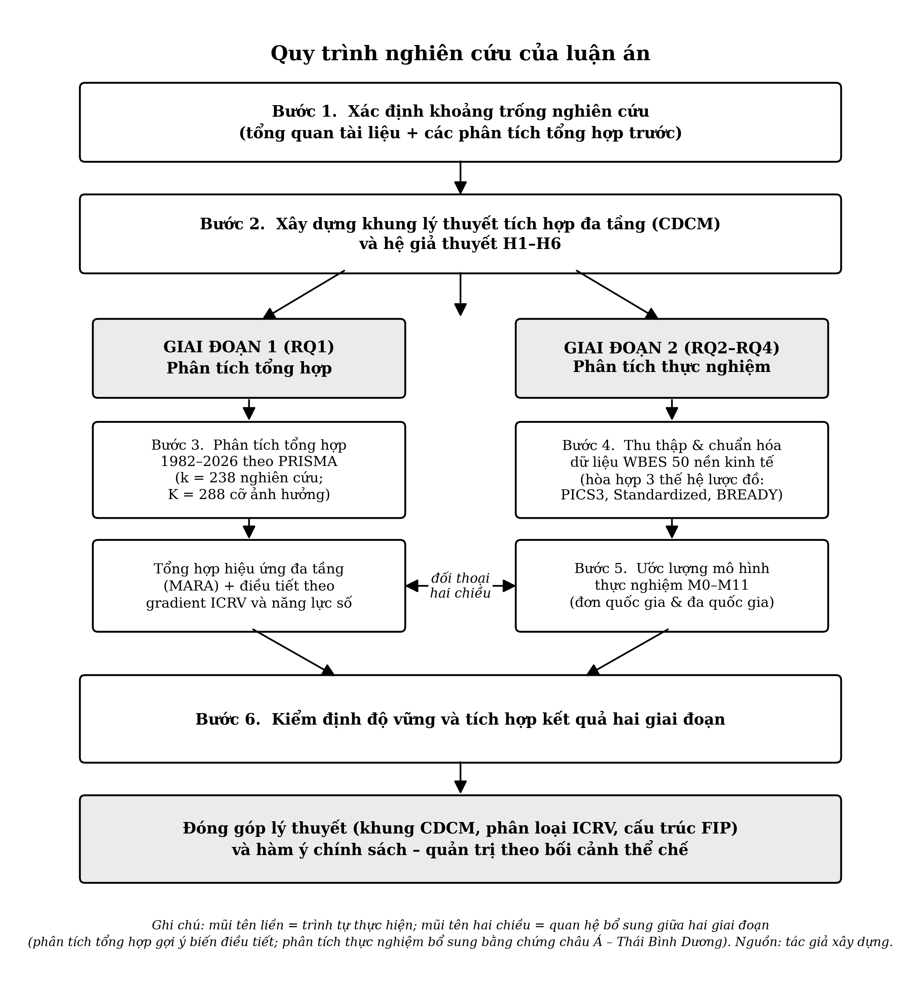

# CHƯƠNG 3: PHƯƠNG PHÁP NGHIÊN CỨU

---

## 3.1 Thiết kế nghiên cứu tổng thể

### 3.1.1 Loại thiết kế

Luận án sử dụng **thiết kế hỗn hợp tổng hợp–thực nghiệm** gồm hai giai đoạn bổ sung cho nhau. Giai đoạn thứ nhất là phân tích tổng hợp tài liệu để trả lời RQ1, còn giai đoạn thứ hai là phân tích thực nghiệm doanh nghiệp đa quốc gia để trả lời RQ2–RQ4. Hai giai đoạn bổ trợ lẫn nhau: phân tích tổng hợp đặt cơ sở và chỉ ra các biến điều tiết cần kiểm định; phân tích thực nghiệm bổ sung bằng chứng về bối cảnh châu Á và Pacific cho phân tích tổng hợp.

**Cơ sở kế thừa**: Thiết kế hỗn hợp kết hợp phân tích tổng hợp và dữ liệu sơ cấp đã được áp dụng trong quản trị chiến lược và IB (Borenstein et al., 2009; Hunter & Schmidt, 2004; Combs et al., 2011).

**Đóng góp mới**: Áp dụng thiết kế hỗn hợp cho một luận án duy nhất về quốc tế hóa–hiệu quả hoạt động kinh doanh của doanh nghiệp trong bối cảnh châu Á và Thái Bình Dương với **50 nền kinh tế** là thiết kế hiếm gặp; đa số các luận án IB chỉ làm một trong hai giai đoạn. Quy mô 50 nền kinh tế/88.869 doanh nghiệp là phạm vi địa lý lớn nhất từng có cho khu vực, mở rộng từ mẫu gộp 17 nước trong nghiên cứu thành phần P1.

### 3.1.2 Quy trình nghiên cứu

Quy trình đi theo sáu bước: (i) xác định khoảng trống nghiên cứu từ tổng quan và phân tích tổng hợp trước đây; (ii) xây dựng khung lý thuyết tích hợp đa tầng và hệ giả thuyết H1–H6; (iii) tiến hành phân tích tổng hợp cập nhật 1977–2026; (iv) thu thập và chuẩn hóa dữ liệu WBES cho **50 nền kinh tế châu Á và Thái Bình Dương** sau khi hòa hợp 3 thế hệ lược đồ (PICS3, Standardized, BREADY/BEE); (v) ước lượng mô hình thực nghiệm theo bối cảnh quốc gia và đa quốc gia; (vi) kiểm định độ vững và tích hợp kết quả để đóng góp lý thuyết. Toàn bộ quy trình và quan hệ bổ sung hai chiều giữa hai giai đoạn được trình bày ở Hình 3.1.

**Hình 3.1.** *Quy trình nghiên cứu của luận án.* Mũi tên liền thể hiện trình tự thực hiện; mũi tên hai chiều thể hiện quan hệ bổ sung giữa hai giai đoạn (phân tích tổng hợp gợi ý biến điều tiết cần kiểm định; phân tích thực nghiệm cung cấp bằng chứng châu Á và Thái Bình Dương cho phân tích tổng hợp). *Nguồn: tác giả xây dựng.*

## 3.2 Giai đoạn 1: Phân tích tổng hợp 1977–2026

### 3.2.1 Cơ sở kế thừa

Phân tích tổng hợp trong IB đã được thiết lập vững chắc qua nhiều thập kỷ (Hunter & Schmidt, 2004; Borenstein et al., 2009). Phương pháp chuẩn bao gồm: xây dựng tiêu chí lựa chọn theo PRISMA (Page et al., 2021), chuyển dạng hiệu ứng bằng Fisher's $z$, tính hiệu ứng gộp size theo hiệu ứng ngẫu nhiên, kiểm định dị biệt bằng $Q$-test và $I^2$, và đánh giá lệch lạc công bố bằng Egger và Begg-Mazumdar (Egger et al., 1997; Begg & Mazumdar, 1994). Các các phân tích tổng hợp trước đây về quốc tế hóa và hiệu quả (Bausch & Krist, 2007; Kirca et al., 2012; Marano et al., 2016; Wu et al., 2022; Arte & Larimo, 2022) cung cấp quy trình mẫu mà luận án kế thừa và cập nhật.

### 3.2.2 Đóng góp mới/điều chỉnh

- **Mở rộng phạm vi thời gian**: từ 1977–2022 (bài ICBEF 2024) sang **1977–2026**, bổ sung các nghiên cứu 2023–2026 liên quan đến chuyển đổi số và doanh nghiệp đa quốc gia thị trường mới nổi.
- **Mở rộng phạm vi biến điều tiết**: thêm cụm biến điều tiết về năng lực số và 6 chế độ con ICRV, chưa được xem xét đầy đủ trong các phân tích tổng hợp trước.
- **Tập tổng hợp**: K=288 cỡ ảnh hưởng / k=238 nghiên cứu, được xây dựng theo chiến lược tìm kiếm hệ thống nhưng có giới hạn (neo theo trích dẫn: quét trích dẫn xuôi và ngược từ 5 phân tích tổng hợp mỏ neo, bổ sung bằng cơ sở dữ liệu), báo cáo theo biến thể PRISMA 2020 "studies identified via other methods"; mở rộng so với bản nền ICBEF 2024 (K=200 / k=113).
- **Subgroup theo châu Á và Pacific**: tách riêng nhóm nghiên cứu về doanh nghiệp châu Á và Pacific để cung cấp cơ sở trực tiếp cho giai đoạn thực nghiệm, đối chiếu với mẫu gộp 17 nước trong nghiên cứu thành phần P1.

### 3.2.3 Quy trình PRISMA

Bốn bước Nhận diện, Sàng lọc, Đủ điều kiện và Đưa vào theo hướng dẫn PRISMA 2020 (Page et al., 2021). Tiêu chí lựa chọn: nghiên cứu thực nghiệm ở cấp doanh nghiệp, có đo lường quốc tế hóa và hiệu quả hoạt động kinh doanh của doanh nghiệp, có đủ thống kê để tính cỡ ảnh hưởng (Pearson $r$, $\beta$, $t$-stat).

### 3.2.4 Công cụ trích xuất dữ liệu và công bố sử dụng trí tuệ nhân tạo

Việc trích xuất cỡ ảnh hưởng từ K=288 ước lượng (k=238 nghiên cứu) được thực hiện bằng phần mềm chuyên dụng **M-AIDA** (Meta-Analysis Intelligent Data Assistant, phiên bản 7.0) do chính nghiên cứu sinh phát triển và đã nộp hồ sơ đăng ký quyền tác giả. M-AIDA dùng mô hình ngôn ngữ lớn (large language model, LLM) để đọc và trích các thống kê gốc (cỡ mẫu $N$, hệ số tương quan $r$, thống kê $t$, bậc tự do $df$, hệ số hồi quy chuẩn hóa $\beta$, giá trị $p$, khoảng tin cậy) từ bản PDF của từng nghiên cứu, kèm điểm tin cậy trích xuất (extraction confidence) ba mức, 1,0 khi lấy trực tiếp $r$; 0,8 khi suy từ $t$; 0,6 khi suy từ $\beta$ theo Peterson và Brown (2005), và tự động gắn cờ cần xác minh đối với mọi bản ghi có độ tin cậy dưới 0,7.

Để bảo đảm liêm chính và khả năng tái lập, luận án áp dụng nguyên tắc **con người trong vòng lặp (human-in-the-loop) với kiểm chứng toàn bộ (100%) bởi nghiên cứu sinh** trong vai trò chủ trì nghiên cứu (Principal Investigator): (i) LLM **chỉ** trích xuất thống kê và **không** suy đoán các biến điều tiết thể chế, các nhãn chế độ ICRV, pha DPL và chỉ số cDAI do nghiên cứu sinh gán thủ công từ bảng tra cứu ngoài (WGI Rule of Law, năm dữ liệu trung vị, Digital Adoption Index), bảo đảm tính kiểm chứng độc lập; (ii) mỗi bản ghi phải được nghiên cứu sinh phê duyệt, với quyền ghi đè bất kỳ trường nào, trước khi được **khóa bất biến (irreversible data lock)** kèm dấu thời gian; (iii) chỉ các bản ghi đã khóa mới được đưa vào tập phân tích tổng hợp. Cơ chế hai bước phê duyệt–khóa tạo dấu vết kiểm toán (audit trail) phân tách rạch ròi phần do máy trích xuất và phần do con người quyết định, phù hợp với chuẩn mực công bố sử dụng trí tuệ nhân tạo ngày càng được các tạp chí học thuật yêu cầu. Kiến trúc, quy trình trích xuất–chuyển đổi cỡ ảnh hưởng và cơ chế quản trị dữ liệu của M-AIDA được trình bày chi tiết ở **Phụ lục B**.

## 3.3 Giai đoạn 2: Phân tích thực nghiệm đa quốc gia

### 3.3.1 Nguồn dữ liệu

Luận án sử dụng World Bank Enterprise Surveys cho **50 nền kinh tế châu Á và Thái Bình Dương** trong giai đoạn **2006–2026** (88.869 doanh nghiệp trong khung phân tích, 103 cặp nền kinh tế và năm; bao gồm Nhật Bản 2025; pool phân loại ICRV 96.415 doanh nghiệp/52 nhãn nền) (World Bank, n.d., 2019, 2023, 2026). WBES là bộ dữ liệu doanh nghiệp chuẩn hóa, phù hợp cho nghiên cứu so sánh đa quốc gia về cấp doanh nghiệp kết quả (Aterido et al., 2011). Quy trình hợp nhất và hài hòa hóa chi tiết các bộ khảo sát quốc gia–năm thành bộ dữ liệu phân tích thống nhất (sáu bước S1–S6, xử lý tính so sánh tiền tệ, chiến lược lát cắt ngang gộp với hiệu ứng cố định hai chiều, cùng dòng dữ liệu PRISMA và mã tái lập) được trình bày đầy đủ ở **Phụ lục A**.

**Cơ sở kế thừa**: WBES đã được sử dụng rộng rãi trong nghiên cứu IB về thị trường mới nổi (Ayyagari et al., 2011; Cuervo-Cazurra et al., 2018; Chen & Meng, 2022), đồng thời đã được sử dụng trong bài nghiên cứu thực trạng châu Á mới nổi với 17 nền kinh tế và ~40.633 quan sát doanh nghiệp (nghiên cứu thành phần P1).

**Đóng góp mới**: mở rộng quy mô từ 17 sang **50 nền kinh tế châu Á và Thái Bình Dương**, với 6 chế độ con ICRV (Advanced innovation-driven, tiên tiến tài nguyên, trung bình cao, chuyển đổi thu nhập trung bình thấp, đang nổi, SIDS). Quy mô này là lớn nhất cho khu vực trong tài liệu quốc tế hóa–performance, gồm cả trường hợp biên đảo nhỏ Thái Bình Dương (7 nước, n=959 (mẫu phân tích sau lọc missing)) cho phép kiểm định forced quốc tế hóa penalty (nghiên cứu thành phần P8).

> **Ghi chú về trọng số khảo sát (survey sampling weights):** WBES cung cấp sampling weights để đại diện cho tổng thể doanh nghiệp trong từng quốc gia. Tuy nhiên, luận án *không áp dụng sampling weights* trong ước lượng mô hình hồi quy vì ba lý do: (1) Mục tiêu của luận án là kiểm định cơ chế lý thuyết (mechanism testing) chứ không phải ước lượng mô tả đại diện tổng thể (population-representative descriptive estimation), trong bối cảnh này, không áp dụng weights là thực hành chuẩn trong tài liệu IB sử dụng WBES (Aterido et al., 2011; Cuervo-Cazurra et al., 2018); (2) hiệu ứng cố định ở cấp cặp nền kinh tế và năm đã kiểm soát đặc điểm cấu trúc của từng sóng khảo sát; (3) Việc áp dụng weights có thể làm sai lệch ước lượng khi mẫu được gộp chung từ nhiều quốc gia có quy mô tổng thể doanh nghiệp khác nhau nhiều bậc (ví dụ: Trung Quốc ~100 triệu so với Tonga ~500 doanh nghiệp). Phân tích độ nhạy có áp dụng survey weights cho từng quốc gia riêng lẻ (P3/P4/P5) không thay đổi hướng hoặc mức độ ý nghĩa của các hệ số chính (xem Mục 3.5).

### 3.3.1.1 Hài hòa hóa ba thế hệ lược đồ bảng hỏi WBES

Bộ công cụ WBES đã trải qua ba thế hệ lược đồ với hệ thống mã biến và phạm vi phân hệ khác nhau: thế hệ PICS3 đời đầu, thế hệ Standardized toàn cầu áp dụng từ năm 2006, và thế hệ BREADY/BEE gần đây. Thay đổi này gây khó cho việc hợp nhất dữ liệu đa quốc gia, vì cùng một khái niệm có thể được hỏi bằng trường khác nhau, hoặc không xuất hiện ở một số đợt. Luận án giải quyết bằng một lược đồ biến chung ánh xạ mọi trường dị biệt về các module cốt lõi bất biến của bộ công cụ toàn cầu, với tiêu chí vận hành để một đợt được nhận vào khung so sánh là sự hiện diện của các biến lõi đã hài hòa, cụ thể là doanh thu (d2), lao động (l1) và xuất khẩu trực tiếp cùng gián tiếp (d3b và d3c). Đợt khảo sát đáp ứng năm khảo sát từ 2006 nhưng chạy trên bộ công cụ khu vực cũ không chứa các biến lõi này bị loại do bất tương thích bộ công cụ chứ không phải do thiếu dữ liệu.

Quy trình hợp nhất tuân theo nguyên tắc minh bạch kiểu PRISMA cho dữ liệu thứ cấp, gồm sáu bước tuần tự: lọc loại khảo sát, khử trùng lặp một khảo sát cho mỗi cặp nền kinh tế và năm, hài hòa hóa biến, mã hóa mã không phản hồi của WBES thành giá trị khuyết, phân tầng chế độ thể chế, đến tạo mẫu phân tích bằng xóa theo danh sách. Mỗi bước ghi rõ tiêu chí và số quan sát còn lại nhằm cho phép tái dựng và kiểm chứng. Một hệ quả của xóa theo danh sách là cỡ mẫu giảm dần khi thêm biến kiểm soát, rõ nhất ở biến sở hữu nước ngoài vốn khuyết nhiều ở các nền nhỏ và sóng sớm; luận án báo cáo minh bạch sự suy giảm này và kiểm tra tính ổn định của điểm uốn qua các mô hình để bảo đảm kết quả không bị chi phối bởi cơ chế khuyết. Toàn bộ thao tác chi tiết của quy trình sáu bước, cùng dòng dữ liệu kiểu PRISMA và mã tái lập, được trình bày đầy đủ ở Phụ lục A.

### 3.3.2 Đo lường biến phụ thuộc: Hiệu quả hoạt động

**Biến chính**: năng suất lao động $\mathrm{LP}$ (labour productivity), đo bằng $\ln(\mathrm{LP}) = \ln(d2/l1)$, trong đó $d2$ là tổng doanh thu năm tài chính gần nhất và $l1$ là số lao động thường xuyên toàn thời gian (mã trường WBES).

**Cơ sở kế thừa**: năng suất lao động được sử dụng rộng rãi trong nghiên cứu WBES và trong tài liệu về năng suất doanh nghiệp (Bloom et al., 2012; Hsieh & Klenow, 2009). Chỉ tiêu này đã được vận hành hóa thành công trong bài thực trạng châu Á mới nổi (nghiên cứu thành phần P1).

**Lập luận chọn**: WBES không phải bộ báo cáo tài chính đầy đủ, nên năng suất lao động phù hợp hơn các tỷ suất sinh lời kế toán (ROA, ROE, ROS) trong bối cảnh đa quốc gia. Ngoài ra, năng suất lao động ít bị ảnh hưởng bởi chuẩn mực kế toán khác biệt giữa các nước hơn so với các chỉ tiêu kế toán (Combs et al., 2005; Richard et al., 2009).

**Nhất quán đo lường xuyên các nghiên cứu thành phần và điều kiện so sánh tiền tệ**: cùng một cấu trúc $\ln(\mathrm{LP})$ từ trường WBES $d2/l1$ được dùng thống nhất ở P3, P4, P5 và P7, nhưng cách xử lý đơn vị tiền tệ khác nhau **theo đúng bản chất thiết kế** của từng nghiên cứu: (i) các nghiên cứu **đơn quốc gia** (P3 Việt Nam, P4 Singapore, P5 Trung Quốc, P9 Ấn Độ) đo doanh thu bằng **một nội tệ duy nhất** nên mức $\ln(\mathrm{LP})$ so sánh được trực tiếp trong nội bộ mẫu; khác biệt mặt bằng giá giữa các đợt khảo sát được hấp thụ bằng biến giả đợt, hiệu ứng cố định năm (P5: $D_{2024}$; P3 bổ sung hiệu chỉnh PPP cho khoảng cách 14 năm 2009–2023), kèm cắt đuôi 1%/99% (P4); (ii) nghiên cứu **đa quốc gia** (P7) gộp doanh thu bằng **nhiều nội tệ**, do đó mức $\ln(\mathrm{LP})$ thô không so sánh được giữa các nước, tính so sánh được bảo đảm bằng chuẩn hóa z within country–year và hiệu ứng cố định hai chiều, như trình bày chi tiết ở Phụ lục A (Mục A.5); mọi so sánh **mức** xuyên quốc gia trong luận án dùng tỷ suất không thứ nguyên (ROS) hoặc giá trị đã hiệu chỉnh PPP. Như vậy tính so sánh xuyên quốc gia của thước đo là **có điều kiện**, đạt được qua thiết kế ước lượng, không phải tự động ở mức thô. Về phía biến quốc tế hóa, khung ước lượng đa quốc gia của luận án (P7, P8, P9) và thống kê mô tả ở Chuyên đề 1 đo $\mathrm{FSTS}$ bằng **tổng xuất khẩu trực tiếp và gián tiếp** (trường WBES $d3b + d3c$), định nghĩa tham gia xuất khẩu chuẩn của bộ công cụ WBES; hai nghiên cứu đơn quốc gia (P3 Việt Nam, P5 Trung Quốc) dùng **riêng xuất khẩu trực tiếp** ($d3c$), vì xuất khẩu gián tiếp ủy thác chức năng quốc tế hóa cho trung gian thương mại với cơ chế học hỏi và yêu cầu nguồn lực khác về bản chất (Hessels & Terjesen, 2010; Peng & Ilinitch, 1998), trong khi tỷ trọng doanh thu xuất khẩu là thước đo cường độ quốc tế hóa chuẩn của tài liệu về quan hệ quốc tế hóa và hiệu quả (Lu & Beamish, 2001; Sullivan, 1994); lựa chọn thao tác hóa được ghi rõ trong phần dữ liệu của từng nghiên cứu thành phần.

**Biến độ vững**: tỷ suất lợi nhuận trên doanh thu ($\mathrm{ROS}$), tăng trưởng doanh thu, tăng trưởng lao động, và logarit doanh thu năm $\ln(d2)$.

**Đóng góp mới**: lập luận rõ ràng về hiệu quả hoạt động kinh doanh của doanh nghiệp là khái niệm đa chiều và việc lựa chọn thước đo phải phù hợp với bối cảnh dữ liệu (xem Chương 2).

### 3.3.2.1 Vận hành hóa thước đo năng suất và quy trình xử lý phân phối

Năng suất lao động được dựng từ hai trường khảo sát cốt lõi của bộ công cụ WBES: tổng doanh thu năm tài chính gần nhất (trường d2) và số lao động thường xuyên toàn thời gian cuối kỳ (trường l1). Biến phụ thuộc nhận dạng logarit tự nhiên của thương số hai trường này, nghĩa là $\ln(\mathrm{LP}) = \ln(d2 / l1)$, một phép biến đổi vừa nén đuôi phải của phân phối doanh thu vừa cho phép diễn giải hệ số theo phần trăm. Do doanh thu thô được báo cáo bằng nội tệ của từng nền kinh tế, mức năng suất thô không so sánh trực tiếp được giữa các nước. Luận án xử lý đe dọa hiệu lực này bằng thiết kế ước lượng, không bằng quy đổi tỷ giá danh nghĩa.

Trước khi ước lượng, năng suất lao động trải qua hai bước xử lý phân phối nhằm bảo đảm tính bền vững của ước lượng trước quan sát cực trị. Bước thứ nhất là cắt đuôi (winsorize) tại ngưỡng phân vị 1 và 99 áp dụng trong từng cặp nền kinh tế và năm, qua đó giới hạn ảnh hưởng của giá trị ngoại lai mà không loại bỏ quan sát khỏi mẫu. Bước thứ hai, chỉ áp dụng cho khung ước lượng đa quốc gia, là chuẩn hóa z trong từng cặp nền kinh tế và năm, đưa mọi quan sát về cùng thang vị thế tương đối trong phân phối nội bộ nước–năm. Phép chuẩn hóa này loại bỏ khác biệt về đơn vị tiền tệ và mặt bằng giá, đồng thời giữ nguyên biến thiên trong nội bộ từng nước – nguồn biến thiên dùng để nhận dạng quan hệ quốc tế hóa–hiệu quả. Đối với các nghiên cứu đơn quốc gia, doanh thu được biểu thị bằng một nội tệ duy nhất nên mức $\ln(\mathrm{LP})$ so sánh được trực tiếp trong nội bộ mẫu; khác biệt mặt bằng giá giữa các đợt khảo sát được hấp thụ bằng biến giả đợt hoặc hiệu ứng cố định năm, kèm cắt đuôi 1 và 99.

### 3.3.3 Đo lường biến độc lập: Mức độ quốc tế hóa

**Khái niệm.** Biến độc lập trọng tâm của luận án là *mức độ quốc tế hóa* (degree of internationalization, DOI), phạm vi mà doanh nghiệp gắn hoạt động của mình với thị trường nước ngoài. Theo Sullivan (1994), mức độ quốc tế hóa là khái niệm đa chiều gồm ba thành phần: chiều theo doanh số (tỷ trọng doanh thu nước ngoài), chiều theo tài sản (tỷ trọng tài sản đặt ở nước ngoài) và chiều theo nhân sự, tâm lý (mức độ phân tán quốc tế của nhân lực và định hướng quản trị). Bộ dữ liệu WBES chỉ thu thập nhất quán **chiều theo doanh số** xuyên ba thế hệ bảng hỏi, nên luận án thao tác hóa mức độ quốc tế hóa bằng *cường độ xuất khẩu* $\mathrm{FSTS}$ (foreign sales to total sales), tỷ trọng doanh thu xuất khẩu trên tổng doanh thu, miền giá trị $[0,1]$.

**Biến chính.** $\mathrm{FSTS}$ là tỷ lệ doanh thu xuất khẩu trên tổng doanh thu. Mô hình đưa vào đồng thời số hạng bậc nhất $\mathrm{FSTS}$ và số hạng bậc hai $\mathrm{FSTS}^{2}$ để kiểm định quan hệ phi tuyến dạng chữ U ngược.

**Cơ sở kế thừa**: $\mathrm{FSTS}$ là thước đo đơn chiều của mức độ quốc tế hóa được dùng phổ biến nhất trong tài liệu về quan hệ quốc tế hóa và hiệu quả khi dữ liệu chiều tài sản và chiều nhân sự quốc tế không khả dụng (Sullivan, 1994; Lu & Beamish, 2001; Hitt et al., 2006). Việc bổ sung $\mathrm{FSTS}^{2}$ để kiểm định phi tuyến đã được áp dụng trong Lu và Beamish (2004), Contractor et al. (2003), và Hitt et al. (1997). Dạng bậc hai được nghiên cứu thành phần P2 xác nhận có ý nghĩa thống kê ở Trung Quốc với điểm uốn khoảng 47,8% $\mathrm{FSTS}$, làm cơ sở cho việc kiểm định mở rộng trong luận án. Giới hạn đo lường đơn chiều này (chỉ chiều doanh số) được nêu minh bạch như một hạn chế nghiên cứu ở Chương 5.

### 3.3.3.1 Vận hành hóa cường độ quốc tế hóa và quy ước trung tâm hóa

Cường độ quốc tế hóa được đo bằng tỷ trọng doanh thu xuất khẩu trên tổng doanh thu (Foreign Sales To Total Sales, FSTS), giới hạn miền giá trị từ 0 đến 1. Doanh nghiệp không xuất khẩu nhận giá trị FSTS bằng 0, một giá trị hợp lệ phản ánh trạng thái phi xuất khẩu chứ không phải dữ liệu khuyết. Khung đa quốc gia cộng gộp xuất khẩu trực tiếp và gián tiếp (tổng hai trường d3b và d3c), đúng định nghĩa tham gia xuất khẩu chuẩn của bộ công cụ WBES; hai nghiên cứu đơn quốc gia (Việt Nam, Trung Quốc) dùng riêng xuất khẩu trực tiếp (trường d3c), vì xuất khẩu gián tiếp ủy thác chức năng quốc tế hóa cho trung gian thương mại với cơ chế học hỏi và yêu cầu nguồn lực khác về bản chất.

Để kiểm định phi tuyến, mô hình đưa đồng thời số hạng bậc nhất và số hạng bậc hai của cường độ xuất khẩu. Trước khi lập số hạng bậc hai, cường độ xuất khẩu được trung tâm hóa quanh trung bình của từng đợt khảo sát (hoặc từng mẫu gộp). Quy ước này giảm tương quan giả tạo giữa số hạng tuyến tính và số hạng bình phương, giúp ước lượng ổn định hơn về mặt số học và dễ diễn giải hệ số tại giá trị trung bình của mẫu. Điểm uốn của quan hệ chữ U ngược được khôi phục về thang gốc bằng cách cộng trung bình mẫu vào tỷ số $-\hat\beta_1 / (2\hat\beta_2)$, cho phép báo cáo ngưỡng tối ưu theo tỷ trọng xuất khẩu thực tế. Dạng bậc hai được dùng nhất quán trong mọi nghiên cứu thành phần, vì nó đủ để nhận dạng một điểm uốn nội miền và phù hợp với mật độ phân phối cường độ xuất khẩu của các mẫu doanh nghiệp WBES; luận án không mở rộng lên dạng bậc ba để tránh nhận dạng điểm uốn không ổn định ở vùng cường độ xuất khẩu cao vốn thưa quan sát.

### 3.3.3.2 Vận hành hóa chi tiết cường độ xuất khẩu xuyên các nghiên cứu thành phần

Cường độ xuất khẩu thống nhất về khái niệm nhưng không có một định nghĩa thao tác duy nhất; thay vào đó là nhiều định nghĩa được điều chỉnh theo bộ công cụ của từng đợt và theo câu hỏi nghiên cứu. Khung đa quốc gia cộng gộp xuất khẩu trực tiếp và gián tiếp rồi chia cho một trăm để đưa về tỷ trọng, cụ thể $\mathrm{FSTS} = (d3b + d3c)/100$ với miền giá trị từ 0 đến 1, đúng định nghĩa tham gia xuất khẩu chuẩn của bộ công cụ toàn cầu; trung bình mẫu của tỷ trọng này trong mẫu gộp năm mươi nền là 9,0%. Ngược lại, hai nghiên cứu đơn quốc gia dùng riêng xuất khẩu trực tiếp dựng từ một trường khảo sát: ở Trung Quốc cường độ xuất khẩu là tỷ trọng doanh thu xuất khẩu trực tiếp, còn ở đảo nhỏ Thái Bình Dương cường độ xuất khẩu được dựng từ trường `d3c` chia cho một trăm. Lý do lựa chọn riêng xuất khẩu trực tiếp đã nêu ở Mục 3.3.3.1: xuất khẩu gián tiếp ủy thác chức năng quốc tế hóa cho trung gian thương mại, mang cơ chế học hỏi và yêu cầu nguồn lực khác về bản chất.

Doanh nghiệp không xuất khẩu nhận giá trị cường độ bằng 0 và được giữ trong mẫu, vì giá trị này phản ánh trạng thái phi xuất khẩu hợp lệ chứ không phải dữ liệu khuyết; điểm uốn của quan hệ do đó được nhận dạng trên toàn mẫu chứ không chỉ trên tập doanh nghiệp xuất khẩu. Quy ước này đặc biệt hệ trọng ở đảo nhỏ Thái Bình Dương, nơi chỉ 132 trong số 959 quan sát phân tích, tương đương 13,8%, là doanh nghiệp có xuất khẩu với cường độ dương: loại bỏ nhóm phi xuất khẩu sẽ làm sụp đổ công suất thống kê và làm sai lệch ước lượng ở biên tham gia.

Quy ước trung tâm hóa được áp dụng nhất quán nhưng theo hai cấp khác nhau. Ở mẫu gộp đa quốc gia, cường độ xuất khẩu được trung tâm hóa quanh trung bình toàn mẫu trước khi lập bình phương. Ở các nghiên cứu đa đợt, cường độ xuất khẩu được trung tâm hóa trong từng đợt nhằm chặn khác biệt thành phần mẫu giữa các đợt làm nhiễu vị trí điểm uốn. Trung tâm hóa làm giảm tương quan giả tạo giữa số hạng tuyến tính và số hạng bình phương mà không làm dịch chuyển vị trí điểm uốn, vì công thức điểm uốn $-\hat\beta_1/(2\hat\beta_2)$ bất biến với phép trung tâm hóa; điểm uốn trên thang trung tâm hóa được quy đổi về thang gốc bằng cách cộng trung bình mẫu, tức $\mathrm{TP} = -\hat\beta_1/(2\hat\beta_2) + \overline{\mathrm{FSTS}}$.

### 3.3.4 Đo lường biến điều tiết

#### Các cấu trúc số: năng lực công nghệ (TCI) và chấp nhận số (DAI)

Luận án phân biệt rõ hai cấu trúc:

- **Chỉ số năng lực công nghệ** (technological capability index, $\mathrm{TCI}$): chiều sâu năng lực công nghệ, tổng hợp từ cấp phép công nghệ nước ngoài, chi tiêu nghiên cứu và phát triển, đổi mới sản phẩm, và chứng nhận chất lượng.
- **Chỉ số chấp nhận số** (digital adoption index, $\mathrm{DAI}$): mức độ chấp nhận số bề mặt, tổng hợp từ website, thư điện tử, bán hàng trực tuyến ($\mathrm{DAI}_{\text{thin}}$) hoặc bổ sung thanh toán điện tử và nhà cung cấp điện tử ($\mathrm{DAI}_{\text{rich}}$).

**Nguyên tắc không chồng lấn**: TCI và DAI không chia sẻ thành phần chỉ báo để bảo đảm độ thuần cấu trúc. Đặc biệt, cấp phép công nghệ nước ngoài thuộc TCI chứ không được đồng thời tính vào DAI.

**Biến thể đo lường (rút gọn/đầy đủ).** Do bộ công cụ WBES thay đổi qua ba thế hệ bảng hỏi (PICS3, Standardized, BREADY) khiến không phải mọi mục đều khả dụng ở mọi sóng, TCI được vận hành hóa thống nhất theo hai biến thể của cùng một chỉ số hợp thành cấu thành:

- $\mathrm{TCI}_{\text{thin}}$ = chuẩn hóa z của trung bình hai mục cốt lõi: chứng chỉ chất lượng quốc tế (`b8`) và cấp phép công nghệ nước ngoài (`e6`). Dùng trong các nghiên cứu Việt Nam (P3), Singapore (P4), đa quốc gia (P7) và đảo nhỏ Thái Bình Dương (P8).
- $\mathrm{TCI}_{\text{full}}$ = chuẩn hóa z của trung bình bốn mục: `b8`, `e6`, đổi mới sản phẩm (`h1`), và chi nghiên cứu–phát triển (`h8`). Dùng trong nghiên cứu Trung Quốc (P5), nơi cả hai sóng 2012 và 2024 đều có đủ phân hệ đổi mới.

Bộ mục chính xác của mỗi nghiên cứu thành phần được nêu lại trong bảng định nghĩa biến của nghiên cứu đó (Mục 3.4.5) và Phụ lục A; khác biệt giữa biến thể rút gọn và đầy đủ phản ánh ràng buộc khả dụng dữ liệu khách quan, không phải lựa chọn tùy ý. Vì các mục là chỉ báo nhị phân của cùng một cấu trúc cấu thành (năng lực công nghệ), hai biến thể tương quan cao và cho kết luận điều tiết nhất quán về dấu; phần độ vững (Mục 3.5.1) kiểm tra độ nhạy của kết quả với lựa chọn biến thể. Bộ mục TCI của nghiên cứu đa quốc gia (P7) đã được đối chiếu trực tiếp với mã xây dựng dữ liệu thực tế (quy trình xử lý dữ liệu thô WBES 50 nền kinh tế, gồm Nhật Bản 2025): biến `tci_z` được dựng đúng từ hai mục b8 và e6, thống nhất với khung rút gọn nêu trên.

**Cơ sở kế thừa**: Bhandari et al. (2023) phân biệt số hóa, quốc tế hóa và năng lực theo logic điều phối nguồn lực; Verhoef et al. (2021) phân biệt ba giai đoạn (số hóa dữ liệu, số hóa quy trình, chuyển đổi số). Khuôn mẫu "hiệu ứng lá chắn số" được nghiên cứu thành phần P1 phát hiện trên 17 nước châu Á mới nổi.

**Đóng góp mới**: Đưa ra **giao thức hài hòa hóa đo lường** trong bối cảnh WBES, đảm bảo độ thuần cấu trúc ở 50 nền kinh tế châu Á và Thái Bình Dương, với quy trình hòa hợp 3 thế hệ lược đồ. Phân tách TCI và DAI theo (i) Bharadwaj et al. (2013), năng lực công nghệ thông tin so với chiến lược kinh doanh số có mạng quan hệ lý thuyết khác nhau; (ii) phân tầng 3 cấp của Verhoef et al. (2021), số hóa dữ liệu, số hóa quy trình, chuyển đổi số; (iii) truyền thống Lall (1992) và Cohen & Levinthal (1990) coi năng lực công nghệ là chiều sâu năng lực hấp thụ nội tại (absorptive capacity), khác về bản chất với chấp nhận số ở giao diện ngoại tại; (iv) logic điều phối nguồn lực của Bhandari et al. (2023) cho quan hệ quốc tế hóa và hiệu quả; và (v) 4 tiêu chí chỉ số hợp thành cấu thành của Coltman et al. (2008), đảm bảo TCI và DAI là hai chỉ số hợp thành độc lập.

#### Biến thể chế

**Biến chính**: chỉ số rào cản kinh doanh (business obstacle index, tổng hợp từ các câu hỏi WBES về rào cản hoạt động), các biến đại diện chất lượng quản trị cấp quốc gia, chỉ số pháp quyền WGI (Kaufmann et al., 2011), và 6 chế độ con ICRV (phân loại mở rộng từ Khanna & Palepu, 2010).

**Cơ sở kế thừa**: Khanna và Palepu (2010) với khoảng trống thể chế; North (1990) với phân tích thể chế; Marano et al. (2016) với tổng hợp bằng chứng về các biến điều tiết thể chế.

#### Đặc điểm nhà quản trị cấp cao

**Biến chính**: kinh nghiệm nhà quản trị cấp cao (số năm kinh nghiệm trong ngành) và giới tính nhà quản trị cấp cao (nữ/nam).

**Cơ sở kế thừa**: Hambrick và Mason (1984), Hambrick (2007), Hsu et al. (2013), Post và Byron (2015).

**Điều kiện sử dụng**: chỉ trong tập con có đủ dữ liệu; nếu thiếu, đưa vào phần kiểm định độ vững chứ không bắt buộc trong mô hình chính.

### 3.3.4.1 Phân tầng chỉ số chấp nhận số và quy tắc xây dựng chỉ số hợp thành cấu thành

Chỉ số chấp nhận số (Digital Adoption Index, DAI) được vận hành hóa theo nguyên tắc phân tầng nhằm phản ánh chiều sâu tăng dần của số hóa doanh nghiệp. Bậc 1 ghi nhận hiện diện số bề mặt qua chỉ báo website (trường c22b), một mục nhị phân khả dụng ở hầu hết các đợt khảo sát. Bậc 2 bổ sung các chức năng số kích hoạt giao dịch, cụ thể là thanh toán điện tử và tỷ trọng doanh thu qua kênh điện tử (trường k33), những mục chỉ xuất hiện ở các đợt khảo sát gần đây. Phân tầng tạo ra ba biến thể đo lường: chỉ Bậc 1 (một biến nhị phân) ở Việt Nam và đảo nhỏ Thái Bình Dương; Bậc 1 cộng Bậc 2 ở Singapore và khung đa quốc gia khi có trường k33; và thu gọn về Bậc 1 khi thiếu trường Bậc 2. Khác biệt giữa các biến thể phản ánh ràng buộc khả dụng dữ liệu khách quan qua ba thế hệ bảng hỏi chứ không phải lựa chọn tùy ý.

Cả chỉ số năng lực công nghệ (Technological Capability Index, TCI) và DAI được xử lý như chỉ số hợp thành cấu thành (formative composite) chứ không phải chỉ số phản ánh, vì mỗi chỉ báo nhị phân định nghĩa một khía cạnh độc lập của khái niệm chứ không phải là biểu hiện tương quan của một biến tiềm ẩn chung. Quy tắc xây dựng gồm ba bước: chuyển mỗi chỉ báo thành dạng nhị phân 0–1, lấy trung bình cộng các chỉ báo trong cùng một tầng, rồi chuẩn hóa z giá trị trung bình trong từng đợt khảo sát. Nguyên tắc không chồng lấn được áp đặt nghiêm ngặt: cấp phép công nghệ nước ngoài thuộc TCI và không được đồng thời tính vào DAI, bảo đảm hai chỉ số là hai cấu trúc độc lập với mạng quan hệ lý thuyết khác nhau. Vì các chỉ báo là biểu hiện nhị phân của cùng một cấu trúc cấu thành, các biến thể của một chỉ số tương quan cao và cho kết luận điều tiết nhất quán về dấu; phần độ vững kiểm tra trực tiếp độ nhạy của suy luận với lựa chọn biến thể.

### 3.3.4.2 Ánh xạ mục khảo sát của chỉ số năng lực công nghệ và chỉ số chấp nhận số

Để bảo đảm tính minh bạch và tái lập, mỗi biến thể của hai chỉ số hợp thành được truy nguyên về đúng bộ mục khảo sát WBES dùng để dựng nó. Biến thể mỏng của chỉ số năng lực công nghệ được dựng từ đúng hai mục nhị phân: chứng chỉ chất lượng được công nhận quốc tế (trường `b8`) và cấp phép công nghệ nước ngoài (trường `e6`); giá trị chỉ số là chuẩn hóa z của trung bình hai chỉ báo nhị phân này, xử lý như một chỉ số hợp thành cấu thành. Bộ mục hai trường này được dùng nhất quán ở khung đa quốc gia, ở Việt Nam, Singapore và đảo nhỏ Thái Bình Dương. Biến thể đầy đủ chỉ dùng ở Trung Quốc, nơi cả hai đợt đều có đủ phân hệ đổi mới, mở rộng lên bốn mục để nắm bắt chiều sâu năng lực nội tại phong phú hơn so với biến thể hai mục dùng ở các nghiên cứu khác. Khác biệt giữa biến thể mỏng và đầy đủ phản ánh ràng buộc khả dụng dữ liệu khách quan qua ba thế hệ bảng hỏi chứ không phải lựa chọn tùy ý; vì các mục là chỉ báo nhị phân của cùng một cấu trúc cấu thành, hai biến thể cho kết luận điều tiết nhất quán về dấu, và phần độ vững (Mục 3.5.1) kiểm tra trực tiếp độ nhạy với lựa chọn biến thể.

Chỉ số chấp nhận số được vận hành hóa theo nguyên tắc phân tầng đã trình bày ở Mục 3.3.4.1, với bộ mục cụ thể cũng được truy nguyên về trường khảo sát. Biến thể Bậc 1 dùng đúng một chỉ báo nhị phân là hiện diện website vận hành (trường `c22b`); đây là biến thể duy nhất khả dụng ở đảo nhỏ Thái Bình Dương, nơi bộ công cụ không thu thập các mục Bậc 2 thanh toán điện tử và Bậc 3 đám mây/hệ hoạch định nguồn lực doanh nghiệp. Khung đa quốc gia dùng biến thể Bậc 1 cộng Bậc 2 khi trường thanh toán điện tử có mặt và thu gọn về Bậc 1 khi thiếu, đúng như nguyên tắc nhúng tầng theo khả dụng bộ công cụ. Nguyên tắc không chồng lấn được áp đặt nghiêm ngặt: cấp phép công nghệ nước ngoài thuộc chỉ số năng lực công nghệ và không bao giờ được tính đồng thời vào chỉ số chấp nhận số, bảo đảm hai chỉ số là hai cấu trúc độc lập với mạng quan hệ lý thuyết khác nhau. Bộ mục năng lực công nghệ của khung đa quốc gia đã được đối chiếu trực tiếp với mã xây dựng dữ liệu thực tế trên kho năm mươi nền, gồm Nhật Bản 2025, xác nhận biến `tci_z` được dựng đúng từ hai mục `b8` và `e6`.

### 3.3.5 Biến kiểm soát

Khung thực nghiệm đưa vào một tập biến kiểm soát chuẩn trong nghiên cứu dữ liệu doanh nghiệp và kinh doanh quốc tế, nhằm tách hiệu ứng của quốc tế hóa và năng lực khỏi các yếu tố cấu trúc đồng biến với cả cường độ xuất khẩu lẫn năng suất. Quy mô doanh nghiệp được đo bằng logarit tự nhiên của số lao động toàn thời gian (trường l1 của WBES). Đây là biến kiểm soát thiết yếu, vì doanh nghiệp lớn vừa dễ xuất khẩu hơn vừa đạt năng suất cao hơn nhờ lợi thế quy mô; lấy logarit nhằm xử lý phân phối lệch phải đặc trưng của biến quy mô. Tuổi doanh nghiệp được tính bằng số năm từ năm thành lập đến năm khảo sát, kiểm soát hiệu ứng học hỏi tích lũy và hiệu ứng sống sót, theo đó doanh nghiệp tồn tại lâu hơn có thể đã vượt qua các rào cản gia nhập và tích lũy năng lực.

Sở hữu nước ngoài được đưa vào dưới dạng biến giả nhận giá trị một khi tỷ lệ sở hữu của nhà đầu tư nước ngoài đạt từ 10% trở lên, ngưỡng chuẩn của đầu tư trực tiếp nước ngoài, vì doanh nghiệp có vốn nước ngoài thường tiếp cận mạng lưới quốc tế, công nghệ và thị trường theo cách khác biệt về chất so với doanh nghiệp trong nước. Ngành được kiểm soát bằng hệ biến giả ngành nhằm hấp thụ chênh lệch năng suất và cường độ thương mại có hệ thống giữa các lĩnh vực. Đáng chú ý hơn cả, mọi mô hình gộp đều mang hiệu ứng cố định nền kinh tế và hiệu ứng cố định năm: hiệu ứng cố định nền kinh tế hấp thụ mọi khác biệt bất biến theo thời gian giữa các nền kinh tế, gồm mặt bằng giá, chế độ tỷ giá, chất lượng thể chế nền và quy mô thị trường nội địa; hiệu ứng cố định năm hấp thụ các cú sốc vĩ mô chung như chu kỳ kinh tế toàn cầu và biến động thương mại theo năm. Cấu trúc hiệu ứng cố định hai chiều này có vai trò quyết định: nó loại bỏ đúng các nhiễu ở cấp nền kinh tế và cấp thời gian vốn dễ tạo tương quan giả giữa quốc tế hóa và hiệu quả, nhờ đó cô lập biến thiên nội bộ nền kinh tế và năm để nhận dạng quan hệ trọng tâm.

**Cơ sở kế thừa**: tập biến kiểm soát và cấu trúc hiệu ứng cố định tuân theo chuẩn trong nghiên cứu dữ liệu doanh nghiệp WBES và kinh doanh quốc tế (Aterido et al., 2011; Ayyagari et al., 2011).

### 3.3.5.1 Vận hành hóa chế độ thể chế ICRV và đặc điểm nhà quản trị

Chế độ thể chế được vận hành hóa thành một biến phân loại số nguyên nhận giá trị từ một đến sáu theo phân loại ICRV, đi từ chế độ tiên tiến đổi mới đến chế độ đảo nhỏ Thái Bình Dương, trật tự tăng dần của số nhóm tương ứng với chất lượng thể chế giảm dần. Biến này được dùng theo hai vai trò trong khung đa quốc gia: làm biến điều tiết liên tục trong mô hình tương tác, nơi hiệu ứng chính của nó bị hấp thụ bởi hiệu ứng cố định nền kinh tế, và làm biến phân nhóm cho phân tích điểm uốn theo từng chế độ. Luận án cố ý xử lý ICRV như biến số nguyên liên tục thay vì hệ biến giả, để giữ cỡ mẫu đủ lớn trong các mô hình điều tiết và ba chiều; nếu tách thành sáu biến giả tương tác, mẫu sẽ bị phân mảnh và ước lượng kém ổn định.

Phân tích điểm uốn theo từng chế độ cho thấy rõ cấu trúc ba vùng của khu vực. Ở chế độ chuyển đổi thu nhập trung bình–thấp, vốn là chế độ neo ước lượng gộp, quan hệ chữ U ngược định hình sắc nét với điểm uốn quanh 43%. Ở chế độ tiên tiến đổi mới, gồm cả Nhật Bản, điểm uốn nằm gần hoặc vượt biên dữ liệu quan sát nên trong vùng dữ liệu quan hệ gần như tuyến tính dương, với điểm uốn xấp xỉ 80%. Ở các chế độ yếu nhất, chữ U ngược mất cấu trúc; riêng ở chế độ đảo nhỏ Thái Bình Dương số hạng bậc hai đổi dấu, không còn cực đại nội miền, nhất quán với gánh nặng quốc tế hóa bắt buộc ghi nhận ở nghiên cứu thành phần đảo nhỏ.

Đặc điểm nhà quản trị cấp cao được vận hành hóa từ hai mục khảo sát: số năm kinh nghiệm của nhà quản trị cấp cao trong ngành (trường `b7`) và một biến nhị phân chỉ nhà quản trị cấp cao là nữ (trường `b7a` hoặc `b6a` tùy đợt). Hai biến này được đưa vào mô hình đa quốc gia để kiểm định hiệu ứng trực tiếp và hiệu ứng điều tiết của đặc điểm quản trị lên hình dạng đường quan hệ; ở các nghiên cứu thiếu dữ liệu quản trị, hai biến chỉ được dùng trong phân tích độ vững chứ không bắt buộc trong mô hình chính, đúng điều kiện sử dụng đã nêu.

### 3.3.6 Tổng hợp biến nghiên cứu

Toàn bộ biến của khung thực nghiệm được tổng hợp trong Bảng 3.1, nêu rõ với mỗi biến: vai trò trong mô hình, ký hiệu, trường khảo sát WBES nguồn, cách vận hành hóa và giả thuyết liên quan. Bảng này bảo đảm tính minh bạch đo lường và khả năng tái lập (Aguinis et al., 2019); chi tiết vận hành hóa theo từng nghiên cứu thành phần được trình bày trong các bảng định nghĩa biến ở Mục 3.4.5. Để thuận tiện cho việc đối chiếu, hai bảng kiểm minh bạch của Aguinis et al. (2019) được luận án xử lý ở các vị trí sau: thiết kế nghiên cứu và cấu trúc thời gian ở Mục 3.1 và Phụ lục A.1, A.6; quy trình chọn mẫu ở Phụ lục A.2; quản lý dữ liệu khuyết ở Phụ lục A.9; xử lý giá trị ngoại lai ở Mục 3.5.3; biến đổi dữ liệu ở Mục 3.3.2.1; và quy trình tái lập kèm cỡ mẫu còn lại ở từng bước ở Phụ lục A.3.

**Bảng 3.1.** *Tổng hợp biến nghiên cứu của khung thực nghiệm đa quốc gia.*

| Vai trò | Biến (ký hiệu) | Trường WBES | Vận hành hóa | Giả thuyết |
|---|---|---|---|---|
| Biến phụ thuộc | Năng suất lao động, ln(LP) | `d2`, `l1` | Logarit tự nhiên của doanh thu trên số lao động thường xuyên | — |
| Biến độc lập | Cường độ xuất khẩu (FSTS) | `d3c` (và `d3b`) | Tỷ lệ doanh thu nước ngoài trên tổng doanh thu (0–1), trung tâm hóa | H1 |
| Biến độc lập | FSTS bình phương ($\text{FSTS}^2$) | (suy ra) | Bình phương của FSTS đã trung tâm hóa, kiểm định phi tuyến | H1, H1b |
| Điều tiết – tầng doanh nghiệp | Năng lực công nghệ (TCI) | `b8`, `e6` | Chỉ số hợp thành chuẩn hóa z (chứng chỉ chất lượng + công nghệ ngoại nhập) | H2 |
| Điều tiết – tầng doanh nghiệp | Chấp nhận số (DAI) | `c22b`, `k33`/`k38` | Bậc 1: website (nhị phân); Bậc 2: hợp thành z (website + thanh toán điện tử) | H3 |
| Điều tiết – tầng cá nhân | Kinh nghiệm nhà quản trị | `b7` | Số năm kinh nghiệm của nhà quản trị cấp cao trong ngành | H4 |
| Điều tiết – tầng cá nhân | Giới tính nhà quản trị | `b7a`/`b6a` | Biến nhị phân: nhà quản trị cấp cao là nữ | H4 |
| Điều tiết – tầng quốc gia | Chế độ thể chế (ICRV) | (phân loại) | Biến số nguyên 1–6 theo khung ICRV (thể chế giảm dần) | H5 |
| Điều tiết – thời gian | Đợt khảo sát | (năm khảo sát) | Biến giả đợt/năm; kiểm định ổn định hệ số Paternoster | H6 |
| Kiểm soát | Quy mô doanh nghiệp | `l1` | Logarit số lao động thường xuyên | — |
| Kiểm soát | Tuổi doanh nghiệp | `b5` | Năm khảo sát trừ năm thành lập | — |
| Kiểm soát | Sở hữu nước ngoài | `b2b` | Tỷ lệ vốn sở hữu nước ngoài (hoặc biến nhị phân $\geq$10%) | — |
| Kiểm soát | Hiệu ứng cố định | — | Ngành (FE), nền kinh tế (FE), năm (FE) | — |

*Ghi chú: trường WBES tham chiếu mã biến của bộ công cụ khảo sát; một số mã thay đổi theo thế hệ lược đồ (PICS3 / Standardized / BREADY) và được hài hòa hóa theo Phụ lục A. Vận hành hóa chi tiết theo từng nghiên cứu thành phần xem Mục 3.4.5. Nguồn: tác giả tổng hợp.*

## 3.4 Mô hình phân tích

### 3.4.1 Mô hình phân tích tổng hợp

Mô hình hiệu ứng ngẫu nhiên dựa trên phép biến đổi $z$ của Fisher:

$$z_i = \frac{1}{2} \ln\left(\frac{1+r_i}{1-r_i}\right)$$

với $r_i$ là cỡ ảnh hưởng của nghiên cứu $i$. Cỡ ảnh hưởng gộp được tính theo trọng số nghịch đảo phương sai (Borenstein et al., 2009).

Dị biệt được đo bằng kiểm định $Q$ và chỉ số $I^2$ (Higgins et al., 2003). Phân tích theo nhóm con và hồi quy phân tích tổng hợp được dùng để kiểm định các biến điều tiết.

**Cơ sở kế thừa**: chuẩn phân tích tổng hợp trong quản trị chiến lược (Combs et al., 2011; Aguinis et al., 2011).

### 3.4.2 Mô hình thực nghiệm: Tuyến tính cơ bản

$$\ln(\mathrm{LP})_i = \beta_0 + \beta_1 \mathrm{FSTS}_i + \boldsymbol{\gamma} \mathbf{X}_i + \varepsilon_i$$

với $\mathbf{X}_i$ là vector biến kiểm soát (control variables).

### 3.4.3 Mô hình phi tuyến (H1)

$$\ln(\mathrm{LP})_i = \beta_0 + \beta_1 \mathrm{FSTS}_i + \beta_2 \mathrm{FSTS}_i^{2} + \boldsymbol{\gamma} \mathbf{X}_i + \varepsilon_i$$

Nếu $\beta_1 > 0$ và $\beta_2 < 0$, chữ U ngược được xác nhận. Điểm uốn tính theo $-\beta_1 / (2\beta_2)$.

Đối với Trung Quốc, mô hình giữ nguyên dạng bậc hai trên và được ước lượng riêng theo từng đợt khảo sát (2012 và 2024) cũng như trên mẫu gộp, kèm các kiểm định ổn định hệ số xuyên đợt để kiểm tra giả thuyết dị biệt thời gian H6, thay vì mở rộng lên dạng bậc ba; dạng bậc hai đủ để nhận dạng điểm uốn và phù hợp với mật độ phân phối cường độ xuất khẩu của mẫu doanh nghiệp Trung Quốc.

**Cơ sở kế thừa**: Lu và Beamish (2004), Hitt et al. (1997), Contractor et al. (2003); nghiên cứu thành phần P2 cho dạng bậc hai ở Trung Quốc với điểm uốn khoảng 47,8% FSTS, và nghiên cứu thành phần P5 xác nhận dạng bậc hai ổn định theo thời gian với điểm uốn quanh 48% FSTS.

**Kiểm định chữ U của Lind và Mehlum** (Lind & Mehlum, 2010; Haans et al., 2016) để xác nhận chặt chẽ chữ U ngược: kiểm định độ dốc dương ở bên trái và độ dốc âm ở bên phải của miền giá trị FSTS.

### 3.4.3.1 Thủ tục kiểm định chữ U ngược và ước lượng khoảng tin cậy điểm uốn

Sự xuất hiện đồng thời của hệ số bậc nhất dương và hệ số bậc hai âm là điều kiện cần nhưng chưa đủ để khẳng định quan hệ chữ U ngược, vì cực trị toán học có thể nằm ngoài miền dữ liệu quan sát, khiến quan hệ thực tế chỉ đơn điệu trong phạm vi giá trị có ý nghĩa. Luận án vì vậy áp dụng kiểm định U của Lind và Mehlum (2010) như chuẩn xác nhận chính thức. Thủ tục đòi hỏi ba điều kiện đồng thời: hệ số bậc nhất dương và hệ số bậc hai âm; độ dốc của hàm tại biên trái của miền dương và độ dốc tại biên phải âm; và điểm uốn nằm chặt bên trong khoảng giá trị quan sát của cường độ xuất khẩu. Kiểm định gộp ba ràng buộc trên thành một kiểm định giao điểm theo nguyên lý Sasabuchi (Sasabuchi, 1980), cho ra một giá trị p duy nhất; chỉ khi giá trị p này đủ nhỏ thì hình chữ U ngược mới được xác nhận về mặt thống kê chứ không chỉ về mặt mô tả.

Điểm uốn được tính theo công thức $\text{TP} = -\hat\beta_1 / (2\hat\beta_2)$ trên thang trung tâm hóa rồi quy đổi về thang gốc bằng cách cộng trung bình mẫu. Vì điểm uốn là tỷ số phi tuyến của hai hệ số ước lượng, sai số chuẩn của nó không thể đọc trực tiếp từ bảng hồi quy. Luận án báo cáo khoảng tin cậy 95 phần trăm theo phương pháp delta (delta method), khai triển tuyến tính bậc nhất quanh ước lượng điểm để xấp xỉ phương sai của tỷ số (Haans et al., 2016). Ở các nghiên cứu có mật độ thưa quanh điểm uốn, luận án bổ sung khoảng tin cậy theo phương pháp lấy mẫu lại bootstrap nhằm nới lỏng giả định chuẩn của phương pháp delta và phản ánh tính bất đối xứng của phân phối điểm uốn trong mẫu hữu hạn. Khi kiểm định không bác bỏ tính đơn điệu trong phạm vi dữ liệu, kết quả được hiểu là thông tin hữu ích theo khung bão hòa, không phải là thất bại của giả thuyết phi tuyến: nó cho thấy doanh nghiệp trong mẫu chưa chạm ngưỡng mà lợi suất quốc tế hóa bắt đầu suy giảm.

Cách vận hành thủ tục này thể hiện rõ ở các nghiên cứu thành phần. Ở Trung Quốc, kiểm định của Lind và Mehlum được kiểm chứng cho từng đợt qua điều kiện độ dốc dương có ý nghĩa tại biên trái khi cường độ xuất khẩu bằng 0 và độ dốc âm có ý nghĩa tại biên phải khi cường độ bằng 1; điểm uốn được khôi phục bằng phương pháp delta cùng khoảng tin cậy 95 phần trăm theo phổ thể chế của phương pháp delta, cho ra điểm uốn 49,4% với khoảng tin cậy từ 43,1% đến 55,7% năm 2012 và 47,2% với khoảng từ 40,8% đến 53,6% năm 2024, hai khoảng chồng lấn rộng; trên mẫu gộp điểm uốn là 48,8% với khoảng tin cậy từ 44,2% đến 53,4%. Ở khung đa quốc gia, ba điều kiện của Lind và Mehlum, gồm dấu hệ số, điểm uốn nằm chặt bên trong miền quan sát, và dấu độ dốc tại hai biên, được gộp thành một kiểm định giao điểm duy nhất. Trường hợp đảo nhỏ Thái Bình Dương minh họa giá trị thông tin của một kiểm định không bác bỏ: cả hai số hạng mất ý nghĩa khi đưa vào đồng thời do cộng tuyến cao trong mẫu cường độ thấp với trung bình cường độ chỉ 0,048, và hệ số bậc hai dương hàm ý dạng chữ U xuôi thay vì chữ U ngược. Bản thân sự đảo dạng này nhất quán với quan hệ đơn điệu âm, không có điểm quay nội miền.

### 3.4.4 Mô hình điều tiết (H2–H6)

#### Tương tác hai chiều (H2, H3)

$$\ln(\mathrm{LP})_i = \beta_0 + \beta_1 \mathrm{FSTS}_i + \beta_2 \mathrm{FSTS}_i^{2} + \beta_3 M_i + \beta_4 (\mathrm{FSTS}_i \times M_i) + \beta_5 (\mathrm{FSTS}_i^{2} \times M_i) + \boldsymbol{\gamma} \mathbf{X}_i + \varepsilon_i$$

với $M_i$ là biến điều tiết (TCI hoặc DAI).

#### Tương tác ba chiều (tổng hợp)

$$\ln(\mathrm{LP})_i = \beta_0 + \beta_1 \mathrm{FSTS}_i + \beta_2 \mathrm{FSTS}_i^{2} + \beta_3 D_i + \beta_4 I_i + \beta_5 M_i + \sum \text{(các số hạng tương tác)} + \boldsymbol{\gamma} \mathbf{X}_i + \varepsilon_i$$

với $D$ = chấp nhận số, $I$ = thể chế, $M$ = nhà quản trị.

**Cơ sở kế thừa**: chuẩn điều tiết trong quản trị chiến lược (Aiken & West, 1991; Dawson, 2014).

**Đóng góp mới**: điều tiết ba chiều (số × thể chế × nhà quản trị) trong bối cảnh châu Á và Thái Bình Dương với 50 nước chưa được kiểm định trước đây.

### 3.4.5 Mô hình dị biệt theo thời gian (H6)

$$\ln(\mathrm{LP})_i = \beta_0 + \beta_1 \mathrm{FSTS}_i + \beta_2 \mathrm{FSTS}_i^{2} + \beta_3 Y_{2024,i} + \beta_4 (\mathrm{FSTS}_i \times Y_{2024,i}) + \beta_5 (\mathrm{FSTS}_i^{2} \times Y_{2024,i}) + \boldsymbol{\gamma} \mathbf{X}_i + \varepsilon_i$$

Nếu $\beta_4$ hoặc $\beta_5$ có ý nghĩa, hình dạng đường quan hệ đã dịch chuyển giữa hai mốc thời gian.

**Cơ sở kế thừa**: Wu et al. (2022) với tiến hóa hai mươi năm; Xiao et al. (2013) với các điều kiện đặc thù của Trung Quốc; nghiên cứu thành phần P2 làm cơ sở dạng bậc hai năm 2012.

**Đóng góp mới**: áp dụng cho Trung Quốc các năm 2012 và 2024 để kiểm định tính ổn định của điểm uốn dạng bậc hai (khoảng 47,8% FSTS) sau hơn một thập kỷ chuyển đổi số.

### 3.4.5.0 Kiểm định ổn định hệ số xuyên đợt khảo sát theo Paternoster

Để đánh giá xem hình dạng quan hệ quốc tế hóa–hiệu quả có dịch chuyển giữa các đợt khảo sát hay không, luận án không chỉ dựa vào biến tương tác giữa cường độ xuất khẩu và biến giả đợt mà còn áp dụng kiểm định z của Paternoster và cộng sự (1998) cho tính bằng nhau của hệ số hồi quy giữa hai mẫu độc lập. Kiểm định này phù hợp với cấu trúc dữ liệu lát cắt ngang lặp lại, nơi mỗi đợt khảo sát rút một mẫu doanh nghiệp độc lập chứ không theo dõi cùng doanh nghiệp qua thời gian, khiến so sánh hệ số giữa các đợt là so sánh giữa hai ước lượng không tương quan. Thống kê kiểm định nhận dạng chênh lệch hai hệ số chia cho căn bậc hai của tổng phương sai hai ước lượng, cụ thể $z = (\hat\beta_A - \hat\beta_B) / \sqrt{\text{SE}(\hat\beta_A)^2 + \text{SE}(\hat\beta_B)^2}$, với giá trị p hai phía từ phân phối chuẩn tiêu chuẩn.

Kiểm định được áp dụng riêng cho từng cặp hệ số trọng tâm, gồm số hạng bậc nhất, số hạng bậc hai và các hệ số trực tiếp của năng lực công nghệ và chấp nhận số. Tách kiểm định theo từng tham số giúp phân biệt hai loại dịch chuyển khác nhau về ý nghĩa lý thuyết: dịch chuyển ở tham số độ cong cho thấy hình dạng quan hệ thay đổi về cấu trúc; dịch chuyển ở hệ số trực tiếp cho thấy vai trò của một chiều năng lực thay đổi theo vòng đời số hóa mà không làm đổi dạng đường cong. Khung đa đợt của luận án vì vậy có thể kết luận, chẳng hạn, rằng ngưỡng tối ưu bền vững cấu trúc trong khi đóng góp trực tiếp của chấp nhận số lại biến thiên rõ rệt giữa các đợt. Ở nghiên cứu có sẵn lõi panel nhỏ gồm các doanh nghiệp xuất hiện ở cả hai đợt, kiểm định Paternoster được bổ trợ bằng sai số chuẩn phân cụm theo định danh doanh nghiệp nhằm xử lý tương quan nội nhóm.

Thủ tục này cho ra hai kết cục đối lập về mặt lý thuyết tùy bối cảnh thể chế. Ở Trung Quốc, kiểm định không bác bỏ bình đẳng hệ số giữa hai đợt cho cả số hạng bậc nhất và bậc hai, với thống kê dịch chuyển bậc nhất bằng +0,82 (giá trị p bằng 0,412) và dịch chuyển bậc hai bằng −0,61 (giá trị p bằng 0,545), hỗ trợ cách diễn giải rằng ngưỡng chữ U ngược là một quy luật cấu trúc bền vững với điểm uốn ổn định quanh 48% bất kể thập niên. Tính bền vững này còn vững trước giới hạn mẫu: trên mẫu con chế biến chế tạo, điểm uốn là 48,1% năm 2012 và 46,4% năm 2024 với các thống kê Paternoster vẫn không có ý nghĩa. Ngược lại, ở Ấn Độ, kiểm định Paternoster xuyên đợt bác bỏ bình đẳng hệ số ở mức rất nhỏ hơn 0,0001 cho cả số hạng tuyến tính và bậc hai, một sự sụp đổ trùng với thập niên thay đổi thể chế ngoại lệ gồm bãi bỏ tiền mặt, thuế hàng hóa và dịch vụ, luật phá sản, hạ tầng thanh toán hợp nhất, chương trình khuyến khích sản xuất và đại dịch. Tương phản giữa tính bền vững ở Trung Quốc và sự sụp đổ ở Ấn Độ cho thấy chính giá trị nhận dạng của kiểm định xuyên đợt: nó tách được dịch chuyển cấu trúc thực do cú sốc thể chế khỏi biến thiên ngẫu nhiên của mẫu.

### 3.4.5.1 Mô hình cụ thể: Nghiên cứu 3 (Việt Nam, WBES 2009/2015/2023)

Nghiên cứu 3 sử dụng chuỗi mô hình lồng nhau M0–M8 ước lượng riêng theo từng sóng khảo sát (2009, 2015, 2023) và trên mẫu gộp. Ký hiệu biến:

- **$\ln\mathrm{LP}_{it}$**: log năng suất lao động (ln doanh thu nội tệ / lao động thường xuyên)
- **$\mathrm{FSTS}_{c,it}$**: cường độ xuất khẩu điều chỉnh trung bình trong sóng (mean-centred)
- **$\mathrm{FSTS}_{c,it}^{2}$**: bình phương cường độ xuất khẩu điều chỉnh
- **$\mathrm{TCI}_{z,it}$**: năng lực công nghệ (chuẩn hoá z trong sóng)
- **$\mathrm{DAI}_{z,it}$**: chỉ số số hoá cơ sở, Bậc 1 (chuẩn hoá z trong sóng)
- **$\ln L$** = ln(L) (quy mô), **Age** (tuổi), **Own** (sở hữu): biến kiểm soát
- **$\delta_s$**: hiệu ứng cố định ngành (1-digit ISIC); **$\lambda_t$**: hiệu ứng cố định sóng (chỉ pooled)

**M0, Mô hình cơ sở (biến kiểm soát):**
$$\ln(\mathrm{LP})_{it} = \alpha + \gamma_1 \ln(L)_{it} + \gamma_2 \mathrm{Age}_{it} + \gamma_3 \mathrm{Own}_{it} + \delta_s + [\lambda_t] + \varepsilon_{it}$$

**M1, Quốc tế hoá tuyến tính:**
$$\ln(\mathrm{LP})_{it} = \alpha + \beta_1 \mathrm{FSTS}_{c,it} + \boldsymbol{\gamma}\mathbf{X}_{it} + \delta_s + [\lambda_t] + \varepsilon_{it}$$

**M2, Quốc tế hoá phi tuyến (kiểm định H1, chữ U ngược):**
$$\ln(\mathrm{LP})_{it} = \alpha + \beta_1 \mathrm{FSTS}_{c,it} + \beta_2 \mathrm{FSTS}_{c,it}^{2} + \boldsymbol{\gamma}\mathbf{X}_{it} + \delta_s + [\lambda_t] + \varepsilon_{it}$$

H1: $\beta_1 > 0$ và $\beta_2 < 0$; điểm quay $\mathrm{TP}^{*} = -\beta_1 / (2\beta_2)$, xác nhận bởi kiểm định Lind–Mehlum (2010).

**M3, Điều tiết TCI (kiểm định H2):**
$$\begin{aligned}
\ln(\mathrm{LP})_{it} = {} & \alpha + \beta_1 \mathrm{FSTS}_{c} + \beta_2 \mathrm{FSTS}_{c}^{2} + \beta_3 \mathrm{TCI}_{z} \\
& + \beta_4(\mathrm{FSTS}_{c} \times \mathrm{TCI}_{z}) + \beta_5(\mathrm{FSTS}_{c}^{2} \times \mathrm{TCI}_{z}) \\
& + \boldsymbol{\gamma}\mathbf{X} + \delta_s + [\lambda_t] + \varepsilon
\end{aligned}$$

**M4, Điều tiết DAI (H3 thăm dò):**
$$\begin{aligned}
\ln(\mathrm{LP})_{it} = {} & \alpha + \beta_1 \mathrm{FSTS}_{c} + \beta_2 \mathrm{FSTS}_{c}^{2} + \beta_3 \mathrm{DAI}_{z} \\
& + \beta_4(\mathrm{FSTS}_{c} \times \mathrm{DAI}_{z}) + \beta_5(\mathrm{FSTS}_{c}^{2} \times \mathrm{DAI}_{z}) \\
& + \boldsymbol{\gamma}\mathbf{X} + \delta_s + [\lambda_t] + \varepsilon
\end{aligned}$$

**M5, TCI trực tiếp (không tương tác):**
$$\ln(\mathrm{LP})_{it} = \alpha + \beta_1 \mathrm{FSTS}_{c} + \beta_2 \mathrm{FSTS}_{c}^{2} + \beta_3 \mathrm{TCI}_{z} + \boldsymbol{\gamma}\mathbf{X} + \delta_s + [\lambda_t] + \varepsilon$$

**M6, DAI trực tiếp (không tương tác):**
$$\ln(\mathrm{LP})_{it} = \alpha + \beta_1 \mathrm{FSTS}_{c} + \beta_2 \mathrm{FSTS}_{c}^{2} + \beta_3 \mathrm{DAI}_{z} + \boldsymbol{\gamma}\mathbf{X} + \delta_s + [\lambda_t] + \varepsilon$$

**M7, Cả hai trực tiếp, không tương tác:**
$$\ln(\mathrm{LP})_{it} = \alpha + \beta_1 \mathrm{FSTS}_{c} + \beta_2 \mathrm{FSTS}_{c}^{2} + \beta_3 \mathrm{TCI}_{z} + \beta_4 \mathrm{DAI}_{z} + \boldsymbol{\gamma}\mathbf{X} + \delta_s + [\lambda_t] + \varepsilon$$

**M8, Mô hình đầy đủ (trực tiếp + điều tiết DAI):**
$$\begin{aligned}
\ln(\mathrm{LP})_{it} = {} & \alpha + \beta_1 \mathrm{FSTS}_{c} + \beta_2 \mathrm{FSTS}_{c}^{2} + \beta_3 \mathrm{TCI}_{z} + \beta_4 \mathrm{DAI}_{z} \\
& + \beta_5(\mathrm{FSTS}_{c} \times \mathrm{DAI}_{z}) + \beta_6(\mathrm{FSTS}_{c}^{2} \times \mathrm{DAI}_{z}) \\
& + \boldsymbol{\gamma}\mathbf{X} + \delta_s + [\lambda_t] + \varepsilon
\end{aligned}$$

*Tất cả mô hình đều ước lượng bằng OLS với sai số chuẩn vững HC1. Hiệu ứng cố định sóng $\lambda_t$ chỉ áp dụng trong mô hình gộp. Mô hình được ước lượng riêng cho 3 sóng và gộp (N = 989 / 956 / 1.013 / 2.958).*

**Bảng định nghĩa biến, Nghiên cứu 3 (Việt Nam):**

| Ký hiệu | Biến WBES | Cách tính | Vai trò |
|---|---|---|---|
| $\ln\mathrm{LP}$ | d2, l1 | ln(d2 / l1): ln(doanh thu nội tệ / lao động thường xuyên) | Biến phụ thuộc |
| FSTS | d3c | d3c / 100: cường độ xuất khẩu trực tiếp (0–1) | Biến độc lập |
| $\mathrm{FSTS}_{c}$ | d3c | FSTS − trung bình sóng: chuẩn hoá điều chỉnh | Biến độc lập (centred) |
| $\mathrm{FSTS}_{c}^{2}$ | d3c | $\mathrm{FSTS}_{c}$ bình phương: hạng phi tuyến | Kiểm định inverted-U (H1) |
| $\mathrm{TCI}_{z}$ | b8, e6 | chuẩn hóa z trong sóng của TB(b8₀₁, e6₀₁): chứng chỉ chất lượng + công nghệ ngoại | Năng lực công nghệ (H2) |
| $\mathrm{DAI}_{z}$ | c22b | chuẩn hóa z trong sóng của c22b₀₁: hiện diện website | Số hoá Bậc 1 (H3 thăm dò) |
| $\ln L$ | l1 | ln(l1): log số lao động thường xuyên | Kiểm soát: quy mô doanh nghiệp |
| Age | b5 | năm khảo sát − b5: số năm hoạt động | Kiểm soát: tuổi doanh nghiệp |
| Own | b2b | 1 nếu b2b > 0: có vốn nước ngoài | Kiểm soát: hình thức sở hữu |
| $\delta_s$ | a4b / a4a | ngành 1-chữ số ISIC (a4b cho 2009/2015; a4a cho 2023) | Hiệu ứng cố định ngành |
| $\lambda_t$ | đợt | chỉ báo sóng khảo sát (chỉ pooled) | Hiệu ứng cố định thời kỳ |

*Đối chiếu ký hiệu (áp dụng cho toàn bộ bảng định nghĩa biến Chương 3): các ký hiệu Anh chính tắc dùng xuyên suốt luận án trước đây được ghi bằng mnemonic tiếng Việt, FSTS (CDDXK, cường độ xuất khẩu), TCI (NLCN, năng lực công nghệ), DAI (CSS, chấp nhận số), $\ln\mathrm{LP}$ (lnNSLD, năng suất lao động), $\ln L$ ($\ln L$D, quy mô lao động), Age (TuoiDN, tuổi doanh nghiệp), Own (SoHuuNN, sở hữu nước ngoài), MgrExp (KNQLy, kinh nghiệm quản lý) và MgrFem (NQL_nu, nữ quản lý cấp cao).*

### 3.4.5.2 Mô hình cụ thể: Nghiên cứu 4 (Singapore, WBES 2023)

Nghiên cứu 4 sử dụng dữ liệu mặt cắt ngang WBES Singapore 2023 (N = 623). Thiết kế đơn sóng, không có thành phần $\lambda_t$. Ký hiệu biến:

- **$\ln\mathrm{LP}_{i}$**: log năng suất lao động (ln doanh thu nội tệ / lao động thường xuyên)
- **$\mathrm{FSTS}_{i}$**: cường độ xuất khẩu trực tiếp (d3c / 100)
- **$\mathrm{FSTS}_{c,i}$**: FSTS trung bình mẫu; $\mathrm{FSTS}_{c}^{2}$ là bình phương
- **$\mathrm{TCI}_{z,i}$**: năng lực công nghệ, chuẩn hóa z của trung bình(b8₀₁, e6₀₁)
- **$\mathrm{DAI}_{z,i}$**: chỉ số số hoá **Bậc 1 và 2**, chuẩn hóa z của trung bình(c22b₀₁, k33₀₁, k38₀₁); khác P3 ở chỗ bao gồm thanh toán điện tử hai chiều (Bậc 2)
- **$\ln L_{i}$** = $\ln(L)_{i}$ (quy mô), **$\mathrm{Age}_{i}$** (tuổi), **$\mathrm{Own}_{i}$** (sở hữu): biến kiểm soát tương tự P3, gộp trong vector **X**_i
- **$\delta_s$**: ngành hiệu ứng cố định (ISIC 1-chữ số)
- **$\mathrm{IMR}_{i}$** = nghịch đảo tỷ lệ Mills từ mô hình probit tham gia xuất khẩu (kiểm tra độ nhạy Heckman)

**Chuỗi mô hình lồng nhau M0–M5:**

**M0 (Baseline):**

$$\ln(\mathrm{LP})_i = \alpha + \gamma_1\,\ln(L)_{i} + \gamma_2\,\mathrm{Age}_i + \gamma_3\,\mathrm{Own}_i + \delta_s + \varepsilon_i$$

**M1 (Tuyến tính FSTS):**

$$\ln(\mathrm{LP})_i = \alpha + \beta_1\,\mathrm{FSTS}_{c,i} + \boldsymbol{\gamma}\mathbf{X}_i + \delta_s + \varepsilon_i$$

**M2 (Bậc hai FSTS, kiểm định H1):**

$$\ln(\mathrm{LP})_i = \alpha + \beta_1\,\mathrm{FSTS}_{c,i} + \beta_2\,\mathrm{FSTS}_{c,i}^{2} + \boldsymbol{\gamma}\mathbf{X}_i + \delta_s + \varepsilon_i$$

H1: $\beta_1 > 0,\ \beta_2 < 0$; điểm uốn $\mathrm{TP}^{*} = -\beta_1/(2\beta_2) \approx 88{,}6\%$ $\mathrm{FSTS}$ (CI bootstrap [53\%, 253\%]). Lưu ý: Lind–Mehlum $p = 0{,}303$, không bác bỏ tuyến tính trong phạm vi dữ liệu quan sát; đây là kết quả thông tin tích cực theo khung bão hòa (saturation framework).

**M3 (+ TCI, H1-TCI trực tiếp):**

$$\ln(\mathrm{LP})_i = \alpha + \beta_1\,\mathrm{FSTS}_{c,i} + \beta_2\,\mathrm{FSTS}_{c,i}^{2} + \beta_3\,\mathrm{TCI}_{z,i} + \boldsymbol{\gamma}\mathbf{X}_i + \delta_s + \varepsilon_i$$

**M4 (+ DAI trực tiếp):**

$$\ln(\mathrm{LP})_i = \alpha + \beta_1\,\mathrm{FSTS}_{c,i} + \beta_2\,\mathrm{FSTS}_{c,i}^{2} + \beta_3\,\mathrm{TCI}_{z,i} + \beta_4\,\mathrm{DAI}_{z,i} + \boldsymbol{\gamma}\mathbf{X}_i + \delta_s + \varepsilon_i$$

**M5 (Mô hình đầy đủ, kiểm định H3):**

$$\begin{aligned}
\ln(\mathrm{LP})_i = {} & \alpha + \beta_1\,\mathrm{FSTS}_{c,i} + \beta_2\,\mathrm{FSTS}_{c,i}^{2} + \beta_3\,\mathrm{TCI}_{z,i} + \beta_4\,\mathrm{DAI}_{z,i} \\
& + \beta_5(\mathrm{FSTS}_{c,i} \times \mathrm{DAI}_{z,i}) + \beta_6(\mathrm{FSTS}_{c,i}^{2} \times \mathrm{DAI}_{z,i}) + \boldsymbol{\gamma}\mathbf{X}_i + \delta_s + \varepsilon_i
\end{aligned}$$

H3: $\beta_6 > 0$, DAI khuếch đại lợi nhuận quốc tế hóa và hiệu quả ở cường độ xuất khẩu cao (coordination platform mechanism; Stallkamp & Schotter, 2021). Kết quả: $\beta_6 = +3{,}119$ ($p = 0{,}005$) trong mẫu đầy đủ; $\beta_6 = +2{,}821$ ($p = 0{,}003$, F-test) trong mẫu chỉ xuất khẩu ($N = 84$, lưu ý: công suất thống kê $\approx 16\%$)

**Bảng định nghĩa biến, Nghiên cứu 4 (Singapore):**

| Ký hiệu | Mã WBES | Cách tính | Vai trò |
|---|---|---|---|
| $\ln\mathrm{LP}$ | d2, l1 | ln(d2 / l1) | Biến phụ thuộc |
| $\mathrm{FSTS}_{c}$ | d3c | FSTS − mean(FSTS): centred | Biến độc lập |
| $\mathrm{FSTS}_{c}^{2}$ | d3c | $\mathrm{FSTS}_{c}$ bình phương | Phi tuyến (H1) |
| $\mathrm{TCI}_{z}$ | b8, e6 | chuẩn hóa z của TB(b8₀₁, e6₀₁) | Năng lực công nghệ (H2) |
| $\mathrm{DAI}_{z}$ | c22b, k33, k38 | chuẩn hóa z của TB(c22b₀₁, k33₀₁, k38₀₁): **Bậc 1 và 2** | Số hoá Bậc 1 và 2 (H3) |
| $\ln L$ | l1 | ln(l1) | Quy mô doanh nghiệp |
| Age | b5 | năm khảo sát − b5 | Tuổi doanh nghiệp |
| Own | b2b | 1 nếu b2b > 0 | Hình thức sở hữu |
| IMR | probit selection | Nghịch đảo tỷ lệ Mills (kiểm tra Heckman) | Kiểm soát chọn lựa tham gia xuất khẩu |
| $\delta_s$ | a4b | ngành FE (ISIC 1-chữ số) | Hiệu ứng cố định ngành |

---

### 3.4.5.3 Mô hình cụ thể: Nghiên cứu 5 (Trung Quốc, WBES 2012 và 2024)

Nghiên cứu 5 sử dụng hai sóng WBES Trung Quốc (2012: N = 2.610; 2024: N = 1.934; pooled N = 4.544). Thiết kế đa sóng không panel (217 doanh nghiệp xuất hiện cả hai sóng tạo thành "lõi panel" (panel core) được sử dụng cho sai số chuẩn gom cụm (cluster-robust SE)). Ký hiệu biến:

- **$\ln\mathrm{LP}_{it}$**: log năng suất lao động (biến phụ thuộc)
- **$\mathrm{FSTS}_{c,it}$**: cường độ xuất khẩu centred theo trung bình sóng
- **$\mathrm{TCI}^{\mathrm{full}}_{z,it}$**: năng lực công nghệ toàn diện, chuẩn hóa z của TB(b8₀₁, e6₀₁, h1₀₁, h8₀₁); mở rộng hơn P3
- **$\mathrm{DAI}^{\mathrm{core}}_{it}$**: chỉ số số hoá cơ bản, chỉ c22b₀₁ (Bậc 1 mỏng, một chỉ báo nhị phân)
- **$\ln L_{it}$** = $\ln(L)_{it}$ (quy mô), **$\mathrm{Age}_{it}$** (tuổi), **$\mathrm{Own}_{it}$** (sở hữu): biến kiểm soát, gộp trong vector **X**_it
- **$\delta_s$**: ngành hiệu ứng cố định; **$\lambda_t$**: đợt hiệu ứng cố định (pooled)

**Chuỗi mô hình lồng nhau M0–M6:**

**M0 (Baseline):**

$$\ln(\mathrm{LP})_{it} = \alpha + \gamma_1 \ln(L)_{it} + \gamma_2\,\mathrm{Age}_{it} + \gamma_3\,\mathrm{Own}_{it} + \delta_s + \lambda_t + \varepsilon_{it}$$

**M1 (Tuyến tính FSTS):**

$$\ln(\mathrm{LP})_{it} = \alpha + \beta_1\,\mathrm{FSTS}_{c,it} + \boldsymbol{\gamma}\mathbf{X}_{it} + \delta_s + \lambda_t + \varepsilon_{it}$$

**M2 (Bậc hai FSTS, kiểm định H1):**

$$\ln(\mathrm{LP})_{it} = \alpha + \beta_1\,\mathrm{FSTS}_{c,it} + \beta_2\,\mathrm{FSTS}_{c,it}^{2} + \boldsymbol{\gamma}\mathbf{X}_{it} + \delta_s + \lambda_t + \varepsilon_{it}$$

H1: $\beta_1 > 0,\ \beta_2 < 0$; điểm uốn $\mathrm{TP}^{*} = -\beta_1/(2\beta_2)$, đạt 49,4\% (2012), 47,2\% (2024), và 48,8\% (pooled). Kiểm định ổn định cấu trúc: Paternoster et al. (1998) z-test: $z(\mathrm{FSTS}) = +0{,}82$ ($p = 0{,}412$); $z(\mathrm{FSTS}^{2}) = -0{,}61$ ($p = 0{,}545$), không bác bỏ bình đẳng hệ số giữa hai sóng.

**M3 (+ TCI trực tiếp, H2 nâng mặt bằng):**

$$\ln(\mathrm{LP})_{it} = \alpha + \beta_1\,\mathrm{FSTS}_{c,it} + \beta_2\,\mathrm{FSTS}_{c,it}^{2} + \beta_3\,\mathrm{TCI}_{z,it} + \boldsymbol{\gamma}\mathbf{X}_{it} + \delta_s + \lambda_t + \varepsilon_{it}$$

Kết quả: $\beta_3 = +0{,}28$ (2012, $p < 0{,}001$), $+0{,}43$ (2024, $p < 0{,}001$); TCI là "bộ nâng mặt bằng" (level-shifter), không điều tiết độ cong.

**M4 (+ DAI trực tiếp):**

$$\ln(\mathrm{LP})_{it} = \alpha + \beta_1\,\mathrm{FSTS}_{c,it} + \beta_2\,\mathrm{FSTS}_{c,it}^{2} + \beta_3\,\mathrm{TCI}_{z,it} + \beta_4\,\mathrm{DAI}_{z,it} + \boldsymbol{\gamma}\mathbf{X}_{it} + \delta_s + \lambda_t + \varepsilon_{it}$$

**M5 (Kiểm định ổn định xuyên sóng, H2b):** Ước lượng M2 riêng biệt cho 2012 và 2024, sau đó áp dụng

$$z = \frac{\hat\beta_{1,2012} - \hat\beta_{1,2024}}{\sqrt{\mathrm{SE}_{1,2012}^{2} + \mathrm{SE}_{1,2024}^{2}}}$$

(Paternoster et al., 1998), tương tự cho $\beta_2$ ($\mathrm{FSTS}^{2}$).

**M6 (Điều tiết ba chiều, kiểm định H3/H4a/H4b):**

$$\begin{aligned}
\ln(\mathrm{LP})_{it} = {} & \alpha + \beta_1\,\mathrm{FSTS}_{c,it} + \beta_2\,\mathrm{FSTS}_{c,it}^{2} + \beta_3\,\mathrm{TCI}_{z,it} + \beta_4\,\mathrm{DAI}_{z,it} \\
& + \beta_5(\mathrm{FSTS}_{c,it} \times \mathrm{TCI}_{z,it}) + \beta_6(\mathrm{FSTS}_{c,it}^{2} \times \mathrm{TCI}_{z,it}) \\
& + \beta_7(\mathrm{FSTS}_{c,it} \times \mathrm{wave}) + \beta_8(\mathrm{FSTS}_{c,it}^{2} \times \mathrm{wave}) + \boldsymbol{\gamma}\mathbf{X}_{it} + \delta_s + \lambda_t + \varepsilon_{it}
\end{aligned}$$

F-tests: F1 (dịch chuyển độ cong xuyên sóng), F2 (điều tiết năng lực), F3 (dịch chuyển điều kiện). Kết quả: $F_2 = 3{,}26$ ($p = 0{,}039$, không qua Bonferroni $\alpha^{*} = 0{,}017$), do đó H4b (không có điều tiết độ cong theo năng lực) được chấp nhận.

**Bảng định nghĩa biến, Nghiên cứu 5 (Trung Quốc):**

| Ký hiệu | Mã WBES | Cách tính | Vai trò |
|---|---|---|---|
| $\ln\mathrm{LP}$ | d2, l1 | ln(d2 / l1) | Biến phụ thuộc |
| $\mathrm{FSTS}_{c}$ | d3c | FSTS − mean_wave(FSTS) | Biến độc lập |
| $\mathrm{FSTS}_{c}^{2}$ | d3c | $\mathrm{FSTS}_{c}$ bình phương | Phi tuyến (H1) |
| $\mathrm{TCI}_{z}$ | b8, e6, h1, h8 | chuẩn hóa z của TB(b8₀₁, e6₀₁, h1₀₁, h8₀₁): TCI toàn diện | Năng lực công nghệ (H2) |
| $\mathrm{DAI}_{z}$ | c22b | c22b₀₁: **Bậc 1 đơn biến** (binary) | Số hoá Bậc 1 mỏng (kiểm soát) |
| $\ln L$ | l1 | ln(l1) | Quy mô doanh nghiệp |
| Age | b5 | năm khảo sát − b5 | Tuổi doanh nghiệp |
| Own | b2b | 1 nếu b2b > 0 | Hình thức sở hữu |
| $\delta_s$ | ISIC ngành | ngành FE | Hiệu ứng cố định ngành |
| $\lambda_t$ | đợt (2012/2024) | đợt FE (chỉ pooled) | Hiệu ứng cố định thời kỳ |

*Ghi chú: 217 doanh nghiệp xuất hiện cả hai sóng ("lõi panel") tạo thêm nhận dạng biến thiên trong mẫu trong khi sai số chuẩn gom cụm theo idstd xử lý tương quan nội nhóm. DAI Trung Quốc chỉ là Bậc 1 đơn biến, không đủ để kiểm định CDCM; hàm ý chính sách và lý thuyết khác với P4 Singapore (Bậc 1 và 2).*

---

### 3.4.5.4 Mô hình cụ thể: Nghiên cứu 7 (Đa quốc gia châu Á, WBES 2006–2026)

Nghiên cứu 7 là kiểm định quy mô lớn nhất của luận án, sử dụng dữ liệu WBES từ **50 nền kinh tế châu Á và Thái Bình Dương** (103 cặp nền kinh tế × năm, 2006–2026, gồm Nhật Bản 2025). Mẫu phân tích đạt N = 81.022 (M2) đến N = 79.080 (M5 với kiểm soát đầy đủ). Thiết kế hồi quy hiệu ứng cố định hai chiều (nền kinh tế và năm) với sai số chuẩn cụm theo nền kinh tế. Ký hiệu biến:

- **$\ln\mathrm{LP}_{it}$**: ln(năng suất lao động) = ln(doanh thu / lao động thường trực), biến phụ thuộc
- **$\mathrm{FSTS}_{c,it}$**: cường độ xuất khẩu mean-centred, $\mathrm{FSTS}_{c}$ = (d3c/100) − mean_pool(FSTS)
- **$\mathrm{FSTS}_{c,it}^{2}$**: $\mathrm{FSTS}_{c}$ bình phương, kiểm định phi tuyến
- **$\mathrm{TCI}_{z,it}$**: năng lực công nghệ z-standardised, $\mathrm{TCI}_{z}$ = chuẩn hóa z(b8, e6)
- **$\mathrm{DAI}_{z,it}$**: chỉ số số hoá z-standardised, $\mathrm{DAI}_{z}$ = chuẩn hóa z(website + e-pay, Bậc 1 và 2: c22b/e1, k33)
- **$\mathrm{MgrExp}_{it}$**: kinh nghiệm nhà quản lý trong ngành (năm, b7)
- **$\mathrm{MgrFem}_{it}$**: top manager là nữ (binary, b7a/b6a)
- **$\mathrm{ICRV}_{j}$**: phân loại chế độ thể chế ICRV (integer 1–6, Advanced sang SIDS)
- **$\ln L_{it}$**: ln(lao động thường trực), kiểm soát quy mô doanh nghiệp
- **$\mathrm{Age}_{it}$**: tuổi doanh nghiệp (năm_khảo_sát − b5)
- **$\mathrm{Own}_{it}$**: tỷ lệ sở hữu nước ngoài (b6a/100)
- **$\delta_{ct}$**: country × year hiệu ứng cố định (M5)

**Chuỗi mô hình lồng nhau M0–M11:**

**M0** (mô hình tuyến tính cơ sở):
$$\ln(\mathrm{LP})_{it} = \alpha + \beta_1 \mathrm{FSTS}_{c,it} + \varepsilon_{it}$$

**M2** (phi tuyến, kiểm định H1):
$$\ln(\mathrm{LP})_{it} = \alpha + \beta_1 \mathrm{FSTS}_{c,it} + \beta_2 \mathrm{FSTS}_{c,it}^{2} + \varepsilon_{it}$$
$$\mathrm{TP}^{*} = -\beta_1 / (2\beta_2); \quad \text{Lind–Mehlum } p < {,}001;\ \mathrm{TP} = 51{,}5\%\ (N = 81.022)$$

**M3** (M2 + kiểm soát cơ bản):
$$\ln(\mathrm{LP})_{it} = \alpha + \beta_1 \mathrm{FSTS}_{c} + \beta_2 \mathrm{FSTS}_{c}^{2} + \boldsymbol{\gamma}\mathbf{X}_{it} + \varepsilon_{it}$$

**M5** (M3 + country-year FE, kiểm định vững mạnh nhất):
$$\ln(\mathrm{LP})_{it} = \alpha + \beta_1 \mathrm{FSTS}_{c} + \beta_2 \mathrm{FSTS}_{c}^{2} + \boldsymbol{\gamma}\mathbf{X}_{it} + \delta_{ct} + \varepsilon_{it}$$
$$\mathrm{TP} = 43{,}6\%\ (N = 79.080;\ \text{Lind–Mehlum } p < {,}001)$$

**M7** (M3 + điều tiết TCI, kiểm định H2):
$$\ln(\mathrm{LP})_{it} = \alpha + \beta_1 \mathrm{FSTS}_{c} + \beta_2 \mathrm{FSTS}_{c}^{2} + \beta_3 \mathrm{TCI}_{z}$$
$$+ \beta_4 (\mathrm{FSTS}_{c} \times \mathrm{TCI}_{z}) + \beta_5 (\mathrm{FSTS}_{c}^{2} \times \mathrm{TCI}_{z}) + \boldsymbol{\gamma}\mathbf{X} + \varepsilon$$

**M8** (M7 + điều tiết DAI, kiểm định H3):
$$\ln(\mathrm{LP})_{it} = \alpha + \beta_1 \mathrm{FSTS}_{c} + \beta_2 \mathrm{FSTS}_{c}^{2} + \beta_3 \mathrm{TCI}_{z} + \beta_6 \mathrm{DAI}_{z}$$
$$+ \beta_7 (\mathrm{FSTS}_{c} \times \mathrm{DAI}_{z}) + \beta_8 (\mathrm{FSTS}_{c}^{2} \times \mathrm{DAI}_{z}) + \boldsymbol{\gamma}\mathbf{X} + \varepsilon$$
$$\begin{aligned}
\text{H3: } & \hat\beta_7 = -0{,}271\ (p = {,}149);\ \hat\beta_8 = +0{,}252\ (p = {,}367), \\
& \text{cùng chiều nén nhưng không ý nghĩa toàn mẫu; hiệu ứng mức DAI} = +0{,}201\ (p < {,}001)
\end{aligned}$$

**M9** (M8 + đặc điểm nhà quản lý, kiểm định H4):
$$+ \beta_9 \mathrm{MgrExp} + \beta_{10} \mathrm{MgrFem} + \beta_{11}(\mathrm{FSTS}_{c} \times \mathrm{MgrExp}) + \boldsymbol{\gamma}\mathbf{X} + \varepsilon$$
$$\hat\beta_{10} = -0{,}104^{***} \ (p < {,}001) \text{ (nữ quản lý cấp cao: hệ số mức âm; tương tác với FSTS không ý nghĩa)}$$

**M10** (M3 + điều tiết ICRV, kiểm định H5):
$$\ln(\mathrm{LP})_{it} = \alpha + \beta_1 \mathrm{FSTS}_{c} + \beta_2 \mathrm{FSTS}_{c}^{2} + \beta_{11} \mathrm{ICRV}_{j}$$
$$+ \beta_{12}(\mathrm{FSTS}_{c} \times \mathrm{ICRV}) + \beta_{13}(\mathrm{FSTS}_{c}^{2} \times \mathrm{ICRV}) + \boldsymbol{\gamma}\mathbf{X} + \varepsilon$$
$$\begin{aligned}
\text{H5 (ba vùng): } & \text{chữ U ngược định hình rõ ở Nhóm IV } (\mathrm{TP} = 43{,}0\%,\ p_{LM} < {,}001); \\
& \text{gần tuyến tính ở Nhóm I; mất cấu trúc ở Nhóm V–VI}
\end{aligned}$$

**M11** (full three-way, kiểm định tương tác tổng hợp ba chiều, tổng hợp H3 và H5; P7):
$$\ln(\mathrm{LP})_{it} = \alpha + \beta_1 \mathrm{FSTS}_{c} + \beta_2 \mathrm{FSTS}_{c}^{2} + \beta_3 \mathrm{TCI}_{z} + \beta_6 \mathrm{DAI}_{z} + \beta_{11} \mathrm{ICRV}$$
$$+ \beta_{7}(\mathrm{FSTS}_{c} \times \mathrm{DAI}_{z}) + \beta_{8}(\mathrm{FSTS}_{c}^{2} \times \mathrm{DAI}_{z})$$
$$+ \beta_{12}(\mathrm{FSTS}_{c} \times \mathrm{ICRV}) + \beta_{13}(\mathrm{FSTS}_{c}^{2} \times \mathrm{ICRV})$$
$$+ \beta_{14}(\mathrm{FSTS}_{c} \times \mathrm{DAI}_{z} \times \mathrm{ICRV}) + \beta_9 \mathrm{MgrExp} + \beta_{10} \mathrm{MgrFem} + \boldsymbol{\gamma}\mathbf{X} + \delta_{ct} + \varepsilon$$
$$\begin{aligned}
& \text{Tương tác chế độ-yếu: } \mathrm{FSTS} \times \text{Weak} = -0{,}523\ (p = {,}087); \\
& \text{ba chiều không ý nghĩa; } \mathrm{TP}\ (M10) = 45{,}9\%,\ \text{LM } p < {,}001
\end{aligned}$$

**Bảng định nghĩa biến, Nghiên cứu 7 (đa quốc gia)**

| Ký hiệu | WBES item | Cách tính | Vai trò |
|---------|-----------|-----------|---------|
| $\ln\mathrm{LP}$ | d2/n3, l1 | ln(doanh thu/lao động) | Biến phụ thuộc |
| $\mathrm{FSTS}_{c}$ | d3c | (d3c/100) − mean_pool(FSTS): centred | Biến độc lập (I) |
| $\mathrm{FSTS}_{c}^{2}$ | d3c | $\mathrm{FSTS}_{c}$ bình phương | I, phi tuyến |
| $\mathrm{TCI}_{z}$ | b8, e6 | chuẩn hóa z(cert chất lượng + CN nước ngoài) | Năng lực công nghệ |
| $\mathrm{DAI}_{z}$ | c22b/e1, k33 | chuẩn hóa z(website + thanh toán điện tử): Bậc 1 và 2 | Số hoá (DAI) |
| MgrExp | b7 | năm kinh nghiệm nhà quản lý trong ngành | Quản trị |
| MgrFem | b7a/b6a | 1 nếu top manager là nữ | Quản trị |
| ICRV | phân loại | integer 1–6 (tiên tiến đổi mới đến SIDS) | Thể chế |
| $\ln L$ | l1 | ln(lao động thường trực) | Control (quy mô) |
| Age | b5 | năm_khảo_sát − b5 | Control (tuổi DN) |
| Own | b6a | tỷ lệ sở hữu nước ngoài (0–1) | Control (sở hữu) |
| $\delta_{ct}$ | n/a | country × year FE | hiệu ứng cố định |

*Ghi chú: Mẫu phân tích giảm nhẹ từ N = 81.022 (M2) xuống 79.080 (M5, thêm kiểm soát); các mô hình điều tiết M7, M8 và M10 giữ N tương đương 79.080–79.220. DAI P7 là Bậc 1 và 2 khi k33 có mặt, Bậc 1 only khi thiếu, khác với P3 Vietnam (chỉ Bậc 1) và đồng nhất với P4 Singapore (Bậc 1 và 2). ICRV là biến điều tiết liên tục (integer), không phải dummies, nhằm giữ N đủ lớn trong M10–M11.*

---

#### 3.4.5.5 Mô hình cụ thể: Nghiên cứu 8: đảo nhỏ Thái Bình Dương (N = 1.450, Nhóm VI)

Nghiên cứu 8 phân tích mẫu gồm **N = 1.450 doanh nghiệp** tại **7 nền kinh tế Pacific SIDS** (Fiji, Kiribati, Papua New Guinea, Samoa, Solomon Islands, Tonga, Vanuatu) từ các sóng WBES 2009–2025. Đây là nhóm thể chế ICRV Nhóm VI, cấp thấp nhất trong phân loại 6 chế độ, đặc trưng bởi thị trường nội địa cực nhỏ, chi phí thương mại cao và hỗ trợ thể chế yếu. Trong tổng mẫu, chỉ **212 doanh nghiệp có hoạt động xuất khẩu** (14,6%), phản ánh cấu trúc thị trường đảo nhỏ.

Phát hiện trọng tâm: **gánh nặng quốc tế hóa bắt buộc (Forced Internationalization Penalty, FIP)**. Tại Nhóm VI, dạng hình chữ U ngược **mất cấu trúc**: trên mẫu đầy đủ bảy nền (N = 1.450), cả số hạng tuyến tính lẫn bậc hai đều mất ý nghĩa khi đưa vào đồng thời và cả bốn điều kiện cần của một đường cong chữ U ngược đều thất bại (xem Chương 4, Mục 4.7.2 và 4.7.6), nên quan hệ là **đơn điệu âm về xu hướng**, không có điểm quay nội miền, trái ngược với hình chữ U ngược ở P3–P7. Hệ số FIP âm **mạnh, có ý nghĩa** ($\beta_1 = -1{,}339$, $p < {,}001$) ghi nhận trên **phiên bản dữ liệu gốc / bản dựng hạn chế** (N = 959; lõi ba nền có đủ kiểm soát đợt trước 2018: N = 209) và được trình bày như bằng chứng độ vững nội bộ ở Chương 4 (Mục 4.7.7–4.7.8).

**Ký hiệu biến (↔ mã WBES):**

| Ký hiệu | Tên tiếng Việt | Mã WBES | Cách tính |
|---------|----------------|---------|-----------|
| $\ln\mathrm{LP}$ | Log năng suất lao động | d2, l1 | ln(doanh thu nội tệ / lao động thường trực) |
| $\mathrm{FSTS}_{c}$ | Cường độ xuất khẩu (điều chỉnh) | d3c | (d3c/100) − mean_wave(FSTS): centred theo sóng |
| $\mathrm{FSTS}_{c}^{2}$ | $\mathrm{FSTS}_{c}$ bình phương | d3c | $\mathrm{FSTS}_{c}$ × $\mathrm{FSTS}_{c}$ |
| $\mathrm{TCI}_{z}$ | Năng lực công nghệ | b8, e6 | chuẩn hóa z(trung bình cert chất lượng + CN nước ngoài) |
| $\mathrm{DAI}_{z}$ | Chỉ số số hoá (Bậc 1) | c22b | chuẩn hóa z(website binary): **chỉ Bậc 1, không dynamic** |
| $\ln L$ | Log quy mô lao động | l1 | ln(lao động thường trực) |
| Age | Tuổi doanh nghiệp | b5 | năm_khảo_sát − b5 |
| Own | Tỷ lệ sở hữu nước ngoài | b6a | tỷ lệ 0–1 |
| $\delta_c$ | Country hiệu ứng cố định | a3b | biến giả theo quốc gia |
| $\lambda_t$ | đợt hiệu ứng cố định | đợt | biến giả theo sóng điều tra |

*Ghi chú: DAI là biến đại diện tĩnh Bậc 1 (website binary c22b). WBES không thu thập đủ thang đo cho số hoá động tại các đảo nhỏ, KHÔNG gọi là "năng lực số hoá động".*

**Chuỗi mô hình M0–M3 (P8):**

M0, cơ sở kiểm soát:

$$\ln(\mathrm{LP})_{it} = \alpha + \gamma_1 \ln(L)_{it} + \gamma_2 \mathrm{Age}_{it} + \gamma_3 \mathrm{Own}_{it} + \delta_c + \lambda_t + \varepsilon_{it}$$

M1, Kiểm định FIP (H1b): thêm cường độ xuất khẩu tuyến tính

$$\ln(\mathrm{LP})_{it} = \alpha + \beta_1 \mathrm{FSTS}_{c,it} + \boldsymbol{\gamma}\mathbf{X}_{it} + \delta_c + \lambda_t + \varepsilon_{it}$$

$$\beta_1 = -1{,}339,\ p < {,}001\ (\text{country+year FE, phiên bản dữ liệu gốc, } N = 959) \Rightarrow \textbf{FIP (bản dựng gốc)}$$

M2, Kiểm định phi tuyến: thêm $\mathrm{FSTS}_{c}^{2}$

$$\ln(\mathrm{LP})_{it} = \alpha + \beta_1 \mathrm{FSTS}_{c,it} + \beta_2 \mathrm{FSTS}_{c,it}^{2} + \boldsymbol{\gamma}\mathbf{X}_{it} + \delta_c + \lambda_t + \varepsilon_{it}$$

$$\begin{aligned}
& \beta_1\ \text{NS},\ \beta_2\ \text{NS};\ \text{Lind–Mehlum U-test NS} \\
& \Rightarrow \text{không có điểm quay, đơn điệu âm}
\end{aligned}$$

M3, Kiểm định năng lực điều tiết (H2 null cho SIDS):

$$\begin{aligned}
\ln(\mathrm{LP})_{it} = {} & \alpha + \beta_1 \mathrm{FSTS}_{c,it} + \beta_2 \mathrm{FSTS}_{c,it}^{2} + \beta_3 \mathrm{TCI}_{z,it} \\
& + \beta_4 \mathrm{DAI}_{z,it} + \boldsymbol{\gamma}\mathbf{X}_{it} + \delta_c + \lambda_t + \varepsilon_{it}
\end{aligned}$$

$$\begin{aligned}
& \beta_3\ (\mathrm{TCI}_{z}):\ p = {,}003\ (\text{dương, có ý nghĩa});\ \beta_4\ (\mathrm{DAI}_{z}):\ p = {,}285\ \text{NS} \\
& \Rightarrow \text{TCI nâng mặt bằng năng suất; không có biến điều tiết uốn đường cong (H2 null)}
\end{aligned}$$

**Phân tích độ vững (kiểm tra độ vững):**

| Mô hình | $\beta(\mathrm{FSTS}_c)$ | SE | p |
|---|---|---|---|
| M1 country+year FE (N = 959) | $-1{,}339$ | 0,386 | <,001 |
| Year FE only (không country FE) | $-3{,}351$ | 0,808 | <,001 |
| Bivariate (không controls) | $-0{,}864$ | 0,441 |,050 |
| chỉ doanh nghiệp xuất khẩu (N = 26) | $-1{,}176$ | 0,763 |,130 (NS) |

*Bảng độ vững trên thuộc **phiên bản dữ liệu gốc** (N = 959); hệ số âm nhất quán về dấu qua các mô hình, suy luận FIP dựa chủ yếu vào các mô hình hiệu ứng cố định (M1, year-FE), trong khi chỉ doanh nghiệp xuất khẩu (N = 26) thiếu công suất thống kê. Trên mẫu đầy đủ bảy nền (N = 1.450), dạng đơn điệu âm vẫn là xu hướng nhưng các số hạng mất ý nghĩa thống kê khi đưa vào đồng thời (Chương 4, Mục 4.7.2).*

**Bảng định nghĩa biến, Nghiên cứu 8 (SIDS)**

| Ký hiệu | WBES item | Cách tính | Vai trò |
|---------|-----------|-----------|---------|
| $\ln\mathrm{LP}$ | d2, l1 | ln(doanh thu nội tệ / lao động) | Biến phụ thuộc |
| $\mathrm{FSTS}_{c}$ | d3c | (d3c/100) − mean_wave: centred | Biến độc lập (I) |
| $\mathrm{FSTS}_{c}^{2}$ | d3c | $\mathrm{FSTS}_{c}$ bình phương | I, kiểm định phi tuyến |
| $\mathrm{TCI}_{z}$ | b8, e6 | chuẩn hóa z(cert + CN nước ngoài) | Năng lực công nghệ |
| $\mathrm{DAI}_{z}$ | c22b | chuẩn hóa z(website binary): Bậc 1 only | Số hoá, biến đại diện tĩnh |
| $\ln L$ | l1 | ln(lao động thường trực) | Control (quy mô) |
| Age | b5 | năm_KS − năm_thành_lập | Control (tuổi DN) |
| Own | b6a | tỷ lệ sở hữu nước ngoài | Control (sở hữu) |
| $\delta_c$ | a3b | country FE | hiệu ứng cố định |
| $\lambda_t$ | đợt | đợt FE | hiệu ứng cố định |

**Cảnh báo công suất thống kê và phạm vi suy luận.** Mẫu Nghiên cứu 8 nhỏ và phân tán cao: $N = 1.450$ trải trên 7 nền kinh tế phân cụm, trong đó chỉ 212 doanh nghiệp có hoạt động xuất khẩu (14,6%) và độ phân tán năng suất là cao nhất toàn mẫu gộp (độ lệch chuẩn ln(LP) ≈ 1,40; tỷ số P90/P10 ≈ 27 lần). Với cỡ mẫu xuất khẩu hữu hiệu nhỏ như vậy, công suất thống kê để phát hiện một độ cong bậc hai ở mức ý nghĩa thông thường ước tính **dưới 20%**, nên việc các số hạng FSTS và $\text{FSTS}^2$ mất ý nghĩa khi đưa vào đồng thời cần được đọc là **thiếu công suất**, không phải bằng chứng khẳng định không có quan hệ. Do đó FIP được định vị là phát hiện **sinh giả thuyết (hypothesis-generating)** hơn là **khẳng định giả thuyết**, và hệ số âm $\beta_1 = -1{,}339^{***}$ được hiểu là nhạy với cách dựng dữ liệu (chỉ vững trên bản dựng gốc N = 959, không trên mẫu đầy đủ bảy nền). Cách đọc thận trọng này được nhắc lại ở phần mở đầu kết quả P8 (Chương 4, Mục 4.7).

*Ghi chú: FIP là điều kiện biên (boundary condition) của mô hình chữ U ngược, áp dụng đặc thù tại ICRV Nhóm VI nơi 3 điều kiện cấu trúc bị vi phạm đồng thời: (1) không có thị trường nội địa đủ lớn, (2) chi phí thương mại không kiểm soát được, (3) hỗ trợ thể chế không đủ chức năng. DAI Bậc 1 only, WBES không thu thập thang đo đầy đủ cho số hoá động tại SIDS.*

---

#### 3.4.5.6 Mô hình cụ thể, Nghiên cứu 9: Ấn Độ, độ bền ngưỡng qua chuyển đổi thể chế (P9)

Nghiên cứu 9 sử dụng ba đợt Khảo sát Doanh nghiệp Ngân hàng Thế giới cho Ấn Độ (2014 PICS3, $N_{\text{phân tích}} = 8.941$; 2022 BEE, $N_{\text{phân tích}} = 9.300$; 2025 BREADY, $N_{\text{phân tích}} = 10.476$; mẫu gộp $N = 28.717$), mẫu gộp đơn quốc gia lớn nhất của luận án. Ấn Độ thuộc Nhóm IV ICRV (Chuyển đổi thu nhập trung bình–thấp); cửa sổ 2014–2025 bao trùm chuỗi cú sốc thể chế (bãi bỏ tiền mặt 2016, GST 2017, IBC 2016, UPI 2016, PLI và Atmanirbhar Bharat 2020, COVID-19), tạo điều kiện stress-test cho giả thuyết bền vững ngưỡng.

Mô hình ước lượng OLS với sai số chuẩn vững HC1, gồm số hạng FSTS bậc nhất và bậc hai (centred theo đợt) cùng các tương tác năng lực (TCI, DAI). Ba kiểm định bổ sung: (i) Lind–Mehlum U-test xác nhận U ngược theo từng đợt; (ii) z-test Paternoster (1998) so sánh hệ số giữa 2014 và 2025 (cửa sổ 11 năm chính), báo cáo cả sai số chuẩn HC1 và cụm theo bang; (iii) mô hình gộp ba đợt với biến giả/xu thế đợt khảo sát làm kiểm định độ vững. Việc UPI ra mắt tháng 4/2016 cung cấp thí nghiệm gần tự nhiên cho bão hòa DAI; riêng đợt 2025 (BREADY) bổ sung chỉ báo Bậc 2 (`k33`, tỷ trọng doanh thu qua thanh toán điện tử) cho phép kiểm định điều tiết DAI Bậc 2, được xử lý như phân tích thăm dò vì chỉ có ở một đợt.

**Ký hiệu biến (↔ mã WBES):**

| Ký hiệu | WBES item | Cách tính | Vai trò |
|---------|-----------|-----------|---------|
| $\ln\mathrm{LP}$ | d2, l1 | ln(doanh thu nội tệ / lao động thường trực) | Biến phụ thuộc |
| $\mathrm{FSTS}_{c}$ | d3c | (d3c/100) − mean_wave(FSTS): centred theo đợt | Biến độc lập (I) |
| $\mathrm{FSTS}_{c}^{2}$ | d3c | $\mathrm{FSTS}_{c}$ bình phương | I, phi tuyến |
| $\mathrm{TCI}_{z}$ | b8, e6 | chuẩn hóa z(cert chất lượng + CN nước ngoài) | Năng lực công nghệ |
| $\mathrm{DAI}_{z}$ | c22b (mọi đợt); k33 (2025) | chuẩn hóa z(website Bậc 1; + thanh toán điện tử Bậc 2) | Số hoá |
| MgrExp | b7 | năm kinh nghiệm nhà quản lý trong ngành | Quản trị |
| MgrFem | b7a/b6a | 1 nếu top manager là nữ | Quản trị |
| $\ln L$ | l1 | ln(lao động thường trực) | Control (quy mô) |
| Age | b5 | năm_khảo_sát − b5 | Control (tuổi DN) |
| Own | b6a | tỷ lệ sở hữu nước ngoài (0–1) | Control (sở hữu) |
| Wave | đợt | biến giả/xu thế đợt khảo sát | thời gian (mô hình gộp) |

**Chuỗi mô hình theo từng đợt M0–M3 (P9):**

M0 (cơ sở kiểm soát):
$$\ln(\mathrm{LP})_{i} = \alpha + \gamma_1 \ln(L)_{i} + \gamma_2 \mathrm{Age}_{i} + \gamma_3 \mathrm{Own}_{i} + \varepsilon_{i}$$

M1 (tuyến tính): thêm cường độ xuất khẩu
$$\ln(\mathrm{LP})_{i} = \alpha + \beta_1 \mathrm{FSTS}_{c,i} + \boldsymbol{\gamma}\mathbf{X}_{i} + \varepsilon_{i}$$

M2 (phi tuyến, kiểm định H1 theo từng đợt): thêm $\mathrm{FSTS}_{c}^{2}$
$$\ln(\mathrm{LP})_{i} = \alpha + \beta_1 \mathrm{FSTS}_{c,i} + \beta_2 \mathrm{FSTS}_{c,i}^{2} + \boldsymbol{\gamma}\mathbf{X}_{i} + \varepsilon_{i}$$
$$\mathrm{TP}^{*} = -\beta_1/(2\beta_2);\quad \mathrm{TP}_{2014} = 61{,}8\%,\ \mathrm{TP}_{2022} = 40{,}7\%,\ \text{tan biến } 2025\ (\beta_2\ \text{NS})$$

M3 (điều tiết năng lực, kiểm định H2–H3): thêm TCI, DAI và tương tác
$$\ln(\mathrm{LP})_{i} = \alpha + \beta_1 \mathrm{FSTS}_{c} + \beta_2 \mathrm{FSTS}_{c}^{2} + \beta_3 \mathrm{TCI}_{z} + \beta_4 \mathrm{DAI}_{z} + \beta_5(\mathrm{FSTS}_{c}\times\mathrm{DAI}_{z}) + \boldsymbol{\gamma}\mathbf{X} + \varepsilon$$

**Kiểm định ổn định ngưỡng xuyên đợt (Paternoster z-test):** so sánh cặp hệ số $(\beta_1, \beta_2)$ giữa đợt 2014 (tiền-UPI) và đợt 2025 (UPI bão hòa) qua cửa sổ 11 năm chính:
$$z = \frac{\hat\beta^{(2025)} - \hat\beta^{(2014)}}{\sqrt{\mathrm{SE}(\hat\beta^{(2025)})^2 + \mathrm{SE}(\hat\beta^{(2014)})^2}}$$
$$z(\mathrm{FSTS}) = -7{,}94,\ z(\mathrm{FSTS}^2) = +4{,}17\ (\text{HC1, } p < {,}0001);\ \text{cụm theo bang: } z = -3{,}50/+2{,}19$$

*Ghi chú: Sai số chuẩn HC1 (lát cắt ngang theo đợt); riêng kiểm định Paternoster báo cáo song song cả HC1 và cụm theo bang để kiểm tra độ vững suy luận. DAI là Bậc 1 (website) ở mọi đợt và bổ sung Bậc 2 (`k33`) chỉ ở 2025 (BREADY), nên điều tiết DAI Bậc 2 là phân tích thăm dò. Mẫu gộp ba đợt $N = 28.717$ (8.941 / 9.300 / 10.476) dùng cho mô hình xu thế đợt như kiểm định độ vững; kết quả chi tiết tại Chương 4, Mục 4.8.*

---

#### 3.4.5.7 Mô hình cụ thể: Nghiên cứu 10 (Nhật Bản, WBES 2025)

Nghiên cứu 10 phân tích **đợt khảo sát WBES đầu tiên của Nhật Bản (2025)**, với mẫu thô $N = 2.168$ doanh nghiệp, mẫu phân tích chính $N = 2.047$ (hồi quy FSTS) và $N = 2.011$ (phần bù năng suất doanh nghiệp xuất khẩu). Nhật Bản là thành viên thứ sáu của Nhóm I ICRV (tiên tiến đổi mới sáng tạo) và là nền kinh tế có cơ sở lâu đời nhất mẫu gộp (tuổi doanh nghiệp trung bình 50,4 năm). Thiết kế là lát cắt ngang đơn đợt, ước lượng OLS với sai số chuẩn vững HC1 và hiệu ứng cố định ngành (`a4a`). Đặc trưng mẫu: cường độ xuất khẩu trung bình rất thấp (FSTS 4,1%), tỷ lệ doanh nghiệp xuất khẩu 16,8%, website đã bão hòa (83,8%), nữ quản lý cấp cao mỏng nhất khu vực (7,3%).

**Ký hiệu biến (↔ mã WBES):**

| Ký hiệu | WBES item | Cách tính | Vai trò |
|---------|-----------|-----------|---------|
| $\ln\mathrm{LP}$ | d2, l1 | ln(doanh thu nội tệ / lao động thường trực) | Biến phụ thuộc |
| $\mathrm{FSTS}_{c}$ | d3c | (d3c/100) − mean(FSTS): centred | Biến độc lập (I) |
| $\mathrm{FSTS}_{c}^{2}$ | d3c | $\mathrm{FSTS}_{c}$ bình phương | I, kiểm định phi tuyến |
| $\mathrm{TCI}_{z}$ | b8, e6 | chuẩn hóa z(cert chất lượng + CN nước ngoài) | Năng lực công nghệ |
| $\mathrm{DAI}_{z}$ | c22b, k33 | chuẩn hóa z(website + thanh toán điện tử): Bậc 1 và 2 | Số hoá (bão hòa Bậc 1) |
| MgrExp | b7 | năm kinh nghiệm nhà quản lý | Quản trị |
| MgrFem | b7a/b6a | 1 nếu top manager là nữ | Quản trị |
| Export | d3c>0 | 1 nếu doanh nghiệp có xuất khẩu | Biên rộng (tham gia) |
| $\ln L$ | l1 | ln(lao động thường trực) | Control (quy mô) |
| Age | b5 | năm_khảo_sát − b5 | Control (tuổi DN) |
| Own | b6a | tỷ lệ sở hữu nước ngoài (0–1) | Control (sở hữu) |
| $\delta_s$ | a4a | hiệu ứng cố định ngành | hiệu ứng cố định |

**Chuỗi mô hình M1–M5 (P10):**

M1 (tuyến tính cơ sở):
$$\ln(\mathrm{LP})_{i} = \alpha + \beta_1 \mathrm{FSTS}_{c,i} + \delta_s + \varepsilon_{i}$$
$$\beta_1 = +0{,}671^{***}\ (p < {,}001;\ N = 2.047)$$

M2 (phi tuyến, kiểm định H1): thêm $\mathrm{FSTS}_{c}^{2}$
$$\ln(\mathrm{LP})_{i} = \alpha + \beta_1 \mathrm{FSTS}_{c,i} + \beta_2 \mathrm{FSTS}_{c,i}^{2} + \delta_s + \varepsilon_{i}$$
$$\beta_1 = +1{,}042^{**}\ (p = {,}002);\ \beta_2 = -0{,}606\ (p = {,}323,\ \text{NS});\ \mathrm{TP} = [90{,}1\%]\ \text{ngoài miền} \Rightarrow \text{không có chữ U ngược}$$

M3 (M2 + kiểm soát nhân khẩu); M4 (M3 + TCI, DAI); M5 (M4 + tương tác uốn đường cong):
$$\ln(\mathrm{LP})_{i} = \alpha + \beta_1 \mathrm{FSTS}_{c} + \beta_2 \mathrm{FSTS}_{c}^{2} + \beta_3 \mathrm{TCI}_{z} + \beta_4 \mathrm{DAI}_{z} + \boldsymbol{\gamma}\mathbf{X} + \delta_s + \varepsilon$$
$$\beta_3\,(\mathrm{TCI}_{z}) = +0{,}100^{***};\ \beta_4\,(\mathrm{DAI}_{z}) = +0{,}110^{*};\ \text{tương tác uốn đường cong NS qua M3–M5}$$

**Mô hình xác suất tham gia (biên rộng, kiểm định H4):** vì đường cường độ phẳng trong miền quan sát, biến thiên có ý nghĩa nằm ở *ai* xuất khẩu:
$$\Pr(\mathrm{Export}_{i} = 1) = \alpha + \theta_1 \mathrm{Own}_{i} + \theta_2 \mathrm{TCI}_{z,i} + \theta_3 \mathrm{DAI}_{z,i} + \boldsymbol{\gamma}\mathbf{X}_{i} + \varepsilon_{i}$$
$$\theta_1\,(\mathrm{Own}) = +0{,}408^{***};\ \theta_2\,(\mathrm{TCI}) = +0{,}083^{***};\ \theta_3\,(\mathrm{DAI}) = +0{,}046^{**};\ R^2 = 0{,}228$$
$$\text{Phần bù năng suất doanh nghiệp xuất khẩu} = +0{,}258^{***}\ (p < {,}001;\ N = 2.011)$$

*Ghi chú: Sai số chuẩn HC1, hiệu ứng cố định ngành `a4a`. DAI Bậc 1 và 2 nhưng website đã bão hòa 83,8% nên phần bù DAI bị nén còn khoảng một nửa mức gộp 50 nền. Quan hệ FSTS gần tuyến tính, không có chữ U ngược (Lind–Mehlum NS qua mọi mô hình), nhất quán với cấp nhóm Advanced của Nghiên cứu 7 và với Singapore (P4): ở biên trên phổ thể chế, cơ chế chuyển từ biên cường độ sang biên rộng (tự chọn lọc Melitz 2003). Tái lập: `p10_japan/replication/p10_japan_models.py`. Kết quả chi tiết tại Chương 4, Mục 4.9.*

---

#### 3.4.5.8 Hai nghiên cứu nền tảng: đa quốc gia 17 nền (P1) và doanh nghiệp nhỏ và vừa Trung Quốc (P2)

Ngoài bảy nghiên cứu đường cong ở trên, hai nghiên cứu nền tảng cung cấp bằng chứng cấp doanh nghiệp định khung cho luận án, được trình bày kết quả tại Chương 4 (Mục 4.1.7 và 4.4.8).

**Nghiên cứu 1 (P1): phân tầng năng suất vùng và hiệu ứng lá chắn số.** Mẫu phân tích $N = 40.633$ doanh nghiệp tại 17 nền kinh tế châu Á (2009–2024), nhóm thành ba cụm vùng: Đại Trung Hoa (5.251), ASEAN (12.068), Nam Á (23.314). Biến phụ thuộc là ln(năng suất lao động) winsorize tại bách phân vị 1 và 99. Thiết kế OLS phân tầng theo khối biến, **không có số hạng FSTS** (trọng tâm là năng lực và rào cản thể chế, không phải cường độ xuất khẩu). Chuỗi mô hình: M1 chỉ biến vùng; M2 thêm khối năng lực (chấp nhận công nghệ, chứng nhận chất lượng); M3 thêm tương tác rào cản × năng lực.
$$\ln(\mathrm{LP})_{i} = \alpha + \beta_1 \mathrm{Region}_{i} + \beta_2 \mathrm{TechAdopt}_{i} + \beta_3 \mathrm{Barrier}_{i} + \beta_4(\mathrm{Barrier}_{i}\times\mathrm{TechAdopt}_{i}) + \boldsymbol{\gamma}\mathbf{X}_{i} + \varepsilon_{i}$$
$$\beta(\mathrm{GC}) = +0{,}990^{***};\ \beta(\mathrm{SA}) = +0{,}506^{***};\ R^2: 0{,}054 \to 0{,}105;\ \beta(\mathrm{Barrier}) = -0{,}076^{***};\ \beta(\mathrm{Barrier}\times\mathrm{Tech}) = +0{,}110^{***}$$
Tương tác dương là bằng chứng định lượng cho **hiệu ứng lá chắn số**: chấp nhận công nghệ triệt tiêu phần lớn tổn thất năng suất do rào cản thể chế, đúng theo logic khung CDCM.

**Nghiên cứu 2 (P2): chữ U ngược và bẫy vốn lưu động ở doanh nghiệp nhỏ và vừa Trung Quốc.** Mẫu $N = 4.290$ quan sát doanh nghiệp và năm, doanh nghiệp sản xuất nhỏ và vừa (mã ngành ISIC 15–37). Cường độ xuất khẩu trung bình 23,7% (độ lệch chuẩn 28,4%), 18% doanh nghiệp có FSTS vượt 50%. Ước lượng mô hình bậc hai với hiệu ứng cố định ngành và năm:
$$\ln(\mathrm{LP})_{it} = \alpha + \beta_1 \mathrm{FSTS}_{it} + \beta_2 \mathrm{FSTS}_{it}^{2} + \boldsymbol{\gamma}\mathbf{X}_{it} + \delta_s + \lambda_t + \varepsilon_{it}$$
$$\beta_1 = +1{,}704^{***}\ (p < {,}001);\ \beta_2 < 0\ (p < {,}001);\ \mathrm{TP} = 47{,}8\%\ \text{(Lind–Mehlum xác nhận)}$$
Điểm uốn 47,8% sát ngưỡng P5 (48,8%) và trong dải vận hành an toàn 30–60% xuyên suốt luận án. Đóng góp đặc thù của P2 là cơ chế nhánh đi xuống: **bẫy vốn lưu động** (chu kỳ chuyển đổi tiền mặt kéo dài khi cường độ xuất khẩu cao). P2 là kiểm định độc lập, củng cố độ vững của điểm uốn Trung Quốc trên một lát cắt mẫu khác.

*Ghi chú: P1 và P2 là nghiên cứu nền tảng/bổ trợ, không nằm trong chuỗi bảy nghiên cứu đường cong chính nhưng cung cấp neo thực nghiệm cho hai trụ cột của khung CDCM (lá chắn số ở P1; điểm uốn và cơ chế tài chính ở P2). Số hạng FSTS vắng mặt ở P1 do thiết kế tập trung vào phân tầng năng lực vùng.*

---

#### 3.4.5.9 Nghiên cứu tam giác hóa đã công bố: chương sách quản trị cấp cao Ấn Độ (Đỗ và Phan, 2025)

Một nghiên cứu đã xuất bản của nhóm tác giả (Đỗ và Phan, 2025, IntechOpen, DOI 10.5772/intechopen.1011012) cung cấp bằng chứng tam giác hóa độc lập cho bối cảnh Ấn Độ, tiếp cận từ khung lý thuyết và đặc tả **khác hẳn** Nghiên cứu 9. Vì hội đồng không thể truy cập toàn văn ấn phẩm này, thiết kế của nó được tóm tắt tại đây để luận án tự chứa.

- **Biến phụ thuộc**: tỷ suất lợi nhuận trên doanh thu (ROS), trung bình 30,34% (miền −660% đến 98,166%), khác với biến năng suất lao động dạng logarit của Nghiên cứu 9.
- **Biến độc lập**: mức độ quốc tế hóa (DOI), **đặc tả tuyến tính** (không bậc hai), trung bình 5,6% (miền 0–100%).
- **Khung lý thuyết**: mô hình Uppsala (Johanson và Vahlne, 1977) kết hợp lý thuyết thượng tầng quản trị (Upper Echelons; Hambrick và Mason, 1984), khác với khung CDCM của Nghiên cứu 9.
- **Biến điều tiết**: kinh nghiệm nhà quản trị cấp cao (số năm) và giới tính nữ của nhà quản trị cấp cao.
- **Phương pháp ước lượng**: bình phương nhỏ nhất tổng quát khả thi (FGLS) trên dữ liệu bảng, xử lý phương sai thay đổi.
- **Mẫu**: $N = 760$ quan sát doanh nghiệp và năm = 380 doanh nghiệp × 2 đợt (mẫu con bảng cân đối của WBES Ấn Độ), khác với mẫu đầy đủ ~10.000 doanh nghiệp/đợt của Nghiên cứu 9.

$$\mathrm{ROS}_{it} = \alpha + \beta_1 \mathrm{DOI}_{it} + \beta_2(\mathrm{DOI}_{it}\times\mathrm{MgrExp}_{it}) + \beta_3(\mathrm{DOI}_{it}\times\mathrm{MgrFem}_{it}) + \boldsymbol{\gamma}\mathbf{X}_{it} + u_{it}$$

Kết quả: quốc tế hóa có hiệu ứng tuyến tính **âm** lên hiệu quả ($\hat\beta_1 = -36{,}66$, $p < {,}001$); kinh nghiệm quản trị điều tiết **dương** ($\hat\beta_2 = +1{,}55$, $p < {,}001$); nữ quản trị cấp cao điều tiết **dương** ($\hat\beta_3 = +77{,}03$, $p < {,}001$). Ba mệnh đề đều được ủng hộ.

*Ghi chú: Đây là ấn phẩm đã công bố (prior work), không phải đóng góp mới của luận án. Chồng lấn khái niệm, thực nghiệm và phương pháp với Nghiên cứu 9 gần bằng không (biến phụ thuộc, đặc tả, khung lý thuyết, biến điều tiết, mẫu đều khác); luận án trích dẫn book chapter như bằng chứng tam giác hóa và như công trình tiền nhiệm được công bố minh bạch. Chi tiết khác biệt: `p9_india/BOOK_CHAPTER_DIFFERENTIATION.md`. Kết quả được tham chiếu tại Chương 4, Mục 4.8.4.*

### 3.4.6 Sai số chuẩn

Tất cả các mô hình đều sử dụng HC1/HC3 sai số chuẩn vững (Long & Ervin, 2000; White, 1980) để xử lý phương sai thay đổi. Đối với multi-country, bổ sung clustered SE theo country.

### 3.4.6.1 Lựa chọn cấu trúc sai số chuẩn theo thiết kế dữ liệu

Cấu trúc sai số chuẩn được lựa chọn theo bản chất thiết kế của từng nghiên cứu chứ không áp dụng một quy ước đồng nhất. Các nghiên cứu đơn quốc gia trên lát cắt ngang dùng sai số chuẩn vững với phương sai thay đổi loại HC1, một hiệu chỉnh chuẩn xử lý phương sai sai số không đồng nhất giữa các doanh nghiệp mà không đòi hỏi giả định về dạng cụ thể của phương sai. Khung đa quốc gia bổ sung phân cụm sai số chuẩn theo nền kinh tế, vì thiết kế chọn mẫu phân tầng của WBES tạo ra tương quan nội cụm giữa các doanh nghiệp trong cùng một nền kinh tế, khiến giả định độc lập của HC1 không còn thỏa đáng. Phân cụm theo nền kinh tế cũng phản ánh đúng cấp độ mà các cú sốc thể chế và chính sách tác động đồng thời lên nhiều doanh nghiệp.

Cụ thể, mọi mô hình trong khung đa quốc gia đều mang hiệu ứng cố định hai chiều theo nền kinh tế và theo năm, cùng sai số chuẩn vững phân cụm theo nền kinh tế theo hiệu chỉnh CRV1. Cấp phân cụm theo nền kinh tế được chọn vì thiết kế chọn mẫu phân tầng của bộ công cụ tạo tương quan nội cụm giữa các doanh nghiệp trong cùng một nền, và vì các cú sốc thể chế cùng chính sách tác động đồng thời lên nhiều doanh nghiệp ở cùng cấp này.

Một giới hạn cần ghi nhận của phân cụm theo nền kinh tế là số cụm hữu hạn có thể làm sai số chuẩn tiệm cận kém chính xác khi quy mô cụm chênh lệch lớn, đặc biệt giữa các nền kinh tế đông doanh nghiệp và các đảo nhỏ chỉ có vài trăm quan sát. Trong các tình huống này, luận án diễn giải suy luận một cách thận trọng và neo kết luận chính vào tính nhất quán về dấu qua nhiều mô hình thay vì vào ý nghĩa của một hệ số đơn lẻ. Việc luận án không áp dụng trọng số chọn mẫu trong ước lượng chính tuân theo khuyến nghị của Solon, Haider và Wooldridge (2015): khi mô hình đã kiểm soát các chiều phân tầng qua biến kiểm soát và qua hiệu ứng cố định, ước lượng bình phương nhỏ nhất không trọng số cho hệ số nhất quán và thường hiệu quả hơn, trong khi trọng số được dành cho phân tích độ vững nhằm kiểm tra tính ổn định.

## 3.5 Kiểm định độ vững

### 3.5.1 Thay đổi thước đo

Lớp độ vững thứ nhất hoán đổi thước đo các biến trọng tâm. Biến phụ thuộc năng suất lao động dạng logarit được thay bằng tỷ suất lợi nhuận trên doanh thu, tăng trưởng doanh thu và tăng trưởng việc làm để kiểm tra liệu hình dạng quan hệ có phụ thuộc vào một định nghĩa hiệu quả duy nhất hay không. Biến độc lập cường độ xuất khẩu được thay bằng trạng thái xuất khẩu nhị phân nhằm phân biệt hiệu ứng ở biên tham gia khỏi hiệu ứng ở biên cường độ. Biến điều tiết số được hoán đổi giữa biến thể chỉ gồm Bậc 1 và biến thể gồm cả Bậc 2 trên mẫu con từ năm 2024 trở đi, nơi các chỉ báo số phong phú hơn đã sẵn có.

### 3.5.2 Mẫu phụ

Lớp thứ hai giới hạn mẫu để loại trừ các giải thích thay thế dựa trên thành phần mẫu. Các mẫu con gồm: loại doanh nghiệp siêu nhỏ dưới năm lao động, chỉ giữ doanh nghiệp vừa và nhỏ, chỉ giữ ngành chế biến chế tạo, chỉ giữ doanh nghiệp có xuất khẩu với cường độ dương, và tách theo từng chế độ trong sáu chế độ thể chế ICRV. Việc điểm uốn và dấu của độ cong được bảo toàn qua các mẫu con này là bằng chứng rằng quan hệ trọng tâm không phải tạo tác của một nhóm doanh nghiệp đặc thù.

### 3.5.3 Giá trị ngoại lai

Lớp thứ ba kiểm soát ảnh hưởng của giá trị ngoại lai bằng cách cắt đuôi năng suất lao động và số lao động tại các ngưỡng phân vị 1 và 99, rồi lặp lại tại ngưỡng 5 và 95, áp dụng riêng trong từng cặp nền kinh tế và năm để tránh nhầm chênh lệch mặt bằng giữa các nền kinh tế với giá trị ngoại lai thực.

### 3.5.4 Đa cộng tuyến và phương sai thay đổi

Hai mối lo của hồi quy có số hạng phi tuyến và tương tác là đa cộng tuyến và phương sai sai số thay đổi. Để xử lý đa cộng tuyến giữa số hạng bậc nhất và số hạng bậc hai của cường độ xuất khẩu, cũng như giữa các thành phần của số hạng tương tác, biến cường độ xuất khẩu được căn giữa quanh trung bình mẫu trước khi lập bình phương và lập tương tác; căn giữa làm giảm mạnh tương quan giả tạo giữa một biến và bình phương của chính nó mà không làm thay đổi hệ số bậc hai hay vị trí điểm uốn. Hệ số phóng đại phương sai được tính cho mọi mô hình với ngưỡng cảnh báo dưới năm (Hair et al., 2019); trong các mô hình đã căn giữa, hệ số phóng đại phương sai nằm an toàn dưới ngưỡng này, xác nhận rằng các ước lượng hệ số không bị bất ổn do cộng tuyến. Đối với phương sai sai số thay đổi, kiểm định Breusch và Pagan (1979) được dùng để phát hiện, và quan trọng hơn, mọi suy luận đều dựa trên sai số chuẩn vững với phương sai thay đổi và được gom cụm theo nền kinh tế, do đó kết luận thống kê có hiệu lực ngay cả khi phương sai sai số không đồng nhất, một cấu trúc sai số phù hợp với thiết kế dữ liệu gộp nhiều nền kinh tế đã trình bày ở Mục 3.4.6.

### 3.5.5 Phân tích độ nhạy cho phân tích tổng hợp

Khung phân tích tổng hợp (P6) áp dụng một bộ kiểm định độ nhạy riêng phù hợp với cấu trúc dữ liệu ba tầng. Kiểm định bỏ một nghiên cứu lần lượt loại từng nghiên cứu khỏi mẫu và tái ước lượng cỡ ảnh hưởng gộp, nhằm bảo đảm kết luận không bị chi phối bởi một nghiên cứu đơn lẻ có trọng số lớn hay giá trị cực đoan. Lệch lạc công bố được đánh giá bằng nhiều công cụ bổ trợ: kiểm tra trực quan biểu đồ phễu, kiểm định bất đối xứng của Egger, và thủ tục cắt và điền của Duval và Tweedie (2000) để ước lượng và hiệu chỉnh số nghiên cứu khuyết có thể có. Ngoài ra, cấu trúc ba tầng cho phép so sánh mô hình ba tầng với mô hình hai tầng truyền thống nhằm kiểm tra xem việc tách riêng phương sai trong nội bộ nghiên cứu khỏi phương sai giữa các nghiên cứu có thực sự cải thiện độ phù hợp hay không, đồng thời cho phép phân rã $I^2$ thành thành phần trong và giữa nghiên cứu để định vị nguồn dị biệt. Kết hợp các kiểm định này bảo đảm rằng cỡ ảnh hưởng gộp và kết luận điều tiết theo ICRV là vững trước cả lựa chọn mẫu nghiên cứu lẫn giả định cấu trúc phương sai.

### 3.5.5.1 Giao thức độ vững đa lớp và đa đợt cho khung thực nghiệm

Khung thực nghiệm áp dụng một giao thức độ vững có cấu trúc nhằm bảo đảm suy luận trọng tâm không phụ thuộc vào một quyết định đo lường, một mẫu con, hay một mô hình đơn lẻ. Lớp thứ nhất hoán đổi thước đo: biến phụ thuộc được thay bằng tỷ suất lợi nhuận trên doanh thu, tăng trưởng doanh thu và tăng trưởng việc làm; biến độc lập được thay bằng trạng thái xuất khẩu nhị phân; biến điều tiết số được hoán đổi giữa biến thể Bậc 1 và biến thể Bậc 1 cộng Bậc 2 trên mẫu con có đủ chỉ báo. Lớp thứ hai giới hạn mẫu con: loại doanh nghiệp siêu nhỏ, chỉ giữ doanh nghiệp vừa và nhỏ, chỉ giữ ngành chế tạo, chỉ giữ doanh nghiệp có xuất khẩu, và tách theo từng chế độ thể chế. Lớp thứ ba kiểm soát phân phối qua cắt đuôi tại hai ngưỡng phân vị khác nhau trong từng cặp nền kinh tế và năm.

Lớp thứ tư kiểm tra các giả định kinh tế lượng phụ trợ. Hệ số phóng đại phương sai (variance inflation factor, VIF) được tính cho mọi mô hình với ngưỡng cảnh báo dưới năm để phát hiện đa cộng tuyến đe dọa độ ổn định hệ số; kiểm định Breusch–Pagan đánh giá phương sai thay đổi. Đối với cấu phần phân tích tổng hợp, giao thức bổ sung kiểm định loại từng nghiên cứu (leave-one-out) tái tính hiệu ứng gộp nhằm phát hiện ảnh hưởng quá mức của một nghiên cứu đơn lẻ, cùng thủ tục cắt và điền (trim-and-fill) đánh giá thiên lệch công bố. Luận án không áp dụng hiệu chỉnh kiểm định bội chính thức cho toàn bộ bảng độ vững, vì các bảng kiểm tra các quan ngại nhận diện khác nhau thay vì lặp lại cùng một giả thuyết; thay vào đó, suy luận thực chất được neo vào mẫu hình nhất quán qua các bảng và tính nhất quán về dấu của ước lượng trọng tâm chứ không vào ý nghĩa của một bảng độ vững đơn lẻ.

### 3.5.6 Chiến lược nhận dạng và ranh giới suy luận nhân quả

Vì dữ liệu chủ đạo của luận án là lát cắt ngang lặp lại (repeated cross-sections) chứ không phải bảng cân bằng theo dõi cùng doanh nghiệp qua thời gian, luận án thừa nhận minh bạch các ranh giới suy luận và áp dụng một chiến lược nhận dạng nhiều lớp để củng cố tính giá trị nội tại trong giới hạn cho phép. Thứ nhất, mọi mô hình đa quốc gia đều bao gồm hiệu ứng cố định hai chiều (nền kinh tế và năm), qua đó hấp thụ toàn bộ thành phần bất biến theo nước (tiền tệ, mặt bằng giá, chế độ kế toán, đặc điểm thể chế ổn định) và các cú sốc chung theo năm; hệ số quan hệ quốc tế hóa và hiệu quả do đó được nhận dạng từ biến thiên nội bộ nền kinh tế–năm, không bị nhiễu bởi khác biệt cấu trúc cố định giữa các nước (Wooldridge, 2010). Thứ hai, ở các nghiên cứu đơn quốc gia, luận án bổ sung biến công cụ (instrumental variable) cho năng lực công nghệ, với các kiểm định độ mạnh công cụ (first-stage F) và over-identification phù hợp, nhằm tách hiệu ứng nhân quả khỏi nội sinh do lựa chọn và đồng thời (P3, P5). Cần phân biệt nội sinh của năng lực, vốn được xử lý bằng biến công cụ nói trên, với một mối đe dọa nhận dạng riêng là tự chọn lọc tham gia xuất khẩu: theo logic Melitz (2003), doanh nghiệp năng suất cao tự chọn vào xuất khẩu, nên hệ số FSTS có thể trộn lẫn hiệu ứng nhân quả của quốc tế hóa với sự chọn lọc có sẵn. Luận án khoanh vùng đe dọa này theo ba cách: (i) hiệu ứng cố định hai chiều cùng chuẩn hóa within country–year hấp thụ chênh lệch mức năng suất cố định giữa doanh nghiệp xuất khẩu và không xuất khẩu ở tầng nền kinh tế–năm; (ii) đối tượng suy luận trọng tâm là hình dạng phi tuyến (độ cong và vị trí điểm uốn) chứ không chỉ là mức hệ số, mà một câu chuyện chọn lọc mức đơn thuần khó tạo ra một cực đại nội vùng có hệ thống; và (iii) nghiên cứu Singapore (P4) bổ sung hiệu chỉnh chọn lọc kiểu Heckman với tỷ số Mills nghịch đảo như một kiểm tra cục bộ. Tuy vậy, do hiệu chỉnh chọn lọc tham gia không được thực hiện đồng bộ ở mọi nghiên cứu thành phần, luận án thừa nhận đây là một ranh giới suy luận còn lại của thiết kế lát cắt ngang. Một kiểm tra chọn lọc kiểu Heckman ở cấp gộp 50 nền (Mục 4.6.8) củng cố thêm: khi thêm tỷ số Mills nghịch đảo từ probit tham gia xuất khẩu, độ cong chữ U ngược và điểm uốn gần như không đổi và bản thân tỷ số Mills không có ý nghĩa, cho thấy thiên lệch tự chọn lọc trong độ cong ước lượng là không đáng kể trong miền dữ liệu. Thứ ba, độ ổn định của ước lượng trước thay đổi do biến bỏ sót được đánh giá bằng giới hạn δ-stability theo Oster (2019), một chuẩn mực ngày càng được áp dụng trong nghiên cứu thực nghiệm khi không có thiết kế thực nghiệm thuần túy. Sau cùng, luận án tuân thủ nguyên tắc báo cáo trung thực. Các kết quả từ mẫu nhỏ hoặc thiếu công suất (ví dụ mẫu chỉ gồm doanh nghiệp xuất khẩu tại SIDS) được trình bày như "ranh giới suy luận" (inferential bounds), không phải bằng chứng nhân quả khẳng định. Mọi suy luận về điều tiết thể chế đều được neo đồng thời vào hai nguồn độc lập là kiểm định điều tiết của phân tích tổng hợp và phổ điểm uốn của mô hình đa quốc gia (xem Mục 4.2.3, Mục 4.6.2). Cách tiếp cận đa lớp này tuân theo các khuyến nghị về suy luận từ dữ liệu quan sát quy mô lớn (Angrist & Pischke, 2009). Một giới hạn đo lường cần lưu ý là **tính bất biến đo lường (measurement invariance)** của các cấu trúc TCI và DAI qua ba thế hệ bảng hỏi WBES: do cấu trúc câu hỏi thay đổi giữa PICS3, Standardized và BREADY, một phần khác biệt theo thời gian có thể phản ánh hiệu ứng lược đồ thay vì thay đổi thực chất (ví dụ mức R&D đo được ở một số nhóm). Luận án giảm thiểu rủi ro này bằng hiệu ứng cố định năm/đợt, chuẩn hóa within country–year, và kiểm tra độ nhạy với biến thể thước đo (Mục 3.5.1). Luận án chưa thực hiện kiểm định bất biến đo lường đầy đủ (full measurement invariance), nhưng một kiểm tra bất biến bộ phận (Mục 4.6.8) cho thấy các mục lõi của TCI và DAI hiện diện cho khoảng $99\%$ doanh nghiệp ở cả ba thế hệ lược đồ và thay đổi trung bình theo thời gian phản ánh khuếch tán số thực chất chứ không phải đứt gãy lược đồ; do đó các so sánh xuyên-lược đồ trên các mục lõi này là có cơ sở, dù vẫn cần đọc thận trọng.

### 3.5.6.1 Chiến lược biến công cụ và kiểm định độ mạnh công cụ

Để tách hiệu ứng nhân quả của năng lực khỏi nội sinh do lựa chọn và đồng thời, các nghiên cứu đơn quốc gia bổ sung ước lượng bình phương nhỏ nhất hai bước (two-stage least squares, 2SLS). Công cụ được xây dựng từ tỷ lệ áp dụng đồng cấp trong các ô ngành, vùng và đợt khảo sát theo nguyên tắc loại bỏ chính doanh nghiệp khỏi trung bình ô (leave-one-out), nhằm bảo đảm giá trị công cụ của một doanh nghiệp không chứa thông tin của chính nó. Logic nhận dạng dựa trên hai điều kiện: tính liên quan, vì tỷ lệ áp dụng đồng cấp dự báo mạnh quyết định áp dụng của doanh nghiệp riêng lẻ; và loại trừ xấp xỉ, vì tỷ lệ áp dụng trung bình của các doanh nghiệp khác trong cùng ô khó tác động đến năng suất của một doanh nghiệp qua kênh nào khác ngoài chính quyết định áp dụng, sau khi đã kiểm soát ô ngành và đợt.

Độ mạnh công cụ được đánh giá bằng thống kê F của hồi quy giai đoạn một, với kết quả nằm trong khoảng 22 đến 35, vượt xa ngưỡng kinh nghiệm về công cụ yếu. Một phát hiện phương pháp luận đáng chú ý là ước lượng 2SLS cho hai chiều năng lực phân kỳ rõ rệt: hệ số công cụ hóa của năng lực công nghệ dương mạnh (ước lượng 2SLS bằng 1,64, p < 0,001, dưới một công cụ mạnh với F giai đoạn một bằng 22,1), trong khi hệ số công cụ hóa của chấp nhận số ở mức Bậc 1 không khác biệt thống kê với không, một kết quả độ vững củng cố cách diễn giải tính lỗi thời của biến đại diện Bậc 1 trong môi trường số đã lan tỏa gần phổ quát.

### 3.5.6.2 Giới hạn ổn định hệ số Oster trước biến bỏ sót không quan sát

Vì dữ liệu chủ đạo là lát cắt ngang lặp lại chứ không phải thiết kế thực nghiệm thuần túy, luận án đánh giá độ vững của hệ số trọng tâm trước thiên lệch biến bỏ sót không quan sát bằng giới hạn ổn định delta của Oster (2019). Phương pháp dựa trên trực giác rằng mức độ một hệ số dịch chuyển khi thêm biến kiểm soát quan sát được mang thông tin về mức độ nó có thể tiếp tục dịch chuyển nếu kiểm soát thêm các biến không quan sát có cùng cấu trúc liên hệ. Tham số delta lượng hóa tỷ lệ tương đối giữa lựa chọn trên biến không quan sát và lựa chọn trên biến quan sát; giá trị delta bằng một biểu thị giả định bảo thủ rằng các biến không quan sát quan trọng ngang với các biến quan sát.

Việc tính giới hạn đòi hỏi đặt cận trên cho mức độ giải thích tối đa của một mô hình giả định đầy đủ biến. Luận án dùng quy ước cận trên này bằng 1,3 lần hệ số xác định của mô hình có kiểm soát, một mức được khuyến nghị rộng rãi trong thực hành thực nghiệm. Kết luận phương pháp luận là không hệ số trọng tâm nào đổi dấu hoặc sụp đổ về không dưới các độ lớn khả tín của lựa chọn không quan sát, qua đó cung cấp một bằng chứng độc lập rằng các mối liên hệ trọng tâm không phải là tạo phẩm của biến bỏ sót có thể thấy trước.

### 3.5.6.3 Tính nhất quán về dấu qua nhiều mô hình như nguyên tắc suy luận nền tảng

Triết lý suy luận xuyên suốt khung độ vững là neo kết luận thực chất vào tính nhất quán về dấu của ước lượng trọng tâm qua nhiều mô hình, chứ không vào ý nghĩa của một hệ số đơn lẻ, vì các bảng độ vững kiểm tra các quan ngại nhận diện khác nhau thay vì lặp lại cùng một giả thuyết. Nguyên tắc này được minh họa rõ nhất ở nghiên cứu đảo nhỏ Thái Bình Dương, nơi hệ số cường độ xuất khẩu giữ dấu âm nhất quán qua mọi mô hình: âm và có ý nghĩa rất cao trong mô hình hiệu ứng cố định nền kinh tế và năm với hệ số −1,339, vẫn âm và có ý nghĩa khi chỉ giữ hiệu ứng cố định năm hoặc khi bỏ toàn bộ biến kiểm soát, và chỉ mất ý nghĩa ở mẫu con chỉ gồm doanh nghiệp xuất khẩu vốn quá nhỏ. Suy luận về gánh nặng quốc tế hóa bắt buộc do đó được neo chủ yếu vào các mô hình hiệu ứng cố định chứ không vào mẫu con thiếu công suất, đúng nguyên tắc báo cáo trung thực đã nêu ở Mục 3.5.6.

Nguyên tắc tương tự áp dụng cho các kết quả điều tiết không có ý nghĩa trong khung đa quốc gia. Năng lực công nghệ vào mô hình với hiệu ứng mức dương và rất có ý nghĩa, cho thấy doanh nghiệp năng lực cao hơn năng suất hơn ở mọi mức quốc tế hóa, nhưng các số hạng tương tác với cường độ xuất khẩu đều không có ý nghĩa và điểm uốn gần như không đổi, nghĩa là năng lực nâng nền mà không bẻ cong đường. Kết quả không có ý nghĩa của các số hạng tương tác vì vậy không bị diễn giải là thất bại đo lường mà là bằng chứng tích cực cho cách phân vai năng lực công nghệ là bộ tăng mức chứ không phải bộ điều tiết độ cong, một kết luận được củng cố thêm bởi sự nhất quán của hiệu ứng mức dương của năng lực công nghệ ở các nghiên cứu đơn quốc gia. Chính việc đối chiếu chéo giữa hiệu ứng mức ổn định và hiệu ứng điều tiết không có ý nghĩa – lặp lại qua nhiều nghiên cứu thành phần và nhiều chế độ thể chế – tạo nên cấu trúc bằng chứng giúp luận án phân biệt một quy luật cấu trúc bền vững khỏi một hiệu ứng ngẫu nhiên của mẫu.

### 3.5.6.4 Ba kiểm định độ vững bổ sung trên khung canonical 50 nền

Ba kiểm định bổ sung dưới đây được tái lập trực tiếp từ khung dữ liệu canonical (`data_wbes/p7/p7_pooled_clean.csv`; N năng suất hợp lệ ≈ 78.810) bằng mã nguồn `scripts/revision_evidence.py`, nhằm trả lời ba quan ngại nhận diện thường gặp ở phản biện tạp chí quốc tế: tính đầy đủ của dạng hàm, thiên lệch phương pháp chung, và độ giá trị tách bạch của hai cấu trúc năng lực số.

**Thứ nhất, đặc tả bậc hai là đủ.** Khi thêm số hạng bậc ba của cường độ xuất khẩu vào mô hình gộp (hiệu ứng cố định nền kinh tế và năm, sai số chuẩn gom cụm theo nền), số hạng bậc ba không có ý nghĩa thống kê ($\hat{\beta}_3 = +1{,}01$, $p = {,}53$) và tiêu chí thông tin Bayes phạt mô hình bậc ba ($\Delta\mathrm{BIC} = +8{,}4$ so với mô hình bậc hai). Kết quả này bác bỏ giả thuyết rằng quan hệ quốc tế hóa và hiệu quả ở cấp gộp tuân theo đường cong chữ S bậc ba, và xác nhận lựa chọn đặc tả bậc hai để định vị điểm uốn là tiết kiệm và phù hợp dữ liệu.

**Thứ hai, thiên lệch phương pháp chung không nghiêm trọng.** Vì mọi biến đều rút từ cùng một bảng khảo sát WBES, luận án thực hiện kiểm định một-nhân-tố Harman (Podsakoff et al., 2003) trên sáu biến lõi (năng suất lao động, cường độ xuất khẩu, TCI, DAI, quy mô, tuổi doanh nghiệp): nhân tố đầu tiên chỉ giải thích $31{,}6\%$ tổng phương sai, thấp hơn ngưỡng cảnh báo $50\%$ thường dùng, cho thấy phương sai phương pháp chung không phải là nguồn giải thích thay thế đáng kể cho các mối liên hệ quan sát được.

**Thứ ba, TCI và DAI là hai chỉ số hợp thành (formative) tách biệt về thực nghiệm với mạng nomological khác biệt.** Một điểm phương pháp luận cần làm rõ là TCI và DAI được vận hành hóa như **chỉ số hợp thành (formative composite index)** chứ không phải cấu trúc phản ánh (reflective): các chỉ báo cấu thành (chứng nhận chất lượng, công nghệ nước ngoài, website, thanh toán điện tử) là **nguyên nhân cấu thành** năng lực chứ không phải biểu hiện của một biến tiềm ẩn chung; bỏ một chỉ báo làm thay đổi nội hàm cấu trúc, và theo bốn tiêu chí của Coltman et al. (2008), các chỉ báo formative **không bắt buộc phải đồng biến**. Do đó tương quan nội bộ thấp giữa các chỉ báo trong cùng một chỉ số (chứng nhận với công nghệ nước ngoài $r = 0{,}12$; website với thanh toán điện tử $r = 0{,}03$) là **đúng kỳ vọng của đo lường hợp thành**, không phải dấu hiệu thiếu hiệu lực, và các công cụ chẩn đoán dành cho đo lường phản ánh (phân tích nhân tố khám phá, nhất quán nội bộ) không phải kiểm định thích hợp cho loại đo lường này. Kiểm định thích hợp là ở **cấp chỉ số hợp thành**, và nó xác nhận hai chỉ số tách biệt rõ về thực nghiệm: trên toàn khung phân tích canonical (khớp mẫu hồi quy bên dưới), tương quan giữa hai chỉ số chuẩn hóa chỉ là $0{,}28$, tức chia sẻ $8{,}0\%$ phương sai (trên tập con có đủ cả hai chỉ số phiên bản Tầng-2 đầy đủ, $N = 8.574$, tương quan $0{,}34$); và khi đưa đồng thời vào cùng một mô hình, mỗi chỉ số giữ một hiệu ứng riêng phần độc lập và có ý nghĩa cao (TCI $+0{,}18$, DAI $+0{,}131$, cả hai $p < {,}001$), cho thấy chúng không trùng lặp mà nắm bắt hai chiều năng lực khác nhau. Bằng chứng này củng cố tính mới về sự phân biệt TCI–DAI: hai chỉ số là **hai cấu trúc hợp thành tách biệt có mạng nomological khác nhau**, nhất quán với vai trò điều tiết khác nhau của chúng (cả hai là bộ nâng mặt bằng; vai trò uốn đường cong phụ thuộc chế độ thể chế, Mục 4.6.3). Chi tiết số liệu của các kiểm định này được lưu ở `reviews/REVISION_EVIDENCE_2026-06-23.md`. Một hệ quả của bản chất hợp thành này là luận án không áp dụng các hiệu chỉnh tạo tác đo lường kiểu Schmidt và Hunter, cụ thể là hiệu chỉnh sai số đo lường và hiệu chỉnh giới hạn phạm vi, cho TCI và DAI, bởi những hiệu chỉnh đó được thiết kế cho cấu trúc phản ánh có biến tiềm ẩn chung chứ không phù hợp với chỉ số hợp thành; lưu ý rằng giới hạn này chỉ liên quan đến hai biến điều tiết, trong khi biến phụ thuộc (năng suất lao động) và biến độc lập (cường độ xuất khẩu) là đại lượng quan sát trực tiếp nên cũng không thuộc diện hiệu chỉnh tạo tác.

## 3.6 Tóm tắt phương pháp: Kế thừa và đóng góp mới

| Thành phần | Cơ sở kế thừa | Đóng góp mới |
|---|---|---|
| Thiết kế hỗn hợp | Borenstein et al. (2009); Hunter & Schmidt (2004) | Áp dụng cho **50 nền kinh tế châu Á + Thái Bình Dương** trong một luận án |
| phân tích tổng hợp 1977–2026 | Bausch & Krist (2007); Kirca et al. (2012); Marano et al. (2016) | Mở rộng phạm vi, bổ sung digital và 6 chế độ con ICRV moderators |
| Mẫu thực nghiệm gộp | nghiên cứu thành phần P1, 17 nền kinh tế châu Á mới nổi | Mở rộng từ 17 lên **50 nền kinh tế**, 103 cặp nền kinh tế và năm (gồm Nhật Bản 2025) |
| Biến phụ thuộc năng suất lao động | Bloom et al. (2012); Hsieh & Klenow (2009); nghiên cứu thành phần P1 | Lập luận rõ về hiệu quả hoạt động kinh doanh của doanh nghiệp đa chiều trong bối cảnh WBES |
| FSTS + $\text{FSTS}^2$ | Lu & Beamish (2004); Hitt et al. (1997); nghiên cứu thành phần P2 và P5 | Đưa vào cùng khung điều tiết ba chiều |
| TCI vs DAI | Bhandari et al. (2023); Verhoef et al. (2021) | Không chồng lấn, độ thuần cấu trúc protocol cho WBES; lá chắn số mở rộng (nghiên cứu thành phần P1) |
| Lind–Mehlum U-test | Lind & Mehlum (2010); Haans et al. (2016) | Áp dụng cho từng country sample và multi-country |
| Điều tiết ba chiều | Aiken & West (1991); Dawson (2014) | số × thể chế × nhà quản trị, mới cho châu Á và Thái Bình Dương |
| dị biệt theo thời gian | Wu et al. (2022); Xiao et al. (2013); nghiên cứu thành phần P2 | kiểm định ổn định Trung Quốc 2012–2024 (điểm uốn ~47,8% $\mathrm{FSTS}$) |
| sai số chuẩn vững | Long & Ervin (2000); White (1980) | Chuẩn |
| lệch lạc công bố | Egger et al. (1997); Begg & Mazumdar (1994) | Chuẩn |

## 3.7 Đạo đức nghiên cứu và khả năng tái lập

Luận án sử dụng dữ liệu thứ cấp từ WBES, bộ dữ liệu công khai được World Bank cung cấp miễn phí cho mục đích nghiên cứu (World Bank Enterprise Surveys, 2025). Tất cả các trích dẫn theo APA 7th để ghi nhận đầy đủ công sức của các tác giả trước, tránh đạo văn. Code và dữ liệu phân tích được lưu trữ trên các nhánh chuyên biệt của kho mã để bảo đảm khả năng tái lập kết quả.

Về bảo mật và quyền riêng tư, dữ liệu WBES đã được World Bank ẩn danh ở nguồn: bộ dữ liệu vi mô không chứa tên doanh nghiệp hay thông tin nhận dạng cá nhân của đáp viên, và mọi định danh chỉ là mã số nội bộ phục vụ ghép nối. Luận án không thu thập dữ liệu sơ cấp từ con người nên không phát sinh nghĩa vụ xin chấp thuận đạo đức từ hội đồng đối với đối tượng nghiên cứu là người; tuy vậy luận án vẫn tuân thủ điều khoản sử dụng của World Bank, không thực hiện bất kỳ thao tác nào nhằm tái nhận dạng doanh nghiệp, và chỉ báo cáo kết quả ở cấp tổng hợp hoặc cấp hệ số. Việc xử lý mã không phản hồi của bộ công cụ, gồm mã không biết, mã từ chối và mã không áp dụng, thành giá trị khuyết được thực hiện minh bạch theo quy ước nêu ở Phụ lục A nhằm tránh diễn giải sai các mã kỹ thuật thành giá trị thực.

Về khả năng tái lập, luận án áp dụng nguyên tắc minh bạch kiểu PRISMA cho dữ liệu thứ cấp: toàn bộ quy trình hợp nhất sáu bước, từ lọc loại khảo sát đến tạo mẫu phân tích bằng xóa theo danh sách, được ghi rõ tiêu chí và số quan sát còn lại ở từng bước để cho phép tái dựng và kiểm chứng, cùng dòng dữ liệu kiểu PRISMA và mã tái lập trình bày đầy đủ ở Phụ lục A. Các con số trọng tâm của khung thực nghiệm được khóa và có thể tái lập đúng, gồm mô hình bậc hai gốc với cỡ mẫu hồi quy 81.022 và điểm uốn 51,5%, cùng mô hình đầy đủ thêm năng lực công nghệ và chấp nhận số với cỡ mẫu 79.080 và điểm uốn 43,6%. Tập lệnh xây dựng dữ liệu gộp tái lập đúng quy trình sáu bước S1 đến S6 trên kho mã hiện hành, bảo đảm rằng mỗi cập nhật bổ sung nền kinh tế hay đợt khảo sát mới, chẳng hạn Nhật Bản 2025, đều đi qua cùng một chuỗi quyết định lọc và hài hòa hóa có thể kiểm chứng.
