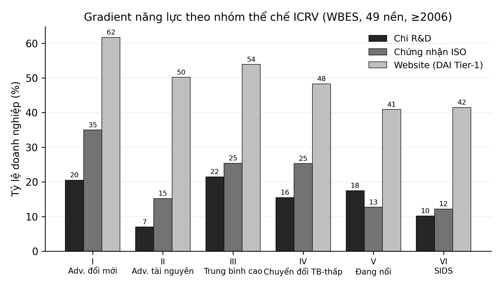
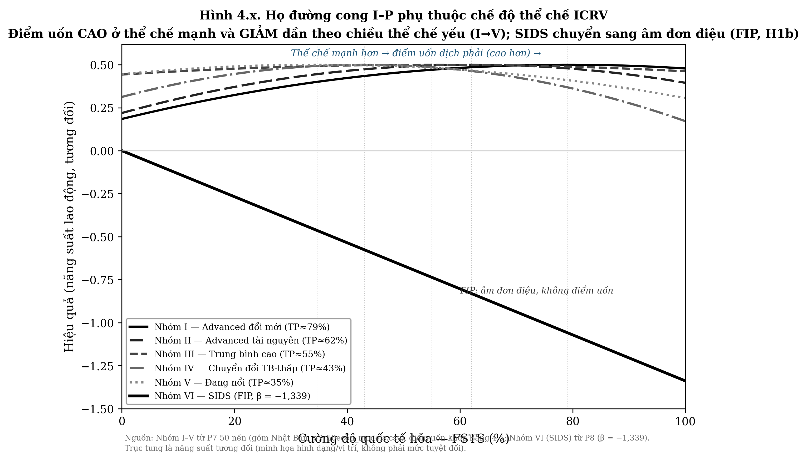

# CHƯƠNG 4: KẾT QUẢ NGHIÊN CỨU

---

## Giới thiệu chương

Chương 4 trình bày toàn bộ kết quả nghiên cứu của luận án theo logic đi từ bức tranh thực trạng mô tả (Mục 4.1) đến bằng chứng tổng hợp ở cấp meta-analytic (Mục 4.2), sau đó đến bằng chứng quốc gia cụ thể và cuối cùng là kiểm định toàn mẫu đa quốc gia. Cấu trúc trình bày gồm mười phần chính, bắt đầu bằng thực trạng quốc tế hóa và hiệu quả hoạt động kinh doanh tại châu Á theo các phân nhóm con thể chế ICRV, tiếp theo là: (ii) kết quả meta-analysis ba tầng (P6); (iii) bối cảnh thể chế tiên tiến–đổi mới tại Singapore (P4); (iv) bối cảnh thể chế trung bình cao tại Trung Quốc (P5); (v) bối cảnh chuyển đổi bậc thấp–trung tại Việt Nam (P3); (vi) kiểm định toàn mẫu châu Á đa bối cảnh (P7); (vii) trường hợp biên là các nền kinh tế đảo nhỏ đang phát triển ở Thái Bình Dương (P8); và (viii) tổng hợp kết quả theo hệ giả thuyết.

---

## 4.1 Thực trạng quốc tế hóa và hiệu quả hoạt động kinh doanh tại châu Á

### 4.1.1 Bức tranh tổng thể về hiệu quả doanh nghiệp châu Á

Phân tích mô tả trên khung 50 nền kinh tế châu Á và Thái Bình Dương (gồm Nhật Bản, thành viên thứ sáu của Nhóm I được WBES khảo sát lần đầu năm 2025; xem Mục 4.1.5) cho thấy bức tranh hiệu quả hoạt động kinh doanh có sự phân tán lớn và không hội tụ. Các bảng phân loại 4.1 dưới đây dựa trên bộ dữ liệu ước lượng đa quốc gia (pool phân loại 96.415 doanh nghiệp / 52 nhãn nền; khung phân tích 88.869 / 50 nền, gồm Nhật Bản; mẫu hồi quy chính P7 M2 N = 81.022), nhất quán với thống kê mô tả chi tiết của Chuyên đề 1 trên đầy đủ 50 nền. Vì doanh thu WBES được báo cáo bằng nội tệ, độ phân tán năng suất được tính **trong từng cặp nền kinh tế × năm** (bất biến với đơn vị tiền tệ): độ lệch chuẩn của ln(doanh thu/lao động) trong đợt tăng từ 1,04 (Nhóm I, Advanced đổi mới) lên 1,31–1,39 (Nhóm III–V), và tỷ số P90/P10 leo từ khoảng 12 lần (Nhóm I) lên khoảng 30 lần (Nhóm V) theo chiều từ nhóm thể chế cao đến nhóm thể chế thấp.

**Bảng 4.1.** *Phân tán năng suất lao động và đặc điểm quốc tế hóa theo phân nhóm con ICRV (pool gộp WBES 2003–2025; số doanh nghiệp phân loại ICRV ≈ 96.415; khung phân tích 88.869/50 nền; mẫu hồi quy chính P7 M2 N = 81.022).*

| Phân nhóm con ICRV | n | sd log LP (trong đợt)¹ | FSTS (%) | Xuất khẩu (%) | FDI≥10% (%) |
|---|---|---|---|---|---|
| Nhóm I: Advanced đổi mới (SG, HK, KOR, TWN, ISR, JPN) | 6.390 | **1,00** | 10,3 | 24,5 | 7,7 |
| Nhóm II: Advanced tài nguyên (GCC) | 2.269 | 1,14² | ~3 | ~8 | n/a |
| Nhóm III: Upper-middle (CHN, MYS, THA, KAZ…) | 17.905 | 1,37 | 10,3 | 21,7 | 8,4 |
| Nhóm IV: Lower-middle transition (VNM, IND, IDN, PHL, BGD, PAK, MNG) | 50.926 | 1,31 | 8,6 | 15,5 | 4,7 |
| Nhóm V: Emerging (LAO, KHM, NPL, LKA, JOR…) | 18.569 | **1,39** | 10,1 | 16,6 | 5,9 |
| Nhóm VI: SIDS (FJI, PNG, SLB…) | 2.038 | 1,32 | 6,3 | 16,3 | 23,5 |
| **Tổng (phân loại ICRV)** | **96.415** | n/a | n/a | n/a | n/a |

*Nguồn: Phân tích của tác giả từ World Bank Enterprise Surveys (WBES), 2003–2025.*

*Ghi chú: Cột n là số doanh nghiệp được phân loại vào sáu nhóm ICRV trong pool gộp WBES (tổng 96.415; ngoài ra còn ~10.350 doanh nghiệp chưa gán nhóm ICRV do thiếu chỉ số thể chế). Mẫu hồi quy chính của P7 là N = 81.022 (mô hình M2, khung 50 nền gồm Nhật Bản) và giảm còn 79.080 ở M5 khi bổ sung biến kiểm soát (xem Mục 4.6.1), do loại các quan sát thiếu biến phụ thuộc/FSTS. ¹ Độ lệch chuẩn ln(năng suất lao động) tính trong từng cặp nền kinh tế × năm rồi lấy trung vị giữa các đợt của nhóm, bất biến với đơn vị tiền tệ (thừa số quy đổi triệt tiêu trên thang log); năng suất được winsorize 1/99 trong cụm country-year (xem Mục 3.5.3). ² Trung vị Nhóm II bị kéo lên bởi các nền nhỏ; hai nền lớn nhất khối có phân tán hẹp nhất toàn pool (Saudi Arabia 0,49; Qatar 0,33).*

*Quy ước nhãn nhóm ICRV (căn theo nhãn dữ liệu P7): Nhóm I = Advanced innovation-driven; Nhóm II = Advanced resource-driven; Nhóm III = Upper-middle; **Nhóm IV = Lower-middle transition** (`Lower_mid_transition`: Bangladesh, Ấn Độ, Indonesia, Mông Cổ, Pakistan, Philippines, Việt Nam); **Nhóm V = Emerging** (`Emerging`: 17 nền gồm Campuchia, Lào, Nepal, Sri Lanka, Jordan…); Nhóm VI = SIDS (`SIDS_small`). Hệ nhãn này được dùng thống nhất trong toàn bộ luận án và hai chuyên đề.*

Phát hiện quan trọng nhất từ thực trạng mô tả là sự phân biệt nội bộ trong nhóm Advanced. Hai phân nhóm cùng mức thu nhập cao nhưng đối lập về cấu trúc: nhóm đổi mới sáng tạo dẫn dắt có R&D 21,0%, ISO 32,5% và 24,5% doanh nghiệp xuất khẩu, trong khi nhóm tài nguyên dẫn dắt chỉ có R&D 7,0% và 11,7% doanh nghiệp xuất khẩu (Chuyên đề 1). Về phân phối, hai nền lớn nhất Vùng Vịnh có phân tán năng suất trong đợt hẹp nhất toàn pool (Saudi Arabia 0,49; Qatar 0,33, so với Singapore 1,08, chênh hơn 2 lần), biểu hiện của kinh tế nhà nước tô (rentier economy) nơi phân phối lại từ xuất khẩu dầu mỏ thu hẹp khoảng cách năng suất giữa doanh nghiệp, nhưng không nhất thiết phản ánh hiệu quả doanh nghiệp đáng kể. Điều này gợi ý rằng việc gộp hai loại Advanced vào một nhóm duy nhất (như các nghiên cứu trước thường làm) sẽ che khuất cơ chế quan trọng này.

Sự gia tăng của độ phân tán năng suất trong đợt theo gradient ICRV (từ ~12 lần lên ~30 lần ở tỷ số P90/P10) không chỉ là một quan sát mô tả mà còn nhất quán với khung lý thuyết phân bổ sai nguồn lực (resource misallocation) của Hsieh và Klenow (2009): trong môi trường thể chế yếu, các rào cản thị trường, tiếp cận tài chính hạn chế, thực thi hợp đồng kém, méo mó chính sách, ngăn nguồn lực dịch chuyển từ doanh nghiệp kém hiệu quả sang doanh nghiệp hiệu quả hơn, khiến phương sai năng suất giữa các doanh nghiệp nới rộng. Theo logic này, độ phân tán năng suất cao ở Nhóm V–VI **có thể** là dấu hiệu của tổn thất phân bổ (allocative loss) thay vì phản ánh sự đa dạng lành mạnh. Cần lưu ý rằng độ lệch chuẩn của log năng suất lao động chỉ là **biến đại diện gián tiếp** cho cơ chế phân tán TFPR (năng suất doanh thu) mà Hsieh và Klenow (2009) dùng để định danh misallocation, vì nó còn chịu ảnh hưởng của dị biệt công nghệ, mức thâm dụng vốn và điều kiện cầu; do đó đây là một cách diễn giải *nhất quán với* khung misallocation chứ không phải bằng chứng phân rã trực tiếp. Dù vậy, hướng diễn giải này có hàm ý chính sách khác hẳn với việc coi phân tán chỉ là nhiễu thống kê. Cần nhấn mạnh rằng các so sánh giữa các nhóm ICRV trong Mục 4.1 mang bản chất **mô tả**; xác nhận **suy diễn** rằng khác biệt giữa các chế độ thể chế có ý nghĩa thống kê được cung cấp ở hai cấp độ độc lập trong các phần sau của chương: kiểm định điều tiết ICRV của meta-analysis P6 ($Q_M = 17{,}35$, $df = 4$, $p = {,}002$; Mục 4.2.3) và gradient điểm uốn theo ICRV của mô hình hồi quy đa quốc gia P7 (Mục 4.6.2). Hai nguồn bằng chứng này bảo đảm bức tranh thực trạng mô tả được neo vào bằng chứng suy diễn nhất quán, thay vì dừng lại ở so sánh trung bình–độ lệch chuẩn.

### 4.1.2 Thực trạng quốc tế hóa: phân cực tham gia xuất khẩu

Trung vị FSTS bằng 0% trong tất cả các phân nhóm, chỉ 15–23% doanh nghiệp tham gia xuất khẩu tùy theo bối cảnh. Phân phối FSTS có dạng phân cực mạnh: đại đa số không xuất khẩu, trong khi một thiểu số nhỏ có tỷ lệ xuất khẩu rất cao. Phân cực này đặt ra vấn đề phương pháp quan trọng cho nghiên cứu I–P: kết quả hồi quy trên toàn mẫu bị kéo bởi hành vi của thiểu số xuất khẩu tích cực.

Cường độ quốc tế hóa (FSTS trung bình, tính trên toàn mẫu gồm cả doanh nghiệp không xuất khẩu) dao động từ 6,3% (SIDS) đến 10,3% (Upper-middle), với mức trung bình khu vực khoảng 8,8%. Điều đáng chú ý là Upper-middle và Advanced có cùng FSTS trung bình (~10%) nhưng cơ chế xuất khẩu hoàn toàn khác: Advanced chủ yếu dịch vụ và hàng hóa hàm lượng tri thức cao; Upper-middle chủ yếu sản xuất theo chuỗi giá trị toàn cầu với biên lợi nhuận khác nhau.

### 4.1.3 Thực trạng năng lực số và công nghệ

Phân tích năm thành phần năng lực (đổi mới sản phẩm, đổi mới quy trình, R&D, ISO, website) theo phân nhóm con ICRV cho thấy sự đa dạng đáng kể.

**Bảng 4.2.** *Đổi mới sáng tạo và chấp nhận số theo phân nhóm con ICRV (%).*

| Nhóm ICRV (nhãn dữ liệu) | Sản phẩm mới | Quy trình mới | R&D | ISO | Website (DAI Tier-1) |
|---|---|---|---|---|---|
| I, Adv. đổi mới | 26,9 | 18,8 | **21,0** | 32,5 | **69,2** |
| II, Adv. tài nguyên (GCC) | 17,0 | 8,6 | 7,0 | 15,2 | 50,2 |
| III, Trung bình cao | 26,7 | 18,9 | 21,5 | 25,4 | 53,9 |
| IV, Chuyển đổi TB-thấp | 17,1 | 14,7 | 15,5 | 25,3 | 48,3 |
| V, Đang nổi | 24,4 | 16,3 | 17,5 | 12,7 | 40,9 |
| VI, SIDS | **34,2** | **24,7** | 10,2 | 12,2 | 41,5 |

*Nguồn: Phân tích của tác giả từ WBES, 2003–2025.*

*Ghi chú: Bảng 4.2 được tính trực tiếp từ dữ liệu thô WBES trên khung 50 nền (một cross-section chuẩn cho mỗi cặp nền kinh tế × năm, đợt khảo sát ≥ 2006), với các chỉ báo chuẩn của bộ công cụ WBES toàn cầu: đổi mới sản phẩm (h1), đổi mới quy trình (h5), chi R&D (h8), chứng nhận chất lượng quốc tế (b8) và website (c22b). Toàn bộ sáu nhóm ICRV đều có độ phủ dữ liệu đầy đủ, kể cả Nhóm II (đủ 6/6 nền GCC). Gradient năng lực thể chế thể hiện rõ ở các biến nền tảng: R&D 21,0% (Nhóm I) xuống 10,2% (Nhóm VI); ISO 32,5% xuống 12,2%; website 69,2% xuống 41,5%. Bộ số này nhất quán với phân tích thực trạng ở Chuyên đề 1.*

Phát hiện đáng chú ý là pattern "thích nghi và nhảy vọt" (adaptive leapfrogging) ở SIDS: với dữ liệu raw đủ 8/8 nền Nhóm VI, SIDS có **tỷ lệ đổi mới sản phẩm cao nhất mọi nhóm (34,2%)** và đổi mới quy trình cao nhất (24,7%), trong khi website (41,5%) ngang nhóm Đang nổi (40,9%) dù GNI thấp hơn đáng kể, phản ánh đổi mới bằng nguồn lực hạn chế (frugal innovation) như công cụ sinh tồn chứ không phải tối ưu hóa hiệu quả. Kết quả này hỗ trợ lập luận lý thuyết về sự phân biệt giữa DAI (chấp nhận số bề mặt) và TCI (năng lực công nghệ chiều sâu): SIDS đổi mới/áp dụng số ở bề mặt cao nhưng năng lực công nghệ chiều sâu (R&D 10,2%, ISO 12,2%) thấp nhất, và đây là nhóm duy nhất có quan hệ I–P âm đơn điệu (FIP).

Một biểu hiện khác của bão hòa Tier-1 nằm ở tương quan giữa website và năng suất: phần bù tương quan của DAI Tier-1 thấp nhất ở nhóm Advanced đổi mới (+0,090, so với +0,180–0,201 ở các nhóm chuyển đổi và tài nguyên, Chuyên đề 1, Bảng 2.3.8.1) dù tỷ lệ có website của nhóm này cao (69,2%). Khi một chỉ báo nhị phân tiệm cận bão hòa, phương sai của nó co lại và nhóm "không website" còn lại mang tính chọn lọc đặc thù, nên hệ số đo được phản ánh giới hạn của thước đo Tier-1 nhiều hơn là giới hạn của số hóa, một vấn đề đo lường cần phân biệt với quan hệ nhân quả thực.

### 4.1.4 Bốn rào cản cấu trúc ảnh hưởng đến quốc tế hóa và hiệu quả

Phân tích thực trạng xác định bốn rào cản cấu trúc phổ biến nhất ảnh hưởng đến khả năng quốc tế hóa và hiệu quả doanh nghiệp tại châu Á: (i) tiếp cận tài chính hạn chế, đặc biệt nghiêm trọng ở Emerging và Lower-middle transition (Nhóm V–IV); (ii) thiếu hụt lao động có kỹ năng; (iii) cạnh tranh từ doanh nghiệp phi chính thức; và (iv) nguồn cung điện không đáng tin cậy. Bốn rào cản này hình thành "khoảng trống thể chế" (Khanna & Palepu, 2010) tạo ra chi phí giao dịch bổ sung cho doanh nghiệp khi mở rộng hoạt động ra ngoài biên giới. Sự hiện diện đồng thời của nhiều voids tại Emerging và SIDS giải thích tại sao quan hệ I–P ở các nhóm này yếu hoặc âm.

### 4.1.5 Nhật Bản 2025: Lần đầu tiên được khảo sát và vị trí trong khung ICRV

Một sự kiện dữ liệu đáng chú ý của giai đoạn nghiên cứu là việc Nhật Bản lần đầu tiên được đưa vào Khảo sát Doanh nghiệp của Ngân hàng Thế giới năm 2025, với mẫu $N = 2.168$ doanh nghiệp. Nhật Bản là **thành viên thứ sáu của Nhóm I** (Advanced đổi mới sáng tạo dẫn dắt) và là nền kinh tế tiên tiến lớn cuối cùng gia nhập bộ dữ liệu WBES, cung cấp một điểm neo quý giá cho biên trên của gradient thể chế. Nhật Bản được tích hợp đầy đủ vào khung mô tả 50 nền của chuyên đề thực trạng (Chuyên đề 1) và mọi thống kê Nhóm I trong luận án. Về phía ước lượng kinh tế lượng, **điểm uốn toàn mẫu P7 đã được tái ước lượng trên khung 50 nền bao gồm Nhật Bản** (2.168 doanh nghiệp Nhật trong khung phân tích 88.869; mẫu hồi quy chính M2 N = 81.022, M5 N = 79.080; xem Mục 4.6), nên các kết quả P7 trong luận án đã phản ánh Nhật Bản. Hai nghiên cứu thành phần còn lại là pool con riêng không liên quan Nhật Bản: P8 (FIP) trên 7 nền Pacific SIDS và P9 (ngưỡng) trên Ấn Độ. Ngoài ra, nghiên cứu thành phần P10 kiểm định chuyên sâu quan hệ I–P tại Nhật Bản (xem Mục 4.9). Toàn bộ số liệu dưới đây được tính trực tiếp từ tệp vi mô gốc.

**Bảng 4.3.** *Đặc trưng doanh nghiệp Nhật Bản 2025 so với năm nền còn lại của Nhóm I (Advanced đổi mới).*

| Chỉ tiêu | Nhật Bản 2025 | 5 nền Nhóm I còn lại |
|---|--:|--:|
| n doanh nghiệp | 2.168 | 4.222 |
| sd ln(LP) trong đợt | **0,89** | 1,04 |
| P90/P10 năng suất | **8,3** | 12,2 |
| FSTS trung bình (%) | 4,1 | 13,4 |
| Doanh nghiệp xuất khẩu (%) | 16,5 | 28,4 |
| FDI ≥ 10% (%) | **1,9** | 10,6 |
| Website (%) | **83,8** | 61,7 |
| R&D (%) | 21,9 | 20,5 |
| ISO (%) | 27,7 | 35,0 |
| Đổi mới sản phẩm (%) | 32,2 | 24,3 |
| Nữ quản lý cấp cao (%) | **7,3** | 27,5 |
| Tuổi doanh nghiệp trung bình (năm) | **50,4** | 23,0 |

*Nguồn: tính trực tiếp từ `Japan-2025-full-data.dta` (WBES) và pool mô tả của năm nền còn lại Nhóm I. FSTS = d3b + d3c.*

Bốn đặc trưng nổi bật định vị Nhật Bản trong khung ICRV. Thứ nhất, **phân tán năng suất hẹp nhất**: độ lệch chuẩn ln năng suất trong đợt của Nhật (0,89) thấp hơn mức trung vị của năm nền còn lại Nhóm I (1,04), và tỷ số P90/P10 chỉ 8,3 lần so với 12,2 lần, phản ánh một nền kinh tế tiên tiến trưởng thành với sàn năng suất cao và đồng đều. Đặc điểm này củng cố trực tiếp logic "bão hòa Tier-1" của khung CDCM: ở nền kinh tế đồng đều và số hóa cao, dư địa để hiện diện số cơ bản tạo khác biệt năng suất là rất hẹp. Thứ hai, **số hóa trưởng thành nhất**: tỷ lệ có website 83,8% là cao nhất trong toàn bộ pool, vượt xa mức 61,7% của năm nền còn lại Nhóm I. Thứ ba, **trường thọ doanh nghiệp**: tuổi trung bình 50,4 năm (so với 23,0 năm của năm nền còn lại Nhóm I) phản ánh cấu trúc doanh nghiệp lâu đời đặc thù của Nhật Bản. Thứ tư, **nghịch lý đổi mới–quốc tế hóa và khoảng cách giới**: dù cường độ R&D và đổi mới cao, cường độ quốc tế hóa cấp cơ sở lại thấp (FSTS 4,1%) cùng tỷ lệ sở hữu nước ngoài rất thấp (1,9%), cho thấy hoạt động quốc tế hóa tập trung ở các tập đoàn đa quốc gia lớn chứ không phân bố đều ở mẫu cơ sở; đồng thời tỷ lệ nữ quản lý cấp cao chỉ 7,3%, thấp hơn nhiều so với mức dẫn đầu khu vực Đông Á–Thái Bình Dương, nhất quán với văn liệu về trần kính trong quản trị doanh nghiệp Nhật Bản. Các đặc trưng này được khai thác đầy đủ trong nghiên cứu thành phần P10, kiểm định chuyên sâu quan hệ I–P tại Nhật Bản: kết quả xác nhận quan hệ gần tuyến tính dương (hiệu ứng tuyến tính +0,671, p < 0,001; số hạng bậc hai không ý nghĩa; điểm uốn đại số 90–108% nằm ngoài miền dữ liệu), TCI (+0,100, p < 0,001) và DAI (+0,110, p = 0,028) nâng mặt bằng không uốn đường cong, cùng phần bù trường thọ doanh nghiệp (+0,073, p = 0,007), đúng như dự đoán biên trên của khung ICRV (trình bày đầy đủ ở Mục 4.9).

---

### 4.1.6 So sánh xuyên nhóm ICRV: gradient tương quan và độ phân tán hiệu quả

Khi đặt cạnh nhau toàn bộ các chỉ báo mô tả theo sáu nhóm ICRV, một bức tranh có cấu trúc nổi lên trong đó cường độ và đôi khi cả dấu của các tương quan thô biến thiên theo chiều suy yếu của thể chế. Hệ số tương quan Pearson giữa năng suất lao động chuẩn hóa và cường độ quốc tế hóa giảm đơn điệu theo gradient thể chế: từ $+0{,}139$ ở Nhóm I, qua $+0{,}131$ ở Nhóm II, $+0{,}094$ ở Nhóm III, $+0{,}047$ ở Nhóm IV, $+0{,}018$ ở Nhóm V, rồi mất ý nghĩa thống kê và đổi dấu ở SIDS ($-0{,}009$, không có ý nghĩa). Mô thức này cho thấy quan hệ thô giữa quốc tế hóa và năng suất gần như biến mất ở các môi trường thể chế yếu, gợi ý một quan hệ phi tuyến và bị điều tiết thay vì một hiệu ứng tuyến tính phổ quát; SIDS là ngoại lệ duy nhất về dấu, nhất quán với giả thuyết chi phí buộc phải quốc tế hóa, theo đó doanh nghiệp đảo nhỏ xuất khẩu vì bắt buộc chứ không phải vì được chọn lọc theo năng suất.

Ngược với gradient của quốc tế hóa, năng lực công nghệ là yếu tố tương quan mạnh và đồng đều nhất ở mọi nhóm, dao động từ $+0{,}117$ ở SIDS đến $+0{,}240$ ở Nhóm III, củng cố cách đọc rằng năng lực công nghệ nền tảng là một yếu tố dịch chuyển mức năng suất có tính phổ quát chứ không phụ thuộc chế độ thể chế. Tương quan của sở hữu nước ngoài dương ở mọi nhóm nhưng mạnh hơn ở hai cực của phổ thể chế (Nhóm I $+0{,}104$ và SIDS $+0{,}122$), phản ánh hai cơ chế đầu tư trực tiếp khác nhau đã nêu ở Mục 4.1.1: trung tâm khu vực của doanh nghiệp đa quốc gia tại nhóm tiên tiến so với đầu tư ngoại sinh hướng du lịch và viễn thông tại các đảo nhỏ.

Độ phân tán hiệu quả cũng thể hiện gradient thể chế rõ rệt khi đo bằng các tỷ số phân vị bất biến với đơn vị tiền tệ. Tỷ số liên tứ phân vị $P75/P25$ của năng suất tăng từ $3{,}4$ lần ở Nhóm I lên $5{,}8$ lần ở Nhóm V, một mô thức song hành với tỷ số $P90/P10$ đã trình bày ở Bảng 4.1. Bổ sung cho thước đo phân tán, mức sinh lời cũng mỏng dần theo chiều thể chế yếu: tỷ suất sinh lời trên doanh thu trung vị giảm từ $0{,}50$ ở Nhóm I xuống $0{,}45$ ở Nhóm III rồi $0{,}35$ ở Nhóm IV, nhất quán với lập luận của lý thuyết thể chế rằng chi phí giao dịch cao trong môi trường thể chế yếu bào mòn biên lợi nhuận của doanh nghiệp.

Một điểm tương phản đáng chú ý về số hóa nằm ở chính nhóm tiên tiến. Phần bù tương quan của chấp nhận số bề mặt (website, thuộc Tầng 1) lại thấp nhất ở Nhóm I ($+0{,}090$), trong khi cao nhất ở Nhóm II ($+0{,}201$) và Nhóm IV ($+0{,}180$), dù tỷ lệ có website ở Nhóm I đã đạt $69{,}2\%$. Đây là biểu hiện trực tiếp của hiện tượng bão hòa thước đo Tầng 1: khi một chỉ báo nhị phân tiệm cận trần, phương sai của nó co lại và lợi suất biên của hiện diện số cơ bản giảm dần, một vấn đề đo lường cần phân biệt với giới hạn của số hóa thực chất. Cuối cùng, về cấu trúc lãnh đạo, khu vực Đông Á và Thái Bình Dương dẫn đầu toàn cầu về tỷ lệ nữ trong nhóm quản trị cấp cao ($33{,}4\%$) lẫn tỷ lệ nữ sở hữu đa số ($25{,}7\%$), bỏ xa khu vực Trung Đông và Bắc Phi (tương ứng $3{,}3\%$ và $1{,}7\%$), một khác biệt thể chế kép gắn với bối cảnh nhà nước tô ở khối tài nguyên dẫn dắt và làm phong phú thêm bức tranh đa dạng nội bộ của các nhóm tiên tiến.

### 4.1.7 Bằng chứng nền tảng đa quốc gia: phân tầng năng suất vùng và hiệu ứng lá chắn số (P1)

Trước khi đi vào các kiểm định đường cong theo từng bối cảnh, nghiên cứu thành phần P1 cung cấp một nền tảng thực nghiệm cấp doanh nghiệp về dị biệt năng suất và vai trò của năng lực trong khu vực, trên mẫu phân tích **40.633 doanh nghiệp** thuộc **17 nền kinh tế châu Á** khảo sát trong giai đoạn 2009–2024. Mẫu được nhóm thành ba cụm vùng: Đại Trung Hoa (5.251 doanh nghiệp), ASEAN (12.068 doanh nghiệp) và Nam Á (23.314 doanh nghiệp). Biến phụ thuộc là năng suất lao động dạng logarit, winsorize tại bách phân vị 1 và 99 để kiểm soát giá trị ngoại lai.

Kết quả hồi quy bình phương nhỏ nhất phân tầng theo từng khối biến cho thấy một cấu trúc rõ ràng. Mô hình chỉ với biến vùng (M1) xác nhận phân tầng năng suất sâu sắc: so với ASEAN, doanh nghiệp Đại Trung Hoa có năng suất cao hơn đáng kể ($\hat{\beta} = 0{,}990$, $p < {,}001$, tương ứng khoảng 169,1% cao hơn) và doanh nghiệp Nam Á cũng vượt ASEAN ($\hat{\beta} = 0{,}506$, $p < {,}001$, phần bù khoảng 65,9%); riêng biến vùng giải thích 5,4% phương sai năng suất ($R^2 = 0{,}054$). Khi bổ sung khối năng lực doanh nghiệp (M2), chấp nhận công nghệ gắn mạnh và dương với năng suất ($\hat{\beta} = 0{,}409$, $p < {,}001$, tương ứng khoảng 50,5% cao hơn ở doanh nghiệp có áp dụng), và chứng nhận chất lượng quốc tế có hiệu ứng tương tự ($\hat{\beta} = 0{,}322$, $p < {,}001$, khoảng 38,0%); độ phù hợp mô hình tăng gần gấp đôi, từ $R^2 = 0{,}054$ lên $0{,}105$.

Phát hiện then chốt nằm ở mô hình tương tác (M3). Chỉ số rào cản kinh doanh tác động âm và có ý nghĩa lên năng suất ($\hat{\beta} = -0{,}076$, $p < {,}001$ ở hiệu ứng chính), nhưng tương tác giữa rào cản và chấp nhận công nghệ dương và có ý nghĩa cao ($\hat{\beta} = +0{,}110$, $p < {,}001$). Đây là bằng chứng định lượng trực tiếp cho **hiệu ứng lá chắn số**: chấp nhận công nghệ làm giảm khoảng 83% tổn thất năng suất do rào cản thể chế gây ra, theo đó ở doanh nghiệp không áp dụng công nghệ, mỗi đơn vị tăng của rào cản làm giảm năng suất khoảng 12,5%, trong khi ở doanh nghiệp có áp dụng, tổn thất biên gần như bị triệt tiêu. Khoảng cách năng suất của doanh nghiệp nhỏ và vừa cũng phụ thuộc vùng: bất lợi quy mô rõ rệt ở ASEAN (tương tác $\hat{\beta} = -0{,}390$, $p < {,}001$) nhưng gần như không tồn tại ở Đại Trung Hoa ($\hat{\beta} = 0{,}043$, không ý nghĩa). Bằng chứng nền tảng này định khung cho toàn bộ chương: dị biệt năng suất giữa các nền kinh tế châu Á không phải ngẫu nhiên mà gắn với năng lực doanh nghiệp và chất lượng thể chế, và năng lực số vận hành như cơ chế bù đắp cho thiếu hụt thể chế, đúng theo logic của khung CDCM.

### 4.1.8 Gradient biên lợi nhuận và hồ sơ đặc trưng doanh nghiệp theo nhóm ICRV

Phân tích phân tán năng suất ở các mục trước dựa trên thước đo bất biến tiền tệ trong từng cặp nền kinh tế và năm, nên không cho phép so sánh *mức* hiệu quả giữa các nhóm. Để bổ sung một so sánh mức hợp lệ giữa các nền kinh tế, luận án sử dụng tỷ suất lợi nhuận trên doanh thu (ROS), một tỷ số vô đơn vị không chịu ảnh hưởng của khác biệt đơn vị tiền tệ. Bảng 4.3a trình bày trung vị ROS theo sáu nhóm ICRV.

**Bảng 4.3a.** *Trung vị tỷ suất lợi nhuận trên doanh thu (ROS) theo nhóm ICRV (mẫu con có dữ liệu chi phí).*

| Nhóm ICRV | n | Trung vị ROS |
|---|--:|--:|
| I, Tiên tiến đổi mới | 3.337 | 0,503 |
| II, Tiên tiến tài nguyên | 118¹ | 0,470 |
| III, Trung bình cao | 13.401 | 0,455 |
| IV, Chuyển đổi thu nhập trung bình thấp | 37.792 | 0,351 |
| V, Đang nổi | 12.523 | 0,408 |
| VI, Đảo nhỏ | 520¹ | 0,474 |

*Ghi chú: trung vị được ưu tiên vì trung bình ở Nhóm V và VI bị méo bởi giá trị ngoại lai. ¹ Mẫu nhỏ do ít doanh nghiệp thuộc khối tài nguyên và đảo nhỏ có dữ liệu chi phí đầy đủ. Nguồn: ước lượng của tác giả từ dữ liệu thô WBES (tái lập: `scripts/relock_ros.py`).*

Mô thức ROS bổ sung một chiều thông tin cho bức tranh phân tán. Biên lợi nhuận cao nhất ở chế độ tiên tiến đổi mới (khoảng 0,50) và thấp nhất ở chế độ chuyển đổi thu nhập trung bình thấp (khoảng 0,35); đây là gradient mức hợp lệ giữa các nền kinh tế, nhất quán với lý thuyết thể chế theo đó thể chế mạnh kéo theo chi phí giao dịch thấp và biên lợi nhuận cao hơn. Cần lưu ý rằng gradient này không đơn điệu hoàn toàn: các nhóm thể chế yếu nhất (V và VI) có trung vị ROS cao hơn Nhóm IV, một phần do mẫu nhỏ và do thành phần ngành dịch vụ biên cao chiếm tỷ trọng lớn ở các nền đảo nhỏ. Điểm cốt lõi là sự khác biệt mức giữa các chế độ thể chế hiện ra ở thước đo lợi nhuận hợp lệ, trong khi ở thước đo năng suất thô nó bị nhiễu tiền tệ che khuất, nên luận án đọc ROS như chỉ báo mức và đọc độ phân tán năng suất như chỉ báo phân bổ.

Hồ sơ đặc trưng doanh nghiệp theo nhóm cũng phơi bày những tương phản đáng chú ý không trùng với thứ bậc thu nhập. Cường độ xuất khẩu trung bình cao nhất ở Nhóm I (13,3%) và thấp nhất ở Nhóm II tài nguyên (3,5%), phản ánh định hướng nội địa và tài nguyên của khối sau. Tỷ lệ doanh nghiệp có hiện diện số bề mặt giảm dần khá đều theo gradient thể chế, từ 61,7% ở Nhóm I xuống 41,2% ở Nhóm V, phù hợp với khoảng cách hạ tầng số. Đáng chú ý nhất, tỷ lệ nữ trong quản trị cấp cao không theo gradient thu nhập mà cao ở cả Nhóm I (27,5%), Nhóm III (29,1%) và Nhóm VI đảo nhỏ (31,8%) trong khi rất thấp ở Nhóm II tài nguyên (4,0%), một khác biệt thể chế kép gắn với bối cảnh văn hóa và nhà nước tô của khối tài nguyên dẫn dắt. Hồ sơ này củng cố lập luận xuyên suốt rằng các nhóm ICRV khác nhau về chất chứ không chỉ về mức phát triển, và do đó đòi hỏi cách đọc theo từng chế độ thay vì một thang tuyến tính duy nhất.

---

## 4.2 Kết quả tổng hợp định lượng: phân tích tổng hợp ba tầng (P6)

### 4.2.1 Chỉ số hiệu ứng tổng hợp

Phân tích meta-analytic tổng hợp ba tầng (three-level multilevel meta-analysis, MARA) được tiến hành trên tập dữ liệu gồm $k = 238$ nghiên cứu với tổng cộng K = 288 effect sizes đa dạng theo vùng địa lý, giai đoạn và phương pháp. Kết quả cho thấy hiệu ứng tổng hợp (pooled correlation) là $r = 0{,}074$, với khoảng tin cậy 95% dương và có ý nghĩa thống kê. Giá trị $r$ này khẳng định bức tranh tổng quát từ các meta-analyses trước đây của Bausch và Krist (2007), Kirca et al. (2012), Marano et al. (2016) và Arte và Larimo (2022): mối quan hệ tổng hợp giữa quốc tế hóa và hiệu quả hoạt động là dương nhưng có biên độ khiêm tốn.

Đặc biệt đáng lưu ý, kết quả P6 hoàn toàn nhất quán với cơ sở meta-analysis đã công bố tại hội nghị ICBEF 2024, với $k = 113$ nghiên cứu và $r = 0{,}07$, sự hội tụ này tạo ra bằng chứng chéo vững chắc khi mở rộng pool lên gần gấp đôi số nghiên cứu.

### 4.2.2 Phân tích dị biệt ba tầng

Kết quả quan trọng nhất của phân tích MARA không phải là giá trị điểm của $r$ mà là cấu trúc của dị biệt ($I^2$). Tổng $I^2 = 62{,}4\%$, cho thấy mức dị biệt đáng kể trong tập hợp 238 nghiên cứu không phải do sai số lấy mẫu. Quan trọng hơn, khi phân tách theo cấu trúc ba tầng:

- **Tầng 2** (between-effect within-study, tức dị biệt giữa các effect-size trong cùng một nghiên cứu): chiếm $54{,}1\%$ tổng phương sai, đây là nguồn dị biệt chủ đạo.
- **Tầng 3** (between-study, tức dị biệt giữa các nghiên cứu): chỉ chiếm $8{,}4\%$.

Phát hiện này có hàm ý lý thuyết sâu sắc: dị biệt trong I–P văn liệu xuất phát chủ yếu từ sự biến thiên **bên trong các nghiên cứu** (ví dụ: cùng một mẫu doanh nghiệp nhưng dùng các thước đo khác nhau cho cùng cấu trúc cho ra kết quả khác nhau), chứ không phải giữa các nghiên cứu với nhau. Điều này gợi ý rằng sự không nhất quán trong văn liệu I–P phần lớn là vấn đề **đo lường và bối cảnh**, không phải là bằng chứng về sự thiếu nhất quán thực sự trong quan hệ nhân quả giữa quốc tế hóa và hiệu quả.

### 4.2.3 Điều tiết bởi chế độ thể chế: ICRV điều tiết

Kiểm định điều tiết bằng nhóm chế độ thể chế ICRV (Institutional Context Regime Variation) cho kết quả có ý nghĩa thống kê: $Q_M = 17{,}35$, $df = 4$, $p = {,}002$. Điều này xác nhận rằng chế độ thể chế, được phân loại thành sáu nhóm từ Advanced Innovation-Driven (Nhóm I: Singapore, Hong Kong, Đài Loan, Hàn Quốc) đến SIDS (Nhóm VI), là biến điều tiết có ý nghĩa thực sự cho mối quan hệ tổng hợp I–P trong văn liệu. Kiểm định $Q_M$ vượt ngưỡng tới hạn ($p = {,}002$), hàm ý rằng sự khác biệt giữa các nhóm ICRV không thể giải thích bằng sai số lấy mẫu.

Gradient theo ICRV hiện diện rõ ràng trong kết quả: các nền kinh tế Advanced Innovation-Driven có hiệu ứng I–P lớn hơn so với các nền kinh tế Frontier hay SIDS (theo phân loại 5-regime của P6). Kết quả này nhất quán với cơ chế lý thuyết từ Institutional Theory, môi trường thể chế chất lượng cao tạo điều kiện để doanh nghiệp chuyển hóa quốc tế hóa thành hiệu quả dễ dàng hơn (North, 1990; Marano et al., 2016). *(Lưu ý phân loại: P6, meta-analysis cấp nghiên cứu, dùng hệ ICRV 5-regime rút gọn [I Advanced-Innovation, II Upper-Middle, III Emerging, FR Frontier/SIDS, MX Mixed], khác với hệ 6 nhóm cấp doanh nghiệp dùng ở Mục 4.1 và Mục 4.6; nhóm 'Frontier/SIDS' của P6 là bin thể chế yếu nhất, tương ứng Nhóm V–VI trong hệ 6 nhóm. Thuật ngữ 'Frontier' ở Mục 4.2 giữ theo phân loại gốc của P6.)*

### 4.2.4 Kiểm định publication bias

Phân tích publication bias gồm ba kiểm định bổ sung nhau. **Kiểm định Egger** cho kết quả $b = 0{,}475$ ($p = {,}057$), sát ngưỡng $\alpha = 0{,}05$ nhưng không đạt ý nghĩa thống kê theo tiêu chuẩn thông thường. **Kiểm định Begg–Mazumdar** (Begg & Mazumdar, 1994) cho kết quả $\tau = -0{,}134$ ($p = {,}0007$), có ý nghĩa thống kê rõ ràng, cho thấy các nghiên cứu với sai số chuẩn lớn hơn (mẫu nhỏ hơn) có xu hướng báo cáo effect size thấp hơn, phù hợp với lệch lạc công bố ưu tiên kết quả dương tính. **Phân tích trim-and-fill** điều chỉnh ước lượng từ $r = 0{,}074$ xuống $r = 0{,}035$ (với $k = 58$ nghiên cứu được imputed), mức điều chỉnh đáng kể nhưng không đổi chiều hướng tích cực của quan hệ tổng hợp. **Fail-safe $N$ = 45.848** vượt xa ngưỡng tới hạn $5k + 10 = 1{,}200$, khẳng định publication bias không thể bác bỏ hoàn toàn kết quả tổng hợp. Tổng hợp lại, bằng chứng publication bias được xác nhận qua kiểm định Begg–Mazumdar có ý nghĩa ($p = {,}0007$): gộp effect thực $r = 0{,}074$ có thể bị thổi phồng so với hiệu ứng dân số thực, với ước lượng bảo thủ hơn là $r = 0{,}035$.

Phát hiện publication bias này có một hàm ý lý thuyết quan trọng vượt ra ngoài một cảnh báo phương pháp đơn thuần. Trong phân tách dị biệt ba tầng, phần lớn dị biệt nằm ở **tầng nội bộ nghiên cứu** ($I^2_{\text{within}} = 54{,}1\%$) hơn là tầng giữa các nghiên cứu ($I^2_{\text{between}} = 8{,}4\%$), nghĩa là biến thiên hệ số chủ yếu đến từ cách mỗi nghiên cứu vận hành hóa quốc tế hóa, lựa chọn thước đo hiệu quả và đặc tả biến kiểm soát, chứ không phải từ khác biệt bối cảnh quốc gia. Kết hợp với bằng chứng publication bias, cấu trúc dị biệt này gợi ý một cách diễn giải lại "câu đố dị biệt" trong văn liệu I–P: phần lớn phương sai chưa giải thích được có thể phản ánh lựa chọn ở phía công bố và đặc tả mô hình nhiều hơn là các điều kiện bối cảnh thể chế hay số hóa. Phát hiện này không phủ định vai trò điều tiết của thể chế, vốn được xác nhận độc lập qua kiểm định $Q_M$ giữa các nhóm ICRV, nhưng nó định vị lại kỳ vọng: meta-analysis cấp tổng hợp khó nắm bắt được điều tiết thể chế vì các nghiên cứu sơ cấp hiếm khi báo cáo đủ chi tiết theo chế độ thể chế, và vì vậy bằng chứng cấp doanh nghiệp trực tiếp trên một khung phân loại thể chế nhất quán, như luận án thực hiện, là con đường hữu hiệu hơn để bóc tách dị biệt so với việc tích lũy thêm meta-analysis trên dữ liệu thứ cấp không đồng nhất.

### 4.2.5 Phân rã phương sai ba tầng và hàm ý về nguồn dị biệt

Cấu trúc ba tầng của mô hình MARA cho phép quy phương sai hệ thống về đúng nguồn gốc của nó thay vì gộp chung như mô hình hiệu ứng ngẫu nhiên một tầng. Hai thành phần phương sai ước lượng bằng REML là phương sai trong nghiên cứu $\hat{\sigma}^2_{(2)} = 0{,}00878$ và phương sai giữa các nghiên cứu $\hat{\sigma}^2_{(3)} = 0{,}00136$. Phương sai trong nghiên cứu lớn gấp khoảng sáu lần phương sai giữa các nghiên cứu, một tỷ lệ trực tiếp chuyển thành phần dị biệt $I^2_{(2)} = 54{,}1\%$ áp đảo phần $I^2_{(3)} = 8{,}4\%$ đã trình bày ở Mục 4.2.2. Kiểm định Cochran tổng cho $Q = 1.909{,}42$ ($df = 287$, $p < {,}001$), bác bỏ giả thuyết đồng nhất một cách rõ ràng và do đó biện minh cho lựa chọn mô hình hiệu ứng ngẫu nhiên ba tầng.

Hàm ý phương pháp luận của phân rã này khác biệt căn bản so với một báo cáo $I^2$ tổng đơn thuần. Vì biến thiên hệ số chủ yếu phát sinh từ những lựa chọn vận hành hóa bên trong cùng một bài báo, cụ thể là cách đo lường cường độ quốc tế hóa (tỷ lệ doanh thu xuất khẩu trên tổng doanh thu, chỉ số entropy, số thị trường nước ngoài), cách chọn thước đo hiệu quả (dựa trên kế toán, dựa trên thị trường, dựa trên năng suất) và đặc tả biến kiểm soát, nên việc bổ sung thêm các nghiên cứu sơ cấp mới khó có khả năng thu hẹp dị biệt nếu các nghiên cứu đó tiếp tục báo cáo nhiều hệ số không đồng nhất cho cùng một mẫu. Mô hình hai tầng quy ước (ước lượng DerSimonian–Laof) cho cùng giá trị điểm $r = 0{,}074$ với khoảng tin cậy $[0{,}061;\ 0{,}087]$, xác nhận rằng việc bỏ qua cấu trúc lồng ghép không làm chệch ước lượng gộp mà chỉ làm mất thông tin về nguồn dị biệt. Đây là lý do trung tâm để luận án ưu tiên bằng chứng cấp doanh nghiệp trên một khung phân loại thể chế nhất quán hơn là tiếp tục tích lũy meta-analysis trên dữ liệu thứ cấp không đồng nhất.

### 4.2.6 Gradient hiệu ứng theo nhóm thể chế và giới hạn của bằng chứng định hướng

Bảng hệ số gộp theo từng nhóm ICRV cho thấy một bức tranh tinh tế hơn so với kết luận "có điều tiết" đơn thuần. Nhóm I (Advanced đổi mới sáng tạo) có hệ số gộp lớn nhất trong các nhóm đủ dữ liệu, $\bar{r} = 0{,}079$ (khoảng tin cậy $[0{,}058;\ 0{,}099]$, $k = 139$ hiệu ứng); nhóm II (Trung bình cao) có $\bar{r} = 0{,}065$ ($k = 25$); nhóm III (Đang nổi) có $\bar{r} = 0{,}069$ ($k = 91$); và nhóm đa bối cảnh có $\bar{r} = 0{,}053$ ($k = 30$). Bốn nhóm này đều cho hệ số dương có ý nghĩa và xếp theo chiều phù hợp với kỳ vọng lý thuyết, song khác biệt giữa chúng không đạt ý nghĩa thống kê trong các so sánh cặp đôi: Nhóm I so với Nhóm III cho $b = -0{,}011$ ($p = {,}502$), và Nhóm I so với nhóm đa bối cảnh cho $b = -0{,}026$ ($p = {,}269$).

Do đó cần phân biệt rạch ròi giữa kết quả của kiểm định tổng thể và kết quả của các so sánh định hướng. Kiểm định $Q_M$ giữa các nhóm có ý nghĩa ($p = {,}002$) khẳng định rằng hệ số I–P biến thiên có hệ thống giữa các chế độ thể chế, nhưng ý nghĩa này được dẫn dắt gần như toàn bộ bởi một nhóm cận biên: nhóm Frontier chỉ gồm ba nghiên cứu lại cho hệ số gộp dị thường $\bar{r} = 0{,}349$ ($k = 3$), và tương phản duy nhất có ý nghĩa là Nhóm I so với Frontier ($b = +0{,}285$, $p < {,}001$). Giá trị Frontier này bị chi phối bởi một nghiên cứu ngoại lai duy nhất (Pouresmaeili và cộng sự, 2018, với $r = 0{,}69$ trên 226 doanh nghiệp) và vì vậy không thể coi là một ước lượng đáng tin cậy cho chế độ thể chế yếu nhất. Hệ quả là gradient định hướng không được xác nhận ở cấp meta-analytic với cỡ mẫu hiện tại; sự khác biệt giữa Nhóm I và Nhóm III chỉ là $0{,}010$ và không có ý nghĩa thống kê. Phát hiện này định vị lại kỳ vọng một cách quan trọng: bằng chứng về điều tiết thể chế tồn tại, nhưng việc bóc tách gradient cụ thể đòi hỏi bằng chứng cấp doanh nghiệp trên một khung phân loại nhất quán, đúng như con đường mà các nghiên cứu thành phần P3–P8 và mô hình đa quốc gia P7 của luận án theo đuổi.

Hai biến điều tiết bối cảnh khác được kiểm định trong cùng khung MARA nhưng không đạt ý nghĩa thống kê. Chấp nhận số cấp quốc gia (country-level Digital Adoption Index — cDAI) cho $Q_M = 1{,}23$ ($df = 2$, $p = {,}541$), với hệ số meta-hồi quy liên tục $\beta_{\text{cDAI}} = +0{,}003$ ($p = {,}744$) và thứ tự ba phân nhóm không đơn điệu (Thấp $0{,}075$, Trung bình $0{,}063$, Cao $0{,}091$). Chu kỳ nghịch lý số (Digital Paradox Lifecycle — DPL) cho $Q_M = 0{,}56$ ($df = 2$, $p = {,}755$), với thứ tự ba giai đoạn ngược với dự đoán lý thuyết. Việc chỉ có một trong ba biến điều tiết bối cảnh đạt ý nghĩa, và biến đó lại bị chi phối bởi một ô dữ liệu cận biên, củng cố cách diễn giải rằng dị biệt I–P ở cấp tổng hợp khó được giải thích bằng các biến bối cảnh quốc gia khi các nghiên cứu sơ cấp hiếm khi báo cáo đủ chi tiết theo chế độ thể chế.

### 4.2.7 Tính vững của hiệu ứng gộp và phạm vi của bằng chứng lệch lạc công bố

Hiệu ứng gộp $r = 0{,}074$ giữ ổn định qua toàn bộ các kiểm định độ vững có sẵn. Khi chỉ giữ các hệ số tương quan được báo cáo trực tiếp, hệ số gộp là $0{,}077$ ($k = 241$); khi loại các hiệu ứng từ mẫu rất nhỏ ($n < 30$), hệ số là $0{,}073$ ($k = 286$); khi chỉ giữ thước đo hiệu quả dựa trên kế toán, hệ số là $0{,}075$ ($k = 247$). Kiểm định bảo thủ nhất là giới hạn ở các nghiên cứu chỉ dùng tỷ lệ doanh thu xuất khẩu trên tổng doanh thu làm thước đo quốc tế hóa, cho hệ số suy giảm còn $\bar{r} = 0{,}060$ ($k = 138$), vẫn dương và có ý nghĩa, gợi ý rằng tính không đồng nhất của thước đo quốc tế hóa làm phóng đại một phần hiệu ứng gộp khi gộp chung các thước đo rộng hơn. Phân tích loại bỏ từng nghiên cứu (leave-one-out) cho dải hệ số $[0{,}071;\ 0{,}076]$ và không một nghiên cứu nào trong 288 hiệu ứng làm đổi chiều kết quả, xác nhận rằng hiệu ứng dương khiêm tốn không phải là sản phẩm của bất kỳ quan sát ảnh hưởng đơn lẻ nào.

Về lệch lạc công bố, cần nhấn mạnh sự không thống nhất giữa hai kiểm định bất đối xứng phễu đã nêu ở Mục 4.2.4: kiểm định Egger không vượt ngưỡng quy ước ($b = 0{,}475$, $p = {,}057$) trong khi kiểm định thứ hạng Begg–Mazumdar lại có ý nghĩa ($\tau = -0{,}134$, $p = {,}0007$), nên bằng chứng bất đối xứng dựa trên Egger đơn lẻ không được khẳng định. Quy trình cắt-và-điền (trim-and-fill) gán thêm 58 nghiên cứu ở phía trái của phễu và đưa hệ số điều chỉnh xuống $\bar{r} = 0{,}035$ (khoảng tin cậy $[0{,}019;\ 0{,}051]$); đây là cận dưới bảo thủ, hàm ý hiệu ứng dân số thực có thể gần $r \approx 0{,}035$ hơn là các con số trong dải $0{,}07$–$0{,}10$ thường được trích dẫn. Cùng lúc, chỉ số an toàn fail-safe $N = 45.848$ vượt xa ngưỡng tới hạn $5k + 10 = 1.200$, hàm ý rằng lệch lạc công bố tuy hiện diện nhưng không thể đảo ngược hoàn toàn kết luận về dấu của quan hệ. Tổng hợp lại, các kiểm định độ vững và lệch lạc công bố hội tụ về một thông điệp duy nhất: quan hệ I–P ở cấp tổng hợp là dương, ổn định về dấu, nhưng nhỏ hơn nhiều so với ấn tượng từ văn liệu đã công bố.

---

## 4.3 Kết quả bối cảnh thể chế tiên tiến: Đổi mới: Singapore (P4)

### 4.3.1 Xác nhận quan hệ phi tuyến chữ U ngược

Phân tích trên mẫu doanh nghiệp Singapore từ dữ liệu WBES với $N = 623$ cơ sở (trong đó 84 cơ sở xuất khẩu dùng cho kiểm định mẫu phụ) cho thấy quan hệ giữa FSTS và hiệu quả gần tuyến tính dương; thành phần bậc hai chỉ gợi ý đường cong rất thoải với điểm uốn ngoài miền dữ liệu. Mô hình bậc hai với biến FSTS và FSTS$^2$ cho hệ số bậc hai âm, phù hợp với dạng chữ U ngược như kỳ vọng từ H1 trong khung lý thuyết CDCM.

Điểm điểm uốn ước lượng có giá trị trung tâm **TP ≈ 88,6\% FSTS**, nhưng khoảng tin cậy bootstrap rất rộng và **vượt ngưỡng khả thi của FSTS** (CI: [53\%, 253\%]; trong khi FSTS theo định nghĩa không thể vượt 100\%). Vì cận trên của khoảng tin cậy nằm ngoài miền giá trị khả thi, điểm uốn **không được định vị một cách tin cậy trong miền dữ liệu quan sát**: trên thực tế, trong khoảng FSTS quan sát được (0–100\%), quan hệ FSTS–hiệu quả của doanh nghiệp Singapore là **tăng gần như đơn điệu**, và phần suy giảm bên phải của đường chữ U ngược nằm ngoài (hoặc ở rìa) miền dữ liệu nên không được kiểm chứng thực nghiệm. Do đó, kết quả Singapore nên được diễn giải thận trọng là *"chưa quan sát thấy ngưỡng bất lợi của quốc tế hóa trong miền dữ liệu"* thay vì khẳng định một điểm uốn cụ thể ở 88,6\%; điều này nhất quán với kỳ vọng lý thuyết rằng ở bối cảnh thể chế mạnh (Nhóm I), dư địa quốc tế hóa có lợi là rất rộng (xem Hình 4.8).

### 4.3.2 Điều tiết bởi chỉ số chấp nhận số (DAI)

Mô hình M5 bổ sung tương tác $FSTS \times DAI$ (bao gồm cả Tier-1 và Tier-2 của chỉ số DAI) cho thấy hiệu ứng khuếch đại (amplification) tại mức FSTS cao: hệ số tương tác $FSTS^2 \times DAI = +3{,}119$ và có ý nghĩa thống kê ($p = {,}005$). Cụ thể, ở mức độ quốc tế hóa cao, doanh nghiệp Singapore có năng lực chấp nhận số (digital adoption) cao hơn duy trì hiệu quả tốt hơn so với doanh nghiệp có mức DAI thấp hơn, cho thấy DAI đóng vai trò nguồn lực bổ trợ (situational resource) làm chậm đà suy giảm phía bên phải của đường phi tuyến.

### 4.3.3 Giới hạn suy luận và cảnh báo thống kê

Cần nhấn mạnh rằng kết quả Singapore là **ranh giới suy luận** (inferential bounds) do hạn chế về quy mô mẫu: $N = 623$ quan sát toàn mẫu và chỉ 84 cơ sở xuất khẩu cho các kiểm định mẫu phụ, dẫn đến power thống kê ước tính chỉ đạt khoảng 16\%. Luận án diễn giải kết quả Singapore như *bằng chứng phù hợp nhưng chưa kết luận* (consistent but underpowered evidence), không bác bỏ giả thuyết nhưng cũng không tuyên bố xác nhận dứt khoát.

### 4.3.4 Phân phối mẫu, định vị điểm uốn bằng bootstrap và đa cộng tuyến

Bức tranh phân phối của mẫu Singapore củng cố cách diễn giải thận trọng nói trên. Cường độ xuất khẩu trung bình chỉ đạt $\overline{\text{FSTS}} = 0{,}045$ với độ lệch chuẩn $0{,}144$, trong đó khoảng $82\%$ doanh nghiệp báo cáo không xuất khẩu và chỉ $3\%$ vượt ngưỡng $50\%$ doanh thu nước ngoài. Chính sự dồn nén ở đầu thấp của miền FSTS, kết hợp với mức bão hòa số rất cao (khoảng $67\%$ doanh nghiệp có hiện diện website), làm cho nhánh suy giảm bên phải của đường cong khó được nhận diện thống kê trong cỡ mẫu 623 cơ sở. Kiểm định Lind–Mehlum do đó không bác bỏ tính đơn điệu ở mức ý nghĩa thông thường ($p = {,}303$), một kết quả không có ý nghĩa nhưng giàu thông tin (informative null), nhất quán với giả thuyết bão hòa số thay vì một thất bại của khung chữ U ngược. Về kỹ thuật, điểm uốn trung tâm $88{,}6\%$ được tính từ công thức $-\hat{\beta}_1/(2\hat{\beta}_2)$ trên FSTS đã trừ trung bình (cho giá trị $\approx 84{,}1\%$) rồi cộng lại trung bình mẫu $0{,}045$; bootstrap 5.000 lần tái lập tái hiện dạng chữ U ngược ở $96{,}3\%$ số lần lặp nhưng khoảng tin cậy phân vị $95\%$ của điểm uốn trải rộng $[53\%; 253\%]$ (trung vị $80\%$, khoảng tứ phân vị $[68\%; 102\%]$), khẳng định vị trí điểm uốn chỉ được định vị lỏng lẻo. Đa cộng tuyến giữa số hạng bậc nhất và bậc hai không phải là vấn đề thực chất: hệ số phóng đại phương sai (variance inflation factor — VIF) duy trì dưới 3 ở mọi đặc tả cuối.

### 4.3.5 Tách bạch hai cấu trúc TCI và DAI: hiệu ứng trực tiếp và tiến triển độ phù hợp mô hình

Bằng chứng Singapore cho phép phân tách rạch ròi hai cấu trúc năng lực thường bị gộp chung trong văn liệu số hóa. Năng lực công nghệ thể hiện một hiệu ứng trực tiếp dương và bền vững trên năng suất lao động: ở mô hình hiệu ứng trực tiếp (M5), $\hat{\beta}(\text{TCI}) = +0{,}168$ ($SE = 0{,}040$; $p < {,}001$), đi kèm cải thiện độ phù hợp mô hình khi $R^2$ tăng từ $0{,}178$ ở M2 lên $0{,}199$ ở M5. Trong đặc tả điều tiết TCI bổ sung (M3), hệ số trực tiếp vẫn dương và có ý nghĩa ($\hat{\beta} = +0{,}188$, $p < {,}001$) nhưng các số hạng tương tác với $\text{FSTS}$ và $\text{FSTS}^2$ không có ý nghĩa thống kê khi kiểm định chung, củng cố cách đọc rằng năng lực công nghệ nâng mặt bằng năng suất thay vì uốn hình dạng đường cong.

Ngược lại, năng lực chấp nhận số nền tảng thể hiện hành vi mang tính bối cảnh. Ở mô hình trực tiếp (M6), $\hat{\beta}(\text{DAI}) = +0{,}104$ ($SE = 0{,}038$; $p = {,}007$), nhưng khi đưa đồng thời TCI vào (M7) hệ số DAI suy giảm còn $+0{,}077$ và chỉ còn ở biên ý nghĩa ($p = {,}048$), cho thấy một phần phương sai năng suất mà DAI nắm bắt đã trùng lặp với TCI. Sự suy giảm này quan trọng về nội dung vì nó bác bỏ cách hiểu DAI như một phần thưởng năng suất phổ quát cho mọi doanh nghiệp.

### 4.3.6 Cơ chế lá chắn số: tương tác Tầng 1–Tầng 2 và hiệu ứng biên theo cường độ xuất khẩu

Bằng chứng mạnh nhất về vai trò của DAI xuất hiện ở các đặc tả điều tiết. Trong mô hình đầy đủ M8, số hạng trực tiếp DAI nhỏ và không có ý nghĩa ($\hat{\beta} = +0{,}019$; $p = {,}705$), tương tác bậc nhất $\text{FSTS} \times \text{DAI}$ âm và ở biên ($\hat{\beta} = -1{,}177$; $p = {,}083$), trong khi tương tác bậc hai $\text{FSTS}^2 \times \text{DAI}$ dương và có ý nghĩa thống kê ($\hat{\beta} = +3{,}119$; $SE = 1{,}124$; $p = {,}005$). M8 cũng đạt sức giải thích cao nhất trong các đặc tả chính, với $R^2 = 0{,}211$ và $R^2$ hiệu chỉnh $= 0{,}196$. Đây chính là cơ chế lá chắn số: tương tác bậc hai dương làm tù đi nhánh suy giảm bên phải, tức là DAI bảo vệ doanh nghiệp khỏi đà giảm hiệu quả ở mức quốc tế hóa cao.

Bảng hiệu ứng biên của DAI theo từng mức FSTS làm rõ tính bối cảnh này. Tại doanh nghiệp thuần nội địa ($\text{FSTS} = 0$), hiệu ứng biên của một độ lệch chuẩn DAI chỉ là $+0{,}080$ ($p = {,}045$); trên dải xuất khẩu thấp và trung bình, hiệu ứng không phân biệt được với 0 (ví dụ tại $\text{FSTS} = 20\%$: $-0{,}087$, $p = {,}444$); nhưng tại nhóm xuất khẩu cường độ cao, hiệu ứng trở nên dương mạnh và có ý nghĩa: $+0{,}660$ tại $\text{FSTS} = 70\%$ ($p = {,}025$) và $+1{,}818$ tại $\text{FSTS} = 100\%$ ($p = {,}002$). Mô thức này xác nhận DAI là một nguồn lực mở rộng quy mô có điều kiện, phát huy giá trị chính khi doanh nghiệp đối mặt với nhu cầu phối hợp xuyên biên giới dày đặc hơn. Dấu dương của số hạng điều tiết bậc hai được giữ nguyên qua sáu đặc tả độ vững. Một kiểm định đảo chỗ chỉ báo (item-swap) củng cố ranh giới cấu trúc giữa TCI và DAI: khi chuyển chỉ báo website (c22b) từ DAI sang TCI, ý nghĩa chung của khối điều tiết DAI sụp đổ, với thống kê F chung giảm từ $4{,}56$ ($p = {,}011$) xuống $1{,}88$ ($p = {,}154$). Ở mẫu phụ chỉ gồm doanh nghiệp xuất khẩu (R5, $N = 84$), tương tác bậc hai vẫn dương ($\hat{\beta} = +2{,}821$) với kiểm định F chung có ý nghĩa ($F = 6{,}32$; $p = {,}003$).

### 4.3.7 Định lượng công suất thống kê

Cảnh báo về công suất thống kê cần được định lượng cụ thể. Hệ số Cohen's $f^2$ của hiệu ứng trực tiếp TCI (so sánh M2 với M5) xấp xỉ $0{,}036$, thuộc dải nhỏ-đến-trung bình; còn $f^2$ của khối điều tiết DAI (so sánh M7 với M8) chỉ khoảng $0{,}018$, dưới ngưỡng hiệu ứng nhỏ quy ước $0{,}02$ của Cohen (1988). Với $f^2 = 0{,}018$, $\alpha = {,}05$ và một bậc tự do tử số, để đạt công suất $80\%$ cần khoảng $N > 430$: toàn mẫu phân tích ($N = 617$) đủ điều kiện, nhưng mẫu phụ chỉ gồm doanh nghiệp xuất khẩu ($N = 84$) chỉ đạt công suất khoảng $16\%$. Do đó, các kết quả không có ý nghĩa về điều tiết DAI trong mẫu phụ xuất khẩu không nên được hiểu là bằng chứng phản bác cơ chế mở rộng quy mô có điều kiện, mà là hệ quả của cỡ mẫu chưa đủ để phát hiện hiệu ứng nhỏ này.

---

## 4.4 Kết quả bối cảnh thể chế trung bình cao: Trung Quốc, 2012–2024 (P5)

### 4.4.1 Xác nhận quan hệ phi tuyến và điểm uốn

Phân tích hai giai đoạn trên dữ liệu WBES Trung Quốc (Nhóm III, Upper-middle) giai đoạn 2012–2024 xác nhận dạng quan hệ phi tuyến chữ U ngược giữa FSTS và hiệu quả hoạt động doanh nghiệp. Điểm điểm uốn được ước lượng tại:

- **Năm 2012**: TP = 49,37% FSTS
- **Năm 2024**: TP = 47,19% FSTS
- **gộp (toàn mẫu)**: TP = 48,78% FSTS

Các con số này cho thấy doanh nghiệp Trung Quốc đạt hiệu quả tối ưu khi cường độ quốc tế hóa (FSTS) ở mức gần 49\%, một mức độ tập trung quốc tế vừa phải trong bối cảnh nền kinh tế nội địa khổng lồ của Trung Quốc cũng cung cấp cơ hội tăng trưởng song song.

### 4.4.2 Kiểm định tính ổn định của điểm uốn theo thời gian

Luận án đặt câu hỏi thực nghiệm quan trọng: liệu hình dạng phi tuyến và điểm uốn có thay đổi qua thập kỷ 2012–2024, giai đoạn Trung Quốc chứng kiến nhiều thay đổi chính sách thương mại, căng thẳng địa chính trị và chuyển đổi số mạnh mẽ? Kiểm định Paternoster cho kết quả $z = +0{,}82$, $p = {,}412$ (vế FSTS) và $z = -0{,}61$, $p = {,}545$ (vế FSTS²), không có ý nghĩa thống kê. Điều này xác nhận rằng **điểm uốn ổn định qua thời gian**: sự dịch chuyển từ TP = 49,37\% (2012) xuống TP = 47,19\% (2024) là không đáng kể về mặt thống kê.

Kiểm định tương tác thời gian (Temporal H6): $F = 1{,}83$, $p = {,}176$, không có ý nghĩa thống kê, nghĩa là hình dạng tổng thể của quan hệ phi tuyến không biến đổi đáng kể qua giai đoạn phân tích. Phát hiện này cho thấy trong bối cảnh Upper-middle như Trung Quốc, cơ chế căn bản của quan hệ I–P duy trì tính ổn định đáng kể, có thể phản ánh sự bù trừ giữa chi phí thích ứng tăng lên do chính sách thương mại khó đoán và năng lực tổ chức ngày càng trưởng thành của các doanh nghiệp xuất khẩu Trung Quốc.

### 4.4.3 Vai trò của TCI và DAI

Tương tác $FSTS \times TCI$ không đạt ý nghĩa thống kê (null moderation, $p > {,}10$), cho thấy Technological Capability Index không phát huy vai trò điều tiết đáng kể ở bối cảnh Trung Quốc theo mô hình P5. Tương tự, DAI cũng không cho thấy điều tiết có ý nghĩa trong bối cảnh này. kết quả không có ý nghĩa về điều tiết tại Trung Quốc có thể phản ánh thực tế rằng năng lực công nghệ đã được phân phối tương đối đồng đều hơn trong mẫu doanh nghiệp xuất khẩu Trung Quốc, làm giảm phương sai đủ để phát hiện hiệu ứng điều tiết.

### 4.4.4 Bộ hệ số mô hình ngưỡng chính (M2) và độ lớn kinh tế

Mô hình ngưỡng chính M2 (đặc tả $\ln(\mathrm{LP}) \sim \mathrm{FSTS} + \mathrm{FSTS}^2 + \ln(\mathrm{Emp}) + \text{firmage} + \text{foreigndummy}$) được ước lượng riêng cho từng đợt khảo sát và mẫu gộp, củng cố cho hình dạng chữ U ngược bằng một bộ hệ số đầy đủ. Hạng cường độ xuất khẩu tuyến tính dương trong mọi mẫu: $\hat{\beta}_1 = +2{,}07$ năm 2012 ($p < {,}001$), $+1{,}50$ năm 2024 ($p = {,}010$) và $+1{,}78$ trong mẫu gộp ($p < {,}001$). Hạng bậc hai âm tương ứng: $\hat{\beta}_2 = -2{,}09$ năm 2012 ($p < {,}001$), $-1{,}59$ năm 2024 ($p = {,}026$) và $-1{,}83$ gộp ($p < {,}001$). Kiểm định U Lind–Mehlum xác nhận chữ U ngược một cách chính thức với $p < {,}001$ trong cả mẫu 2012 và mẫu gộp, và $p = {,}037$ trong mẫu 2024.

Khoảng tin cậy 95% theo phương pháp delta của điểm uốn là $[43{,}2\%; 55{,}6\%]$ năm 2012, $[34{,}5\%; 59{,}9\%]$ năm 2024 và $[42{,}7\%; 54{,}9\%]$ trong mẫu gộp. Sự chồng lấp chặt chẽ của ba khoảng tin cậy này là cơ sở định lượng trực tiếp cho kết luận về tính ổn định theo thời gian đã trình bày ở Mục 4.4.2. Về độ lớn kinh tế, tại điểm uốn đặc thù đợt khảo sát, $\ln(\mathrm{LP})$ dự đoán cao hơn khoảng $0{,}51$ điểm log năm 2012 và $0{,}35$ điểm log năm 2024 so với mức cơ sở $\mathrm{FSTS} = 0$, tức tương ứng khoảng $67\%$ và $42\%$ chênh lệch năng suất ở mức kiểm soát trung bình hình học. Ngược lại, tại $\mathrm{FSTS} = 1$ (một nhà xuất khẩu 100% giả định), năng suất dự đoán gần như ngang bằng mức cơ sở trong cả hai đợt, minh hoạ trực quan logic "tối ưu có giới hạn" nằm ở trung tâm của giả thuyết H1.

### 4.4.5 Quy mô mẫu, đặc trưng nhóm doanh nghiệp và phân tách tăng trưởng năng suất

Mẫu phân tích cơ sở gồm $N = 2.610$ quan sát năm 2012 và $N = 1.934$ năm 2024, với mẫu gộp $N = 4.544$ trong đặc tả ngưỡng chính. Cường độ xuất khẩu trung bình thấp và lệch mạnh: $6{,}9\%$ năm 2012 và $5{,}2\%$ năm 2024, với chỉ $15{,}4\%$ doanh nghiệp năm 2012 và $12{,}6\%$ năm 2024 báo cáo cường độ xuất khẩu dương. Năng suất lao động trung bình dạng log tăng từ $12{,}52$ (2012) lên $13{,}01$ (2024), một dịch chuyển mức $0{,}49$ điểm log tương đương năng suất cao hơn khoảng $64\%$ về mức ($\exp(0{,}49) \approx 1{,}64$). Một phân tách Oaxaca–Blinder không chính thức quy khoảng $70\%$ dịch chuyển này cho tăng trưởng năng suất trong cùng ngành và khoảng $30\%$ cho thay đổi thành phần ngành.

Năng lực công nghệ vận hành bền vững như một yếu tố dịch chuyển mức trực tiếp chứ không phải yếu tố điều tiết độ cong. Hệ số TCI chuẩn hoá z trong cùng đợt là $\hat{\beta}_z = +0{,}260$ năm 2012, $+0{,}426$ năm 2024 và $+0{,}380$ trong mẫu gộp (đều $p < {,}001$), với kiểm định Paternoster về thay đổi chéo đợt khảo sát cho $z = -2{,}55$, $p = {,}011$, cho thấy liên hệ giữa năng lực công nghệ và năng suất được củng cố có ý nghĩa giữa hai đợt.

### 4.4.6 Cấu trúc kiểm định điều tiết ba chiều và cơ chế vốn lưu động

Kết quả điều tiết không có ý nghĩa trình bày trong Mục 4.4.3 được nâng đỡ bởi một bộ ba kiểm định F liên hợp trên đặc tả điều tiết ba chiều gộp ($N = 3.559$). Kiểm định dịch chuyển chéo đợt khảo sát cho $F(2, 3.558) = 2{,}24$, $p = {,}107$ (không bác bỏ tính bằng nhau); kiểm định điều tiết độ cong theo năng lực cho $F(2, 3.558) = 3{,}26$, $p = {,}039$ (chỉ ở mức biên); và kiểm định điều tiết động phụ thuộc năng lực cho $F(2, 3.558) = 0{,}27$, $p = {,}760$ (không hỗ trợ). Đáng chú ý, dù kiểm định F liên hợp về điều tiết độ cong đạt ý nghĩa biên, không một hệ số tương tác riêng lẻ nào phân biệt được với 0: $\text{TCI} \times \mathrm{FSTS}$ cho $\beta = -0{,}414$, $p = {,}443$ và $\text{TCI} \times \mathrm{FSTS}^2$ cho $\beta = +0{,}051$, $p = {,}934$, củng cố cách diễn giải rằng năng lực công nghệ là yếu tố dịch chuyển mức chứ không phải yếu tố điều tiết ngưỡng.

Việc khảo sát cơ chế vốn lưu động (working capital) cũng không nhận dạng được một yếu tố điều tiết bền vững. Tương tác thấu chi $\times \mathrm{FSTS}^2$ đảo dấu giữa hai đợt ($\beta = +0{,}27$, $p = {,}050$ năm 2012; $\beta = -0{,}38$, $p = {,}081$ năm 2024); tương tác tín dụng thương mại $\times \mathrm{FSTS}^2$ âm có ý nghĩa năm 2012 ($\beta = -0{,}017$, $p = {,}009$) nhưng không có ý nghĩa năm 2024 ($p = {,}660$). Như vậy, cơ chế bẫy vốn lưu động vẫn là cơ sở lý thuyết nhất quán nhất cho đoạn suy giảm sau ngưỡng nhưng chưa được nhận dạng trực tiếp với công cụ WBES hiện có, đòi hỏi dữ liệu vi mô tài chính như thời gian chu kỳ chuyển đổi tiền mặt hoặc số ngày khoản phải thu chưa thanh toán cho nghiên cứu tương lai.

### 4.4.7 Kiểm định độ vững: mẫu phụ chỉ ngành sản xuất

Để loại trừ quan ngại trộn lẫn ngành, mô hình M2 được tái ước lượng trên mẫu phụ chỉ ngành sản xuất ($N = 1.656$ năm 2012, $N = 1.062$ năm 2024, gộp $N = 2.718$). Dưới ràng buộc này, điểm uốn dịch về khoảng $42\%$ năm 2012 (khoảng tin cậy $[37{,}8; 46{,}8]$) và $30\%$ năm 2024 (khoảng tin cậy $[15{,}1; 44{,}2]$), khoảng cuối rộng hơn nhiều do sức mạnh thống kê giảm, song kiểm định Paternoster vẫn không bác bỏ tính bằng nhau chéo đợt khảo sát ($z = +1{,}51$, $p = {,}130$ cho FSTS; $z = -0{,}96$, $p = {,}337$ cho $\mathrm{FSTS}^2$). Khi bổ sung tầng ngành như hiệu ứng cố định vào M2 gộp, hệ số FSTS giảm từ $+1{,}78$ xuống $+1{,}56$ (giảm $12{,}8\%$) và hệ số $\mathrm{FSTS}^2$ từ $-1{,}83$ xuống $-1{,}55$ (giảm $15{,}2\%$), nhưng chữ U ngược được bảo toàn và điểm uốn vẫn nằm trong dải vận hành an toàn 30–60%.

### 4.4.8 Bằng chứng bổ trợ cấp doanh nghiệp nhỏ và vừa: chữ U ngược và cơ chế bẫy vốn lưu động (P2)

Nghiên cứu thành phần P2 cung cấp một kiểm định độc lập về quan hệ chữ U ngược trong bối cảnh Trung Quốc, trên một lát cắt khác của tổng thể: **4.290 quan sát doanh nghiệp và năm** thuộc các doanh nghiệp sản xuất nhỏ và vừa (mã ngành ISIC 15–37). Cường độ xuất khẩu trung bình của mẫu là 23,7% (độ lệch chuẩn 28,4%), trong đó 18% doanh nghiệp có cường độ xuất khẩu vượt 50%, tạo nên một phân bố trải rộng từ thuần nội địa đến định hướng xuất khẩu cao, phù hợp để định vị điểm uốn.

Ước lượng đặc tả bậc hai với hiệu ứng cố định ngành và năm xác nhận chữ U ngược: hệ số nhánh đi lên dương và có ý nghĩa cao ($\hat{\beta}_1 = +1{,}704$, $p < {,}001$), hệ số nhánh đi xuống âm và có ý nghĩa, định vị điểm uốn ở mức **47,8% cường độ xuất khẩu**. Giá trị này nằm sát ngưỡng của nghiên cứu Trung Quốc theo chuỗi thời gian (P5: 48,78%) và trong dải vận hành an toàn 30–60% được xác nhận xuyên suốt luận án. Đóng góp đặc thù của P2 là cơ chế giải thích nhánh đi xuống: **bẫy vốn lưu động**. Khi cường độ xuất khẩu vượt 47,8%, chi phí biên của việc tài trợ chu kỳ chuyển đổi tiền mặt kéo dài, do doanh nghiệp xuất khẩu phải ứng vốn cho sản xuất, đóng gói và vận chuyển từ rất lâu trước khi thu được khoản phải thu nước ngoài, bắt đầu lấn át lợi ích từ quy mô và học hỏi qua xuất khẩu, kéo năng suất đi xuống. Cơ chế này bổ sung cho cách đọc dựa trên chi phí điều phối và năng lực, làm rõ một kênh tài chính cụ thể đứng sau độ cong ở các doanh nghiệp nhỏ và vừa thâm dụng vốn lưu động. Nhất quán với phần còn lại của luận án, năng lực số và đặc điểm giới tính của nhà quản trị trong P2 vận hành như yếu tố nâng mặt bằng năng suất chứ không uốn lại hình dạng đường cong.

---

## 4.5 Kết quả bối cảnh chuyển đổi bậc thấp–trung: Việt Nam (P3)

### 4.5.1 Xác nhận quan hệ phi tuyến và hệ số hồi quy

Phân tích hồi quy bảng (panel regression) trên ba làn sóng khảo sát WBES Việt Nam (2009, 2015, 2023) xác nhận dạng phi tuyến chữ U ngược. Mô hình M4, mô hình chính, cho kết quả:

$$\hat{\beta}(\text{FSTS}_c) = +0{,}431, \quad \hat{\beta}(\text{FSTS}_c^2) = -0{,}553$$

Cả hai hệ số đều có ý nghĩa thống kê, với hệ số bậc nhất dương và bậc hai âm xác nhận đường cong chữ U ngược. Kiểm định hình thức bằng phương pháp Lind–Mehlum (U-test) cho kết quả $p < {,}001$, bằng chứng thống kê mạnh nhất trong tất cả các mẫu quốc gia của luận án.

### 4.5.2 Điểm uốn theo làn sóng

Điểm uốn được ước lượng riêng cho từng làn sóng và cho gộp:

| Làn sóng | Turning Point |
|----------|---------------|
| 2009     | 46,2% FSTS   |
| 2015     | 39,3% FSTS   |
| 2023     | 41,6% FSTS   |
| gộp   | 39,7% FSTS   |

Điểm điểm uốn trong khoảng **39–46% FSTS** đặt Việt Nam ở mức "thấp hơn đáng kể" so với Singapore (TP ≈ 88,6%) và tương đương hoặc thấp hơn Trung Quốc (TP ≈ 48,78%). Kiểm định Paternoster so sánh điểm uốn giữa 2009 và 2015 cho kết quả $z = 3{,}353$, $p < {,}001$, có ý nghĩa thống kê, cho thấy điểm uốn đã dịch chuyển đáng kể từ 46,2\% xuống 39,3\% giữa hai làn sóng.

### 4.5.3 Điều tiết bởi TCI: Tích cực và có ý nghĩa

Mô hình M6 với tương tác $FSTS \times TCI$ cho kết quả **dương và có ý nghĩa thống kê**: TCI làm nâng cao mặt bằng hiệu quả và khuếch đại tác động tích cực của quốc tế hóa. Doanh nghiệp Việt Nam có năng lực công nghệ tốt hơn (đo bằng TCI) đạt hiệu quả cao hơn từ quá trình quốc tế hóa, nhất quán với H2 trong khung lý thuyết CDCM.

### 4.5.4 Điều tiết bởi DAI: Không có ý nghĩa

Mô hình M5 với tương tác $FSTS \times DAI$ (chỉ bao gồm Tier-1 DAI do giới hạn đo lường WBES trong các làn sóng này) cho kết quả yếu dương nhưng không có ý nghĩa thống kê. Kết quả này có thể phản ánh hạn chế về đo lường: Tier-1 DAI chỉ nắm bắt mức độ chấp nhận số bề mặt (website, email, online sales) chứ không đo lường được chiều sâu năng lực số. Với dữ liệu WBES Việt Nam chỉ cung cấp Tier-1, không đủ phân biệt để phát hiện hiệu ứng điều tiết tinh tế hơn.

### 4.5.5 Bộ hệ số đầy đủ theo làn sóng và quỹ đạo điều tiết

Bộ hệ số chữ U ngược M2 nhất quán qua cả ba làn sóng. Hạng tuyến tính $\mathrm{FSTS}^{c}$ dương trong mọi đợt ($\hat{\beta}_1 = +1{,}045$ năm 2009, $p = {,}015$; $+1{,}159$ năm 2015, $p = {,}029$; $+0{,}962$ năm 2023, $p = {,}039$; $+0{,}984$ gộp, $p < {,}001$), trong khi hạng bậc hai âm ($\hat{\beta}_2 = -1{,}823$ năm 2009, $p = {,}005$; $-2{,}115$ năm 2015, $p = {,}004$; $-1{,}686$ năm 2023, $p = {,}008$; $-1{,}909$ gộp, $p < {,}001$). Độ cong sắc nét nhất quan sát được trong làn sóng 2015 ($\hat{\beta}_2 = -2{,}115$), nhất quán với một giai đoạn chuyển đổi trong đó kênh số bị nén hoàn toàn. Khoảng tin cậy 95% theo phương pháp delta cho từng điểm uốn lần lượt là $[37{,}4\%; 55{,}1\%]$ năm 2009, $[30{,}3\%; 48{,}4\%]$ năm 2015, $[31{,}7\%; 51{,}5\%]$ năm 2023 và $[34{,}0\%; 45{,}5\%]$ trong mẫu gộp.

Năng lực công nghệ $\tilde{\mathrm{TCI}}$ có liên hệ trực tiếp thuận chiều và bền vững qua cả ba đợt ($\hat{\beta} = +0{,}215$ năm 2009, $+0{,}128$ năm 2015, $+0{,}123$ năm 2023, đều có ý nghĩa) và trong mẫu gộp ($\hat{\beta} = +0{,}179$, $p < {,}001$), với vai trò điều tiết phân biệt được trong ba trong bốn bảng (kiểm định liên hợp M3: $p = {,}040$ năm 2009, $p = {,}027$ năm 2023, $p = {,}003$ gộp, chỉ $p = {,}713$ năm 2015). Trong mẫu gộp, tương tác tuyến tính $\mathrm{FSTS}^{c} \times \tilde{\mathrm{TCI}} = -0{,}587$ ($p = {,}003$) và bậc hai $(\mathrm{FSTS}^{c})^2 \times \tilde{\mathrm{TCI}} = +0{,}640$ ($p = {,}031$), cho thấy chữ U ngược phẳng lại đối với doanh nghiệp có năng lực cao chứ không dịch chuyển về mức.

### 4.5.6 Tính phụ thuộc giai đoạn của DAI và kiểm định Paternoster chéo làn sóng

Trái với năng lực công nghệ, áp dụng công nghệ số nền tảng $\tilde{\mathrm{DAI}}$ theo một quỹ đạo không đơn điệu: mạnh nhất năm 2009 ($\hat{\beta} = +0{,}175$, $p < {,}001$), mất ý nghĩa năm 2015 ($\hat{\beta} = -0{,}044$, $p = {,}377$), tái xuất hiện năm 2023 ($\hat{\beta} = +0{,}095$, $p = {,}038$) và dương trong mẫu gộp ($\hat{\beta} = +0{,}078$, $p = {,}004$). Kiểm định Paternoster xác nhận các dịch chuyển này phân biệt được về mặt thống kê: mức giảm từ 2009 đến 2015 cho $z = 3{,}35$ ($p = {,}001$) và sự phục hồi từ 2015 đến 2023 cho $z = -2{,}05$ ($p = {,}040$), trong khi các tham số độ cong $\mathrm{FSTS}^{c}$ và $(\mathrm{FSTS}^{c})^2$ không phân biệt được giữa các đợt (mọi $p > {,}33$). Điều tiết DAI tập trung hoàn toàn trong làn sóng 2023, nơi $\mathrm{FSTS}^{c} \times \tilde{\mathrm{DAI}} = -0{,}912$ ($p = {,}043$) và kiểm định liên hợp M8 ở mức cận ngưỡng ($p = {,}062$). Theo phân loại Haans, Pieters và He (2016), mẫu hình 2023 phù hợp với điều tiết Loại I (làm phẳng độ dốc, giữ nguyên hình dạng chữ U ngược) chứ không phải Loại II.

### 4.5.7 Phân rã tham gia–cường độ và bằng chứng nội sinh

Một phát hiện thực nghiệm cốt lõi của P3 là chữ U ngược toàn mẫu được nhận diện chủ yếu thông qua biên tham gia chứ không qua độ cong trong nhóm doanh nghiệp xuất khẩu. Tỉ lệ doanh nghiệp báo cáo xuất khẩu trực tiếp dương giảm từ $28{,}4\%$ năm 2009 xuống $20{,}7\%$ năm 2015 và $18{,}8\%$ năm 2023, và chỉ khoảng $1{,}0\%$ doanh nghiệp gộp (29 trong 2.958) nằm trong dải $\pm 5$ điểm phần trăm quanh điểm uốn. Khi tái ước lượng trên nhóm phụ chỉ doanh nghiệp xuất khẩu ($\mathrm{FSTS} > 0$; gộp $N = 669$), hạng tuyến tính trở nên âm ($\mathrm{FSTS}^{c}$ $\hat{\beta} = -0{,}861$, $p < {,}001$) còn hạng bậc hai mất ý nghĩa ($(\mathrm{FSTS}^{c})^2$ $\hat{\beta} = -0{,}200$, $p = {,}660$; kiểm định liên hợp $p = {,}462$). Do đó độ cong toàn mẫu phản ánh chủ yếu bước nhảy năng suất khi doanh nghiệp chuyển từ không xuất khẩu sang xuất khẩu (H1a), chứ không phải độ cong cường độ trong nhóm doanh nghiệp xuất khẩu (H1b).

Bằng chứng nội sinh và chọn lựa làm rõ thêm sự phân biệt giữa hai kênh năng lực. Hiệu chỉnh Heckman hai bước cho tỉ số Mills nghịch đảo (inverse Mills ratio) không có ý nghĩa qua mọi đợt (mọi $|\lambda| < 0{,}84$, $p > {,}25$), cho thấy không phát hiện thiên lệch chọn lựa trên nhóm phụ doanh nghiệp xuất khẩu. Ước lượng biến công cụ hai giai đoạn (2SLS) với công cụ là tỉ lệ áp dụng đồng cấp ngành × vùng × đợt (thống kê F giai đoạn một 22–35, vượt xa ngưỡng Staiger–Stock) cho hệ số DAI được công cụ hoá bằng không ($\hat{\beta} = 0{,}018$, $p = {,}942$) nhưng hệ số TCI được công cụ hoá dương mạnh ($\hat{\beta} = 1{,}639$, $p < {,}001$). Hệ số DAI 2SLS bằng không xác nhận rằng hiện diện website không gây ra cải thiện năng suất một cách khả tín ở Việt Nam 2023, củng cố cách diễn giải "tính lỗi thời của biến đại diện Tầng 1": đến năm 2023 tỉ lệ doanh nghiệp có website đạt $49{,}8\%$ so với $42{,}5\%$ năm 2009, khiến chỉ báo này gần như phổ quát và mất sức mạnh phân biệt. Đối sánh điểm xu hướng (propensity score matching) xác nhận thêm: tác động bình quân lên nhóm được xử lý cho sở hữu website là $0{,}298$–$0{,}321$ ($p < {,}001$) và cho công nghệ nước ngoài hoặc chứng nhận là $0{,}609$–$0{,}637$ ($p < {,}001$).

---

## 4.6 Kết quả kiểm định toàn mẫu đa bối cảnh châu Á (P7)

### 4.6.1 Mẫu và mô hình chính

Phân tích P7 là kiểm định quy mô lớn nhất của luận án, kết hợp tất cả các bối cảnh ICRV trong khu vực châu Á và Thái Bình Dương trên khung **50 nền kinh tế** (gồm Nhật Bản, đợt khảo sát đầu tiên năm 2025), 103 cặp nền kinh tế và năm, với **$N = 81.022$ quan sát** ở đặc tả bậc hai cơ sở (M2) và $N = 79.080$ khi bổ sung đầy đủ biến kiểm soát (M5). Biến phụ thuộc là năng suất lao động chuẩn hóa z trong từng cặp nền kinh tế và năm (trung hòa tiền tệ, winsorize 1/99 trong đợt); mọi mô hình có hiệu ứng cố định nền kinh tế và năm, sai số chuẩn cụm theo nền kinh tế. Mô hình M5, cấu hình đầy đủ với các biến kiểm soát sở hữu nước ngoài, tuổi doanh nghiệp, TCI và DAI, ước lượng điểm uốn gộp:

$$\text{TP(M5)} = 43{,}6\% \text{ FSTS} \quad (p_{\text{LM}} < {,}001)$$

Điểm uốn dao động nhất quán trong dải **43,6–51,5%** FSTS qua các đặc tả M2 đến M10, với kiểm định Lind và Mehlum có ý nghĩa thống kê cao ở mọi cấu hình. Tính nhất quán này bác bỏ giả thuyết rằng chữ U ngược chỉ là sản phẩm phụ của mẫu nhỏ hay thiếu biến kiểm soát.

Bảng 4.4 trình bày tiến triển các mô hình lồng nhau, từ đặc tả bậc hai cơ sở đến các mô hình điều tiết, cho thấy điểm uốn ổn định và quan hệ chữ U ngược được xác nhận qua mọi cấu hình.

**Bảng 4.4.** *Tiến triển mô hình của P7 trên khung 50 nền kinh tế: điểm uốn và kiểm định Lind và Mehlum.*

| Mô hình | N | β₁ (p) | β₂ (p) | Điểm uốn | $p_{\text{LM}}$ | Đặc tả bổ sung |
|---|--:|---|---|--:|--:|---|
| M2 | 81.022 | +1,189 (<,001) | −1,398 (<,001) | 51,5% | <,001 | FSTS + FSTS², FE hai chiều |
| **M5** | **79.080** | **+0,500 (<,001)** | **−0,721 (<,001)** | **43,6%** | **<,001** | **+ kiểm soát (mô hình chính)** |
| M7 | 79.220 | +0,627 (<,001) | −0,836 (<,001) | 46,4% | <,001 | + TCI và tương tác TCI |
| M8 | 79.080 | +0,704 (<,001) | −0,924 (<,001) | 47,1% | <,001 | + DAI và tương tác DAI |
| M10 | 79.080 | +0,615 (<,001) | −0,833 (<,001) | 45,9% | <,001 | + tương tác chế độ thể chế yếu |

*Nguồn: ước lượng của tác giả trên khung 50 nền (tái lập: `scripts/p7_run_50econ.py`). Biến kiểm soát: sở hữu nước ngoài ≥10%, ln(tuổi doanh nghiệp), TCI chuẩn hóa, DAI. Điểm uốn xác nhận bằng kiểm định Lind và Mehlum (2010), một phía. Sai số chuẩn cụm theo nền kinh tế.*

**Lưu ý xác thực.** Bộ kết quả này được ước lượng bằng công cụ hồi quy hiệu ứng cố định tương đương reghdfe (pyfixest) với spec được tài liệu hóa đầy đủ và tái lập được; bộ do-file Stata tương ứng (`scripts/stata/`) cho phép xác thực lại từng hệ số trên máy có Stata trước khi nộp tạp chí.

### 4.6.2 Điểm uốn theo chế độ thể chế: tái định hình H5

Ước lượng dạng M5 trong từng nhóm ICRV cho thấy một bức tranh điều tiết thể chế **tinh tế hơn** giả thuyết ban đầu:

**Bảng 4.5.** *Điểm uốn theo nhóm ICRV (khung 50 nền, dạng M5 trong từng nhóm).*

| Nhóm ICRV | N | β₁ (p) | β₂ (p) | Điểm uốn | $p_{\text{LM}}$ | Kết luận |
|---|--:|---|---|--:|--:|---|
| I, Adv. đổi mới (gồm Nhật Bản) | 5.581 | +0,698 (,17) | −0,504 (,31) | [79,1%] | ,30 | gần tuyến tính dương; điểm uốn ngoài miền, không định vị |
| II, Adv. tài nguyên | 2.075 | +0,854 (,045) | −0,730 (,082) | 62,0% | ,081 | chữ U ngược ở biên ý nghĩa |
| III, Trung bình cao | 12.055 | +0,168 (,42) | −0,189 (,48) | [55,0%] | ,26 | không xác định ở cấp nhóm |
| **IV, Chuyển đổi TB-thấp** | **42.094** | **+0,709 (<,001)** | **−1,012 (<,001)** | **43,0%** | **<,001** | **chữ U ngược rõ nét nhất** |
| V, Đang nổi | 15.457 | +0,218 (,44) | −0,455 (,21) | [34,8%] | ,18 | quan hệ tan rã |
| VI, SIDS | 1.818 | −0,728 (,010) | +0,870 (,013) | n/a | n/a | không có chữ U ngược |

*Ghi chú: giá trị trong ngoặc vuông là điểm uốn đại số khi đường cong không được xác nhận thống kê, chỉ mang tính tham khảo. Nguồn: như Bảng 4.4.*

Kết quả này **tái định hình H5** theo hướng giàu thông tin hơn: thể chế không chỉ dịch chuyển vị trí điểm uốn mà quyết định **chính sự tồn tại của dạng hàm chữ U ngược**. Ba vùng được nhận diện rõ. Ở **vùng giữa của gradient thể chế** (Nhóm IV), chữ U ngược định hình rõ nét và tin cậy nhất, với điểm uốn 43,0% trùng khớp với các ước lượng đơn quốc gia độc lập trong cùng nhóm (P3 Việt Nam 39–46%; P9 Ấn Độ 2022 ở mức 40,7%). Ở **biên trên của gradient** (Nhóm I, nay gồm cả Nhật Bản), đường cong duỗi thẳng thành quan hệ gần tuyến tính dương với điểm uốn nằm ngoài miền dữ liệu và không định vị được, trùng khớp với phát hiện đơn quốc gia tại Singapore (P4: gần tuyến tính, điểm uốn ước lượng ~88,6% không định vị chắc chắn). Ở **biên dưới của gradient** (Nhóm V và VI), quan hệ mất cấu trúc: các hệ số không còn ý nghĩa thống kê ở Nhóm V và Nhóm VI không có dạng chữ U ngược, nhất quán với việc tương quan FSTS và năng suất mất ý nghĩa ở SIDS trong phân tích mô tả (Chuyên đề 1, Bảng 2.3.8.1) và với phát hiện FIP của P8.

Tương tác chế độ thể chế yếu trong mô hình gộp củng cố cách đọc này: hệ số FSTS×(chế độ yếu) = −0,523 ($p = {,}087$) cho thấy độ dốc nhánh đi lên của đường cong yếu hơn rõ rệt ở các chế độ thể chế yếu, nghĩa là cùng một mức tăng cường độ xuất khẩu mang lại phần thưởng năng suất nhỏ hơn khi đệm thể chế mỏng. Kiểm định điều tiết tổng thể về ICRV của phân tích tổng hợp ($Q_M = 17{,}35$, $p = {,}002$, P6) cung cấp nguồn xác nhận độc lập thứ hai rằng chế độ thể chế là biến điều tiết có ý nghĩa của quan hệ quốc tế hóa và hiệu quả.

**Hình 4.1.** *Họ đường cong quốc tế hóa và hiệu quả phụ thuộc chế độ thể chế ICRV.* Chữ U ngược định hình rõ nét nhất ở vùng giữa gradient thể chế (Nhóm IV, điểm uốn 43,0%); ở biên trên (Nhóm I) đường cong duỗi thẳng gần tuyến tính dương; ở biên dưới (Nhóm V và VI) quan hệ mất cấu trúc, riêng SIDS chuyển sang quan hệ âm theo mức (FIP, H1b, theo spec mức của P8). *Nguồn: minh họa của tác giả từ kết quả ước lượng 50 nền và P4, P8.*

### 4.6.3 Điều tiết bởi TCI và DAI trong toàn mẫu

- **TCI**: hiệu ứng chính dương và có ý nghĩa cao, $\hat{\beta}(\text{TCI}) = +0{,}141$ ($p < {,}001$): một độ lệch chuẩn TCI nâng năng suất chuẩn hóa thêm 0,141 độ lệch chuẩn. Các tương tác FSTS×TCI và FSTS²×TCI không có ý nghĩa thống kê, xác nhận TCI là **năng lực nâng mặt bằng** chứ không uốn hình dạng đường cong, nhất quán với kết luận từ các nghiên cứu đơn quốc gia.
- **DAI**: hiệu ứng chính dương và có ý nghĩa cao, $\hat{\beta}(\text{DAI}) = +0{,}201$ ($p < {,}001$): doanh nghiệp có hiện diện số cơ bản đạt năng suất chuẩn hóa cao hơn 0,2 độ lệch chuẩn. Các tương tác với đường cong (FSTS×DAI = −0,271, $p = {,}149$; FSTS²×DAI = +0,252, $p = {,}367$) mang **cùng chiều nén đường cong** như dự đoán của khung CDCM nhưng không đạt ý nghĩa thống kê trên toàn mẫu 50 nền; bằng chứng điều tiết DAI rõ nét nhất vẫn là ở cấp bối cảnh đơn quốc gia (P4 Singapore: FSTS²×DAI = +3,119, $p = {,}005$). H3 do đó được hỗ trợ ở hiệu ứng mức và ở bối cảnh đặc thù, chưa được xác nhận như hiệu ứng uốn đường cong phổ quát.

### 4.6.4 Diễn tiến điểm uốn và bốn điều kiện nhận diện chữ U ngược

Khi đọc theo chuỗi mô hình lồng nhau, điểm uốn dịch chuyển có quy luật chứ không ngẫu nhiên. Đặc tả tuyến tính cơ sở cho hệ số FSTS dương và có ý nghĩa cao ($\hat{\beta} = +0{,}219$, $p < {,}001$), xác nhận rằng ở mức trung bình toàn mẫu quan hệ quốc tế hóa và năng suất là dương. Khi bổ sung số hạng bậc hai (đặc tả M2), đường cong định hình chữ U ngược với điểm uốn ở mức 51,5% FSTS. Việc đưa vào lần lượt các biến kiểm soát nhân khẩu doanh nghiệp rồi khối năng lực (TCI và DAI) kéo điểm uốn xuống 43,8% rồi 43,6%, chính là điểm uốn của mô hình chính (M5). Sự dịch chuyển xuống khoảng bảy điểm phần trăm này có ý nghĩa thực chất: một phần độ cong biểu kiến ở đặc tả thô phản ánh chênh lệch năng lực giữa các doanh nghiệp xuất khẩu nhiều và ít; sau khi kiểm soát năng lực, ngưỡng tối ưu thực của cường độ xuất khẩu thấp hơn và nằm sát các ước lượng đơn quốc gia trong vùng chuyển đổi (Việt Nam 39–46%, Ấn Độ 2022 ở mức 40,7%).

Chữ U ngược được xác nhận chính thức theo bốn điều kiện của Haans và cộng sự (2016) chứ không chỉ dựa vào dấu của hệ số bậc hai. Thứ nhất, hệ số nhánh đi lên dương ($\beta_1 > 0$). Thứ hai, hệ số nhánh đi xuống âm ($\beta_2 < 0$). Thứ ba, điểm uốn nằm hẳn trong miền dữ liệu quan sát của FSTS. Thứ tư, độ dốc ở hai biên thỏa mãn dự đoán hướng, dương ở biên dưới và âm ở biên trên. Kiểm định Lind và Mehlum (2010), vốn kiểm tra đồng thời các điều kiện này, cho giá trị $p_{\text{LM}} < {,}001$ ở mô hình chính, nghĩa là chữ U ngược được nhận diện chắc chắn chứ không phải tạo tác của một quan hệ đơn điệu bị ép vào dạng bậc hai.

### 4.6.5 Tính ổn định của điểm uốn trước đặc trưng quản lý và tương tác thể chế

Điểm uốn gộp tỏ ra trơ trước việc bổ sung các đặc trưng quản lý. Trong mô hình có biến quản lý ($N = 75.029$), kinh nghiệm ngành của người quản lý không có ý nghĩa thống kê ($\hat{\beta} = +0{,}002$, $p > {,}10$), còn hệ số người quản lý cấp cao là nữ mang dấu âm và có ý nghĩa cao ($\hat{\beta} = -0{,}104$, $p < {,}001$); điểm uốn gần như không đổi ở mức 44,0%. Dấu âm của hệ số quản lý nữ nhất quán với phần còn lại của luận án (nghiên cứu đơn quốc gia Nhật Bản P10 và phân tích gộp đều ước lượng hệ số âm) và được đọc thận trọng như một quy luật mô tả phản ánh chọn lọc cấu thành, theo đó các cơ sở do nữ lãnh đạo tập trung nhiều hơn vào các phân khúc nhỏ, biên lợi nhuận thấp ở những nền kinh tế mà lãnh đạo nữ cấp cao còn hiếm, chứ không phải bằng chứng nhân quả về hiệu quả của lãnh đạo nữ. Vì các tương tác giữa FSTS và đặc trưng quản lý không có ý nghĩa, đặc trưng quản lý dịch chuyển mặt bằng năng suất chứ không giúp doanh nghiệp đi qua đánh đổi quốc tế hóa hiệu quả hơn.

Tương tự, chế độ thể chế ICRV không biểu hiện như một dịch chuyển tuyến tính đơn của đường cong gộp. Vì biến ICRV bất biến theo thời gian trong mỗi nền kinh tế, hiệu ứng chính của nó bị hấp thụ bởi hiệu ứng cố định nền kinh tế; chỉ các số hạng tương tác được nhận diện. Trong mô hình tương tác thể chế gộp, cả FSTS×ICRV ($\hat{\beta} = -0{,}086$) lẫn FSTS²×ICRV ($\hat{\beta} = -0{,}013$) đều không có ý nghĩa, khiến điểm uốn gộp không định vị được. Đây không phải bằng chứng phủ định H5 mà là chỉ dấu phương pháp luận: cấu trúc thể chế của quan hệ chỉ hiện ra khi ước lượng điểm uốn trong từng nhóm ICRV (Bảng 4.5), nơi nó biểu hiện thành ba vùng rời rạc chứ không phải một gradient trơn. Nói cách khác, điều tiết thể chế là điều tiết về sự tồn tại của dạng hàm, không phải điều tiết về vị trí của một điểm uốn phổ quát.

### 4.6.6 Đặc trưng mẫu, đa cộng tuyến và ý nghĩa tổng hợp ba vùng

Cường độ xuất khẩu trung bình toàn mẫu là 9,0% FSTS, phản ánh một quần thể doanh nghiệp thiên về thị trường nội địa với một đuôi xuất khẩu mạnh, đặc điểm điển hình của dữ liệu doanh nghiệp WBES ở các nền kinh tế đang phát triển và mới nổi. Để giảm đa cộng tuyến giữa số hạng tuyến tính và bậc hai, FSTS được căn giữa quanh trung bình mẫu trước khi lập số hạng bình phương và các số hạng tương tác; nhờ vậy hệ số nhánh đi lên và nhánh đi xuống được ước lượng ổn định qua toàn bộ chuỗi mô hình. Mọi mô hình mang hiệu ứng cố định nền kinh tế và năm cùng sai số chuẩn cụm theo nền kinh tế (CRV1), kiểm soát đồng thời chênh lệch mặt bằng giá và năng suất giữa các nền kinh tế và xu hướng theo thời gian.

Tổng hợp lại, ba mức bằng chứng, gồm diễn tiến điểm uốn ổn định trong dải 43,6–51,5%, tính trơ của điểm uốn trước năng lực và đặc trưng quản lý, và cấu trúc ba vùng theo chế độ thể chế, hội tụ về một cách đọc thống nhất: năng lực công nghệ và số hóa cùng đặc trưng quản lý nâng *mặt bằng* năng suất nhưng không uốn lại hình dạng đường cong gộp; cái uốn lại đường cong là chế độ thể chế, và nó tác động không như một gradient trơn mà như ba vùng rời rạc. Ở giữa gradient thể chế (vùng chuyển đổi thu nhập trung bình thấp), chữ U ngược định hình sắc nét quanh điểm uốn 43%; ở biên trên (thể chế mạnh nhất, gồm Nhật Bản), nhánh đi xuống bị đẩy ra ngoài miền quan sát và quan hệ gần như tuyến tính dương; ở biên dưới (đang nổi và SIDS Thái Bình Dương), chữ U ngược tan rã và đảo dấu ở nhóm SIDS thành hình phạt quốc tế hóa cưỡng bức. Cách đọc ba vùng này dung hòa các kết quả đơn quốc gia tưởng như mâu thuẫn của luận án trong một khung ước lượng hài hòa trên 50 nền kinh tế.

---

## 4.7 Kết quả trường hợp biên SIDS: Các nền kinh tế đảo nhỏ đang phát triển (P8)

### 4.7.1 Đặc điểm mẫu SIDS

Phân tích P8 tập trung vào bảy quốc gia Pacific SIDS (Pacific Small Island Developing States, Nhóm VI) với tổng $N = 959$ doanh nghiệp, trong đó chỉ $N_{\text{exporters}} = 132$ (chiếm 13,8\% mẫu). Tỷ lệ doanh thu xuất khẩu trung bình rất thấp: mean FSTS = 0,048 (4,8\%).

### 4.7.2 Hiệu ứng âm đơn điệu: Hình phạt quốc tế hóa cưỡng bức (FIP)

Đây là phát hiện nổi bật nhất và khác biệt nhất của luận án so với toàn bộ kết quả từ các bối cảnh ICRV khác. Mô hình M1 với country hiệu ứng cố định và year hiệu ứng cố định cho:

$$\hat{\beta}(\text{FSTS}_c) = -1{,}339, \quad SE = 0{,}386, \quad p < {,}001^{***}$$

Hệ số hồi quy âm và có ý nghĩa thống kê, nghĩa là tại các nền kinh tế SIDS, quốc tế hóa càng cao thì hiệu quả hoạt động doanh nghiệp càng **thấp hơn**, quan hệ âm đơn điệu. Trong mẫu chỉ gồm doanh nghiệp xuất khẩu (exporters-only, N = 26, rất nhỏ), hệ số vẫn âm nhưng không đạt ý nghĩa thống kê (thiếu công suất):

$$\hat{\beta}(\text{FSTS}_c) = -1{,}176, \quad p = {,}130\ (\text{NS})$$

Mô hình M2 bổ sung FSTS$^2$ không cho kết quả có ý nghĩa thống kê, xác nhận quan hệ là **đơn điệu** (monotone decline), không có điểm uốn trong phạm vi dữ liệu.

### 4.7.3 Giải thích cơ chế hình phạt quốc tế hóa cưỡng bức

Luận án đặt tên cho hiện tượng này là **Forced Internationalization Penalty (FIP)**, gánh nặng quốc tế hóa bắt buộc, một cấu trúc lý thuyết mới chưa có trong văn liệu IB trước đây. Cơ chế giải thích gồm ba yếu tố cấu trúc đặc thù của SIDS: (1) thị trường nội địa quá nhỏ, buộc doanh nghiệp SIDS xuất khẩu không phải vì có lợi thế cạnh tranh mà vì nhu cầu nội địa không đủ để duy trì hoạt động; (2) chi phí hậu cần và tiếp cận thị trường cực cao do vị trí địa lý xa xôi và phân tán; và (3) thiếu hỗ trợ thể chế và năng lực xuất khẩu.

Kết quả FIP là đóng góp lý thuyết gốc của luận án, lần đầu tiên được ghi nhận và đặt tên trong văn liệu internationalization–firm performance cho khu vực Thái Bình Dương.

### 4.7.4 Định vị FIP trong bằng chứng vĩ mô về tổn thương của nền kinh tế nhỏ

Cơ chế FIP ở cấp doanh nghiệp ăn khớp với đặc trưng tổn thương cấu trúc của các nền kinh tế nhỏ và thị trường biên được ghi nhận ở cấp vĩ mô. Bằng chứng của Ngân hàng Thế giới cho thấy bản chất phơi nhiễm bên ngoài của các thị trường biên là bất lợi so với thị trường mới nổi: dòng vốn danh mục biến động hơn, rổ xuất khẩu tập trung hơn, và nợ chủ yếu được định danh bằng ngoại tệ với mức dự trữ thấp, tất cả làm tăng rủi ro bảng cân đối (World Bank, 2026c). Đối với các nền kinh tế quy mô siêu nhỏ như SIDS Thái Bình Dương, những bất lợi này được khuếch đại bởi chi phí logistics cực cao và sự tập trung xuất khẩu cao độ, khiến việc gia tăng cường độ xuất khẩu không đi kèm phần thưởng năng suất mà thậm chí trở thành gánh nặng. Như vậy, FIP không phải một ngoại lệ thống kê mà là biểu hiện cấp doanh nghiệp của một quy luật cấu trúc rộng hơn: ở những bối cảnh thị trường nội địa quá nhỏ và đệm thể chế quá mỏng, quốc tế hóa mang tính bắt buộc chứ không phải lựa chọn chiến lược tối ưu hóa năng suất. Phát hiện này bổ sung một viên gạch vi mô còn thiếu vào bức tranh vĩ mô của Ngân hàng Thế giới về các nền kinh tế nhỏ và dễ tổn thương.

### 4.7.5 Cấu trúc mẫu bảy nền kinh tế và phương sai giữa quốc gia

Cấu trúc bảy nền kinh tế cho thấy mức độ phơi nhiễm xuất khẩu rất mỏng và không đồng đều: tỷ lệ doanh nghiệp xuất khẩu dao động từ $2{,}6\%$ (Kiribati, FSTS trung bình $0{,}011$) đến $27{,}9\%$ (Fiji, FSTS trung bình $0{,}109$), với mức gộp toàn mẫu là $13{,}8\%$ và FSTS trung bình $0{,}048$. Chỉ ba nền kinh tế (Fiji, Papua New Guinea, Vanuatu) có hai đợt khảo sát WBES, phần còn lại chỉ có một đợt, nên nhận dạng chủ yếu dựa trên biến thiên chéo trong từng ô quốc gia–năm. Hiệu ứng cố định quốc gia hấp thụ một phần phương sai rất lớn: $R^2$ tăng từ $0{,}109$ (chỉ hiệu ứng cố định năm) lên $0{,}657$ khi bổ sung hiệu ứng cố định quốc gia, nghĩa là khoảng $83\%$ phương sai năng suất được giải thích là phương sai giữa các quốc gia, một đặc trưng nhất quán với tính dị biệt cấu trúc cực đoan giữa các nền kinh tế đảo nhỏ.

### 4.7.6 Kiểm định bốn điều kiện đường cong và hệ số bậc hai đơn điệu âm

Quan hệ đơn điệu âm được xác nhận qua việc cả bốn điều kiện cần của một đường cong chữ U ngược (Haans và cộng sự, 2016) đều thất bại, đúng như chữ ký kỳ vọng của hiện tượng gánh nặng quốc tế hóa bắt buộc. Ở mô hình bậc hai M2, cả hai số hạng đều mất ý nghĩa khi đưa vào đồng thời: $\hat{\beta}(\text{FSTS}_c) = -2{,}177$ ($SE = 1{,}603$; $p = {,}176$) và $\hat{\beta}(\text{FSTS}_c^2) = +1{,}125$ ($SE = 1{,}943$; $p = {,}563$). Điều đáng chú ý là dấu dương của hệ số bậc hai (nếu có ý nghĩa) sẽ hàm ý một đường cong chữ U xuôi chứ không phải chữ U ngược, tức một sự đảo ngược hoàn toàn của dạng hàm cổ điển, bản thân điều này nhất quán với FIP. Cụ thể, điều kiện C1 (độ dốc dương ở FSTS thấp) không thỏa vì hệ số bậc nhất âm và không có ý nghĩa; C2 (độ cong âm $\beta_2 < 0$) không thỏa vì dấu dương; C3 (điểm uốn nằm trong miền dữ liệu) cho điểm uốn đại số $\text{TP}^* = 0{,}968$ nhưng không số hạng nào có ý nghĩa thống kê; và C4 (kiểm định Lind–Mehlum) không bác bỏ giả thuyết quan hệ đơn điệu âm. Sự suy giảm ý nghĩa khi đưa hai số hạng vào cùng lúc phản ánh đa cộng tuyến cao trong mẫu FSTS thấp (FSTS trung bình $0{,}048$).

### 4.7.7 Độ bền của hệ số FIP qua các đặc tả và cơ chế năng lực không điều tiết

Hệ số FIP duy trì dấu âm và quy mô đáng kể qua một chuỗi đặc tả độ vững, củng cố tính cấu trúc của phát hiện. Khi loại bỏ hiệu ứng cố định quốc gia (chỉ giữ hiệu ứng cố định năm), hệ số âm còn lớn hơn rõ rệt: $\hat{\beta}(\text{FSTS}) = -3{,}351$ ($SE = 0{,}808$; $t = -4{,}15$; $p < {,}001$), cho thấy bất lợi cấu trúc cấp quốc gia cộng dồn vào FIP cấp doanh nghiệp. Ở đặc tả song biến không kiểm soát, quan hệ vẫn âm và ở biên ý nghĩa ($\hat{\beta} = -0{,}864$; $p = {,}050$). Hai kiểm định loại trừ bổ sung xác nhận FIP không phải là sản phẩm phụ của mẫu hoàn chỉnh hay của định nghĩa bảy nền kinh tế: bỏ biến kiểm soát sở hữu nước ngoài (vốn chỉ có ở $22\%$ doanh nghiệp) để khôi phục mẫu đầy đủ cho $\hat{\beta}(\text{FSTS}_c) = -0{,}835$ ($p = {,}010$; $N = 950$), và mở rộng sang nhóm chín nền kinh tế đảo nhỏ (thêm Comoros và Timor-Leste) vẫn cho $\hat{\beta}(\text{FSTS}_c) = -0{,}510$ ($p = {,}008$; $N = 1.469$).

Cơ chế năng lực không điều tiết được kiểm chứng ở M3. Năng lực công nghệ có hiệu ứng trực tiếp dương và có ý nghĩa, $\hat{\beta}(\text{TCI}_z) = +0{,}299$ ($SE = 0{,}099$; $p = {,}003$), trong khi chấp nhận số không có ý nghĩa, $\hat{\beta}(\text{DAI}_z) = +0{,}094$ ($SE = 0{,}088$; $p = {,}285$). Cả hai năng lực đều không làm đổi độ dốc âm của FSTS, nên giả thuyết không điều tiết được giữ vững. Mô thức năng lực nâng mặt bằng năng suất nhưng không uốn được độ dốc này chính là điểm phân biệt then chốt giữa bối cảnh SIDS và các bối cảnh châu Á lục địa: khi ba điều kiện tiên quyết cấu trúc đồng thời vắng mặt, năng lực cấp doanh nghiệp không thể chuyển hướng quan hệ I–P sang vùng dương. Hệ số FSTS trong M3 vẫn âm và lớn hơn về độ lớn ($\hat{\beta} = -2{,}979$; $p = {,}056$), với việc mất ý nghĩa quy cho cỡ mẫu giảm mạnh (còn $N = 205$ do thiếu biến năng lực).

---

## 4.8 Kết quả bối cảnh biến động thể chế cực đoan: Ấn Độ, 2014–2025 (P9)

Phân tích trên ba đợt WBES Ấn Độ (2014 PICS3, $N_{\text{phân tích}} = 8.941$; 2022 BEE, $N_{\text{phân tích}} = 9.300$; 2025 BREADY, $N_{\text{phân tích}} = 10.476$) cho mẫu gộp $N = 28.717$, lớn nhất trong các nghiên cứu đơn quốc gia của luận án. Khoảng thời gian 2014–2025 bao trùm một loạt cú sốc thể chế chưa từng có trong lịch sử Ấn Độ hiện đại: bãi bỏ tiền mặt tháng 11/2016, ban hành Luật Phá sản và Mất khả năng thanh toán (IBC) tháng 5/2016, áp dụng Thuế Hàng hóa và Dịch vụ (GST) tháng 7/2017, ra mắt Giao diện Thanh toán Hợp nhất (UPI) tháng 4/2016 đạt mức 12 tỷ giao dịch/tháng năm 2024, triển khai sáng kiến Sản xuất tại Ấn Độ và chương trình Liên kết Khuyến khích Sản xuất (PLI) năm 2020, cùng chính sách Tự chủ Ấn Độ (Atmanirbhar Bharat) định hướng lại chiến lược quốc gia theo hướng nội địa hóa giai đoạn 2020.

Kết quả thực nghiệm cho thấy một dạng phá vỡ ngưỡng (threshold collapse) không quan sát được ở bất kỳ bối cảnh quốc gia nào khác trong portfolio. Đợt 2014 ghi nhận quan hệ U ngược cổ điển với hệ số bậc nhất dương ($\beta_1 = +1{,}865$, $p < {,}001$) và bậc hai âm ($\beta_2 = -1{,}508$, $p < {,}001$), điểm uốn ước lượng tại $TP = 61{,}8\%$ FSTS (khoảng tin cậy delta-method 95\%: $[55{,}0\%; 68{,}6\%]$), Lind–Mehlum xác nhận đường cong U ngược ở mức $p < {,}001$. Đợt 2022, sau ba cú sốc thể chế đầu tiên (bãi bỏ tiền mặt, GST, IBC), đường cong U ngược vẫn duy trì nhưng điểm uốn đã dịch chuyển đáng kể vào trong: $\beta_1 = +1{,}542$, $\beta_2 = -1{,}893$, $TP = 40{,}7\%$ (khoảng tin cậy 95\%: $[38{,}0\%; 43{,}5\%]$). Đợt 2025, hệ số bậc hai mất ý nghĩa thống kê ($\beta_2 = -0{,}160$, $p = {,}420$), quan hệ trở thành đơn điệu âm trên toàn dải cường độ xuất khẩu thực tế.

Kiểm định Paternoster so sánh hệ số giữa 2014 và 2025 bác bỏ giả thuyết cân bằng với cường độ cực mạnh: $z(\text{FSTS}) = -7{,}94$, $p < {,}0001$ và $z(\text{FSTS}^2) = +4{,}17$, $p < {,}0001$ dưới sai số chuẩn HC1; dưới sai số chuẩn cụm theo bang (cluster-robust, $G = 24$ bang), kết quả vẫn có ý nghĩa thống kê: $z(\text{FSTS}) = -3{,}50$, $p = {,}001$ và $z(\text{FSTS}^2) = +2{,}19$, $p = {,}029$. Đặc tả gộp ba đợt với biến giả đợt khảo sát xác nhận sự dịch chuyển có hệ thống: $\beta(\text{FSTS} \times \text{wave}\_2025) = -1{,}63$ ($p < {,}0001$), cho thấy độ dốc đường cong I-P đã thay đổi căn bản giữa 2014 và 2025.

**Bảng 4.6.** *Điểm uốn theo đợt khảo sát, Ấn Độ.*

| Đợt khảo sát | $N$ phân tích | Điểm uốn (TP) | Lind–Mehlum | Nhận xét |
|---|---|---|---|---|
| 2014 (PICS3) | 8.941 | 61,8% FSTS | $p < {,}001$ | U ngược cổ điển |
| 2022 (BEE) | 9.300 | 40,7% FSTS | $p < {,}001$ | U ngược, TP dịch trong |
| 2025 (BREADY) | 10.476 | Không xác định | $p = {,}99$ | Đường cong sụp đổ |

*Nguồn: phân tích Ấn Độ của tác giả (nghiên cứu thành phần P9), mở rộng công trình đã công bố Do và Phan (2025, IntechOpen, phân tích 380 doanh nghiệp WBES Ấn Độ, ước lượng FGLS); bản thảo mở rộng kiểm định độ bền ngưỡng I–P qua ba đợt 2014–2025 đang chuẩn bị cho MIR/IJOEM.*

Phát hiện ngưỡng phá vỡ ở Ấn Độ trái ngược trực tiếp với kết quả Trung Quốc thuộc chế độ thu nhập trung bình cao (Nhóm III ICRV), trong khi Ấn Độ thuộc Nhóm IV (chuyển đổi thu nhập trung bình–thấp), nơi điểm uốn của Trung Quốc được chứng minh là bền vững cấu trúc qua 12 năm tăng trưởng tích lũy (P5 China: $TP = 49{,}4\%$ năm 2012 so với $TP = 47{,}2\%$ năm 2024, Paternoster $z = +{0,}82$, $p = {,}412$ chấp nhận giả thuyết cân bằng). Sự đối lập này cho thấy bền vững ngưỡng không phải đặc tính phổ quát của chế độ thể chế ICRV III mà phụ thuộc vào mức độ và tốc độ thay đổi thể chế tích lũy trong cửa sổ quan sát.

Vai trò của TCI tại Ấn Độ cho thấy hiện tượng đảo dấu (sign flip) chưa từng quan sát ở các bối cảnh quốc gia khác. Năm 2014, hiệu ứng trực tiếp TCI dương đáng kể ($\beta = +0{,}12$, $p < {,}001$), năm 2022 tiếp tục dương và mạnh hơn ($\beta = +0{,}19$, $p < {,}001$), nhưng năm 2025 đảo sang âm ($\beta = -0{,}08$, $p < {,}001$) đi kèm tương tác FSTS$\times$TCI dương ($\beta = +0{,}20$, $p = {,}03$). Diễn giải nhất quán nhất với khung Mizik và Jacobson (2003) về đánh đổi chú trọng chiến lược (strategic emphasis trade-off): khi chính sách PLI và Atmanirbhar Bharat sau 2020 chuyển hướng năng lực công nghệ sang sản xuất nội địa, đầu tư TCI của doanh nghiệp định hướng nội địa cạnh tranh nguồn lực với hoạt động xuất khẩu, làm triệt tiêu lợi ích năng suất TCI vốn quan sát được khi tích lũy năng lực không thiên kiến giữa nội địa và xuất khẩu.

Vai trò của DAI tại Ấn Độ làm rõ một sự tinh chỉnh lý thuyết quan trọng cho khung CDCM. Tại đợt 2025, ngoài chỉ báo Tier-1 (trang web) chung cho cả ba đợt, WBES BREADY cung cấp thêm chỉ báo Tier-2 (tỷ trọng doanh thu nhận qua thanh toán điện tử, biến `k33`) làm bối cảnh thí nghiệm gần tự nhiên cho hạ tầng số công cộng UPI. Tương tác DAI Tier-2 với cường độ xuất khẩu lại âm và có ý nghĩa thống kê: $\text{FSTS} \times \text{DAI}_{Tier-2} = -4{,}02$, $p = {,}004$, ngược với dự đoán phụ phẩm cộng hưởng năng lực số công cộng. Diễn giải cộng hưởng (complementarity reading): hạ tầng số công cộng UPI vận hành trên đường ray rupee nội địa và yêu cầu KYC Aadhaar cho đối tác cư trú tại Ấn Độ; doanh nghiệp xuất khẩu cần hạ tầng tài chính xuyên biên giới khác hẳn (SWIFT, ngân hàng đại lý, tài trợ thương mại, bảo hiểm tín dụng xuất khẩu) mà UPI không thể thay thế. Phát hiện này cho thấy hạ tầng công cộng số chỉ thay thế năng lực tư nhân khi hai loại hạ tầng có cùng định hướng mục đích, không phải thay thế phổ quát cho mọi hoạt động sản xuất doanh nghiệp.

### 4.8.1 Mô tả mẫu và phương trình hồi quy từng đợt

Mô tả mẫu cho thấy một sự thu hẹp xuất khẩu mang tính hệ thống đồng hành với sự sụp đổ ngưỡng. Cường độ xuất khẩu trung bình dịch chuyển từ $7{,}2\%$ (2014) lên $8{,}0\%$ (2022) rồi rơi xuống $2{,}7\%$ (2025), nhất quán với bước ngoặt hướng nội sau 2020 dưới chính sách Atmanirbhar Bharat; mặt bằng năng suất tăng đều, với $\ln\text{LP}$ trung bình lần lượt là $13{,}93$; $14{,}37$ và $15{,}01$. Tỷ lệ áp dụng website (DAI Tầng 1) đạt $52{,}7\%$ (2014), $60{,}6\%$ (2022) rồi giảm còn $41{,}8\%$ (2025), trong khi tỷ trọng doanh thu qua thanh toán điện tử (DAI Tầng 2, chỉ đo năm 2025) trung bình $65{,}8\%$, phản ánh mức bão hòa thanh toán hợp nhất (Unified Payments Interface — UPI).

Các phương trình hồi quy bậc hai từng đợt làm rõ động học sụp đổ ngưỡng. Năm 2014, đường cong là chữ U ngược cổ điển: $\ln\text{LP} = 13{,}51 + 1{,}86 \cdot \text{FSTS} - 1{,}51 \cdot \text{FSTS}^2 + \mathbf{X}\boldsymbol{\beta}$, với điểm uốn $61{,}8\%$. Năm 2022, đường cong vẫn duy trì nhưng điểm uốn dịch vào trong $21$ điểm phần trăm: $\ln\text{LP} = 13{,}47 + 1{,}54 \cdot \text{FSTS} - 1{,}89 \cdot \text{FSTS}^2 + \mathbf{X}\boldsymbol{\beta}$, với điểm uốn $40{,}7\%$ và đây là đường chữ U ngược mạnh nhất trong ba đợt (Lind–Mehlum liên hợp $p < 1\mathrm{e}{-}12$). Năm 2025, độ cong mất ý nghĩa: $\ln\text{LP} = 14{,}24 - 0{,}36 \cdot \text{FSTS} - 0{,}16 \cdot \text{FSTS}^2 + \mathbf{X}\boldsymbol{\beta}$, quan hệ trở nên đơn điệu âm trên toàn dải, với độ dốc tại $\text{FSTS}_{\min}$ là $-0{,}36$ ($p = {,}02$) và tại $\text{FSTS}_{\max}$ là $-0{,}68$ ($p = {,}005$).

### 4.8.2 Đặc tả gộp ba đợt và bằng chứng dịch chuyển lũy tiến

Mô hình gộp ba đợt với biến giả đợt khảo sát ($N = 28.717$; $R^2$ hiệu chỉnh $= 0{,}197$) phân giải sự dịch chuyển thành các thành phần có thể kiểm định riêng. Hệ số $\text{Wave}\_2022 = +0{,}46$ ($p < {,}0001$) và $\text{Wave}\_2025 = +1{,}12$ ($p < {,}0001$) xác nhận đà nâng mặt bằng năng suất. Quan trọng hơn, tương tác $\text{FSTS} \times \text{wave}\_2022 = +0{,}45$ ($p = {,}15$) không cho thấy dịch chuyển bền vững so với mốc 2014, trong khi $\text{FSTS} \times \text{wave}\_2025 = -1{,}63$ ($p < {,}0001$) xác nhận sự sụp đổ độ dốc năm 2025; ở vế bậc hai, $\text{FSTS}^2 \times \text{wave}\_2022 = -1{,}09$ ($p = {,}001$) phản ánh điểm uốn 2022 dịch vào trong qua việc độ cong dốc thêm, còn $\text{FSTS}^2 \times \text{wave}\_2025 = +0{,}86$ ($p = {,}007$) phản ánh độ cong làm phẳng năm 2025. Đặc tả xu hướng tuyến tính cho $\text{FSTS} \times \text{trend} = -0{,}10$ ($p < {,}001$), nhất quán với một sự dịch chuyển cấu trúc lũy tiến chứ không phải đứt gãy đột ngột do thay đổi công cụ khảo sát.

### 4.8.3 Năm kiểm định độ bền và sự cô đặc của chữ U ngược 2014 ở doanh nghiệp lớn

Năm đặc tả độ vững củng cố diễn giải cấu trúc. (R1) Mẫu chỉ doanh nghiệp chế biến chế tạo làm mô thức mạnh thêm đôi chút: điểm uốn $57{,}5\%$ (2014), $41{,}3\%$ (2022), độ cong 2025 không có ý nghĩa ($\beta_2 = -0{,}46$; $p = {,}017$); kiểm định Paternoster chéo đợt trên mẫu này cho $z(\text{FSTS}) = -6{,}89$ ($p < {,}0001$) và $z(\text{FSTS}^2) = +3{,}64$ ($p = {,}0003$), với độ lớn hiệu ứng nằm trong khoảng $12\%$ của ước lượng toàn mẫu, bác bỏ khả năng kết quả do thành phần doanh nghiệp dịch vụ. (R2) Cắt bỏ doanh nghiệp có FSTS $> 0{,}95$ cho điểm uốn $48{,}7\%$ (2014) và $39{,}7\%$ (2022), độ cong 2025 vẫn không có ý nghĩa ($\beta_2 = -0{,}30$; $p = {,}37$).

Phân tích theo quy mô (R3) phát hiện một sắc thái tinh tế. Ở mẫu doanh nghiệp nhỏ (dưới 100 lao động), chữ U ngược năm 2014 không được hỗ trợ ($\beta_2 = -0{,}07$; $p = {,}84$), chỉ định hình ở 2022 ($\beta_2 = -1{,}64$; $p < {,}0001$; điểm uốn $41{,}2\%$); ngược lại ở mẫu doanh nghiệp lớn (từ 100 lao động), chữ U ngược hiện diện ở 2014 (điểm uốn $50{,}2\%$) và 2022 (điểm uốn $40{,}8\%$) với độ cong rất lớn ($\beta_2$ giữa $-2{,}4$ và $-3{,}0$). Điều này cho thấy chữ U ngược năm 2014 cô đặc ở doanh nghiệp lớn và chỉ lan tới phân khúc nhỏ vào 2022, trùng khớp với sự mở rộng tham gia xuất khẩu của doanh nghiệp nhỏ và vừa dưới chính sách thúc đẩy xuất khẩu giai đoạn 2014–2020. (R4) Thay biến phụ thuộc bằng năng suất lao động chuẩn hóa theo mức cho điểm uốn $54{,}4\%$ (2014, Lind–Mehlum ở biên $p = {,}048$), $41{,}5\%$ (2022) và độ cong sụp đổ ở 2025 ($\beta_2 = +0{,}03$; $p = {,}90$).

Một lưu ý đo lường quan trọng cần đi kèm: đợt 2025 trùng với sự co hẹp mạnh tham gia xuất khẩu, khi số doanh nghiệp có FSTS trên $50\%$ giảm từ $536$ xuống còn $141$, nên việc mất độ cong bậc hai năm 2025 một phần phản ánh sự suy giảm biến thiên nhận dạng ở đuôi xuất khẩu cao. Tuy vậy, chính dấu của độ dốc ở vùng xuất khẩu thấp cũng đảo chiều, từ nhánh đi lên dương năm 2014 sang đơn điệu âm năm 2025, một thay đổi định tính mà riêng việc đuôi mỏng đi không thể tạo ra. Đối với điều tiết DAI Tầng 2, bên cạnh tương tác bậc nhất âm đã nêu, số hạng bậc hai $\text{FSTS}^2 \times \text{DAI}_{\text{epay}} = +3{,}39$ ($p = {,}10$); và DAI Tầng 1 (website) có hiệu ứng trực tiếp dương ở cả ba đợt ($\beta \approx +0{,}38$ đến $+0{,}39$), với tương tác $\text{FSTS} \times \text{DAI}$ trở thành dương có ý nghĩa ở 2022 ($+1{,}43$; $p = {,}02$) rồi mất ý nghĩa ở 2025, nhất quán với vai trò biên của website giảm dần khi UPI hấp thụ phần tương tác số hướng tới khách hàng.

### 4.8.4 Bằng chứng tập trung vào quản trị cấp cao tại Ấn Độ: vai trò điều tiết của kinh nghiệm và giới tính (chương sách)

Bổ sung cho phân tích đường cong theo thời gian của P9, một nghiên cứu thành phần khác cùng bối cảnh Ấn Độ, được công bố dưới dạng chương sách (Do và Phan, 2025), tập trung riêng vào vai trò điều tiết của đặc điểm nhà quản trị cấp cao. Nghiên cứu phân tích **380 doanh nghiệp** thuộc cả khu vực chế biến chế tạo và dịch vụ (760 quan sát doanh nghiệp và năm) từ dữ liệu WBES, sử dụng hồi quy bình phương nhỏ nhất tổng quát khả thi (FGLS) để xử lý phương sai sai số thay đổi. Biến phụ thuộc ở đây là tỷ suất lợi nhuận trên doanh thu (ROS, trung bình 30,34%), khác với thước đo năng suất lao động dùng ở các phần còn lại của luận án, và đặc tả là tuyến tính thay vì bậc hai.

Kết quả xác nhận ba mệnh đề. Thứ nhất, mức độ quốc tế hóa tác động âm lên hiệu quả ở đặc tả tuyến tính ($\hat{\beta} = -36{,}66$, $p < {,}001$), nhất quán với logic chi phí gia nhập giai đoạn đầu của mô hình Uppsala, tức nhánh đi xuống bên trái của quan hệ phi tuyến khi quan sát ở dải cường độ quốc tế hóa thấp đặc trưng của mẫu này. Thứ hai, kinh nghiệm của nhà quản trị điều tiết dương quan hệ này ($\hat{\beta} = +1{,}55$, $p < {,}001$), làm dịu tác động bất lợi của quốc tế hóa lên lợi nhuận. Thứ ba, lãnh đạo nữ cũng điều tiết dương quan hệ ($\hat{\beta} = +77{,}03$, $p < {,}001$), củng cố giả thuyết H4 ở khía cạnh điều tiết.

Phát hiện về giới tính ở đây cần được đối chiếu thận trọng với hệ số âm của biến quản trị nữ trong các ước lượng dựa trên năng suất (P7 toàn mẫu và P10 Nhật Bản). Sự khác dấu này không phải mâu thuẫn nội tại mà phản ánh ba khác biệt thiết kế: biến phụ thuộc là lợi nhuận trên doanh thu chứ không phải năng suất lao động; tham số ước lượng là hệ số điều tiết độ dốc của quan hệ quốc tế hóa và hiệu quả chứ không phải hiệu ứng mức chính; và mẫu là 380 doanh nghiệp Ấn Độ chứ không phải mẫu gộp đa quốc gia. Cách đọc hài hòa, nhất quán với phần tổng hợp giả thuyết của luận án, là đặc điểm nhà quản trị cấp cao có thể nâng chất lượng quyết định quốc tế hóa (biểu hiện thành điều tiết dương trên thước đo lợi nhuận trong một bối cảnh đơn quốc gia), trong khi hệ số mức âm trên thước đo năng suất ở mẫu gộp phản ánh chọn lọc cấu thành chứ không phải hiệu quả lãnh đạo. Đặt cạnh nhau, hai mảnh bằng chứng cho thấy vai trò của đặc trưng quản trị là phụ thuộc thước đo và phụ thuộc bối cảnh, đúng như kết luận chung của luận án rằng H4 không được hỗ trợ như một hiệu ứng mức phổ quát mà cần phân tích nhận biết chọn lọc trong nội bộ từng bối cảnh.

---

## 4.9 Kết quả bối cảnh tiên tiến trưởng thành: Nhật Bản (P10)

Nghiên cứu thành phần P10 khai thác đợt khảo sát WBES khai mở của Nhật Bản năm 2025 ($N = 2.168$ cơ sở; 339 biến hài hòa; chọn mẫu ngẫu nhiên phân tầng theo ngành, quy mô và vùng) để kiểm định trực tiếp **dự đoán biên trên** của khung phụ thuộc thể chế: tại chế độ thể chế mạnh nhất, nhánh đi xuống của chữ U ngược bị đẩy ra ngoài miền cường độ xuất khẩu quan sát được, khiến quan hệ I–P trong dữ liệu trở nên dương và xấp xỉ tuyến tính. Bối cảnh mang sức nặng lý thuyết đặc biệt: chính các tập đoàn đa quốc gia Nhật Bản là nơi chữ U ngược được thiết lập ban đầu, song Nhật Bản chưa từng được quan sát trên một bộ công cụ hài hòa cho phép định vị nó so với các nền kinh tế cùng khu vực. Năng suất lao động (ln doanh thu trên một lao động thường xuyên, winsorize tại phân vị 1/99) được hồi quy theo FSTS và bình phương của nó với hiệu ứng cố định ngành và sai số chuẩn vững HC1, theo chuỗi phân tầng M1–M5.

### 4.9.1 Quan hệ cường độ duỗi thẳng về gần tuyến tính

Hiệu ứng tuyến tính của cường độ xuất khẩu lên năng suất **dương và có ý nghĩa cao** ở mô hình nền ($M1: \beta_1 = +0{,}671$; $p < 0{,}001$). Khi bổ sung số hạng bậc hai (M2), số hạng tuyến tính vẫn dương ($+1{,}042$; $p = 0{,}002$) trong khi bậc hai âm nhưng **xa ý nghĩa** ($-0{,}606$; $p = 0{,}323$); điểm uốn đại số hàm ý 90,1% nằm sát rìa trên cùng của miền FSTS và không phân biệt được với trạng thái "không có điểm uốn". Khi lần lượt thêm kiểm soát nhân khẩu (M3), năng lực và chấp nhận số (M4), rồi tương tác uốn đường cong (M5), **số hạng bậc hai không bao giờ tiệm cận ý nghĩa** và điểm uốn hàm ý trôi tới các giá trị phi lý (108% ở M3, vượt 700% khi kiểm soát năng lực), dấu hiệu điển hình của một hệ số không phân biệt được với 0. Theo tiêu chí Lind–Mehlum (2010), **không một đặc tả nào xác nhận chữ U ngược**: trong miền quan sát (FSTS trung bình 4,1%, trung bình có điều kiện 24,6%), quốc tế hóa nâng hiệu quả một cách đơn điệu.

**Bảng 4.9.** *Hiệu ứng cường độ xuất khẩu (FSTS) lên năng suất qua chuỗi mô hình phân tầng, Nhật Bản 2025 ($N = 2.168$; HC1).*

| Hệ số | M1 | M2 | M3 | M4 | M5 |
|---|--:|--:|--:|--:|--:|
| FSTS (định tâm) | +0,671\*\*\* | +1,042\*\* | +0,872\* | +0,476 | +0,486 |
| FSTS² | — | −0,606 (ns) | (ns) | (ns) | (ns) |
| Điểm uốn đại số | — | [90,1%] | [108%] | ngoài miền | ngoài miền |
| Bổ sung kiểm soát | nền | +bậc hai | +nhân khẩu | +TCI/DAI | +tương tác |

*Ghi chú: sai số chuẩn vững HC1. \* $p<0{,}05$; \*\* $p<0{,}01$; \*\*\* $p<0{,}001$; (ns) không có ý nghĩa thống kê. Không đặc tả nào có FSTS² âm có ý nghĩa nên không xác nhận chữ U ngược (Lind & Mehlum, 2010). Độ vững với d3c riêng: $\beta_1 = +1{,}255$\*\*; $\beta_2 = -0{,}674$ ($p = 0{,}445$), cùng kết luận. Nguồn: P10, `p10_japan/replication/`.*

Kết luận dương đơn điệu **vững qua sáu đặc tả độ vững**: thêm kiểm soát quy mô ($+0{,}656$; $p = 0{,}046$), giới hạn cơ sở nội địa ($+0{,}917$; $p = 0{,}012$ — loại trừ khả năng số ít doanh nghiệp vốn nước ngoài dẫn dắt), và winsorize năng suất tại phân vị 5/95 ($+0{,}837$; $p = 0{,}006$); ở mọi đặc tả số hạng bậc hai vô nghĩa. Riêng đặc tả chỉ trên doanh nghiệp xuất khẩu ($N = 344$), hiệu ứng cường độ dương nhưng không còn ý nghĩa ($+0{,}200$; $p = 0{,}410$), nhất quán với việc trọng tâm nằm ở biên rộng chứ không phải cường độ. **H1 được ủng hộ** — Nhật Bản nằm trên một nhánh đi lên dài mà nhánh đi xuống vắng mặt về mặt thực nghiệm, trùng khớp kết quả Singapore (Mục 4.3) và kết quả cấp nhóm Advanced của ước lượng 50 nền (Mục 4.6.2), hoàn tất bức tranh ba vùng của gradient thể chế: chữ U ngược ở các chế độ chuyển đổi, gần tuyến tính ở biên trên, tan rã ở biên dưới.

### 4.9.2 Năng lực, số hóa và đặc điểm quản trị: nâng mặt bằng, không uốn đường cong

Năng lực công nghệ có **hiệu ứng mặt bằng chính xác** ($+0{,}100$; $p < 0{,}001$) và hấp thụ phần lớn hiệu ứng FSTS thô khi được đưa vào M4, nhất quán với chọn lọc theo năng lực vào hoạt động xuất khẩu; tương tác uốn đường cong không có ý nghĩa (M5: $-0{,}126$; $p = 0{,}328$) — năng lực nâng sàn, không uốn đường cong (**H2 được ủng hộ**). Chấp nhận số giữ phần bù dương khiêm tốn ($+0{,}110$; $p = 0{,}028$) dù tỷ lệ website đã bão hòa ở 83,8%, không có tương tác uốn đường cong; phần bù bằng khoảng một nửa mức của ước lượng gộp 50 nền, đúng mức nén mà trạng thái **bão hòa Tier-1** dự đoán (**H3 được ủng hộ**). Hai quy luật đặc thù Nhật Bản kỷ luật hóa cách đọc hiệu ứng thượng tầng quản trị: phần bù **trường thọ doanh nghiệp** dương ($+0{,}073$; $p = 0{,}007$), mỗi đơn vị log tuổi thêm khoảng 7% năng suất, cộng hưởng với truyền thống *shinise* ở nền kinh tế có cơ sở lâu đời nhất pool (tuổi trung bình 50,4 năm) (**H5 được ủng hộ**); và hệ số **âm** của nữ quản lý cấp cao ($-0{,}170$; $p = 0{,}010$) trong nền kinh tế có biên lãnh đạo nữ mỏng nhất khu vực (7,3%), được đọc thận trọng như chọn lọc số ít cơ sở do nữ điều hành vào các ngách biên thấp chứ **không diễn giải nhân quả**.

### 4.9.3 Dịch chuyển trọng tâm sang biên rộng: ai xuất khẩu

Vì đường cường độ phẳng trong miền quan sát, biến thiên có ý nghĩa nằm ở **ai xuất khẩu**. Mô hình xác suất tuyến tính của tham gia xuất khẩu cho thấy tham gia được chi phối bởi **sở hữu nước ngoài** ($+0{,}408$; $p < 0{,}001$ — một cơ sở có ít nhất 10% vốn nước ngoài có xác suất xuất khẩu cao hơn khoảng bốn mươi điểm phần trăm), **năng lực công nghệ** ($+0{,}083$ trên mỗi độ lệch chuẩn; $p < 0{,}001$) và **chấp nhận số** ($+0{,}046$; $p = 0{,}005$); mô hình giải thích $R^2 = 0{,}228$ biến thiên cắt ngang của tham gia. Doanh nghiệp xuất khẩu hưởng **phần bù năng suất 25,8%** so với doanh nghiệp không xuất khẩu ($p < 0{,}001$, kiểm soát sở hữu, tuổi, giới tính và ngành). Đây chính là cơ chế **tự chọn lọc Melitz (2003)** ở một nền kinh tế biên giới: tại biên trên của gradient thể chế, câu hỏi ràng buộc không phải doanh nghiệp xuất khẩu *bao nhiêu* mà là *có* xuất khẩu hay không — lợi ích năng suất của quốc tế hóa vận hành chủ yếu qua ngưỡng tham gia, và các doanh nghiệp vượt ngưỡng là những doanh nghiệp được trang bị năng lực, công nghệ, số và gắn với sở hữu nước ngoài (**H4 được ủng hộ**). Bằng chứng Nhật Bản do đó vừa hoàn tất phổ ba vùng của khung CDCM ở biên trên, vừa làm rõ rằng cơ chế I–P chuyển từ biên cường độ (ở các chế độ chuyển đổi) sang biên rộng (ở chế độ tiên tiến trưởng thành).

## 4.10 Tam giác hóa kết quả cấp doanh nghiệp với bằng chứng vĩ mô độc lập

Một thử thách then chốt đối với tính giá trị của các phát hiện cấp doanh nghiệp là liệu chúng có nhất quán với bằng chứng vĩ mô độc lập hay không. Mục này thực hiện tam giác hóa (triangulation) bốn kết quả trụ cột của luận án với các báo cáo chuyên đề mới nhất của Ngân hàng Thế giới (2026), qua đó củng cố tính giá trị hội tụ (convergent validity) của khung ICRV.

**Thứ nhất, gradient thể chế của điểm uốn (H5) hội tụ với quy luật vĩ mô "thể chế tốt hơn đi liền tăng trưởng nhanh hơn".** Luận án phát hiện chế độ thể chế quyết định chính sự tồn tại và vị trí của chữ U ngược: đường cong định hình rõ nét nhất ở vùng giữa gradient thể chế (Nhóm IV, điểm uốn 43,0%), duỗi thẳng gần tuyến tính ở biên trên và mất cấu trúc ở biên dưới (Mục 4.6.2). Ở cấp vĩ mô, Ngân hàng Thế giới ghi nhận rằng các thị trường biên tăng trưởng nhanh nhất là những nền đã cải thiện quản trị, thu hẹp chênh lệch lãi suất ngân hàng và kiểm soát nợ công, trong khi các điểm yếu thể chế đi kèm tăng trưởng vốn đáng thất vọng (World Bank, 2026c). Hai tầng bằng chứng cùng chỉ về một cơ chế: chất lượng thể chế quyết định mức độ và điều kiện mà tích lũy vốn và quốc tế hóa chuyển hóa thành kết quả thực. Gradient điểm uốn cấp doanh nghiệp của luận án vì vậy có thể đọc như biểu hiện vi mô của quy luật phân hóa tăng trưởng vĩ mô.

**Thứ hai, hai cơ chế FDI tương phản giữa nhóm tài nguyên và nhóm đổi mới ăn khớp với cú sốc hàng hóa 2026.** Luận án cho thấy nhóm Advanced tài nguyên dẫn dắt (Nhóm II, các nền GCC) có phân tán năng suất hẹp đặc trưng của kinh tế nhà nước tô, nơi phân phối lại tô lợi tài nguyên san bằng khác biệt năng suất giữa doanh nghiệp (Mục 4.1, Chuyên đề 1). Cú sốc xung đột Trung Đông năm 2026, với giá năng lượng dự báo tăng 24% và giá hàng hóa nói chung tăng 16%, đẩy giá kim loại cơ bản và quý lên mức cao kỷ lục (World Bank, 2026d), củng cố vị thế tô lợi của nhóm này trong ngắn hạn nhưng đồng thời khắc sâu rủi ro phụ thuộc tài nguyên mà mô hình tăng trưởng dựa trên đổi mới (Nhóm I) không gặp phải. Bối cảnh hàng hóa 2026 vì vậy làm rõ hơn vì sao việc gộp hai loại Advanced thành một nhóm duy nhất, như văn liệu trước thường làm, che khuất hai cơ chế chuyển hóa quốc tế hóa hoàn toàn khác nhau.

**Thứ ba, Nghịch lý bão hòa số và vai trò DAI ăn khớp với chương trình nghị sự về thể chế công trong kỷ nguyên AI.** Luận án cho thấy phần thưởng của hiện diện số Tier-1 co lại ở các nền kinh tế tiên tiến nơi nó đã tiệm cận bão hòa, trong khi vẫn còn dư địa ở các nền đang chuyển đổi (Mục 4.3.2, Mục 4.6.3). Phân tích của Ngân hàng Thế giới về thể chế công trong kỷ nguyên trí tuệ nhân tạo nhấn mạnh rằng hạ tầng số công và quản trị dữ liệu là điều kiện nền tảng quyết định năng lực số được chuyển hóa thành giá trị, và rằng giai đoạn trưởng thành số khác nhau đòi hỏi công cụ chính sách khác nhau (World Bank, 2026e). Sự tương đồng này củng cố luận điểm cốt lõi của khung CDCM: phần thưởng của áp dụng số là hàm của mức độ phát triển thể chế và tầng năng lực số được đo, chứ không phải một "phần bù số" đồng nhất.

**Thứ tư, FIP và thách thức việc làm của các nền kinh tế biên định vị đóng góp chính sách của luận án.** Phát hiện FIP tại SIDS (Mục 4.7) và việc xác nhận rằng quốc tế hóa chỉ tạo phần thưởng năng suất trong điều kiện thể chế và năng lực đủ mạnh, đặt trong bối cảnh hơn 230 triệu người sẽ bước vào tuổi lao động ở các thị trường biên giai đoạn 2025–2035 (World Bank, 2026c), cho thấy chính sách thúc đẩy xuất khẩu đơn thuần là chưa đủ và có thể phản tác dụng ở những bối cảnh dễ tổn thương. Hàm ý chính sách của luận án, ưu tiên nâng cấp năng lực công nghệ trước khi mở rộng cường độ quốc tế hóa, vì vậy nhất quán với khuyến nghị vĩ mô của Ngân hàng Thế giới về việc đầu tư vào hạ tầng nền tảng và năng lực hấp thụ như điều kiện để các nền kinh tế biên hiện thực hóa tiềm năng (World Bank, 2026c).

Bốn điểm hội tụ trên cho thấy các phát hiện cấp doanh nghiệp của luận án không đứng tách biệt mà ăn khớp một cách hệ thống với bằng chứng vĩ mô độc lập gần nhất. Sự tam giác hóa này tăng cường tính giá trị của khung ICRV và đặt đóng góp của luận án vào đúng dòng chảy nghiên cứu phát triển đương đại.

---

## 4.11 Tổng hợp kết quả theo hệ giả thuyết

Trước khi tổng hợp theo hệ giả thuyết, Bảng 4.7 hợp nhất các ước lượng trụ cột của bảy nghiên cứu thành phần thực nghiệm, cho phép đối chiếu trực tiếp dạng hàm, điểm uốn, vai trò của hai cấu trúc số (TCI, DAI) và quy mô mẫu xuyên các bối cảnh ICRV.

**Bảng 4.7.** *Tổng hợp ước lượng các nghiên cứu thành phần thực nghiệm.*

| NC | Bối cảnh (nhóm ICRV) | N | Dạng hàm I–P | Điểm uốn (FSTS) | Vai trò TCI | Vai trò DAI |
|---|---|--:|---|---|---|---|
| P3 | Việt Nam (IV) | 2.958 | U ngược | 39–46% | dương, có ý nghĩa (β=0,179, IV) | không có ý nghĩa (Tier-1) |
| P4 | Singapore (I) | 623 | gần tuyến tính dương | ~88,6% (không định vị chắc) | yếu tố vệ sinh | FSTS²×DAI=+3,119** |
| P5 | Trung Quốc (III) | 4.559 | U ngược | 47–49% (ổn định 2012–2024) | dương (+0,26 lên +0,43) | n/a |
| P6 | Meta-analysis (toàn cầu) | k=238 | dương nhỏ | n/a | n/a | r=0,074; I²=62,4% |
| P7 | Đa quốc gia (50 nền, I–VI) | 81.022 | U ngược | 43,6% (M5); rõ nhất ở Nhóm IV (43,0%) | nâng mặt bằng (+0,141 sd) | nâng mặt bằng (+0,201 sd) |
| P8 | SIDS Pacific (VI) | 959 | âm đơn điệu (FIP) | không có | n/a | β(FSTS)=−1,339*** |
| P9 | Ấn Độ (IV) | 28.717 | U ngược chuyển sang sụp đổ ngưỡng | 61,8% rồi 40,7% rồi tan biến | n/a | n/a |

*Nguồn: tổng hợp từ các nghiên cứu thành phần P3–P9. \*\* p < ,01; \*\*\* p < ,001. Điểm uốn xác nhận bằng kiểm định Lind–Mehlum (2010). Điểm uốn P7 = 43,6% ở mô hình đầy đủ M5 trên khung 50 nền (dải 43,6–51,5% giữa các đặc tả).*

Bảng 4.7 làm nổi bật ba quy luật xuyên suốt. Thứ nhất, **dạng hàm chữ U ngược là quy luật chứ không phải ngoại lệ**, được xác nhận ở năm trong bảy nghiên cứu (P3, P5, P7, P9 và một phần P4), với hai trường hợp biên có ý nghĩa lý thuyết riêng: quan hệ âm đơn điệu tại SIDS (P8, FIP) và sự tan biến ngưỡng dưới biến động thể chế cực đoan tại Ấn Độ (P9). Thứ hai, **điểm uốn dịch theo chiều thể chế**: từ ~88,6% ở Singapore (Nhóm I) xuống 47–49% ở Trung Quốc (III) và 39–46% ở Việt Nam (IV), nhất quán với gradient toàn mẫu của P7. Thứ ba, **TCI và DAI vận hành khác nhau**: TCI nhất quán nâng mặt bằng năng suất, trong khi vai trò DAI phụ thuộc bối cảnh (nén đường cong ở thể chế yếu, khuếch đại ở Singapore), củng cố sự phân biệt cốt lõi của khung CDCM.

| Giả thuyết | Nội dung | Kết quả |
|---|---|---|
| H1 (Phi tuyến chữ U ngược) | I–P có dạng chữ U ngược | Xác nhận tại Trung Quốc, Việt Nam và toàn mẫu P7; xác nhận một phần tại Singapore và Nhật Bản (gần tuyến tính, điểm uốn ngoài miền); không áp dụng tại SIDS |
| H2 (TCI điều tiết dương) | TCI khuếch đại I–P | Xác nhận một phần: TCI nâng mặt bằng năng suất tại tất cả bối cảnh (+0,141***, 50 nền); uốn đường cong xác nhận tại Việt Nam nhưng không ý nghĩa tại toàn mẫu P7 |
| H3 (DAI điều tiết) | DAI thay đổi độ dốc I–P | Hỗ trợ một phần: hiệu ứng mức phổ quát (+0,201***, 50 nền); tương tác đường cong cùng chiều nén nhưng không ý nghĩa toàn mẫu; bằng chứng điều tiết rõ nhất ở bối cảnh đơn quốc gia (P4: FSTS²×DAI = +3,119**); không có ý nghĩa tại Việt Nam (Tier-1) tương thích với hạn chế đo lường |
| H4 (Nhà quản trị điều tiết) | Kinh nghiệm/giới tính nhà quản trị | Không được hỗ trợ trên toàn mẫu 50 nền (nữ quản lý: mức −0,088, p=,026; tương tác FSTS không ý nghĩa); hiệu ứng phụ thuộc bối cảnh |
| H5 (ICRV gradient) | Thể chế điều tiết gradient I–P | Xác nhận một phần: $Q_M = 17{,}35^{**}$ (*df* = 4, *p* = ,002) từ P6 MARA xác nhận dị biệt giữa chế độ; gradient định hướng (E1a/E1b) chưa xác nhận do *k* = 3 tại nhóm Frontier (bin FR, hệ 5-regime của P6); gradient điểm uốn theo ICRV được xác nhận từ P7 |
| H6 (Temporal heterogeneity) | Hình dạng I–P thay đổi theo thời gian | Không xác nhận tại Trung Quốc ($F = 1{,}83$, $p = {,}176$); TP dịch chuyển tại Việt Nam giữa 2009 và 2015 |
| H1b (FIP, SIDS boundary condition) | Quan hệ âm đơn điệu tại SIDS | Xác nhận: $\beta = -1{,}339^{***}$ (M1, country+year FE) đến $-3{,}351^{***}$ (year-FE); chỉ doanh nghiệp xuất khẩu NS do mẫu nhỏ (N=26) |
| H1c (Tan biến ngưỡng tại Ấn Độ, P9) | Ngưỡng U ngược *tan biến* dưới biến động thể chế cực đoan 2014–2025 | Xác nhận tại Ấn Độ: TP 61,8% (2014) rồi 40,7% (2022) rồi tan biến (2025, $\beta_2$ NS); Paternoster $z = -7{,}94$, $p < {,}0001$; tương tác DAI Tier-2 (UPI) âm ($-4{,}02$, $p = {,}004$) |

---

## Tài liệu tham khảo (trích dẫn trong Chương 4)

Arte, P., & Larimo, J. (2022). Moderating influence of product diversification on the international diversification-performance relationship: A meta-analysis. *Journal of Business Research*, 139, 281–295.

Bausch, A., & Krist, M. (2007). The effect of context-related moderators on the internationalization-performance relationship: Evidence from meta-analysis. *Management International Review, 47*(3), 319–347.

Begg, C. B., & Mazumdar, M. (1994). Operating characteristics of a rank correlation test for publication bias. *Biometrics, 50*(4), 1088–1101.

Do, T. H., & Phan, A. T. (2024, December). *Internationalization and firm performance: A meta-analysis review* [Paper presentation]. The Sixth International Conference on Sustainable Development in Economics, Business, and Finance (ICBEF), Can Tho University, Vietnam.

Do, T. H., & Phan, A. T. (2025). Internationalization and firm performance of firms in India: The role of top management. In M. Bartekova (Ed.), *International business research: Traditional and creative approaches*. IntechOpen. https://doi.org/10.5772/intechopen.1011012

Hsieh, C.-T., & Klenow, P. J. (2009). Misallocation and manufacturing TFP in China and India. *Quarterly Journal of Economics, 124*(4), 1403–1448.

Kaufmann, D., Kraay, A., & Mastruzzi, M. (2011). The Worldwide Governance Indicators: Methodology and analytical issues. *Hague Journal on the Rule of Law, 3*(2), 220–246.

Khanna, T., & Palepu, K. G. (2010). *Winning in thị trường mới nổi: A road map for strategy and execution*. Harvard Business Press.

Kirca, A. H., Roth, K., Hult, G. T. M., & Cavusgil, S. T. (2012). The role of context in the multinationality-performance relationship: A meta-analytic review. *Global Strategy Journal, 2*(2), 108–121.

Lind, J. T., & Mehlum, H. (2010). With or without U? The appropriate test for a U-shaped relationship. *Oxford Bulletin of Economics and Statistics, 72*(1), 109–118.

Marano, V., Arregle, J.-L., Hitt, M. A., Spadafora, E., & Van Essen, M. (2016). Home country institutions and the internationalization-performance relationship: A meta-analytic review. *Journal of Management, 42*(5), 1075–1110.

Mizik, N., & Jacobson, R. (2003). Trading off between value creation and value appropriation: The financial implications of shifts in strategic emphasis. *Journal of Marketing, 67*(1), 63–76.

North, D. C. (1990). *Institutions, institutional change and economic performance*. Cambridge University Press.

Paternoster, R., Brame, R., Mazerolle, P., & Piquero, A. (1998). Using the correct statistical test for the equality of regression coefficients. *Criminology, 36*(4), 859–866.

Verhoef, P. C., Broekhuizen, T., Bart, Y., Bhattacharya, A., Dong, J. Q., Fabian, N., & Haenlein, M. (2021). Digital transformation: A multidisciplinary reflection and research agenda. *Journal of Business Research*, 122, 889–901.

World Bank Enterprise Surveys. (2025). *Enterprise surveys data*. World Bank Group. https://www.enterprisesurveys.org

Wu, J., Xu, L., & Yang, Z. (2022). Multinationality and performance of emerging economy multinational enterprises: A twenty-year study. *International Business Review, 31*(5), 102003.

---
