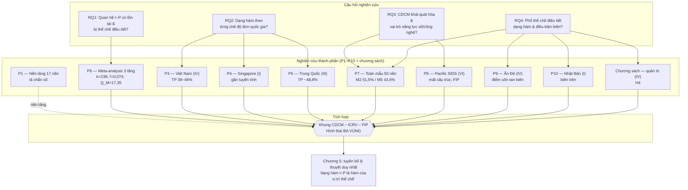
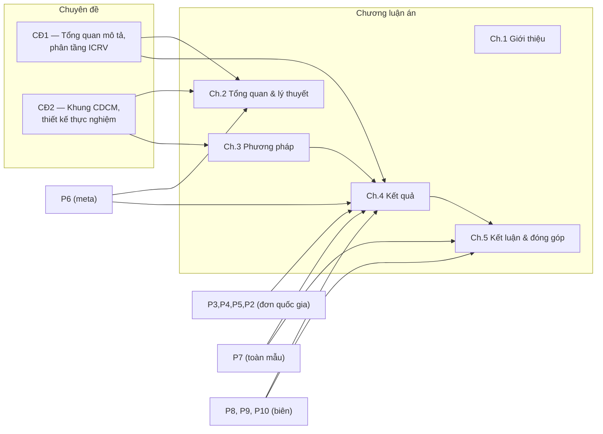
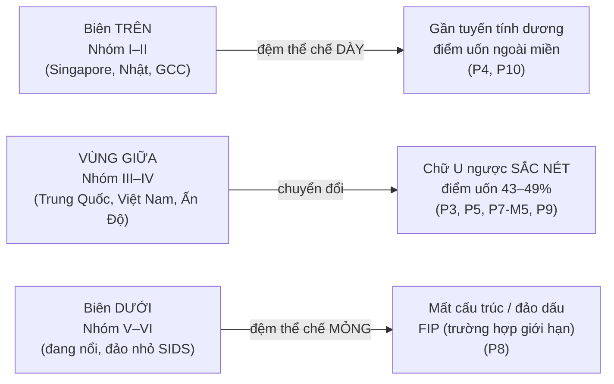

# 2. Trực quan hóa quan hệ giữa papers – chuyên đề – các chương luận án

> Các sơ đồ dùng cú pháp **Mermaid** (hiển thị trực tiếp trên GitHub/VS Code). Bảng "sợi chỉ vàng" trích từ Bảng 5.1 của Chương 5.

## 2.1 Sơ đồ tích hợp tổng thể: RQ → nghiên cứu thành phần → chương → chuyên đề

## 2.2 Ánh xạ nghiên cứu thành phần ↔ chương luận án

## 2.3 Hình thái ba vùng theo phổ thể chế ICRV

## 2.4 Bảng "sợi chỉ vàng" tích hợp (trích Bảng 5.1, Chương 5)

| RQ | Nghiên cứu (nhóm ICRV) | Giả thuyết | Phát hiện thực nghiệm chủ chốt | Đóng góp lý thuyết |
|---|---|---|---|---|
| Cơ sở | P1 — đa quốc gia 17 nền (N=40.633) | Nền tảng CDCM | hiệu ứng **lá chắn số** (rào cản × công nghệ +0,110; p<,001) | Đặt nền cho CDCM; nguồn gốc "lá chắn số" mà P7 mở rộng |
| RQ1 | P6 — meta toàn cầu | H1, H5 | k=238; r̄=0,074; I²=62,4%; **Q_M=17,35** (p=,002) | Quan hệ I–P dương nhỏ nhưng **dị biệt do thể chế** |
| RQ2 | P4 — Singapore (I) | H1, H3 | gần tuyến tính; điểm uốn ~88,6% (ngoài miền); DAI khuếch đại | **Biên trên:** đường cong duỗi thẳng |
| RQ2 | P3 — Việt Nam (IV) | H1, H2, H3 | chữ U ngược, điểm uốn 39–46%; TCI điều tiết dương | Chế độ neo; biên tham gia vs cường độ |
| RQ2 | P5 — Trung Quốc 2012–2024 (III) | H1, H6 | điểm uốn ổn định ~48,78% (Paternoster z=0,82; p=,412) | **Tính bền thời gian** của điểm uốn |
| RQ3 | P7 — toàn mẫu 50 nền | H1,H2,H3,H5 | N=81.022/79.080; điểm uốn 43,6–51,5%; TCI +0,141, DAI +0,201 | CDCM khái quát; TCI/DAI **nâng mặt bằng**, không uốn đường cong |
| RQ3 | P8 — Pacific SIDS (VI) | H1b | mất cấu trúc: dốc −0,085 (p_wild=,66), cong +0,696 (p_wild=,082); N=1.450 | Định danh **FIP** — điều kiện biên cực trị |
| RQ4 | P7 — toàn phổ ICRV | H5 | điểm uốn dịch theo chế độ (IV 43,0% → I gần tuyến tính → V/VI mất cấu trúc) | Thể chế điều tiết cả **dạng hàm** |
| RQ4 | P9 — Ấn Độ 2014–2025 (IV) | H1c | **tan biến** điểm uốn: 61,8% (2014) → 40,7% (2022) → mất ý nghĩa (2025) | Chuyển đổi mạnh **hòa tan** điểm uốn (biên thời gian) |
| RQ4 | P10 — Nhật Bản 2025 (I) | H1 (biên trên) | gần tuyến tính dương; phần bù xuất khẩu 25,8% | Xác nhận **dự đoán biên trên** (Melitz, 2003) |
| RQ4 | Chương sách — Ấn Độ, quản trị (IV) | H4 | ROS: kinh nghiệm +1,55; lãnh đạo nữ điều tiết dương (N=380) | Bằng chứng **tầng quản trị** của CDCM |

*Nhóm ICRV: I = tiên tiến đổi mới; III = trung bình cao; IV = chuyển đổi thu nhập trung bình thấp; V = đang nổi; VI = SIDS. Nguồn: tác giả tổng hợp; số liệu trích Mục 5.6.1 và 4.2–4.9.*

## 2.5 Cách đọc

- **Đọc ngang** một dòng: kiểm chứng tính nhất quán nội tại của một mắt xích (RQ → nghiên cứu → giả thuyết → bằng chứng → đóng góp).
- **Đọc dọc** cả bảng: thấy cách mười nghiên cứu thành phần độc lập + chương sách **bồi đắp lẫn nhau** thành một tuyên bố thống nhất, có thể bác bỏ.
- Ba sự **hội tụ ngoài mẫu** củng cố tính vững: Việt Nam (39–46%, P3), Trung Quốc (~48%, P5), Ấn Độ-2022 (40,7%, P9) đều rơi vào dải "vùng giữa" 43% của Nhóm IV (P7) — dù được ước lượng độc lập từ ba nguồn dữ liệu khác nhau.
