# overleaf-sync-now

> **Stops Claude Code and Codex CLI from silently overwriting your Overleaf web edits with a stale local Dropbox copy.**

[](https://github.com/hanlulong/overleaf-sync-now/actions/workflows/ci.yml)
[](LICENSE)
[](https://www.python.org/)
[](https://github.com/astral-sh/uv)

## The failure mode

You write a paper in Overleaf with Dropbox sync enabled. You edit on overleaf.com from another device, then come back to your laptop and ask Claude Code (or Codex CLI) to keep working on the paper. The AI agent reads the local `.tex` file — but Overleaf only pushes web edits to Dropbox **every 10–20 minutes**, so the local copy is stale. The AI proceeds to edit the stale file and saves it back, **silently overwriting your fresh web edits**. The tool call reports success. Paragraphs you wrote on the web vanish.

`overleaf-sync-now` is an **agent skill** (plus a CLI and a Claude Code PreToolUse hook) that closes this gap. Before every AI Read / Edit / Write of a `.tex` / `.bib` / `.cls` / `.sty` / `.bst` file under `Apps/Overleaf/`, it probes Overleaf's version history and pulls down anything new — without changing your existing Dropbox setup, so cross-device sync still works exactly as before.

### Is this for you?

- ✅ You write papers in **Overleaf Premium** with Dropbox sync enabled (`Dropbox/Apps/Overleaf/<project>/`)
- ✅ You edit `.tex` files locally with **Claude Code** or **Codex CLI**
- ✅ You also edit on **overleaf.com** sometimes — from another device, in a browser, or with collaborators

If you only ever edit locally *or* only ever edit on the web, your local copy is never stale and you don't need this. Same if you don't use Dropbox or AI agents.

---

## Install

In Claude Code or Codex CLI, paste this prompt:

```text
Install overleaf-sync-now from https://github.com/hanlulong/overleaf-sync-now using uv tool install, then run `overleaf-sync-now install`.
```

The agent installs everything and runs setup. **Restart the agent afterward** (`/exit` then `claude` in Claude Code; equivalent in Codex).

*On Windows with Chrome 130 or later, also run `overleaf-sync-now login` once — Chrome's new App-Bound Encryption blocks the silent cookie path. [Details](docs/authentication.md#why-chrome-130-needs-the-login-path).*

<details>
<summary><b>Manual install</b> (no AI agent)</summary>

**macOS / Linux:**
```bash
curl -LsSf https://astral.sh/uv/install.sh | sh && \
  export PATH="$HOME/.local/bin:$PATH" && \
  uv tool install --from git+https://github.com/hanlulong/overleaf-sync-now overleaf-sync-now && \
  overleaf-sync-now install
```

**Windows (PowerShell):**
```powershell
irm https://astral.sh/uv/install.ps1 | iex
$env:PATH = "$env:USERPROFILE\.local\bin;$env:PATH"
uv tool install --from git+https://github.com/hanlulong/overleaf-sync-now overleaf-sync-now
overleaf-sync-now install
```

</details>

### Verify

After restart, edit any `.tex` file under `Dropbox/Apps/Overleaf/<project>/` — the hook fires automatically. Or check manually:

```bash
overleaf-sync-now status   # cookie + linked project
overleaf-sync-now sync     # trigger a sync, print latency
```

---

## Why

You use Dropbox with Overleaf because it gives you **free multi-device sync** — an edit on your laptop is instantly readable on your desktop, your iPad, and your collaborator's machine. AI agents like Claude Code and Codex CLI plug into that setup naturally: they just read and write the local `.tex` file like you do.

The problem: Overleaf's Dropbox sync polls the **Overleaf-web → local** direction every 10–20 minutes. So if you've edited the paper on overleaf.com and then ask the AI to keep working, it reads a stale local file and silently overwrites the changes you just made — restoring deleted paragraphs, undoing fresh edits, all while reporting a successful tool call.

`overleaf-sync-now` checks Overleaf for fresh content immediately before each AI edit and pulls only what changed. Dropbox keeps doing its multi-device job; the AI loop stops clobbering your work. Nothing else in your setup changes.

| Sync direction | Stock Overleaf + Dropbox | With `overleaf-sync-now` |
|---|---|---|
| Local edit → Overleaf | a few seconds | a few seconds *(unchanged)* |
| **Overleaf web edit → local Dropbox** | **10–20 minutes** (next poll) | **~1 s probe; ~5–10 s if a real change must be pulled** |
| AI agent reads a stale local file | yes, often | **no** |

When nothing changed on the Overleaf side, the hot path is ~0.3–1 s (a single read-only probe, no zip download). When something changed, the tool downloads the project zip once and writes only the files whose content differs from local — typically 5–10 s for a normal paper.

---

## How it works

<p align="center">
  
</p>

1. The **PreToolUse hook** intercepts every `Read` / `Edit` / `Write` / `MultiEdit` of `.tex` / `.bib` / `.cls` / `.sty` / `.bst` files. Other tools and other file types pass through.
2. **Auto-link** maps `…/Apps/Overleaf/<name>/` to its Overleaf project ID via a 24-hour-cached project list. On a unique match the tool drops a tiny `.overleaf-project` marker into the folder so future resolution is deterministic — no manual setup needed. Override or pre-seed it with `overleaf-sync-now link <id>` when names differ or two projects share a name.
3. **Resolver safety net** (since 0.3.0): the cached project list keeps trashed/archived flags, lastUpdated, and ownerId. Trashed and archived projects are filtered out of auto-link, and if two living projects still share a name the tool refuses to guess — it lists the candidates and asks you to pick. A sync-time fingerprint check warns if the linked project's recent Dropbox-origin updates touch files not present locally (the "I linked the wrong project" smoke detector).
4. **Version-match probe**: `GET /project/<id>/updates` returns Overleaf's history (`fromV` / `toV` / changed pathnames / origin). The tool caches the latest `toV` per project.
   - Latest `toV` matches cached → skip, no download.
   - Updates exist but are all Dropbox-origin (echoes of our own local saves round-tripping through Dropbox) → skip, no download.
   - A web-origin update exists → `GET /project/<id>/download/zip` and extract only the changed pathnames, hash-compared so unchanged files aren't rewritten.
5. **Data-safety guard**: extraction never overwrites a local file modified in the last 30 seconds — protects an in-progress local save that hasn't yet propagated Dropbox → Overleaf. Override with `sync --force`.
6. **Debounce**: 30 s per project. A flurry of AI edits share one probe.

For deeper details, see [`docs/architecture.md`](docs/architecture.md).

---

## Subcommands

```
overleaf-sync-now --version                              # print package version
overleaf-sync-now install                                # one-shot setup (idempotent)
overleaf-sync-now login                                  # browser-assisted login (Chrome 130+ Windows)
overleaf-sync-now setup                                  # auth wizard (auto-detect from existing browsers)
overleaf-sync-now save-cookie <value>                    # paste a cookie value directly (last-resort)
overleaf-sync-now sync [folder] [--force]                # refresh against Overleaf; --force re-extracts
overleaf-sync-now status [folder] [--quick]              # cookie validity + linked project (source, name, trashed/archived flags, lastUpdated, cached toV)
overleaf-sync-now projects [--refresh]                   # list projects with NAME | PROJECT_ID | FLAGS (T/A/DUP) | LAST_UPDATED, sorted by recency
overleaf-sync-now doctor [folder]                        # full diagnostic, including a /updates probe
overleaf-sync-now link <id> .                            # override auto-link with a marker file (warns if id is trashed/archived)
overleaf-sync-now uninstall                              # remove skill + hook (keeps cookies)
```

`sync` and `status` default to the current directory. Run `overleaf-sync-now --help` for full usage.

---

## Documentation

| Topic | Where |
|---|---|
| **Authentication** — auth chain, Chrome 130+ ABE, manual paste fallback | [`docs/authentication.md`](docs/authentication.md) |
| **Architecture** — files written, hook internals, exit codes, latency budget, reverse-engineering | [`docs/architecture.md`](docs/architecture.md) |
| **Operations** — cookie maintenance, rate limits, upgrading, uninstalling, multi-account | [`docs/operations.md`](docs/operations.md) |
| **Troubleshooting** — common errors and fixes, diagnostic commands | [`docs/troubleshooting.md`](docs/troubleshooting.md) |
| **Contributing** — local setup, style, areas needing help | [`CONTRIBUTING.md`](CONTRIBUTING.md) |

---

## Related projects

The Overleaf-AI integration space is crowded. Each of these solves a different slice of the problem:

| Tool | Keeps Dropbox? | Fires automatically before AI edits? | Solves the stale-file failure mode? |
|---|---|---|---|
| **`overleaf-sync-now`** *(this repo)* | ✅ keeps it | ✅ Claude Code PreToolUse hook | ✅ |
| [`aloth/overleaf-skill`](https://github.com/aloth/overleaf-skill) (npm `@aloth/olcli`) | ❌ replaces it | ❌ manual `olcli sync` | partial — only when user remembers |
| [`overleaf-sync` (olsync)](https://github.com/moritzgloeckl/overleaf-sync) | ❌ replaces it | ❌ manual `olsync download` | partial — same as above |
| [Overleaf Git integration](https://www.overleaf.com/learn/how-to/Using_Git_and_GitHub) (Premium) | ❌ replaces it | ❌ manual `git pull` | partial — same as above |
| [Overleaf Workshop (VS Code)](https://github.com/overleaf-workshop/Overleaf-Workshop) | ❌ no Dropbox | ❌ different model (live WebSocket) | n/a — you're not editing local files |
| MCP servers ([OverleafMCP](https://github.com/mjyoo2/OverleafMCP), [overleaf-claude-mcp](https://github.com/Junfei-Z/overleaf-claude-mcp), [Overleaf-mcp](https://github.com/GhoshSrinjoy/Overleaf-mcp), [overleafMCP-rw](https://github.com/hiufungleung/overleafMCP-rw)) | ❌ go via Git | ❌ Claude calls a tool | n/a — different model |
| [`pyoverleaf`](https://github.com/jkulhanek/pyoverleaf) | n/a | n/a | a library, not a product |

`overleaf-sync-now` is the only tool that **keeps Dropbox** (so all your devices and collaborators stay in sync the way they already do) **and fires automatically** (so the AI agent loop never reads a stale file). Smaller, narrower, invisible.

---

## License

[MIT](LICENSE)

## Credits

Created by **[Lu Han](https://luhan.io/)**. Published by **[OpenEcon.ai](https://openecon.ai/)**.

If this saved you time, a ⭐ on the repo helps other researchers find it.
