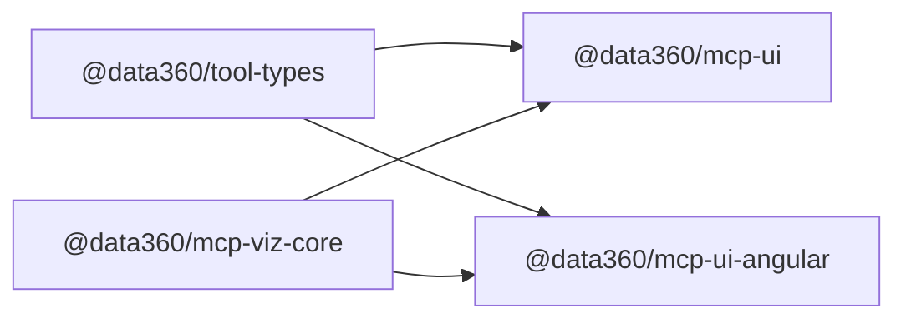

# Unified React + Angular MCP tool UI (npm packages)

This skill applies to the **Data360 MCP monorepo** (`data360-mcp`): published packages that chat hosts and portals install to render tool output. It does **not** replace **MCP Apps** work (`registerAppResource`, HTML in an iframe, `@modelcontextprotocol/ext-apps`). For iframe UIs, use **add-app-to-server**. Here, the deliverable is **`@data360/mcp-ui`** (React) and **`@data360/mcp-ui-angular`** (Angular), sharing **`@data360/tool-types`** and **`@data360/mcp-viz-core`**.

## Architecture

| Layer | Package | Role |
|-------|---------|------|
| Tool JSON contract | `@data360/tool-types` | Zod schemas, runtime parsers, versioned tool result shapes |
| Framework-agnostic UI logic | `@data360/mcp-viz-core` | `prepareSpec`, `parseSpec`, themes, shared props types (e.g. `VegaChartCardBaseProps`) |
| React | `@data360/mcp-ui` | Vite library; components + re-exports from viz-core |
| Angular | `@data360/mcp-ui-angular` | ng-packagr library; standalone components |

## Unification rules (non-negotiable)

1. **One contract** — Parsers and types for MCP tool payloads live in `packages/tool-types`. Bump the documented contract version when JSON shapes change.
2. **No duplicated pipelines** — Anything that is not inherently React or Angular (spec normalization, palettes, shared prop fields) belongs in `packages/mcp-viz-core`. Do not fork `prepareSpec`-style logic into a single framework.
3. **Props parity** — Shared fields use types from viz-core (e.g. extend `VegaChartCardBaseProps`). Framework-only extras: React `ReactNode` slots vs Angular `TemplateRef` / `ng-content`, same semantics.
4. **Same peer stack** — `vega`, `vega-lite`, `vega-embed` peers aligned across React and Angular packages; `@data360/mcp-viz-core` version aligned in both consumers.
5. **Docs and versions** — Update README compatibility tables and bump packages together when viz behavior or contracts change.

## Workflow (follow in order)

1. **Tool output** — Read the MCP tool handler / schema. Define or update parsers and types in `packages/tool-types` (schemas, `parse*` helpers, exports).
2. **Shared logic** — Add or extend `packages/mcp-viz-core` for any TS that both UIs need (types, `prepare*` / `parse*`, constants). Keep JSX or Angular templates out of this package.
3. **React** — Add or change components under `packages/mcp-ui` (e.g. `src/<feature>/`). Register a library entry in `vite.config.ts` if you add a new subpath; add `@data360/mcp-viz-core` to Rollup `external` and `package.json` dependencies. Re-export shared APIs from viz-core where useful.
4. **Angular** — Add or change standalone components under `packages/mcp-ui-angular/src/lib/`. Export from `src/public-api.ts`. Build with ng-packagr; publishing ships the repo `package.json` plus the `dist/` tree (`files`: `dist`, `README.md`) with entry points under `./dist/...` (`module`, `typings`, `exports`).
5. **Documentation** — Update `packages/mcp-ui/README.md`, `packages/mcp-ui-angular/README.md`, and `components/README.md` (package list / compatibility).
6. **Manual check** — Optionally extend `packages/mcp-ui-angular-demo` and use `packages/mcp-ui`’s Vite demo (`npm run dev`) to verify both surfaces.

## Parity checklist (React vs Angular)

Use this when reviewing or implementing a pair of components. For the chart card reference implementation, compare `packages/mcp-ui/src/viz-card/VegaChartCard.tsx` with `packages/mcp-ui-angular/src/lib/data360-vega-chart-card.component.ts` (and template).

| Concern | React | Angular |
|---------|--------|---------|
| Inputs match `VegaChartCardBaseProps` (+ framework slot) | Props interface extends base + `railTopSlot?` | `@Input()` mirrors base + `railTopSlot` as `TemplateRef` |
| Legend / filter state | `parseSpec` on raw `spec`, `activeGroups` | Same |
| Embed | `prepareSpec` → `vega-embed`, same options | Same |
| Download / PNG / copy spec | Same defaults and callbacks | Same |
| Edge: no color series | Embed still runs | Same |
| Edge: all groups toggled off | Skip embed when multi-series would be empty | Same |

A printable copy lives in [`references/checklist.md`](references/checklist.md).

## Repo hygiene: strict JSON hooks

If **pre-commit** runs `check-json`, `tsconfig*.json` and `.vscode/*.json` must be **strict JSON** (no `//` or `/* */` comments). The Angular CLI often generates JSONC; strip comments or exclude those paths in the hook config. The `mcp-ui-angular-demo` package was normalized accordingly.

## Publishing (reminder)

- Build artifacts: `npm run build` from monorepo root (or per workspace).
- Publish **`@data360/mcp-viz-core`** before **`@data360/mcp-ui`** and **`@data360/mcp-ui-angular`** when viz-core changed.
- Align `dependencies` / `peerDependencies` on `@data360/mcp-viz-core` with the published version.
- Use `npm publish -w @data360/<package>` from root, or `npm publish` inside each package (Angular: tarball includes `dist/` per `files`; `prepublishOnly` runs `build`).

## Out of scope for this skill

- Codegen / Angular schematics (document manual steps first).
- Python MCP server changes (separate task unless wiring new tool names).
