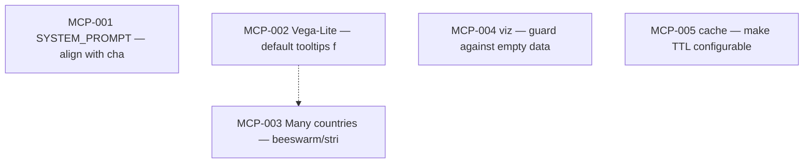

# data360-mcp — task index

Agent-oriented work items. Each task is a standalone `.md` file with context, acceptance criteria, and dependency metadata. (5 active)

**Sibling repos:** [data-ai-chatbot/TODO](../data-ai-chatbot/TODO/README.md)

## Task IDs

| ID | File | Summary |
|----|------|---------|
| MCP-001 | [MCP-001-system-prompt-sync.md](./MCP-001-system-prompt-sync.md) | Reduce drift between MCP-only LLM clients and the Data AI Chatbot: update `SY... |
| MCP-002 | [MCP-002-vega-line-tooltips.md](./MCP-002-vega-line-tooltips.md) | Line (and similar) charts emitted by `get_viz_spec` show hover tooltips by de... |
| MCP-003 | [MCP-003-beeswarm-multi-country.md](./MCP-003-beeswarm-multi-country.md) | When many countries/series make line charts unreadable or data is truncated, ... |
| MCP-004 | [MCP-004-viz-empty-data-guard.md](./MCP-004-viz-empty-data-guard.md) | Prevent `generate_vega_spec()` from crashing with a `KeyError` when `data` is... |
| MCP-005 | [MCP-005-cache-configurable-ttl.md](./MCP-005-cache-configurable-ttl.md) | Replace the hardcoded 300-second TTL in the cache module with a value read fr... |

## Dependency graph (this repo)

## How to use

1. Point an agent at `TODO/` or a specific task file.
2. Check `depends_on` in the task frontmatter before starting — all hard deps must be `done`.
3. Claim a task by setting `status: in_progress` and committing immediately.
4. After completing a task, set `status: done`, tick acceptance criteria checkboxes, and check `blocks` for newly unblocked tasks.
