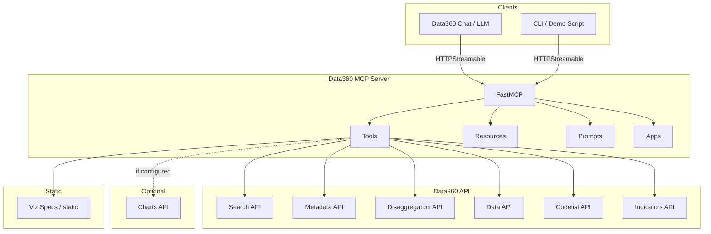

# Data360 MCP — Architecture Document

**Document type:** Architecture
**System:** Data360 MCP Server
**Codebase:** data360-mcp

---

## 1. Purpose and Scope

This document describes the architecture of the **Data360 MCP Server**, the component that exposes the World Bank Data360 Platform to LLM agents and chatbots via the Model Context Protocol (MCP). It is intended for developers and architects who need to understand how the server is built, how it integrates with Data360 and optional chart services, and how tools, resources, and apps are exposed to clients.

**In scope:** Server structure, MCP tools and resources, prompts and apps, data sources (Data360 API, codelists, optional Charts API), visualization pipeline, configuration, and deployment. **Out of scope:** Detailed API contracts of the Data360 Platform, MCP protocol specification details (those are in the official MCP documentation), and product roadmaps.

---

## 2. Intended Audience

- **Developers** integrating with or extending the Data360 MCP server (e.g. adding tools or resources).
- **Architects** evaluating how the server fits into a larger chatbot or agent pipeline.
- **Operations** deploying and configuring the server (ports, transports, env, Azure).

---

## 3. Introduction and Context

The World Bank Data360 Platform holds a large set of development indicators and related metadata. LLMs and chatbots need a structured way to search indicators, check metadata and disaggregation, fetch time-series data, and produce charts—without embedding Data360-specific logic inside each client. The Data360 MCP server fills that role: it implements the Model Context Protocol so that any MCP-capable client (such as Data360 Chat) can discover and call a fixed set of tools, read contextual resources (e.g. system prompts and codelists), and optionally render tool results in interactive app UIs (chart view, search results). The server itself is stateless with respect to user sessions; it acts as a bridge between MCP clients and the Data360 HTTP API (and, when configured, an external charts API for persisting Vega-Lite specs).

The architecture reflects a few deliberate choices: **one FastMCP instance** with all tools, resources, prompts, and apps registered in one place so that discovery and startup are predictable; **thin tool layer** that delegates to existing Python modules (`api`, `providers`, `visualization`) so that business logic stays reusable and testable outside MCP; **resources as the primary way to inject context** into LLM agents (system prompt, codelists, schema) so that clients can load exactly what they need; and **support for both HTTP (stateless) transports** so that the server can run in production behind load balancers (e.g. Azure) or locally for development and demos.

---

## 4. Architectural Goals and Principles

- **Agent-friendly API:** Tools and resources are designed so that an LLM can search, validate availability, fetch metadata and data, and request charts in a consistent way (e.g. search first, then get_data with the right filters).
- **Single source of truth for Data360:** All Data360 access goes through this server’s API and provider layer; codelists and filter logic are centralized so that clients do not duplicate validation or mapping rules.
- **Optional visualization and apps:** Chart generation is built in (Draco, Altair, Vega-Lite), but storage of specs can be local (static files) or delegated to an external Charts API; MCP Apps provide optional rich UI (chart view, search results) without requiring every client to implement them.
- **Operational flexibility:** Configuration is environment-driven (MCP and Data360 URLs, ports, transports, logging); the server can be run as a CLI process or as an ASGI app behind a reverse proxy.

---

## 5. System Context

Clients (e.g. Data360 Chat or a demo script) connect to the Data360 MCP server over HTTP (stateless). The server does not store user sessions or conversation state; each request is independent. The server in turn calls the World Bank Data360 API for search, metadata, disaggregation, data, codelists, and indicator listing. For charts, it fetches data from Data360, generates a Vega-Lite spec using Draco and Altair, and either writes the spec to a local `static/` directory (served by the same process) or POSTs it to an external Charts API when configured. The diagram below summarizes these relationships: clients talk only to the MCP server, and the MCP server talks to Data360 and optionally to a Charts API.

---

## 6. Technology Stack

The server is implemented in Python (3.10+) using FastMCP and the MCP SDK. All outbound calls to Data360 use `httpx` in async mode so that the server can handle concurrent tool calls without blocking. Chart generation uses Draco (for constraint-based visualization), Altair (for high-level chart specs), and Vega-Lite as the interchange format; specs are either written to disk and served under `/static` or sent to an external Charts API. Configuration is handled with Pydantic settings and environment variables so that the same codebase can run in development, test, and production with different endpoints and ports.

| Layer          | Technology                  | Purpose                                                              |
| -------------- | --------------------------- | -------------------------------------------------------------------- |
| **MCP**        | FastMCP, MCP 1.18+          | Server definition, tools, resources, prompts, apps                   |
| **Transport**  | Streamable HTTP (stateless) | Production (e.g. Azure) and CLI/local                                |
| **API client** | httpx (async)               | Data360 search, metadata, disaggregation, data, codelist, indicators |
| **Viz**        | Draco2, Altair, Vega-Lite   | Chart generation from time-series data                               |
| **Config**     | Pydantic settings           | MCP and Data360 env-based configuration                              |

---

## 7. Project Structure and Module Roles

The codebase is organized so that MCP-specific code (tool registration, resource URIs, app registration) lives under `src/data360/mcp_server/`, while the core logic for calling Data360 and building charts lives in the parent package (`api.py`, `providers.py`, `visualization.py`, `viz_config.py`). This keeps the MCP layer thin and makes it easy to reuse the same logic from a non-MCP script or test. The following table is a quick reference; the narrative in the next sections explains how these pieces work together.

| Path                                               | Purpose                                                                                               |
| -------------------------------------------------- | ----------------------------------------------------------------------------------------------------- |
| `**src/data360/`**                                 | Main package                                                                                          |
| `**src/data360/server.py**`                        | ASGI entry: FastAPI app, mounts MCP at `/`, static at `/static`, `path="/mcp"`, `stateless_http=True` |
| `**src/data360/mcp_server/**`                      | MCP server definition, tools, resources, prompts, apps                                                |
| `**src/data360/mcp_server/__main__.py**`           | CLI entry: Typer + `mcp.run(transport=..., port=...)` (default port 8021)                             |
| `**src/data360/mcp_server/_server_definition.py**` | Single `FastMCP("Data360 MCP Server")` instance                                                       |
| `**src/data360/config.py**`                        | `MCPServerSettings`, `Data360Settings`, logging                                                       |
| `**src/data360/models.py**`                        | Pydantic models for API requests/responses                                                            |
| `**src/data360/api.py**`                           | Async Data360 client (search, metadata, disaggregation, data, indicators, URLs)                       |
| `**src/data360/providers.py**`                     | CodelistManager: REF_AREA, UNIT_MEASURE from API; static FREQ, SEX, AGE, URBANISATION                 |
| `**src/data360/visualization.py**`                 | Data fetch, Draco + Altair → Vega-Lite, save to static or POST to Charts API                          |
| `**src/data360/viz_config.py**`                    | Chart types, frequency/timeUnit, data prep and post-processing rules                                  |
| `**static/**`                                      | Created at runtime; `static/viz_specs/` for Vega-Lite when no external Charts API                     |
| `**docs/**`                                        | Implementation notes (e.g. MCP Apps)                                                                  |
| `**scripts/**`                                     | `llm_mcp_demo.py`, `verify_app_tools_meta.py`                                                         |

---

## 8. MCP Server Definition and Transports

The server is built on [FastMCP](https://github.com/jlowin/fastmcp). A single `FastMCP("Data360 MCP Server")` instance is created in `_server_definition.py`; the package’s `__init__.py` imports the modules that register tools, resources, and prompts so that they attach to this instance at import time. This ensures that when the server starts, the full capability set is already registered.

Two ways to run the server are supported. For **production or hosted environments** (e.g. Azure Web Apps), the ASGI app in `server.py` is used: it creates a FastAPI app, mounts the MCP HTTP app at a path such as `/mcp` with `stateless_http=True`, and serves the `static/` directory so that chart specs and app UIs can be loaded by the client. This mode is stateless and scales horizontally. For **local development or demos**, the CLI entry point `python -m data360.mcp_server` runs the MCP server with a transport such as streamable-http on a configurable port (default 8021). The `poe serve` task in pyproject typically runs the server in a similar way (e.g. port 8022). The choice of transport and port is configuration-driven so that deployment and local runs can differ without code changes.

---

## 9. Tools

Tools are the primary way clients interact with Data360. Each MCP tool is a thin wrapper around a function in `api`, `providers`, or `visualization`; the tool’s name and parameters are derived from the function signature and docstring so that the LLM receives a clear description and schema. The intended workflow is **search first, then refine**: the client uses `data360_search_indicators` to find indicators (optionally with `required_country` for server-side coverage checks), then uses `data360_get_disaggregation` to see which countries and years have data, and finally uses `data360_get_data` with the appropriate filters (REF_AREA, time, SEX, AGE, URBANISATION) to retrieve time-series data. Metadata and codelist resolution (`data360_get_metadata`, `data360_find_codelist_value`) support this workflow by letting the agent fetch only the fields it needs and resolve human-readable names (e.g. “Kenya”, “female”) to the codes required by the Data360 API. Chart generation is exposed via `data360_get_viz_spec`, which fetches data (using the same Data360 data endpoint), builds a Vega-Lite spec with Draco and Altair, and either stores it under `static/viz_specs/` or POSTs it to an external Charts API; the tool returns a URL or identifier so that the client (or an MCP App) can render the chart. Two tools—`data360_search_indicators` and `data360_get_viz_spec`—are associated with MCP Apps so that hosts can open a search-results or chart-view iframe with the tool result.

| Tool                                    | Backing                                   | Purpose                                                                        |
| --------------------------------------- | ----------------------------------------- | ------------------------------------------------------------------------------ |
| `**data360_search_indicators**`         | `api.search`                              | Search indicators; optional `required_country`; enriched metadata and coverage |
| `**data360_get_metadata**`              | `api.get_metadata`                        | Indicator metadata with optional `select_fields`                               |
| `**data360_get_data**`                  | `api.get_data`                            | Time-series data with filters (REF_AREA, time, SEX, AGE, URBANISATION)         |
| `**data360_get_disaggregation**`        | `api.get_disaggregation`                  | Available filter values (countries, years, dimensions)                         |
| `**data360_find_codelist_value**`       | `providers.find_codelist_value`           | Resolve names to codes (e.g. country, sex, unit)                               |
| `**data360_list_indicators**`           | `api.get_indicators`                      | List indicator IDs for a database                                              |
| `**data360_get_data_api_url**`          | `api.get_data_api_url`                    | Build data API URL only (low-level)                                            |
| `**data360_get_viz_spec**`              | `visualization.get_viz_spec`              | Generate Vega-Lite spec; store in static or Charts API; **has MCP App**        |
| `**data360_get_supported_chart_types**` | `visualization.get_supported_chart_types` | Chart types and data requirements (JSON)                                       |

---

## 10. Resources and Prompts

Resources provide read-only context that LLM agents can load to guide their behavior. Instead of hard-coding Data360 conventions in every client, the server exposes them as MCP resources under the `data360://` URI scheme. The **system prompt** resource (`data360://system-prompt`) contains chain-of-thought and workflow guidance so that a chatbot can instruct the model to search, then check disaggregation, then fetch data. The **codelists** and **metadata-fields** resources document valid codes and field names, reducing hallucination of invalid filters. The **data-schema** and **data-filters** resources explain the shape of the data and the supported dimensions. A **context** resource supplies runtime values (e.g. current date or year) so that queries can be time-aware. These resources are registered in `resources.py` and are typically fetched once per session or when the client builds its system message.

Prompts are parameterized workflows registered with `@mcp.prompt()`. They guide the LLM through multi-step flows such as “indicator search,” “indicator details,” and “country data,” so that a client can invoke a named prompt with parameters instead of constructing the full instruction set itself. The prompts live in `prompts.py` and reference the same workflow ideas as the system prompt and tools.

**Client examples in this repository:** a minimal LangChain one-shot that reads `data360://system-prompt` and `data360://context` is in [examples/agents/langchain-minimal/](../examples/agents/langchain-minimal/); an interactive REPL with token tracking is [scripts/llm_mcp_demo.py](../scripts/llm_mcp_demo.py). For **multi-agent graphs**, use [examples/agents/langchain-graph/](../examples/agents/langchain-graph/) and import from the **`data360-mcp-agent`** package ([`packages/data360-mcp-agent/`](../packages/data360-mcp-agent/)) — e.g. `from data360_mcp_agent.plugin import create_data360_langgraph_node` or `create_data360_gated_langgraph_node` (LangGraph `add_messages` state; gated node adds relevance + optional reformulation before tools). [data360_mcp_service.py](../data360_mcp_service.py) at the repo root is a backward-compatible shim re-exporting `data360_mcp_agent`.

| URI                             | Content                                                                   |
| ------------------------------- | ------------------------------------------------------------------------- |
| `**data360://system-prompt**`   | Chain-of-thought system prompt (from `prompts.SYSTEM_PROMPT`)             |
| `**data360://context**`         | Runtime context (e.g. current date/year)                                  |
| `**data360://databases**`       | Example database list (WB_WDI, IPC_IPC, WB_SSGD, WB_POVERTY)              |
| `**data360://codelists**`       | Codelist reference (REF_AREA, UNIT_MEASURE, SEX, AGE, URBANISATION, etc.) |
| `**data360://metadata-fields**` | Field mapping for routing questions (methodology, limitation, etc.)       |
| `**data360://data-filters**`    | Supported filters and usage (excludes FREQ)                               |
| `**data360://data-schema**`     | Standard columns and visualization guidance                               |
| `**data360://search-usage**`    | Search examples and workflow                                              |

---

## 11. MCP Apps

MCP Apps allow hosts to render tool results in interactive iframes instead of plain text or JSON. The Data360 MCP server registers app resources (HTML documents) with a MIME type that indicates they are MCP apps; tools that support apps attach a `resourceUri` in their metadata so that the host can open the corresponding app and pass the tool result (e.g. a chart URL or search result payload). The **chart view** app loads a Vega-Lite spec from a URL (returned by `data360_get_viz_spec`) and renders it with vega-embed. The **search results** app renders the structured result of `data360_search_indicators` as a table or cards. A **QR view** app is provided as an example. The app HTML is defined in `apps_resources.py` and registered in `apps.py`; CSP and `resourceDomains` are set so that the host can load scripts (e.g. from unpkg) safely. Implementation details and alignment with the official MCP Apps extension are documented in `docs/mcp-apps-implementation-notes.md`.

| App                | URI                                | Tool(s)                     | Purpose                                                           |
| ------------------ | ---------------------------------- | --------------------------- | ----------------------------------------------------------------- |
| **Chart view**     | `ui://data360/chart-view.html`     | `data360_get_viz_spec`      | Renders Vega-Lite (vega-embed); fetches spec URL from tool result |
| **Search results** | `ui://data360/search-results.html` | `data360_search_indicators` | Renders indicator table/cards from tool result                    |
| **QR view**        | `ui://data360/qr-view.html`        | (example)                   | QR demo                                                           |

---

## 12. Data Sources and Integrations

The server’s only persistent data source is the **World Bank Data360 HTTP API**. All indicator search, metadata, disaggregation, and time-series data are fetched from endpoints derived from a base URL configured in `Data360Settings` (env prefix `DATA360`_). The client in `api.py` uses `httpx.AsyncClient`; endpoints can be overridden (e.g. search_url, metadata_url) for testing or different environments. There is no local database; the server is stateless aside from in-memory caches (e.g. codelists).

**Codelists** are needed to map human-readable values (e.g. country names, “female”) to the codes required by the Data360 API. REF_AREA and UNIT_MEASURE are fetched from the Data360 codelist API and cached in `CodelistManager` in `providers.py`. Other dimensions (FREQ, SEX, AGE, URBANISATION) use static mappings defined in code where the API does not expose a codelist. This split keeps the server working even when only a subset of codelists is available from the API.

**Charts** are generated inside the server: data is fetched from the Data360 data URL, then transformed (time_period, obs_value, ref_area) and passed through Draco (for constraint-based chart type and encoding choices) and Altair to produce a Vega-Lite spec. The spec can be written to `static/viz_specs/` and served by the same server, or POSTed to an external **Charts API** when `MCP_CHARTS_API_URL` is set. The latter is useful when chart storage and serving are handled by a dedicated service (e.g. with access control or CDN). The visualization pipeline and post-processing rules (e.g. timeUnit, ordinal vs temporal axes) are configured in `viz_config.py`.

---

## 13. Key Architectural Decisions

- **Single FastMCP instance with registration at import:** All tools, resources, and prompts are registered when the `mcp_server` package is imported, so the server always exposes a consistent capability set and there is no runtime registration order dependency.
- **Thin MCP tool layer:** Tool implementations live in `api`, `providers`, and `visualization`; the MCP layer only wraps them and exposes docstrings/schemas. This keeps core logic testable and reusable outside MCP (e.g. in scripts or other services).
- **Resources as the primary context mechanism:** Instead of baking long instructions into each client, the server exposes system prompt, codelists, and schema as resources so that clients can compose their own system message and stay in sync with server-side conventions.
- **Stateless HTTP for production:** Using `stateless_http=True` and mounting the MCP app on FastAPI allows the server to run behind standard load balancers and scale horizontally without session affinity.

---

## 14. Configuration and Deployment

Configuration is split into **MCP server settings** (port, transport, log file and level, optional charts API URL) and **Data360 settings** (API base URL and optional endpoint overrides, metadata search fields, confidentiality levels). Both are read from the environment (prefixes `MCP`_ and `DATA360_`) so that the same image or package can be deployed to multiple environments. In Azure, `WEBSITE_HOSTNAME` can be used when building chart or static URLs so that the client can load them from the correct host. The server is typically run via `uv run fastmcp run src/data360/server.py` (ASGI) or `python -m data360.mcp_server` (CLI); the Azure workflow (e.g. in `.github/workflows/azure.yml`) builds with Python 3.12 and deploys to an Azure Web App. Static files under `/static` (including generated viz specs) must be reachable by the client; when using an external Charts API, the returned chart URL must point to a host the client can access.

### Health and readiness endpoints

The FastAPI wrapper exposes HTTP probes implemented in `src/data360/health.py`:

| Route | Purpose | HTTP status |
|-------|---------|-------------|
| `GET /mcp/health` | **Liveness** — process is running (no outbound I/O) | Always `200` |
| `GET /mcp/ready` | **Readiness** — critical dependencies are usable | `200` when ready, `503` when not |

**Critical checks** (any failure → `503`):

- **`data360_api`** — minimal `POST` to the configured search endpoint (`top: 1` dataset query).
- **`database_mapping`** — in-memory `database_id` → name map from `get_database_mapping()` must be non-empty with valid entries.
- **`viz_storage`** — Charts API reachability when `MCP_CHARTS_API_URL` is set (with static fallback), or writable `static/viz_specs/` when Charts API is not configured.

**Non-blocking check:** **`codelist_api`** — `GET` REF_AREA codelist; failures are reported with `degraded: true` but do not fail readiness alone.

Environment toggles: `MCP_READINESS_ENABLED` (default `true`; set `false` to skip probes), `MCP_HEALTH_CHECK_TIMEOUT` (per-check seconds, default `5`).

**Operations:** Use `/mcp/health` for liveness and `/mcp/ready` for readiness in Azure App Service, Kubernetes, or load balancers. Routes are registered on the FastMCP Starlette app with paths `/mcp/health` and `/mcp/ready` (alongside the streamable MCP endpoint at `/mcp`). If traffic passes through APIM or another gateway, allow those paths in addition to `/mcp`.

---

## 15. Related Documentation

- **README.md** — Quick start, tools table, recommended workflow (search → get_data), chatbot integration, config table.
- **DEVELOPMENT.md** — Dev setup (uv, pre-commit), project structure, tests (ruff, pyright), Python API usage, MCP resources, optional Charts API, technical notes (OData, metadata vs availability).
- **docs/mcp-apps-implementation-notes.md** — MCP Apps alignment with ext-apps, tool `_meta.ui.resourceUri`, UI resource URIs, MIME type, CSP/resourceDomains, verification script, references.
