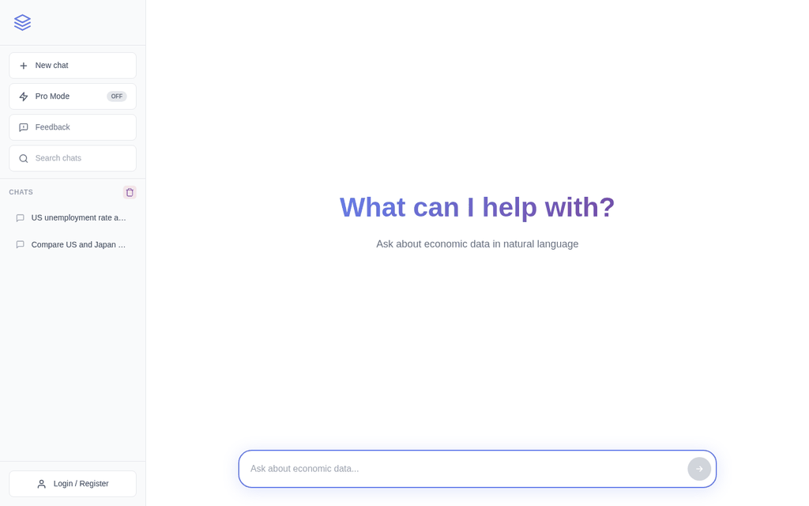

<p align="center">
  
</p>

<h1 align="center">OpenEcon Data</h1>

<p align="center">
  <strong>Give your AI agent accurate economic data.</strong><br/>
  330K indicators from FRED, World Bank, IMF, Eurostat, and 6 more sources — one MCP command away.
</p>

<p align="center">
  <a href="https://data.openecon.ai/chat"></a>
  <a href="LICENSE"></a>
  <a href="https://github.com/hanlulong/openecon-data/stargazers"></a>
  <a href="https://github.com/hanlulong/openecon-data/issues"></a>
  
  
  
</p>

<p align="center">
  <a href="https://openecon.ai">Website</a> &middot;
  <a href="https://data.openecon.ai/chat">Live App</a> &middot;
  <a href="docs/README.md">Docs</a> &middot;
  <a href="docs/development/DEVELOPER_CONTRIBUTOR_GUIDE.md">Contributing</a>
</p>

---

## Install (One Line, Then Just Talk)

```bash
curl -fsSL https://raw.githubusercontent.com/hanlulong/openecon-data/main/scripts/install.sh | bash
```

That's it. The script auto-detects Claude Code and Codex, configures everything. Then just ask:

```
You: "What's the US GDP growth rate?"         → your agent fetches real data from FRED
You: "Compare inflation across G7 countries"   → World Bank data for 7 countries
You: "Bitcoin price last 30 days"              → CoinGecko live data
```

No special syntax. No "use query_data". Just ask naturally — your agent handles the rest.

<details>
<summary><b>Manual install (if you prefer)</b></summary>

**Claude Code:**
```bash
claude mcp add --transport sse openecon-data https://data.openecon.ai/mcp --scope user
```

**Codex:**
```bash
codex mcp add openecon-data --url https://data.openecon.ai/mcp
```

**Any MCP agent:** Endpoint `https://data.openecon.ai/mcp` (SSE transport)

See [skills/README.md](skills/README.md) for slash commands and auto-trigger options.
</details>

---

<p align="center">
  
</p>

## Why Your Agent Needs This

AI agents hallucinate economic data. When you ask an LLM "What is US GDP?", you get a plausible-sounding number that may be outdated or wrong. OpenEcon solves this:

| | Without OpenEcon | With OpenEcon |
|---|---|---|
| **Data source** | LLM's training data (stale) | Official APIs (FRED, World Bank, IMF) |
| **Accuracy** | Approximate, often wrong | Verified, with source attribution |
| **Coverage** | Whatever the LLM remembers | 330K+ indicators, 200+ countries |
| **Recency** | Months or years behind | Up to real-time (FRED, ExchangeRate) |
| **Verifiable** | No source link | Every result includes source URL |

## How It Compares

| Feature | OpenEcon | fredapi | pandas-datareader | fred-mcp-server |
|---------|----------|---------|-------------------|-----------------|
| Natural language queries | Yes | No | No | No |
| Data sources | 10+ | 1 (FRED) | 5 | 1 (FRED) |
| MCP server for AI agents | Yes | No | No | Yes |
| Web UI with charts | Yes | No | No | No |
| Conversational follow-ups | Yes | No | No | No |
| Smart indicator discovery | 330K indexed | Manual codes | Manual codes | Manual codes |
| Self-hostable | Yes | N/A | N/A | Yes |
| No code required | Yes | No | No | No |

## What You Can Ask

```
"US GDP growth last 10 years"                    → FRED, quarterly chart
"Compare China, India, Brazil GDP 2018-2024"     → World Bank, multi-country comparison
"Inflation rate BRICS countries 2019-2023"        → World Bank, 5 countries auto-expanded
"EUR/USD exchange rate last 24 months"            → ExchangeRate-API, currency pair chart
"US unemployment and CPI together since 2010"     → FRED, dual-axis overlay
"China exports to the US 2020-2024"               → UN Comtrade, bilateral trade flow
"Credit to GDP ratio US, UK, Japan from BIS"      → BIS, financial stability data
"Bitcoin price last year"                         → CoinGecko, crypto chart
"What inflation indicators does FRED have?"       → Indicator discovery, text response
```

**Conversational follow-ups work naturally:**
```
You: "US GDP last 5 years"          → chart with US GDP
You: "add Germany and Japan"         → updates to 3 countries
You: "what about per capita?"        → switches to GDP per capita
You: "show only 2020-2023"           → narrows time range
```

## Quick Start

### Use the web app (no setup)

**[data.openecon.ai/chat](https://data.openecon.ai/chat)** — no signup, no install.

### Self-host

```bash
git clone https://github.com/hanlulong/openecon-data.git
cd openecon-data
cp .env.example .env          # Add your OPENROUTER_API_KEY
pip install -r requirements.txt
npm install
python3 scripts/restart_dev.py
# Backend: http://localhost:3001  |  Frontend: http://localhost:5173
```

<details>
<summary><b>Requirements</b></summary>

- Python 3.10+
- Node.js 18+
- An [OpenRouter API key](https://openrouter.ai/keys) (required for LLM parsing)
- Optional: FRED API key, Comtrade API key, CoinGecko API key
- Optional: Supabase credentials (for auth + persistent history)

See [Getting Started Guide](docs/guides/getting-started.md) for full setup instructions.
</details>

## How It Works

```
  "Compare US and           ┌──────────────┐        ┌────────────────┐
   Japan inflation"    ───▶ │  LLM Parser  │  ───▶  │  LLM Router    │
                            │  (intent,    │        │  (semantic      │
                            │   countries, │        │   routing +     │
                            │   dates)     │        │   330K index)   │
                            └──────────────┘        └───────┬────────┘
                                                            │
                            ┌────────────┐          ┌───────▼────────┐
                            │ Chart +    │  ◀────── │  Fetch from    │
                            │ CSV/JSON/  │          │  best provider │
                            │ DTA/Python │          │  (FRED, WB,    │
                            └────────────┘          │   IMF, ...)    │
                                                    └────────────────┘
```

1. **Parse** — An LLM extracts intent, countries, indicators, and date range from plain English
2. **Route** — Semantic routing picks the best provider and series from 330K+ indicators
3. **Fetch** — Data retrieved from official APIs with automatic fallback if a source is down
4. **Return** — Interactive chart, or structured data via MCP for your agent

## Features

**MCP Server** — First-class [Model Context Protocol](https://modelcontextprotocol.io) support. Give Claude Code, Codex, or any MCP-compatible agent access to verified economic data.

**Natural Language** — No API docs, no country codes, no series IDs. Just describe what you want.

**330K Indicator Discovery** — Full-text search across FRED, World Bank, IMF, Eurostat, BIS, and more. Ask "What trade data does Comtrade have?" and get a browsable list.

**Multi-Round Conversations** — Follow up naturally: add countries, change time ranges, switch indicators. Context is preserved across turns, so "now add Germany" just works.

**Smart Routing** — The system understands what you mean, not just what you type. It picks the right provider (FRED for US data, World Bank for global comparisons, Comtrade for trade flows) based on the meaning of your query.

**Multi-Country Comparisons** — Say "G7", "BRICS", "EU", "ASEAN", "Nordic" or list specific countries. Auto-expands to all members.

**Fast** — Repeat queries return in ~0.1 seconds. First-time queries take ~4 seconds end-to-end.

**Resilient** — If one provider is down, the system automatically falls back to the next-best source. No manual retries needed.

**Clarifies Ambiguity** — When a query could mean multiple things ("inflation" could be CPI, PCE, or GDP deflator), the system asks you to pick rather than guessing wrong.

**Multi-Format Export** — CSV, JSON, DTA (Stata), and Python code. Every export includes source attribution.

**Streaming** — Real-time progress via Server-Sent Events.

**Self-Hostable** — AGPL-3.0 licensed. Add new providers by implementing a single base class.

## Performance

| Metric | Value |
|--------|-------|
| First query | ~4.3s end-to-end |
| Repeat query (cached) | ~0.1s |
| Indicator database | 330,000+ indexed series across 10 providers |

## Data Sources

10 providers, 330K+ indexed indicators:

| Provider | Coverage | Indicators | API Key |
|----------|----------|-----------|---------|
| **FRED** | US macroeconomic data (GDP, CPI, employment, rates) | 90,000+ series | Free |
| **World Bank** | Global development (200+ countries, poverty, health) | 16,000+ indicators | None |
| **IMF** | Balance of payments, exchange rates, fiscal data | Extensive | None |
| **Eurostat** | EU member states (HICP, labor, trade) | Extensive | None |
| **UN Comtrade** | Bilateral trade flows by HS commodity code | All HS codes | Free |
| **BIS** | Credit-to-GDP, property prices, debt securities | Curated | None |
| **Statistics Canada** | Canadian economic tables (labor, trade, prices) | 40,000+ tables | None |
| **OECD** | OECD member country statistics | Extensive | None |
| **ExchangeRate-API** | 160+ currency pairs, live and historical | Live & historical | Free |
| **CoinGecko** | Cryptocurrency prices and market data | 10,000+ coins | Free |

## Who Is This For?

| Role | How they use it |
|------|----------------|
| **AI Agent Builders** | Add economic data capabilities to any MCP-compatible agent — verified data, not hallucinations |
| **Economists & Researchers** | Quick data pulls for papers without writing API code |
| **Policy Analysts** | Cross-country comparisons (G7, BRICS, EU) with one query |
| **Students** | Learn by exploring — ask questions, see data, export for assignments |
| **Journalists** | Fact-check economic claims against official sources in seconds |

## Architecture

```
┌─────────────────┐     ┌──────────────────┐     ┌──────────────────────────┐
│  User / Agent   │────▶│  FastAPI Backend  │────▶│  Data Providers          │
│                 │     │                  │     │                          │
│  "US inflation" │     │  LLM Parser      │     │  FRED · World Bank · IMF │
│                 │◀────│  LLM Router      │◀────│  Eurostat · BIS · ...    │
│  Chart + Data   │     │  330K Index      │     │                          │
└─────────────────┘     └──────────────────┘     └──────────────────────────┘
        │                        │
   React Frontend          MCP Endpoint
   (Vite + Recharts)     (SSE Transport)
```

**Stack:** Python · FastAPI · React · TypeScript · Vite · Recharts · Redis · OpenRouter

## Contributing

Contributions welcome! See the [Developer & Contributor Guide](docs/development/DEVELOPER_CONTRIBUTOR_GUIDE.md).

- [Open issues](https://github.com/hanlulong/openecon-data/issues) — bug reports and feature requests
- [Documentation](docs/README.md) — full docs index
- [Security policy](.github/SECURITY.md) — responsible disclosure

If you find this useful, a star helps others discover the project.

## License

[AGPL-3.0](LICENSE) — Free to use, modify, and self-host. If you run a modified version as a service, you must share your changes. For commercial licensing, [contact us](mailto:security@openecon.ai).
